# Principios visualización

> "The simple graph has brought more information to the data analyst’s mind 
than any other device." --- John Tukey

#### El cuarteto de Ascombe {-}

En 1971 un estadístico llamado Frank Anscombe (fundador del departamento de 
Estadística de la Universidad de Yale) publicó cuatro conjuntos de datos, cada 
uno consiste de 11 observaciones y tienen las mismas propiedades estadísticas.

Sin embargo, cuando analizamos los datos de manera gráfica en un histograma 
encontramos rápidamente que los conjuntos de datos son muy distintos.

<div style= "float:left;top:-10px;width:500px;">


</div>

</br>
</br>

Media de $x$: 9  
Varianza muestral de $x$: 11  
Media de $y$: 7.50  
Varianza muestral de $y$: 4.12  
Correlación entre $x$ y $y$: 0.816  
Línea de regresión lineal: $y = 3.00 + 0.500x$

<div style="clear:both"></div>

En la gráfica del primer conjunto de datos, se ven datos como los que se 
tendrían en una relación lineal simple con un modelo que cumple los supuestos de 
normalidad. La segunda gráfica (arriba a la derecha) muestra unos datos que 
tienen una asociación pero definitivamente no es lineal. En la tercera gráfica 
(abajo a la izquierda) están puntos alineados perfectamente en una línea recta, 
excepto por uno de ellos. En la última gráfica podemos ver un ejemplo en el cual 
basta tener una observación atípica para que se produzca un coeficiente de 
correlación alto aún cuando en realidad no existe una asociación lineal entre 
las dos variables.  

<div style="clear:both"></div>

<div style= "float:right;padding=10px; top:-10px; width:350px">


</div>

El cuarteto de Ascombe inspiró una técnica para crear datos que comparten las 
propiedades estadísticas al igual que en el cuarteto, pero que producen gráficas 
muy distintas ([Matejka,
Fitzmaurice](https://www.autodeskresearch.com/publications/samestats)).

<div style="clear:both"></div>


## Introducción

La visualización de datos no trata de hacer gráficas “bonitas” o “divertidas”,
ni de simplificar lo complejo o ayudar a una persona “que no entiende mucho” a
entender ideas complejas. Más bien, trata de aprovechar nuestra gran capacidad
de procesamiento visual para exhibir de manera clara aspectos importantes de los
datos.

El siguiente ejemplo de [@tufte06], ilustra claramente la diferencia entre estos
dos enfoques. A la izquierda están gráficas (más o menos típicas de Powerpoint)
basadas en la filosofía de simplificar, de intentar no “ahogar” al lector con
datos. El resultado es una colección incoherente, de bajo contenido, que no
tiene mucho qué decir y que es, “indeferente al contenido y la evidencia”.
A la derecha está una variación del rediseño de Tufte en forma de tabla, que en
este caso particular es una manera eficiente de mostrar claramente los patrones
que hay en este conjunto simple de datos.

¿Qué principios son los que soportan la efectividad de esta tabla sobre la
gráfica de la derecha? Veremos que hay dos conjuntos de principios importantes:
unos relacionados con el diseño y otros con la naturaleza del análisis de datos,
independientemente del método de visualización.


### Visualización de datos en la estadística {-}

El estándar científico para contestar preguntas o tomar decisiones es uno que se 
basa en el análisis de datos: para contestar preguntas o tomar decisiones es 
necesario, en primer lugar, reunir todos los datos disponibles que puedan 
contener o sugerir alguna guía para entender mejor la pregunta o la decisión a 
la que nos enfrentamos. Esta recopilación de datos -que pueden ser cualitativos, 
cuantitativos, o una mezcla de los dos, debe entonces ser analizada para extraer 
información relevante para nuestro problema.

Tradicionalmente el análisis de datos se divide en dos distintos tipos de 
trabajo:


```est
* El trabajo exploratorio o de detective: ¿cuáles son los aspectos importantes 
de estos datos? ¿qué indicaciones generales muestran los datos? ¿qué tareas de 
análisis debemos empezar haciendo? ¿cuáles son los caminos generales para 
formular con precisión y contestar algunas preguntas que nos interesen?

* El trabajo inferencial, confirmatorio, o de juez: ¿cómo evaluar el peso de la 
evidencia de los descubrimientos del paso anterior? ¿qué tan bien soportadas 
están las respuestas y conclusiones por nuestro conjunto de datos?
```

Aunque en el proceso de inferencia las gráficas cada vez son más importantes, la 
visualización entra más claramente dentro del análisis exploratorio de datos. Y
como en un principio no es claro como la visualización aporta al proceso de la 
inferencia, se le consideró por mucho tiempo como un área de poca importancia 
para la estadística: una herramienta que en todo caso sirve para comunicar ideas 
simples, de manera deficiente, y a personas poco sofisticadas.


<div style= "float:right;top:-10px;width:500px;padding:2px">

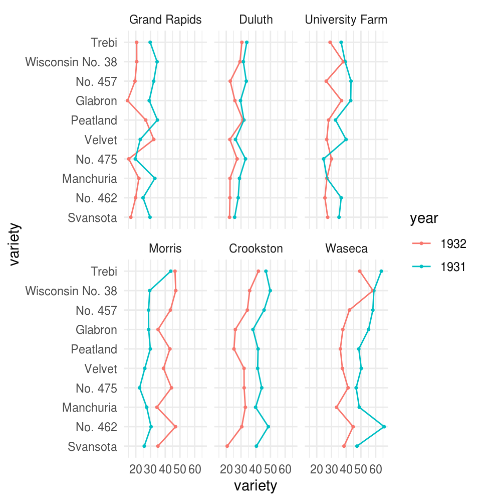

</div>

El peor lado de este punto de vista consiste en restringirse a el análisis 
estadístico rutinario @cleveland93: aplicar las recetas y 
negarse a ver los datos de distinta manera (¡incluso pensar que esto puede 
sesgar los resultados, o que nos podría engañar!). El siguiente ejemplo muestra 
un caso grave y real (no simulado) de este análisis estadístico rutinario 
(tomado de @cleveland94).

A la derecha mostramos los resultados de un experimento de agricultura. Se 
cultivaron diez variedades de cebada en seis sitios de Minnesota, en $1921$ y 
$1932$. Este es uno de los primeros ejemplos en el que se aplicaron las ideas de 
Fisher en cuanto a diseño de experimentos.

En primer lugar, observamos:

* Los niveles generales de rendimiento varían mucho dependiendo del sitio: hay 
mejores y peores sitios.  
* Los rendimientos son típicamente más altos en 1931 que en 1932. Sin embargo, 
Morris es anómalo en cuanto a que el patrón no es consistente con el resto de 
los sitios.
* Hay variación considerable de las variedades dentro de cada sitio. ¿Existe 
alguna variedad que sea mejor que otras?
* Notamos claramente la anomalía en las diferencias: en el sitio Morris, el año 
1932 fue mejor que el de 1931.

Estos datos fueron reanalizados desde la época en la que se recolectaron por 
muchos agrónomos. Hasta muy recientemente se detectó la anomalía en el 
comportamiento de los años en el sitio Morris, el cual es evidente en la 
gráfica. Investigación posterior ha mostrado que es muy plausible que en algún 
momento alguien volteó las etiquetas de los años en este sitio.

Este ejemplo muestra, en primer lugar, que la visualización es crucial en el 
proceso de análisis de datos: sin ella estamos expuestos a no encontrar aspectos 
importantes de los datos (errores) que deben ser discutidos - aún cuando nuestra 
receta de análisis no considere estos aspectos. Ninguna receta puede aproximarse 
a describir todas las complejidades y detalles en un conjunto de datos de tamaño 
razonable (este ejemplo, en realidad, es chico). Sin embargo, la visualización 
de datos, por su enfoque menos estructurado, y el hecho de que se apoya en un 
medio con un “ancho de banda” mayor al que puede producir un cierto número de 
cantidades resumen, es ideal para investigar estos aspectos y detalles.

<div style="clear:both"></div>

### Visualización popular de datos {-}

Publicaciones populares (periódicos, revistas, sitios internet) muchas veces 
incluyen visualización de datos como parte de sus artículos o reportajes. En 
general siguen el mismo patrón que en la visión tradicionalista de la 
estadística: sirven más para divertir que para explicar, tienden a explicar 
ideas simples y conjuntos chicos de datos, y se consideran como una “ayuda” 
para los “lectores menos sofisticados”. Casi siempre se trata de gráficas 
triviales (muchas veces con errores graves) que no aportan mucho a artículos que 
tienen un nivel de complejidad mucho mayor (es la filosofía: lo escrito para el 
adulto, lo graficado para el niño).


## Teoría de visualización de datos

Existe teoría fundamentada acerca de la visualización. Después del trabajo 
pionero de Tukey, los principios e indicadores de Tufte se basan en un estudio 
de la historia de la graficación y ejercicios de muestreo de la práctica gráfica 
a lo largo de varias disciplinas (¿cuáles son las mejores gráficas? ¿por qué? 
El trabajo de Cleveland es orientado a la práctica del análisis de datos 
(¿cuáles gráficas nos han ayudado a mostrar claramente los resultados del 
análisis?), por una parte, y a algunos estudios de percepción visual.

En resumen, hablaremos de las siguientes guías:

#### Principios generales del diseño analítico {-}
Aplicables a una presentación o análisis completos, y como guía para construir 
nuevas visualizaciones [@tufte06].


```principios
**Principio 1.** Muestra comparaciones, contrastes, diferencias.  
**Principio 2.** Muestra causalidad, mecanismo, explicación, estructura
sistemática.  
**Principio 3.** Muestra datos multivariados, es decir, más de una o dos
variables.  
**Principio 4.** Integra palabras, números, imágenes y diagramas.  
**Principio 5.** Describe la totalidad de la evidencia. Muestra fuentes usadas 
y problemas relevantes.  
**Principio 6.** Las presentaciones analíticas, a fin de cuentas, se sostienen o 
caen dependiendo de la calidad, relevancia e integridad de su contenido.
```

#### Técnicas de visualización {-} 
Esta categoría incluye técnicas específicas que dependen de la forma de nuestros 
datos y el tipo de pregunta que queremos investigar (@tukey77, @cleveland93, 
@cleveland94, @tufte06).


```tiposgraficas

**Tipos de gráficas:** cuantiles, histogramas, caja y brazos, gráficas de 
dispersión, puntos/barras/ líneas, series de tiempo.  
**Técnicas para mejorar gráficas:** Transformación de datos, transparencia, 
vibración, banking 45, suavizamiento y bandas de confianza.  
**Pequeños múltiplos**  
```

#### Indicadores de calidad gráfica {-}
Aplicables a cualquier gráfica en particular. Estas son guías concretas y 
relativamente objetivas para evaluar la calidad de una gráfica [@tufte86].


```indicadores
**Integridad Gráfica.** El factor de engaño, es decir, la distorsión gráfica de
las cantidades representadas, debe ser mínimo.  
**Chartjunk.** Minimizar el uso de decoración gráfica que interfiera con la 
interpretación de los datos: 3D, rejillas, rellenos con patrones.  
**Tinta de datos.** Maximizar la proporción de tinta de datos vs. tinta total de 
la gráfica. *For non-data- ink, less is more. For data-ink, less is a bore.*  
**Densidad de datos.** Las mejores gráficas tienen mayor densidad de datos, que 
es la razón entre el tamaño del conjunto de datos y el área de la gráfica. Las 
gráficas se pueden encoger mucho. Percepción visual. Algunas tareas son más 
fáciles para el ojo humano que otras [@cleveland94].
```

## Factor de engaño y Chartjunk 

<div style= "float:right;position: relative; top: -10px;width:140px">

</div>

El **factor de engaño** es el cociente entre el efecto mostrado en una gráfica y 
el efecto correspondiente en los datos. Idealmente, el factor de engaño debe ser 
1 (ninguna distorsión).  

El **chartjunk** son aquellos elementos gráficos que no corresponden a variación 
de datos, o que entorpecen la interpretación de una gráfica.  
Estos son los indicadores de calidad más fáciles de entender y aplicar, y 
afortunadamente cada vez son menos comunes.

Un diseño popular que califica como chartjunk y además introduce factores de 
engaño es el pie de 3D. En la gráfica de la derecha, podemos ver como la 
rebanada C se ve más grande que la rebanada A, aunque claramente ese no es el 
caso (factor de engaño). La razón es la variación en la perspectiva que no 
corresponde a variación en los datos (chartjunk).

#### Crítica gráfica: Gráfica de Pie {-}

Todavía elementos que pueden mejorar la comprensión de nuestra
gráfica de pie: se trata de la 
decodificiación que hay que hacer categoría - color - cuantificación. Podemos 
agregar las etiquetas como se muestra en la serie de la derecha, pero entonces: 
¿por qué no mostrar simplemente la tabla de datos? ¿qué agrega el pie a la 
interpretación?

La deficiencias en el pie se pueden ver claramente al intentar graficar más 
categorías (13). En el primer pie no podemos distinguir realmente cuáles son 
las categorías grandes y cuáles las chicas, y es muy difícil tener una imagen 
mental clara de estos datos. Agregar los porcentajes ayuda, pero entonces, otra 
vez, preguntamos cuál es el propósito del pie. La tabla de la izquierda hace 
todo el trabajo (una vez que ordenamos las categrías de la más grande a la más 
chica). Es posible hacer una gráfica de barras como la de abajo a la izquierda.

<div style="clear:both"></div>

<div style= "float:left;top: -0px;width:350px">

</div>

*** 

Hay otros tipos de **chartjunk** comunes: uno es la textura de barras, por 
ejemplo. El efecto es la producción de un efecto moiré que es desagradable y 
quita la atención de los datos, como en la gráfica de barras de abajo. Otro 
común son las rejillas, como mostramos en las gráficas de la izquierda. Nótese
como en estos casos hay efectos ópticos no planeados que degradan la percepción 
de los patrones en los datos.


## Pequeños múltiplos y densidad gráfica 

La densidad de una gráfica es el tamaño del conjunto de datos que se grafica 
comparado con el área total de la gráfica. En el siguiente ejemplo, graficamos 
en logaritmo-10 de cabezas de ganado en Francia (cerdos, res, ovejas y 
caballos). La gráfica de la izquierda es pobre en densidad pues sólo representa 
4 datos. La manera más fácil de mejorar la densidad es hacer más chica la 
gráfica:

<div style= "width=450px">

</div>

La razón de este encogimiento es una que tiene qué ver con las oportunidades perdidas de una gráfica grande. Si repetimos este mismo patrón (misma escala, mismos tipos de ganado) para distintos países obtenemos la siguiente gráfica:

<div style= "float:left;top: -10px;width:500px">


</div>

Esta es una gráfica de puntos. Es útil como sustituto de una gráfica de barras, 
y es superior en el sentido de que una mayor proporción de la tinta que se usa 
es tinta de datos. Otra vez, mayor proporción de tinta de datos representa más 
oportunidades que se pueden capitalizar, como muestra la gráfica de punto y 
líneas que mostramos al principio (rendimiento en campos de cebada).

<div style="clear:both"></div>

#### Más pequeños múltiplos {-}

Los pequeños múltiplos presentan oportunidades para mostrar más acerca
de nuestro problema de interés. Consideramos por ejemplo la relación
de radiación solar y niveles de ozono. Podemos ver que si incluimos
una variable adicional (velocidad del viento) podemos entender más
acerca de la relación de radiación solar y niveles de ozono:

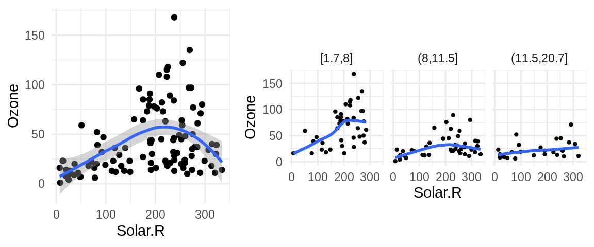


## Tinta de datos

Maximizar la proporción de tinta de datos en nuestras gráficas tiene beneficios 
inmediatos. La regla es: si hay tinta que no representa variación en los datos, 
o la eliminación de esa tinta no representa pérdidas de significado, esa tinta 
debe ser eliminada. El ejemplo más claro es el de las rejillas en gráficas y 
tablas:


<div style= "float:left;top: -10px">

</div>

¿Por qué usar grises en lugar de negros? La respuesta tiene qué ver con el 
principio de tinta de datos: si marcamos las diferencias sutil pero claramente, 
tenemos más oportunidades abiertas para hacer énfasis en lo que nos interesa: a 
una gráfica o tabla saturada no se le puede hacer más - es difícil agregar 
elementos adicionales que ayuden a la comprensión. Si comenzamos marcando con 
sutileza, entonces se puede hacer más. Los mapas geográficos son un buen ejemplo 
de este principio.

El espacio en blanco es suficientemente bueno para indicar las fronteras en una 
tabla, y facilita la lectura:


Para un ejemplo del proceso de rediseño de una tabla, ver [aquí](https://www.darkhorseanalytics.com/blog/clear-off-the-table).

Finalmente, podemos ver un ejemplo que intenta incorporar los elementos del 
diseño analítico, incluyendo pequeños múltiplos:


## Decoración


## Percepción de escala 

Entre la percepción visual y la interpretación de una gráfica están implícitas 
tareas visuales específicas que las personas debemos realizar para ver 
correctamente la gráfica. En la década de los ochenta, William S. Cleveland y 
Robert McGill realizaron algunos experimentos identificando y clasificando estas 
tareas para diferentes tipos de gráficos [@cleveland84]. 
En estos, se le pregunta a la persona que compare dos valores dentro de una 
gráfica, por ejemplo, en dos barras en una gráfica de barras, o dos rebanadas de 
una gráfica de pie.


Los resultados de Cleveland y McGill fueron replicados por [Heer y Bostock en
2010](http://www.cs.kent.edu/~javed/class-P2P12F/papers-2012/PAPER2012-2010-MTurk-CHI.pdf) y los resultados se muestran en las gráficas de la abajo:

<div style= "float:left;top:-10px;width:400px">

</div>

<div style="clear:both"></div>


## Ejemplos: gráfica de Minard 

Concluimos esta sección con una gráfica que, aunque poco común, ejemplifica
los principios de una buena gráfica, y es reconocida como una de las mejores
visualizaciones de la historia.

> Una gráfica excelente, presenta datos interesantes de forma bien 
diseñada: es una cuestión de fondo, de diseño, y estadística... [Se] compone de 
ideas complejas comunicadas con claridad, precisión y eficiencia. ... [Es] lo 
que da al espectador la mayor cantidad de ideas, en el menor tiempo, con 
la menor cantidad de tinta, y en el espacio más pequeño. ... Es casi siempre 
multivariado. ... Una excelente gráfica debe decir la verdad acerca de los 
datos. (Tufte, 1983)

La famosa visualización de Charles Joseph Minard de la marcha de Napoleón sobre 
Moscú, ilustra los principios de una buena gráfica. Tufte señala que esta imagen 
"bien podría ser el mejor gráfico estadístico jamás dibujado", y sostiene que 
"cuenta una historia rica y coherente con sus datos multivariados, mucho más 
esclarecedora que un solo número que rebota en el tiempo". Se representan seis 
variables: el tamaño del ejército, su ubicación en una superficie bidimensional, 
la dirección del movimiento del ejército y la temperatura en varias fechas 
durante la retirada de Moscú".


Hoy en día Minard es reconocido como uno de los principales contribuyentes a la 
teoría de análisis de datos y creación de **infografías** con un fundamento 
estadístico.

Se grafican 6 variables: el número de tropas de Napoleón, la distancia, la 
temperatura, la ubicación (latitud y longitud), la dirección en que viajaban las 
tropas y la localización relativa a fechas específicas.

La gráfica de Minard, como la describe E.J. Marey, parece "desafiar la pluma del 
historiador con su brutal elocuencia", la combinación de datos del mapa, y la 
serie de tiempo, dibujados en 1869, "retratan una secuencia de pérdidas 
devastadoras que sufrieron las tropas de Napoleón en 1812". Comienza en la 
izquierda, en la frontera de Polonia y Rusia, cerca del río Niemen. La línea 
gruesa dorada muestra el tamaño de la Gran Armada (422,000) en el momento en que 
invadía Rusia en junio de 1812. 

El ancho de esta banda indica el tamaño de la armada en cada punto del mapa. En 
septiembre, la armada llegó a Moscú, que ya había sido saqueada y dejada 
desértica, con sólo 100,000 hombres. 

El camino del retiro de Napoleón desde Moscú está representado por la línea 
oscuara (gris) que está en la parte inferior, que está relacionada a su vez con 
la temperatura y las fechas en el diagrama de abajo. Fue un invierno muy frío, 
y muchos se congelaron en su salida de Rusia. Como se muestra en el mapa, cruzar 
el río Berezina fue un desastre, y el ejército de Napoleón logró regresar a 
Polonia con tan sólo 10,000 hombres. 

También se muestran los movimientos de las tropas auxiliaries, que buscaban 
proteger por atrás y por la delantera mientras la armada avanzaba hacia Moscú. 
La gráfica de Minard cuenta una historia rica y cohesiva, coherente con datos 
multivariados y con los hechos históricos, y que puede ser más ilustrativa que 
tan sólo representar un número rebotando a lo largo del tiempo.


# Introducción a R y al paquete ggplot2

##### ¿Qué es R? {-}

* R es un lenguaje de programación y un ambiente de cómputo estadístico
* R es software libre (no dice qué puedes o no hacer con el software), de código 
abierto (todo el código de R se puede inspeccionar - y se inspecciona).
* Cuando instalamos R, instala la base de R. Mucha de la funcionalidad adicional 
está en **paquetes** (conjunto de funciones y datos documentados) que la 
comunidad contribuye.

##### ¿Cómo entender R? {-}

* Hay una sesión de R corriendo. La consola de R es la interfaz 
entre R y nosotros. 
* En la sesión hay objetos. Todo en R es un objeto: vectores, tablas, 
 funciones, etc.
* Operamos aplicando funciones a los objetos y creando nuevos objetos.

##### ¿Por qué R? {-}

* R funciona en casi todas las plataformas (Mac, Windows, Linux e incluso en Playstation 3).
* R es un lenguaje de programación completo, permite desarrollo de DSLs.
* R promueve la investigación reproducible.
* R está actualizado gracias a que tiene una activa comunidad. Solo en CRAN hay 
cerca de $10,000$ paquetes (funcionalidad adicional de R creadas creada por la 
comunidad).
* R se puede combinar con otras herramientas.
* R tiene capacidades gráficas muy sofisticadas.
* R es popular ([Revolutions blog](http://blog.revolutionanalytics.com/popularity/)).

## R: primeros pasos  

Para comenzar se debe descargar [R](https://cran.r-project.org), esta descarga 
incluye R básico y un editor de textos para escribir código. Después de
descargar R se recomienda descargar 
[RStudio](https://www.rstudio.com/products/rstudio/download/) (gratis y libre).


Rstudio es un ambiente de desarrollo integrado para R: incluye una consola, 
un editor de texto y un conjunto de herramientas para administrar el espacio de
trabajo cuando se utiliza R. 

Algunos _shortcuts_ útiles en RStudio son:

**En el editor**  

* command/ctrl + enter: enviar código a la consola  
* ctrl + 2: mover el cursor a la consola

**En la consola**  

* flecha hacia arriba: recuperar comandos pasados  
* ctrl + flecha hacia arriba: búsqueda en los comandos  
* ctrl + 1: mover el cursor al editor  


### R en análisis de datos {-}

El estándar científico para contestar preguntas o tomar decisiones es uno que
se basa en el análisis de datos. Aquí consideramos técnicas cuantitativas: 
recolectar, organizar, entender, interpretar y extraer información de 
colecciones de datos predominantemente numéricos. Todas estas tareas son partes 
del análisis de datos, cuyo proceso podría resumirse con el siguiente diagrama:


Es importante la forma en que nos movemos dentro de estos procesos en el 
análisis de datos y en este curso buscamos dar herramientas para facilitar 
cumplir los siguientes principios:

1. **Reproducibilidad**. Debe ser posible reproducir el análisis en todos sus 
pasos, en cualquier momento.

2. **Claridad**. Los pasos del análisis deben estar documentados apropiadamente, 
de manera que las decisiones importantes puedan ser entendidas y explicadas 
claramente.

Dedicaremos las primeras sesiones a aprender herramientas básicas para poder 
movernos agilmente a lo largo de las etapas de análisis utilizando R y nos 
enfocaremos en los paquetes que forman parte del 
[tidyverse](http://tidyverse.org/).

### Paquetes y el Tidyverse {-}

La mejor manera de usar R para análisis de datos es aprovechando la gran
cantidad de paquetes que aportan funcionalidad adicional. Desde
Rstudio podemos instalar paquetes (Tools - > Install packages o usar la 
función `install.packages("nombre_paquete")`). 

Las siguientes lineas instalan los paquetes `devtools` y `readr`.


```r
install.packages("devtools")
install.packages("readr")
```

Una vez instalados, podemos cargarlos a nuestra sesión de R mediante `library`. Por ejemplo, para cargar el
paquete `readr` hacemos:


```r
print(read_csv)
#> function (file, col_names = TRUE, col_types = NULL, locale = default_locale(), 
#>     na = c("", "NA"), quoted_na = TRUE, quote = "\"", comment = "", 
#>     trim_ws = TRUE, skip = 0, n_max = Inf, guess_max = min(1000, 
#>         n_max), progress = show_progress(), skip_empty_rows = TRUE) 
#> {
#>     tokenizer <- tokenizer_csv(na = na, quoted_na = quoted_na, 
#>         quote = quote, comment = comment, trim_ws = trim_ws, 
#>         skip_empty_rows = skip_empty_rows)
#>     read_delimited(file, tokenizer, col_names = col_names, col_types = col_types, 
#>         locale = locale, skip = skip, skip_empty_rows = skip_empty_rows, 
#>         comment = comment, n_max = n_max, guess_max = guess_max, 
#>         progress = progress)
#> }
#> <bytecode: 0xa776168>
#> <environment: namespace:readr>

library(readr)
print(read_csv)
#> function (file, col_names = TRUE, col_types = NULL, locale = default_locale(), 
#>     na = c("", "NA"), quoted_na = TRUE, quote = "\"", comment = "", 
#>     trim_ws = TRUE, skip = 0, n_max = Inf, guess_max = min(1000, 
#>         n_max), progress = show_progress(), skip_empty_rows = TRUE) 
#> {
#>     tokenizer <- tokenizer_csv(na = na, quoted_na = quoted_na, 
#>         quote = quote, comment = comment, trim_ws = trim_ws, 
#>         skip_empty_rows = skip_empty_rows)
#>     read_delimited(file, tokenizer, col_names = col_names, col_types = col_types, 
#>         locale = locale, skip = skip, skip_empty_rows = skip_empty_rows, 
#>         comment = comment, n_max = n_max, guess_max = guess_max, 
#>         progress = progress)
#> }
#> <bytecode: 0xa776168>
#> <environment: namespace:readr>
```

`read_csv` es una función que aporta el paquete `readr`, que a su vez está incluido en el *tidyverse*. 

El paquete de arriba se instaló de CRAN, pero podemos instalar paquetes que 
están en otros repositorios (por ejemplo [BioConductor](https://www.bioconductor.org)) o paquetes que están en GitHub.


```r
library(devtools)
install_github("tereom/estcomp")
```

Los paquetes se instalan una sola vez, sin embargo, se deben cargar 
(ejecutar `library(readr)`) en cada sesión de R que los ocupemos.

En estas notas utilizaremos la colección de paquetes incluídos en el 
[tidyverse](https://www.tidyverse.org/). Estos paquetes de R están
diseñados para ciencia de datos, y para funcionar juntos como parte de un flujo
de trabajo. 

La siguiente imagen tomada de [Why the tidyverse](https://rviews.rstudio.com/2017/06/08/what-is-the-tidyverse/) (Joseph 
Rickert) indica que paquetes del tidyverse se utilizan para cada
etapa del análisis de datos.


```r
knitr::include_graphics("img/tidyverse.png")
```


### Recursos {-}
Existen muchos recursos gratuitos para aprender R, y resolver nuestras dudas:

* Buscar ayuda: Google, [StackOverflow](http://stackoverflow.com/questions/tagged/r) o [RStudio Community](https://community.rstudio.com).
* Para aprender más sobre un paquete o una función pueden visitar [Rdocumentation.org](http://www.rdocumentation.org/).    
* La referencia principal de estas notas es el libro [R for Data Science](http://r4ds.had.co.nz/)
de Hadley Wickham.  
* RStudio tiene una [Lista de recursos en línea](https://www.rstudio.com/online-learning/#r-programming).
* Para aprender programación avanzada en R, el libro gratuito 
[Advanced R](http://adv-r.had.co.nz) de Hadley Wickham es una buena referencia. 
En particular es conveniente leer la [guía de estilo](http://adv-r.had.co.nz/Style.html) (para todos: principiantes, intermedios y avanzados).  
* Para mantenerse al tanto de las noticias de la comunidad de R pueden seguir
#rstats en Twitter.  
* Para aprovechar la funcionalidad de [RStudio](https://github.com/rstudio/cheatsheets/raw/master/rstudio-ide.pdf).


## Visualización con ggplot2

Utilizaremos el paquete `ggplot2`, fue desarrollado por Hadley Wickham y es
una implementación de la gramática de las gráficas [@wilkinson2005]. Si no lo 
tienes instalado comienza instalando el paquete `ggplot2` o el `tidyverse` que 
lo incluye.

#### Gráficas de dispersión {-}


```r
library(tidyverse) # Cargamos el paquete en nuestra sesión
```

Usaremos el conjunto de datos `election_sub_2012` que se incluye en el paquete
`estcomp`, puedes encontrar información de esta base de datos tecleando
`?election_sub_2012`.


```r
library(estcomp)

data(election_sub_2012)
?election_sub_2012
glimpse(election_sub_2012)
#> Observations: 1,500
#> Variables: 23
#> $ state_code      <chr> "19", "30", "09", "07", "09", "27", "20", "15", …
#> $ state_name      <chr> "Nuevo León", "Veracruz", "Ciudad de México", "C…
#> $ state_abbr      <chr> "NL", "VER", "CDMX", "CHPS", "CDMX", "TAB", "OAX…
#> $ district_loc_17 <int> 20, 30, 27, 5, 26, 21, 15, 43, 4, 19, 17, 9, 9, …
#> $ district_fed_17 <int> 7, 11, 22, 5, 15, 6, 3, 7, 4, 5, 6, 4, 1, 1, 3, …
#> $ polling_id      <int> 90532, 134417, 32160, 15456, 31925, 122541, 9451…
#> $ section         <int> 347, 1775, 2705, 1121, 4358, 502, 37, 826, 2207,…
#> $ region          <chr> "noreste", "este", "centrosur", "suroeste", "cen…
#> $ polling_type    <chr> "B-C", "B-C", "B-C", "B-C", "B-C", "B-C", "B-C",…
#> $ section_type    <chr> "U", "U", "U", "U", "U", "U", "M", NA, "U", "M",…
#> $ pri_pvem        <int> 150, 146, 103, 135, 108, 102, 121, 157, 134, 187…
#> $ pan             <int> 111, 52, 43, 33, 95, 27, 60, 94, 40, 128, 53, 56…
#> $ panal           <int> 12, 4, 10, 10, 4, 4, 8, 16, 4, 10, 0, 12, 8, 1, …
#> $ prd_pt_mc       <int> 78, 226, 240, 237, 181, 290, 141, 158, 90, 63, 6…
#> $ otros           <int> 1, 4, 4, 7, 6, 14, 1, 8, 8, 11, 2, 14, 7, 12, 48…
#> $ total           <int> 352, 432, 400, 422, 394, 437, 331, 433, 276, 399…
#> $ nominal_list    <int> 675, 636, 688, 672, 522, 698, 596, 716, 506, 584…
#> $ pri_pvem_pct    <dbl> 43, 34, 26, 32, 27, 23, 37, 36, 49, 47, 42, 42, …
#> $ pan_pct         <dbl> 32, 12, 11, 8, 24, 6, 18, 22, 14, 32, 50, 12, 16…
#> $ panal_pct       <dbl> 3, 1, 2, 2, 1, 1, 2, 4, 1, 3, 0, 3, 3, 0, 28, 0,…
#> $ prd_pt_mc_pct   <dbl> 22, 52, 60, 56, 46, 66, 43, 36, 33, 16, 6, 40, 5…
#> $ otros_pct       <dbl> 0, 1, 1, 2, 2, 3, 0, 2, 3, 3, 2, 3, 2, 3, 13, 8,…
#> $ winner          <chr> "pri_pvem", "prd_pt_mc", "prd_pt_mc", "prd_pt_mc…
```

Comencemos con nuestra primera gráfica:


```r
ggplot(data = election_sub_2012) +
    geom_point(mapping = aes(x = total, y = prd_pt_mc))
```

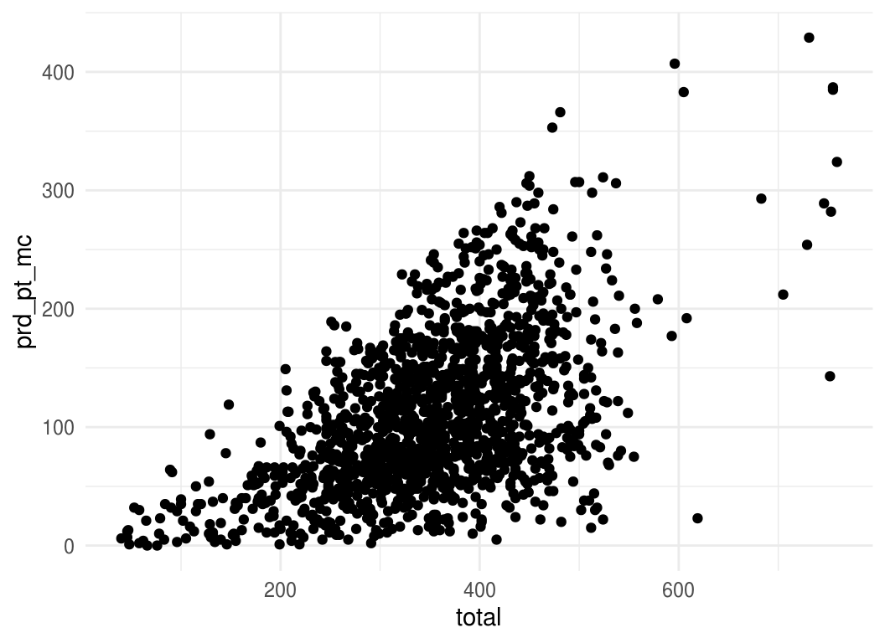

En `ggplot2` se inicia una gráfica con la instrucción `ggplot()`, debemos 
especificar explicitamente que base de datos usamos, este es el primer argumento 
en la función `ggplot()`. Una vez que creamos la base añadimos 
*capas*, y dentro de *aes()* escribimos las variables que queremos
graficar y el atributo de la gráfica al que queremos mapearlas. 

La función `geom_point()` añade una capa de puntos, hay muchas funciones
*geometrías* incluídas en `ggplot2`: `geom_line()`, `geom_boxplot()`, 
`geom_histogram`,... Cada una acepta distintos argumentos para mapear las 
variables en los datos a características estéticas de la gráfica. En el ejemplo 
de arriba mapeamos `displ` al eje x, `prd_pt_mc` al eje y, pero `geom_point()` nos 
permite representar más variables usando la forma, color y/o tamaño del punto. 
Esta flexibilidad nos permite entender o descubrir patrones más interesantes en 
los datos.


```r
ggplot(election_sub_2012) +
    geom_point(aes(x = total, y = prd_pt_mc, color = polling_type))
```

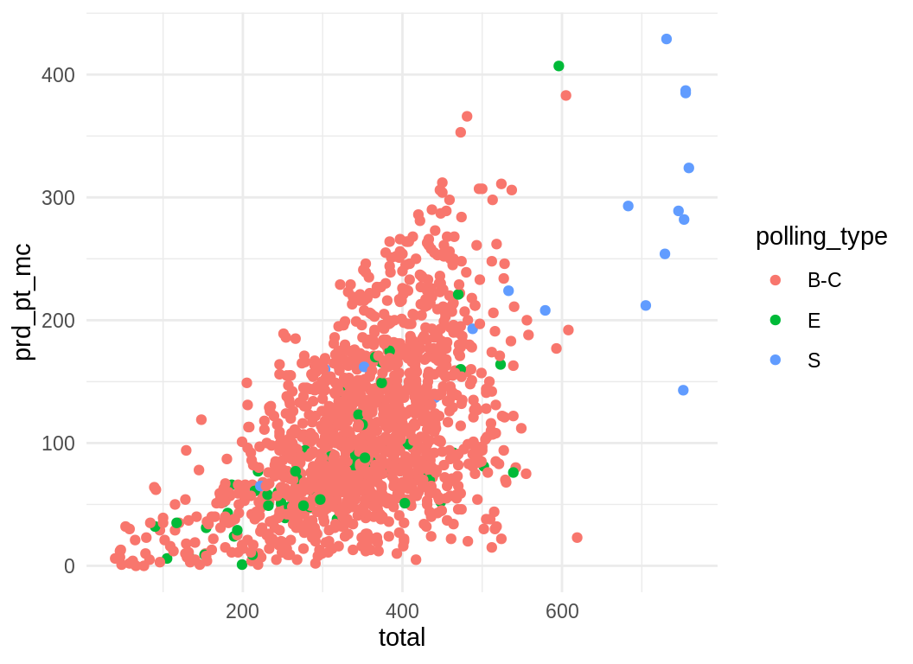

 Experimenta con los _aesthetics_ color (color), 
tamaño (size) y forma (shape).

*  ¿Qué diferencia hay entre las variables categóricas y las continuas?

*  ¿Qué ocurre cuando combinas varios _aesthetics_?

El mapeo de las propiedades estéticas se denomina escalamiento y depende del 
tipo de variable, las variables discretas (por ejemplo, tipo de casilla, región, 
estado) se mapean a distintas escalas que las variables continuas (variables 
numéricas como voto por un partido, lista nominal, etc.), los *defaults* de 
escalamiento para algunos atributos son (los escalamientos se pueden modificar):


aes       |Discreta      |Continua  
----------|--------------|---------
Color (`color`)|Arcoiris de colores         |Gradiente de colores  
Tamaño (`size`)  |Escala discreta de tamaños  |Mapeo lineal entre el área y el valor  
Forma (`shape`)    |Distintas formas            |No aplica
Transparencia (`alpha`) | No aplica | Mapeo lineal a la transparencia   

Los *_geoms_* controlan el tipo de gráfica


```r
p <- ggplot(election_sub_2012, aes(x = total, y = prd_pt_mc))
p + geom_line()
```

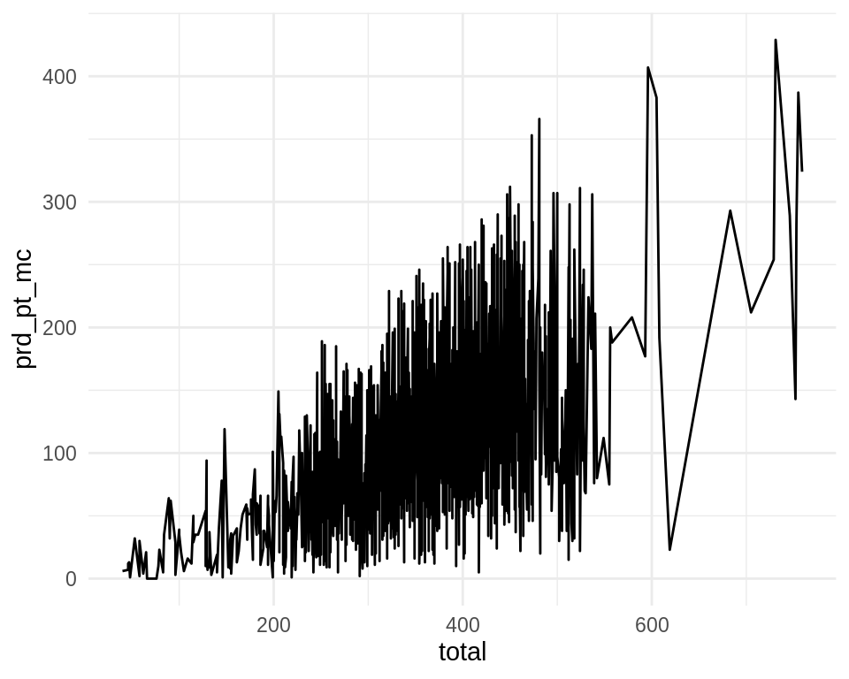

¿Qué problema tiene la siguiente gráfica?


```r
p <- ggplot(election_sub_2012, aes(x = pan_pct, y = prd_pt_mc_pct))
p + geom_point(size = 0.8) 
```

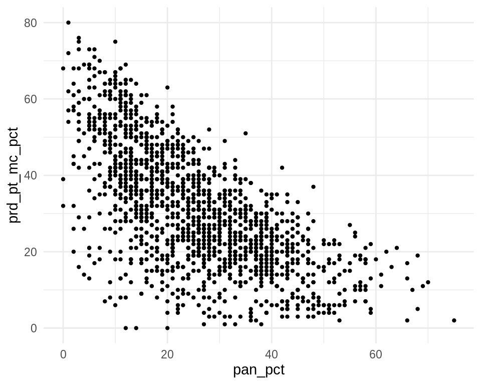

```r
p + geom_jitter(size = 0.8) 
```

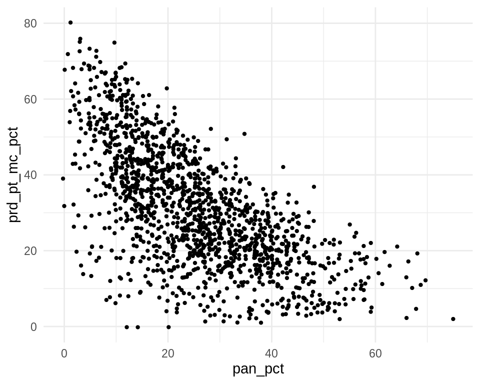

 ¿Cómo podemos mejorar la siguiente gráfica?


```r
ggplot(election_sub_2012, aes(x = state_abbr, y = prd_pt_mc_pct)) +
    geom_point(size = 0.8)
```

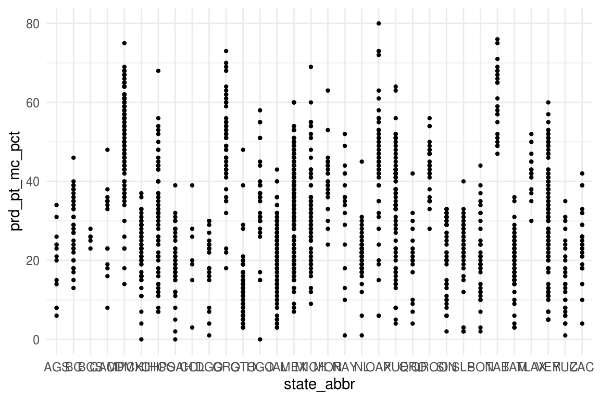

Intentemos reodenar los niveles de la variable clase


```r
ggplot(election_sub_2012, aes(x = reorder(state_abbr, prd_pt_mc), 
    y = prd_pt_mc)) +
    geom_point(size = 0.8)
```

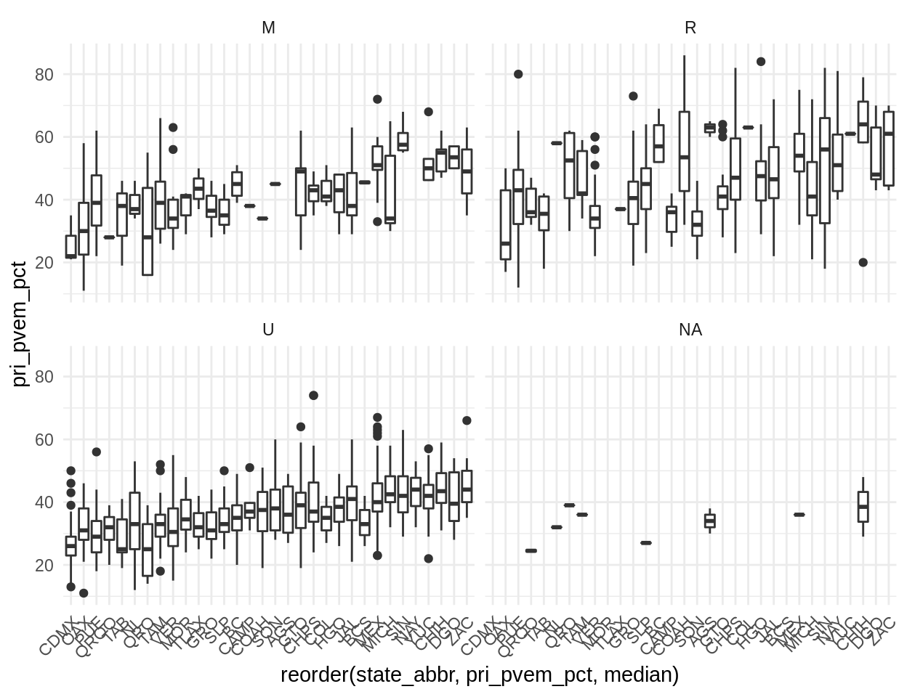

Podemos probar otros geoms.


```r
ggplot(election_sub_2012, aes(x = reorder(state_abbr, prd_pt_mc), 
    y = prd_pt_mc)) +
    geom_jitter(size = 0.8)
```

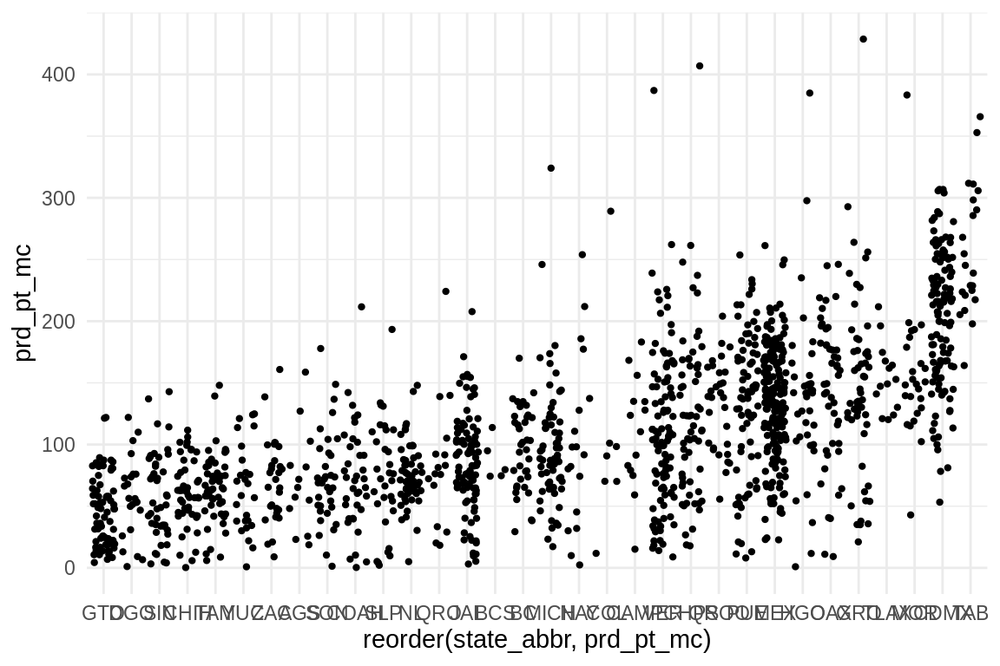

```r

ggplot(election_sub_2012, aes(x = reorder(state_abbr, prd_pt_mc), 
    y = prd_pt_mc)) +
    geom_boxplot()
```

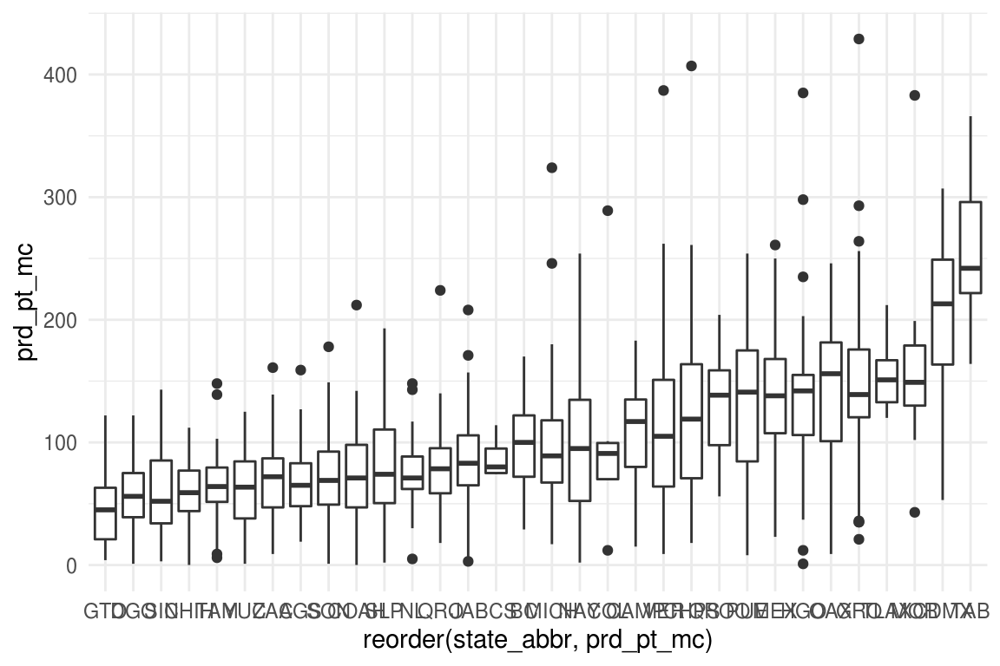

También podemos usar más de un geom!


```r
ggplot(election_sub_2012, aes(x = reorder(state_abbr, prd_pt_mc), 
    y = prd_pt_mc)) +
    geom_jitter(size = 0.8) +
    geom_boxplot()
```

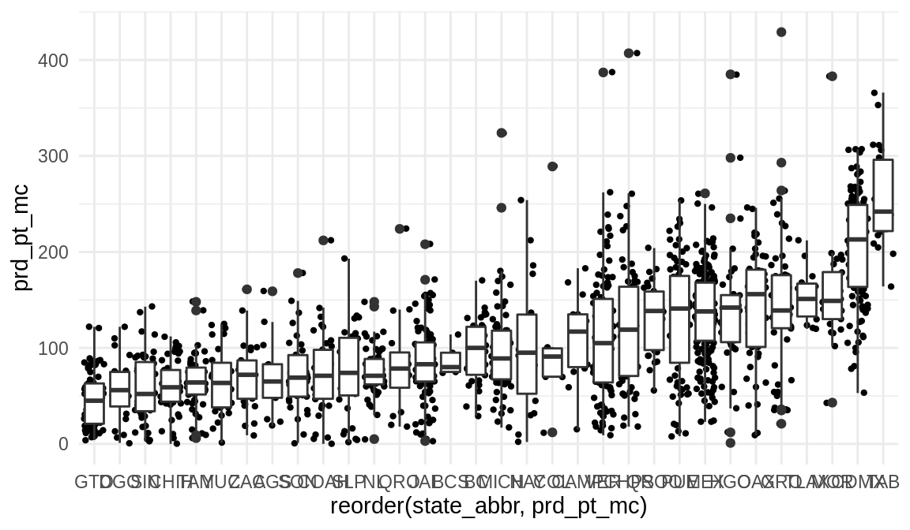

Y mejorar presentación:


```r
ggplot(election_sub_2012, aes(x = reorder(state_abbr, prd_pt_mc), 
    y = prd_pt_mc)) +
    geom_jitter(alpha = 0.6, size = 0.8) +
    geom_boxplot(outlier.color = NA) +
    theme(axis.text.x = element_text(angle = 45, hjust = 1)) +
    labs(title = "Votos por casilla y estado", 
        subtitle = "PRD-PT-MC", x = "estado", y = "total de votos")
```


 Lee la ayuda de _reorder_ y repite las gráficas 
anteriores ordenando por la mediana de _prd_pt_mc_.

* ¿Cómo harías
para graficar los puntos encima de las cajas de boxplot?

#### Paneles {-}
Ahora veremos como hacer páneles de gráficas, la idea es hacer varios múltiplos 
de una gráfica donde cada múltiplo representa un subconjunto de los datos, es 
una práctica muy útil para explorar relaciones condicionales.

En ggplot podemos usar _facet\_wrap()_ para hacer paneles dividiendo los datos 
de acuerdo a las categorías de una sola variable


```r
ggplot(election_sub_2012, aes(x = reorder(state_abbr, pri_pvem_pct, median), 
    y = pri_pvem_pct)) + 
    geom_boxplot() +
    facet_wrap(~ section_type) +
    theme(axis.text.x = element_text(angle = 45, hjust = 1))
```

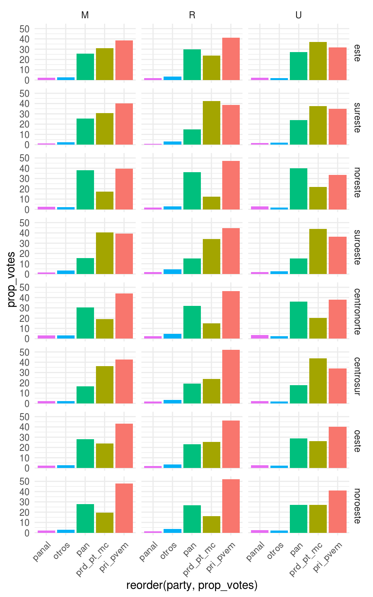

Podemos eliminar los NA. Veremos la función `filter()` en la próxima sesión.


```r
ggplot(filter(election_sub_2012, !is.na(section_type)), 
    aes(x = reorder(state_abbr, pri_pvem_pct, median), y = pri_pvem_pct)) + 
    geom_boxplot() +
    facet_wrap(~ section_type) +
    theme(axis.text.x = element_text(angle = 45, hjust = 1))
```

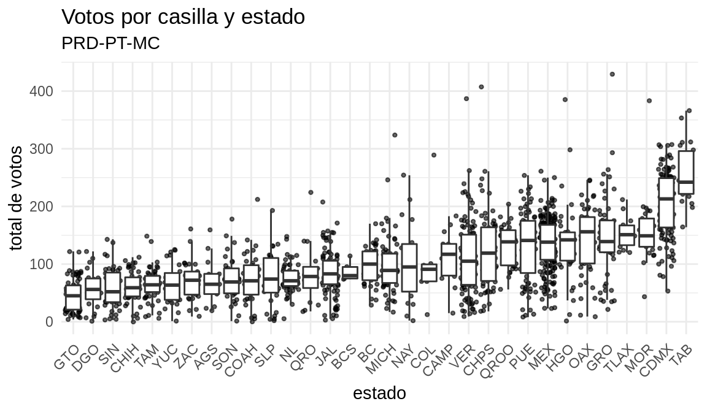

También podemos hacer una cuadrícula de $2$ dimensiones usando 
`facet\_grid(filas~columnas)`


```r
# Veremos como manipular datos en las próximas clases
election_region_2012 <- election_2012 %>% 
    group_by(region, section_type) %>% 
    summarise_at(vars(pri_pvem:total), sum) %>% 
    mutate_at(vars(pri_pvem:otros), .funs = ~ 100 * ./total) %>% 
    ungroup() %>% 
    mutate(region = reorder(region, pri_pvem)) %>%
    gather(party, prop_votes, pri_pvem:otros) %>% 
    filter(!is.na(section_type))

ggplot(election_region_2012, aes(x = reorder(party, prop_votes), 
    y = prop_votes, fill = reorder(party, -prop_votes))) +
    geom_col(show.legend = FALSE) +
    facet_grid(region ~ section_type) +
    theme(axis.text.x = element_text(angle = 45, hjust = 1)) 
```

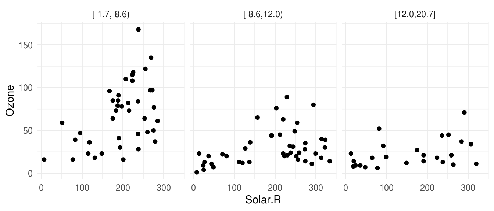

Los páneles pueden ser muy útiles para entender relaciones en nuestros datos. En 
la siguiente gráfica es difícil entender si existe una relación entre radiación
solar y ozono.


```r
data(airquality)
ggplot(airquality, aes(x = Solar.R, y = Ozone)) + 
  geom_point() 
#> Warning: Removed 42 rows containing missing values (geom_point).
```

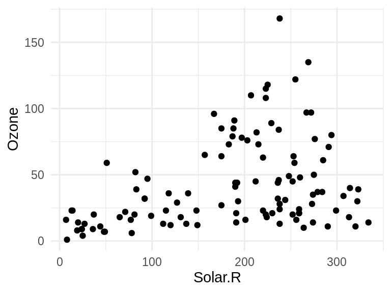

Veamos que ocurre si realizamos páneles separando por velocidad del viento.


```r
library(Hmisc)
airquality$Wind.cat <- cut2(airquality$Wind, g = 3) 
ggplot(airquality, aes(x = Solar.R, y = Ozone)) + 
  geom_point() +
  facet_wrap(~ Wind.cat)
```

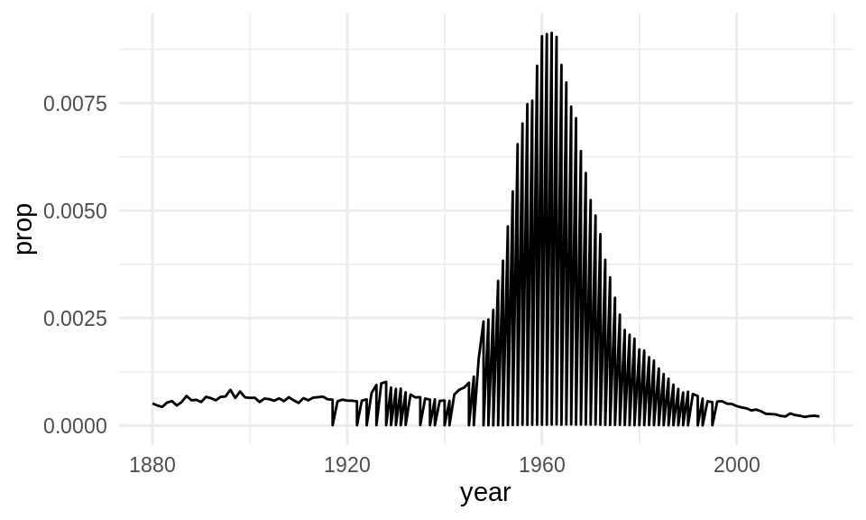

Podemos agregar un suavizador (loess) para ver mejor la relación de las 
variables en cada panel.


```r
ggplot(airquality, aes(x = Solar.R, y = Ozone)) + 
  geom_point() +
  facet_wrap(~ Wind.cat) + 
  geom_smooth(method = "lm")
```

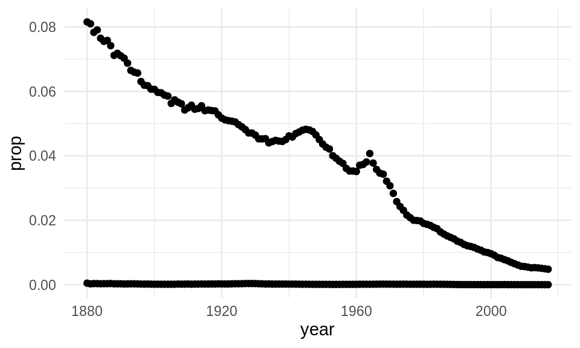

Como vimos en el caso de los resultados electorales por región, en ocasiones es 
necesario realizar transformaciones u obtener subconjuntos de los datos para 
poder responder preguntas de nuestro interés.


```r
library(dplyr)
library(babynames)
glimpse(babynames)
#> Observations: 1,924,665
#> Variables: 5
#> $ year <dbl> 1880, 1880, 1880, 1880, 1880, 1880, 1880, 1880, 1880, 1880,…
#> $ sex  <chr> "F", "F", "F", "F", "F", "F", "F", "F", "F", "F", "F", "F",…
#> $ name <chr> "Mary", "Anna", "Emma", "Elizabeth", "Minnie", "Margaret", …
#> $ n    <int> 7065, 2604, 2003, 1939, 1746, 1578, 1472, 1414, 1320, 1288,…
#> $ prop <dbl> 0.07238359, 0.02667896, 0.02052149, 0.01986579, 0.01788843,…
```

Supongamos que queremos ver la tendencia del nombre "John", para ello debemos 
generar un subconjunto de la base de datos. ¿Qué ocurre en la siguiente gráfica?


```r
babynames_John <- filter(babynames, name == "Teresa")
ggplot(babynames_John, aes(x = year, y = prop)) +
  geom_line()
```


```r
ggplot(babynames_John, aes(x = year, y = prop, color = sex)) +
  geom_line()
```


La preparación de los datos es un aspecto muy importante del análisis y suele 
ser la fase que lleva más tiempo. Es por ello que el siguiente tema se enfocará 
en herramientas para hacer transformaciones de manera eficiente.


### Recursos {-}
* El libro *R for Data Science* [@r4ds] tiene un capítulo de visualización.
* Documentación con ejemplos en la página de 
[ggplot2](http://ggplot2.tidyverse.org/).
* Otro recurso muy útil es el 
[acordeón de ggplot](https://github.com/rstudio/cheatsheets/raw/master/data-visualization-2.1.pdf).  
* La teoría detrás de ggplot2 se explica en el libro de ggplot2 [@wickham2009],  
* Google, [stackoverflow](https://stackoverflow.com/questions/tagged/ggplot2) y
[RStudio Community](https://community.rstudio.com/tags/ggplot2) tienen un *tag* 
para preguntas relacionadas con ggplot2.  


