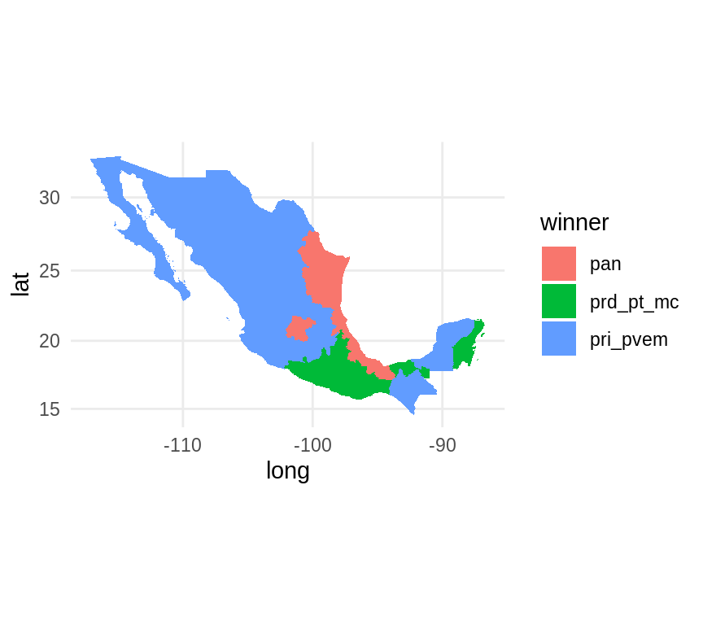
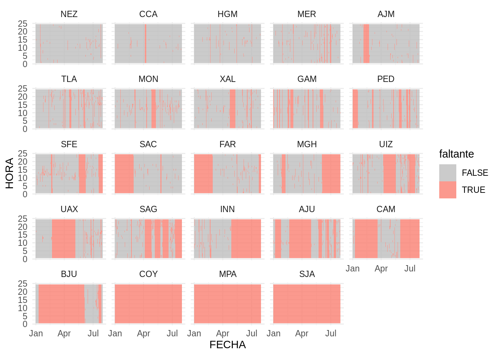
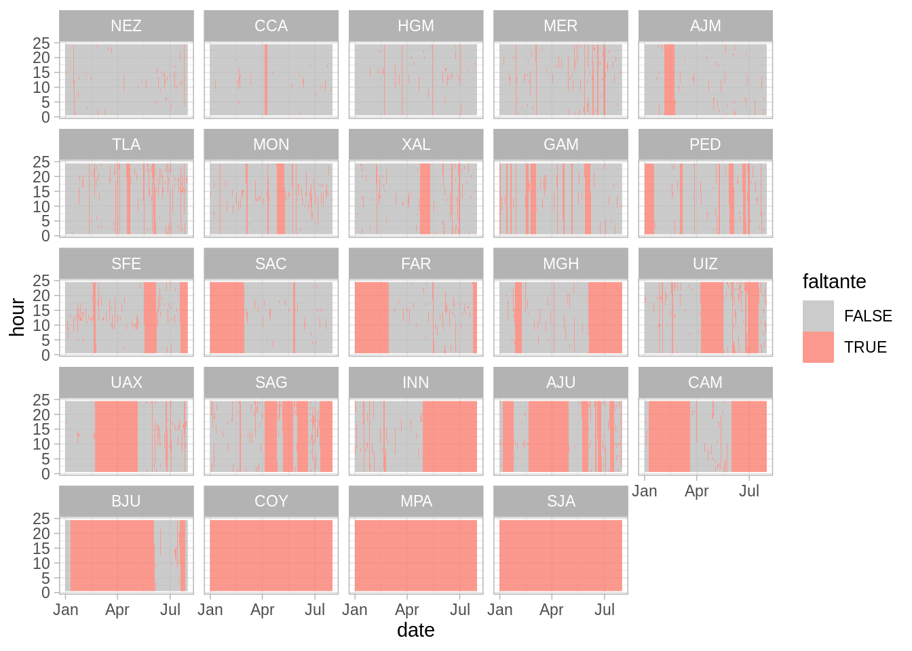
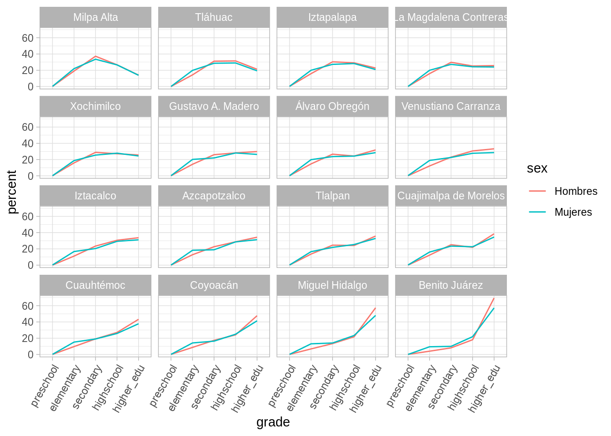

# Manipulación y agrupación de datos

En esta sección continuamos con la introducción a R para análisis de datos, 
en particular mostraremos herramientas de manipulación y transformación de 
datos. Trataremos los siguientes puntos:

* Transformación de datos.

* Estrategia separa-aplica-combina.

* Reestructura de datos y el principio de los datos limpios.

Es sabido que limpieza y preparación de datos ocupan gran parte del tiempo del 
análisis de datos ([Dasu y Johnson, 2003](http://onlinelibrary.wiley.com/book/10.1002/0471448354) 
y [NYT's ‘Janitor Work’ Is Key Hurdle to Insights](https://www.nytimes.com/2014/08/18/technology/for-big-data-scientists-hurdle-to-insights-is-janitor-work.html?mcubz=0)),
es por ello que vale la pena dedicar un tiempo a aprender técnicas que faciliten 
estas tareas, y entender que estructura en los datos es más conveniente para 
trabajar.

## Transformación de datos

Es sorprendente que una gran variedad de necesidades de transformación de datos
se pueden resolver con pocas funciones, en esta sección veremos 5 *verbos* que 
fueron diseñados para la tarea de transformación de datos y que comparten una 
filosofía en cuanto a su estructura. Estudiaremos las siguientes funciones:

* **filter**: obten un subconjunto de las filas de acuerdo a un criterio.
* **select**: selecciona columnas de acuerdo al nombre
* **arrange**: reordena las filas
* **mutate**: agrega nuevas variables
* **summarise**: reduce variables a valores (crear nuevas bases de datos con 
resúmenes de variables de la base original)

Estas funciones trabajan de manera similar, el primer argumento que reciben 
es un `data.frame`, los argumentos que siguen indican que operación se va a 
efectuar y el resultado es un nuevo `data.frame`.

Adicionalmente, se pueden usar con `group_by()` que veremos más adelante y que 
cambia el dominio de cada función, pasando de operar en el conjunto de datos
completos a operar en grupos.

### Datos {-}

Usaremos datos de población municipal incluidos en el paquete `mxmaps` y 
datos de educación, situación conyugal y hogar incluídos en el `estcomp`,
para tener acceso a ellos cargamos los paquetes correspondientes.


```r
library(tidyverse, warn.conflicts = FALSE, quietly = TRUE)
library(mxmaps)
library(estcomp)
```

Una alternatica a instalar `mxmaps` es leer únicamente los datos, se descargan 
del repositorio de GitHub y se cargan con la función `load()`.


```r
download.file("https://github.com/diegovalle/mxmaps/blob/master/data/df_mxmunicipio.RData?raw=true", "df_mxmunicipio.RData")
load("df_mxmunicipio.RData")
```

Observemos la estructura de los datos:


```r
df_mxmunicipio <- as_tibble(df_mxmunicipio)
glimpse(df_mxmunicipio)
#> Observations: 2,457
#> Variables: 18
#> $ state_code          <chr> "01", "01", "01", "01", "01", "01", "01", "0…
#> $ municipio_code      <chr> "001", "002", "003", "004", "005", "006", "0…
#> $ region              <chr> "01001", "01002", "01003", "01004", "01005",…
#> $ state_name          <chr> "Aguascalientes", "Aguascalientes", "Aguasca…
#> $ state_name_official <chr> "Aguascalientes", "Aguascalientes", "Aguasca…
#> $ state_abbr          <chr> "AGS", "AGS", "AGS", "AGS", "AGS", "AGS", "A…
#> $ state_abbr_official <chr> "Ags.", "Ags.", "Ags.", "Ags.", "Ags.", "Ags…
#> $ municipio_name      <chr> "Aguascalientes", "Asientos", "Calvillo", "C…
#> $ pop                 <int> 877190, 46464, 56048, 15577, 120405, 46473, …
#> $ pop_male            <int> 425731, 22745, 27298, 7552, 60135, 22490, 26…
#> $ pop_female          <int> 451459, 23719, 28750, 8025, 60270, 23983, 27…
#> $ afromexican         <dbl> 532, 3, 10, 0, 32, 3, 13, 13, 4, 0, 43, 1139…
#> $ part_afromexican    <dbl> 2791, 130, 167, 67, 219, 74, 578, 37, 59, 60…
#> $ indigenous          <dbl> 104125, 1691, 7358, 2213, 8679, 6232, 6714, …
#> $ part_indigenous     <dbl> 14209, 92, 2223, 191, 649, 251, 247, 84, 76,…
#> $ metro_area          <chr> "Aguascalientes", NA, NA, NA, "Aguascaliente…
#> $ long                <dbl> -102.29605, -102.08928, -102.71875, -102.300…
#> $ lat                 <dbl> 21.87982, 22.23832, 21.84691, 22.36641, 21.9…
glimpse(df_edu)
#> Observations: 7,371
#> Variables: 16
#> $ state_code     <chr> "01", "01", "01", "01", "01", "01", "01", "01", "…
#> $ municipio_code <chr> "001", "001", "001", "002", "002", "002", "003", …
#> $ region         <chr> "01001", "01001", "01001", "01002", "01002", "010…
#> $ state_name     <chr> "Aguascalientes", "Aguascalientes", "Aguascalient…
#> $ state_abbr     <chr> "AGS", "AGS", "AGS", "AGS", "AGS", "AGS", "AGS", …
#> $ municipio_name <chr> "Aguascalientes", "Aguascalientes", "Aguascalient…
#> $ sex            <chr> "Total", "Hombres", "Mujeres", "Total", "Hombres"…
#> $ pop_15         <dbl> 631064, 301714, 329350, 31013, 14991, 16022, 3867…
#> $ no_school      <dbl> 2.662329, 2.355211, 2.943677, 4.011221, 4.389300,…
#> $ preschool      <dbl> 0.17335801, 0.17466873, 0.17215728, 0.25795634, 0…
#> $ elementary     <dbl> 20.15247, 18.60073, 21.57401, 33.77938, 35.48129,…
#> $ secondary      <dbl> 29.31145, 30.37976, 28.33278, 39.21259, 37.45581,…
#> $ highschool     <dbl> 23.31824, 22.84912, 23.74799, 16.07068, 15.67607,…
#> $ higher_edu     <dbl> 24.291989, 25.560299, 23.130105, 6.355399, 6.3571…
#> $ other          <dbl> 0.09016518, 0.08020841, 0.09928647, 0.31277206, 0…
#> $ schoolyrs      <dbl> 10.211152, 10.380144, 10.056383, 7.854005, 7.6920…
```

### Filtrar {-}

Creamos una tabla de datos de juguete para mostrar el funcionamiento de cada
instrucción:


```r
df_ej <- tibble(sexo = c("mujer", "hombre", "mujer", "mujer", "hombre"), 
  estatura = c(1.65, 1.80, 1.70, 1.60, 1.67))
df_ej
#> # A tibble: 5 x 2
#>   sexo   estatura
#>   <chr>     <dbl>
#> 1 mujer      1.65
#> 2 hombre     1.8 
#> 3 mujer      1.7 
#> 4 mujer      1.6 
#> 5 hombre     1.67
```

El primer argumento de `filter()` es el nombre del `data frame`, los 
subsecuentes son las expresiones que indican que filas filtrar.


```r
filter(df_ej, sexo == "mujer")
#> # A tibble: 3 x 2
#>   sexo  estatura
#>   <chr>    <dbl>
#> 1 mujer     1.65
#> 2 mujer     1.7 
#> 3 mujer     1.6
filter(df_ej, estatura > 1.65 & estatura < 1.75)
#> # A tibble: 2 x 2
#>   sexo   estatura
#>   <chr>     <dbl>
#> 1 mujer      1.7 
#> 2 hombre     1.67
```

Algunos operadores importantes para filtrar son:  


```r
x > 1
x >= 1
x < 1
x <= 1
x != 1
x == 1
x %in% c("a", "b")
```


 Crea un subconjunto de los datos `df_mxmunicipio` que 
contenga únicamente los municipios de la CDMX (`state_abbr` es `CDMX`)

* Los municipios de Nuevo León con más de 200,000 habitantes.

* Los municipios donde más de la mitad la población se autoidentifica como
afromexicana o parte afromexicana.


#### Observación `==` y operadores booleanos {-}

Debemos tener cuidado al usar `==`, ¿qué devuelven las siguientes expresiones?


```r
sqrt(2) ^ 2 == 2
1/49 * 49 == 1
```

Los resultados de arriba se deben a que las computadoras 
usan aritmética de precisión finita:


```r
print(1/49 * 49, digits = 22)
#> [1] 0.9999999999999998889777
```

Para estos casos es útil usar la función `near()`


```r
near(sqrt(2) ^ 2,  2)
#> [1] TRUE
near(1 / 49 * 49, 1)
#> [1] TRUE
```

Los **operadores booleanos** también son convenientes para filtrar:


```r
# Conjuntos
a | b # a o b
a & b # a y b 
a & !b # a y no-b
xor(a, b)
```

El siguiente esquema nos ayuda a entender que hace cada operación, `x` está 
representada por el círculo del lado izquierdo y `y` por el círculo del lado
derecho, la parte sombreada muestra las regiones que selecciona el operador:

<div class="figure" style="text-align: center">

<p class="caption">(\#fig:unnamed-chunk-12)Operaciones booleanas, imagen del libro [r4ds](https://r4ds.had.co.nz/).</p>
</div>


#### Observación: faltantes `NA` {-}

Un caso común es cuando se desea eliminar o localizar los registros con
faltantes en una o más columnas de las tablas de datos, en R los datos faltantes
se expresan como `NA`, para seleccionar los registros con faltante en la 
variable `schoolyrs` de los datos `df_edu` resulta natural escribir:


```r
filter(df_edu, schoolyrs == NA)
#> # A tibble: 0 x 16
#> # … with 16 variables: state_code <chr>, municipio_code <chr>,
#> #   region <chr>, state_name <chr>, state_abbr <chr>,
#> #   municipio_name <chr>, sex <chr>, pop_15 <dbl>, no_school <dbl>,
#> #   preschool <dbl>, elementary <dbl>, secondary <dbl>, highschool <dbl>,
#> #   higher_edu <dbl>, other <dbl>, schoolyrs <dbl>
```

Y para eliminarlos


```r
filter(df_edu, schoolyrs != NA)
#> # A tibble: 0 x 16
#> # … with 16 variables: state_code <chr>, municipio_code <chr>,
#> #   region <chr>, state_name <chr>, state_abbr <chr>,
#> #   municipio_name <chr>, sex <chr>, pop_15 <dbl>, no_school <dbl>,
#> #   preschool <dbl>, elementary <dbl>, secondary <dbl>, highschool <dbl>,
#> #   higher_edu <dbl>, other <dbl>, schoolyrs <dbl>
```

en ambos casos nos devuelve una tabla vacía! 

El problema resulta de usar los operadores `==` y `!=`, pensemos ¿qué regresan 
las siguientes expresiones?


```r
5 + NA
NA / 2
sum(c(5, 4, NA))
mean(c(5, 4,  NA))
NA < 3
NA == 3
NA == NA
```

Las expresiones anteriores regresan `NA`, el hecho que la media de un vector 
que incluye `NA`s o su suma regrese `NA`s se debe a que por defecto en R se 
propagan los valores faltantes, esto es, si deconozco el valor de una de las 
componentes de un vector, también desconozco la suma del mismo; sin embargo, 
muchas funciones tienen un argumento _na.rm_ para eliminarlos,


```r
sum(c(5, 4, NA), na.rm = TRUE)
#> [1] 9
mean(c(5, 4, NA), na.rm = TRUE)
#> [1] 4.5
```

Aún queda pendiente como filtrarlos en una tabla, para esto veamos que el 
manejo de datos faltantes en R utiliza una lógica ternaria (como SQL):


```r
NA == NA
#> [1] NA
```

La expresión anterior puede resultar confusa, una manera de pensar en esto es
considerar los NA como *no sé*, por ejemplo si no se la edad de Juan y no se la 
edad de Esteban, la respuesta a ¿Juan tiene la misma edad que Esteban? es 
*no sé* (NA).


```r
edad_Juan <- NA
edad_Esteban <- NA
edad_Juan == edad_Esteban
#> [1] NA
edad_Jose <- 32
# Juan es menor que José?
edad_Juan < edad_Jose
#> [1] NA
```

Por tanto para determinar si un valor es faltante usamos la instrucción 
`is.na()`.


```r
is.na(NA)
#> [1] TRUE
```

Y finalmente podemos filtrar,


```r
filter(df_edu, is.na(schoolyrs))
```

### Seleccionar {-}

Elegir columnas de un conjunto de datos.


```r
df_ej
#> # A tibble: 5 x 2
#>   sexo   estatura
#>   <chr>     <dbl>
#> 1 mujer      1.65
#> 2 hombre     1.8 
#> 3 mujer      1.7 
#> 4 mujer      1.6 
#> 5 hombre     1.67
select(df_ej, sexo)
#> # A tibble: 5 x 1
#>   sexo  
#>   <chr> 
#> 1 mujer 
#> 2 hombre
#> 3 mujer 
#> 4 mujer 
#> 5 hombre
select(df_ej, -sexo)
#> # A tibble: 5 x 1
#>   estatura
#>      <dbl>
#> 1     1.65
#> 2     1.8 
#> 3     1.7 
#> 4     1.6 
#> 5     1.67
```


```r
select(df_ej, starts_with("s"))
select(df_ej, contains("x"))
```

 Ve la ayuda de select (`?select`) y escribe tres
maneras de seleccionar las variables del estado en los datos `df_mxmunicipio`.


### Ordenar {-}

Ordenar de acuerdo al valor de una o más variables:


```r
arrange(df_ej, sexo)
#> # A tibble: 5 x 2
#>   sexo   estatura
#>   <chr>     <dbl>
#> 1 hombre     1.8 
#> 2 hombre     1.67
#> 3 mujer      1.65
#> 4 mujer      1.7 
#> 5 mujer      1.6
arrange(df_ej, desc(estatura))
#> # A tibble: 5 x 2
#>   sexo   estatura
#>   <chr>     <dbl>
#> 1 hombre     1.8 
#> 2 mujer      1.7 
#> 3 hombre     1.67
#> 4 mujer      1.65
#> 5 mujer      1.6
```

 Ordena los municipios por población, de mayor a
menor.


* ¿Cuáles son los municipios con mayor disparidad de sexo (a total)?


* ¿Cuáles son los municipios con mayor disparidad de sexo (proporcional)?, 
elimina los municipios con menos de 5000 habitantes y repite.


### Mutar {-}

Mutar consiste en crear nuevas variables aplicando una función a columnas 
existentes:


```r
mutate(df_ej, estatura_cm = estatura * 100) 
#> # A tibble: 5 x 3
#>   sexo   estatura estatura_cm
#>   <chr>     <dbl>       <dbl>
#> 1 mujer      1.65         165
#> 2 hombre     1.8          180
#> 3 mujer      1.7          170
#> 4 mujer      1.6          160
#> 5 hombre     1.67         167
mutate(df_ej, estatura_cm = estatura * 100, estatura_in = estatura_cm * 0.3937) 
#> # A tibble: 5 x 4
#>   sexo   estatura estatura_cm estatura_in
#>   <chr>     <dbl>       <dbl>       <dbl>
#> 1 mujer      1.65         165        65.0
#> 2 hombre     1.8          180        70.9
#> 3 mujer      1.7          170        66.9
#> 4 mujer      1.6          160        63.0
#> 5 hombre     1.67         167        65.7
```

 Calcula el porcentaje de población indígena de cada
municipio y almacenalo en una nueva variable.


* Crea una nueva variable que muestre el cociente entre la población femenina y
masculina.


Hay muchas funciones que podemos usar para crear nuevas variables con `mutate()`, éstas deben cumplir ser funciones vectorizadas, es decir, reciben un vector de valores y devuelven un vector de la misma dimensión, por ejemplo
multiplicar columnas o por un escalar.

 ¿Cuáles de las siguientes funciones son adecuadas para
`mutate()`? Notar que hay escenarios en los que nos puede interesar usar funciones no vectorizadas con `mutate()` pero vale la pena entender que es lo
que regresan.  
    * mean, pmin, max, `*`, `^`, quantile


```r
df_ej_2 <- add_column(df_ej, peso_actual = c(60, 80, 70, 50, 65), 
    peso_anterior = c(66, 78, 73, 54, 61))

mutate(df_ej_2, peso_medio = mean(c(peso_actual, peso_anterior)))
mutate(df_ej_2, peso_menor = pmin(peso_actual, peso_anterior))
mutate(df_ej_2, peso_mayor = max(peso_actual, peso_anterior))
mutate(df_ej_2, estatura_sq = estatura ^ 2, bmi = peso_actual / estatura_sq)
```


### Summarise y resúmenes por grupo  {-}

Summarise sirve para crear nuevas bases de datos con resúmenes o agregaciones de los datos originales.


```r
summarise(df_ej, promedio = mean(estatura))
#> # A tibble: 1 x 1
#>   promedio
#>      <dbl>
#> 1     1.68
```

 Calcula la población total, indígena y afromexicana a 
total.


```r
summarise(df_mxmunicipio, indigeonous = sum(indigenous), 
    afromexican = sum(afromexican))
#> # A tibble: 1 x 2
#>   indigeonous afromexican
#>         <dbl>       <dbl>
#> 1    25694928     1381853
```

La mayor utlidad de `summarise` es cuando la combinamos con una variable de 
agrupación y esta combinación es la estrategia separa-aplica combina.

#### Separa-aplica-combina (_split-apply-combine_) {-}

Muchos problemas de análisis de datos involucran la aplicación de la estrategia
separa-aplica-combina [@plyr], esta consiste en romper un problema en pedazos
(de acuerdo a una variable de interés), operar sobre cada subconjunto de manera
independiente (ej. calcular la media de cada grupo, ordenar observaciones por 
grupo, estandarizar por grupo) y después unir los pedazos nuevamente. El 
siguiente diagrama ejemplifiaca el paradigma de divide-aplica-combina:

* **Separa** la base de datos original.  
* **Aplica** funciones a cada subconjunto.  
* **Combina** los resultados en una nueva base de datos.

<div class="figure" style="text-align: center">

<p class="caption">(\#fig:unnamed-chunk-34)Imagen de [Software Carpentry](https://swcarpentry.github.io/r-novice-gapminder/fig/12-plyr-fig1.png) con licencia [CC-BY 4.0](https://swcarpentry.github.io/r-novice-gapminder/LICENSE.html).</p>
</div>

Ahora, cuando pensamos como implementar la estrategia divide-aplica-combina es 
natural pensar en iteraciones, por ejemplo utilizar un ciclo `for` para recorrer cada grupo de interés y aplicar las funciones resumen, sin embargo la aplicación
de ciclos `for` desemboca en código difícil de entender por lo que preferimos 
trabajar con funciones creadas para estas tareas, usaremos el paquete 
`dplyr` que además de ser más claro suele ser más veloz.

Podemos hacer resúmenes por grupo, primero creamos una base de datos agrupada:


```r
by_sexo <- group_by(df_ej, sexo)
by_sexo
#> # A tibble: 5 x 2
#> # Groups:   sexo [2]
#>   sexo   estatura
#>   <chr>     <dbl>
#> 1 mujer      1.65
#> 2 hombre     1.8 
#> 3 mujer      1.7 
#> 4 mujer      1.6 
#> 5 hombre     1.67
```

y después operamos sobre cada grupo, creando un resumen a nivel grupo y uniendo
los subconjuntos en una base nueva:


 Calcula la población total por estado.


* Calcula la población indígena y afromexicana por estado.


* ¿Qué otros resúmenes puedes hacer para explorar los datos?


Algunas funciones útiles con _summarise_ son min(x), median(x), max(x), 
quantile(x, p), n(), sum(x), sum(x > 1), mean(x > 1), sd(x).

Por ejemplo, para cada área metropolitana: cuántos municipios engloba (`n()`), 
la población total (`sum()`) y al estado al que pertenece (`first()`).


```r
by_metro_area <- group_by(df_mxmunicipio, metro_area)
no_miss <- filter(by_metro_area, !is.na(metro_area))
pop_metro_area <- summarise(no_miss, state = first(state_abbr), 
    n_municipios = n(), pop_total = sum(pop))
head(pop_metro_area)
#> # A tibble: 6 x 4
#>   metro_area     state n_municipios pop_total
#>   <chr>          <chr>        <int>     <int>
#> 1 Acapulco       GRO              2    886975
#> 2 Acayucan       VER              3    120340
#> 3 Aguascalientes AGS              3   1044049
#> 4 Cancún         QROO             2    763121
#> 5 Celaya         GTO              3    635706
#> 6 Chihuahua      CHIH             3    918339
```


#### Operador pipeline {-}

En R, cuando uno hace varias operaciones es difícil leer y entender el 
código: 


```r
library(estcomp)

summarise(group_by(filter(election_2012, !is.na(section_type)), region,
    section_type), n = n(), pri_pvem = sum(pri_pvem), 
    prd_pt_mc = sum(prd_pt_mc), pan = sum(pan))
#> # A tibble: 24 x 6
#> # Groups:   region [8]
#>    region      section_type     n pri_pvem prd_pt_mc     pan
#>    <chr>       <chr>        <int>    <int>     <int>   <int>
#>  1 centronorte M             2071   331221    143225  228112
#>  2 centronorte R             5049   651507    211524  447886
#>  3 centronorte U             8940  1229241    653540 1171415
#>  4 centrosur   M             1839   324327    277470  126264
#>  5 centrosur   R             2541   495288    223978  181755
#>  6 centrosur   U            27515  3698793   4765575 1936586
#>  7 este        M             3158   462510    370352  306124
#>  8 este        R             6768   905078    521793  654839
#>  9 este        U            11403  1373876   1602217 1179497
#> 10 noreste     M             1259   176191     77062  169285
#> # … with 14 more rows
```

La dificultad radica en que usualmente los parámetros se asignan después del 
nombre de la función usando (). 

Una alternativa es ir almacenando las salidas en tablas de datos intermedias
pero esto resulta poco práctico porque: 1) almacenamos en el mismo objeto 
sobreescribiendo ó 2) terminamos con muchos objetos con nombres poco
significativos.

El operador *Forward Pipe* (`%>%`) cambia el orden en que se asignan los 
parámetros, de manera que un parámetro que precede a la función es enviado
("piped")  a la función:

* `x %>% f(y)` se vuelve `f(x, y)`,   
* `x %>% f(y) %>% g(z)` se vuelve `g(f(x, y), z)`. 

Es así que podemos reescribir el código para poder leer las 
operaciones que vamos aplicando de izquierda a derecha y de arriba hacia abajo.

Veamos como cambia el código del ejemplo:


```r
election_2012 %>% 
    filter(!is.na(section_type)) %>% 
    group_by(region, section_type) %>% 
    summarise(
        n = n(), 
        pri_pvem = sum(pri_pvem), 
        prd_pt_mc = sum(prd_pt_mc), 
        pan = sum(pan)
        ) 
#> # A tibble: 24 x 6
#> # Groups:   region [8]
#>    region      section_type     n pri_pvem prd_pt_mc     pan
#>    <chr>       <chr>        <int>    <int>     <int>   <int>
#>  1 centronorte M             2071   331221    143225  228112
#>  2 centronorte R             5049   651507    211524  447886
#>  3 centronorte U             8940  1229241    653540 1171415
#>  4 centrosur   M             1839   324327    277470  126264
#>  5 centrosur   R             2541   495288    223978  181755
#>  6 centrosur   U            27515  3698793   4765575 1936586
#>  7 este        M             3158   462510    370352  306124
#>  8 este        R             6768   905078    521793  654839
#>  9 este        U            11403  1373876   1602217 1179497
#> 10 noreste     M             1259   176191     77062  169285
#> # … with 14 more rows
```

podemos leer %>% como "_después_".

**Tip:** Un atajo para producir el operador pipeline `%>%` es 
shift + ctrl/cmd + M 

 Siguiendo con los datos `election_2012`, ¿Qué estados
tienen la mayor participación (esto es del total de votantes en la lista nominal
que porcentaje asistió a votar)? Tip: debes eliminar las casillas especiales  pues la lista nominal (`ln`) no está definida.


### Variables por grupo {-}

En ocasiones es conveniente crear variables por grupo, por ejemplo estandarizar
dentro de cada grupo z = (x - mean(x)) / sd(x). Para esto usamos `group_by()`
y `mutate()`.

Veamos un ejemplo:


```r
z_prd_pt_mc_state <- election_2012 %>%
    filter(total > 50, !is.na(section_type)) %>% 
    mutate(prd_pt_mc_pct = prd_pt_mc / total) %>% 
    group_by(state_abbr) %>% 
    mutate(
        n = n(),
        sd_prd_pt_mc = sd(prd_pt_mc_pct),
        mean_prd_pt_mc = mean(prd_pt_mc_pct),
        z_prd_pt_mc = (prd_pt_mc_pct - mean_prd_pt_mc) / sd_prd_pt_mc 
    )
```

### Verbos de dos tablas {-}

Muchas veces debemos reunir información que está almacenada a lo largo de 
muchas tablas, por ejemplo, si nos interesa conocer como se relaciona el año de 
escolaridad promedio (`schoolyrs` en el `df_edu`) con el porcentaje de
población indígena (`indigenous` en `df_mxmunicipios`), debemos poder *pegar*
las dos tablas.

Hay varias maneras de unir dos bases de datos y debemos pensar en el 
obejtivo:


```r
x <- tibble(name = c("John", "Paul", "George", "Ringo", "Stuart", "Pete"),
  instrument = c("guitar", "bass", "guitar", "drums", "bass",
     "drums"))

y <- tibble(name = c("John", "Paul", "George", "Ringo", "Brian"),
  band = c("TRUE", "TRUE", "TRUE",  "TRUE", "FALSE"))
x
#> # A tibble: 6 x 2
#>   name   instrument
#>   <chr>  <chr>     
#> 1 John   guitar    
#> 2 Paul   bass      
#> 3 George guitar    
#> 4 Ringo  drums     
#> 5 Stuart bass      
#> 6 Pete   drums
y
#> # A tibble: 5 x 2
#>   name   band 
#>   <chr>  <chr>
#> 1 John   TRUE 
#> 2 Paul   TRUE 
#> 3 George TRUE 
#> 4 Ringo  TRUE 
#> 5 Brian  FALSE

inner_join(x, y)
#> Joining, by = "name"
#> # A tibble: 4 x 3
#>   name   instrument band 
#>   <chr>  <chr>      <chr>
#> 1 John   guitar     TRUE 
#> 2 Paul   bass       TRUE 
#> 3 George guitar     TRUE 
#> 4 Ringo  drums      TRUE
left_join(x, y)
#> Joining, by = "name"
#> # A tibble: 6 x 3
#>   name   instrument band 
#>   <chr>  <chr>      <chr>
#> 1 John   guitar     TRUE 
#> 2 Paul   bass       TRUE 
#> 3 George guitar     TRUE 
#> 4 Ringo  drums      TRUE 
#> 5 Stuart bass       <NA> 
#> 6 Pete   drums      <NA>
semi_join(x, y)
#> Joining, by = "name"
#> # A tibble: 4 x 2
#>   name   instrument
#>   <chr>  <chr>     
#> 1 John   guitar    
#> 2 Paul   bass      
#> 3 George guitar    
#> 4 Ringo  drums
anti_join(x, y)
#> Joining, by = "name"
#> # A tibble: 2 x 2
#>   name   instrument
#>   <chr>  <chr>     
#> 1 Stuart bass      
#> 2 Pete   drums
```

Resumamos lo que observamos arriba:

<div class="mi-tabla">
Tipo | Acción
-----|-------
inner|Incluye únicamente las filas que aparecen tanto en x como en y
left |Incluye todas las filas en x y las filas de y que coincidan
semi |Incluye las filas de x que coincidan con y
anti |Incluye las filas de x que no coinciden con y
</div>


 Ahora tu turno, ¿cómo se relacionan los años de
escolaridad con el porcentaje de población indígena. Utiliza los datos 
`df_mxmunicipio` y `df_edu` para explorar la relación. ¿cuál es el `join`
adecuado? ¿de qué tamaño serán los datos finales?
 

```r
glimpse(df_edu)
#> Observations: 7,371
#> Variables: 16
#> $ state_code     <chr> "01", "01", "01", "01", "01", "01", "01", "01", "…
#> $ municipio_code <chr> "001", "001", "001", "002", "002", "002", "003", …
#> $ region         <chr> "01001", "01001", "01001", "01002", "01002", "010…
#> $ state_name     <chr> "Aguascalientes", "Aguascalientes", "Aguascalient…
#> $ state_abbr     <chr> "AGS", "AGS", "AGS", "AGS", "AGS", "AGS", "AGS", …
#> $ municipio_name <chr> "Aguascalientes", "Aguascalientes", "Aguascalient…
#> $ sex            <chr> "Total", "Hombres", "Mujeres", "Total", "Hombres"…
#> $ pop_15         <dbl> 631064, 301714, 329350, 31013, 14991, 16022, 3867…
#> $ no_school      <dbl> 2.662329, 2.355211, 2.943677, 4.011221, 4.389300,…
#> $ preschool      <dbl> 0.17335801, 0.17466873, 0.17215728, 0.25795634, 0…
#> $ elementary     <dbl> 20.15247, 18.60073, 21.57401, 33.77938, 35.48129,…
#> $ secondary      <dbl> 29.31145, 30.37976, 28.33278, 39.21259, 37.45581,…
#> $ highschool     <dbl> 23.31824, 22.84912, 23.74799, 16.07068, 15.67607,…
#> $ higher_edu     <dbl> 24.291989, 25.560299, 23.130105, 6.355399, 6.3571…
#> $ other          <dbl> 0.09016518, 0.08020841, 0.09928647, 0.31277206, 0…
#> $ schoolyrs      <dbl> 10.211152, 10.380144, 10.056383, 7.854005, 7.6920…
glimpse(df_mxmunicipio)
#> Observations: 2,457
#> Variables: 18
#> $ state_code          <chr> "01", "01", "01", "01", "01", "01", "01", "0…
#> $ municipio_code      <chr> "001", "002", "003", "004", "005", "006", "0…
#> $ region              <chr> "01001", "01002", "01003", "01004", "01005",…
#> $ state_name          <chr> "Aguascalientes", "Aguascalientes", "Aguasca…
#> $ state_name_official <chr> "Aguascalientes", "Aguascalientes", "Aguasca…
#> $ state_abbr          <chr> "AGS", "AGS", "AGS", "AGS", "AGS", "AGS", "A…
#> $ state_abbr_official <chr> "Ags.", "Ags.", "Ags.", "Ags.", "Ags.", "Ags…
#> $ municipio_name      <chr> "Aguascalientes", "Asientos", "Calvillo", "C…
#> $ pop                 <int> 877190, 46464, 56048, 15577, 120405, 46473, …
#> $ pop_male            <int> 425731, 22745, 27298, 7552, 60135, 22490, 26…
#> $ pop_female          <int> 451459, 23719, 28750, 8025, 60270, 23983, 27…
#> $ afromexican         <dbl> 532, 3, 10, 0, 32, 3, 13, 13, 4, 0, 43, 1139…
#> $ part_afromexican    <dbl> 2791, 130, 167, 67, 219, 74, 578, 37, 59, 60…
#> $ indigenous          <dbl> 104125, 1691, 7358, 2213, 8679, 6232, 6714, …
#> $ part_indigenous     <dbl> 14209, 92, 2223, 191, 649, 251, 247, 84, 76,…
#> $ metro_area          <chr> "Aguascalientes", NA, NA, NA, "Aguascaliente…
#> $ long                <dbl> -102.29605, -102.08928, -102.71875, -102.300…
#> $ lat                 <dbl> 21.87982, 22.23832, 21.84691, 22.36641, 21.9…
```

Si queremos un mapa del ganador de las elecciones por estado debemos unir los 
datos de elecciones con datos geográficos, estos estan incluídos en `mxmaps`, 
son `mxstate.map`.


```r
election_2012_state <- election_2012 %>%
    group_by(state_code) %>%
    summarise(
        pri_pvem = 100 * sum(pri_pvem) / sum(total),
        pan = 100 * sum(pan) / sum(total),
        prd_pt_mc = 100 * sum(prd_pt_mc) / sum(total)
    ) %>%
    mutate(winner = case_when(
        pri_pvem > pan & pri_pvem > prd_pt_mc ~ "pri_pvem",
        pan > pri_pvem & pan > prd_pt_mc ~ "pan",
        TRUE ~ "prd_pt_mc"), 
        winner_pct = pmax(pri_pvem, pan, prd_pt_mc))


election_map <- mxstate.map %>% 
    left_join(election_2012_state, by = c("region" = "state_code")) 

ggplot(election_map, aes(long, lat, group = group)) +
    geom_polygon(aes(fill = winner)) +
    coord_map()
```



Podemos especificar el color de cada categoría y la intensidad puede variar de
acuerdo al porcentaje de votos que se llevó el partido/alianza ganador.


```r
library(gridExtra)
#> 
#> Attaching package: 'gridExtra'
#> The following object is masked from 'package:dplyr':
#> 
#>     combine
map_edo <- ggplot(election_map, aes(long, lat, group = group)) +
    geom_polygon(aes(fill = winner, alpha = winner_pct), color = "#666666", 
        size = .05, show.legend = FALSE) +
    coord_map() +
    scale_fill_manual(values = c("prd_pt_mc" = "#FFCC00", "pan" = "#3399FF", 
        "pri_pvem" = "#00CD66")) + 
    theme_void()

election_hexbinmap <- mxhexbin.map %>% 
    left_join(election_2012_state, by = c("region" = "state_code")) 
state_labels_map <- mxhexbin.map %>% 
    group_by(state_abbr) %>% 
    summarise(long = mean(long), lat = mean(lat), group = first(group))

hexbinmap_edo <- ggplot(election_hexbinmap, aes(long, lat, 
  group = group)) +
    geom_polygon(aes(fill = winner, alpha = winner_pct), color = "#666666", 
        size = .05, show.legend = FALSE) +
    coord_map() +
    scale_fill_manual(values = c("prd_pt_mc" = "#FFCC00", "pan" = "#3399FF", 
        "pri_pvem" = "#00CD66")) +
    geom_text(data = state_labels_map, aes(long, lat, label = state_abbr)) +
    theme_void()

grid.arrange(map_edo, hexbinmap_edo, nrow = 1)
```



 Genera un mapa a nivel municipo que muestre el porcentaje
de la población casada a total (mayores de 12 años).


## Datos limpios

Una vez que importamos datos a R es conveniente limpiarlos, esto implica 
almacenarlos de una manera consisistente que nos permita enfocarnos en responder 
preguntas de los datos en lugar de estar luchando con los datos. 

Datos limpios son datos que facilitan las tareas del análisis de datos: 

*  **Visualización**: Resúmenes de datos usando gráficas, análisis exploratorio, 
o presentación de resultados. 

* **Manipulación**: Manipulación de variables como agregar, filtrar, reordenar,
transformar. 

* **Modelación**: Ajustar modelos es sencillo si los datos están en la forma 
correcta.


\BeginKnitrBlock{caja}<div class="caja">Los **principios de los datos limpios** [@tidy] 
proveen una manera estándar de organizar la información:

1. Cada columna es una variable.
2. Cada renglón es una observación .
3. Cada celda es un único valor.</div>\EndKnitrBlock{caja}

Vale la pena notar que los principios de los datos limpios se pueden ver como 
teoría de algebra relacional para estadísticos, estós principios junto con 
*cada tipo de unidad observacional forma una tabla* equivalen a 
[la tercera forma normal de Codd](https://en.wikipedia.org/wiki/Third_normal_form) 
con enfoque en una sola tabla de datos en lugar de muchas conectadas en bases de 
datos relacionales. 

Veamos un ejemplo:

La mayor parte de las bases de datos en estadística tienen forma rectangular, 
¿cuántas variables tiene la siguiente tabla?

<div class="mi-tabla">
|   |tratamientoA|tratamientoB
----|------------|---------
Juan Aguirre|-   |2
Ana Bernal  |16  |11
José López  |3   |1
</div>

La tabla anterior también se puede estructurar de la siguiente manera:

<div class="mi-tabla">
 ||Juan Aguirre| Ana Bernal|José López
--|------------|-----------|----------
tratamientoA|- |    16     |   3
tratamientoB|2 |    11     |   1
</div>

Si vemos los principios (cada variable forma una columna, cada observación 
forma un renglón, cada tipo de unidad observacional forma una tabla), ¿las 
tablas anteriores cumplen los principios?

Para responder la pregunta identifiquemos primero cuáles son las variables y 
cuáles las observaciones de esta pequeña base. Las variables son: 
persona/nombre, tratamiento y resultado. Entonces, siguiendo los principios de
_datos limpios_ obtenemos la siguiente estructura: 

<div class="mi-tabla">
nombre      |tratamiento|resultado
------------|-----|---------
Juan Aguirre|a    |-
Ana Bernal  |a    |16
José López  |a    |3
Juan Aguirre|b    |2
Ana Bernal  |b    |11
José López  |b    |1
</div>

### Limpieza bases de datos {-}

Los principios de los datos limpios parecen obvios pero la mayor parte de los 
datos no los cumplen debido a:

1. La mayor parte de la gente no está familiarizada con los principios y es 
difícil derivarlos por uno mismo.  
2. Los datos suelen estar organizados para facilitar otros aspectos que no son 
análisis, por ejemplo, la captura.  

Algunos de los problemas más comunes en las bases de datos que no están 
_limpias_ son:

* Los encabezados de las columnas son valores y no nombres de variables. 
* Más de una variable por columna. 
* Las variables están organizadas tanto en filas como en columnas. 
* Más de un tipo de observación en una tabla.
* Una misma unidad observacional está almacenada en múltiples tablas. 

La mayor parte de estos problemas se pueden arreglar con pocas herramientas, 
a continuación veremos como _limpiar_ datos usando 2 funciones del paquete 
`tidyr`:

* `pivot_longer()`: recibe múltiples columnas y las convierte en pares de
valores y nombres de tal manera que alarga los datos.  
* `pivot_wider()`: el opuesto a `pivot_longer()` recibe columnas que separa 
haciendo los datos más anchos.

Repasaremos los problemas más comunes que se encuentran en conjuntos de datos
sucios y mostraremos como se puede manipular la tabla de datos (usando las 
funciones de pivoteo) con el fin de estructurarla para que cumpla los
principios de datos limpios.

**Nota:** Quizá has visto código de `tidyr` usando las funciones `gather()` y 
`spread()`, estas son versiones anteriores a las funciones de pivoteo, sin 
embargo, se les seguirá dando mantenimiento puesto que son muy populares, [aquí](https://tereom.github.io/tutoriales/datos_limpios.html) puedes encontrar 
una versión de las notas usando que utilizan `gather()` y `spread()`.

### Los encabezados de las columanas son valores {-}

Usaremos ejemplos para entender los conceptos más facilmente. Comenzaremos
con una tabla de datos que contiene las mediciones de partículas suspendidas
PM2.5 de la red automática de monitoreo atmosférico 
([RAMA](http://www.aire.cdmx.gob.mx)) para los primeros meses del 2019.


```r
library(tidyverse)
library(estcomp)
pm25_2019
#> # A tibble: 5,088 x 26
#>    date        hour   AJM   AJU   BJU   CAM   CCA COY   FAR     GAM   HGM
#>    <date>     <dbl> <dbl> <dbl> <dbl> <dbl> <dbl> <lgl> <lgl> <dbl> <dbl>
#>  1 2019-01-01     1    19    35    62    90    66 NA    NA       NA    56
#>  2 2019-01-01     2    17    24    88   104    84 NA    NA       NA    61
#>  3 2019-01-01     3    14    20   107   140    95 NA    NA       NA    74
#>  4 2019-01-01     4     6    15   101   162    97 NA    NA       NA    90
#>  5 2019-01-01     5     4     8   121   133    88 NA    NA       NA    90
#>  6 2019-01-01     6     7     7    93   106    77 NA    NA       NA   106
#>  7 2019-01-01     7    12     8    84    98    51 NA    NA       NA   115
#>  8 2019-01-01     8    15     7   101    82    39 NA    NA       NA    90
#>  9 2019-01-01     9    24     3    89    54    26 NA    NA       NA    90
#> 10 2019-01-01    10    24    NA    88    76    26 NA    NA       NA    99
#> # … with 5,078 more rows, and 15 more variables: INN <dbl>, MER <dbl>,
#> #   MGH <dbl>, MON <dbl>, MPA <lgl>, NEZ <dbl>, PED <dbl>, SAC <lgl>,
#> #   SAG <dbl>, SFE <dbl>, SJA <lgl>, TLA <dbl>, UAX <dbl>, UIZ <dbl>,
#> #   XAL <dbl>
```

¿Cuáles son las variables en estos datos?

Esta base de datos tiene 4 variables: fecha, hora, estación y medición 
(en microgramos por metro cúbico $\mu g/m^3$). 


Al alargar los datos desaparecerán las columnas que se agrupan y darán 
lugar a dos nuevas columnas: la correspondiente a estación y la 
correspondiente a medición. Entonces,  usamos la función `pivot_longer()` que 
recibe los argumentos:

* data: `data.frame` que vamos a pivotear, alargar.  
* cols: columnas que vamos a pivotear (apilar), la 
notación para seleccionarlas es `tidyselect`, la misma que usamos con `select()`
en `dplyr`.
* names_to: nombre (`string`: en comillas "") de la nueva columna que almacenará
los nombres de las columnas en los datos.  
* values_to: nombre (`string`: en comillas "") de la nueva columna que 
almacenará los valores en los datos.


```r
pm25_2019_tidy <- pivot_longer(pm25_2019, cols = AJM:XAL, names_to = "station", 
  values_to = "measurement")
pm25_2019_tidy
#> # A tibble: 122,112 x 4
#>    date        hour station measurement
#>    <date>     <dbl> <chr>         <dbl>
#>  1 2019-01-01     1 AJM              19
#>  2 2019-01-01     1 AJU              35
#>  3 2019-01-01     1 BJU              62
#>  4 2019-01-01     1 CAM              90
#>  5 2019-01-01     1 CCA              66
#>  6 2019-01-01     1 COY              NA
#>  7 2019-01-01     1 FAR              NA
#>  8 2019-01-01     1 GAM              NA
#>  9 2019-01-01     1 HGM              56
#> 10 2019-01-01     1 INN              22
#> # … with 122,102 more rows
```

Observemos que en la tabla original teníamos bajo la columna *AJM*, en el renglón
correspondiente a *2019-01-01* hora *1* un valor de 19, y podemos ver que este 
valor en la tabla larga se almacena bajo la columna *measurement* y corresponde 
a la estación *AJM*.

La nueva estructura de la base de datos nos permite, por ejemplo, hacer 
fácilmente una gráfica donde podemos comparar las diferencias en las 
frecuencias. 


```r
pm25_2019_tidy %>% 
    mutate(
        missing = is.na(measurement), 
        station = reorder(station, missing, sum)
        ) %>% 
    ggplot(aes(x = date, y = hour, fill = is.na(measurement))) +
    geom_raster(alpha = 0.8) +
    facet_wrap(~ station) +
    scale_fill_manual("faltante", 
        values = c("TRUE" = "salmon", "FALSE" = "gray"))
```



Otro ejemplo, veamos los datos `df_edu`, ¿cuántas variables tenemos?


```r
df_edu
#> # A tibble: 7,371 x 16
#>    state_code municipio_code region state_name state_abbr municipio_name
#>    <chr>      <chr>          <chr>  <chr>      <chr>      <chr>         
#>  1 01         001            01001  Aguascali… AGS        Aguascalientes
#>  2 01         001            01001  Aguascali… AGS        Aguascalientes
#>  3 01         001            01001  Aguascali… AGS        Aguascalientes
#>  4 01         002            01002  Aguascali… AGS        Asientos      
#>  5 01         002            01002  Aguascali… AGS        Asientos      
#>  6 01         002            01002  Aguascali… AGS        Asientos      
#>  7 01         003            01003  Aguascali… AGS        Calvillo      
#>  8 01         003            01003  Aguascali… AGS        Calvillo      
#>  9 01         003            01003  Aguascali… AGS        Calvillo      
#> 10 01         004            01004  Aguascali… AGS        Cosío         
#> # … with 7,361 more rows, and 10 more variables: sex <chr>, pop_15 <dbl>,
#> #   no_school <dbl>, preschool <dbl>, elementary <dbl>, secondary <dbl>,
#> #   highschool <dbl>, higher_edu <dbl>, other <dbl>, schoolyrs <dbl>
```

Notemos que el nivel de escolaridad esta guardado en 6 columnas (preschool,
elementary, ..., other), este tipo de almacenamiento *no es limpio* aunque 
puede ser útil al momento de ingresar la información o para presentarla.

Para tener datos *limpios* apilamos los niveles de escolaridad de manera que 
sea una sola columna (nuevamente alargamos los datos):


```r
df_edu_tidy <- pivot_longer(data = df_edu, cols = preschool:other, 
  names_to = "grade", values_to = "percent", values_drop_na = TRUE)
glimpse(df_edu_tidy)
#> Observations: 44,226
#> Variables: 12
#> $ state_code     <chr> "01", "01", "01", "01", "01", "01", "01", "01", "…
#> $ municipio_code <chr> "001", "001", "001", "001", "001", "001", "001", …
#> $ region         <chr> "01001", "01001", "01001", "01001", "01001", "010…
#> $ state_name     <chr> "Aguascalientes", "Aguascalientes", "Aguascalient…
#> $ state_abbr     <chr> "AGS", "AGS", "AGS", "AGS", "AGS", "AGS", "AGS", …
#> $ municipio_name <chr> "Aguascalientes", "Aguascalientes", "Aguascalient…
#> $ sex            <chr> "Total", "Total", "Total", "Total", "Total", "Tot…
#> $ pop_15         <dbl> 631064, 631064, 631064, 631064, 631064, 631064, 3…
#> $ no_school      <dbl> 2.662329, 2.662329, 2.662329, 2.662329, 2.662329,…
#> $ schoolyrs      <dbl> 10.211152, 10.211152, 10.211152, 10.211152, 10.21…
#> $ grade          <chr> "preschool", "elementary", "secondary", "highscho…
#> $ percent        <dbl> 0.17335801, 20.15247265, 29.31144860, 23.31823714…
```

El parámetro `values_drop_na = TRUE` se utiliza para eliminar los
renglones con valores faltantes en la columna de porcentaje, esto es, eliminamos
aquellas observaciones que tenían `NA` en la columnas de nivel de escolaridad de
la tabla ancha. En este caso optamos por que los faltantes sean implícitos, la
conveniencia de tenerlos implícitos/explícitos dependerá de la aplicación.

Con los datos limpios es facil hacer manipulaciones y grfiacs, ¿cómo habrían 
hecho la siguiente gráfica antes de la limpieza?


```r
df_edu_cdmx <- df_edu_tidy %>% 
    filter(state_abbr == "CDMX", sex != "Total", grade != "other") %>% 
    mutate(municipio_name = reorder(municipio_name, percent, last))

ggplot(df_edu_cdmx, aes(x = grade, 
    y = percent, group = sex, color = sex)) +
    geom_path() + 
    facet_wrap(~municipio_name) +
    theme(axis.text.x = element_text(angle = 60, hjust = 1)) +
    scale_x_discrete(limits = c("preschool", "elementary", 
        "secondary", "highschool", "higher_edu"))
```




### Una columna asociada a más de una variable {-}

Utilizaremos un subconjunto de los datos de la prueba ENLACE a nivel primaria,
la prueba [ENLACE](http://www.enlace.sep.gob.mx/ba/) evaluaba a todos los 
alumnos de tercero a sexto de primaria y a los alumnos de secundaria del país en 
3 áreas: *español*, *matemáticas* y *formación cívica y ética*.


```r
data("enlacep_2013")
enlacep_sub_2013 <- enlacep_2013 %>% 
    select(CVE_ENT:PUNT_FCE_6) %>% 
    sample_n(1000)
glimpse(enlacep_sub_2013)
#> Observations: 1,000
#> Variables: 22
#> $ CVE_ENT    <chr> "04", "15", "15", "14", "11", "14", "13", "26", "23",…
#> $ NOM_ENT    <chr> "CAMPECHE", "MEXICO", "MEXICO", "JALISCO", "GUANAJUAT…
#> $ CCT        <chr> "04DPB0086O", "15EPR0884O", "15EPR2052R", "14DPR0207R…
#> $ TURNO      <chr> "MATUTINO", "MATUTINO", "MATUTINO", "MATUTINO", "MATU…
#> $ ESCUELA    <chr> "DESIDERIO ORTEGON", "NEZAHUALCOYOTL", "JOSEFA ORTIZ …
#> $ TIPO       <chr> "INDêGENA", "GENERAL", "GENERAL", "GENERAL", "GENERAL…
#> $ CVE_MUN    <chr> "001", "057", "050", "049", "017", "029", "030", "003…
#> $ NOM_MUN    <chr> "CALKINI", "NAUCALPAN DE JUAREZ", "JUCHITEPEC", "JILO…
#> $ CVE_LOC    <chr> "0001", "0001", "0001", "0197", "0080", "0001", "0139…
#> $ NOM_LOC    <chr> "CALKINI", "NAUCALPAN DE JUAREZ", "JUCHITEPEC DE MARI…
#> $ PUNT_ESP_3 <dbl> 456, 584, 572, NA, 624, 571, 555, 494, 616, 474, 501,…
#> $ PUNT_MAT_3 <dbl> 473, 634, 572, NA, 649, 640, 683, 545, 669, 479, 514,…
#> $ PUNT_FCE_3 <dbl> 392, 530, 527, NA, 546, 507, 617, 447, 590, 438, 452,…
#> $ PUNT_ESP_4 <dbl> 462, 571, 538, NA, 663, 651, 457, 463, 563, 503, 535,…
#> $ PUNT_MAT_4 <dbl> 513, 603, 540, NA, 681, 644, 431, 489, 582, 507, 553,…
#> $ PUNT_FCE_4 <dbl> 403, 511, 496, NA, 592, 596, 459, 422, 509, 467, 477,…
#> $ PUNT_ESP_5 <dbl> 479, 560, 561, 591, 780, 599, 402, 471, 544, 498, 543…
#> $ PUNT_MAT_5 <dbl> 491, 610, 554, 439, 694, 659, 604, 531, 606, 490, 538…
#> $ PUNT_FCE_5 <dbl> 443, 520, 518, 490, 616, 580, 416, 451, 547, 449, 499…
#> $ PUNT_ESP_6 <dbl> 489, 546, 554, 433, 608, 620, 376, 519, 573, 513, 535…
#> $ PUNT_MAT_6 <dbl> 489, 582, 575, 426, 714, 690, 427, 588, 599, 552, 527…
#> $ PUNT_FCE_6 <dbl> 457, 499, 511, 390, 579, 565, 408, 446, 528, 471, 533…
```

 ¿Cuántas variables tiene este subconjunto de los datos?

* De manera similar a los ejemplos anteriores, 
utiliza la función `pivot_longer` para apilar las columnas correspondientes a 
área-grado.


* Piensa en como podemos separar la "variable" área-grado en dos columnas. 

Ahora separaremos las variables área y grado de la columna  `AREA_GRADO`, 
para ello debemos pasar a la función `separate()`, esta recibe como parámetros:  

- el nombre de la base de datos,  

- el nombre de la variable que deseamos separar en más de una,  

- la posición de donde deseamos "cortar" (hay más opciones para especificar 
como separar, ver `?separate`). El default es separar valores en todos los 
lugares que encuentre un caracter que no es alfanumérico (espacio, guión,...).


```r
enlacep_tidy <- separate(data = enlacep_long, col = AREA_GRADO, 
    into = c("AREA", "GRADO"), sep = 9)
enlacep_tidy
#> # A tibble: 12,000 x 13
#>    CVE_ENT NOM_ENT CCT   TURNO ESCUELA TIPO  CVE_MUN NOM_MUN CVE_LOC
#>    <chr>   <chr>   <chr> <chr> <chr>   <chr> <chr>   <chr>   <chr>  
#>  1 04      CAMPEC… 04DP… MATU… DESIDE… INDê… 001     CALKINI 0001   
#>  2 04      CAMPEC… 04DP… MATU… DESIDE… INDê… 001     CALKINI 0001   
#>  3 04      CAMPEC… 04DP… MATU… DESIDE… INDê… 001     CALKINI 0001   
#>  4 04      CAMPEC… 04DP… MATU… DESIDE… INDê… 001     CALKINI 0001   
#>  5 04      CAMPEC… 04DP… MATU… DESIDE… INDê… 001     CALKINI 0001   
#>  6 04      CAMPEC… 04DP… MATU… DESIDE… INDê… 001     CALKINI 0001   
#>  7 04      CAMPEC… 04DP… MATU… DESIDE… INDê… 001     CALKINI 0001   
#>  8 04      CAMPEC… 04DP… MATU… DESIDE… INDê… 001     CALKINI 0001   
#>  9 04      CAMPEC… 04DP… MATU… DESIDE… INDê… 001     CALKINI 0001   
#> 10 04      CAMPEC… 04DP… MATU… DESIDE… INDê… 001     CALKINI 0001   
#> # … with 11,990 more rows, and 4 more variables: NOM_LOC <chr>,
#> #   AREA <chr>, GRADO <chr>, PUNTAJE <dbl>

# creamos un mejor código de área
enlacep_tidy <- enlacep_tidy %>% 
    mutate(
        AREA = substr(AREA, 6, 8),
        GRADO = as.numeric(GRADO)
        ) 
glimpse(enlacep_tidy)
#> Observations: 12,000
#> Variables: 13
#> $ CVE_ENT <chr> "04", "04", "04", "04", "04", "04", "04", "04", "04", "0…
#> $ NOM_ENT <chr> "CAMPECHE", "CAMPECHE", "CAMPECHE", "CAMPECHE", "CAMPECH…
#> $ CCT     <chr> "04DPB0086O", "04DPB0086O", "04DPB0086O", "04DPB0086O", …
#> $ TURNO   <chr> "MATUTINO", "MATUTINO", "MATUTINO", "MATUTINO", "MATUTIN…
#> $ ESCUELA <chr> "DESIDERIO ORTEGON", "DESIDERIO ORTEGON", "DESIDERIO ORT…
#> $ TIPO    <chr> "INDêGENA", "INDêGENA", "INDêGENA", "INDêGENA", "INDêGEN…
#> $ CVE_MUN <chr> "001", "001", "001", "001", "001", "001", "001", "001", …
#> $ NOM_MUN <chr> "CALKINI", "CALKINI", "CALKINI", "CALKINI", "CALKINI", "…
#> $ CVE_LOC <chr> "0001", "0001", "0001", "0001", "0001", "0001", "0001", …
#> $ NOM_LOC <chr> "CALKINI", "CALKINI", "CALKINI", "CALKINI", "CALKINI", "…
#> $ AREA    <chr> "ESP", "MAT", "FCE", "ESP", "MAT", "FCE", "ESP", "MAT", …
#> $ GRADO   <dbl> 3, 3, 3, 4, 4, 4, 5, 5, 5, 6, 6, 6, 3, 3, 3, 4, 4, 4, 5,…
#> $ PUNTAJE <dbl> 456, 473, 392, 462, 513, 403, 479, 491, 443, 489, 489, 4…
```

Conforme nos habituemos a las funciones podemos sacar provecho de sus 
argumentos adicionales:

* `names_prefix`: recibe una expresión regular para eliminar el texto que 
coincida del inicio de una variable.


```r
pivot_longer(enlacep_sub_2013, cols = contains("PUNT"), 
  names_to = c("AREA_GRADO"), values_to = "PUNTAJE", 
  names_prefix = "PUNT_") %>% 
  glimpse()
#> Observations: 12,000
#> Variables: 12
#> $ CVE_ENT    <chr> "04", "04", "04", "04", "04", "04", "04", "04", "04",…
#> $ NOM_ENT    <chr> "CAMPECHE", "CAMPECHE", "CAMPECHE", "CAMPECHE", "CAMP…
#> $ CCT        <chr> "04DPB0086O", "04DPB0086O", "04DPB0086O", "04DPB0086O…
#> $ TURNO      <chr> "MATUTINO", "MATUTINO", "MATUTINO", "MATUTINO", "MATU…
#> $ ESCUELA    <chr> "DESIDERIO ORTEGON", "DESIDERIO ORTEGON", "DESIDERIO …
#> $ TIPO       <chr> "INDêGENA", "INDêGENA", "INDêGENA", "INDêGENA", "INDê…
#> $ CVE_MUN    <chr> "001", "001", "001", "001", "001", "001", "001", "001…
#> $ NOM_MUN    <chr> "CALKINI", "CALKINI", "CALKINI", "CALKINI", "CALKINI"…
#> $ CVE_LOC    <chr> "0001", "0001", "0001", "0001", "0001", "0001", "0001…
#> $ NOM_LOC    <chr> "CALKINI", "CALKINI", "CALKINI", "CALKINI", "CALKINI"…
#> $ AREA_GRADO <chr> "ESP_3", "MAT_3", "FCE_3", "ESP_4", "MAT_4", "FCE_4",…
#> $ PUNTAJE    <dbl> 456, 473, 392, 462, 513, 403, 479, 491, 443, 489, 489…
```

* `names_sep`: nos permite hacer el pivoteo y separar en una misma operación, 
en este caso `names_to` consiste en un vector con más de una entrada y 
`names_sep` indica como separar el nombre de las columnas.


```r
pivot_longer(enlacep_sub_2013, cols = contains("PUNT"), 
  names_to = c("AREA", "GRADO"), values_to = "PUNTAJE", names_prefix = "PUNT_", 
  names_sep = "_") %>% 
  glimpse()
#> Observations: 12,000
#> Variables: 13
#> $ CVE_ENT <chr> "04", "04", "04", "04", "04", "04", "04", "04", "04", "0…
#> $ NOM_ENT <chr> "CAMPECHE", "CAMPECHE", "CAMPECHE", "CAMPECHE", "CAMPECH…
#> $ CCT     <chr> "04DPB0086O", "04DPB0086O", "04DPB0086O", "04DPB0086O", …
#> $ TURNO   <chr> "MATUTINO", "MATUTINO", "MATUTINO", "MATUTINO", "MATUTIN…
#> $ ESCUELA <chr> "DESIDERIO ORTEGON", "DESIDERIO ORTEGON", "DESIDERIO ORT…
#> $ TIPO    <chr> "INDêGENA", "INDêGENA", "INDêGENA", "INDêGENA", "INDêGEN…
#> $ CVE_MUN <chr> "001", "001", "001", "001", "001", "001", "001", "001", …
#> $ NOM_MUN <chr> "CALKINI", "CALKINI", "CALKINI", "CALKINI", "CALKINI", "…
#> $ CVE_LOC <chr> "0001", "0001", "0001", "0001", "0001", "0001", "0001", …
#> $ NOM_LOC <chr> "CALKINI", "CALKINI", "CALKINI", "CALKINI", "CALKINI", "…
#> $ AREA    <chr> "ESP", "MAT", "FCE", "ESP", "MAT", "FCE", "ESP", "MAT", …
#> $ GRADO   <chr> "3", "3", "3", "4", "4", "4", "5", "5", "5", "6", "6", "…
#> $ PUNTAJE <dbl> 456, 473, 392, 462, 513, 403, 479, 491, 443, 489, 489, 4…
```

* `names_pattern`: similar a `names_sep` pero recibe una expresión regular.


```r
pivot_longer(enlacep_sub_2013, cols = contains("PUNT"), 
  names_to = c("AREA", "GRADO"), names_pattern = "PUNT_?(.*)_(.*)", 
  values_to = "PUNTAJE")
```

* `names_ptypes, values_ptypes`: permiten especificar el tipo de las nuevas
columnas.


```r
pivot_longer(enlacep_sub_2013, cols = contains("PUNT"), 
  names_to = c("AREA", "GRADO"), values_to = "PUNTAJE", names_prefix = "PUNT_", 
  names_sep = "_", names_ptypes = list(GRADO = integer())) %>% 
  glimpse()
#> Observations: 12,000
#> Variables: 13
#> $ CVE_ENT <chr> "04", "04", "04", "04", "04", "04", "04", "04", "04", "0…
#> $ NOM_ENT <chr> "CAMPECHE", "CAMPECHE", "CAMPECHE", "CAMPECHE", "CAMPECH…
#> $ CCT     <chr> "04DPB0086O", "04DPB0086O", "04DPB0086O", "04DPB0086O", …
#> $ TURNO   <chr> "MATUTINO", "MATUTINO", "MATUTINO", "MATUTINO", "MATUTIN…
#> $ ESCUELA <chr> "DESIDERIO ORTEGON", "DESIDERIO ORTEGON", "DESIDERIO ORT…
#> $ TIPO    <chr> "INDêGENA", "INDêGENA", "INDêGENA", "INDêGENA", "INDêGEN…
#> $ CVE_MUN <chr> "001", "001", "001", "001", "001", "001", "001", "001", …
#> $ NOM_MUN <chr> "CALKINI", "CALKINI", "CALKINI", "CALKINI", "CALKINI", "…
#> $ CVE_LOC <chr> "0001", "0001", "0001", "0001", "0001", "0001", "0001", …
#> $ NOM_LOC <chr> "CALKINI", "CALKINI", "CALKINI", "CALKINI", "CALKINI", "…
#> $ AREA    <chr> "ESP", "MAT", "FCE", "ESP", "MAT", "FCE", "ESP", "MAT", …
#> $ GRADO   <int> 3, 3, 3, 4, 4, 4, 5, 5, 5, 6, 6, 6, 3, 3, 3, 4, 4, 4, 5,…
#> $ PUNTAJE <dbl> 456, 473, 392, 462, 513, 403, 479, 491, 443, 489, 489, 4…
```


### Variables almacenadas en filas y columnas {-}

El problema más difícil es cuando las variables están tanto en filas como en 
columnas, veamos una base de datos de fertilidad. ¿Cuáles son las 
variables en estos datos?


```r
data("df_fertility")
df_fertility
#> # A tibble: 306 x 11
#>    state size_localidad est   age_15_19 age_20_24 age_25_29 age_30_34
#>    <chr> <chr>          <chr>     <dbl>     <dbl>     <dbl>     <dbl>
#>  1 01 A… Menos de 2 50… Valor     74.2     175.      175.      102.  
#>  2 01 A… Menos de 2 50… Erro…      6.71     11.0       9.35      8.05
#>  3 01 A… 2 500-14 999 … Valor     82.5     171.      140.      103.  
#>  4 01 A… 2 500-14 999 … Erro…      9.79     12.5      10.4       8.76
#>  5 01 A… 15 000-49 999… Valor     72.6     146.      147.       99.0 
#>  6 01 A… 15 000-49 999… Erro…      7.07     10.8      10.5       8.11
#>  7 01 A… 100 000 y más… Valor     66.3     120.      102.       84.2 
#>  8 01 A… 100 000 y más… Erro…      7.57      8.66      8.98      8.59
#>  9 02 B… Menos de 2 50… Valor     89.6     158.      117.       86.0 
#> 10 02 B… Menos de 2 50… Erro…     15.8      17.2      13.2      12.3 
#> # … with 296 more rows, and 4 more variables: age_35_39 <dbl>,
#> #   age_40_44 <dbl>, age_45_49 <dbl>, global <dbl>
```

Estos datos tienen variables en columnas individuales (state, size_localidad), 
en múltiples columnas (grupo de edad, age_15_19,..) y en filas (Valor y 
Error estándar). 

Comencemos por apilar las columnas.


```r
fertility_long <- pivot_longer(df_fertility, cols = age_15_19:global, 
  names_to = "age_bracket", values_to = "value", names_prefix = "age_")
fertility_long
#> # A tibble: 2,448 x 5
#>    state            size_localidad          est          age_bracket  value
#>    <chr>            <chr>                   <chr>        <chr>        <dbl>
#>  1 01 Aguascalient… Menos de 2 500 habitan… Valor        15_19        74.2 
#>  2 01 Aguascalient… Menos de 2 500 habitan… Valor        20_24       175.  
#>  3 01 Aguascalient… Menos de 2 500 habitan… Valor        25_29       175.  
#>  4 01 Aguascalient… Menos de 2 500 habitan… Valor        30_34       102.  
#>  5 01 Aguascalient… Menos de 2 500 habitan… Valor        35_39        59.0 
#>  6 01 Aguascalient… Menos de 2 500 habitan… Valor        40_44        23.0 
#>  7 01 Aguascalient… Menos de 2 500 habitan… Valor        45_49         4.49
#>  8 01 Aguascalient… Menos de 2 500 habitan… Valor        global        3.06
#>  9 01 Aguascalient… Menos de 2 500 habitan… Error están… 15_19         6.71
#> 10 01 Aguascalient… Menos de 2 500 habitan… Error están… 20_24        11.0 
#> # … with 2,438 more rows
```

Podemos crear algunas variables adicionales.


```r
fertility_vars <- fertility_long %>% 
    mutate(
        state_code = str_sub(state, 1, 2), 
        state_name = str_sub(state, 4)
        ) %>%
    select(-state)
fertility_vars
#> # A tibble: 2,448 x 6
#>    size_localidad       est       age_bracket  value state_code state_name 
#>    <chr>                <chr>     <chr>        <dbl> <chr>      <chr>      
#>  1 Menos de 2 500 habi… Valor     15_19        74.2  01         Aguascalie…
#>  2 Menos de 2 500 habi… Valor     20_24       175.   01         Aguascalie…
#>  3 Menos de 2 500 habi… Valor     25_29       175.   01         Aguascalie…
#>  4 Menos de 2 500 habi… Valor     30_34       102.   01         Aguascalie…
#>  5 Menos de 2 500 habi… Valor     35_39        59.0  01         Aguascalie…
#>  6 Menos de 2 500 habi… Valor     40_44        23.0  01         Aguascalie…
#>  7 Menos de 2 500 habi… Valor     45_49         4.49 01         Aguascalie…
#>  8 Menos de 2 500 habi… Valor     global        3.06 01         Aguascalie…
#>  9 Menos de 2 500 habi… Error es… 15_19         6.71 01         Aguascalie…
#> 10 Menos de 2 500 habi… Error es… 20_24        11.0  01         Aguascalie…
#> # … with 2,438 more rows
```

Finalmente, la columna *est* no es una variable, sino que almacena el nombre 
de 2 variables: *Valor* y *Error Estándar* la operación que debemos aplicar 
(`pivot_wider()`) es el inverso de apilar (`pivot_longer`), sus argumentos son:

* data: `data.frame` que vamos a pivotear.  
* names_from: nombre o nombres de las columnas (sin comillas) de los cuáles 
obtendremos los nombres de las nuevas columnas.
* values_from: nombre o nombres de las columnas (sin comillas) de los cuáles 
obtendremos los valores que llenarán las nuevas columnas.


```r
fertility_tidy <- pivot_wider(fertility_vars, names_from = est, 
  values_from = value)
```

Y podemos mejorar los nombres de las columnas, una opción rápida es usar el paquete janitor.


```r
fertility_tidy %>% 
    janitor::clean_names() %>% 
    glimpse()
#> Observations: 1,224
#> Variables: 6
#> $ size_localidad <chr> "Menos de 2 500 habitantes", "Menos de 2 500 habi…
#> $ age_bracket    <chr> "15_19", "20_24", "25_29", "30_34", "35_39", "40_…
#> $ state_code     <chr> "01", "01", "01", "01", "01", "01", "01", "01", "…
#> $ state_name     <chr> "Aguascalientes", "Aguascalientes", "Aguascalient…
#> $ valor          <dbl> 74.2032276, 175.0281396, 174.5274362, 101.5836230…
#> $ error_estandar <dbl> 6.70671255, 11.00329648, 9.34594033, 8.04764573, …
```

o podemos hacerlo manualmente


```r
names(fertility_tidy)[5:6] <- c("est", "std_error")
```

Ahora es inmediato no solo hacer gráficas sino también ajustar un modelo.


```r
# ajustamos un modelo lineal donde la variable respuesta es temperatura 
# máxima, y la variable explicativa es el mes
fertility_sub <- filter(fertility_tidy, age_bracket != "global")
fertility_lm <- lm(est ~ age_bracket, data = fertility_sub)
summary(fertility_lm)
#> 
#> Call:
#> lm(formula = est ~ age_bracket, data = fertility_sub)
#> 
#> Residuals:
#>     Min      1Q  Median      3Q     Max 
#> -55.060  -5.778  -0.383   6.874  55.133 
#> 
#> Coefficients:
#>                  Estimate Std. Error t value Pr(>|t|)    
#> (Intercept)        66.505      1.143   58.21   <2e-16 ***
#> age_bracket20_24   70.675      1.616   43.74   <2e-16 ***
#> age_bracket25_29   58.881      1.616   36.44   <2e-16 ***
#> age_bracket30_34   22.910      1.616   14.18   <2e-16 ***
#> age_bracket35_39  -20.312      1.616  -12.57   <2e-16 ***
#> age_bracket40_44  -53.346      1.616  -33.01   <2e-16 ***
#> age_bracket45_49  -64.797      1.616  -40.10   <2e-16 ***
#> ---
#> Signif. codes:  0 '***' 0.001 '**' 0.01 '*' 0.05 '.' 0.1 ' ' 1
#> 
#> Residual standard error: 14.13 on 1064 degrees of freedom
#> Multiple R-squared:  0.922,	Adjusted R-squared:  0.9215 
#> F-statistic:  2096 on 6 and 1064 DF,  p-value: < 2.2e-16
```

Vale la pena notar que aunque los datos limpios facilitan las 
tareas de análisis, distintas funciones o tareas requieren los datos en 
distintos formas y saber pivotear las tablas es muy útil.

 Grafica el valor estimado de fertilidad del grupo de
edad 20-24 contra 25-29. ¿Qué transformación debes hacer? Tip: elimina la 
columna que corresponde al error estándar antes de ensanchar los
datos.


### Una misma unidad observacional está almacenada en múltiples tablas {-}

También es común que los valores sobre una misma unidad observacional estén 
separados en muchas tablas o archivos, es común que estas tablas esten divididas 
de acuerdo a una variable, de tal manera que cada archivo representa a una 
persona, año o ubicación. Para juntar los archivos hacemos lo siguiente:

1. Enlistamos las rutas de los archivos. 
2. Leemos cada archivo y agregamos una columna con el nombre del archivo. 
3. Combinamos las tablas en un solo data frame.  

Veamos un ejemplo, descargamos la carpeta con los datos de varios contaminantes
de RAMA,


```r
usethis::use_zip("https://github.com/tereom/estcomp/raw/master/data-raw/19RAMA.zip", 
    "data")
```

ésta contiene 9 archivos de excel que almacenan información de monitoreo de 
contaminantes. Cada archivo contiene información de un contaminante y el nombre
del archivo indica el contaminante. 

Los pasos en R (usando el paquete `purrr`), primero creamos un vector con los
nombres de los archivos en un directorio, eligiendo aquellos que contengan las
letras ".csv".


```r
paths <- dir("data/19RAMA", pattern = "\\.xls$", full.names = TRUE)
```

Después le asignamos el nombre del archivo al nombre de cada elemento del vector.
Este paso se realiza para preservar los nombres de los archivos ya que estos
los asignaremos a una variable mas adelante.


```r
paths <- set_names(paths, basename(paths))
```

La función `map_df` itera sobre cada dirección, lee el archivo excel de dicha 
dirección y los combina en un data frame.


```r
library(readxl)
rama <- map_df(paths, read_excel, .id = "FILENAME")

# eliminamos la basura del id
rama <- rama %>%
  mutate(PARAMETRO = str_remove(FILENAME, "2019") %>% str_remove(".xls")) %>%
  select(PARAMETRO, FECHA:AJU)
# y apilamos para tener una columna por estación
rama_tidy <- rama %>%
    gather(estacion, valor, ACO:AJU) %>% 
    mutate(valor = ifelse(-99, NA, valor))
rama_tidy
#> # A tibble: 1,648,512 x 5
#>    PARAMETRO FECHA                HORA estacion valor
#>    <chr>     <dttm>              <dbl> <chr>    <lgl>
#>  1 CO        2019-01-01 00:00:00     1 ACO      NA   
#>  2 CO        2019-01-01 00:00:00     2 ACO      NA   
#>  3 CO        2019-01-01 00:00:00     3 ACO      NA   
#>  4 CO        2019-01-01 00:00:00     4 ACO      NA   
#>  5 CO        2019-01-01 00:00:00     5 ACO      NA   
#>  6 CO        2019-01-01 00:00:00     6 ACO      NA   
#>  7 CO        2019-01-01 00:00:00     7 ACO      NA   
#>  8 CO        2019-01-01 00:00:00     8 ACO      NA   
#>  9 CO        2019-01-01 00:00:00     9 ACO      NA   
#> 10 CO        2019-01-01 00:00:00    10 ACO      NA   
#> # … with 1,648,502 more rows
```

### Otras consideraciones {-}

En las buenas prácticas es importante tomar en cuenta los siguientes puntos:

* Incluir un encabezado con el nombre de las variables.

* Los nombres de las variables deben ser entendibles (e.g. AgeAtDiagnosis es 
mejor que AgeDx).

* En general los datos se deben guardar en un archivo por tabla.

* Escribir un script con las modificaciones que se hicieron a los _datos crudos_ 
(reproducibilidad).

* Otros aspectos importantes en la _limpieza_ de datos son: selección del tipo 
de variables (por ejemplo fechas), datos faltantes, _typos_ y detección de 
valores atípicos.


### Recursos adicionales {-}

* [Data Transformation Cheat Sheet](https://github.com/rstudio/cheatsheets/raw/master/data-transformation.pdf) 
de RStudio.

* [Data Wrangling Cheat Sheet](https://www.rstudio.com/wp-content/uploads/2015/02/data-wrangling-cheatsheet.pdf)
de RStudio.

* Limpiar nombres de columnas, eliminar filas vacías y más, paquete 
[janitor](https://github.com/sfirke/janitor).

* Lectura de datos tabulares con distintas estructuras, paquete 
[tidycells](https://buff.ly/2z9CcBN).


