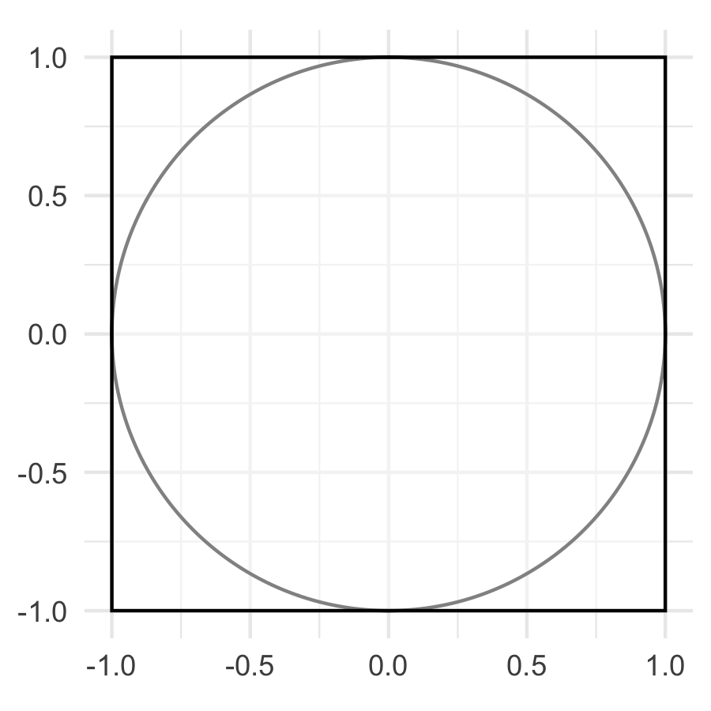

# Introducción a Cálculo de Probabilidades

>"Probabilidad es el lenguaje matemático para cuantificar incertidumbre."
> -Wasserman

En esta parte hacemos un repaso de conceptos de probabilidad con un enfoque
computacional:

1. Modelos probabilísticos: espacio de resultados, eventos, funciones de 
probabilidad.  
2. Interpretación frecuentista de probabilidad.
5. Variables aleatorias.

Las referencias para esta sección son @pitman-prob, @ross y @wasserman.

<!-- Hadley:
"Probabilidad es la maquinaria matemática necesaria para responder preguntas de
eventos inciertos"
Kruschke:
"Probabilidad es simplemente una manera de asignar números a un conjunto de 
posibilidades mutuamente excluyentes."

La teoría de probabilidades tiene como problema
general describir mediante un modelo matemático cada tipo de fenómeno aleatorio,
mientras que la inferencia estadística tiene planteado el problema inverso, es decir, a
partir del conocimiento de una parte del fenómeno pretende establecer sus propiedades,
para lo cual forzosamente debe utilizar algún modelo probabilístico que describa
el fenómeno. Es esta dependencia de la estadística con la teoría de probabilidad lo que justifica profundizar el estudio de esta ultima.

-->

## Probabilidad como extensión de proporción

Históricamente las primeras ideas probabilísticas ocurrieron
en el contexto de juegos de azar, y la consideración si una apuesta
es "justa" o no. El concepto original fue formulado quizá por primera
vez (Cardano) de la siguiente forma:

- Las apuestas en un juego de azar deben ser en proporción al número
de maneras en que un jugador puede ganar.

Por ejemplo, supongamos que yo apuesto a que una tirada de dado
va salir un 1 o 2. Mi contrincante gana si sale 3, 4, 5, 6. Como hay
el doble de resultados desfavorables para mi, el juego es justo
si yo apuesto 10 pesos y mi contrincante 20.

Implícitamente, esta regla razonable introduce el concepto
de probabilidad o "verosimilitud" de un evento aleatorio. Las bases 
para la formalización de esta idea son las siguientes:

- Los resultados del experimento (o el juego de azar) son simétricos: nada
los distingue excepto la etiqueta (por ejemplo el 1 y el 2 en el dado). En este
caso decimos que estos resultados son "equiprobables".

- La "probabilidad" de un conjunto de resultados es proporcional al tamaño
del conjunto de resultados (1 y 2 son dos posibles resultados de 6).

#### Ejemplos {-}

1. En el ejemplo del dado, no podríamos definir los resultados como
"Tiro 1 o 2" o "No tiro 1 o 2", porque no hay simetría entre los dos
resultados: el dado tiene cuatro caras que corresponden al resultado
"No tiro 1 o 2" y solo dos para "Tiro 1 o 2"
2. Si tenemos 100 pelotas idénticas en una bolsa, las revolvemos bien,
y sacamos sin ver una pelota, en el experimento aleatorio no hay nada
que distinga una pelota de otra, así que tiene sentido el modelo
equiprobable: todas las pelotas tienen la misma probabilidad de salir.
Sin embargo, si hay unas pelotas más pesadas que otra, no revolvemos bien,
etc. el experimento pierde la simetría y el modelo equiprobable puede nos
ser apropiado.

En esta familia de modelos, la probabilidad se ve como una extensión de la idea 
de proporción, o cociente de una parte con respecto a un todo. 
Este es uno de los modelos de probabilidad más fundamentales. Podemos
definir algunos conceptos para tener una teoría matemática para este tipo
de modelos.

#### Espacio de resultados y eventos {-}

```{block2, type="caja"}
El **espacio de resultados** $\Omega$ es el conjunto de posibles resultados de 
un experimento aleatorio. A los puntos $\omega \in \Omega$ se les conoce como 
resultados muestrales, o realizaciones del experimento aleatorio.
```

Ejemplo: Si lanzamos una moneda dos veces entonces el espacio de resultados es:

$$\Omega = \{AA, AS, SA, SS \}$$

```{block2, type="caja"}
Un **evento** es un subconjunto del espacio muestral. Los eventos usualmente se
denotan por letras mayúsculas.
```

El evento: que la primer lanzamiento resulte águila es el evento

$$A=\{AA, AS\}$$


#### Espacios de probabilidad equiprobables {-}

```{block2, type="caja"}
**Espacios equiprobables**. Si todos los elementos en el espacio de resultados 
tienen la misma oportunidad de ser elegidos entonces la probabilidad del evento 
A es el número de resultados en A dividido entre el número total de posibles 
resultados:
```

$$P(A)=\frac{\#(A)}{\#(\Omega)},$$

de modo que **calcular probabilidades se reduce a un ejercicio de conteo**.

Por ejemplo, la probabilidad de obtener $AA$ si lanzamos una moneda dos veces
es $1/4 = 0.25$, y la probabilidad del evento que la primer lanzamiento resulte 
águila es $2/4 = 0.5$.

 Lanzamos un dado y anotamos el número de la cara
superior, después lanzamos otro dado y anotamos el número de la cara superior.

* ¿Cuál es el espacio de resultados?

* ¿Cuál es la probabilidad de que la suma de los números sea 5?  

* ¿Cuál es la probabilidad de que el segundo número sea mayor que el primero?  

* Repite las preguntas anteriores cuando lanzas 2 dados con $n$ caras ($n \ge 
4$).

**Observaciones**: 

1. Como explicamos arriba, este tipo de modelos es apropiado
cuando podemos escribir el experimento aleatorio de forma que los resultados
son equiprobables (existe simetría de los resultados).
2. También podemos pensar en que el fundamento de estos modelos es el 
**principio de razón insuficiente**: si no hay nada que distinga los resultados 
del experimento, ningún modelo o cálculo que hagamos debe distingir entre los 
resultados.

#### Ejemplo {-}
Supongamos que sacamos tres cartas de una baraja. ¿Cuál es la probabilidad
de una cuarta carta que saquemos es un as? Utiiza el principio de razón
insuficiente.

Para problemas más complejos, podemos utilizar técnicas de conteo más avanzadas. 

#### Ejemplo: combinaciones {-}

Un comité de 5 personas será seleccionado de un grupo de 6 hombres y 9 mujeres. 
Si la selección es aleatoria, ¿cuál es la probabilidad de que el comité este
conformado por 3 hombres y 2 mujeres?

Hay $\dbinom{15}{5}$ posibles comités, cada uno tiene la misma posibilidad de 
ser seleccionado. Por otra parte, hay $\dbinom{6}{3} \dbinom{9}{2}$ posibles 
comités que incluyen 3 hombres y 2 mujeres, por
lo tanto, la probabilidad que buscamos es: 
$$\frac{\dbinom{6}{3} \dbinom{9}{2}}{\dbinom{15}{5}} $$

y la función para calcular combinaciones en R es _choose(n, r)_

```{r}
choose(6, 3) * choose(9, 2) / choose(15, 5)
```

Los solución a problemas derivados de juegos de azar se complica rápidamente
y suele ser necesario conocer técnicas de conteo para resolverlos. 

## Interpretación frecuentista de probabilidad

La interpretación de la probabilidad como extensión a la idea de proporción es 
fundamental, pero deja sin responder una pregunta crítica: 

- ¿Cómo sabemos que un modelo probabilístico de este tipo describe 
apropiadamente la realidad? ¿Qué pruebas empíricas podemos buscar que de soporte 
a tal modelo?

El concepto subyacente que tardó más en formalizarse es el siguiente. En
términos de juegos justos:

- A partir de una sola repetición del juego, no podemos determinar si un 
juego es justo o no.
- Sin embargo, si repetimos una **gran** cantidad de veces el juego justo,
nuestras pérdidas y ganancias deberían equilibrarse, y con seguridad
nuestro balance será cercano a 0.

#### Ejemplo {-}

Según el concepto de juego justo, si mi probabilidad de ganar
es $p$, es justo que apueste una cantidad $Ap$ y mi contrincante
una cantidad $A(1-p)$. Después de $n$ repeticiones de este juego,
supongamos que gané un número de veces $m$. Entonces, tengo
$A(1-p)m$ pesos de las veces que gané, y perdí $Ap(n-m)$ pesos
por las veces que perdí. En total, mi neto de ganancias es
$A(1-p)m - Ap(n-m)$. Si
esta cantidad es cercana a cero 
$$A(1-p)m - Ap(n-m) \approx 0,$$
entonces despejando obtenemos que
$$p \approx \frac{m}{n},$$
Es decir, aproximadamente tengo que ganar una fracción $m/n$ de
veces. Esta cantidad es una **frecuencia relativa de ocurrencia**.


Una **frecuencia relativa** es una proporción que mide que tan seguido, o frecuente, 
ocurre una u otra cosa en una sucesión de observaciones. Pensemos en un
experimento que se pueda repetir, por ejemplo, lanzar una moneda, lanzar un 
dado, el nacimiento de un bebé. Llamaremos ensayo a una repetición del 
experimento. Ahora, sea A un posible resultado del evento 
(obtener sol, obtener un 6, el bebé es niña), si A ocurre $m$ veces en
$n$ ensayos, entonces la frecuencia relativa de A en $n$ ensayos es $m/n$.


#### Ejemplo {-}
Supongamos que lanzamos una moneda 10 veces y obtenemos los siguientes resultados:

```{r}
set.seed(2881)
lanzamientos_10 <- sample(c("A", "S"), 10, replace = TRUE)
lanzamientos_10
```

Podemos calcular las secuencia de frecuencias relativas de águila:

```{r}
cumsum(lanzamientos_10 == "A") # suma acumulada de águilas
cumsum(lanzamientos_10 == "A") / 1:10
```


### Resultados empíricos acerca de frecuencias relativas {-}

Una primera observación empírica es que las frecuencias relativas basadas en un 
número mayor de observaciones son menos fluctuantes comparado con las 
frecuencias relativas basadas en pocas observaciones. 

Este fenómeno se conoce a veces como la **ley empírica de los promedios** (que 
se formaliza después en las leyes de los grandes números):

```{r, fig.width=8.2, fig.height=3.8}
n <- 1000
tibble(num_lanzamiento = 1:n, lanzamiento = sample(c("A", "S"), n, 
    replace = TRUE)) %>% 
    mutate(frec_rel = cummean(lanzamiento == "A")) %>%
    ggplot(aes(x = num_lanzamiento, y = frec_rel)) +
        geom_hline(yintercept = 0.5, color = "red", alpha = 0.5) +
        geom_line(color = "darkgray") +
        geom_point(size = 1.0) +
        labs(y = "frecuencia relativa", title = "1000 volados", 
            x = "lanzamiento")
```

Veamos las frecuencias relativas para 3 series de 1000 lanzamientos.

```{r, fig.width=8.2, fig.height=3.8}
lanzar <- function(n = 1000){
    tibble(num_lanzamiento = 1:n, lanzamiento = sample(c("A", "S"), n, 
        replace = TRUE)) %>% 
        mutate(frec_rel = cummean(lanzamiento == "A"))
  }
head(lanzar())

set.seed(31287931)
# usamos la función map_df del paquete purrr
map_df(1:3, ~lanzar(), .id = "serie") %>% 
    ggplot(aes(x = log(num_lanzamiento), y = frec_rel, 
        color = as.character(serie))) +
        geom_hline(yintercept = 0.5, color = "darkgray") + 
        geom_line() +
        scale_x_continuous("lanzamiento", labels = exp, 
            breaks = log(sapply(0:10, function(i) 2 ^ i))) +
        labs(color = "serie", y = "frecuencia relativa", title = "1000 volados")
```

La segunda observación empírica es que, cuando el modelo de resultados
equiprobables es apropiado:

- En el modelo de resultados equiprobables, la frecuencia relativa a largo plazo de ocurrencia de un evento es su probabilidad $P(A)$ de ocurrencia 

```{block2, type="caja"}
En la **interpretación frecuentista**, la probabilidad de un evento $A$ es la 
estimación de la frecuencia relativa de $A$ cuando el número de ensayos tiende
a infinito. Si denotemos la proporción de veces que ocurre $A$ en $n$ ensayos por 
$P_n(A)$, se espera que $P_n(A)$ sea cercana a la probabilidad $P(A)$ si $n$ 
es _grande_:
$$P_n(A) \approx P(A)$$
```

- Esta interpretación es crucial, pues es la única que realmente nos
permite conectar nuestros modelos probabilísticos con observaciones
empíricas.

##### Ejemplo: Lanzamiento de dos monedas {-}
Supongamos que lanzamos dos monedas de manera simultánea. ¿Cuál es la 
probabilidad de que las dos monedas sean águila?

* Las dos son águila o no, así que la posibilidad es 1/2.

* Si definimos el resultado como el número de caras que se leen en las monedas, 
puede haber 0, 1 o 2. Si suponemos que estos tres resultados son igualmente
probables, entonces la posibilidad es 1/3.

* A pesar de que las monedas son similares supongamos que se pueden distinguir, 
llamémoslas moneda 1 y moneda 2. Ahora tenemos cuatro posibles resultados:
AA, AS, SA, SS, (la primer letra corresponde a la cara observada en la 
moneda 1 y la segunda en la moneda 2). Si estos 4 resultados son igualmente 
probables entonces el evento AA tiene posibilidad de 1/4.

¿Cuál es la respuesta correcta?  

En cuanto a teoría formal todas son correctas, cada escenario tiene supuestos
de resultados equiprobables claramente enunciados y en base a éstos determina
una probabilidad de manera correcta; sin embargo, los supuestos son diferentes
y por tanto también las conclusiones. Únicamente una de las soluciones puede
ser consistente con la interpretación frecuentista, ¿cuál es?

La primer respuesta es incorrecta pues supone probabilidad cero para el evento 
águila y sol. La solución dos, por otra parte, no es fácil de desacreditar, así
que realicemos el experimento para encontrar la respuesta:

```{r}
n <- 10000
moneda_1 <- sample(c("A", "S"), n, replace = TRUE)
moneda_2 <- sample(c("A", "S"), n, replace = TRUE)
sum(moneda_1 == moneda_2 & moneda_1 == "A") / n
```

La respuesta 3 es la correcta, y lo que vemos es que incluso cuando el supuesto
de igualmente probables es apropiado a un cierto nivel de descripción 
determinado, este _nivel_ no es algo que se pueda juzgar usando únicamente
matemáticas, sino que se debe juzgar usando una interpretación de la 
probabilidad, como frecuencias relativas en ensayos. Más aún, hay ejemplos
donde las monedas no son _justas_, o el sexo de un bebé recién nacido, donde 
el supuesto de equiprobabilidad no es adecuado.

## Simulación para el cálculo de probabilidades
En el ejemplo anterior vimos que puede ser sencillo usar simulación para 
calcular probabilidades, pues usando la interpretación de frecuencia relativa 
simplemente hace falta simular el experimento y contar los casos favorables 
entre el total de casos. 

```{block2, type="caja"}
**Simulación para el cálculo de probabilidades**

Definir el modelo probabilístico:  
    
1. Definir el espacio de resultados.

2. Describir el mecanismo que genera los resultados, esto incluye entender 
los pasos que involucran azar y los que no.

Simular:

3. Replicar el experimento con código, siguiendo el conocimiento elicitado en 1 y 2. 

4. Repetir el paso 3 $n$ veces y calcular la frecuencia relativa de éxitos, 
estimando así la probabilidad.
```

Para el paso 2 (resultados equiprobables), en R suelen ser de utilidad las funciones `runif` y `sample()`, revisa la ayuda de estas funciones.

#### Ejemplo: comité {-}

Un comité de 5 personas será seleccionado de un grupo de 6 hombres y 9 mujeres. 
Si la selección es aleatoria, ¿cuál es la probabilidad de que el comité este 
conformado por 3 hombres y 2 mujeres?

1. El espacio de resultados es $\Omega = \{M_1M_2M_3M_4M_5, M_2M_3M_4M_5M_6,...
H_1,H_2H_3H_4H_5,H_2H_3H_4H_5H_6\}$. 

2. Se seleccionan 5 integrantes al azar del conjunto de hombres y mujeres, es
claro que cada persona solo puee estar una vez.

3. 

```{r}
candidatos <- c(paste("M", 1:9, sep = "_"), paste("H", 1:6, sep = "_"))
sample(candidatos, 5, replace = FALSE)
```

```{r}
comite <- function(){
    candidatos <- c(paste("M", 1:9, sep = "_"), paste("H", 1:6, sep = "_"))
    comite <- sample(candidatos, 5, replace = FALSE)
    n_mujeres <- sum(substr(comite, 1, 1) == "M")
    n_mujeres == 2
}

rerun(1000, comite()) %>% flatten_dbl() %>% mean()
```

#### Ejemplo: La ruina del jugador {-}

* Un jugador tiene $100, y va a apostar en un juego donde
la probabilidad de ganar es p = 0.47 (e.g. una ruleta 18/38), si gana recibe el 
doble de lo que arriesgó, si no gana pierde todo lo que apostó.

* Cada vez que juega puede apostar cualquier cantidad siempre y cuando aún 
cuente con dinero. 

* El jugador dejará de jugar cuando su capital sea $0 o cuando gane $200.

* El jugador busca una estrategia que le ayude a aumentar su probabilidad de 
ganar y te pregunta: ¿Cuál es la probabilidad de ganar si apuesto en incrementos 
de $5 cada vez que apuesto?

Siguiendo los pasos enunciados:

1. Cada elemento del espacio de resultados es una sucesión
$\omega_1, \omega_2, \omega_3, \ldots$ donde cada $\omega_i$ es $G$ o $P$
(gana o pierde).
2. El jugador juega mientras tenga capital y este sea menor a $200, el 
monto de la apuesta está fijo en $5, no importa el capital en cada momento. La
componente aleatoria involucra si gana cada uno de los juegos y esto 
ocurre con probabilidad 0.47.

```{r, cache=TRUE}
apostar <- function(dinero = 100, apuesta = 5, tope = 200) {
    while (0 < dinero & dinero < tope) {
        if (sample(1:38, 1) <= 18) {
            dinero <- dinero + apuesta
        } 
        else {
            dinero <- dinero - apuesta
        }
    }
    dinero > 0
}
set.seed(9923)
n_juegos <- 5000
juegos <- rerun(n_juegos, apostar()) %>% flatten_dbl()
mean(juegos)

# incrementos de 50?
juegos <- rerun(n_juegos, apostar(apuesta = 50)) %>% flatten_dbl()
mean(juegos)
```

La solución analítica la pueden leer en este documento de [caminatas aleatorias](http://web.mit.edu/neboat/Public/6.042/randomwalks.pdf):

```{r}
p <- 0.474
1 - (1 - (p / (1 - p)) ^ (100 / 5)) / (1 - (p / (1 - p)) ^ (200 / 5)) # apostando de 5 en 5
1 - (1 - (p / (1 - p)) ^ (100 / 50)) / (1 - (p / (1 - p)) ^ (200 / 50)) # apostando de 50 en 50
```

 Cumpleaños. ¿Cuántas personas debe haber en un 
salón para que la probabilidad de encontrar 2 con el mismo cumpleaños sea 
mayor a 0.5?
Supuestos:

* Mismo cumpleaños implica mismo día y mes.

* No hay años bisiestos.

* La probabilidad de que alguien nazca un día dado es la misma para todos los 
días del año.

```{r, eval = FALSE, include=FALSE}
cumpleanos <- function(n_personas = 100){
    cumpleanos <- sample(1:365, size = n_personas, replace = TRUE)
    n_distinct(cumpleanos) < n_personas
}
calcula_prob <- function(n_personas = 100, n_sims = 1000){
    rerun(n_sims, cumpleanos(n = n_personas)) %>% flatten_dbl() %>% mean()
}

probs_sim <- tibble(n_personas = 2:60) %>% 
    mutate(p_sim = map_dbl(n_personas, ~calcula_prob(n_personas = .)))
dplyr::filter(probs_sim, p_sim > 0.44, p_sim < 0.56)
ggplot(probs_sim, aes(x = n_personas, y = p_sim)) +
    geom_line() +
    geom_hline(yintercept = 0.5, color = "red")
```

  Chabelo (Monty Hall) Supongamos que estamos 
jugando las catafixias de Chabelo, en este juego hay 3 catafixias: 2 de ellas 
están vacías y una tiene un premio:

1. El juego comienza cuando escoges una catafixia.
2. A continuación Chabelo abre una catafixia vacía de las dos catafixias 
restantes.
3. Tu eliges si te mantienes con tu catafixia o cambias a la otra que continúa 
cerrada. Chabelo abre tu segunda elección de catafixia y se revela si ganaste.

    ¿Cuál es la probabilidad de que ganes si cambias de catafixia?

 **Urna**: 10 personas (con nombres distintos) 
escriben sus nombres y los ponen en una urna, después seleccionan un nombre (al 
azar). 

* Sea A el evento en el que ninguna persona selecciona su nombre, ¿Cuál es la
probabilidad del evento A?  

* Supongamos que hay 3 personas con el mismo nombre, ¿Cómo calcularías la
probabilidad del evento A en este nuevo experimento?


* El señor J. tiene 2 cachorros, el mayor es hembra. ¿Cuál es la probabilidad 
de que los dos sean hembra?
* La señora K. tiene 2 cachorros, al menos uno es macho. ¿Cuál es la probabilidad 
de que los dos sean macho?

```{r, eval = FALSE, include=FALSE}
pups <- function(){
    pups <- sample(c(0, 1), 2, replace = TRUE)
    while (sum(pups) < 1){
        pups <- sample(c(0, 1), 2, replace = TRUE)   
    }
    sum(pups) == 2    
}
rerun(1000, pups()) %>% flatten_dbl() %>% mean()
```

#### Espacios equiprobables continuos {-}

Podemos generalizar las definiciones de equiprobable al caso continuo, como 
ejemplo supongamos que se lanza un dardo a un tablero cuadrandgular de lado 2, 
¿cuál es la probabilidad de que el dardo caiga en el círculo de radio 1 inscrito 
en un cuadrado de lado 2?

```{r, include=FALSE}
tablero <- ggplot() + 
    ggforce::geom_circle(aes(x0 = 0, y0 = 0, r = 1)) +
    geom_rect(aes(xmin = -1, xmax = 1,   ymin = -1, ymax = 1), fill = "white", 
        color = "black", alpha = 0.5) +
    coord_equal()
ggsave("img/tablero.png", tablero, width = 3, height = 3)
```

```{r, out.width = "400px"}

```

En este caso usamos áreas relativas para calcular la probabilidad: denotemos C
al evento tal que el dardo cae en el círculo, entonces:

$$P(B) = \frac{Área(B)}{Área(\Omega)}$$
¿Y simulando?

```{r}
dentro_circunferencia <- function(){
  x <- runif(1) * sample(c(-1, 1), 1)
  y <- runif(1) * sample(c(-1, 1), 1)
  sqrt(x ^ 2 + y ^ 2) < 1
}
rerun(10000, dentro_circunferencia()) %>% flatten_dbl() %>% mean()
```

```{r, eval = FALSE}
dardos <- tibble(x = runif(1000, -1, 1), y = runif(1000, -1, 1), 
    en_circulo = sqrt(x ^ 2 + y ^ 2) < 1)

tablero_dardos <- tablero +
    geom_point(data = dardos, aes(x, y, color = en_circulo), alpha = 0.5, 
        show.legend = FALSE)

ggsave("img/tablero_dardos.png", tablero_dardos, width = 3, height = 3)
```

```{r, out.width = "400px"}
knitr::include_graphics("img/tablero_dardos.png")
```

¿Qué defectos puedes ver en este modelo probabilístico para el lanzamiento
de un dardo?


## Modelos de probabilidad (definición general)

En muchos casos, el modelo equiprobable (discreto o continuo) no es tan
fácil adaptar a problemas particulares de modelación probabilística. Por
ejemplo:

- En el problema del dardo, como la mayor parte de la gente apunta hacia
el centro, regiones centrales deberían tener probabilidad mayor que
regiones cerca del borde.
- Si sacamos una pelota al azar de una bolsa revuelta, y las pelotas son
de distintos tamaños, entonces las probabilidades de extraer cada pelota
son diferentes.

Modelos apropiados para estos experimentos son más complicados, pues 
no tenemos la simetría que nos da asignaciones automáticas de probabilidades.

### Espacios discretos

En el caso discreto, podríamos poner:

1. Si los resultados posibles son $\omega_1,\ldots, \omega_n$, asignamos
probabilidades $p_1\ldots p_n$ a cada resultado (pueden ser distintas),
2. La probabilidad de un evento $A$ es la suma de las probabilidades $p_i$
de los elementos que están contenidos en $A$.

#### Ejemplo: bolsa acumulada de lotería

Imaginemos que tenemos una lotería tipo Melate. Para simplificar,
pensemos que se escogen 3 números del 1 al 10, y que tenemos 
200 concursantes. ¿Cuál es la probabilidad de la bolsa de este
concurso se acumule (nadie tenga la combinación ganadora)? 

Podemos resolver este problema con conteo, pero veamos como hacerlo
simulando. 

```{r, cache = TRUE}
seleccionar_combinacion <- function(){
    sample(1:10, 3) %>% sort
}
acumula_bolsa <- function(n_concursantes = 200){
    combinacion_ganadora <- sample(1:10, 3) %>% sort
    boletos <- rerun(n_concursantes, seleccionar_combinacion())
    map_lgl(boletos, ~ all(. == combinacion_ganadora)) %>% any
} 
# probabilidad de que alguien gane
set.seed(99244)
prob_ganador <- rerun(500, acumula_bolsa()) %>% flatten_lgl %>% mean
# probabilidad de acumulación
1 - prob_ganador
```

¿Qué problema ves con este ejemplo? En realidad, la elección de
los concursantes no es aleatoria. Existen números favoritos (por ejemplo,
el 7 o el 13), patrones que atraen a concursantes (patrones aritméticos,
formas en el boleto de melate, selección de números según fechas
de cumpleaños, etc.)

¿Qué tanto puede afectar esta elección consciente? 
Intenamos una variación simple: supongamos que la probabilidad 
de escoger el número 7 es más alta que otros números. 


```{r, cache = TRUE}
seleccionar_combinacion <- function(prob = rep(1, 10)){
    sample(1:10, 3, prob = prob) %>% sort
}
# el 7 es 5 veces más probable:
p_numeros <- c(rep(1,6), 5, rep(1,3))

acumula_bolsa <- function(n_concursantes = 200, prob = rep(1, 10)){
    combinacion_ganadora <- sample(1:10, 3) %>% sort
    boletos <- rerun(n_concursantes, seleccionar_combinacion(prob = prob))
    map_lgl(boletos, ~ all(. == combinacion_ganadora)) %>% any
} 
# probabilidad de que alguien gane
prob_ganador <- rerun(500, acumula_bolsa(prob = p_numeros)) %>% 
    flatten_lgl %>% mean
# probabilidad de acumulación
1 - prob_ganador
```


#### Ejemplo: comité
Supongamos que el proceso de selección del comité tiene 
sesgo, las mujeres se seleccionan con mayor probabilidad que los hombres:

```{r}
comite <- function(){
    candidatos <- c(paste("M", 1:9, sep = "_"), paste("H", 1:6, sep = "_"))
    comite <- sample(candidatos, 5, replace = FALSE, 
        prob = c(rep(2, 9), rep(1, 6)))
    n_mujeres <- sum(substr(comite, 1, 1) == "M")
    n_mujeres == 2
}

rerun(1000, comite()) %>% flatten_dbl() %>% mean()
```

### Espacios continuos

En el caso de espacio de resultados continuos, también quisiéramos
tener un concepto de resultados no equiprobables.

Por ejemplo, para el dardo en el tablero,
es más realista pensar que la probabilidad 
de que el dardo caiga en un segmento de la zona central no es la misma a que 
caiga en un segmento de igual área en las orillas.

```{r, eval = FALSE}
tablero_zonas <- tablero +
    geom_rect(aes(xmin = -1, xmax = -0.8,   ymin = -1, ymax = -0.8), 
        fill = "red", alpha = 0.5) + 
    geom_rect(aes(xmin = -.1, xmax = 0.1,   ymin = -0.1, ymax = 0.1), 
        fill = "red", alpha = 0.5)
ggsave("img/tablero_zonas.png", tablero_zonas, width = 3, height = 3)
```


```{r, out.width = "400px"}
knitr::include_graphics("img/tablero_zonas.png")
```

La definición de probabilidad como área relativa no se puede usar en estos 
casos, sin embargo, el enfoque de simulación se continúa manteniendo.

Comencemos con el caso de un dardo univariado. En este caso, la probabilidad
se calcula como longitud relativa. La probabilidad de que el dardo
caiga en el intervalo $[a,b]\subset [0,1]$ es

$$P([a,b]) = \frac{b-a}{1-0} = b-a$$


Y nótese ahora que podemos escribir este cálculo 
como la integral de una constante:

$$P([a, b]) = \frac{b-a}{1} = \int_a^b 1dx$$
donde clarametne $P([0,1]) = 1.$

Ahora, si el dardo cae en ciertas zonas con mayor probabilidad podemos
**perturbar** la función que integramos para asignar mayor probabilidad
en zonas donde es más probable que el dardo caiga. Esto implica
introducir una función $f$, que llamamos *densidad de probabilidad*, cuya
integral nos de valores de probabilidad:

```{r, out.width="350px"}
ggplot(tibble(x = c(0 , 1)), aes(x)) + 
    stat_function(fun = dbeta, args = list(shape1 = 2, shape2 = 2)) +
    geom_rect(data = NULL, aes(xmin = 0, xmax = 1, ymin = 0, ymax = 1), 
        fill = "red", alpha = 0.2)
```


$$P([a,b])=\int_a^bf(x)dx$$

Nótese que la integral sobre $[0,1]$ debe ser 1 (probabilidad de 
que el dardo caiga entre 0 y 1).


Podemos calcular probabilidades con simulación, 
por ejemplo la probabilidad de x en 
[0.2, 0.5]:

```{r}
curva <- function(){
    # Este método es simulación por rechazo 
    x <- runif(1)
    y <- runif(1) * 1.5
    while (dbeta(x, 2, 2) < y) {
        x <- runif(1)
        y <- runif(1) * 2.5
    }
    x
}

sims_x <- rerun(5000, curva()) %>% flatten_dbl()
mean(sims_x > 0.2 & sims_x < 0.5)
```

Consideramos la siguiente gráfica para ayudar en la intuición del método:
los puntos seleccionados por encima de la función de densidad son rechazados,
de manera que es claro que la probabilidad que estimamos arriba
de caer en el intervalo de interés es el área bajo la curva (integral)
de nuestra función de densidad:

```{r, out.width="350px"}
tibble(x = runif(1000), y = runif(1000) * 1.5, dentro = dbeta(x, 2, 2) > y, 
    en_int = dentro * (x > 0.2 & x < 0.5), cat = case_when(!dentro ~ "a", 
    dentro & en_int ~ "b", TRUE ~ "c")) %>% 
    ggplot() + 
    stat_function(fun = dbeta, args = list(shape1 = 2, shape2 = 2)) +
        geom_point(aes(x, y, color = cat), alpha = 0.5, 
            show.legend = FALSE)
```

## Probabilidad: definición matemática
Podemos cubrir todos los casos que hemos visto hasta ahora (y otros adicionales)
con la siguiente definición de probabilidad:

Supongamos que tenemos un espacio de resultados $\Omega$, y que todos los 
eventos de interés están representados como subconjuntos de $\Omega$. Podemos
pensar en $\Omega$ como una representación de todas las situaciones que pueden
ocurrir, no suponemos que es finito, ni que los eventos son igualmente 
probables.

Las reglas de la probabilidad involucran relaciones lógicas entre eventos; estas
se traducen a relaciones de conjuntos. Por ejemplo, si C es el evento que ocurre
si sucede A o si sucede B, entonces el conjunto de maneras en las que ocurre C
es la unión del conjunto de maneras en que ocurre A y el conjunto de maneras en 
que ocurre B. Veamos como se traduce de eventos a conjuntos

Lenguaje de eventos | Lenguaje de conjuntos | Notación de conjuntos
--------------------|-----------------------|----------------------
Espacio de resultados| conjunto universal   | $\Omega$
evento              | subconjunto de $\Omega$| $A,B,C,...$
evento imposible    | conjunto vacío        | $\emptyset$
no A, opuesto de A  |complemento de A       | $A^c$
A o B               |unión de A y B         | $A\cup B$
tanto A como B      | intersección de A y B | $AB,A\cap B$ 
A y B mutuamente excluyentes |A y B disjuntos | $AB=\emptyset$
si A entonces B     | A es subconjunto de B | $A\subset B$


#### Particiones y axiomas de probabilidad {-}

```{block2, type="caja"}
Decimos que un conjunto de $n$ eventos $B_1,...,B_n$ es una **partición** del evento 
$B$ si $B=B_1 \cup B_2 \cup \cdot\cdot\cdot \cup B_n$ y los eventos 
$B_1,...,B_n$ son mutuamente excluyentes. 
```

Ahora podemos definir probabilidad:

```{block2, type="caja"}
Una función $P$ es una **función de probabilidad** si satisface las siguientes 
condiciones:

1. Un valor de probabilidad debe ser no-negativo: 
$$P(B) \geq 0$$ para cualquier evento $B$  
2. La suma de las probabilidades a través de todos los posibles eventos en el 
espacio de resultados debe ser 1 (i.e. uno de los eventos en el espacio de 
resultados debe ocurrir). 
$$P(\Omega) = 1$$
3. Si $B_1,...,B_n$ es una partición del evento $B$ entonces, la probabilidad 
de que ocurra B es la suma de las probabilidades individuales:
$$P(B)=P(B_1)+P(B_2) + \cdot\cdot\cdot +P(B_n)$$
```

### Propiedades de la función de probabilidad: {-}

* $P(A^c) = 1 - P(A)$    
* $P(\emptyset)=0$  
* Si $A \subset B$ entonces $P(A) \le P(B)$  
* $0\le P(A) \le 1$
* La regla general de la suma: $P(A \cup B) = P(A) + P(B) - P(A \cap B)$


## Variables aleatorias 

A partir de un experimento aleatorio se pueden definir muchas preguntas de 
probabilidad, por ejemplo, en el caso de la ruina del jugador podríamos 
preguntarnos: las ganancias después del tercer juego, probabilidad de ganar, 
duración del experimento (cuántos juegos se jugaron antes de alcanzar las 
reglas de término). Sin embargo, muchas veces nos centramos en estudiar un solo
aspecto **numérico** del experimento.

```{block2, type="caja"}
La variable aleatoria $X$ es un mapeo entre el espacio de resultados y los 
números reales.
```

Este enfoque tiene dos ventajas importantes:

- Simplifica muchas veces el ejercicio de modelación, pues en lugar
de tener que entender y modelar la totalidad del experimento aleatorio, 
podemos concentrarnos en propiedades de la función $X$. 

- Usando probabilidades asociadas a la función $X$ podemos resumir aspectos
de interés el experimento aleatorio.

- El uso de variables aleatorias nos permite usar álgebra para derivar resultados
y representar cómputos de manera conveniente.

#### Ejemplo {-}
Supongamos que nuestro experimento aleatorio es tirar un dado 10 veces.
Este experimento aleatorio tiene $10^6$ posibles resultados. Supongamos
que nos interesa principlamente 
$X =$ número de seises que obtuvimos en le experimento.

Entonces es posible demostrar (o puedes estimar con simulación), que las
probabilidades asociadas a $X$ podemos escribirlas como:

```{r}
X_prob <- tibble(X = seq(0, 10)) %>% 
    mutate(prob = dbinom(X, 10, 1/6), prob_redondear = round(prob, 3))
X_prob
```

Y con esta función podemos resolver otros problemas de interés sin 
tener que recurrir al modelo probabilístico completo. Por ejemplo,
contesta la siguientes preguntas (puedes usar simulación si es necesario) :

- ¿Cuál es la probabilidad de que al jugar este juego obtengamos 2 o menos
seises?
- ¿Cuál es la probabilidad de que tiremos un número par de seises?
- Si repetimos este juego 5 veces, ¿cuál es la probabilidad de obtener
un número total de seises mayor a 5?

### Distribución de probabilidad {-}

En general, la distribución de probabilidad de una variable aleatoria $X$ es
la función que asigna a cada evento $X\in A$ una probabilidad $P(X\in A)$.
A los eventos $X \in A$ les llamamos eventos asociados a una variable
aleatoria. Nótese que no todos los eventos posibles asociados son de la
forma $X\in A$ para una variable aleatoria fija.

#### Ejemplo {-}
En el ejemplo anterior calculamos $P(X \in \{ 0, 1, 2 \} = P(X \geq 2)$
y $P(X \in \{0,2,4,6,8,10\}).$ Sin embargo, el evento "tiramos al menos un 3"
no se puede escribir en la forma $P(X\in A)$. Este tipo de eventos siempre
está relacionado con el número de seises que obtuvimos en el experimento.

Como vimos arriba, si tenemos una variable aleatoria que toma un número
finito de valores, las probabilidades $P(X\in A)$ pueden calcularse sumando
probabilidades individuales de los valores en A:
$$P(X\in A) = \sum_{a \in A} P(X = a)$$

Y una argumento similar se puede utilizar para variables que toman
un número infinito pero numerable de valores (por ejemplo, enteros de 0 a infinito).

### Variables aleatorias continuas {-}

Consideremos el ejemplo del dardo sesgado unidimensional que vimos arriba. Para
este experimento aleatorio, definimos la variable aleatoria $X =$ posición
del dardo en el intervalo $[0,1]$, y propusimos un modelo donde las probabilidades
se calculan integrando:

$$P(X\in [a,b]) = \int_a^b f(x)\, dx$$

En general, para cualquier subconjunto $A\subset [0,1]$ podemos definir
la integral que defina la función de destribución como:

$$P(X\in A) = \int_A f(x)\, dx$$
que se calcula sumando las probabilidades de los intervalos individuales
que componen $A$

#### Ejemplo {-}
Si queremos calcular la probabilidad de que el dardo segado caiga en los
extremos, por ejemplo en $[0,0.1]$ o $[0.9,1]$, podemos hacer
$$A = [0,0.1]\cup[0.9,1]$$
y calcular
$$P(X\in A) = \int_0^{0.1} f(x)\, dx  + \int_{0.9}^1 f(x)\, dx$$


La **función de distribución acumulada** contiene la misma información que la
función de distribución y se define como 
$$P(X \le x)$$
con la ventaja de que la definición aplica tanto al caso discreto como en el 
caso continuo.


#### Ejemplo {-}
Calculamos la función de distribución acumulada para el ejemplo anterior:

```{r}
X_prob %>% mutate(fda = cumsum(prob))
```

**Pregunta**: ¿cómo recuperamos la probabilidades de cada valor a
partir de la función de distribución acumulada?


#### Esperanza {-}
```{block2, type="comentario"}
La **esperanza** (valor esperado o media) de una variable aleatoria $X$,
es la media de la distribución $X$, esto es,
$$E(X)=\sum_{x\in \Omega_x} x P(X=x)$$
el promedio de todos los posibles valores de $X$ ponderados por sus probabilidades.
```

Por ejemplo, si $X$ toma únicamente dos posibles valores, $a,b$ con
probabilidad $P(a)$ y $P(b)$ entonces
$$E(X)=aP(a)+bP(b).$$

Ejemplo: Supongamos que $X$ es el valor que se produce cuando tiro un
dado justo. Entonces,
$$E(X)=1\cdot P(X=1) +2\cdot P(X=2) +3\cdot P(X=3) +4\cdot P(X=4) +5\cdot P(X=5) +6\cdot P(X=6) = 3.5$$
Lo que nos dice que si tiramos el dado muchas veces deberíamos esperar que el promedio de las tiradas sea cercano a 3.5.

**Esperanza como un promedio cuando n es grande**. Si vemos las probabilidades de los valores de $X$ como una aproximación de frecuencias relativas cuando n es grande, entonces $E(X)$ es aproximadamente el valor promedio del valor de $X$ cuando n es grande.

```{r}
x <- rnorm(10000, mean = 10)
mean(x)
```

<!--
**Esperanza y predicción**. Supongamos que deseamos predecir el valor de una variable aleatoria $X$. ¿Cuál es el mejor predictor de X? Para responder la pregunta es preciso seleccionar un criterio. Es común que el criterio 
sea minimizar el 
-->

La esperanza cumple las siguientes reglas: 

1. **Constantes**. La esperanza de una variable aleatoria constante
es su valor constante,
$$E(c) = c$$

2. **Indicadoras**. Si $I_A$ es la función indicadora del evento $A$, 
$$E(I_A) = P(A)$$

3. **Funciones**. Típicamente, $E[g(X)]\ne g[E(X)]$, pero
$$E[g(X)] = \sum_{x \in \Omega_X} g(x) P(X=x)$$

4. **Factores constantes**. Para una constante c,
$$E(cX)=cE(X)$$

5. **Adición**. Para cualquier par de variables aleatorias $X$, $Y$,
$$E(X+Y) = E(X)+E(Y)$$

6. **Multiplicación**. Típicamente $E(XY) \ne E(X)E(Y)$, pero
si $X$ y $Y$ son independientes, entonces $$E(XY)=E(X)E(Y)$$


<!-- Supongamos que lanzamos una moneda al aire y definimos la variable 
aleatoria
$Z$ como el tiempo en segundos que transcurre antes de que la moneda toque el suelo. En este caso el espacio de resultados es inconveniente de describir. Sin
embargo, el soporte de $Z$ sería $(0, \infty)$, es claro que el conjunto $(0, \infty)$ es demasiado grande, pero veremos que en la práctica a veces es
conveniente estudiar el soporte extendido. -->


#### Varianza y desviación estándar {-}
Si intentamos predecir el valor de una variable aleatoria usando su media 
$E(X)=\mu$, vamos a fallar por una cantidad aleatoria $X-\mu$. Suele ser 
importante tener una idea de que tan grande será esta desviación. Debido a que
$$E(X-\mu) = E(X)-\mu=0$$
es necesario considerar la diferencia absoluta o la diferencia al cuadrado de 
$X-\mu$ con el fin de tener una idea del tamaño de la desviación sin importar el 
signo de esta. 

**Varianza y desviación estándar**. La varianza de $X$, denotada 
$var(X)=\sigma^2$ es la media de la desviación cuadrada de $X$ respecto a su 
valor esperado $\mu=E(X)$: $$\sigma^2(X)=var(X)=E(X-\mu)^2$$
La desviación estándar de $X$, es la raíz cuadrada de la varianza de X:
$$\sigma(X)=sd(X)=\sqrt{var(X)}$$

Intuitivamente, $sd(X)$ es una medida de la dispersión de la distribución de $X$ 
alrededor de su media. Debido a que la varianza es el valor central de la 
distribución de $(X-\mu)^2$, su raíz cuadrada da una idea del tamaño típico de 
la desviación absoluta $|X-\mu|$. Notemos que $E(X)$, $var(X)$ y $sd(X)$ están 
determinados por $X$, de tal manera que si dos variables aleatorias tienen la 
misma distribución, también tienen la misma media, varianza y desviación 
estándar.


