# Teoría básica de simulación

> "Any one who considers arithmetical methods of producing random digits is, of course, in a state of sin."
> -Von Neuman


La simulación de un modelo consiste en la construcción de un programa 
computacional que permite obtener los valores de las varibles de salida para
distintos valores de las variables de entrada con el objetivo de obtener 
conclusiones del sistema que apoyen la toma de decisiones (explicar y/o predecir
el comportamiento del sistema).  

Requerimientos prácticos de un proyecto de simulación: 

* Fuente de números aleatorios $U(0,1)$ (números pseudoaleatorios).  
* Transformar los números aleatorios en variables de entrada del modelo
(e.g. generación de muestras con cierta distribución).  
* Construir el programa computacional de simulación.  
* Analizar las distintas simulaciones del modelo para obtener conclusiones
acerca del sistema.   

Comenzaremos introduciendo el primer punto, ¿cómo generar números $U(0,1)$?

## Números pseudoaleatorios

El objetivo es generar sucesiones $\{u_i\}_{i=1}^N$ de números independientes
que se puedan considerar como observaciones de una distribución uniforme
en el intervalo $(0, 1)$.

1. **Verdaderos números aleatorios.** Los números completamente aleatorios (no 
    determinísticos) son fáciles de imaginar conceptualmente, por ejemplo 
    podemos imaginar lanzar una moneda, lanzar un dado o una lotería.  
    En general los números aleatorios se basan en alguna fuente de aleatoreidad 
    física que puede ser teóricamente impredecible (cuántica) o prácticamente
    impredecible (caótica). Por ejemplo:
    - [random.org](http://www.random.org) genera aleatoreidad a través de ruido 
    atmosférico (el paquete `random` contiene funciones para obtener números de 
    random.org),  
    - [ERNIE](https://en.wikipedia.org/wiki/Premium_Bond#ERNIE), usa ruido 
    térmico en transistores y se utiliza en la lotería de bonos de Reino Unido.  
    - [RAND Corporation](https://www.rand.org/pubs/monograph_reports/MR1418/index2.html) 
    En 1955 publicó una tabla de un millón de números aleatorios
    que fue ampliamente utilizada. Los números en la tabla se obtuvieron de una
    ruleta electrónica.
    
    La desventaja de éstos métodos es que son costosos, tardados y no 
    reproducibles.

<div class="caja">
2. **Números pseudoaleatorios.** Los números pseudoaleatorios se generan de 
    manera secuencial con un algoritmo determinístico, formalmente se definen 
    por: 
    + **Función de inicialización**. Recibe un número (la semilla) y pone al 
    generador en su estado inicial.
    + **Función de transición**. Transforma el estado del generador.
    + **Función de salidas**. Transforma el estado para producir un número fijo 
    de bits (0 ó 1). 
    
    Una sucesión de bits pseudoaleatorios se obtiene definiendo la semilla y 
    llamando repetidamente la función de transición y la función de salidas.
</div>

  Esto implica, entre otras cosas, que una sucesión de números pseudoaletorios 
  esta completamente determinada por la semilla.
  
  <!--
  Since a computer can represent a real number with only finite accuracy, we 
  shall actually be generating integers X, between zero and some number m; the fraction
  U=X,/m will then lie between zero and one. Usually m is the word size (máximo número de 
bits que puede procesar el CPU en una llamada) of the computer -->

Ahora, buscamos que una secuencia de números pseudoaleatorios:

* no muestre ningún patrón o regularidad aparente desde un punto de vista 
estadístico, y 

* dada una semilla inicial, se puedan generar muchos valores antes de repetir el 
ciclo. 

Construir un buen algoritmo de números pseudoaleatorios es complicado, como 
veremos en los siguientes ejemplos.

#### Ejemplo: método de la parte media del cuadrado {-}

En 1946 Jon Von Neuman sugirió usar las operaciones aritméticas de una 
computadora para generar secuencias de número pseudoaleatorios. 

Sugirió el método *middle square*, para generar secuencias de dígitos
pseudoaleatorios de 4 dígitos propuso,

1. Se inicia con una semilla de 4 dígitos: `seed = 9731`

2. La semilla se eleva al cuadrado, produciendo un número de 8 dígitos (si el
resultado tiene menos de 8 dígitos se añaden ceros al inicio): 
`value = 94692361`

3. Los 4 números del centro serán el siguiente número en la secuencia, y se 
devuelven como resultado: `value = 6923`


```r
mid_square <- function(seed, n) {
   seeds <- numeric(n)
   values <- numeric(n)
   for (i in 1:n) {
       x <- seed ^ 2
       seed = case_when(
           nchar(x) > 2 ~ (x %/% 1e2) %% 1e4,
           TRUE ~ 0)
       values[i] <- x
       seeds[i] <- seed
   }
   cbind(seeds, values)
}
x <- mid_square(1931, 10) 
print(x, digits = 4)
#>       seeds   values
#>  [1,]  7287  3728761
#>  [2,]  1003 53100369
#>  [3,]    60  1006009
#>  [4,]    36     3600
#>  [5,]    12     1296
#>  [6,]     1      144
#>  [7,]     0        1
#>  [8,]     0        0
#>  [9,]     0        0
#> [10,]     0        0

x <- mid_square(9731, 100) 
print(x, digits = 4)
#>        seeds   values
#>   [1,]  6923 94692361
#>   [2,]  9279 47927929
#>   [3,]   998 86099841
#>   [4,]  9960   996004
#>   [5,]  2016 99201600
#>   [6,]   642  4064256
#>   [7,]  4121   412164
#>   [8,]  9826 16982641
#>   [9,]  5502 96550276
#>  [10,]  2720 30272004
#>  [11,]  3984  7398400
#>  [12,]  8722 15872256
#>  [13,]   732 76073284
#>  [14,]  5358   535824
#>  [15,]  7081 28708164
#>  [16,]  1405 50140561
#>  [17,]  9740  1974025
#>  [18,]  8676 94867600
#>  [19,]  2729 75272976
#>  [20,]  4474  7447441
#>  [21,]   166 20016676
#>  [22,]   275    27556
#>  [23,]   756    75625
#>  [24,]  5715   571536
#>  [25,]  6612 32661225
#>  [26,]  7185 43718544
#>  [27,]  6242 51624225
#>  [28,]  9625 38962564
#>  [29,]  6406 92640625
#>  [30,]   368 41036836
#>  [31,]  1354   135424
#>  [32,]  8333  1833316
#>  [33,]  4388 69438889
#>  [34,]  2545 19254544
#>  [35,]  4770  6477025
#>  [36,]  7529 22752900
#>  [37,]  6858 56685841
#>  [38,]   321 47032164
#>  [39,]  1030   103041
#>  [40,]   609  1060900
#>  [41,]  3708   370881
#>  [42,]  7492 13749264
#>  [43,]  1300 56130064
#>  [44,]  6900  1690000
#>  [45,]  6100 47610000
#>  [46,]  2100 37210000
#>  [47,]  4100  4410000
#>  [48,]  8100 16810000
#>  [49,]  6100 65610000
#>  [50,]  2100 37210000
#>  [51,]  4100  4410000
#>  [52,]  8100 16810000
#>  [53,]  6100 65610000
#>  [54,]  2100 37210000
#>  [55,]  4100  4410000
#>  [56,]  8100 16810000
#>  [57,]  6100 65610000
#>  [58,]  2100 37210000
#>  [59,]  4100  4410000
#>  [60,]  8100 16810000
#>  [61,]  6100 65610000
#>  [62,]  2100 37210000
#>  [63,]  4100  4410000
#>  [64,]  8100 16810000
#>  [65,]  6100 65610000
#>  [66,]  2100 37210000
#>  [67,]  4100  4410000
#>  [68,]  8100 16810000
#>  [69,]  6100 65610000
#>  [70,]  2100 37210000
#>  [71,]  4100  4410000
#>  [72,]  8100 16810000
#>  [73,]  6100 65610000
#>  [74,]  2100 37210000
#>  [75,]  4100  4410000
#>  [76,]  8100 16810000
#>  [77,]  6100 65610000
#>  [78,]  2100 37210000
#>  [79,]  4100  4410000
#>  [80,]  8100 16810000
#>  [81,]  6100 65610000
#>  [82,]  2100 37210000
#>  [83,]  4100  4410000
#>  [84,]  8100 16810000
#>  [85,]  6100 65610000
#>  [86,]  2100 37210000
#>  [87,]  4100  4410000
#>  [88,]  8100 16810000
#>  [89,]  6100 65610000
#>  [90,]  2100 37210000
#>  [91,]  4100  4410000
#>  [92,]  8100 16810000
#>  [93,]  6100 65610000
#>  [94,]  2100 37210000
#>  [95,]  4100  4410000
#>  [96,]  8100 16810000
#>  [97,]  6100 65610000
#>  [98,]  2100 37210000
#>  [99,]  4100  4410000
#> [100,]  8100 16810000
```

Este generador cae rápidamente en ciclos cortos, por ejemplo, si aparece un cero
se propagará por siempre. 

A inicios de 1950s se exploró el método y se propusieron mejoras, por ejemplo 
para evitar caer en cero. Metrópolis logró obtener una secuencia de 750,000 
números distintos al usar semillas de 38 bits (usaba sistema binario), además la
secuencia de Metrópolis mostraba propiedades deseables. No obstante, el método
del valor medio no es considerado un método bueno por lo común de los ciclos
cortos.

#### Ejemplo: rand {-}

Por muchos años (antes de 1995) el generador de la función _rand_ en Matlab fue 
el generador congruencial:
    
$$X_{n+1} = (7^5)X_n mod(2^{31}-1)$$
Construyamos sucesiones de longitud $1,500$ usando el algoritmo de _rand_:


```r
sucesion <- function(n = 1500, semilla = runif(1, 0, 2 ^ 31 - 1)){
    x <- rep(NA, n)
    u <- rep(NA, n)
    x[1] <- semilla
    u[1] <- x[1] / (2 ^ 31 - 1) # transformamos al (0, 1)
    for (i in 2:n) {
        x[i] <- (7 ^ 5 * x[i - 1]) %% (2 ^ 31 - 1)
        u[i] <- x[i] / (2 ^ 31 - 1)
    }
    u
}
u_rand <- sucesion(n = 150000)
sucesiones <- map_df(1:12, ~tibble(serie = ., sim = sucesion(), 
    ind = 1:length(sim)))
sucesiones
#> # A tibble: 18,000 x 3
#>    serie    sim   ind
#>    <int>  <dbl> <int>
#>  1     1 0.190      1
#>  2     1 0.427      2
#>  3     1 0.863      3
#>  4     1 0.869      4
#>  5     1 0.151      5
#>  6     1 0.751      6
#>  7     1 0.993      7
#>  8     1 0.0761     8
#>  9     1 0.219      9
#> 10     1 0.0141    10
#> # … with 17,990 more rows
```

Una propiedad deseable es que la sucesión de $u_i$ parezca una sucesión de 
observaciones independientes de una $Uniforme(0,1)$.

1. Veamos una gráfica del índice de simulación contra el valor obtenido


```r
ggplot(sucesiones, aes(x = ind, y = sim)) + 
    geom_point(alpha = 0.5, size = 1.5) +     # alpha controla la transparencia
    facet_wrap(~ serie) +
    geom_smooth(method = "loess", se = FALSE, color = "white", size = 0.7)
```

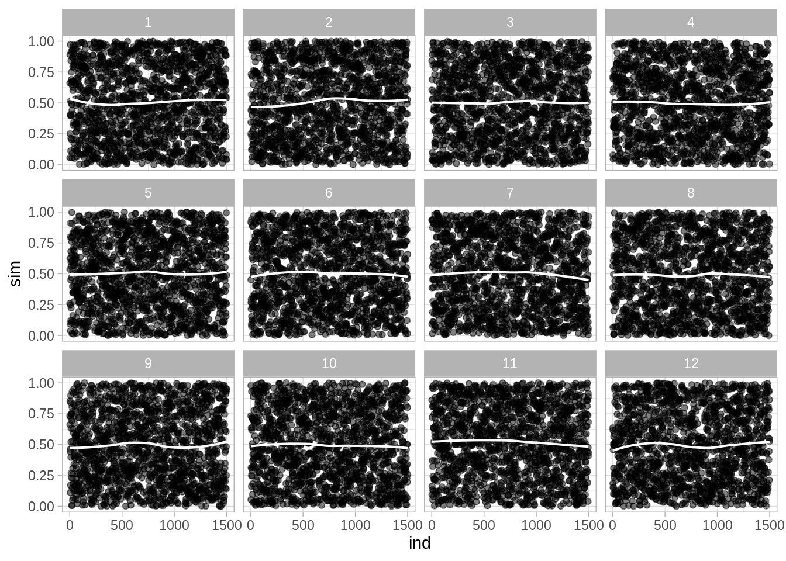

2. Comparemos con los cuantiles de una uniforme:


```r
ggplot(sucesiones) + 
    stat_qq(aes(sample = sim), distribution = qunif) +
    geom_abline(color = "white", size = 0.6, alpha = 0.6) +
    facet_wrap(~ serie) 
```

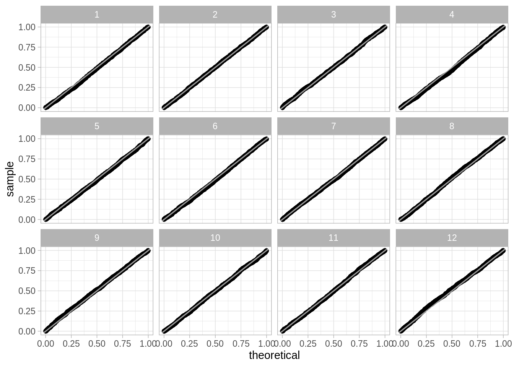

#### Ejemplo: RANDU {-}

*RANDU* fue generador de números aleatorios ampliamente utilizado en los 60´s 
y 70´s, se define como:

$$X_{n + 1}= (2 ^ {16} + 3)X_n mod(2^{31})$$

A primera vista las sucesiones se asemejan a una uniforme, sin embargo, 
cuando se grafican ternas emergen patrones no deseados.


```r
library(tourr)
library(plotly)

n <- 150000 # longitud de la sucesión
x <- rep(NA, n)
u <- rep(NA, n)
 
x[1] <- 4798373 # semilla
u[1] <- x[1] / (2 ^ 31 - 1) # transformamos al (0, 1)
for (i in 2:n) {
    x[i] <- ((2 ^ 16 + 3) * x[i - 1]) %% (2 ^ 31)
    u[i] <- x[i] / (2 ^ 31)
}
u_randu <- u

set.seed(8111938)
mat <- matrix(u[1:1500], ncol = 3, byrow = TRUE)
tour <- new_tour(mat, grand_tour(), NULL)
steps <- seq(0, 1, 0.01)
names(steps) <- steps
mat_xy <- map_dfr(steps, ~data.frame(center(mat %*% tour(.)$proj)), 
    .id = "steps")
# step 0.72
mat_xy %>% 
    mutate(steps = as.numeric(steps)) %>% 
    plot_ly(x = ~X1, y = ~X2, frame = ~steps, type = 'scatter', 
        mode = 'markers', showlegend = F, marker = list(size = 5, 
            color = "black"), opacity = 0.5) %>% 
    animation_opts(frame = 250)
```

<!--html_preserve--><div id="htmlwidget-6bfbdb6ceda60bd37049" style="width:450px;height:480px;" class="plotly html-widget"></div>
<script type="application/json" data-for="htmlwidget-6bfbdb6ceda60bd37049">{"x":{"visdat":{"37b73e9a320a":["function () ","plotlyVisDat"]},"cur_data":"37b73e9a320a","attrs":{"37b73e9a320a":{"x":{},"y":{},"mode":"markers","showlegend":false,"marker":{"size":5,"color":"black"},"opacity":0.5,"frame":{},"alpha_stroke":1,"sizes":[10,100],"spans":[1,20],"type":"scatter"}},"layout":{"margin":{"b":40,"l":60,"t":25,"r":10},"xaxis":{"domain":[0,1],"automargin":true,"title":"X1","range":[-0.91804891294314,0.858173614686976]},"yaxis":{"domain":[0,1],"automargin":true,"title":"X2","range":[-0.891361825828167,0.859199759872659]},"hovermode":"closest","showlegend":false,"sliders":[{"currentvalue":{"prefix":"steps: ","xanchor":"right","font":{"size":16,"color":"rgba(204,204,204,1)"}},"steps":[{"method":"animate","args":[["0"],{"transition":{"duration":250,"easing":"linear"},"frame":{"duration":250,"redraw":true},"mode":"immediate"}],"label":"0","value":"0"},{"method":"animate","args":[["0.01"],{"transition":{"duration":250,"easing":"linear"},"frame":{"duration":250,"redraw":true},"mode":"immediate"}],"label":"0.01","value":"0.01"},{"method":"animate","args":[["0.02"],{"transition":{"duration":250,"easing":"linear"},"frame":{"duration":250,"redraw":true},"mode":"immediate"}],"label":"0.02","value":"0.02"},{"method":"animate","args":[["0.03"],{"transition":{"duration":250,"easing":"linear"},"frame":{"duration":250,"redraw":true},"mode":"immediate"}],"label":"0.03","value":"0.03"},{"method":"animate","args":[["0.04"],{"transition":{"duration":250,"easing":"linear"},"frame":{"duration":250,"redraw":true},"mode":"immediate"}],"label":"0.04","value":"0.04"},{"method":"animate","args":[["0.05"],{"transition":{"duration":250,"easing":"linear"},"frame":{"duration":250,"redraw":true},"mode":"immediate"}],"label":"0.05","value":"0.05"},{"method":"animate","args":[["0.06"],{"transition":{"duration":250,"easing":"linear"},"frame":{"duration":250,"redraw":true},"mode":"immediate"}],"label":"0.06","value":"0.06"},{"method":"animate","args":[["0.07"],{"transition":{"duration":250,"easing":"linear"},"frame":{"duration":250,"redraw":true},"mode":"immediate"}],"label":"0.07","value":"0.07"},{"method":"animate","args":[["0.08"],{"transition":{"duration":250,"easing":"linear"},"frame":{"duration":250,"redraw":true},"mode":"immediate"}],"label":"0.08","value":"0.08"},{"method":"animate","args":[["0.09"],{"transition":{"duration":250,"easing":"linear"},"frame":{"duration":250,"redraw":true},"mode":"immediate"}],"label":"0.09","value":"0.09"},{"method":"animate","args":[["0.1"],{"transition":{"duration":250,"easing":"linear"},"frame":{"duration":250,"redraw":true},"mode":"immediate"}],"label":"0.1","value":"0.1"},{"method":"animate","args":[["0.11"],{"transition":{"duration":250,"easing":"linear"},"frame":{"duration":250,"redraw":true},"mode":"immediate"}],"label":"0.11","value":"0.11"},{"method":"animate","args":[["0.12"],{"transition":{"duration":250,"easing":"linear"},"frame":{"duration":250,"redraw":true},"mode":"immediate"}],"label":"0.12","value":"0.12"},{"method":"animate","args":[["0.13"],{"transition":{"duration":250,"easing":"linear"},"frame":{"duration":250,"redraw":true},"mode":"immediate"}],"label":"0.13","value":"0.13"},{"method":"animate","args":[["0.14"],{"transition":{"duration":250,"easing":"linear"},"frame":{"duration":250,"redraw":true},"mode":"immediate"}],"label":"0.14","value":"0.14"},{"method":"animate","args":[["0.15"],{"transition":{"duration":250,"easing":"linear"},"frame":{"duration":250,"redraw":true},"mode":"immediate"}],"label":"0.15","value":"0.15"},{"method":"animate","args":[["0.16"],{"transition":{"duration":250,"easing":"linear"},"frame":{"duration":250,"redraw":true},"mode":"immediate"}],"label":"0.16","value":"0.16"},{"method":"animate","args":[["0.17"],{"transition":{"duration":250,"easing":"linear"},"frame":{"duration":250,"redraw":true},"mode":"immediate"}],"label":"0.17","value":"0.17"},{"method":"animate","args":[["0.18"],{"transition":{"duration":250,"easing":"linear"},"frame":{"duration":250,"redraw":true},"mode":"immediate"}],"label":"0.18","value":"0.18"},{"method":"animate","args":[["0.19"],{"transition":{"duration":250,"easing":"linear"},"frame":{"duration":250,"redraw":true},"mode":"immediate"}],"label":"0.19","value":"0.19"},{"method":"animate","args":[["0.2"],{"transition":{"duration":250,"easing":"linear"},"frame":{"duration":250,"redraw":true},"mode":"immediate"}],"label":"0.2","value":"0.2"},{"method":"animate","args":[["0.21"],{"transition":{"duration":250,"easing":"linear"},"frame":{"duration":250,"redraw":true},"mode":"immediate"}],"label":"0.21","value":"0.21"},{"method":"animate","args":[["0.22"],{"transition":{"duration":250,"easing":"linear"},"frame":{"duration":250,"redraw":true},"mode":"immediate"}],"label":"0.22","value":"0.22"},{"method":"animate","args":[["0.23"],{"transition":{"duration":250,"easing":"linear"},"frame":{"duration":250,"redraw":true},"mode":"immediate"}],"label":"0.23","value":"0.23"},{"method":"animate","args":[["0.24"],{"transition":{"duration":250,"easing":"linear"},"frame":{"duration":250,"redraw":true},"mode":"immediate"}],"label":"0.24","value":"0.24"},{"method":"animate","args":[["0.25"],{"transition":{"duration":250,"easing":"linear"},"frame":{"duration":250,"redraw":true},"mode":"immediate"}],"label":"0.25","value":"0.25"},{"method":"animate","args":[["0.26"],{"transition":{"duration":250,"easing":"linear"},"frame":{"duration":250,"redraw":true},"mode":"immediate"}],"label":"0.26","value":"0.26"},{"method":"animate","args":[["0.27"],{"transition":{"duration":250,"easing":"linear"},"frame":{"duration":250,"redraw":true},"mode":"immediate"}],"label":"0.27","value":"0.27"},{"method":"animate","args":[["0.28"],{"transition":{"duration":250,"easing":"linear"},"frame":{"duration":250,"redraw":true},"mode":"immediate"}],"label":"0.28","value":"0.28"},{"method":"animate","args":[["0.29"],{"transition":{"duration":250,"easing":"linear"},"frame":{"duration":250,"redraw":true},"mode":"immediate"}],"label":"0.29","value":"0.29"},{"method":"animate","args":[["0.3"],{"transition":{"duration":250,"easing":"linear"},"frame":{"duration":250,"redraw":true},"mode":"immediate"}],"label":"0.3","value":"0.3"},{"method":"animate","args":[["0.31"],{"transition":{"duration":250,"easing":"linear"},"frame":{"duration":250,"redraw":true},"mode":"immediate"}],"label":"0.31","value":"0.31"},{"method":"animate","args":[["0.32"],{"transition":{"duration":250,"easing":"linear"},"frame":{"duration":250,"redraw":true},"mode":"immediate"}],"label":"0.32","value":"0.32"},{"method":"animate","args":[["0.33"],{"transition":{"duration":250,"easing":"linear"},"frame":{"duration":250,"redraw":true},"mode":"immediate"}],"label":"0.33","value":"0.33"},{"method":"animate","args":[["0.34"],{"transition":{"duration":250,"easing":"linear"},"frame":{"duration":250,"redraw":true},"mode":"immediate"}],"label":"0.34","value":"0.34"},{"method":"animate","args":[["0.35"],{"transition":{"duration":250,"easing":"linear"},"frame":{"duration":250,"redraw":true},"mode":"immediate"}],"label":"0.35","value":"0.35"},{"method":"animate","args":[["0.36"],{"transition":{"duration":250,"easing":"linear"},"frame":{"duration":250,"redraw":true},"mode":"immediate"}],"label":"0.36","value":"0.36"},{"method":"animate","args":[["0.37"],{"transition":{"duration":250,"easing":"linear"},"frame":{"duration":250,"redraw":true},"mode":"immediate"}],"label":"0.37","value":"0.37"},{"method":"animate","args":[["0.38"],{"transition":{"duration":250,"easing":"linear"},"frame":{"duration":250,"redraw":true},"mode":"immediate"}],"label":"0.38","value":"0.38"},{"method":"animate","args":[["0.39"],{"transition":{"duration":250,"easing":"linear"},"frame":{"duration":250,"redraw":true},"mode":"immediate"}],"label":"0.39","value":"0.39"},{"method":"animate","args":[["0.4"],{"transition":{"duration":250,"easing":"linear"},"frame":{"duration":250,"redraw":true},"mode":"immediate"}],"label":"0.4","value":"0.4"},{"method":"animate","args":[["0.41"],{"transition":{"duration":250,"easing":"linear"},"frame":{"duration":250,"redraw":true},"mode":"immediate"}],"label":"0.41","value":"0.41"},{"method":"animate","args":[["0.42"],{"transition":{"duration":250,"easing":"linear"},"frame":{"duration":250,"redraw":true},"mode":"immediate"}],"label":"0.42","value":"0.42"},{"method":"animate","args":[["0.43"],{"transition":{"duration":250,"easing":"linear"},"frame":{"duration":250,"redraw":true},"mode":"immediate"}],"label":"0.43","value":"0.43"},{"method":"animate","args":[["0.44"],{"transition":{"duration":250,"easing":"linear"},"frame":{"duration":250,"redraw":true},"mode":"immediate"}],"label":"0.44","value":"0.44"},{"method":"animate","args":[["0.45"],{"transition":{"duration":250,"easing":"linear"},"frame":{"duration":250,"redraw":true},"mode":"immediate"}],"label":"0.45","value":"0.45"},{"method":"animate","args":[["0.46"],{"transition":{"duration":250,"easing":"linear"},"frame":{"duration":250,"redraw":true},"mode":"immediate"}],"label":"0.46","value":"0.46"},{"method":"animate","args":[["0.47"],{"transition":{"duration":250,"easing":"linear"},"frame":{"duration":250,"redraw":true},"mode":"immediate"}],"label":"0.47","value":"0.47"},{"method":"animate","args":[["0.48"],{"transition":{"duration":250,"easing":"linear"},"frame":{"duration":250,"redraw":true},"mode":"immediate"}],"label":"0.48","value":"0.48"},{"method":"animate","args":[["0.49"],{"transition":{"duration":250,"easing":"linear"},"frame":{"duration":250,"redraw":true},"mode":"immediate"}],"label":"0.49","value":"0.49"},{"method":"animate","args":[["0.5"],{"transition":{"duration":250,"easing":"linear"},"frame":{"duration":250,"redraw":true},"mode":"immediate"}],"label":"0.5","value":"0.5"},{"method":"animate","args":[["0.51"],{"transition":{"duration":250,"easing":"linear"},"frame":{"duration":250,"redraw":true},"mode":"immediate"}],"label":"0.51","value":"0.51"},{"method":"animate","args":[["0.52"],{"transition":{"duration":250,"easing":"linear"},"frame":{"duration":250,"redraw":true},"mode":"immediate"}],"label":"0.52","value":"0.52"},{"method":"animate","args":[["0.53"],{"transition":{"duration":250,"easing":"linear"},"frame":{"duration":250,"redraw":true},"mode":"immediate"}],"label":"0.53","value":"0.53"},{"method":"animate","args":[["0.54"],{"transition":{"duration":250,"easing":"linear"},"frame":{"duration":250,"redraw":true},"mode":"immediate"}],"label":"0.54","value":"0.54"},{"method":"animate","args":[["0.55"],{"transition":{"duration":250,"easing":"linear"},"frame":{"duration":250,"redraw":true},"mode":"immediate"}],"label":"0.55","value":"0.55"},{"method":"animate","args":[["0.56"],{"transition":{"duration":250,"easing":"linear"},"frame":{"duration":250,"redraw":true},"mode":"immediate"}],"label":"0.56","value":"0.56"},{"method":"animate","args":[["0.57"],{"transition":{"duration":250,"easing":"linear"},"frame":{"duration":250,"redraw":true},"mode":"immediate"}],"label":"0.57","value":"0.57"},{"method":"animate","args":[["0.58"],{"transition":{"duration":250,"easing":"linear"},"frame":{"duration":250,"redraw":true},"mode":"immediate"}],"label":"0.58","value":"0.58"},{"method":"animate","args":[["0.59"],{"transition":{"duration":250,"easing":"linear"},"frame":{"duration":250,"redraw":true},"mode":"immediate"}],"label":"0.59","value":"0.59"},{"method":"animate","args":[["0.6"],{"transition":{"duration":250,"easing":"linear"},"frame":{"duration":250,"redraw":true},"mode":"immediate"}],"label":"0.6","value":"0.6"},{"method":"animate","args":[["0.61"],{"transition":{"duration":250,"easing":"linear"},"frame":{"duration":250,"redraw":true},"mode":"immediate"}],"label":"0.61","value":"0.61"},{"method":"animate","args":[["0.62"],{"transition":{"duration":250,"easing":"linear"},"frame":{"duration":250,"redraw":true},"mode":"immediate"}],"label":"0.62","value":"0.62"},{"method":"animate","args":[["0.63"],{"transition":{"duration":250,"easing":"linear"},"frame":{"duration":250,"redraw":true},"mode":"immediate"}],"label":"0.63","value":"0.63"},{"method":"animate","args":[["0.64"],{"transition":{"duration":250,"easing":"linear"},"frame":{"duration":250,"redraw":true},"mode":"immediate"}],"label":"0.64","value":"0.64"},{"method":"animate","args":[["0.65"],{"transition":{"duration":250,"easing":"linear"},"frame":{"duration":250,"redraw":true},"mode":"immediate"}],"label":"0.65","value":"0.65"},{"method":"animate","args":[["0.66"],{"transition":{"duration":250,"easing":"linear"},"frame":{"duration":250,"redraw":true},"mode":"immediate"}],"label":"0.66","value":"0.66"},{"method":"animate","args":[["0.67"],{"transition":{"duration":250,"easing":"linear"},"frame":{"duration":250,"redraw":true},"mode":"immediate"}],"label":"0.67","value":"0.67"},{"method":"animate","args":[["0.68"],{"transition":{"duration":250,"easing":"linear"},"frame":{"duration":250,"redraw":true},"mode":"immediate"}],"label":"0.68","value":"0.68"},{"method":"animate","args":[["0.69"],{"transition":{"duration":250,"easing":"linear"},"frame":{"duration":250,"redraw":true},"mode":"immediate"}],"label":"0.69","value":"0.69"},{"method":"animate","args":[["0.7"],{"transition":{"duration":250,"easing":"linear"},"frame":{"duration":250,"redraw":true},"mode":"immediate"}],"label":"0.7","value":"0.7"},{"method":"animate","args":[["0.71"],{"transition":{"duration":250,"easing":"linear"},"frame":{"duration":250,"redraw":true},"mode":"immediate"}],"label":"0.71","value":"0.71"},{"method":"animate","args":[["0.72"],{"transition":{"duration":250,"easing":"linear"},"frame":{"duration":250,"redraw":true},"mode":"immediate"}],"label":"0.72","value":"0.72"},{"method":"animate","args":[["0.73"],{"transition":{"duration":250,"easing":"linear"},"frame":{"duration":250,"redraw":true},"mode":"immediate"}],"label":"0.73","value":"0.73"},{"method":"animate","args":[["0.74"],{"transition":{"duration":250,"easing":"linear"},"frame":{"duration":250,"redraw":true},"mode":"immediate"}],"label":"0.74","value":"0.74"},{"method":"animate","args":[["0.75"],{"transition":{"duration":250,"easing":"linear"},"frame":{"duration":250,"redraw":true},"mode":"immediate"}],"label":"0.75","value":"0.75"},{"method":"animate","args":[["0.76"],{"transition":{"duration":250,"easing":"linear"},"frame":{"duration":250,"redraw":true},"mode":"immediate"}],"label":"0.76","value":"0.76"},{"method":"animate","args":[["0.77"],{"transition":{"duration":250,"easing":"linear"},"frame":{"duration":250,"redraw":true},"mode":"immediate"}],"label":"0.77","value":"0.77"},{"method":"animate","args":[["0.78"],{"transition":{"duration":250,"easing":"linear"},"frame":{"duration":250,"redraw":true},"mode":"immediate"}],"label":"0.78","value":"0.78"},{"method":"animate","args":[["0.79"],{"transition":{"duration":250,"easing":"linear"},"frame":{"duration":250,"redraw":true},"mode":"immediate"}],"label":"0.79","value":"0.79"},{"method":"animate","args":[["0.8"],{"transition":{"duration":250,"easing":"linear"},"frame":{"duration":250,"redraw":true},"mode":"immediate"}],"label":"0.8","value":"0.8"},{"method":"animate","args":[["0.81"],{"transition":{"duration":250,"easing":"linear"},"frame":{"duration":250,"redraw":true},"mode":"immediate"}],"label":"0.81","value":"0.81"},{"method":"animate","args":[["0.82"],{"transition":{"duration":250,"easing":"linear"},"frame":{"duration":250,"redraw":true},"mode":"immediate"}],"label":"0.82","value":"0.82"},{"method":"animate","args":[["0.83"],{"transition":{"duration":250,"easing":"linear"},"frame":{"duration":250,"redraw":true},"mode":"immediate"}],"label":"0.83","value":"0.83"},{"method":"animate","args":[["0.84"],{"transition":{"duration":250,"easing":"linear"},"frame":{"duration":250,"redraw":true},"mode":"immediate"}],"label":"0.84","value":"0.84"},{"method":"animate","args":[["0.85"],{"transition":{"duration":250,"easing":"linear"},"frame":{"duration":250,"redraw":true},"mode":"immediate"}],"label":"0.85","value":"0.85"},{"method":"animate","args":[["0.86"],{"transition":{"duration":250,"easing":"linear"},"frame":{"duration":250,"redraw":true},"mode":"immediate"}],"label":"0.86","value":"0.86"},{"method":"animate","args":[["0.87"],{"transition":{"duration":250,"easing":"linear"},"frame":{"duration":250,"redraw":true},"mode":"immediate"}],"label":"0.87","value":"0.87"},{"method":"animate","args":[["0.88"],{"transition":{"duration":250,"easing":"linear"},"frame":{"duration":250,"redraw":true},"mode":"immediate"}],"label":"0.88","value":"0.88"},{"method":"animate","args":[["0.89"],{"transition":{"duration":250,"easing":"linear"},"frame":{"duration":250,"redraw":true},"mode":"immediate"}],"label":"0.89","value":"0.89"},{"method":"animate","args":[["0.9"],{"transition":{"duration":250,"easing":"linear"},"frame":{"duration":250,"redraw":true},"mode":"immediate"}],"label":"0.9","value":"0.9"},{"method":"animate","args":[["0.91"],{"transition":{"duration":250,"easing":"linear"},"frame":{"duration":250,"redraw":true},"mode":"immediate"}],"label":"0.91","value":"0.91"},{"method":"animate","args":[["0.92"],{"transition":{"duration":250,"easing":"linear"},"frame":{"duration":250,"redraw":true},"mode":"immediate"}],"label":"0.92","value":"0.92"},{"method":"animate","args":[["0.93"],{"transition":{"duration":250,"easing":"linear"},"frame":{"duration":250,"redraw":true},"mode":"immediate"}],"label":"0.93","value":"0.93"},{"method":"animate","args":[["0.94"],{"transition":{"duration":250,"easing":"linear"},"frame":{"duration":250,"redraw":true},"mode":"immediate"}],"label":"0.94","value":"0.94"},{"method":"animate","args":[["0.95"],{"transition":{"duration":250,"easing":"linear"},"frame":{"duration":250,"redraw":true},"mode":"immediate"}],"label":"0.95","value":"0.95"},{"method":"animate","args":[["0.96"],{"transition":{"duration":250,"easing":"linear"},"frame":{"duration":250,"redraw":true},"mode":"immediate"}],"label":"0.96","value":"0.96"},{"method":"animate","args":[["0.97"],{"transition":{"duration":250,"easing":"linear"},"frame":{"duration":250,"redraw":true},"mode":"immediate"}],"label":"0.97","value":"0.97"},{"method":"animate","args":[["0.98"],{"transition":{"duration":250,"easing":"linear"},"frame":{"duration":250,"redraw":true},"mode":"immediate"}],"label":"0.98","value":"0.98"},{"method":"animate","args":[["0.99"],{"transition":{"duration":250,"easing":"linear"},"frame":{"duration":250,"redraw":true},"mode":"immediate"}],"label":"0.99","value":"0.99"},{"method":"animate","args":[["1"],{"transition":{"duration":250,"easing":"linear"},"frame":{"duration":250,"redraw":true},"mode":"immediate"}],"label":"1","value":"1"}],"visible":true,"pad":{"t":40}}],"updatemenus":[{"type":"buttons","direction":"right","showactive":false,"y":0,"x":0,"yanchor":"top","xanchor":"right","pad":{"t":60,"r":5},"buttons":[{"label":"Play","method":"animate","args":[null,{"fromcurrent":true,"mode":"immediate","transition":{"duration":250,"easing":"linear"},"frame":{"duration":250,"redraw":true}}]}]}]},"source":"A","config":{"showSendToCloud":false},"data":[{"x":[-0.525382243650858,0.270230897147206,-0.0727382270582042,0.404949423301963,0.224574088495223,0.250008896369485,0.117107595693318,0.398462418843059,-0.523328938145193,-0.407728291671725,-0.179394137669357,-0.122221100699159,-0.490475372035058,-0.0553499754481038,-0.10121475588158,0.215672988820819,-0.236963861245664,0.309480347115544,-0.210268702913078,0.365454700220374,0.351575940292327,-0.10023798010871,-0.380573694217952,-0.146354283761235,-0.133770533461126,-0.200198240201922,0.0391516270153204,0.389842670787124,-0.158894166905435,-0.444454311948272,0.164452533613888,0.218767930198459,0.25870893095061,-0.180401138585063,-0.00933444182947485,0.339507874477653,0.469371020238844,0.175932303447274,-0.339991663206371,-0.283061321448537,-0.10025117601827,0.269277535755185,-0.044768047142776,-0.389660406481477,-0.0746178781576476,0.36420860924199,0.394835780750958,0.144193727899341,0.282314843874423,0.458911635357884,0.304844829630105,0.246176328886298,0.392778664272276,0.0786418173499385,0.242149587165562,0.0773305635936538,-0.020060904879125,-0.126132018487903,0.144408363293854,0.0794308003075399,0.346704080145804,0.148104608435182,-0.418487866032871,-0.235466610264035,-0.306404911536725,0.440431364256887,-0.516388115096839,0.371714946258811,-0.149319291669878,0.287700131911782,-0.279291544664653,-0.484001870822164,-0.201427259106191,0.291429542381314,-0.0911951182372889,-0.0455350760333262,0.35348479394242,-0.385612994056197,-0.182378758300098,-0.405442576479169,0.391353375654666,0.0318582434244433,-0.245128002572807,-0.130433890592309,-0.0139785116501174,-0.337395682554694,0.302105839740483,-0.393694366883489,-0.163515277761968,-0.495493836324664,-0.222891968298706,-0.490021902691575,0.358199849169699,-0.100103377919646,-0.202134747613223,0.39122383706644,-0.186544083613904,0.0555799681730547,0.323092940639702,0.260359701145438,-0.144192159730943,-0.257461055736991,-0.455674861181529,0.413804833222179,-0.136427499908956,0.300329290706662,0.00456683654710444,-0.362306046854707,0.437387331765143,0.0711617771573344,0.318508814465252,-0.34632186181471,0.436831421595065,0.388671733815221,-0.130695012021812,-0.0680868957154475,-0.0688908999748549,0.246376082677392,-0.14308774899319,-0.00376501269266216,0.438796035390345,-0.229182131212207,0.0729928197376409,0.346523624289779,-0.168352172333749,-0.375601708512755,-0.22262092362717,0.123253334689883,0.277471102219073,0.462896235663442,0.0511009128801504,-0.360768798362466,-0.402942896444352,-0.427324696999045,0.000975574743000585,-0.0964771468155107,0.410177789073435,-0.187421656768771,0.190760004710404,0.262565743554381,0.445644422810523,-0.0144905146174154,-0.326134313452991,0.283469934392718,0.39042866919562,-0.235296330969783,0.00263598878308913,0.00450637601688297,-0.347153813201936,0.299683675546197,-0.410813991535457,-0.322217311333867,0.414802722077815,-0.373095340650531,-0.207195085097106,0.129106443751601,0.348102703135459,0.0100861791558543,0.10892079342529,-0.139964054893704,0.369820333462206,0.335231729228047,-0.165372010875495,0.0171185102350989,-0.188266814310106,-0.314664229374381,-0.414223049391063,0.353316251564769,0.378818295340983,0.219778262455014,0.0406265737526097,0.306619357693938,0.271810754578559,-0.516593306880446,0.285059045445172,0.320846874643115,-0.151175194043668,0.270305611569432,0.134357187341897,-0.466365012895318,0.201037436168639,0.167253658551721,-0.193455700386318,-0.043387200307103,0.0174344698004403,-0.0981319021396361,0.322286504697053,0.272765618193892,0.113619163077323,-0.379563152413817,0.00635759104415556,0.375985730815677,-0.000316702384503764,0.220438011366872,0.465666356872765,-0.222189310561868,-0.137859225828203,-0.137253090362998,0.418846453916279,0.00634909086301716,0.334923706393687,-0.211469389121981,-0.247591268826278,0.122393858063964,0.434441014569251,-0.434170037131759,0.178456078659741,-0.522276978563519,0.0336995193771996,-0.109170876067134,-0.13103922884539,-0.15941199995205,0.25048753563687,0.0688125941939631,0.441604311954228,0.0133893828876296,0.124620966058222,0.299809746820478,-0.327820223379882,0.0675402101166526,-0.0407481050081571,-0.10607314072177,0.308556656729428,0.320516754318027,-0.298760317821058,-0.458633355420085,0.361208203624932,0.180096801746635,-0.264415443498643,-0.237864717464896,0.245301272165028,-0.0192145664207659,0.468923709731547,-0.339563048999759,0.14934866447374,-0.0625716928355416,0.077089890282599,0.108755857128648,0.00542397369071634,0.341012437272815,-0.208267503041776,-0.513374231379481,0.43593892772123,0.121654477346686,0.101001172702757,0.0990870449729243,0.0519832329861799,-0.0962234992496691,0.239291898351161,0.39983116872981,-0.521773081827911,-0.321530717980119,0.341055586379019,0.144032776731996,-0.520614822018894,0.218043078113345,-0.366330825347455,-0.404130808632823,-0.436754283118995,0.357765909660605,0.0443692201785723,-0.0842725481800756,0.435258592855183,0.26978934221342,-0.403752007145437,-0.147901154678317,-0.320311438847335,-0.145738232504578,-0.0316879307813963,-0.136839061599227,0.0423299180380979,0.372629184652118,-0.405396573800596,-0.20695289186761,-0.310216155458244,0.448123481500892,-0.322616965133699,0.227803573388604,-0.179701749790462,-0.441561784218999,-0.510623045820745,-0.343966073911639,0.00117011685296675,0.145591896403579,0.340084924738852,-0.44076883755252,-0.392289657700809,0.467978764701632,-0.418848537463697,-0.443202785771342,-0.261228915859016,0.319607075680045,0.0257994527034441,-0.269250020008536,-0.0161643965132556,-0.258475120734426,0.157326243262736,0.255117856342343,0.416670608710496,-0.149566698443147,-0.498337761122735,0.455021769184617,0.190541099201886,-0.0905126739256105,-0.461008005399259,0.42044470496848,0.109987709116189,-0.233715924989434,-0.470562190372499,0.299688741941003,-0.445833448875697,-0.21696140952036,-0.372194178957494,0.397519581396131,0.126751560162751,0.383947115767745,-0.337605402428659,0.202998578924684,0.407399337183682,0.344737876582889,-0.0471337666697821,0.472002275664357,0.17977649290487,-0.0505906376950463,-0.457820058424028,-0.510570570450278,-0.488850508440288,0.139156107235698,0.217588148456065,-0.363904453437777,0.0585369946472326,-0.221518028151246,-0.304304913241418,0.38531491198018,-0.0235752953179201,0.16350092403963,0.346577889662234,-0.145829878371211,-0.198957291055473,-0.102574679624291,-0.168029815513643,0.0344691131301204,-0.313794676769527,0.258241687346248,0.0325081864409127,-0.171610302846881,0.365713435601441,0.18357400261238,-0.360960707623514,0.0138115886636058,0.217319350134579,-0.00226552374288647,-0.217006825465711,0.264335938174275,-0.196745869327339,0.00596183203533074,0.0808153742961564,0.348992362994698,0.262317444574086,0.0808470886237898,0.46746339593455,-0.36336652151868,-0.0714700935371241,0.365946840871123,0.193965300362555,0.0300169292874614,-0.44865207802132,0.221584041047839,0.364040798883883,0.454574920613317,-0.507558968473228,-0.46216371990368,0.38478484694287,0.0268712494559565,0.27403175402805,-0.460288431119176,-0.293586262125524,0.0277458358593264,-0.146202069330963,0.209511619437484,0.226073696654288,-0.194853245835753,0.00133756865188261,0.451382626224307,-0.269288026351484,-0.268350235741588,0.151196184944359,0.123053547371177,-0.245989561636003,0.341665342826394,0.107456650029866,0.0597618859298505,0.222381673198191,-0.226666785400363,-0.0251084683425745,0.215366971123962,0.265027567189185,-0.359895616393538,-0.308322061408313,0.0456507395990172,-0.436939590234311,0.457010664422063,-0.461325135637077,0.258806016672401,-0.387313515502962,-0.253378286581489,0.000263031017033177,0.0581122975833692,0.277452162843196,-0.0503104399852476,0.35174723286554,0.00179902874305637,0.00455249790474566,0.265480637926606,0.348321180235592,-0.394903611015531,0.0802023181728998,-0.453204683583232,0.390594843219964,-0.190526429187509,0.299069821279494,0.374674931544808,-0.458315704572948,0.44406456165388,0.422772667746989,0.437796317417172,-0.229135942269119,-0.195718574892732,-0.197563425261529,0.341553837437181,-0.2012180579789,-0.527384917806836,-0.45968359019235,-0.0281710844449721,-0.0807636050470195,-0.49337640739605,-0.434520215351137,-0.461552932482215,0.172516341697422,0.119107935953883,-0.00144685115292875,0.423322432119397,0.245303529690949,-0.0245247069709025,0.18053038362786,-0.0417101975493154,0.472137372385708,0.2332898270376,-0.25935610439256,0.257624157149343,0.313442292999474,0.449010964859275,0.0782982105426469,0.230247691649942,-0.314882431734355,-0.523080821704122,-0.365933932919057,-0.103375650566073,-0.485310327816757,-0.514770734678956,0.324747010510413,0.135341853279618,-0.100972880233081,0.214391131330279,-0.482511513490232,-0.0156187634877881,0.238617810796944,-0.397421929609033,-0.0820305651016555,-0.377926125746222,-0.276591126430782,-0.096637453507634,-0.252353616613897,0.152746014673261,-0.454790991354736,0.420579474795608,-0.41493795867637,0.322050810236482,0.211653332602231,-0.0146229971162997,0.246216393452136,0.286987848956136,0.336730721782891,0.300454792011527,0.0790002936534562,-0.434389814358207,0.282873656045643,0.276489798355845,0.0466915587000528,0.2914188731499,0.0296105625145116,-0.514250445734712,-0.0244864379949888,-0.102555006366225,-0.356219340670856,-0.142107050489636,0.341256327372042,0.355019189793614,-0.273688700605186,-0.257041487466546],"y":[-0.0468667016588151,-0.35723186910525,-0.210663167502731,-0.0397462125159801,0.341185888532549,0.313059159811586,0.0947141445018351,-0.191531444642693,-0.475277097638696,-0.124507873062044,-0.332388711836189,-0.268718722019345,-0.285407805558294,0.39795910685882,0.466114277277142,-0.0279856722094119,-0.394502179440111,0.0124696057997644,0.179479779932648,-0.484402256760746,-0.0844491810761393,0.483021655377001,-0.439345350231975,0.0665965725444257,-0.206992508586496,0.187535406347364,-0.0615170427821577,-0.121199282560498,0.215195184830576,-0.111150777641684,0.0346005207635462,-0.188622723076493,0.504625572148711,-0.330221726302057,0.210016938183457,-0.013414608988911,0.0872954337634146,0.407235631044954,0.266385117802769,0.424053584482521,-0.381825061257929,0.160415859218687,-0.0730416902564466,0.0266196106337012,-0.401116573926061,-0.151958889070898,0.122234637174755,0.292732795026153,-0.387447314079851,-0.410330279473215,0.205289127562195,0.130418879237026,0.300877740863711,0.0860672977529466,0.221793243918568,0.147807364609092,0.208355127159506,0.413640321489423,0.359721916053444,-0.204778643999249,-0.381291324015707,-0.392067766491324,-0.296251928176731,-0.266170094463974,0.508502794686705,0.411182032223791,0.419324668381363,-0.194137143645436,-0.257056751962751,-0.441054633561522,0.491454223427922,-0.0186118136383592,-0.361134560521692,-0.0192218709029258,0.143145846460015,-0.343348148021847,0.01991019237414,0.28998255103454,0.0585597700215876,-0.321019868109375,-0.111112968739122,-0.0625842052735389,-0.464160619046539,0.473244470801204,-0.157675036903471,0.404361048039049,-0.30536924835667,-0.355111176822335,0.352210758510977,-0.190538882020861,-0.136710328724235,0.434519497003406,0.039914733055979,0.304714524444193,0.270776177082211,0.39905749752745,0.067304028455168,-0.364465906027705,0.168236585590988,-0.305546628985554,-0.229956606145948,0.239868053492159,0.505273023877293,0.334964548494667,-0.341916532929987,0.261383624073118,0.285900460813194,-0.196004810485989,-0.0916634441576899,-0.148286885324866,-0.270808761682361,0.391498525884003,0.474539919082075,0.136762515898794,0.359607102606446,-0.367058294568211,-0.0606934518776834,0.222082593735307,0.152018735442311,0.224833135750145,0.233363447967917,-0.387697516683489,-0.143587214615196,-0.208187672052533,0.346977418545634,0.419625782664865,-0.372713600959629,-0.119697759602219,0.1585683359541,-0.263610853556544,0.0827292523123324,-0.446275877509266,0.505509933713824,-0.453316620294005,-0.0818069183491171,-0.0357251416184008,-0.377881915982813,-0.447962968353182,0.199948715303093,0.276266810741276,0.0698265789784491,0.286162489350885,0.463230604562908,0.316030164506286,0.284550411883742,-0.106235428456217,-0.259931144978851,0.32337777062878,-0.133763441558927,-0.0515883776582778,-0.35819124218449,0.17963248982653,-0.264397741969675,-0.315530894998461,-0.378682179119438,0.487217036332935,0.283060794953257,0.0180956956706941,-0.46011969980225,-0.124193678352982,-0.3651652203165,-0.267698122862727,-0.336220768954605,-0.0899577017165721,0.161256930116564,0.201071032579988,0.215565959248692,-0.0261886964775623,0.35225835281983,0.0275430393181741,-0.394982827570289,0.506083903159946,0.185044324282557,-0.0287396374382078,0.464779431257397,-0.0366827647425235,0.108957572165877,-0.460523350838572,-0.384298799302429,-0.116580146107823,-0.227470943447202,-0.382472178641707,0.0868523812629282,0.426279072906822,-0.382283748801798,-0.486734329465777,0.315231340263039,-0.234149190340191,0.466328924778849,-0.209446049038321,-0.349840556945652,-0.291188071224839,0.22364242214337,0.266826973553747,0.287363084290177,-0.0852249141074717,-0.175801554437727,-0.450289300385863,-0.242256780829281,0.0930660714171826,-0.455206664022058,0.487706334587187,0.0958323946930469,-0.448936345729977,-0.190346145745367,-0.0900635781921446,-0.187060719098896,0.469101925637573,-0.38719953757152,0.0299534362517297,-0.200019297864288,0.276935142721981,-0.317401895042509,-0.111389121714979,0.285001168284565,0.50676507249102,-0.486505510028452,0.210996867414564,-0.0296200939677655,0.497830835428089,0.38994587052241,0.0524302360378205,0.474725390110165,0.327561249282211,-0.472469674166292,-0.391480876807123,0.204457374546677,0.344289672818035,0.456248542550951,-0.435717931691557,-0.219923576083034,-0.323468650434166,-0.228987904008478,0.357331604953855,0.142120944593102,0.0938232515715062,0.374319231394678,-0.269879645410925,0.46181171599403,-0.405873576853424,0.336118145171553,-0.0537503796853124,-0.0186160781644286,0.0927908246181905,0.495857766155153,0.0458404806219041,-0.0908933186195791,-0.411917323920876,-0.068273963149637,-0.485032616857439,0.493990080688149,0.178274301137775,0.422075694683939,-0.255845761600882,0.4051797038652,0.305296470668167,0.024037553254515,-0.349066986445338,-0.458961335685104,-0.400046753440052,-0.105678716417402,-0.158535173837095,0.392917135987431,-0.296300674531609,0.477203695360571,-0.31377646208182,0.0886093846298755,0.441979882564396,0.184704518202692,-0.315258151594549,0.240498299036175,-0.275867084715515,-0.306050317104906,0.494419888850302,-0.27661257770285,-0.455145912919194,-0.0132778973542154,-0.0016036841310561,0.507020483050495,0.462224071171135,0.256199954334647,-0.212518094781786,-0.331711573269218,-0.0727016057111323,-0.194117540236563,0.431155645545572,-0.291876053180546,-0.159740219566971,0.0657031669057906,-0.0873766678608953,0.298083516094834,-0.291867005381733,-0.149669268842787,-0.397061339322478,-0.418383082117885,-0.220937813375145,-0.0153428034149111,0.149186820980161,0.155024277303368,-0.471849265251309,0.421473777178675,-0.348269409243018,-0.146899407472461,-0.1301364104487,-0.0236658619008958,0.505518929358572,0.464467766020447,0.471992117609829,-0.195394823070615,0.28045807152614,0.501594135794789,-0.453818554732949,-0.254294695075601,0.0158451211415231,0.150501506660134,0.490020302381366,-0.340469771739095,0.303864144977182,-0.474840318527073,-0.244306633923203,-0.119933770712465,-0.462855233553797,0.35156849238649,0.320196104492992,-0.0888090522252022,-0.304616740647703,0.206527332101017,0.132112120535225,0.489661662165076,0.046026141639799,0.436092185113579,-0.0900470043756068,0.140291070822626,0.134016269143671,-0.121279841031879,-0.332939366552979,0.348310573283583,0.435601429339498,-0.481898484494537,0.338072103705257,0.473921051505953,0.0512054350934922,0.190679202113301,-0.118053014133126,-0.46596884888038,-0.187638281587511,0.472855882976204,0.236557212915271,-0.0238169373236596,0.177709424193948,-0.127111529674381,0.499839415099472,-0.430334197100252,0.293052003975958,0.452470155689865,-0.287490236315876,-0.461184004064649,-0.409521690312773,0.00299994114413854,-0.382658685300499,0.0635061546005308,0.301546187397093,-0.098460329439491,-0.229996147308499,0.271820461634546,0.259528571065515,-0.228541439142078,0.376466234471649,-0.15008194905147,0.365722076293081,0.0727652332521976,0.231961232867092,0.39408378887549,0.0948180940710008,-0.252872755493969,0.136512880470604,-0.370033444579691,0.41433638453111,0.0425781181789934,0.162026313390583,-0.375994974490255,0.493121170695871,-0.357088124122471,0.145940115001053,0.11204095024243,-0.426100267771631,0.226765068504959,-0.213558840308338,0.0701199381388725,0.384903499182314,-0.418613692488521,-0.285758043382317,-0.347520263608545,0.465551645752043,0.396093296144158,-0.0840795065499843,-0.378273987885565,-0.218802815977484,-0.139582639303058,-0.116177419874817,0.396195633593947,0.00193555771931997,0.191935481760651,-0.132473307404667,-0.160492548462003,-0.179524264041334,0.218789825472981,-0.398128683421761,-0.0826994196735323,-0.315926193002611,0.141894774768501,-0.1134552086927,0.346160179261118,0.31552907198295,-0.398168539371342,0.39223765328154,0.359730733815581,0.398242638703436,0.175429793331772,0.0683574800156057,-0.282983163114637,-0.199661484662443,0.427037993703038,-0.472693766210228,0.0778714700378477,-0.287152795795351,-0.360520375635475,-0.219679894600064,-0.129328215237707,0.076951795514673,0.34969812098518,-0.300128142092377,-0.222817616280168,-0.324703438881785,-0.185911176469177,-0.41636432961002,-0.0403938980065285,0.262358048256487,-0.471481492485851,0.195014481689781,0.154822288338095,0.108878673311323,-0.0719675847552717,-0.344770165834576,-0.23918741356954,0.335362815555185,0.391248787079006,-0.438025782559067,0.0402742161192001,0.409635410901159,-0.325559107329697,-0.290374087844044,-0.433579245325178,0.183463045652956,-0.0996934377811849,-0.213973666284233,0.0359704180397094,-0.156762449745089,0.226425217721611,0.420819876041263,-0.425678157921881,0.149722093041986,0.318402404222637,-0.0396437446810305,-0.342082636173814,0.341859773989767,-0.247298178937286,0.344155353751034,-0.221206197258085,0.079644718464464,0.474164853129536,0.457934563305229,-0.0236792580448091,-0.198944329027087,0.433217602107674,0.338198629464954,0.361126309517771,-0.131947911087424,-0.472234582271427,-0.396608005020767,-0.243789540346712,-0.123367263678461,-0.0252250709794463,0.486613643612713,-0.41975424599275,0.505956777628511,0.236543575558811,-0.155105556104332,0.0980656428970396,0.28152737140283,-0.373343361284584,-0.479963007126003,0.163340246561915,-0.372562235895544,-0.279368227090687,0.426017959859222,-0.421560363586992,-0.417320116166025,-0.303748963143676,-0.262047069821507],"mode":"markers","showlegend":false,"marker":{"color":"black","size":5,"line":{"color":"rgba(31,119,180,1)"}},"opacity":0.5,"frame":"0","type":"scatter","error_y":{"color":"rgba(31,119,180,1)"},"error_x":{"color":"rgba(31,119,180,1)"},"line":{"color":"rgba(31,119,180,1)"},"xaxis":"x","yaxis":"y","visible":true}],"highlight":{"on":"plotly_click","persistent":false,"dynamic":false,"selectize":false,"opacityDim":0.2,"selected":{"opacity":1},"debounce":0},"frames":[{"name":"0","data":[{"x":[-0.525382243650858,0.270230897147206,-0.0727382270582042,0.404949423301963,0.224574088495223,0.250008896369485,0.117107595693318,0.398462418843059,-0.523328938145193,-0.407728291671725,-0.179394137669357,-0.122221100699159,-0.490475372035058,-0.0553499754481038,-0.10121475588158,0.215672988820819,-0.236963861245664,0.309480347115544,-0.210268702913078,0.365454700220374,0.351575940292327,-0.10023798010871,-0.380573694217952,-0.146354283761235,-0.133770533461126,-0.200198240201922,0.0391516270153204,0.389842670787124,-0.158894166905435,-0.444454311948272,0.164452533613888,0.218767930198459,0.25870893095061,-0.180401138585063,-0.00933444182947485,0.339507874477653,0.469371020238844,0.175932303447274,-0.339991663206371,-0.283061321448537,-0.10025117601827,0.269277535755185,-0.044768047142776,-0.389660406481477,-0.0746178781576476,0.36420860924199,0.394835780750958,0.144193727899341,0.282314843874423,0.458911635357884,0.304844829630105,0.246176328886298,0.392778664272276,0.0786418173499385,0.242149587165562,0.0773305635936538,-0.020060904879125,-0.126132018487903,0.144408363293854,0.0794308003075399,0.346704080145804,0.148104608435182,-0.418487866032871,-0.235466610264035,-0.306404911536725,0.440431364256887,-0.516388115096839,0.371714946258811,-0.149319291669878,0.287700131911782,-0.279291544664653,-0.484001870822164,-0.201427259106191,0.291429542381314,-0.0911951182372889,-0.0455350760333262,0.35348479394242,-0.385612994056197,-0.182378758300098,-0.405442576479169,0.391353375654666,0.0318582434244433,-0.245128002572807,-0.130433890592309,-0.0139785116501174,-0.337395682554694,0.302105839740483,-0.393694366883489,-0.163515277761968,-0.495493836324664,-0.222891968298706,-0.490021902691575,0.358199849169699,-0.100103377919646,-0.202134747613223,0.39122383706644,-0.186544083613904,0.0555799681730547,0.323092940639702,0.260359701145438,-0.144192159730943,-0.257461055736991,-0.455674861181529,0.413804833222179,-0.136427499908956,0.300329290706662,0.00456683654710444,-0.362306046854707,0.437387331765143,0.0711617771573344,0.318508814465252,-0.34632186181471,0.436831421595065,0.388671733815221,-0.130695012021812,-0.0680868957154475,-0.0688908999748549,0.246376082677392,-0.14308774899319,-0.00376501269266216,0.438796035390345,-0.229182131212207,0.0729928197376409,0.346523624289779,-0.168352172333749,-0.375601708512755,-0.22262092362717,0.123253334689883,0.277471102219073,0.462896235663442,0.0511009128801504,-0.360768798362466,-0.402942896444352,-0.427324696999045,0.000975574743000585,-0.0964771468155107,0.410177789073435,-0.187421656768771,0.190760004710404,0.262565743554381,0.445644422810523,-0.0144905146174154,-0.326134313452991,0.283469934392718,0.39042866919562,-0.235296330969783,0.00263598878308913,0.00450637601688297,-0.347153813201936,0.299683675546197,-0.410813991535457,-0.322217311333867,0.414802722077815,-0.373095340650531,-0.207195085097106,0.129106443751601,0.348102703135459,0.0100861791558543,0.10892079342529,-0.139964054893704,0.369820333462206,0.335231729228047,-0.165372010875495,0.0171185102350989,-0.188266814310106,-0.314664229374381,-0.414223049391063,0.353316251564769,0.378818295340983,0.219778262455014,0.0406265737526097,0.306619357693938,0.271810754578559,-0.516593306880446,0.285059045445172,0.320846874643115,-0.151175194043668,0.270305611569432,0.134357187341897,-0.466365012895318,0.201037436168639,0.167253658551721,-0.193455700386318,-0.043387200307103,0.0174344698004403,-0.0981319021396361,0.322286504697053,0.272765618193892,0.113619163077323,-0.379563152413817,0.00635759104415556,0.375985730815677,-0.000316702384503764,0.220438011366872,0.465666356872765,-0.222189310561868,-0.137859225828203,-0.137253090362998,0.418846453916279,0.00634909086301716,0.334923706393687,-0.211469389121981,-0.247591268826278,0.122393858063964,0.434441014569251,-0.434170037131759,0.178456078659741,-0.522276978563519,0.0336995193771996,-0.109170876067134,-0.13103922884539,-0.15941199995205,0.25048753563687,0.0688125941939631,0.441604311954228,0.0133893828876296,0.124620966058222,0.299809746820478,-0.327820223379882,0.0675402101166526,-0.0407481050081571,-0.10607314072177,0.308556656729428,0.320516754318027,-0.298760317821058,-0.458633355420085,0.361208203624932,0.180096801746635,-0.264415443498643,-0.237864717464896,0.245301272165028,-0.0192145664207659,0.468923709731547,-0.339563048999759,0.14934866447374,-0.0625716928355416,0.077089890282599,0.108755857128648,0.00542397369071634,0.341012437272815,-0.208267503041776,-0.513374231379481,0.43593892772123,0.121654477346686,0.101001172702757,0.0990870449729243,0.0519832329861799,-0.0962234992496691,0.239291898351161,0.39983116872981,-0.521773081827911,-0.321530717980119,0.341055586379019,0.144032776731996,-0.520614822018894,0.218043078113345,-0.366330825347455,-0.404130808632823,-0.436754283118995,0.357765909660605,0.0443692201785723,-0.0842725481800756,0.435258592855183,0.26978934221342,-0.403752007145437,-0.147901154678317,-0.320311438847335,-0.145738232504578,-0.0316879307813963,-0.136839061599227,0.0423299180380979,0.372629184652118,-0.405396573800596,-0.20695289186761,-0.310216155458244,0.448123481500892,-0.322616965133699,0.227803573388604,-0.179701749790462,-0.441561784218999,-0.510623045820745,-0.343966073911639,0.00117011685296675,0.145591896403579,0.340084924738852,-0.44076883755252,-0.392289657700809,0.467978764701632,-0.418848537463697,-0.443202785771342,-0.261228915859016,0.319607075680045,0.0257994527034441,-0.269250020008536,-0.0161643965132556,-0.258475120734426,0.157326243262736,0.255117856342343,0.416670608710496,-0.149566698443147,-0.498337761122735,0.455021769184617,0.190541099201886,-0.0905126739256105,-0.461008005399259,0.42044470496848,0.109987709116189,-0.233715924989434,-0.470562190372499,0.299688741941003,-0.445833448875697,-0.21696140952036,-0.372194178957494,0.397519581396131,0.126751560162751,0.383947115767745,-0.337605402428659,0.202998578924684,0.407399337183682,0.344737876582889,-0.0471337666697821,0.472002275664357,0.17977649290487,-0.0505906376950463,-0.457820058424028,-0.510570570450278,-0.488850508440288,0.139156107235698,0.217588148456065,-0.363904453437777,0.0585369946472326,-0.221518028151246,-0.304304913241418,0.38531491198018,-0.0235752953179201,0.16350092403963,0.346577889662234,-0.145829878371211,-0.198957291055473,-0.102574679624291,-0.168029815513643,0.0344691131301204,-0.313794676769527,0.258241687346248,0.0325081864409127,-0.171610302846881,0.365713435601441,0.18357400261238,-0.360960707623514,0.0138115886636058,0.217319350134579,-0.00226552374288647,-0.217006825465711,0.264335938174275,-0.196745869327339,0.00596183203533074,0.0808153742961564,0.348992362994698,0.262317444574086,0.0808470886237898,0.46746339593455,-0.36336652151868,-0.0714700935371241,0.365946840871123,0.193965300362555,0.0300169292874614,-0.44865207802132,0.221584041047839,0.364040798883883,0.454574920613317,-0.507558968473228,-0.46216371990368,0.38478484694287,0.0268712494559565,0.27403175402805,-0.460288431119176,-0.293586262125524,0.0277458358593264,-0.146202069330963,0.209511619437484,0.226073696654288,-0.194853245835753,0.00133756865188261,0.451382626224307,-0.269288026351484,-0.268350235741588,0.151196184944359,0.123053547371177,-0.245989561636003,0.341665342826394,0.107456650029866,0.0597618859298505,0.222381673198191,-0.226666785400363,-0.0251084683425745,0.215366971123962,0.265027567189185,-0.359895616393538,-0.308322061408313,0.0456507395990172,-0.436939590234311,0.457010664422063,-0.461325135637077,0.258806016672401,-0.387313515502962,-0.253378286581489,0.000263031017033177,0.0581122975833692,0.277452162843196,-0.0503104399852476,0.35174723286554,0.00179902874305637,0.00455249790474566,0.265480637926606,0.348321180235592,-0.394903611015531,0.0802023181728998,-0.453204683583232,0.390594843219964,-0.190526429187509,0.299069821279494,0.374674931544808,-0.458315704572948,0.44406456165388,0.422772667746989,0.437796317417172,-0.229135942269119,-0.195718574892732,-0.197563425261529,0.341553837437181,-0.2012180579789,-0.527384917806836,-0.45968359019235,-0.0281710844449721,-0.0807636050470195,-0.49337640739605,-0.434520215351137,-0.461552932482215,0.172516341697422,0.119107935953883,-0.00144685115292875,0.423322432119397,0.245303529690949,-0.0245247069709025,0.18053038362786,-0.0417101975493154,0.472137372385708,0.2332898270376,-0.25935610439256,0.257624157149343,0.313442292999474,0.449010964859275,0.0782982105426469,0.230247691649942,-0.314882431734355,-0.523080821704122,-0.365933932919057,-0.103375650566073,-0.485310327816757,-0.514770734678956,0.324747010510413,0.135341853279618,-0.100972880233081,0.214391131330279,-0.482511513490232,-0.0156187634877881,0.238617810796944,-0.397421929609033,-0.0820305651016555,-0.377926125746222,-0.276591126430782,-0.096637453507634,-0.252353616613897,0.152746014673261,-0.454790991354736,0.420579474795608,-0.41493795867637,0.322050810236482,0.211653332602231,-0.0146229971162997,0.246216393452136,0.286987848956136,0.336730721782891,0.300454792011527,0.0790002936534562,-0.434389814358207,0.282873656045643,0.276489798355845,0.0466915587000528,0.2914188731499,0.0296105625145116,-0.514250445734712,-0.0244864379949888,-0.102555006366225,-0.356219340670856,-0.142107050489636,0.341256327372042,0.355019189793614,-0.273688700605186,-0.257041487466546],"y":[-0.0468667016588151,-0.35723186910525,-0.210663167502731,-0.0397462125159801,0.341185888532549,0.313059159811586,0.0947141445018351,-0.191531444642693,-0.475277097638696,-0.124507873062044,-0.332388711836189,-0.268718722019345,-0.285407805558294,0.39795910685882,0.466114277277142,-0.0279856722094119,-0.394502179440111,0.0124696057997644,0.179479779932648,-0.484402256760746,-0.0844491810761393,0.483021655377001,-0.439345350231975,0.0665965725444257,-0.206992508586496,0.187535406347364,-0.0615170427821577,-0.121199282560498,0.215195184830576,-0.111150777641684,0.0346005207635462,-0.188622723076493,0.504625572148711,-0.330221726302057,0.210016938183457,-0.013414608988911,0.0872954337634146,0.407235631044954,0.266385117802769,0.424053584482521,-0.381825061257929,0.160415859218687,-0.0730416902564466,0.0266196106337012,-0.401116573926061,-0.151958889070898,0.122234637174755,0.292732795026153,-0.387447314079851,-0.410330279473215,0.205289127562195,0.130418879237026,0.300877740863711,0.0860672977529466,0.221793243918568,0.147807364609092,0.208355127159506,0.413640321489423,0.359721916053444,-0.204778643999249,-0.381291324015707,-0.392067766491324,-0.296251928176731,-0.266170094463974,0.508502794686705,0.411182032223791,0.419324668381363,-0.194137143645436,-0.257056751962751,-0.441054633561522,0.491454223427922,-0.0186118136383592,-0.361134560521692,-0.0192218709029258,0.143145846460015,-0.343348148021847,0.01991019237414,0.28998255103454,0.0585597700215876,-0.321019868109375,-0.111112968739122,-0.0625842052735389,-0.464160619046539,0.473244470801204,-0.157675036903471,0.404361048039049,-0.30536924835667,-0.355111176822335,0.352210758510977,-0.190538882020861,-0.136710328724235,0.434519497003406,0.039914733055979,0.304714524444193,0.270776177082211,0.39905749752745,0.067304028455168,-0.364465906027705,0.168236585590988,-0.305546628985554,-0.229956606145948,0.239868053492159,0.505273023877293,0.334964548494667,-0.341916532929987,0.261383624073118,0.285900460813194,-0.196004810485989,-0.0916634441576899,-0.148286885324866,-0.270808761682361,0.391498525884003,0.474539919082075,0.136762515898794,0.359607102606446,-0.367058294568211,-0.0606934518776834,0.222082593735307,0.152018735442311,0.224833135750145,0.233363447967917,-0.387697516683489,-0.143587214615196,-0.208187672052533,0.346977418545634,0.419625782664865,-0.372713600959629,-0.119697759602219,0.1585683359541,-0.263610853556544,0.0827292523123324,-0.446275877509266,0.505509933713824,-0.453316620294005,-0.0818069183491171,-0.0357251416184008,-0.377881915982813,-0.447962968353182,0.199948715303093,0.276266810741276,0.0698265789784491,0.286162489350885,0.463230604562908,0.316030164506286,0.284550411883742,-0.106235428456217,-0.259931144978851,0.32337777062878,-0.133763441558927,-0.0515883776582778,-0.35819124218449,0.17963248982653,-0.264397741969675,-0.315530894998461,-0.378682179119438,0.487217036332935,0.283060794953257,0.0180956956706941,-0.46011969980225,-0.124193678352982,-0.3651652203165,-0.267698122862727,-0.336220768954605,-0.0899577017165721,0.161256930116564,0.201071032579988,0.215565959248692,-0.0261886964775623,0.35225835281983,0.0275430393181741,-0.394982827570289,0.506083903159946,0.185044324282557,-0.0287396374382078,0.464779431257397,-0.0366827647425235,0.108957572165877,-0.460523350838572,-0.384298799302429,-0.116580146107823,-0.227470943447202,-0.382472178641707,0.0868523812629282,0.426279072906822,-0.382283748801798,-0.486734329465777,0.315231340263039,-0.234149190340191,0.466328924778849,-0.209446049038321,-0.349840556945652,-0.291188071224839,0.22364242214337,0.266826973553747,0.287363084290177,-0.0852249141074717,-0.175801554437727,-0.450289300385863,-0.242256780829281,0.0930660714171826,-0.455206664022058,0.487706334587187,0.0958323946930469,-0.448936345729977,-0.190346145745367,-0.0900635781921446,-0.187060719098896,0.469101925637573,-0.38719953757152,0.0299534362517297,-0.200019297864288,0.276935142721981,-0.317401895042509,-0.111389121714979,0.285001168284565,0.50676507249102,-0.486505510028452,0.210996867414564,-0.0296200939677655,0.497830835428089,0.38994587052241,0.0524302360378205,0.474725390110165,0.327561249282211,-0.472469674166292,-0.391480876807123,0.204457374546677,0.344289672818035,0.456248542550951,-0.435717931691557,-0.219923576083034,-0.323468650434166,-0.228987904008478,0.357331604953855,0.142120944593102,0.0938232515715062,0.374319231394678,-0.269879645410925,0.46181171599403,-0.405873576853424,0.336118145171553,-0.0537503796853124,-0.0186160781644286,0.0927908246181905,0.495857766155153,0.0458404806219041,-0.0908933186195791,-0.411917323920876,-0.068273963149637,-0.485032616857439,0.493990080688149,0.178274301137775,0.422075694683939,-0.255845761600882,0.4051797038652,0.305296470668167,0.024037553254515,-0.349066986445338,-0.458961335685104,-0.400046753440052,-0.105678716417402,-0.158535173837095,0.392917135987431,-0.296300674531609,0.477203695360571,-0.31377646208182,0.0886093846298755,0.441979882564396,0.184704518202692,-0.315258151594549,0.240498299036175,-0.275867084715515,-0.306050317104906,0.494419888850302,-0.27661257770285,-0.455145912919194,-0.0132778973542154,-0.0016036841310561,0.507020483050495,0.462224071171135,0.256199954334647,-0.212518094781786,-0.331711573269218,-0.0727016057111323,-0.194117540236563,0.431155645545572,-0.291876053180546,-0.159740219566971,0.0657031669057906,-0.0873766678608953,0.298083516094834,-0.291867005381733,-0.149669268842787,-0.397061339322478,-0.418383082117885,-0.220937813375145,-0.0153428034149111,0.149186820980161,0.155024277303368,-0.471849265251309,0.421473777178675,-0.348269409243018,-0.146899407472461,-0.1301364104487,-0.0236658619008958,0.505518929358572,0.464467766020447,0.471992117609829,-0.195394823070615,0.28045807152614,0.501594135794789,-0.453818554732949,-0.254294695075601,0.0158451211415231,0.150501506660134,0.490020302381366,-0.340469771739095,0.303864144977182,-0.474840318527073,-0.244306633923203,-0.119933770712465,-0.462855233553797,0.35156849238649,0.320196104492992,-0.0888090522252022,-0.304616740647703,0.206527332101017,0.132112120535225,0.489661662165076,0.046026141639799,0.436092185113579,-0.0900470043756068,0.140291070822626,0.134016269143671,-0.121279841031879,-0.332939366552979,0.348310573283583,0.435601429339498,-0.481898484494537,0.338072103705257,0.473921051505953,0.0512054350934922,0.190679202113301,-0.118053014133126,-0.46596884888038,-0.187638281587511,0.472855882976204,0.236557212915271,-0.0238169373236596,0.177709424193948,-0.127111529674381,0.499839415099472,-0.430334197100252,0.293052003975958,0.452470155689865,-0.287490236315876,-0.461184004064649,-0.409521690312773,0.00299994114413854,-0.382658685300499,0.0635061546005308,0.301546187397093,-0.098460329439491,-0.229996147308499,0.271820461634546,0.259528571065515,-0.228541439142078,0.376466234471649,-0.15008194905147,0.365722076293081,0.0727652332521976,0.231961232867092,0.39408378887549,0.0948180940710008,-0.252872755493969,0.136512880470604,-0.370033444579691,0.41433638453111,0.0425781181789934,0.162026313390583,-0.375994974490255,0.493121170695871,-0.357088124122471,0.145940115001053,0.11204095024243,-0.426100267771631,0.226765068504959,-0.213558840308338,0.0701199381388725,0.384903499182314,-0.418613692488521,-0.285758043382317,-0.347520263608545,0.465551645752043,0.396093296144158,-0.0840795065499843,-0.378273987885565,-0.218802815977484,-0.139582639303058,-0.116177419874817,0.396195633593947,0.00193555771931997,0.191935481760651,-0.132473307404667,-0.160492548462003,-0.179524264041334,0.218789825472981,-0.398128683421761,-0.0826994196735323,-0.315926193002611,0.141894774768501,-0.1134552086927,0.346160179261118,0.31552907198295,-0.398168539371342,0.39223765328154,0.359730733815581,0.398242638703436,0.175429793331772,0.0683574800156057,-0.282983163114637,-0.199661484662443,0.427037993703038,-0.472693766210228,0.0778714700378477,-0.287152795795351,-0.360520375635475,-0.219679894600064,-0.129328215237707,0.076951795514673,0.34969812098518,-0.300128142092377,-0.222817616280168,-0.324703438881785,-0.185911176469177,-0.41636432961002,-0.0403938980065285,0.262358048256487,-0.471481492485851,0.195014481689781,0.154822288338095,0.108878673311323,-0.0719675847552717,-0.344770165834576,-0.23918741356954,0.335362815555185,0.391248787079006,-0.438025782559067,0.0402742161192001,0.409635410901159,-0.325559107329697,-0.290374087844044,-0.433579245325178,0.183463045652956,-0.0996934377811849,-0.213973666284233,0.0359704180397094,-0.156762449745089,0.226425217721611,0.420819876041263,-0.425678157921881,0.149722093041986,0.318402404222637,-0.0396437446810305,-0.342082636173814,0.341859773989767,-0.247298178937286,0.344155353751034,-0.221206197258085,0.079644718464464,0.474164853129536,0.457934563305229,-0.0236792580448091,-0.198944329027087,0.433217602107674,0.338198629464954,0.361126309517771,-0.131947911087424,-0.472234582271427,-0.396608005020767,-0.243789540346712,-0.123367263678461,-0.0252250709794463,0.486613643612713,-0.41975424599275,0.505956777628511,0.236543575558811,-0.155105556104332,0.0980656428970396,0.28152737140283,-0.373343361284584,-0.479963007126003,0.163340246561915,-0.372562235895544,-0.279368227090687,0.426017959859222,-0.421560363586992,-0.417320116166025,-0.303748963143676,-0.262047069821507],"mode":"markers","showlegend":false,"marker":{"color":"black","size":5,"line":{"color":"rgba(31,119,180,1)"}},"opacity":0.5,"frame":"0","type":"scatter","error_y":{"color":"rgba(31,119,180,1)"},"error_x":{"color":"rgba(31,119,180,1)"},"line":{"color":"rgba(31,119,180,1)"},"xaxis":"x","yaxis":"y","visible":true}],"traces":[0]},{"name":"0.01","data":[{"x":[-0.52608247766751,0.26963559376269,-0.0731433581239825,0.40601490342365,0.226139738155839,0.248328993218626,0.11603937904085,0.398729640783311,-0.52086473320451,-0.405605032498286,-0.181036573771878,-0.12314920322283,-0.492552065493032,-0.0530247935515908,-0.103314087874241,0.217958593947818,-0.239390136567758,0.309618873641541,-0.208394621346506,0.362808802022638,0.351498561830064,-0.102836118274351,-0.383124943621592,-0.14850978791052,-0.131865438377626,-0.198096285994737,0.0393517272431542,0.387420223374107,-0.161070659621388,-0.444542529544193,0.162233940711791,0.221005622718113,0.256649520410094,-0.182162380013365,-0.00948177640804038,0.341937875114334,0.469455099374816,0.178393724145032,-0.341825281423499,-0.281841870952908,-0.101847724695859,0.26807539876723,-0.042876165926337,-0.391543216816901,-0.0743488889009534,0.361537355118718,0.395565588082105,0.143428706127918,0.283281246416911,0.458402645081108,0.303917032089818,0.244823511215107,0.39302504716086,0.0759885813453849,0.243036867042529,0.0780062946745438,-0.0206744418634724,-0.127743991596161,0.146876707618244,0.0808239398813314,0.345205534142945,0.148102322186103,-0.416725228329032,-0.236578875805172,-0.30904476906196,0.439424258583496,-0.515550893908602,0.370769960377913,-0.151937479478825,0.285272318077805,-0.280066581549419,-0.483609208541389,-0.203209023133965,0.291716903828517,-0.0931499267414371,-0.0457225769443214,0.355515749197887,-0.385033139050362,-0.180633795615616,-0.407634474923788,0.38867833650782,0.0317393248276487,-0.245699841291538,-0.128792848702619,-0.0132473580627473,-0.338173557283893,0.30138014504306,-0.394215632210253,-0.16495479822432,-0.495491380783901,-0.222189759463864,-0.488397610674136,0.359813136997449,-0.102322123441115,-0.202815522333421,0.393610294464189,-0.185283463038241,0.0555885256312902,0.324246463703394,0.263003281913822,-0.142050378745982,-0.259824942981449,-0.454671364957889,0.413969214291149,-0.135679687830644,0.302757522304634,0.00264204420971326,-0.361058644028053,0.436315169408483,0.070329323477875,0.317461743228087,-0.347116874868402,0.438990097046032,0.388633501915459,-0.130782741769703,-0.0686015294188462,-0.0685670654856689,0.247458862738537,-0.142457400073636,-0.00412100987534469,0.43806675736678,-0.231451053552907,0.0720973014048556,0.344811547782547,-0.169857074931939,-0.373337544493873,-0.225055857429202,0.124022122937273,0.276725764664857,0.463227856166409,0.0526075386677852,-0.362136285532631,-0.404778145198821,-0.426303668333624,-1.92050702764179e-05,-0.0982968782828743,0.411645511022094,-0.185719846255839,0.189862199238179,0.262682915930842,0.445142822514506,-0.0119605609822059,-0.328268004329946,0.283315827279155,0.391088565070573,-0.236179738773158,0.00208864537020004,0.00675491715766929,-0.347182564220619,0.30141660649417,-0.412065505668166,-0.320387141732022,0.412828797776774,-0.373896762322296,-0.208689570993098,0.126714754583197,0.346759291484359,0.0116927462890196,0.109217609786459,-0.141033739035687,0.368921259156483,0.334894691742202,-0.166211047828937,0.0171694244204605,-0.19012458836852,-0.313160497305808,-0.412626016748975,0.351441271359533,0.376728342762723,0.220469131859306,0.0408961483926474,0.306834929064361,0.269935838851043,-0.517453111371034,0.285563877588162,0.323124042715121,-0.149545845505119,0.267663617271428,0.133437644784384,-0.467339801881952,0.203670667769876,0.167869515279255,-0.193161524796835,-0.0413970160564438,0.0161697756406165,-0.0962369205320578,0.32403953614763,0.273704176072564,0.111151581973148,-0.378717971589889,0.00889490801296067,0.378382710364971,-0.000467106414032137,0.218818294792303,0.46449509642068,-0.223116145133774,-0.137159839443702,-0.138431467136129,0.416353313571302,0.0053528128661261,0.335241835784488,-0.208836203120768,-0.250210973952961,0.122982429101447,0.436413734266337,-0.43444096948463,0.178689507868189,-0.523333096592286,0.0333819398636096,-0.108340541515232,-0.12922700579884,-0.158221067096754,0.253035591945476,0.066674397857761,0.43934312436994,0.0155314892154322,0.126531050920208,0.298453539020576,-0.330276001101424,0.067208589411487,-0.0428432320963837,-0.105818720491207,0.309879077099888,0.321785725826134,-0.296276299950882,-0.461127212320127,0.363039054665805,0.17940649755361,-0.26333224995328,-0.239003289646135,0.244449186503406,-0.0187685373606782,0.468429063410804,-0.338926809115102,0.148311735090144,-0.0615459657629573,0.07582396200061,0.108286349289825,0.00324524803658355,0.340032096934979,-0.205969345719613,-0.5132701104619,0.437823832930635,0.120868763539814,0.102355049533847,0.0987241544136618,0.053754169045673,-0.0966527867953114,0.238636785872298,0.39887176752849,-0.523608722969182,-0.319623398374699,0.340266982097521,0.144819718946847,-0.519525542493061,0.220451499437373,-0.366999507192461,-0.405353141686122,-0.436007943597074,0.357409345003366,0.0462487284708867,-0.0869205728836751,0.434590775753394,0.267204417724295,-0.404712113599849,-0.148618429879297,-0.320835506119352,-0.143829031530004,-0.0321010284155108,-0.136972324889222,0.0437019966441863,0.374368577738579,-0.408069794136044,-0.204317666910648,-0.309227144981355,0.448539268248134,-0.319961577498011,0.229824915363015,-0.18153963262235,-0.443870551883774,-0.509623965988054,-0.341296364252299,0.0028704023286612,0.145925288891794,0.337606283623763,-0.442035590398526,-0.394785482979068,0.470588325853101,-0.41802163961714,-0.443998304624908,-0.260269048152884,0.319293464742152,0.0281999321078918,-0.267771583065915,-0.0178914443625681,-0.25677678671804,0.156375544457662,0.253592162013711,0.417399509292283,-0.150645445350946,-0.49669510910884,0.452319536273522,0.19006295250648,-0.0889936186012646,-0.459337634776427,0.420808465872529,0.107404240995871,-0.23165336272647,-0.469194506810156,0.301469778589594,-0.444234129198328,-0.21650216216677,-0.369543127641909,0.396429226954966,0.124348698202306,0.383042578679537,-0.33588113827008,0.204724101341885,0.406477509654901,0.344105976655546,-0.0492286902315041,0.473824432376866,0.178835541304581,-0.0509097252339463,-0.459277767768986,-0.513000730540904,-0.490578499047077,0.13794848047157,0.219405962197534,-0.365165818412251,0.0597633151589781,-0.222256562675401,-0.305722626672104,0.38520269415699,-0.0244849219699814,0.162334870121103,0.348439722540835,-0.143719080264338,-0.196718385124411,-0.100603861715062,-0.168232802039968,0.03618793339718,-0.311913119392492,0.260112999927636,0.0346772992530154,-0.172164386333488,0.364479612019596,0.181145370848615,-0.359823302323026,0.0158296881574698,0.217499878433386,-0.000658453662574887,-0.217308378990972,0.263996706110448,-0.197647731564745,0.00646590641325251,0.0797843761665893,0.348516630774482,0.260476004493169,0.0826679447239458,0.468223467024611,-0.362081972380407,-0.0700513071208678,0.365880620155188,0.196288090018661,0.0301775081686638,-0.450538625669513,0.221865133449827,0.366687650508606,0.455721777967893,-0.505872879064103,-0.463419848202413,0.387019886247269,0.0268130308121169,0.275636493058183,-0.4583704641468,-0.294160401556139,0.0281825550451057,-0.147574343792404,0.210747636550074,0.223944304826496,-0.196976500589902,0.00386569202331377,0.448700495929521,-0.268096020554222,-0.26589016335585,0.152901465305824,0.121457716330212,-0.247701063829053,0.342107040672873,0.106341762167673,0.0574306815938704,0.224540407775374,-0.224054528009414,-0.0266441605706654,0.214062837852813,0.264859782070438,-0.357794957580629,-0.306280768248326,0.0479314923699885,-0.436891459600169,0.459252994069344,-0.461247694617847,0.261170489984241,-0.388425286503932,-0.252770677259145,0.000297475329385954,0.0593309766910046,0.279112551652917,-0.0516151832295251,0.349753585834037,0.00186647334379608,0.00606734935387909,0.26447082449946,0.347446184259123,-0.392690257602008,0.0795584834921685,-0.454011001293458,0.389400775737918,-0.189492851131542,0.297473856017178,0.374051857321089,-0.460299897041785,0.444850460194638,0.420902666250286,0.437671872256931,-0.226893642571619,-0.196406102370724,-0.195872069662714,0.341163954124688,-0.199016898018363,-0.525388147667329,-0.46228969840835,-0.0281192671479787,-0.0823572517949541,-0.491363504145499,-0.436412566765617,-0.463761345805409,0.17087560695585,0.120283603495761,0.000571020866935945,0.425864339636548,0.245059097419042,-0.0236479573492665,0.182548162989534,-0.0420887943075268,0.473310862026421,0.233513921838279,-0.260751360290082,0.258580574968604,0.313918225351381,0.449534118740825,0.0762535139767561,0.23179627376263,-0.314447616589135,-0.523658434728866,-0.36696883790445,-0.101619945736106,-0.487509483652679,-0.513903422120955,0.323618063021138,0.133380516585546,-0.098289050111169,0.216991191288771,-0.482371490549932,-0.0149426456288158,0.23832605946565,-0.399164330179169,-0.0825455062531684,-0.375566173492599,-0.276676794206063,-0.0982507120791652,-0.251343633952181,0.152117214690089,-0.456803966269947,0.42096773612392,-0.41269064697887,0.322076748295767,0.211933789018791,-0.0169787234164235,0.246179587733021,0.285037204683486,0.334020758237841,0.301000518409314,0.0765430453457258,-0.432376776057972,0.285258251697593,0.275055562923395,0.0474890736666762,0.292764550632334,0.0286472153600005,-0.516581733484565,-0.0238603827064212,-0.104562426427518,-0.357370966823538,-0.139506248453289,0.340794527639546,0.355087469043223,-0.275439602605735,-0.259332612569531],"y":[-0.045955913160503,-0.356457562997963,-0.210136216931572,-0.0411320735523411,0.339149461182028,0.315244195716291,0.0961035649207758,-0.191879017973737,-0.478482268287486,-0.127269578417848,-0.330252409006257,-0.267511546869735,-0.2827066678371,0.394934762314759,0.468844860750073,-0.030958539582104,-0.39134634352733,0.0122894255120484,0.177042177795161,-0.480960759220075,-0.0843485355608257,0.486401031845464,-0.436026961582035,0.0694002186692157,-0.209470449744708,0.184801412182047,-0.0617773114661785,-0.11804842557687,0.218026130607572,-0.111036033756349,0.037486225898707,-0.191533270923631,0.507304230124472,-0.327930894383726,0.210208575031096,-0.0165752903870557,0.087186072738144,0.404034081837529,0.268770089601826,0.422467455475265,-0.379748443815812,0.161979468692075,-0.0755024442488669,0.0290685662074484,-0.401466445990743,-0.14848441129106,0.121285382914914,0.2937278524124,-0.388704305741934,-0.409668240099497,0.206495906022481,0.132178477808265,0.30055727271197,0.0895183395172539,0.220639166442313,0.14692844687332,0.209153149556796,0.415737001358833,0.356511361343068,-0.206590688930198,-0.379342177828664,-0.392064792786369,-0.298544576218914,-0.264723380025878,0.511936435175441,0.41249196610603,0.418235701820677,-0.192908008455026,-0.253651297091805,-0.437896796519269,0.492462307387892,-0.0191225461656944,-0.358817035030769,-0.0195956395213403,0.145688449446504,-0.343104267163311,0.0172685459484059,0.289228338503523,0.0562901117284805,-0.318168884230626,-0.107633567810944,-0.0624295288544843,-0.463416833232763,0.47110998141218,-0.158626042227462,0.405372823159415,-0.304425343364938,-0.354433171394298,0.354083130673734,-0.190542075922087,-0.137623685851964,0.432406794032397,0.037816343141981,0.307600428090087,0.271661655037227,0.395953452454099,0.0656643498709436,-0.364477036641685,0.166736207840174,-0.308985112265351,-0.232742402666278,0.242942741756881,0.503967784775998,0.334750739420275,-0.342889205813092,0.25822524364875,0.288404022023941,-0.197627296855203,-0.0902688915944791,-0.147204119822764,-0.269446844927326,0.392532592678948,0.471732148071849,0.136812243809384,0.359721211951948,-0.366388914836931,-0.0611146606751616,0.220674230813141,0.151198845902242,0.225296178292649,0.234312013761836,-0.384746348470677,-0.142422421448723,-0.205960788533688,0.348934832702781,0.416680803561237,-0.369546503034787,-0.120697716012089,0.159537790244518,-0.264042189556687,0.0807695968171609,-0.444497198444043,0.507897026339091,-0.454644663694922,-0.0805130166094992,-0.0333582321980108,-0.379790969581708,-0.450176498979552,0.201116483332607,0.276114405616329,0.0704790062663236,0.2828717999279,0.466005878347772,0.316230610333258,0.283692090867199,-0.10508638735353,-0.259219220003441,0.320453112071344,-0.133726045350647,-0.0538423863728625,-0.356563408274055,0.177252003612378,-0.261830275226882,-0.314488492567868,-0.376738313879262,0.490327886326392,0.284808159193243,0.0160060473076382,-0.460505766347769,-0.122802349182767,-0.363995801925922,-0.267259741038496,-0.335129440643382,-0.0900239253694159,0.163673321215294,0.199115140920872,0.21348871231802,-0.0237499254883201,0.354976736567306,0.0266444312924277,-0.395333461038165,0.505803511290832,0.18748301140617,-0.0276212969660209,0.464122800333336,-0.0396446581087189,0.10683829222037,-0.45708693106746,-0.383102758028834,-0.115312246268349,-0.230895965652301,-0.383273218309457,0.0864697495469401,0.423690456984264,-0.380638771740904,-0.489199116110886,0.312951186993709,-0.235369964682147,0.469538486775108,-0.210545368630231,-0.353140823794738,-0.29430580237224,0.223838051400071,0.268933725284683,0.288886532912949,-0.0840193881720617,-0.176711240428026,-0.448756595624136,-0.239013974143396,0.0943619218316314,-0.455620452246033,0.484281371693655,0.0992398231264153,-0.449701895130079,-0.192912045669925,-0.0897111787586019,-0.187364338507791,0.470475609478384,-0.386786464568211,0.028873427081026,-0.202376441144852,0.275386106369746,-0.320716130460585,-0.108607987717153,0.287942275964741,0.503978852799992,-0.488989941349589,0.212760875497715,-0.0264258845320608,0.49826217169123,0.392670984711495,0.0520993137829392,0.473005329052424,0.325910708710366,-0.475700615325898,-0.388237138104091,0.20207600199051,0.345187545678239,0.454839641813339,-0.434237000427851,-0.218815275426788,-0.324048796682678,-0.228344521697777,0.356504053085006,0.143469669924465,0.0924890969918934,0.375965813667897,-0.269268960512308,0.464645566134944,-0.404598456418115,0.333128951264142,-0.0538858088874238,-0.0210677585231497,0.0938127959609793,0.49409678994354,0.0463124893213709,-0.0931967602631943,-0.411358953219451,-0.0674218638561727,-0.483784731780953,0.496377683687631,0.175793466562605,0.423101425642772,-0.256869330723601,0.403762887143959,0.302163857300566,0.0249073021084387,-0.347477108119554,-0.459932093226493,-0.399582972788163,-0.108123377051438,-0.155090910368126,0.393785760077122,-0.292938484981098,0.478452497753827,-0.312843508258324,0.0892910345245443,0.439496600908183,0.185241830822308,-0.315084817153651,0.238713647928849,-0.278129498679303,-0.302573281889421,0.490992273904171,-0.277898975315133,-0.455686723245647,-0.0167317377270486,-0.00423282664294239,0.509411001798117,0.465227065861975,0.25490045959593,-0.215990563690374,-0.333923120292474,-0.0731352465175895,-0.190893592577092,0.432803300322275,-0.288629754224515,-0.163134453817062,0.0646276278288346,-0.0863419431763076,0.29683502423946,-0.291459094271468,-0.152791552222362,-0.398984329823935,-0.416136725500266,-0.223146822151684,-0.0141062374720567,0.151171278766292,0.154076202444795,-0.470446148217791,0.419337193514633,-0.344754637614309,-0.146277486085717,-0.132112232937771,-0.02583849892654,0.505045788608958,0.467828061284295,0.469309360215177,-0.197173757581493,0.278141492131204,0.499513914136554,-0.454415893904687,-0.257742895233334,0.0172633359961002,0.153626889010264,0.491196826167194,-0.342712507633581,0.301619772476286,-0.47364130521056,-0.243484727000343,-0.117208921248593,-0.465225297470157,0.35279238022203,0.320611138972143,-0.0869130219357597,-0.301455851849154,0.20877491495536,0.133682870514325,0.487297247114633,0.0476667884572969,0.434497120334119,-0.0890863987291938,0.142135078762636,0.134162229922833,-0.120096697293138,-0.331422690024632,0.34588890291156,0.432855931988212,-0.484810610615692,0.335508677420177,0.474185074374155,0.0489697800229368,0.188231876251996,-0.120487014674864,-0.468790195678484,-0.186917589854883,0.474460706935861,0.239716113831922,-0.0252963508353826,0.175084499149249,-0.127346341314866,0.497749112557292,-0.429941968965226,0.293493240269318,0.453643200319743,-0.288145881621284,-0.459842993465535,-0.408902909413608,0.00539508677566436,-0.385027057521307,0.0625175365239103,0.29987538513266,-0.100305733002811,-0.229910014580026,0.268799228657471,0.259319707464786,-0.226087622477034,0.37610061994764,-0.153524686706607,0.364230368574071,0.0705721509333774,0.233595068384481,0.391176692043127,0.0948938185715757,-0.25496002605878,0.13401819695475,-0.36928666624931,0.41376834755784,0.0443630240337302,0.160418636323927,-0.373225292442494,0.495882870303541,-0.360376432936747,0.14942873932574,0.110490518323601,-0.429300063240948,0.224547024675777,-0.211483156290145,0.0723460746520894,0.38432898650693,-0.417163567219475,-0.282725865501874,-0.350328111523742,0.462153904525927,0.398090758114057,-0.0823832313685707,-0.378055751192248,-0.221535125234356,-0.142237732154286,-0.119143975828819,0.396133030482771,-0.000981021600736487,0.191834754878017,-0.135548757962306,-0.159046477268144,-0.180314576378492,0.218745024045491,-0.39971380909114,-0.0848590734387843,-0.314229124434278,0.14448789470099,-0.113542933317848,0.344189824717192,0.316842527817734,-0.397030439461188,0.389358763105118,0.360568164171832,0.399291409370092,0.176982906866666,0.0670131137279139,-0.28090730451586,-0.198851057258086,0.429618816165355,-0.473715977834829,0.080303765262759,-0.286990931021685,-0.363436916000103,-0.218785633389758,-0.131528147245183,0.0774589134613273,0.346835090730541,-0.302725324225189,-0.21942787323421,-0.324770837204335,-0.183838333542564,-0.41898249594473,-0.0379325324314691,0.265230512898952,-0.469347402601801,0.193485300802368,0.152197659166914,0.105572435574598,-0.0716496537542417,-0.345910546696253,-0.241811922220991,0.335855253175577,0.389722438969328,-0.438317260782255,0.0420890137346323,0.408391406284633,-0.326178148538469,-0.291054549699413,-0.430919725692505,0.181448817918531,-0.100258998184908,-0.213222369879171,0.0373165102533503,-0.159046080256515,0.229285641228213,0.419691769888915,-0.424209745414093,0.152273187190225,0.314911568947099,-0.0430256208092968,-0.342264762835033,0.340980353174995,-0.246918700433541,0.346421679523552,-0.220536417631628,0.0765751484092387,0.474276280484602,0.46003291516591,-0.024992934001575,-0.198126454175547,0.435835861656004,0.337693621219486,0.358203250086881,-0.131981648503065,-0.472599369574538,-0.393543931627729,-0.2437416674573,-0.120830077072871,-0.0217002441801469,0.485903821875252,-0.416558123777954,0.503338435635814,0.23344195204257,-0.153240058135535,0.0970283218849797,0.279777060015076,-0.372090343739956,-0.476930720749837,0.162525941711572,-0.369951201499004,-0.277870316636075,0.422635118516528,-0.420959704557469,-0.417408926411941,-0.301471579632095,-0.259067022662459],"mode":"markers","showlegend":false,"marker":{"color":"black","size":5,"line":{"color":"rgba(31,119,180,1)"}},"opacity":0.5,"frame":"0.01","type":"scatter","error_y":{"color":"rgba(31,119,180,1)"},"error_x":{"color":"rgba(31,119,180,1)"},"line":{"color":"rgba(31,119,180,1)"},"xaxis":"x","yaxis":"y","visible":true}],"traces":[0]},{"name":"0.02","data":[{"x":[-0.527442296795787,0.268381198441007,-0.0739710150955942,0.408105777589372,0.229289630947893,0.244983395415252,0.113903809335604,0.399207625920896,-0.515945351242896,-0.401337781132714,-0.184342952460317,-0.125024905694528,-0.49669442249363,-0.0483252764620281,-0.107450506123596,0.22250714592318,-0.244265970257613,0.309870353703008,-0.204608416244016,0.357431168478913,0.35130366054733,-0.107968163612121,-0.388243262184771,-0.152799841132081,-0.128067636103093,-0.193854371340982,0.039741491213945,0.382528424354511,-0.165384765788671,-0.444692831146685,0.157787049619803,0.225439905918691,0.252565960291635,-0.185705999199089,-0.00975180648787122,0.346766042506696,0.469592255073432,0.183346592498617,-0.345432184082345,-0.27933069318246,-0.105074830351918,0.265666222630835,-0.0390973679321292,-0.395271313354844,-0.0738499174607616,0.356146769035102,0.397004443245889,0.141919495342493,0.285145301711696,0.457298411111873,0.302058433886875,0.242111635266242,0.393517611510795,0.0706858376966709,0.244815183240944,0.079367550116436,-0.0218759854734643,-0.130909616871503,0.151840785334733,0.0835796816390428,0.342135554187815,0.148040462986383,-0.41319761731792,-0.238812699656474,-0.314239407069886,0.437418578946148,-0.51378427864103,0.368825942064649,-0.157189144943864,0.280342462303353,-0.281536451700656,-0.48278397956299,-0.206795350980765,0.292263990174026,-0.0970347854780357,-0.0461324338200638,0.359548507156598,-0.383807205839988,-0.177121907779076,-0.412018640780458,0.383282443512148,0.0314916649113091,-0.246874557959383,-0.125446336836817,-0.0118019161516588,-0.339653905662552,0.299868105437758,-0.395263936743337,-0.167779273443125,-0.495464910421821,-0.220781637303046,-0.485057674436398,0.363012545267712,-0.106715703651418,-0.204128602059803,0.398393591525646,-0.182738755356625,0.0555595305314391,0.326544072329344,0.268232354626602,-0.137780971619589,-0.264502405229629,-0.452567804910725,0.414299829885482,-0.134211136265582,0.307616678536063,-0.00117496382569049,-0.358554881581715,0.434122724007637,0.0686416905840384,0.315309536323667,-0.348632173914092,0.44332247799207,0.388538700203329,-0.130906077577361,-0.0696662711554791,-0.06792037280892,0.249627783049963,-0.141167229512363,-0.00480710715781352,0.436596654000912,-0.236012137379797,0.0702839316568373,0.341334189952933,-0.172812465497179,-0.368729711401832,-0.229947786847218,0.12553517596759,0.275229122186891,0.463820847427997,0.0556252384593217,-0.364889958346992,-0.408355751881585,-0.424276059000259,-0.00201780189288447,-0.10193141907537,0.414502000549928,-0.182351164373305,0.188072902696658,0.262925648526359,0.444108889832684,-0.00686778024328172,-0.332453875875631,0.283018768297362,0.392406382009721,-0.237937823908377,0.000964467809141278,0.0112875209946376,-0.34722498215005,0.304849996725568,-0.414572938068405,-0.316678983917913,0.408815517445471,-0.375502603532583,-0.211702917155386,0.121976052320337,0.344074635292001,0.0149065495368331,0.109749567889184,-0.143174651181278,0.36704984889483,0.33416122690905,-0.167912533835269,0.0172595606351326,-0.193804907267346,-0.310103342585117,-0.409371981714246,0.347658173638611,0.37255599935164,0.22183464085015,0.0413869523997273,0.307296616268599,0.266183883621561,-0.519130734159942,0.286601195932509,0.327645582576323,-0.146262159651766,0.262304777296707,0.131543636024177,-0.46926167660806,0.208893050243384,0.169043168403907,-0.192546589957686,-0.0373652243037219,0.0135959783313857,-0.09249412001207,0.327552688807229,0.275530740149924,0.106260102605511,-0.377018547133186,0.0139285829055417,0.383110217758258,-0.00074251664366165,0.215590390695954,0.462144941546715,-0.22495983221999,-0.135769190124521,-0.140826890734157,0.411303918398443,0.00337055340760262,0.335797295026299,-0.203497020987328,-0.255417160554182,0.124097898811225,0.4402991841554,-0.43495515107912,0.179119576866099,-0.525346419208928,0.0327001033588482,-0.10666723637201,-0.125614366769067,-0.155794338301209,0.258073162617128,0.0623800701042271,0.434815283042138,0.0198712485123449,0.13028468750133,0.295739338773536,-0.33516160493663,0.06659594184333,-0.0469851303728995,-0.105294788648569,0.312550397065486,0.324332460036755,-0.291336530140828,-0.466118548619391,0.366691890830502,0.178049410895149,-0.261091521249006,-0.241308707871553,0.242699024656005,-0.0179115725806136,0.467373174863113,-0.337584506615016,0.146241291338796,-0.0594787612502014,0.0733281745087451,0.107307453866909,-0.00105970329361205,0.337996078407308,-0.201317559493975,-0.513023295836907,0.441552996057133,0.119297497652796,0.105109734070942,0.0979950512720599,0.0572806705225399,-0.0975494928996559,0.237298203434512,0.396863537035527,-0.527178074006345,-0.315761178218838,0.338708121582878,0.146351849115159,-0.51725612300031,0.225283176992796,-0.368302049413409,-0.407801769697124,-0.434529444994308,0.356619884252776,0.0499913291583485,-0.0922264097253589,0.433261949409456,0.261978339585432,-0.406542843825755,-0.150075409948858,-0.321845559036848,-0.139948493090095,-0.0329034217499495,-0.137262594387318,0.046469272020446,0.377783144680419,-0.413414762373938,-0.198974040501373,-0.307253748461931,0.44928016401994,-0.314625050106196,0.233846954839497,-0.185141769740885,-0.448396587793802,-0.507552656661253,-0.335951898928585,0.00623278011914119,0.14657106319312,0.332598189782178,-0.444481509184617,-0.399775252578189,0.475747805601438,-0.416324199999282,-0.445560404732666,-0.258293119187665,0.318605469213771,0.0329809477294926,-0.264836691360212,-0.0213909672231485,-0.253383164922771,0.15445901065161,0.250535933478195,0.418838363226085,-0.152843009649792,-0.493319211862383,0.446836868153819,0.189073587477977,-0.0859628385228742,-0.455959962323599,0.421556512862188,0.102281129197842,-0.22745509245662,-0.466440727220413,0.30503696271823,-0.440940381710034,-0.215616309834675,-0.364238246200822,0.39421604704353,0.119549732197083,0.381255848313014,-0.332442310374522,0.208191341960384,0.404544910008811,0.342784700158031,-0.0534273598243006,0.477374676973379,0.176978090218129,-0.0515071403311355,-0.462162931651702,-0.51785033603801,-0.493967998416592,0.135536449291187,0.22307752458853,-0.367651263146176,0.0622598562900184,-0.223724312948243,-0.308515234159026,0.384959924980657,-0.0263155713727896,0.159951194049579,0.352172074983889,-0.139436124808861,-0.192278518544332,-0.0966156318257906,-0.168570421342265,0.0396278342462368,-0.308101684481298,0.263819192039889,0.0389592550211324,-0.173278687216653,0.362034055328729,0.176299670817291,-0.357520120665163,0.0198841764610875,0.217827567027839,0.00261197893995446,-0.217941227595099,0.263328518928877,-0.199382812973995,0.00744082584786288,0.0776634463492546,0.347488563051026,0.256771203456514,0.0862587210581626,0.469709867802504,-0.359447498376941,-0.0672191045563523,0.365690299391887,0.200946836548698,0.0305253893423575,-0.454297952328309,0.222450568207349,0.371931841435284,0.458016972650196,-0.502448802485454,-0.46586521368505,0.391500391796825,0.0267050088037968,0.278792980980938,-0.45447960179071,-0.295324842301015,0.0291003573088291,-0.150300915241175,0.213219392067658,0.219623931455098,-0.201149547217459,0.00888059895953164,0.443314303427666,-0.265676252150379,-0.260995673910806,0.156324007759346,0.118231659004092,-0.25109417921183,0.343004137882189,0.104055580134349,0.0527314420744566,0.228798493033482,-0.218758382154437,-0.0296680293414434,0.211426709708753,0.264458360055903,-0.353587741039282,-0.302187783990327,0.0524751563062076,-0.436712314168368,0.463697387089568,-0.461030943293582,0.265861167518849,-0.390632936494636,-0.251553918461829,0.000391104095340822,0.0617178146697497,0.282399292890519,-0.0542556549600456,0.345752360395352,0.00198833820671951,0.00913537870703152,0.262464129562601,0.345621057730284,-0.38818545071435,0.0783047660102955,-0.455538837847206,0.38699887491876,-0.187401691586233,0.294224346293817,0.372750678535146,-0.464179409624622,0.446329830298821,0.41713526073943,0.437352394069992,-0.22243061856133,-0.19778877891459,-0.192487332108199,0.340363288853319,-0.194558152220491,-0.521383303868725,-0.467486312921586,-0.0280499628353609,-0.085558067444495,-0.48734252130455,-0.440163425242471,-0.4681075951076,0.167526245447717,0.122646284059698,0.00462379107499955,0.430922836787618,0.244540805507504,-0.0219316357444516,0.186540291842548,-0.0428042649895364,0.475660674485707,0.23389213437574,-0.263514297736548,0.260517067884326,0.314805791392773,0.450508295261843,0.0721088488592391,0.234893683756041,-0.31356199861681,-0.52479217223169,-0.369002395361605,-0.0981178357011437,-0.491839221396834,-0.512076605012094,0.321284050107356,0.129463627082713,-0.0928773852390521,0.22216734621257,-0.482088217998875,-0.0135505523372621,0.23769387337491,-0.402575020476535,-0.0835931339450249,-0.370805087921061,-0.276770334306194,-0.101416460030409,-0.2493046969049,0.15082398728804,-0.460740641871151,0.421745818721775,-0.408119712823468,0.322085639739534,0.212422717233861,-0.0217330753213379,0.2460569490059,0.281097573023176,0.328569507681935,0.302120744527824,0.0715749099444526,-0.428256222822085,0.290028856597576,0.272145907735838,0.0490908937848888,0.295461993462186,0.0266759702525139,-0.521253159484293,-0.0225878408961168,-0.108609897077551,-0.359674481970421,-0.134244847473949,0.339793630843449,0.355145846598782,-0.278951427526255,-0.263921442169857],"y":[-0.0441872078528971,-0.354825981549252,-0.20905969046704,-0.0438516560008813,0.335052422109812,0.319595786651361,0.0988812824818011,-0.192500729223582,-0.484880867045747,-0.132819956392559,-0.325951830044252,-0.265071836434578,-0.277318738912873,0.388822139947084,0.474225065190488,-0.0368748028949623,-0.385004387640019,0.0119623275103919,0.172117492650492,-0.473966116481667,-0.0840950291009872,0.493076240069144,-0.429369607658658,0.0749802548263069,-0.214410219233551,0.179283989455381,-0.0622842741860846,-0.111685703719392,0.223637452228942,-0.110840537725634,0.0432702597552641,-0.197300905801832,0.512615682438429,-0.323321738701478,0.210559800885681,-0.0228552471219682,0.0870076754740763,0.397591927610764,0.273461557565514,0.419201187661717,-0.375550974620543,0.165113063837776,-0.0804174950300678,0.0339176700307531,-0.402115453947949,-0.141472921292913,0.119413876100411,0.295690870192463,-0.391128866792002,-0.408231972259449,0.208913369079071,0.13570579205513,0.299916598403194,0.0964155735988503,0.21832612551405,0.14515787336467,0.210715987228455,0.419854503539794,0.350054627192217,-0.210175059065831,-0.375349080711575,-0.391984333045368,-0.303132910203032,-0.26181786412314,0.518693057158951,0.415100736747778,0.415937880194787,-0.190379440179103,-0.24682049997428,-0.431484574560708,0.49437415513582,-0.0201959145598678,-0.354152328552128,-0.0203072301313696,0.150741452543637,-0.342571169770863,0.0120231715765188,0.2876337774837,0.0517222287453387,-0.31246643656029,-0.100615175156903,-0.0621073996834774,-0.461888889139209,0.466757201563794,-0.160506116368807,0.407298299849656,-0.302458646162643,-0.353069650501631,0.357756901844342,-0.190576505699498,-0.139455218507893,0.428062567048149,0.0336548997035545,0.313315120931042,0.273369566797745,0.389731858181353,0.0623544699838411,-0.364439322959083,0.163747727617316,-0.315786523179959,-0.238295584620965,0.249026677577793,0.501231701908121,0.334320710496342,-0.344799338487068,0.251904979991399,0.293368772284478,-0.200883919619023,-0.0874171962943637,-0.145009029906355,-0.266647487501212,0.394503529407953,0.466097056599396,0.136935551599315,0.359881633800036,-0.365004014211802,-0.0619558084028051,0.217853134399049,0.149520731900174,0.226188579259662,0.236224164850074,-0.378813785083896,-0.1400637866632,-0.201437818440247,0.352778884363839,0.410687433798314,-0.36318361156918,-0.12266573136778,0.161484460532737,-0.264813488305121,0.076844500069318,-0.440915519365632,0.512550389272992,-0.457281958107907,-0.0779134585253354,-0.0286308155462495,-0.383506381494912,-0.454558115182309,0.203443806300832,0.27579868537009,0.0718238338128845,0.276247662837825,0.471450406274949,0.316616992453382,0.281978017453863,-0.102799660799074,-0.257757011701182,0.314557592368011,-0.133670872706461,-0.0583081681809577,-0.353302012032051,0.172428833919531,-0.256610235241208,-0.312399788406597,-0.372818879860379,0.496491476519529,0.288300068931665,0.0118258804429358,-0.461197679779599,-0.120017682754501,-0.361561674332284,-0.266305729496548,-0.332916332100019,-0.0901411647860288,0.168460281065085,0.195138725478391,0.209256216306322,-0.0188292820887317,0.360403668563542,0.0248683252284158,-0.395971845683788,0.505202998625868,0.19236314802897,-0.0254392271089331,0.462773569083994,-0.0455257869917914,0.102567229638174,-0.45011673296625,-0.380639236758122,-0.112812479970069,-0.237688674628936,-0.384799779061321,0.0856699089716612,0.418446339348384,-0.377291055219731,-0.494067345280014,0.308381658865847,-0.237745761220915,0.47590079286397,-0.212755795733324,-0.359688082407401,-0.300454831492644,0.224196275170266,0.273132233004525,0.291943359598824,-0.0816213198796356,-0.17852004630574,-0.445640888289464,-0.232446268294343,0.0969402300436853,-0.456342933411888,0.477336742381328,0.106011466268131,-0.451152777203387,-0.197965817674098,-0.0890423870815786,-0.187923725637611,0.473094321279041,-0.38589960555894,0.0266969731493814,-0.207075370357977,0.272229680627859,-0.327268456280332,-0.103022391712261,0.293831601112441,0.498334164368588,-0.493872264892332,0.216291212939673,-0.0200712206988327,0.499059037232359,0.398058316977165,0.0514178400401248,0.469530765632025,0.322598192934024,-0.482125732387216,-0.381744948943798,0.197324788701942,0.346952696885328,0.451925144826391,-0.431238362324622,-0.216538854626183,-0.325163443567262,-0.226971136341073,0.354758131508417,0.146162678704795,0.0898003014619664,0.379212063475482,-0.267995719465687,0.470244980136682,-0.401950224236795,0.327078412029882,-0.054206838595084,-0.0259182496492205,0.0958565282899635,0.490513794925874,0.0472608276477909,-0.0977836510854475,-0.410192615128497,-0.0656807809333419,-0.481172643262751,0.501020308572708,0.170769909277105,0.425129022408205,-0.258862159552294,0.400811072289653,0.295879334926071,0.0266015078242322,-0.344292198252238,-0.461855163928781,-0.398556127827182,-0.112991346300079,-0.148189652996439,0.395514153330709,-0.286140969083606,0.480833713166982,-0.31094842653126,0.0906048018624135,0.43444921718463,0.186285497086371,-0.314707266057889,0.235114276112538,-0.282570797192924,-0.295621126639677,0.48404186395963,-0.280465755576814,-0.456650400147028,-0.0236729140392635,-0.00946425957510894,0.514096271263589,0.471114042717955,0.252206324968885,-0.222942064803872,-0.338296536815697,-0.0739751997220421,-0.184379607022391,0.435984686323526,-0.282139602857925,-0.169845345747916,0.0624197823889404,-0.084310132699347,0.294264950046824,-0.290564224271956,-0.159010179045468,-0.402801718790734,-0.411584925537397,-0.227560877489256,-0.0116134180635909,0.155146489527501,0.152204697230119,-0.467587794810083,0.414946192348684,-0.337623377285993,-0.144990627311131,-0.136054343104754,-0.030231809088491,0.50407281017864,0.474491649727943,0.463848705371719,-0.200755575541745,0.27350168572583,0.495229764470382,-0.455568114585328,-0.264642909923498,0.0201420004998162,0.159868863746431,0.493520811333174,-0.347185362165732,0.297109961754281,-0.471127589099028,-0.241766153768526,-0.111747747009136,-0.469843070768516,0.355208351233844,0.321388191766349,-0.0831603135302379,-0.295148010751641,0.213183608288412,0.136820179191739,0.482521676780958,0.0508995855265854,0.431249890274394,-0.0871773082892707,0.145767399842308,0.134477997749432,-0.117715587005907,-0.328322262598919,0.341034263468259,0.427285127835792,-0.490585507748668,0.330321220333844,0.474624212962153,0.0444955299091902,0.183274374907263,-0.125307627595834,-0.47435969954596,-0.185468228064524,0.477641621962899,0.246018875122928,-0.0282920798539962,0.169810860300437,-0.127772563114661,0.493495288367016,-0.429118828106449,0.294362345718671,0.455900006121232,-0.289413951133345,-0.457084317883633,-0.407565710369086,0.0102138903362981,-0.389697550110131,0.0605841875288698,0.296448746945428,-0.103989555067017,-0.229662465963303,0.262739636213796,0.258867221346939,-0.2211978978981,0.375339149880515,-0.160345761754928,0.36124502814742,0.0661184833151089,0.236775734708583,0.385348936144222,0.0950343218896134,-0.259065643362052,0.128957385000219,-0.367772087962369,0.412574569869746,0.0479094525937703,0.157203644703242,-0.367605819121424,0.501310716967533,-0.366899280226359,0.156434514629029,0.107343145904682,-0.435666284512187,0.220095352481163,-0.207287050648814,0.0767594713031898,0.383162139709027,-0.414189949469578,-0.276613604167358,-0.355866567219538,0.455265252139174,0.402023878801334,-0.0789544416545761,-0.377533624952857,-0.227007416417936,-0.147561442367311,-0.12505388131026,0.395900017525775,-0.00676180623635314,0.19155282825286,-0.14164988279517,-0.156175005485832,-0.181897204316383,0.218623241896788,-0.402818349182992,-0.0891341101335856,-0.310794685053891,0.149692254989186,-0.113701441920486,0.340199264731696,0.31945261905102,-0.394656512729696,0.383499398660054,0.36219886396,0.401278653530419,0.180107039068405,0.0642931600885445,-0.276680694538612,-0.197158624950739,0.434664865565238,-0.475640182091684,0.0852039979366457,-0.286575388429915,-0.369241933807859,-0.216987197633865,-0.135930646925499,0.0785003320482835,0.341035637557707,-0.30793439088371,-0.212668680426859,-0.324860980741088,-0.179675059537743,-0.424212554519942,-0.0330538223455914,0.270883642825656,-0.464990916247594,0.190412182056855,0.146926255030545,0.098992890859009,-0.070975515822392,-0.348142951777834,-0.247004450656685,0.336785859876418,0.386666057659347,-0.438809198649946,0.0456827432421313,0.405872626230023,-0.327332598226384,-0.29232165291001,-0.425528794620008,0.177420042781265,-0.101410914035767,-0.211747727041033,0.0399615413409409,-0.163601245335351,0.234917294710199,0.417315644234201,-0.421173914440116,0.157367852435704,0.307872661945966,-0.0497582020006793,-0.342633213060608,0.339169669134556,-0.246096421300358,0.350857935718299,-0.219173777100655,0.0703824444346879,0.474397947306412,0.464150576910384,-0.027644962276815,-0.196444364166383,0.440956262513286,0.336681575726107,0.35225787446062,-0.131993213529218,-0.473235314393265,-0.387359986076744,-0.243582152296006,-0.115705831294366,-0.014609848412922,0.484446753181093,-0.410096111830618,0.497978866685034,0.227236866357545,-0.149455494095714,0.0949448479243627,0.276268518804768,-0.369526361801694,-0.470854636226536,0.160870757277677,-0.36468669045321,-0.274874153851097,0.415791658497401,-0.419657846509725,-0.417484857607653,-0.296903778483291,-0.25309837058144],"mode":"markers","showlegend":false,"marker":{"color":"black","size":5,"line":{"color":"rgba(31,119,180,1)"}},"opacity":0.5,"frame":"0.02","type":"scatter","error_y":{"color":"rgba(31,119,180,1)"},"error_x":{"color":"rgba(31,119,180,1)"},"line":{"color":"rgba(31,119,180,1)"},"xaxis":"x","yaxis":"y","visible":true}],"traces":[0]},{"name":"0.03","data":[{"x":[-0.529379614561622,0.266340881376571,-0.0752554994027422,0.411140656607187,0.234059104928879,0.240002477081495,0.110703864656253,0.399783187784539,-0.508591728182715,-0.394887575404558,-0.189354345576743,-0.127886100341599,-0.502877958706818,-0.0411558802307577,-0.113497108138788,0.229270668006124,-0.251635067525241,0.310183498992083,-0.198836229110004,0.349153292351247,0.350911069743107,-0.115502660250856,-0.395957287944213,-0.159180024188138,-0.12240412481142,-0.187398976159321,0.0402998196665433,0.375076340187989,-0.171756207203946,-0.44485286663153,0.151095056711362,0.231985986481198,0.246531157843811,-0.191072188769081,-0.0100951005383112,0.353925886698245,0.469720407894403,0.190848055097869,-0.350689602437767,-0.275384719777622,-0.109998612461439,0.262041615312908,-0.0334437947431157,-0.400767471183772,-0.0731992626709363,0.347943862589712,0.399109988396819,0.139708641107425,0.287768431613002,0.455427090338746,0.299264118156967,0.238029809701951,0.39425566595556,0.0627441488212204,0.247491006152598,0.0814331171237991,-0.0236137760954501,-0.135510409350935,0.159352461200954,0.0876353424104768,0.337350177054236,0.147804504857845,-0.407902428774831,-0.242185356934656,-0.321815644994387,0.434432562054076,-0.510904976420456,0.36577594760461,-0.165101788271124,0.272765010852219,-0.283539902472502,-0.481446866276983,-0.212229736853508,0.293015213225726,-0.102797906931465,-0.0468341098614267,0.365522405958469,-0.381803479129297,-0.171801231459361,-0.418593243603575,0.375077237203324,0.0310957652308996,-0.248713536809591,-0.1202674718391,-0.00967675991170136,-0.341685073045781,0.297449318122314,-0.396850213002215,-0.171877928043312,-0.495371326394131,-0.218661018455934,-0.479821363995312,0.367741870255141,-0.113193731636692,-0.205976287608199,0.405591688629972,-0.178864522817959,0.0554007888309604,0.329965547384933,0.275927689712168,-0.131414746355743,-0.271390087699286,-0.449172296994171,0.414800192876578,-0.132076845409133,0.314909298381311,-0.00681680458282607,-0.354778314419338,0.430715047951097,0.0660544204838319,0.311937337024872,-0.350717431736743,0.449856083614263,0.388350711970868,-0.130960709995318,-0.0713514389163343,-0.0669531531992214,0.252888292748555,-0.13915905342123,-0.00577111350563675,0.434363494118256,-0.242909184496175,0.0675091109883833,0.33598718864748,-0.177107794082287,-0.36162191398975,-0.237337965437167,0.127742565272271,0.272970117966447,0.46453437629492,0.0601611400060177,-0.369065596960406,-0.413487857165722,-0.421271949975678,-0.00503711754492997,-0.107368796702626,0.41858769096285,-0.177387456007991,0.185405790854683,0.263310573191849,0.442481772279702,0.000850584691480027,-0.338526471446173,0.282601239781104,0.394377398780767,-0.240552097225305,-0.000794861052065277,0.0181725684363884,-0.347250876870934,0.30991689792219,-0.418343627255241,-0.310999382301732,0.402634381441203,-0.377917918704236,-0.216282102302551,0.114982456387614,0.340054641065698,0.0197270440387222,0.110393018909205,-0.146388624574624,0.364060689982821,0.332912996277721,-0.170522291766115,0.0173654840471423,-0.199235163465545,-0.305395184674682,-0.404342922757911,0.341902906446066,0.366318831341689,0.223841533026309,0.0420020171485495,0.308065231805615,0.260552839706129,-0.521541228285747,0.288225695518429,0.334343259281435,-0.141276087442051,0.254082542791551,0.12856643403439,-0.472074110126907,0.216613371391344,0.170657821059697,-0.191558093977562,-0.0311913504705637,0.00962577633382489,-0.0870000093473247,0.33283808275209,0.278143146909799,0.0990349476255532,-0.374447750743473,0.0213737568300095,0.390032593118697,-0.00109198103488084,0.210779245885393,0.458602002557106,-0.227699329595778,-0.133704337846647,-0.144515290434998,0.403575009766343,0.000424064783813627,0.336428175421904,-0.195309364448881,-0.263140337953372,0.125616281047824,0.445975120787631,-0.435656919883584,0.179672462059027,-0.528117959413639,0.0315610634527033,-0.10412667127279,-0.120227039913777,-0.15204351776954,0.265480224110254,0.0558962599534023,0.428012509195404,0.0265172009194493,0.135746623573309,0.291665167151552,-0.342422274679455,0.0658038041144786,-0.0530746710962248,-0.104471472304804,0.316622005006454,0.328173045707848,-0.284000428521057,-0.473611684611103,0.372146842131461,0.176073375634308,-0.257545901327744,-0.244836163798039,0.239959839825907,-0.0167143539302666,0.465623483835833,-0.335397296013327,0.143145375480702,-0.0563397926364332,0.0696761209764536,0.105739992608307,-0.00738336869251799,0.334754913427156,-0.194203937119051,-0.512556794044931,0.447042945855444,0.116941923578017,0.109357465164782,0.0968935192699619,0.0625299332580247,-0.0989893468390719,0.235220225776471,0.393628814984523,-0.532275201375753,-0.309851167459077,0.336416610552061,0.148544769323672,-0.51362618986076,0.23256494723009,-0.37016805282383,-0.411483181258888,-0.432348011549783,0.355245341920234,0.0555620011821488,-0.100206523426062,0.431286506659096,0.254001721968946,-0.409064177462946,-0.152316096321929,-0.323264850079562,-0.133974629613439,-0.0340470415114256,-0.137757181249102,0.0506763548701885,0.382742459252973,-0.421425402775319,-0.190778804313388,-0.304306369910136,0.450164397050899,-0.306559009961957,0.239826050735325,-0.190358808249187,-0.45495425956005,-0.504264046205408,-0.327925717781686,0.0111789016309003,0.147486823756288,0.324961963728312,-0.447930004347926,-0.407252281870757,0.483334907985806,-0.413669933668338,-0.447830301445726,-0.255189910358961,0.317421956695407,0.040099816299348,-0.260491024260281,-0.026751760476282,-0.248302335261985,0.151547495142069,0.245941282307758,0.420948436850707,-0.156238237115953,-0.48803087828698,0.438420587328892,0.187507446883704,-0.0814367688747831,-0.450803111528235,0.422729454075569,0.0947090152430388,-0.220977296383983,-0.462265643473058,0.310398425283192,-0.435763938241794,-0.214369649845089,-0.3562770852341,0.390816402457672,0.11237098796314,0.378632654617428,-0.327310332206514,0.213430658025456,0.401424798582536,0.340659879051784,-0.0597449590220325,0.48246281038146,0.174254127220751,-0.0523010210104938,-0.466413356194761,-0.525095118695905,-0.498884070225001,0.131927870764144,0.228672547572912,-0.371284768480711,0.066112947172382,-0.225901783409053,-0.312595469364771,0.384550083189168,-0.0290889610771219,0.156248165818617,0.357790132200169,-0.132860814521413,-0.185716175408093,-0.0905191472770635,-0.168905781485607,0.0447913207215939,-0.302265973951902,0.269285233555108,0.045239016589193,-0.174964819344707,0.358422374803506,0.169062865934584,-0.353995775313906,0.0260092534562176,0.21823549446294,0.0076564320885425,-0.218964477845421,0.262352319948662,-0.201812824392517,0.00881956706365783,0.0743359717079551,0.345755570474446,0.251161374321759,0.091515452311748,0.47185425129749,-0.355333904134351,-0.0629858844765114,0.365260242713698,0.207965142655237,0.0311138106187074,-0.459900321142778,0.223386497731019,0.379671284563461,0.461462119758932,-0.497184959225146,-0.469364614653579,0.398244590691261,0.0265640756272524,0.283393398752443,-0.448508277278651,-0.297111222824956,0.0305874241094842,-0.154344234974293,0.216924880638974,0.212991940073535,-0.207223029671059,0.0162966801143155,0.435183344487301,-0.26195863203958,-0.253720940312785,0.161485768450948,0.113308481492642,-0.256107147877833,0.344383509278781,0.100486641605863,0.0455932657521905,0.235034678327906,-0.210638202236991,-0.03408328113644,0.207404413211449,0.263691845609889,-0.347264634739299,-0.29602471251875,0.0592433899356078,-0.436236506743479,0.470260715206876,-0.460551282150575,0.272798770703821,-0.393903391282364,-0.249725642980124,0.000593337917051295,0.0651703826675674,0.287242395017893,-0.0582922727830315,0.339718040494967,0.00213850580788666,0.0138314340931747,0.259487589976767,0.34269661535532,-0.381235644464379,0.0765097973023672,-0.457617717041583,0.383363018809142,-0.184206173404027,0.289208048566277,0.37066210750582,-0.46977424229159,0.448316969424252,0.411417858531868,0.436696908062812,-0.215792631299112,-0.199881036219632,-0.187407143108633,0.339110517452804,-0.187731591848949,-0.515350127675206,-0.475239188688553,-0.0280318659653282,-0.0903912185778069,-0.481325460802048,-0.445702911378901,-0.474447993386365,0.162334448485893,0.126217282297724,0.0107431343110621,0.438444329408669,0.243690108590432,-0.0194510956196081,0.192417580279798,-0.0437727529409582,0.479191099011556,0.23428430262486,-0.267588154850389,0.263479811405279,0.31597588640587,0.45178867533709,0.0657561100175063,0.23953859861022,-0.312194124383626,-0.526438397155541,-0.371960916054966,-0.0928899694823306,-0.498159870161303,-0.509106987546031,0.317594118061756,0.123605045983369,-0.0846530551857076,0.229868638528005,-0.481655409071448,-0.0113635917578726,0.236624265519159,-0.407503795255446,-0.0852083217739621,-0.363563304058338,-0.27671611622502,-0.10601131630331,-0.246200060168259,0.148795842144528,-0.466420180971268,0.422916386354854,-0.40107522731131,0.32199151840347,0.212975875647183,-0.0289690578942021,0.245750504110575,0.275094583126611,0.320317522722618,0.303872355149263,0.0639915307588865,-0.421841633709367,0.297185502971657,0.267680176708846,0.0515096597290073,0.299521795979159,0.0236088890791745,-0.528279686416011,-0.0206286995611275,-0.114760301931694,-0.363129062310387,-0.126206347621009,0.338099643756108,0.355037941641697,-0.284242157970355,-0.270818445567983],"y":[-0.0416673549226806,-0.352172158297302,-0.207388972527905,-0.0477990976239112,0.328848807401617,0.326074425251507,0.103043423623019,-0.193249357700644,-0.494445662735275,-0.141209684753714,-0.319433553150502,-0.26135030461234,-0.269275865347841,0.37949696654505,0.482089829595448,-0.0456720592046139,-0.375419464778961,0.0115550220656297,0.164609657374367,-0.463199152597825,-0.0835843895426017,0.502876296501622,-0.419336039208251,0.0832789052865707,-0.221776700755227,0.170887511215682,-0.0630104873102888,-0.101992840496647,0.231924732510535,-0.110632380915978,0.0519744786690139,-0.205815337753969,0.520465099245318,-0.31634198104349,0.211006320570878,-0.0321679962662437,0.0868409881772715,0.387834838275713,0.280299837419194,0.414068693229421,-0.369146652626893,0.169827560102681,-0.0877710501451678,0.0410664763104436,-0.402961755162759,-0.130803469844507,0.116675211224756,0.298566509708481,-0.394540749800929,-0.405797961062785,0.212547912056032,0.141014988249063,0.298956617192007,0.106745261550196,0.214845705149575,0.14247120772424,0.212976316880171,0.425838715637088,0.340284253546685,-0.215450222933673,-0.369124780906508,-0.391677424291372,-0.310020317422261,-0.257431077156687,0.528547406130889,0.418984623814658,0.41219279600393,-0.186412338027452,-0.236528591323268,-0.421628647164881,0.496980026710948,-0.0219350865693306,-0.347083868536506,-0.0212843396388835,0.158237496165247,-0.341658505643133,0.00425297162988081,0.285027546997235,0.0448016697893379,-0.303914905943576,-0.0899427322954643,-0.0615924562976556,-0.459496944809774,0.460021095402052,-0.163270289223082,0.409940222188185,-0.299312549837157,-0.351006394308167,0.363087987423777,-0.190698229657516,-0.142213489613441,0.421251742081184,0.02750350645373,0.321741037468117,0.275772835856313,0.380369353795036,0.0573152882930192,-0.364232848963875,0.159297443778219,-0.325795780827997,-0.246576080298249,0.257985428258576,0.496815193308452,0.333669892560576,-0.347575392660215,0.242419530670655,0.300707067124073,-0.205796068776017,-0.0829848606973176,-0.14164378943923,-0.262261296224697,0.397215806726278,0.457598850697244,0.137180066312784,0.359952693726755,-0.362812130673137,-0.0632138628173381,0.213612216846499,0.146908714141976,0.227442454211489,0.239128817134376,-0.369842853885856,-0.136454600748768,-0.194483018796621,0.358365782141944,0.401442381462514,-0.35357126840942,-0.125536864077974,0.164422728329916,-0.265741569303405,0.0709446910626682,-0.435484301327428,0.519225675468408,-0.461189377459435,-0.0739862600413135,-0.0215584641806841,-0.388820604664968,-0.461014368921191,0.206912896250213,0.275298017093902,0.0739402119342207,0.26620845045856,0.479348980278814,0.317160068284151,0.279414332510889,-0.0993992974749878,-0.255468667442792,0.305602269045872,-0.133637191660715,-0.06489864396794,-0.348397508308425,0.165041423848047,-0.248570483607739,-0.309258208269348,-0.366862772238502,0.505587987951266,0.293528841624119,0.00555590377215298,-0.462034611111591,-0.115837294582935,-0.357673700466489,-0.264682166408751,-0.329521841900646,-0.0902789384774894,0.175523369647748,0.189014864067654,0.202714961603125,-0.0113434544382204,0.368516300555721,0.0222579774476316,-0.396771855231486,0.50420326685893,0.199687399507335,-0.0223039176654859,0.460660596130405,-0.0542373987720859,0.0960818874349001,-0.439422141673006,-0.376766815160533,-0.109154371337357,-0.247730431438261,-0.386899944195676,0.0843841805609953,0.41041603355982,-0.372127046860579,-0.501213488830463,0.301506991398186,-0.241143696729937,0.485298491201636,-0.216099608983711,-0.369371957536403,-0.30945870692479,0.224650820565838,0.279390048610404,0.296551630555704,-0.0780580786749969,-0.181205782303532,-0.440843417808432,-0.222393341816595,0.10077270302434,-0.457163514238388,0.466687126358673,0.116056938179418,-0.453127724212885,-0.205348460731772,-0.0881296022976628,-0.188642858759725,0.476699240321863,-0.384418065929381,0.0233924814843727,-0.214082621105242,0.267351019896966,-0.336902758890314,-0.0945889543610675,0.302679911861249,0.489689829947846,-0.500976559220474,0.221590453715198,-0.0106273286076942,0.500089364116457,0.405978931398791,0.0503469593937391,0.464234859414845,0.317602775440973,-0.491667738086514,-0.371998689957168,0.190229579406742,0.349522909335787,0.44731338680425,-0.426650230057774,-0.212976019947097,-0.326720655800273,-0.224695327932242,0.351913245067554,0.150189510432816,0.0857174713766022,0.383962258800659,-0.265956935784896,0.478470118555456,-0.397734468196881,0.317825783213885,-0.0548136135538397,-0.0330589811956811,0.0989204036847755,0.484988806804489,0.0486935810618998,-0.104611322992842,-0.408319809214926,-0.0629779728639173,-0.476965267486613,0.50765009928851,0.163082807969707,0.42810957154034,-0.26171447243075,0.396089648773341,0.286407997599176,0.0290286027719299,-0.339503817184951,-0.464692536069891,-0.396768272171572,-0.12023707256657,-0.13780998619794,0.398083595107765,-0.275765849612456,0.484113190631016,-0.308033984604153,0.0924508617891243,0.426679063185202,0.187772993695254,-0.314063961084956,0.229642158820506,-0.289021335962506,-0.285201754018256,0.473382389150545,-0.284299386079344,-0.457800514616295,-0.0341643446404515,-0.0172412193381625,0.520882029389609,0.479643551251346,0.24792885699763,-0.233381651142329,-0.344729915482022,-0.0751663217873896,-0.174447231994932,0.440470114989565,-0.272414293719457,-0.17971382603146,0.0589674004877594,-0.081357697128598,0.290228632413245,-0.289024839489583,-0.168269631543105,-0.408454091451854,-0.404612186823378,-0.234169469912474,-0.00782643431860564,0.16112271367582,0.149460142206806,-0.463171650989882,0.408067701328292,-0.326676391576048,-0.142953561407331,-0.141941363843549,-0.036939281562314,0.502547175403781,0.484340634687166,0.455423090481462,-0.206186071870332,0.266528076443544,0.488496807971672,-0.457189634752614,-0.27499792506025,0.0245638896304714,0.169206196016948,0.496932777318785,-0.353860483022269,0.290295227397466,-0.467069286398896,-0.239002416819851,-0.103530498847229,-0.476461163114435,0.358751387003087,0.322420785691518,-0.0776318220620993,-0.2857247828583,0.219577901558228,0.141513826943101,0.475244277424767,0.0556256553668841,0.426238207358179,-0.0843450907677604,0.151074527470251,0.135011075521919,-0.114108262334478,-0.323505764911745,0.333726903680296,0.41873267702617,-0.499121092293732,0.322391574136898,0.475060413081091,0.0377794264621883,0.175683915284829,-0.132417261839483,-0.48252773262107,-0.18327509018155,0.482339304457215,0.255431726391154,-0.0328761662217954,0.161844024148842,-0.128303150899888,0.486934010567381,-0.427787895108729,0.295632079524941,0.459060701543226,-0.2912072682411,-0.452756299593104,-0.405311621494689,0.0175105479277977,-0.396534936256228,0.0577950059456313,0.291098229498723,-0.109495668834493,-0.229103094857641,0.253610984466725,0.258101866739883,-0.213910943882474,0.374121794217811,-0.170412390363155,0.356763954267815,0.0592718466416604,0.241327376127486,0.376576813343404,0.095217632487463,-0.265049368079897,0.121190533410696,-0.365448557833694,0.410640354584499,0.0531685645768322,0.152383946872055,-0.358979643689227,0.509210444532736,-0.376545314634427,0.167010384562539,0.102507668682085,-0.445128469341541,0.213381493746581,-0.200883515050793,0.0832797975010284,0.381368002930406,-0.409547861131068,-0.267329038238488,-0.363977921001893,0.444703402390151,0.4077667596903,-0.0737226744175873,-0.37653662605732,-0.235231827621441,-0.155577697614985,-0.133857265888775,0.395281138808525,-0.0152986719380122,0.190928937036853,-0.150673564930659,-0.151921152439455,-0.184275226864394,0.21836019806515,-0.407309075350634,-0.0954334923527654,-0.305544290188993,0.157541044150677,-0.113896763656805,0.334091144972555,0.323324179065356,-0.390852715119537,0.374459844100516,0.364533564667384,0.403982634220577,0.184836166542088,0.060136776454949,-0.270156038258422,-0.194442038172347,0.441942017377168,-0.478224837245459,0.0926405749195351,-0.285722803291309,-0.377875908031613,-0.214265816147641,-0.142538406046055,0.0801298012763844,0.332156387876064,-0.315781692435296,-0.202584580098292,-0.324884519187792,-0.173388620492878,-0.432038894527713,-0.025848659300611,0.279130545560583,-0.458237989588861,0.185767414671464,0.138966876731163,0.0892097486430035,-0.0698690214945054,-0.351369369463326,-0.254648990314302,0.338045564012367,0.382074064160266,-0.439319288594461,0.050981574939558,0.40201901064129,-0.328854530972463,-0.293987032509215,-0.417265840618581,0.17137844108209,-0.103190096550604,-0.209606496123051,0.043809664333329,-0.1704010869734,0.243138509417923,0.413453087762854,-0.416374450851139,0.164988059616187,0.297175344990812,-0.0597752081675214,-0.343196163993715,0.336325107895596,-0.244705191355003,0.357268751635048,-0.217072915871086,0.0609631170490162,0.474327426304062,0.470127067833753,-0.0316831371782408,-0.193806372829644,0.448343591270651,0.335159028247193,0.343095171380762,-0.131870790698715,-0.473954802890849,-0.377948204380018,-0.243183561997062,-0.107897792805439,-0.00387656095407596,0.48216844797228,-0.400232474280453,0.489635464556136,0.217928276587564,-0.14364695529409,0.0917987793963798,0.270987967803323,-0.365537035105709,-0.461715291721273,0.15832251861454,-0.356686910568339,-0.27038081024694,0.405336049321565,-0.417454491747247,-0.417344506537173,-0.290022169875936,-0.244127496247362],"mode":"markers","showlegend":false,"marker":{"color":"black","size":5,"line":{"color":"rgba(31,119,180,1)"}},"opacity":0.5,"frame":"0.03","type":"scatter","error_y":{"color":"rgba(31,119,180,1)"},"error_x":{"color":"rgba(31,119,180,1)"},"line":{"color":"rgba(31,119,180,1)"},"xaxis":"x","yaxis":"y","visible":true}],"traces":[0]},{"name":"0.04","data":[{"x":[-0.531769441865167,0.263326439398715,-0.0770469957237725,0.414994525454817,0.240496496841582,0.233436650519105,0.106447135134458,0.400286028936496,-0.498842439236029,-0.386202284752468,-0.196127452110578,-0.131786817259393,-0.511059920076435,-0.0313803258876865,-0.121257686311866,0.238170610445892,-0.261555774504913,0.310481091346028,-0.19097293655899,0.337730560463509,0.350200953968594,-0.125235119625994,-0.406302435397161,-0.167577496455476,-0.114920920630997,-0.178626151584618,0.0409945268407561,0.364934881710877,-0.180058377334381,-0.444943975010615,0.142139296649498,0.24051031645856,0.23866033737784,-0.198315982837678,-0.0104371954023995,0.36331070840662,0.469746337802862,0.200976485666311,-0.357408298383472,-0.269793256612813,-0.116713417217889,0.25719253082537,-0.025939173700476,-0.407910517074859,-0.0725149774527294,0.336797198174129,0.4018166476185,0.136862103659686,0.290940262001673,0.452532812216607,0.295529439676008,0.232565686945504,0.395237453136514,0.0521871078665126,0.251071426373257,0.084229152507629,-0.025808497879358,-0.141364196006775,0.169482178283413,0.0928929622889002,0.330638186194593,0.147222933930405,-0.400840927189308,-0.246719460768493,-0.331506382770355,0.430496471163377,-0.506640930644459,0.361462580968083,-0.175708923741598,0.262329087996727,-0.28583316185721,-0.479480228697692,-0.219572099365705,0.293886478968747,-0.110356003390173,-0.047931087680304,0.373340644054383,-0.378826393696302,-0.164614182702599,-0.427349119509591,0.363938073855298,0.0305227722600017,-0.251307034783852,-0.113071034767998,-0.00692581166989137,-0.344037653618627,0.29394558742996,-0.398989306780048,-0.177080640616548,-0.495146088634018,-0.215820100860093,-0.4724227672827,0.373912210976596,-0.121614337683276,-0.208210264420782,0.415224491670578,-0.173596409039305,0.0549742004537843,0.334477227605764,0.2859029762504,-0.123004118415281,-0.280326273983827,-0.444200405185664,0.415475082684203,-0.129361377830324,0.324632069373493,-0.0141769216586971,-0.349707968464679,0.425953083891092,0.0625033695604892,0.307176197448912,-0.35314518033809,0.458625803033605,0.388014809993191,-0.130790162246698,-0.0737608369599611,-0.065669846945938,0.257245380103927,-0.136347579317374,-0.00693382156873495,0.431336119922396,-0.25220114676151,0.0637101662874078,0.328619261788255,-0.182573085315573,-0.351786709925232,-0.247281042227514,0.130567262464199,0.269934376609202,0.465156551403085,0.066221503650253,-0.374712780863636,-0.419887734838133,-0.417339383955402,-0.00909955033129611,-0.114585748472822,0.423659305585797,-0.170941306610556,0.18188397598491,0.263862255397966,0.44017180348318,0.0112811093414084,-0.346231741882638,0.282097364093273,0.396992611031842,-0.243992279846541,-0.00327507649504355,0.0275058821169665,-0.347214949712946,0.316511966824604,-0.423384896734187,-0.303213735116697,0.394098725262771,-0.381147929372048,-0.222493105406148,0.105878937948562,0.334712091068917,0.0261487063613309,0.110961909683497,-0.150675270492777,0.359738638548997,0.330973757061986,-0.174106490069294,0.017451948145212,-0.20630117232802,-0.298894287554964,-0.397366763659059,0.334085035856836,0.358049270708551,0.226437977400435,0.0425953270692011,0.309231220258302,0.253045131841631,-0.52455485306214,0.290517811511254,0.343108207970711,-0.134520442090778,0.242785175256587,0.124345897444141,-0.475689588252989,0.226687311018196,0.172536747139493,-0.190117819730791,-0.0227307496173595,0.00413212762950876,-0.0799046780211733,0.33990873311642,0.281385640425605,0.0896184698535931,-0.370982406584857,0.0310959057008442,0.398939641142535,-0.00143875023851292,0.20442696805642,0.453848909385184,-0.231300407509884,-0.130992881872494,-0.1496069294366,0.392989293768639,-0.00345115633371523,0.336891061213522,-0.184067565528536,-0.273268756965284,0.127350162583454,0.45325268518745,-0.436462119435965,0.180236917091741,-0.531346608501547,0.0298265488982179,-0.100684902066166,-0.113108867188092,-0.146839858299216,0.275069556307734,0.0471792842470666,0.41892902959814,0.0356256256698156,0.142708701005172,0.286232034239516,-0.351968802654155,0.064985215006623,-0.0609572545139301,-0.103304777614584,0.322166988223551,0.333327860044536,-0.274364264479444,-0.483605783333674,0.37936878555773,0.173552053131901,-0.252477875316684,-0.249664979423671,0.236097921662027,-0.0152840454516817,0.462982909981012,-0.3321590987264,0.139039070377662,-0.0520867064027064,0.0649817279979784,0.103466759405314,-0.0155583488015795,0.330087622393655,-0.18447315517119,-0.511755600421028,0.454163148096553,0.113806206467287,0.115232417915549,0.0954113118678176,0.0694476388538823,-0.101084507192205,0.232321015622273,0.388904335489271,-0.538586308717496,-0.301759837365837,0.333451080147139,0.151269774666125,-0.50836879698019,0.242329944991316,-0.372490124316794,-0.41640351248356,-0.429509597990799,0.353058841202172,0.0629027878607434,-0.110877813475879,0.428687959803451,0.243118316599674,-0.412003692641069,-0.155404286335331,-0.324976902254252,-0.12573033979785,-0.0354586860213544,-0.138526550855363,0.0563860363585437,0.389046091166466,-0.432084783139318,-0.179525202974668,-0.300403488868915,0.450918517384322,-0.295698791515244,0.247690920946224,-0.196961683619048,-0.463258788694511,-0.499543794566266,-0.31721521942953,0.017586445563595,0.148608099733938,0.31455708018717,-0.452112893665997,-0.417199246537318,0.493158829369735,-0.40993203832751,-0.450717624597726,-0.250795666925927,0.3155624313833,0.0494855792746258,-0.254807325750949,-0.0341017486555791,-0.241551374976518,0.147600131834905,0.239800864800472,0.423669584689588,-0.160946050786457,-0.480566554834798,0.426849204375428,0.185267749534505,-0.0754444749168366,-0.443764330438961,0.424387040692648,0.0848312188366083,-0.212010628395565,-0.456620533349171,0.317561125029151,-0.428427523940921,-0.212862069625274,-0.345663744255454,0.386138178392419,0.102843956615408,0.375244135739611,-0.320522326063877,0.220482458289512,0.396855181137954,0.337562380375015,-0.0681980892441497,0.488798640614197,0.170741273618817,-0.0531678311943077,-0.47193162508735,-0.53469161238221,-0.505119563013978,0.127138050561337,0.236290109297184,-0.37594878789397,0.0714482859320773,-0.228757612417868,-0.317828483239726,0.383918801289817,-0.0328349512061066,0.151076845495638,0.365311181039146,-0.123819319738598,-0.177155458165028,-0.082184131659282,-0.16903327060875,0.0516771081854825,-0.294270125076822,0.276393271966005,0.0533379420788105,-0.177238552746523,0.353716492707539,0.159480956637704,-0.349170647791981,0.034250225561361,0.218622906422588,0.0146359245924059,-0.220465767488107,0.261100469054054,-0.204728013608947,0.0105002752265971,0.0696303267665488,0.343090520569858,0.243589509647832,0.0982770988515734,0.474552030136147,-0.3495514632396,-0.0573743729749736,0.364417461352669,0.217371551047222,0.0320220334332059,-0.46729566872727,0.2247412188441,0.389745332921408,0.466056277738182,-0.489933858969593,-0.473711884819079,0.407273231951523,0.0264157005761008,0.289271568424158,-0.44030101239654,-0.299565244386566,0.0327745413417089,-0.159644047018868,0.221857477269924,0.203873898054058,-0.214967042532857,0.0259783144176372,0.424254517092417,-0.256841683537943,-0.244154303248165,0.168414633484087,0.106592675676779,-0.262642459814464,0.346284109893061,0.0954712810592914,0.0359167970465346,0.243061046518498,-0.199491752501794,-0.0397404527710345,0.201918636353805,0.262363855131429,-0.338817817668217,-0.287769983987359,0.0681720880476331,-0.435216095764171,0.478811910549476,-0.459623828491588,0.281857639306096,-0.398183859477318,-0.247284085910121,0.000978090952078015,0.0695317065897193,0.293532169634198,-0.0638116984736531,0.331618253455774,0.00227766344916591,0.0202631736125601,0.255584656535671,0.338451992652914,-0.37161736523378,0.0742782503958003,-0.459989961492959,0.378457584447148,-0.179839268986564,0.282260039267369,0.367624294509737,-0.476809002934898,0.450531456192598,0.403677173168984,0.435494647065697,-0.207054785318723,-0.202702473475733,-0.180633359138949,0.337344892914536,-0.178378581768785,-0.507264129217938,-0.485489402213881,-0.028168009066193,-0.0968897265275546,-0.47333619543323,-0.452920825038146,-0.482560875981512,0.155104624162313,0.131025060423263,0.0189705760147921,0.448341103784605,0.242420042036996,-0.0163217595476585,0.200040540145577,-0.0448675603727284,0.483905120969399,0.234479855403168,-0.272883833579868,0.267535158169649,0.3172337613439,0.453156836831821,0.0570393842304718,0.245724499378924,-0.310298161508358,-0.528530063710743,-0.37573100644008,-0.0859724166285721,-0.506255807171113,-0.50472259689925,0.312325647798734,0.115831279554804,-0.0734968770287222,0.240011132833287,-0.481064058635331,-0.00826559209548194,0.234972837548345,-0.413720593235605,-0.0874417895722736,-0.353728575830767,-0.276280807916298,-0.11184577143533,-0.24197765126222,0.145929051427303,-0.473565853352861,0.424482290780349,-0.391339233332975,0.321665560506373,0.213376418128532,-0.038804081663979,0.245113630757319,0.266922568616741,0.309183712082394,0.306338945095462,0.0536438173281566,-0.412859562855495,0.306721251954382,0.26154177720656,0.0547619660792915,0.304955881880494,0.0193170934724145,-0.537676892306003,-0.0179247176154068,-0.123101937078805,-0.367730099680372,-0.115223892660504,0.335483290552342,0.354529349365768,-0.291333595363647,-0.280032588929211],"y":[-0.0385589266411922,-0.348251298960324,-0.205058788324967,-0.0528117924330085,0.320475745862492,0.33461454065968,0.108580115923991,-0.193903398959408,-0.507126480902061,-0.152506569284177,-0.310623830426157,-0.25627667491225,-0.2586336569834,0.366781985198011,0.492183948378887,-0.0572481395106451,-0.362515684617851,0.0111679461928308,0.154381938863107,-0.448341701266918,-0.0826607479249193,0.515535224586186,-0.405880192891991,0.0942014268637918,-0.231510041518415,0.15947677204801,-0.0639140870911065,-0.0888019307187633,0.242723295399528,-0.110513877013288,0.0636231604868261,-0.216902862088073,0.530702609252271,-0.306920038999939,0.21145128048447,-0.0443747549603788,0.0868072613633415,0.374660873789105,0.28903878874901,0.406795924100621,-0.360412762534227,0.17613472352743,-0.0975322476409799,0.0503573760465376,-0.403851799193022,-0.116305097153623,0.113154682331082,0.302268977034777,-0.398666322920628,-0.402033397842672,0.217405576957281,0.14812212677931,0.297679614860018,0.120476715962721,0.210188682670588,0.13883442800788,0.215830973052597,0.433452686725215,0.327108615702112,-0.222288764906627,-0.36039455082576,-0.39092097987555,-0.319205153165684,-0.251533606420039,0.541152067282184,0.424104264143901,0.406646587512628,-0.18080197830752,-0.22273197939525,-0.408054730045718,0.499962849912289,-0.0244930755344065,-0.337533719347069,-0.022417587665751,0.168068248685149,-0.340231675816851,-0.00591614493042114,0.281155277004087,0.0354535358958096,-0.29252621176677,-0.0754541161800865,-0.0608471691577894,-0.456123603799226,0.450660750206993,-0.166848424472883,0.413000203960201,-0.294755276782876,-0.348224093015557,0.3698551119265,-0.19099119451843,-0.145908647245622,0.41162844954005,0.0194777961538551,0.332693648957508,0.278678550714504,0.367840047866946,0.0504630969922621,-0.363677989048181,0.153429139246483,-0.338770552162053,-0.257515713348896,0.269608650628788,0.49034829543381,0.332792069061867,-0.351107378509951,0.229773204184347,0.310280309525212,-0.212391025130817,-0.0767910140802052,-0.137024967358343,-0.256068522007049,0.400373558920996,0.446192150379044,0.137616971191087,0.359730863703989,-0.359678246894564,-0.0648830484717152,0.207944989955143,0.143251853412277,0.22895477881381,0.243066497298587,-0.357756876688577,-0.131513345315456,-0.184899618275933,0.365474440500192,0.388649814224287,-0.340638392023637,-0.129210923967156,0.168371291590594,-0.266550827235719,0.0630620270225112,-0.428139056702629,0.527549942550583,-0.466304433019353,-0.0687022878705835,-0.0121714356889896,-0.395417211165943,-0.46939882124708,0.211493691242021,0.274580448686618,0.0769447689270255,0.252641554739988,0.489371160754235,0.317815455155028,0.276012747923051,-0.0949246808625361,-0.252242672068273,0.293462506410444,-0.133683921813056,-0.0734767946419302,-0.341840371481127,0.15491469801152,-0.237468227379126,-0.305056960549717,-0.35878417272004,0.517428857848022,0.300477851487979,-0.00279669842138197,-0.46277456255882,-0.110261690276739,-0.352052044503728,-0.262159814264804,-0.32485990530149,-0.0903914016029103,0.184714067968408,0.180559201839677,0.193641130114606,-0.00117481589077206,0.379272448545742,0.0188808040795515,-0.397543568457084,0.502686675481451,0.209452612006387,-0.0183841212555799,0.457679260129273,-0.0656378938417993,0.0872948763239096,-0.424727750701763,-0.371277198701335,-0.104451749335533,-0.260833520015269,-0.389343847550785,0.0825108279571817,0.399411401161711,-0.364981504178175,-0.510442326633101,0.292310255915087,-0.245361180785006,0.497546424671531,-0.220606952996289,-0.382017474834706,-0.321044029404283,0.225101860353575,0.28765240297641,0.302733938883268,-0.0733741869078208,-0.184732550292819,-0.434220765766492,-0.208624590016727,0.105813170551377,-0.45776558589588,0.452065013017277,0.129230887634543,-0.455382969348845,-0.214814327561224,-0.0870822860095153,-0.189377040675177,0.480898717045962,-0.382161997431119,0.0189158012136468,-0.223341168524217,0.26058266377316,-0.349375522658227,-0.0832508573469363,0.314494717404965,0.477842578453213,-0.510032074803131,0.228657284015363,0.0017897600675213,0.501154096086839,0.41623174137817,0.0488294494190392,0.457022546363257,0.310897951771827,-0.504201415640356,-0.358999449773103,0.180836058309959,0.352802372316901,0.440721447980584,-0.420369430171298,-0.207952855460028,-0.328581046013193,-0.221260755719636,0.347701349081268,0.155530546956992,0.0801855178697899,0.390068216280124,-0.263000160469743,0.489103246452986,-0.391663761989387,0.305169036944877,-0.0558557193644951,-0.0423201683883049,0.102999004567475,0.477347305154643,0.0506214757683587,-0.113609124501458,-0.405594651758457,-0.0592069945911712,-0.470820176727726,0.515858903547913,0.152558482944477,0.431966812005622,-0.265258863969469,0.389251402054587,0.273706747109389,0.0320489016402449,-0.333103983728212,-0.468384436722385,-0.393924309070374,-0.12978517208249,-0.123929928947945,0.401463503155881,-0.261609895749784,0.487936593309521,-0.304017201817369,0.0946777136588363,0.415955784735106,0.189609107841059,-0.313063248506489,0.222215624112177,-0.297220416995232,-0.271337187596474,0.458744924502797,-0.289375830636579,-0.458781392593787,-0.0482901394678929,-0.0274709898983708,0.529470333870174,0.490445182477043,0.24178926537564,-0.247312706301538,-0.353064154004494,-0.0766247560245027,-0.160913687450983,0.445910763958357,-0.25947636040577,-0.192491717981903,0.0541055514439246,-0.077602180179672,0.284513076924059,-0.286606170549899,-0.180477614535188,-0.415846830317817,-0.395052118992855,-0.242950387197759,-0.00269213205203878,0.169109503102602,0.145920768090551,-0.457048237329129,0.39835891856959,-0.311625591053719,-0.140040405895258,-0.14973549021504,-0.0460945649472864,0.500391166426939,0.497188601426427,0.443760220815288,-0.213528619147774,0.257211613103655,0.478954395570694,-0.459150531669698,-0.288802608440575,0.0306488163404458,0.181597925593382,0.501340195334529,-0.362689585542516,0.281123010081313,-0.46112562340733,-0.234973526332887,-0.0925355834361657,-0.484702124230299,0.363320526149158,0.323548238409985,-0.070454256107801,-0.273242704202082,0.22768835460457,0.147743905810959,0.465336178933894,0.0616921062054344,0.419298577089769,-0.0806305379860909,0.157881064621366,0.135832178580965,-0.109235884467744,-0.316779472045004,0.323944338687903,0.406972480777625,-0.510255945238415,0.311550289398658,0.475226237111711,0.0288231405994762,0.165283781877311,-0.141662627640416,-0.493061936914512,-0.180317664261993,0.488460205735208,0.267894835254664,-0.0391521690227883,0.151125061016829,-0.128807054378676,0.47785584334699,-0.425835180292431,0.297260351458747,0.462852463647875,-0.29339335121825,-0.446635706780055,-0.401845213489931,0.0273592086494815,-0.405329753062714,0.054286027691495,0.283577057242211,-0.116794514666322,-0.22800689622695,0.241376148154706,0.256920548960858,-0.204291877454969,0.372359719855708,-0.183515620365785,0.350788371609127,0.0498404015021605,0.246981833882512,0.364833335563579,0.0954106226690475,-0.272695053951775,0.110515412980291,-0.362256632620448,0.407795589588513,0.0600619855455726,0.14596815990449,-0.347119883093518,0.519283016955064,-0.389138134975387,0.181225418472044,0.095852096786237,-0.45757171374095,0.204369177251716,-0.192148322888564,0.0917802227920248,0.378895907690521,-0.403024423834283,-0.254742936746982,-0.37441775062651,0.43020530893224,0.415124995273313,-0.0665873705799687,-0.374809320006934,-0.24621853157003,-0.166314553614963,-0.145470748455952,0.393953898826742,-0.0264211398268141,0.189722605860083,-0.162456359160108,-0.146353583445886,-0.1874509396182,0.217859753027262,-0.412981812708784,-0.103614549315544,-0.29836521959722,0.168076369054407,-0.114077764830863,0.325725435453895,0.328400691778668,-0.385331770056757,0.361949429169994,0.367436118967248,0.407068192634074,0.191216623774787,0.0544567805934651,-0.261118820978024,-0.190490780348451,0.451092071401874,-0.481105201566971,0.102708819292002,-0.28415903252025,-0.389241150835742,-0.21059599642958,-0.151349009905513,0.0824263342689976,0.319991006299289,-0.326299082646444,-0.189252213543541,-0.324707439001107,-0.164936065838195,-0.442430464823987,-0.0164603796879166,0.289682903743844,-0.448834217875204,0.179513978084489,0.128265512478513,0.0763370974183613,-0.0682170566064079,-0.355439670582531,-0.26456411012245,0.339469570834387,0.375942575432367,-0.439573642449117,0.057869619740104,0.396744255199794,-0.330490638328901,-0.295766588662731,-0.405928068672383,0.163332491959578,-0.105656159522348,-0.206885883020177,0.0487133892005901,-0.179398689811652,0.253668826620805,0.407750347709912,-0.409521795874162,0.175099332252659,0.28266459785647,-0.0729674652383976,-0.343965328534253,0.332295565780846,-0.24255719287758,0.365354888500735,-0.214167863083479,0.0481711687279065,0.473761224446719,0.477715894571375,-0.0371751889428465,-0.190077562246005,0.457637907260865,0.333122269526136,0.330431645867535,-0.13144682000242,-0.474475785128819,-0.365155871649645,-0.242355186180931,-0.0972685222378443,0.0106050929392676,0.478960175166865,-0.386773290418466,0.477952560512366,0.205525208056587,-0.135662790669447,0.087568531870005,0.26391989795799,-0.359954732642837,-0.449492425026227,0.154805472031199,-0.345837015863952,-0.264396279622562,0.391051262488324,-0.414051423131836,-0.41668298483981,-0.28079839687903,-0.2321427374444],"mode":"markers","showlegend":false,"marker":{"color":"black","size":5,"line":{"color":"rgba(31,119,180,1)"}},"opacity":0.5,"frame":"0.04","type":"scatter","error_y":{"color":"rgba(31,119,180,1)"},"error_x":{"color":"rgba(31,119,180,1)"},"line":{"color":"rgba(31,119,180,1)"},"xaxis":"x","yaxis":"y","visible":true}],"traces":[0]},{"name":"0.05","data":[{"x":[-0.534441973691321,0.259091226941495,-0.079409922385804,0.419495543326064,0.248657412139272,0.225362061273418,0.101149552709431,0.400488553908185,-0.486762209535168,-0.375224321488725,-0.204728560659145,-0.136793715324577,-0.521172155921662,-0.0188303948432809,-0.130460201019766,0.249090146142822,-0.27409227191742,0.310659836767133,-0.180889218459555,0.322852658892577,0.34901461247327,-0.136879772946658,-0.419311750455017,-0.177883724648429,-0.105689565544136,-0.167409385714954,0.0417817780890576,0.351945910360244,-0.19011123426517,-0.444861222083844,0.130907141274743,0.250823301361955,0.229117785254259,-0.207500808285523,-0.0106784070816752,0.374765510667302,0.469545800893851,0.213822466187905,-0.365326942802956,-0.262283213294193,-0.125335774890499,0.251113544480708,-0.0166253779831776,-0.416529233018089,-0.0719552935343487,0.322546882157527,0.405033346261905,0.13347166093026,0.294376150003862,0.448278605399277,0.290853314110922,0.225710283916899,0.396459289469178,0.039060581672291,0.255560997365154,0.0877866861860481,-0.0283514685669201,-0.148220243667234,0.182309949822609,0.099214830471283,0.321727326818177,0.146068016256011,-0.392024450018092,-0.25243894356583,-0.342942483673306,0.42565601009904,-0.500635475686999,0.355682020260323,-0.189040707255113,0.248767983439965,-0.288088287837397,-0.476730008944008,-0.228892238877219,0.294764547691175,-0.119587769007446,-0.0495597503256401,0.382863553861023,-0.374619443549127,-0.155493859597667,-0.438262089610724,0.349714101904658,0.0297350241592333,-0.254771767104518,-0.103620072832068,-0.00362467911226427,-0.346402766112173,0.28912427084337,-0.401698074938988,-0.18315362581511,-0.49470351039792,-0.212252372226228,-0.462517690518779,0.381396679310329,-0.131776980978334,-0.210629861157976,0.427305356277493,-0.166855865311701,0.0540963408874313,0.34002809479062,0.29789633382138,-0.112630424123434,-0.291083274327325,-0.43727993682316,0.416329944982851,-0.126181118459476,0.336767287499371,-0.0231032761066289,-0.343322828228964,0.419658058007137,0.0579079254839741,0.300807515830568,-0.355609017689624,0.46966613564813,0.387458533647827,-0.130186174300438,-0.0770294829097083,-0.0640781245878316,0.262699735737428,-0.132623004693954,-0.00818810435363682,0.427477154295741,-0.263953871432349,0.0588087834122107,0.319038909235806,-0.188974389503516,-0.338934494052227,-0.259836241254439,0.133902772015705,0.266106893683025,0.465404193483795,0.0738063866814748,-0.381889851539155,-0.427164596251588,-0.412547749669085,-0.0142293911679249,-0.123541413541749,0.42938576455921,-0.163171539030124,0.177543067493058,0.264612672613092,0.43706266754222,0.0245248910033695,-0.355220653787271,0.281553295399691,0.400236446334565,-0.24821332500792,-0.00658702383108895,0.039402380213268,-0.347056892824238,0.324485826677861,-0.429699613413813,-0.293153338440239,0.382971500649759,-0.385195177607106,-0.230415348278912,0.0948711037549421,0.328071319600852,0.0341553989553681,0.111207561176929,-0.156028211420834,0.353802940053612,0.328111330246121,-0.17874839369469,0.0174718714980976,-0.214841132908135,-0.290420685293927,-0.388223762175265,0.324094752216341,0.347801834504651,0.229551364031208,0.0429715167321152,0.310913498180875,0.243674253359869,-0.527994619662506,0.293581584348689,0.353783393542771,-0.125914936958523,0.228145992358556,0.11867441951192,-0.479986562999088,0.238908803232563,0.174441904451388,-0.188123517731967,-0.011802258691979,-0.00304673194208954,-0.071417807485446,0.348772316427894,0.285046255733463,0.0782132150977625,-0.366596371559585,0.0429024970584351,0.409539117536606,-0.00168008769290601,0.196598345604071,0.447869014940848,-0.235712535031797,-0.127675302464381,-0.156241764945274,0.37932501003627,-0.00820251620527018,0.33686098706323,-0.169512954434272,-0.285639675571668,0.129047459734146,0.461870289463049,-0.437257517126594,0.180663943257136,-0.534626749138898,0.0273146949627127,-0.0963014054843747,-0.104327994682482,-0.140018927307446,0.286578594930211,0.036182854117905,0.407569568405027,0.0473923020745435,0.150884048529187,0.279448712643532,-0.363669277062118,0.0643452057761504,-0.0704161134673084,-0.101737680991231,0.329275150233143,0.339817007788264,-0.262569481524658,-0.496086068304803,0.388301050487223,0.170587037920547,-0.245604549200523,-0.255894244470483,0.23094039049654,-0.0137653900529989,0.459192468529155,-0.327599757447306,0.133948085829592,-0.0466688834704365,0.0594032108527989,0.100334693580887,-0.0253504222928325,0.323706147031136,-0.171931558603775,-0.510467575356798,0.462729943190137,0.109900182387506,0.122905339543189,0.0935394672748442,0.0779519561981861,-0.103981552608337,0.228495494189736,0.382345775254261,-0.545684659858375,-0.291320331604383,0.329893705504835,0.154351650936785,-0.501135445930214,0.254608971751952,-0.375121996789779,-0.422564213485098,-0.42607931535475,0.349761075175842,0.0719264320272516,-0.124248210160235,0.425501189206606,0.229134811700896,-0.414994390234228,-0.159420763629316,-0.326824178742534,-0.114990919324028,-0.0370388900970961,-0.139663541177043,0.0636741760683289,0.396418365954752,-0.445355771929054,-0.164953133956738,-0.295575062884425,0.451177143344534,-0.281973078166568,0.257335836825102,-0.204636159437562,-0.472919378205302,-0.493112762542412,-0.303831578301012,0.0252836695753291,0.149847456013597,0.301210522950453,-0.45666712740146,-0.429579466400266,0.504951910044035,-0.404946669223793,-0.454098016170084,-0.244898205058239,0.312788938482172,0.0610308601652682,-0.247890290798977,-0.0436013343068034,-0.233162266296613,0.142567865625884,0.232113289602914,0.426917947928237,-0.167113141406234,-0.4705852801156,0.411843419172525,0.18222860353181,-0.0680328749355457,-0.434716331621609,0.426606620707417,0.0728522046788303,-0.200288407909525,-0.449448194779747,0.326524542989204,-0.418571719999898,-0.211228722184549,-0.332418193309331,0.380065033854505,0.0910236204647105,0.37118970962758,-0.312137033298651,0.22939094491699,0.390493217065374,0.333271081668031,-0.0787973157031857,0.49598684869855,0.166547755624826,-0.0539417837740091,-0.478580395535217,-0.546568784054297,-0.512389940023844,0.121193929680086,0.246051810979454,-0.381480324352604,0.0784260624969057,-0.232246109287598,-0.324027446696268,0.38299450174087,-0.0375882075262308,0.144245851046941,0.374747974091496,-0.112092385074229,-0.166773425650481,-0.0714483952042118,-0.16867875259732,0.0602740725252164,-0.283944041133552,0.284976561719247,0.0630069343388421,-0.180117791712818,0.348018672515142,0.147628332797817,-0.342945248300431,0.0446561951787384,0.21885502603399,0.0237554609946464,-0.222559814849954,0.259617794479322,-0.207844917205418,0.0123449392556806,0.0633242662168919,0.339194419898571,0.233990001700994,0.106319845127051,0.477660162070071,-0.341855284202613,-0.0504225213859846,0.362932613231837,0.229191234708017,0.0333544260134256,-0.476407180537697,0.22660387994476,0.401926166307211,0.471791912116632,-0.480508894116481,-0.478626381163604,0.418601620460277,0.0262940223263174,0.29619803569563,-0.4296618633008,-0.3027444458744,0.0358329814082425,-0.166112820463014,0.228001612124925,0.19204985124248,-0.224064669107555,0.0377315631440123,0.410472005939094,-0.250197191383587,-0.232426546807375,0.177138287610141,0.0979661644799603,-0.2705612571441,0.348755246279343,0.0887982825677717,0.023582879474678,0.252616241068996,-0.185064805989445,-0.0464326631604724,0.19487386559488,0.260214537994485,-0.328248415194575,-0.277406141938126,0.0791636304640425,-0.433322113182745,0.489164646413106,-0.458003508243767,0.292857957923278,-0.403398149523227,-0.244230233107254,0.0016433221450467,0.0745866689879697,0.301113867738669,-0.0709218574172429,0.321420937091015,0.00235323979224683,0.0285652515490366,0.250818559110393,0.332598706974595,-0.359045999347529,0.0717526443569659,-0.462308993382412,0.372241812417299,-0.174217638541918,0.273170068031558,0.363425739850528,-0.484907136878299,0.452596623822154,0.39382613715691,0.433466423599591,-0.196329095660066,-0.206275348357167,-0.172177713138832,0.334987888061131,-0.166300537945068,-0.497103730692181,-0.498144431125251,-0.0285954888852819,-0.105088706610128,-0.463417454661205,-0.461660466664135,-0.49213980214623,0.145586044150979,0.137100970200113,0.0293501992228039,0.460482759938904,0.240616468327109,-0.0127016967505116,0.209212894199651,-0.0459183757836203,0.489800274359385,0.234197955647036,-0.279275378831833,0.272765974516778,0.318318208784206,0.454319879016543,0.0457628444420788,0.253434244340229,-0.30781563356108,-0.530974979411993,-0.380156424947669,-0.0774226928677934,-0.515828665186056,-0.498567043578366,0.305189218330164,0.106188271583908,-0.0592652985598017,0.252469127577612,-0.48030297638907,-0.00410599821873014,0.232549447266454,-0.420910377652503,-0.0903580645713337,-0.341164787504725,-0.275154107579088,-0.118659343449667,-0.236573859413004,0.142089324571759,-0.481799169803172,0.426445191251816,-0.37863462844189,0.32093656392317,0.213334866525619,-0.0513811431961089,0.243951836691633,0.256451907871276,0.295075247138051,0.309628526306385,0.0403472628507397,-0.400957942790346,0.31861382328508,0.253583749392861,0.0588654781303276,0.311772710518136,0.0136347296224376,-0.549452688283586,-0.0144019895036275,-0.133741047719902,-0.373465164735967,-0.101090171928507,0.331642655380276,0.353308438775194,-0.300245094870544,-0.291563223826137],"y":[-0.0350827869639575,-0.342742593724341,-0.201985349481732,-0.0586662285362821,0.309860911946864,0.345117091005244,0.11547063684533,-0.194166821487375,-0.52283913411065,-0.166785513805202,-0.299436440849993,-0.249764244693859,-0.245480756837123,0.35045839540084,0.504153581890232,-0.0714510877867404,-0.34620956783275,0.010935453526384,0.141266131509022,-0.428990139778073,-0.0811176835159999,0.530681327259119,-0.38895908617075,0.107606651225785,-0.243517187468202,0.144887218985172,-0.0649380581710363,-0.0719072848864699,0.255798961891019,-0.110621513049402,0.0782327305495495,-0.230316874846532,0.543114526571363,-0.294973413760426,0.211765022487741,-0.0592739199557454,0.0870680980348983,0.357952214925962,0.299338502970223,0.397027673896028,-0.349197734401071,0.184041609957464,-0.109646623425666,0.0615676674129068,-0.404579775360173,-0.0977698309189317,0.108970749449676,0.306678897388133,-0.403135353558191,-0.396499986802188,0.223487774165732,0.157038891862502,0.296090382614588,0.137550278223591,0.204349135427046,0.134207173861968,0.219138593646138,0.44237029027564,0.310423641109283,-0.230511565700979,-0.348804270952012,-0.389418788166321,-0.330672670898636,-0.24409432323152,0.55602690757878,0.430400211154593,0.398835342739721,-0.173283251594421,-0.205391440664856,-0.390415915362365,0.502896073314973,-0.028070263245827,-0.325411092242581,-0.0235596842707388,0.180075928608392,-0.33811328800688,-0.0183025136530081,0.275683332317167,0.023590808311427,-0.278331803305929,-0.0569531154505073,-0.0598225518260335,-0.451617055599127,0.438367963474945,-0.171142179836647,0.41607648589611,-0.288484230833434,-0.34470082104492,0.377754192716256,-0.191566852309191,-0.150549161884369,0.398744999469157,0.00974281111708608,0.345912113649985,0.281825699848054,0.352126568841389,0.0416957284362136,-0.362536164490742,0.1462091729675,-0.354370211521675,-0.271008690298507,0.283600190537173,0.481346900417844,0.331680156857184,-0.3552439151359,0.213989027993647,0.321890743708207,-0.220696123352984,-0.0686031268377441,-0.131047711883755,-0.247784831370121,0.403578251449672,0.43183208256782,0.138340515156665,0.358945261660257,-0.355426746588541,-0.066953388360658,0.200850555439595,0.138407330513582,0.230586213886875,0.24808582144531,-0.342470206519071,-0.125138157817573,-0.172438534256816,0.373800563039126,0.371933045091986,-0.324307950205893,-0.133549393197838,0.173349666453493,-0.266872933208074,0.0531964334329447,-0.418803901215484,0.537014895011582,-0.47253687145038,-0.0620299470230031,-0.000522877427692303,-0.402865568208032,-0.479504892615406,0.217139874421621,0.273604387323962,0.0809887959056834,0.235415479278042,0.501062962895216,0.318523120730567,0.271793518617019,-0.0894344029091441,-0.247934850013144,0.2779888313552,-0.133889505079351,-0.0838483271136336,-0.333626872586285,0.141829224636227,-0.222995139876006,-0.299792738797211,-0.348479778020899,0.5317466552364,0.309115447104871,-0.0132109361629806,-0.463094079391037,-0.103299165015931,-0.344331531374571,-0.258436679770975,-0.318822220282276,-0.0904173157405052,0.1958219228961,0.169537658619708,0.181748904953505,0.011819462048111,0.392601202661861,0.0148312482643909,-0.398032875188859,0.500498550731143,0.221641234862892,-0.0139100457579776,0.453694236557984,-0.0795230179648244,0.0761017681483076,-0.405686688583758,-0.363900355037278,-0.0988627104096663,-0.276729912187526,-0.391821869648948,0.0799168561142048,0.385196804895261,-0.35564402188894,-0.521481127786409,0.280781467621541,-0.250122512339681,0.512381143643904,-0.226311831878511,-0.397374208950791,-0.334830679236016,0.225415765951483,0.297835026381822,0.310511937311653,-0.0676353697345892,-0.189047697936735,-0.425590891002074,-0.19085157104713,0.111993224389726,-0.457726468701441,0.433133952733401,0.14532163745861,-0.457590629482894,-0.226023172990851,-0.0860477189205413,-0.189932470018327,0.485165168395509,-0.378894850135368,0.0132142240635188,-0.234762375567959,0.251710736178459,-0.364345232433394,-0.0689478931293198,0.329269873075317,0.462537761380736,-0.520665680594202,0.237480293385163,0.0170084687593933,0.501986550712101,0.42853479969442,0.0467911400162507,0.44777701979854,0.30245757185842,-0.519542790666191,-0.3427664480379,0.169217936413289,0.35665894267424,0.431781370488095,-0.412267077496832,-0.201244498034505,-0.330556348322317,-0.216330560390961,0.341771052211755,0.162152347756724,0.0731386011315897,0.397324146630035,-0.258926308784442,0.501839714117183,-0.383363430636973,0.288856287731856,-0.0575310427365976,-0.0534629267420584,0.10807953724854,0.467367200502891,0.0530561682930933,-0.124670618571998,-0.401826489142313,-0.0542311710265583,-0.462289512570486,0.525091669198178,0.138979905569651,0.436593859294596,-0.269267434524151,0.379843043157556,0.257735520236516,0.0354721560386528,-0.325090811730987,-0.472846176507336,-0.389634932525564,-0.141522150184483,-0.106539166390874,0.405608508878742,-0.24342166849286,0.491826568524953,-0.298793003569213,0.097080450656352,0.401987110815407,0.191664465996969,-0.311584374754213,0.212736002065963,-0.306809472830694,-0.254075724052174,0.439791156844385,-0.295656123720098,-0.459117785205863,-0.0661430594229565,-0.0400160508933637,0.539452460044929,0.503010630033291,0.23342447609047,-0.264720695795781,-0.363075868562917,-0.0782367763176919,-0.143553932663029,0.45183441748881,-0.243373512515491,-0.207830878865821,0.0476211237647108,-0.0732053332818094,0.276842297855077,-0.282998711651265,-0.195494464323855,-0.424843759525569,-0.382696087803122,-0.253862030327122,0.00385329429776127,0.179108667529548,0.141695649336329,-0.449026754409181,0.385376358458897,-0.29210769239994,-0.136087414240868,-0.159375695998421,-0.0578632209388739,0.497504177362626,0.512769604429088,0.42851322718249,-0.222857619624307,0.245552970722052,0.466135034246289,-0.461275012953644,-0.306030985195555,0.0385481043815562,0.196972537446303,0.506613753291265,-0.373596265343736,0.26953581642216,-0.4528506702257,-0.229391870183376,-0.0787492586928318,-0.494051766051478,0.36877499974736,0.324554912023474,-0.0618062562851317,-0.257794166864329,0.237144872856337,0.155475373866601,0.452639215626292,0.0688869291713405,0.410222641776854,-0.0760930794368207,0.165944004272126,0.137034407233324,-0.103053363934684,-0.307894454996485,0.311669981303603,0.391719355452706,-0.523759767644188,0.297586407251176,0.474765118514819,0.0176411413609001,0.151852731307815,-0.152826840459309,-0.505638313856051,-0.176572662345446,0.495871312555606,0.283311443433458,-0.0472494938020252,0.137590103822653,-0.129108970405704,0.465994139020184,-0.423111470494368,0.299188853812663,0.466906593950751,-0.295792690212051,-0.438433466840688,-0.396777588102865,0.039845207929032,-0.415790885524643,0.050243306616348,0.273566701873657,-0.125836729581125,-0.226075566759896,0.226002384989917,0.255187517133723,-0.192440610647269,0.369936972222216,-0.199359127941563,0.343328080194849,0.0375814289571651,0.253374077959701,0.350098595872533,0.0955688885455429,-0.281704251698199,0.0966771611990417,-0.35812147197404,0.403817502307501,0.0684758647788085,0.137976535354789,-0.331740444815187,0.531116223353391,-0.404425486779523,0.19915221485409,0.0872096617039685,-0.472825907943548,0.193022393673205,-0.18092789230139,0.102080135902187,0.375681721368715,-0.39434491079893,-0.238700313857444,-0.386846111844002,0.411440300896733,0.423829497062767,-0.057424296482039,-0.37201372127708,-0.259966064506304,-0.179794715835437,-0.159767355266685,0.39149041160655,-0.0398868563250496,0.187615068936422,-0.1767643811014,-0.139571400221792,-0.191423060283929,0.216994492407433,-0.419556759801098,-0.113476000297662,-0.289117095637241,0.181339932717134,-0.114176066344908,0.314926992480808,0.33459991462924,-0.377718450585881,0.345597959254246,0.37072115350818,0.410084537915657,0.199301426195532,0.0471447731374087,-0.249295571814626,-0.185029755602145,0.461625246137806,-0.483791347740045,0.115521979011309,-0.281520939309972,-0.403191965199596,-0.205948788109888,-0.16234719756787,0.0854920706655392,0.304281196242724,-0.339514627586363,-0.172791923834409,-0.324151419594411,-0.154271721376895,-0.455331687555341,-0.00509280130265455,0.30214213247243,-0.436453480880969,0.171611093320342,0.114764823837494,0.0605445473382212,-0.065871163445324,-0.360148255827465,-0.276494513924937,0.340836357604709,0.368274798980923,-0.439206977806359,0.0661830489130579,0.389940576354648,-0.331901169997125,-0.297279347854239,-0.391260768175998,0.153304491507317,-0.108885162751767,-0.203705801722945,0.0544694938471486,-0.190519243626351,0.266120162557996,0.399743871257634,-0.400239502063208,0.187641911647781,0.264153703392515,-0.0891714742629991,-0.344955261813242,0.326885216996723,-0.239405109512336,0.374706580644403,-0.210374688710492,0.0318295548810147,0.47229573479073,0.486578250405999,-0.0442038555692829,-0.185083261807117,0.468346912747002,0.330569141385787,0.313906873098392,-0.130498620275614,-0.474421739308251,-0.348796993455188,-0.240844050407361,-0.0836494218372483,0.0289558546768687,0.474681444542642,-0.369478573799139,0.462472223355304,0.19005664051235,-0.125311850798489,0.0822311282450885,0.255053306260812,-0.352563729757077,-0.434175746202008,0.150223489193191,-0.331998814100334,-0.256936728721734,0.372667650760056,-0.409055941253286,-0.415094956699334,-0.269207284392949,-0.217144937576625],"mode":"markers","showlegend":false,"marker":{"color":"black","size":5,"line":{"color":"rgba(31,119,180,1)"}},"opacity":0.5,"frame":"0.05","type":"scatter","error_y":{"color":"rgba(31,119,180,1)"},"error_x":{"color":"rgba(31,119,180,1)"},"line":{"color":"rgba(31,119,180,1)"},"xaxis":"x","yaxis":"y","visible":true}],"traces":[0]},{"name":"0.06","data":[{"x":[-0.537180577990749,0.253334852302838,-0.0824205253874413,0.424421322540189,0.258596903718699,0.215887942846979,0.0948403159827809,0.400106345152036,-0.472453061328858,-0.361901111504259,-0.21522528380267,-0.142981188446319,-0.533111828614037,-0.00331819853277737,-0.140748940660026,0.261864265162129,-0.289302622477309,0.310590499948399,-0.168441399351519,0.304158443090802,0.347156056922224,-0.150059479600304,-0.435003605247845,-0.189945128616365,-0.0948155811302263,-0.153610500111243,0.0426054793593911,0.335934890335107,-0.201672393526216,-0.444473785165685,0.117402577290301,0.262670176825941,0.218125324269823,-0.218689679724051,-0.0106938960769776,0.388076702726532,0.468964081158109,0.229476466624496,-0.374105449101589,-0.252526950044327,-0.135995967236587,0.243808573545079,-0.0055710445363753,-0.426394769086453,-0.0717186836505133,0.305018405883114,0.408640758769429,0.129657821710911,0.297714792554839,0.442251376143021,0.285242609467498,0.217464441721239,0.397914429299371,0.0234448950405367,0.260957508928191,0.0921381918411674,-0.0311025710955838,-0.155753558727623,0.197913086965759,0.106417955530222,0.310293464915902,0.144057548047536,-0.381482648265002,-0.259363619574951,-0.355643122397047,0.41997673200659,-0.492454016378667,0.348190038886718,-0.205111336973746,0.23177265910325,-0.289892011732836,-0.473008762980106,-0.240260886823652,0.295506541339088,-0.1303255712964,-0.0518874537811752,0.393900073765518,-0.368869880517047,-0.144372796948911,-0.451282789574824,0.332242051764987,0.0286869002419036,-0.25924731428032,-0.0916354619659741,0.000126468043022243,-0.348390738157077,0.282703484301861,-0.404992794059094,-0.189794419327953,-0.493937424343815,-0.207955977203059,-0.449693960766887,0.390023747564286,-0.143413499394031,-0.212980366268254,0.44182971153863,-0.158556706068748,0.0525398217566441,0.346544713925953,0.311559823766911,-0.100413417771525,-0.303357997084424,-0.427958526209397,0.417370073527055,-0.122686918502816,0.351271520802429,-0.0333904144759647,-0.335607890394982,0.411617910669294,0.0521755556657204,0.29256965285516,-0.357722192183572,0.483000729460835,0.386592422988714,-0.128889879108038,-0.08132014521713,-0.0621903582067047,0.269242632002266,-0.127854833632877,-0.00939805163568413,0.422746731592937,-0.278228879218415,0.0527158360270157,0.307023963783338,-0.196008459979267,-0.322726406924208,-0.275055405923373,0.137610312711353,0.261475671497768,0.464923431629988,0.0829025251922503,-0.390657006469293,-0.434817904969099,-0.406992075502185,-0.0204479384391409,-0.134169048107041,0.435343779721784,-0.154290040232715,0.172435141407386,0.26560041650468,0.433014657146408,0.0406848243849031,-0.365041775319107,0.28102759518589,0.404083765600669,-0.253151588670302,-0.0108632259638597,0.0539845759824075,-0.346701713976874,0.333638021342217,-0.437280253218073,-0.280625320973684,0.368976411514058,-0.390055720468368,-0.240134028594565,0.0822349247011976,0.320174373769178,0.0437129035584148,0.110819165658939,-0.162430076287319,0.345913621168766,0.324040966230426,-0.184543764277572,0.0173664568314943,-0.224638087162239,-0.279764660667345,-0.376655733252485,0.311812566781524,0.335662581955822,0.233085594766714,0.0428860895112186,0.31325752739376,0.232473520732468,-0.531633581017157,0.297541480114015,0.366154052137101,-0.115374496264884,0.209857886350445,0.111302857998401,-0.48480577579713,0.252999170288153,0.176072843418175,-0.185451076885064,0.00180101757504925,-0.0121000783684374,-0.0618160220118225,0.359422830180983,0.288854003825882,0.0650920326219946,-0.361264727851776,0.056532473667841,0.421447637210569,-0.00168734377938029,0.187388004744839,0.440652055611599,-0.24086488739199,-0.123807955785014,-0.164582812209235,0.362329403816232,-0.0137560190495218,0.335932417217975,-0.151348275166297,-0.300028225755979,0.130390563213475,0.471486295162109,-0.437900389114442,0.180766824769866,-0.537446364092911,0.0238029328467498,-0.0909333113853669,-0.093984913551286,-0.131387489059544,0.299659399304238,0.0228685299610191,0.393959993533505,0.0620408942673555,0.159900249115537,0.271338077576767,-0.377338487771764,0.0641408007854884,-0.0811640711196194,-0.0997017666041576,0.338046077375199,0.34765417269275,-0.248813352106874,-0.511012154732373,0.398857202104589,0.167310342905984,-0.236584927871895,-0.263636680612583,0.224280543286811,-0.0123417111197378,0.453935585264436,-0.321390105383338,0.127913460936323,-0.040032671642489,0.0531478456395283,0.0961582670528207,-0.036450041970402,0.315262181978041,-0.156359497004398,-0.508505098242101,0.472499044181135,0.105242995116354,0.132575849136424,0.091270091292255,0.087925800114223,-0.107858334165621,0.22361923871292,0.373534915995206,-0.553025166170698,-0.278342751379991,0.325853303679827,0.157566295194115,-0.491503893838795,0.269418882326807,-0.37787648730345,-0.429956262672408,-0.422144459578366,0.344984277421226,0.0825081631982077,-0.140304104005613,0.421775331826459,0.211834520395016,-0.417572961208494,-0.164459292518532,-0.328606810336276,-0.101494796733283,-0.0386607331851175,-0.141282024104606,0.0726226405132969,0.404502253222484,-0.461168692869816,-0.146763583757885,-0.289866971041592,0.450483788043288,-0.265316991752127,0.268611881375914,-0.212976544899373,-0.483431290273792,-0.484633863780472,-0.287812271713526,0.0340426894483484,0.151093586013441,0.284729816147828,-0.46113157680379,-0.444325394636605,0.518359350348512,-0.398518097086953,-0.457810321896385,-0.237243067175707,0.308809363292977,0.0745813441667032,-0.239882750224747,-0.0554340137892946,-0.223189675548504,0.136398318442319,0.222890336128658,0.430583151407275,-0.174911750709058,-0.457679049499971,0.393081020280278,0.178238226727238,-0.0592735583078011,-0.423516155665184,0.429480829637243,0.0590482257580634,-0.185498400888797,-0.440689844062479,0.337272272351507,-0.405765264524206,-0.209641163420264,-0.316588644720249,0.372462441406323,0.0769993848290469,0.366600587950616,-0.302242511537769,0.24019562403398,0.381922192971099,0.32751754517815,-0.0915371897237355,0.503521399772802,0.161816023031695,-0.0544145994410287,-0.486176560676728,-0.560617095580207,-0.520327288999561,0.11413958382245,0.258092260273905,-0.387666216259365,0.0872339415927932,-0.236304114234542,-0.330948279953937,0.381689473810005,-0.0433836393477648,0.135528328871883,0.386099836484042,-0.0974269760771467,-0.15480931790082,-0.0581283842698921,-0.167500701979776,0.070553214949172,-0.271093579592185,0.294811897237388,0.073918096082483,-0.183619820402939,0.341466566735366,0.133618679039347,-0.335206349033644,0.0572701516027809,0.218763230432697,0.035254873509738,-0.225386117996579,0.25796285303321,-0.210804265018457,0.0141780645720588,0.0551514931475894,0.333700945265288,0.222297843027831,0.115350206964266,0.480994651755697,-0.331953249500501,-0.0421899191405924,0.360522067530713,0.243434831138979,0.0352389075937614,-0.487122965023438,0.229082472131922,0.415908026945016,0.478649534992764,-0.468693730629564,-0.483749193210421,0.432228941134624,0.0262418632246778,0.303874241272846,-0.416364978135731,-0.306715051933936,0.0399711318575338,-0.173629935024828,0.235327050171691,0.177266063794955,-0.234104371212838,0.0512937076853888,0.393790379860845,-0.241876812404988,-0.218721521597609,0.187675946567408,0.0872967428801141,-0.279676309126564,0.351854113211353,0.0802157601042497,0.00846447900968184,0.26335726385121,-0.167065427336902,-0.0538899384591,0.186163276472023,0.256923353956171,-0.315576414550834,-0.264929620253295,0.09207685277354,-0.430147304514037,0.501068167059699,-0.455387293693265,0.305555959009197,-0.409441999344601,-0.240570684166543,0.00271012429036988,0.0800578947648237,0.309781017583317,-0.0797449503134812,0.30910400312214,0.00229948777346312,0.0388911333103877,0.245276594328779,0.324786994659856,-0.343188423439011,0.0691152973753118,-0.464138172364222,0.364675759268745,-0.167247149537545,0.261691703363054,0.357809852869806,-0.493584429151741,0.45403872432231,0.381773401381571,0.430267350230057,-0.183774225523536,-0.210621158952731,-0.162069715315999,0.331945637252992,-0.151270843106136,-0.484859864449573,-0.513066548904022,-0.0294846640391631,-0.115017571097064,-0.451640007745752,-0.471710894178706,-0.502785462509905,0.133482510050888,0.144473459306435,0.0419187748898457,0.474685198975807,0.238140103600832,-0.00879455776364796,0.219673542754464,-0.046710786210937,0.496863116770351,0.233088586768488,-0.28659434895512,0.279266489176216,0.318901309604853,0.454910188230716,0.0317019051914066,0.262632884006107,-0.304677920891678,-0.533653780447412,-0.385034386190811,-0.0673276152231694,-0.526489222032703,-0.490206340951005,0.295836150822979,0.0947503183405545,-0.0418041738773969,0.267063831788836,-0.479359533840017,0.00129578423275545,0.229121039254671,-0.428667310946718,-0.0940325558200497,-0.325724142392903,-0.272950709033606,-0.126114945955229,-0.229918792844263,0.137115804616515,-0.49063326318878,0.428803707594571,-0.362637898276565,0.319592133292976,0.212489996754308,-0.0668566037948006,0.242024419111469,0.243539229445513,0.277901073546525,0.313870124683391,0.0238949621558034,-0.385718283674415,0.332814500012405,0.243636664429366,0.0638350292873412,0.319970854942793,0.00636478618474218,-0.563596244523903,-0.00997446734775725,-0.146791533070929,-0.380308661294694,-0.0835712906655085,0.326207670069183,0.350988410360939,-0.310985145825935,-0.305389268298745],"y":[-0.0315207073762331,-0.335255325627983,-0.198069483468845,-0.0650731481470999,0.296932698814782,0.357439997189813,0.123677008011408,-0.193669685771634,-0.541450922879868,-0.184114901018444,-0.285783441307358,-0.24171625042497,-0.229950924947752,0.330281812077004,0.517536059038771,-0.0880662769980287,-0.326425592739,0.0110256393435691,0.125075357848991,-0.40467473045445,-0.0787002759363733,0.547824060896453,-0.368548822569415,0.123294817961834,-0.25766088757344,0.126939124493172,-0.0660094394881733,-0.0510818857508197,0.270836464542574,-0.111125448991513,0.0957980033858443,-0.245726006161121,0.557412328155805,-0.280420142749648,0.211785168893708,-0.0765876755546731,0.0878247360044282,0.337591188167526,0.310756632308444,0.384337784311733,-0.335332111841013,0.193543124237626,-0.124024902001722,0.0743996872335225,-0.404887531846804,-0.0749706891977103,0.104278618330099,0.311639525996269,-0.407477897854944,-0.388660420381902,0.230785570523996,0.167764189480305,0.294197694471398,0.157861470538194,0.197329938207634,0.128547207041202,0.222716929575552,0.452168809839097,0.290128771808999,-0.239880609905589,-0.333932342904772,-0.386803789070368,-0.344384303809738,-0.235087455364977,0.572546521587402,0.437787200421481,0.388193787402172,-0.163538494409855,-0.184488507702039,-0.368310239884085,0.505242161821143,-0.0329104565850716,-0.310623987439424,-0.0245247891703418,0.194042497768638,-0.335085663692199,-0.0326576223043497,0.268204924020216,0.00912573562340924,-0.261395888332854,-0.0342273667283479,-0.0584592658587595,-0.445795749015275,0.42277968088083,-0.176021265404135,0.41866222442124,-0.280132767761013,-0.340415407585418,0.386391817006606,-0.192563293998973,-0.156137446769494,0.382065281995095,-0.0014783440296241,0.361047635320419,0.284882982083358,0.33323486206529,0.0309010817832546,-0.360511613143605,0.137733061245995,-0.372142198019405,-0.286899247747179,0.299565819228832,0.469222620001348,0.330327270404515,-0.359788791642392,0.195123493679247,0.335271138097117,-0.230730878131078,-0.0581453747921442,-0.123591666655477,-0.237069912257016,0.406326839747647,0.414487888504896,0.139467058009234,0.357259181401974,-0.349845918198591,-0.0694087902213832,0.192340265276665,0.13220541050236,0.232159982144123,0.254238642484293,-0.323902823907431,-0.117213112379494,-0.156810795721241,0.382949719368692,0.35085132243244,-0.304512510674612,-0.13837176020989,0.179373458213321,-0.266247610306783,0.0413651625468519,-0.40740053650683,0.546969489316023,-0.479763090130493,-0.0539415348691454,0.0133003975006106,-0.410615108438576,-0.491056983430885,0.223783710936877,0.27231963714853,0.0862540089942736,0.214396389791702,0.51383721310158,0.319206894578886,0.266789342793549,-0.0830112448814417,-0.242372829850789,0.259021891916629,-0.134351483219987,-0.0957525097674023,-0.323766798126353,0.12553413764553,-0.20479184509951,-0.293470671562094,-0.335838772243159,0.548182427094197,0.319386938155348,-0.0256423020464017,-0.462588896606183,-0.0949723132071303,-0.334069960629709,-0.253142391516939,-0.311284230489119,-0.0902802037699175,0.208564738927503,0.155677456977372,0.166702466990689,0.0277947973819344,0.408390626392574,0.0102343040604093,-0.39792176072086,0.497449691641135,0.236209933622316,-0.00917687931818556,0.448543633428452,-0.095613429593397,0.0623919055557904,-0.381899502854426,-0.354312226952308,-0.0925944008403011,-0.295057134153383,-0.393943218251092,0.0764408347729167,0.367503137822919,-0.343868410307292,-0.533970089425902,0.266928433926024,-0.255075218270231,0.529447755375109,-0.233246656023997,-0.415102604933983,-0.350319990656255,0.225425203882156,0.309814839302407,0.319898975635345,-0.0609337483375722,-0.194077923248259,-0.414741760952359,-0.168745528925582,0.119216618848726,-0.456518685710575,0.409507307127267,0.164036703713049,-0.459337592886449,-0.238530630758015,-0.0852115407308282,-0.190066287136969,0.488832617860564,-0.374327130675923,0.00623198920065238,-0.248215534236887,0.240483897017364,-0.38135932470714,-0.0516300636373039,0.346971732689567,0.443484460672116,-0.532392976894065,0.248029728227153,0.03478789620691,0.502252418564941,0.442514577850405,0.0441430432897311,0.436368748605558,0.292263837357333,-0.537435272546623,-0.323352212911135,0.155487638754368,0.360920912331198,0.420049624857511,-0.402196555900558,-0.192582090760809,-0.332408115541372,-0.209492976525261,0.333694209979178,0.170001533619895,0.0645069362002642,0.40546044757158,-0.253494065912273,0.516276896112858,-0.372380436284202,0.268601838130093,-0.0600836202203546,-0.0661695142683124,0.114137101577292,0.454788849978811,0.0560079265540963,-0.137643513499494,-0.396783991964406,-0.0478886665244932,-0.450829302008649,0.534639404044046,0.122100076079489,0.441849175979111,-0.27344869528286,0.367315364328557,0.238472394064641,0.039054898691681,-0.315476035500965,-0.477964210333774,-0.383421791846583,-0.155285718953701,-0.0856554002545086,0.410454700248327,-0.220919325041766,0.495180494112104,-0.292239431403936,0.0993991045830369,0.384432817628924,0.193773983666075,-0.309479227617565,0.201096809595711,-0.317324117035362,-0.233507990730072,0.416132161827558,-0.30308059078986,-0.458215943794848,-0.0878074909878436,-0.0546827072383917,0.550300729294151,0.516683385682929,0.222396043756307,-0.285556873193408,-0.374468652071172,-0.079857607131776,-0.122117615884744,0.45764128929201,-0.224193607633398,-0.225269823748144,0.0392595340338988,-0.068376768434448,0.266885324371072,-0.277822511660559,-0.213119464940185,-0.435259100227876,-0.367305421082313,-0.26683329526963,0.0118779724495747,0.191104885572456,0.136928349985975,-0.438883168855025,0.368589332804988,-0.267703597903782,-0.130897164679854,-0.170768865493052,-0.0724311956410383,0.493765717972224,0.53072432375576,0.409275989396131,-0.234249532767301,0.231573489500962,0.449477785278048,-0.463339937291108,-0.32662034596003,0.0484367324608727,0.215213742830255,0.512582785273912,-0.386465986610915,0.255482261133949,-0.441702411246302,-0.221908293643269,-0.0621786116635165,-0.503851893287775,0.374929524549678,0.325169899386416,-0.0519259881495656,-0.239521646172349,0.247468915936586,0.164650902214923,0.43697830445787,0.076932866767199,0.398766307488193,-0.0708148665196009,0.174945873904164,0.138731846091109,-0.0955152944889274,-0.296555647195081,0.296904709329263,0.372644181268158,-0.539321382007136,0.280261181015563,0.473232837980922,0.00427114723092081,0.135138244019926,-0.165619578678158,-0.519830370201506,-0.172017603071161,0.504393581457188,0.30153368229234,-0.0573154150143143,0.121183236752475,-0.128989572638864,0.451036949841962,-0.419435321753415,0.301341422237867,0.47075579277075,-0.298177020899247,-0.427803209621217,-0.38963227183319,0.0550531004145638,-0.427536601244448,0.0459061639166419,0.260687208586983,-0.136544806106929,-0.222940190232864,0.207475858863773,0.25273638778577,-0.178502679858549,0.36671308820289,-0.217545216522064,0.334408427774641,0.0222135451445348,0.260037276519467,0.332373654441742,0.0956367314505233,-0.291688627755555,0.0793820144570647,-0.352956938054874,0.398435044809193,0.0782533124899726,0.128448399675246,-0.312511296775402,0.544174779473943,-0.422065654162121,0.220849865644969,0.0763874147192569,-0.490651919010264,0.1793161492618,-0.167050265328563,0.113936007381892,0.371651051203664,-0.383181695987324,-0.21903593747906,-0.400816869872755,0.388028660411343,0.433529112347397,-0.0460945064433428,-0.367732905868744,-0.276448429205043,-0.196022822695791,-0.176563474958026,0.387360964663047,-0.0553696655524162,0.184212180666146,-0.193280564356684,-0.131710215572193,-0.19618300482382,0.215606911826043,-0.42667313717027,-0.124749289232403,-0.277640972886373,0.197360465177062,-0.114106151545991,0.301496204887635,0.341808301627173,-0.367557822054287,0.324972143591016,0.374151528553987,0.412463735638659,0.209142527915022,0.0380783166931086,-0.234365759393503,-0.177725218621327,0.472911727244407,-0.485667075736283,0.131198871102124,-0.277359931474108,-0.419521979232367,-0.200296228805204,-0.175494585354049,0.0894491007142674,0.284732198526379,-0.355440121469046,-0.153382850695771,-0.322994876947409,-0.14135733081467,-0.470650513740566,0.00797970526758673,0.315988853405141,-0.420710515836231,0.162021758723212,0.0984169831364122,0.0420715542885045,-0.0626501766656437,-0.365230238658799,-0.290100591553327,0.341867039185408,0.35908821923712,-0.43776403103294,0.0757027718189099,0.381485411589542,-0.332659604332179,-0.298047158086148,-0.372971822708586,0.14133989823055,-0.112966359240853,-0.200221507737927,0.0608142170251325,-0.20364982624536,0.279986259220868,0.388869175641995,-0.38807404579159,0.202519161267965,0.241442165320767,-0.108154683327025,-0.346182389604896,0.31985916397702,-0.234945808035406,0.384795958564549,-0.205595308836204,0.0117460375997441,0.469429792827474,0.496275689902753,-0.0528600447034394,-0.178614246215701,0.479837343741907,0.327501439007755,0.29310006066326,-0.128749930658086,-0.473322824299864,-0.328668191962854,-0.238337074565411,-0.0668540095709077,0.0512941578772242,0.469164433194484,-0.348079204606304,0.44265012686912,0.171585939683885,-0.112373761015591,0.0757672748361642,0.244390048732738,-0.343107775448987,-0.415779341510759,0.144464648348999,-0.315024157524901,-0.248035450283809,0.349880989189512,-0.401986701553242,-0.412077315246319,-0.255237790411173,-0.199161517772187],"mode":"markers","showlegend":false,"marker":{"color":"black","size":5,"line":{"color":"rgba(31,119,180,1)"}},"opacity":0.5,"frame":"0.06","type":"scatter","error_y":{"color":"rgba(31,119,180,1)"},"error_x":{"color":"rgba(31,119,180,1)"},"line":{"color":"rgba(31,119,180,1)"},"xaxis":"x","yaxis":"y","visible":true}],"traces":[0]},{"name":"0.07","data":[{"x":[-0.539720166672162,0.245710283613767,-0.0861635558959388,0.429495183673248,0.270359460866989,0.205165371196953,0.0875679323745328,0.398799923347296,-0.456067842981554,-0.346198410017241,-0.227675939654617,-0.150424938070567,-0.5467302111463,0.0153477009167914,-0.151676169470465,0.276268057264232,-0.307223578600545,0.310118601862375,-0.153484349961481,0.281256021705607,0.344394788019517,-0.164294645603209,-0.453366227223576,-0.203552006803114,-0.0824486133171363,-0.137093848867548,0.0433967430763616,0.316727433164428,-0.214426976546346,-0.443625970214108,0.101659424216921,0.275720637313177,0.205972007931432,-0.231933924992535,-0.0103342604137199,0.402960092806302,0.467817314456283,0.248013059865706,-0.383318025256088,-0.240153437173084,-0.148826943497814,0.235298018596652,0.00711792469741518,-0.437212088026468,-0.0720431265281226,0.284040677537445,0.412488353978965,0.125572976928068,0.300516714050055,0.433969828846683,0.278717612327541,0.207846904250102,0.399591671417427,0.00546974613170237,0.267246708225642,0.0973131632983423,-0.033888239565084,-0.163559086223295,0.216350527682317,0.114267896321125,0.29597337405895,0.140858201243855,-0.369273675257107,-0.267502300679077,-0.369005678237133,0.413549286896769,-0.481594164908865,0.338710539158164,-0.223903231475358,0.211009913808182,-0.290745983574211,-0.468100221448992,-0.253738217398004,0.295939912293343,-0.142345742465606,-0.055109429970679,0.406197860798332,-0.361215873742575,-0.131194195994778,-0.46632414703742,0.311364157630594,0.0273260706211705,-0.264891055082565,-0.076809014196823,0.00419970913320789,-0.349531056095208,0.27435976926949,-0.408885851606677,-0.196626842055882,-0.492722450698958,-0.202937937807792,-0.433486004020052,0.399569627762262,-0.156178009660206,-0.214951964921336,0.458760845276302,-0.148613663736981,0.0500359243645189,0.353925203266667,0.326447751159782,-0.0865226634781737,-0.316761393489228,-0.415714975488136,0.41859956481092,-0.119066785575367,0.368061603711064,-0.0447703861559213,-0.326561799210705,0.401596210649292,0.0452078770253798,0.282167281221687,-0.359017415489479,0.498629195098104,0.385311303562493,-0.126594334430772,-0.0868183443953588,-0.0600254115687734,0.276849552058055,-0.121897186403588,-0.0103984460939048,0.417107328694865,-0.295069071980323,0.0453377922173145,0.29233445076832,-0.203297335593374,-0.302791873111672,-0.292967828376898,0.141515859591224,0.256036317151024,0.463291898576357,0.0934744825264644,-0.401067412161241,-0.442232313447565,-0.400798012281251,-0.0277672987196261,-0.146365933210455,0.441014076699207,-0.144569434784672,0.166633493534914,0.266869536722319,0.427869322139381,0.0598492600986432,-0.375133848721154,0.280591462249645,0.408496214357077,-0.258720299027424,-0.0162530461506661,0.0713676871984296,-0.346060450074502,0.343709020779481,-0.446101507085262,-0.265425863847531,0.351812978229727,-0.395714384834758,-0.251730178414361,0.0683277774905751,0.311088549345669,0.0547597194930091,0.109425681644505,-0.169846309889909,0.33568087933026,0.318430721940306,-0.191594712885888,0.0170655808125917,-0.235411373828844,-0.266698212080372,-0.362378646038322,0.297121933044055,0.321760594266652,0.23691808712038,0.0420466924885325,0.316432308652639,0.219506890383183,-0.535192370515952,0.302537902597824,0.379936611539442,-0.102820001470022,0.187592746553256,0.101948974683067,-0.489946309527654,0.268594668688131,0.177066572172064,-0.181957748709455,0.0182973645566862,-0.0232349030998023,-0.0514509528162957,0.371830182286093,0.292476459475779,0.0506096074281598,-0.354969130482746,0.0716441650591544,0.434180869186679,-0.00130657548011315,0.176928976620836,0.432201275438661,-0.246661640620732,-0.119466590166553,-0.174807174301041,0.341736616722179,-0.0200111839174762,0.333622131444763,-0.129256939017157,-0.316134405167538,0.130996568968674,0.481671251952232,-0.438218585513156,0.180321937584351,-0.539186766908628,0.0190325163034173,-0.0845408734996161,-0.0822221088725204,-0.12073290676385,0.313867525498573,0.00721895961034458,0.37816053094843,0.0798075027597394,0.169292316541496,0.261944945580377,-0.392725429880169,0.0646799656623136,-0.0928344047475642,-0.09711955532926,0.348580056241424,0.356838868750349,-0.233361500488552,-0.528303615490297,0.410911115205167,0.163886968076984,-0.225030417600791,-0.273010503052436,0.215885388738612,-0.0112354148898808,0.446844791724812,-0.313149656724509,0.120997279389003,-0.0321281519074439,0.0464770910472703,0.0907244820077874,-0.0484629628441022,0.304357148604316,-0.137527658683876,-0.505647905187044,0.483157151075328,0.0998675679207361,0.1444619859452,0.0885986202497921,0.0992076252773096,-0.112919308815301,0.217553868398992,0.361990318501723,-0.559939846924209,-0.262627801429646,0.321468763959913,0.16063865652906,-0.478989651515918,0.28674798585652,-0.380523709028372,-0.43855296490344,-0.417817943204167,0.338298696038295,0.094475933072287,-0.158994673853934,0.417577193965204,0.190995394391353,-0.419179516271339,-0.170621222337781,-0.33008182182159,-0.0849580368856553,-0.040168867952428,-0.143514764212078,0.0833101328710615,0.412853182119474,-0.47940616434203,-0.124637914344538,-0.283346385602882,0.448293762983859,-0.245688735172597,0.281316621815755,-0.22147949592716,-0.494168001360815,-0.473722018176978,-0.269236599653022,0.043572003598609,0.152210632483383,0.264920116611548,-0.464944904570033,-0.461324492678773,0.53292779705121,-0.390425963090096,-0.461653737534582,-0.227542265326652,0.303282755211564,0.0899232475796814,-0.230972823954517,-0.0697938847254249,-0.211720462108756,0.129042091908167,0.212165937648356,0.434525248673322,-0.184531187955188,-0.44138745376682,0.370216845914553,0.173123597620465,-0.0492710227378614,-0.4100168462502,0.433114321867175,0.0437795083376095,-0.167298838408217,-0.430293987318918,0.349761563305128,-0.389519706686229,-0.208308072460612,-0.298266834569118,0.363185794748633,0.0609083892259713,0.361643635173188,-0.290965404433311,0.252920522347802,0.370661954318355,0.319992965369896,-0.106383787470855,0.510780622966125,0.156726693324845,-0.0543360579454734,-0.494484695788608,-0.57667526703214,-0.528474334319666,0.106042923438462,0.272546613242907,-0.394238112454206,0.0980775148403694,-0.240847328369889,-0.338284057770773,0.379901580101924,-0.0502505486795802,0.124671604062068,0.399341541900566,-0.0795518872499549,-0.141575117994839,-0.042033132075027,-0.165093022554569,0.0824577274957352,-0.255514094178586,0.305611059613627,0.0856556320903222,-0.187757785896393,0.334238968753373,0.117618153352192,-0.325835121602001,0.0721163971890366,0.218145962258834,0.0493963816826302,-0.229105504724181,0.256209267013584,-0.21316982967635,0.0157857312371076,0.0448109674964562,0.326183613201598,0.208460403996917,0.124997609699669,0.484328178647356,-0.319517144874314,-0.0327655731729894,0.356851649364749,0.260084428745889,0.037824478006059,-0.499286094979875,0.232300873527942,0.431295003880726,0.486591078032708,-0.454254943402234,-0.488639870148662,0.448124905191389,0.0263105717889278,0.311926451091932,-0.400168731173107,-0.311547758278444,0.0454294238590378,-0.182034900315203,0.24378185797873,0.159250745650178,-0.244572153091931,0.0663212356756036,0.374191164747597,-0.231720953998014,-0.203288682910605,0.200027934290991,0.0744491803300242,-0.289743989620228,0.35564247747776,0.069440797427844,-0.00955787773546479,0.274850617690926,-0.14518303832573,-0.0617732176168617,0.175677792292041,0.252113860870917,-0.300852988743808,-0.250362990204382,0.106715076337517,-0.425211224941386,0.514196841367925,-0.451418244264512,0.319632663716823,-0.416177660030063,-0.236321207415103,0.00432108838247719,0.0856017395440833,0.319267934915092,-0.0904082092955574,0.294667518035966,0.00203785760664621,0.0514022261720312,0.239075132591062,0.314615172214572,-0.323680171235408,0.0665900236914472,-0.464951129853011,0.355727908476161,-0.158830167884966,0.247554784496453,0.350481706813166,-0.502242857934011,0.45428782298627,0.367435594427896,0.425491655610696,-0.169607019749394,-0.215756279199584,-0.150366417387156,0.328112375754251,-0.133050683138472,-0.470548018797738,-0.530058868992129,-0.0310374534574845,-0.126690153497808,-0.438113863392778,-0.48279809909317,-0.513997189443472,0.118465660507491,0.153160706114724,0.0566932628358539,0.490697598549628,0.234829623608072,-0.00485241210407888,0.231087582045593,-0.0469865451002344,0.505062371765245,0.230735345327515,-0.294623462209342,0.287135462290333,0.318589459015506,0.454486650236398,0.0146180995198637,0.273258814747817,-0.300809670572558,-0.536417887407996,-0.390111767467394,-0.0558127743954081,-0.537748847224004,-0.479139214880261,0.283869375352068,0.0816309182669339,-0.0209666300312878,0.283549930178762,-0.478220650605962,0.00814421409860283,0.224416140875655,-0.436489128508006,-0.098547585006281,-0.307263018061421,-0.269214338705961,-0.133793222309659,-0.221943142680942,0.130826727004809,-0.499466601120544,0.431551115076413,-0.342996372932808,0.317381032623133,0.2104114268069,-0.0853842584431391,0.239047526635425,0.228040767768873,0.257589189238768,0.319208993806763,0.00407474652210793,-0.366672650291301,0.349234446121341,0.231519200201919,0.0696776775698926,0.329530972910821,-0.00271281978828097,-0.580064179282311,-0.00454872008942392,-0.16236159917208,-0.388215242939732,-0.0624250818047745,0.318747244526079,0.347111454683203,-0.323540802815549,-0.32145575706619],"y":[-0.0282174857296559,-0.325338113236906,-0.193200955155596,-0.0716726766648912,0.281633239624522,0.371386755986056,0.133136136228821,-0.19197043391382,-0.562763038627126,-0.20453927282372,-0.269588977918372,-0.23203422787129,-0.212237609283224,0.306003233594628,0.531749013682928,-0.106801168286795,-0.303115955778148,0.011639433216624,0.105620849457262,-0.374885743508539,-0.0751087166897142,0.566339621635701,-0.344664714547486,0.140993170020874,-0.273746498633884,0.105456055082588,-0.0670386295523662,-0.0260989076936884,0.287426243443979,-0.11222819477111,0.116274990229409,-0.262700630396431,0.57322004453936,-0.263193464278596,0.21131739381011,-0.0959463759008201,0.0893163258121665,0.313480797183235,0.32273935265879,0.368243660149176,-0.318642968893181,0.204612731507407,-0.140529337602876,0.0884696830332752,-0.404465531723618,-0.0476851343066464,0.0992740835893265,0.316952649262391,-0.411122333586897,-0.377888681439834,0.239272579445678,0.180273639610531,0.292016119749689,0.181241595599652,0.189149629557251,0.121816165174908,0.226340225133603,0.462321393828528,0.266147347679907,-0.250090961894726,-0.315306321121862,-0.382642425581007,-0.360264412355391,-0.224501541277986,0.589927085624254,0.446147324237725,0.374068469898514,-0.151208588810868,-0.160046048514761,-0.341304311639491,0.506352915815537,-0.0392949552865198,-0.293094136870669,-0.0250884711270192,0.20967703335004,-0.330894866350953,-0.0486532505055191,0.258249421758955,-0.00801555983986479,-0.24183172113996,-0.00707166535654591,-0.0566892462121105,-0.43845498280298,0.403495044919369,-0.181319295844773,0.420145426376259,-0.269280167767356,-0.335351740363769,0.395278691805913,-0.19414360000407,-0.162664368422256,0.360983728921258,-0.0138945901471008,0.377650326507293,0.287447423875403,0.31121267875951,0.0179682502174568,-0.357254814856935,0.128133320811254,-0.391506800010555,-0.304966835071416,0.316999504244848,0.45329753651463,0.328728081428416,-0.36449746810522,0.173284774000924,0.350072971585266,-0.242497052880363,-0.0451102338325657,-0.114528865628046,-0.223539634930253,0.408011525812181,0.394160074645259,0.141133399276037,0.354273385739816,-0.342694456753027,-0.0722247181117686,0.182446008314519,0.124456348839546,0.233461186805215,0.2615737664211,-0.30199892676425,-0.107616552826379,-0.137704269643216,0.392430298599471,0.324922641900069,-0.281213973386208,-0.143451672201045,0.186448380681304,-0.264125488980877,0.0276143065249113,-0.393859809347756,0.556613348088067,-0.487819656085997,-0.0444213044891061,0.0291647834105327,-0.417990416044657,-0.503700493212139,0.231329865547829,0.270668903151449,0.0929465029790264,0.189469369381912,0.526963888127527,0.319774169022316,0.26105010779331,-0.0757680701383067,-0.235362336048184,0.236411825304714,-0.13518556978644,-0.108851774064533,-0.312293067385108,0.105764331549456,-0.182467511726424,-0.286110494395383,-0.320755757666018,0.566271336548108,0.331204793594848,-0.0400108026575308,-0.460776403664186,-0.0853260805114822,-0.320760319351116,-0.245845193936346,-0.302113120914426,-0.0898888568617159,0.222577462319429,0.138682037155153,0.148132379684407,0.0469027811742303,0.42647282490031,0.00524941347729047,-0.396829964070598,0.493320280349365,0.253075520701986,-0.00454799173726883,0.442044828710682,-0.113540288732536,0.0460623797267692,-0.352939422712153,-0.342145709565889,-0.085908151835531,-0.315342067804645,-0.3952357528866,0.0718970921847087,0.346046477995287,-0.329385437394128,-0.547451847785243,0.250790295356478,-0.259786915878619,0.548284924065192,-0.241435286592291,-0.434758254876634,-0.366881998434208,0.22492994175657,0.323418809250068,0.330890834357198,-0.0533939601485689,-0.199724701008594,-0.401443019139846,-0.141960663884141,0.127352659202802,-0.453513716428855,0.380773291928775,0.184985875862575,-0.460125819477304,-0.251778118425925,-0.0847976653502257,-0.189487626115115,0.491096345170705,-0.368122289984809,-0.00208260101356283,-0.263515315387957,0.226625571402688,-0.399839714994715,-0.0312747990543756,0.367521960841577,0.420375582377052,-0.544609160032144,0.260247296043042,0.0548015624431389,0.501551131342629,0.457694082683112,0.0407843827941543,0.422667290857631,0.280317380414626,-0.557533366036681,-0.300861355279527,0.139809215326512,0.365373667189598,0.405020770491272,-0.390004103862514,-0.181662583821386,-0.333847065746472,-0.200270040983408,0.322975927689386,0.178997352811391,0.0542255938373484,0.41413704198603,-0.246426387388201,0.531902001295852,-0.358196351057973,0.244107424353383,-0.0637999472055025,-0.0800324242986241,0.121128874537267,0.439328651763139,0.0594826864789026,-0.152317688638307,-0.390201224787203,-0.039999490351159,-0.435813341108922,0.543633271165652,0.101659772800942,0.447552109930225,-0.277444889840654,0.351038194551428,0.215932574796245,0.0424981177330362,-0.304294377184974,-0.483591673806942,-0.374725912350161,-0.170852096611091,-0.0613447331918893,0.415915182869039,-0.193814049051664,0.497270126775396,-0.284224661093846,0.101317639620973,0.362923593126265,0.195735601878424,-0.306575121331315,0.187195678139988,-0.328186100042079,-0.209786664915876,0.387353489640965,-0.311561861448822,-0.455367396612464,-0.113337799298239,-0.0712076563146609,0.561360446208286,0.530648535525998,0.20820309792009,-0.309718093669405,-0.386863350869662,-0.081310540083773,-0.0963513062459679,0.462601252657392,-0.202083023728163,-0.244218879891588,0.0287341633779936,-0.0633776700269765,0.254267572964525,-0.270634098993468,-0.23307454972393,-0.446848166418251,-0.348627657684863,-0.281751204764447,0.0214461544558094,0.205054020511479,0.131800897214815,-0.426371247703437,0.347398991204836,-0.237964358534537,-0.124244609601406,-0.183779079413557,-0.0899896339030173,0.489039665176974,0.550584216134334,0.385603971488638,-0.247771336231527,0.215328773760049,0.428347324781089,-0.465073877494498,-0.350451370384825,0.0605027887760529,0.236143165527743,0.519030252076429,-0.401134025010537,0.238931092880468,-0.427056313500005,-0.212121135948824,-0.0428677667951198,-0.513293903864139,0.381549172911348,0.325067741123477,-0.0411196666593568,-0.218634917572286,0.258065709288979,0.175182160304516,0.418177649074614,0.08548087689527,0.384662162931326,-0.0649055460903725,0.184487458435706,0.141057344405672,-0.0865835632538868,-0.282434396511779,0.279681334422302,0.349394203513647,-0.556534994559636,0.259326221804921,0.470101189594878,-0.0112129521523978,0.11487413832542,-0.179665958388057,-0.535097284604745,-0.166635386143356,0.513794457387061,0.322345431530807,-0.069504491746997,0.101872849936754,-0.12818669711474,0.432643209054794,-0.414597546707193,0.303622296830496,0.473832662833024,-0.30026809941418,-0.414353374843721,-0.379854541219165,0.0730513410251921,-0.440084896872815,0.0415702735149537,0.244511671855005,-0.148802973672746,-0.218166108183069,0.185819867236288,0.249373358088419,-0.162682198984508,0.362526940565474,-0.237558928057876,0.324078929510312,0.00343313599060302,0.266398538895161,0.311697907636832,0.0955473627986638,-0.302162069369093,0.0583156922011024,-0.346671077543066,0.39133549029288,0.0891855801792601,0.11745130224358,-0.289078923926472,0.557790135357252,-0.441611833476558,0.246342399964335,0.0631777750736674,-0.510725282540407,0.163250022677833,-0.150339548734255,0.127030954756986,0.36672355765264,-0.369166792623542,-0.195594409581806,-0.415766178582854,0.359566420998503,0.443782827270019,-0.0324561253260982,-0.361477238648085,-0.295599065366515,-0.21496951593293,-0.195603289278293,0.380940647462494,-0.0724460218471124,0.179049671443552,-0.21159001582141,-0.122949198348004,-0.201710263507369,0.213511544375458,-0.433883969465334,-0.137088842845536,-0.263771361578668,0.216137879955348,-0.113765851387641,0.285223131588254,0.349874490771253,-0.354327418118284,0.299597923963465,0.377436130803605,0.413521142609468,0.220780922212778,0.0271304194225281,-0.215977987878444,-0.168193560656108,0.484173672766634,-0.485991076274223,0.149847936063095,-0.271148225633879,-0.437949144673431,-0.193617021073131,-0.190716966575791,0.094434991717917,0.261033389640606,-0.37405541878298,-0.131281082818398,-0.32097517680592,-0.126174901022089,-0.488243855980777,0.0224007394852654,0.33057185236616,-0.401178225887792,0.150722329836827,0.079199930880066,0.0212443607854806,-0.0583442631715886,-0.370357754375006,-0.304946736496908,0.342225716454302,0.348423517199676,-0.434703189675308,0.0861461719247119,0.371250304417612,-0.332253982892467,-0.297496265777792,-0.350751060301994,0.127518839451255,-0.117997759909005,-0.196626257053247,0.0674183241640108,-0.218627082900159,0.294631559043023,0.374474257807533,-0.372508961546042,0.219583454643682,0.214338947229694,-0.129598012897583,-0.347663725452385,0.310951468828,-0.228826186269782,0.394969730905369,-0.199722648333328,-0.0122661916081629,0.464569927355464,0.506262759402621,-0.063233905816392,-0.170434095840946,0.49132679212435,0.323927909194677,0.267552493782791,-0.125873970606428,-0.47061924584464,-0.304569427331159,-0.234465055549745,-0.0466952907698646,0.0777136550261927,0.462220211011721,-0.322299216768033,0.417877631651956,0.150228653829043,-0.0966126771713164,0.0681677913365295,0.231955283667458,-0.331300609678938,-0.394359637223009,0.137407424506511,-0.294772303450903,-0.237751426011901,0.322376293108987,-0.392282988772106,-0.407034591591403,-0.23890675292521,-0.178263970909766],"mode":"markers","showlegend":false,"marker":{"color":"black","size":5,"line":{"color":"rgba(31,119,180,1)"}},"opacity":0.5,"frame":"0.07","type":"scatter","error_y":{"color":"rgba(31,119,180,1)"},"error_x":{"color":"rgba(31,119,180,1)"},"line":{"color":"rgba(31,119,180,1)"},"xaxis":"x","yaxis":"y","visible":true}],"traces":[0]},{"name":"0.08","data":[{"x":[-0.541746563645687,0.23583412189319,-0.0907278544412038,0.434383039286816,0.283966758267066,0.193397028188472,0.0794072354260069,0.396178559728487,-0.437825720265041,-0.32811647203438,-0.242116501923899,-0.159193871882182,-0.561819970673267,0.0373419641288293,-0.162694330660554,0.292003757500202,-0.327852144685357,0.309066030271952,-0.135887714332795,0.253748847170864,0.34047028411124,-0.178992306596587,-0.474339169279785,-0.218426278302194,-0.0687938734138229,-0.117744057376622,0.0440735907947175,0.294170048353239,-0.227976987559177,-0.44213921235251,0.0837570470559288,0.289558026114132,0.193024323240919,-0.247259381902411,-0.00942699513320666,0.419047881924288,0.465894998564232,0.269471582706096,-0.392446954457275,-0.224763518510027,-0.1639503379579,0.225627242075101,0.0212862747213992,-0.448611160767875,-0.0732040339400543,0.25946854334923,0.41639159757298,0.121404424089623,0.302264646430404,0.422896389105558,0.271318494262618,0.196903931137983,0.401473740747355,-0.0146685207059828,0.274396028205541,0.10333265196201,-0.0364999070843885,-0.171146764976044,0.237643712842914,0.122472521761013,0.278381915098228,0.136091209818306,-0.355496138003504,-0.276844480771813,-0.38229660434442,0.406495273502961,-0.467500432354867,0.326947186046576,-0.245348107256369,0.1861458745406,-0.290069558492157,-0.461765850910313,-0.269359743161248,0.295863268528284,-0.155358032439376,-0.0594440895433853,0.41943267235048,-0.351256921034965,-0.115925701206448,-0.48324677068631,0.286950479803296,0.0255952593266673,-0.27187129153649,-0.0588207673429038,0.00843618053802675,-0.349274657071157,0.263738922108134,-0.413381708346354,-0.203196830181374,-0.490916147851904,-0.197219189285682,-0.413394688883794,0.40975023399692,-0.169636501423456,-0.21618001066277,0.478013008200614,-0.13695309393785,0.0462791074610502,0.362032498587994,0.342004837597433,-0.0711903750761559,-0.330807720345296,-0.399975486825514,0.420020041580924,-0.115548176003474,0.386998224623291,-0.0569031699602512,-0.316206027409811,0.389344047867015,0.0369084408669451,0.269284095935709,-0.358948973964902,0.516511264425139,0.38349635598513,-0.122949099499646,-0.0937254193251091,-0.0576106967185109,0.28547265759811,-0.114595908441475,-0.0109949598976796,0.410529757258936,-0.314481345629084,0.0365848798451109,0.274729239045556,-0.210383721088496,-0.278751526716722,-0.313561875099595,0.145407459822204,0.249797589173566,0.460023480070872,0.105454191058645,-0.413156260381349,-0.448674655829502,-0.394127192024284,-0.0361828776374369,-0.159981762232526,0.445779451816306,-0.134350941738909,0.160237984061664,0.268467931438286,0.42145584709212,0.0820719281589272,-0.384819672082074,0.280328653075883,0.41341803045747,-0.26480454681788,-0.0229161291617542,0.0916411686714133,-0.345031469234656,0.354371912972022,-0.456111523401733,-0.247357103611868,0.331176140092016,-0.402139141811178,-0.265268314094091,0.053599924759193,0.300915108856745,0.0671963150411268,0.106599965789735,-0.178217907507867,0.322678313419426,0.310909581168111,-0.200001803404015,0.0164886129780157,-0.246807763224253,-0.25098997132308,-0.345099179600396,0.279924994298004,0.306281122574332,0.240896787209927,0.0401161099447081,0.32062592451518,0.204881635636614,-0.538337641419311,0.308721098945744,0.394766796490421,-0.088191598920684,0.161026436451429,0.0903089867698016,-0.495161849432389,0.285233344058819,0.176999209287224,-0.177486735028632,0.0378981339261889,-0.0366631075588575,-0.0407571693076939,0.385927832946375,0.295518524941712,0.0352145433267169,-0.347704324268682,0.087802471125941,0.447144176981182,-0.00036006057283311,0.16540232581222,0.422541969797873,-0.252976797007401,-0.114750192294105,-0.18709437869661,0.317290512172915,-0.0268354395397571,0.329375108486176,-0.102927741025291,-0.333568947137423,0.130419469915409,0.491900719267882,-0.438011469399672,0.179070839250097,-0.53912537151292,0.01271525413547,-0.0770942414044068,-0.0692349406542374,-0.107835502561098,0.328650879136722,-0.0107461288620447,0.360281340892768,0.100920922280531,0.178496581298961,0.251345268903182,-0.409499543819173,0.0663188037687434,-0.104971701805271,-0.0939076904158972,0.360966659311374,0.367347132250337,-0.216561621306221,-0.547823040334502,0.424285678167933,0.160517161944352,-0.210519387874727,-0.284129050941377,0.205505865840923,-0.01070748212288,0.437511606881461,-0.302457749248144,0.113289226159539,-0.0229175179229066,0.0397114351126157,0.0837999406589121,-0.0609009525728564,0.290556171581973,-0.115217843021657,-0.501647599863513,0.494313441597478,0.0938258119214178,0.158786561241667,0.0855265628048976,0.111581172511292,-0.119388910173294,0.210154207661116,0.347182554844735,-0.565635714426576,-0.243984182471175,0.316912475092027,0.163241636992484,-0.463062221044826,0.306538563128237,-0.382790072197336,-0.448301431728659,-0.413241854152274,0.329222520963139,0.107599543382609,-0.18021331068588,0.412995017779161,0.166412778102883,-0.41916006027713,-0.178008497701024,-0.330963417243409,-0.0650931868473696,-0.0413791297908078,-0.146510182227474,0.0958007811600197,0.420933833147317,-0.499885470346053,-0.0982626294305639,-0.276107890348347,0.443980390064837,-0.223089797954271,0.295182712953969,-0.229539083576076,-0.504374908729981,-0.459958036431427,-0.248243935759859,0.0535089684618347,0.153038050664297,0.241605724981706,-0.467445812621795,-0.480402821158075,0.548093896157418,-0.380435097603446,-0.465385383978947,-0.215486226438544,0.295827429291161,0.106769330801798,-0.22140157532609,-0.0868696654300516,-0.198884669418175,0.120460587148726,0.200006805073756,0.438571751051385,-0.196166690334169,-0.421217569729862,0.342908493306276,0.166696908588586,-0.038172049081638,-0.394082212802053,0.437619320034081,0.0275030915653776,-0.145339372136022,-0.418227337252515,0.36391097460868,-0.369309456180756,-0.207475073858515,-0.277605925174515,0.352090873189429,0.0429508155013774,0.35652517108127,-0.278481446359248,0.267561110484576,0.35618383993517,0.310358060469252,-0.123259906984997,0.51702440785856,0.151502387624257,-0.0534159114577782,-0.503210360752562,-0.594515178747679,-0.536279528608117,0.0970034044912097,0.289534929952422,-0.400867776191934,0.111167800795819,-0.245766325543557,-0.345659821682561,0.377516817648943,-0.0582054537733108,0.111410038742883,0.41441007292716,-0.0581978514539088,-0.127466682606134,-0.0229819756657903,-0.160990464381524,0.0958913404789856,-0.237007729203529,0.317011980560574,0.0977069967712644,-0.192536406748852,0.326561829930396,0.0998603908400385,-0.314717508474261,0.0891853180362625,0.216770832557946,0.0664483339651527,-0.233895183197208,0.25444696246408,-0.21442922526112,0.0169155317991492,0.0319795955094458,0.316166526563596,0.192451846978278,0.134807323333187,0.487388383362067,-0.304197672445038,-0.0222768100963962,0.351542809874893,0.279076818635634,0.0412775044685565,-0.512683426528637,0.236394678603577,0.447588334994871,0.495552120266561,-0.436958365044857,-0.492774690471791,0.46621385668837,0.0265595767436728,0.319900331842634,-0.380833913421543,-0.317312314167886,0.0524730365553516,-0.191120010982123,0.253284212770749,0.137734308383629,-0.254844715920692,0.0823771234125267,0.351702848742182,-0.219570239772205,-0.186456908503087,0.214163158014954,0.059299236733416,-0.300455855814289,0.360182384557247,0.0561724451576149,-0.030576956768552,0.286563831210807,-0.119112878455923,-0.0696688450650446,0.163317513749011,0.245361349336497,-0.284175048236907,-0.233769562781311,0.122812709322479,-0.417968764479035,0.528139239282842,-0.445692146202098,0.334681948477548,-0.423428076667683,-0.231510932500783,0.00663762543393653,0.0908051876789214,0.329242052142135,-0.103032155031236,0.278148338398033,0.00147783767652299,0.066254012580242,0.23236505233238,0.301642892301604,-0.300147882134396,0.0644430535160078,-0.464134802327448,0.345384472796355,-0.148874806639545,0.230481733364789,0.341117629518177,-0.510166199177421,0.452681722612178,0.350752469326217,0.41868049980273,-0.154115278476756,-0.221686632869416,-0.137163859353292,0.323375101013184,-0.111409268947092,-0.454222633934793,-0.548849560750186,-0.0334842823949651,-0.140092773442568,-0.423001176448351,-0.494575774296856,-0.52516525967525,0.100192601782316,0.163161679285647,0.073655708986071,0.508188017540223,0.23050620215693,-0.00117789755463527,0.243037186943755,-0.0464451852956503,0.5143408456331,0.226660878370334,-0.303090049145036,0.296467484036819,0.316926567241032,0.452538312303607,-0.00572185375577339,0.285213457620955,-0.29613327027841,-0.539087791880587,-0.395081816284982,-0.0430532881920018,-0.54901166780153,-0.464811997228521,0.268858472815211,0.0669952407371508,0.00336473138616122,0.301600667221336,-0.476874044881621,0.0166591733419446,0.218131621613138,-0.443772889706333,-0.103987205798069,-0.28566173487046,-0.263424887379038,-0.14118783458341,-0.212586776643432,0.123027127550617,-0.507578438981434,0.434672608350515,-0.319350724204047,0.314017268096806,0.206604878068441,-0.107095425264198,0.2346992574964,0.209829129168225,0.234107764403759,0.325800137867217,-0.0193091675853737,-0.343326399889268,0.36772871092072,0.217051754899772,0.0763867305731989,0.340406256525057,-0.0138304270375809,-0.598764181519679,0.00196988114465324,-0.180537180869001,-0.397112129597654,-0.0374243188518347,0.308779989400726,0.341156037904205,-0.337865051541144,-0.339657956030395],"y":[-0.025581768222922,-0.312492272719791,-0.187264210411652,-0.0780302693673026,0.26393434229823,0.386693740796022,0.143750686139526,-0.188560848293687,-0.586490414275675,-0.228058297535946,-0.250806259982296,-0.220628549386453,-0.192610485932138,0.277395480349294,0.546080243308791,-0.127268461287399,-0.276284553304235,0.0130085042348981,0.0827330534369806,-0.339107392855012,-0.0700041474510913,0.585456745720676,-0.317385385142882,0.160340009905781,-0.291507104025267,0.0802879439717739,-0.0679189996891025,0.00324129308127308,0.305050628848008,-0.114162008221924,0.139560461690269,-0.280698805673373,0.59006098915995,-0.243259771323162,0.210137321487488,-0.116871627950109,0.0918166659312792,0.285569876935119,0.334613274120217,0.348226122333335,-0.298972096867371,0.217191429222903,-0.158957991360089,0.103296361111462,-0.402955549213131,-0.0157243659557906,0.0941971674627204,0.322374650892666,-0.413395854538451,-0.363485551467388,0.248896550105381,0.194507072735514,0.28956812799556,0.207435269964969,0.179850569166589,0.113986666878322,0.229737199118629,0.47219062378958,0.238451480761838,-0.260762649224822,-0.292425258350079,-0.376442039911798,-0.378184739227889,-0.212350246174806,0.607214481469873,0.455322420153141,0.355736870457173,-0.135908094317838,-0.132152878882043,-0.308963864806065,0.505473095398285,-0.0475340177905945,-0.27277534964683,-0.0249887812261812,0.2266020095194,-0.32525681108795,-0.0658676586210472,0.245295895701064,-0.0278751626427061,-0.219820606835111,0.0246830001378723,-0.0544379945129727,-0.429375847932998,0.380097883470859,-0.186829638583312,0.419811930321324,-0.255465721158288,-0.329504017300936,0.403824220124224,-0.196493042930923,-0.170102696545159,0.334851124239245,-0.0271364190840941,0.395155673592833,0.289044732646615,0.286171552304487,0.00280144511479885,-0.352368354695654,0.117588229948075,-0.411741771545363,-0.324909413691243,0.335269443493451,0.432825315939331,0.326880479236187,-0.369074093993024,0.148654070388133,0.365853981474394,-0.255966718196673,-0.0291739487104892,-0.103733858793448,-0.206782584142871,0.407922504496578,0.37090101741329,0.143494086330923,0.349532059311847,-0.333710482462441,-0.0753655174160319,0.171230007436464,0.114959637978988,0.234237067294654,0.27012915828754,-0.276749545636052,-0.0962317132930877,-0.11480531876947,0.4016475006349,0.29365356546096,-0.25442746995638,-0.148513443903242,0.194563041710103,-0.259874284509693,0.0120324003553031,-0.37813594610364,0.564992848660905,-0.496496335909981,-0.0334752317438458,0.0468747777458225,-0.424188699395054,-0.516991601205807,0.239648450950081,0.268589884582733,0.10128845605235,0.160564531870755,0.539562157140487,0.320116002705086,0.254648342971204,-0.0678543401899638,-0.226695719994864,0.210042278400068,-0.136523956513774,-0.122720908292174,-0.299273123320483,0.0822624470222191,-0.155625349862852,-0.277753867011654,-0.303146818407913,0.585427730772871,0.344437302106611,-0.0561869779275369,-0.457101018808809,-0.0744372138731723,-0.303847991188664,-0.236062509367189,-0.291178088959269,-0.0891383996500821,0.237400650192035,0.118250460467604,0.125657122963977,0.0692706948196802,0.446606843588403,7.43517213395162e-05,-0.394318871587025,0.487865679454364,0.272098466590485,-0.000456964316820296,0.434002397205546,-0.132829785614981,0.0270353395176738,-0.318384846516296,-0.327005675149136,-0.079124342930571,-0.336983852971303,-0.395148134548635,0.0660816822796615,0.320551922067879,-0.311919484750518,-0.561361162087969,0.232453599667233,-0.263743704854297,0.56830915450948,-0.250884558956794,-0.455775227728364,-0.383743263894808,0.2236988177744,0.338411427047673,0.343454611994527,-0.0451798893304727,-0.205859280068645,-0.385461155685969,-0.110163821225087,0.136228911116458,-0.44798964937304,0.346527125460848,0.207662838023641,-0.459375191590624,-0.265083500560169,-0.0850670595377261,-0.187860333030234,0.491016488695684,-0.359905480194709,-0.0117683727729887,-0.280407615901162,0.209850026189801,-0.419068298782291,-0.00790775951801947,0.390777273029479,0.392913535115317,-0.556581069818246,0.27403420638135,0.0766195114169208,0.499419508395963,0.473480962922963,0.0366067371047756,0.40655614038367,0.266649370427363,-0.579384827645839,-0.275472603492277,0.12241303372614,0.369756745695004,0.386146396126609,-0.375542302101445,-0.168162025653161,-0.334533743457968,-0.188130445925477,0.309069053526019,0.18902315284227,0.0422453996511426,0.422937073778661,-0.237419694673106,0.54807998996489,-0.340245536275343,0.215089234689073,-0.0690031107076527,-0.0945433175853897,0.128987335770122,0.420696797107455,0.0634784857694619,-0.168411857496189,-0.381786268693387,-0.0303748138413104,-0.416553007415067,0.551041838138546,0.0774101743660165,0.453478436554142,-0.280830564645132,0.330321519645954,0.190191137326217,0.0454459572526864,-0.29161462834467,-0.489543754363728,-0.362920607736938,-0.187921866206289,-0.0337458306581403,0.421875180910037,-0.161839646721135,0.497244820527302,-0.274616094136654,0.102464323374208,0.337085549693202,0.19730977927645,-0.302679006302366,0.170949196924413,-0.338696534896731,-0.183149403774156,0.353047378300923,-0.320976911369473,-0.449757028720943,-0.142732046939816,-0.0892431644803645,0.571843484103055,0.543924574127521,0.190300402582948,-0.337023075101526,-0.399788277523224,-0.0823867559552524,-0.0660264730664429,0.465854162734184,-0.17726800227427,-0.263945297491574,0.015739128636707,-0.0585239488702343,0.238586384542702,-0.260937019248705,-0.254986108539182,-0.459297409039934,-0.32641733328527,-0.298446612401446,0.0326080455482736,0.220869302024573,0.126537645592232,-0.411237047583417,0.321164192614244,-0.202444613889188,-0.115885469209385,-0.198215421134698,-0.110715677660189,0.4831800519366,0.571754814587633,0.357041478330405,-0.263466326523747,0.196924753437275,0.402060021864276,-0.466157351772894,-0.377324841529859,0.074933859968669,0.259500430694821,0.525687795287814,-0.417371804319844,0.219888202980242,-0.408224751845093,-0.199589096149053,-0.0209171400273598,-0.521415142379733,0.388344383413277,0.323870914322972,-0.0297702676008947,-0.195430694391155,0.268217859878579,0.186939786600357,0.396081088358118,0.0941040247806998,0.36763573804434,-0.058507447822558,0.194081052544773,0.144159184878614,-0.0762366850785388,-0.265185189996397,0.260081822803176,0.321619188685646,-0.574885717854468,0.234546542834115,0.464765026671045,-0.0286859396179572,0.0908030649927715,-0.194495040411651,-0.550772393324606,-0.160419874176338,0.523780047309332,0.345442803933756,-0.0839650776720315,0.0796714480960083,-0.126398077474061,0.410463878083496,-0.408367652186069,0.305914511541636,0.475470748081893,-0.301737621506542,-0.39766371717869,-0.366825400846767,0.0938735365489962,-0.452844308921748,0.0375898909708939,0.224585762863175,-0.162445619623246,-0.211260945292149,0.161116625383311,0.244882035599622,-0.145256402475755,0.357202162721852,-0.258751526853497,0.312423377215804,-0.0190643780595885,0.271776664926367,0.288169760505756,0.0952234841475114,-0.312533629021928,0.0331670573071863,-0.339173168162595,0.382173922477252,0.101002507241566,0.105091669255695,-0.261092674871162,0.571151571463079,-0.462495591667707,0.275592763524314,0.0473734432360697,-0.532618230000809,0.144864456020551,-0.130634144469779,0.14096378905666,0.360818538683166,-0.351908758377997,-0.168255070199269,-0.431001456930494,0.325657183238101,0.454052603510174,-0.0163792149429816,-0.352694303666329,-0.317291922365727,-0.236552447474541,-0.216541345162598,0.371520440029375,-0.0905807815957325,0.171601783835366,-0.231164493984332,-0.113518642384603,-0.207966947646521,0.210498444108678,-0.440652050706849,-0.150062093266359,-0.247351501494829,0.237624238027059,-0.113037438172842,0.265905537872,0.358602235749394,-0.33745448269863,0.268989673375141,0.380228676860362,0.412459352260159,0.234234542040103,0.0141815647493112,-0.193771213811455,-0.156013784046057,0.49447949610724,-0.48390203502077,0.171547536621147,-0.262289012538567,-0.45809912230149,-0.185903459913635,-0.207889422811255,0.100596725145461,0.232884584149899,-0.395289709620175,-0.10684018802955,-0.317792606978408,-0.108742225941123,-0.507900800830993,0.0377198626030766,0.345098067422203,-0.377410612032867,0.137714148115587,0.0571370197825444,-0.00150528014664286,-0.0527208252388216,-0.375137164556355,-0.320489487122841,0.341521574307908,0.336355084247595,-0.429403564759775,0.0971585903699885,0.359112222189996,-0.330091073542004,-0.294962079009067,-0.324295054082491,0.111969535973626,-0.124080314455238,-0.193153534752702,0.0738828248758603,-0.235223239330829,0.309281015077175,0.355838966262561,-0.352984406819011,0.23861995735868,0.1826913499975,-0.153076454809097,-0.349415244196583,0.299876132928852,-0.220651964901492,0.404443657858542,-0.192647379302516,-0.0403627990440217,0.457039636688768,0.515880869417628,-0.0754036524586713,-0.160289222405229,0.501877791430545,0.319867809136694,0.236796797279713,-0.121498750367548,-0.465668099903702,-0.276329895181466,-0.228809298438253,-0.0230075655545279,0.108255746891363,0.453647165346672,-0.291883956286345,0.387511360035292,0.126173319093168,-0.0777949927004106,0.0594413825008194,0.217809893703279,-0.316840031399943,-0.370036701531258,0.128928734685833,-0.271131477147099,-0.226179320335625,0.289858010927507,-0.379318663829258,-0.39928843105653,-0.220275323037514,-0.154588523750187],"mode":"markers","showlegend":false,"marker":{"color":"black","size":5,"line":{"color":"rgba(31,119,180,1)"}},"opacity":0.5,"frame":"0.08","type":"scatter","error_y":{"color":"rgba(31,119,180,1)"},"error_x":{"color":"rgba(31,119,180,1)"},"line":{"color":"rgba(31,119,180,1)"},"xaxis":"x","yaxis":"y","visible":true}],"traces":[0]},{"name":"0.09","data":[{"x":[-0.542897619683285,0.223300865835362,-0.0962006673652643,0.438691723525861,0.299403213876824,0.180847413805396,0.0704671425088977,0.391807035288714,-0.418028983836681,-0.307708944684319,-0.258545139948896,-0.169340231643083,-0.578101533394709,0.0627976943059083,-0.173150166325323,0.308687366512446,-0.351124051842923,0.307233972119335,-0.115555638814234,0.221268539529179,0.335098782498965,-0.193436869990548,-0.497792015718438,-0.234208800801311,-0.0541242955121972,-0.0954874291674967,0.0445410893458207,0.268155294188348,-0.241831249083349,-0.439815466624237,0.0638382470726599,0.303669162519469,0.179735949980937,-0.264650117871307,-0.00777921515194563,0.435875636813048,0.462964167653912,0.293833307768949,-0.400878382195837,-0.205950099980448,-0.18145941513168,0.214876207178622,0.0367161894083453,-0.460138861822239,-0.0755102040523712,0.231209957962117,0.420129771896712,0.117376796276274,0.302367024519985,0.40845430582911,0.263112630337679,0.184720256827034,0.403535499386898,-0.0366878912617177,0.282347451888457,0.110202760087136,-0.0386934224959808,-0.177938640697337,0.261754115035387,0.130676442860577,0.257134381055899,0.129341248006288,-0.340302479703929,-0.287350681615237,-0.394645086224383,0.398973359407684,-0.449584671205703,0.312598748268533,-0.269305272157259,0.156875413473099,-0.28720647746518,-0.453753927151773,-0.287119625757611,0.295048525704059,-0.16899499770548,-0.0651262452180301,0.433197872223317,-0.338568376135914,-0.0985756881874034,-0.50184270085925,0.258925752955627,0.0234346422166413,-0.280358223272965,-0.0373610739669549,0.012643283176667,-0.346999845939939,0.25047073666025,-0.41847215444275,-0.208970241365538,-0.48836236536901,-0.19084034060067,-0.388913456523195,0.420213466862922,-0.183257238894212,-0.216247493781376,0.499432178333932,-0.123525918035349,0.0409340765096336,0.370687291533527,0.357555677549768,-0.0547250486775989,-0.344904859655139,-0.380136013057707,0.421629151794714,-0.112399331479321,0.407867571131626,-0.0693674940916726,-0.304595476690387,0.374615397335195,0.0271923977859469,0.253599531035313,-0.356898414696417,0.536548518739131,0.381018234956842,-0.117567649627225,-0.102249238160969,-0.0549844152402593,0.295032270202617,-0.105797785917899,-0.0109655306949908,0.403000337339622,-0.336416234069574,0.026381156630881,0.253986918637382,-0.216728286926541,-0.25024623571611,-0.336763586590534,0.149033346775818,0.242787826658244,0.454576731590903,0.118729134148428,-0.42692777368837,-0.453294759039489,-0.387182535765985,-0.0456646331737676,-0.174805959269533,0.448926142496592,-0.124051541983247,0.153380693221845,0.27044518428842,0.413599510565442,0.107348163318804,-0.393302945335202,0.280334894742043,0.418771474669801,-0.271256109743852,-0.03101379611497,0.114846606861322,-0.343502591665528,0.365224624997206,-0.46722198137507,-0.226248049122127,0.306780958638252,-0.409274722621074,-0.280781625662268,0.0386052726542256,0.289798870623112,0.080873155683882,0.101866120283578,-0.187453273956265,0.30646089795078,0.301079131051769,-0.209854232792012,0.0155458482026357,-0.258393182606285,-0.232423998511084,-0.324535797134343,0.260161560594628,0.289479857486116,0.244837576554488,0.0367177501578288,0.326039222098177,0.188762525897712,-0.540682209772108,0.316243152643476,0.410187879501143,-0.0714646017888431,0.129869889352452,0.0760728556841074,-0.500157767253407,0.302342397121774,0.175390415234654,-0.17187347321719,0.0607850871061363,-0.0525852910358988,-0.0302588826708539,0.401598747722028,0.29752331604687,0.0194608347927927,-0.339485789342134,0.104466453777957,0.459625190286788,0.00135088481814577,0.153047332395883,0.41173131876811,-0.25964888231071,-0.109784897252253,-0.201611690549561,0.288772855904784,-0.0340583571783702,0.322574674325064,-0.0720855748162089,-0.351839107158928,0.128155347685807,0.501549972551198,-0.437052197476528,0.176724235223429,-0.53644319062749,0.00454307652817426,-0.0685815490923902,-0.05528320500281,-0.0924842949696611,0.343339947508391,-0.0309513572627146,0.340500067607485,0.125578225100236,0.186846871737251,0.239656430344717,-0.427236587956386,0.0694561799410004,-0.117023862365408,-0.0899811513749239,0.37527087985216,0.379120787580194,-0.198857457600707,-0.569357052557302,0.438740639227257,0.15743788262633,-0.192616672793422,-0.297088002829006,0.192890252523992,-0.0110553346945297,0.425500492589699,-0.288869044909778,0.104913719416201,-0.012385089754565,0.033234167769845,0.0751404824262022,-0.0731738173563768,0.273406974568932,-0.0892485183348015,-0.496234389278061,0.505491934217252,0.0871944054222254,0.175759897296062,0.0820646946075447,0.124764763850591,-0.127502478962241,0.201277512115507,0.328555128910458,-0.56919698062968,-0.222250041260321,0.312393312830748,0.164996736892453,-0.443167197334926,0.328666779992241,-0.384358730641509,-0.459112938741155,-0.408590775706516,0.317236325291868,0.121579300581577,-0.2037765417661,0.408142361612657,0.137927202151119,-0.416773241123864,-0.18671489022429,-0.330924999054959,-0.0416329913568312,-0.0420791668977081,-0.150427697919322,0.110130426198531,0.42811122233748,-0.522339040240108,-0.0673601610516447,-0.26828007141959,0.436845956412605,-0.197588555978501,0.309866158194505,-0.236444606103952,-0.513166428264076,-0.44290731568725,-0.22505422995458,0.0634131457557527,0.153391395415856,0.214656256049851,-0.467877232450197,-0.501306893314839,0.563174240909745,-0.368308379799616,-0.468718906665671,-0.200759575445818,0.286032683711205,0.124744250029973,-0.211470532533051,-0.106824909740513,-0.184867599971454,0.110635369266794,0.186524446453149,0.442515173832491,-0.210005255615822,-0.396670108413733,0.310848377698624,0.158764213779273,-0.0261757892233534,-0.375604882777727,0.44310975287827,0.0107851335247789,-0.119287625689632,-0.404487764825178,0.379586425878732,-0.34459830967507,-0.207423080959875,-0.254840519183788,0.339046919227646,0.0234065932788498,0.351494196686961,-0.265026699660166,0.284069050715658,0.337931250188351,0.298256631251027,-0.142028227545648,0.521395294511163,0.146410899474961,-0.0513278322745672,-0.511994011376574,-0.613825576268419,-0.543094571136641,0.0871604511770203,0.309143187082415,-0.407163534420674,0.126705395041733,-0.250922537994302,-0.352628730326079,0.374412982808157,-0.0672436065950492,0.0954816229088439,0.431189523342721,-0.0331226244161971,-0.112974412063547,-0.000826322403638891,-0.154677697482637,0.110705275320917,-0.21540479364939,0.328570553973799,0.109455574207625,-0.197946930963545,0.318713957251336,0.0806626561937665,-0.301757013942352,0.108415646506584,0.214378448652058,0.0866646281788555,-0.239941913722234,0.252783085521817,-0.213997862919752,0.0172779875633217,0.0163289621691257,0.303139738239088,0.174290120521873,0.144234890185696,0.489857472021918,-0.285644052713699,-0.0108989265853108,0.344182068432075,0.300284298589199,0.0457764016477621,-0.527033792311436,0.241505525252333,0.464174512539615,0.505433186919325,-0.416589569378583,-0.49554772950134,0.486356648617328,0.0270555153927032,0.327257292922012,-0.358146397875187,-0.324070781052502,0.0613818084772138,-0.200622990062209,0.26371331464477,0.112474622723903,-0.264185136108856,0.0989185543248776,0.326424088602046,-0.205279846326746,-0.168648703551978,0.230004657380789,0.0417507718084184,-0.311430628108531,0.365530776234449,0.0401086819990429,-0.0546358981431627,0.297858697235481,-0.0885863827985942,-0.0770845759327609,0.149005662762967,0.23620426840075,-0.265701671727713,-0.215270076841881,0.140021157784385,-0.407823324387171,0.542387795483706,-0.437767654845873,0.350198997417869,-0.430971133539886,-0.226187077254132,0.00983588511821293,0.0951846641124905,0.339296917339424,-0.117716165200796,0.259636993589681,0.000518470958866868,0.0835789309180317,0.225337199510461,0.285409229765021,-0.27223773286119,0.0629825374503222,-0.460996591807226,0.333660344625056,-0.137306274355074,0.210208251142222,0.329378318598937,-0.516519115810999,0.448474454770668,0.331704956646641,0.409333812411557,-0.137670984436797,-0.228401435621859,-0.122609877586667,0.317619685555098,-0.0861488253849942,-0.435993601270532,-0.569075010582273,-0.0370791548775767,-0.155170372188913,-0.406530371783611,-0.506616569769041,-0.535565497149293,0.078328530253235,0.174445697731489,0.092735704960401,0.526728534355657,0.224979868765378,0.00187505376373687,0.255013422812777,-0.044747676068232,0.524606320158689,0.220336052296594,-0.311660010666501,0.307342249828888,0.313400489617593,0.448491676039318,-0.0295223954528707,0.29834978042537,-0.290574533458624,-0.541452113351344,-0.399582112836868,-0.0292853330361444,-0.559568929685592,-0.446639293631675,0.250359789096928,0.0510737204702443,0.0312512010242519,0.320792346592159,-0.475309766952026,0.0270648069973057,0.209942378891382,-0.449813569927064,-0.110430654862868,-0.260848359829394,-0.255009811048692,-0.147702945872098,-0.201809134769489,0.113518998602072,-0.514127758667155,0.438142191933687,-0.291363371324045,0.309186545502397,0.200521238357309,-0.132074907100171,0.22862751517743,0.18881363303476,0.207490006187681,0.333799829418264,-0.046409728889315,-0.315187667234417,0.388078394531124,0.200073412777214,0.0839348036098277,0.352511549543851,-0.0272186222139867,-0.619536419824299,0.00966937776522642,-0.20136206486919,-0.406890559411404,-0.00838517855577031,0.295789584226792,0.332548490729211,-0.353862324211995,-0.359823419197426],"y":[-0.0240845993122055,-0.296190371937469,-0.180145768653453,-0.0836345387321967,0.243856274267072,0.403016918714465,0.155378989833875,-0.182874843208027,-0.612239862908966,-0.254602196785929,-0.22943766862531,-0.207431264549952,-0.171433194185965,0.244285426124467,0.559680060851566,-0.148968691263855,-0.246014979320616,0.015391446871161,0.0562872937498747,-0.296860529780402,-0.0630174804643661,0.604244667885983,-0.286880464957583,0.180868204230407,-0.310587700668905,0.0513389347805348,-0.0685270711240751,0.0370784651071091,0.323070750334184,-0.117184484754029,0.165468677363193,-0.29905304215783,0.607345064538542,-0.220639787259288,0.207994067919407,-0.138759347256257,0.095628773055666,0.253882785964628,0.345579961293381,0.323755667023843,-0.276198187393247,0.231175209924505,-0.179027551667939,0.118290344954882,-0.399955933136935,0.0210313384760038,0.0893349555481688,0.327613352527611,-0.413529016858835,-0.344700855170079,0.259569848322571,0.210354275478746,0.286886415867136,0.236075680121163,0.169508219233018,0.105050774999718,0.232590286172726,0.481024759438252,0.207091283335878,-0.271433420425381,-0.264788769457735,-0.367662421332535,-0.397947002838986,-0.198684919067596,0.623276048032518,0.465106110577129,0.332433990555421,-0.11724520193299,-0.100991995912918,-0.270892022184033,0.501749109977563,-0.0579550596638815,-0.249675219668173,-0.0239290520845804,0.244339495589603,-0.317866078974094,-0.0837719383661075,0.228792012028538,-0.0504421787080822,-0.195633036802587,0.061134526733554,-0.0516276980031335,-0.418336967176392,0.352185440716983,-0.192301781614598,0.416853102608197,-0.238207903897165,-0.322882916860768,0.41133364751209,-0.199814726335753,-0.178399611400223,0.30300859113132,-0.040745858104321,0.412872052306059,0.289132507371629,0.258311817791606,-0.0146631696939482,-0.345416117874959,0.106331013528125,-0.431968618329237,-0.346325725307265,0.353605474073477,0.407020279207931,0.324787523109545,-0.373169769591996,0.121509486841682,0.382066223079578,-0.271068463902886,-0.0100165167934029,-0.0910962832446516,-0.186381802443334,0.405255359295931,0.344838729188287,0.146717357517863,0.34253245270679,-0.322623622965791,-0.0787814996545955,0.158795899693267,0.103515993981906,0.23419878897814,0.279922611473749,-0.248219020656883,-0.0829598162951187,-0.0878259570035367,0.409899824079144,0.256576973111841,-0.224249198886179,-0.153229604579526,0.203680580879907,-0.252789744554789,-0.00523420651382489,-0.360223454527816,0.57100217806308,-0.505529191918649,-0.0211423920346495,0.066156486198906,-0.428281573507415,-0.530387943876826,0.248567671493447,0.266018088424119,0.111507126921238,0.127687945305717,0.550596279338561,0.320107884222388,0.24768516309277,-0.059462846533021,-0.216163152669139,0.17985916004385,-0.138512554714054,-0.136836939580242,-0.284821844044626,0.054806077319672,-0.123894742445985,-0.268472677043903,-0.282968784477796,0.604931148699767,0.358896099718438,-0.0739763295649016,-0.450943745758283,-0.0624248503791583,-0.28275413523489,-0.223276125549387,-0.278363116887614,-0.0879121534329455,0.252469707778993,0.0941018557225957,0.0989105042749597,0.0949768268785729,0.468460107833695,-0.00505139984733993,-0.3898986535836,0.480824648799916,0.293064457108075,0.00259259602794004,0.424218525201818,-0.152887858635817,0.00527867497884016,-0.277859787650203,-0.308488859134819,-0.0726261946234508,-0.35923745444764,-0.393055589650232,0.058780559834456,0.290783054486486,-0.291209634566092,-0.575016195253214,0.212070572570187,-0.266351319789696,0.58879987075183,-0.261574338239247,-0.477449929863077,-0.399977212968541,0.221473405488956,0.354481463110933,0.357515934899475,-0.0365015640713467,-0.212317597584361,-0.36657861021168,-0.0730711454764664,0.145623699363046,-0.43914438183365,0.306410979175116,0.231426681559073,-0.456430266841962,-0.277634203180648,-0.0863147764631774,-0.184808124901585,0.487527798568172,-0.349275997487663,-0.0228407600936212,-0.298554521165155,0.189882839539359,-0.43817424651645,0.0183730111892993,0.416506608882575,0.360841988641528,-0.5674422223871,0.289237780421607,0.0996899356037727,0.495338749585884,0.489157106836202,0.0314995207861649,0.387950760987572,0.251335475925645,-0.602412484531619,-0.24746349483913,0.103611587404914,0.373761938415224,0.362860485135638,-0.358686702332294,-0.151753003476332,-0.334081294542559,-0.172507690548422,0.291394340038776,0.199917104047096,0.028545958882915,0.431362000954427,-0.226156410153347,0.564043202005934,-0.317939719900636,0.181311152403375,-0.0760440282051256,-0.109083088953874,0.137612750450737,0.398619721603126,0.0679813086284491,-0.185559643911493,-0.37123301798362,-0.0188289705750637,-0.392324471110569,0.555673947147935,0.0491407596206722,0.459356472912985,-0.283113408329195,0.304444229571906,0.161409151691972,0.0474862981026836,-0.277552192070177,-0.495593372994651,-0.347330263800053,-0.206105218861578,-0.00309733409760127,0.428186989987589,-0.124788697570299,0.494140304921592,-0.263291762579764,0.102414353159488,0.306571070657901,0.198220311655903,-0.297583526578099,0.152310748097876,-0.348032104673196,-0.153944234189097,0.312852797489868,-0.331158489638504,-0.440477330851521,-0.175901297978563,-0.108341798255134,0.580825439197575,0.555359629671699,0.168122673463223,-0.367185730477324,-0.412670557661045,-0.0828463485028954,-0.0309735254017386,0.466415306877868,-0.150078251368858,-0.283560175124439,-3.39912565698874e-05,-0.0541880639378702,0.219431553409305,-0.248197076021198,-0.278365934856936,-0.472214632906592,-0.30046171478237,-0.31667849678369,0.0453876238427676,0.238405692530819,0.121408468734779,-0.393237342067921,0.289235516060675,-0.160744291060524,-0.105567479764248,-0.213818855475017,-0.134748985476529,0.476038692096426,0.593499722056483,0.323156190755033,-0.281337272865906,0.176535825760105,0.369918441360818,-0.46622497849903,-0.40693561370413,0.0919000212210251,0.284921436223574,0.532231541385079,-0.434872280231905,0.198416463910527,-0.384483761818224,-0.183848868906461,0.00349465673310545,-0.527100317900982,0.39496683924289,0.321154967284685,-0.0183454470819048,-0.170313822686159,0.277082128398644,0.19974243322248,0.370576793163592,0.102292864577865,0.347426119839445,-0.0518008056382135,0.203145453426996,0.148196316760844,-0.0644808356906674,-0.244467233437622,0.238256932719203,0.289004051695152,-0.593735692306899,0.205728870907469,0.456554063839618,-0.0479543001201846,0.0627043083420183,-0.209529179672685,-0.566053669221094,-0.153382450818727,0.533987709322783,0.370413135985133,-0.100822683945627,0.0546587215317202,-0.1232863238414,0.3841687141662,-0.400502720629448,0.308078702291559,0.47490967871111,-0.302209064671691,-0.377307069974066,-0.349881566794496,0.117496341457949,-0.465106665865482,0.0343783681096415,0.20045322566632,-0.1772447370477,-0.201686890782171,0.133532234507472,0.239030357862656,-0.126591002351331,0.350554527454746,-0.280325028539319,0.299571156894632,-0.0455578993341027,0.275383533478054,0.261970200392263,0.0945784209162719,-0.322102766444962,0.0036575965790534,-0.330382487106908,0.370586357738093,0.113362952235689,0.0915266241297849,-0.228237614101831,0.583300577473178,-0.484010891784979,0.308472634309948,0.0287860486266113,-0.555781212460019,0.124259550981229,-0.107809003678795,0.155238583110483,0.353861930594696,-0.33101475669212,-0.136961807426451,-0.445692594208334,0.285951626985066,0.463698182302798,0.00223608930911345,-0.340783765480442,-0.341320087878175,-0.260614573303383,-0.238924229398693,0.358324351398658,-0.109113758852888,0.161294464552691,-0.251347389082973,-0.103707451728423,-0.21489164140606,0.206338494626388,-0.446348398883983,-0.163140371893203,-0.228252132921625,0.261701788587007,-0.111789597948966,0.243371162247551,0.367743304828896,-0.316339494320187,0.232687176867264,0.382128357827857,0.408377508220698,0.249484016983079,-0.000865527931824039,-0.167401665931831,-0.140744561030482,0.502742681361024,-0.4784296771115,0.196322476223417,-0.250131854830205,-0.479488077305511,-0.177169572427563,-0.226819664533962,0.108082745643716,0.200028537583326,-0.419000059147815,-0.0805331154763972,-0.313116786563805,-0.0891309200151525,-0.529324237981781,0.0533812240419659,0.358625568865737,-0.34897219801498,0.123037120192334,0.032319829431887,-0.02562077449094,-0.0455327698585229,-0.379108112668779,-0.336066876428676,0.339313638327444,0.32300286783811,-0.421176916661003,0.108305467269866,0.344967505752755,-0.325504734022341,-0.289698653241795,-0.293337889597746,0.0948832313442413,-0.131310516702211,-0.190078281693484,0.0797363227651059,-0.253131102849349,0.323012756850654,0.332201883479326,-0.328923324432469,0.259328944911259,0.146419653391934,-0.178038910814606,-0.351449887348097,0.286341612717646,-0.210000285743541,0.412300719835233,-0.184266439276583,-0.0726373473439732,0.446094217654798,0.524355019895679,-0.0894220406321654,-0.147922079020497,0.510396436483014,0.315354950940238,0.200393882689559,-0.115215470102816,-0.457755160879024,-0.243839293169906,-0.220911834251533,0.0043271135805919,0.142877241216881,0.44324203380283,-0.256634484043561,0.350911547044702,0.0997046567090399,-0.0557114058453078,0.049623667361744,0.202064640847771,-0.2994261184939,-0.343018425808951,0.1189140641642,-0.244044725611179,-0.213460598888049,0.252087045288077,-0.362422153035051,-0.388092666813106,-0.199467804970004,-0.12835947534794],"mode":"markers","showlegend":false,"marker":{"color":"black","size":5,"line":{"color":"rgba(31,119,180,1)"}},"opacity":0.5,"frame":"0.09","type":"scatter","error_y":{"color":"rgba(31,119,180,1)"},"error_x":{"color":"rgba(31,119,180,1)"},"line":{"color":"rgba(31,119,180,1)"},"xaxis":"x","yaxis":"y","visible":true}],"traces":[0]},{"name":"0.1","data":[{"x":[-0.542766948044963,0.207701992956758,-0.102660549022447,0.441969750454077,0.31659956465337,0.167852738414234,0.0608987943854313,0.385216333047576,-0.397080233627151,-0.285104126575353,-0.276904536026397,-0.180887938947091,-0.595209376891135,0.0917771704555141,-0.182282423927118,0.325835944435376,-0.376889557083782,0.304407620132645,-0.0924500043872413,0.183514957687957,0.327982968379071,-0.206784378686012,-0.523500895330476,-0.250447294169461,-0.0387925978885378,-0.0703169481747601,0.0446921514186399,0.23865129444847,-0.255397218212029,-0.436442434016675,0.042128769302252,0.317436183580785,0.166655849732673,-0.284029904016967,-0.00518208178502311,0.452870533696774,0.458775752521423,0.320995442230162,-0.40790166333546,-0.183324021795296,-0.201398915821633,0.20316996723249,0.0531136531818467,-0.471252770412641,-0.079297092479992,0.199257708126215,0.423444979607474,0.113753316681491,0.300166004397671,0.390051142992938,0.254202518107245,0.171431058563232,0.405742069734459,-0.0602008227591211,0.29100973903328,0.117907151890349,-0.0401900409570559,-0.183269486968028,0.288557780253465,0.138457053433146,0.231874685337107,0.120169412849715,-0.32391326170746,-0.298941671063493,-0.405041697658906,0.391185208380153,-0.427253467862756,0.295378703171322,-0.295537736070064,0.122957890295137,-0.281436971011589,-0.44381162990049,-0.30695161341372,0.293244919464223,-0.182802351586801,-0.0723977606245741,0.446995181229111,-0.322720960318155,-0.079211849526481,-0.521818223255185,0.22730062717977,0.0207849978738406,-0.290512461056061,-0.0121579868704569,0.016592794337977,-0.342023289940753,0.23418839255711,-0.424130935467072,-0.213333971471606,-0.484896142292353,-0.183867991952943,-0.359561668730743,0.430532773734316,-0.196403386156605,-0.214690698719078,0.522775090495401,-0.10832277018789,0.0336461521957211,0.379661164814812,0.372297257454118,-0.0375249709876563,-0.358347260148395,-0.355591942168569,0.423418866539739,-0.109928987164921,0.430361773725057,-0.0816531900170432,-0.291830237895161,0.357186375270865,0.0159981361549834,0.234810070318165,-0.352185253908884,0.558564143723289,0.377741517676864,-0.110038487926501,-0.112592154494995,-0.0521978641011675,0.305407662247293,-0.0953621342311627,-0.0100634447008976,0.394529201050665,-0.360744946104573,0.0146765518984607,0.22993120052343,-0.221710241663031,-0.216972761616459,-0.362412685370112,0.152101491353181,0.235062115417224,0.446368189204819,0.133129583662122,-0.442340303602109,-0.455132145207228,-0.380212950601776,-0.0561472684350944,-0.19055459420739,0.449650243400419,-0.114169349834232,0.14623149760022,0.272849751833044,0.404132554021338,0.135587724848742,-0.399670068441132,0.280716562800748,0.424452128613118,-0.277888535296731,-0.0406980995775624,0.140952136146213,-0.341354279054094,0.375783750187613,-0.47929732909862,-0.201979683810823,0.278392827670017,-0.417035686876156,-0.29825479952516,0.0240099217724301,0.277938200590727,0.0955780170966319,0.0947111346174322,-0.197419527736447,0.286588578342532,0.288529632563688,-0.221217985854358,0.0141407555129055,-0.269646193286946,-0.210822760905291,-0.300444779088116,0.237831238095087,0.271697525091571,0.248522554421884,0.0314444831329342,0.332877218434271,0.171386936745755,-0.541787847589941,0.325247785985698,0.425640334944543,-0.0526678587109924,0.0939066629632022,0.0589438919292271,-0.504589784815457,0.319227613331324,0.171711726807289,-0.164953947791552,0.0870832286700842,-0.071170832308358,-0.0205740583774419,0.418660114601127,0.29797627935235,0.00401723485006983,-0.330358386896186,0.120978808497863,0.470790140855664,0.00404133193343137,0.14017152098235,0.399869253821659,-0.266475972986842,-0.104727607207109,-0.218496166616047,0.25603705287311,-0.0414662071769724,0.312558305865824,-0.0365284564899043,-0.37033574097462,0.123651737405553,0.509892187041426,-0.435091871098855,0.172968483393991,-0.530238980530772,-0.00579892326037984,-0.0590182535416361,-0.0407026023181106,-0.0744964444941895,0.357141166562945,-0.0532449545772167,0.319080719823617,0.153915475850765,0.193574667483123,0.227048229263697,-0.445405350007514,0.0745248580087821,-0.128336694965014,-0.0852586545210811,0.391516820848737,0.392055556227888,-0.180801785994545,-0.592596030283612,0.453960327309931,0.154922860839665,-0.170898847380975,-0.311950093961502,0.177801222489325,-0.0126083737733438,0.410367784675829,-0.271934296017257,0.0960372285399828,-0.000548881852752869,0.0274930956571994,0.0645038726693752,-0.0845842833414641,0.252464579446996,-0.0595053076946364,-0.489126625709517,0.516125979743686,0.0800808880201495,0.195558642393552,0.0782366416523258,0.138400962979116,-0.137494283866908,0.1907949979023,0.305552201055223,-0.569593802452254,-0.197318621056267,0.308158640807277,0.165477364016108,-0.418755330340915,0.352920537778839,-0.384872244787144,-0.470852491415537,-0.404074400785251,0.301803122227446,0.136035065674661,-0.22940115380716,0.403161770088255,0.105457278198664,-0.411203109367378,-0.196815325704971,-0.329603697317491,-0.0143593520741464,-0.0420306036666949,-0.155431316956689,0.126290683716059,0.433657662865261,-0.546393923560064,-0.0317259922749977,-0.260032187731227,0.426138991626638,-0.169346818779164,0.324935209660164,-0.241382911543454,-0.519528687256061,-0.422144189773749,-0.199989981430297,0.0727616792110749,0.153064474827367,0.184017478231386,-0.465396263013464,-0.523684626437771,0.577358507957793,-0.353823066884817,-0.471324817300764,-0.183061342188345,0.273475000644719,0.143370340368879,-0.201548249620308,-0.129774250590895,-0.169922377553006,0.0995790108992657,0.171888166874504,0.446111636858761,-0.226208156524427,-0.36727273461216,0.273802515304197,0.149136644489352,-0.0135439598498225,-0.354527693112482,0.449693771807887,-0.0056888486928508,-0.0888618420548568,-0.389119137893565,0.396586143999925,-0.314873454039064,-0.208464491903093,-0.230307973884509,0.32395249489677,0.00265261943548123,0.346844395398189,-0.250908813286868,0.302335067865144,0.315346969038587,0.283333499273529,-0.162472966916716,0.52292554463954,0.141767003013339,-0.0477161475648581,-0.520406472331491,-0.634195533331052,-0.548175970467087,0.0767021494501977,0.331400961496749,-0.412668873810367,0.144860966392196,-0.256144602722715,-0.358670687973472,0.370464695976386,-0.0773293161749073,0.0766487433688405,0.449494604836989,-0.00414134108570902,-0.0986921324270736,0.0245244274513086,-0.145603197312135,0.126684321527003,-0.190589377913073,0.33975427984962,0.120176487738918,-0.203961424447229,0.311031641160709,0.0604421766783385,-0.286889999714435,0.129674575440994,0.210688557127857,0.110259432292798,-0.247432924917987,0.251342323549884,-0.211227448673047,0.0165501356523339,-0.00245328679765966,0.286580299448871,0.154056288584527,0.152643444685682,0.491373921732589,-0.263528842902814,0.00113495557998117,0.334334628164535,0.323493569058395,0.0515043308590303,-0.541976397289327,0.247773639744296,0.48031583574136,0.51609046585857,-0.39297877265183,-0.496276196465534,0.508330843752197,0.0278707833990151,0.333373957431371,-0.331944535882347,-0.33186939508037,0.0724367898324219,-0.210220350026607,0.274899805340185,0.0832875721494191,-0.271742923700806,0.115286548435249,0.298549601100944,-0.188736896365569,-0.150393589804401,0.2474135869818,0.0217559810016776,-0.322207599987373,0.371732943325392,0.0209678793719468,-0.0817016909191191,0.30798786810057,-0.0534077757474168,-0.0834483468594907,0.132705063709783,0.224160437833616,-0.245671832015978,-0.195060979951465,0.157895067356899,-0.394145950457177,0.556330425863664,-0.427180900684401,0.365570513797028,-0.438534575840281,-0.220420037254532,0.0141008880030495,0.0981879587254663,0.348946941550882,-0.134521281588398,0.239296394539623,-0.000949223658732845,0.103465881770015,0.2182273402483,0.26545651289075,-0.239650382694595,0.0625558864131489,-0.454777265432093,0.32061152836756,-0.124080372092644,0.186508802027721,0.31492615718655,-0.520351788565383,0.44085106504707,0.310335957148037,0.396927238525856,-0.120742916224207,-0.235866105552988,-0.106917760608248,0.310738648763798,-0.0571345361949509,-0.416044401809676,-0.590263018094738,-0.0420922886417135,-0.17181101759561,-0.389010758775447,-0.518404986481237,-0.54435801392359,0.0525748994452844,0.186940689576687,0.113790789930101,0.545781142877273,0.218058075685406,0.00390278812342132,0.266410330055844,-0.0415229114339041,0.535721755018358,0.211194041003712,-0.319933171653925,0.319811743706251,0.307453864623031,0.441722939572998,-0.0569306630625569,0.312460158920154,-0.284069710296203,-0.543267955378608,-0.403194699322826,-0.0148177386306839,-0.5685973574086,-0.424031615117448,0.2279424703903,0.0341760523399618,0.0626670617740201,0.340589467189768,-0.47352202198976,0.0395752273337682,0.199514632207213,-0.453807237315272,-0.117944317915903,-0.232826440457628,-0.243361068576279,-0.152654385316193,-0.189601403575128,0.102114258336064,-0.518157765778719,0.441919297674502,-0.25875328621892,0.302555795821767,0.191570664630127,-0.16033290176595,0.220461391092559,0.164964209702271,0.177862392698303,0.343354839454634,-0.0773057389245517,-0.281804453058558,0.409971721619588,0.180462455635507,0.0922660602127705,0.36571146966518,-0.0430886407332125,-0.642133349028157,0.0186217149349546,-0.224814841688552,-0.417396743430615,0.0247989329439702,0.279245874083583,0.320680168978994,-0.371372569872426,-0.381692622651918],"y":[-0.0242545628135626,-0.275901049130228,-0.171743454892763,-0.0878982407980452,0.221489125388613,0.419918983744318,0.167824459793141,-0.174302372213648,-0.639487726181984,-0.284004093652519,-0.205557756502088,-0.192411258745821,-0.149181165982643,0.206592065138716,0.571558311535681,-0.171273702393259,-0.212502003274733,0.0190676591379781,0.0262339893089908,-0.24775476328898,-0.053762000864114,0.621605660228331,-0.253441141391033,0.201989476030854,-0.330529510868288,0.0185999017715783,-0.0687235562921519,0.0754540695168472,0.340715892325332,-0.12157175990825,0.193706012578904,-0.316959690707434,0.624358240961827,-0.195432662353238,0.204615998384189,-0.160864466750028,0.101076609404813,0.218553226033851,0.354715084024157,0.2943261173549,-0.250263046485178,0.2464014178034,-0.200355594938099,0.132746112419345,-0.395030359197013,0.0625913612022231,0.0850228927510571,0.332326381972505,-0.410666168490597,-0.320764015991817,0.271159156389821,0.227639423932871,0.284016348367582,0.266658752437221,0.158241255171057,0.0950297373551796,0.234536925222377,0.487958546363984,0.172227981335853,-0.281553595182418,-0.231933695604661,-0.355732692455664,-0.419264320896286,-0.18360861654233,0.636798833116933,0.475236093140539,0.303387982114603,-0.0948472340508502,-0.066871650648343,-0.226775784944634,0.494244761439924,-0.0708869221097587,-0.223879920059321,-0.0215831166120639,0.262298604699093,-0.308408080019339,-0.101717982190451,0.208179411509938,-0.0756285608548114,-0.169651042764396,0.102269061945136,-0.0481813278830719,-0.405129435462656,0.319403997222997,-0.197438877576994,0.41038013805995,-0.217029595814386,-0.315522587958068,0.417009514573429,-0.204323213549638,-0.187468486666998,0.264830967521893,-0.0541680937934046,0.429971135525338,0.287107597122695,0.227949888196377,-0.0344377762801972,-0.335936775992346,0.0946587719980976,-0.451142867372469,-0.368697721750644,0.371089891379421,0.375096012554245,0.322459656187538,-0.376382925672563,0.0922514666461582,0.39804612447895,-0.28767210268137,0.0126532656729152,-0.0765360012558899,-0.161942508859046,0.399124990685014,0.316203190865553,0.150979356135258,0.332739335383331,-0.309170678647155,-0.0824059432935628,0.145300714490825,0.0899424295696637,0.233025453309821,0.290940947224567,-0.216574869454168,-0.0677357353249509,-0.0565368866987584,0.416379810719611,0.213298445093823,-0.190887631745809,-0.157220314436185,0.213729348537959,-0.242112962485707,-0.0239647501259508,-0.340176506448316,0.573392050803818,-0.514594472745647,-0.00750771648194704,0.0866406032575079,-0.429223405465217,-0.543241628121509,0.257866570132349,0.262890487634988,0.123820717705666,0.0909569850450089,0.558877942831494,0.319611451787267,0.240296384268227,-0.0508361063778439,-0.203566860575156,0.145903917582612,-0.141306846866023,-0.150571104940618,-0.269115540782879,0.0232404185931075,-0.086970539165967,-0.258378056086847,-0.26024157413829,0.623915198882769,0.374323173512166,-0.0931028191748172,-0.441637316057152,-0.0494618278775556,-0.256906376194977,-0.206953098374591,-0.263582378819035,-0.0860845611845895,0.267106404162768,0.0660053075789806,0.0675755196450509,0.124021689613778,0.491589438076103,-0.00984441957838034,-0.383039759498784,0.471930524455328,0.315664739834502,0.00403068984205579,0.412506274319142,-0.172986737516077,-0.0191700907107869,-0.231082721442927,-0.286209359988892,-0.0668615066422359,-0.38119991321064,-0.388270750540962,0.0497803912885447,0.256577282853249,-0.26703557728908,-0.587613164787465,0.189878996112275,-0.266940485352891,0.608887231356811,-0.27344627386297,-0.498927410821293,-0.414499370305275,0.217973963545768,0.371228922764423,0.372944823046202,-0.0276216246269827,-0.218895572227421,-0.344617114146542,-0.0304919616961506,0.155259027575472,-0.426116175590331,0.260162134311,0.255485097654549,-0.450572458814087,-0.288484851431756,-0.0888645565013685,-0.179923050073142,0.479458034656645,-0.335824245312017,-0.0352796582140383,-0.317519388492188,0.166486193656963,-0.456125376108343,0.0473701057850875,0.444366574464032,0.323983964832911,-0.576193009750487,0.305637161565503,0.123321891651629,0.488745962637523,0.503871613087003,0.0253570088322905,0.366819802119444,0.23451133109336,-0.625897344788505,-0.217236751889895,0.083815467073781,0.377033206108346,0.334612292212109,-0.339355705347799,-0.132126828969749,-0.332061269669766,-0.152824704591576,0.269367454531478,0.211462681101586,0.0131507027767593,0.438829365183856,-0.212321461268873,0.578884699180389,-0.290700122636621,0.142624408386774,-0.0852890365209203,-0.122914702565435,0.146865242729432,0.372867660310785,0.0729604249233307,-0.203296133472989,-0.358236761349218,-0.00519445246863359,-0.362404756244074,0.556190089956317,0.0167126709696759,0.464864475211332,-0.283738555988109,0.27269191941312,0.129862492849982,0.048154221634593,-0.262282654605721,-0.50146778388377,-0.327256426327268,-0.224907710982756,0.0302323833478489,0.434665203509554,-0.0825553404729725,0.486895281376256,-0.250154211068441,0.100695747098276,0.271096477343301,0.198157145869615,-0.291075361363622,0.131291237010572,-0.355246313236537,-0.12265624969385,0.266503733752785,-0.341886442608702,-0.426550871772147,-0.212635088114167,-0.127941986804978,0.587248651564427,0.56363496645252,0.141116250151432,-0.399786587807703,-0.424830116529525,-0.0824211256420001,0.00887807531428575,0.463188330790011,-0.120971722034408,-0.302009532021031,-0.0188749159810332,-0.0507985778837382,0.196411610207432,-0.231863403234082,-0.302592733963765,-0.485120462870597,-0.27061170008256,-0.336117621932906,0.0597685362161869,0.257442978325709,0.116730579513412,-0.372162365080363,0.250998599112442,-0.112559049303468,-0.093044981331672,-0.230248969740329,-0.162163908869754,0.467474914029153,0.6149272922236,0.283581629783007,-0.301327116705665,0.154424435323295,0.33125557154381,-0.464870424040744,-0.438844889119986,0.111533212043335,0.311915955514688,0.538279498828645,-0.45323529634294,0.174658008973899,-0.355108577201806,-0.164438476608065,0.0300869573459565,-0.529090701377537,0.401007116327428,0.316457279347644,-0.00740342984476683,-0.143818790793165,0.283691461786399,0.213345458351435,0.341626293112875,0.10945361323645,0.323811320825045,-0.0450085099499523,0.211004176941807,0.153331820248103,-0.0513624380347383,-0.219971465355486,0.214447667117746,0.251308340124421,-0.612312533353225,0.172755363705027,0.444750937760796,-0.0687381111782116,0.0304271057269113,-0.224075757893311,-0.57999827131624,-0.14555944971075,0.543980033273559,0.396713743689195,-0.120160084358946,0.0270074113990474,-0.118486912958265,0.353479150826146,-0.390759225347059,0.309952689275392,0.471306224192402,-0.301262353810411,-0.352877156652844,-0.328342843981883,0.14381431654494,-0.476043602009536,0.032405934720371,0.171688158196713,-0.192897106406437,-0.188878408017549,0.103344131537803,0.231580088494551,-0.107155281685041,0.342401643633594,-0.301319911921272,0.28570932377836,-0.0762682641311835,0.276331044333868,0.233388549526183,0.0935180086747459,-0.330058660547041,-0.0304229450255047,-0.320238895406925,0.356207236433021,0.12584615765254,0.076976449731558,-0.190274262806802,0.593130928252685,-0.50530060411207,0.344728745850671,0.00726877269530213,-0.579525485433453,0.101615902613024,-0.0818019473806666,0.169256099826981,0.345794824003605,-0.306118475639436,-0.101757558315705,-0.458867521592566,0.240195108554213,0.47197548564443,0.023438141451937,-0.32511845631907,-0.36737273199236,-0.286900375722792,-0.262172673306559,0.340534306119065,-0.127248820966832,0.147524362421939,-0.271340991202862,-0.0938697459171823,-0.222392781847729,0.200791041231665,-0.450254758937182,-0.175692077253434,-0.206393859323604,0.28815863475987,-0.109880579899349,0.217504372471922,0.37699103899576,-0.29038716323229,0.190301084480454,0.382683299244882,0.400288082692925,0.266456502582589,-0.0180683478091203,-0.136575991719342,-0.121946756186489,0.507727806589841,-0.4685139981909,0.22411695421353,-0.233994728484101,-0.50150627330859,-0.167460339006608,-0.24723026915789,0.117032852346531,0.162289895568564,-0.444947815165656,-0.0529740522409835,-0.306596245624212,-0.0674865724392198,-0.552111851327109,0.0687143185495883,0.370061921511861,-0.315474666944148,0.106784989349677,0.00493365743031504,-0.0504023422121102,-0.0365296517936851,-0.381745569702447,-0.350890737861378,0.335119214079459,0.308545115168043,-0.409285979432894,0.119066298210437,0.328748539902488,-0.317770008887568,-0.280894614627526,-0.257688186350089,0.0765299806676684,-0.139771285500922,-0.187716431235132,0.0844351836349323,-0.271948981257682,0.334755956884369,0.302796266107662,-0.299765306462118,0.281307599782867,0.105557307440411,-0.203788859133609,-0.35377519219023,0.270069414166114,-0.196437003301677,0.417495249430716,-0.174493480913871,-0.109085222279351,0.430942796256565,0.530795315551883,-0.105300533961394,-0.133088029240711,0.515638232851145,0.310442101258798,0.157978219159344,-0.106590909740583,-0.44611322488313,-0.207084357084386,-0.210290225310212,0.0353478579975247,0.181413628991324,0.430813912581312,-0.216448303545837,0.307490281032189,0.0712281902310286,-0.0302035987682466,0.038787271942501,0.184895615722963,-0.278784118831533,-0.31362678997491,0.107269834473412,-0.213539895979105,-0.19979529366395,0.208924750452456,-0.340903888341364,-0.372655640494325,-0.176692375655117,-0.0999143862778175],"mode":"markers","showlegend":false,"marker":{"color":"black","size":5,"line":{"color":"rgba(31,119,180,1)"}},"opacity":0.5,"frame":"0.1","type":"scatter","error_y":{"color":"rgba(31,119,180,1)"},"error_x":{"color":"rgba(31,119,180,1)"},"line":{"color":"rgba(31,119,180,1)"},"xaxis":"x","yaxis":"y","visible":true}],"traces":[0]},{"name":"0.11","data":[{"x":[-0.540911252119713,0.188650587733733,-0.110168764210833,0.443711634543089,0.335414899199024,0.154829483396123,0.0509035626209549,0.375919282010348,-0.375498643083871,-0.260527927785802,-0.297062408978709,-0.193819285048207,-0.612679397145168,0.124238405227538,-0.189225117676649,0.342857007498922,-0.404887334924114,0.300363123228316,-0.0666168865659262,0.14030363720271,0.318825170453702,-0.218062529754072,-0.551123746217151,-0.266586210899345,-0.0232421600550272,-0.0423204933771049,0.0444092594567457,0.205735228654495,-0.267976318407026,-0.431801077640885,0.0189575412187625,0.330132098992323,0.15443316202901,-0.305241934158185,-0.00141739185799833,0.469342514865301,0.45307365656198,0.350742631044773,-0.412714082792604,-0.156546186874874,-0.22374201364988,0.190689520048528,0.070095347138437,-0.481318353029582,-0.0849166577707383,0.163725199380836,0.426043001503827,0.110835190698248,0.294951545418882,0.367109787592401,0.24473391006638,0.157234398448458,0.408046988291528,-0.0846948518512902,0.300250371319699,0.126398744020611,-0.0406796797669243,-0.186392612046221,0.317817605148399,0.145323315257438,0.202309844830682,0.108131216555066,-0.306631556296919,-0.311486927556684,-0.41234463686133,0.383380608200883,-0.3999435516237,0.27503951810009,-0.323687123273277,0.08425925737648,-0.271996918067777,-0.431700606510079,-0.328708078956642,0.290185449884225,-0.196231583333609,-0.0814951608808258,0.460228084944677,-0.303306034712538,-0.0579816088556757,-0.54277676656306,0.192206773907492,0.0175917112315118,-0.30247085612589,0.0169898079227647,0.0200204931966013,-0.333617648707682,0.214553109146538,-0.430307901086988,-0.215601919566176,-0.480350490746631,-0.176401339046289,-0.324925858985319,0.440203170445607,-0.208329590251953,-0.211009136422795,0.547687484315831,-0.0913911298141384,0.0240556718812396,0.38867061389988,0.38529669502089,-0.0200903761959526,-0.370313404104012,-0.325776173770532,0.425373624573539,-0.108483672558442,0.454059242687443,-0.0931564973173838,-0.278068068375915,0.336878646707932,0.00330086391610585,0.212655580516883,-0.344084262674724,0.582281484391809,0.373530753950244,-0.0999408200901026,-0.124935888437432,-0.0493176389475495,0.316427611345574,-0.0831749305838085,-0.0080227034522905,0.385159567426615,-0.387234490257173,0.00146081396252173,0.202460878637647,-0.224632742852844,-0.178726252106012,-0.390236783666967,0.15428133872887,0.226709936500019,0.434791841612689,0.148415528342391,-0.459289866006974,-0.453130955018672,-0.3735167090795,-0.0675196868188889,-0.206857824712998,0.44707110521496,-0.105285838865881,0.139003046626841,0.275725423680826,0.392907711781554,0.166584875512771,-0.40289918104047,0.281588375426144,0.430324400377775,-0.284473033921369,-0.0520983286065014,0.169823867786118,-0.338464144639497,0.385481306915754,-0.492143702796635,-0.174514152863226,0.24586330089195,-0.425299271152196,-0.317604788760271,0.0105966842347073,0.265594743430226,0.111023324797883,0.0846019367624974,-0.20793372687041,0.262656225533579,0.272861266998378,-0.234121987008169,0.0121732521214624,-0.279954647145376,-0.186074377649943,-0.272651416210331,0.213018357017625,0.253373710890768,0.251699776154382,0.0238717205944454,0.341337846028616,0.153080046377308,-0.541171793469164,0.335857770854306,0.440454482008465,-0.0319042214224462,0.053036899954113,0.0386631144771475,-0.508065112030422,0.335066787114284,0.165400001781101,-0.156575311247229,0.116829248082887,-0.0925341545664404,-0.0124143036973431,0.436847533967063,0.296313780012373,-0.0103273280701323,-0.320405752704733,0.13655905241317,0.479686136886648,0.00793593598314857,0.127159595638465,0.387109930049023,-0.273211645513967,-0.0997688625903852,-0.237833389801736,0.219047271596568,-0.048797468790728,0.298640517698459,0.00382922355170234,-0.388323427056908,0.116322417146508,0.516101972436588,-0.431866122653475,0.167475328355843,-0.519552092148823,-0.0186153819240302,-0.0484575343410156,-0.0259150768573125,-0.0537405595502917,0.369135542677291,-0.0773765591195736,0.296392909432318,0.18597370213096,0.197815172678384,0.213753951772489,-0.463356758185685,0.0819781961171521,-0.138152852409974,-0.0796693598267836,0.409669138324721,0.405988464225476,-0.163066798239389,-0.617113643157103,0.469542245276831,0.153280569237553,-0.144985947931787,-0.328727421277489,0.160036878915636,-0.0157204253115159,0.391686421863753,-0.251227183937012,0.0868752385210002,0.01252650591319,0.0229990354462527,0.0516659541654794,-0.0943275848332616,0.227322542170215,-0.0259762041216114,-0.48004371646122,0.525556407588777,0.0726296989238033,0.218300553336251,0.0740827349181906,0.152047673760273,-0.149582230445971,0.178605816248072,0.277654082724273,-0.565700038669613,-0.169167972116911,0.304494664992192,0.164215836129911,-0.389319475625862,0.378976154009821,-0.383938325363644,-0.483328109255326,-0.399938866519026,0.282395078593785,0.150496839311762,-0.256680600548864,0.398227813425652,0.0690373742125493,-0.401579754320492,-0.208353287763736,-0.326608257058723,0.0168623803028034,-0.0409733075423068,-0.161681148426671,0.144211057424283,0.436757435073361,-0.571551535307361,0.0087279602190381,-0.251580384534273,0.411079497167849,-0.138648488205522,0.339861180897161,-0.24344725678392,-0.522330341544103,-0.397282623699706,-0.173498511424624,0.0809481015626453,0.151833358962179,0.149746465317648,-0.45909183558099,-0.547066590095308,0.589707947814754,-0.336790896322273,-0.472833408456253,-0.162130031765444,0.257739545383835,0.162055270286505,-0.192074866689425,-0.155755762357285,-0.154382153045042,0.0873472090969256,0.156338410762015,0.449081160750658,-0.244890007981074,-0.33262122208808,0.231656002107248,0.137644491435967,-0.000610314619130081,-0.330868222897031,0.457464491741692,-0.0211077084670278,-0.0538698185425517,-0.37222769758752,0.414625256980672,-0.279687702360285,-0.210936506578517,-0.204469818009883,0.306754120024514,-0.0188207407947518,0.342914132192801,-0.23651734169665,0.322170495300043,0.287908215767169,0.265257438164206,-0.18428087807904,0.520552536042159,0.137932072828562,-0.0422061556416904,-0.527947133251121,-0.655098980711963,-0.550692512772888,0.0658735947292478,0.356256067528111,-0.41686436437251,0.165751978873558,-0.26122556197297,-0.363194792928158,0.365550023692108,-0.0883853235416702,0.0547234007164076,0.469053492735142,0.0288378738039481,-0.0853225404310706,0.0530729877987901,-0.133199118775471,0.143532807097708,-0.162529096591092,0.349939193600439,0.129037445530885,-0.210526552403062,0.303911286103865,0.0397313351154149,-0.27010340137222,0.152736379878917,0.205409114549886,0.13737706740362,-0.256544244860378,0.250266309531175,-0.205420532120171,0.0143820488140467,-0.0246369636033441,0.26597998207262,0.131915679210253,0.159305584203997,0.491537177161604,-0.237578404558317,0.0135245793238691,0.321563049737491,0.348383600763752,0.0586395707173279,-0.55706051866001,0.255328363284937,0.495145433740546,0.527326455404004,-0.366030184034716,-0.494211688037434,0.531810122094503,0.0290813455314252,0.337546352419309,-0.302151255542712,-0.340729046621426,0.0859029381566474,-0.219522398763393,0.286616276899932,0.0500828798626084,-0.276560617924657,0.130699341150054,0.268397830287128,-0.16988091569401,-0.132339120673965,0.26617224145183,-0.00066144519532263,-0.332242752519217,0.378814803567354,-0.00148486011686144,-0.111635550697837,0.316096758731217,-0.013496790706444,-0.0881112836326376,0.114436992123877,0.208749010487898,-0.224422526404841,-0.173433510358916,0.175880246149348,-0.376301712273548,0.569245784303023,-0.413465502002343,0.380068403551381,-0.445792380137118,-0.21430857788108,0.0196184959923992,0.0992006334639651,0.357625210711079,-0.15345037655901,0.217381655129549,-0.0030386874543159,0.125936462693644,0.211319929005819,0.241360679084323,-0.202182631510981,0.0635441082219497,-0.444671313756864,0.306348713391031,-0.109199034832407,0.15922704794677,0.29744730925001,-0.520612424190555,0.428950523023859,0.286773431756445,0.380935251231327,-0.103907255864364,-0.244014543651172,-0.090379992424517,0.302640735660887,-0.0243293069276965,-0.394651127227836,-0.611817494841754,-0.0487997450161061,-0.189829311007765,-0.370846617242957,-0.529333330420945,-0.550592240379673,0.0227034375013831,0.200520521232172,0.136585470433425,0.564685997285649,0.209556825503244,0.00445680071766963,0.276522913720871,-0.0363778673563844,0.547495304606679,0.198650545663824,-0.327441120022517,0.333885403505832,0.298500600291631,0.431576575617758,-0.0880033024314155,0.327264298630433,-0.276573873800741,-0.54426317163629,-0.405449434543633,-4.26762713342521e-05,-0.575163627462888,-0.396431026282558,0.201221095473196,0.0167045763984289,0.0974649826609417,0.360332092804981,-0.471511267614361,0.0543767681640432,0.186523459343886,-0.454860803147259,-0.126572171163662,-0.201706214989327,-0.227858867383191,-0.155276213125621,-0.176000295827448,0.0886508024738216,-0.518608300878896,0.445945286379194,-0.221337353296119,0.293786461362789,0.179142995874882,-0.191773285468319,0.209826832935252,0.13833854817614,0.145475502716721,0.354589180083879,-0.111965979002041,-0.242809868135312,0.432985117909457,0.158160400002808,0.101287901085209,0.37980806973419,-0.0616109225618799,-0.666198866387838,0.0288714791807083,-0.250783110343731,-0.428422858359292,0.0621184623689681,0.25863270171798,0.304931454995403,-0.390154541172153,-0.404899144583863],"y":[-0.0266682509019585,-0.251121046529419,-0.161977582521796,-0.0901638947879074,0.197016177933121,0.436858222054664,0.180825173715286,-0.16220977609355,-0.667558719556569,-0.31597014879616,-0.179338580628311,-0.175591565591096,-0.126458057515666,0.164370009985322,0.580588614925693,-0.193412856017132,-0.176085529026324,0.0243283022577357,-0.00736692985184506,-0.191550162028664,-0.0418505300958552,0.636275056502632,-0.217512331479085,0.22298122933509,-0.350755834619588,-0.0178148516063446,-0.0683556010957018,0.118267719556547,0.357077422191441,-0.127608733124502,0.223844634137322,-0.333473161143585,0.640256188096961,-0.167842353086573,0.199719297847361,-0.182289434169401,0.10849327767946,0.179861307639195,0.360974557552129,0.25949641260587,-0.221201566987333,0.262634630527471,-0.222443541495546,0.145838331103824,-0.387721037869272,0.108808196591333,0.0816436675130787,0.336121963905057,-0.403883765536928,-0.290924387899485,0.2834748952622,0.24610490038716,0.281018360178774,0.298517930146311,0.146222042445802,0.0839847948635571,0.235173794305783,0.492020768895829,0.134169973094057,-0.290484484209866,-0.193478956121387,-0.340074711745143,-0.441742489829572,-0.167291106894623,0.646297704738796,0.485387470977322,0.267866203667846,-0.0683922270283593,-0.0302579793762758,-0.176440798462214,0.481966163942207,-0.0866396284114506,-0.195581468242946,-0.0176036902515453,0.279765893527247,-0.296575167991513,-0.118929908798976,0.182926581003753,-0.103242556404207,-0.142390441690696,0.147915341848334,-0.0440278467946321,-0.389575251534337,0.281491705592616,-0.201897256664372,0.399446991177681,-0.191490147763933,-0.307488260708461,0.419959415592491,-0.210235704298049,-0.197180299327548,0.219780460983118,-0.0667462974928896,0.445483448923792,0.282319019996286,0.195546547002598,-0.0564606185632663,-0.323462518878302,0.0829402573191906,-0.468051126524102,-0.391374752616605,0.386654154218336,0.336314893272002,0.319917118847405,-0.378262834229873,0.0614283680008793,0.4130083795716,-0.305572440870993,0.0390673574795292,-0.0600207660058256,-0.133126350236171,0.388588099495014,0.285354245259173,0.156456261112898,0.319605383723657,-0.293115287686933,-0.0861522279356695,0.130967159347809,0.0740906362482432,0.230371078325085,0.303127950905112,-0.182120142083068,-0.050546136101667,-0.0208064699758992,0.420181083446565,0.16355153172728,-0.154697061019407,-0.160055623590895,0.22459295743546,-0.227055704499605,-0.0438470498565291,-0.318130353130055,0.570789119550369,-0.523304217795692,0.00728429249738671,0.107846078108376,-0.425868742111236,-0.554796336150816,0.267268555540947,0.259150125439501,0.138420775635217,0.050639251781744,0.563078022441012,0.318477492435091,0.232658369754473,-0.0422717043752903,-0.188738678523498,0.108350698974777,-0.145066020400574,-0.163184635445675,-0.252406370518471,-0.0124837665967329,-0.0446596571744712,-0.247629681494258,-0.235073205823277,0.641361684177635,0.390378204464452,-0.113192401046958,-0.428488367399306,-0.0357860974610846,-0.225777766105229,-0.186573387014005,-0.246798253007369,-0.083525446064927,0.280514523429136,0.0338152935483003,0.0314249262198285,0.156295595419423,0.515423069151456,-0.013977005173667,-0.373189930932214,0.460925857275242,0.339476358223395,0.00322939342657447,0.398705956202928,-0.192255374053665,-0.0461771791637996,-0.177923764305441,-0.259830323265575,-0.0623411777521967,-0.401801793383869,-0.380061142864596,0.0388823691778907,0.217886885489693,-0.239248483637982,-0.59822648909755,0.166222772651907,-0.264778086438678,0.627545083746643,-0.286391581480018,-0.519192503092593,-0.426070317550581,0.212908284801794,0.388153424662755,0.389540768204534,-0.0188605920004434,-0.225345369660245,-0.319465350524682,0.0176203358223692,0.164794737919637,-0.408013425533447,0.207669239184031,0.278881529712113,-0.441039273573673,-0.296561867087094,-0.093060260384118,-0.172778149498174,0.465557688787187,-0.319153985281299,-0.0490158968900973,-0.33675339853441,0.139489188613457,-0.471726360278758,0.0787578809292847,0.473876418694502,0.282286099436586,-0.581708599206341,0.322928916528012,0.146671137344312,0.479051468423159,0.516639406547303,0.0180870602148528,0.343209235392222,0.216388914800425,-0.648965094256504,-0.185346898954717,0.0635481973776481,0.37916932098781,0.300907601758654,-0.317533576761592,-0.10902089663539,-0.328013450398327,-0.128526013043594,0.242433887941672,0.223379604490764,-0.0038563441603906,0.444674751516874,-0.195623288604369,0.591557729514939,-0.257998086129871,0.0990133852619183,-0.0971031002165319,-0.135180780778167,0.156556941741924,0.343287447947954,0.0783633764888659,-0.221046295452686,-0.34251407086203,0.0106599136296979,-0.326117908281641,0.551125504140664,-0.0199026414319853,0.469630177749504,-0.282097697272702,0.234404950664248,0.0959721718783253,0.0469394804922805,-0.246055723369015,-0.50684683853476,-0.302012547144146,-0.243718018366621,0.0657145303755686,0.441082759458856,-0.0351842775549247,0.474378264374164,-0.235146880822865,0.0967996031375591,0.230486632534188,0.196781929689734,-0.282946258115448,0.107982357592032,-0.359278160886589,-0.08993395560424,0.213885617856344,-0.352879631969293,-0.40696311394079,-0.252564148598166,-0.147356072104333,0.589933728062926,0.567279054630348,0.108779020180049,-0.434243820119703,-0.435478127255687,-0.080819823586632,0.0534540936810783,0.454988215032434,-0.0905589984865651,-0.318072344616303,-0.0410285170354672,-0.048836366051122,0.16918643071826,-0.211396428870512,-0.326896065215946,-0.497442412402279,-0.236817766164972,-0.356330661297535,0.0756783379828432,0.277668415368208,0.112868144753196,-0.347863037956496,0.20592766810149,-0.0577394339307815,-0.078097234474259,-0.247071653353565,-0.192937582864367,0.457367603942801,0.634982473499354,0.238067798992482,-0.323297671098647,0.130961112731273,0.285489760155902,-0.461655095335637,-0.472452361234407,0.133902993646066,0.339846174631028,0.5433915591366,-0.471954162445481,0.148858235273693,-0.31941922151024,-0.140927095895841,0.058452324046965,-0.526004149045757,0.405995177776977,0.309290479177885,0.00240464441604504,-0.116629852528453,0.286964707205977,0.227430068436986,0.309297465664695,0.114910652537463,0.296638556529631,-0.0383997489708003,0.216888642220408,0.159724293168649,-0.0369819822050634,-0.191453356502587,0.189007586068008,0.208412552586887,-0.629702249258922,0.135622491280218,0.428617057094205,-0.090652794708074,-0.00607066627458708,-0.23732318958036,-0.591523644618637,-0.137020242974253,0.553241419232325,0.423652161185766,-0.141994271691023,-0.00298888374354966,-0.111619986383482,0.318207470826299,-0.378908208100499,0.311352251663046,0.463753216653144,-0.298442341487823,-0.32402303473873,-0.301548184365697,0.172612421013104,-0.484708990869737,0.0321935897564041,0.137934641217734,-0.209012185845592,-0.172266523333258,0.0709698765590917,0.222299341999677,-0.0875354918364315,0.332575278239863,-0.320608645360455,0.27109476664207,-0.111320066777907,0.273645755578587,0.202849249586024,0.0919434406867998,-0.335485659628859,-0.0691748142792507,-0.308715221134107,0.338691930522993,0.137945254238435,0.061736933678855,-0.147085198714469,0.599397262625367,-0.525347894014706,0.383946900650211,-0.0172570428344277,-0.603008781640271,0.0772166784553626,-0.0526437895984919,0.182308738355612,0.336583507926915,-0.2769143861555,-0.0628228385674523,-0.469414687461163,0.188283225859025,0.478040528302088,0.0471992685767435,-0.305072942340526,-0.395011525149357,-0.315031043591037,-0.28556584415331,0.317324455537263,-0.144047719104325,0.129684858667026,-0.290198274516794,-0.0844295808875495,-0.230341905673296,0.193614334908654,-0.451571936455587,-0.186979828988425,-0.181772944639797,0.316662952064578,-0.107162831907392,0.188277076783715,0.385975450725487,-0.259045914783577,0.14156709552229,0.381397927446551,0.38714335631373,0.285008026109373,-0.0374243780701586,-0.101090843554863,-0.0992121656270919,0.508066813156233,-0.453035063233925,0.254764532890803,-0.213194085061137,-0.523404275194511,-0.156861734079477,-0.268740805194841,0.127565739837096,0.119620409667323,-0.472773867552443,-0.0249383255532423,-0.297871913510307,-0.0440503296850263,-0.57573779750522,0.0829287236330097,0.378170727449654,-0.276621107535038,0.0891218164864612,-0.0247151918563669,-0.0749917274004168,-0.0254721471551566,-0.382466169225981,-0.364044090413945,0.328427098504272,0.293231358203452,-0.392970760502482,0.12883182353114,0.310443048924059,-0.306124573245389,-0.267697324335483,-0.217272265563116,0.0572743606108286,-0.149521057010076,-0.186421961815946,0.0873678987801756,-0.291166780648632,0.343296649138723,0.266896412259306,-0.265009038764721,0.304032601650336,0.0602959443028236,-0.22946792628717,-0.356390563501095,0.250817174450646,-0.179539493980332,0.418865613650633,-0.163271304732321,-0.149563037905793,0.410779213497918,0.534205504940851,-0.122991380458852,-0.115576225393348,0.516224240068116,0.305205531598701,0.109311629777363,-0.0951847101370912,-0.429948660617562,-0.166190114334589,-0.196457944923984,0.069979632091983,0.223538984500837,0.416201500176447,-0.17136602067954,0.256770352265588,0.0412948591596181,-0.00119550250909151,0.0270526393699427,0.166560286528954,-0.254692342581214,-0.282324973873598,0.0939380522928258,-0.179763187264929,-0.185453718677176,0.160383552289564,-0.314092508348604,-0.352171420621602,-0.152262823493102,-0.0697298583074446],"mode":"markers","showlegend":false,"marker":{"color":"black","size":5,"line":{"color":"rgba(31,119,180,1)"}},"opacity":0.5,"frame":"0.11","type":"scatter","error_y":{"color":"rgba(31,119,180,1)"},"error_x":{"color":"rgba(31,119,180,1)"},"line":{"color":"rgba(31,119,180,1)"},"xaxis":"x","yaxis":"y","visible":true}],"traces":[0]},{"name":"0.12","data":[{"x":[-0.536862264088813,0.165812028667006,-0.118759207035446,0.443367018816554,0.355617891444668,0.14228035302013,0.0407402272640793,0.363432115521564,-0.353933595453115,-0.234327458533533,-0.318790996525378,-0.208060287091203,-0.629938837453029,0.15999833060441,-0.193018564294634,0.359041811561895,-0.43471769207641,0.294877227988147,-0.0382155733866614,0.0916200996361026,0.307344576150687,-0.226179015463443,-0.58017574780149,-0.28196023027636,-0.00801531934179811,-0.0117114495937743,0.0435673875361736,0.169629898683594,-0.278764728330704,-0.425675851918376,-0.00522364510722789,0.340922071046813,0.143817091950108,-0.328027622714828,0.00373323074972748,0.484480363520867,0.445607035922676,0.382717123383024,-0.414432971999201,-0.125366175878559,-0.248364929982639,0.177682324555563,0.0871773632168649,-0.489611261497092,-0.0927230620519655,0.124885265338809,0.427596767785222,0.10895835267791,0.285983139509225,0.339107855949065,0.234903606268572,0.142403358892966,0.410390551069081,-0.109515424164347,0.309887732777554,0.135590871765688,-0.0398271909395789,-0.186492703240043,0.349154549961336,0.150718609639173,0.168250817738554,0.0928003900260608,-0.288856351933503,-0.324792934402883,-0.415296429167995,0.375861033141276,-0.367165974629652,0.251401759261921,-0.353248852228663,0.0408000100671869,-0.258105681390234,-0.417216311878359,-0.352137982200284,0.285596329777199,-0.208636447418677,-0.0926338367584454,0.472199610446572,-0.27996718933263,-0.0351335511444838,-0.564203285394214,0.15393478216653,0.0138096912763359,-0.316329577319276,0.0501746608528438,0.022628005554905,-0.321037395471979,0.191284449321759,-0.436922930023108,-0.215027489644194,-0.474565365415698,-0.16857866540836,-0.284709124411937,0.448641140364318,-0.218184561196415,-0.204680867761333,0.573682956690284,-0.0728539593886368,0.0118170756918026,0.397372827673786,0.395496709223682,-0.0030326786807281,-0.379870021476158,-0.290206296957162,0.427468402995432,-0.108441745845437,0.478406418665001,-0.103180011201664,-0.263536911597258,0.313586970970283,-0.0108720820308594,0.186950808737051,-0.331850887329787,0.6073025746289,0.368258350444396,-0.0868655789991922,-0.139423165713782,-0.0464275133656742,0.32786136606153,-0.0691654991839132,-0.00456626560211837,0.374977682327424,-0.415522017816743,-0.0132208985212406,0.171584001044601,-0.224734874772328,-0.135449227973667,-0.419825044120299,0.155208567527659,0.217862902411907,0.419245960664292,0.164264197500282,-0.477592729272233,-0.446165571479306,-0.367442653260125,-0.0796142212809721,-0.223249101857594,0.440253764427032,-0.0980633402648173,0.131954474644617,0.279107012916888,0.379814510839027,0.199986882535407,-0.401878955082874,0.283069848600286,0.436217688964334,-0.290735871758709,-0.0653049016719812,0.201195276680698,-0.334713013813329,0.393665996102215,-0.505498268635023,-0.143927531004392,0.20917118746022,-0.433898490136143,-0.338660148432857,-0.000736593967289645,0.253102000457689,0.126834542022278,0.0710089085453873,-0.218754681207014,0.234330399709059,0.253711174481678,-0.248542459364692,0.00954419921135335,-0.288617208397707,-0.158163861847886,-0.241086178124451,0.185918959384492,0.235058464529077,0.254085118256893,0.013575588750466,0.351597748892539,0.13426894501448,-0.538318120766844,0.348159884210485,0.453848037399529,-0.00937241602018474,0.00732704810790696,0.0150385443292287,-0.510147073092156,0.348909448232049,0.155877182681755,-0.146608997917184,0.14993612623858,-0.116707362851008,-0.00657865323936063,0.455799707037889,0.291937471032753,-0.0226644799395804,-0.309760023068467,0.150302631106534,0.485251845343911,0.0132594511986658,0.114480079741651,0.37367315929611,-0.279562582460165,-0.0951344031405269,-0.259633098573296,0.177922240578528,-0.0557400769122678,0.280144168433357,0.0489078901946743,-0.404935780168872,0.105568864034819,0.519266365041371,-0.427104699106348,0.159915530791152,-0.503396092387796,-0.0341790434932177,-0.0370013986235083,-0.0114366992842105,-0.030163727196075,0.378284984723373,-0.1029746862806,0.2729300739167,0.221660717060199,0.198621467159817,0.200080679839873,-0.480317331669148,0.0922714780146465,-0.145617129666029,-0.0731609323178907,0.429612716574726,0.420685239140348,-0.146449888996736,-0.642347753975515,0.484987834688147,0.152849325482823,-0.114579983136523,-0.347361670495358,0.139455862772357,-0.0207583148248675,0.369077088412604,-0.226377800563553,0.0776981474712349,0.026716111650076,0.0203197678595173,0.0364405189280855,-0.101497893161125,0.197651151933093,0.0112091821948775,-0.468722875180062,0.533035105897134,0.0650276530156333,0.244015456523409,0.0696639499819252,0.165172028687767,-0.163948999200877,0.164653450287454,0.244421138644391,-0.556322624800748,-0.137894165092914,0.301724378565524,0.160715166897836,-0.354440007607535,0.406375211005968,-0.381139574916393,-0.496280557105678,-0.396466131475929,0.258527725832124,0.16439831828586,-0.285062256845999,0.393548972039446,0.0288591994014302,-0.3870096867737,-0.221326443895477,-0.321531153771738,0.0520441354094568,-0.0386323579924124,-0.169322605787037,0.163739659537844,0.436521181068025,-0.597169407764537,0.0539243692150251,-0.243192750668599,0.390893665480315,-0.10592898536515,0.354012758585529,-0.241654914391555,-0.52034428083569,-0.36801363641709,-0.146172893315338,0.0872861981331459,0.149462752124093,0.112050182030902,-0.448012145869855,-0.570849179107921,0.599161740018415,-0.317082042056967,-0.472841157062506,-0.137773729899994,0.23844761417209,0.180083387309595,-0.183563412527307,-0.184699913606877,-0.138670821284283,0.0740517775791644,0.140199535344259,0.45111039204762,-0.2660945178974,-0.292428659907033,0.184464550412688,0.124154310563214,0.0122116827970613,-0.304745912958378,0.466488902013905,-0.0345346406730545,-0.0142538308020256,-0.353999352814634,0.433321106533976,-0.23871026931487,-0.215190812388275,-0.177931608782479,0.287467447776319,-0.0403955077305113,0.340083557218212,-0.222331881601914,0.343288376311917,0.255170081319545,0.243749497951581,-0.207022806137391,0.513144967875056,0.135310569026674,-0.0344187997390231,-0.534046227415622,-0.675882010534219,-0.54974067639429,0.0549840736832443,0.383546810882446,-0.419174242620955,0.189415811193962,-0.265921522341484,-0.365547115618915,0.359558883043417,-0.100281652249057,0.0295968487482183,0.489491083743246,0.0657735355767437,-0.0736772427996359,0.0847009351073647,-0.116908246979264,0.160861533678558,-0.131308427067126,0.35841179218276,0.135106802642683,-0.217557123257746,0.297808942439531,0.019190002338135,-0.251454533409557,0.177260585000216,0.19824886937134,0.168057295291834,-0.267426223907111,0.249711748012638,-0.195852646748886,0.0104070771268159,-0.0504175934657223,0.240880443253462,0.108139978202593,0.163411673219127,0.489916298818579,-0.2076091122971,0.0258947726462474,0.305451752024186,0.374503779915966,0.0673432877751838,-0.571737913460802,0.264276514728068,0.5076691512484,0.538881258704778,-0.335755450722238,-0.488559101825487,0.556344183031215,0.0307636520849356,0.33900059075846,-0.268810401138647,-0.350634518741175,0.102007615846854,-0.22807102303494,0.298568667289617,0.0129047058271971,-0.277589311921855,0.144251713036001,0.236438976814474,-0.148727090282011,-0.115257584098166,0.285967049474284,-0.0253807805615247,-0.340909090635114,0.386774096097808,-0.0274064152975455,-0.144161179527569,0.321232974984071,0.0310631567365896,-0.0903565970097027,0.0943019444606255,0.189518999940755,-0.202406046296266,-0.150792415915322,0.193304982465706,-0.353684459123114,0.580304162955126,-0.396178801476721,0.392848984556001,-0.452363509728775,-0.207984760525023,0.026564896366424,0.0975584022842847,0.364685904662993,-0.174426081950097,0.194259942173585,-0.00586288954166297,0.150918366472578,0.204949863045409,0.212768646426621,-0.159775464832569,0.0663522518665036,-0.429856473571713,0.291051414234506,-0.0927275904231288,0.128311016956066,0.276678965873272,-0.516170159812998,0.411898556611483,0.261254972904442,0.360861340075211,-0.0878544494145516,-0.252741118540981,-0.0733810264665484,0.293262345370106,0.0121672758991373,-0.372201260708546,-0.633006556664408,-0.057469539383036,-0.208949529205322,-0.352549395545583,-0.538702415374183,-0.553220650984153,-0.0114040863248175,0.214991992019734,0.160769914424648,0.582653991737744,0.199314614863144,0.00305298761607481,0.284550941623855,-0.0289122554960221,0.559670862625776,0.182131270610149,-0.333648812997073,0.349513550014169,0.285949215517668,0.417391591981352,-0.122669091588093,0.342398207537838,-0.268070626066295,-0.544141213631265,-0.405831745925732,0.0145558161660405,-0.578237327486645,-0.363355545466404,0.169895247218333,-0.000834286546569474,0.135338812172826,0.379227459765802,-0.46928654157943,0.071606664596496,0.170675069707866,-0.452010502545351,-0.136324779896259,-0.167738361644171,-0.207903362403126,-0.154734572481205,-0.161103053690131,0.0730117342025931,-0.51433870766104,0.45014006088403,-0.179077911089838,0.282552161477308,0.162635664971,-0.226159179877007,0.196367262154775,0.109111779319402,0.110736141087386,0.367588306752128,-0.150209601640516,-0.197975565219304,0.45656579986693,0.133199216818902,0.110862518108881,0.394528816088317,-0.0828898167768338,-0.691248189301135,0.0404229978201863,-0.279035766674714,-0.439698812684007,0.103404530897906,0.233483262047776,0.284703739339813,-0.409869280710361,-0.428950769393949],"y":[-0.0319347355922888,-0.221415124764223,-0.150804065763109,-0.0897156560097259,0.170738315773844,0.453180770429162,0.194044538566751,-0.145967823626189,-0.695608195703918,-0.350048878874767,-0.151076389487281,-0.157068413963567,-0.104008848614246,0.117857375695613,0.585522719048684,-0.214464294589723,-0.13728543427407,0.03146376007451,-0.0443082791229211,-0.128227894017741,-0.0269178176078695,0.646832101226271,-0.179724637270126,0.242978087083246,-0.370561258317148,-0.057627777512855,-0.0672605853665676,0.165229618697756,0.371109816276694,-0.135575762724548,0.255296899890637,-0.347507587079252,0.654064421195043,-0.138205199549339,0.193019926324836,-0.20197910664575,0.118205048370139,0.138272354277171,0.363210302291762,0.21894083444578,-0.189174746728014,0.279552980348478,-0.24466197619342,0.156624847425717,-0.377567313452241,0.159326972256945,0.0796226967740022,0.338563151338783,-0.392218635371211,-0.25450251083443,0.296261088764716,0.26539550884651,0.27797010777728,0.33080183987743,0.13368680742272,0.0720286715874284,0.23406496925527,0.492150956670126,0.0934102724380919,-0.297502098251793,-0.149178665930513,-0.320134034571253,-0.464862548701818,-0.149984095658691,0.650137076175177,0.495168119037279,0.225232684845881,-0.0376467928396411,0.00819271293872226,-0.119913720866283,0.463897949184907,-0.105479228663673,-0.165106390078503,-0.0116346603109031,0.295900795950043,-0.282087185924794,-0.13450117136989,0.15256994103711,-0.1329608329764,-0.114521148788322,0.197695399737869,-0.0391086052358887,-0.371549329393909,0.238328446384787,-0.205288826066419,0.38308396156122,-0.161224797558767,-0.298884148186443,0.41921225942243,-0.217760368178131,-0.207355185160057,0.167470892441686,-0.0777214940247719,0.458301726776574,0.274087894152607,0.161734454639475,-0.0805717602863139,-0.307543879709472,0.07162136102646,-0.481318199242076,-0.413561556363775,0.399084366087983,0.290049453551026,0.31719245816569,-0.378317367952984,0.0297602009033102,0.426045879809196,-0.324472994323748,0.0693626442890604,-0.0415861343702304,-0.0996923696924361,0.372676251034732,0.252809523550098,0.163314032025751,0.302598527565489,-0.274271807933917,-0.0899113899815734,0.116095370716911,0.0558686866092897,0.225875318673021,0.316371443250452,-0.145326792810887,-0.0314497561090634,0.0193548251151227,0.420313925575575,0.107261470285581,-0.116211859408092,-0.161261662293897,0.236100220293315,-0.206835307850461,-0.0644612805840998,-0.294323972760421,0.56172930374148,-0.531204691132938,0.0230155517886321,0.129166074482332,-0.417001484264489,-0.564190579358786,0.276436573858064,0.254751720750527,0.155450992021387,0.00719354207142719,0.561751023115416,0.316550552732822,0.22499301883717,-0.0341256838544434,-0.171560999970167,0.0675461711775736,-0.149945084728915,-0.17383039185855,-0.235036199009653,-0.0522675284945611,0.00306546628091464,-0.236444749658909,-0.20768667651797,0.656102783851572,0.406627410217346,-0.133757918359505,-0.410808029879333,-0.0217113731315526,-0.188934602601818,-0.161665022680016,-0.228041665851916,-0.0801058590482469,0.291781844020428,-0.00248767970057129,-0.00963171357689985,0.191543554085369,0.539245556110509,-0.0170795995918778,-0.359797838806446,0.447580887879241,0.363943799613576,-0.000482354665365281,0.382704700789332,-0.209676258945847,-0.0754841090166257,-0.118469344310078,-0.229102043495383,-0.0596331885030779,-0.419806826318961,-0.367674892124223,0.0259192692202819,0.174825047415342,-0.207806594856071,-0.605816870585602,0.141571840477179,-0.259085858142265,0.643591913459867,-0.300238392515005,-0.537068660351291,-0.433309587747807,0.205984033317892,0.404645564387983,0.407017862954544,-0.0105999817093887,-0.231373372102922,-0.291110652604381,0.0711113179129581,0.173824929934041,-0.383955379550532,0.149035796475889,0.300489077738151,-0.427052217450719,-0.300677765943823,-0.0992534039606754,-0.16294518436402,0.444543715727968,-0.298910461528181,-0.0639167963015465,-0.355585302518235,0.108823000990182,-0.48362696262508,0.112053149713944,0.504394331588229,0.235868299153125,-0.582757339659501,0.340713626374102,0.16873161267993,0.465663083198824,0.52634812921909,0.00962160327298778,0.317268790836075,0.197272943230313,-0.670578568403424,-0.152525103166467,0.0434582490875934,0.379730236113949,0.261358818984556,-0.293296165469492,-0.0822513419706565,-0.321460709863861,-0.0991182431093894,0.210112503906513,0.235316169663721,-0.0223126450446702,0.448159652341267,-0.175819692997411,0.600884089273343,-0.219404758307685,0.0506466659124694,-0.111828023292095,-0.144908260791441,0.166444858941242,0.309840289567888,0.0841108529049748,-0.238117033565179,-0.323827335529692,0.0288076387315559,-0.282892097319585,0.538928380761099,-0.0605802192966998,0.473233466013765,-0.277544406234067,0.189037519858442,0.0603344487982626,0.0432991693157549,-0.229208583346468,-0.511363795808643,-0.27096848206943,-0.26179955519294,0.102630312105322,0.447168489113004,0.0170751366279204,0.455427100012433,-0.218272805712819,0.0901958575774147,0.184726019454043,0.193737076291485,-0.273007078771607,0.0825816690076873,-0.358970867288131,-0.0566130042788868,0.155099028659542,-0.363789356820184,-0.380707572375171,-0.295122130856697,-0.165762910225623,0.587602443382116,0.564695802164521,0.0707090944976276,-0.469786021857056,-0.443722036178026,-0.077736395202974,0.102485332424426,0.440576955776542,-0.0596251849075935,-0.330368812653794,-0.066663658078133,-0.0488262875041143,0.137506393655035,-0.186303576138374,-0.350345085458291,-0.508513189271749,-0.199170351979679,-0.376766258427306,0.0929715939779873,0.298660114938105,0.110228740665796,-0.320282510183123,0.15364954038754,0.00364209053093334,-0.0605506696304126,-0.263749117593147,-0.22691465178087,0.44562962937356,0.652446771334146,0.186539616805825,-0.347007125891758,0.10664357840077,0.232190757507391,-0.456121555536534,-0.506970386859157,0.15898900608853,0.367908292596681,0.547073264208272,-0.490405071127871,0.121390384988018,-0.2768370052768,-0.112951898887132,0.0880325586719808,-0.516369187409193,0.409404945732062,0.299161530826699,0.010337684918289,-0.0895975403698841,0.285726661630804,0.241593976908966,0.2738006252279,0.117915091755145,0.26585920878178,-0.0322917528002912,0.219948288567358,0.167516919440487,-0.0215085274725567,-0.158771461606531,0.162424583270764,0.160370647851886,-0.644849189981456,0.0944842861247515,0.407427657112751,-0.113192123682255,-0.0466791286397596,-0.248343427323861,-0.599418006386442,-0.127875638572386,0.561178686331681,0.450370100029977,-0.16625069746157,-0.0348873111600269,-0.102306715678791,0.278301956353039,-0.364754109443562,0.312073565167787,0.451308348591752,-0.293272129233418,-0.290490386224796,-0.268901425245475,0.203537275421945,-0.490049746330186,0.0343018525898044,0.0989538347373897,-0.225101992298849,-0.151310693851683,0.0369955791385952,0.210978490398152,-0.0684447278177671,0.320936492888469,-0.33689813943102,0.256065531134604,-0.150698157865661,0.266293484216259,0.170938002793301,0.0897552786964727,-0.337377175210231,-0.112540983292726,-0.295831256827213,0.317744711649804,0.149064377956736,0.0461905599875166,-0.0987278603183814,0.600735276258881,-0.54297535018655,0.425515512671236,-0.0447716456991473,-0.625226592653106,0.0514697380834206,-0.0204915579130072,0.193580971481591,0.326230923049507,-0.243198437264861,-0.0205170266045835,-0.476095320759028,0.130324476853163,0.48096098853439,0.0733887557889403,-0.280060629296242,-0.423648175725232,-0.344480124781088,-0.308230052183272,0.287906384516782,-0.158431259244905,0.107200192629551,-0.30682186877805,-0.0758825678737942,-0.238567241741459,0.184579210343325,-0.44943590016707,-0.196163614249602,-0.154490020988751,0.346737169712917,-0.103489415996575,0.155783324571307,0.394260941964501,-0.221856498290354,0.0864084503576821,0.377745398617266,0.367873818239189,0.304905094511755,-0.058848647331289,-0.0608786219686861,-0.0721989560047347,0.502288797228238,-0.430855713884046,0.287956177775719,-0.187084117589772,-0.544284025581421,-0.145511151488105,-0.290851217299268,0.139764133240437,0.0721496112258225,-0.501974220189081,0.00262210901457094,-0.286595184867668,-0.019180822626782,-0.599536839934937,0.0951150136620444,0.381589479024802,-0.232257738049887,0.0702988961005191,-0.0561716948274626,-0.0983625467201443,-0.0121501898859369,-0.380640241327154,-0.374486078812516,0.318716639923882,0.277394712252795,-0.371484278324317,0.13690611759259,0.290115650152739,-0.289799092594405,-0.249247035378438,-0.172182765056173,0.0375898125317902,-0.160581159848067,-0.186580591567732,0.0878651679806275,-0.310154917026564,0.3472945849178,0.223875412440524,-0.224263771308551,0.326845253226663,0.0110337726771408,-0.254044971232207,-0.359284245950569,0.228406393019582,-0.158925626824508,0.415158251621348,-0.150586168547913,-0.193744739170516,0.384823255944255,0.533500997508449,-0.14236809805979,-0.09523462077686,0.510670816065828,0.299749423667407,0.0543451285916774,-0.0805723507272968,-0.408477714094612,-0.121464670573169,-0.178951194369809,0.107994644622813,0.268724180104412,0.39929364540791,-0.1216228622431,0.198454751402643,0.0106236643897526,0.0312712985995683,0.0145990155048854,0.14741313550934,-0.227015063775993,-0.249743530159944,0.0789130891166918,-0.143015194706595,-0.170787179688475,0.106683110062458,-0.281380843610963,-0.325861400930868,-0.126620027525453,-0.0384461121285901],"mode":"markers","showlegend":false,"marker":{"color":"black","size":5,"line":{"color":"rgba(31,119,180,1)"}},"opacity":0.5,"frame":"0.12","type":"scatter","error_y":{"color":"rgba(31,119,180,1)"},"error_x":{"color":"rgba(31,119,180,1)"},"line":{"color":"rgba(31,119,180,1)"},"xaxis":"x","yaxis":"y","visible":true}],"traces":[0]},{"name":"0.13","data":[{"x":[-0.53014428265006,0.138940870348626,-0.128427001800093,0.440355898038145,0.376868357963835,0.130796074027153,0.0307304243918516,0.347302727446752,-0.333173545188706,-0.206993679629183,-0.341746654249501,-0.223465292091782,-0.646300622482264,0.19869406485776,-0.192630563612002,0.37356465565522,-0.46581689979351,0.287739980667973,-0.00754895441102665,0.0376796763956428,0.293298800271271,-0.229940993259749,-0.610006893007999,-0.295793383831863,0.00624262646028029,0.02113966323801,0.042038391862546,0.130741814806711,-0.286861830688395,-0.417867977793922,-0.0298227632969381,0.34887269579094,0.135649719848674,-0.352005742158661,0.0104761735882213,0.497355041595463,0.436146161720029,0.416389359255826,-0.412117350791769,-0.0896670480719885,-0.275020202649989,0.164471524714505,0.103767365176811,-0.495326690883246,-0.103053615133023,0.0832102465564983,0.427753258074548,0.108486721901953,0.272520676879783,0.305625929463532,0.224966162316993,0.127296803965418,0.412698558296943,-0.133853197523108,0.319684228952769,0.145348397952769,-0.0372824161315288,-0.182707633465204,0.382019576076946,0.154029121548681,0.129659168420052,0.0737990642152163,-0.271093522552739,-0.338592140227427,-0.412554144591317,0.368980715612291,-0.328559278585008,0.224387775533555,-0.383549616962727,-0.0071923081051431,-0.239004062539648,-0.400211192809355,-0.376865017976414,0.279209951053356,-0.219275200781912,-0.105988653053117,0.482116456959762,-0.252438321933128,-0.0110386303690144,-0.585451954826275,0.112973066536567,0.00940920103320297,-0.332124605329448,0.0873369618222767,0.0240876456179987,-0.303554227219824,0.164196269318962,-0.44386000916147,-0.210824372450922,-0.467399030807915,-0.160583173270456,-0.238788209197813,0.455190027383039,-0.225021937118289,-0.19518426741883,0.60012430803052,-0.0529290279998076,-0.00337685799101162,0.405364284787597,0.40173160455754,0.0129211470846036,-0.385985524217122,-0.248540990133467,0.429666832892901,-0.110203268715258,0.502702937454727,-0.110939202966083,-0.248546506442877,0.287310467462811,-0.0264246682980847,0.157621746251908,-0.314756209978716,0.633088294385861,0.361814439174599,-0.0704423897174599,-0.156136192363178,-0.0436297140549039,0.339410893534939,-0.0533255153131252,0.00058228201173538,0.364122929130844,-0.445090047742467,-0.0292513072435501,0.137455348960036,-0.221211989417823,-0.0872859630558665,-0.450603107415713,0.154493756667133,0.208702017990451,0.399168264424665,0.180259393732493,-0.49696801119852,-0.433079398213162,-0.362388227620177,-0.092196378533787,-0.239157707478314,0.428242413046907,-0.0932360461457623,0.125393036322335,0.283015291413139,0.364798226753272,0.235262726505201,-0.395439730769817,0.285280272966384,0.44192377807368,-0.296358087152625,-0.0803508117430398,0.234636070639686,-0.3299927089556,0.399610726506113,-0.519019988250793,-0.110445117512644,0.16846791684281,-0.442616129681692,-0.361139941742051,-0.00898734551975194,0.240871611282779,0.142540940467253,0.0534367251294841,-0.229576228934386,0.201392899615812,0.230786592542342,-0.264385959260393,0.00616127801815247,-0.294851641279435,-0.127207597702743,-0.205825119281358,0.156868610064843,0.21741986543321,0.255367008115891,0.000156898703215558,0.3637950058857,0.115494113028679,-0.532695097883403,0.362187555316227,0.464930804450482,0.0146107944485252,-0.0429361228153392,-0.0120207903598264,-0.510364309638741,0.359685526182386,0.142577470053638,-0.134966349084995,0.186155057998632,-0.143609869124539,-0.00393920236568168,0.475045015982905,0.284235729224815,-0.0319757712839465,-0.298611277508527,0.16118846902288,0.48633924290763,0.0202241866965995,0.102688194076168,0.359854902117957,-0.285188708158271,-0.0910847542751934,-0.283802311247845,0.132982261727025,-0.061931339655208,0.256441254117096,0.0984098903934764,-0.419178472876525,0.0908094804794464,0.51840551976087,-0.420544543660522,0.149976951975339,-0.48080501912436,-0.0527044229603075,-0.0248119234874515,0.0021185379642546,-0.00382171963823469,0.383449054764702,-0.129525469009895,0.249324848977579,0.26071003089605,0.194988990592131,0.186417724744856,-0.495389278226173,0.105837101316025,-0.149790352931269,-0.0657088953787257,0.451131416570905,0.435828668801766,-0.131872495467069,-0.667584731391446,0.499697028622672,0.153988719289974,-0.0795100694705016,-0.367702935252475,0.11600628079429,-0.0280858507908367,0.342246018439646,-0.197112934338204,0.0688351976501441,0.0418206493058653,0.0200680375049257,0.018702904180152,-0.10510392621747,0.163242522898322,0.0517377127962923,-0.454940010637175,0.537736012621267,0.0575081970769059,0.272613052158435,0.0650656616057655,0.177148698323322,-0.180719592766236,0.148944268643592,0.205546183153005,-0.540245110167346,-0.103746887165958,0.300202256706315,0.154466706617257,-0.313838687833577,0.434503435898871,-0.376048130985181,-0.509374504810838,-0.393970631695002,0.229802128357578,0.177075155523562,-0.31382763290721,0.389367741303444,-0.0146843012150319,-0.366617657998353,-0.23567087015964,-0.313965752535583,0.0910318513387821,-0.0347282987114971,-0.178473166871494,0.184623454823525,0.432010113426619,-0.622447195267086,0.103567399539445,-0.235192347904371,0.364859335926692,-0.0718034845016765,0.366655705721266,-0.234975792318438,-0.512283057866096,-0.334149343732218,-0.118769361235504,0.0910207255973209,0.145715215512685,0.0713259383067483,-0.431203780332328,-0.594281813641175,0.604553983598257,-0.29465266753475,-0.470921568155415,-0.109904999643185,0.21529037207628,0.196612956998674,-0.176596397175982,-0.216396101276073,-0.123310800831069,0.0598738708673493,0.123890789558266,0.451858553851277,-0.289767424456452,-0.246582237598307,0.132510603238507,0.108588981415561,0.0244243257785074,-0.276410744318051,0.476795047331238,-0.0449159860803814,0.0298594501493898,-0.334716933778859,0.452180715609908,-0.191785694575282,-0.221578931424983,-0.151459043468298,0.266200389433822,-0.0613163693345531,0.338767836882218,-0.208926490741596,0.365285400754048,0.216817462399249,0.218616765321682,-0.230137466849136,0.499542331657544,0.134342359236919,-0.0239903702237154,-0.538072710298701,-0.695755091266319,-0.544370095102258,0.0444120398953989,0.412973020174276,-0.418979077405188,0.215779861835599,-0.269952481585383,-0.365025414980418,0.352403316648417,-0.1128245808189,0.00127319461595454,0.510314133906866,0.106446823150932,-0.0646691441234613,0.119133281136219,-0.096218872571432,0.178177089022653,-0.0971645525922701,0.364377880944218,0.137371208999909,-0.224929796838381,0.29323549038917,-0.000387133259555861,-0.231092314830677,0.202771183642486,0.188933936929018,0.20219679357796,-0.280186205786679,0.249846877386667,-0.181803476058736,0.00425656223453197,-0.0798796819175879,0.210916195366633,0.0831289479674925,0.16408660653028,0.486063532477892,-0.17356888009131,0.0377904373668522,0.28563785881673,0.401254139628403,0.0777445759900512,-0.585359645545671,0.274688593372365,0.516776998115949,0.55042546748328,-0.302310305035123,-0.478504922405371,0.581340904707997,0.0329905288502526,0.336911910329638,-0.232126257478113,-0.361522803559263,0.120914813886882,-0.235341573514194,0.310389577665283,-0.0280241526566256,-0.273715608414579,0.154922791544975,0.203321367760062,-0.125391683088792,-0.100046084673073,0.306372841499066,-0.0521573320565297,-0.347502926723054,0.395570725303314,-0.0568397811388077,-0.178832488916974,0.322365658901746,0.0799728121535819,-0.0894161204208027,0.0725015166429972,0.166084886894454,-0.180204690729861,-0.127672708899333,0.209376838569492,-0.325760734968336,0.588576307749066,-0.374934876101965,0.402960075461474,-0.457814140808808,-0.201618110969085,0.0350933826380491,0.0925670027618815,0.369413047296101,-0.197267262161609,0.170428827782381,-0.00952784056241118,0.178216827191382,0.199501251774081,0.179442716279669,-0.11256741311717,0.0713950849888203,-0.409533930028253,0.274981817796774,-0.0748131113837267,0.0938522443694365,0.25244176845631,-0.505850902023756,0.388851984167203,0.234152567968243,0.336275872147967,-0.0733902344213561,-0.261892853875402,-0.056407698165215,0.282580691174072,0.0520770670937829,-0.349210662664068,-0.652956340252397,-0.0683438482401202,-0.228789697713753,-0.334746292439079,-0.545728930245974,-0.551123729818489,-0.0497110421611662,0.230082363286017,0.185859835255752,0.598766048352503,0.187209282301016,-0.000813619895534745,0.289610666619852,-0.0187384036733921,0.571920086040669,0.161107536925761,-0.337961389138717,0.366569643803348,0.269234071738204,0.398536627177728,-0.160688535231301,0.357405510094039,-0.258582920349027,-0.542589255598965,-0.403796002791516,0.0283970306609534,-0.576714917892089,-0.3244524877977,0.133795836249988,-0.0178222436826462,0.175785574963582,0.396348231138353,-0.466867934708965,0.0913283271324294,0.15173405437965,-0.444251295756922,-0.147167108024581,-0.131348725399234,-0.182955151910393,-0.150150778304208,-0.145083020316973,0.055147600922987,-0.50416372464005,0.454399099243411,-0.132135356890707,0.268561186129421,0.141490058088885,-0.263077343831313,0.179769596413107,0.0776074464878014,0.0742388081708273,0.382380950073047,-0.191664305622058,-0.147272615856938,0.480017854383391,0.105730944953692,0.120798911848964,0.409515947097548,-0.106934797022906,-0.716650313063854,0.0532261201094546,-0.309194727402374,-0.450885745042386,0.148283072996061,0.203423360651969,0.259460215711363,-0.4300651692901,-0.453213363391027],"y":[-0.0406727575689192,-0.186464035056077,-0.138229246393748,-0.0857991165289442,0.14309801263353,0.468118275562403,0.207064205006243,-0.124988464163495,-0.722610618544793,-0.38560169528965,-0.121218158482905,-0.13703125347535,-0.0827272123867882,0.067526159482787,0.585018049822862,-0.233354035802555,-0.0968349562599103,0.0407471176581692,-0.0841960925980042,-0.0580680390075763,-0.00864859500996507,0.651725274117475,-0.140923517502383,0.260970753612037,-0.389106448549661,-0.100356943780719,-0.065271833548758,0.21581102244875,0.381641649237766,-0.145731398954307,0.287292766105373,-0.357848897839857,0.664687653421016,-0.107017061182381,0.184249437265423,-0.218725092174812,0.13051072790417,0.0944751601733648,0.360198393255608,0.172507279044613,-0.154504457671124,0.296736156633267,-0.266240452263943,0.164058858376388,-0.364130449912799,0.213533318808553,0.0794191511703534,0.339176597523882,-0.374708123413401,-0.210952850550639,0.309186638564471,0.285044477833925,0.27496810218034,0.362457777067781,0.120944587210678,0.0593371393113157,0.230755002057378,0.487227748236587,0.0506630092789311,-0.301808053259693,-0.0989828321173608,-0.29541916984083,-0.48796651153817,-0.132035584658146,0.646570209681775,0.50411729020165,0.17501727988254,-0.00250993132151545,0.0476046628776771,-0.0574905161101376,0.439052634140895,-0.127597644067893,-0.132944142534566,-0.00332795119763907,0.30973853300535,-0.264716688649594,-0.147399930254705,0.11676337465677,-0.164300893853422,-0.0868831831040994,0.250973958876243,-0.0333849245733262,-0.351004869256193,0.189991753952166,-0.207187367624708,0.360343751603627,-0.125991429570287,-0.289861147673974,0.413745300226428,-0.227081559352235,-0.21775485456253,0.107741944098165,-0.0862395763109107,0.467195044153602,0.261735745928829,0.127342411254242,-0.106487951026901,-0.28778125790971,0.0612269399459014,-0.489427875183567,-0.434312563406551,0.407038749087679,0.235855739262336,0.314332978881131,-0.376026169966034,-0.00184207681593973,0.436138195302548,-0.343970888277723,0.103540271484159,-0.0213570161692604,-0.0615443046991634,0.350441347925979,0.219270254653073,0.171695573237838,0.281237023343058,-0.252533314684144,-0.093550464022875,0.101072997433743,0.0352657527616321,0.219178646077579,0.330490129472994,-0.106867904876747,-0.01059913825801,0.0637456759482956,0.415731738213274,0.0446159165348202,-0.0761790912432293,-0.160331913817312,0.248015705641085,-0.180720417152798,-0.0852660978453287,-0.26912270645464,0.544708228194896,-0.537778940068242,0.0393810579441426,0.149858264063195,-0.401378420508593,-0.570469400234449,0.284970981519221,0.249668255768913,0.174982546483825,-0.0386894516019608,0.553375578188555,0.31367547234376,0.217571156706015,-0.0268129155597893,-0.151990911237722,0.0240500116252401,-0.156084745571872,-0.181562652715176,-0.217448611987924,-0.0958178222232424,0.0560078681643116,-0.225105789194695,-0.17844739835731,0.666834467028493,0.422535374591381,-0.154187098766913,-0.387952038646638,-0.00763587698363866,-0.146093073149262,-0.131847211687647,-0.207434158740215,-0.0757057218938213,0.299890918454321,-0.0427522322124707,-0.0554954763602936,0.229329099207537,0.562187933659749,-0.0187469429541162,-0.342344261478279,0.431716018255453,0.38836406572999,-0.00779617325485593,0.364459026918331,-0.224091520871769,-0.106678869236839,-0.0530924604727833,-0.193906194363973,-0.0593506307533289,-0.433823180310169,-0.350376067724832,0.0107757737686561,0.127715387382081,-0.172814731126214,-0.609249982146078,0.116539628935403,-0.249068267324303,0.655703031827735,-0.314739472132858,-0.551227778207491,-0.434723956616751,0.196925060411045,0.41998317093398,0.424991153890556,-0.00328212731495059,-0.236640716335045,-0.259673960878827,0.129564370576741,0.181877853331363,-0.353125198179248,0.0846489610004119,0.319014428398984,-0.407854811348284,-0.299558071724946,-0.107786142995211,-0.150018158455897,0.415159696666401,-0.274814656205608,-0.0797715441292252,-0.373216485643015,0.0745601732274872,-0.490343825111436,0.146587529586893,0.535097449207981,0.185077184950026,-0.578032607927594,0.358484917196266,0.188335566850773,0.448018391022339,0.531776205634232,-7.1198521530591e-05,0.289279598667358,0.177576011586575,-0.689539261609487,-0.119699578818922,0.0243261242030307,0.378248236168326,0.215743677125945,-0.266838453417055,-0.0517506678417949,-0.311929845438449,-0.064219295975095,0.172047938448632,0.246844133981651,-0.041958990183669,0.448487075897087,-0.152748526621992,0.605574426152369,-0.174649743809258,-0.00206845310123227,-0.129755279324976,-0.15102269064512,0.176225352061672,0.272643637356828,0.0900918079361969,-0.253694987067497,-0.302013965476314,0.0492404392223565,-0.232327769549231,0.518016492647525,-0.104995296606476,0.475213277118951,-0.269417086480422,0.13622772457998,0.0237483031652942,0.0366767710002318,-0.21217739565242,-0.514609671393032,-0.23360533894187,-0.278288210808781,0.140045194906123,0.452606980778043,0.0737118017921359,0.428903359628278,-0.199615131070348,0.0803556037949015,0.134015025130084,0.188659099207786,-0.261105020901479,0.0554182920580174,-0.353103359533303,-0.0237343985947859,0.0905287564853694,-0.374195413433031,-0.34684493880579,-0.339508882923089,-0.182207485270765,0.578914965455662,0.554210637221895,0.0266620937130616,-0.505429565640847,-0.448579504653013,-0.0728620058395542,0.155455013851436,0.418714456036529,-0.0291465541777151,-0.337382458543348,-0.0958373569464631,-0.0513230806568166,0.10125777051356,-0.156183146036545,-0.371844957782176,-0.517575127564734,-0.157943387160877,-0.39674490789297,0.111412678038716,0.319872763467801,0.109255612897874,-0.289491359649353,0.0940174843397799,0.0712181528227881,-0.0403049768720044,-0.279633999642542,-0.263769967406254,0.432224512807188,0.665949700025335,0.129161843150307,-0.372087606216585,0.0821130434359778,0.171156357657268,-0.447812582812957,-0.541403029997872,0.186650890073955,0.395119881395011,0.548784610587513,-0.507841350315407,0.0927790402339153,-0.22695207629297,-0.0802619648563517,0.118097603525555,-0.498676352843875,0.410664288065469,0.285597360232114,0.0155748973520585,-0.0637487913425752,0.278741191696881,0.255344932373502,0.235526202199923,0.117661241999829,0.231567709765315,-0.0270487180016378,0.219269716933011,0.176824104490756,-0.00519404573517701,-0.121931122804978,0.135340216990651,0.107467244660728,-0.65656594819487,0.0496984231315183,0.380517161764324,-0.135714320939522,-0.0910897791080025,-0.256103468816596,-0.602363300697516,-0.118286064031068,0.567127336962745,0.475833915709089,-0.192735663973807,-0.0680687323362262,-0.090190861365424,0.233896997956685,-0.348157308291077,0.311897803527074,0.433034710392068,-0.285272206222862,-0.25216929547501,-0.229927179940488,0.23606891217101,-0.490927626413568,0.0393131133773887,0.054677990897159,-0.240574583389331,-0.125538929540066,0.00220161116159678,0.197449622264862,-0.0507270554183249,0.307393589734339,-0.348744639278333,0.241050075833184,-0.194199977674181,0.253216097574019,0.138424977065743,0.0868587988100681,-0.334660446136834,-0.160255740533722,-0.281668956306488,0.293152278119513,0.158521121838676,0.0308152012450067,-0.0454920381937484,0.595696782674741,-0.55685513228715,0.468591308335331,-0.0751238136452704,-0.645012062066168,0.024928095956438,0.014336477495373,0.202157518644158,0.314789221398684,-0.204914705773204,0.0245796540226567,-0.477568593207821,0.0667080992553067,0.47973771854217,0.101744388966418,-0.249580075476875,-0.452525292254783,-0.374551733320166,-0.329134580294948,0.251586231274573,-0.169190768431155,0.0795683975007792,-0.319973279710815,-0.068792977853629,-0.2468482892919,0.173486279952215,-0.442943628772971,-0.202312168929508,-0.12478068992257,0.377734099843851,-0.0987224450165963,0.120276446223431,0.401347904836464,-0.17850974113263,0.0250053343884254,0.371186227972183,0.341440456711958,0.325806683494793,-0.0821498596036525,-0.0160583861739333,-0.0406738370962999,0.488866625379896,-0.400879230867519,0.32320804801548,-0.155106006156663,-0.563097508416633,-0.133607566280922,-0.312928282719257,0.153657671048282,0.0202392813565158,-0.531877897774385,0.0285706248016624,-0.27245106276192,0.00662511774790719,-0.622693186467761,0.104254342481063,0.378862031294278,-0.182432202655439,0.0506709770652494,-0.0888059439114857,-0.11931936329846,0.003595114403253,-0.375610977444919,-0.381067220575679,0.305483596393826,0.261462250341162,-0.344138884675967,0.142515449122474,0.267930932358553,-0.268057845611352,-0.224722541179591,-0.122731194354114,0.0180699402693314,-0.172921738907582,-0.188599210332413,0.0852172940012589,-0.328158068351474,0.345314399557668,0.173274532404397,-0.177309570964203,0.348941346249011,-0.0415749916326916,-0.276313814615314,-0.362430107572788,0.202754592366994,-0.134289207431786,0.405065916586391,-0.136483643507192,-0.241076433092086,0.352373328305937,0.527538894960218,-0.163205220781431,-0.0719988928109861,0.497436301195577,0.294209728280799,-0.00671265699031398,-0.0623744067200233,-0.380973801002616,-0.0734455251035658,-0.157362750082833,0.148972065467355,0.316195954181312,0.380052978608057,-0.0677030773005766,0.132505851446978,-0.0198802257490107,0.0669990488779051,0.0016748317063946,0.127919500208435,-0.195739960125689,-0.216703201347585,0.0622601755960078,-0.103787688046568,-0.156236430822943,0.0483099676672313,-0.242282182591045,-0.293027361979738,-0.100351405044695,-0.00688796010191817],"mode":"markers","showlegend":false,"marker":{"color":"black","size":5,"line":{"color":"rgba(31,119,180,1)"}},"opacity":0.5,"frame":"0.13","type":"scatter","error_y":{"color":"rgba(31,119,180,1)"},"error_x":{"color":"rgba(31,119,180,1)"},"line":{"color":"rgba(31,119,180,1)"},"xaxis":"x","yaxis":"y","visible":true}],"traces":[0]},{"name":"0.14","data":[{"x":[-0.520298153217019,0.107923493310852,-0.139116153335559,0.434091156148323,0.398700702085908,0.121051265024161,0.0212612570681418,0.327146068705459,-0.31414753134701,-0.179180981609683,-0.365451205094894,-0.239801730322606,-0.66096427605682,0.239744518795122,-0.186990076907797,0.385490634274338,-0.49743508259524,0.278770708251501,0.0249065438522619,-0.0210096343050953,0.276509845399568,-0.228088558917831,-0.639784290482287,-0.307206101353216,0.0187857156472208,0.0556746024904156,0.0396971074275534,0.0896984359829737,-0.291288684862741,-0.408211932150095,-0.0540947595165746,0.352971718955925,0.130849501079948,-0.376653657816748,0.0189904792832077,0.50693289553673,0.424502042569216,0.45103143150545,-0.404801167400342,-0.0495152808237451,-0.303310158136154,0.151462652862039,0.119162166107343,-0.497597853548592,-0.116204569140748,0.0394107201619341,0.426144645568823,0.10980111579442,0.253865649447528,0.266404347990629,0.215238562782489,0.11236738701353,0.414881713644493,-0.156738571729191,0.32934125066521,0.155479433992319,-0.0326947331938758,-0.17416106767883,0.415668778302429,0.154599286008191,0.0866982254237255,0.0508344957445155,-0.253962546264951,-0.352533707633063,-0.402736108998114,0.363144161086701,-0.283951054672011,0.194059139918613,-0.413729830640953,-0.0592283355347448,-0.214003413723405,-0.380621428628657,-0.402367723918436,0.270781747535089,-0.227320681103185,-0.121671052213303,0.489101665138419,-0.220587802620479,0.0137905839887947,-0.605739440603452,0.0700451573967313,0.00438250588568978,-0.349810143582619,0.128218982520205,0.0240510600827732,-0.280503089862365,0.133237743267104,-0.450961988488936,-0.202197255811943,-0.458741887303779,-0.152647438252828,-0.187276870100646,0.459132670077551,-0.227821856787945,-0.182027074615812,0.626209817914338,-0.0319476870823788,-0.021765482911626,0.412183385569829,0.402756672647631,0.0269312944743311,-0.387555251924994,-0.200644890365892,0.431919524374147,-0.114174869067629,0.52609271043935,-0.115577598497693,-0.23349782353826,0.258186635598263,-0.043175132636721,0.124745947703329,-0.292132490871342,0.658942341044787,0.354118744747463,-0.0503727191295454,-0.175072392330235,-0.0410452543820513,0.350705518073591,-0.0357297637022915,0.0076831798177775,0.352797390596358,-0.475244849672711,-0.0464240465939365,0.100415611121128,-0.213246126313064,-0.0346401516851675,-0.48181173813031,0.151735826606395,0.199463713284697,0.374079962499927,0.195884178519691,-0.517021642866248,-0.412738962595342,-0.358793243078085,-0.104956099561223,-0.253906518313262,0.410106657706529,-0.0915926561985773,0.119672719003652,0.287451266390708,0.347881067831942,0.271674535825303,-0.382399440985771,0.288332020220546,0.447196147011491,-0.300978469571401,-0.0971911022625544,0.269522761158341,-0.324215632667979,0.402528294315674,-0.532283088350654,-0.0744775080541341,0.124125325931005,-0.451180451137222,-0.384633689588344,-0.0130698324804279,0.229395944501667,0.157570412186326,0.0314630070785584,-0.240023078172538,0.1637903842423,0.203903921458159,-0.281471884316823,0.00194633327977745,-0.297811887298353,-0.0934896451831214,-0.167133048618333,0.126369191137496,0.201245367285305,0.25521478012731,-0.016728664448794,0.378008914131957,0.0974163364794752,-0.523779552904662,0.377901644893272,0.472718948526132,0.0395897662215077,-0.0971897171904978,-0.0424669260107757,-0.508225649876045,0.366225803749096,0.124982712757058,-0.121616523685415,0.225036595874662,-0.173016181059431,-0.00541649120571747,0.493991786426484,0.272613276736913,-0.0371533664243398,-0.287215851494935,0.168097706263273,0.48174910844231,0.0290141728833991,0.0924232653644097,0.346035630651275,-0.289706841203966,-0.0879120921031931,-0.310117048954844,0.0847970503206371,-0.0669615867018823,0.227003755588335,0.151765023748155,-0.429942770148581,0.0715173804935237,0.512505317348096,-0.411946737085866,0.137387443043346,-0.450893652736993,-0.0743169467862445,-0.012121815064757,0.0140409200588227,0.025088722007697,0.383414943083422,-0.156354827816122,0.226359270724489,0.302638901707196,0.185892529517173,0.17324178862035,-0.507559853299514,0.123053130948867,-0.149674167513233,-0.0573270575170419,0.473887186118415,0.451009207225978,-0.120369338561542,-0.691949740183263,0.512968510699061,0.157066580754078,-0.039783290530623,-0.389488221591806,0.0897577080878028,-0.0380426523198282,0.311029147000711,-0.163302709073832,0.060675358365407,0.0575533745889534,0.0228821840142492,-0.00158305519614144,-0.104096144896183,0.124061787395576,0.0950703574516376,-0.43853475903708,0.538775585204206,0.0503536337335171,0.303848822397842,0.0604008480733669,0.187264497120614,-0.199935623487515,0.131567642330959,0.160914642735244,-0.516287554468375,-0.0671655900977979,0.300304832281049,0.144974574049118,-0.267440130360172,0.462574057220799,-0.368246004583611,-0.522192366713895,-0.392792402465091,0.195954865731991,0.187769914246769,-0.342078256341436,0.385958246290439,-0.0609552481978181,-0.339601170905204,-0.251244549654185,-0.303529164553702,0.133459991403846,-0.028991170094264,-0.189206760697561,0.206489377974343,0.422272024766456,-0.646419698806227,0.157087997770443,-0.227957176690734,0.332362884425692,-0.0370912855868167,0.376960105982729,-0.22237418275797,-0.496850696928454,-0.295672804462103,-0.0922184531700654,0.0913468555684793,0.140363646713412,0.0282013005807218,-0.407764103772511,-0.616460751175952,0.604644195353264,-0.269575349600617,-0.466641366249995,-0.0785797430735317,0.188068735897064,0.210681834653455,-0.171816101833088,-0.250458417162921,-0.108926112596945,0.0450765024375933,0.107933935982213,0.450967431059033,-0.31572761658973,-0.195206178569753,0.0763614644811838,0.0909503214116752,0.0354458633391001,-0.246271858177312,0.488357794212956,-0.0511016680512207,0.0781059638089579,-0.314776045391766,0.470592236362133,-0.138999541765442,-0.230432658287213,-0.125987594003908,0.243177157309729,-0.0806878945456237,0.339405511833362,-0.196968578216423,0.387626412382337,0.172724802787911,0.189791076159128,-0.252919585693756,0.478609808248599,0.1354898331148,-0.0105976851029968,-0.539349333546727,-0.713792736341253,-0.533621051704909,0.0346066259332848,0.444067628748571,-0.415635931796984,0.24462977769779,-0.273006113801208,-0.360902384381465,0.344029576266259,-0.125746643537424,-0.0300940933398852,0.530900175223621,0.150415996778536,-0.0592947577704822,0.155902769331196,-0.0707080028653805,0.19487530635284,-0.0605239078258617,0.366980382385983,0.134765250675145,-0.232477511319614,0.290746135879815,-0.0180707829294591,-0.209278823504833,0.228638935024976,0.177228652411417,0.239508313359616,-0.294868570937914,0.250845887659296,-0.162598179769467,-0.00442035705218585,-0.112955886139027,0.175865115460349,0.0574299331586609,0.160417063309341,0.479533684639099,-0.135582870271701,0.0486757882578839,0.261848493702741,0.42787003911603,0.0899228522163423,-0.597179322089141,0.286583043812352,0.521267044004424,0.561555815959348,-0.266032824027507,-0.463256375105294,0.60605303960613,0.0358259556704626,0.330433885020223,-0.192504438964241,-0.373271042189001,0.142695422343818,-0.240750322499672,0.321634789424956,-0.0722564758833187,-0.263802416986908,0.161595059098497,0.169893459814089,-0.100118484185358,-0.0877173871978683,0.326840118115238,-0.0805956661191821,-0.351257968300383,0.405116670118072,-0.0896746114460476,-0.215003086516056,0.318417156732908,0.132663430588845,-0.0844962165724898,0.0493601257893779,0.138169324997852,-0.158540770403935,-0.10475237789476,0.223187330025607,-0.292123046989572,0.593052585014536,-0.349444422732185,0.409358520350466,-0.461664555187738,-0.195418406561993,0.0453183949167815,0.0835309676344935,0.371037403967713,-0.221665288472923,0.146531124907924,-0.0141244443219687,0.207485566655176,0.195402119301958,0.141311324118985,-0.060951168131203,0.0790772391738099,-0.38298028121496,0.258497144104809,-0.0557028621792581,0.0561274069915325,0.224676927112093,-0.488488413073563,0.359055628922706,0.20599570307217,0.306861705187918,-0.0614284534383499,-0.271262506415548,-0.0400555342681331,0.270628350837912,0.0949006749617778,-0.326336731164814,-0.67065328308535,-0.0816171581493848,-0.248848202522009,-0.318183128318348,-0.549561526228505,-0.543148666053666,-0.0919775624831439,0.245428603521103,0.211219600709295,0.611981814947292,0.173177594305681,-0.00764762299266181,0.290756686196623,-0.00550687724288584,0.583837102749023,0.135140471525747,-0.33973770925301,0.384832288409804,0.247855176304667,0.374454634329008,-0.201612380015469,0.371732702155076,-0.248184596734424,-0.539290256811486,-0.398785687186694,0.0408043486757015,-0.569457170642053,-0.279560126495636,0.0929372343853391,-0.0335270271833205,0.218069315759563,0.410640155034884,-0.464289073890032,0.113503791363749,0.129555454840234,-0.430579209004122,-0.159005618415911,-0.0931717048137936,-0.15258488800247,-0.14063548912836,-0.128204792072136,0.0351010930002714,-0.486904743670025,0.45859130467042,-0.0809237168359793,0.251583970786288,0.115236823580456,-0.301903697700057,0.159795783460891,0.0443278607861586,0.0367938051568419,0.398919056430259,-0.235724675956138,-0.090938030177067,0.502494268555581,0.0760583377668288,0.130846176706933,0.424318584598105,-0.13362905212017,-0.741615431764743,0.0671612668769953,-0.340708068255272,-0.461572444160596,0.196128803965989,0.168222326799332,0.228775790029651,-0.450166315954886,-0.476899870367604],"y":[-0.0534795353421291,-0.146119993518533,-0.124325956859537,-0.0776506194230429,0.114700866187194,0.48079326670409,0.219380671333117,-0.0987708676037824,-0.747357594789383,-0.421777437771141,-0.090385848491937,-0.115782585615485,-0.0636543214655599,0.0141321791740373,0.577681516188529,-0.248866055925972,-0.0557094517164024,0.0524133748820148,-0.126410686322715,0.018268653996377,0.0131886574402027,0.649315828343099,-0.102192306958061,0.275815179340781,-0.40542113920035,-0.145276248917282,-0.0622265445682773,0.269195800216692,0.387399621244005,-0.158290936340996,0.318863147523879,-0.363180462808427,0.67093125761614,-0.0749577245107881,0.173174951431126,-0.23118292627137,0.145656135786868,0.0494165080480292,0.350682295028457,0.120282212956781,-0.117707950415235,0.313656686880984,-0.286264340404041,0.167012940560631,-0.347025114600279,0.270502994549835,0.0815114599323017,0.337466976438585,-0.35044368607254,-0.159937669280349,0.321839245495182,0.304463044945669,0.272128490374441,0.392224590891142,0.108383780259747,0.0461597859103426,0.224787841430857,0.476111301972646,0.00689577484654091,-0.302549661378577,-0.0431038947518609,-0.265549348703297,-0.510248628368729,-0.113901905145967,0.633799973329847,0.511708847602838,0.116995738078077,0.0369382700378762,0.0868598130718243,0.0101923072798608,0.406534500416056,-0.153077885638748,-0.099772987327221,0.00763454225929405,0.320203221617661,-0.244318723910139,-0.156485531805246,0.0753356719668578,-0.196596044219493,-0.0604954209187282,0.306809929382335,-0.0268467444563913,-0.328001438339684,0.136816853341862,-0.207139781126629,0.330361331042907,-0.0857239350153411,-0.280623662871918,0.402524082145727,-0.238341833123999,-0.228076798381063,0.0407415784109004,-0.0913677385162893,0.47083687612788,0.244622295867724,0.0934132078596689,-0.13377820475968,-0.263863328075987,0.0523573928893583,-0.490761172630191,-0.45253544432746,0.409080480719981,0.17355768497631,0.311402922010751,-0.370860342778538,-0.0322649578898666,0.442171317373667,-0.363544583611464,0.141421394734681,0.00043017196815387,-0.018783029927008,0.321014866689668,0.185642113529113,0.181705298278434,0.255132571543101,-0.227903158591196,-0.0969120489907689,0.0863821742547416,0.0123791065759389,0.209942568001347,0.345221162226469,-0.0676458075295521,0.0117372994369529,0.111922951547479,0.40537060704511,-0.0238600477006656,-0.0355862876561869,-0.15674469737433,0.260031890901739,-0.148088273766675,-0.105589124054225,-0.243039116343325,0.518251594596971,-0.542454906237669,0.0559775198084529,0.169041918317064,-0.377789396011907,-0.572606943722117,0.292411350162636,0.243898420410604,0.196986552863482,-0.0860499858559803,0.536414182901376,0.30970609034753,0.210713430755517,-0.0208032229930889,-0.130086886942044,-0.0213268134260198,-0.163598940128992,-0.185357508635913,-0.20019740919622,-0.142600589451855,0.113683903357409,-0.213966248281161,-0.147889278054966,0.672144523495144,0.437461677893056,-0.173735806273135,-0.359371008319631,0.00595225198958871,-0.0971837975423139,-0.0968811474218133,-0.185210639667519,-0.0702233787093424,0.303741285563157,-0.0866088895744361,-0.105821927371984,0.268999436985529,0.583225967415256,-0.0185489412892106,-0.32038135145014,0.413228107301555,0.411877677700445,-0.0193925476521533,0.344019842720102,-0.234221494392925,-0.139168807813756,0.0174747335993289,-0.154305161695617,-0.0621323675261004,-0.442330064354461,-0.327490714835328,-0.00658823189125912,0.0771424979593611,-0.13456618842312,-0.607328484972001,0.091895723912513,-0.233951041087893,0.662437486296732,-0.329561406942836,-0.560214564997351,-0.428753607308805,0.185491999278802,0.433334677408004,0.44296576410313,0.00259457035183452,-0.240767371348326,-0.225446602781853,0.192238469940694,0.188420653373674,-0.314836091335707,0.0152503876239177,0.333015459360998,-0.382761739092991,-0.29188372805201,-0.118969237721669,-0.133643090033089,0.376254233883167,-0.24670342817034,-0.0962774614638093,-0.388723827797188,0.0369566048402639,-0.490299456334385,0.181484251021007,0.564968583760978,0.130540655198746,-0.566200917484981,0.375622746538049,0.204165731525777,0.425625646020946,0.53162508423781,-0.0109733845587612,0.259681360533763,0.157830812887057,-0.704501321084868,-0.0880082167297757,0.00706401904492748,0.374244887638779,0.164071389757757,-0.238502514633098,-0.0176093700047112,-0.298979117400501,-0.0236157737471892,0.128071262703343,0.257457568336278,-0.0624224136880709,0.444826739192064,-0.126362749813417,0.604263613460591,-0.123687690548942,-0.0584308596895735,-0.151093452155712,-0.152374853963646,0.185531232451144,0.232015533618039,0.0961592916788356,-0.26685252151557,-0.277019835873998,0.0718420709749543,-0.174275900163052,0.486855101370622,-0.152576282149443,0.475079857931289,-0.257070749453196,0.075877510965544,-0.012762917987202,0.0265286107853053,-0.195505310440003,-0.516142184246532,-0.189580489012236,-0.292198793564944,0.176790543292736,0.457041682276472,0.133896033514297,0.393763242004627,-0.179358577085943,0.0667808215514351,0.0788291000577898,0.181196864249684,-0.247143925653528,0.0269774696513061,-0.340437109485033,0.00744643521215482,0.020914964335376,-0.383606139801632,-0.304577077549098,-0.384658748212314,-0.195610332057637,0.562524157847131,0.534137895096332,-0.0233840174279302,-0.539964108537464,-0.449003699164594,-0.0659012652951171,0.211546867575609,0.388226665801905,-0.000298596593425238,-0.337499796214638,-0.128455213548353,-0.0568903032898276,0.0605132726573667,-0.120776192721416,-0.390144228665071,-0.523792817527382,-0.11363881926236,-0.415454950941271,0.130659490747907,0.340627708758525,0.110414688821721,-0.255725155999312,0.0271930763004069,0.144250865536182,-0.0173625201002161,-0.293969620885133,-0.302971363219849,0.417184945150772,0.673995364559305,0.0664080084610346,-0.398024552090656,0.0581653331865754,0.102497852491797,-0.436296614720077,-0.574533530167547,0.216597014532246,0.420316261372894,0.547955192139748,-0.523394906601948,0.0637202742388163,-0.169601124641119,-0.0427686333117105,0.147730113968371,-0.471449595633953,0.409171778439781,0.268177607293254,0.0172353904776839,-0.0402873780433017,0.264760001321454,0.268098751875989,0.195081706252142,0.1133128406144,0.19404286675614,-0.0230768842516207,0.21390692569692,0.187715758204446,0.0116135726018609,-0.0811319550781469,0.108564126125027,0.0502769101897231,-0.663556367339575,0.00187265897209776,0.347335388017743,-0.157433551832308,-0.138747957703122,-0.25948852056163,-0.598973752613828,-0.108468815261982,0.570365219444065,0.498834890161219,-0.221108288746591,-0.101714699078904,-0.0749658962043864,0.185366217869548,-0.329060079379378,0.310598399264544,0.408054542975219,-0.273986210256957,-0.209147354729056,-0.184336534994825,0.269495404670967,-0.486154682397409,0.0478064315622668,0.00526990728836374,-0.2547330677758,-0.0945963023430035,-0.0324174655314536,0.181609440764962,-0.0353533015109799,0.291922578048448,-0.354584804215861,0.226572925147652,-0.241385792221501,0.233382440301443,0.106282110968539,0.0831707829835877,-0.326234533080226,-0.211791506758247,-0.266388121092927,0.264822423817859,0.165556236170572,0.0161886488521914,0.0120405727483874,0.582802777928933,-0.565533694597595,0.512070707158872,-0.107996450977081,-0.661047895219879,-0.00169351866163958,0.0513259795182219,0.207041669653654,0.302372891234702,-0.162206718048122,0.0716264462191094,-0.47243280963345,-0.00182614515234691,0.473338440970268,0.131844201490796,-0.213270538815254,-0.480703371285477,-0.404364015157428,-0.347097770421594,0.207833973326086,-0.175013024636499,0.0464131791111373,-0.328295683183644,-0.0637847762429277,-0.254912192690811,0.160186692447034,-0.431190533852338,-0.204424955995659,-0.0930463822234049,0.408817641055115,-0.0927436811520252,0.0822068428768674,0.406679611979909,-0.128912559935085,-0.0421314815064154,0.361194114610708,0.306902348947648,0.347248159972689,-0.1070064000764,0.0330099926357177,-0.00456034138999772,0.466283381975766,-0.362123362110871,0.359831445459783,-0.116847246488388,-0.578656096373754,-0.121420537996368,-0.334197404821012,0.169203979635423,-0.0354610253621944,-0.561629828165179,0.0515888895592113,-0.255186580156962,0.032715046312137,-0.644236754786454,0.109239367853374,0.368488932904922,-0.127456495024176,0.0307102514134485,-0.121791177627222,-0.136508999798069,0.0218460130087739,-0.366722047072682,-0.38255783860414,0.288273461208399,0.24596188689973,-0.310363741025667,0.144825893760901,0.24417686406029,-0.240250496061871,-0.193399295548201,-0.0695018935064693,-0.000565317990029013,-0.186446751010233,-0.192890190319285,0.078700418617794,-0.344296162579974,0.335874308728328,0.11488341548683,-0.124165131033454,0.369368426111945,-0.0965730977897115,-0.294903199869614,-0.36578441015846,0.17391115247931,-0.105441689475219,0.387282748293724,-0.121085392572277,-0.290732962798095,0.312870981375851,0.515162438328033,-0.185158590357479,-0.0459245684949159,0.474987689751017,0.288756961927435,-0.0733232066527671,-0.0402922854574457,-0.34682643959894,-0.0229444130551688,-0.131382979503716,0.192258542794701,0.364900354786494,0.358542002711701,-0.0103941240401854,0.0592319294805522,-0.0491151086945787,0.105593959576387,-0.0113935612229934,0.108665834063152,-0.161018966949951,-0.184231281345072,0.0441348473538175,-0.062798550544458,-0.14233633112724,-0.0139225723471671,-0.196496493808084,-0.253116387471768,-0.0742060125761838,0.0239208803805824],"mode":"markers","showlegend":false,"marker":{"color":"black","size":5,"line":{"color":"rgba(31,119,180,1)"}},"opacity":0.5,"frame":"0.14","type":"scatter","error_y":{"color":"rgba(31,119,180,1)"},"error_x":{"color":"rgba(31,119,180,1)"},"line":{"color":"rgba(31,119,180,1)"},"xaxis":"x","yaxis":"y","visible":true}],"traces":[0]},{"name":"0.15","data":[{"x":[-0.506912237153082,0.0728253215118902,-0.150706868954032,0.42400941237323,0.420511285612323,0.113792441415708,0.0127837786403623,0.3026865865127,-0.297916417282135,-0.151720958434526,-0.389277195253531,-0.256736291258417,-0.673025862684,0.282315533226918,-0.175035487477226,0.393794445231157,-0.528620784631116,0.267837255564552,0.0584740370008194,-0.0835851331995189,0.256894059862339,-0.219344898398766,-0.668482414092028,-0.315232638968387,0.0287781397629248,0.0911206943949532,0.0364293158311769,0.0473812711550854,-0.291018876304919,-0.396595063137449,-0.0771361033406764,0.35216059734424,0.130383217928261,-0.401292957428188,0.0294092996466578,0.512101443645744,0.410549677699049,0.485696637539771,-0.39153991257316,-0.00521382597248504,-0.332662780857117,0.139146315619142,0.132552983354314,-0.495525575703945,-0.132401728670813,-0.00553072401070126,0.422404416543793,0.113283046923204,0.229413351674127,0.221407297529259,0.206101710619125,0.0981651146542125,0.41683597572084,-0.177046639821534,0.338497088205722,0.165728567096728,-0.0257326486648431,-0.160007391052367,0.44914491493257,0.151755760561463,0.0397863673673272,0.0237419055962031,-0.238196814965794,-0.366177470605781,-0.384487679221836,0.35879894679629,-0.233426190390188,0.160656296615698,-0.442734325921509,-0.114503362051539,-0.18254624810503,-0.35849645266857,-0.427963882767232,0.260111096596272,-0.231880415399259,-0.139703141645316,0.492218073905228,-0.184467524627737,0.0386849054175925,-0.624146410191311,0.0261417815402614,-0.00124887767470677,-0.369235872456903,0.172318033230186,0.0221624365252266,-0.251339199389709,0.0985381274324282,-0.458026688198416,-0.188383803944256,-0.448532591770819,-0.14505560719751,-0.130592867883551,0.459713033474491,-0.225525606199818,-0.164783195092592,0.650967426540317,-0.0103713915872986,-0.0434857956386097,0.417318450074184,0.39729378787249,0.0380574562073439,-0.38344102390187,-0.146659991146342,0.43416281451712,-0.120748885726581,0.547563890314963,-0.116192709188345,-0.218888746420131,0.226526466660422,-0.0608396678338943,0.0885950996222793,-0.263429699479919,0.684001749435592,0.345134266781964,-0.0264689269767696,-0.196118298358617,-0.0388129402654429,0.361300291065372,-0.016557665133725,0.0169608387352952,0.341273889709398,-0.505100914833059,-0.0644276924587925,0.0610297759989224,-0.200047932146255,0.0217674811604239,-0.512492311424667,0.146541005426634,0.190443698468717,0.343638561066879,0.210518774028969,-0.537233500272562,-0.384104878254747,-0.357128239979213,-0.11750181236685,-0.266717170477295,0.385001760468764,-0.0939488618188962,0.115188788675107,0.292390003289513,0.329184748486761,0.308255065622255,-0.361626306374568,0.292322075277518,0.451751985495652,-0.304200808703668,-0.115681259402771,0.305013932588942,-0.317326071519975,0.40159707914121,-0.544774787495112,-0.036654862667576,0.0767829813955508,-0.459263602830695,-0.40858436115847,-0.0118505061238378,0.219245381836459,0.171250279084909,0.00478468430008444,-0.249650524507951,0.121688426890668,0.173032862835911,-0.299515649273079,-0.00315584154240478,-0.296615925181326,-0.0574976740529824,-0.125507074565585,0.0951121542674259,0.187434439278138,0.253291376037824,-0.0373341679248798,0.394237322786123,0.0808167667772888,-0.511088972987961,0.395170176237663,0.476161379472319,0.0649526158858936,-0.154540891555205,-0.0760726398941264,-0.503241620531588,0.367297028553197,0.102666329150245,-0.106606138457893,0.265893816849455,-0.204523722848054,-0.011942690196279,0.511924414719382,0.256529750150302,-0.0370347224277309,-0.275902424815156,0.169846397460019,0.470282671564889,0.0397660456480281,0.0843987840287632,0.33268508261689,-0.292698914926182,-0.0859335983021758,-0.33819437780848,0.034230901165979,-0.0703826815635069,0.19146432193277,0.208078239851643,-0.436032510662418,0.0472669898092004,0.500563834478563,-0.401117420784894,0.121942547425234,-0.412932347285705,-0.099018305123864,0.000756818847790386,0.0235353168637371,0.0561973088074949,0.376943324782415,-0.182616801622365,0.204967019950649,0.346708542468039,0.170337529874925,0.161117193391848,-0.515722769435403,0.144205193342451,-0.144248907771395,-0.048078590689908,0.497401336093864,0.465719434870151,-0.113065259736466,-0.714406065406501,0.52400783787917,0.162440827381622,0.00436059137260414,-0.412321232235984,0.0609348864207535,-0.0509175417682873,0.275441509053544,-0.125012280589121,0.0536639267586204,0.0735291426542343,0.0293981365418699,-0.0243355862738394,-0.0974077902445358,0.0803026363804036,0.140402584606922,-0.419439244913659,0.535244734428791,0.0438943599471736,0.337290038934336,0.0558122796370158,0.19473132179246,-0.221527147994831,0.112716617160347,0.110670650617525,-0.483384251274268,-0.0288135175846275,0.302416331752013,0.131787522957738,-0.215438861611231,0.489618674459414,-0.357351665794537,-0.534232335362516,-0.393285865340363,0.156914824694714,0.195645876525213,-0.368730511690558,0.383620606221386,-0.1090308853909,-0.305298180371727,-0.267811183769201,-0.289891152884623,0.178706633283981,-0.0211786457537289,-0.201536120511091,0.228828163825225,0.40639073070052,-0.667960146538052,0.213591317270194,-0.22191591157205,0.292967373697718,-0.00283290761168392,0.384017450158856,-0.202865321937105,-0.472813001888233,-0.252791909227219,-0.0676266079742141,0.0874401226674701,0.13320726385565,-0.0164299306556754,-0.376907791958175,-0.636332527899227,0.598164039662183,-0.242071042472474,-0.459582784223725,-0.0440384418184874,0.156738566684446,0.221224336398586,-0.169906934661407,-0.286293084261054,-0.0962387171926227,0.0300150889083313,0.0929556263825314,0.44807613386553,-0.343638047644029,-0.138728148985408,0.0169255776857124,0.0713434278988645,0.0446172205599015,-0.214923812283958,0.501083778263063,-0.051880071863379,0.129831241345666,-0.294697721590183,0.487822580146343,-0.0807482190419352,-0.242039274814503,-0.102622423756092,0.218761658539105,-0.097481546001621,0.342441050214067,-0.187210244516939,0.409633703965602,0.123021856995552,0.157371482979023,-0.274515008108524,0.449310100618311,0.139218849260433,0.00601116841161553,-0.537176458766841,-0.728943498114041,-0.516575603750764,0.0260842490532414,0.476171283578802,-0.408507274336092,0.275577624178163,-0.274745340360392,-0.352458828931183,0.334431741622563,-0.138698849729476,-0.0641645721038824,0.550492537390738,0.196972232794635,-0.0586040040689217,0.19431663724979,-0.0400926441228774,0.210240975331141,-0.022036779995823,0.36532810740574,0.126215298420248,-0.239985347843838,0.290922884793714,-0.032807685045437,-0.186409585527832,0.254069332786767,0.162960671538176,0.279479892379664,-0.311432740812794,0.252880958506077,-0.137659462230783,-0.0159314840107872,-0.149383783375461,0.135705343427929,0.031752752442291,0.151491082808668,0.469909974925463,-0.0940013360273765,0.0579395257638644,0.233944009817331,0.453414210581252,0.103888002625476,-0.606364928185001,0.299909098155177,0.519884602934054,0.571795009079024,-0.227480865434631,-0.442092473080119,0.629572239142306,0.0393187258024366,0.318739360479294,-0.150591402904568,-0.385684906516798,0.167294409883897,-0.24366902672763,0.331784480315577,-0.119076299295299,-0.246745622642444,0.163087329211509,0.137218053913175,-0.0733045788688448,-0.0793787253118844,0.346687480042593,-0.110125187993381,-0.351369065152313,0.415266097757968,-0.125605945617577,-0.251800633555867,0.30830918776756,0.188245338575658,-0.074814562967134,0.0253447826631689,0.105652249808284,-0.13827930645093,-0.0828584994562546,0.233727127557217,-0.252551809379322,0.592674921791233,-0.319560962482116,0.410940735077119,-0.463401931159887,-0.189636332623761,0.0572970466389422,0.0697923987568471,0.368763288493051,-0.247161931147361,0.123363680254302,-0.019718702849397,0.238199367829242,0.193113910336622,0.0985245138606817,-0.00563018383065012,0.0897672949135543,-0.349611610420628,0.242058967313152,-0.035761407001456,0.0156400812748319,0.193486865880804,-0.462992389681971,0.321912079109267,0.177490330889798,0.272466873653273,-0.0529730912971069,-0.280583426917063,-0.0250288893010352,0.25750857732754,0.139877059028706,-0.304385227121637,-0.684957915641839,-0.0974105503735921,-0.268494977092775,-0.303719096902989,-0.549307669297204,-0.528163934051863,-0.137711108243685,0.260569862380535,0.236051145467255,0.621160670768991,0.157237052628287,-0.017924738078669,0.287016065539186,0.0110620107792903,0.594937349558965,0.103933520606971,-0.338312114742019,0.403968318512733,0.221426654783847,0.344717249380812,-0.244741947625466,0.384730229694532,-0.237011983671287,-0.533939502205511,-0.390261348218817,0.0510136270331987,-0.555342243594959,-0.228775929461682,0.0475732773065914,-0.0471083185645547,0.261190379534247,0.420942106026529,-0.461599420908925,0.137964462609951,0.104120931909054,-0.410048177108057,-0.171675422222794,-0.0540791243630091,-0.116531523997283,-0.125335467189229,-0.110837582697846,0.0130331742917416,-0.461458212751317,0.462558155506287,-0.0261658810180824,0.231485262674333,0.0835499326822192,-0.341773162655707,0.1363194350721,0.00998118480090637,-0.000551550734324835,0.417056715415061,-0.281514074644796,-0.0295437679302845,0.522997816637964,0.0446644925828572,0.140689073221674,0.438389278305412,-0.162696955147712,-0.765190220258592,0.0820246618925597,-0.372827258552912,-0.471276091174092,0.246022622536691,0.127850442007267,0.192395601938082,-0.46946649152197,-0.49906725922437],"y":[-0.0708904838257451,-0.100468096543984,-0.109250010502369,-0.0645373800560298,0.0863320235646818,0.490234757543772,0.230407256250579,-0.066956624756305,-0.7684692683921,-0.457494459047677,-0.0593955834072218,-0.0937559445818983,-0.0479659171461683,-0.0412395813858635,0.562132282223198,-0.259666753024048,-0.015146471269003,0.066634424870022,-0.17007164244571,0.0996600793111191,0.0387027447707261,0.6379430226174,-0.0648648988554691,0.286255229334524,-0.418418201237342,-0.19138068264805,-0.0579761555125007,0.324237380731004,0.387048683521234,-0.173400900198084,0.348832829718099,-0.362125443747532,0.67153774819131,-0.0429095946586306,0.159623279379574,-0.237905613342715,0.163803859470386,0.0043277660034331,0.333433492367413,0.0626596830917883,-0.0795292408213122,0.329676443184449,-0.303681663815222,0.164317546190567,-0.325957605375519,0.328957953144494,0.0863763443795568,0.332938057893363,-0.318638787938919,-0.101410384053436,0.3337234722869,0.322935821199253,0.269586598121998,0.418639124320807,0.096474859347589,0.0328288246499977,0.215732316616972,0.457701733780223,-0.0366463546210206,-0.298851111736673,0.0179139646153518,-0.230310244475623,-0.530754982520737,-0.0961555773559214,0.610064394141686,0.517360631298421,0.0512784718894413,0.0803850674909207,0.124585716230857,0.0820880695510096,0.365618429569204,-0.181855655856516,-0.0664802787097325,0.0215137682229847,0.326134029681054,-0.220864536788904,-0.16053901848734,0.0283543300593145,-0.228975878805418,-0.0365536303305519,0.363914681245613,-0.0195220512046763,-0.302734556112771,0.0794575888417385,-0.204683264343742,0.292428103897609,-0.0405904364327199,-0.271434667355551,0.384557041436638,-0.251620977990091,-0.237951429207156,-0.0329868267078075,-0.0921226123073424,0.467850162293401,0.222193326748059,0.061211194466971,-0.161842310909589,-0.235611899923352,0.0456782576610836,-0.483655644331822,-0.4670071493515,0.403729138920263,0.103339980434071,0.308485093382024,-0.362309574580624,-0.0601923410372849,0.442971386677517,-0.382546487394663,0.182601510292433,0.0234062843863079,0.0282380742373816,0.283681387242686,0.153047551719658,0.193391333232061,0.224041110058722,-0.200528925561424,-0.0998156011942841,0.0726016420988245,-0.0125578808446986,0.197875195048319,0.36020968294746,-0.0288122745873629,0.035154490249523,0.163151776158472,0.388203826854836,-0.0972289815014075,0.00431967608393835,-0.149987837140753,0.271764148338014,-0.108493398855739,-0.124624219394248,-0.216749723344097,0.481007481833353,-0.544620561770025,0.0722956229779097,0.185704625882547,-0.345135667241654,-0.56954224688133,0.29824356064278,0.237474646848264,0.221304698248328,-0.133629973415739,0.509394741360632,0.304516259280915,0.204787689941925,-0.016611953575242,-0.106036895003907,-0.0674898817173375,-0.172560134390906,-0.184146284887586,-0.183949561141731,-0.191796186316051,0.175261692868658,-0.203452560831748,-0.116736840906574,0.670558555954492,0.450664429411854,-0.191529094136011,-0.324670738176995,0.0184745904962696,-0.0424221355830328,-0.0567274210171864,-0.161741266290062,-0.0635870228141533,0.302185707692471,-0.133423343824518,-0.159964481856189,0.309655202052025,0.601189725360186,-0.0160471857608433,-0.2935799463175,0.3921199526038,0.43346859845286,-0.0358990782550284,0.321558809183899,-0.238699035382738,-0.172158053136606,0.0920709239212534,-0.110594492184214,-0.0686150525917082,-0.44372339745094,-0.298463982300706,-0.0261121137583876,0.0239998541404379,-0.093584593715158,-0.598839912813341,0.0685709050587151,-0.213031333277326,0.662283167047831,-0.344276685908723,-0.562489072935012,-0.413839309265262,0.171507128769142,0.443772052816257,0.46033070968806,0.00648633548676047,-0.243340781601321,-0.188926657199257,0.258009435016328,0.192870442697677,-0.268610248774139,-0.0579957391141694,0.340936333648462,-0.35121945981262,-0.27635154168043,-0.133054838387953,-0.113554044154022,0.326878283038548,-0.214574579054793,-0.113028592318036,-0.40107310989815,-0.00350607246790779,-0.481881876819748,0.215642979555875,0.592793304489307,0.073219643972205,-0.545968660227409,0.391393105615441,0.214783167914828,0.398113336299455,0.524568494503929,-0.0230027876052563,0.229096703353556,0.138697343465045,-0.714001675004333,-0.0587994633112134,-0.00729474100620453,0.367254650233772,0.106653813701492,-0.208803809654464,0.0198802318126357,-0.282232856939233,0.022672767731192,0.0782672242962185,0.266577278479317,-0.0832019608959131,0.436351494521606,-0.0967687239302799,0.595564126796865,-0.0667705307241836,-0.117394106424296,-0.175930826832424,-0.147782306045336,0.193932755559344,0.188518824422698,0.102127604066068,-0.276564557589659,-0.248935921475911,0.0963614409262648,-0.108923962036862,0.444058051537271,-0.202460500426119,0.472333448321626,-0.239918462967449,0.00823989789925172,-0.0479396242545608,0.0123584359154183,-0.17984502444357,-0.515500341233406,-0.138801435860282,-0.302442991484153,0.211456907749173,0.460082231060814,0.196427610620238,0.349145630616687,-0.157810495374857,0.0490419744336807,0.0199771733709045,0.171035179522966,-0.231107231001926,-0.00207840129383419,-0.319780443813859,0.0354639144777844,-0.0525784282919559,-0.391463962550173,-0.25333566795903,-0.42921833242069,-0.204789760293612,0.537149146596223,0.502872267252027,-0.0791588373431162,-0.571950514830234,-0.443922244525716,-0.0565930182785986,0.269598334812188,0.348092120446347,0.025548456320567,-0.329071112188509,-0.164229834590223,-0.0660713415870762,0.0155856925174584,-0.0800253050318214,-0.403856772049936,-0.526276055216457,-0.0670289690441898,-0.431957339475667,0.150249744698094,0.360109870126195,0.114175374773019,-0.219422292981137,-0.0462674219465783,0.221558623789791,0.00814000144890459,-0.305898728114963,-0.343745502957781,0.400632364689234,0.675007827853427,-0.00087062515587577,-0.424140259052881,0.0357539698888413,0.0267308467674893,-0.421199986184495,-0.604924410668554,0.248354048512337,0.442159622630768,0.544006892888951,-0.536087489202654,0.035095575100561,-0.104952920921531,-0.0006007410268275,0.17581909834191,-0.433339712253592,0.404321478490486,0.246574611164068,0.0144091505197126,-0.0205809095839474,0.242589130475394,0.279183735832832,0.15332475232272,0.104040655788491,0.153789263030035,-0.0208146868884624,0.202924464111084,0.200199581032669,0.0284603983014873,-0.0368167697939508,0.0830805053750783,-0.0102783945795284,-0.664454824871752,-0.0480919360688727,0.307514248296929,-0.177419548287062,-0.188807841294984,-0.257339420386165,-0.587852901598751,-0.0987034354163066,0.570135323617755,0.518003054844445,-0.25085411431245,-0.134791803644146,-0.0564076534391809,0.133375521095215,-0.30751520288472,0.30795139972379,0.37561696274242,-0.259013784200551,-0.16176589505752,-0.132101057151514,0.302893497750426,-0.47454473460447,0.0603239098764176,-0.0488148447106482,-0.266782333265884,-0.0583011747574023,-0.0656425545962058,0.163445087038404,-0.0234056608891577,0.274589491202201,-0.352786674738366,0.213254892741879,-0.291530000641528,0.205854730870682,0.0756908858671466,0.0786277662380439,-0.311023563330382,-0.266307440381415,-0.250241512130081,0.232826727538,0.169352570221164,0.00298703124326805,0.0729387234273783,0.560617148928378,-0.567474677787478,0.554571332898991,-0.142873072187048,-0.671893922628514,-0.0275088154558447,0.0897347803534974,0.207186172394924,0.289171616033785,-0.115471133780304,0.119488706282104,-0.459285459381958,-0.0741210655714745,0.460745595523314,0.163080756388466,-0.170975852500233,-0.507057287102922,-0.432841198771804,-0.360806796458668,0.156363997257647,-0.174521801257115,0.00754401360606916,-0.330353656576289,-0.0615249859227682,-0.262432887650062,0.144606160861333,-0.413320892818824,-0.201467033117163,-0.0598831134572309,0.438951341538113,-0.0854672761185671,0.0422576599129644,0.409655866143235,-0.0732601155579292,-0.114087020680514,0.347289648985595,0.263499999389216,0.368629158323274,-0.132944083170382,0.0856715168022973,0.0360083090262261,0.433120918705583,-0.313811059149203,0.396908143401335,-0.0721101782823732,-0.589653914823259,-0.109296895064752,-0.353742435594705,0.186268758737183,-0.0939614299836078,-0.590181964919068,0.0701948048606713,-0.234644247672298,0.0582694408180442,-0.663049998843517,0.108909178277108,0.348998417972809,-0.0679712565536417,0.0110161433136017,-0.154089359125178,-0.148447860395042,0.0425797415500541,-0.353354689884127,-0.377692444763905,0.26672244785922,0.231523889198251,-0.269773122334927,0.142971634965998,0.219286790589664,-0.205875140314886,-0.154720128960167,-0.0134036275236636,-0.0174710927851888,-0.200978874888831,-0.199849871849343,0.0676128825898009,-0.357575285106086,0.317515141788007,0.0488288373678137,-0.0651606134540494,0.38703349762817,-0.152660302905421,-0.308302860911826,-0.369282819177998,0.142095363040017,-0.0723592193368348,0.360578207719105,-0.104605885280771,-0.341580353523479,0.265976673929348,0.495261828425206,-0.207747973577546,-0.0172210121645459,0.441889600924211,0.283597312396124,-0.14454626333009,-0.0141500647940997,-0.305611567011962,0.0289134648141152,-0.100847490529461,0.236932975482483,0.413475145216798,0.33495050216072,0.0491637618643722,-0.0206230712577319,-0.0757839013038091,0.146427670066573,-0.0241961339665522,0.0903642010560046,-0.123210589867508,-0.153567752153793,0.0248021544195762,-0.0210213897631896,-0.129714879039225,-0.0788190426848008,-0.143985122681619,-0.205796982683848,-0.0491024364803683,0.0527538166964779],"mode":"markers","showlegend":false,"marker":{"color":"black","size":5,"line":{"color":"rgba(31,119,180,1)"}},"opacity":0.5,"frame":"0.15","type":"scatter","error_y":{"color":"rgba(31,119,180,1)"},"error_x":{"color":"rgba(31,119,180,1)"},"line":{"color":"rgba(31,119,180,1)"},"xaxis":"x","yaxis":"y","visible":true}],"traces":[0]},{"name":"0.16","data":[{"x":[-0.498694836907293,0.0536231964810995,-0.156847065232767,0.417301609081299,0.431290994110491,0.111322075718526,0.0090370261847334,0.288647258357273,-0.29114677091384,-0.138295672353013,-0.401118453749959,-0.26538327303199,-0.677819794092873,0.304060431019339,-0.166275677930632,0.396269643152281,-0.543853162340492,0.261543246056345,0.0755808128314533,-0.116292350952302,0.245916146836439,-0.211913380656625,-0.682192676398706,-0.317677039428862,0.0325716419591596,0.109066271464082,0.0343951591146653,0.0258731799984437,-0.288768464992083,-0.3899644862457,-0.0879797718565057,0.349546179577911,0.132105997758882,-0.413477933240668,0.0354218315322906,0.51267086388949,0.402607155573668,0.502855657680093,-0.382300040827444,0.0185721399220506,-0.347662261288764,0.133365672602647,0.138274049897739,-0.492542706412406,-0.141787354871932,-0.0282775873114894,0.419593366774978,0.115982509482069,0.21470398158714,0.196544433443937,0.201848053951407,0.0914671148595128,0.417699563464399,-0.185931198462858,0.342800505841739,0.170851959349555,-0.0212183422557565,-0.150478375439522,0.465627278729034,0.148810430361683,0.0147986497009999,0.00847878940701047,-0.231012997543765,-0.37279269801698,-0.371660476845178,0.357321600674677,-0.205765131614834,0.142746538338913,-0.456552677080018,-0.143307386761203,-0.164074483468395,-0.346408705881981,-0.440668214802878,0.253821668866924,-0.232564939003244,-0.149682550449165,0.492015941545202,-0.164674599841857,0.0510292678466799,-0.63240457696966,0.00398346704565722,-0.00430722972504111,-0.37962998186575,0.195583492230541,0.0203933759447303,-0.234156844667874,0.0796862808915789,-0.461504734036068,-0.179212752033756,-0.442782531445478,-0.141454999411182,-0.100220268944863,0.4584846454316,-0.222092659556888,-0.154410786253271,0.662616283933956,0.000570390207696059,-0.0557323565933828,0.419099674218002,0.391667011419276,0.0422615706299082,-0.378843804635633,-0.117209683758231,0.435268314253976,-0.125173991821052,0.557320734269169,-0.114683573567194,-0.211859900521527,0.209721230939741,-0.0699901700330247,0.0692353999533033,-0.246490627740365,0.696040263736334,0.340108822434583,-0.0129157533673248,-0.207480448784715,-0.0378673562879461,0.366225992390186,-0.00636287424437609,0.0225315577774944,0.335484080278434,-0.519735814875664,-0.0737084650376601,0.0404884638923321,-0.191160511348242,0.0513674500472054,-0.527431726571744,0.142872783625275,0.18607996153098,0.326166632837538,0.217312077710889,-0.547303457794231,-0.366201613425594,-0.357174482255744,-0.123611613058353,-0.272180903596892,0.369441354011071,-0.0969172057097036,0.113527905116207,0.295059767122153,0.319133907024563,0.326427201387593,-0.347864561500688,0.294718848735995,0.453682757742724,-0.305164729678813,-0.125571837175439,0.322843583164004,-0.31341642890296,0.399401642486757,-0.550606632968474,-0.017108185082144,0.0520110251138284,-0.463045392727817,-0.420638512303087,-0.00885761502092952,0.214821249461861,0.177409286037437,-0.0105333820256891,-0.254043811573742,0.0988328886458872,0.155963506961527,-0.308873481458259,-0.00607974912792997,-0.294150953833714,-0.0386677668268375,-0.103592640707724,0.0793080714578101,0.181667624745026,0.251541556921576,-0.0492042399761841,0.403173384493666,0.0732713719367666,-0.503109515736263,0.404413414655987,0.475905567026213,0.077672435804933,-0.184308227365454,-0.0941212358740554,-0.499493561142123,0.365361874036763,0.0894984061588159,-0.0984321555203928,0.286996053697725,-0.221057338140838,-0.0174468559327627,0.520338431816371,0.24656260977299,-0.0345888423219589,-0.270342725243155,0.168385434059807,0.461510945327496,0.0459691952164106,0.0814389817349632,0.326291945003079,-0.293491224484946,-0.0854931043256601,-0.352878459386716,0.00814307570982142,-0.0713497716941284,0.171132914331877,0.237269230265982,-0.436938079977789,0.0330356570190277,0.491933478544368,-0.394754432578669,0.113015068288302,-0.390524830605374,-0.112630102973225,0.00721274796521448,0.0271377448186557,0.0725772472307614,0.370840273900724,-0.19535264563423,0.195093599083666,0.36947434705932,0.159731524989762,0.155593129284422,-0.517954514341205,0.15644304352192,-0.139172103160859,-0.043112832067565,0.509375419966063,0.472784479360953,-0.111344653458671,-0.724654719234211,0.528462797366042,0.166134478858257,0.0281891400563289,-0.424088778801939,0.0455161749884054,-0.0586019214336326,0.255866549401851,-0.104050945936484,0.050713053907761,0.0815417713478098,0.0342900496236723,-0.036702841103706,-0.0915386962149349,0.0565917020776761,0.163729342534501,-0.408780261607666,0.531438012495923,0.0410123999086995,0.354827201012143,0.0535767186360225,0.197231119566618,-0.233279010610658,0.102726609983504,0.0832856447615356,-0.463075116701464,-0.00904291569444304,0.304366360803607,0.123598576573409,-0.187188935751982,0.502534971161331,-0.35056856470679,-0.539837787175013,-0.394283463586082,0.135261481959721,0.19827152685249,-0.381194727042646,0.382947314878029,-0.13362694143588,-0.285044507424526,-0.276454118798502,-0.281701554237303,0.202360166550141,-0.0163784054548522,-0.208354617475454,0.240092112547443,0.39576544159239,-0.677519822330369,0.242887455660172,-0.219465479744396,0.270369106552227,0.0139098789596565,0.386045106225779,-0.190101124908675,-0.457043046354634,-0.229593895173625,-0.0563442375343225,0.0835996044633024,0.128853571354953,-0.0391877054210044,-0.358300508035166,-0.645123020087755,0.591996880691505,-0.227370964148392,-0.454838654981952,-0.0255015671685995,0.139387939070788,0.224850172754047,-0.170256596532033,-0.304819056597683,-0.0907273920821651,0.0224453174711003,0.0859870412427396,0.445744288962079,-0.358324145228736,-0.108489306464756,-0.0139583124740233,0.0607569114550093,0.0483202790386421,-0.198871183421323,0.507903527122614,-0.0498279050357509,0.156987304180311,-0.284703192924943,0.495813894813674,-0.0494684371470994,-0.249021790025489,-0.0920132345618139,0.206055971599476,-0.104627295715152,0.34502350147836,-0.183374298895473,0.420370112016568,0.0959054783873802,0.139713886367043,-0.284663203556148,0.431044412559316,0.142227148334113,0.0156770640641055,-0.53454675405956,-0.735137243090007,-0.505305365407206,0.0224466058413019,0.492507508296154,-0.403274532198759,0.291832875721223,-0.27501327592539,-0.346334469721629,0.329132032328309,-0.145119786504173,-0.0822373747442078,0.559736834559421,0.221169294228555,-0.0603733600308922,0.214060838141707,-0.022646717496379,0.217241622647339,-0.00216524345308294,0.362592973884208,0.119306555066558,-0.243681438671462,0.292212020888713,-0.0387697142722384,-0.174620501664184,0.266452412340732,0.154747327556539,0.300452480089936,-0.320475090563983,0.254354677682461,-0.12273824314734,-0.0229034139962569,-0.168915082708228,0.113535979391522,0.0190603031680823,0.144706225597338,0.463754700137701,-0.0718106719765905,0.0617913066005852,0.218285072219276,0.465567639798437,0.111601850478488,-0.609721710600762,0.307146658513837,0.516553799078649,0.57645858108597,-0.207384346541122,-0.428956620900506,0.640669299256415,0.0413428566196392,0.31060292863012,-0.128824641319984,-0.392125962574721,0.180733662648043,-0.243990541291646,0.336311662095383,-0.143403952580468,-0.235087911371953,0.161490749025547,0.121392975963968,-0.0593455132413626,-0.0770520970071223,0.356226391345728,-0.12522503413973,-0.349781578995738,0.420558945744962,-0.144776577194756,-0.270286664725146,0.30053258567536,0.217044450990535,-0.0678788522887704,0.0130706706480568,0.087492267248566,-0.128888259359483,-0.0724904331214402,0.237466870378817,-0.230301798284332,0.59030026544055,-0.302797788271131,0.409552611542292,-0.463308981399886,-0.186964227777307,0.0640132099091154,0.0608764559688927,0.365881133551221,-0.260270093335125,0.112232086701063,-0.0229358122165597,0.254044569747584,0.192798194485544,0.0752598809728949,0.0234065001438247,0.0964113372080379,-0.330032649868989,0.233948093804805,-0.0255218810798095,-0.00563381023416476,0.176513540080197,-0.446713666589828,0.300225849320637,0.163231873552837,0.253207084575706,-0.0503707504761058,-0.285172444687773,-0.0181927859914474,0.250492132776321,0.163096833701966,-0.293941766359672,-0.69050527499837,-0.106359295294727,-0.278028495005632,-0.297510006887078,-0.547340190610777,-0.517591623753463,-0.161897819634846,0.267967727102009,0.248097020596629,0.623881807943962,0.148491014780695,-0.0245606655717302,0.282963042896893,0.0207627615616324,0.600060405715816,0.086133910569945,-0.336163677374965,0.413828418946744,0.206076650699235,0.327457339189607,-0.267071982124461,0.390560676708612,-0.231135986129142,-0.530367734471777,-0.384460542617914,0.0550733450303342,-0.545268950189097,-0.200997761161447,0.0231013892738354,-0.0528697447454698,0.282899424768169,0.424239985596447,-0.460218934003756,0.151094973379919,0.0900711311375807,-0.396800093580024,-0.178317761290073,-0.0343276728555418,-0.0961346618915796,-0.115159303956364,-0.10202576696317,0.00120524014204615,-0.445179626626743,0.464418949394008,0.00252075726794243,0.220135637982942,0.0654255614174452,-0.361966424053129,0.123127171079274,-0.00749080641560246,-0.0189810776538626,0.426750237083201,-0.304945043992181,0.00310803126789461,0.53225151847934,0.028358396803488,0.145466157879382,0.445020024064165,-0.178146488884436,-0.776225807472583,0.0897958532402366,-0.388989434571879,-0.475633312051828,0.271627825141023,0.10554813052255,0.171831355320827,-0.47865310618775,-0.509348568468932],"y":[-0.0815787872384733,-0.075492053956376,-0.101263508825703,-0.0558125967093989,0.0723109473504334,0.493447941436746,0.23528062566917,-0.0486957886587861,-0.777274490508219,-0.474956615782153,-0.0439937580351127,-0.0825088880876451,-0.0417304908671443,-0.069522987126417,0.550738471593163,-0.262886222150075,0.00466615435289375,0.0748209901210931,-0.192322281945112,0.142202082459508,0.0529816239478115,0.628276909969938,-0.0470320759408291,0.289434640462412,-0.423352377650495,-0.214722343866225,-0.0553303449733028,0.352212774071327,0.384121592446736,-0.182025235815271,0.362937098189582,-0.358724892539323,0.66929694294972,-0.0270606990633007,0.151802829705691,-0.238646253466411,0.17413463122291,-0.0179908272303422,0.321415268871056,0.0317214772308898,-0.0600195427304975,0.337195276955827,-0.311123006968961,0.160437753181237,-0.313749800284434,0.358544606997856,0.0900326531802362,0.329426889638507,-0.29950643393433,-0.0690714657696956,0.339256167752409,0.331647853219456,0.268463336804479,0.430195195049541,0.0908774402089746,0.0261648714211519,0.209860596224252,0.445307423286838,-0.0580848266372599,-0.295020145508387,0.0504152789022122,-0.21045763757146,-0.540098913444346,-0.0875512066790369,0.593380159853785,0.519282202978164,0.0152999652979174,0.103680139507037,0.142559129406327,0.119553222323919,0.341592360605841,-0.197578086475312,-0.0499558608413662,0.0296943739928152,0.327024383777695,-0.207884403658618,-0.160276106626061,0.0026098391973518,-0.245032087232942,-0.0258123022316624,0.392735814614937,-0.0155440784055948,-0.289215025392117,0.0491964019219908,-0.20238226211989,0.270079159569843,-0.0160699981320475,-0.26691080237584,0.37262833132135,-0.259100033112207,-0.242634709483084,-0.0724922107927779,-0.0905248583075032,0.463384957457095,0.208702021775742,0.0460596235916652,-0.176074194498405,-0.219682901051212,0.0433614343926839,-0.476336943505686,-0.472475405635259,0.397749574471327,0.065034213214861,0.307047179168673,-0.356553876287182,-0.0728829859388324,0.441008466662992,-0.39168884816066,0.204459939105988,0.035308265664787,0.0534190728320846,0.261648879044597,0.137389157381285,0.19992788644378,0.206412611091866,-0.18575027202834,-0.101045514323912,0.0661948237979786,-0.0258181596427923,0.190629407625392,0.367740439397073,-0.00977678314340225,0.047225913115691,0.189869688116491,0.37664403334296,-0.135729412173673,0.0237512477641052,-0.145216611883932,0.277440024285247,-0.0857678087013211,-0.133460212379301,-0.203651814257821,0.457720855789978,-0.544560414829718,0.0802425893698097,0.192811257615418,-0.32489637738469,-0.565681346938611,0.300403857924129,0.234002107476921,0.234377743236767,-0.157266317625304,0.491494955503666,0.301398796194107,0.202276350712933,-0.0153581896669398,-0.0931723036490394,-0.0906807583193191,-0.177645373672929,-0.181290698889053,-0.176364128765185,-0.21722038551469,0.207482368136555,-0.198533618507582,-0.101058107856838,0.666665727659371,0.456418861196043,-0.199540062697932,-0.304746658092168,0.0241889020466232,-0.0126941291436928,-0.0345254533402729,-0.149569612641834,-0.0597839208001207,0.298979540184631,-0.157915245843008,-0.188468401731703,0.33021143969125,0.608690572539491,-0.0137712107477687,-0.278140643396809,0.380496892269843,0.443282830084777,-0.0462778912158248,0.309536206684785,-0.238366302284805,-0.18870261596469,0.130789047343752,-0.0871188351348817,-0.073490121928152,-0.441206358241032,-0.281336575573746,-0.0367439446432517,-0.00344764791316599,-0.0720794593085463,-0.591680690715618,0.0576268637606671,-0.20006715758629,0.659101831357745,-0.351508140399408,-0.560588810123261,-0.402429998695694,0.163438744277905,0.447621842775562,0.46864621003268,0.00751688586858223,-0.243913728413166,-0.169827195745389,0.291941650256374,0.194128328699863,-0.242165357841929,-0.0959642149257746,0.342114200043481,-0.332708884900947,-0.265126110275674,-0.141331123651604,-0.1019421470975,0.297733014481391,-0.196869828031955,-0.121425765043493,-0.405758757652061,-0.0248113206623601,-0.473943689848721,0.232208384786777,0.605635580001196,0.0436083533415464,-0.532173518842201,0.398578209356955,0.217685979750635,0.382195667459519,0.51796513742973,-0.02946170809622,0.213522113131896,0.129507899494512,-0.716239653124036,-0.0454691254420408,-0.0130892693561534,0.362450348812118,0.0756602207647058,-0.193497860770595,0.0399352201414199,-0.27223784891417,0.0481337531756386,0.0510029925438543,0.270415453987262,-0.0936239196722742,0.429988624304374,-0.0806827395495279,0.587930245536383,-0.0359299178239295,-0.147735024343319,-0.189794876804196,-0.142830934831889,0.197681296751597,0.165708385150026,0.105035379464805,-0.279816023537707,-0.233650372574112,0.1093553592712,-0.0733045151566687,0.417642130945438,-0.228175956085328,0.469797061928891,-0.229267169253097,-0.0285045431574543,-0.064739742782273,0.0035357133588273,-0.172554060398331,-0.514202773582406,-0.110637115013185,-0.305858152789951,0.227669007865993,0.460957975450489,0.228419493929067,0.322801848494988,-0.146568702446855,0.0383898323263409,-0.0107887784836794,0.164791547323756,-0.222238469326208,-0.0167293246963022,-0.305960219601967,0.0478981044088345,-0.0906836691914521,-0.394651218626643,-0.223942291875555,-0.450995534150733,-0.207427115492543,0.520546862835051,0.482360418673796,-0.109332299187647,-0.586625399206003,-0.438926914786327,-0.0509302070461749,0.299199181115741,0.323889782686564,0.0369821756050033,-0.321049540365119,-0.183350102876922,-0.0722419906060597,-0.00852506449273516,-0.0574574895683996,-0.408572866913628,-0.525821252961081,-0.0429323925811914,-0.439125873710926,0.160095682764406,0.369173850229841,0.117208385834185,-0.200320209324602,-0.0855988301831526,0.261729040067348,0.0219097943823511,-0.310715265145168,-0.364625022358542,0.391761974683971,0.672338591714118,-0.0361922877730223,-0.437140058459761,0.0253597340872214,-0.0139545025614928,-0.412117887354363,-0.618723693857857,0.264880228692923,0.451454039205983,0.540647920241185,-0.541076871422167,0.0211308194139447,-0.069682875244118,0.0223663464319013,0.1890187708407,-0.409581685362199,0.400408609177323,0.234002261953924,0.0109887157159309,-0.012524757566999,0.227930026215327,0.283915187775481,0.132076362178033,0.097234472084217,0.132646194012375,-0.0204661853517111,0.194958561577153,0.20709286835493,0.0368120567809535,-0.0133096273449562,0.0710565257682749,-0.0417513089522595,-0.6621534384477,-0.0737730521715994,0.284822478208722,-0.186525231394,-0.214654581808174,-0.253781855210069,-0.578866757203174,-0.0938959611513295,0.568458555137273,0.525757816134582,-0.266188076578356,-0.150898371110488,-0.0457246259751315,0.106096652585394,-0.295753894585998,0.306034545581214,0.35620905852924,-0.249945453484253,-0.136361698222832,-0.103265551736065,0.319402459810894,-0.465719727872701,0.0683300240430044,-0.077678054875722,-0.271792312216745,-0.0379337262745597,-0.0814504178002604,0.153411749989395,-0.0190395222227885,0.265175657292756,-0.348454326167039,0.20718902384096,-0.317669373806847,0.18876903837902,0.061257033074146,0.0759949963017855,-0.300440574830397,-0.294619284172617,-0.241863684668074,0.215346404456845,0.169770761511478,-0.00290143603589732,0.104581497523091,0.545454061889889,-0.565398019362685,0.575154878739767,-0.161029511489269,-0.674920148503624,-0.0399159971903916,0.109375023285611,0.205121342497697,0.282287253156191,-0.0905360544630313,0.143533331604531,-0.449170498421636,-0.111579828963855,0.451724374955259,0.179045590693156,-0.147355315863041,-0.519272143100481,-0.446326855485018,-0.36567104850521,0.127423594891132,-0.171433105706466,-0.0142597061554518,-0.328548135965049,-0.0616458848941358,-0.265908471958391,0.135870503761288,-0.401724000994427,-0.197718238415754,-0.0428334371051661,0.453430111685054,-0.0812828090122232,0.0216479389947243,0.410066515096381,-0.0430000031558538,-0.151854791403104,0.338647799032279,0.238033810007847,0.379178903304225,-0.14626254844888,0.113342288629939,0.0580853711935405,0.411947320441365,-0.285603962387935,0.415453998982969,-0.0470591325539286,-0.593038757650216,-0.103327998232097,-0.362634097695632,0.195394989174899,-0.124163195683188,-0.603765686529807,0.0774102085368432,-0.223004690389053,0.0706696074152008,-0.671126110024911,0.106350095291052,0.33524710285332,-0.036511804394511,0.00139380286718671,-0.169757327631466,-0.15198722064084,0.0539556394469806,-0.344723394784798,-0.372420712288457,0.254104762874717,0.224860373126616,-0.246621319208205,0.140177180545443,0.206461840852952,-0.185909519055651,-0.13227030888543,0.0156408606116528,-0.0250547061975046,-0.208621735490038,-0.204495640111333,0.0600678235143983,-0.362855726173288,0.304412893745207,0.0126980074018631,-0.0333302344347893,0.394527336223073,-0.180897075524563,-0.312592385141827,-0.371078406889246,0.125016618074973,-0.0540847615956718,0.343346536856126,-0.0959662507007603,-0.367270900440893,0.239446646873033,0.482025778463291,-0.219209428219182,-0.00183651765820791,0.42071618081256,0.281176993430803,-0.181858732568686,0.000612296621160802,-0.282037349686706,0.0551786701409208,-0.0836884236666299,0.259658647563781,0.43744627593664,0.322342220024281,0.0796402267009897,-0.0630929919580746,-0.0878201134893157,0.167636871754932,-0.0304096478179717,0.0817396457949245,-0.103115511226557,-0.139213856645149,0.0146942311691652,6.16702805600333e-07,-0.124047478476451,-0.112123514439081,-0.114976693637896,-0.179049240000627,-0.0371534840201305,0.0661266291918031],"mode":"markers","showlegend":false,"marker":{"color":"black","size":5,"line":{"color":"rgba(31,119,180,1)"}},"opacity":0.5,"frame":"0.16","type":"scatter","error_y":{"color":"rgba(31,119,180,1)"},"error_x":{"color":"rgba(31,119,180,1)"},"line":{"color":"rgba(31,119,180,1)"},"xaxis":"x","yaxis":"y","visible":true}],"traces":[0]},{"name":"0.17","data":[{"x":[-0.518967647028483,0.107565095422412,-0.138384464552523,0.434443189606025,0.39870404637614,0.115142153106858,0.0182604339084603,0.326890557593938,-0.30468892024218,-0.172778126952892,-0.365846169914161,-0.23949047700633,-0.661014700592679,0.242088240037237,-0.1929252359266,0.388865901378431,-0.498670421906397,0.277567095987295,0.0283092722859271,-0.0248628971926038,0.275249436090436,-0.23503492128712,-0.640359572671266,-0.310864467240899,0.0240078255212928,0.059406073269738,0.0402234614921849,0.0841661996964315,-0.295738992948874,-0.405772235527258,-0.0590900968527062,0.357120593889302,0.123161493767259,-0.377273768119602,0.0176177681638945,0.509937479237528,0.422072867356077,0.452535884382179,-0.40808848597936,-0.0483188766263181,-0.30370696375301,0.147174922974137,0.123230447746979,-0.4994457844275,-0.113190431206146,0.0337049617653531,0.425043867202351,0.106155578201496,0.256481414532197,0.265646329532659,0.211049661528584,0.108070543847488,0.411930209587333,-0.162426070788247,0.328672327418689,0.155565857512492,-0.0348651190139125,-0.178804698807741,0.41758639978976,0.157913181492995,0.0844712254326025,0.0523017655939205,-0.247236774321415,-0.352065535573466,-0.408972061921058,0.357079015223595,-0.282382066757519,0.19171505434649,-0.416459631617153,-0.0625687555906977,-0.216848607031979,-0.377626613106814,-0.402762597890461,0.270104812899572,-0.231275850312497,-0.119939392989114,0.491130141783351,-0.219373160029319,0.0174902383463301,-0.60618888906097,0.0639879849636786,0.00436242614503074,-0.347228666936681,0.129235065541052,0.0263138018965278,-0.282617977829026,0.132214493746724,-0.448214900823255,-0.20602203767489,-0.45547412032395,-0.149613917148805,-0.184465790915788,0.460265067384336,-0.233101459269205,-0.183843330120315,0.626654632352876,-0.0291651391378899,-0.0200132696455636,0.41193106629836,0.408100237682106,0.0327593619867234,-0.392041041939635,-0.199511983072653,0.428537484089874,-0.110327744390138,0.527772509711311,-0.120685650464054,-0.228515418474295,0.254756033688849,-0.0442131190195643,0.122871388412143,-0.294168632074374,0.658353337357979,0.351558089930668,-0.0519063420531485,-0.17371014056167,-0.0398113395353158,0.350374536988486,-0.0347597472483783,0.0058220874583792,0.348218045725788,-0.4762636675195,-0.0476115096124196,0.0968545615012902,-0.217140564646165,-0.0310883394617701,-0.483246093309064,0.153244407177824,0.195986912637405,0.374045994480643,0.197966664389903,-0.515477371686256,-0.41704966712873,-0.35253181447757,-0.106338859623816,-0.25661554479579,0.413015436826536,-0.0851892763107006,0.1160802011579,0.284981641512981,0.344579640874173,0.274819498820973,-0.387371917647792,0.285054386471759,0.445102445742602,-0.300962932657359,-0.0967901757170213,0.271863583730114,-0.321980581529725,0.404641477222843,-0.530781432902666,-0.0706534436330512,0.120083822703082,-0.449255282306793,-0.384380246190065,-0.0206903250773012,0.223826865057475,0.160372546407431,0.0340255426087145,-0.240679341975282,0.162470985266281,0.203239339901534,-0.280435702450849,0.00245303781700867,-0.301251924855367,-0.0904149259035246,-0.16351917088708,0.12148714318622,0.193792317011352,0.255344679906881,-0.0142643689783041,0.374269560690306,0.0917493181264051,-0.522879904327378,0.375014617708329,0.475653867137526,0.0426626635296404,-0.100738690115905,-0.042662274909425,-0.507283725353084,0.371391309994962,0.127445223182227,-0.120681679117117,0.226557974557807,-0.173330403536302,0.0011514485742764,0.494041410489588,0.274385488905603,-0.0447296554674748,-0.282820282314579,0.174628348284089,0.48604302065227,0.0275210903205431,0.0870092392936602,0.340230882827049,-0.289944286667537,-0.0850525546499013,-0.309207796933998,0.0796646259163191,-0.0693241643267448,0.228563762641202,0.154885518529,-0.434157085719227,0.0744934787363372,0.515209237655807,-0.410003184182335,0.138033513702238,-0.453041375773989,-0.0729406509589144,-0.0102722010497754,0.0190424623636472,0.0264792973921317,0.388692273659377,-0.159977732748399,0.218676793002942,0.303745323437396,0.191486673458044,0.168258798242511,-0.510429677136448,0.119428896089197,-0.155458066876281,-0.0566699170763902,0.472339695271313,0.450111945857449,-0.111898092037156,-0.692330091274377,0.513589707160666,0.153115887198348,-0.0390959149115422,-0.388133598164935,0.0882921417902464,-0.0353757797043876,0.309264278710488,-0.162558460049772,0.0573287980703425,0.0592039928479211,0.0181748415054211,-0.00146170362144499,-0.110632293695453,0.122944558957517,0.0983881719197489,-0.435745680064115,0.540375935608466,0.0478609123498365,0.303175859775901,0.0590406610536626,0.19077382589108,-0.1980460728701,0.129663869732624,0.160003057003965,-0.52000261064568,-0.0631957340843572,0.29502723380377,0.147165052635938,-0.265312871598312,0.464347729924925,-0.367958221549528,-0.52071693172914,-0.386961581373061,0.195874501113069,0.191593097153713,-0.345691731890705,0.380638028346551,-0.0652921554577097,-0.342149204291261,-0.250185845024279,-0.303534713096366,0.135206903229672,-0.0306129114794916,-0.187118725900237,0.207504787621949,0.425291674090605,-0.647833549511628,0.160155366306,-0.223243242007369,0.333593329403695,-0.0307009541817563,0.379652546710771,-0.227700386001618,-0.501620421933747,-0.292943975511444,-0.0846202670804318,0.0962670981229111,0.140717416222935,0.0231868063024447,-0.410457297747828,-0.617685399866966,0.608198541452828,-0.26653628024608,-0.465633852637027,-0.0772709304030813,0.187648977536546,0.215783450165933,-0.165732271808903,-0.25127288952587,-0.103447186526179,0.0427103170991525,0.103177657512653,0.449588261658467,-0.314462888625575,-0.192253000018528,0.0712608749301496,0.0900184246510475,0.0393470161468137,-0.241009761315746,0.484382142551861,-0.058864015657856,0.0803656075075144,-0.309090289215731,0.470984178422068,-0.136798190363262,-0.226143268699127,-0.118069213106009,0.239306367024665,-0.0864834258183489,0.333352470202522,-0.190435408599701,0.388223183330738,0.171792592430182,0.188415637872752,-0.255895933836889,0.482353962973751,0.131041289725414,-0.0127004944359281,-0.539482665824916,-0.714296417637456,-0.53572005877972,0.0310473600146864,0.443755653229583,-0.416565696953551,0.244239272053549,-0.272875002129674,-0.362900158158066,0.341363288742506,-0.126647910643137,-0.0311522222436539,0.530859976117983,0.152567756177704,-0.0516697565656411,0.158135078352835,-0.0729082647506628,0.197593369624429,-0.0567036293510944,0.369895600027334,0.141136095860772,-0.231700460630991,0.284264677531282,-0.0246376698640139,-0.205442476000771,0.231309197795477,0.177276522437899,0.239741651699709,-0.292102066306939,0.247439916472279,-0.165834162500057,-0.00195615401656329,-0.112696220102364,0.17565725654101,0.0528589496207826,0.165478249751375,0.478482307948262,-0.13323890750311,0.0521349515698136,0.261337147979491,0.429777225408219,0.0886682679797652,-0.597378753840445,0.284052009741905,0.525303860881919,0.559624705558352,-0.261058356680645,-0.464748538580581,0.606276208763939,0.0350818401000791,0.333524049057502,-0.187664412007787,-0.370989118910317,0.141113807743872,-0.242842243808478,0.322077608041182,-0.0751274718761386,-0.269508141648264,0.168170878608415,0.162152962173167,-0.0973339931037051,-0.0796792856689394,0.328052521138367,-0.0829108169312614,-0.353673947815246,0.402294957650239,-0.0899203869743999,-0.217989083481392,0.323270901481364,0.135934517957723,-0.0893579822995406,0.046459776181775,0.138732917018982,-0.151880301261237,-0.0988640520722906,0.227797749413965,-0.292231765977901,0.595101747935436,-0.348276812053383,0.413254115943296,-0.461089498500093,-0.192188154374346,0.0441881172698014,0.0876743039921625,0.373286925402771,-0.222110354967873,0.140522574930963,-0.0133905912238663,0.208356633388211,0.190638847731161,0.140312464047184,-0.0572566097363833,0.0755761793004689,-0.384593958985847,0.253597635211323,-0.0533245106934312,0.0533999468107858,0.222939957954078,-0.492395977857356,0.361078614729281,0.200243840778769,0.306232425029001,-0.0543231451366676,-0.270447297318582,-0.0353621325454096,0.26796036267312,0.0979349645236436,-0.318671508398809,-0.67215386079271,-0.0796262224631036,-0.250394793292588,-0.310007622890259,-0.550860336615412,-0.546555462465422,-0.0931916554156222,0.245986939554929,0.214082682129176,0.614148831512407,0.172020037763362,-0.00405099511534646,0.294949541329546,-0.00784133629634565,0.581736863584759,0.136890793248372,-0.341351113604981,0.383197045333819,0.249094520687388,0.374980081567462,-0.203350702924305,0.372538756593604,-0.245430052940765,-0.536834607742573,-0.399236272355475,0.0453423101056363,-0.572544501551447,-0.277951369215317,0.0917284579891463,-0.0385472400810156,0.221709101419057,0.41466133685663,-0.460001526522435,0.112950845487895,0.12929658340955,-0.433865170025452,-0.158376114743304,-0.0875811338386727,-0.154083864515088,-0.145655293272086,-0.125090542280696,0.0343462608302234,-0.490914590157655,0.455571759410213,-0.0769073897526388,0.250904433006823,0.117374069302099,-0.303996587139438,0.159951177027331,0.0401344621658217,0.0304498348545637,0.395918904273492,-0.238298003201646,-0.0880531840456577,0.504307794714006,0.0730319940085485,0.131564560720632,0.423943496825525,-0.133494075433909,-0.740965762169159,0.0675291505766108,-0.341898438369309,-0.460562303074933,0.199214612234455,0.168140356969095,0.229580942914722,-0.450492828927345,-0.478519014526329],"y":[-0.0868662878303038,-0.0614230708764955,-0.0964481422613275,-0.0513417751199112,0.0638117060315776,0.494444283894002,0.237686250420074,-0.0387212727362962,-0.780806517995292,-0.483950238176616,-0.0347941344732043,-0.0757555976710036,-0.0373474309313553,-0.0856864096877721,0.54378780452563,-0.264817246451934,0.0164505969317787,0.0790002881802576,-0.204651519831574,0.16604847020621,0.0606322546873916,0.622246411038761,-0.0361212767277616,0.291211477480093,-0.425585969550822,-0.22767458510823,-0.0538102225982459,0.36741660493198,0.382303557824176,-0.186148171075952,0.370472026636464,-0.356749353878682,0.66696406113084,-0.0176180246950206,0.147159221097184,-0.239359167605031,0.179211626565668,-0.0311150971023024,0.314689194972666,0.0142751396253318,-0.0485552385543606,0.34079696902888,-0.315046639400771,0.158637310673658,-0.306291226465438,0.374710731130022,0.0914542382522232,0.326863855473471,-0.288610154627139,-0.051048492423547,0.341656106646883,0.335978315551789,0.266958589221036,0.43632574013666,0.0871925661670043,0.0221779908640367,0.206301280088306,0.437919426720083,-0.0706147213240337,-0.292645990090052,0.0685870953999237,-0.199027845098739,-0.544330355893654,-0.0821452031190028,0.583648651148702,0.519218932483916,-0.00468306061163593,0.116451978034765,0.153016091235788,0.140611258064678,0.327827953604163,-0.205720258277853,-0.0400694183274783,0.0339413004521865,0.327360600472594,-0.200126872180111,-0.160507138571659,-0.0116564942628123,-0.253779647994001,-0.0189747960100873,0.408386033904093,-0.0132828817451448,-0.280764200329415,0.0318915811649998,-0.200838112318413,0.257439655291028,-0.00236972890942599,-0.263444583309119,0.365636004512849,-0.262410219677613,-0.244762696777815,-0.0944649044952037,-0.0900604933737558,0.460513671500868,0.201025503711115,0.0366802009619716,-0.18382973643232,-0.210366743486118,0.0414917370793308,-0.472050872996912,-0.474953746502864,0.394307506024068,0.0435683456941481,0.305291661888954,-0.352681717390208,-0.080589675534564,0.439443020878484,-0.3960328961987,0.216205796970063,0.0420313677741909,0.0674082691509068,0.249213628350374,0.127559753152734,0.202914054039672,0.196243189116339,-0.176942389763956,-0.101552538880918,0.0620604892229083,-0.0332245567785233,0.186271287874192,0.371061678506833,0.00156150708374314,0.0540324518456969,0.204570944266226,0.369867984715889,-0.157235312600021,0.0352756274939101,-0.142511512524519,0.280023929009127,-0.0732800405275458,-0.138505831796266,-0.195351018851283,0.444458801223219,-0.5433495265277,0.0847476231298899,0.196870973233572,-0.313531500621284,-0.562622499483942,0.301069541011491,0.231373557473025,0.241014432081829,-0.170726501794779,0.481190751608857,0.2988781367672,0.200038456483789,-0.0142622881069253,-0.0856655470087163,-0.10397722662178,-0.179879053257153,-0.179924059084185,-0.171193372641368,-0.231185917899454,0.22523693474025,-0.194936918465669,-0.0916013230112599,0.663579551591425,0.458767681981467,-0.203983539963196,-0.293124917496399,0.0276745875775845,0.00390379050986323,-0.0221950959228623,-0.142152546510737,-0.0575584219298793,0.297127483747703,-0.171411802689734,-0.204098280465609,0.341212473361157,0.611852902633381,-0.0127792902929628,-0.269027718870048,0.372958273570569,0.448102199024231,-0.0514343515561195,0.301868490402208,-0.238431949982506,-0.197833771957315,0.152585432503209,-0.0736974453557178,-0.0755219319056382,-0.439633776738674,-0.271439387356132,-0.0425470064034297,-0.0192109474908303,-0.0596314467508804,-0.586829930238894,0.050768144372603,-0.192810468010415,0.656456931356806,-0.354762503756306,-0.558960549785483,-0.396031607844936,0.158627158465581,0.44907466258506,0.472281726843282,0.00844198878705393,-0.243798825414649,-0.158437129337031,0.310595711374927,0.194656642243463,-0.227186396237219,-0.117451316218712,0.34283953159348,-0.321895965746875,-0.259055388489136,-0.145308262619862,-0.0954169024894722,0.281427614904212,-0.186518130375805,-0.125986143092328,-0.40787014776108,-0.0368344657318818,-0.469287578597988,0.241434775785441,0.611786486119292,0.0264650836505773,-0.52389122520279,0.401881635557441,0.219648587841754,0.372541735652006,0.513717475548172,-0.0329976310678821,0.203862553600103,0.123594509411863,-0.716383999506891,-0.0370383016713551,-0.0169684293144009,0.359054874248154,0.0581111111031838,-0.18412012587538,0.0510919344019876,-0.266180068201719,0.0620608073745393,0.0357432178184356,0.272140954841161,-0.0994499998423287,0.425785498444992,-0.0714912394969784,0.582950304059355,-0.0186239415964354,-0.164777135241171,-0.196827925759673,-0.140499769420444,0.199467507610832,0.152236819258428,0.106460470441058,-0.281500197755634,-0.224461011156456,0.116381063947282,-0.0532952830763285,0.402794452891824,-0.242299950616638,0.467361255583169,-0.223120623442078,-0.0488806209954169,-0.074699637805747,-0.000999810838264836,-0.167567009571042,-0.512293099674189,-0.0948281880449905,-0.307600003119219,0.236928804941754,0.460355673459353,0.246242391649819,0.307907952844894,-0.139717480919239,0.0326953657132409,-0.0283035145971104,0.161078941198617,-0.216699780382703,-0.0252286643931516,-0.29825926591693,0.0556407993859984,-0.112261633410943,-0.395636524565083,-0.207452317681215,-0.462630813385688,-0.209094405918333,0.510740323233838,0.470733865751543,-0.125855099197924,-0.594000278271407,-0.435623012672028,-0.0478359104792044,0.315467535906287,0.310286387063309,0.0441383829728315,-0.31682386615656,-0.193565096792802,-0.0750575654399837,-0.0220274125690338,-0.0448701734575794,-0.410937625462839,-0.524641230580948,-0.0289666232384135,-0.442443416777163,0.165381146244122,0.373657461192393,0.118210960602342,-0.188880432655198,-0.107445854675162,0.28395568260685,0.0295417046807755,-0.313055647784159,-0.375615494534018,0.385627189516298,0.669981817296728,-0.0561765555722366,-0.443500636263219,0.01888371328247,-0.0367316172808891,-0.406150772073837,-0.62551954510638,0.273552508679678,0.45618627525239,0.537603912804161,-0.542918531335957,0.0127463426968174,-0.0498901993390533,0.0350686081494551,0.196521773865768,-0.396199264446644,0.397491143189132,0.226600902375914,0.00970134429457747,-0.00708910872227275,0.219997346520398,0.286158413678062,0.119361032582561,0.0937679057282474,0.120232956476196,-0.0199084864489563,0.190637942635421,0.210282992227362,0.0416298424733947,1.42667015876619e-05,0.0635249401032111,-0.0596437802414383,-0.659883387665472,-0.0883594605784515,0.271713394699102,-0.191649836659182,-0.228879139034792,-0.251877203618954,-0.573173234244156,-0.0907711142208352,0.566385750111492,0.529443698492557,-0.274226982214617,-0.160064331162204,-0.0398486210919138,0.0902622152713324,-0.288353717617225,0.304231055893665,0.344968895092559,-0.244482044668319,-0.121698843516279,-0.0870632449157656,0.328217733177211,-0.460302023600258,0.0721712396687157,-0.0936996044171982,-0.274310857136513,-0.0267049980074443,-0.0907851787997893,0.147430273799863,-0.0158202649622028,0.259152172224838,-0.346172158244252,0.20279845705308,-0.331668486839628,0.179433885295415,0.052286718389268,0.0743620145713428,-0.294462348965275,-0.309965717176976,-0.236350829138088,0.205012858934457,0.170070257416858,-0.00661392427930418,0.122389188216889,0.53647666867854,-0.563655725674155,0.585785790286602,-0.170937566098084,-0.675605364885624,-0.0472642313278914,0.12041130524135,0.204106145181008,0.277523688199841,-0.0762286083555708,0.157173448101682,-0.44323995117324,-0.132734706672005,0.446122245207827,0.187754048682693,-0.133990865430801,-0.525268866516533,-0.453205552862328,-0.368192923002061,0.111271184895956,-0.170180795771059,-0.0261214245717452,-0.327582719400006,-0.0610670052481439,-0.267270962644606,0.130699775656165,-0.394734657315095,-0.195786679418064,-0.0328807153071138,0.460808761826034,-0.0787932497776469,0.00973173255390136,0.409503320000412,-0.0260331608952493,-0.172893129881137,0.333213628381611,0.22380327400806,0.384303844602203,-0.153513956598893,0.128739316641704,0.0701941864252354,0.400032581122085,-0.26973250543701,0.425107362154727,-0.0332292038290616,-0.594069610747637,-0.0994874243321813,-0.367112161147257,0.199951006587652,-0.141158541655725,-0.610215632288983,0.0821965757396776,-0.216032241203486,0.0778769562380197,-0.674385705099213,0.105431980142162,0.327692831224687,-0.0185920447854651,-0.0043391678689525,-0.178628857217263,-0.154525749751234,0.0600924168449997,-0.339374116908267,-0.369294425543908,0.246644317901933,0.220081275444389,-0.233383043626413,0.138824207180018,0.198472647192147,-0.174689712247324,-0.119875553203006,0.0322604757251422,-0.0297551356251163,-0.21234987610174,-0.206182312853899,0.05621405685526,-0.36539374890501,0.297298956747386,-0.00737282864385314,-0.0154311043053887,0.39826289392016,-0.196856573442642,-0.31509066291279,-0.371021703246323,0.115067967759685,-0.0438540831222385,0.333679321878534,-0.0907651233144829,-0.381160326957595,0.224332489470274,0.474071895375973,-0.225225121771917,0.00680723549959672,0.408787708869527,0.278869492793462,-0.202574971307605,0.00863733217006257,-0.268488277577668,0.070298209324543,-0.0740840840570753,0.272080143858819,0.450338715493889,0.31430087353587,0.0970229311961782,-0.0868694184643628,-0.0951083214419328,0.179288520946578,-0.0340354255352625,0.0762425218352047,-0.0914693871256098,-0.130017425104809,0.00888668881030008,0.012282765492367,-0.120116697868905,-0.131010136659235,-0.098651555070443,-0.163987145660705,-0.0298087951590204,0.0741675117208119],"mode":"markers","showlegend":false,"marker":{"color":"black","size":5,"line":{"color":"rgba(31,119,180,1)"}},"opacity":0.5,"frame":"0.17","type":"scatter","error_y":{"color":"rgba(31,119,180,1)"},"error_x":{"color":"rgba(31,119,180,1)"},"line":{"color":"rgba(31,119,180,1)"},"xaxis":"x","yaxis":"y","visible":true}],"traces":[0]},{"name":"0.18","data":[{"x":[-0.531891604206414,0.163219680010402,-0.116264949369966,0.445952674640181,0.357666144574537,0.115339231141071,0.0267587512457677,0.362378956023837,-0.311013044647949,-0.204566035455125,-0.322602876618825,-0.207998014227255,-0.632657167710165,0.173028566880782,-0.220328452434166,0.375989878119729,-0.44305460546624,0.28982976875142,-0.0213323088933724,0.0716238599969775,0.301712063941805,-0.258362664127804,-0.585840586474513,-0.299951780239592,0.0163138747813427,0.00684072713811867,0.0459800055257031,0.143032659822829,-0.300028331688607,-0.415345607659719,-0.0291020524238004,0.360976894609385,0.109011961032153,-0.33293460542189,-0.00211011744915057,0.499992575010953,0.43528981628993,0.392269792035653,-0.430248216204663,-0.11841981267112,-0.252195369229058,0.158072176235206,0.106659886414937,-0.499534575155408,-0.0798783831055878,0.0972419296322454,0.423739670184027,0.0927377323167565,0.297847147183006,0.334814050164135,0.216059718154168,0.12256140793147,0.398235222305303,-0.136779857236339,0.308180335292572,0.136843145211848,-0.0496086098425514,-0.207770161999798,0.36044555598842,0.166262781490483,0.156606198524941,0.0986818925738306,-0.258276566593039,-0.324240691093635,-0.444420409877685,0.349061642315365,-0.359011639485823,0.240048313783396,-0.368087923479175,0.0233005384798593,-0.270639951601116,-0.403874593187061,-0.35612854767523,0.282944719204701,-0.227612419150012,-0.0857440363977354,0.483113180874508,-0.27376649849963,-0.0172431894516273,-0.568809739482311,0.124815634830676,0.0135250432359399,-0.306306741415883,0.056838241164525,0.0329913016292545,-0.330518404538999,0.185741587874564,-0.426002225064862,-0.232655775455644,-0.46065245445994,-0.154886587541638,-0.27034409863505,0.455267116100907,-0.242973724527879,-0.21292672654919,0.578564194731429,-0.0594248983799014,0.0189750583106205,0.397681598466943,0.421004083233374,0.0241371209285192,-0.401453157308647,-0.283663607504292,0.413405548328752,-0.0914251384125942,0.488510738535874,-0.126943136609839,-0.240916687477742,0.297522142472218,-0.0164043498838397,0.177431502841523,-0.341024304942656,0.607563714394722,0.357303417717583,-0.0931662084165238,-0.13450006354566,-0.0408243376210814,0.32781978395069,-0.0641333546957001,-0.0127220527766002,0.35468478766273,-0.422750385134255,-0.0194598962382995,0.154150721090717,-0.242738758058674,-0.117231104633541,-0.429006125077624,0.162393638837658,0.202234220786857,0.419133071858921,0.174939452761519,-0.472864169163117,-0.466126937105641,-0.33982946623202,-0.0867284352884049,-0.236905202294566,0.453918740559697,-0.0691206844553857,0.115715300192558,0.268872497844099,0.365093503218204,0.216564298215952,-0.42506375285094,0.269104522995796,0.428184397775168,-0.29171430713442,-0.0644477485596011,0.214045051316855,-0.325232775467634,0.404551105735599,-0.500729210594896,-0.125267247653871,0.1893204689007,-0.426778228589869,-0.339567777629189,-0.0356163410323302,0.227946818092776,0.1406505432964,0.0818593782653174,-0.222854369745105,0.227255259237072,0.250169129718543,-0.245331316314356,0.0116828329087317,-0.30524240611396,-0.143059724360826,-0.223535494178369,0.162816714824031,0.201057904787201,0.255399172470114,0.0240496633281154,0.336244702789303,0.108020716085762,-0.535356024049329,0.336746261850422,0.468872223166515,0.00574588075455729,-0.0113206498994989,0.0127817987897955,-0.507225626098178,0.373728032751644,0.166719001712513,-0.142156129069619,0.159093662891537,-0.119835452182771,0.0232312530262905,0.458212673832433,0.300304581909097,-0.0574567370735312,-0.290113113352417,0.180781952462389,0.505978824626118,0.00690830793700303,0.0896886380629395,0.34768293894901,-0.281655762699187,-0.0822440415233279,-0.257459209697544,0.152837848054438,-0.0668877028165184,0.286685993430631,0.0657250490147946,-0.425781188304231,0.118525388486441,0.532792701315486,-0.419086037535282,0.162732434767417,-0.513232485545945,-0.0290137286824204,-0.0281002445442172,0.0118498841591424,-0.0225809122465069,0.403392345879413,-0.121005046576752,0.2376792760549,0.229276580798942,0.224235016767382,0.177362300356355,-0.495324292024591,0.0768366957932669,-0.172358300657061,-0.0699913989075373,0.424856891180326,0.418512619029897,-0.107776437896033,-0.647053060701058,0.489823471896877,0.135447412633663,-0.109939427953901,-0.343202562070229,0.131968944012767,-0.00913968394361225,0.360657079670279,-0.22207361430833,0.0623096974298517,0.0350354307410186,-0.000919291244102893,0.0361576346859426,-0.131495267716926,0.191317811945298,0.0283518695982222,-0.456613163743303,0.541899093775551,0.0535360623116877,0.243100312929167,0.0634563325202408,0.182089620958707,-0.156709044465035,0.155655270677223,0.238905659105517,-0.573721403948611,-0.118524474080002,0.278572148680332,0.170708026167746,-0.343624917294227,0.416916834378008,-0.380562818051428,-0.491583748730172,-0.371008412404594,0.257336167894581,0.182769177722707,-0.303638555287758,0.370303753774171,0.00705654550441015,-0.398468130837675,-0.21786453574726,-0.321996362620278,0.0621114559504071,-0.0458596571556234,-0.160801554705677,0.169845260138574,0.451069220542205,-0.606431251586136,0.0705217729553815,-0.222098205872448,0.396111692512212,-0.075536085203671,0.367763020327254,-0.266009992538058,-0.542835583269985,-0.354866251163419,-0.110775583307172,0.109948956343002,0.151254446185237,0.0875478843133833,-0.460472307410414,-0.579091072194215,0.617066259264185,-0.302997001986713,-0.469414767814361,-0.13076029522092,0.235960457127561,0.204475060724639,-0.156175579930656,-0.190516167963884,-0.113462549706217,0.0628079714983167,0.118212299618819,0.446086841314449,-0.262304634329844,-0.277445238876279,0.159174855256653,0.119451642073414,0.0305154794016499,-0.280271696016841,0.450267385776785,-0.0702546399492969,-0.00177338940692567,-0.328210630261261,0.437202938813083,-0.226929533678807,-0.196693841035146,-0.14121800887218,0.269606529305399,-0.0677903582535849,0.313536483333525,-0.192677437094608,0.348026061789613,0.249616561386084,0.236852992547442,-0.222221368791982,0.530692349137186,0.115502624320459,-0.043469099010275,-0.536246238944494,-0.680951859491442,-0.560376309777423,0.0384858995407679,0.384669112707144,-0.424455615066538,0.189519037911056,-0.266229992893542,-0.37549989369805,0.3480667060192,-0.105270995798513,0.0234118641921507,0.491667901865319,0.0777945596823314,-0.0389308502934574,0.0968093905234157,-0.12607759059571,0.174469900057142,-0.112597946826366,0.372831904175617,0.164374198608893,-0.21499459617599,0.26904540173602,-0.0114667043845597,-0.233703012165049,0.191123333886169,0.198493839415272,0.171330977074655,-0.256281525562685,0.234971303768601,-0.21025550747531,0.0212519751417201,-0.0509129836340293,0.23900206497516,0.0864527205110949,0.186749523280399,0.486235052854556,-0.195775638854207,0.042219625268789,0.302899177463419,0.385494209102989,0.0623901279509446,-0.574835580054065,0.254065453965235,0.527710949234443,0.532154387326305,-0.312395161060759,-0.496048170189956,0.560103055333438,0.0275961796874168,0.353740560543976,-0.2457148400026,-0.341798679759048,0.0961103012233251,-0.238499142616496,0.301962993814469,-0.00217648902219525,-0.303899751741881,0.174908322391271,0.20033449073817,-0.135308251170862,-0.0784279640842855,0.293255629252534,-0.037309925945484,-0.353059801358034,0.375482897983405,-0.0301252961143207,-0.159843458460751,0.344066932545986,0.0484837675823355,-0.112518914433982,0.0802981698519323,0.191335362709058,-0.171665176960388,-0.123359877479028,0.215486735780974,-0.353636637003835,0.591506153452076,-0.390820684085805,0.41200657269651,-0.451223575838576,-0.193590786937245,0.0219699490147917,0.116280396229356,0.376048467525105,-0.17808350005876,0.166359708321775,-0.0027522135024528,0.156673099262531,0.183666199881801,0.207066161773394,-0.141025137597725,0.0509619654040164,-0.437206245834862,0.268821026555998,-0.0812822102140763,0.114516198757235,0.268280509276172,-0.534635489092783,0.420909668391297,0.234518262599651,0.35767045658377,-0.0552091941738801,-0.250190371746976,-0.051469767424714,0.28140619133464,0.0279985242143287,-0.337318388623623,-0.642475339826216,-0.0491868867661523,-0.21751917475495,-0.315579679395045,-0.546339485572461,-0.56994786639628,-0.0189217978101511,0.218862117817917,0.175439470276461,0.59480414283644,0.193967752937038,0.0191169497169601,0.304507222680853,-0.0390086748308512,0.552270281015595,0.189418688511407,-0.342033665785957,0.343920021632135,0.291421451230606,0.419866461327103,-0.13283046909487,0.347714676391004,-0.255820118125495,-0.534373171627597,-0.408816320572617,0.035829307371273,-0.593615428015044,-0.354996070183467,0.162987714850824,-0.0244163606669591,0.154255046570399,0.399283333358581,-0.450998065012546,0.070322823844325,0.168959275469913,-0.467633001524956,-0.13439937716958,-0.141002962195431,-0.213916661119593,-0.177588266415331,-0.146607679149918,0.0688566006525426,-0.533269158663597,0.43788226919632,-0.158937082594304,0.27948384178198,0.171615103886097,-0.238134609764425,0.196713154888189,0.0887948353913384,0.0804414604393198,0.355753724169955,-0.164396351678526,-0.182802145505765,0.467173791699875,0.118431019001537,0.114916566434576,0.394640490837615,-0.0837503563469204,-0.691433105192057,0.0428593909518559,-0.286715960170728,-0.436858755915666,0.11996504996325,0.232149735848845,0.287764789705245,-0.413464207943614,-0.438650685803474],"y":[-0.0902370800795578,-0.0469073896666417,-0.0906789889510753,-0.0483399017453782,0.0531083092766969,0.494495685264425,0.239902759018633,-0.0294652827388819,-0.782455959357314,-0.492241076201233,-0.023515533355503,-0.0675418170166623,-0.0299512943818185,-0.103698370560661,0.536640570243079,-0.26817553670345,0.0309561667360905,0.0821986059817925,-0.21759890543307,0.191213890426393,0.0675341671301692,0.616162130993773,-0.0219017792797968,0.294057695573832,-0.427592685385864,-0.24138453933358,-0.0523088160442372,0.382769999004959,0.381184823865276,-0.188645072616172,0.378293428884984,-0.355743563748067,0.66327361751381,-0.0060536018249826,0.142013846270952,-0.241952971161093,0.182658836147969,-0.0468335395404575,0.308909552881576,-0.00400840067366914,-0.0351201210297878,0.343639161735406,-0.319368529278216,0.158614152511392,-0.297602866391336,0.391282274650185,0.091114081043379,0.323364248481025,-0.277821253899259,-0.0330083508946608,0.34296281633412,0.33975778430635,0.26338669894406,0.443014717566197,0.0818478991057083,0.0172947826763936,0.202455921895926,0.430364731398857,-0.0855180447217843,-0.290468269553809,0.087401147849355,-0.186931103335291,-0.547209725247036,-0.0748880009464772,0.574403107009551,0.517127862536347,-0.0246693826227679,0.12905813062782,0.165632271917127,0.163007459701449,0.313798237716508,-0.212566186858006,-0.0279064489789536,0.0372901707756182,0.3283160868765,-0.191208129927117,-0.16259810106264,-0.0258432206038635,-0.262838728552648,-0.00922566531050562,0.424250940286028,-0.0108931122459346,-0.270091052200636,0.0130092333578042,-0.199096504540424,0.244946392982357,0.0115910658786681,-0.257651132104449,0.358689463631908,-0.263760819059004,-0.246137900691628,-0.116863457047935,-0.0913640457777438,0.457938813447846,0.193440049355707,0.0241373805110954,-0.191722006618067,-0.200197911148102,0.0377752286554129,-0.468685326208807,-0.477202576557781,0.391852663045392,0.021620142098993,0.301344990519066,-0.347751589810661,-0.0908298266081171,0.43781095993077,-0.399267362303951,0.227359940088387,0.0492843772180833,0.0816384935554731,0.236992855969011,0.114312938336648,0.204412535201976,0.185481900152893,-0.166715721424022,-0.101816746356152,0.0561778183290846,-0.0408857032024014,0.181434654379314,0.372748316995252,0.0155186995297492,0.0613748810149546,0.219514776716077,0.363191531771807,-0.179702840244428,0.0494223522158495,-0.140125234177956,0.28165333535882,-0.061520548533272,-0.144511728087181,-0.184236756338393,0.43165859777352,-0.540036533732696,0.0898623620170832,0.202011772511886,-0.30286320937779,-0.558431531954677,0.300974368509077,0.227172013327249,0.246364803275383,-0.185920468779865,0.471360067073638,0.294718135659084,0.195625936063301,-0.0118500861164845,-0.0772300808985024,-0.119057302966714,-0.180727281858351,-0.179947629535909,-0.163355231688621,-0.245430145480926,0.243295053252574,-0.189074512902731,-0.0799134537607429,0.659686587679461,0.459842237209985,-0.209127380530847,-0.280649023289732,0.032323649579991,0.0208006531013906,-0.00995499255541854,-0.132996713581658,-0.0551511312425882,0.296086697004753,-0.185142479460037,-0.219751578800924,0.35199194266949,0.613747893975733,-0.0127650776870821,-0.25903475453582,0.36304073093815,0.452346061903906,-0.0546883400273387,0.291887439278192,-0.240200720384633,-0.20746230937294,0.175907208701882,-0.0592366690378008,-0.0755067786119968,-0.439024318904016,-0.261196104556119,-0.0481479155104709,-0.0368068104092124,-0.04567903535597,-0.581071134176107,0.0414233882610051,-0.186050318885729,0.653137487672284,-0.356664600614027,-0.557355583057134,-0.390832004303039,0.153250987209564,0.449773496268877,0.474225352365332,0.010603779635292,-0.243066316466449,-0.14494020000146,0.329680557188042,0.19529211367541,-0.212027110086929,-0.140705913509666,0.345024110952442,-0.310411679776093,-0.254469316111839,-0.147677228352393,-0.0889749953750161,0.265728729222375,-0.175061226959564,-0.130636006133738,-0.409746096940585,-0.0496302195493801,-0.465453544732,0.251599528474681,0.616742663372611,0.00704234361503875,-0.515349889117932,0.404255986845049,0.223588334341688,0.361432950884338,0.509309601376622,-0.0364721046433352,0.191478214515782,0.115352856759699,-0.715309000600462,-0.0252292665883241,-0.0231670757907234,0.35444662955198,0.0396338938402794,-0.172401332155017,0.0624836021688285,-0.259337239258265,0.0754649414766337,0.0202206330616191,0.273440059807558,-0.105753580139289,0.420805417360521,-0.061679463409919,0.5775088784836,-0.000791011012214349,-0.183043817943813,-0.202270527532399,-0.140102503345254,0.200947685178847,0.136568074392385,0.107612154166861,-0.283765189063943,-0.213679596993856,0.123160072237476,-0.032716115569952,0.388783659633084,-0.256730645903742,0.46306948390432,-0.216980207498816,-0.0693057611456624,-0.0870704382412151,-0.00428730828263335,-0.159968570014409,-0.508132236436282,-0.0787979190522146,-0.309901434392673,0.24789700297879,0.457660315361934,0.265112188035646,0.29321899972664,-0.131287522718607,0.0278802472269379,-0.0473680753777227,0.157102325411062,-0.209835805559544,-0.0350509225145493,-0.291536034588664,0.0664392369718845,-0.135639629606641,-0.395337879275906,-0.191146443953771,-0.474324593399214,-0.212195400670102,0.500748513217203,0.45998423663476,-0.142005502975203,-0.600822038510943,-0.432054546682181,-0.0450876702584977,0.332254021649474,0.297241604834775,0.0542044532014317,-0.314511011505653,-0.203074685578457,-0.0760436937131881,-0.035978366898515,-0.0322697014261908,-0.413887049617954,-0.522148679540412,-0.0131202161889583,-0.445055597250678,0.170622963184878,0.377578756689124,0.117297729430612,-0.175276655043269,-0.129665468566228,0.306885173892358,0.0372183984203165,-0.315359065785298,-0.3858556882579,0.376729469093719,0.667010944866006,-0.0775998309939067,-0.448487552925975,0.0100729799229846,-0.060239435302886,-0.398469850422052,-0.631557152649789,0.281455316678876,0.46106175157861,0.532435559641912,-0.543503291264298,0.00226223602053444,-0.0295923580702282,0.0477019105864682,0.205304684648249,-0.383591774714367,0.393438389671795,0.218575916499555,0.0105454605736404,0.0016077305356994,0.213566568499821,0.288098513837408,0.103950237724129,0.0917100782024862,0.105960970072539,-0.0181753527561563,0.187351713014253,0.21203135975046,0.0472053127321688,0.0142455270743396,0.0533029671962867,-0.0791459271248197,-0.656560859902878,-0.104354263901427,0.257845912086069,-0.197680838690538,-0.243457346740765,-0.251111364555251,-0.567112333890471,-0.0864139349415534,0.562416298945442,0.532878914792186,-0.281597820337245,-0.170545501652801,-0.0343147767257763,0.0724195244748839,-0.279011099141902,0.300979025383051,0.333383037658761,-0.238428961946874,-0.105584703570279,-0.0705418199094276,0.336979571442479,-0.45475410642936,0.0741932900423588,-0.110010268900977,-0.276896946256445,-0.0158648996599411,-0.102334957716586,0.140576478981879,-0.00994061413803649,0.251331158242649,-0.345544347841428,0.195633721476639,-0.34505801606226,0.171270398355553,0.0402439589182823,0.0724096244672781,-0.289189532034101,-0.325106275912726,-0.2287374561836,0.193275163669748,0.171203013556028,-0.0118601646373202,0.14141607016907,0.527506740107368,-0.561898483447926,0.595744195346265,-0.180841911415981,-0.675278998507215,-0.0563398644216919,0.132304808738593,0.204266325231853,0.270530637877311,-0.0606330112764679,0.172338835873338,-0.437815985482021,-0.155543379549703,0.44008147228902,0.196579688812895,-0.120271234996966,-0.53042910534594,-0.459594489105564,-0.37140384894086,0.0952557292215828,-0.171118589192154,-0.0372176044898447,-0.327908100322349,-0.0584938014544971,-0.26763679355123,0.124904891913089,-0.387273692173611,-0.195066421322668,-0.0213977477265583,0.467547534461818,-0.0760185763030851,-0.00374822980177592,0.407684732473092,-0.00862263842084954,-0.194741415244431,0.32679381436634,0.210081076829241,0.388274369174942,-0.16080580967096,0.144679495452906,0.0820197888215659,0.389015783780186,-0.254127528635245,0.434046725991275,-0.0198132728030929,-0.594300707708574,-0.0942040667064626,-0.371313311774534,0.203457911973754,-0.159399178613081,-0.615079062155642,0.0899372488992891,-0.208093134362825,0.0864514879105117,-0.675838994105061,0.106611096526239,0.321591686445578,0.000778822583022643,-0.0114137919654826,-0.188707677288088,-0.159571180168206,0.0658167617323837,-0.333331514956194,-0.366801616431631,0.238515335291144,0.212395879495713,-0.219682857237324,0.138646185729647,0.188228517995133,-0.163650114433318,-0.108168406629569,0.050653376160757,-0.0362296864139933,-0.21505978535877,-0.20554032761175,0.0537154140763314,-0.36787490505886,0.291803293566965,-0.0274674233019809,0.00315454615831801,0.401948472427445,-0.214449761205045,-0.319101513017489,-0.368673444283827,0.10394984016309,-0.0335093649263349,0.324872085586618,-0.0845115741837326,-0.395093666606339,0.208727058078869,0.465743221976259,-0.230837164367413,0.0158081308438519,0.397740902595353,0.274255766851374,-0.223969738330783,0.0160913378017173,-0.254341274732482,0.0874761556609278,-0.0644959224487849,0.284771613403028,0.463377398749236,0.30382509774066,0.116297764030395,-0.111581591409346,-0.104793513664447,0.191129374290736,-0.0383775112704958,0.0685997894968032,-0.0784953621858018,-0.117098448824968,0.00245238750542742,0.0266753131653066,-0.113934401537816,-0.151679797397256,-0.0819567985622848,-0.148811788988356,-0.0201510883983033,0.0845658635258757],"mode":"markers","showlegend":false,"marker":{"color":"black","size":5,"line":{"color":"rgba(31,119,180,1)"}},"opacity":0.5,"frame":"0.18","type":"scatter","error_y":{"color":"rgba(31,119,180,1)"},"error_x":{"color":"rgba(31,119,180,1)"},"line":{"color":"rgba(31,119,180,1)"},"xaxis":"x","yaxis":"y","visible":true}],"traces":[0]},{"name":"0.19","data":[{"x":[-0.535764399941566,0.219292390421904,-0.0904645062597872,0.450479169011039,0.307831221819257,0.111252070961802,0.0341557810959182,0.393590882503632,-0.308630773797631,-0.23225542843523,-0.271192928663944,-0.170800554821581,-0.591474374988326,0.0975898917030427,-0.247831693132861,0.357022602105169,-0.376721259321146,0.297297185690278,-0.0723416629291869,0.171301401474301,0.324021715908714,-0.281261407627206,-0.517912013582924,-0.28451169070332,0.00986899397761415,-0.0476400343766877,0.051485852370141,0.200879267067642,-0.301027681301102,-0.417280544608251,0.00131858256038242,0.360331141345462,0.0891234997038348,-0.280266720078536,-0.023541195341728,0.481817975677066,0.440746301145196,0.321995064530317,-0.447483800017657,-0.190290550786734,-0.193245237720781,0.165216370637648,0.0887637834747089,-0.491573519487827,-0.0419583892574769,0.160782878946449,0.414496157253852,0.0754660413515555,0.337534157840433,0.402065478660124,0.215975356656659,0.134139697497535,0.37557532265419,-0.10934449408508,0.280763801216311,0.114601745567074,-0.0652222195915938,-0.236655371504606,0.294205475920196,0.173482243203002,0.229569553470092,0.146744782929317,-0.26287610256064,-0.288836045643031,-0.476646444718078,0.332093818340404,-0.433446992540287,0.286237978028677,-0.311334086091396,0.112753339667945,-0.324081832814847,-0.423496671701666,-0.30053111990449,0.291348197132855,-0.221250636821723,-0.0472766987095256,0.466905843175875,-0.326231288987815,-0.0523858084173627,-0.519324773682551,0.184861764452029,0.0230056716675689,-0.256502191073095,-0.0206142791122932,0.0403703577748286,-0.37637575359683,0.238905178504514,-0.393892544850463,-0.258314380624984,-0.456808775511254,-0.156598758453088,-0.355674859163862,0.442408375899752,-0.251219200835187,-0.240759358225649,0.517536741901965,-0.0894313887383081,0.0607001849931557,0.375480832878745,0.429367927134894,0.016802641122364,-0.406123917786658,-0.367573183781202,0.388788620116986,-0.0682771438992402,0.438909692403532,-0.133321850336314,-0.24793641528367,0.336376153837066,0.0130020677052928,0.231510051195235,-0.385558054932687,0.542764757589537,0.356147085031874,-0.135916487664068,-0.0899963104151258,-0.0407086914634166,0.297999044764336,-0.0938136222096025,-0.032898227490038,0.353563865362877,-0.358921819420351,0.0103065724111297,0.210893447606776,-0.267148029637235,-0.205244580344465,-0.364456234669063,0.169835533023138,0.203979595413014,0.459622810482229,0.148228094705862,-0.418740484640682,-0.511698169764716,-0.317975286981042,-0.0649227006154469,-0.212868096110404,0.490488809728594,-0.0483892558546273,0.111915874759233,0.246105472431984,0.379191713678492,0.152138211162245,-0.459524947832714,0.246191773839302,0.401907684889881,-0.27677229091412,-0.0288326547503612,0.14981744237823,-0.322118090507971,0.398168668430042,-0.459465826869582,-0.179568489023531,0.257935540038814,-0.394690375764074,-0.285945174127415,-0.0537650755817778,0.226178307257551,0.118325959422218,0.132181702626511,-0.200275670782254,0.291525446252833,0.295337329458725,-0.203366065170149,0.0214696705177524,-0.305444534381304,-0.195246893976592,-0.281927655293324,0.201951590229845,0.202375707172997,0.251025174234553,0.0652438384636893,0.288544634788377,0.121217219772672,-0.53885835367057,0.289106693591587,0.454574592856732,-0.0323587041115854,0.0824263194855183,0.0713336745619899,-0.497900847918323,0.371636505658173,0.206427627861034,-0.162096176910774,0.0852766890950365,-0.06107099927955,0.048785975581793,0.412160424148054,0.323228193363019,-0.0728711476189238,-0.291072833040363,0.186652685092352,0.519911966226957,-0.0156665925290662,0.0888768525853635,0.34725952147883,-0.268006643288378,-0.076720064172312,-0.197662904878155,0.225852099766121,-0.0640362863052233,0.343949109500135,-0.0288679914041594,-0.411039495356217,0.164327759979211,0.543146975636691,-0.420625466499787,0.186341973735736,-0.568942146410802,0.0186510420433363,-0.0458195008146929,0.00593070235492821,-0.0737250322600591,0.413946384047051,-0.0789071327642858,0.250724379369103,0.146633575530453,0.257212169119628,0.181996641862645,-0.471702181112129,0.0288850165321549,-0.189496737900026,-0.0826506034933185,0.366405554624174,0.377282228639032,-0.0982525871360577,-0.587785263132578,0.456240090588567,0.112797052328061,-0.182942939697185,-0.288966860921566,0.175450428928089,0.0198946397719169,0.408200577657415,-0.281062979797,0.065216344137065,0.00940156938958397,-0.0229809027062238,0.0755009702426604,-0.153846319089261,0.260105914522137,-0.0452100494641746,-0.469677746471344,0.534621924310853,0.0576619296022345,0.174808167321497,0.0665067566540117,0.171025915991789,-0.109355131111093,0.17978036333582,0.31811417363564,-0.622102251771271,-0.173646845752756,0.25418790225623,0.193544527234686,-0.419901462310678,0.359937086647958,-0.387153153517539,-0.451466451695711,-0.345322095322222,0.318028169009035,0.171665940269085,-0.255062331570121,0.350790349096975,0.0820597210699707,-0.452235496239648,-0.179326721781175,-0.335944222427764,-0.0158941143339859,-0.0618622539879346,-0.129242374872497,0.127281430819448,0.471676643944104,-0.552386574190202,-0.0246780698817789,-0.215172634235073,0.45599414158713,-0.119343553158925,0.34972464956078,-0.304054054095763,-0.578891973845648,-0.413317221293181,-0.133672429232149,0.124434289052345,0.159920812363559,0.15239952728333,-0.506516120171229,-0.528433936859197,0.617017360283894,-0.335212629858327,-0.464803213849813,-0.184738846406404,0.282938739489266,0.190845397999243,-0.140951456589334,-0.122995738251201,-0.119995401409456,0.0821286080227476,0.130267426828648,0.434011870540268,-0.201851760013692,-0.361868512756545,0.247736772469588,0.148239106063469,0.0221059164140325,-0.315004601132294,0.404625947340118,-0.0840974324742949,-0.0880600304519892,-0.340560014370562,0.393824333118526,-0.317771011219399,-0.160333539508978,-0.160266233114132,0.295549114210358,-0.0489876194069411,0.284673038532797,-0.189163768958183,0.299480956803526,0.327484269063363,0.283581715393293,-0.183722366034378,0.574128417874827,0.0952715032131897,-0.076174369252611,-0.523452046330997,-0.633802388379922,-0.577521355210992,0.0443374848251418,0.315081293188437,-0.425739509930893,0.127960180010808,-0.254454352907597,-0.383052827755832,0.348048806970076,-0.0810796670260251,0.0805113532962329,0.441424006191896,-0.00211138855289539,-0.0217937286254777,0.0308746443037556,-0.181148026424171,0.147909020411286,-0.16848217258247,0.370527179454203,0.188605804876459,-0.19319052012943,0.245677140838869,0.000189577365561022,-0.258123915871288,0.146140900209164,0.217550231760516,0.0957994233231099,-0.212698556093436,0.216303363571265,-0.254961487755696,0.0464609983985578,0.0156603218,0.301965635225748,0.118836074552276,0.207997155228187,0.485527377538076,-0.257818577618932,0.0322843162381584,0.34150336051628,0.332458541081135,0.032919824308907,-0.540896422910009,0.216804425547569,0.522557952191567,0.49291497196468,-0.359491876017084,-0.521140333839435,0.501349435757468,0.0188800874469906,0.370180263154877,-0.301159570854395,-0.303938928638691,0.0460464078124922,-0.230508366207327,0.275483653260326,0.0741917212916328,-0.337266091787256,0.181519218105438,0.234370276820107,-0.172170959177907,-0.0726324161428534,0.251640479591621,0.0108577181616002,-0.347141421196336,0.339349012154671,0.0337785313134153,-0.0964678981748622,0.361969709467912,-0.0439340220485279,-0.136998255966888,0.113691624687354,0.244029543077434,-0.187092195743591,-0.144931948300015,0.200410709406199,-0.412651165649882,0.578097744412053,-0.428671816704244,0.404950450236607,-0.432612065055913,-0.190440251746262,-0.00243378109351094,0.146197240990028,0.37324580208405,-0.128397157851279,0.188554713500776,0.00887042789027559,0.0993990822074198,0.17121033008922,0.273904345751544,-0.226046035949802,0.0225945007577802,-0.486000095221452,0.278378512646091,-0.108617049628011,0.176329846579952,0.311031596976952,-0.571591531473332,0.477809276817197,0.264571705788281,0.405751066095029,-0.0524485192153224,-0.223984714240715,-0.0658592161528215,0.289714164320438,-0.0455602251975575,-0.348244185698325,-0.600275746654489,-0.015248196543929,-0.179400916775487,-0.31281240698319,-0.532453004268334,-0.586086345402843,0.0597773499870196,0.18644446150699,0.132443861695609,0.564666252849947,0.213415305493386,0.0447562601067014,0.310921071717007,-0.0723045360393674,0.510493888180459,0.242523729320559,-0.337376528294077,0.295565287897179,0.331712183938346,0.460345422835224,-0.0563140742174045,0.315573281230347,-0.26130024506052,-0.521438869120078,-0.411984381746122,0.0268480373966137,-0.606751593521901,-0.429927235091731,0.235301112758464,-0.0109191570785784,0.0813485043491615,0.377499951387795,-0.431878331811546,0.0236284957553272,0.207994892342378,-0.496533485416722,-0.106348648271286,-0.193083531954114,-0.274248963464887,-0.210297644414978,-0.16567682809217,0.103989134600099,-0.57041063811634,0.410260492105821,-0.241674230141948,0.304653797574625,0.226999774726431,-0.164851188631564,0.232342074838247,0.137274784926721,0.129654054307879,0.305723716725613,-0.0840579175513744,-0.279056526167455,0.42025712165192,0.163377930489924,0.0955051758186992,0.356467252731349,-0.0294281493539565,-0.6264732741232,0.0160629586786246,-0.223568749284849,-0.403644017419071,0.0349268222529662,0.295987373321251,0.344784097446991,-0.367030069470967,-0.389257435746925],"y":[-0.0912471723962739,-0.0322826539879673,-0.0839497857770184,-0.0471593134834769,0.0401104968379093,0.493429682981682,0.241832032734346,-0.0213246708184067,-0.781834621789623,-0.499462950272688,-0.0101069270196065,-0.0578400742663311,-0.0192101075612331,-0.123374085829769,0.529467247916166,-0.273122531350609,0.0482570542254713,0.0841462378713838,-0.230903029924985,0.217211522545617,0.0733529114124565,0.610189741419685,-0.00418482897940076,0.298084738794427,-0.429273622111472,-0.255594067121334,-0.050872795666477,0.397857397753031,0.380924176148659,-0.189149737741498,0.386227658255316,-0.355911987402448,0.658086361755214,0.00768309640573639,0.136424249349599,-0.246693221977815,0.184081982062574,-0.0651624076674673,0.304414213603649,-0.0227535360569677,-0.0197449040088032,0.345502491579924,-0.324036143403847,0.160690533945554,-0.287712674123195,0.407854856600882,0.0887032125058296,0.31885949183138,-0.267470192991339,-0.0154680116003902,0.342940813391985,0.342777603096492,0.257476603989299,0.450170336251134,0.0746971913701957,0.0114938397838263,0.198383621593444,0.422830967631584,-0.102794606800248,-0.288585308689013,0.106431256657565,-0.174395467689293,-0.548409364024564,-0.0656538551790904,0.565997998034904,0.512702359669534,-0.044083414075527,0.141105196405746,0.180434657328062,0.186338302164603,0.299859667934769,-0.217683965357321,-0.0134056752586504,0.0394819436109051,0.329975350078042,-0.18117518088963,-0.166825255914939,-0.0395269481728693,-0.272004533266893,0.00368087228289204,0.439912012629333,-0.00842039987189791,-0.257101161413956,-0.0071917276512663,-0.19717191867869,0.232986000770641,0.0254570526481036,-0.249276370434893,0.351997254253563,-0.262758320905344,-0.246584464569723,-0.139119199794021,-0.0947178283080077,0.45578825017644,0.186180816147201,0.00822036205017529,-0.199548219885018,-0.189315274221635,0.0319848838297594,-0.466503890615276,-0.479115536136842,0.390634447679878,-0.000264931138124536,0.294924468563271,-0.341714191247887,-0.103766639966125,0.436147280726839,-0.401098229100732,0.237493740329129,0.0569540810961675,0.0957431171728331,0.225377681357248,0.0974122462071791,0.204110943576371,0.174331885652138,-0.15510837051363,-0.101786583831892,0.0484000521903951,-0.0486268318918778,0.176172357978349,0.372455961012611,0.0321662968273336,0.0691384924560765,0.234314264218905,0.356825170268579,-0.202658281652334,0.0662580835080356,-0.138184259065239,0.28210855934176,-0.0509601222453531,-0.151478513682448,-0.170120360425164,0.419772829682423,-0.534336584636703,0.0955496759266655,0.208281066823572,-0.29332510088578,-0.55302441570682,0.299983412439976,0.221233978115498,0.250041861152752,-0.202723910009245,0.462371989556409,0.288742093166643,0.18877251346911,-0.0079529490577499,-0.0679410465481227,-0.135808977660292,-0.179914917984318,-0.181612279913865,-0.152593025336159,-0.259592851300338,0.261191054205695,-0.180705444194805,-0.0659277484709384,0.654953082847249,0.45938097890233,-0.214950019313604,-0.267524088056211,0.038212565986506,0.0375634328961709,0.00182565755822806,-0.122051448029677,-0.0525985542026761,0.296033978445913,-0.198753798689082,-0.234981267463123,0.362198997124815,0.614091599700453,-0.0139058923112481,-0.24829059898426,0.350599725656813,0.455787939011101,-0.0556018083543438,0.2794622133792,-0.243929790418478,-0.217400646181047,0.200358044730159,-0.0439653240221105,-0.0730747146874627,-0.439569825455818,-0.250839405953115,-0.0533486259265882,-0.0560595578232563,-0.0303522465365152,-0.574406019185706,0.0294121625845623,-0.180071443317669,0.649117141978014,-0.356914912158784,-0.555824394136119,-0.387197999247988,0.147363061516909,0.449561768532689,0.474114917743256,0.0141637067756928,-0.241625567338028,-0.129344286300708,0.348723940755969,0.196035812570674,-0.197091895960344,-0.165377419542049,0.348869000226363,-0.298465626667149,-0.251768741732951,-0.148078738133832,-0.0828172180110703,0.251198683163999,-0.162629427819962,-0.135257495579792,-0.411289922246787,-0.0629694933463389,-0.462700868476267,0.262579394752104,0.620145052635964,-0.0145123859293896,-0.506748875665084,0.405464703510907,0.229749390686776,0.34892632102115,0.50483959960955,-0.0397738448233736,0.176233091871887,0.104599255641261,-0.71282501509333,-0.00977119674766214,-0.0319262042727566,0.348539022624026,0.0205933114424373,-0.158255720362296,0.0738243277933994,-0.251764583917859,0.0878651105820465,0.00483518313787923,0.274198163696104,-0.112439335900644,0.415051366345128,-0.0514180389306705,0.571679336518141,0.0171501195420432,-0.202230042658268,-0.20567799736483,-0.142000515392988,0.202023782947739,0.118756298020026,0.108407757702643,-0.286650795263119,-0.201328874849877,0.129452314948168,-0.0120571607949409,0.376165095163416,-0.27110751675196,0.456709649395535,-0.211024051830955,-0.0892000074048784,-0.101931744988723,-0.00600618210767856,-0.149505282954336,-0.501432799310245,-0.0629683922183086,-0.312797351350229,0.260566524871437,0.452570880884793,0.284674317450431,0.279195538021795,-0.121236192245159,0.0242424034082476,-0.0677132814236128,0.152928570528742,-0.20160462394002,-0.0461523076392595,-0.28616126104803,0.08053502645583,-0.160469400237084,-0.393531570041396,-0.175528062336664,-0.485750341056067,-0.216900120713018,0.490825961937954,0.450580104431656,-0.157250530048738,-0.6067939331647,-0.42827652060609,-0.0428273316067285,0.349168455244764,0.285232579654369,0.0674167129455501,-0.31452376520806,-0.211477080235096,-0.0748409204335568,-0.050056909519554,-0.0200169503617952,-0.417441902117246,-0.518177964050249,0.00449028328951828,-0.446759478313082,0.17566212038345,0.380722943009399,0.114148367564489,-0.159509496626962,-0.151684523050421,0.329983658358879,0.0447266684615586,-0.317552425709662,-0.394914632491882,0.364825390117829,0.663400504417396,-0.100104883962166,-0.451708486550684,-0.00124091301596296,-0.0839324686508672,-0.388986452970517,-0.63652525999902,0.288221592899024,0.465965832077827,0.524907472487059,-0.542586865655821,-0.0103991695670473,-0.00928310898404683,0.0598895721995303,0.215345892485191,-0.372262894416859,0.388161762298056,0.210045814617844,0.0138824079732092,0.0139051305959939,0.209094843201995,0.289624708798507,0.0858005271171725,0.0913752161476185,0.0899053519498318,-0.0151040615526844,0.185381776776413,0.212026691367918,0.0535148309704911,0.0291380644495842,0.0401984875251917,-0.0999867847098731,-0.652091201260586,-0.12155118961496,0.243482587007076,-0.204608376905885,-0.258032922351299,-0.251712476747179,-0.560792310582659,-0.080727053630511,0.55632145108838,0.535919075297013,-0.287967215701177,-0.182277700754323,-0.0293445389934991,0.0527195848623809,-0.267643904585015,0.296110102710189,0.321722942399257,-0.23185401133109,-0.0882212305352994,-0.05411982843545,0.345425711994016,-0.449212355393005,0.074008716042388,-0.12619214371144,-0.279488247218938,-0.00579625897722769,-0.116167580050506,0.13289011251284,-0.00108869314569926,0.241612835591134,-0.346888338869362,0.185399401187179,-0.357341656402015,0.16472592675276,0.0249199956185215,0.0701363163958169,-0.284901772381392,-0.339567223627435,-0.218862976264005,0.180217631711589,0.17328714667522,-0.0187664360429294,0.16133422432814,0.518804219752149,-0.560174247153489,0.604621318842014,-0.19045634519396,-0.673767419057345,-0.0671938174329325,0.144867765980376,0.20580994145578,0.261106293567744,-0.0439657844182033,0.188868281496122,-0.433146630666176,-0.179647542438206,0.433696835326058,0.205289281175772,-0.10652767856753,-0.534452739487371,-0.465220859428727,-0.375335938172819,0.0798637163098443,-0.174615734891778,-0.0470898365546173,-0.329748459476296,-0.0536395965519745,-0.266815079314904,0.118539975721443,-0.379470860033807,-0.195797405093033,-0.00843868767235545,0.473336376872816,-0.0729871897870908,-0.0186862870945279,0.404436025534768,0.00880991953380494,-0.216916340559037,0.319395087440518,0.197354794386551,0.390767127359706,-0.167935210021221,0.160801567207734,0.0931700141809504,0.379377006778342,-0.239287123608593,0.441885185370931,-0.00727301569386118,-0.593580675784535,-0.0873691765878581,-0.375066329644832,0.205624775463163,-0.178584576627692,-0.617928699583969,0.100943634917639,-0.199241335151802,0.0963933909037873,-0.675117241450743,0.1102329317664,0.317382491134798,0.0213049256770953,-0.0198688791440789,-0.199921677935178,-0.167431664737809,0.0708890208339408,-0.326644337991113,-0.365128773329375,0.229831197039313,0.201499871467233,-0.205832141276931,0.139860847984034,0.17561676453259,-0.153141592340726,-0.0976107912002619,0.0706101794248717,-0.0446127198917547,-0.216489097537941,-0.202166837121059,0.0528891287597064,-0.370217376083968,0.288377153703933,-0.0470107710880329,0.022015134895065,0.405468777285775,-0.233465052269217,-0.324782996954548,-0.36368668615747,0.0917711492993282,-0.0233281988185396,0.317334337994231,-0.0771954574360114,-0.40867718274326,0.192991346924361,0.457212048720175,-0.235810729241503,0.0249713052103915,0.38805376038794,0.267051528176995,-0.245549021814885,0.0226560989450604,-0.239895991710741,0.106589743283709,-0.0552032820010107,0.297416025318687,0.476212897017606,0.290776403830449,0.137251421439244,-0.136686403799563,-0.117030195168507,0.202852308589193,-0.0434403387106062,0.0586435467326096,-0.0643271881681002,-0.100155797896532,-0.0045365869217322,0.0431452013029429,-0.105271421496648,-0.173859242509129,-0.0653068351926974,-0.133940164303472,-0.00804025950050591,0.097448480062271],"mode":"markers","showlegend":false,"marker":{"color":"black","size":5,"line":{"color":"rgba(31,119,180,1)"}},"opacity":0.5,"frame":"0.19","type":"scatter","error_y":{"color":"rgba(31,119,180,1)"},"error_x":{"color":"rgba(31,119,180,1)"},"line":{"color":"rgba(31,119,180,1)"},"xaxis":"x","yaxis":"y","visible":true}],"traces":[0]},{"name":"0.2","data":[{"x":[-0.534522777089745,0.240299063257442,-0.0797643616584747,0.450094271065972,0.2866630468372,0.108459521805835,0.0365840303670977,0.403946777162275,-0.30516186260633,-0.241352224988782,-0.249625102480773,-0.155255719764,-0.572333948500686,0.0676033410291593,-0.258104153028249,0.348152544070704,-0.34883922846826,0.298656278413514,-0.0917442309544078,0.209369628233229,0.331098831827854,-0.289662182465668,-0.488637611852265,-0.2774189605251,0.0078391673798659,-0.0684978214977817,0.0534620093490203,0.22212017436402,-0.300424282137902,-0.415736136236553,0.0127761586887793,0.358755657538602,0.0800148468713563,-0.258182352969091,-0.0320276373699826,0.472609016499129,0.440477207980457,0.292855386361027,-0.452442548829408,-0.217581561478371,-0.169085192920405,0.166764130361789,0.0817058268568924,-0.486221634596989,-0.0264697746359518,0.184448078974385,0.408699433167835,0.0678909129017577,0.351816665799874,0.426543123555472,0.214433293863605,0.137588038173605,0.364477927405009,-0.0985964379068416,0.268499962575738,0.105275174585115,-0.0712950803198178,-0.247389048686202,0.266838050948306,0.175835807161731,0.25698831945192,0.165143428306634,-0.262679343575174,-0.27340295854533,-0.487692604280676,0.3231205629905,-0.460517672133955,0.302804365804896,-0.287712185722744,0.147130106572059,-0.343881115379609,-0.428839582155387,-0.277167534196689,0.293162302037333,-0.218081231474323,-0.0316838648382077,0.458441193680471,-0.345198436883251,-0.0655950145759729,-0.497305775138023,0.20699249393489,0.0266307618018004,-0.23531994336849,-0.0509584299468933,0.0433265094720321,-0.392848186438556,0.258596656341138,-0.378999454882662,-0.267581042878269,-0.452702014471901,-0.156180615036242,-0.38729151020095,0.435288548799394,-0.253807603224559,-0.250753941786723,0.490972597404281,-0.10053135099114,0.0770510630128514,0.364854995586581,0.43113655895288,0.0144529817898299,-0.406457458562146,-0.398751144609352,0.376808166205131,-0.0583974491740229,0.417371294462829,-0.135733368389369,-0.248954928071983,0.349686173425008,0.0244274013303725,0.251507269988449,-0.401454865138162,0.514478049699174,0.353669896566867,-0.152279564553621,-0.0718524226820354,-0.0403309461400387,0.284738580064705,-0.104958127438059,-0.0408962161396663,0.350896444203959,-0.332091900677775,0.0218710991420342,0.23186155310724,-0.275886018336758,-0.238577416867496,-0.33735926879812,0.172100779100573,0.203294654903183,0.473338815963278,0.137187751360554,-0.395170461337092,-0.527630236138306,-0.307122532508293,-0.0561508008521225,-0.202633146906905,0.50282336045756,-0.0392857567069039,0.109482449333628,0.235652283648596,0.382539761791191,0.126314698113498,-0.471401059988557,0.235593871757113,0.389346551209686,-0.269519304205849,-0.0145983841048725,0.12399721649788,-0.319070147895708,0.393925928671845,-0.440774014192351,-0.199698757981124,0.28330495653156,-0.379890283086412,-0.263362496493519,-0.0614796864120086,0.223773573032786,0.109240061375224,0.151660731187857,-0.190457256772722,0.31530860760972,0.311636577579096,-0.185702852721465,0.0252796793227695,-0.304396453263886,-0.214546820645018,-0.303192543139636,0.215875469586313,0.201102791955317,0.248083025269784,0.0814394844213355,0.267911116841258,0.125220085695101,-0.537501704128692,0.268585851308222,0.447021136160786,-0.0469018912593026,0.118623366758698,0.0940612101126348,-0.491680256742619,0.369544469603151,0.2213449214255,-0.169067285278354,0.0559019055300935,-0.0376232879721521,0.0593335205813494,0.391978001329136,0.330877192132913,-0.0794086784668895,-0.289552299630135,0.188755192760911,0.523321002669744,-0.024655797856672,0.0875392873999071,0.344766522220437,-0.261333842803154,-0.0738576009357688,-0.173007086936183,0.252997041821514,-0.0628513109646208,0.365020375694005,-0.0657073959934587,-0.403661725550438,0.181910544541477,0.544859463441371,-0.418961935922272,0.194811641228249,-0.588360743809909,0.0375108122325841,-0.0523862752511239,0.00410387091001846,-0.0933901458699281,0.41664751440392,-0.0623022401872441,0.253816118841311,0.113431629459441,0.269561420222442,0.182397333035629,-0.460379338139313,0.00943753429390837,-0.195950095748853,-0.0871687795277897,0.341384524373376,0.359071248860517,-0.0931037896616762,-0.56156398380485,0.440821842928582,0.102884294235568,-0.210771524482228,-0.266009209788099,0.191585954009199,0.031537404736397,0.424765369800604,-0.302875979435171,0.0656837651398355,-0.000579537527990781,-0.032077067127754,0.0906644924828311,-0.162611591174333,0.285847102032913,-0.0736515430725078,-0.472229489197961,0.52930219363477,0.0587390836693795,0.146938236872601,0.0672379643925819,0.16619996201928,-0.0899353295816671,0.188211652680274,0.347703844141856,-0.638537464775195,-0.194114411078583,0.242755453736907,0.201839842710378,-0.447704906333747,0.335885084745289,-0.387824131306771,-0.433268792634892,-0.332869792489776,0.340402950191432,0.166854970458193,-0.235037223345663,0.340801254554969,0.110779650416429,-0.471503009395744,-0.163131032609245,-0.339800234764496,-0.0464010662713286,-0.0680460981405511,-0.115934646234652,0.10997547345829,0.477818199207814,-0.528510333965148,-0.061783100403483,-0.210879303320175,0.477514030627207,-0.13535366636284,0.341183458256418,-0.318143740923068,-0.590790423838541,-0.434056278575237,-0.141233476044961,0.130067193053097,0.162593647156969,0.176697144203151,-0.522486252070497,-0.505991150410966,0.6143551102165,-0.345951629077783,-0.460597157887872,-0.204986680738497,0.300039132475998,0.185081091981087,-0.133601104783397,-0.0958440362209574,-0.121395709185378,0.0890936209557479,0.133873502333166,0.426972581327819,-0.176878207604259,-0.393081539317418,0.280911272093532,0.158768693407602,0.0190991414800498,-0.326596893379777,0.384210091672505,-0.0899799268256221,-0.121424934269576,-0.343151403452735,0.374823303940155,-0.351812911594225,-0.144742902040207,-0.166144262468509,0.303918542320887,-0.0419525533304094,0.27124083214069,-0.186148469920253,0.278926290589378,0.356496851978703,0.30047783963926,-0.167953919779368,0.588851265068283,0.0863455464707045,-0.0889287952975585,-0.515853054625927,-0.612149346269275,-0.581679246478621,0.0460461627499615,0.286051350980653,-0.424258779943532,0.103006481169716,-0.248547467843243,-0.384369178214946,0.346049073076726,-0.0712357381721525,0.102528255487092,0.419434906246971,-0.0333920981748831,-0.0141072948798323,0.00495240199430436,-0.20222117900091,0.136997883051566,-0.189291670577502,0.368114731130666,0.197924780465829,-0.183558442505382,0.234557883013517,0.00408147973010775,-0.26608022299332,0.127966148167711,0.224006465423009,0.0655582942926101,-0.194165530315198,0.207512737311327,-0.271695361370268,0.056442706071614,0.0418740522851065,0.32530157789635,0.130537409571134,0.215903221021939,0.482755060655586,-0.280778281586588,0.0285782674917692,0.355003302128122,0.310111496339816,0.0209978775157577,-0.524877504976409,0.200770520237571,0.518397077407661,0.474811484398788,-0.375774396855217,-0.528644499793938,0.47573784306505,0.0152691675729431,0.375182827960562,-0.32103571815132,-0.287268435216333,0.0259009810811085,-0.22645078585256,0.263734847483529,0.103646197654651,-0.349388413456289,0.183943732971548,0.24581660280503,-0.185569819094285,-0.069126532424611,0.234120286780352,0.0295575050438791,-0.343364427587819,0.323127778532556,0.0587960555497509,-0.0713146436333389,0.36777915464499,-0.0798252725269076,-0.146505837655594,0.125996129755682,0.263681193916106,-0.191545317432115,-0.152098873353763,0.193976164587258,-0.433920641625932,0.570194375792986,-0.441376859322813,0.400600183596126,-0.423087413188841,-0.187916776413318,-0.0121703396552679,0.157727595620006,0.370552077917015,-0.108214688442768,0.195740613838601,0.0134908132354039,0.0764112609261985,0.164945559124465,0.298821379095286,-0.25808101614311,0.010916896150599,-0.503039697713526,0.280257819027867,-0.118612436806803,0.199557380058362,0.326185171617088,-0.583788054542905,0.4981306580018,0.274512611693693,0.422661747306557,-0.0503390234622799,-0.212461188499272,-0.0707086643734709,0.291284707308893,-0.0740292104877669,-0.350023659920796,-0.580846842334801,-0.00157103511679063,-0.163650258976296,-0.309308958871705,-0.52450419452241,-0.589945660906294,0.0904000240770724,0.172801946336701,0.11514075651937,0.550241751356965,0.219916621615142,0.0550377246043816,0.312377488662924,-0.0853358021357465,0.491285238166172,0.262472332038862,-0.334058734910035,0.274865134653331,0.346113528907842,0.47411373169929,-0.0260396810969896,0.301433333713461,-0.261885221431517,-0.513516343219755,-0.411262893352832,0.0236608932262793,-0.609290894850184,-0.457206490772712,0.262544764965251,-0.00608041098717749,0.0525797134123052,0.367487967271906,-0.421757958981595,0.00503274187316416,0.222346651409728,-0.5058533370183,-0.0946938938747826,-0.212081736335474,-0.29686613170773,-0.222709548834268,-0.172052689879647,0.117257746519823,-0.582697091629866,0.397028331741581,-0.272697108748969,0.313016628704583,0.247965341965937,-0.135358186406042,0.245275067772742,0.155276262390196,0.147750879437014,0.284166252011526,-0.0522294573686545,-0.315350133739448,0.399883493851657,0.179983064397652,0.0874565272033924,0.339620431265497,-0.00783973205606481,-0.59770622186926,0.00545276862669608,-0.197689589142484,-0.38845378485573,0.00154024341092435,0.319710959422868,0.365673996870137,-0.346947982760807,-0.368037905336543],"y":[-0.0909233356156505,-0.0268037492684778,-0.0811590024285878,-0.0472597015451304,0.0345894695567132,0.492701337713975,0.242465362271876,-0.0186236738274037,-0.780929869568921,-0.501835552633837,-0.00448166377162629,-0.0537857115965522,-0.0142179522667135,-0.131195098481063,0.526788012158926,-0.275435996372302,0.055529171596214,0.0845007128324525,-0.235963556280389,0.227140376528587,0.0751987460247874,0.607998673597085,0.00345044287245533,0.299934645876417,-0.429803036103551,-0.261034139863484,-0.0503573796421117,0.403397394883632,0.381081553118771,-0.188746929244276,0.389215992886662,-0.356322900912286,0.655710667070826,0.0134430824887382,0.134210838037665,-0.249095078297309,0.184011797896723,-0.0727625412772045,0.303120885884396,-0.0298715051160698,-0.013443545173152,0.345906174168006,-0.325876980937999,0.162086398374736,-0.283672974718505,0.414027151334837,0.087191326297047,0.316883766911053,-0.263745067128821,-0.00908381714993811,0.342538616662367,0.343676990169944,0.254582210780017,0.452973615770043,0.0714985694878565,0.00906130826540053,0.19679971415769,0.42003143840446,-0.109932506029349,-0.287971458376683,0.113582546512771,-0.169596781777479,-0.54835804586759,-0.0616286383159593,0.56311696798157,0.510361978997608,-0.0511439169617631,0.145425997747425,0.186595658759672,0.195304359374439,0.294695671544867,-0.219077489097605,-0.00731204677208186,0.0399550936428308,0.330801985978538,-0.177108299296499,-0.169032983356227,-0.0444739094043383,-0.275449723399082,0.00942380911008645,0.44568409082366,-0.00747491347333717,-0.251576463722572,-0.0151060086284676,-0.196400903029894,0.228689704505898,0.0305929316946072,-0.24539199419163,0.34958034797093,-0.261687206378238,-0.246475405512255,-0.147365370900589,-0.0965748027373949,0.455113149927195,0.183574055358817,0.00129197230483036,-0.202443282613387,-0.185050681563328,0.0292134811167095,-0.466042600753218,-0.479728368054919,0.390547454459044,-0.00839668422738182,0.291799758334613,-0.339137395461097,-0.109384227817921,0.435518314981266,-0.401363874906064,0.240965224352696,0.0599340063232737,0.100958738765104,0.221231517462495,0.0900345820443355,0.203464849848047,0.170064111316934,-0.150376129815211,-0.101688061298066,0.0449414929414256,-0.0515335122010634,0.17408634378172,0.371760251297375,0.0391640051066539,0.0721547216600379,0.239783109908303,0.354546151220704,-0.211352063707675,0.0733254423114242,-0.137593443588575,0.281929914973789,-0.0473827500574295,-0.154358026765408,-0.163972889432135,0.415617470367367,-0.531505997986179,0.0978375395683013,0.210950519141595,-0.290108036064006,-0.550650065192828,0.299348732871572,0.218507605128809,0.250915090185705,-0.20945913022352,0.459274493467939,0.285977976441001,0.185496351882676,-0.00606124429243793,-0.0642285018139506,-0.142543340524019,-0.179119961672397,-0.182718860049936,-0.147717876306378,-0.264843174683761,0.267807838160061,-0.176845323258217,-0.0600377943579889,0.65294097850223,0.458753782496867,-0.217319779155165,-0.262443619466474,0.0407733786994893,0.0437664939912236,0.00607678424306668,-0.117444575784649,-0.0516048378066275,0.296307336184456,-0.203787554397913,-0.240527519137185,0.365830586425844,0.613759601327923,-0.0146732558044924,-0.24406649354085,0.345218146206074,0.456831955889242,-0.0552479706173601,0.274110021696373,-0.245899862969418,-0.221193761698382,0.209798862640223,-0.0380375884513384,-0.0714522765880358,-0.440115464753624,-0.246948716991935,-0.0551668119303512,-0.0637210109990144,-0.0242366766340798,-0.571655036460859,0.0241482365692903,-0.178076451736287,0.647412040513486,-0.35651833066572,-0.555276023659832,-0.386308863400463,0.145018520814083,0.449212908326954,0.473464700285716,0.0159040889084052,-0.24087898726517,-0.122913621228579,0.3558038125806,0.196344874697596,-0.191596144172374,-0.17498577538439,0.350793250588362,-0.293879731410238,-0.251322095203603,-0.147644860498686,-0.0806081817890787,0.246133976069792,-0.157710472557159,-0.136970224279538,-0.41176639158125,-0.068098496145113,-0.461996366817386,0.266910238813856,0.620951431928788,-0.0231720294840297,-0.503527976730775,0.405569210720398,0.232702584573666,0.343854080259774,0.503156451923512,-0.0409522635188309,0.169707173093561,0.0998495161734172,-0.711482119385717,-0.00293223218699667,-0.0359475507530824,0.345953603337434,0.0133351337334218,-0.152267966655257,0.0780327526691738,-0.248727948825229,0.0921854957549492,-0.000854025600670383,0.274320075202896,-0.115042581746598,0.412678928854977,-0.047463129259054,0.569393201489976,0.0238638678277524,-0.20964807762173,-0.20634353613802,-0.143387993445119,0.202304723415956,0.111487336644573,0.108598469366558,-0.287909487784444,-0.196263853697592,0.131651341483325,-0.00433966137683361,0.371878506478097,-0.276445812879961,0.453727868480574,-0.208860489639777,-0.0964516279670049,-0.108204924362221,-0.00618118475587881,-0.144759017760769,-0.498185022697007,-0.057132661106698,-0.314052135742245,0.265789420511229,0.449965551727811,0.292164973284967,0.27417023631932,-0.117012075530715,0.023236688493014,-0.0756700237528395,0.151315716690458,-0.198133737435984,-0.0506660015594563,-0.284559436885642,0.0867623641345222,-0.170147035930931,-0.392411794853953,-0.169915301927263,-0.489926056338503,-0.219127811586004,0.487151127171943,0.447476782247745,-0.162659635989027,-0.6087659853498,-0.426807361517653,-0.0421302099216965,0.3555056952759,0.28106729218982,0.073270181010311,-0.315218126212913,-0.214277997542026,-0.0737439080679752,-0.0553378959922843,-0.0155568711967775,-0.418945333131511,-0.516260864778282,0.0115719182328682,-0.44712470287493,0.177478716592125,0.381663470062646,0.112312398813517,-0.152995960893356,-0.159825421891126,0.338636143403956,0.0474729675183251,-0.318336644776871,-0.397938103424269,0.359500580765799,0.661866247835396,-0.108807029724261,-0.452384365781227,-0.00619671107382636,-0.092811186860278,-0.384920144237275,-0.638058352032353,0.290404484951145,0.467800699361685,0.521404120025151,-0.541800423354418,-0.0157601831178321,-0.00171612402151089,0.0642963745331058,0.219458576834681,-0.368422920442681,0.385833717923526,0.206719239029261,0.0158643568445143,0.019552619636268,0.208010393024297,0.290070361645089,0.0782290145500013,0.0917614162174512,0.0833969943712877,-0.0135634434495728,0.185038449739361,0.211505126075224,0.0560822983975344,0.0348804545113724,0.0344633487714832,-0.108145336467148,-0.650086445988071,-0.128312160133277,0.237986343217727,-0.207454190826214,-0.263460400451605,-0.252341685123433,-0.558361760074393,-0.0782148406796048,0.55342135573994,0.536934150954155,-0.290042358632277,-0.187017991399827,-0.0276606412453647,0.0448321737590105,-0.26281016993328,0.293817354873351,0.31735845784523,-0.229250608797684,-0.0813842348437543,-0.0480334097325605,0.348477623172958,-0.447150316271955,0.0732856477026127,-0.13218043283325,-0.280454849028097,-0.00227523999487733,-0.121996077017085,0.129780661955778,0.00308931856299144,0.237430914914663,-0.347973567199866,0.180677697553266,-0.361588420321445,0.162768710082331,0.0182400479097756,0.0691945258469513,-0.28359701669076,-0.344751267673009,-0.214515022363688,0.174963354917789,0.174345434026552,-0.0218307284191099,0.169016462768223,0.51564250795116,-0.559541891613589,0.607606719240763,-0.193951000316471,-0.672853023760182,-0.071763387675281,0.149744994821177,0.206795046915802,0.256875514417521,-0.0374407800692751,0.195428686663423,-0.431631426576147,-0.18900860323893,0.431217093074964,0.20849850956799,-0.10140218709305,-0.535614190880779,-0.467090117821459,-0.377014179094276,0.0743162679719477,-0.176677070542877,-0.0504035320888492,-0.330883084488747,-0.0511554021022134,-0.266156913168393,0.116000512329346,-0.376463543506618,-0.196499975089116,-0.00317474950570917,0.475210584348837,-0.071782113130189,-0.0246819096995216,0.402802064579883,0.0153087141145319,-0.225271619167124,0.31634936556464,0.192910570437192,0.391257283068089,-0.170542180407048,0.166859710912513,0.097122329345897,0.376195941964775,-0.233986954840766,0.444477946095467,-0.00286241665111886,-0.593030482694579,-0.0843636411532729,-0.376331149873673,0.206034400321843,-0.186009781898739,-0.618392817333221,0.106011030235547,-0.195674094167043,0.100501435715389,-0.674203481402078,0.11230611925174,0.316375914696378,0.029291850351408,-0.0234270837839754,-0.204434627956066,-0.171193824977316,0.0725846768695849,-0.323962753677375,-0.364748914522557,0.226432416762429,0.196489922293357,-0.200629199600435,0.140726186058865,0.170217805440411,-0.149385471724286,-0.0940197773826382,0.0785062663799894,-0.0483006635175787,-0.216641669524231,-0.20010050491865,0.0530773054497518,-0.371048638577237,0.287714859863273,-0.0541256742364187,0.0291207520396979,0.406730806213637,-0.240968452054227,-0.32739429610951,-0.36104711734545,0.0869210540698215,-0.0195850110656435,0.314903559006783,-0.0741556952915055,-0.413632244045055,0.187092397062222,0.453974808713959,-0.237473664610265,0.0284319893957072,0.38484924015439,0.263600351189746,-0.253640326770357,0.0248372703901978,-0.234427808043836,0.114282029937117,-0.0518301330696838,0.30211112294812,0.480932862972426,0.285153843033366,0.145552836045662,-0.146152406310779,-0.122343990760122,0.207183215594175,-0.0455395659051818,0.0542496034194401,-0.0586965544001662,-0.0926528515901909,-0.00730390856306551,0.0498949352446525,-0.101309545309353,-0.18256704149364,-0.059119312357788,-0.128491716115832,-0.00280250288312534,0.102982901730137],"mode":"markers","showlegend":false,"marker":{"color":"black","size":5,"line":{"color":"rgba(31,119,180,1)"}},"opacity":0.5,"frame":"0.2","type":"scatter","error_y":{"color":"rgba(31,119,180,1)"},"error_x":{"color":"rgba(31,119,180,1)"},"line":{"color":"rgba(31,119,180,1)"},"xaxis":"x","yaxis":"y","visible":true}],"traces":[0]},{"name":"0.21","data":[{"x":[-0.527524203006856,0.281113581449982,-0.057351405051463,0.445314242879012,0.240964385212052,0.102754828755444,0.0416966879025156,0.421581979859987,-0.296921797028369,-0.258821316536476,-0.203372698207652,-0.122230466561737,-0.528265227133966,0.00545624095536984,-0.275858384831769,0.326470224038226,-0.288701724704508,0.299007715058329,-0.13107116303188,0.285822838957608,0.342841975964655,-0.303160232279259,-0.424541149067042,-0.259936769739217,0.00279655755995667,-0.111049682528462,0.0569422451591298,0.264396519446791,-0.295854777584935,-0.409336072460903,0.0368377578169698,0.351740419832866,0.0619558478880128,-0.210765269784077,-0.0488435109326509,0.449205260552313,0.436461007027556,0.23059887983844,-0.458076713773327,-0.271550472864753,-0.118248335929406,0.169146327152657,0.0659418409401503,-0.470752789821554,0.00488290981174372,0.232028051762904,0.393471442008765,0.0524224008057966,0.377461796081664,0.472873466185054,0.210078403050442,0.144104771885517,0.339116936459808,-0.0748975552696955,0.241235028494088,0.0853110725517376,-0.0827157149981395,-0.266383972605043,0.2083592895088,0.178570822608577,0.311037361484352,0.201003359437262,-0.261051549696415,-0.239596863764268,-0.504968433633231,0.302951771848141,-0.51197060268106,0.334328932238228,-0.236563315553157,0.216514464962047,-0.380815044529723,-0.43646562609721,-0.227010224163945,0.294406214885858,-0.20907576530471,0.000131544957334973,0.436835653670333,-0.381070265057019,-0.0925617224065231,-0.447956799104177,0.25130041704861,0.0337972384040309,-0.190453937160295,-0.112586000303351,0.0486181069716057,-0.422682246115115,0.29667364716457,-0.345734405956937,-0.283536653535248,-0.440882496607171,-0.154444418197275,-0.448858428453524,0.416772321419592,-0.256026079233275,-0.268662194817576,0.432406268971588,-0.122742622160756,0.109458346036957,0.340022512071265,0.430120516681204,0.00860333411537922,-0.402866092306055,-0.459055177147116,0.349606202475068,-0.0383421171912988,0.369506218695157,-0.138651514939286,-0.249648826701832,0.374329710890936,0.0476903593621146,0.290405823884153,-0.43005171637601,0.452356286410749,0.345929071966923,-0.184088291512222,-0.0344216785037142,-0.0394040253967704,0.255244245029976,-0.12693258018459,-0.0565600274237306,0.343113584999002,-0.274282100668827,0.0454642538652435,0.273181798248499,-0.290679192158559,-0.305065315463606,-0.278892269960369,0.174976094843587,0.200672502963077,0.497187147652883,0.113129544571179,-0.343868506727598,-0.554832288566443,-0.283290263770558,-0.0375415995335359,-0.179545621856415,0.523125940019215,-0.0213888748722205,0.104132205853038,0.212656151819774,0.386549699249518,0.0720199910744393,-0.490714241124791,0.212431807851875,0.360644708366109,-0.252364979295132,0.0145077785144485,0.0698576958127908,-0.310415666536315,0.381485439406112,-0.39901927293977,-0.239632931028085,0.333231679762564,-0.346676147769946,-0.215022642002856,-0.0754670083086454,0.217796866411191,0.0892993593711839,0.189668348596025,-0.168653401157208,0.361284854607432,0.342271053883645,-0.148204592495202,0.0327512876293172,-0.299045962927962,-0.2525374435346,-0.344502549843805,0.243173792278276,0.197934082950803,0.239888543051324,0.113378120717042,0.224064092243055,0.133194890520148,-0.530173682945316,0.224826933560401,0.427230135372247,-0.0766539900753298,0.192004362366932,0.139640497536706,-0.474835987918427,0.36121881968812,0.249451349973775,-0.181960110720595,-0.00476350292975308,0.0105966512777022,0.0792874921531539,0.347361633532133,0.343305618538121,-0.0908445491542522,-0.284616947318815,0.190352092901924,0.525012567666669,-0.0425427825687884,0.0849073492680444,0.3375885383557,-0.245394574034869,-0.0678268702293584,-0.12133259810345,0.306985521560894,-0.059506952331954,0.40456945652688,-0.140793736349397,-0.384404633390157,0.215718598670696,0.543154552172596,-0.412211500394328,0.210284676951618,-0.62248980835415,0.0754429464769334,-0.0656209995713885,-0.000456715631431293,-0.132917562111523,0.417671406181103,-0.0273003351534541,0.259127965220283,0.0445203551892268,0.291507059932319,0.182413195603449,-0.432791103402732,-0.0297461633759429,-0.206480172213599,-0.09572924855052,0.287593237033787,0.318916148584438,-0.0831344581495729,-0.50308976713992,0.405407337268348,0.0823887277116412,-0.265815694049605,-0.217056688228853,0.223064596182066,0.0545911260129572,0.455127107224196,-0.344849583839179,0.0665962027375603,-0.0212021761948218,-0.0496049074079411,0.120790075346492,-0.178030495568166,0.336043905612379,-0.131565476833393,-0.473748196369063,0.513561443358307,0.0608202129751066,0.088896407211511,0.0683583309981362,0.154339692097227,-0.0498271531626072,0.204070647890511,0.405178680989242,-0.66589054947248,-0.23480888275017,0.218146832180004,0.216649427798701,-0.500854025779145,0.283589562968629,-0.385845321489248,-0.392583773304041,-0.305479994447416,0.383088540286466,0.154969504943164,-0.191546984441273,0.318286358945984,0.169099255452363,-0.506282570613912,-0.1288280835446,-0.3446933586313,-0.108517193575748,-0.0798090717197261,-0.088101131803712,0.0735417092880862,0.485686277994523,-0.474945199266944,-0.137437270486341,-0.201025773553106,0.517046595257433,-0.167853626570314,0.320341971879027,-0.343258002533305,-0.609136776538757,-0.473007192656536,-0.156635825542131,0.139637492018059,0.166567869492612,0.225525064456636,-0.550068854702453,-0.455577926759835,0.602980666484107,-0.365319745361747,-0.44814561920229,-0.244713456963709,0.332370646898226,0.170887220641865,-0.11840492844852,-0.039477586068295,-0.124063965529131,0.102902018795154,0.140817814038263,0.409093852702925,-0.124578238879398,-0.453796926191863,0.346952581647196,0.179011570729613,0.0121753156412651,-0.348229764487538,0.33982715211723,-0.0999571523475289,-0.188797410247445,-0.346342314908724,0.332712886092796,-0.418541345233774,-0.11235040585738,-0.177945796130342,0.318952408944794,-0.0263077691974891,0.242426444061026,-0.179408963626791,0.234452471655502,0.412720594806396,0.332541102757626,-0.133837187243157,0.613140736245474,0.068087455054508,-0.113838367538054,-0.495813471010506,-0.562533439151192,-0.58473796149331,0.0496969015889804,0.224367863559592,-0.417376884887037,0.051254068665067,-0.234341550236965,-0.383372987012172,0.339365931447155,-0.0503840241916902,0.146721087084059,0.37090641138469,-0.0972653107259489,0.000483249470579983,-0.0483362508735377,-0.243096626197311,0.113103631103156,-0.230702146606963,0.359506604142325,0.21419075412445,-0.162423646064798,0.210851926915474,0.0130333812231361,-0.280596811271012,0.0893385185869587,0.235211366441125,0.00324611862101243,-0.155094383958119,0.188304264653671,-0.302944270444702,0.0759217286058205,0.0949503888159498,0.370100707954111,0.15399821864178,0.229337889966368,0.473041893250791,-0.3255399217591,0.0202152219573861,0.379522408810509,0.261498865914104,-0.00331033076600834,-0.48756914789645,0.166703018778772,0.504727745689849,0.434027726904393,-0.406500603998881,-0.539091486928683,0.419283665367367,0.00788678519552183,0.38161389124884,-0.359551603056617,-0.251105473224203,-0.0151764501755179,-0.21585697650859,0.237385198560609,0.163293225820956,-0.370154723944373,0.186232528590311,0.26825365245104,-0.211727728319621,-0.0626500166998956,0.196131668734779,0.0678213290284707,-0.332268375177688,0.287653711413172,0.109364262009052,-0.0188940987614753,0.375640132200121,-0.152877552215134,-0.163847157972371,0.150460991123795,0.301379450187935,-0.200016779525038,-0.166329418632194,0.178415269586983,-0.473502585251007,0.548752818177558,-0.463622929891187,0.387597741051202,-0.400043574157658,-0.181638701675764,-0.0317492526502992,0.179212339946748,0.361454861231604,-0.06601828067476,0.209647150035863,0.022682787971378,0.0287014473679141,0.151479492223515,0.347204248482881,-0.321772973658521,-0.0124464189436204,-0.533146623659151,0.282420869374055,-0.138347372188753,0.245637346194121,0.354525774574396,-0.60294129384023,0.534911135438168,0.29330999093504,0.45356657263639,-0.0467272644342256,-0.187220417193789,-0.0807325487709859,0.292365532120864,-0.131950730023988,-0.351813453029931,-0.535883852830343,0.0260309671220315,-0.129835419220479,-0.300757578434193,-0.503489364292297,-0.592114358072819,0.152282298666776,0.143365842572775,0.0783730471398243,0.515650864624184,0.231441468677786,0.0749601017121737,0.31194709587553,-0.110804724175617,0.44812941399921,0.300597846203987,-0.324108974655389,0.23048585354434,0.372270465472528,0.497972812740953,0.0362344844799896,0.269817219348508,-0.261226246259529,-0.49324984550656,-0.406120202187887,0.0162276167651462,-0.608648001331826,-0.509120296408428,0.316025567868259,0.00464568993160103,-0.00715793781676222,0.343203591631951,-0.398102161732613,-0.0328642612130647,0.249724304642827,-0.519918347099712,-0.0701863034181767,-0.249879412836864,-0.340175453305201,-0.245284566823098,-0.184052355111638,0.14342410224822,-0.602027057288488,0.367037768516497,-0.334247462950627,0.327448656025747,0.28823103923969,-0.0736651720533657,0.269491315598989,0.191314643728169,0.184392506327444,0.238173999491329,0.0135777848147502,-0.387100787139264,0.354526620436148,0.212770213824983,0.0701549573975382,0.302335596597546,0.0362544320635482,-0.533885782233633,-0.0163016813476818,-0.142968382944365,-0.354222828788048,-0.0670841864889094,0.365329853922679,0.404967656244689,-0.302886228335415,-0.32126478500482],"y":[-0.0941174674457949,-0.0454313940067899,-0.0913882201604027,-0.0450781085520248,0.0554462252276686,0.495304945454302,0.240131958070235,-0.0266723365407895,-0.784690615034115,-0.493862702636775,-0.025591146211871,-0.0688583551383053,-0.0343308072517555,-0.102831316352613,0.534890999460588,-0.265540239358534,0.0280825642327389,0.0843403180205682,-0.218014842150504,0.192247321029102,0.0698392042053986,0.61415915000897,-0.0258030235561595,0.291955817419578,-0.427501601505301,-0.241613576168617,-0.0519457506225174,0.384102575983134,0.378996042589374,-0.191667902456625,0.378234338802662,-0.353121163846059,0.663952749356456,-0.00819795651435995,0.141885560968659,-0.238413662207504,0.185844782037204,-0.0443488263172395,0.305692304772089,-0.00524022799363888,-0.0366453604481336,0.344818945468951,-0.318682336916194,0.155026456036826,-0.297982262034576,0.392311769921243,0.0941413436426188,0.323943557414877,-0.275449440898551,-0.0302288704625079,0.344526178013919,0.340702769088441,0.2661569040622,0.442157504591732,0.0839422176889838,0.0181728748516534,0.202012063461196,0.428700674506238,-0.083242944543095,-0.289219712634085,0.0889146979624913,-0.185963165285683,-0.549100966951154,-0.0770576560150195,0.571001613592746,0.519566965184845,-0.0276609272458224,0.131038263919987,0.163251441444882,0.163637510524546,0.31155222508184,-0.215596981582193,-0.0302037185030031,0.0393873749080799,0.326691913584223,-0.191628773312127,-0.159172268553968,-0.0281020961151924,-0.263142184918298,-0.0130989409912727,0.425462064755356,-0.0107456755963156,-0.272053197529169,0.0130206614272688,-0.19881597498677,0.242305895247998,0.0132146876487793,-0.260574079906027,0.35686244904827,-0.267081604977375,-0.247267801437633,-0.119266382314433,-0.0881240425471692,0.456125656867884,0.191747337566115,0.0280214991492975,-0.192306113614304,-0.199841285050527,0.0405469649204666,-0.465578881583814,-0.477058603384173,0.38890836381909,0.0191259264549704,0.304214667023665,-0.348290599169657,-0.0875387261127076,0.436850149819295,-0.401047181294731,0.229717975056623,0.0493168500522302,0.0832055353734812,0.234283049345833,0.11838680052687,0.206997742970762,0.184581535302379,-0.167459428497194,-0.102111105623242,0.0584026342007165,-0.0415044265421272,0.18123526834996,0.375312328909423,0.0127797559559104,0.0613868644390676,0.220924652646592,0.361297719013436,-0.181007151914214,0.0466412492473989,-0.138905730552705,0.283126658607016,-0.0582670694121188,-0.143377920936418,-0.187386974105106,0.428032419538001,-0.542382986249528,0.0893443463033196,0.200413430047498,-0.29937408295354,-0.558818157614435,0.301790570708533,0.229002982583515,0.249084964688592,-0.184679160774336,0.468088981373328,0.296549084883283,0.198595801674117,-0.0138904355781218,-0.0775124821468933,-0.117834197741374,-0.183069845471015,-0.177041051645592,-0.166774636514205,-0.246617317283514,0.245021405672782,-0.192004172127795,-0.0820999838932392,0.659324757477687,0.461481536555532,-0.208218892284186,-0.279790201657868,0.0308221531474632,0.0227830490456262,-0.00790471466017539,-0.134558688623233,-0.0550148612816473,0.293865385683333,-0.186448728462596,-0.221673734672734,0.353371699745893,0.615205792247947,-0.0109333144713671,-0.258643207825114,0.365229819336559,0.45319227477289,-0.0585924612859698,0.294081483079162,-0.236867299361405,-0.207614977689475,0.176307958489758,-0.0588398620333939,-0.0791399590458683,-0.436315658809544,-0.259776421177738,-0.0492825584184468,-0.0360334692433175,-0.0462441371512405,-0.580761979529609,0.0445110360250083,-0.183748754681046,0.652631343493679,-0.358770813203428,-0.556004844918214,-0.387080889463979,0.15318209621353,0.450414118353795,0.476740714294723,0.00862944622847883,-0.243631397781974,-0.14649772959583,0.33116360451046,0.194818517723518,-0.209646246442508,-0.140716556126375,0.342004361552299,-0.309309643350931,-0.250543977934761,-0.150725742508617,-0.087670036865217,0.261710396366656,-0.175022604420052,-0.130929928968825,-0.409684951210162,-0.0500582815406347,-0.462463668481609,0.250935456285302,0.618527118433644,0.00827890494852568,-0.513543912191341,0.40556197108384,0.220111382756561,0.36173742256175,0.507962352670084,-0.0370452867171817,0.194257383042173,0.118176204212351,-0.71603209752854,-0.0296197194494205,-0.0197844583233312,0.355307728997257,0.0384571560192047,-0.174609775919022,0.0636659785601565,-0.259249609960857,0.0783284741996155,0.0183026232059106,0.273903640949375,-0.105630460676343,0.420678591627644,-0.0612123704597356,0.576430351161752,0.000954171340191712,-0.183216302085223,-0.205650401956909,-0.13620395411183,0.201354901169404,0.137977483552298,0.108087136830265,-0.282496490047554,-0.214569125804721,0.124413335455928,-0.0305710341725369,0.384362386401274,-0.25787295707567,0.464959182242483,-0.215619547493791,-0.0721945018504474,-0.0843373781017259,-0.0070843086421295,-0.163327559540222,-0.510685658499697,-0.0766142584144134,-0.308627638799294,0.245940583485306,0.460241294166956,0.265548050386032,0.290043541682626,-0.132667856290842,0.0254698980735215,-0.0473203775194075,0.156684308618099,-0.210836884296431,-0.0340377220771313,-0.288150408503155,0.0623153696897771,-0.135618660595782,-0.396908921367942,-0.187957866243526,-0.475093155214982,-0.209615808964168,0.498613213798412,0.4558500120561,-0.144882535538738,-0.601736391291746,-0.431175222196977,-0.0439440351255169,0.333220753738631,0.293655923528362,0.0502617109395322,-0.310026858342412,-0.205438437371646,-0.0794267594000961,-0.0372066939864033,-0.0303128940822555,-0.412467285503433,-0.523196361917105,-0.0141535896280935,-0.445906917306381,0.171176598112021,0.378494103446962,0.120472206155261,-0.176865536729965,-0.132115070111131,0.308495053740343,0.0382341685826912,-0.315176627859694,-0.388064914776933,0.379756844151722,0.666419828784688,-0.0780583990106541,-0.450928041717491,0.0130223790485174,-0.0623564954703713,-0.39970399904684,-0.632672161378752,0.283543065561304,0.460660458737972,0.53455493518283,-0.544876317288876,0.00453755739078099,-0.0273765006137769,0.0496627808764957,0.203887784835654,-0.379508574763914,0.394166665501055,0.218087905935737,0.00671834065167876,-0.00309195714900079,0.209406382960539,0.288404173505741,0.106381205015149,0.0886205364051751,0.107016666908874,-0.0200469889640177,0.184583790548503,0.214555295317066,0.0465656279230576,0.0147109559254794,0.0566116333038432,-0.0789937608909504,-0.6567455341933,-0.103991351309254,0.256641795802081,-0.196548913579451,-0.244560762036612,-0.24841295734464,-0.565785510054881,-0.0878607092858323,0.564240695228238,0.532848525345203,-0.283417023794964,-0.169388437192695,-0.0327745302421374,0.073271295980327,-0.280642144095633,0.302584054089166,0.331620382338675,-0.238140786305233,-0.105608143018869,-0.0684796214301893,0.337770168179131,-0.453281865812564,0.0777187131830559,-0.111751331426141,-0.276637975816219,-0.0134656993903713,-0.0998093932225296,0.140874867845004,-0.0139381229512532,0.252979237972227,-0.341734918152281,0.19929130318534,-0.347565055691049,0.167536689065048,0.0440055944044095,0.0725638268295148,-0.286532138003684,-0.327172713458232,-0.23101970840449,0.193710992525593,0.169510445752185,-0.00980481409127387,0.141793707249304,0.525120200483819,-0.560586492249662,0.597366505505785,-0.182012595510418,-0.675808889452212,-0.0544254767457897,0.132281480584604,0.201730836153382,0.273065790549304,-0.060519983908796,0.171504080172778,-0.435219157209204,-0.155667724217974,0.439131628599561,0.19733280759921,-0.118607577630131,-0.531747836620841,-0.460595332298607,-0.36991222526236,0.0923813687388249,-0.166891196898306,-0.0402504807305994,-0.324948802003418,-0.0616725530055943,-0.269022210886721,0.124936279595133,-0.386269127458977,-0.192348027987257,-0.0224330852142771,0.468863675765939,-0.0759773075709886,-0.00290726928107232,0.40894794406987,-0.00677310731284919,-0.196202767939044,0.327012324549757,0.206651296666817,0.390270072262126,-0.16153520491136,0.145828928809902,0.0841877485413935,0.384937432812109,-0.25077347339669,0.435898868893886,-0.0169673021780763,-0.594678880545011,-0.0958834664904599,-0.371756273929433,0.205541114561939,-0.159574544233208,-0.617575960203246,0.085490033493398,-0.208271579437978,0.0850684268315688,-0.678106310196005,0.102715002926029,0.31736570269712,0.00104893391618832,-0.00999251913205867,-0.187653936709566,-0.155406630180558,0.0673247652926905,-0.333055277111216,-0.364552484323291,0.238056369528168,0.216186133263652,-0.218029589578902,0.136185140189339,0.190472399120535,-0.161323432610434,-0.10490900271491,0.0500844918714568,-0.0338711474415115,-0.21694242415613,-0.209350084142157,0.0507301939741847,-0.367656109661265,0.28742144485815,-0.0304323422746402,0.00471224641683865,0.401835440393079,-0.213704336394529,-0.316310967378816,-0.371843564459607,0.104217152159398,-0.0320801040075482,0.321322794676829,-0.085340898710154,-0.396381478362117,0.206858663878583,0.464277990857949,-0.231997047200114,0.0164897296266344,0.393671388474112,0.277287969762709,-0.225548897975902,0.0182505289634332,-0.252804972277836,0.0861254914040401,-0.0628823684353995,0.285663295208473,0.464209715460827,0.306144592859675,0.115518574148518,-0.113405586295204,-0.101643226379198,0.19221924202396,-0.0376431724150472,0.0712663093632635,-0.0788210213944401,-0.121780341738846,0.00262476837704739,0.0249203126385038,-0.116932468644464,-0.151247022119335,-0.0799396625108454,-0.146425244666738,-0.0229121781734479,0.0816357657739691],"mode":"markers","showlegend":false,"marker":{"color":"black","size":5,"line":{"color":"rgba(31,119,180,1)"}},"opacity":0.5,"frame":"0.21","type":"scatter","error_y":{"color":"rgba(31,119,180,1)"},"error_x":{"color":"rgba(31,119,180,1)"},"line":{"color":"rgba(31,119,180,1)"},"xaxis":"x","yaxis":"y","visible":true}],"traces":[0]},{"name":"0.22","data":[{"x":[-0.535797854006554,0.222411007024257,-0.0890033220880714,0.450436620817683,0.30479158670632,0.111528177677925,0.0348522164131629,0.395170945516461,-0.309233604893928,-0.23432916004203,-0.268046580593323,-0.168597374774777,-0.588757538414636,0.092979310346568,-0.248681845920721,0.355394041651229,-0.372574856331594,0.297665980230261,-0.0755543660617269,0.177288796954741,0.325230892142465,-0.281729130550671,-0.513654680697789,-0.283100763805122,0.00898427497207754,-0.0510984572016128,0.0517194938854921,0.204615241053349,-0.30047194907835,-0.417381531533671,0.00354876053800535,0.359675287654245,0.0886806066828055,-0.277020914622219,-0.0246216661947077,0.480196864879576,0.44103416562632,0.317629013354434,-0.447885127815383,-0.19441365460746,-0.189712838545927,0.165945990652362,0.0872883977585083,-0.490644865861823,-0.0400540311118789,0.16488598961859,0.413827457934731,0.0747868800096088,0.339353185327046,0.405755221942209,0.216250854410561,0.135142821826805,0.374341305463919,-0.107152148907027,0.279090797324598,0.11325040333473,-0.065866664781855,-0.237717372681163,0.290046884334145,0.173469677613691,0.233832487091915,0.149269295281813,-0.263639691751695,-0.286680802811053,-0.477602001362864,0.331515647218951,-0.437608970181012,0.28894406475602,-0.307629811383159,0.118139434184911,-0.326674864946951,-0.424661902765722,-0.297127333725358,0.291722798030092,-0.220368686824734,-0.0452126940988946,0.465501576516847,-0.329163103368898,-0.0547298945154092,-0.516136017942729,0.188784537235908,0.0235373672588299,-0.253746960256276,-0.0251405381061235,0.040548575101994,-0.378574235307939,0.241910259478117,-0.392086064943946,-0.259258456486358,-0.45663584489421,-0.156899792538157,-0.360628716317897,0.441298015931276,-0.251027488735965,-0.24203441903,0.513687914613741,-0.0913696046214109,0.0628847581427834,0.374009864991576,0.429070912549262,0.0158036977855585,-0.405712717078787,-0.37227479617281,0.387476581991493,-0.0672851052194121,0.435642033030264,-0.133109924736332,-0.248677523217362,0.338737986832029,0.0147811059595016,0.234655019900615,-0.387682897914629,0.538785623826917,0.356119010954175,-0.138136455117561,-0.0875248938504901,-0.0407982523663944,0.296145029153841,-0.0955537117539376,-0.0338535662031114,0.353736292234117,-0.354950682700433,0.0121224318334488,0.214367897805531,-0.268008452917534,-0.210513845422845,-0.360399926780198,0.170014003736921,0.204297626166851,0.461673808229869,0.146405837724739,-0.415540111959888,-0.513585633859209,-0.31714457960504,-0.0634993802317833,-0.211099591432663,0.492009718622248,-0.0477969244843371,0.111982080306978,0.244895229079869,0.380096566430497,0.148048267052106,-0.460742051326884,0.245051953278371,0.400367031492125,-0.275752924064115,-0.0268132703002226,0.145818702602069,-0.321966222203655,0.39736011659409,-0.456974219504038,-0.182947270051397,0.262109404177727,-0.392804489326865,-0.282726493713452,-0.054029941162694,0.226485857237574,0.11670270109427,0.134737522266639,-0.198798500588575,0.295164756071223,0.297815615394618,-0.200940980187416,0.0219684385827296,-0.304939041723628,-0.198422082919507,-0.285459595648725,0.204550988088602,0.20305809283546,0.250612648625276,0.0673258109064743,0.286003948029032,0.122454443510685,-0.538826702293616,0.286485990542408,0.453198682999616,-0.0348233173865453,0.0880969092974062,0.0746663937689954,-0.497162438555734,0.370791887735684,0.208340742224532,-0.163233980525884,0.0808466003503052,-0.0576358305689978,0.0495809753344186,0.409271100149009,0.324177179486425,-0.072972249182203,-0.291383717528996,0.186241173779128,0.519982773421335,-0.0168055600496785,0.0893056907972732,0.347595219397613,-0.267041910006989,-0.0766368273199574,-0.194206794961034,0.230403602652576,-0.0636043182221689,0.346874739325161,-0.0345770966680836,-0.409539185741691,0.166565062081815,0.543153960357492,-0.420653394444915,0.187521468925884,-0.571587720985106,0.0212377171893482,-0.0469883418611953,0.005099972831487,-0.0767483391385626,0.413790530139211,-0.0760938665871438,0.252072599878541,0.141701627712757,0.258403767450517,0.182640260734301,-0.469787989821959,0.0264729542166559,-0.189802222609722,-0.0833911984141063,0.362988540833768,0.374782379125247,-0.0984747533115196,-0.584001845478243,0.453983499820112,0.111817189101123,-0.187085677715468,-0.285818671332244,0.177981408783304,0.0212868219609765,0.410855292167046,-0.284349712974244,0.0656706764202725,0.00776568707069525,-0.0237725318057141,0.0776993325881062,-0.15439837238829,0.264003124610051,-0.049723244567784,-0.470419609127806,0.5337310452006,0.0581073353582306,0.170855624982885,0.0667747794133312,0.169947799434233,-0.106760290045282,0.181242061317364,0.322554127821345,-0.624143268699557,-0.177090433152979,0.25315409803463,0.194524767308641,-0.424231483459233,0.356284262469295,-0.387328942898227,-0.449042729952294,-0.344213482857798,0.321325763772967,0.170554559003715,-0.251774002458141,0.349982490605589,0.0867330503069447,-0.45480003171647,-0.177114568993539,-0.336543535738339,-0.0205261743905875,-0.0625845151254768,-0.127560395175656,0.124667096286801,0.472282975728383,-0.548822739934327,-0.0304192621429861,-0.215107708634184,0.45903548431914,-0.122406996664137,0.348220281875207,-0.305534383045993,-0.580149367743772,-0.41668812500281,-0.135646649761142,0.124710616812335,0.160288016943318,0.156515307185594,-0.508591549065695,-0.525096957252909,0.616301206869539,-0.337156462333994,-0.464361018109515,-0.187850680330187,0.285504257262692,0.189453093481301,-0.140588619929176,-0.118973103984725,-0.120833057875255,0.0834180579894526,0.131345003924114,0.433196442880121,-0.198390207412819,-0.366780537854435,0.253163319505609,0.149891966658942,0.0212301843112728,-0.317321595091479,0.402157338734911,-0.0840836315586773,-0.093173883408878,-0.34162018886844,0.391065754603702,-0.323003766261123,-0.158572655563833,-0.162035296845437,0.297238097747749,-0.0473153960658843,0.283440034898435,-0.189487336485745,0.296462319397511,0.331843816438731,0.286225779890545,-0.181116180189625,0.5759116775419,0.0944892859512244,-0.0777985502444058,-0.522394699343898,-0.630674189619403,-0.57795615938415,0.0449937694992703,0.3109359261876,-0.425469441722462,0.124393851780989,-0.253641009965009,-0.383063255942663,0.348101101768283,-0.0795569836045807,0.0838395423440262,0.438285803597266,-0.00690005798754295,-0.0215423927092894,0.0268593118247763,-0.183982244573039,0.146033573290611,-0.171957903837244,0.369890531150584,0.189261120907034,-0.191901788250439,0.24482407144133,0.00149821616337259,-0.259744556572274,0.143215290267419,0.218508568195819,0.0913904639463495,-0.210344007083883,0.21543712301624,-0.25705674404195,0.0476379114505114,0.0194414975608557,0.305415412013132,0.12106752908108,0.208597681901583,0.485300908060406,-0.261450207106211,0.0313582037425162,0.343563035011568,0.329035082761685,0.031333495128276,-0.538610287346931,0.214786822908428,0.521558299712987,0.490561395665614,-0.362463039834846,-0.522123346970888,0.497662179447192,0.0184418789856043,0.37060113667856,-0.304630764290177,-0.301810935384765,0.04330381127257,-0.229709318026949,0.273759046382931,0.0788049563297268,-0.338421547902915,0.181148773744437,0.236937006867624,-0.174453185869131,-0.0730412452270855,0.248987415046871,0.0138379720391219,-0.346360245967656,0.33735156219694,0.0374452436051984,-0.0924867522789483,0.362307272086673,-0.049524187289409,-0.137845654802152,0.115821050866569,0.246849867176129,-0.188515044981549,-0.146656738130359,0.19897773918894,-0.415777945366457,0.576785822482512,-0.430700560099384,0.403925369002589,-0.431344364763661,-0.190461653382529,-0.003720828755783,0.147420925610034,0.372643940860684,-0.125429556821127,0.190301018539129,0.00945974555906121,0.0959722450398496,0.170859355206638,0.277670045517586,-0.231145340754088,0.0212966767704062,-0.488350652719966,0.279238904191324,-0.110351302094768,0.180034162910878,0.313466633919609,-0.572988938082715,0.480589371680651,0.266698229436668,0.408327237754158,-0.0529522916406336,-0.222429121148853,-0.0671027247095386,0.290278502349052,-0.0500453708480303,-0.349411308249182,-0.597353928349539,-0.0134880863388121,-0.176958604079528,-0.313265510852175,-0.53121400209723,-0.586330783407617,0.0643711109332272,0.184421118623377,0.129621458879067,0.562391922562205,0.214516116295169,0.0458483734986161,0.310694922896353,-0.0739422685092858,0.508000953900302,0.245252724283307,-0.336751742583503,0.292777636234002,0.33370355325706,0.462340798887116,-0.0517253053232635,0.31346488449749,-0.261727824347374,-0.520627259683119,-0.411877228924651,0.0258745941026176,-0.606842834262821,-0.434123602433128,0.239424052680622,-0.00964928929992459,0.0767662686184098,0.375634799060811,-0.430944115341869,0.0209920003240867,0.210133989041056,-0.497574405178313,-0.104739077052919,-0.196499334110867,-0.277397877503102,-0.211557799487357,-0.166975201873041,0.106014695760672,-0.571809396881384,0.408728102403432,-0.246664741323715,0.30598175875291,0.229830908856307,-0.160348647952639,0.234231028185758,0.140381064100178,0.133016657063124,0.302967162867505,-0.0791521349243396,-0.284689216657846,0.41714136037079,0.166152341851106,0.09426573682394,0.354104057153603,-0.0263102218053724,-0.622441102408977,0.0144816220844893,-0.219700350050631,-0.401598953980706,0.0297308547563649,0.299478520092524,0.347768897681413,-0.364118658439202,-0.386037104904639],"y":[-0.0899213186223707,-0.0156592004954262,-0.0753353126305658,-0.0476760257425464,0.0230749738342481,0.490855364760131,0.243603269706181,-0.0132774482756139,-0.778446433584936,-0.506284393334274,0.00720951645674206,-0.0453424433176248,-0.00365091263015771,-0.147220404635619,0.521107870128627,-0.280209536292884,0.0706205130302855,0.0850208058753683,-0.246171304429988,0.247292547455556,0.0787710202395067,0.603289934918029,0.019392699700382,0.303703903778189,-0.430639827076999,-0.272019048145535,-0.0492969270725859,0.414421855948244,0.381337734150978,-0.187587485767145,0.395117524565538,-0.357145491953919,0.650398749414089,0.025404928855466,0.129600964325412,-0.254131678841107,0.183525412502009,-0.088487912238188,0.300523436587073,-0.0443617197250236,-0.000400697894458624,0.346442060613736,-0.329508673352283,0.165115123237666,-0.275191586939405,0.426364219689724,0.0838173799800873,0.31260096112927,-0.256121891043454,0.00381149957729821,0.341395694928114,0.345248002649274,0.248292155530039,0.458516071703913,0.0647429017106119,0.00400288025113182,0.193466728125748,0.414161830706015,-0.124672454311788,-0.28663256415886,0.128070705734185,-0.159725192177465,-0.547788338555236,-0.0531780875584131,0.557122176017144,0.505080220211672,-0.0653749275987972,0.154056113995328,0.199294246836703,0.213530389697827,0.284093942050016,-0.221583477721716,0.00535758651201279,0.0407483238389071,0.332419346292105,-0.168631528761708,-0.173710768960762,-0.0544278591251215,-0.282329358766831,0.0214795236940075,0.457168252934069,-0.00554217520259659,-0.239952865474448,-0.0313290668034847,-0.194723349293289,0.219935628764812,0.0409890432283939,-0.23706590203761,0.344549272194994,-0.259091976954382,-0.24602250886342,-0.164013858704542,-0.100562742725921,0.453590520972639,0.178242524510122,-0.0132021253110256,-0.208217571644115,-0.176220551464844,0.023309594021805,-0.465046553698159,-0.480710412911062,0.390352086933742,-0.0248864924318005,0.285007940941517,-0.33361157957299,-0.121080837028265,0.434039620681569,-0.401539797429215,0.247769035107245,0.0660074410561526,0.111480679025181,0.212794849306563,0.0745524204543425,0.201829710080121,0.161276135518331,-0.140527062773094,-0.101403995321105,0.0376589773574728,-0.0574188519693635,0.169719228993392,0.369924808881344,0.0536924528525526,0.0782968413397915,0.250753307390885,0.349799796778637,-0.228960835213047,0.0879794998307381,-0.136389106058909,0.28128810432586,-0.0402557637090866,-0.1602546635461,-0.151037275286604,0.407113347458906,-0.52521308778972,0.102509357848965,0.216416661549115,-0.283592864261929,-0.545424783115938,0.297809348699636,0.212652284914714,0.252357801032175,-0.22323843295083,0.452887981360089,0.280005120815145,0.178449825072614,-0.00202876810770669,-0.0565556795971269,-0.156359352993463,-0.177211748413842,-0.185092214065545,-0.13738161753792,-0.275366592497207,0.281092500891263,-0.168609254194025,-0.0477626112258289,0.648452516905123,0.457074739769663,-0.222117049232482,-0.251930926196502,0.0461108477655423,0.0563171893770897,0.0146417567727333,-0.107812366935937,-0.0495461221069282,0.296854179343555,-0.213894424054844,-0.251618558642978,0.372960033162878,0.612607047383134,-0.0163722607102237,-0.235286850923591,0.333815773350223,0.458639508900056,-0.0542039081600567,0.262809849864519,-0.250037771572113,-0.228830246256218,0.229006717110183,-0.0258869360412424,-0.067816649714063,-0.441170833172811,-0.238926348054815,-0.0587798926892178,-0.0794523582156681,-0.011638659058097,-0.565695720921224,0.0131124025181409,-0.174047381366696,0.643567046425512,-0.35533890933694,-0.553919909447652,-0.384529927959149,0.140128945192812,0.448183410818081,0.471665624363816,0.0196083288732756,-0.239163250517666,-0.109538112201633,0.370003667855464,0.19689657939907,-0.180385208031214,-0.194586465268435,0.354751856253373,-0.284380436797245,-0.250543677783805,-0.146444265831738,-0.0761252172229525,0.235894377050485,-0.147531330119643,-0.140379856785547,-0.412503137734668,-0.0785456348142087,-0.460495403995032,0.275682078970217,0.622105389136464,-0.0410085356715093,-0.496754910358406,0.405446810427233,0.238875099213065,0.33322476422642,0.499503794457997,-0.0433027774628214,0.156019135460354,0.0898425196562185,-0.7082519577212,0.0114164715057666,-0.0444208379996676,0.340382491802798,-0.00147235822072822,-0.139735750593786,0.0865308255021473,-0.242358661059605,0.100781817308928,-0.0123811054111773,0.274373040271087,-0.120322096250911,0.407577181803432,-0.039358031966042,0.564444843689914,0.037491105089577,-0.224724239347781,-0.207338562049301,-0.146433374115474,0.20273079171888,0.0964102147331644,0.108890266925994,-0.290412456196047,-0.185694338198521,0.135991313145929,0.0113336728998428,0.363189411725056,-0.28714603184955,0.447204541947339,-0.204398580101352,-0.111055168177227,-0.121205959794385,-0.00633186014872322,-0.13469326199492,-0.491041189349828,-0.0452900217493655,-0.316531913014097,0.276485929282352,0.444165962300116,0.307321731052947,0.263933134677388,-0.108178392194367,0.021336551169638,-0.0919467959698849,0.147948527656392,-0.190824323750014,-0.0599669923001087,-0.281352653674468,0.0997838531150812,-0.189895000002845,-0.389766984232309,-0.158536362373209,-0.498142329348188,-0.223754855643053,0.47948092002233,0.441148463572408,-0.17344588556162,-0.612381474733296,-0.42360475665109,-0.0407590813624245,0.368220442725786,0.272619872182607,0.0855196881033949,-0.316782638815597,-0.219722013865868,-0.0712027930944843,-0.0660457969744447,-0.00654366019331332,-0.421883342027196,-0.511945455768276,0.026164164164606,-0.447545537227731,0.181058281447888,0.383298429979041,0.108248091865546,-0.139430309533717,-0.176247184887797,0.356062167944174,0.0530027625642588,-0.319768986966611,-0.403740615703914,0.348144834018692,0.658369252855854,-0.126555797517069,-0.453322963092434,-0.0165724540613659,-0.110810303784687,-0.376261453702729,-0.640741491696998,0.294555916041011,0.471314900020301,0.513754066141691,-0.539764867408323,-0.0269119864264358,0.0136417872499763,0.073152530149498,0.227866278807935,-0.360627107454995,0.380776444949384,0.199809586371775,0.0201995462283233,0.0314669975271005,0.205966855363583,0.290789461715912,0.0624764676560429,0.0927248396740344,0.0699223520920423,-0.0102588790674897,0.184426704195338,0.210125077669892,0.0613612821415738,0.0466025984404508,0.0224388168089033,-0.124824319730157,-0.645574785932151,-0.142128296166462,0.226660745971817,-0.213249997317497,-0.274354088488273,-0.253679375169107,-0.553141944221916,-0.0729102754745041,0.547011037573282,0.538698816745614,-0.29399266495061,-0.196713127599038,-0.0243033695408345,0.0285671150882476,-0.252621184415042,0.288823078227555,0.308347598662907,-0.223796078499388,-0.0673122872703344,-0.0356731701470117,0.354471630962578,-0.442763051365133,0.0715013067960106,-0.14425572165775,-0.282289363566177,0.00477182163426693,-0.134061746491221,0.123304553449276,0.0119484194300001,0.228592567790974,-0.350270872770665,0.170619113886453,-0.369899593739625,0.158930954967465,0.0042543516157274,0.0672105983225344,-0.280946797609893,-0.355026923525794,-0.205303411524913,0.164051549520576,0.17653593988604,-0.0282525439687642,0.18464363561004,0.509026080812256,-0.558008163538931,0.613249373362219,-0.20091713081811,-0.670538768515289,-0.0812323335623035,0.159660227878106,0.208877812383989,0.24786052408343,-0.0240448045148151,0.208828077339362,-0.428457128537706,-0.208085465871069,0.425944442321223,0.214901151315806,-0.0909518008025646,-0.537581173061279,-0.470572728631181,-0.380340896066834,0.0631051544359738,-0.181108699913067,-0.0569477239756022,-0.333229687530258,-0.045797726320443,-0.264547473140975,0.110721099627824,-0.370145471062439,-0.198022795187672,0.00769854065546594,0.478675456190422,-0.0692709751595102,-0.0370250098664827,0.399119056042357,0.0284925648760352,-0.242166398166566,0.309898833615189,0.183932117339882,0.391883870023015,-0.175733975996782,0.179100905154678,0.105011719090272,0.369746492032123,-0.223223096291616,0.449395559980411,0.00597673810661936,-0.591521732559326,-0.0780266628035827,-0.378668913851157,0.206599593765589,-0.201114497580395,-0.618794256333431,0.116665820951088,-0.18822869514317,0.108967899592691,-0.67176266022804,0.116776111656539,0.314432446263236,0.0456348642373303,-0.0308145296690505,-0.213645601408723,-0.179112299573599,0.0759087988093272,-0.318290677529287,-0.36391741956488,0.219360832336853,0.185821075356116,-0.189960195760112,0.142597174703282,0.158879866313462,-0.141763445934424,-0.0868375088829272,0.0946950717116094,-0.0560079403479097,-0.216688038721786,-0.195465076871538,0.0536499860912052,-0.372548768610224,0.286505918003928,-0.0684684268516509,0.0435622484097764,0.409085427162576,-0.256268188810184,-0.332759107734242,-0.355187105902016,0.0769028638855265,-0.0120010776819952,0.309990614287837,-0.067816763302609,-0.423454260927948,0.17501975130552,0.447172781189454,-0.240658069579738,0.03546266394831,0.378345893095042,0.256143876847233,-0.269968240092277,0.0291378984859423,-0.223186169356971,0.130088762929314,-0.0449994031582756,0.311495286458357,0.490266012668768,0.273283434433146,0.16254842150655,-0.165345677918157,-0.133399553460842,0.215862435173015,-0.0498714400475151,0.0450108914273704,-0.0470900964702905,-0.076867726670201,-0.0129876042602246,0.0638364759506567,-0.0929047120962553,-0.200348721166827,-0.0465418316158237,-0.117415741672788,0.0081430826231228,0.114486353011456],"mode":"markers","showlegend":false,"marker":{"color":"black","size":5,"line":{"color":"rgba(31,119,180,1)"}},"opacity":0.5,"frame":"0.22","type":"scatter","error_y":{"color":"rgba(31,119,180,1)"},"error_x":{"color":"rgba(31,119,180,1)"},"line":{"color":"rgba(31,119,180,1)"},"xaxis":"x","yaxis":"y","visible":true}],"traces":[0]},{"name":"0.23","data":[{"x":[-0.53221795294763,0.155323019853738,-0.120811986919916,0.443952184553952,0.364179763233619,0.124123436032553,0.0299120302738181,0.357548279353667,-0.324233358235147,-0.209295158968507,-0.328852888830171,-0.213418366668785,-0.637332861155953,0.180257763212658,-0.207489162508604,0.37321064212492,-0.450034856004879,0.289915376798148,-0.0187700553089226,0.0625795390555601,0.29971265020015,-0.244676550143696,-0.593720154532208,-0.296404332218743,0.00977901469862485,0.00938283506926019,0.0443483616640694,0.142284012658418,-0.292979263458984,-0.417751935755731,-0.0263281069199064,0.354478964710138,0.122622593622829,-0.339026147852263,0.00294302614349767,0.497391463833916,0.437134803063212,0.399532382028219,-0.422263288062366,-0.109519783075971,-0.25966514099358,0.162845108828144,0.103250049867237,-0.497106111463086,-0.0894940712775014,0.0960048400081442,0.425838155047297,0.100246149383425,0.287827177993896,0.325546629336669,0.221625858807818,0.126774329629444,0.404954360320242,-0.132385209171817,0.312507471931677,0.13967247206215,-0.0441698561528755,-0.196593842002674,0.366597633231627,0.160187017395983,0.148943214684304,0.0894651318912547,-0.266697953528807,-0.329405121749866,-0.430045935939304,0.359484874900906,-0.349815473674201,0.236260154185984,-0.371699325782979,0.0150942693987583,-0.25835861569222,-0.404538805290664,-0.362919825328769,0.282158386157847,-0.222468603210338,-0.0936018014726025,0.481649653139621,-0.267400249065197,-0.0174027156888464,-0.574237328564314,0.124531243253899,0.0121588963300219,-0.316593327202781,0.0664687156535992,0.0286417158872043,-0.320258520156911,0.179168860395534,-0.43374231825393,-0.223063997174526,-0.46498626147126,-0.158664399105391,-0.261511018131708,0.454648556221207,-0.233805789881203,-0.205917913300844,0.585646722097015,-0.0589404722498404,0.0104190028964977,0.400492702909384,0.411390401816016,0.0168532011025355,-0.393631062276325,-0.272621318626385,0.420991478470624,-0.100071630895786,0.492355730001283,-0.11850903612848,-0.246539496191873,0.296231184924367,-0.0191420291081959,0.171954399625186,-0.331047748507737,0.616607718074821,0.360438421487973,-0.0846326295436254,-0.142611168150447,-0.0425203267151165,0.331975745670615,-0.061106641457379,-0.00713470592889226,0.360693615804286,-0.429715682757368,-0.0220309687721809,0.150734058795128,-0.233209106101516,-0.109355525762962,-0.435472132973129,0.158863284441524,0.206548543243629,0.412539569340217,0.175500283340693,-0.481981990290174,-0.452525077851098,-0.351255282744287,-0.0877443077685708,-0.23607034969952,0.443635775030349,-0.081099792364692,0.121159147611521,0.275166367964361,0.367065467032557,0.220979910594917,-0.412201995266586,0.276569344492271,0.434147806267133,-0.293341021920805,-0.0700394675059136,0.219581618937866,-0.328247840838119,0.401697153969132,-0.507876379335553,-0.122632377393094,0.184806656607348,-0.433343547295617,-0.347028274200499,-0.0220788076808961,0.235698558531209,0.139618354903698,0.0707889251436307,-0.22475803507281,0.219421542445343,0.244118207677199,-0.252401454429894,0.00952598676872868,-0.299736880320264,-0.139629576725127,-0.219824277985935,0.163807031325526,0.211097117428978,0.255361578610369,0.014546880796305,0.347819060718279,0.113978219654436,-0.535115897814986,0.347097490587489,0.465869436228232,0.00686279822050184,-0.019784471524658,0.00458026391987432,-0.508951378322416,0.365967346511478,0.15716274944324,-0.140337965524306,0.167285849414505,-0.127646970688994,0.0101462147098418,0.463923491215882,0.29390168779871,-0.0443355812616953,-0.295682284577519,0.170293801187725,0.496894124857159,0.0122808990847604,0.0973436450585516,0.355348902403552,-0.282754678838311,-0.0869568687908855,-0.26690060536096,0.149311059974922,-0.0638090776997668,0.275652106120404,0.0748179027163426,-0.421102785384256,0.10744934693041,0.526437618447378,-0.420836036893113,0.158094625817224,-0.501156620310431,-0.0378013357141108,-0.0281214028485857,0.00556159137145079,-0.017132163845148,0.393590074072247,-0.121697039553235,0.246282150265725,0.239201006725432,0.211083334405226,0.183450928762634,-0.493710557432442,0.0887754003483736,-0.16132208990505,-0.0689661344011191,0.434695281642121,0.424950462063151,-0.121007754776767,-0.653843381068445,0.492859994310525,0.144086013942839,-0.100167202005393,-0.35231243291732,0.127526083822707,-0.0171119456112566,0.355620088230688,-0.214193490333117,0.0665362337372281,0.0363207971001174,0.00897010302147061,0.0302347767077341,-0.118712832001705,0.182611988009404,0.0341975908508133,-0.457831427391296,0.539644012685577,0.056387574427165,0.253459410835324,0.0648319682308963,0.178345862301908,-0.165940329453872,0.15458659681858,0.228312026419769,-0.56035779836219,-0.115991372160394,0.289078827886247,0.163967981501,-0.334986844201019,0.421829490487021,-0.379299181956369,-0.498545424890797,-0.382315452380689,0.248198141191171,0.178583010863421,-0.304933178452444,0.379993770046424,0.00238641446297372,-0.386320458363462,-0.224523870722809,-0.319363680674695,0.0707713287266377,-0.0411529343564802,-0.168026757471579,0.174224165582713,0.442938962656611,-0.611072961633398,0.0797687933811064,-0.229388308195489,0.384961242618187,-0.0781644599098363,0.365837369880287,-0.252428849649805,-0.529808793570255,-0.349637477838661,-0.1180764156088,0.100643794091291,0.149212473422549,0.0851557610840401,-0.449115746401977,-0.583564798463868,0.610842947233954,-0.302096886579082,-0.470624965570656,-0.124580689851499,0.229326535987946,0.19879249097886,-0.166739368252899,-0.19874590205573,-0.120104241255474,0.0632674947185956,0.123018698433681,0.448948178194087,-0.272337740949447,-0.268932046229205,0.1533455066116,0.116394689668511,0.0261180296122438,-0.282216040238738,0.461664656575052,-0.0570712834725062,0.00747351865148105,-0.333899605718689,0.442080146128814,-0.216514923349176,-0.20767833636699,-0.149472745301619,0.270859719991179,-0.0621261006492594,0.325727681655583,-0.202120631212957,0.353526848594955,0.239225605438087,0.231614001694923,-0.223122206090351,0.518082980683938,0.124538466142501,-0.0356700069259602,-0.536887151412024,-0.685752321894233,-0.553849477521397,0.0426351616551421,0.394432936011162,-0.422141643010927,0.198605264083983,-0.267612321232963,-0.370852944692244,0.351205212374594,-0.10728170063471,0.0166282337778988,0.498048470177285,0.0861227506362677,-0.0521873560157743,0.102969281540796,-0.114753381280746,0.17410503060772,-0.109753113784257,0.368307399861894,0.15149318691538,-0.218841887002488,0.281137342165743,-0.00377907378774051,-0.23519499385261,0.19345517432837,0.195297379960343,0.181581318759451,-0.266027941287489,0.242070574067836,-0.198793857968857,0.014063027543253,-0.0607998992316103,0.229752280940321,0.0881199657059175,0.176121532055132,0.486912047291544,-0.189781902804634,0.0386495651472188,0.297478009118817,0.389706809466733,0.0683137232274448,-0.578362733711604,0.262567892215268,0.521707270041853,0.539561094059947,-0.312083653877527,-0.489359638151598,0.567207780342672,0.029861915382896,0.34629632816059,-0.244132847633314,-0.349866559743926,0.105409439260647,-0.23622259609127,0.304583814346413,-0.00911322627240119,-0.290381947047606,0.164260104514652,0.206059540708595,-0.133692598346771,-0.0905598724102847,0.29698306338475,-0.0408989751431005,-0.349805390268561,0.384006161824795,-0.038946546130061,-0.164441239698752,0.333918985066913,0.0570807936592856,-0.101848907457756,0.0794527669307097,0.18256065754885,-0.178594245954819,-0.128393859057708,0.210691459863468,-0.34428904702919,0.589403444022644,-0.386275853747775,0.406698181032125,-0.453874306049161,-0.198277505945837,0.0270615599474897,0.105840847500649,0.372537510450323,-0.184287325129535,0.171393354897997,-0.00547018078571715,0.163406762912168,0.191898043426393,0.198443541644679,-0.133739819088668,0.0599462381837223,-0.427033561074692,0.273906428848816,-0.0805667000483327,0.109255641348417,0.264071034661156,-0.522721772985373,0.409014617949253,0.237922393135609,0.350944848670352,-0.0656188677882805,-0.254660875348231,-0.055976113872268,0.2834711942296,0.0342481070322956,-0.346013802699553,-0.645214693816793,-0.0568291237387452,-0.220409465276738,-0.327020196886253,-0.545459724861779,-0.561686365251889,-0.0285222925727992,0.22233360447226,0.177239623701967,0.594943279428184,0.192439532989717,0.0102577007084121,0.297034290512847,-0.0308029587616872,0.560245990542223,0.178898760436293,-0.339760640081849,0.352578781051871,0.283286069113971,0.412476695086836,-0.141153418230037,0.35054925886452,-0.258465232576287,-0.538723754732268,-0.406942114079075,0.03059772791593,-0.586197425140374,-0.345792538197737,0.15395686317068,-0.0191719914324394,0.159308996400985,0.395947020728395,-0.459008020221371,0.0777197693410953,0.163370345503166,-0.45789459960278,-0.139091509415158,-0.141173881025414,-0.202664433339112,-0.165381384361267,-0.148009619499025,0.0647272211765029,-0.521185638101146,0.445339634554806,-0.152405688632454,0.276286548863778,0.160248880429324,-0.24528621519473,0.190973772270914,0.0875955868972265,0.0822139815504362,0.366575164556093,-0.172022599804905,-0.172662619636017,0.47048121113901,0.11602426005558,0.116479082523943,0.399938712473113,-0.0916283182686348,-0.700427671675672,0.0461240125558645,-0.29359658432242,-0.442264983307019,0.127624633307223,0.222607496488093,0.27783873697803,-0.418920826298178,-0.442646570666192],"y":[-0.0917369375815128,0.018365824060452,-0.0592029072978151,-0.0443873132261955,-0.00704493659821404,0.484467425683727,0.246108784654402,0.00580364498766994,-0.770839006424096,-0.518980891428538,0.0380486609618887,-0.0226105741092636,0.0209850411193881,-0.19148543071875,0.500216170679404,-0.289245584238081,0.109905912729087,0.0889516805851761,-0.27497061186549,0.305469659058054,0.0917131108481158,0.584497972133371,0.0599995181218371,0.310451076573875,-0.43104289534379,-0.302693354254274,-0.0455585088338474,0.446034394439599,0.3775376676571,-0.187399627802064,0.410270179933247,-0.354510072063855,0.633184386786481,0.0568521323299552,0.115620975161349,-0.26285226618207,0.185503052800335,-0.130026856062088,0.287528804261209,-0.0874173573335968,0.035077021871854,0.348014735315478,-0.337603946855891,0.168392074142241,-0.250117074323559,0.461298682710288,0.0777259129168473,0.299688779647107,-0.229989438145133,0.044490903567454,0.338669653138549,0.3494922520972,0.232766127888617,0.471313526678188,0.0477949618180088,-0.00939760432418446,0.182462754426122,0.39330520345912,-0.163496709157703,-0.279895995376044,0.171124010804409,-0.129394305624922,-0.546237279469202,-0.0315095882884709,0.533003159154933,0.490895062796401,-0.109901168442752,0.180775820852666,0.231788392102922,0.265791821439724,0.249445979627927,-0.231789312098426,0.0387255743860357,0.0455991080484338,0.333484361201613,-0.144090017888194,-0.181900591413231,-0.0857521352430377,-0.301260589673302,0.050946774151283,0.489755605718661,0.000228645611821343,-0.208079064086318,-0.0777905458280034,-0.188684545712301,0.190359638730052,0.0728096080491724,-0.215939093773478,0.326192522815382,-0.254856894921532,-0.245127553084988,-0.21428339661951,-0.107333738255188,0.444856189371099,0.159925310860775,-0.0496974845384081,-0.224664659592423,-0.149611486475903,0.00987828912704858,-0.456079526407117,-0.481242689666375,0.384224632248233,-0.0754277616455804,0.268010185847275,-0.316983232408465,-0.149844331261425,0.426634485807615,-0.402624140917692,0.269327216231742,0.0832122425768338,0.143280562052194,0.184071192053329,0.0350833771956055,0.199639033989246,0.134140592244996,-0.112588948741086,-0.100530610614341,0.0194867074660056,-0.0748893777989641,0.156168220604592,0.366396262038576,0.0916110291900959,0.0956184266680208,0.283026491104246,0.332150606813614,-0.280265315428119,0.126053881950536,-0.130733794074704,0.280146506373071,-0.0153363443724243,-0.175010497910401,-0.117339937848523,0.376145256073321,-0.507913157341946,0.114805661398778,0.229081084779598,-0.259059044005919,-0.528534562598066,0.29315501409284,0.197299666848214,0.258966785676148,-0.260227185589025,0.428269913818467,0.264020440767069,0.161317224443014,0.00689139013081685,-0.0346326426509956,-0.193769702379256,-0.174025898945069,-0.187291829964148,-0.111565561470946,-0.305956505689382,0.320298147017352,-0.148049054059341,-0.0151506675331747,0.632247855725721,0.452402332667254,-0.233739184825818,-0.219498106563772,0.0592767487790905,0.0947318864377016,0.04187547913093,-0.0817131504650798,-0.0432356819467448,0.29421579836123,-0.243712228274859,-0.284906832585868,0.393624151849934,0.608529894069463,-0.0187807762458923,-0.208518952991774,0.30246499333904,0.462938396629642,-0.056085917426284,0.232069506259327,-0.256463999395127,-0.249972199786048,0.283720933267286,0.00965865698842505,-0.0618376513573287,-0.438723969873615,-0.212970397749166,-0.0703920680654199,-0.123291765180221,0.0238689014193577,-0.545695587436879,-0.0146056588892067,-0.15869255568833,0.629043383243946,-0.35315880443963,-0.545831878088997,-0.372820054589996,0.125377161333544,0.444106800344974,0.467733187786087,0.0275773762076021,-0.233929233530787,-0.0726699814343298,0.411131384936806,0.197000427294157,-0.144263214423525,-0.250068343579744,0.360616568825426,-0.254398710641825,-0.242065648139983,-0.146351635033782,-0.0612008007722215,0.200173825115273,-0.117588484768057,-0.149948605085696,-0.412737256879095,-0.108781179415215,-0.450250335649616,0.298810647070694,0.625042132338565,-0.0904573104075466,-0.472755399204965,0.405035663801227,0.251007911430511,0.301626823239833,0.485059521265419,-0.0506187393505212,0.119651616926449,0.0643987654779198,-0.696823891974884,0.0468380136283053,-0.0641378355646816,0.324016707048546,-0.0455548146354349,-0.10601209951756,0.112120260260349,-0.222883952327624,0.128795464007057,-0.0479622474127216,0.273934055436305,-0.134804395704573,0.3909710947675,-0.0152854260126293,0.546346202798257,0.0787702600958075,-0.267286382084452,-0.213722912076228,-0.149432254725248,0.203603003129263,0.0545160402232927,0.109875602765952,-0.294671703005288,-0.155679988699898,0.149510169089755,0.0591304536593537,0.330839325128765,-0.318133651813908,0.428984591298682,-0.188901090441823,-0.156317385308935,-0.154448542958421,-0.010404315214786,-0.109586972748477,-0.471717007729227,-0.0082018743924569,-0.320603704152768,0.303446676576485,0.428945137186787,0.350099827055475,0.229202339147782,-0.0841338094970889,0.0126234414899394,-0.138250164374102,0.137079069610454,-0.170300992690666,-0.0851008585975876,-0.266470246146018,0.131355307428299,-0.245779092715933,-0.382524290402324,-0.120968118055089,-0.520580823376235,-0.232689716819501,0.452547378652761,0.415617226988169,-0.207451972380845,-0.621292573034195,-0.411398782547498,-0.035141896287159,0.40441187446796,0.242455520389342,0.115172831934878,-0.314014372454272,-0.237503184181017,-0.0680259059173455,-0.0981344475731846,0.0219480031652574,-0.426620005662429,-0.49868257680296,0.0666225461750567,-0.447915171262536,0.19127804565639,0.387521283588461,0.100259281894348,-0.101926327814378,-0.225873019120115,0.406686783140934,0.0699915815797642,-0.322247956203953,-0.421545105245033,0.317964498668654,0.644669396209271,-0.177601155576253,-0.457238612411117,-0.0424454306932821,-0.164818266280218,-0.351356518175094,-0.647112842855239,0.307934241860062,0.478826447294157,0.492307033967881,-0.533357637419108,-0.0558534122927031,0.060614979270309,0.100849993920818,0.249170481289585,-0.331298118561269,0.365536397706746,0.17844324671293,0.0275496853260956,0.0594009821669997,0.193740665893088,0.291985677211395,0.0201292766102283,0.0910370795003809,0.0322845389390285,-0.00317304702781795,0.178233998799744,0.20855076542625,0.0754224310527376,0.0806901679271105,-0.00787102379999027,-0.172002711587959,-0.630032575277256,-0.180729000968539,0.19154993295087,-0.227487002552223,-0.305902501226705,-0.252876458235023,-0.533987175451993,-0.0592470615335875,0.52859403059166,0.541375300684813,-0.306443470371997,-0.222193297163724,-0.0125313477081354,-0.0171749943289202,-0.2243799551197,0.275315386847055,0.27879840195956,-0.206767899572189,-0.0266162459757555,0.00270091143310047,0.371181651641047,-0.426292117557009,0.0706841850695367,-0.180603746342725,-0.285987324427787,0.0281447711561176,-0.164832635260618,0.104549285595464,0.0321096736389892,0.204359435675396,-0.350346426074789,0.145767929473061,-0.3954505145021,0.142314179831784,-0.0310171012631254,0.0614186967432063,-0.268620124213836,-0.38570966102688,-0.180931033282106,0.132553428821537,0.179839280102739,-0.0438859461786252,0.229233113519733,0.48466182921231,-0.54944273462244,0.628909502523851,-0.221589684129857,-0.661653843728701,-0.105574293757366,0.187421173623209,0.210625086737875,0.224198703764576,0.0146988309888582,0.245321245559503,-0.414059436734975,-0.262152330112186,0.407687966549908,0.233346059356161,-0.0583462326747523,-0.542612706197613,-0.479835115760617,-0.386281745545273,0.0268481191009342,-0.187507980929631,-0.0794786089857491,-0.334635975024828,-0.03437121260595,-0.260583506019473,0.0951091909137447,-0.349057296586266,-0.197968816860422,0.03754944387168,0.48826485880655,-0.0616989621669701,-0.071225784450576,0.388448861369782,0.0686738827757711,-0.291567571257662,0.29029692973306,0.152833918736566,0.394588342345479,-0.190839837101859,0.214997658593865,0.130063692604536,0.344252486340101,-0.186922517663407,0.463989805210498,0.0350793730193185,-0.585097623227097,-0.0616796791725878,-0.384311998745023,0.210052057249626,-0.243865633450496,-0.620517369734658,0.140939372580344,-0.166247414678432,0.131004879409233,-0.664786694040854,0.124001117016262,0.301933532996056,0.0927476256820587,-0.0500426108261711,-0.237796113232649,-0.195621376137142,0.0871053828888088,-0.300240150650772,-0.356989154581818,0.197481862115926,0.159323952254987,-0.156307445923751,0.14412319770062,0.128550510690884,-0.116193202909335,-0.0615479238496331,0.140050341201285,-0.0748160280800759,-0.218342727881634,-0.186287074752357,0.0511470431518081,-0.374944201097566,0.276035182750358,-0.113267306001461,0.0869086557838158,0.413915057437123,-0.298131396489569,-0.343060860256156,-0.340953931038208,0.0481322327306823,0.0117160464531324,0.289866201318815,-0.0503942350084089,-0.451513679300614,0.137117179174954,0.423753481776369,-0.250276846848345,0.0564024386505365,0.352671033731168,0.237575600572785,-0.317773618039931,0.044198422557138,-0.187896241521481,0.173166561698014,-0.0230606141619464,0.338266504880206,0.516031613258781,0.24102335463818,0.209649549165149,-0.222162223999514,-0.16045193360727,0.24128590196591,-0.0611373859312357,0.021764922386852,-0.013962707650935,-0.0373152665914158,-0.0290356802005377,0.101314440214123,-0.0722801158790373,-0.249997523576036,-0.0075551429985562,-0.0819492515382515,0.0359371063486758,0.143196984286416],"mode":"markers","showlegend":false,"marker":{"color":"black","size":5,"line":{"color":"rgba(31,119,180,1)"}},"opacity":0.5,"frame":"0.23","type":"scatter","error_y":{"color":"rgba(31,119,180,1)"},"error_x":{"color":"rgba(31,119,180,1)"},"line":{"color":"rgba(31,119,180,1)"},"xaxis":"x","yaxis":"y","visible":true}],"traces":[0]},{"name":"0.24","data":[{"x":[-0.515285515883862,0.0813837716847728,-0.151520697619009,0.424512883812904,0.416126801350667,0.140564090341367,0.0273386090607511,0.308672183228124,-0.341690740401985,-0.184650360570364,-0.382811714386603,-0.254677776207128,-0.670387241142395,0.263749875509753,-0.151993323077604,0.377664531235925,-0.517079678119402,0.275179161772114,0.0371752160856699,-0.0545505033942132,0.26621695077045,-0.19132658989474,-0.660265615710187,-0.297946165982228,0.00440138584205729,0.0680368474571184,0.034827344036978,0.0795545828318698,-0.271999473015455,-0.409368660188994,-0.0511191487948532,0.334540356277116,0.163417926036276,-0.393699814730954,0.0332060174757812,0.498185766129446,0.423745374946149,0.472306642518714,-0.380102381947509,-0.01920573750758,-0.325084194032483,0.159982093770777,0.112438949678404,-0.488015371773925,-0.142074273949998,0.0279119832813923,0.427864175271825,0.12820589971763,0.223095055227601,0.233657083298414,0.225876865070082,0.11941788593388,0.429086613953445,-0.148609428484317,0.339526753680042,0.163305057880226,-0.0178254249423732,-0.142939691744954,0.434222923573089,0.138122755531709,0.0587163084404588,0.022875977232627,-0.270168577068909,-0.365448451917224,-0.361413351743065,0.3856529233399,-0.250257021093082,0.177383003286853,-0.425227072423115,-0.0891267917926926,-0.176647247307526,-0.375752065451915,-0.421144045217515,0.265143700112354,-0.214016995411552,-0.143512972495428,0.482895940536272,-0.196898054632566,0.0178496492655829,-0.618528807020522,0.0608821485480987,-3.58949439824841e-05,-0.376405265427058,0.159136968295616,0.012844238382099,-0.248109733821036,0.109865371829184,-0.468378185202139,-0.174756416669351,-0.464572110958253,-0.159571578143764,-0.153979947782058,0.454738528278097,-0.203359058882933,-0.16044913384419,0.644098469090015,-0.0266122148903715,-0.0466468963940646,0.417366548546004,0.375484594181093,0.0108571738230877,-0.365037691807209,-0.162315762034235,0.448200233869684,-0.135916668185553,0.536062045948978,-0.0941800858690482,-0.243158971242121,0.247559294623688,-0.0528561569358343,0.103860750564585,-0.260445231993552,0.681501873781814,0.357900065110643,-0.0246805133557736,-0.19774136655648,-0.0445464748970833,0.360593621950137,-0.0245505935707389,0.0230787974345231,0.363197922495744,-0.494753992347406,-0.0557357658516864,0.084169770070243,-0.185998791232409,-0.00474033705367666,-0.500199717792402,0.141114373132807,0.207144326699668,0.349871379369214,0.198663951682044,-0.539798943170942,-0.371358571094359,-0.384286959420482,-0.109064554788507,-0.25254188132604,0.377556448532768,-0.12091459779432,0.13147851559071,0.301980186790168,0.347068450809741,0.287454532105589,-0.34447150672083,0.305564423250138,0.45980586513335,-0.303618546902452,-0.113697550183152,0.287877180451937,-0.328277799231202,0.392723161185558,-0.548702442729353,-0.0606093778037677,0.103573729429145,-0.465889353742249,-0.404872105110735,0.0205594553370782,0.245137285865856,0.156503335287115,-0.000857109504059539,-0.244908555320609,0.135765687367577,0.182056083774207,-0.300340922317449,-0.00430600704108064,-0.28211079486266,-0.0778746257437166,-0.149320875025332,0.122285483335897,0.222132070808558,0.253116327913176,-0.0437697119494119,0.407007721143602,0.10842070215751,-0.517476824692257,0.404080200062732,0.462890111351712,0.0467089088698892,-0.127854677481676,-0.0685095605911846,-0.508268531042544,0.344943637418725,0.0965789665199063,-0.113614350130611,0.251195068790557,-0.196869457506598,-0.0387801648947615,0.508116457165008,0.252151004442316,-0.00459357902537988,-0.29699779909548,0.141510423836251,0.454171681956543,0.0440117701749417,0.109202596107276,0.360225699676911,-0.291078854396115,-0.0985815132044221,-0.336467380824697,0.0663419377145385,-0.0595734984918912,0.191889150372345,0.183435061944596,-0.416749787517032,0.0393666555384312,0.49136062605673,-0.41160738136684,0.122263287717381,-0.411320554366142,-0.0999713175195771,-0.00974599578377744,0.000203426672647555,0.044012657934842,0.355620076033055,-0.161834836858259,0.242164654443552,0.333143969059389,0.149477173145231,0.184893503500388,-0.501785272220853,0.155500298165922,-0.120548678553525,-0.0527445629301831,0.499320260430024,0.466614339719766,-0.150824721417595,-0.7082730209148,0.519129987040773,0.178291946467632,-0.00741872581629643,-0.413551144329965,0.0729819175722594,-0.0597679625503563,0.290121971010705,-0.135862235489184,0.06940632539154,0.0632582850441342,0.0482647728297184,-0.0203021338941267,-0.0707375522085629,0.0938457695310546,0.117112242659826,-0.435206234523338,0.529086773114691,0.0558676921284425,0.333477159078464,0.0625581890301699,0.178197063913653,-0.225300171305404,0.124645175042623,0.124629919875986,-0.474043327226124,-0.0534987991201404,0.324604323263633,0.125038517088372,-0.234957570142731,0.476600015440027,-0.360760239692876,-0.538138172569791,-0.418167014732816,0.16506962425591,0.177684867036137,-0.347908404039886,0.40688049446679,-0.0808251455231356,-0.301240388614704,-0.269028979751052,-0.292592738015299,0.162164232625155,-0.0157926091413133,-0.208013409924086,0.220003798004401,0.396624276917756,-0.657582447570798,0.189137670303208,-0.243321152844737,0.295574700397085,-0.0370710579756486,0.37106301251771,-0.183943890654994,-0.457178819162495,-0.273062730989436,-0.105105145254641,0.0671375296335158,0.133121710332732,0.0139887748462494,-0.371537313417239,-0.627099901528382,0.584222579873487,-0.260594298562094,-0.465306467133393,-0.0565583596324805,0.164804809351807,0.197251292184153,-0.196355966240373,-0.275628250304394,-0.12225358943096,0.0431678142362822,0.116332443181532,0.454558576681609,-0.343467592300416,-0.162682799509552,0.0506753973995162,0.079259302268252,0.0260648673792707,-0.243742288232184,0.515566197829144,-0.018461959583355,0.109795954556676,-0.323075288007036,0.482688644490758,-0.101836915021283,-0.258093469011041,-0.141227059644254,0.240231028232451,-0.0692857502292092,0.36776637543948,-0.2171552051953,0.402667165187119,0.1369610689008,0.16975081600207,-0.257436178347633,0.439123803497254,0.157532795567406,0.0116979458969437,-0.537032893378587,-0.723743745804501,-0.510985618330606,0.0430408167424817,0.471077414516579,-0.405944412170255,0.271054188286807,-0.274955496764794,-0.345583417437687,0.347773058702923,-0.132243165406252,-0.0528116305168672,0.546736827384358,0.178432750646005,-0.0914145945199167,0.177061445302429,-0.036790588926928,0.19551640862626,-0.046108237455536,0.353162242265794,0.100625541390274,-0.241809424224539,0.318656739726533,-0.00171906689854345,-0.207422363129062,0.237534911339868,0.165608644010018,0.270477448958382,-0.31996837960121,0.267064972657646,-0.128782079213877,-0.0241868349486327,-0.143204718003654,0.144630809914253,0.0564773901658795,0.131588130220653,0.476334796033916,-0.112365071883455,0.0412624357835804,0.241716158222416,0.440124183545825,0.106467893658213,-0.603664214014419,0.308083892726548,0.502856655430075,0.578013283979168,-0.256508295201246,-0.439927956305558,0.623901137287956,0.0418077883147019,0.307834067770471,-0.179716368548068,-0.392973676707458,0.169146801638108,-0.234117863957623,0.327851535065804,-0.0974031644844382,-0.2257066698139,0.13460917261534,0.176923123560733,-0.0906010257891683,-0.115489639136711,0.337516019693345,-0.0942940171039956,-0.340989741666022,0.425320623662797,-0.11736074542813,-0.231638583200489,0.289529595061797,0.163103477898744,-0.0559183576797131,0.0425782794128287,0.109743025345858,-0.170872223308186,-0.112470181393354,0.211859235561114,-0.260001428894614,0.583962043564128,-0.3305401037343,0.39392608066794,-0.465512282306284,-0.204632550590995,0.0597424246864667,0.0547865791976284,0.359574326123591,-0.240149310073476,0.153744850006169,-0.0217435088588354,0.228317421574714,0.213979895761691,0.111365618993999,-0.0325318545065051,0.10262891555666,-0.349369978558459,0.266339707831908,-0.0499427585292166,0.0354291660747443,0.207168836099363,-0.451344526111869,0.32067233653472,0.207839082027322,0.282042680983366,-0.0851106866833023,-0.282207652995167,-0.0481468448102402,0.27156298584346,0.117872837789091,-0.341619532212343,-0.675656363561883,-0.102779933853987,-0.257932690664634,-0.341641616001368,-0.543785846310536,-0.516557538624604,-0.123354938690753,0.25514397325813,0.218810572457494,0.610030011884545,0.165385057855926,-0.0312794476811254,0.26979446253888,0.0177493386312498,0.601707727193897,0.102677006306946,-0.331679512593582,0.407140617083886,0.221401898239754,0.34841207479325,-0.228659140832072,0.378670227935313,-0.251047896385279,-0.545525706189793,-0.390031309063423,0.0295247611391214,-0.544930339523493,-0.245829129417754,0.0618302695628908,-0.0228782658724532,0.23696129025994,0.401644232653775,-0.480503733674931,0.135437073552415,0.110318658192051,-0.400071012142855,-0.171835170247878,-0.0858570242606612,-0.117321698543635,-0.106885723228575,-0.127656126249033,0.0206835815938076,-0.449362188052943,0.474696999943681,-0.0543333661002285,0.238416093134272,0.0807317601928311,-0.324822158339035,0.140349752344208,0.0348230538420832,0.0341057375436362,0.426277266514527,-0.261320518586559,-0.0541908614917118,0.511116913180098,0.0639141696414804,0.135639236469034,0.437175008904999,-0.157456266528142,-0.763246325544603,0.0774728128603965,-0.361294088003547,-0.473656504724397,0.222812195616479,0.136279023953073,0.196223215909092,-0.464198956314121,-0.487686637643252],"y":[-0.100324564236956,0.055865603688626,-0.0436283658682108,-0.0345282801420442,-0.0333909237426072,0.476129216562171,0.247413947078559,0.0305921420197863,-0.761985143281679,-0.53147999754332,0.0654149666448641,-0.00168503316055524,0.0377492359946855,-0.233830137885329,0.47207033743821,-0.291504463849209,0.143909045257015,0.0964254489790183,-0.303344383583338,0.364874520325615,0.108701129771908,0.557440464760076,0.0937493896883814,0.311233048635882,-0.428315522506801,-0.33244091854958,-0.04072973289017,0.477848888810992,0.366897344178563,-0.191651374933662,0.422843456374182,-0.344397805022377,0.61249421190309,0.0845809841939863,0.100272489290129,-0.263255112596906,0.192293771074745,-0.16693578871394,0.266146051158036,-0.133221945424676,0.0682556128528798,0.349466771093257,-0.342264282556853,0.163781522325138,-0.223449965016232,0.495833347110321,0.0766983759344801,0.285508428859722,-0.197159237693908,0.0910945384690843,0.336513669652369,0.353223220754066,0.220526969179452,0.479541966430071,0.0340915886249273,-0.0213833464323078,0.169101645281952,0.366093419993272,-0.1977942378437,-0.268705660363741,0.216884404431136,-0.0956222740292173,-0.544477082805736,-0.0132294870998203,0.498194761092923,0.477623409729018,-0.160394243830567,0.210636554340337,0.258936067427004,0.318649632738571,0.208004412619559,-0.246389087277365,0.0682551607548455,0.0542284489323238,0.329197958001597,-0.118776561764554,-0.182532671179866,-0.121508743810178,-0.319139536915803,0.073410089949657,0.522036526665354,0.00641347973864026,-0.177744234370186,-0.124789117475127,-0.180672536667135,0.153767927899388,0.107958268781601,-0.198372815917629,0.301692359936059,-0.25506693969958,-0.244667458955487,-0.268819945761567,-0.10737936939683,0.429414516225812,0.136864903136718,-0.0793424658629452,-0.241060586745654,-0.120669365739302,0.00132037829453524,-0.437869172541951,-0.478201683608131,0.36972292824161,-0.131371447393049,0.254210717274238,-0.298803699448403,-0.172010870102239,0.414295568440905,-0.404338642265523,0.294012146164912,0.1003110418641,0.177815628300306,0.14826370312098,0.00217099847344682,0.200926412575381,0.103734668449969,-0.0846285577135844,-0.0995030087357806,0.00497257484382896,-0.093429514110512,0.140844833553995,0.365126152436752,0.124596518458826,0.112712493678352,0.31678591144059,0.30820694431217,-0.333323016439538,0.158881780890486,-0.1217320760535,0.279844342787954,0.0164470909722098,-0.18675841907124,-0.0880169051494784,0.334980026618852,-0.491160476907925,0.12561865429044,0.237434953955026,-0.225545582035427,-0.508341681732713,0.287921338680868,0.183700498316505,0.269108675405172,-0.293941129390834,0.393919031743357,0.249315002307148,0.148304222864054,0.0121038440234246,-0.0124905662852229,-0.228407172596799,-0.174010704942337,-0.182740488692733,-0.0908598007516218,-0.337412719730984,0.361497062926977,-0.131542792502814,0.0141859969001222,0.610623001450109,0.447615291903587,-0.242302742869542,-0.183161376382513,0.0694964911675814,0.13715963905501,0.0733515358565852,-0.057399683317468,-0.0362205075632999,0.285276373945431,-0.275032496063619,-0.320664054082322,0.414682641596456,0.602933295102217,-0.0176420521116906,-0.178942517867184,0.272446271518062,0.46575700361545,-0.0650319287981606,0.203169576913889,-0.254952974748853,-0.270180957724421,0.33853091589652,0.0467276342921062,-0.0621839711150899,-0.428061372167138,-0.182244111440783,-0.0839454881088798,-0.165848016606845,0.0589764804826768,-0.520881588125115,-0.0370190120845297,-0.13751785532334,0.608887425985109,-0.352491614743456,-0.531233808263236,-0.351152506790629,0.109284210664467,0.438092294355784,0.465259821778574,0.0317991495787696,-0.228033560873049,-0.0373877894465058,0.45321084716771,0.194852267949474,-0.101781143543136,-0.305155724581914,0.358408858241599,-0.219869201796159,-0.224275644627064,-0.151032133646761,-0.0430282156323758,0.154611654022128,-0.0860577257337626,-0.15926806305386,-0.410019755681931,-0.139792007885013,-0.430993086026275,0.31916733977413,0.627130403314739,-0.138102376761087,-0.441510593121621,0.404304032954247,0.2551031657457,0.267785946765778,0.464380464090304,-0.0588458361962002,0.0868757567028799,0.0432680903727594,-0.681701616513596,0.0744431022656001,-0.0774611917336115,0.306668479098964,-0.0925940732710121,-0.0749536530286298,0.139783433271254,-0.201250093793162,0.162014153980708,-0.0876895217276198,0.272478430619788,-0.148466285521587,0.371042011163568,0.0103453865475389,0.522014572921096,0.123789836488547,-0.309338218528332,-0.225197734550139,-0.144077937942295,0.203866671912994,0.0139334267971543,0.111028795705587,-0.29459623690431,-0.125574448769211,0.164695564480668,0.111714923248384,0.287063201804814,-0.349828019493329,0.410967120458441,-0.169157228113383,-0.207049247296226,-0.182226518346589,-0.0198067133542931,-0.0895067129459519,-0.453534165452305,0.0339584280597071,-0.320148192412635,0.325242428209196,0.415308993113708,0.392302246464243,0.186052267361317,-0.0615621466493259,-0.000953981529993375,-0.184601917206934,0.124217069652132,-0.150020956144842,-0.108318921666731,-0.242980820005435,0.154943530414913,-0.301247722494092,-0.375457967483453,-0.0756339319763245,-0.541422170223347,-0.235340006782839,0.41781385168639,0.378781471930626,-0.24628839827156,-0.627871214173024,-0.394405405356826,-0.0269811415478299,0.440505645595033,0.203110054850138,0.137252536711946,-0.300513316731372,-0.25855205799536,-0.0707232895706712,-0.132633343033671,0.0546714969794672,-0.425838355637632,-0.483661922341766,0.105614978313845,-0.44682508602471,0.201472003633364,0.390912352671559,0.097413855248576,-0.0658513903934472,-0.27975946557872,0.458757997890852,0.0888255415996752,-0.32222099390625,-0.44105784384386,0.290627245873923,0.625087899598332,-0.229496040802761,-0.462728383254941,-0.0630408489226378,-0.22297952903294,-0.325787467760127,-0.651294808491781,0.323468200071632,0.482457607849773,0.470986263311004,-0.525732550268466,-0.0807759140586642,0.112480499665677,0.132225155124478,0.266573503766563,-0.291252380777241,0.348802658683786,0.154419634946721,0.0276236013012244,0.0786690983526004,0.172001395972537,0.291779941059663,-0.0187425150950578,0.0828223274958182,-0.00445939285881392,0.000551192412450718,0.165418048856778,0.21029145132075,0.0880821408998028,0.115907994358256,-0.0325643052565553,-0.218819588193621,-0.610137690817982,-0.218306334820873,0.152009531812569,-0.23834621436617,-0.33818128273846,-0.245195286376339,-0.508188624010998,-0.0475986122220579,0.509565312080806,0.540330526680608,-0.320528919678267,-0.244549224021699,0.00252589297454031,-0.0622604580685503,-0.197022974897379,0.262638973950419,0.243290517585505,-0.187368711052231,0.0151770183699899,0.0458719807116134,0.387229821442662,-0.403706105442447,0.0760486511826686,-0.21986725213902,-0.287312494421896,0.0564255174722782,-0.190402822464533,0.0851986292325538,0.044941829214252,0.181275078841954,-0.340785957023469,0.126266126521314,-0.423636677530899,0.117243906306139,-0.0597702796423708,0.0553601065694842,-0.249113213819847,-0.418379776424855,-0.159068390280322,0.100227741146516,0.178771822789571,-0.055686639599705,0.274011134778085,0.451860459118409,-0.534404667026009,0.64368662359631,-0.243444443472944,-0.649010210183951,-0.126131399312149,0.214501545095137,0.206154052908599,0.203245241932758,0.0544681722550509,0.279401732382353,-0.391546463121598,-0.315923870843594,0.384393362702416,0.252047698743439,-0.0214153031849419,-0.546529085586145,-0.487911129759553,-0.386874006521701,-0.0159000448810329,-0.184748265039679,-0.107746117713185,-0.328158346959807,-0.0284687784350927,-0.257360417069799,0.078534431822751,-0.323164095642893,-0.191394276713341,0.06588097518781,0.497215653690182,-0.0534456159175685,-0.104146532979187,0.37724960499564,0.112837205919355,-0.342897229895443,0.268649549822353,0.113445267896651,0.398425957383077,-0.206371386133689,0.252440243175751,0.158922789217876,0.308052077294752,-0.142117949495163,0.479247162635455,0.0700244957809258,-0.575211954502886,-0.0477087758051938,-0.388282770314201,0.216091545090051,-0.286277600741251,-0.622746012559378,0.156378478809094,-0.142942535392671,0.150035539279737,-0.65737114670644,0.123152175779363,0.279045539199663,0.140843913094304,-0.0666830505041296,-0.258879657573051,-0.203272916508907,0.100826605116477,-0.279173748847079,-0.343173926926286,0.172857586135786,0.138295797033743,-0.117650047403933,0.14002469105548,0.100878376094201,-0.0848073986480816,-0.0290562607280102,0.18443063171062,-0.089078144198374,-0.222104579394585,-0.182837328007356,0.0425703876254654,-0.374400024375796,0.255105748723741,-0.163965763085635,0.133632514136984,0.415794769202983,-0.337514322059473,-0.34595031608628,-0.330051946808982,0.0188597388623278,0.0386222786956264,0.260539803759261,-0.0337876276130951,-0.479568737876016,0.0938338915171905,0.394086228510992,-0.260599531084923,0.0787400579701097,0.316244323754514,0.222686421147659,-0.367512972627057,0.0634051872922854,-0.147567531676862,0.213504817959623,0.00261437764762118,0.365031158416662,0.540430678616206,0.210744230597537,0.254938788080784,-0.282247563417916,-0.181061148730674,0.267714584368353,-0.0708548440928455,0.00287978431817504,0.0194232627806994,-0.00545552044901221,-0.0449348559717216,0.135648593350472,-0.0563592732346178,-0.29827381388647,0.0362280814170112,-0.0405562954274488,0.0589008223671781,0.166039961837638],"mode":"markers","showlegend":false,"marker":{"color":"black","size":5,"line":{"color":"rgba(31,119,180,1)"}},"opacity":0.5,"frame":"0.24","type":"scatter","error_y":{"color":"rgba(31,119,180,1)"},"error_x":{"color":"rgba(31,119,180,1)"},"line":{"color":"rgba(31,119,180,1)"},"xaxis":"x","yaxis":"y","visible":true}],"traces":[0]},{"name":"0.25","data":[{"x":[-0.483954385626054,0.00283680431139904,-0.179675350332476,0.391232022912111,0.457434175950558,0.160658672672388,0.0275549239649013,0.249135494906923,-0.361187244780304,-0.161496396072127,-0.426717400172388,-0.290146060658293,-0.68445753839946,0.33939682746652,-0.0826655000587878,0.366796939726151,-0.569473774450509,0.253160467546119,0.0897865624611813,-0.169430923685011,0.225114959195706,-0.121794986440057,-0.708665767511998,-0.286103519100301,-0.00773658657312215,0.12212244980725,0.0232775213457082,0.0190471190752552,-0.236641062519142,-0.391430078907522,-0.0690947513586738,0.298757418599897,0.210235590518136,-0.437741714739967,0.0652350185121324,0.480374813005392,0.40018008137168,0.531642370124724,-0.321009388734148,0.0733977640320842,-0.382582387869348,0.157510427123553,0.11356696638911,-0.461701188404333,-0.195969915106283,-0.0363868078348935,0.418497393083247,0.157805794475488,0.146166773834358,0.132455615299812,0.228673941292589,0.113520924232232,0.444851852916874,-0.153940883948692,0.35815045552496,0.182771904324898,0.0126593647550793,-0.0773822734760977,0.488859686416899,0.107054512504051,-0.0337102996691412,-0.0485590392504666,-0.273958269649016,-0.392390551074185,-0.271838498696276,0.408666334960675,-0.141618293260674,0.114001472827432,-0.464536703325395,-0.190238589031704,-0.0832491764303572,-0.338381362285089,-0.468317169190917,0.240417444026881,-0.193977145818202,-0.193021001672643,0.467214597292143,-0.119503661214115,0.0492504382731907,-0.645295025151255,0.000629307671913493,-0.0126354567191466,-0.430232500405406,0.249055846018179,-0.00668578170464551,-0.163370856918882,0.0360840885030065,-0.493588464808237,-0.114790520302504,-0.454250764080154,-0.159469166544546,-0.0415035883396027,0.439808630030174,-0.159233857908325,-0.106327413661821,0.684764444280286,0.00422431588348171,-0.10649035764018,0.422640349031914,0.320470713443965,-0.00286160070473562,-0.318965097012364,-0.0446480636856977,0.467108667874712,-0.173697764352638,0.563176716876387,-0.059871897315133,-0.238515506440392,0.193980060391377,-0.0848970595948486,0.0325615798245273,-0.177034664448926,0.728991536171401,0.347704251479725,0.0400189929420878,-0.250572222418237,-0.0468306174200237,0.379824404270531,0.0128359814439711,0.0559621853599648,0.360553002626625,-0.546006703856222,-0.0874964206796267,0.0171233757447753,-0.126746129738684,0.099331727760429,-0.550455210219327,0.116650059909801,0.205840479500049,0.27454785182477,0.214124714030513,-0.58538561736832,-0.270882916552161,-0.41468929534714,-0.126164495089681,-0.258687189575228,0.294243475199554,-0.16640691086699,0.142651699752867,0.323736467683701,0.320035418582546,0.343784870325092,-0.25789608257379,0.330467807567883,0.475172619613423,-0.305179784127965,-0.155984434468431,0.347071550880803,-0.321227209879953,0.369058368750324,-0.576378923447556,0.000705070683150399,0.0213516462658791,-0.487996974134584,-0.452938357827417,0.0734828340285512,0.254429779776425,0.165839822050429,-0.0781667720733309,-0.257622441268724,0.0467142460814301,0.113166349609972,-0.342250577365525,-0.0191221168548507,-0.251167116371018,-0.0153964140407106,-0.0763090661524114,0.0816526254487431,0.23608936569369,0.243046658236398,-0.105872204704799,0.460700221444713,0.106405081107636,-0.484817218310702,0.454525713882326,0.442315858622632,0.0827735989550981,-0.231533866243786,-0.141886380857744,-0.493491945145242,0.306472086654996,0.0279256876388315,-0.0836951120278138,0.328663979588231,-0.262249337378038,-0.0963699500442999,0.538582302993014,0.199184998065779,0.0460305155113293,-0.294879303173679,0.0994182293385169,0.391036662789426,0.0773850843030257,0.124883071006419,0.361636962740168,-0.290681624897584,-0.111188144621199,-0.399528936650278,-0.0152169008537443,-0.0504902338321385,0.0974948664362744,0.28654326351334,-0.39455859166266,-0.0359691003178878,0.436986972955209,-0.39211476613031,0.0807063736929299,-0.303338531740885,-0.163037664184826,0.00728983840360142,-0.0115166494407691,0.10428312962579,0.299146048382006,-0.194073478244327,0.240117027648828,0.419056825236804,0.0743191222441573,0.186990170712799,-0.491570093151693,0.224389975137166,-0.0675919154584537,-0.0351798540474715,0.553172323968688,0.496872917864468,-0.187619431297504,-0.742931267472482,0.53000524002139,0.21323392134979,0.0879795563044797,-0.466229765040615,0.0161317294059284,-0.105427254303694,0.215793164838478,-0.0516113880782679,0.0744240230778431,0.087216207510135,0.0933045187396193,-0.0721647626944102,-0.0108897979287516,0.00051043902008685,0.195354540891808,-0.402179357750012,0.50032879864687,0.0567286835359243,0.407156990781547,0.0600065124659257,0.168376288881466,-0.282334313020528,0.0922585875693794,0.0146759797176795,-0.365895241847846,0.00790897266261509,0.358164001628776,0.0782867501349949,-0.126978181142084,0.516835698354692,-0.331110822291501,-0.564822033227787,-0.449942630719776,0.0741583501574393,0.166716671293124,-0.377520339829643,0.429083391805452,-0.159205745424519,-0.200987442326211,-0.308349081998299,-0.256101716671156,0.249770942121824,0.0129359619400317,-0.245753027874615,0.25955527008055,0.333065751934301,-0.684285642921863,0.29291874816094,-0.256266531498584,0.192657509737848,-0.00129465918454053,0.362034135049614,-0.100961661676634,-0.362403457665226,-0.188965886755595,-0.0978943634357592,0.0243698976902327,0.112037422562685,-0.0539277557334737,-0.276765371063231,-0.651870414014011,0.534772896097827,-0.21356416861393,-0.447098828236693,0.0139470260197064,0.0935837279756858,0.183454765586124,-0.228635277577551,-0.345961569388066,-0.127570538226804,0.0239821939744331,0.111788251625983,0.448446044472043,-0.408375927481663,-0.0514479329209342,-0.050849859542761,0.0395865098397769,0.0204188594568035,-0.203093803589536,0.56082312654493,0.0316344459567198,0.209655240918308,-0.309197576282526,0.509783374488044,0.0172279656696128,-0.30784322824355,-0.138221063992478,0.206094434379505,-0.0674764077661648,0.40773190291028,-0.234268327256129,0.440740387026692,0.0281306628876105,0.102312234727501,-0.281577694763192,0.339601265404329,0.19245628210264,0.0629805803826478,-0.520926460557046,-0.740767675286031,-0.448707874419416,0.0465593902088677,0.53669640730393,-0.37586421963477,0.338420274429285,-0.274480196238066,-0.306602588397188,0.337085596200775,-0.153011970797772,-0.121816260457525,0.580810232952846,0.266002276810327,-0.138688791031703,0.245711635559013,0.0477403811448494,0.208473696307983,0.0164554781586898,0.323305012854774,0.0370914658900962,-0.259299861962484,0.355943243894567,0.0085617909183231,-0.177183369881649,0.272760780522835,0.129849874042956,0.354119617745849,-0.369636127408718,0.289138332846587,-0.0484492400866609,-0.0661007464858786,-0.224548113224949,0.0524258800667362,0.0276608409112097,0.0752988612038798,0.452406317112497,-0.0317374177434751,0.0384661312743214,0.17737243511273,0.476781437835321,0.144325678039179,-0.611523583329384,0.34909554545437,0.463294460692928,0.602883222484325,-0.197417157056186,-0.373728021299716,0.663625149760708,0.0538400992741928,0.254979020870269,-0.113607344693396,-0.428640408546149,0.232016081485523,-0.222343929114669,0.341570356348561,-0.182352064141187,-0.144949236670621,0.0917698940718862,0.150999734115519,-0.0467060055093153,-0.147749401284144,0.367871256189467,-0.143894362017883,-0.318665816797961,0.458827609439521,-0.194723880284195,-0.290585760825174,0.228912253359641,0.263949184285302,-0.000696030089310351,0.00670178677034644,0.0303706936406749,-0.165969089856749,-0.0998738778744427,0.201035208177893,-0.164812233728869,0.5583027774357,-0.26437080859718,0.364095407537222,-0.464320496252868,-0.209062615208492,0.0931805686648222,-0.0048206898883717,0.332604734924691,-0.290238659442081,0.138274192132203,-0.0388446799698553,0.287604282050228,0.236302107789132,0.019107250911777,0.0686694888236047,0.148059926982074,-0.256505136610999,0.256565381650935,-0.0196732406872235,-0.0387030346603776,0.144190881003723,-0.359103953491294,0.217107037131933,0.177557050190999,0.20303161751917,-0.111500751014862,-0.30327548470937,-0.0443850310106483,0.254386012028623,0.197177065917636,-0.336283781026779,-0.685075842011309,-0.149728054741055,-0.28714471092446,-0.356621494227997,-0.524156211833398,-0.450155450390407,-0.216342758399653,0.280778753398261,0.25176243318772,0.604697266485466,0.133846487850963,-0.077780395921604,0.228338470877931,0.0703624099804036,0.629191970328973,0.0185289246284285,-0.31138456832036,0.453444687369863,0.1491699171329,0.270996811340298,-0.310259389177475,0.395442966717781,-0.239241850440327,-0.539248083965404,-0.360280005373201,0.0219341097515716,-0.482070004738703,-0.13695286743796,-0.033911830428697,-0.0198401955911027,0.305767000619518,0.390548905456758,-0.49364581551109,0.191815592941556,0.052407016271552,-0.324165567878655,-0.201361888509645,-0.0329069367145915,-0.0236016163985958,-0.0369324451841755,-0.106598243207779,-0.0246044048057097,-0.35659295261432,0.494588964523584,0.0438782041801526,0.192901780243124,-0.00664748409609239,-0.394852393391181,0.0835408115999143,-0.0156861994708794,-0.00890150109291521,0.479012506719331,-0.342767990468015,0.0665312383571066,0.535635183124083,0.0117800827009322,0.150525600733158,0.463088045845788,-0.2210566526936,-0.80621241181683,0.107153393668165,-0.419087686478049,-0.493208151403113,0.310879371906984,0.0429195315522253,0.10485300938261,-0.496762943955538,-0.517706574917721],"y":[-0.116214778287883,0.0957022809595643,-0.0293491664117852,-0.0176492209073108,-0.0543407911388044,0.465937844215355,0.247304238616046,0.0607873732011254,-0.752097098220198,-0.543222997204587,0.0876826199164843,0.0163034220056192,0.0448852707733607,-0.27219601390072,0.436909334997859,-0.285992745826675,0.170481766983153,0.107592673445354,-0.330027288047213,0.423138440384044,0.129546833028313,0.52217611096538,0.118296501966159,0.305226811633422,-0.422159505209169,-0.359871521638107,-0.0348720075765808,0.508536468316096,0.348964613802616,-0.200749287903511,0.431960145433375,-0.326249767132161,0.588749689957674,0.106917721253713,0.0840283360113584,-0.254221928818874,0.204245384565545,-0.197029098619093,0.236175848891355,-0.180187677245469,0.0974169804796264,0.350720326638931,-0.342836378961887,0.150435753982997,-0.196115704574994,0.528443774683356,0.0814489282675809,0.270496245778007,-0.158143509635267,0.142420902233602,0.335095076083396,0.356213983708299,0.212531310560323,0.482245921500788,0.0246462029557449,-0.0312563498751143,0.15364066990047,0.332844654297735,-0.225504373082803,-0.252948774868917,0.263760421184365,-0.0593925659622728,-0.542555063849203,0.000434741386756143,0.452765069384338,0.465951694291779,-0.215492563784954,0.242781774687901,0.278872738851249,0.369930518170445,0.160635698948212,-0.265342392430042,0.0921799611441142,0.066768867954656,0.319034344465589,-0.0936675671514601,-0.174579561965328,-0.160760869974835,-0.335065079805355,0.0869851168296761,0.552594969045848,0.0128036013814855,-0.150444667500514,-0.17039328823033,-0.170767493438766,0.110790898940314,0.145377933356671,-0.185586914613454,0.271279447245576,-0.26030161875001,-0.244719399061684,-0.32586459791752,-0.0998073706541759,0.40703553140282,0.109415982161777,-0.0999670346239789,-0.256699954701822,-0.0903185484874381,-0.00135433589207212,-0.409967774364104,-0.47124393066498,0.346356283401555,-0.19104899168375,0.244620923952536,-0.279642255215985,-0.18576262183962,0.396895479285635,-0.406693669008263,0.321185934458871,0.116561231290629,0.213976439461298,0.105960353018791,-0.0219143407520251,0.206097424909934,0.0709210100979515,-0.0578343245905156,-0.0983445598284578,-0.00478070392151941,-0.11239086899067,0.124167360748025,0.366467576845065,0.150590363872765,0.128820549770193,0.35078984134698,0.278155763059692,-0.38610526122325,0.184369866552494,-0.109324506632171,0.280505615168528,0.0546489357796999,-0.19459965623971,-0.0648967047320151,0.284021773774317,-0.475741319617793,0.134291233588022,0.240551670865173,-0.183291728804136,-0.485269338461078,0.282254633186806,0.17266636205951,0.282819022430673,-0.322510195508258,0.350010560841533,0.23668474913258,0.140510663680355,0.0128956569421911,0.00895607918561392,-0.258428790361134,-0.17758655340534,-0.170738412349735,-0.0768231158580412,-0.368509577803278,0.403197649226501,-0.120330467339304,0.0385637655286142,0.58378184350956,0.442902416367631,-0.247037930267249,-0.143952223175393,0.0759445946184379,0.182323871942131,0.108290352706587,-0.0361443572556691,-0.0287062189179305,0.269582663865097,-0.306719580101464,-0.35769346418306,0.435290414249881,0.595854571753531,-0.0125350162253534,-0.147445987264581,0.245215038054932,0.466779266446842,-0.0815959062848197,0.177585118073546,-0.244518327894022,-0.288471892025824,0.391113905673779,0.0839421672763222,-0.0696782144097923,-0.408549749972966,-0.14742521765235,-0.0991196326029362,-0.205137935761944,0.0921352040024616,-0.491673768118527,-0.0524703797008917,-0.110655077893338,0.583212396335575,-0.353566052639135,-0.509885903641266,-0.319132309612303,0.0923582619125256,0.430139625539903,0.464544071278263,0.0315976866341818,-0.221639853719002,-0.00540485068216956,0.49457505560612,0.190245507244162,-0.0539071803446882,-0.357449126698331,0.347154146098422,-0.181661155153893,-0.196698950795578,-0.160918206251614,-0.0219517892886471,0.0998463953465432,-0.0540723571985505,-0.167908129644055,-0.404075682914594,-0.170359392088486,-0.402351144918215,0.335517816380635,0.628168898504566,-0.18167481296598,-0.403392673128267,0.403240665928396,0.249922331838917,0.232847158922354,0.437522374576755,-0.0677541322452692,0.0595635975285327,0.0279218427385496,-0.663040437962982,0.0920207303913551,-0.0829767954254669,0.288946952436159,-0.140977234379986,-0.0482366290300728,0.168616151764494,-0.178093063918908,0.199711505800058,-0.130419036696131,0.269933604128623,-0.16061702866643,0.348199196448025,0.0366485638060375,0.491661578370685,0.17112673011892,-0.349020376704951,-0.241947980616699,-0.129492751700861,0.203430002771207,-0.0234347845429533,0.112322929892925,-0.289615432952351,-0.0966484345269283,0.181121074926485,0.167480279636151,0.232213721057773,-0.380972208355626,0.393946653328327,-0.145446127427412,-0.26181317027602,-0.202632855709406,-0.0348440128425774,-0.0759734553177828,-0.437418521507191,0.0800659126343218,-0.314585450925979,0.340260718142872,0.404048346326982,0.432054547119359,0.13520696549535,-0.0416201644714772,-0.0194611383201906,-0.229033425254827,0.109646795930645,-0.130880548425761,-0.128378247715545,-0.210745833318463,0.168486594022278,-0.353882387379321,-0.368892457842171,-0.0234374048916463,-0.559566891785708,-0.230760829637709,0.375727742119356,0.330714237568079,-0.288939807425562,-0.631528307473959,-0.372714939023885,-0.0162878201444668,0.474950882636526,0.155044554574994,0.149815401259409,-0.275433913164371,-0.282404336083316,-0.0799576605317517,-0.168391570092114,0.0907927035459928,-0.418841169165327,-0.467290819150032,0.141285938344823,-0.444128488303256,0.211202377550678,0.393217030987085,0.100513949129772,-0.0329318202651964,-0.33617446961704,0.510248577742692,0.108946397709848,-0.319357507217995,-0.461673541921221,0.267674282522014,0.599680498056684,-0.280141690104341,-0.46976674440007,-0.0767824872154864,-0.283365682502613,-0.300555874878488,-0.652819359759158,0.340781261516571,0.481539963360326,0.450716940725333,-0.517053285575855,-0.100085515712388,0.167676033071875,0.166427990544903,0.278817360282451,-0.240777520145811,0.331090508758674,0.128410613492087,0.0194548993416974,0.087303127231337,0.140415983214854,0.289995425624863,-0.0520225095484123,0.0675665517178978,-0.0386254609121789,0.000310134172735732,0.145648135922286,0.215711813287361,0.0986154590577405,0.150905082916488,-0.0498453194897515,-0.263232237965248,-0.5861616294542,-0.25312366215116,0.109137946991966,-0.244917763910914,-0.369911731807834,-0.230052590839829,-0.475966037372141,-0.0387279842806652,0.490654710147025,0.53511638247346,-0.33586523443717,-0.262414733399797,0.0206616737235562,-0.104681269407947,-0.171832975762507,0.251444024539424,0.20254809946824,-0.166111226226179,0.0564319603736654,0.0926355688672796,0.401844715067562,-0.375157868398755,0.0881844614405726,-0.260759191630703,-0.285894292242847,0.0890587332111717,-0.208994287642658,0.0659982910271536,0.0489278667332448,0.160475192752146,-0.320721192761061,0.113652836064554,-0.45360593896231,0.0836692753003494,-0.0799171130301123,0.0492576776082446,-0.222306711724167,-0.451908300008416,-0.140979288522733,0.0683423190189799,0.172800434482263,-0.0626444162555621,0.317094681009232,0.410902699590079,-0.512677863676069,0.656834192924975,-0.265706687518314,-0.632649021757723,-0.141526669177004,0.239657359494301,0.194832024571563,0.186251498910647,0.093704445009915,0.309297981334967,-0.360803156802307,-0.367069802937758,0.356386246502604,0.270243184919474,0.0188399742384494,-0.549015808517061,-0.494299598912084,-0.38138438292379,-0.0641771633275378,-0.171734651173362,-0.141305209092141,-0.313029119975977,-0.0290732167472717,-0.255113620530631,0.0615756033058851,-0.292933068004442,-0.177716105083714,0.0912847980499106,0.505061909573807,-0.0447724123899714,-0.134215058934408,0.365928445360238,0.159627896352564,-0.394223530431822,0.245608296916388,0.0663469920218817,0.403383203864171,-0.221723182055821,0.290037882585959,0.190863328187418,0.261270412188506,-0.0895927210014213,0.494605305281976,0.110096548736134,-0.561827701601838,-0.037023800422151,-0.390190649985422,0.224803193486358,-0.326498338063424,-0.625452146291658,0.161155757112744,-0.119131849852581,0.164851003993876,-0.649773799610459,0.113196611105617,0.245368382110607,0.188004559618861,-0.079684245808075,-0.275591857741735,-0.200568307221811,0.116822026415205,-0.255589855925498,-0.322148685392853,0.146173806816769,0.124356609304145,-0.074972652147398,0.129731701112267,0.0773943337944516,-0.0481734939128918,0.0102064500951874,0.225815841951928,-0.097584776652442,-0.228092253494328,-0.18602115061623,0.0274814144527242,-0.370550272568516,0.223224863264964,-0.219184553269321,0.182190049407272,0.414253950640895,-0.372410524543813,-0.340323097320952,-0.323386675185105,-0.00973376330615794,0.0679933348492102,0.222042828161382,-0.0188125574659227,-0.506423441750373,0.0463018633426265,0.35860801395113,-0.271279460798008,0.101708772852153,0.269194536647229,0.212597810476191,-0.417322949515584,0.0864886882151714,-0.103251387192635,0.249022062816691,0.0314261766796158,0.390647944025455,0.562242666311854,0.183998490881603,0.296246514659865,-0.343474208977469,-0.193496083390308,0.294155437092728,-0.0784047636983808,-0.0102625345292623,0.0516794802096522,0.0163355959958249,-0.0599879606095196,0.164959781391773,-0.0464432616443418,-0.342938856947534,0.0835772292367127,0.00578394597578968,0.075416304883002,0.181265177945755],"mode":"markers","showlegend":false,"marker":{"color":"black","size":5,"line":{"color":"rgba(31,119,180,1)"}},"opacity":0.5,"frame":"0.25","type":"scatter","error_y":{"color":"rgba(31,119,180,1)"},"error_x":{"color":"rgba(31,119,180,1)"},"line":{"color":"rgba(31,119,180,1)"},"xaxis":"x","yaxis":"y","visible":true}],"traces":[0]},{"name":"0.26","data":[{"x":[-0.479081848449743,-0.00699805780524687,-0.182882653069011,0.386166124741785,0.461618745745711,0.163361830134519,0.0277919480104479,0.241139018212375,-0.363696093099735,-0.158812674926587,-0.431260121625769,-0.293991953001483,-0.684721722384923,0.347940026365531,-0.0732467459218472,0.36432613011814,-0.574694117130347,0.249950613704692,0.0958886714472637,-0.183135565206677,0.219575836213943,-0.11217399102873,-0.713139556997762,-0.283661380350017,-0.00971362159348532,0.128309287749598,0.0217292152458459,0.0119072928311486,-0.231283647158547,-0.388541180407283,-0.0707505249815674,0.293237926141222,0.216345280910568,-0.442257144425895,0.0692368351585039,0.476817170423459,0.396564702335732,0.537792729278475,-0.312592386733974,0.084755051074542,-0.388927943749831,0.157241496199962,0.113093815949668,-0.45722102853203,-0.202578617820517,-0.0438656848576711,0.416504844404484,0.16150472009844,0.135953737782357,0.119529022310244,0.228901844548997,0.112919051328465,0.4461233733341,-0.153761320152074,0.359765047962477,0.184808095366728,0.0166541750294149,-0.068564697923485,0.494476546569637,0.102621555212801,-0.045039437134022,-0.0575529570166068,-0.27444009161254,-0.394956453977193,-0.259436881381918,0.411207300572137,-0.127810975581868,0.106006032030178,-0.468209471226404,-0.202215334786315,-0.0710855117405091,-0.333218976479018,-0.473179072702361,0.236848145370756,-0.190680780196312,-0.198969868272454,0.464040983955461,-0.109635299296379,0.0527517040425836,-0.647202845933425,-0.00639099259128173,-0.0141877714730515,-0.436281064989053,0.259707971310333,-0.00932669714116746,-0.152184713962104,0.0268346249788147,-0.495920686115638,-0.106666779962817,-0.452255236532664,-0.159380474693825,-0.0275453766643214,0.436869995561292,-0.152870561429902,-0.0991367054621385,0.688331317184222,0.00783583320919029,-0.113927943319316,0.422400352866726,0.312381866905399,-0.00510231328127975,-0.312079274053759,-0.0298801575807568,0.46876485025873,-0.178407146961953,0.565197201604373,-0.0549739073548202,-0.237859215167994,0.187138030805964,-0.0886403142692174,0.0237080753477259,-0.165992470970325,0.733411365331377,0.345893961091064,0.0481919836865858,-0.256779055112363,-0.0471259891104928,0.381437360475861,0.0174141396463761,0.0601355219363397,0.359844290433998,-0.551154597481108,-0.0911853475606123,0.00898938619350725,-0.118679498530321,0.111859995637568,-0.555430766865946,0.113187705813001,0.205539398720047,0.264493917253487,0.21540966652627,-0.589966773153747,-0.2572882132327,-0.418162371299086,-0.127910697327034,-0.258648748376773,0.282878502343755,-0.172330463597181,0.144065690401066,0.325981747467371,0.316238589077021,0.349821291692596,-0.246015276226951,0.333166195342321,0.476250540459318,-0.304709408690268,-0.160987982502689,0.353532732100453,-0.319840397883684,0.365089652570638,-0.578727474023535,0.0080567718845268,0.0113464774787384,-0.489877920608015,-0.458004404598601,0.0806522014822283,0.255541027853868,0.166396787060194,-0.087932023047266,-0.258595768767376,0.0355511425752169,0.104330022602174,-0.346856383362925,-0.020985933076115,-0.24642310281481,-0.00779591691758219,-0.0673014180020219,0.0768123661459474,0.237995984385697,0.24123898093394,-0.113658853795264,0.466769446316776,0.106429404429439,-0.479737224246459,0.460124082994662,0.438500856688247,0.0868434520324108,-0.243723791260996,-0.150770179101616,-0.490641840744237,0.300506653961461,0.0190240344544063,-0.0798400265411896,0.337533430005567,-0.269855113508229,-0.103980305688176,0.541224079070739,0.191940160397714,0.0529673166644348,-0.294363836917164,0.0933284147004605,0.381868366061145,0.0815399192676667,0.127065783568236,0.361545420781896,-0.289974328344093,-0.112784949645122,-0.406653428390226,-0.0249605732050167,-0.0490267250178771,0.0852906681127789,0.298579713323472,-0.390529912315785,-0.0456161105427568,0.428961193200603,-0.388984605982016,0.0752544857980982,-0.288925180092299,-0.170722279772401,0.00924607602414496,-0.0134130922549626,0.111496210218079,0.290926516772363,-0.19736994673633,0.240026203091424,0.428825909481116,0.0642173955783485,0.187292844270563,-0.488953672599217,0.232873794375154,-0.0602750130819116,-0.0329569338446136,0.558861907815805,0.49966518621346,-0.192590824305019,-0.745622446523406,0.530154889088441,0.2175096895599,0.099701625346987,-0.471944911251197,0.00909130445423711,-0.111168807178502,0.206148503878705,-0.0409884635240499,0.0751923914343521,0.0898844816798651,0.0991785206117963,-0.0785287050114713,-0.00276413625522248,-0.0111075723458731,0.204451051271459,-0.397404182450003,0.495479608062304,0.0569370613030314,0.415576554957932,0.0596773246622341,0.166459000159328,-0.289046805924431,0.0881622404833378,0.000922129640120117,-0.351183054273127,0.0152435012341504,0.362068567411778,0.0720489443032676,-0.113335933155505,0.520596366509771,-0.326689977181496,-0.567068896011471,-0.453472204339284,0.0625901594962468,0.164630708869486,-0.380086489587914,0.431410863595881,-0.168306968879235,-0.187732330618289,-0.312705999851954,-0.250959686547765,0.260065433263809,0.0166602943212371,-0.250141167309563,0.263861271319069,0.324085856483604,-0.686013410711586,0.305030504500662,-0.257755362022274,0.179204772533403,0.00262428842379653,0.35986605665927,-0.0898434992534481,-0.349282794403129,-0.178240415756737,-0.0974589612492249,0.0185044861782399,0.109113462331083,-0.0618846618949526,-0.264019472966755,-0.653443512069149,0.52707474801889,-0.207466222818516,-0.443925402891872,0.022650043896946,0.0844755278505493,0.180862008309184,-0.232735114538909,-0.353960998052787,-0.128452158288272,0.0217341475383606,0.111401361674526,0.446821571515483,-0.415744911836913,-0.0376366138962254,-0.0630250466459977,0.0346031966036416,0.0193141534474929,-0.198020068226999,0.565635526555229,0.0385532513580681,0.221529559369446,-0.307290661952757,0.512034132268269,0.0319396922700993,-0.31380146565431,-0.138254124453883,0.201706389098611,-0.0665798458632757,0.41240202116007,-0.236492302559488,0.444502038335806,0.0144902793655814,0.0937458360028091,-0.283724374166629,0.32602685889232,0.196820014507577,0.0694701943029817,-0.517752570065471,-0.741238642841914,-0.439718614419459,0.0472196772165598,0.543788050840096,-0.37118175302967,0.346172176034121,-0.27383173029526,-0.300858122572959,0.33524632843936,-0.155203371123928,-0.130117407257897,0.583820594550746,0.276220135477654,-0.145006676922064,0.253591475192924,0.0584461693382527,0.209399503030028,0.0239298913236885,0.318586795576408,0.0284605664705675,-0.260998215553778,0.360428923517848,0.0104249439914735,-0.17334479653162,0.276345857779237,0.125072217943026,0.363824330294696,-0.375311753792627,0.29158342311646,-0.0379667715512485,-0.071439903457311,-0.234292138498312,0.0407543134217056,0.024394157740058,0.0676117916692123,0.448507023146312,-0.0217568628053367,0.037719483965977,0.16895253485607,0.480168487948927,0.148875554238323,-0.611154211130658,0.353708217178504,0.456950573019789,0.604860103389112,-0.190014625576055,-0.364465062333764,0.66713997720678,0.0552998388745806,0.247507374366466,-0.105495059450182,-0.432385587601496,0.239543507531064,-0.220190956782213,0.3425053720471,-0.192359210610105,-0.133979960204186,0.0855989575236624,0.148111729515521,-0.0413438355197294,-0.152199714534146,0.370768001083789,-0.149597983167739,-0.314948440642083,0.462284193326801,-0.203987971847261,-0.297081423110645,0.220364379080433,0.275737477752779,0.00667589904447202,0.00244424177291053,0.0202889600798993,-0.165590015294013,-0.0986040994332203,0.198821377111275,-0.152491599542178,0.553675342926225,-0.255590441638631,0.359203006742,-0.46320665322384,-0.209452132551881,0.0972763168266721,-0.012666361224385,0.328288619681199,-0.295851811951517,0.136570360908603,-0.0409726610530035,0.294339517840849,0.239016248674596,0.00757309432197895,0.0808916032142856,0.153754636228814,-0.244140179171539,0.255217994604478,-0.016044226612179,-0.0476794800787407,0.136125389102467,-0.346386351240764,0.203448084638629,0.173884708106206,0.192724825962152,-0.115209510744544,-0.305330161239311,-0.0442381887242975,0.251913150857207,0.206428430358595,-0.335568180390932,-0.684624245312221,-0.155473619306731,-0.290044488461029,-0.358457791185344,-0.520428018487529,-0.440527506543408,-0.227433917937296,0.283332339329736,0.25509061545452,0.602509530592394,0.12969842122889,-0.0837718118848835,0.222256900166025,0.0770237520014853,0.631454714936223,0.0077667064101693,-0.308010101342194,0.458412800994984,0.13966380930541,0.260637683160419,-0.319668235236944,0.396610794113449,-0.237484194765705,-0.537501112683442,-0.355716068546507,0.0205246229877437,-0.472845626528757,-0.123129518297073,-0.0457484292068226,-0.0189634127730692,0.313408241408323,0.38793938189013,-0.494601535270231,0.198523511768951,0.0450453217152313,-0.313631118002347,-0.204684789999492,-0.0266908011110349,-0.0116492414666162,-0.027617649027747,-0.10400172217628,-0.0301681416954227,-0.343805267206459,0.496275855320777,0.0557502554695892,0.186826918323123,-0.017795093045408,-0.40259169790139,0.0762121311857255,-0.0216153663732654,-0.0137100840126285,0.484854936137448,-0.352011348808694,0.0812815984568609,0.537377936505274,0.00548176256465799,0.152000414621271,0.465361682545237,-0.228569604287086,-0.80990083545501,0.110611958360382,-0.42531900554161,-0.494674434669741,0.320977417699718,0.0311124866377248,0.0930803171531959,-0.499734702707109,-0.520196747308191],"y":[-0.118685983701335,0.10069022946027,-0.0277225181999176,-0.015079948569406,-0.0564630800319559,0.464566883438225,0.247184027095174,0.0648429474904682,-0.750824685240232,-0.544584100462105,0.0899865526400718,0.0182539438044581,0.0450192570050504,-0.27652886937283,0.432132424043881,-0.284739624945707,0.173129368966205,0.109220615501474,-0.333122095580585,0.430089025488334,0.132356110865096,0.517296629273817,0.12056547445335,0.303988231755685,-0.421156812060175,-0.363009301168987,-0.0340867529387583,0.512157575067488,0.346247492647424,-0.202214450990909,0.432799904391036,-0.323450445310729,0.585651037361302,0.109207812407492,0.081998734060195,-0.252417598694859,0.206078996895638,-0.200148377197268,0.231906996719432,-0.185947754225056,0.100635257011092,0.350856720375947,-0.342596411182265,0.148163550625906,-0.192763967824229,0.532236837869223,0.0824594894810418,0.268620261112803,-0.152963762602819,0.148976884346704,0.334979490354524,0.356519235679537,0.211886433358843,0.482154852103018,0.0238273298660723,-0.0322890451924243,0.151614621372067,0.328372643176901,-0.228353076892296,-0.250700511251966,0.269506221538454,-0.0548311193344486,-0.542310698131406,0.00173609074846781,0.446475339263487,0.464662992379977,-0.222495223171323,0.246836823601057,0.280735457100677,0.376004766118357,0.154466651295767,-0.267960600416697,0.0946457734801545,0.0685791096915744,0.317362526216744,-0.0906504795822096,-0.172970000011457,-0.165765808574704,-0.336840817292864,0.087952706583063,0.556155455787502,0.0135908890889826,-0.147377016089788,-0.175795728218828,-0.169428099959136,0.105117621132433,0.150068985165088,-0.184404081581776,0.267159328634164,-0.261313690756772,-0.24476438092097,-0.332943786234803,-0.0983169829680721,0.403808257369626,0.105769069601313,-0.101776046091794,-0.258531608487751,-0.086546427038544,-0.00123261700083299,-0.405865352847061,-0.470107508130111,0.342863999534721,-0.198538832846854,0.243780957683433,-0.277253796928845,-0.186787351383373,0.394411364979887,-0.407026520351714,0.324656007634028,0.118459698327516,0.218466672660024,0.100360082089433,-0.0241559461726608,0.207015550158959,0.066775913151315,-0.0546864043183647,-0.0981947561237233,-0.00559874716306741,-0.114712774175597,0.122050769008133,0.366827014514523,0.153201221857707,0.130691463371928,0.354915158052573,0.274064608495014,-0.392459224729098,0.186893320366216,-0.10756850398351,0.28065831435306,0.0597479912902137,-0.19525134579048,-0.0625732792624558,0.277126946044595,-0.473979879164243,0.135176855239696,0.240532174636763,-0.177527753809438,-0.482265089330894,0.28153749933683,0.171527623173516,0.284744661022745,-0.325571688242224,0.343984970497508,0.235316207398676,0.139963974402622,0.0126570965606213,0.0114937293956202,-0.261705708613276,-0.178289903054324,-0.168725597967245,-0.0756320011087598,-0.372238141208653,0.408271972186928,-0.119376507433127,0.0411331132324384,0.580145754338462,0.442338824512854,-0.247320406295123,-0.138999579368419,0.0764382372725001,0.1879854648284,0.112771874005771,-0.0338084299343913,-0.0277609469643245,0.267176641795406,-0.310574325371941,-0.362261874451931,0.437745249289362,0.594887591664393,-0.0116182162556522,-0.143496831272798,0.242136908362619,0.46676693038406,-0.0841723276393647,0.174745792367799,-0.242583472788469,-0.290536000023914,0.397296271780407,0.0884477645694548,-0.0711237022880395,-0.405524260575467,-0.142910564866328,-0.101074816889715,-0.209636256265732,0.0959926266277447,-0.487814022900599,-0.0538102096720501,-0.106980712482244,0.57969425785016,-0.353827481738074,-0.506797331434233,-0.314482423179991,0.0902510536378429,0.429032618881237,0.464590498627025,0.0312389669346378,-0.22083000187456,-0.00179152113356174,0.499516755379789,0.189503259258447,-0.0477175752431624,-0.363553654761073,0.345110920187399,-0.176768479525428,-0.192628514868853,-0.162505730045387,-0.0191867544840396,0.0925363736204609,-0.0501749495537936,-0.168900274972651,-0.403113863726939,-0.174017651258676,-0.398182443833994,0.337189686802131,0.628214962009022,-0.186629400893269,-0.398269378893976,0.403087158934526,0.248595361433318,0.228544419041867,0.433811460096611,-0.0688815310192963,0.0566780104320111,0.0265056875795108,-0.660519095822732,0.0933856160758699,-0.0830526929653385,0.28677841042916,-0.14692231790147,-0.0453380774658227,0.172186845147443,-0.175181119682786,0.204602989951391,-0.135806666941972,0.269543910633546,-0.1619702976789,0.345220078033963,0.0398761653893109,0.4875404853161,0.17701903869292,-0.353633855244019,-0.244369806992686,-0.12703338698186,0.203324319787684,-0.0277049361741707,0.112489884120895,-0.288643041342424,-0.0932440584900387,0.183198619894971,0.174455821851143,0.224752138670032,-0.384692062315739,0.391966374112183,-0.1422824985044,-0.268732111241724,-0.204540154343927,-0.037086133522742,-0.0748339135814324,-0.435628427123075,0.0859329536339827,-0.313527513049463,0.341562192702204,0.402867922108542,0.436670415989417,0.12848436849439,-0.0394104657875423,-0.0220690225121956,-0.234254483877529,0.107757925716032,-0.12865501508774,-0.130562123012115,-0.206191498390473,0.169362866272371,-0.360025108666015,-0.368137367441272,-0.0166145781378551,-0.561554465034372,-0.229661244993993,0.370088942008934,0.324059828805636,-0.294379446167174,-0.63174913046647,-0.36974017738409,-0.0148048747934937,0.478986387932653,0.148580215518032,0.150613229636922,-0.271529642243932,-0.28549703217065,-0.0815671271417623,-0.172805480979478,0.0954121107750385,-0.417526200066745,-0.465211504220956,0.145343009785323,-0.443681356923921,0.212342519600189,0.393413250022026,0.101337833323776,-0.0291944913600681,-0.343179158366612,0.51642346921927,0.111473785434243,-0.318797233304898,-0.46424678904908,0.265233576884104,0.596171486479398,-0.286163989981328,-0.470733874427856,-0.0779240043778189,-0.290827031097983,-0.297534034713637,-0.652802592479968,0.343006747102467,0.481085253925027,0.448348396149326,-0.515925351686347,-0.101993312973289,0.174594028436812,0.170772612276097,0.279906091998755,-0.23389298635098,0.328877353937739,0.125119275022857,0.0178451968231371,0.0875419879175763,0.135856898867007,0.289660547763741,-0.0556191794685621,0.0651917444246687,-0.0425569940164419,-1.8748397128121e-05,0.142734714325168,0.216644634994889,0.0997268718911546,0.155115176789281,-0.0513720850346804,-0.268414430884238,-0.582957386315792,-0.257120081604895,0.103708290781761,-0.245387305445548,-0.373702531058279,-0.227659651872256,-0.471588702813834,-0.0378666300340174,0.488379707336999,0.534171446848783,-0.337812044261145,-0.264232977571794,0.0230847582872125,-0.109603209932753,-0.168954467474703,0.250203947739053,0.197231704322607,-0.163403365180968,0.0613738391388845,0.0985550390802308,0.403501479263397,-0.371259216185282,0.0901620669485867,-0.265821031181625,-0.285515615015038,0.0933290552922734,-0.210712098358823,0.0636907296300796,0.0487405321795942,0.158135783339207,-0.317503762294566,0.11265022107838,-0.457360281967816,0.0789713790067023,-0.0816997285952252,0.0485173412552977,-0.218517315641698,-0.456022608936824,-0.139079845497255,0.0645246332179275,0.171708511180201,-0.0631186283081919,0.322170006990824,0.405339409992763,-0.509548148857641,0.658298902652853,-0.268426220079408,-0.630391955716559,-0.14299581172127,0.242550065891767,0.192946682346796,0.184498422740017,0.0984029157230109,0.312592387354454,-0.356467930116919,-0.373048473510827,0.352647424093704,0.272402484656957,0.0239531285666501,-0.549208063820127,-0.494943592635331,-0.380261593888358,-0.0704258212233342,-0.169387754516358,-0.145758349124721,-0.310547840327931,-0.0296381246840343,-0.254916068960928,0.0594983620938715,-0.288953977691497,-0.175527100265719,0.0941316214533914,0.505926041912056,-0.0436931639035839,-0.137630969484579,0.364551914118642,0.165477676287111,-0.40042222202784,0.242720110370167,0.0600758546953035,0.404066558355422,-0.223563709670745,0.29459046776053,0.19495390492954,0.254820423939994,-0.0826653080085262,0.496467807570129,0.11532384576218,-0.559946729371242,-0.0359817298170527,-0.390265124009903,0.226057354859047,-0.331190353960084,-0.625815077573901,0.160926720746863,-0.116217871006598,0.166321684603767,-0.648842484606078,0.111305782724973,0.240485376379877,0.193629664671757,-0.080979348369479,-0.27727981244317,-0.199458752879477,0.118925801988569,-0.252551188589169,-0.319064294259087,0.142795372980823,0.123209012780945,-0.0695143763129891,0.128020272186798,0.0748746548590642,-0.0433522797745234,0.015460290694131,0.230587727824762,-0.0981770638485626,-0.228983683987506,-0.186907162304375,0.0251667219250583,-0.369835422954255,0.21854653397915,-0.226195343334727,0.188193218992017,0.41380927256704,-0.376285933785346,-0.338999624860704,-0.322901962650943,-0.0131358195079759,0.0717269665859179,0.21670006963126,-0.0171272810169298,-0.5095760801805,0.0402399755484973,0.353883827381783,-0.272596338760557,0.104530534128338,0.262709004313259,0.211742269816554,-0.423344099555829,0.0895696768499359,-0.0975976526831206,0.252947207050576,0.0351430646288869,0.393655040496196,0.564681436035357,0.18103538507382,0.300934470101441,-0.35095515133048,-0.194379955885083,0.297349757064689,-0.0791527452801032,-0.0114156551965028,0.0554898250006765,0.0182062543678309,-0.0617420413852874,0.168120120419597,-0.0456996065392019,-0.348060284352873,0.0895654099839923,0.0117547040666011,0.0769234922165454,0.182528119052018],"mode":"markers","showlegend":false,"marker":{"color":"black","size":5,"line":{"color":"rgba(31,119,180,1)"}},"opacity":0.5,"frame":"0.26","type":"scatter","error_y":{"color":"rgba(31,119,180,1)"},"error_x":{"color":"rgba(31,119,180,1)"},"line":{"color":"rgba(31,119,180,1)"},"xaxis":"x","yaxis":"y","visible":true}],"traces":[0]},{"name":"0.27","data":[{"x":[-0.513022153649975,0.0793134230086861,-0.151084952795301,0.424726498193174,0.417301598720006,0.131988060298421,0.0227463518740026,0.30732740599745,-0.327802007777182,-0.174477581827078,-0.384614760182104,-0.255120065848608,-0.671290583045812,0.269096417402889,-0.159852758855457,0.382945625661481,-0.520455954255843,0.273104880067143,0.0435038918116073,-0.0628428006459424,0.263663043562113,-0.200770103662342,-0.662661137334651,-0.303578883790405,0.0121977026171458,0.0749261933996325,0.035432643126543,0.0698833435361483,-0.278355759093194,-0.405582634694781,-0.0592116643067667,0.340474681143788,0.152661458137493,-0.395860942388095,0.0317661612519239,0.502853677521402,0.419873658591873,0.476200965111032,-0.384277243807833,-0.0155117518663873,-0.327117607881859,0.153462088993962,0.11881429185261,-0.490723265744583,-0.138637125283632,0.017855441609275,0.426326813869929,0.123295610416615,0.22574959492732,0.23063774284508,0.219668522094163,0.112781967645976,0.425208675689805,-0.157591022995282,0.339147320515668,0.163962780354388,-0.0205654240881309,-0.148880012237581,0.438627599864168,0.142708258785545,0.0534715864606189,0.0237117802529718,-0.260111433567762,-0.365566763055596,-0.369496597952018,0.377093727157406,-0.245852864868354,0.172639908890818,-0.430565354023129,-0.0963799452003971,-0.179285126131611,-0.370692456309716,-0.423043849490044,0.263817323883071,-0.219873335934734,-0.141962404931386,0.486092076693987,-0.193626440536115,0.024191842867835,-0.620260499288717,0.0503929962638052,-0.000320997031860559,-0.373822084849888,0.162643416269427,0.0159433482906423,-0.249856007337726,0.106890875537143,-0.465037167279509,-0.179574919231825,-0.459709843216529,-0.155029452338936,-0.147508786539731,0.456547861337137,-0.210759420008526,-0.162282539226976,0.646124093445722,-0.0217289089247397,-0.0451948868802997,0.417421948364884,0.382902883562535,0.01955948015746,-0.37130766146824,-0.158329575189595,0.443738492310156,-0.130867375822581,0.539627802495419,-0.101426187868176,-0.235593179986716,0.241398352266809,-0.0551428517111596,0.0996211773400029,-0.262107069131398,0.682104182708551,0.354042455658585,-0.025755775931854,-0.196870237712871,-0.0427293794724633,0.360763608213316,-0.0223232483510836,0.0208962979662271,0.356389848970428,-0.497755937915668,-0.0582492020356649,0.0774043070337457,-0.190947981052424,0.00282202168560097,-0.503825523332031,0.143056861804435,0.201934145133435,0.348582429618125,0.202341683320989,-0.538778020006068,-0.376266709930928,-0.375573604983545,-0.11162594354118,-0.257039586718344,0.380658040440132,-0.112074272582921,0.126280760321165,0.298862044746468,0.341722273410503,0.293663798657449,-0.350656884370752,0.301269016530872,0.457265007569156,-0.303871551965903,-0.114025410136162,0.292906870527864,-0.324960846056563,0.395815735775224,-0.54739301141665,-0.053535679604344,0.0957783258510156,-0.463748792038502,-0.405778914868855,0.00991459462827721,0.236951239450047,0.161131091308217,0.0015267808782426,-0.246373085071844,0.132048267934147,0.179790661391515,-0.299834288424364,-0.00382847411232001,-0.287009352615376,-0.0719447625283849,-0.142406426638493,0.114050447370055,0.211121814954669,0.253317732541305,-0.0412649455836194,0.402664412475401,0.0997452853746797,-0.515851589651464,0.400980883142963,0.467366523839956,0.0522038402004296,-0.135511921418735,-0.0703458198419172,-0.50693153260445,0.352396883906907,0.0990622865228847,-0.111663769189546,0.255302506849732,-0.198831118458303,-0.0298642041785548,0.509218141159464,0.25401405984744,-0.0152371185740742,-0.290429691854903,0.150827340597527,0.459874177151614,0.0424224972088749,0.101274182874168,0.351610967830426,-0.29167159369114,-0.0945142501693197,-0.336612004440892,0.0568507257134132,-0.0630747828718938,0.192541157874827,0.190466222380849,-0.423125470124821,0.0424594144910641,0.494822685366897,-0.408555456445798,0.122518201508328,-0.412780417129536,-0.0992060197764453,-0.00656337984035887,0.00766529344802103,0.0474043588415493,0.362890908360768,-0.168192190984761,0.230494605436226,0.33684930489684,0.156692089891916,0.17741568030371,-0.506401904805391,0.151437441333814,-0.128480133885781,-0.0514214319380251,0.498428396845118,0.466220895598862,-0.138650360576401,-0.710130108568716,0.520725114378041,0.173060226461751,-0.00444230582953409,-0.412863131425463,0.0696383610908257,-0.0566326273377215,0.286140673568459,-0.133126977626362,0.0644127881562757,0.0663332654254281,0.0419670503556189,-0.0211779762048534,-0.0796475590329055,0.0903192182150681,0.123891884366975,-0.430598970376748,0.531397504789908,0.0520935460378897,0.334197250047215,0.0604637495310854,0.183544380824919,-0.223724518307107,0.121162411140564,0.121109525077252,-0.477962902948078,-0.0461930753823469,0.317420680613359,0.127567956678252,-0.229695084502102,0.480526878734782,-0.360010802794115,-0.536840535238513,-0.410171519291763,0.163245435011562,0.183491692194451,-0.354348666210686,0.399468663355068,-0.0891467826878984,-0.303383324588,-0.268410131207036,-0.292101667043158,0.166751340699625,-0.0177219462459475,-0.205729063546329,0.222542362973065,0.400310428697822,-0.660828797305192,0.196105244769423,-0.236523523760672,0.295631344277132,-0.0265436327342824,0.375324889785757,-0.190616431887212,-0.46297782129144,-0.267386915356953,-0.0933498894765206,0.0739020553675366,0.133348494145138,0.00491195874703015,-0.374071063338417,-0.629991413377756,0.589167965779768,-0.25517863365713,-0.463764575975674,-0.053167332597117,0.162855232460707,0.204984579013255,-0.187801916008766,-0.278523458774952,-0.114026774411728,0.0391737659882039,0.109014179641389,0.452679954446873,-0.34310799785492,-0.156025004970947,0.0408177434920327,0.0770887325561428,0.0319765037657982,-0.235020161750919,0.510776773405098,-0.0294137264886639,0.115377071111135,-0.314305252345442,0.484228648878641,-0.0961291596340484,-0.252703663938078,-0.129092996163663,0.233778856673058,-0.0782254535570439,0.359553321382618,-0.207620423065177,0.404679214223926,0.133441562072817,0.166410604842055,-0.262712320624971,0.443233940410616,0.151517656342191,0.0095053707387196,-0.537347301863799,-0.725447430727703,-0.513373041478795,0.0376683400053766,0.472301736685098,-0.407096799466597,0.272031199351954,-0.274966363118266,-0.348151289457609,0.343734760715428,-0.134156210818278,-0.0558749502799004,0.547804252282738,0.183655380465328,-0.0807061094780513,0.182025290369559,-0.0385016439789908,0.200119343628984,-0.0390034435698996,0.357332372725257,0.109230917317143,-0.241161717645314,0.309690547705446,-0.0116204932539861,-0.201075309111065,0.24254745669311,0.165094838482011,0.272742516538693,-0.316970885217887,0.262483825697025,-0.132246312148719,-0.0212591229825565,-0.144561726473233,0.14256776983562,0.0489063015057407,0.138348919204264,0.474618902670117,-0.107221709405851,0.0465635545777569,0.23982651936738,0.444154873233074,0.105386654746292,-0.604617674940881,0.305264599546198,0.508678323491787,0.576009934013809,-0.247867154764901,-0.441244796265586,0.625550288048594,0.0409390010815176,0.311772898612657,-0.171078509062452,-0.390498600122596,0.16811742865988,-0.237289378975798,0.329074858143236,-0.103614444031895,-0.233041990075551,0.143974975139848,0.164629397515016,-0.0855030280517956,-0.103861909140697,0.340267262965378,-0.0989341776602593,-0.344533597109324,0.421997309203669,-0.119394521576636,-0.237610848028582,0.296011460033151,0.170304347728681,-0.0623325649688784,0.0374248950893957,0.109098032047551,-0.160659968461362,-0.103243971299192,0.218908268886393,-0.258458706911712,0.587070432141982,-0.327675346544683,0.399638647069973,-0.464979429844495,-0.199915482495379,0.0587255865842561,0.0600056443066901,0.362783284285668,-0.242038892700344,0.144308976882985,-0.0209765511892076,0.231038657479763,0.207271768466872,0.108057141540996,-0.0248301628624829,0.0982396811336353,-0.350262743042894,0.258816740612947,-0.0457118688768867,0.0297643844495349,0.203392403469449,-0.455862951133152,0.321956033389247,0.198543230449442,0.27970824040334,-0.0747757021952973,-0.281606035752555,-0.0408860242053206,0.267329556298207,0.124238128715979,-0.329990103276019,-0.678702149511222,-0.100745734629751,-0.261110907834464,-0.329636624255336,-0.545828487500742,-0.520879151581603,-0.127199138938557,0.256726700477736,0.224058886414767,0.61375090758495,0.163100871153169,-0.0267070292132546,0.275629702563226,0.0152319496586317,0.5995159531194,0.103756517519329,-0.334021488090528,0.405886914415316,0.22203128733518,0.347940773921283,-0.233165612566306,0.380555309863487,-0.246773007862764,-0.542060420618039,-0.390439937600664,0.0363801100615774,-0.548854628272334,-0.241355391229535,0.0580883819379648,-0.0305623378832642,0.244143010352783,0.40793427675454,-0.474558069092505,0.135832792046802,0.108841155181878,-0.40392077306044,-0.171600802826329,-0.0762535463086501,-0.117833096122561,-0.113287210777456,-0.122541219885856,0.0186249187283858,-0.454025773096804,0.47083445154569,-0.0462143585779903,0.236644754046483,0.082323885467445,-0.329718694471446,0.139556385194849,0.0273780207933568,0.0235014064266004,0.423067965768868,-0.267135507242625,-0.0473591602230758,0.514815955200934,0.0582561480222162,0.137154877578919,0.437473810637534,-0.158658786086491,-0.763730084278229,0.0787004028447031,-0.364584146015101,-0.472879026254963,0.229518379780111,0.134379704506066,0.195777896184236,-0.46573363943183,-0.491178540571005],"y":[-0.134687868867801,0.141383629133139,-0.0127308101013662,0.00310016690996118,-0.0773573499398733,0.449775046441045,0.244805172529918,0.0960488831602236,-0.733901648511532,-0.55196965695272,0.111978509193389,0.0365809291027487,0.0513516558474091,-0.313701380618289,0.391300160883218,-0.275961064240836,0.198701114677908,0.120137191214623,-0.35782002399505,0.486803630542754,0.15314197077807,0.475526090906688,0.144364608552718,0.294597697375529,-0.410826248095142,-0.388177906477019,-0.0276259778207912,0.539491628203235,0.324054335418063,-0.210249010284626,0.438240147853218,-0.301179663574141,0.55562593260858,0.131082297412534,0.0643323808136398,-0.240142128740796,0.217068504478451,-0.229187136029664,0.198109632662063,-0.233220689963374,0.129777066161742,0.349074837751412,-0.339899370069748,0.132368202012149,-0.162617379132366,0.561336587333534,0.0870902677420904,0.250605756474898,-0.110627578942093,0.201361474776942,0.330626242357621,0.356454604635931,0.202025750373793,0.480349256521094,0.0141066598529143,-0.0421170162468506,0.134066642722281,0.290506264864132,-0.254684261204772,-0.2318007746854,0.315951357429033,-0.0165171151969149,-0.535555144836601,0.0155924911676988,0.394585324261604,0.448579416195853,-0.278148604779163,0.278252794654645,0.298483583911148,0.425903131519341,0.103453621379627,-0.285628276576387,0.1182831002486,0.081294307596897,0.303599069409682,-0.0637730877428145,-0.162573539174841,-0.205365234366241,-0.350305976671732,0.100655254028653,0.58292748578524,0.0201286774479309,-0.11792938967909,-0.221558895471905,-0.157513994804053,0.0590683940722642,0.187813222311295,-0.169843383938174,0.232785221937109,-0.264828325036358,-0.242712998068963,-0.389503109955643,-0.0890394309069299,0.376515312832798,0.0759976113105145,-0.121675547391924,-0.272470540557227,-0.0541407527292314,-0.00357979262817976,-0.372616706327458,-0.45848017642883,0.314939505385063,-0.259099067003559,0.231981744221286,-0.25484015173254,-0.198842593252978,0.372510440574231,-0.40595814944167,0.350238200486733,0.134252795827958,0.254257533512458,0.0550447923912127,-0.0483458183527071,0.210857332770512,0.0319116551326913,-0.026441106851832,-0.0961218801688822,-0.0153458312777667,-0.133447818418696,0.103550594885164,0.365198343962263,0.178377165720568,0.146219915912556,0.387170840507394,0.23999208169683,-0.443867517249449,0.211223719758487,-0.0934860494689013,0.278958540189316,0.0993933247879429,-0.201412526881061,-0.0384392431996882,0.221031980775078,-0.453900491429153,0.142854651844885,0.241290848429487,-0.131427492452989,-0.453856015119851,0.273152412427527,0.158741457400156,0.296759490822215,-0.352048343342512,0.294649438973177,0.22027759800893,0.131012837536284,0.0130521220917749,0.033635241845128,-0.290289071941312,-0.180704048218307,-0.154239126730336,-0.0608586963482334,-0.401277224093486,0.448079178812649,-0.107057369098852,0.0657559410027716,0.546794991723051,0.433574269876356,-0.249803031546947,-0.0968223066803815,0.0822008837710534,0.233481105182193,0.148349411372376,-0.0116388542910822,-0.0196716947767771,0.248041383440636,-0.340818675119815,-0.397671742351972,0.455301941724869,0.582217187829117,-0.00592342962851278,-0.109365169841937,0.21191321461354,0.463615559030083,-0.101199220139634,0.146861461722541,-0.22897413461988,-0.306867588307408,0.448315079791969,0.126365554461678,-0.078803827054344,-0.381059498224336,-0.105174813494366,-0.116078803224601,-0.248405789471438,0.129478413103372,-0.452870396485153,-0.0689000958731255,-0.0777146406255153,0.547537813348805,-0.351972644630891,-0.479688229027172,-0.277704909718556,0.0718083056395514,0.416872615306402,0.459906687612856,0.0304387547674155,-0.212215888560081,0.0312310111130064,0.538088447734612,0.182880000944603,0.00284796950060784,-0.414526079929418,0.329743045033656,-0.135243383352816,-0.16157670115299,-0.171732827441358,0.00309673845669056,0.0341421644746408,-0.0164570742065028,-0.176353982174034,-0.393176006494255,-0.20423512985184,-0.364253287231585,0.350946165837818,0.623721085768617,-0.229993744728015,-0.354670199968512,0.398430358041444,0.240369017961335,0.190149502966262,0.401654692370756,-0.0775870148505137,0.0281853349226381,0.0107376591327581,-0.635087706761287,0.11011924038743,-0.0874985625935361,0.265821757269696,-0.19602320894059,-0.0174827046097358,0.200733054197431,-0.149468867477583,0.242317014797084,-0.179247346493196,0.264461635362944,-0.173074023936245,0.318246502756926,0.0669153970981163,0.451292145908564,0.224838875485322,-0.391615203093033,-0.260020202043504,-0.11009912385531,0.201040740585388,-0.066072955684473,0.112860661000159,-0.280587772015197,-0.0624464643288594,0.198757258458042,0.231120748371265,0.164979058612264,-0.41365765464728,0.370916169841515,-0.116106868811652,-0.323592129940171,-0.22343177415323,-0.0527959517450403,-0.0605821042648775,-0.415213390025677,0.13338904310321,-0.304635097748181,0.353696841807079,0.387808086399868,0.473992184362355,0.0739582257866827,-0.018526228028832,-0.0414662920277263,-0.278249415119775,0.0915476806379133,-0.107715975788365,-0.150042808959275,-0.17025378821848,0.1812366926659,-0.41138025964842,-0.358127161707094,0.0382772273535039,-0.575306307339931,-0.222372846405995,0.322577380566567,0.270455868748948,-0.33640947627973,-0.629811820408129,-0.343621804687122,-0.00337874901747925,0.510479088034056,0.0966940317867716,0.161670224792338,-0.242254462354885,-0.307992072057608,-0.0909207309945195,-0.208551209991734,0.132365904359214,-0.406153096494185,-0.444026783612243,0.180909656391567,-0.436880200160219,0.220564801931919,0.392287761829143,0.104099893664019,0.00505174035556133,-0.398995905677636,0.565382380854009,0.131504502999595,-0.312827296542818,-0.481691277076673,0.239369240570537,0.564126996360678,-0.336211858355608,-0.474041053585242,-0.0910334961627033,-0.351207839387159,-0.268728165078146,-0.64848338197109,0.358128000140817,0.475594682290211,0.423431742629367,-0.502313084575536,-0.120768637905792,0.230676163086327,0.205031976761879,0.289812675510648,-0.178633192778481,0.307518585097685,0.0968475722481819,0.00860684005955636,0.0949870937114156,0.101130938777606,0.285157364886101,-0.0893229362065653,0.0482588251288195,-0.0775123483657472,-0.00055369538810901,0.120437335996304,0.220646688533407,0.109650007240242,0.190118376201585,-0.0683527624236646,-0.312056070858624,-0.552641504054053,-0.290861495083338,0.0580001639193092,-0.249762635725754,-0.403373802196497,-0.209392218135682,-0.433507787763805,-0.0285142874500762,0.464458011332996,0.523777652415727,-0.35088618944887,-0.280167958998733,0.04195428153244,-0.152545685431384,-0.141448413126125,0.236484318126147,0.152781591888804,-0.139744559463594,0.103679167293541,0.146557177785965,0.415058255415182,-0.33790867955505,0.102473072850139,-0.306115266987781,-0.281345888151979,0.126744116080594,-0.227691489784817,0.0431869547941742,0.0518223224250907,0.135296000319369,-0.293115604377621,0.099048189669023,-0.484636098234289,0.0427719259304685,-0.101308079966614,0.0417466161276617,-0.188217955247517,-0.486943333524448,-0.119331326453237,0.030849275696987,0.163647093144761,-0.0694507322756833,0.3640106314499,0.358634490369713,-0.482025522739258,0.666086511661859,-0.289246018951964,-0.607602060147214,-0.157376039181922,0.26643660412541,0.178998125501836,0.165504306757563,0.138286313031307,0.340631066076777,-0.320802490591776,-0.422757185009838,0.320111902973867,0.288894864266276,0.0658240711814233,-0.546883687453564,-0.497131159787376,-0.370791197743114,-0.12038628779976,-0.153642923124836,-0.179744324316671,-0.291483590040743,-0.030473938261495,-0.250419810657515,0.0413227931122956,-0.25469120131207,-0.159263850462865,0.119502876934138,0.509574578465835,-0.0342655688384012,-0.167475518390689,0.349585297762178,0.212853036501889,-0.45026701718734,0.216546393569044,0.01004209481536,0.405763264381814,-0.237551156214874,0.331103039457156,0.226668382246147,0.203205331808142,-0.0267921926657717,0.508093597043246,0.156334042961747,-0.540883342715441,-0.0247964817919024,-0.388684674117796,0.233325750004323,-0.369940735281739,-0.623185173425546,0.163718819886612,-0.0904152354428301,0.179963042037342,-0.635254127021881,0.0993301865738513,0.202601869167659,0.240887502035369,-0.0935231477012322,-0.291910386967516,-0.194158764482595,0.134674103744068,-0.225646772321442,-0.293900541313028,0.113662301858276,0.108150798191042,-0.0242579201480323,0.115756645760583,0.0501101985480195,-0.00451836484335189,0.0566212061541186,0.271371245427434,-0.105746766411466,-0.233363094238387,-0.189056745862259,0.0087954087662061,-0.362360013351511,0.182710459131181,-0.281935467980323,0.237149311702095,0.408340710437949,-0.408942513236845,-0.329572602633053,-0.313452040435402,-0.0426927045176634,0.101804881183613,0.174131074348637,-0.00152912535891347,-0.532943499904871,-0.00982268118699792,0.313493074225829,-0.281337182770132,0.127535069450457,0.210743181736181,0.199747374093581,-0.471417504771444,0.113057364476317,-0.0503944119433873,0.287304748202371,0.0650080724014906,0.416754024159759,0.582225591674757,0.151904592089227,0.340951006845434,-0.411605597340888,-0.205017286098529,0.322231373503922,-0.0861519922693321,-0.0245639908160994,0.0884507803645068,0.0399744457267961,-0.076787428980733,0.196754873171851,-0.0354236935634066,-0.391180610277786,0.138252955721747,0.0601736813513888,0.092954023081219,0.196209375281324],"mode":"markers","showlegend":false,"marker":{"color":"black","size":5,"line":{"color":"rgba(31,119,180,1)"}},"opacity":0.5,"frame":"0.27","type":"scatter","error_y":{"color":"rgba(31,119,180,1)"},"error_x":{"color":"rgba(31,119,180,1)"},"line":{"color":"rgba(31,119,180,1)"},"xaxis":"x","yaxis":"y","visible":true}],"traces":[0]},{"name":"0.28","data":[{"x":[-0.525108222124229,0.162922696206516,-0.111837344582592,0.447622094784396,0.356117258558162,0.0856919220319327,0.0119832410343123,0.3618043019602,-0.263613050034024,-0.173302135557767,-0.32298030472998,-0.205304970409772,-0.631453671442344,0.182526627243386,-0.250600310363647,0.392116867417411,-0.447149058467596,0.283895796433874,-0.00577480808831116,0.0551565919633329,0.295904377595137,-0.293531899688528,-0.58652937490117,-0.317626090751996,0.0421763669474706,0.0239275541203874,0.0487377982723734,0.116985140421809,-0.322113226608463,-0.403030537153352,-0.053156293233894,0.381482889475991,0.0700514719002494,-0.334395035861801,-0.00955658244382801,0.514233251593138,0.423116227233363,0.39762073822108,-0.446923514179774,-0.11440589548604,-0.252404682620255,0.136806996416967,0.126402830253931,-0.508291265549491,-0.063743008905258,0.07051003399593,0.417787025519692,0.0740242174131208,0.31186394923099,0.332754244319783,0.195057539395016,0.101391827955153,0.382686978504632,-0.164318978611413,0.303928796242441,0.136586456286109,-0.060848790507931,-0.23164387656478,0.367985725536806,0.182916698535837,0.147463429527209,0.107299053679792,-0.224730004024583,-0.320759403107833,-0.476217719606715,0.318163712382709,-0.353095729071471,0.229532375668836,-0.37994145257341,0.00912861946884974,-0.286199158404556,-0.389290694323195,-0.356372311297653,0.279667578505285,-0.247055974086256,-0.0759882194359598,0.492547643939689,-0.269044270227137,0.000237549167547313,-0.569395026940228,0.096219718884575,0.0136836839175945,-0.291888830338564,0.0597125841666166,0.0444697398610372,-0.342193590225391,0.182035797661623,-0.41119601591606,-0.252342447802933,-0.444023163055432,-0.139727590689804,-0.258579273159937,0.460338484552925,-0.269425630001286,-0.222664083291292,0.578798724810967,-0.0463552722426883,0.0288744640923306,0.395611421515764,0.447693201410844,0.0529938137008864,-0.423769259008242,-0.280224247738521,0.395647544795321,-0.0715422025651423,0.495268834446656,-0.152542538004537,-0.216142982617803,0.281353329698742,-0.020751694899821,0.169508508905467,-0.35226459780207,0.602521609131892,0.344326216571676,-0.101968358950071,-0.126394811667463,-0.034646152469442,0.325177409158168,-0.0600942090388939,-0.0225646294822108,0.331639541406779,-0.425844516526031,-0.0245413728052857,0.137900311201464,-0.262733131429036,-0.101919435150768,-0.434149998831534,0.170049769734779,0.184842187892627,0.419896042461047,0.184496871535476,-0.463419841107514,-0.488683124383598,-0.307820065350317,-0.0929747232897676,-0.249633317090847,0.469235362766505,-0.0365640918715008,0.0976322532388387,0.255787016914237,0.348844054969913,0.230346690919948,-0.450629981552037,0.251984079858007,0.416799793758376,-0.291079134111553,-0.061420325394659,0.223822727209966,-0.31384040384727,0.414720629295398,-0.491843987831308,-0.107650284842996,0.170988679851421,-0.416072422807163,-0.336640574432458,-0.0741221543330591,0.200006771868245,0.153937099909229,0.0960115717693641,-0.225389754207282,0.222363034165579,0.247998017723097,-0.238870676307552,0.0144788004407417,-0.322262737804021,-0.129113222453155,-0.20703450612799,0.139479633487064,0.163818844076192,0.255802595719436,0.0374840254189719,0.316095254973218,0.0800682175395138,-0.530709962918696,0.320850119036953,0.482888745592811,0.0200061465845071,-0.0263962197057753,0.0134395360862288,-0.50202321045012,0.399258964510128,0.180034631654637,-0.137982565736272,0.16454149000341,-0.119701320248546,0.0566995332883938,0.45695239340547,0.309643060923401,-0.0956550804224782,-0.268073750188637,0.213438009005005,0.527546901912965,-0.00117495364906972,0.0626149994358238,0.318547604684909,-0.282323588355053,-0.0677852457785661,-0.251127024482615,0.129204519511805,-0.0785616953493521,0.295933260358464,0.0786134404283431,-0.446188207738869,0.13459663373721,0.546316091574726,-0.409233136700388,0.166538141261717,-0.525259730872717,-0.0208004380786922,-0.0193557588265408,0.036628914675601,-0.0170642637684957,0.429820762424034,-0.137842156080358,0.199606333802963,0.232373841708307,0.252957009861156,0.152549336970406,-0.508742520690675,0.0573785929037738,-0.201608526637989,-0.0670339697955805,0.415298377512033,0.412682691700725,-0.0651993453118802,-0.64698248269548,0.491748266180646,0.115040682763062,-0.108500567186147,-0.334763198820146,0.125811454630619,0.0049808708848319,0.353010759281661,-0.219905255061521,0.0456668124551047,0.0425355530160437,-0.0250188661509415,0.0378465772020378,-0.164663516341652,0.18757773117495,0.0428309541182041,-0.442846867378567,0.549419589199657,0.041190888436646,0.237716009205969,0.0567259977258847,0.199199303574421,-0.145882971363116,0.146758828430083,0.236460240483857,-0.593333321869635,-0.100206428383574,0.251429124378527,0.182192606039461,-0.334982938603504,0.423971008904115,-0.37912953121522,-0.482865772031517,-0.341024962898463,0.258510384202678,0.201443098711645,-0.320159974091406,0.34304052467504,-0.0124829233029147,-0.412492895823598,-0.211400585808205,-0.322260262006911,0.0686135598077196,-0.0543755885539401,-0.149425336672761,0.173638405923685,0.466493629936541,-0.611681898748382,0.0831258686013397,-0.198282569086218,0.403735868060696,-0.0448473962135461,0.380513640229855,-0.293517147770262,-0.567378667866711,-0.342719163020712,-0.0734595131834562,0.134846429840679,0.153189363311011,0.0643056910154616,-0.474975429253338,-0.583505748679222,0.634500606597713,-0.288592989896308,-0.464035131783365,-0.125679074987653,0.235068098654265,0.229445398912042,-0.125325520468809,-0.192598725438938,-0.0862592934101279,0.0515147588604923,0.0947662378039059,0.438655515854311,-0.254178458021545,-0.264942756791744,0.136132347230002,0.115551208817469,0.049726573212573,-0.254859361803438,0.428942207182723,-0.109331042371988,0.00708534167438768,-0.300035604690121,0.437735184803458,-0.218381319875572,-0.174184592229933,-0.10218238402306,0.250893903208847,-0.0961429608705727,0.282383078039306,-0.159896044347026,0.349478203397581,0.247025614180214,0.231185789420395,-0.235885387983791,0.550331651897308,0.0926895932947526,-0.0548533563926351,-0.536296806859351,-0.68181938484158,-0.571058891430482,0.0208757284984382,0.380981614804395,-0.428926618267073,0.185757820101662,-0.26511906427937,-0.385497524642336,0.334598827421568,-0.109039719823614,0.0197198750172953,0.489826242014976,0.086255577846468,-0.000395184944149779,0.10605406698999,-0.13853427450227,0.187202348770314,-0.0950502258246263,0.387131674822351,0.196754715235208,-0.210405288750246,0.235929877190365,-0.0438941500439223,-0.215136804185433,0.203093902244006,0.199170893407321,0.170299549766522,-0.24113861968049,0.217345752037385,-0.227548626870676,0.0342399298071566,-0.0477304678449422,0.239612605892689,0.0645150122932612,0.21250257174518,0.48073779255109,-0.185725090283352,0.0591775506324171,0.301283588371514,0.393339814153028,0.055277134278337,-0.574605760976257,0.240275155430781,0.547452047543501,0.521168415046312,-0.288748260003792,-0.503956644601829,0.559304359495946,0.0236270487788309,0.369446683029207,-0.223004089550478,-0.329192348203837,0.0867735397631256,-0.248597045981875,0.303286607040726,-0.0143606077030799,-0.333151142751747,0.207813268965076,0.162577328091846,-0.122384471087789,-0.0381299911531198,0.297998981532696,-0.0474934743677387,-0.364777454635852,0.360215989515112,-0.0295488301765196,-0.172889377954945,0.368616291138532,0.0621925094479356,-0.137403090202773,0.0667256717924498,0.195529762541541,-0.138788784913477,-0.0945304007780358,0.237960989483444,-0.35566108932168,0.601070267735872,-0.3858681627023,0.431045291541877,-0.44761822959601,-0.177295809221988,0.0156381701750345,0.137731016630862,0.387011923037787,-0.178828235386923,0.136927347554149,0.00123516518445049,0.159340879044487,0.159468087671557,0.203854468768304,-0.124906254733484,0.0326786951173842,-0.446412253610328,0.244518510365657,-0.0701437150452325,0.102585025747482,0.260683464100984,-0.554906761301676,0.432392126648081,0.206553673900666,0.355705505680745,-0.0196605135453068,-0.24527070890126,-0.0284346180379879,0.268194691109928,0.0410634949761052,-0.29922455016254,-0.648472822221393,-0.0382818703079728,-0.224063714892016,-0.274567533713811,-0.552168679191793,-0.587121645305552,-0.0227671773256711,0.22063559056748,0.188435017378448,0.604486483097576,0.188644615210965,0.0377670971865838,0.325457168379837,-0.0515671825478266,0.540359993157656,0.19954553432671,-0.349788218205028,0.334244993501156,0.298591909411618,0.423419437317373,-0.139297560564244,0.35066997985889,-0.242109947732187,-0.521505513213093,-0.410957125664757,0.0581985983874995,-0.609100212558867,-0.34889756392065,0.158903141385697,-0.0490704748475428,0.170298393066639,0.418542542408965,-0.42885874784156,0.0662242262525887,0.168679316415519,-0.484610039338393,-0.13040988327725,-0.114504068704606,-0.222980171651087,-0.203459975590849,-0.131535596427576,0.0660412090117217,-0.554056508344809,0.421836791367476,-0.141140575919707,0.276664518433441,0.183744435355108,-0.24641054592644,0.198391165251882,0.0691900021520021,0.050132940362556,0.339217272830127,-0.174906836257072,-0.171016872703365,0.474684308599043,0.104535031595899,0.117902107149149,0.391512404902578,-0.0815169470119127,-0.686043737830333,0.0439242843237797,-0.290750035160405,-0.430681235579564,0.132921811572378,0.233416013816991,0.293239108403468,-0.413595919255738,-0.445135871913914],"y":[-0.140386105188838,0.180803015042322,0.00577331695268068,0.0138947872090137,-0.106204019982462,0.427947738648122,0.239730672973281,0.121733184709035,-0.703638387038145,-0.551415467586717,0.141037395748005,0.0600673247631904,0.0701336226301064,-0.354516565774844,0.348515280493806,-0.271637085521538,0.233263223692343,0.125224800283624,-0.381053524468871,0.542436976180243,0.168342839531796,0.431791551718276,0.180258561562101,0.287974840233177,-0.39669216352437,-0.412222309277113,-0.0213529769296814,0.561698781039722,0.303423938424758,-0.209045769136657,0.441095082479669,-0.281845463815385,0.516677681979334,0.1600617179594,0.0448498866085428,-0.234776984365549,0.218597283042445,-0.26623547014539,0.168573704252311,-0.279846456010607,0.165002077941506,0.341222436976533,-0.336321590808104,0.124085391535809,-0.127306940912662,0.58616172475901,0.0830640012804239,0.227375700994184,-0.0700271187923628,0.249506490579224,0.3190228664698,0.351084478872851,0.181977983819362,0.477177217479628,-0.00249786912311689,-0.0550241716609269,0.115074185236545,0.251485465107512,-0.287989888666326,-0.212843642985755,0.360265828688584,0.0228918984481612,-0.518873810675485,0.0367178824765469,0.344269361471049,0.420795596229602,-0.328710554289548,0.305075968896832,0.322351308520512,0.475647408300459,0.0530467067386878,-0.294396814962667,0.149716827545165,0.0887672502480482,0.290783231377109,-0.0326681423387958,-0.159529923475433,-0.240922588464859,-0.361599742440025,0.12463687242179,0.604533477499423,0.0267314847893524,-0.0793001987431146,-0.270087844922446,-0.144064615388337,0.015533859270633,0.223241908281708,-0.1444588178223,0.198477409170757,-0.257432503074827,-0.235498607052205,-0.441869674186418,-0.0872522602539108,0.348855869291627,0.0475294367142386,-0.153417537080219,-0.284081167967814,-0.0192191678576078,-0.0138628335142518,-0.342069920728712,-0.442716842456937,0.290205359521261,-0.316568925952222,0.209308235095809,-0.226870025820421,-0.219756580579598,0.348410540464749,-0.396787936536208,0.369075831937677,0.150467244660705,0.287207415598187,0.0125380909290641,-0.0858667303219031,0.206276403365151,-0.00402040247558666,0.00678604499560309,-0.0923108693511027,-0.0321237084191773,-0.151255748311717,0.0830600080694254,0.353529280377486,0.212281348386152,0.162112195294643,0.415692979775466,0.206147432209818,-0.493250124582411,0.244073740858551,-0.0807596638202709,0.270900170194585,0.133015657786601,-0.209825846305397,-0.00291001274714531,0.168030849987215,-0.421956631336076,0.151648169844114,0.244782693166649,-0.0896658131794041,-0.418255120151028,0.259645459033397,0.138432811238984,0.300117207555226,-0.381900552422864,0.247514977117485,0.197041157074676,0.111934644196049,0.0190833819846693,0.0584370378289777,-0.322860273693179,-0.175461077119974,-0.145326009025313,-0.0346689172263918,-0.426790715906507,0.483538714044982,-0.0845793218010126,0.0983526951490991,0.50717406319253,0.416156007892778,-0.253194793158282,-0.0522754245914437,0.0920939253605083,0.276061939666313,0.18050723308574,0.0171037487783666,-0.0110403373573081,0.231420418537997,-0.367771972253208,-0.428142037195199,0.467291077170778,0.559915187196992,-0.00475188756381251,-0.0722372776934529,0.171098327736854,0.454338383175196,-0.108204519042519,0.109082093565392,-0.221655850103809,-0.32204788185007,0.499760018733096,0.165867958352392,-0.0764896932535357,-0.358965364772958,-0.066998663904264,-0.128487364596566,-0.291197018383446,0.166785854410338,-0.41205806500038,-0.093541904152834,-0.051487154399591,0.50962303965341,-0.341432456225945,-0.450169085927501,-0.245799151530925,0.0512533519329267,0.398645913738452,0.444318255595217,0.0348460724695129,-0.199613925897946,0.0715347392226954,0.572201196364584,0.175578363744071,0.0515943947699761,-0.46726147408084,0.318869622512935,-0.0918033142893163,-0.13729902986787,-0.172052334338823,0.0238508836186996,-0.018888621533406,0.0205089196858813,-0.182385223741696,-0.37952048577473,-0.234630245327676,-0.332697771374838,0.365255341034486,0.609158147316822,-0.279250943648101,-0.309284037828276,0.386706586903206,0.239265484378058,0.145803440590333,0.36717674244292,-0.0849478808321197,-0.0110080964683404,-0.0145040759000483,-0.600457649527295,0.139891543606188,-0.1011603194518,0.238467198428815,-0.245083709104839,0.0193391844595022,0.227217064490385,-0.120419861658542,0.273844351582702,-0.22016082744951,0.255623442873695,-0.184293966095073,0.28666455505832,0.094743789331094,0.411209548591129,0.270693488361185,-0.429833118037384,-0.265794735896326,-0.101602225448422,0.19590044871367,-0.111561106941559,0.111098417708158,-0.273206922766802,-0.0257463967240076,0.210825238628622,0.285505318307118,0.110585199031496,-0.43912340892033,0.339803034629668,-0.0903529057526936,-0.373232347988144,-0.250096252542003,-0.0618098865025065,-0.0351345439783647,-0.382612762290172,0.178303747563058,-0.29617152195032,0.369815834316335,0.361203829602876,0.510137005897083,0.0225161771906536,0.00835214544137186,-0.0556852087565199,-0.324518577729231,0.0742665344701053,-0.0811703756071162,-0.173099628875102,-0.139050297857296,0.204408052568364,-0.46464681081686,-0.340097643064095,0.0892454247622966,-0.583936009388318,-0.219926498670638,0.274062630054056,0.221233849432282,-0.371926480895204,-0.620434075703663,-0.314888271617577,0.00597565448956439,0.538481537563025,0.0491205033037508,0.183586888888444,-0.220881416108488,-0.323745987300747,-0.0910482903355522,-0.24273842687468,0.166412209645909,-0.394620518080739,-0.414570946337147,0.221420715667272,-0.423788625416613,0.226383227830493,0.38557026392225,0.0974877711578014,0.0469794801305893,-0.45034751689456,0.610320496015442,0.149638462748061,-0.30445864542703,-0.49104489364441,0.200786578346007,0.526448262948216,-0.387268317886592,-0.467313322004772,-0.112953837442287,-0.40884624357935,-0.231708663885131,-0.635795796438409,0.366197256079109,0.467147088999316,0.387048175511665,-0.479812402174967,-0.146794338944862,0.284227801701293,0.235571627455773,0.302460808547759,-0.128139678630894,0.279782832460897,0.0665042693538747,0.00910211847057685,0.115556472100573,0.0739337070140391,0.277240127860864,-0.132377767184123,0.0379666886383204,-0.118187784238867,0.00408902494956198,0.102829652055331,0.216339356746189,0.121491715861013,0.225759178676648,-0.095687739437324,-0.357977297775959,-0.514777195397352,-0.32667975851096,0.0108376337920874,-0.255852630120468,-0.429798260323761,-0.195342697738462,-0.392242815178694,-0.0140135090862415,0.429681960486647,0.508561544404684,-0.35751578302858,-0.298769183825055,0.0580201688196665,-0.200844620303342,-0.105695664354906,0.215203004741489,0.107849270647663,-0.113578340145608,0.149332341946894,0.192311048100989,0.4224173170425,-0.302947348900143,0.105357954781634,-0.343127370402,-0.275398749045064,0.155719369988004,-0.251649339760796,0.0195617461360793,0.0659720832494127,0.10465533236921,-0.274834900179725,0.0731919787806637,-0.503910372512367,0.013205079382296,-0.132541144465932,0.0335845247404269,-0.16102641203939,-0.511424762647419,-0.0904271784969091,-0.00750204617358807,0.158315850898577,-0.0816091566137042,0.40609126776635,0.311435882231512,-0.45192758929441,0.66511901949968,-0.30663456666106,-0.576611336958267,-0.17730432744213,0.290689427490226,0.169453724484971,0.136376177907317,0.180645992120952,0.371145391914841,-0.286571385036749,-0.473728830995279,0.284718293013905,0.302709344169283,0.106574165146233,-0.536572048665308,-0.493022959992269,-0.361808383790673,-0.166214436723436,-0.147042400230266,-0.207180576176336,-0.276676253591099,-0.0222886278734674,-0.239755280327324,0.0210083060906714,-0.218045906724568,-0.147840738833081,0.149304897677878,0.5060943509262,-0.0237933785423939,-0.20127897450116,0.327047226695693,0.258018742010491,-0.497450038099524,0.185636259925779,-0.0352896550859783,0.399022056925045,-0.249070074341396,0.365435893358252,0.253679482113469,0.156509002254948,0.0252752732021819,0.511870292493765,0.192164584400903,-0.514898104382957,-0.007665412276462,-0.382814191502062,0.233733636375085,-0.409155201092119,-0.608680093253157,0.177971084888285,-0.0609653062794354,0.197429736096443,-0.609290622631791,0.096340967155374,0.171370424092034,0.290124191204175,-0.110539075899494,-0.30870602442986,-0.198526676200117,0.146717249989306,-0.195249061965809,-0.270408313372544,0.0821684176259079,0.0802604515181004,0.0209038672347734,0.108323082530834,0.0163330776644508,0.0315777832470313,0.0922072416083412,0.315627352733346,-0.119836846511636,-0.231164594481428,-0.179365693705808,-0.000877859797630109,-0.352073218856366,0.15430638568952,-0.332638532899838,0.284680593293414,0.399614652124673,-0.443758142589714,-0.324571108161626,-0.291906114830759,-0.0755111564988727,0.130016866284639,0.136088388358371,0.0178912175235956,-0.550977529455473,-0.0593965261560091,0.270979189357263,-0.285577774589076,0.149890496947573,0.163581545177155,0.176646375827014,-0.516172506832497,0.131925541127385,-0.00257751745031298,0.326582162432547,0.0927469919165834,0.436467179958927,0.594781599799489,0.112371383662888,0.384434192793818,-0.469906679295918,-0.223938212020559,0.344050546201676,-0.0952291240080125,-0.0462334817744507,0.124820955680225,0.0766013407275233,-0.0931833762718443,0.23156554904217,-0.0155286396832871,-0.436723135096458,0.184945748834674,0.106123861142526,0.117535470012152,0.21791717938803],"mode":"markers","showlegend":false,"marker":{"color":"black","size":5,"line":{"color":"rgba(31,119,180,1)"}},"opacity":0.5,"frame":"0.28","type":"scatter","error_y":{"color":"rgba(31,119,180,1)"},"error_x":{"color":"rgba(31,119,180,1)"},"line":{"color":"rgba(31,119,180,1)"},"xaxis":"x","yaxis":"y","visible":true}],"traces":[0]},{"name":"0.29","data":[{"x":[-0.512206156689976,0.238799873646759,-0.0665233156736453,0.451801947142818,0.279633413291961,0.0254174752397492,-0.00453001734371755,0.400176577827391,-0.171585341340541,-0.153464410912811,-0.2481604898546,-0.146135871933558,-0.564502190686005,0.0922585388567803,-0.340823365322953,0.390261883824241,-0.356779602648276,0.280326940428498,-0.0488131426959097,0.163934312018416,0.313148736220496,-0.385682175455088,-0.486171787433084,-0.324350576711318,0.079432142262517,-0.0215360259839212,0.0608478092880168,0.14933039192134,-0.35971052163692,-0.378832064301266,-0.0535416408897111,0.413245705274514,-0.0289365646734429,-0.259644591270912,-0.0528271495199914,0.508669001213861,0.40385896032452,0.304589620455664,-0.495975935323367,-0.206182444202503,-0.167566266737775,0.106774015085892,0.135639884278771,-0.507145042301162,0.0190977310229583,0.110104578780595,0.389309298208122,0.0152356555539165,0.389015474470292,0.419097000870533,0.154735925041738,0.0781307252361935,0.318539376660839,-0.173889813019247,0.254463317603136,0.10349450336635,-0.102262043698481,-0.312451774300149,0.28488589257576,0.220987327643267,0.231115477063486,0.188743664487337,-0.167935368358211,-0.261338725323865,-0.573192361333084,0.234966112684704,-0.442265616953708,0.272374652516805,-0.317744328437681,0.108308748929604,-0.385639030218345,-0.385845672848285,-0.275079469491349,0.282255998198348,-0.270466534606802,-0.00377170828570253,0.481293926331787,-0.330663654714174,-0.0172404714371552,-0.494799524949826,0.127269661924508,0.0270499760824496,-0.192929693352309,-0.0439231061882357,0.0750048762223973,-0.423379035114381,0.247470320148133,-0.334866823897537,-0.320839661808053,-0.403487118183539,-0.113112022065836,-0.353480228567065,0.446246057892561,-0.325639645251953,-0.276557675435495,0.487344870575729,-0.0640972359105632,0.10469095512687,0.356314381262299,0.502447270829337,0.0942941678305927,-0.465739344146707,-0.387937808023545,0.324624516344398,-0.00246404914520248,0.432521193377778,-0.205956079482844,-0.178681314282174,0.303139976826262,0.01268905428156,0.228743271426938,-0.43069997970673,0.495992233837385,0.315291307125583,-0.176391025610256,-0.0481522506332112,-0.0229199001751639,0.275018445769475,-0.0935428447591761,-0.0682635796419467,0.284604639858758,-0.33740995595318,0.00811898884632806,0.186169255488256,-0.329922354078535,-0.195960995036936,-0.348317026060902,0.192317850750812,0.153717505861018,0.472970513714049,0.162348447751169,-0.365442417230745,-0.58744612313344,-0.215910389845461,-0.0727461277435121,-0.236198601390081,0.54257083767492,0.0516415790417329,0.0585216436302861,0.197402787551704,0.335142304254262,0.162646784738898,-0.539759055515671,0.186147963486992,0.354734006703917,-0.265714863660629,-0.00551405577796099,0.149237534709654,-0.285286610003831,0.41940997904903,-0.412505605607205,-0.150389134225827,0.231691452072945,-0.347128029920722,-0.252601633615894,-0.168198288252751,0.144738105774404,0.145005299695501,0.190744205331142,-0.195849707690067,0.300696211843529,0.30428262486824,-0.165848824430101,0.0330298163304142,-0.349592199958408,-0.175286518728899,-0.256357064328922,0.150338095990164,0.0964705938375487,0.247477284935687,0.118848579613936,0.209437193691191,0.0470536966861878,-0.521088797361203,0.221908586631595,0.48269371142618,-0.00765549888785227,0.0775557715938866,0.0962259381797144,-0.473817345670835,0.437879704866915,0.257468014970835,-0.156691181501058,0.0694250687602012,-0.0360304108084748,0.152212802464995,0.385109879886573,0.354959465923204,-0.18510966645284,-0.226494199226807,0.278193905947529,0.579901947862043,-0.047290001244481,0.0118309470985676,0.261631037917993,-0.261220252406569,-0.0331606044719258,-0.153299659761271,0.186949752495576,-0.0947732494717555,0.389189011266182,-0.0310743004313505,-0.45734531043899,0.22604199345787,0.578919061097258,-0.388860763424036,0.204461884812969,-0.618728435638948,0.0608343080447977,-0.0280695220152561,0.0727245079423332,-0.0783071513787602,0.487367633430117,-0.107904238832227,0.146712853519398,0.11990452576593,0.347994799897141,0.112418841750515,-0.494149112350182,-0.0454005157802324,-0.27607792029967,-0.0785920850936193,0.311626578597655,0.339824160008373,0.0257974437387559,-0.556648537621514,0.442670664955074,0.0452095427291532,-0.206580583547339,-0.239927934022407,0.173944349582727,0.07098195713319,0.401506803995174,-0.295816191022841,0.0191209715833013,0.019809115445582,-0.0990882073484541,0.0953956752875328,-0.253917537776575,0.274702017472361,-0.0342051974615417,-0.431106571734354,0.54652024419629,0.0241660368473448,0.129893988264839,0.0481680693852875,0.212378308859117,-0.0585191259486018,0.162674176399681,0.339910527304688,-0.689492418535432,-0.142910497558312,0.165431398241345,0.232734380862197,-0.422005540353294,0.352277474873252,-0.381372737987103,-0.405533303974144,-0.247043552895123,0.342394731353165,0.217368044977383,-0.278505651022691,0.262570920268586,0.0570704687094122,-0.508158980994382,-0.14347477948496,-0.338498832071101,-0.0293405575087113,-0.0914831084648781,-0.0830796791555937,0.119063658428589,0.517767789694352,-0.538664259845047,-0.0279749022155433,-0.143287159595025,0.496473432270543,-0.0500339490340727,0.373987332788124,-0.392966717727302,-0.65554080186758,-0.398429174867355,-0.037142717569764,0.198514085522072,0.167021623751503,0.112108573431111,-0.560002191932123,-0.514031750203866,0.658630340628955,-0.304216898864716,-0.442527463196719,-0.190415033010684,0.296340034389384,0.252899496660957,-0.0468708595838623,-0.0998686085550047,-0.0452234537951612,0.0574876937124656,0.0681330515675745,0.40331158787542,-0.152156993165232,-0.35717018526493,0.216573820199891,0.147365013847665,0.0721313629577433,-0.254491729581397,0.321733461402822,-0.198020585612361,-0.0974632018342375,-0.262901767386448,0.37308670192736,-0.327252971587975,-0.0807298324532794,-0.0570533644110715,0.25040668544284,-0.12002268994461,0.182526859964313,-0.0939032703073649,0.280295392897676,0.34821907317262,0.283524610798012,-0.204108199075729,0.640131582286715,0.0221449955782603,-0.120460151737867,-0.512345439240915,-0.60969957041067,-0.60772425187913,-0.00302077585561839,0.272766450802638,-0.433857617644269,0.0908690754743741,-0.243615104044914,-0.409670055028464,0.306378737552425,-0.0808175562478883,0.092544936599176,0.410701716004495,-0.011014916088167,0.0931810001733979,0.0294789081592826,-0.236342257455533,0.170970971466632,-0.140269613793526,0.405296804987103,0.286841065348264,-0.169243256201809,0.14073540969094,-0.0857183575518112,-0.213201546139916,0.159581578274615,0.224707068189292,0.0610131036637472,-0.150140775985611,0.156922636620473,-0.318600455387267,0.0925159575608602,0.0515234974683604,0.325867633874834,0.0693394671161855,0.286263556991347,0.464275861491397,-0.252048172147678,0.0752710731946394,0.348793287643475,0.32893640903813,0.000637553351100995,-0.520182810244501,0.160558731881628,0.569627070367819,0.440521511054026,-0.308443637344418,-0.54747768095859,0.469382619739848,0.00401179813711458,0.416528961454161,-0.25680465666307,-0.249755237736545,-0.00100148080320725,-0.252825333384648,0.265212841234406,0.070413386971646,-0.428765132028854,0.274117227624089,0.139989233111906,-0.149086975307873,0.0432303382507637,0.245033264231537,0.00190302612767668,-0.373488040914401,0.278022800623282,0.0610586019303238,-0.105987257992768,0.433732993712597,-0.0427862728964606,-0.21497130372686,0.0880531342626293,0.274431123455311,-0.0993132786016258,-0.0714586349786587,0.254786421008886,-0.437620552143476,0.592708493152353,-0.425321161563432,0.450634895806758,-0.409959000646755,-0.141404869253534,-0.0300586885360364,0.2166821810102,0.398453589180756,-0.108739667897321,0.113147299265992,0.0246551864966657,0.082358058800582,0.0965070178558026,0.289023600446912,-0.213045763890162,-0.0403483131116001,-0.526034545780725,0.211124796064643,-0.0873713907278695,0.166147083051217,0.303640956148815,-0.636748434282268,0.527607691871516,0.195596346423403,0.415188167949341,0.0486663843009714,-0.19696426364004,-0.00656757849869172,0.252827949580717,-0.0385035423717601,-0.242186484543006,-0.592919616738633,0.0292540260212212,-0.180087571705791,-0.193420579242094,-0.53695283983659,-0.633927827813636,0.0804285186687687,0.176035786920222,0.149718079789356,0.572940622919968,0.204004299616424,0.106836341781622,0.368524731681463,-0.12015862621061,0.454279258443842,0.289695776775945,-0.353270137988088,0.245393777116237,0.364366148001711,0.481480539183065,-0.042545024498477,0.30709358261391,-0.222194159960412,-0.474182306711077,-0.414514631896197,0.0854152287681776,-0.648408756967351,-0.438478095485667,0.250657377608229,-0.0742162188561896,0.0955357139309703,0.418111874886709,-0.357210299282771,-0.00714256913552733,0.22073304453671,-0.550060590268826,-0.0825317094456639,-0.138011375200562,-0.321029684525768,-0.293542959059294,-0.129406017228101,0.109245650289684,-0.63709958009567,0.349411512055229,-0.222872466111341,0.303524981853505,0.280878662518757,-0.156206969745431,0.248884561126434,0.100651442169279,0.0634925201934106,0.235569286551742,-0.0797150110458777,-0.282141738914223,0.417281692498887,0.140973653224149,0.0948363635865353,0.328049247632664,-0.000694482065161373,-0.577699843807134,0.00792846683813189,-0.206522035155622,-0.368178924152371,0.0360727395886593,0.322147934125024,0.379366775754608,-0.344235426221686,-0.382762754690066],"y":[-0.134303149591617,0.216576938493843,0.0271375882152131,0.0158654682932778,-0.142263969998207,0.399530057358851,0.231945142974935,0.139824617546196,-0.660249949074539,-0.542062546631534,0.176312802929785,0.0879638658707008,0.10169933485536,-0.397075392987424,0.30597768525684,-0.272511657340161,0.275869842756184,0.123542186540561,-0.401344870821939,0.593722566416466,0.176473062429452,0.388345326878064,0.227574299613771,0.284804437035864,-0.379127128830016,-0.433657089659719,-0.0156434523837549,0.576948643912859,0.2856978869333,-0.197636879867733,0.440913402058671,-0.2668702027512,0.470007648084195,0.195304419032033,0.0244490492750028,-0.237400369602699,0.209518031342222,-0.310096986846778,0.145446887753573,-0.323116479213739,0.205000969543903,0.327062743490241,-0.33196658348245,0.124625803081512,-0.0882498965043713,0.604829422504355,0.0696375656737528,0.199658572040192,-0.0336523767264431,0.290214635869321,0.300012376175114,0.340117532866968,0.151734220472132,0.472664842230263,-0.0258194304414586,-0.070626082941102,0.0955490183880027,0.213386847771093,-0.327169088044477,-0.194894427986119,0.399705381477465,0.0612907078248358,-0.492096761010111,0.0647330360470029,0.29854858577944,0.381570302625466,-0.37075161130952,0.32527487961218,0.35167547729957,0.522408008509068,0.0061636454242745,-0.292772585666192,0.188044082169596,0.0899876162537946,0.279745820283651,0.00137988144094747,-0.16483573012022,-0.269974369489597,-0.369840130291684,0.159806522480716,0.619172639404983,0.0330333100399393,-0.0326437901785906,-0.318949114920527,-0.129668170137941,-0.0227427607726421,0.254092417980263,-0.108471782398671,0.166182927837534,-0.238320914910961,-0.222950126116387,-0.486612765966347,-0.0938964371935581,0.322352565579997,0.022120146267021,-0.196535419045907,-0.292445997440208,0.016526143685755,-0.0323902663646093,-0.316254939806694,-0.42324490429318,0.270417662302559,-0.367352795230463,0.175822904344022,-0.194301648134475,-0.2493403023796,0.323227580204736,-0.379125829159317,0.379347614216598,0.166233603422777,0.315134915428831,-0.0244419529103089,-0.136092290176516,0.19258727228533,-0.0391085656094391,0.0436751792981362,-0.0867822760889311,-0.0557722280031843,-0.16702582535178,0.0615142574236959,0.331353666783348,0.253975719567704,0.177510623610509,0.438450409298478,0.174469631467648,-0.537588035903359,0.28454153764674,-0.0702608992041623,0.256225770987674,0.158038756113236,-0.220268195952043,0.0432835461066367,0.121466915002917,-0.378623842651965,0.161185375272893,0.25111677816145,-0.0550902299255244,-0.37666866391094,0.24120592291095,0.11090631351658,0.293657223172708,-0.413819125874062,0.205493162695209,0.166001307322003,0.0826723971021426,0.0310419115468641,0.0847952482579689,-0.358025063121785,-0.161998778314643,-0.143115114461451,0.0027368654898644,-0.446940863524104,0.512158338548781,-0.0520740083887745,0.137974657076798,0.462819851201599,0.390098409326123,-0.257405882024652,-0.00761169175729914,0.106021214151574,0.312993797129939,0.207043818860758,0.0515314677246793,-0.00229406285457323,0.218535357178773,-0.389541363553692,-0.45139621560613,0.472410532315153,0.528162409485558,-0.00867703397456954,-0.0338762127246077,0.120812096112124,0.438772978904252,-0.103668414092657,0.0624339850582857,-0.221747803146645,-0.335089558162431,0.548770415598688,0.204899384022536,-0.0631914330712461,-0.340756788020708,-0.0304910337999743,-0.137307942942149,-0.33604169615519,0.206234300048495,-0.367026284755007,-0.127413598724155,-0.0301217628780392,0.467447755582546,-0.321828884724771,-0.41963852880338,-0.221115241701013,0.0295114232226673,0.374702682556694,0.417483718896134,0.0447956930308125,-0.183289395789856,0.117657549467733,0.599426425532848,0.167935078690911,0.0955618195864057,-0.518976113152321,0.313609367039553,-0.048689437244799,-0.121927660302761,-0.162447341814055,0.0417308462710536,-0.0629564480159254,0.0589973724371188,-0.186493514374058,-0.362502443801856,-0.263504518821114,-0.305566064217341,0.37937021451902,0.584220381066371,-0.33227701597843,-0.26447643242642,0.367786203824926,0.246145859880702,0.0973460244012184,0.33206654886156,-0.0903972022995861,-0.0598863906216144,-0.0488547940406265,-0.557555260750441,0.182481420367154,-0.124299007640493,0.205543809046377,-0.291325637386798,0.0640513049920676,0.249910350635259,-0.0893022333173262,0.296708852474938,-0.255950667080171,0.24310783658283,-0.19500883274403,0.251742974795385,0.121876546492968,0.369128825002432,0.311770102620151,-0.466153464715856,-0.260259521595489,-0.102969183863443,0.187873717118272,-0.162396112323434,0.107063598758795,-0.266993397934606,0.0154431628210967,0.218328870935149,0.334279175830757,0.065248929558389,-0.459257158662519,0.299257561331597,-0.0665239015038662,-0.41426102088522,-0.283897707536938,-0.0628674944690979,0.00132550746174598,-0.338303209922159,0.217852822989666,-0.28866336432112,0.389454658731735,0.32326470791536,0.542929445014922,-0.0225876514342519,0.0403772243618986,-0.0633412310551352,-0.370701148205037,0.0567713979672336,-0.0498902917475238,-0.198830064628504,-0.114875995015554,0.23883378521763,-0.517027653181987,-0.314168877186207,0.132968539340937,-0.586381321006886,-0.223003466353383,0.227174996341907,0.179667919603729,-0.398192161387269,-0.603311743137828,-0.284870789187136,0.0124971704822929,0.561019232216285,0.00903281156275282,0.216341896219677,-0.209504935231625,-0.331112214436562,-0.0809080384759558,-0.273259583367364,0.195300178501114,-0.383562580426759,-0.377581813008835,0.265140319044308,-0.404441398296695,0.229199296131711,0.37301347678505,0.0808241179138646,0.0950796888798678,-0.493830117033828,0.648246354533555,0.164637763779628,-0.293895426547119,-0.490871565544799,0.150240714698348,0.484633674716726,-0.436559972091719,-0.449805777602386,-0.143433751899936,-0.460176119910971,-0.187647412067176,-0.614518751778796,0.365967546808767,0.455888478324052,0.339968818818587,-0.448698692802902,-0.179412059456854,0.331937629318957,0.260247887863328,0.317442846122849,-0.0858015745516724,0.246523068144866,0.0355725379195012,0.0203945046747942,0.149558906137094,0.0566470360773752,0.265973608119876,-0.183398128297864,0.0356418631741917,-0.162925118984626,0.0142275284269461,0.0914329939186478,0.203034389840049,0.134797660460618,0.260094116615453,-0.132992695052813,-0.403837559339454,-0.470658694996927,-0.362782760266069,-0.0352760385025009,-0.263505261237801,-0.451117911084334,-0.186778357340949,-0.349769672374859,0.00539321439996721,0.384800486132719,0.488842624325111,-0.356603364096895,-0.319284002633447,0.0700597463673996,-0.252370060350824,-0.0627927783433936,0.186715230439007,0.0649209323335667,-0.0861028563934413,0.196127753652533,0.232977831874965,0.42469190979032,-0.26817114966707,0.0975966241488827,-0.374396810485639,-0.267811112503633,0.178118837157146,-0.282013707049129,-0.00619925673007915,0.0916309511615334,0.0670713139583737,-0.264380009844912,0.0351692653989715,-0.513196180776482,-0.00731384706806859,-0.174936678184825,0.0243364939278446,-0.138828461600023,-0.527360765294014,-0.0529748482319234,-0.048885463066877,0.15632233407335,-0.099559850477338,0.446059786608022,0.266356615333536,-0.420667165256254,0.654469377433534,-0.319224035249102,-0.538252263857831,-0.202276151384563,0.313978467582521,0.165346931675076,0.0976244353300658,0.223364810211963,0.402687831934519,-0.25587071835559,-0.523223330531453,0.248147094314965,0.312764633988468,0.143773904788274,-0.517960474162258,-0.482145280939851,-0.353875673063471,-0.204855984129753,-0.150984738281853,-0.225781539058787,-0.267440314313187,-0.00453337630609152,-0.222833726543306,-0.00053645849670747,-0.180822686170018,-0.1424463198185,0.182349656758096,0.494882736896356,-0.0127515069556972,-0.237574176976984,0.297362879333293,0.298173556671363,-0.539005300959807,0.151206109906893,-0.0728292932384599,0.383277873766581,-0.257192431707728,0.395403589167651,0.273932713507042,0.117922989396762,0.0701666945308022,0.506704225335909,0.220208961886679,-0.482683922257407,0.0151096978856275,-0.372504506495576,0.226488656346694,-0.446668788172879,-0.581788273312926,0.204162835655398,-0.0291240587921635,0.21816323242709,-0.571032149721654,0.103514801115821,0.149302644997051,0.338778016419786,-0.131566610336794,-0.326959955431448,-0.21339964888146,0.153958902785276,-0.162684884536526,-0.250103186524497,0.0498295096986303,0.0396758420454052,0.0634071334514805,0.10668145673523,-0.0255577348401637,0.0625884593921364,0.119581393938797,0.361243411945395,-0.140381874040667,-0.221774868990053,-0.157054152554757,-0.00255512244623202,-0.339241354457963,0.135773528958426,-0.374873196695513,0.327940096792508,0.387759151542758,-0.479006611901007,-0.324774155606115,-0.258125916349062,-0.110101506464972,0.154558713359015,0.105230321705995,0.040464409930478,-0.562060553514981,-0.105624072914718,0.22850763383027,-0.284573738779679,0.170260157854645,0.124429107089509,0.142499923817623,-0.554706760239146,0.144589482969693,0.043218498220033,0.369110573981516,0.11655318687219,0.451300350944221,0.601080260376181,0.0635043164878157,0.429314421384262,-0.522298881951566,-0.251001907107283,0.361230316256177,-0.106103963747685,-0.0761545490407409,0.162926441041029,0.12768239437212,-0.110154376811771,0.271276646980925,0.0139394161929404,-0.48238470823846,0.226780316644025,0.146730598014153,0.150236962767521,0.247324323884884],"mode":"markers","showlegend":false,"marker":{"color":"black","size":5,"line":{"color":"rgba(31,119,180,1)"}},"opacity":0.5,"frame":"0.29","type":"scatter","error_y":{"color":"rgba(31,119,180,1)"},"error_x":{"color":"rgba(31,119,180,1)"},"line":{"color":"rgba(31,119,180,1)"},"xaxis":"x","yaxis":"y","visible":true}],"traces":[0]},{"name":"0.3","data":[{"x":[-0.485731248771261,0.286360264347759,-0.0306511470782424,0.441635893293989,0.215548634759868,-0.0264287821373631,-0.0200768327140588,0.415703779128346,-0.087884314079092,-0.126570368139086,-0.186715235158901,-0.0982939525193422,-0.498811776115867,0.0266618878494268,-0.403436514254046,0.381258819163734,-0.28176951922776,0.267797102186838,-0.0744933584289583,0.23341945253784,0.314702017265873,-0.449579776098367,-0.39918184455163,-0.323925415384907,0.110525649803669,-0.0494022384674129,0.0684656500821134,0.161592865495112,-0.381648704315902,-0.346807900922455,-0.0583132016578958,0.428954342747398,-0.109484284845555,-0.198178426507797,-0.0843936639765884,0.492939830296964,0.374687348351496,0.229547338198313,-0.520713592766662,-0.265270906850712,-0.101266660616377,0.0764574226998781,0.143240212373639,-0.493262207829114,0.0824796681075893,0.128613375975426,0.355492351544722,-0.0324546976994623,0.43660503846756,0.46834109663975,0.115606625543328,0.0535946733989176,0.258643207127133,-0.182558089145759,0.209974409071921,0.0763991332415064,-0.131960266010483,-0.36749200295202,0.218169317594507,0.246067867384713,0.282280094353033,0.2440978326944,-0.113320598127148,-0.209644516107018,-0.634071532303911,0.159925431610986,-0.491875835390459,0.292458327435279,-0.266237299194928,0.173116933987679,-0.44982757496573,-0.368030913116288,-0.208111908063693,0.274791764523908,-0.284171195307287,0.0510025931572195,0.461058130207772,-0.364030597853088,-0.0249135023359911,-0.426139294535803,0.138613805730487,0.0359339744099937,-0.111949260639608,-0.11675830325229,0.0977240672076788,-0.472253959619858,0.286358270230052,-0.265864646938736,-0.365668559098357,-0.357819441022421,-0.0866239657515252,-0.408421652203062,0.423907237729662,-0.363165317952737,-0.309642274169572,0.406638188122001,-0.0716691984644569,0.158835717604812,0.316658799840379,0.533651982816716,0.128622670395758,-0.487701985752141,-0.453213076806767,0.259015864733489,0.0525737597124549,0.375865340712007,-0.244847089130338,-0.139939919541196,0.305646955457269,0.0353678147407902,0.262644855129479,-0.477256753540384,0.40279192378909,0.281518339489742,-0.227090153532577,0.0118944708925793,-0.0121876783856917,0.229817686336935,-0.113869874151379,-0.101728088636162,0.236193440969408,-0.264127615520983,0.0301851506034109,0.21131550387998,-0.373610584371272,-0.254126227197744,-0.277106359542775,0.204558961661193,0.12218107447138,0.497268320014719,0.143879271995151,-0.281237063455977,-0.646842392665056,-0.134866193604536,-0.0575229343182709,-0.222606196793173,0.583107095054599,0.122088315433368,0.0239068166774417,0.145945589073087,0.311020564572175,0.112325236085097,-0.594394392488328,0.128620766783829,0.296308747639748,-0.239220727580085,0.0358188626535208,0.0933279962262622,-0.253167469556763,0.412745572803145,-0.340493152504612,-0.172270252454959,0.263922815573246,-0.284133668195555,-0.183521919174567,-0.240886048855795,0.0933479920190019,0.137555629718532,0.257045172151341,-0.169247586662395,0.347000272181705,0.335236909241795,-0.10644657559412,0.0461496671821733,-0.363129965521058,-0.199831101739019,-0.280086695972184,0.147731713490616,0.0354452073112157,0.234108673321091,0.177473253851762,0.120941266627803,0.0146841212980265,-0.497259655502005,0.139692666718561,0.471569966838648,-0.0237935353992172,0.146509168693068,0.153316280660395,-0.437841543470698,0.459077398683573,0.309046039878789,-0.164430533103015,-1.530908602769e-05,0.0255503007401937,0.225141855720083,0.321274820274709,0.379383068264857,-0.253870366643904,-0.184030954005889,0.324896163792868,0.605739895397461,-0.081240409554538,-0.0320948809470297,0.205225403465403,-0.238271256514306,-0.00347135022677343,-0.076383390168739,0.217046026206869,-0.106596236406551,0.447199675542396,-0.106127819131678,-0.456810499689298,0.289391367018467,0.588471517479518,-0.359924268278476,0.226672667941863,-0.670683945416854,0.120076530277929,-0.0313008525247669,0.102906691848155,-0.118802441020546,0.520978532521787,-0.087294307900415,0.094407411465139,0.0358074723668282,0.413477657663138,0.0737350767173331,-0.47212402789045,-0.123241178051639,-0.32899842397314,-0.0838258162762222,0.224898603154793,0.275459143675757,0.10158323894463,-0.474585935994633,0.394360245501105,-0.0117930202886392,-0.270865649998709,-0.162029270028733,0.201922575672447,0.120121000174397,0.422514354117013,-0.34120836261656,-0.00486195894502357,0.00469392959281893,-0.155743863375386,0.134536114698957,-0.319183662678943,0.328434124871484,-0.0851663121665257,-0.406141670022563,0.529870639290207,0.00800201622866069,0.046701192790951,0.0388245608463121,0.219846994878651,0.00912166643860195,0.167015985033485,0.40380421429573,-0.743185630329504,-0.164813806806088,0.0914151662993584,0.2651605968357,-0.469982438875751,0.291649691945766,-0.371141277822611,-0.335222830633701,-0.164078714101986,0.392993898523448,0.227067729275553,-0.244209965913304,0.189592579669777,0.100651135617707,-0.565540220771398,-0.0884281365110399,-0.340102900126701,-0.0975886102265756,-0.117703148539679,-0.029747278066005,0.0770036620233861,0.543136899029878,-0.471007082053117,-0.104215021548113,-0.0931851661105324,0.550465770926859,-0.0444844347296326,0.361241922428028,-0.459974436758183,-0.705729857129778,-0.42359981690565,-0.000308572428214693,0.244860805682022,0.172476681820782,0.137374250349537,-0.608255058715616,-0.449465067096022,0.660651492581216,-0.302686174822894,-0.412289431189422,-0.230167801886349,0.331462070667435,0.268567749977185,0.0190641452252128,-0.0303812514417698,-0.00730293396886682,0.0572053001235025,0.040883608161561,0.363735906786779,-0.0717890623351614,-0.409881290197199,0.262328150827104,0.164924557180524,0.0910249462647866,-0.240108935610201,0.229158306679852,-0.266062416752837,-0.167826078304546,-0.220996780487653,0.315267317589488,-0.393896326255267,-0.00505291723792085,-0.0128151433225824,0.237761213788542,-0.140859894944179,0.0969633726612188,-0.0350662502031508,0.222228250165712,0.410194727581108,0.311365499762549,-0.178465650101613,0.690723521788219,-0.0352891378858029,-0.167129189692019,-0.479616774018967,-0.539438651843507,-0.61862336772123,-0.0246678089234814,0.185416356183565,-0.42548607250406,0.0186095775096329,-0.220455431668737,-0.417334126409125,0.273338494834923,-0.0589460868519725,0.141443872601064,0.340686099986809,-0.0788237668173764,0.167774915230057,-0.0243962488823739,-0.30306149288651,0.157323713920513,-0.164265609254975,0.409843691546904,0.351516878663505,-0.133235939505332,0.0593014082504521,-0.121590153158077,-0.200667655205555,0.126370588578544,0.236562434643221,-0.020057959429862,-0.0760181891092609,0.104059092134915,-0.379187365401178,0.135136611330076,0.122500961890083,0.378534656139104,0.0651681112495087,0.337477588388666,0.436998906444223,-0.289829722746205,0.0889375505625862,0.372206916033288,0.274480564702613,-0.0406702394977271,-0.465127864306407,0.0946177066671823,0.573502447528419,0.366186288499821,-0.307381415180892,-0.564441460658168,0.390061878288796,-0.0112907300059315,0.441990244070488,-0.267728182143016,-0.181629605775994,-0.0667683227695079,-0.250827826284431,0.230047069652337,0.126457744664492,-0.492365589974068,0.32212411350914,0.109865409117673,-0.160610661664572,0.110949056909268,0.200582422690509,0.0349549806882421,-0.371505761533662,0.206378693637691,0.124839244980885,-0.0577620761281635,0.473952633798624,-0.113876004723505,-0.270863540937055,0.0973667015535846,0.324243554865932,-0.059450761682901,-0.0453159773974651,0.264974289960177,-0.484175997465048,0.571239062926076,-0.439760546141713,0.456048291002252,-0.369481215329749,-0.1070736914008,-0.0637813891988488,0.272650625276238,0.397501292133727,-0.0550064446036073,0.0850839508485903,0.0418481315831373,0.0249258728331578,0.0419611046096987,0.341045597397366,-0.266226554147327,-0.0965438389678778,-0.570060713048391,0.17446520838178,-0.0943608117364017,0.204043821687674,0.323606952504565,-0.681852009248499,0.583432155618026,0.174687663099498,0.44516477279792,0.105597706909492,-0.154875402222146,0.0152788844318517,0.230753899996782,-0.0915229742671963,-0.184004750570694,-0.536437553187535,0.0799429169422652,-0.144546332255047,-0.118545814362014,-0.511262122698169,-0.653013166245613,0.151599580850221,0.138954838652704,0.120529589982142,0.535343690282537,0.207606599778384,0.158262179450818,0.393862152872771,-0.169291553979559,0.375368432121301,0.348682815592308,-0.347112625459858,0.171340914519768,0.402739037845848,0.509833590697623,0.0270091468705782,0.267104130841162,-0.197629170503293,-0.422435394199422,-0.405141778178855,0.108187407081452,-0.661211273814942,-0.488452794054039,0.308372004940741,-0.0964093077016504,0.0427061513693311,0.410094164126859,-0.289055922439506,-0.0609832423986275,0.25162699151139,-0.585095000123826,-0.0444356389194732,-0.144113877841579,-0.384510966803439,-0.356362231914326,-0.120142951037863,0.136459908981107,-0.683191720308538,0.282477605000152,-0.270701183071263,0.313075422680769,0.345686312054712,-0.0884203055241001,0.278299972186975,0.11537711937881,0.0635399741771659,0.149378388032316,-0.0111952904909333,-0.350950523011504,0.365138274339071,0.159530356090243,0.0760698519997668,0.271513960064452,0.0582963379718955,-0.48063881270894,-0.0180509237135724,-0.140460895452229,-0.310354994075448,-0.0317088564009961,0.376883286593814,0.431564779566976,-0.283778557026963,-0.32780719804228],"y":[-0.121820986163542,0.239000305224925,0.0440502918326169,0.0110724640664345,-0.172478113947094,0.375086026818609,0.224615263270178,0.14714524977707,-0.620787303743235,-0.529382773082407,0.205282486727977,0.110519965354579,0.13267049036759,-0.428002341656031,0.276457372661085,-0.276756345359134,0.311234956126289,0.117634725440415,-0.41345235956684,0.626482826903457,0.177205390108085,0.35821943196126,0.268587574786587,0.285004888466171,-0.364467427505563,-0.44679521347901,-0.0120518578802757,0.582730050203307,0.275354659967043,-0.182538400878911,0.438663747347942,-0.259464028543874,0.432031697042778,0.224283961330189,0.00956633869063817,-0.244816224742805,0.195764448922761,-0.34547728104942,0.13378378833948,-0.350975002829879,0.236259341484804,0.312769335486466,-0.328383245716804,0.131171163286619,-0.0583671222372288,0.613555792097492,0.0536938405364622,0.177173931675097,-0.0112152556188442,0.313431821483199,0.281564028303053,0.328549484741818,0.123494886113317,0.468577997449423,-0.0467946809967497,-0.0834007765899287,0.0815471542244008,0.187436950938189,-0.358624048901536,-0.183069669355108,0.423828038172017,0.0873886181974457,-0.466347455679042,0.0891053802194886,0.269845794300176,0.346190763335205,-0.394141413311147,0.334743759101333,0.375959571456824,0.552963217987247,-0.0240994213333926,-0.284373434927333,0.219617375972396,0.0864684431229283,0.273284463926342,0.0272044011850142,-0.174376330415891,-0.285705930809241,-0.373457745354293,0.192177861397869,0.624521079421189,0.0372218616813508,0.0055361724750902,-0.353288831449887,-0.118956720047062,-0.0457858926726762,0.272426976491124,-0.0759392254456068,0.145047382286404,-0.216789908591476,-0.210461763595075,-0.512516079054392,-0.104428553298354,0.304660281971769,0.00652170227548932,-0.234586316265953,-0.296015961662903,0.0420538537763437,-0.0510867411422928,-0.30154280875988,-0.407059995149205,0.260062903650595,-0.39812822135339,0.144890297733364,-0.168352892165477,-0.276051919821381,0.304891579196033,-0.360860367308678,0.380529583086102,0.176925991674604,0.331118544514337,-0.0463921429340033,-0.180033576210139,0.176664282004269,-0.0630117573534961,0.0719854946241134,-0.0817223398378273,-0.0770830959405659,-0.176609439529392,0.0457366965880337,0.308529168275508,0.288526251432629,0.187914189059269,0.450306147682617,0.153871877848575,-0.565011282695841,0.318115334391584,-0.0644895647997636,0.24135724371074,0.16949447826796,-0.228975885167668,0.0829839669943162,0.0934632692267766,-0.340413817314687,0.168362676467461,0.257525208969974,-0.0359785415703024,-0.343455038416389,0.224886019990551,0.0866457131423306,0.282284511403296,-0.437544299770004,0.179734160732502,0.138878876036781,0.0551265550465005,0.0435331405044247,0.104282539560552,-0.384384814728121,-0.146855520349005,-0.146257191788693,0.0366886817244263,-0.457257186231009,0.52735450648091,-0.0223739648413149,0.170543770739773,0.428549646755425,0.365869437484115,-0.260918188787842,0.023647321714249,0.118563354929564,0.334824839953548,0.221637880435442,0.0795379325721648,0.00389157235089843,0.212152687115377,-0.401113433883338,-0.462584059626914,0.471181697358849,0.499390681545206,-0.0149799527795069,-0.00623635210636087,0.0790887923818251,0.423511648011887,-0.0924336538453124,0.0236715254533331,-0.226992331222061,-0.342698181760352,0.581279974240232,0.231815851010695,-0.046229869167155,-0.330762680417758,-0.00617346721296064,-0.140956826323333,-0.368780852319401,0.235267847886607,-0.332642317710449,-0.157510007329714,-0.018606731480505,0.43502904803316,-0.301808676603131,-0.397619747220629,-0.208933386913328,0.013504774728285,0.353992908378742,0.390890072200057,0.0556154895761654,-0.169291759813804,0.153921375210945,0.6136159595699,0.162360877806767,0.122912192033029,-0.554361705017112,0.313861515043287,-0.0188220157497998,-0.117423949767902,-0.148804610267961,0.0522025965687912,-0.0874519879448226,0.0869283893088926,-0.188016994479586,-0.34827240556016,-0.282596892057234,-0.289719484629043,0.389087208697888,0.559559858057056,-0.371926376330127,-0.233603134023188,0.349547912736628,0.256530058556203,0.0606463738942391,0.307116041854079,-0.0928647571692929,-0.100776155624296,-0.0792010621138198,-0.521824421414163,0.221171594776247,-0.14707599152103,0.178668727569539,-0.32163421137294,0.100778301655592,0.263101285672757,-0.0661345770662548,0.306613312752924,-0.277351780388199,0.231800569367479,-0.202135211450962,0.225031450063204,0.140330146516057,0.33835770995834,0.337103257619214,-0.490180175750225,-0.248489282994881,-0.110818997358119,0.180252842755398,-0.201619140873022,0.102658401168186,-0.263472125650108,0.0473338658057422,0.220375909780646,0.364403225572236,0.0399341127269359,-0.469583943801331,0.264361020566781,-0.0512358661921664,-0.436880759166015,-0.312481976728967,-0.0580436530312678,0.0344748888169245,-0.299187656441129,0.24170888609225,-0.284090240026138,0.405624095381997,0.288857503295014,0.56347648556834,-0.0496412681947456,0.0663301453645686,-0.0640975033595084,-0.402878157102963,0.0444093974530415,-0.0247455868648558,-0.218660152443196,-0.102915184057383,0.270732213452926,-0.552972693376532,-0.290547217285978,0.15842438595016,-0.58376488340842,-0.229012563554441,0.195582769375379,0.156005212560258,-0.410059400679515,-0.585945495035969,-0.263019633475172,0.0150690746618821,0.572931277741996,-0.013717037876343,0.246783244421351,-0.208552019774523,-0.330390521741276,-0.0666516694484495,-0.292001879255531,0.211859216141412,-0.376175446196638,-0.346495340180123,0.297901624592014,-0.386562955538646,0.229066155614687,0.360166141981763,0.0621653138627803,0.13297087437812,-0.51868189851156,0.669818215489012,0.172916587270764,-0.284987641284767,-0.484090488705853,0.106594171557225,0.452553893406494,-0.469734060026922,-0.430048772345633,-0.170693941315206,-0.491596559479875,-0.151967906538737,-0.593661693197545,0.36000556785501,0.446064330909168,0.2996280767366,-0.420958717169499,-0.206789059883337,0.361157381442885,0.273374072366224,0.329532576066011,-0.0619489190886231,0.219444513520639,0.0135694185672717,0.0358251361745298,0.18268492383108,0.0515084140440027,0.255767649885173,-0.224581204735397,0.0395888077643838,-0.196993409820454,0.0251466529212667,0.0878196030131324,0.187456858444308,0.145109434018062,0.283148569250701,-0.166003059596227,-0.435807497035578,-0.435489793131966,-0.388183359088616,-0.0667322536856695,-0.269939553646247,-0.462431338042749,-0.184634630106746,-0.319276872395229,0.0223696364895853,0.346406678769795,0.471930096561439,-0.350693992267814,-0.334942036356065,0.075649213270627,-0.290592752642301,-0.0278460942626431,0.161791578062879,0.0363559335536793,-0.0660084346340859,0.229591602265055,0.257808829632958,0.422725234559404,-0.244025195631098,0.0847363183920339,-0.392209733219302,-0.261367758497774,0.1891576946634,-0.307688083356563,-0.0256747020375833,0.117587786774825,0.0359820026803656,-0.262552880125989,0.000122329665230181,-0.512695373344677,-0.0153117850105953,-0.212334143780096,0.0171217886782298,-0.126824193570795,-0.532510895774922,-0.0208555572268967,-0.0798926519149809,0.157264101657592,-0.116139508065173,0.472483101623561,0.236370814717724,-0.398033288789906,0.640266854224425,-0.324657124453409,-0.506324820860465,-0.223233454440502,0.329561520777983,0.16628151982422,0.0638462837762133,0.253435562962043,0.425424628724552,-0.23690830601733,-0.55674011002121,0.221795499765122,0.317155715135228,0.167259044435451,-0.499166435204253,-0.469819764062718,-0.349072383638471,-0.226805547797919,-0.161106961845947,-0.232589296753744,-0.264888052989432,0.0145507441405087,-0.206647556077602,-0.016435749334721,-0.154435162168472,-0.142895300695395,0.207683337869609,0.481651669110945,-0.00464552407416441,-0.264651813412132,0.271646038105294,0.322700443404418,-0.564078525662314,0.124711523416987,-0.0935863744957023,0.365993924524216,-0.260487744218879,0.413270819773462,0.283346110912691,0.0966579411613743,0.0964863358269297,0.496846377931259,0.23434207547059,-0.455842428600174,0.0349533947299286,-0.362204522772812,0.216081372012709,-0.471665937013374,-0.55435724638732,0.230792516489957,-0.00522569350202073,0.234919912398276,-0.535730835181058,0.115627240973621,0.140304452666431,0.372333140850288,-0.14904921906821,-0.340721495267997,-0.231125529515893,0.155657284493595,-0.138439069888808,-0.238157315621871,0.0266647366238844,0.00247163973329312,0.0912178386257778,0.109584548142527,-0.0604715459130438,0.0806801817019031,0.132949048465714,0.394036218507686,-0.159235759159328,-0.210193177603094,-0.132656960283044,0.00186391055839685,-0.328504922354318,0.129737507678468,-0.398434840676085,0.35515089626976,0.377295743594623,-0.503914242769931,-0.328554277385226,-0.225993072952281,-0.135485847170178,0.1691243275723,0.0887125974231034,0.058425619832902,-0.564937709330567,-0.135553685604836,0.198890139687634,-0.280206467460488,0.183090904069257,0.102697978556289,0.11094249709092,-0.577256635142654,0.149092243227899,0.073773455214817,0.40107005137243,0.130421713602821,0.458243087443354,0.601102633575074,0.0228677679251068,0.461619513913339,-0.554740259690306,-0.275586040474908,0.369979272005975,-0.114951838320851,-0.102809323480232,0.190738928952958,0.17344390018679,-0.122402917944521,0.302422588812124,0.0412017487944272,-0.514341796102799,0.252586473058483,0.171340466958955,0.178740651012829,0.273234300284598],"mode":"markers","showlegend":false,"marker":{"color":"black","size":5,"line":{"color":"rgba(31,119,180,1)"}},"opacity":0.5,"frame":"0.3","type":"scatter","error_y":{"color":"rgba(31,119,180,1)"},"error_x":{"color":"rgba(31,119,180,1)"},"line":{"color":"rgba(31,119,180,1)"},"xaxis":"x","yaxis":"y","visible":true}],"traces":[0]},{"name":"0.31","data":[{"x":[-0.478176472498381,0.294031383190134,-0.0234130334491787,0.438127703101449,0.202596398093665,-0.0388948735379114,-0.0243456765820689,0.41686249075835,-0.0672783712909098,-0.117973857735865,-0.174560356113492,-0.088725602784414,-0.484452969236376,0.0152775608044197,-0.416449149062182,0.379634520780165,-0.267072229831628,0.263800562574709,-0.0774417433511023,0.24379303812526,0.313150784043313,-0.463127944983409,-0.381445548543205,-0.324281583953569,0.118416378101169,-0.052708092284217,0.0698795864276846,0.16065893089519,-0.38637013216365,-0.338235056839067,-0.0613357927516796,0.432169812665035,-0.127876422508348,-0.186080126045183,-0.0906638493302495,0.489427389721141,0.366547145980756,0.215178291239796,-0.524862894053112,-0.274807145748064,-0.0885358594117333,0.0684105427113228,0.146022506880852,-0.489552050881867,0.0955366102536084,0.12890785664057,0.347177416809461,-0.0430458323881901,0.445085910520842,0.475418590313649,0.105787165355443,0.0467255428974376,0.244918195771281,-0.186148642961325,0.200426679633624,0.0710214737226641,-0.138064581787914,-0.378609427151417,0.205611792432151,0.251385829139953,0.289767386810203,0.254268303950068,-0.0993917705626941,-0.198832543034441,-0.645982047834441,0.142266874272207,-0.498546821921798,0.293982876006778,-0.256742519259152,0.183088919677658,-0.461497378784377,-0.361794482488736,-0.194829515600461,0.27197180876564,-0.287492462387265,0.0619555125827049,0.456361769804386,-0.368310347335183,-0.024519807637155,-0.411696673616087,0.137350506649748,0.0374587428947625,-0.0950014733806064,-0.129564638086697,0.10269052078367,-0.480599810752706,0.292079054940128,-0.250488315383413,-0.37447983460118,-0.346237207777505,-0.07985032689473,-0.415845422990645,0.418539328812276,-0.371293367223209,-0.31551289322486,0.389996877664366,-0.0715027257117307,0.16925096621142,0.307795788858844,0.539939468819506,0.137337653367611,-0.492023303880008,-0.463200250341465,0.244008179763928,0.0645668976817116,0.364468252836405,-0.253622228739665,-0.129723119721433,0.303289229773967,0.03901926640499,0.26711749899846,-0.485108025970271,0.383320390963415,0.272817837927316,-0.236480745172489,0.0238240238376765,-0.00953196103043011,0.22021595056954,-0.116797456767103,-0.108517777213696,0.223958682143679,-0.249724562191299,0.0336711305097838,0.213544781072503,-0.382207795345124,-0.262422705102559,-0.263238582754312,0.206767594218785,0.114104301695914,0.49986290664284,0.140802277352919,-0.263496466533119,-0.657515134123368,-0.11608145873476,-0.055072170752486,-0.220432134988362,0.5898123912317,0.137918345945648,0.0155849472815311,0.134488487116474,0.303675659525805,0.103861475959472,-0.60468863806541,0.11570598146599,0.283115881612241,-0.233261487436039,0.0436678124844193,0.0835060098357979,-0.245045234314332,0.410842974545898,-0.324838803492148,-0.173914412935968,0.267054119907702,-0.270206083410963,-0.169633074452864,-0.257240479928536,0.0806522357146352,0.136922978644,0.269746656650365,-0.163862552854677,0.353740473299525,0.339434811700171,-0.0943220353514776,0.0486816379443089,-0.365863245383817,-0.202221579504529,-0.281750379459176,0.144352418546234,0.0202730565240634,0.230715969056479,0.18899561288152,0.10199350696975,0.00584531763304288,-0.490361508568404,0.122257445136033,0.468978988061423,-0.0252975274092097,0.157271118478551,0.163391887331824,-0.428866681341555,0.463688323385362,0.318714509888667,-0.164797596233297,-0.0124066556856679,0.0369252717378452,0.241108481738741,0.307971383425184,0.383320862360213,-0.269411063701165,-0.173212862500865,0.335497987279775,0.610233277712891,-0.088029845871228,-0.0428100571710422,0.191027244210303,-0.233104198306271,0.00349416328459767,-0.0611320107756815,0.219446577235942,-0.109517601565986,0.457108200828418,-0.118403637604674,-0.45687983919667,0.301601994394325,0.589210181534238,-0.352115920876317,0.230269012917766,-0.678838247691514,0.131430931382692,-0.03091498076216,0.110551744718716,-0.125319422464896,0.527739389011577,-0.0847638487274029,0.0805389130808124,0.0203115274340107,0.426831431008849,0.0637919708366223,-0.467442337997625,-0.139152955652537,-0.340405925699668,-0.0841710522321884,0.20690417852123,0.26179160047587,0.119476898820274,-0.457388279912539,0.383966253271596,-0.0243678994129785,-0.281600449021992,-0.146042256402869,0.205711075385765,0.130176120052776,0.423969376554955,-0.348070430408272,-0.010946642554643,0.00259969511862662,-0.168037713541215,0.141447175553166,-0.333315071609614,0.336745548268705,-0.0928845519420478,-0.398500997887564,0.525376073042373,0.00374447714145129,0.0304942810931552,0.0362656436840582,0.222036656666803,0.0227442078627913,0.166274902794687,0.413831210611492,-0.75211830631989,-0.166423096408411,0.0745933059401068,0.271260017298033,-0.476169072420843,0.279881718488038,-0.367599423870369,-0.319923061014186,-0.145018217745949,0.400945892479886,0.229797715958713,-0.23846804632706,0.172556414322434,0.106434483183889,-0.575325174510145,-0.0771867929236103,-0.339056780653647,-0.109260874516547,-0.122949047590451,-0.0185777444505541,0.0692364366209492,0.547190176569259,-0.457029893523606,-0.116747466056958,-0.0811361234824756,0.55905011479293,-0.0402492193037932,0.358669009093462,-0.473305041398313,-0.714646817297903,-0.425382211685751,0.0102257650562609,0.25495481271974,0.172987707495535,0.139235103487549,-0.616215504448921,-0.436067730874324,0.660082326857227,-0.299762494252687,-0.40446832298203,-0.236140587275544,0.336577068540207,0.272861847887493,0.0343013472419293,-0.0175271788048031,0.00246576475906601,0.0558098161661539,0.0333363178232764,0.354169973840348,-0.0557368866971517,-0.416811293260547,0.267519516764218,0.167144797677057,0.0960678154495814,-0.233960453958744,0.208899136715461,-0.28150662654451,-0.179376862280651,-0.209529289924499,0.303284615433667,-0.403874064193919,0.0112736316653833,-0.000682580514806359,0.232605541286887,-0.146964174638087,0.0775743390537071,-0.0207421117825059,0.210665013068093,0.419824545349268,0.314735624514029,-0.174318250565993,0.6992929613389,-0.0480866795409371,-0.176265479311729,-0.4715954783171,-0.524269182690381,-0.619211409469923,-0.0303330583544885,0.168043516585507,-0.422653011650948,0.00471125296072548,-0.215145753458241,-0.418063695801122,0.264759045370969,-0.055007817158761,0.149613865740446,0.326096503897508,-0.0902969452241167,0.184781830054495,-0.0334175098180414,-0.315488381347689,0.155402980949157,-0.166342587218383,0.410446859730546,0.365330481833148,-0.125543280359849,0.0406397075507267,-0.130972510336597,-0.195696679595363,0.120857304466328,0.237882845508415,-0.0351720476004307,-0.0604205619743594,0.0920617998085755,-0.390642131319307,0.143806098806475,0.135534873268589,0.38687438728966,0.0619680569008203,0.348188752559805,0.429617899657483,-0.294705592308072,0.0927937499769277,0.374906656938785,0.264008798753479,-0.0488973758226307,-0.452980770765392,0.0806015395149178,0.573856944125672,0.349789028454078,-0.303615635346781,-0.566103718804565,0.373643633455199,-0.0144851074326362,0.446496090755648,-0.26644586516263,-0.166972646438959,-0.0796629512838734,-0.250439622048896,0.222703303453293,0.135181979839696,-0.505103103836257,0.33300451244717,0.100095356390245,-0.160835794012761,0.127078600786024,0.19196560521933,0.0399644673208119,-0.370793553431117,0.190704877252279,0.136267181419467,-0.0498359758456382,0.481948318087733,-0.125301838056049,-0.282628565513135,0.0973713680556275,0.332623649530172,-0.0485515490680537,-0.0374266265755001,0.26801670768973,-0.491091400935399,0.565881729391899,-0.440188568544805,0.457093330994352,-0.360101026207233,-0.098645554612347,-0.0704262828560305,0.284084439446846,0.39680178152739,-0.0448543636217891,0.0766173540235865,0.0452730947671598,0.0143957916202639,0.029253499379124,0.349039857918523,-0.273466780438095,-0.108417734608887,-0.576866444014021,0.164543247464502,-0.0941846396119082,0.209101651093333,0.325271553858368,-0.689497660054747,0.592604756280022,0.16733651314099,0.448757910229291,0.119272692534113,-0.145930761955011,0.0215534487097442,0.224412957576972,-0.099738085881734,-0.168679067645891,-0.524350732711013,0.090131790494619,-0.137991511937903,-0.100088700739846,-0.504992746182677,-0.655626031296866,0.163860028318712,0.131665963563688,0.115889690451348,0.527140149990097,0.206916204416935,0.169035469518542,0.399055416773441,-0.178993501383271,0.357991262750709,0.359256814436004,-0.345331056523581,0.155910650622351,0.408966151090343,0.513407323869321,0.0392124884005842,0.258873682360838,-0.190908867566436,-0.409831446905312,-0.401974777122493,0.114194272473627,-0.662455037046694,-0.495187448397169,0.317471797332812,-0.102580880633537,0.0342787538186561,0.408845610188285,-0.273021668878479,-0.0711648982519424,0.256336914892932,-0.590931528686409,-0.0367710879693282,-0.142059103973065,-0.395672540529977,-0.36916956733483,-0.116449626292346,0.140699205291655,-0.691066849031776,0.267297310605015,-0.276761715877251,0.313313955111507,0.357553274492101,-0.0762589680351362,0.28281998222951,0.115722623775331,0.0603074138412008,0.131101022287327,0.000571179145647166,-0.361185655283416,0.354698630819077,0.160973448744742,0.0725634883360273,0.259586134446185,0.0692639315620288,-0.460100555381701,-0.0227099735540988,-0.12799325055325,-0.297730351132657,-0.0429240342830415,0.385679331303944,0.440082527702324,-0.2713922839344,-0.316893473772061],"y":[-0.0667241460539463,0.29494562948784,0.0968377172851981,-0.0145127004878546,-0.266938530362226,0.284171058607942,0.193482665883689,0.155595711723987,-0.47050855370487,-0.466688585712888,0.293927789133607,0.180301758542881,0.2373889966778,-0.511028022933415,0.181556473742065,-0.288602322671665,0.41842200901229,0.0884880378288242,-0.434954874898771,0.702137189895649,0.165892275629381,0.2594128931738,0.397938045272469,0.282407357848346,-0.306920495650511,-0.470904742681614,-0.00174004692212304,0.575918882874708,0.240921376197913,-0.120016811531195,0.416620047813289,-0.236013667404098,0.297898185807213,0.312516637204303,-0.0361620042026287,-0.270432387261777,0.136398107381929,-0.450270468061804,0.103523012733622,-0.420522612288602,0.329104833277495,0.254083592309388,-0.30809202463167,0.158229267553425,0.0368569092568471,0.615703434004648,-0.00694682082566245,0.0999329872120868,0.0506355834572224,0.365047848648339,0.209950891342719,0.278453046242296,0.0233986385394068,0.442392156554136,-0.116426090752707,-0.12261994549333,0.0370284950054731,0.106357787053013,-0.450205841803365,-0.144285875109706,0.478432720093218,0.161561672219482,-0.364764780360417,0.16795689482853,0.182982630375103,0.217407239493022,-0.442792791593498,0.345862262925822,0.445204821494891,0.625688720542267,-0.109207079307917,-0.238891264611546,0.316485612355071,0.0659025592479603,0.249062526087669,0.107083834873284,-0.208626797788598,-0.316918062632467,-0.370586537380652,0.297507621914221,0.615307863179176,0.0483419693291477,0.129136063602592,-0.446685188572222,-0.082736468287866,-0.106652026736186,0.314148550908088,0.0362000690318434,0.0807869171177192,-0.132320901150714,-0.161061743849592,-0.566657498643753,-0.143576611250219,0.245382572760754,-0.0362926111800457,-0.355951077892293,-0.294801879033814,0.118012064377487,-0.115724512176252,-0.255688292560559,-0.343501789583051,0.228547612481954,-0.470964488571959,0.0354395358158551,-0.0808871643613988,-0.359170665594329,0.240894652413433,-0.286349439947138,0.363334734383367,0.203555959425274,0.363737451443586,-0.103651323894691,-0.322039095901849,0.113211689082483,-0.131497164125371,0.158987498052652,-0.0623542435218078,-0.147108372830605,-0.197960244035039,-0.00378037346647675,0.219301304146623,0.393567446265134,0.21333737441767,0.466564223977652,0.0911725812307301,-0.625517338743493,0.419252767558509,-0.0483820494358321,0.182453493005535,0.188416749350062,-0.25141634874959,0.212365803967605,0.0156271681405612,-0.203417102092756,0.186236048683021,0.27338060048938,0.0129230563080368,-0.228006926048585,0.164194784279792,0.0030892858145174,0.228718258169205,-0.499270341882135,0.104658422931314,0.044691591595141,-0.0410887667379669,0.086993765879902,0.161524781850856,-0.456016375235963,-0.0876202127342468,-0.160132804803024,0.150855552245231,-0.469248017443558,0.550191049618439,0.0791996469073423,0.271834851944341,0.309277091043499,0.27327952748465,-0.265532101078507,0.116279007328737,0.157836304381907,0.383980998902704,0.252253103466609,0.167961974664484,0.0223571871096493,0.192218928902865,-0.418547142900591,-0.474717271751914,0.44653656340536,0.388740473538491,-0.0397228806511748,0.0777959938185467,-0.0590968595298472,0.359050420478535,-0.042125599056519,-0.103483214953252,-0.245888290315986,-0.353666766971555,0.659766669965006,0.305297059418639,0.0192236301654661,-0.297135293996827,0.064338501242141,-0.143633810772483,-0.459150708114305,0.318225295688029,-0.216198016904663,-0.254531720022595,0.0101115261911556,0.32169103906667,-0.222912540382271,-0.320300849555174,-0.176163234887352,-0.0360104555926696,0.27584733135089,0.287343165968432,0.0932987471131289,-0.118492401850697,0.265149395938248,0.631123132707316,0.141055417091941,0.195174879065278,-0.643889016374966,0.313355823330791,0.0702298581727351,-0.112036886822874,-0.0918584807205785,0.0784306722866092,-0.146921159817596,0.169735821271511,-0.18520283903153,-0.29251717993544,-0.330125114160311,-0.240412686443754,0.407541799465823,0.458417162305179,-0.484938008901615,-0.13621431821807,0.277033030083004,0.290673534173564,-0.0553979184408193,0.223921348063787,-0.0953825564500251,-0.232009153278853,-0.178878195515952,-0.391326299228476,0.346593774492724,-0.222879179767044,0.0869603725520227,-0.399922897103796,0.217371288894162,0.290730742247035,0.00719722154843472,0.31722476380369,-0.327396710679301,0.18742508717615,-0.217408423761799,0.135372633911425,0.190732382282979,0.235297612577105,0.397718310859597,-0.546469152085103,-0.192766005991549,-0.143597783780666,0.149202690920936,-0.319815840580629,0.0839962668243116,-0.247502963747989,0.146682802111006,0.214971211064994,0.437529919578017,-0.0252117238956314,-0.48132046235682,0.141679511931414,-0.0067529084134258,-0.481999760303638,-0.398305584019886,-0.0322129793157851,0.146055818548244,-0.160179817928697,0.299702627236265,-0.264180498910003,0.447499806050106,0.164613072444997,0.605654329708609,-0.121002750275805,0.148313050996995,-0.0564681738783271,-0.4880037592482,0.0061511551449267,0.0567136100035412,-0.275306380026332,-0.0733547078181622,0.372667584372728,-0.644371573547863,-0.202673777865296,0.221029842994932,-0.552877537613042,-0.247776771717602,0.0983629225007552,0.0909739911314453,-0.423058372014234,-0.509118771506619,-0.189404231544774,0.0187959752181337,0.586502444393289,-0.0717724176687886,0.344489763455029,-0.212702934607443,-0.309068174779595,-0.00961247559045814,-0.335561289847043,0.249162798640433,-0.344858671558524,-0.235370714789653,0.391646132603245,-0.315320020943241,0.218888917573959,0.30512389665123,-0.00759885373283919,0.250039086935707,-0.569222279450564,0.707678748833238,0.189108759113292,-0.248210091939508,-0.439249728605094,-0.0411555708525017,0.339919564238407,-0.553973708546557,-0.346416581107297,-0.258083560929776,-0.564364013075395,-0.032898694959837,-0.505179142689825,0.322405346058795,0.401545934846689,0.158224222278662,-0.316493047272289,-0.291119528782042,0.431387459832037,0.297952328276765,0.359779482239121,0.000547841066618426,0.126112284888011,-0.0530613683931682,0.0943242936339006,0.29331557473169,0.0472198367208347,0.214451093205439,-0.351280994512089,0.0602502668475591,-0.298353627225076,0.0638700354319101,0.0824988672708962,0.124887096181369,0.173831160215867,0.342732174302371,-0.272404707237518,-0.519481169609344,-0.31145868579087,-0.453975244037436,-0.157361315602852,-0.283947422786717,-0.477578698947643,-0.180235735980311,-0.218534526403155,0.0784720537746303,0.210307249417152,0.403504743560362,-0.314440761398937,-0.375150312847318,0.0852789446737582,-0.400819511087215,0.0859071046806145,0.0742955526113704,-0.047183457089768,-0.00278202685362672,0.324647670808354,0.318630330781662,0.399387298871669,-0.165908878428774,0.0309067758499578,-0.42776935748108,-0.233244569287607,0.208846853896541,-0.384058473865108,-0.0856750512577512,0.206176309644537,-0.0662376385960874,-0.259967543163944,-0.1194625769347,-0.485231612418658,-0.0274346021536602,-0.33207209203995,-0.0061747453251193,-0.0939631391327156,-0.523158982351384,0.0860373693028239,-0.173932933171087,0.160095267786482,-0.16969745570731,0.536108783333321,0.14347636764084,-0.318682745641567,0.569014044936375,-0.326299010399945,-0.388692363204702,-0.286075740871591,0.366095611802842,0.171475640011673,-0.050462561926367,0.336779286719879,0.483229527795695,-0.178595932105573,-0.640068495866586,0.135993398612152,0.317189747846144,0.228374915924108,-0.419678684267615,-0.412282878110623,-0.326884088825094,-0.27723945418202,-0.20017789372859,-0.235710856023628,-0.257266596142383,0.082960285550268,-0.145181314287999,-0.0648968327806013,-0.0710485722224212,-0.147996818283768,0.281722271973166,0.419904939004033,0.0203326674850931,-0.341447496033541,0.178969714111665,0.381002433803498,-0.616881358716648,0.0381154276518253,-0.143220441382408,0.293633251687975,-0.259202924255404,0.450157473725822,0.295486017022936,0.0408983548030327,0.163381938530262,0.443234580671358,0.260546758626958,-0.356111017735568,0.100186486595968,-0.316444244468155,0.169836999177667,-0.531578590248848,-0.442587331411893,0.318941469043182,0.0690815681208167,0.282724092683172,-0.401123455505797,0.161349685025463,0.121248877391014,0.461748351763744,-0.20220684688572,-0.374560194567468,-0.290953793318715,0.150622244213355,-0.0598696697006893,-0.200282940465415,-0.0440913818296704,-0.124259726992384,0.16833381169589,0.122577496613896,-0.173004167938758,0.126094400519726,0.159012216724212,0.483034956894572,-0.21926026386617,-0.161182135710404,-0.0407366116545647,0.0249607892119255,-0.284696966947272,0.120666766012689,-0.447550547102606,0.42151550964107,0.332286579223539,-0.565375093312433,-0.337659957585021,-0.109055565762303,-0.209740470250782,0.203473709487532,0.0461469052844677,0.114323044582316,-0.549952282468717,-0.216954831154321,0.105486485309867,-0.25327112012174,0.214008011679438,0.0452648141005417,0.000232897905583118,-0.621455985981029,0.150831855722387,0.160318987257439,0.489762455084449,0.163386061137674,0.46076284445596,0.577527632338487,-0.110428713890146,0.547432153865139,-0.629384885277753,-0.35172216271682,0.380503719372295,-0.140523682035225,-0.189798729546947,0.270725381045763,0.323229021441903,-0.156381280089751,0.393348886657388,0.13327303039632,-0.596133875741994,0.316735860344856,0.233460242602312,0.269073505816817,0.352827884448702],"mode":"markers","showlegend":false,"marker":{"color":"black","size":5,"line":{"color":"rgba(31,119,180,1)"}},"opacity":0.5,"frame":"0.31","type":"scatter","error_y":{"color":"rgba(31,119,180,1)"},"error_x":{"color":"rgba(31,119,180,1)"},"line":{"color":"rgba(31,119,180,1)"},"xaxis":"x","yaxis":"y","visible":true}],"traces":[0]},{"name":"0.32","data":[{"x":[-0.469312098893735,0.299231177474763,-0.0167040193687094,0.434139829730364,0.191170663893017,-0.054012008253155,-0.0302885585873287,0.416335683560719,-0.0421379752590321,-0.105197112657375,-0.164206761465809,-0.0802158112419796,-0.47102418914163,0.00765297165943547,-0.430880442883822,0.379873613206458,-0.255000906776321,0.258668654078117,-0.0768766306761329,0.248540470583325,0.309860146942891,-0.47869009665727,-0.36594641964682,-0.326575028294022,0.128909426665342,-0.0522482031350959,0.0712747364954631,0.154855403806973,-0.392762083065167,-0.328044383635023,-0.0677581576544322,0.436917650657074,-0.149119252806215,-0.175922579322257,-0.0967388673086986,0.487449729115262,0.356638766856186,0.203760978429026,-0.529398755702738,-0.280935865732407,-0.0779683584012813,0.0579767350494541,0.151224509646132,-0.48646206149983,0.108601851098391,0.124084775086,0.338270582881617,-0.0547328341242961,0.452930956476206,0.479237235572498,0.0938405007790792,0.0373335184302636,0.230298163648195,-0.193227003333302,0.191297143323444,0.0663875674260738,-0.144508316270157,-0.390518915718769,0.196073350307742,0.257760773247495,0.293297046104889,0.263170249902674,-0.081959821179836,-0.188817689989905,-0.659033174919195,0.122132509500942,-0.501291137819646,0.292429744766676,-0.250266391564667,0.188108244954111,-0.472139824016867,-0.353025691773391,-0.183472868810581,0.268227418997236,-0.292615642208721,0.0723190535800364,0.452699186758141,-0.369751288720976,-0.0210867528173217,-0.398748811216575,0.130914242298785,0.0385988243561362,-0.0784578881599287,-0.139016239475864,0.108369673880932,-0.487812727951538,0.295113603054565,-0.234641010014442,-0.383807888073337,-0.332833555288253,-0.0714702676831508,-0.418455486007609,0.413699404709,-0.381252452440991,-0.320925099450111,0.375277988468239,-0.0688653648775581,0.178852297622396,0.299247764131451,0.547896057958308,0.148956113220318,-0.497785075919208,-0.469176759274337,0.227968479721284,0.0775221616881946,0.355213727866592,-0.264343131685181,-0.116721584900756,0.29757936327474,0.041095138601111,0.268490766881989,-0.491830018473995,0.365414739249998,0.26262316294762,-0.244841261718433,0.0348172547131293,-0.00627700399922,0.211257093836235,-0.118085550054745,-0.115371013778597,0.209313536948747,-0.237774844274142,0.0355030616136742,0.211830911213765,-0.391390507879233,-0.26562690198581,-0.252033969029508,0.209208167867113,0.104168748903084,0.500459564991665,0.139506839072161,-0.246621702895139,-0.667921911786872,-0.0949276289187632,-0.0539903075265327,-0.220157575176167,0.595970374485533,0.155941213839665,0.00565369261462214,0.122495002270307,0.293910211590856,0.0990562684466257,-0.615484250428303,0.101892840312783,0.269524409543479,-0.227559174149966,0.0504089079290334,0.0769721230126646,-0.235685076382054,0.409720440016344,-0.309550247928615,-0.171619195240725,0.265534481226525,-0.256179487446813,-0.15731734928064,-0.276329725974915,0.0652536533859963,0.138267703977994,0.28160896982542,-0.159403052834688,0.357192962240598,0.341346796928342,-0.0830691679524547,0.0510586317069178,-0.369832751710213,-0.201075245623273,-0.279311344036107,0.137091624391037,0.00145223118329803,0.227281500819972,0.200042658885258,0.0828120482179592,-0.00618565295177774,-0.482360105550699,0.104973122293148,0.467775936704039,-0.0239582301778541,0.162858187223525,0.171133371911653,-0.419287770107575,0.470335485270825,0.327814030100684,-0.163830711917334,-0.0214592846311429,0.0460429056999532,0.259062144786251,0.295965966975794,0.386875817693842,-0.28774783346002,-0.16005625087235,0.348655184945973,0.615617327061891,-0.0946446762133405,-0.056049216415179,0.173842431787935,-0.228270314383028,0.0116350811009113,-0.0474769972505049,0.216570826400534,-0.113551513863334,0.465242708859754,-0.125724081918938,-0.458980729917176,0.313295324011166,0.590225107186885,-0.342926427184297,0.233088592073192,-0.685307579962375,0.141624397605859,-0.0289834814448626,0.120683494848074,-0.129231096058905,0.53607420265396,-0.085358169697539,0.0624320577206423,0.00822859831737499,0.441236101109672,0.051221368552216,-0.464446715900116,-0.154964771183632,-0.353608676940756,-0.0836617066764444,0.189989379091639,0.248849449388944,0.140971070614115,-0.441944921384978,0.374621678800297,-0.038017067078069,-0.289124814248586,-0.131147378121111,0.207037682114133,0.140346297538999,0.422432055332592,-0.352112950848068,-0.0187285935991158,0.00219619238104992,-0.18162938291347,0.146875794163523,-0.349427775659238,0.341726585199066,-0.0963202587967899,-0.388616202954827,0.521318687468843,-0.00185949696902131,0.0163300359714213,0.0329056938102965,0.226052491682251,0.0355847335773461,0.163585771245018,0.420174230809109,-0.760294453499196,-0.16400250024844,0.0560101692892908,0.27730580334231,-0.478121204385163,0.270655244940914,-0.363276882302086,-0.304966896187104,-0.123897776989272,0.406278269389953,0.234497335002335,-0.235902249739024,0.153457835208914,0.107380032610962,-0.583801380820908,-0.0667050068133744,-0.33714419908496,-0.117230645508035,-0.128274075534078,-0.00749363884583707,0.0633753382883594,0.551358002032298,-0.445120238742453,-0.124330579353505,-0.0669756738342704,0.565496162372257,-0.0313602227368718,0.357622313351446,-0.48732784242152,-0.723788803635215,-0.423324374217571,0.0252027446680554,0.266617999787011,0.173170742015397,0.136252804898428,-0.623162647612282,-0.42455143623501,0.660484265704495,-0.293911959060747,-0.395873297346354,-0.239323861910195,0.339463320690292,0.279780263205601,0.0518872603632604,-0.00741756161797278,0.0150928212646403,0.0525364934940268,0.0230436741127766,0.343970120034682,-0.0411394453717653,-0.418890150181582,0.266849752632194,0.167718960540683,0.103172571603577,-0.223802478616311,0.188100940069472,-0.299877984952217,-0.186609499871576,-0.194662746943575,0.292675628354476,-0.409150665476078,0.028369975260642,0.0159233551678363,0.224419050881162,-0.156348570769874,0.0562056628563521,-0.00338038493949204,0.200858955629918,0.425800901926635,0.315451172128754,-0.172758519743156,0.707352663719378,-0.0622561357502103,-0.185065385767337,-0.463560747139796,-0.510412623078246,-0.619512994126721,-0.0378795630764526,0.152778521827584,-0.419749002294074,-0.00721654957119058,-0.20994646410098,-0.419020099976619,0.254603686589362,-0.0522910947368582,0.155101783500744,0.312888833783211,-0.0978275931155219,0.204642262613212,-0.0390121123869847,-0.326684111396925,0.155547465223367,-0.164434837930654,0.412072450067259,0.380944113473227,-0.118103339967488,0.0196407610872313,-0.143772194079039,-0.187806157755012,0.118072274547826,0.238290674644442,-0.0474803648879351,-0.0449582751288231,0.0789817637212547,-0.401643432958173,0.152612499059795,0.146202446902386,0.392469164212176,0.0553652551086924,0.360194939595155,0.421276605466319,-0.295945905533031,0.0985568268652541,0.375585110922971,0.256021794569178,-0.0566367698546515,-0.44161588715951,0.06658908277003,0.575690021720527,0.333452279921317,-0.295466159111256,-0.566968126915087,0.358979722644309,-0.0177143866253731,0.451409363724895,-0.260592595637392,-0.152363550086329,-0.0914688084882142,-0.251057072498566,0.216253866684577,0.139692392988147,-0.518843946033795,0.34643875990431,0.0852995512068491,-0.158248311813087,0.146723143264494,0.185179018295619,0.0421245740563039,-0.371035297088509,0.174732485823009,0.145179010555023,-0.0455155421333392,0.491107436378073,-0.131768701768332,-0.295552535950881,0.0947006258494063,0.339050848526954,-0.0338568957161761,-0.025909176071929,0.273503765620773,-0.495436200467204,0.561347337264412,-0.438233598826263,0.459746510076566,-0.350696214957664,-0.0886663890387578,-0.0766777203692476,0.296139421381723,0.396837708799087,-0.0366120299213009,0.064399219017921,0.0485914750336789,0.00628076092620946,0.0146631292665684,0.353815368633395,-0.275638988182435,-0.120855102901819,-0.582087716401647,0.15174826465063,-0.09180025299006,0.210443466839802,0.324235943727727,-0.696950733735182,0.600087039972415,0.155979549061248,0.449857546122414,0.136130034030417,-0.137352409719066,0.0305638512896899,0.216247789419645,-0.103799293005026,-0.14909928007553,-0.513881588201375,0.0999834730146966,-0.133364868709859,-0.0776902684593703,-0.499270772190558,-0.658575244432614,0.172588496479762,0.125637341412429,0.114006385775264,0.520447377449293,0.204755124954535,0.180446256539008,0.405591090269094,-0.18844652303653,0.340673361060628,0.368403698142173,-0.344102097708175,0.141220037077053,0.413915496872359,0.51523705649001,0.0478480880989993,0.251870578557985,-0.182459591706869,-0.396044531882871,-0.39846357423015,0.122568715954943,-0.663979585743815,-0.497962661406249,0.323094886238737,-0.111523339846005,0.0301233710549847,0.409836997005908,-0.255294869970092,-0.0798916266239738,0.259264177510221,-0.596670184511565,-0.0297488671931695,-0.135330142738292,-0.404991590448328,-0.382825802274066,-0.110460228417158,0.143184042969609,-0.698790255951755,0.251338676309939,-0.2776762590237,0.31199137526369,0.368100753164372,-0.067592993828539,0.285846424040478,0.112220975260133,0.0522309697438205,0.112994343520225,0.00827772596065553,-0.366248856130397,0.346382362358181,0.159203509838292,0.0700032310735489,0.248529529497189,0.0783099068477095,-0.441018878330437,-0.026225245459801,-0.11817345107516,-0.285455023590473,-0.0496206432995205,0.391761504961863,0.446491299237489,-0.260491325913351,-0.308139051117317],"y":[-0.00207643743547858,0.332867630610685,0.145766429762307,-0.0435961853678346,-0.350266193240568,0.173922081770479,0.150141340104209,0.151753716820625,-0.287160122139447,-0.373508026119401,0.369436358581356,0.242363506904986,0.335324835281407,-0.56663400699552,0.0763093215372005,-0.286858626140217,0.506457939166442,0.0510611264709328,-0.430833518875501,0.736760124794731,0.141893721650821,0.145918416095249,0.510972898429882,0.265681311760154,-0.230394891434034,-0.467550779837179,0.0084347560683013,0.533593869862868,0.194304999472966,-0.0456964250827027,0.369781862354022,-0.201387774953427,0.142974627236941,0.386595432854124,-0.0804669951291065,-0.284855428561395,0.0641364863023705,-0.533536713903441,0.0704430597288215,-0.465219250925805,0.406173417772967,0.177990030870131,-0.270153917101317,0.180764501526343,0.132141463003653,0.580528791679158,-0.0719041917761129,0.0146999051516289,0.107849354857275,0.39289715611457,0.122824093111811,0.209957189888365,-0.0832249785191773,0.390769808576351,-0.183007625954802,-0.156414936249388,-0.00996553839182374,0.0195021127509245,-0.519769519355234,-0.0977935286107502,0.50417445840237,0.226483395259202,-0.23763390404398,0.240995028187512,0.0878010080125705,0.0705676989902962,-0.462807035400659,0.334535306241175,0.492435097974853,0.662294564610411,-0.186822230593674,-0.174940640192375,0.399309422056664,0.038594795665559,0.211699272792031,0.182664942860419,-0.235337946497463,-0.327426820836906,-0.345549333674854,0.391936136885314,0.568368309307661,0.0566565618094982,0.249788116928803,-0.515615538288587,-0.0413185124337695,-0.159255695100851,0.336279452767639,0.151774166601939,0.0127576000174706,-0.0345683176975246,-0.0999461309165184,-0.585692638736231,-0.178874085964064,0.172751153104859,-0.0757637285582318,-0.463295657710097,-0.275567656478032,0.188034392303829,-0.178065094431309,-0.197661038838703,-0.258768582178582,0.186527118250861,-0.51455105489691,-0.0815376924612813,0.0135953303889928,-0.426663740721178,0.16270731051424,-0.191529493026189,0.321692786271104,0.218695255990311,0.373752668079198,-0.152674687766505,-0.452624674333033,0.0388621177600371,-0.192470252768521,0.239160922381175,-0.03861590361147,-0.212445145114858,-0.207354283957866,-0.0537608977878985,0.112494537931251,0.48071651245255,0.226697613222513,0.454065003595112,0.0242032328358159,-0.648885485857244,0.500967802999256,-0.0305829920950688,0.109993694878604,0.192768167374608,-0.260863955567939,0.335433135211624,-0.0602692640331413,-0.0491426223491982,0.194126056676345,0.275382959993705,0.0578331114147574,-0.0965664922348625,0.0917663323037095,-0.0843789717562935,0.157499031545392,-0.534314629160254,0.0259262266677838,-0.0560473849198249,-0.140211114823217,0.128580628551857,0.210687463108367,-0.503667887945965,-0.0193567584150811,-0.168319427842323,0.262354698078902,-0.452509038312506,0.539108353530966,0.181495345311135,0.361653202102986,0.170059581584537,0.160977958539313,-0.255725044715453,0.202790632389314,0.190359353469684,0.40915993528621,0.266197175481895,0.250028923236352,0.0396925575494202,0.163269394531534,-0.410186951640594,-0.456929432658801,0.393583729305738,0.251480551195956,-0.0647703923779742,0.158361890857247,-0.198986874500903,0.271308780126505,0.0162284814344464,-0.229537453712856,-0.254662121053952,-0.34389929765812,0.700513056383911,0.361755559670575,0.0890824481660884,-0.248657668405097,0.130701129609477,-0.136582341789563,-0.525171359363872,0.384720027291321,-0.0852622927242986,-0.342086994549468,0.0360377480326725,0.187961324904672,-0.126961621242217,-0.22434565645341,-0.136897465073769,-0.0842522878517901,0.179294394015318,0.162014654818807,0.128552170908523,-0.0591208425788585,0.364735150660298,0.610150336392715,0.11163617119568,0.254499691896812,-0.697276877953619,0.298034067141805,0.155509089347404,-0.104635053282447,-0.0248396774695963,0.0989938096041965,-0.194101877401918,0.244076577155508,-0.171116451134255,-0.218626518353373,-0.358652875510932,-0.179627048588913,0.40320742789973,0.326364209493315,-0.57305858184097,-0.0311613323043129,0.185355865978024,0.31252054932975,-0.170713189296225,0.127633933604108,-0.0916679089698475,-0.35536846479196,-0.273265057992652,-0.234569711893836,0.459221895407782,-0.29102898420077,-0.0125827484232646,-0.454797950029462,0.325999353776485,0.300405659962811,0.0813681331154787,0.306013109278635,-0.356878735595219,0.130671465764863,-0.220351161576002,0.0362488468955424,0.23032319487454,0.117787967461314,0.434044918745692,-0.571525697031205,-0.120676383975842,-0.173188219835037,0.108333013991997,-0.423115411680669,0.059492216104048,-0.218215555125855,0.240328512673954,0.195359425662736,0.483789445607211,-0.084840210243776,-0.463667100459849,0.00615304869778877,0.0373388945714102,-0.496236621704428,-0.465594080652956,-0.00068876561938952,0.255130845043548,-0.00614884396166371,0.338591550932487,-0.229906266335842,0.466212111915769,0.0253274971043432,0.612550203751386,-0.182819562180153,0.224756518350458,-0.0425197527629623,-0.546127147971759,-0.032684172678398,0.137549782009484,-0.318051259031757,-0.0429588357436868,0.459524470868917,-0.699675075033755,-0.0994018870817345,0.268040745765404,-0.488050254197582,-0.255410303917388,-0.00390509947069267,0.024301658117546,-0.40805060237811,-0.399891943181086,-0.104344829412576,0.0201308425009133,0.564752597331139,-0.122437801032184,0.428477881895414,-0.209771602215608,-0.266400332558642,0.0530708833975023,-0.358776851398466,0.270212180843857,-0.294402799825839,-0.107116983847888,0.465375379055125,-0.223231137273731,0.19501663739265,0.230059841232653,-0.0819861941348837,0.356497949735013,-0.584383343557801,0.702794171718001,0.19329611799083,-0.196395240023965,-0.365167807041341,-0.192836424630465,0.205937595716181,-0.606721197356826,-0.237995165036678,-0.335454702537932,-0.602846166174864,0.0917846147111654,-0.38407236862675,0.262701426756493,0.333105711798091,0.00238287194963133,-0.189874302607424,-0.362634919742875,0.474972915031173,0.303170803463224,0.371154569555523,0.0593270977048582,0.0227747094253562,-0.117238919316092,0.152921435760883,0.394371201244348,0.045020385537251,0.159414577359836,-0.46260831183719,0.0814291520233932,-0.385342864923475,0.101788354129035,0.0755238297536795,0.0508242571461009,0.193644165326165,0.382755454470064,-0.368727994946248,-0.574402041890347,-0.166616927720136,-0.494776574491698,-0.239011562566128,-0.282893701714516,-0.463665519565675,-0.168380336478002,-0.104664606907103,0.132731397985037,0.0571623310265957,0.310156892725614,-0.256895335231955,-0.395461483235113,0.0882532348298244,-0.490583835683058,0.198673269459763,-0.0210969025587284,-0.127415741342828,0.0614428832128811,0.402446083048367,0.35943293279323,0.351233190599509,-0.0783479840331067,-0.0299261245242631,-0.43681493831273,-0.19121455881658,0.21379480593883,-0.442307543937081,-0.142118305184163,0.289060190289058,-0.168430219941896,-0.246598943022238,-0.23860617421783,-0.425797636757789,-0.0337387141133846,-0.439015715536684,-0.0297258172463569,-0.0581307325301313,-0.480471198689533,0.192581231994824,-0.260032825907725,0.155592213364711,-0.216733075771727,0.569003140901596,0.0432646660386802,-0.220707033667689,0.461108518281844,-0.307428551779798,-0.24542508739565,-0.335570190623576,0.381849229266314,0.169712608102091,-0.166948909762435,0.401773087625458,0.514738368938372,-0.111798656083079,-0.687231210300004,0.0417391272651891,0.297712075576967,0.275248356339472,-0.312510856002377,-0.328286329974128,-0.286867079375847,-0.308925994784345,-0.233247129536296,-0.221453298935104,-0.237917011403575,0.151549395665745,-0.0724034489779507,-0.110488448028995,0.0168681824502789,-0.147734801372511,0.341833455365311,0.330798312079666,0.0445335518479516,-0.400630261013597,0.0725624215334545,0.415830142897076,-0.6327232286082,-0.0525900634796209,-0.181299081903157,0.200319684636152,-0.24181363783338,0.459943310522223,0.287933331976709,-0.0134567702282784,0.217950091624923,0.36040845698082,0.268566382344955,-0.233170745840454,0.162748246795846,-0.250731549301725,0.110288582628637,-0.561196896793174,-0.299792311919841,0.395292741443185,0.140929701938851,0.31646611401804,-0.237772113588102,0.20307993285381,0.0997403219129729,0.52540490455901,-0.246173473924227,-0.388295099860202,-0.339764056555009,0.134861532670988,0.0233489836760019,-0.152618397586604,-0.113032089505133,-0.250558855647897,0.235041861128004,0.131540269951975,-0.280142533971206,0.16218988546185,0.172356422032751,0.546014221752755,-0.270333767112298,-0.0995617270759944,0.0598110981860075,0.0505679253287459,-0.223622309428527,0.109548261272043,-0.467790122956123,0.462524590410804,0.267069393747824,-0.595680221016352,-0.330429792322099,0.0202256425530739,-0.27338433479773,0.22482218025066,0.00429499716408394,0.165535967552276,-0.500878095773491,-0.284918485507375,0.00589182283823919,-0.209590554984876,0.232129885748958,-0.0110618461208853,-0.116153119411654,-0.628125731807136,0.141186305970111,0.237241549220213,0.552963240654863,0.185457843879737,0.435225388230494,0.518626278676323,-0.242480378812112,0.603635853660704,-0.666310713049823,-0.412372550914711,0.36759558848793,-0.159195589704626,-0.27043433979217,0.336697507280612,0.462391330363012,-0.182018091443848,0.464964498054756,0.22279676140507,-0.644972118322638,0.361093037506029,0.280199291889512,0.348573985967787,0.416673722874354],"mode":"markers","showlegend":false,"marker":{"color":"black","size":5,"line":{"color":"rgba(31,119,180,1)"}},"opacity":0.5,"frame":"0.32","type":"scatter","error_y":{"color":"rgba(31,119,180,1)"},"error_x":{"color":"rgba(31,119,180,1)"},"line":{"color":"rgba(31,119,180,1)"},"xaxis":"x","yaxis":"y","visible":true}],"traces":[0]},{"name":"0.33","data":[{"x":[-0.4600378781917,0.301348028872977,-0.0112444223276591,0.430079882535862,0.182514347414741,-0.0702565776663331,-0.0373228648456837,0.414135227052385,-0.0149936958942809,-0.0894776692584268,-0.156791554097546,-0.073688262868366,-0.459963886528774,0.00468847033107805,-0.445247132636345,0.381999133256202,-0.246894912828463,0.252912514125113,-0.072766621613247,0.247016138647601,0.305131681068344,-0.494679265865829,-0.354374792769161,-0.330614322837644,0.14096695725887,-0.047973562193163,0.0725036701756331,0.144667528834242,-0.400194554060819,-0.317267347703246,-0.0769918380861094,0.442737444660479,-0.171049145488428,-0.168825849566902,-0.101973817170031,0.487254860976738,0.34596005422465,0.196574308932839,-0.533853441825532,-0.282923383498871,-0.0707331580491239,0.0461931721523409,0.158360935577368,-0.484333740509443,0.120299510824053,0.114519693891757,0.329694644083912,-0.0663131290576376,0.459297444677462,0.479310504555412,0.0809698665742959,0.0263425283580883,0.216299802924129,-0.203137897389632,0.18355818884014,0.0630047260403194,-0.150621567252238,-0.401986599872782,0.190636751405621,0.264548611319243,0.292394899243289,0.269833248626324,-0.062770116770743,-0.18067539706356,-0.671879821265935,0.101578919529354,-0.49971812748869,0.287882875543024,-0.24756912733252,0.187518089533637,-0.480607411607589,-0.342582582372008,-0.175287937594034,0.263929050828531,-0.299047764925586,0.0809864263062486,0.450482893269009,-0.368128194893052,-0.0148972739814527,-0.388698119080162,0.119849049826255,0.0392241852900314,-0.0640714152348383,-0.144030808057117,0.114181813148639,-0.493103694708917,0.29507278917345,-0.219979658485651,-0.392683616384819,-0.318973088190637,-0.0623248470841024,-0.415852371856821,0.409910892438462,-0.392041016362341,-0.325296990619235,0.364081532092763,-0.0639709561346009,0.186607391190306,0.291923196038607,0.55672691523861,0.162329471004568,-0.504417718878933,-0.470409344233518,0.212559438067852,0.0900999375130493,0.349131940637602,-0.275930971197813,-0.102232638893327,0.289032003055095,0.0413360189369719,0.266539816617687,-0.496685515670397,0.351001399267609,0.251969402283515,-0.251264477621629,0.0436920737801242,-0.00275012856396224,0.203901342258742,-0.117556060516295,-0.121567626639717,0.193738129283509,-0.229600549301609,0.0354451940220433,0.206252370103253,-0.400206705225072,-0.263269562715037,-0.244741557646698,0.211629631514256,0.093372776850806,0.498943751478244,0.140175500546914,-0.232412509804531,-0.676959750956483,-0.0735714228059723,-0.054426714923807,-0.221860588969828,0.600918293256102,0.174315407530281,-0.00488258564699724,0.111214466511921,0.282690128450801,0.0985103941248843,-0.625657157226306,0.0886129635161531,0.256955536447323,-0.222721031554598,0.0553034760230466,0.0744996029704782,-0.226040819138794,0.409516385801095,-0.29624721635412,-0.165524403071455,0.259403602237777,-0.24352866732932,-0.147912603398369,-0.296213984107564,0.0487041570907976,0.141499341530273,0.291360999954244,-0.156362732933218,0.356909029593155,0.340712332409136,-0.073895736378605,0.0530262815942017,-0.374652386812975,-0.196421315041779,-0.272920314198351,0.126613631076215,-0.0191293852491977,0.224165922740528,0.209438563640186,0.0654111272258435,-0.0202242343419896,-0.474069643950806,0.0896640717680127,0.468123439537991,-0.0198431288507577,0.162548006717641,0.175664963320594,-0.410098076129852,0.478371464949626,0.335371472108715,-0.161597198384536,-0.0261333327160991,0.0518844757927127,0.277163296747239,0.286556628672791,0.38966360235505,-0.30702171266066,-0.145886323132462,0.363048102613496,0.621348017139105,-0.10038367625125,-0.0704832595975691,0.155403668047973,-0.224287354446636,0.0201243783328623,-0.0368978712296369,0.208585126235122,-0.118301891597148,0.470700527320307,-0.127189896544013,-0.462944466540738,0.323226371476018,0.591416546397436,-0.333287929181032,0.234814333187038,-0.689366958591052,0.149553261969869,-0.0256697930633554,0.13229916571277,-0.130058047493816,0.545145839910333,-0.0890955343539371,0.0418842707806803,0.000919636764182011,0.455201692394256,0.0372792746545642,-0.463496305632502,-0.16900866077651,-0.367262555757508,-0.0823293122459335,0.175963691211563,0.238014591627659,0.16389505473322,-0.429927826039151,0.367337893924237,-0.051330726207187,-0.292563166239656,-0.118941697358533,0.205698964498733,0.149563337549409,0.41798687534404,-0.352837184301113,-0.0274320996263998,0.0035696715148967,-0.195120914744559,0.150211840739588,-0.365875976863182,0.342766427871612,-0.095000747793701,-0.377470328356668,0.518137139083409,-0.00825451021743424,0.0057531627820572,0.0290778690299265,0.231518788798746,0.046270580791315,0.159181412861862,0.422069866529016,-0.766833343585045,-0.157702685421009,0.0375774457144324,0.282659795541135,-0.475523650050867,0.26500781496833,-0.358608722223349,-0.291938483508753,-0.102888593709489,0.408361609296953,0.240722568137534,-0.23686500721311,0.134255028027425,0.103263005760701,-0.590042217909992,-0.0581064259160889,-0.334544176248312,-0.120562698382823,-0.13311942221594,0.0023353963297869,0.0600870114221924,0.555204363987425,-0.436586002161799,-0.126037596709545,-0.052140627302443,0.569069651704407,-0.0186332508264481,0.358251572392791,-0.500583802428042,-0.732198760808805,-0.417543671777046,0.0431598810239642,0.278662549287141,0.172998019830004,0.128616137921291,-0.62833856002453,-0.416177811151108,0.661840104363027,-0.285675037433886,-0.387389597334973,-0.23931016335376,0.33975915951469,0.288662224636093,0.0700304287641076,-0.00118821242367351,0.0293222587524315,0.0476815012763269,0.011018706370859,0.334194239420639,-0.0295718560476489,-0.415773371969602,0.260237732071657,0.166543976403609,0.111644263030202,-0.210601142686626,0.168940335276752,-0.319317277539014,-0.188650473396785,-0.177875010302668,0.284593294141029,-0.409048720971516,0.0444553637509392,0.0353694040075682,0.213985554626057,-0.168109553169137,0.0350567692874674,0.0152689130486874,0.193888370153458,0.427399797383794,0.313368084847919,-0.17401769746641,0.714040551435507,-0.0763406118268932,-0.192593355582164,-0.456358489691433,-0.499362387421938,-0.619488944647522,-0.0465611700623934,0.141283700184908,-0.417078072847524,-0.0158665446090441,-0.205408034527027,-0.420108475637917,0.243901250160476,-0.0511136681001863,0.157260207366371,0.302489945814695,-0.100520524777168,0.225338256598826,-0.0405021338483592,-0.335437635584312,0.157795390833342,-0.158640181537693,0.4145757048357,0.396759849688144,-0.111706268585945,-0.00154420139173245,-0.15872951015424,-0.177751608284201,0.118379431050216,0.237719352520552,-0.0556139343194441,-0.0312633938702738,0.0661686184534667,-0.411020825496115,0.160631822191064,0.153318888165965,0.394658686342036,0.0459670916928238,0.372265111079049,0.412828719978062,-0.293325948885053,0.105669130502345,0.374118514835284,0.251425080666058,-0.063060649693272,-0.432250459518331,0.0540562923864121,0.578846873104076,0.318898274394101,-0.283677891417395,-0.566922995271689,0.34766001721126,-0.0206393473868174,0.456223116246613,-0.25066658522766,-0.1393422561922,-0.100914269948194,-0.252641168203177,0.211401187992532,0.139404883931043,-0.532166827637585,0.361077981994549,0.0669063075646397,-0.153047958881519,0.167904583848113,0.180984819281826,0.0411340542251941,-0.372230216415222,0.160136082858253,0.150570985687404,-0.0453491283020904,0.500495412208651,-0.132467150540672,-0.30830422715222,0.0895665385908097,0.342797672754145,-0.0168162987470225,-0.0118828148898962,0.28092080043482,-0.496686260863509,0.558134766079194,-0.4340398789095,0.463769996562171,-0.342256704788562,-0.0781471126633014,-0.0818670884928061,0.307561955920137,0.397624320928654,-0.0311969848431591,0.049619340093654,0.0514510064117469,0.00149798971429448,-0.000321997681855264,0.354785857604642,-0.27238324419467,-0.132560560915836,-0.5851335992422,0.137353544084063,-0.0874016448078596,0.207831782649144,0.3205393238995,-0.703421253062605,0.605047195733722,0.141709282492522,0.448283336849868,0.15447658459812,-0.130053337677337,0.0414318684661687,0.207071184947446,-0.103171358509866,-0.127217542119038,-0.506174641555031,0.108451611961705,-0.131203598756739,-0.0536076391188542,-0.494713031989242,-0.661558883934304,0.176774263258761,0.121536547654386,0.115149367477648,0.516009382259343,0.20131291969734,0.191309197638175,0.412815542207636,-0.196648539346836,0.32524026616835,0.375123142903945,-0.343569488878113,0.128835500609183,0.417032721135327,0.515084942529353,0.0519140798172013,0.246864180453229,-0.173126520817603,-0.382496142124503,-0.394969079476104,0.132489966604288,-0.665631612958973,-0.49638367524092,0.324559053574859,-0.122366524699447,0.030788215595281,0.413021870125796,-0.237698799994403,-0.086206636803064,0.260054335732972,-0.601704011856603,-0.0241252126133467,-0.124514766477831,-0.411438909790588,-0.395914562876873,-0.102746174099275,0.143607306516097,-0.7055445482508,0.236262401722284,-0.273215324995274,0.309206586574452,0.376183691996467,-0.0634255752951,0.287021888837894,0.105141431207816,0.0400359464052636,0.0969698518881248,0.0110075999366644,-0.365473009978721,0.341120325536834,0.154323813920916,0.068683221439899,0.239531225184453,0.0844317718686383,-0.425441248478227,-0.0281968962566694,-0.112104284563592,-0.274830947787792,-0.0509764365437824,0.394418976356788,0.450061517014944,-0.252262260435795,-0.302521864860137],"y":[0.0655602782930093,0.348305787719564,0.185583167461528,-0.0732053032753835,-0.413396545181456,0.0554507450586282,0.0988402779417485,0.1357058292289,-0.0891974074236475,-0.258866423472245,0.423515325315982,0.289968793422824,0.415987412519044,-0.588254058972375,-0.0284666744165663,-0.271357248720098,0.565574799327832,0.00908170693767404,-0.400859300711065,0.72564320089084,0.107409109685695,0.0293097082329572,0.595364553835345,0.236222813243871,-0.142459549442114,-0.436375904500491,0.0173973460955776,0.459293890862281,0.140100129431129,0.0329002936209374,0.302440806048557,-0.158944127637566,-0.0169596642747549,0.438351748396574,-0.11864538520625,-0.286276598200696,-0.0137431624369465,-0.585948958270403,0.0379551183020045,-0.479714180310666,0.458939596752311,0.0920527300933754,-0.218108098100856,0.196286306153462,0.217452273579854,0.510770835896096,-0.134448350816668,-0.0697549662195684,0.154280032592023,0.393431505417684,0.0289588019005226,0.129800107695656,-0.18531475785241,0.31848984614716,-0.239447674260757,-0.181085934332561,-0.0545493618888394,-0.0641314903418769,-0.559418532063321,-0.0482899542598563,0.497595118446613,0.275076518611541,-0.0976837536505656,0.300376616110731,-0.00588934020484674,-0.0793292429493264,-0.451335100883341,0.301375075207717,0.51210619487621,0.657990572319024,-0.248576186336183,-0.0987792413432104,0.45900197022185,0.00724687811392169,0.164789923779468,0.245875927807868,-0.251501332889853,-0.315589628325862,-0.300409581885542,0.465235644061796,0.487670070416142,0.0612173072427281,0.354708391184989,-0.552186691868833,0.00106930903979854,-0.19784261533871,0.335981797906555,0.258699125302853,-0.0519729182626538,0.0665158060326514,-0.0332487518968927,-0.56670817659301,-0.206503634117909,0.0940703609918489,-0.107647847957836,-0.544951201756866,-0.239872826320089,0.244592142647799,-0.231483030648946,-0.133257764138152,-0.161236937434547,0.138155378909245,-0.523540273632781,-0.193915541064017,0.105324810988442,-0.471018099663497,0.0781974166693352,-0.0858618845235287,0.259357050258453,0.220451991712335,0.359524424794234,-0.188085736753235,-0.557740889528662,-0.0388355567539253,-0.23931464455789,0.303884809558496,-0.0128944679363441,-0.266090501894768,-0.20349272679377,-0.0989526778880912,-0.00109661484106097,0.540331490691821,0.226275585973995,0.41338080905264,-0.0400931272406649,-0.631693455253758,0.554151220940349,-0.0129233036305989,0.0312588754072088,0.181713368163054,-0.255987420111263,0.439060510996392,-0.126182053727766,0.106607783889556,0.190943345802883,0.262962912687921,0.0939181891894489,0.0374361539518575,0.0149254547234488,-0.166647705148366,0.0756711779525435,-0.538295680238216,-0.048264589718326,-0.152897274593671,-0.231875667991076,0.163865110762306,0.246383455410539,-0.521699929731389,0.0509786267921807,-0.169807591364999,0.35937345510867,-0.408059834587313,0.494395969315583,0.27375753655178,0.430241835495998,0.0250440640548843,0.0402827958587023,-0.232156773322794,0.273912003207475,0.212532348862628,0.407089219872149,0.261570037773613,0.316930585764079,0.0540425908681446,0.128119887113726,-0.376245924154416,-0.410319773234397,0.317167922737311,0.101379212808352,-0.0874922442358836,0.226886046076192,-0.325891461351995,0.168925672237705,0.0766906606843808,-0.341186068912882,-0.252127789475053,-0.313887941707354,0.698250915835929,0.394804369891035,0.156102712096911,-0.190051420980374,0.18581741087498,-0.120293369945233,-0.559259103421341,0.427322487213942,0.0467490653054738,-0.410709120379806,0.0563690087067865,0.04739728935257,-0.0236206069157312,-0.119378380812857,-0.0951036510020893,-0.126106706309253,0.0740271907746394,0.0275411004865389,0.157599822202457,0.00279144116549002,0.441888516136308,0.551910776505773,0.0769917564563979,0.294303458442193,-0.707967036220515,0.269126611103834,0.227936030202816,-0.0959459097111588,0.0454537057095844,0.111579606825147,-0.223706848769686,0.301901634620513,-0.146949784599824,-0.133913650985587,-0.364683816645646,-0.113467770088392,0.37595089832598,0.176509588953307,-0.626362699860856,0.0706894601281334,0.0836764395429349,0.31945187339043,-0.273135009806415,0.0280564542890836,-0.0819507816520867,-0.457657540555815,-0.35228347020251,-0.0673855303821741,0.546862343904926,-0.344149489191711,-0.109679012007388,-0.479873785904649,0.415015152142167,0.290642417777545,0.148587831144167,0.273594495908604,-0.36216055643585,0.067196961337833,-0.210334404295833,-0.0621446389313528,0.254652919297941,-0.00216845203945934,0.441628471639786,-0.561902528305345,-0.0393897318719524,-0.196391191883657,0.0616943036292057,-0.500252347299238,0.0315759625614155,-0.178349953903456,0.318260193787674,0.163238523486823,0.49761428096874,-0.132528211653894,-0.417722670376188,-0.128276454824907,0.0763854581586891,-0.477292707197466,-0.506780680360293,0.0333560373203719,0.350146811670876,0.147070731335978,0.353785309371361,-0.184505759119464,0.459190739912408,-0.11471821155971,0.58252480499669,-0.228333868736337,0.287465805793928,-0.0235578355151525,-0.570427746407465,-0.0680211941550542,0.209232749173841,-0.342032964515699,-0.0149073909370375,0.521764496431246,-0.71212432024405,0.0087898259828382,0.294102135706701,-0.395232689375031,-0.250821129660441,-0.100580564447772,-0.0370320000855695,-0.365892049089102,-0.268930888228427,-0.016504158288669,0.0188711828778844,0.50905852986816,-0.160185632112583,0.489546570857339,-0.199883496587423,-0.206328619316841,0.114942346718363,-0.358676948086131,0.272369727780697,-0.22962682352696,0.0252007992810925,0.510805904612473,-0.119456119484168,0.15960927120602,0.142361979500094,-0.153281506089511,0.440860159339046,-0.561652739156056,0.654572831142632,0.184726980958403,-0.134611355084031,-0.268890714420887,-0.332574352073435,0.064167203475292,-0.621605978576623,-0.115562520032164,-0.39439901270488,-0.602102686836096,0.209095047970726,-0.242252703161314,0.186610136400856,0.247333090164003,-0.151855607837335,-0.0538653259949139,-0.413471267451208,0.486633629283065,0.287978887422177,0.361971410295498,0.108101736007415,-0.0799431075416529,-0.172140260435388,0.205447362767497,0.474960360358764,0.0451957779330416,0.0960997822260856,-0.546439828120245,0.100908189832742,-0.448427114719227,0.13488703495726,0.0675863266928677,-0.0272284087974563,0.20223111546185,0.398496798795519,-0.444566887724005,-0.594041541437199,-0.0156814360063901,-0.50564327275673,-0.302850848486381,-0.266499622864598,-0.421405200366133,-0.150124146916772,0.0106792574210709,0.17938511827372,-0.0973391986376621,0.201073470199607,-0.183567696588853,-0.393221396687276,0.0840865934133162,-0.549901803323852,0.298549778805354,-0.114542928042575,-0.19580488731431,0.119927654752282,0.454346154246539,0.37540107617007,0.28269256300915,0.00967954773256012,-0.0915363932070679,-0.417707644156861,-0.139344663249929,0.203098948479923,-0.475831291272779,-0.188967539041989,0.35736207649532,-0.259831622571389,-0.223576085740082,-0.344748260564678,-0.339826023987563,-0.0334095698938377,-0.521570112623366,-0.0510575006184576,-0.0230241266643406,-0.408080992981604,0.287545281463804,-0.32891839723695,0.144039433427531,-0.252123569459626,0.566906342799683,-0.0538988568783547,-0.113943464542532,0.326966941159365,-0.269502476455422,-0.0909492428473608,-0.366158404503624,0.374625386919592,0.160998084109623,-0.273400199817351,0.441096660026948,0.515952021854243,-0.0433323263590764,-0.692324983953169,-0.0512587148772909,0.260269274549086,0.302573874383644,-0.188234105418529,-0.225992343831867,-0.232774785113764,-0.318042661551807,-0.256676350275504,-0.190868579100606,-0.208573800754666,0.213098583304768,0.00431343416890054,-0.148334411356844,0.100172510252613,-0.141998054026785,0.381325276443803,0.223008935330981,0.0653880599677157,-0.435510920774443,-0.0367238251636318,0.422907900562626,-0.608979149438625,-0.137957746824926,-0.203512647705349,0.0953392604870615,-0.209734671764003,0.440896347240726,0.26097395366223,-0.0606461449935921,0.254124413541044,0.25633567347817,0.257085703969363,-0.0993697004249827,0.215980240796145,-0.171471306105603,0.0433637802134073,-0.556617382426434,-0.14020921190975,0.451499357201097,0.202687678712301,0.332228214805619,-0.0621379544461276,0.236319445721241,0.0779806956008843,0.555931622310593,-0.276080485045173,-0.379959355977157,-0.372130271325075,0.109757594999022,0.102572207136541,-0.0999306065839548,-0.172849238935148,-0.363112124065445,0.28404664436607,0.135424576050648,-0.370462723604239,0.184923742904992,0.171247057801966,0.575667422257037,-0.306845333562369,-0.0314958180479078,0.15861924779845,0.0760532093097779,-0.151266816562845,0.0975000581165078,-0.456274606792046,0.473202735030593,0.187990252212756,-0.5908315223903,-0.307202573048147,0.148553447241084,-0.319439584292913,0.230584789186737,-0.0324166102152723,0.206549173771017,-0.422001761779744,-0.331938663220804,-0.0895642600578643,-0.153332103113194,0.23521673876786,-0.0603207717875348,-0.226104104113378,-0.595592224523018,0.120876894862768,0.296190268859499,0.583356144999482,0.194030486358928,0.383594407694443,0.429688204701951,-0.359346692439525,0.623544772805726,-0.66065248177671,-0.450748485677645,0.332008058687975,-0.168822394933711,-0.336058802525233,0.381344152799612,0.575998689502773,-0.196397303320309,0.509226814344221,0.300277944787539,-0.654859892745411,0.380473926000054,0.306236822444454,0.408588404461673,0.457639755738708],"mode":"markers","showlegend":false,"marker":{"color":"black","size":5,"line":{"color":"rgba(31,119,180,1)"}},"opacity":0.5,"frame":"0.33","type":"scatter","error_y":{"color":"rgba(31,119,180,1)"},"error_x":{"color":"rgba(31,119,180,1)"},"line":{"color":"rgba(31,119,180,1)"},"xaxis":"x","yaxis":"y","visible":true}],"traces":[0]},{"name":"0.34","data":[{"x":[-0.378373921123014,0.298974536815499,0.024886121540893,0.387710547463499,0.122415447702528,-0.18793554318352,-0.0897295033944263,0.381206820422503,0.18597743693544,0.0342455891048305,-0.106851102681338,-0.0300106708559784,-0.373103789381645,-0.00394768913032217,-0.534821924453963,0.390902584000104,-0.19208885569508,0.202196887604128,-0.0312995764334741,0.211364915276098,0.25798497769633,-0.59576653732455,-0.271317053529948,-0.354434265497984,0.227627884685693,-0.00533195765638789,0.0786838503492178,0.0550550793024743,-0.444350406757401,-0.228638449052557,-0.148725346128726,0.474107449361979,-0.325315707852502,-0.121145944646967,-0.134191939383839,0.476020834978564,0.25666455881181,0.15062332805249,-0.549493038799076,-0.277270265127497,-0.0257701733151929,-0.0435683426212541,0.210157741941982,-0.457041553665157,0.196944173063374,0.0293104592502842,0.259023442612501,-0.147211096862073,0.487086922252459,0.45505461506525,-0.0164831233493687,-0.0578094285474134,0.110899783774592,-0.2759809592536,0.126230017728987,0.0402337341278059,-0.189078849429001,-0.47100575532914,0.157084423313391,0.306450125972418,0.264896814984346,0.303392266944083,0.0818213890030746,-0.121860906778694,-0.743297625165348,-0.0503069543866019,-0.461446463230404,0.23828753133893,-0.231088226584534,0.162196783394203,-0.520934416884774,-0.25259818040001,-0.11989939261366,0.223546402026817,-0.339812495269361,0.136146500827906,0.424913648700749,-0.336918719373891,0.0375932891296724,-0.312698640128998,0.0240121163944378,0.041116833776627,0.0352957076484319,-0.163511527156954,0.152850947902496,-0.51092598154882,0.277408578285501,-0.111255609270109,-0.443333796932554,-0.208496300684589,0.00736564757974548,-0.37025452129758,0.373188168458414,-0.459974687368521,-0.344012287912845,0.282312727733463,-0.0206728139243983,0.231607623915248,0.233836498754354,0.605739631210102,0.258320937292903,-0.539210078932223,-0.452007964843426,0.0971624686083929,0.176700933174795,0.303599598533597,-0.353220376152904,0.0090376782870214,0.211090527910688,0.0367752026140972,0.23533161809775,-0.511423329869078,0.246434312896703,0.166550126046807,-0.284491019147202,0.100310001468886,0.023418181003012,0.14929503234538,-0.105203999566635,-0.160606194721965,0.0734264319652341,-0.174304934799827,0.0287656177300776,0.149320451535961,-0.450437496843632,-0.223093679930218,-0.195699651558099,0.222574968996631,0.0106243475474951,0.467164172851817,0.146137425779614,-0.130626177789844,-0.717661107759389,0.0826380798852859,-0.0600877842423421,-0.232820857845559,0.614972122093942,0.302015640330691,-0.0820928517253445,0.0287681191882911,0.189538152340627,0.103312564985716,-0.678114547048875,-0.00800753561591827,0.161697665679597,-0.183602729281944,0.0837220721237073,0.0656422675353253,-0.149138823273745,0.39819212895239,-0.197172555591347,-0.106293855004693,0.194845329248001,-0.149058368596343,-0.0838718963285466,-0.432296345527137,-0.0748267861952028,0.165622317683967,0.346815102746621,-0.133691715276044,0.333812324144677,0.318856417813727,-0.0114701290393506,0.0644345255002714,-0.400286061923967,-0.147410352465572,-0.207895617954972,0.0386694473031554,-0.171252884783054,0.195881188518709,0.266072567449723,-0.0566877763484587,-0.125985738975239,-0.399380901577576,-0.0176045049800947,0.460726334758425,0.0179473021610735,0.139202459170888,0.194090895802442,-0.332746716426172,0.525456344325105,0.375289492184187,-0.137185082274958,-0.0468928908906924,0.0832823790462315,0.399232271304785,0.217425835205575,0.395802552902618,-0.438782573188155,-0.0368906090772228,0.458869209319598,0.644684791433426,-0.136172860713542,-0.175333351551648,0.0147905312780837,-0.191229174269167,0.0814625948819088,0.0317702967495807,0.130867608550898,-0.150821546616767,0.488325268571578,-0.117789753004354,-0.48254200755633,0.379959252641098,0.582579617396348,-0.252731613384927,0.23710763643613,-0.691066359741399,0.195772808861427,0.00271032500583238,0.21582637981522,-0.123591627148798,0.595860918701787,-0.121887404940166,-0.113709601585198,-0.0385015260849275,0.540565046823135,-0.0677799465782253,-0.448273579920633,-0.259936646311536,-0.455491135277872,-0.0680064830627538,0.0778166180818761,0.158767216836361,0.327560433966709,-0.340008227649882,0.309564565603728,-0.14450604424506,-0.297193422492217,-0.0350448803473722,0.18253903330802,0.208640397969749,0.365424339632776,-0.338255351748216,-0.0916630815753111,0.0182113965306215,-0.285873284824223,0.163888015003384,-0.473903994229436,0.329045097465649,-0.0695838690051886,-0.28251758643063,0.482020401168766,-0.0561218738869089,-0.0605518730946221,-0.00058695061859293,0.267775317171859,0.115721845694344,0.118013867983139,0.410708311275863,-0.786127010163308,-0.0970168673137178,-0.0955713725766369,0.310677473401751,-0.429984492632056,0.226255828796761,-0.31327919628536,-0.194808311761634,0.0508525087580661,0.402055458970869,0.282359708355929,-0.24631466506009,-0.00804896137702338,0.0566537137770691,-0.610896591743287,0.000251036114877617,-0.303861183465605,-0.128113932369549,-0.162586983873783,0.0694311038204682,0.0417145948548261,0.5651678584269,-0.371347243968618,-0.118346184184503,0.0578684612936238,0.569644497136357,0.0839089961358076,0.356545202969897,-0.578576318135663,-0.76846896331771,-0.35316056541805,0.179051968143532,0.357816402248135,0.165549096386822,0.0570757344204046,-0.641659522578165,-0.352070506823458,0.654190844631624,-0.211304739591507,-0.31503339462239,-0.223192622313399,0.324494839044019,0.349139796616176,0.199789759211159,0.0329402352157924,0.135066494532957,0.00701462820565557,-0.0804647195902345,0.255021998342752,0.046102690813925,-0.366535797723865,0.188540665001722,0.148261370099539,0.172887326589732,-0.101029938214756,0.030676411012997,-0.452254193313535,-0.183345641706931,-0.0466106744479466,0.224864692753383,-0.381171347626137,0.155895685040376,0.181809042069486,0.126384922157217,-0.254050561238171,-0.117338981673569,0.152326656485339,0.145737827135345,0.413937336766188,0.281238739907246,-0.185547392070781,0.736730146965039,-0.174985838752147,-0.237358751555367,-0.393104580623008,-0.412586363711282,-0.599691196854414,-0.110643167074802,0.0647883240001418,-0.385919344525746,-0.0685251841024211,-0.168407826548106,-0.415588245589575,0.158134460104437,-0.0453384319993135,0.158864501910484,0.226352597814625,-0.103536620253702,0.369506700217746,-0.0387051035346557,-0.381473582123802,0.174953294442955,-0.101534095959319,0.42243641469569,0.49894379150135,-0.0652356875561574,-0.154207364565394,-0.267315924839999,-0.0941969530514963,0.12550258359196,0.223737165924367,-0.100896350191105,0.06321388938534,-0.0271519934884485,-0.461501794400221,0.211225732739666,0.1900532089837,0.389100485812081,-0.0306219499321311,0.447900974027568,0.339361946362676,-0.255028755805224,0.157277971696871,0.346377122621498,0.220113819409722,-0.103690654991854,-0.357390870157114,-0.0335518982848252,0.587662122047533,0.209594272071732,-0.180413164331544,-0.546958864628734,0.26501258941526,-0.0401929593954247,0.476739105746311,-0.160586682801707,-0.0459429890478368,-0.159236894671809,-0.259038954823656,0.174533466919555,0.119942308389637,-0.610643747368178,0.458643704575041,-0.0771427169918794,-0.103880966144118,0.319224021670353,0.152502899948635,0.0241179595035317,-0.372179257102742,0.0542101312121943,0.175085271820129,-0.0541954421157595,0.553437549001494,-0.117631346562983,-0.390121058407902,0.0432057996595548,0.351987175019158,0.112562017787645,0.0961389581998175,0.331015756470199,-0.48214701820527,0.521811143375653,-0.384636890265467,0.482418606629384,-0.273928836692526,0.00127307172942936,-0.113755727142418,0.378587896636494,0.393315838067107,0.000881609932433802,-0.0651020426643565,0.0691783953859896,-0.0237528301698749,-0.109054244577828,0.340576990875262,-0.225844432267127,-0.210637015995194,-0.583347719804198,0.0253896725841087,-0.0476242017963387,0.171922798704723,0.276979200408219,-0.725939765843679,0.615459256064664,0.0268988581612548,0.416073596597461,0.285704341239671,-0.0771973335985309,0.123361816773354,0.132104156828517,-0.0826574643917912,0.0401580260512851,-0.443090550656581,0.162208846778907,-0.118482990110907,0.125656901357829,-0.450209930358322,-0.663086491380511,0.189020313465544,0.093697249642695,0.12819392873883,0.474718893025916,0.166976582272672,0.262062211937339,0.454128933405145,-0.246191375676422,0.209709302209655,0.405386362606292,-0.331268417930446,0.0423019845211985,0.421785039304957,0.492973426063809,0.0670008656310456,0.208918709849033,-0.0984124030509497,-0.274251201756554,-0.35796761841177,0.20401099442044,-0.657725057943127,-0.458068589320268,0.313838495897016,-0.201789450164008,0.0478771555697717,0.429441670832755,-0.104455970545349,-0.122342891544605,0.251996677492437,-0.617739392841055,0.0131636372878918,-0.0318220494861724,-0.43742841843082,-0.476418306608449,-0.0394812515694589,0.136642075422731,-0.730074493703731,0.123231003970553,-0.218137099754018,0.275833623052993,0.416108640795142,-0.0439275924517529,0.281703140204033,0.0412708851631688,-0.0601026920873555,-0.0153658032022111,0.0166137524935649,-0.332806441733902,0.301393943748469,0.106056760255326,0.0605307881488606,0.173297710254026,0.1178263023219,-0.310291120846495,-0.0372682185709094,-0.0754169103483311,-0.194731787614773,-0.0445018731133132,0.392176472557734,0.454304506003811,-0.19285607216429,-0.261639069023449],"y":[0.0466641968395299,0.348854985932058,0.177222983551698,-0.0634015362844727,-0.399490364964506,0.0826802768813839,0.110966559183388,0.143325076154299,-0.135699769445541,-0.287494533738266,0.411959690839557,0.279862311126556,0.395889005220843,-0.586255753006249,-0.00774011862475554,-0.273417402752706,0.552893320779524,0.0208167078377496,-0.410454288407939,0.733892475661808,0.118318303645416,0.0527001167308868,0.576145967541689,0.241734468481792,-0.162511871204014,-0.446242671450766,0.0159673249191728,0.480029160207285,0.150317275638,0.012392606409222,0.319039098117322,-0.166202778642403,0.0187358081541406,0.427319177855038,-0.111190489760537,-0.283677176400287,0.00691876744395115,-0.575316440465124,0.0415739375329059,-0.481022245570371,0.448535689662561,0.112822491386267,-0.230093271330615,0.189971214353301,0.199717598055491,0.530487252981049,-0.1180958640238,-0.051036125694025,0.147849873551786,0.3990440336368,0.0515082802944465,0.149271883118179,-0.160926430142882,0.335344875951125,-0.22618260813147,-0.175816993989719,-0.0456507980355065,-0.0481612676124447,-0.55165491703238,-0.0579854730949846,0.503957852492608,0.267311355540912,-0.131140531507721,0.286767633164521,0.0106359016295267,-0.0441846338932793,-0.460190714928305,0.312850855924608,0.508292707823425,0.663849625449609,-0.239244990495995,-0.119600576118543,0.446185710820429,0.0165909492127867,0.174222404063974,0.233112533789812,-0.245584909716049,-0.322811134761491,-0.31255528228618,0.44765025637999,0.509845612300013,0.0607793705905104,0.331716004883883,-0.547679082048098,-0.0078782750140805,-0.193718747283544,0.34006908904124,0.233541656038891,-0.0402530607928713,0.0409527736941964,-0.0493743146417122,-0.577258984185474,-0.198006426678683,0.10978941535615,-0.103317347761909,-0.526030859870575,-0.249891508384445,0.234179616809983,-0.218042450463446,-0.144598731518347,-0.183448236408189,0.146205922785937,-0.527798136909221,-0.16721403635299,0.0852863567337649,-0.460482449958924,0.0960812780929739,-0.111608530317657,0.277391793072768,0.221507311094653,0.366745635747226,-0.184675579475278,-0.533545292690809,-0.019070538508379,-0.231626412715823,0.290784085423439,-0.0189495077216623,-0.253455242509419,-0.206350848763377,-0.0899196112968053,0.0267421002290444,0.527536734312737,0.227821161552479,0.426554186992746,-0.0284703114481517,-0.640989683122423,0.542803499309561,-0.0154559262958074,0.0504058910110168,0.189066789768343,-0.257366939655263,0.415508348088309,-0.116764237337018,0.0704627378666351,0.192253250818468,0.265498990302353,0.09066629809838,0.00788781846530645,0.0327910043395928,-0.147570587770147,0.0972254522164019,-0.539406846228659,-0.0361265652274178,-0.130540424800807,-0.209834114413186,0.154813594614929,0.239807725725289,-0.519650446240126,0.0331844072862744,-0.16718729120451,0.336448741110614,-0.421765088422397,0.509333996184459,0.251898217901676,0.415423567308088,0.0565319257513641,0.0688664066723947,-0.237738546955403,0.261080574497585,0.207286541389413,0.412433526505422,0.266627239962429,0.302486032702888,0.0514028570880519,0.134051218759117,-0.387586485819515,-0.425365724971332,0.337517174960513,0.136578805644178,-0.0809474886187147,0.213781602115417,-0.297639207724609,0.193397643446638,0.05940856206705,-0.316365378899952,-0.25041618622373,-0.322632204025687,0.703652801610928,0.390540825317259,0.138204515071402,-0.200946309592715,0.1765808494116,-0.125942047170981,-0.554455585244094,0.420057380811518,0.0185037369013894,-0.394713065924577,0.0549485275820699,0.0778852064493865,-0.0488409362359925,-0.141550260578102,-0.100503506749418,-0.117825508960657,0.098288271783764,0.060077330436776,0.149950547200857,-0.0114015024258557,0.425999507790739,0.56989369819163,0.0845164230553103,0.290225300118314,-0.710142119138067,0.273661252145132,0.214808707182157,-0.0939011480292981,0.0268139194499606,0.11104896336201,-0.223313627283589,0.291206973791486,-0.153516610920078,-0.153240868253966,-0.366180070439092,-0.125202644250281,0.383538552412938,0.212512185342495,-0.617241105329733,0.0509373815327546,0.107985910613314,0.315929513278079,-0.25209534086623,0.0484715123512265,-0.0852649162667247,-0.434947459452112,-0.333946557532808,-0.105255778752694,0.526056003918257,-0.330781418907476,-0.0881193366953454,-0.478802398937382,0.395602413097485,0.296001354105705,0.134918092549502,0.285756849924417,-0.365534621391198,0.0820592569001549,-0.213722327664325,-0.041145605346937,0.251488413044058,0.0228279636215369,0.444803426495122,-0.567783695825515,-0.0613606822161357,-0.188034202509568,0.0727702499258192,-0.48491013999415,0.0384400537529522,-0.186739289149389,0.302189986002481,0.172764210328251,0.500243211542374,-0.128063883591852,-0.431764656623094,-0.0974673805873402,0.0699024962499703,-0.487829933885917,-0.497813925460501,0.0228673168968513,0.327672029615185,0.1114968441616,0.355244478562971,-0.194140104812448,0.461377279859693,-0.0817907381496251,0.59330964826691,-0.223508411328195,0.273962573823084,-0.0306575200231038,-0.568680479466096,-0.0612027461480138,0.193707589734697,-0.337781802896599,-0.0172128266426727,0.506669013270843,-0.713904022854386,-0.016664986315639,0.293969123218754,-0.418959762132378,-0.25042629579784,-0.0825340114460186,-0.0286395008050603,-0.380789544454951,-0.300374722684489,-0.0348194311041862,0.0205947763599479,0.52561213981178,-0.15710331768052,0.474712892845393,-0.198113547638931,-0.223537033606233,0.0981999704094189,-0.362406357966089,0.275901712432178,-0.243620624063507,-0.00482398724026276,0.502908982278258,-0.143924094883206,0.169019108465747,0.163530170837555,-0.134961978479503,0.423349957130148,-0.573045736102513,0.671162691197902,0.188957361536374,-0.14878228139009,-0.294244205470982,-0.300581702332397,0.0949272459569082,-0.622833454384881,-0.145935547145723,-0.380578515175302,-0.608553183926266,0.183309065220515,-0.27613711714469,0.206879894883355,0.267218831033757,-0.116593019215749,-0.0855788796454034,-0.402329796776033,0.489748684706849,0.295413240848564,0.364639246342123,0.102851629832522,-0.0571177594947934,-0.161782073066444,0.190811150405137,0.454881406667278,0.0406148113925718,0.11092760442223,-0.528739695637244,0.0936984257031406,-0.436242523415877,0.126325620976582,0.066540398498253,-0.00738297993170503,0.200894793592419,0.398125583862162,-0.426949598761983,-0.593343652333588,-0.049040322244944,-0.506059084485686,-0.292198670624529,-0.270469760435883,-0.434618878508997,-0.151943022943948,-0.0129649077289953,0.168632371090641,-0.0620147339677832,0.226199092448326,-0.20290126341279,-0.394869610605212,0.0873219073302873,-0.539423983616909,0.276688844018665,-0.0929496334259569,-0.184124183433402,0.108220817500049,0.445846263435145,0.376687178554999,0.300414368575978,-0.00782170347275846,-0.0745370438222095,-0.426569165271585,-0.151286343544838,0.20951798113179,-0.468586232811881,-0.179566232552131,0.340040445889619,-0.239560115209539,-0.225615830910992,-0.319456596956734,-0.363720270168218,-0.0380290354734921,-0.502446467583239,-0.0465330242339296,-0.0277712859081544,-0.428924425441418,0.265933786956248,-0.31542322621026,0.145519806182441,-0.243592811394435,0.571409754413886,-0.0357402184694886,-0.136519027950486,0.360298195228095,-0.280879141669026,-0.125962785237657,-0.359568022565375,0.378562711578134,0.160986292722651,-0.248890177499209,0.435424341856666,0.517998955071617,-0.0555825156110789,-0.695757814916215,-0.0323272601307052,0.270996605559408,0.300447531385465,-0.218170729791223,-0.250987314640539,-0.24436617014617,-0.321406871705264,-0.248271490188767,-0.202299850997923,-0.212888870308886,0.197288316359225,-0.0140634646148941,-0.140955754541858,0.0837379409608332,-0.141001121646638,0.373902666010133,0.249554117206357,0.0612861501651688,-0.429668177336269,-0.0115644590526064,0.426195665602645,-0.61974768445085,-0.119891771237463,-0.203925879252507,0.121246386612857,-0.21893870534426,0.449205264783808,0.271053255121043,-0.0554356253592753,0.251715184951416,0.282901458528819,0.264538659927558,-0.129734263537819,0.203749981643524,-0.190428934810636,0.0607102708869989,-0.561364056823526,-0.178937954466379,0.436902438770691,0.190248885341496,0.329284815223508,-0.103617665694002,0.226021950185444,0.0783341660396016,0.553098029983,-0.269638798140457,-0.382977714393329,-0.362576136602549,0.117702620590238,0.0862007898152896,-0.109490040552247,-0.161385607924311,-0.336379614599533,0.277044090423464,0.132578252569205,-0.350439883331152,0.183824112242341,0.176363403264401,0.572176517042025,-0.298065196901536,-0.0487837882335319,0.133572638700149,0.0674915053798382,-0.167815943200364,0.0956705740581956,-0.465140268100189,0.475683346286509,0.20636778524841,-0.594785702585609,-0.311001922268362,0.11772261992465,-0.311078078954083,0.232449236758257,-0.0287062112082179,0.197920971436323,-0.443449768872341,-0.325924995871955,-0.0709366383571129,-0.167970863861292,0.236828411515629,-0.0546448302342968,-0.199949964938847,-0.608336679577976,0.128599007036626,0.286952104170868,0.578844540551065,0.195261182384734,0.398373302617729,0.452859110662405,-0.333353539953275,0.622247574884412,-0.668211142372113,-0.441556267065294,0.343176488559887,-0.166936017527557,-0.32073314432791,0.373617050290793,0.549354301094339,-0.194298305776062,0.500737786425787,0.281743938975016,-0.656358030753283,0.380992815066513,0.305255044577966,0.394842509544103,0.448179956484476],"mode":"markers","showlegend":false,"marker":{"color":"black","size":5,"line":{"color":"rgba(31,119,180,1)"}},"opacity":0.5,"frame":"0.34","type":"scatter","error_y":{"color":"rgba(31,119,180,1)"},"error_x":{"color":"rgba(31,119,180,1)"},"line":{"color":"rgba(31,119,180,1)"},"xaxis":"x","yaxis":"y","visible":true}],"traces":[0]},{"name":"0.35","data":[{"x":[-0.290871895481942,0.286886383788724,0.0564015301654772,0.333065886866493,0.0613202939759938,-0.278610229897191,-0.129040487226906,0.337109123652895,0.34711526698944,0.134970992373435,-0.0549925535391778,0.0115599123860163,-0.277692264096452,-0.0173777117834129,-0.58652600425099,0.377537554775304,-0.130650739137091,0.149899232422335,0.0010803578893922,0.179084826298538,0.207194347893251,-0.653819575630978,-0.181914936739005,-0.355793580732472,0.289202212505362,0.0264686539579895,0.0804886291764086,-0.0186827234666468,-0.459857885075925,-0.142476621455404,-0.199554963976531,0.477183368194456,-0.441497449288393,-0.0703894120295866,-0.156628865235162,0.441469546357785,0.168848430804811,0.0984001829731467,-0.537024639333851,-0.26480054358799,0.0184997394239281,-0.116803230373638,0.242123351711947,-0.410689246573615,0.255268945457067,-0.0389512378260658,0.185626323782511,-0.209865419870814,0.48986642680227,0.417666191117842,-0.0981723738532005,-0.12522088126206,0.0142995734239187,-0.321712030758018,0.069168337432515,0.0171078837583382,-0.213598507505129,-0.50857775009016,0.115375540743691,0.327383516092215,0.234637557470018,0.3208332519553,0.199794275234137,-0.0630882768313354,-0.769725862346816,-0.1778170683259,-0.412478787967497,0.188396102400633,-0.200968266981061,0.140234817144307,-0.533806183939434,-0.165585475350011,-0.0624336703790828,0.179019367394133,-0.356998364512876,0.179333802495963,0.380917069127844,-0.298243312187641,0.0772290137050977,-0.228770632043384,-0.0532769493050675,0.0414809773285503,0.121837452205566,-0.178406296145616,0.178650716845182,-0.504606568295979,0.253198487839722,-0.0110329742509252,-0.466453149234945,-0.10435118056431,0.065853308265804,-0.32050277522598,0.322585896826381,-0.49544525647065,-0.345187323141096,0.194036068800375,0.0144900987432312,0.261750300287192,0.171252448790247,0.618000772680253,0.326202820053703,-0.542411401678143,-0.421120390775291,-0.00738548038150377,0.243217791132048,0.245902720763807,-0.401729297506227,0.102196929305246,0.137933120207119,0.0335586504512501,0.201811773385192,-0.502357465056501,0.140315353195352,0.0859143647003068,-0.302139788353892,0.147007350363637,0.0444229600562024,0.0931966064476332,-0.092033808308968,-0.18740665159572,-0.0321425218281554,-0.113540750077421,0.0241813668932369,0.098497573000728,-0.472746260796646,-0.185427526008611,-0.139111915300453,0.221465989525648,-0.0598033160559888,0.420568414163718,0.141727942755778,-0.0334768064258879,-0.720470744205871,0.212619781790988,-0.0600859299390912,-0.228583429452199,0.59954433832148,0.396930069348788,-0.143715270518849,-0.0443520309250915,0.102497442047312,0.0968805092912684,-0.691900050686556,-0.0913216087651599,0.0708704105028347,-0.140165557393281,0.106623529720506,0.0495249647095551,-0.0764095459386223,0.368396987234022,-0.100107065716394,-0.0554467071328966,0.136310887562252,-0.059035919629851,-0.0210272929143489,-0.527653144739514,-0.175849948672582,0.175991093825563,0.380834475555615,-0.106004514848481,0.303146214889777,0.288380776021653,0.0454541467612586,0.0717273861677615,-0.402224496610633,-0.103005850294492,-0.147465849699492,-0.0344127112510483,-0.291457695318531,0.161892809952044,0.304316198396376,-0.161239466202222,-0.20818623329828,-0.316714624590745,-0.111527954176227,0.430503312592093,0.0458617482378321,0.120408602024201,0.204999822994182,-0.250045200291171,0.539177177225367,0.393861847264807,-0.111410271753034,-0.06832804523066,0.110665263528891,0.484979940447771,0.144307099414641,0.383361523213194,-0.529931752924326,0.057119671810528,0.517803106561209,0.633752429422089,-0.161630650924464,-0.255496565298707,-0.105008570096038,-0.152653456948768,0.129824378642533,0.0933350525187789,0.0647228569513678,-0.170659579217215,0.48391000647141,-0.111929878259504,-0.474055611908284,0.41304517052175,0.547180389602916,-0.172179902524026,0.229309672716296,-0.663022420623332,0.229215419543118,0.0251178246315502,0.275375046548523,-0.116291818135301,0.610234585518563,-0.140100516298472,-0.238713791770389,-0.0768876074152943,0.588878437546664,-0.152978546670375,-0.411260771761385,-0.328079858408694,-0.509107785200357,-0.0535812188092692,-0.0140049377893092,0.0803864314048607,0.450720085241074,-0.242128256430724,0.242551333249384,-0.218137338881717,-0.292539272420013,0.0422472423932392,0.15755375214056,0.250772062061272,0.306852604311946,-0.314135772697537,-0.141264009224149,0.0275606002775012,-0.350419268888856,0.170660678873456,-0.543807935711595,0.306929203934285,-0.0507869006095212,-0.189271858879238,0.427020910713531,-0.093524588086299,-0.119405193343039,-0.0254147046309121,0.284310661164166,0.172760030431265,0.0793526714478835,0.387427265942036,-0.767666728338088,-0.0454648983917626,-0.20560431299568,0.320956113667195,-0.37657332892172,0.177502646081877,-0.259979044741888,-0.099601631203535,0.180635919793543,0.38193162799295,0.302725965199161,-0.238077773931574,-0.129748780046422,0.0206763015011964,-0.602866466641305,0.0528654925461535,-0.264040901440239,-0.134705348649132,-0.180838116875524,0.125440421918278,0.0205380710568911,0.547402220110101,-0.293249004134174,-0.113956094018311,0.148714567170257,0.54699730046,0.162901123531566,0.335974016281626,-0.61919606783153,-0.764220689204796,-0.286101317922197,0.283324893764374,0.408355077056176,0.151789004714873,-0.00087709574445527,-0.625085692802573,-0.276166077509835,0.615387946965367,-0.140604204011539,-0.237830132715999,-0.203038847995641,0.299472074692773,0.381943931263095,0.301037270262815,0.0658548885557782,0.217361449042667,-0.026140416118271,-0.152923153704694,0.174389230780515,0.112945331602268,-0.313810709805051,0.125944133392807,0.127868621217893,0.215485016192207,-0.00619023911558453,-0.0917037549254993,-0.543601757852221,-0.177018192772772,0.065777538235087,0.159561404413204,-0.346342325948634,0.24557358614669,0.295196666555675,0.0481553623336,-0.312675544485732,-0.242964357069686,0.261117437180337,0.0937128873378987,0.388606044260595,0.244055662116765,-0.182917291956955,0.723171419758782,-0.251539063408326,-0.266263493827643,-0.319064270923833,-0.314795759134898,-0.554736253163416,-0.158933675108837,-0.00899289293009237,-0.340581861440946,-0.11486891005518,-0.127779488354415,-0.391859770173339,0.0777156245778561,-0.0361845186785559,0.157152418224685,0.146510704635167,-0.107662344694451,0.474726344837035,-0.0407902925736602,-0.406205180897509,0.178610319401246,-0.0528530410145277,0.408025274780117,0.562820755059077,-0.0208487483656355,-0.277777493674078,-0.345053592763895,-0.0208554604573035,0.121566359487994,0.202441083493979,-0.140565981602118,0.143716060975963,-0.106371399413316,-0.485174520128603,0.245728254075046,0.217331594732748,0.370440052379441,-0.091233102796102,0.491576520224736,0.260343245407623,-0.215201281779479,0.19236357805918,0.309010049989898,0.178293015148787,-0.135428430302331,-0.273520779585476,-0.109175634883611,0.565656836839457,0.103425018687012,-0.088024624022013,-0.505133757981092,0.177037272984704,-0.0554892467905719,0.471926853111954,-0.0810378227803391,0.0385609996224985,-0.20493113715023,-0.25098692963241,0.132483893051683,0.103932506323499,-0.649697577716426,0.519127561769146,-0.192423691523059,-0.0602124814544576,0.432032332776938,0.11737377386317,0.012553410230899,-0.353251405181215,-0.0411620591626759,0.192535189054183,-0.0537016662420112,0.572407715959953,-0.106995791765938,-0.442154361445245,0.00462045696467256,0.346785275879746,0.215231355707099,0.181026509878993,0.355805167012324,-0.450955927509865,0.46415726897784,-0.326979242040271,0.473778306247375,-0.20099482395433,0.0687052300540676,-0.137172302685268,0.422511395592309,0.370000310095803,0.0321522795268687,-0.157142386986996,0.0817398505077516,-0.0487486373010342,-0.196753279590793,0.317315383774005,-0.182405487300498,-0.268697716973931,-0.557096897537915,-0.0698453284666815,-0.0138863708222705,0.13820407312346,0.229997185483864,-0.712226975830463,0.59862616006931,-0.0691048533447471,0.372273441583726,0.382906675467446,-0.0264455166158236,0.185418043910772,0.06281065750191,-0.067364776272175,0.178947308040273,-0.364262918379107,0.202541813947662,-0.0986698593342172,0.271432164129846,-0.389129696212936,-0.632967437907608,0.196634695884896,0.0627875450239892,0.12930366013852,0.413786970128575,0.131287429919689,0.311154156261689,0.467200236370161,-0.278753366127139,0.098050723139642,0.41541988274878,-0.30409747979473,-0.0370885027697507,0.408340050271836,0.453285811737732,0.0828662760391687,0.163783897862527,-0.0307610100378209,-0.167985559710199,-0.309222901727574,0.253723591844632,-0.619633337780215,-0.409272557021789,0.295309267588176,-0.257922995546546,0.0538754160123135,0.420299512812824,0.0150992340056549,-0.150796656492562,0.235991862518484,-0.603210360531358,0.0464271426343908,0.0438579685747234,-0.44286586380528,-0.523764974327157,0.014428881225555,0.126934994010147,-0.717875661324305,0.0191460221601103,-0.167658973109978,0.23606035257803,0.433982100541494,-0.0191176252214583,0.266263948256507,-0.0107786210514326,-0.137783948782171,-0.113889370086546,0.0272630800473839,-0.296766008657793,0.248945637565544,0.0637192530382203,0.0490139479569981,0.105471451015822,0.144820752064845,-0.192044704312654,-0.0453488245971455,-0.0353481862601734,-0.114523859448118,-0.0439399754666922,0.376244043599715,0.440221779982834,-0.129151504973606,-0.20996881718462],"y":[0.0264172548199623,0.3516520427049,0.169930687785171,-0.0507574030009201,-0.385353663258288,0.103661335446414,0.12006265958286,0.153528765762047,-0.172985172593178,-0.310801210183019,0.399960231055539,0.270243365936958,0.373811897790532,-0.583148203346839,0.00422359876528025,-0.270324891809996,0.538677261498296,0.0329177716070447,-0.41794662527705,0.74136170948956,0.13007065942491,0.0661329086238581,0.55545936672495,0.242048998077391,-0.176759448172946,-0.453600959842673,0.0155497202751139,0.49709122255817,0.153905524162357,-0.0075442295083307,0.330800475272895,-0.166914510168637,0.0456188998923129,0.415574711764232,-0.105998848384456,-0.275682413624441,0.0272383890654425,-0.563232617459264,0.0386888961958657,-0.483907592819887,0.438292151300181,0.129768185103282,-0.237489738359703,0.179245834371753,0.186221930083146,0.546282208729061,-0.101112631938981,-0.0365386505105731,0.147206728812554,0.407695276237415,0.0704102143520355,0.16487010229732,-0.138574274935974,0.345926509307142,-0.212979204849804,-0.170465943563704,-0.039977236860553,-0.0394675488795064,-0.542003971001099,-0.0628292139446771,0.510959489631397,0.26327571625486,-0.158438073134919,0.273168336209239,0.0167510856149516,-0.0146802896804112,-0.471521260417023,0.324395147174855,0.501323302586742,0.668931366746906,-0.236266614631714,-0.139734295094828,0.432888816975151,0.0268939825643718,0.178199012554806,0.223119498926351,-0.235404617441149,-0.331760170182627,-0.321726523883191,0.428230300086663,0.527729395223889,0.0606951120453102,0.311691260639585,-0.544232607273385,-0.0138480388232467,-0.195180985360783,0.345671019898874,0.210351314267772,-0.0349035139433327,0.0168548148955554,-0.0629076730536449,-0.58877095445935,-0.18629765476985,0.117996888848909,-0.103045458397485,-0.505604676796472,-0.258027793788178,0.227204955179626,-0.203561235637967,-0.147435815787208,-0.199155307580172,0.146946671306302,-0.534945159126145,-0.143022867680553,0.0698951362846678,-0.447132069435085,0.107305673309848,-0.133164487909877,0.294319558815608,0.2222515835234,0.374501734505259,-0.186773314217677,-0.508990610573352,-0.000412369480575991,-0.227542694604995,0.279978866817211,-0.0238097671328929,-0.240474724993176,-0.209398276486644,-0.0837183000420618,0.0511695174329482,0.513476614950616,0.228881903406357,0.438314004750467,-0.0233083252315396,-0.649705189180296,0.52970976111741,-0.0151993214585436,0.0667020259988224,0.19984850159277,-0.256346637022658,0.393029123466562,-0.116114120430453,0.040386497198966,0.192252821754454,0.26451849909242,0.094236106239883,-0.0140742667215273,0.0470497089955905,-0.130651442996511,0.117365651277388,-0.537918544012133,-0.0329367614392458,-0.11126252584809,-0.188817753295974,0.144762742714297,0.234508597153934,-0.515921091480229,0.0163557058871828,-0.160293045015157,0.313988925681191,-0.433530521819831,0.522878179170811,0.231068079498246,0.400882063471487,0.0785963702105593,0.0922419811042709,-0.240137760091496,0.2532088907993,0.200880048081012,0.419529304363143,0.273678945884121,0.289314423209315,0.0497153747011054,0.134499749800794,-0.397861166597232,-0.439348464286916,0.354427528933133,0.16439278836691,-0.0730829766244305,0.204932474649834,-0.273447173460166,0.212417873325261,0.040280555545333,-0.29463259481616,-0.243422933519297,-0.329091279310901,0.708001479635068,0.388016627566079,0.11906835462428,-0.204121149331069,0.172283424366532,-0.131906035894435,-0.549495742041355,0.413721302642047,-0.00133726760943828,-0.377794248408561,0.0578272358741355,0.0989760571323118,-0.070593812154377,-0.155186872893028,-0.0979738864559582,-0.111934875017379,0.116837098841741,0.08779743682,0.141024578844957,-0.0225918517302334,0.411754145681971,0.585198817595697,0.0891067110275127,0.291246939961374,-0.711498025396598,0.271697599768147,0.207153014001503,-0.0857101820782802,0.00817519871831043,0.112853320668592,-0.229802665739143,0.283468746081963,-0.158701443412829,-0.16701973101581,-0.367869160591776,-0.128528542096824,0.387752852675885,0.24143668820217,-0.608359016516813,0.0397582298093363,0.127699866988335,0.307365183763519,-0.236327801152148,0.0608777760269606,-0.0886027531546989,-0.413701028820937,-0.31581016347275,-0.133753476951485,0.503407727062584,-0.315275343247151,-0.0710819190765889,-0.479879314654154,0.377717922810166,0.301782655000558,0.125169319834822,0.299309662220337,-0.371115608974031,0.0935363295606463,-0.215885623711535,-0.026210421991146,0.249921298092253,0.0390029154556135,0.449920784759229,-0.572133093756162,-0.0829366494634499,-0.175307965760253,0.081424799123067,-0.471292172249991,0.0441849047124659,-0.190565373730095,0.288992019317608,0.18170995757149,0.505630172262146,-0.132335376200643,-0.443693177341447,-0.0720070492568941,0.0675241394980012,-0.500188650463253,-0.486533011030626,0.010534287232355,0.305642320851157,0.0814664856746356,0.359900896926276,-0.198852617676458,0.45947135990094,-0.0536308280865306,0.601634399322978,-0.225366488054518,0.261788205961878,-0.0398714660485086,-0.567155303080044,-0.0569796481229069,0.180747690717805,-0.332881803766618,-0.0131020663910604,0.488597996946667,-0.71491983820728,-0.0376857092636149,0.299209418796514,-0.437237613549722,-0.245666364572252,-0.0731350779822941,-0.0296225015872396,-0.396306267479098,-0.324502254176341,-0.046513487454167,0.023778700117424,0.539021744716595,-0.160938307419901,0.457149498534439,-0.189135012416642,-0.239896307967627,0.0803360414764813,-0.36706970486689,0.281691686495946,-0.251211115910206,-0.0282514732998102,0.495292917702765,-0.162966181740667,0.176690796694273,0.180296202293351,-0.116304502178251,0.407883354356542,-0.58524570279183,0.685646794129535,0.193676004347226,-0.158638886939848,-0.316188999031428,-0.272264367894156,0.116064000555368,-0.62429755182449,-0.171940860842233,-0.365468100496055,-0.616612210872629,0.162558651149143,-0.302373683005753,0.22498129711217,0.280783964275133,-0.0875247813870047,-0.110751789790711,-0.390291836146742,0.495610048565387,0.304016968757917,0.364030672036327,0.105988960215367,-0.0394042415542779,-0.155093854861326,0.173679091500133,0.43225380820415,0.0302127649058065,0.122101461359796,-0.511667587758882,0.0832078640892139,-0.425519129009156,0.116924700235235,0.0610499077073774,0.0112249950066893,0.198776685458354,0.398521739938151,-0.408475121513102,-0.592389008107599,-0.0733869134046148,-0.505576596208834,-0.286476068858984,-0.271315953101163,-0.445883103419191,-0.148608454262037,-0.0277452875895071,0.158361754180549,-0.0334220560145128,0.244186676663208,-0.219871624239342,-0.393958814533633,0.0922495709249642,-0.530244896375991,0.258061586092883,-0.0746191924237717,-0.178646592466151,0.10023733890183,0.439534365046486,0.381004983897249,0.314439078161672,-0.0179277123913896,-0.0562530435950473,-0.435784775441489,-0.159404741176602,0.218164283288456,-0.458909389414493,-0.17222248374365,0.320633891029445,-0.222061669899263,-0.22052406611506,-0.294890277471072,-0.385097894345657,-0.0477068743926814,-0.482090011628389,-0.0429936428112119,-0.026657787113612,-0.44733109825585,0.246380555513942,-0.304850114658722,0.14365666203243,-0.233863033394293,0.575114234759375,-0.0267036203689319,-0.150514282811809,0.386972860073756,-0.290983516637677,-0.15206530478011,-0.351439554980315,0.381238612586024,0.156606609879855,-0.226822171705607,0.431386635759056,0.5178847011282,-0.0599719896569129,-0.698218757502904,-0.0202873643458339,0.279924801114022,0.30165118980932,-0.241927209904832,-0.270629298062515,-0.250102148876587,-0.328624124108396,-0.234931060140619,-0.215641154265447,-0.210889606182318,0.180412241590145,-0.0296664748292358,-0.135537433721975,0.0735745586832294,-0.135606182049159,0.366666999983513,0.270851172918022,0.0583795768410842,-0.423884440856924,0.00872806862398776,0.43157812854348,-0.629798946620919,-0.106457206292031,-0.210000011508275,0.143282648406593,-0.226745243565442,0.45700738224127,0.281924342106364,-0.0586086040679395,0.255610165851924,0.305115590902149,0.274673501864234,-0.152225743144808,0.19200660669525,-0.204788017627282,0.0767439735689654,-0.564902605416119,-0.211052165820698,0.418662649593597,0.180916309989553,0.324700289241135,-0.13734835103081,0.211888700695242,0.0713649704709004,0.551336151235279,-0.262486655173802,-0.383234493218073,-0.34847720459492,0.125960671682477,0.0748414899238778,-0.11251458668491,-0.15385114540339,-0.310543129559846,0.274722451591806,0.126291216297522,-0.332069856108255,0.186935124946481,0.185546651540861,0.568505447231966,-0.287621531001692,-0.0644375267823783,0.10898401600917,0.0562125498901275,-0.179318854936584,0.086856596965509,-0.476431097420928,0.47997079230262,0.219356429001355,-0.596173629670824,-0.308886534172976,0.0900589484045073,-0.304494211610225,0.236152563149132,-0.0320680588068272,0.190224186599813,-0.460961237052565,-0.324666834813115,-0.059981174993869,-0.180445036030119,0.239074516255489,-0.0574674969106757,-0.175865921439463,-0.620016725793255,0.137802075140882,0.282816395305592,0.573103805244209,0.198833630244087,0.410416947627696,0.470833641980783,-0.310556342612374,0.619783445443408,-0.676550475701895,-0.429420344422016,0.352972890958546,-0.164271155841157,-0.305038943786391,0.367370851362353,0.521993467764572,-0.19242854835619,0.491466353822172,0.263184765525006,-0.656488047275629,0.384679392182648,0.308513622138145,0.380102020180095,0.436224066487043],"mode":"markers","showlegend":false,"marker":{"color":"black","size":5,"line":{"color":"rgba(31,119,180,1)"}},"opacity":0.5,"frame":"0.35","type":"scatter","error_y":{"color":"rgba(31,119,180,1)"},"error_x":{"color":"rgba(31,119,180,1)"},"line":{"color":"rgba(31,119,180,1)"},"xaxis":"x","yaxis":"y","visible":true}],"traces":[0]},{"name":"0.36","data":[{"x":[-0.433919376316374,0.305140660052869,0.00277065435070328,0.417513389435498,0.159510467897139,-0.111666254758154,-0.0552479751188444,0.40634781257744,0.0548650349979819,-0.0485373135245579,-0.13710994584867,-0.056654679104985,-0.429389099550094,-0.00272965260030164,-0.479914681592407,0.385643525011875,-0.225039200685607,0.23684687458209,-0.0616878786116896,0.241582510449325,0.291406978599952,-0.533289337664541,-0.323084868489908,-0.339421297374643,0.171295224855543,-0.0365829464786686,0.0752904754562754,0.117587617755036,-0.417334394459955,-0.287992510411544,-0.100446203909292,0.455526668247553,-0.226533651058045,-0.149907728580603,-0.114867908960316,0.484413388315079,0.316786377204352,0.177341546767949,-0.542631033405595,-0.286426483165673,-0.0519601065094027,0.015647207195614,0.175985245154871,-0.476504666668187,0.149670518624458,0.0891721344133195,0.306051739789959,-0.0957099148911785,0.473289473303942,0.476940315449149,0.0474796850305042,-0.00208137919652518,0.179312798367904,-0.227704413363699,0.162840365208401,0.054064165391081,-0.165552290242676,-0.429408841872092,0.175920734925024,0.280679054904553,0.28841837010806,0.28549376698774,-0.0131079756686444,-0.158958747346152,-0.701510843868286,0.0482841782486355,-0.492993151663109,0.274637979856816,-0.239587952680179,0.184809628203294,-0.499855533381139,-0.313988632479057,-0.15354893477934,0.251554600046289,-0.314134912986166,0.102757690754864,0.442618852749501,-0.361987437417556,0.00119587929074545,-0.361094508775443,0.0906287937046629,0.0406107324820019,-0.0269165322889514,-0.155982866712041,0.128542245846456,-0.504145633808487,0.293357329522798,-0.181298362107769,-0.413496977440671,-0.28177927852263,-0.0384990168737093,-0.406858286150719,0.398193785326211,-0.417828161931651,-0.334854980879815,0.3336877384346,-0.0509818674528948,0.205504043383295,0.271722441887996,0.576670602227724,0.195938605254105,-0.518977702251425,-0.47101354062249,0.171969629721285,0.121926784882598,0.33192784871253,-0.304349551401256,-0.0644556162674736,0.265517654152768,0.0416636350921507,0.260050598978257,-0.506594172326265,0.312412144864112,0.223341810981333,-0.266415748112741,0.0661618660244635,0.00633119177552566,0.18407603272441,-0.115527442548985,-0.136841767465988,0.152742347063054,-0.20764669573551,0.0350325553840946,0.190724375867664,-0.420833783615988,-0.255649363293553,-0.224982909531437,0.216792900858128,0.0651504005291855,0.492471843535235,0.141286105575562,-0.194898945779542,-0.69673258381212,-0.0183654146612091,-0.0553468964652803,-0.225221092847625,0.610576188867161,0.220639059688162,-0.0319375700141206,0.0817322971174256,0.252409495637482,0.0968165934121913,-0.648634059211633,0.0541017135636989,0.223455010214346,-0.209231584332294,0.0675091024860421,0.0679695239916456,-0.200142170206673,0.406997923763582,-0.260711031072507,-0.148876599645346,0.242158446221263,-0.209900939158474,-0.123165886597065,-0.345828818827641,0.00591872007889305,0.149180045419908,0.314851278170805,-0.14784495286016,0.354231072325698,0.337270229294624,-0.0500725063168053,0.0577952966366288,-0.385202171755861,-0.183332680444444,-0.254970604587231,0.0989328611474133,-0.0719578843804247,0.215066539650994,0.232443368193125,0.0204927040419602,-0.0562599451727703,-0.450412681727875,0.0500047755597363,0.466758857982799,-0.00905029611903886,0.160669219589266,0.186276614575406,-0.384482123887872,0.496688039410132,0.353034736234749,-0.155000103139575,-0.0378003430270648,0.0664721041040664,0.322264834467292,0.261093792417293,0.394846984745957,-0.355022273018155,-0.108733206845123,0.398252274428952,0.63298626857643,-0.11457813293587,-0.107246536580453,0.107232085452183,-0.212985124054206,0.0418361386352731,-0.00969593084911963,0.186807493228338,-0.129942916829121,0.482247254406128,-0.130048730842857,-0.470904584021995,0.347033901790372,0.591541578050306,-0.306862891336564,0.238026148262736,-0.696247875961193,0.16906096735497,-0.0169702508132058,0.161532367394185,-0.13139097638623,0.565758944042197,-0.0983936696989068,-0.0111924737924222,-0.0176285588254573,0.488772541365032,0.00123476150564383,-0.458845404106363,-0.204142556300153,-0.400511902717055,-0.0784607057181331,0.139212457317103,0.209110617806534,0.222001896544534,-0.397095068523156,0.346905560118906,-0.0852417174514732,-0.299745792457473,-0.0871375930989053,0.201114867186924,0.17243918535691,0.404359822380535,-0.352787294672792,-0.0496840843534228,0.00716073004054391,-0.228784200906273,0.157932507035898,-0.406301087356998,0.343548022088834,-0.0909196202147036,-0.346917706935915,0.507431829177305,-0.0246689381058743,-0.0212643117768808,0.0190838118377669,0.244468749717054,0.0733755546244791,0.14700201022163,0.424630641752192,-0.779730744147125,-0.140563712921082,-0.00992728074601079,0.294967551093017,-0.466277798219586,0.249356259830992,-0.344823529055035,-0.25712611602794,-0.0484422613133807,0.411528133136347,0.255578749450391,-0.238322319554227,0.0842804021592145,0.0919440729446864,-0.603026096300014,-0.0358285222627073,-0.326172629063622,-0.128302440219136,-0.144875026943853,0.0275008930495108,0.0514649890914981,0.56230275441581,-0.412659766715185,-0.129520438430958,-0.0137619434709955,0.575280042981992,0.0143132742719329,0.358162779466812,-0.5320917425595,-0.750114323373324,-0.40045212081659,0.0891872732910095,0.308217568707567,0.171677441858368,0.108153595205175,-0.638419353356572,-0.392754652924025,0.662072978782929,-0.262995362420622,-0.363686302298321,-0.237936075093395,0.338708248066944,0.310121224808724,0.116289283494608,0.0146309798869476,0.0657839061034003,0.0349060029227189,-0.0199898296589245,0.307452502861954,0.000133589991896166,-0.405461695874384,0.241691331788644,0.16261757311583,0.132902829570861,-0.175518634938595,0.118982382122471,-0.367687433116726,-0.192711023234077,-0.133799562227194,0.262543995047736,-0.406502387831096,0.0854854262973101,0.0852517317832535,0.186029425229076,-0.197579132024255,-0.0194057801890155,0.0631335489221974,0.175158975992254,0.429175443733396,0.306331060760404,-0.176515746234497,0.727595444104603,-0.112117839105444,-0.210903768220706,-0.435635595734551,-0.46863778032847,-0.616330326474507,-0.0686716841691397,0.111243722000037,-0.4081566364844,-0.0378437109559369,-0.192764767461578,-0.420819032039217,0.215184738248121,-0.0479078970989268,0.161864915860392,0.274417119909188,-0.106709783768637,0.277391634474602,-0.04393561173744,-0.35612963988859,0.162879466152014,-0.142793148548258,0.418981012539278,0.435401318721383,-0.0947749354706583,-0.0559361178983159,-0.196441957181914,-0.150952503689121,0.118722699380928,0.235024485830115,-0.076025839523346,0.00397075822601484,0.0329549563198279,-0.432976559890762,0.180385260451583,0.170662288445731,0.398158740566112,0.0214794872721087,0.401405536000404,0.389080707610296,-0.284960962536255,0.123466462749793,0.36839242137768,0.238529974396022,-0.079178745301359,-0.406147882029525,0.0216789839138937,0.584133762754701,0.280028201609038,-0.251832163617404,-0.563944638935397,0.317023206844244,-0.0280321839987807,0.466307920270674,-0.223746150461264,-0.105291498745761,-0.124553251595605,-0.255496299397012,0.197964745287054,0.137750473051304,-0.563705667034176,0.396922897062662,0.0191830370175827,-0.138813730180215,0.221522588350294,0.169436515137935,0.0382400561378238,-0.373490621866317,0.121928062592053,0.163502057604257,-0.0448891371877592,0.522119231747684,-0.133333574935273,-0.339501623173794,0.0758251839301027,0.350587641210098,0.0271268571389428,0.0243045176921026,0.29865565283871,-0.497281173323252,0.547171538221348,-0.42100963956263,0.47185654353959,-0.318931033768189,-0.0507257477436362,-0.0947338695834533,0.33532915980942,0.397700696642743,-0.0172702920548647,0.0113072217725264,0.0585154050835634,-0.0106341951058947,-0.0388120261394268,0.355335920349387,-0.262417315728414,-0.161920108423487,-0.589941851617777,0.0996385088593025,-0.0755802045361092,0.199909012234255,0.309330378921818,-0.716488967101299,0.614655052774304,0.104231120157197,0.441887457322361,0.200880786010975,-0.110725884126855,0.0692149045332422,0.182433801972577,-0.100828228632757,-0.0702979158641744,-0.48399776605548,0.129589241326092,-0.125116451063854,0.00856776122126268,-0.480604359312406,-0.665929737016728,0.186430635283227,0.110492936783201,0.117651569535982,0.502152836057127,0.19141434425641,0.218221930319141,0.429342191826393,-0.216670319479256,0.284086380013583,0.390396048713875,-0.340525236174344,0.096505190508096,0.422876321716602,0.512040008716927,0.0618828266873075,0.232875225479666,-0.148262210549943,-0.34581984675411,-0.384033134054543,0.157374829194232,-0.666567701043556,-0.489658232738167,0.326510539845026,-0.149685183642629,0.0325657906165038,0.419246007563249,-0.191345673234669,-0.101879178818363,0.260690107503152,-0.611602020265955,-0.0096317762397321,-0.0959378739350829,-0.425811865411903,-0.427523181112383,-0.0823496594124749,0.143883893430233,-0.719330891532373,0.196420721852207,-0.260153449350635,0.30045074093146,0.394950278455357,-0.0526193461681885,0.288526038795977,0.0862760213024376,0.00833566415687331,0.0554423288653145,0.017730551806509,-0.361391874604823,0.326055240658416,0.140883434151483,0.0650100912857385,0.215332659073464,0.0995934668285647,-0.383492989398197,-0.0330470393589171,-0.0961385607390846,-0.246263820103078,-0.0539557906043386,0.399120748326516,0.456857113979143,-0.230003818171744,-0.286740826174044],"y":[0.0793016674790391,0.344903467524725,0.189757932216962,-0.0819775024241095,-0.421654405126805,0.0419424291035744,0.0927816921816273,0.12793133911951,-0.0649407542071186,-0.242958498666064,0.43031889264154,0.295462185483706,0.429893962279957,-0.588563566147885,-0.0351904276035736,-0.273321655349573,0.573572516707751,0.000773374789373102,-0.394741313994093,0.718256420954683,0.098937391733504,0.021573082716183,0.607649652651129,0.235996192503913,-0.133169433487691,-0.430290889390144,0.0174714689476335,0.446712306995848,0.138184661324918,0.0462527494745845,0.294160133653795,-0.158908064685326,-0.0338528541439167,0.444972499421229,-0.121437803560694,-0.291558679644563,-0.0274540204736323,-0.592417106654335,0.0407615706385754,-0.475912519393253,0.464341037631469,0.0808014814855168,-0.21303859179458,0.203577684295348,0.225261490571658,0.498915213873537,-0.145633705345021,-0.0787417483731338,0.153335200592149,0.385781732336768,0.0165628935763178,0.119345635848279,-0.199579386184618,0.31117205153985,-0.24760959570056,-0.18412861861964,-0.057739842434545,-0.0687361608644936,-0.564387427283811,-0.045562653330954,0.491076813808656,0.276340664307645,-0.07972846967241,0.308611487636657,-0.00846789178836672,-0.0982695396051905,-0.441755235808802,0.292511670379027,0.515600935323524,0.652452134197734,-0.248818112943293,-0.0848698979328395,0.466573976713555,7.78292597313629e-05,0.16235246674143,0.251429558422128,-0.258215662891334,-0.308194074480792,-0.293617202190308,0.477150214376147,0.474527684484599,0.0610168400988966,0.366685358087517,-0.552522511356138,0.00467697848257483,-0.19535139206423,0.330824363787981,0.273298141296492,-0.0544813214354814,0.0824496837811064,-0.0243287942616472,-0.556845467561645,-0.214249763764586,0.0893019797665891,-0.106865307923622,-0.557233663776072,-0.23382291819219,0.247999101593689,-0.240704822815051,-0.132156121403696,-0.150996846837015,0.13828327210918,-0.516499745687272,-0.209330149709297,0.114736216944835,-0.478935414303183,0.0713045452395675,-0.0715533225867062,0.247151771569448,0.219255184356881,0.352970938803876,-0.18520701067802,-0.572614504505801,-0.0512190648338541,-0.240749812094531,0.309867306169487,-0.00972730457627623,-0.274072695774668,-0.200712719490024,-0.102412052513454,-0.0171821071033753,0.548267424511361,0.224870237303295,0.404217911113644,-0.0425002805834437,-0.623744294245321,0.561456123009743,-0.0134716884513491,0.0205068474984465,0.173265924896524,-0.256183290561536,0.452706616422697,-0.124890078334133,0.125781335165071,0.190500809063477,0.26327544891455,0.0901576496795304,0.0511002225361242,0.00572568144129403,-0.17726460664782,0.0619434176358999,-0.537894914419324,-0.0489321255932793,-0.165025283104855,-0.245228022735834,0.170296336511682,0.248969135002797,-0.522740013971551,0.0620994486152062,-0.174563746215542,0.373363941088889,-0.39898964796802,0.483746515065814,0.286842623041629,0.438642529473587,0.011376223257315,0.0250424105094549,-0.230225760666995,0.277602767704427,0.216348387521448,0.4006433186365,0.255604597377719,0.324630465909627,0.0548660447280764,0.128206624981081,-0.368164472824886,-0.399604137528191,0.305129895477126,0.0832440780748657,-0.0927412149073977,0.231503738885125,-0.340633250618329,0.156250980569626,0.089708502015362,-0.354350972850312,-0.256826547567147,-0.308790389027601,0.693117197152075,0.394938566173768,0.168769458779575,-0.188412986666184,0.187377138529108,-0.115790948670679,-0.560781782113161,0.430059439225074,0.0588182329302522,-0.420970092050223,0.0535810800961,0.0343123170972904,-0.00927828234317289,-0.110989131672154,-0.0976906380821407,-0.129330111644003,0.0620293129952321,0.00933242404542055,0.16332909452746,0.0099372523584685,0.44984452664719,0.540064333251458,0.0740538295417873,0.291861656598515,-0.704799516123051,0.270532670067416,0.231557268836162,-0.102110438707855,0.0579672727693318,0.109630854344531,-0.217519270878755,0.305707745708114,-0.143141552830603,-0.124932284333815,-0.362287027225366,-0.112085972375267,0.372333901755434,0.157322440272069,-0.630266986941238,0.0767672109699598,0.0706874667731826,0.324957142171195,-0.28214721293296,0.0207300612344805,-0.0794048487612805,-0.470345241652163,-0.363399278311825,-0.0491967479332072,0.560698696406136,-0.353854925105529,-0.12021320641772,-0.477215076337801,0.42555127850493,0.285678184159384,0.154128852377732,0.263261407979871,-0.356826206419597,0.0596793856291671,-0.208343826054493,-0.0711787016943801,0.254626881776262,-0.0118331347104875,0.436382869382625,-0.557296094933456,-0.0246552450375379,-0.205035746840547,0.0559689813328298,-0.507574690817916,0.0277338781447901,-0.175835886193477,0.325734292581095,0.156700111001977,0.491876146905123,-0.127875329881413,-0.408535305831786,-0.144348518404278,0.077132067296323,-0.467025059297306,-0.513097170975199,0.0419011501375214,0.36387885749457,0.16615630328052,0.348959118838751,-0.181422371447443,0.459561768005626,-0.132757056153059,0.575286824291772,-0.225307473238635,0.294578233805647,-0.0169014710252516,-0.569522447539037,-0.0702751418802787,0.216955769532743,-0.344315433258554,-0.0186107688195636,0.532743954690435,-0.709165726300625,0.0223815829811473,0.288753336536704,-0.382304936018223,-0.253869512938339,-0.105337400282595,-0.0348376012688262,-0.354030968306488,-0.252729902969067,-0.00949281932867206,0.0164259784133762,0.498713281966676,-0.156008875577548,0.500252098437435,-0.206394390024974,-0.194648502907571,0.126864855329456,-0.354168258803459,0.267186139304351,-0.224658382340428,0.0400495461462572,0.514230310435942,-0.106928219492823,0.154122038425406,0.131150976358781,-0.165497769682673,0.449589665165449,-0.551362487654949,0.642855249892679,0.180829375375354,-0.128108391679837,-0.253588576378978,-0.350154677798235,0.0510287710799005,-0.618495938842118,-0.0981575430474553,-0.40354059074928,-0.594371137351941,0.221742974130027,-0.224757394334172,0.174009488348986,0.23823301450177,-0.170174010609835,-0.0375574798635709,-0.420402317902447,0.480611609931339,0.280993858800527,0.361664031368014,0.104353405868282,-0.0909480332831327,-0.175560252148525,0.216775313884089,0.489128944247434,0.0529839900356453,0.0887317553821723,-0.556118861724728,0.108190144573262,-0.45399521534462,0.140949648434401,0.071756098028827,-0.0395971047101895,0.203110798708898,0.396779537501814,-0.455761907744058,-0.592741168277005,-0.000432603451787403,-0.504413777013197,-0.304988912003054,-0.265500283158155,-0.412632397194446,-0.152658772053447,0.0193614633491472,0.185692141002944,-0.115436438881987,0.189245205368412,-0.171774966543143,-0.39290751818303,0.0802035419775873,-0.554105278165725,0.309725189077614,-0.126127911402228,-0.197944090423316,0.124394533554997,0.456787928952669,0.370757431574892,0.272769423510852,0.0154083485568913,-0.103847066475384,-0.40999473899634,-0.133933593724109,0.196210720633404,-0.481178891761381,-0.193017897519427,0.369665907353779,-0.270438402005738,-0.227354954496128,-0.360180176657516,-0.324538522939058,-0.0259645907880428,-0.533842575528921,-0.0531444726658664,-0.02458047710893,-0.394572069946222,0.299562581798987,-0.334565683528157,0.145323768437048,-0.25807119414402,0.562611789436384,-0.0584946848695794,-0.105335424159401,0.308742209045843,-0.261924767410608,-0.0742402069309506,-0.370687062714647,0.371742302870919,0.164089014189444,-0.287116314945213,0.442120135541274,0.514626723984132,-0.04138042176933,-0.688481723438917,-0.0582379087361611,0.253600533520138,0.300245461752888,-0.172385293701351,-0.212689441595158,-0.228974069771711,-0.311497758779643,-0.265621295618074,-0.180878274723198,-0.210179133747023,0.224013059660213,0.0144869564460846,-0.151226850939736,0.105805684368132,-0.145846968286142,0.384938441430471,0.20857563636237,0.0669656151860205,-0.437975285921517,-0.0496625466786439,0.417522000228301,-0.600218708454497,-0.145932708274948,-0.197857287321903,0.0806247592923807,-0.203937137182783,0.434195170212067,0.252594994152372,-0.0570329530756848,0.249684311224256,0.241033573533738,0.248937317530875,-0.0849310784887184,0.223164916569094,-0.16182791277766,0.0325194985984114,-0.552531223457406,-0.118906626469865,0.462928421051104,0.207886753177755,0.334477549646546,-0.0401678241476459,0.245706729527233,0.0835510769168869,0.555108575247985,-0.280123258133466,-0.378926734953677,-0.381145916350502,0.103731852753603,0.109198377283262,-0.0985185314000522,-0.176803143152022,-0.379320198474546,0.283973720874526,0.139758496457832,-0.381459219435339,0.181561089883961,0.16382532390632,0.576262993104578,-0.313164478417155,-0.020997530918262,0.174729052315319,0.0838697667416426,-0.143698879712464,0.104208151989274,-0.446712648541817,0.468435734516951,0.179341092298799,-0.588295497064304,-0.308497055057147,0.166381282794294,-0.322578920690546,0.227021663589733,-0.0289656763411571,0.210949074459895,-0.409278949603764,-0.330971669286687,-0.0955616037978593,-0.144666172608059,0.232808536695273,-0.0569295007545147,-0.241404079244436,-0.585821673761142,0.113997057051103,0.297246394170291,0.585489335034746,0.190603372878662,0.374536009866465,0.416813467258539,-0.373157986425994,0.623307605073722,-0.652658401942493,-0.457927634771722,0.324445423206655,-0.1701849030796,-0.345654447311893,0.384091302515587,0.592771576209943,-0.1969764976328,0.513940452847821,0.311888807024565,-0.652785217293817,0.376221912987665,0.302363567186806,0.417386950454163,0.46460654886548],"mode":"markers","showlegend":false,"marker":{"color":"black","size":5,"line":{"color":"rgba(31,119,180,1)"}},"opacity":0.5,"frame":"0.36","type":"scatter","error_y":{"color":"rgba(31,119,180,1)"},"error_x":{"color":"rgba(31,119,180,1)"},"line":{"color":"rgba(31,119,180,1)"},"xaxis":"x","yaxis":"y","visible":true}],"traces":[0]},{"name":"0.37","data":[{"x":[-0.517627371884006,0.299678032300026,-0.0430922754633874,0.443179728024715,0.217320245085302,0.0769937203370876,0.0326846087532349,0.42849741880359,-0.255818673200739,-0.242497556343481,-0.181039155051251,-0.104066607833877,-0.504934941594531,-0.0169650434438635,-0.30689566711853,0.327664853750272,-0.262370028147163,0.293857313069704,-0.137583901614363,0.308987812902816,0.343121802219466,-0.335855723961922,-0.393355855891109,-0.264496579973444,0.0202453430180244,-0.117979947762025,0.0605792173513335,0.263922139294986,-0.309882837669277,-0.395776690887798,0.029767329076716,0.363244630185614,0.0232398982980547,-0.188688168737745,-0.0624764092698429,0.447816113293303,0.424080704777633,0.20436729795645,-0.47241383566583,-0.293571265196459,-0.0938109497828891,0.153520197044683,0.0734051153133711,-0.468888883698049,0.0322497594381005,0.233645146850856,0.380620316993304,0.0305213267725574,0.399526045876491,0.492232551115008,0.191330225746123,0.130591850825582,0.314190173691999,-0.0845341252801004,0.224324597792117,0.0753551325520768,-0.0965979371218619,-0.293123664106312,0.185671459536538,0.192216535317478,0.329056377626884,0.224250759473133,-0.233841344171014,-0.220155906368253,-0.536366293964966,0.26880786939754,-0.530716596592267,0.340468352168295,-0.220620365599141,0.238240247021723,-0.409451040862596,-0.427798276118239,-0.202647555213162,0.291734890872747,-0.219175377627544,0.0228312420561421,0.432645570800293,-0.393618998830847,-0.0917874800943945,-0.42368103863662,0.249872803586015,0.037258387312637,-0.157450978931629,-0.139546786034027,0.0598406622494923,-0.444834932116412,0.311271691585345,-0.317583054015991,-0.305563856414672,-0.421338748154768,-0.141577683015639,-0.468106091977643,0.410758322781841,-0.276754202577388,-0.28401801660933,0.403495175853826,-0.123007130186456,0.132273253991247,0.325699089700682,0.449042263890184,0.027951596351983,-0.417267169076515,-0.484068440816323,0.322075470810835,-0.0133862904366593,0.350880737138537,-0.159357637588474,-0.230316051081701,0.372736433816255,0.055348281063919,0.302173068486751,-0.451260281686624,0.417641951467621,0.331381480866571,-0.205584521195436,-0.010218139134589,-0.034115104030317,0.238468714470154,-0.134009920737311,-0.071463226197209,0.320819393763775,-0.248331207753858,0.052721737542514,0.279753663977253,-0.312369004526648,-0.324306097254212,-0.254190035796662,0.181786444522954,0.185549502153329,0.507907407250746,0.108684702417584,-0.311219822181372,-0.583749135915285,-0.246591625114835,-0.0333498895823741,-0.177831388289678,0.543264795523287,0.0122273569486884,0.0874199772064055,0.191072958035067,0.375001568468197,0.0564734873205081,-0.51833575495793,0.187670461218294,0.337264705306636,-0.243036498280577,0.0307076878223521,0.0513146780852273,-0.296739059021215,0.38238116070323,-0.371222932086303,-0.244577919164171,0.342165545957306,-0.321696419451114,-0.189123360109614,-0.111538234120968,0.19292466270999,0.0897475716506763,0.218222736808384,-0.159750948665605,0.378582727270875,0.354374855946112,-0.124942774250944,0.0383867701359055,-0.3088023428169,-0.259340127624872,-0.350695704561299,0.237676611750613,0.167311521323768,0.23567193500147,0.138674413670423,0.18706007796348,0.115196363684649,-0.521754417570649,0.191130224172026,0.427451398718343,-0.0797252480232058,0.215008528559883,0.161575338847866,-0.461581767198257,0.375932473086624,0.27247885700641,-0.184453717627179,-0.0295617734722272,0.0337194956090944,0.11433123797443,0.324185942936023,0.355546172691002,-0.125421028468574,-0.264605115267803,0.215715771364207,0.541053471093287,-0.0571927882782866,0.0626371841353499,0.310919455326918,-0.237665438187971,-0.053665643647629,-0.0914622364445964,0.313855115493219,-0.0667244734640235,0.429546515561028,-0.166423239442146,-0.389898762272297,0.243673668244804,0.551346533964173,-0.400368638425332,0.220068676266834,-0.64645770023485,0.0996897753002734,-0.0650627099700554,0.0163984746567731,-0.147234208025902,0.437399538806937,-0.0234349934548851,0.231762563332862,0.013850095190738,0.323317327541162,0.162897147812748,-0.428811960557362,-0.0633449555953839,-0.233456307210227,-0.0973056124294397,0.253810147712821,0.294434920241248,-0.0454530649759892,-0.473808615014721,0.388928681070687,0.0567081515374727,-0.290342991779407,-0.186625299278493,0.232812863455639,0.0763174298717053,0.46260788182579,-0.362368488807646,0.0540789112404604,-0.0252437292059257,-0.076368074833197,0.136178845946272,-0.210425174838899,0.356308181526623,-0.147789004245935,-0.462695079762536,0.510509164732904,0.0521774282622572,0.0567933475528049,0.0635501653543555,0.161421278814253,-0.0222147918799906,0.204297887824487,0.42974019956691,-0.692335597645937,-0.239590991862482,0.184980825802894,0.231998597397712,-0.518344977040613,0.263292425979097,-0.382817541878116,-0.365443537961387,-0.268580827303994,0.403418079894726,0.163239002138182,-0.182964533151575,0.285774103935252,0.181534157632103,-0.532391208355264,-0.107140190348284,-0.346358333352952,-0.132935202451763,-0.0917697004768083,-0.065835551309529,0.0588548468667395,0.500060043651646,-0.452169352084081,-0.163565081232714,-0.177511405089863,0.540483017260262,-0.159387015757134,0.319360535779498,-0.375517969012589,-0.635209177799622,-0.481090489229228,-0.134935164773728,0.162981329927442,0.169530127734983,0.230435731265381,-0.57299381594035,-0.433715637992685,0.60940313836199,-0.362583599431775,-0.436922639269918,-0.259175607422419,0.346292983841112,0.182849471552195,-0.0871436864606104,-0.0140365211955015,-0.104127909008529,0.10056534792659,0.125768954752754,0.393800250743309,-0.0930226400296736,-0.472058419614823,0.359935047938865,0.185235439302178,0.023591921142444,-0.338163579700322,0.301369534665869,-0.134487773962598,-0.213713356584574,-0.325344447321212,0.31214907290773,-0.442803850394084,-0.0792924747483598,-0.153149081814794,0.3109529789178,-0.0405422121551983,0.20410802166947,-0.150550951470175,0.213715512402922,0.43655318987085,0.342667046185847,-0.127686658720479,0.638276683910117,0.0416642676180982,-0.134199176556171,-0.485013737255447,-0.538055577178437,-0.592918854204639,0.0377883397904493,0.191483208889258,-0.416460822122886,0.0234995062426064,-0.226102641671382,-0.389601682059473,0.324963638993161,-0.0431847348294466,0.164634068959865,0.345354471631395,-0.121047008088387,0.0370563683524177,-0.0665814967998398,-0.271583461528507,0.111176084695834,-0.23642862942879,0.365462496666782,0.246293262096327,-0.148384049632091,0.173548181614807,-0.00763000769135713,-0.272560139318477,0.0798443374524116,0.240488786509487,-0.0273365651230433,-0.124394090044095,0.165105891824279,-0.330392987294571,0.0950152724249966,0.122521461568277,0.391040456455701,0.14796854584274,0.254957837599021,0.462974067283939,-0.338385841760583,0.0291927604560737,0.389035370482889,0.24362606624862,-0.0203838148361565,-0.468321376661884,0.139403696564173,0.512075097419705,0.404992787037809,-0.40198852758118,-0.548788766542541,0.390621779281443,0.00128946917172451,0.395781841353708,-0.359601074924631,-0.223499476873809,-0.0419427910530717,-0.218001428436391,0.225204515066749,0.182027271829704,-0.401608014350238,0.21212855569517,0.249292614109608,-0.213764313666084,-0.0284407836095679,0.181119860108421,0.0781147196637074,-0.335120989548535,0.258240350622239,0.133698112647802,-0.00381271425958946,0.39729954306169,-0.176874006509717,-0.190833391752499,0.151345852120582,0.321852965339701,-0.17830349106531,-0.150562938430601,0.187787667551116,-0.492771950486648,0.544456143202807,-0.469272429134963,0.395022119118833,-0.385243202653698,-0.165659436768154,-0.0458899761114843,0.205502407853043,0.36460928225328,-0.0462546814121072,0.193152571461749,0.0300812913636274,0.00787476006771998,0.126070689521947,0.366979052993839,-0.339014899992654,-0.0376253978003658,-0.553252187874763,0.264068889343813,-0.138872016419601,0.257871936547758,0.361334183286428,-0.626133749619347,0.559950474726389,0.280067729665993,0.465674971479235,-0.0175758501262816,-0.170901560199145,-0.0676239831225338,0.281990469644876,-0.149263140881822,-0.322512972109786,-0.517638140059486,0.0475337578774332,-0.118370598670764,-0.264402671009576,-0.496642787763324,-0.604837259371956,0.17851799761948,0.130294592200981,0.0705830239431908,0.505244436575186,0.232272405126121,0.0986173490092083,0.327040731590744,-0.132342576767585,0.417214884755082,0.325834505970515,-0.324485989764702,0.201256939886221,0.389333582170133,0.510839327148269,0.060938706561325,0.256290330545944,-0.249715770610231,-0.472425169726264,-0.404274095765049,0.0298163643149272,-0.618687678628633,-0.527953553847062,0.337645713170357,-0.00917738582826377,-0.0233678557357231,0.345518004422704,-0.368777555959323,-0.0540418982931277,0.261959483131066,-0.538359538943016,-0.0552299388608844,-0.24695464213076,-0.366972298154257,-0.275323753327354,-0.177742166982054,0.153403049350035,-0.625702723830256,0.339445362123775,-0.349145441119287,0.331348255817395,0.316060233972165,-0.0503487293691446,0.281669233592084,0.192993525495636,0.178155379709502,0.202884083598589,0.0369223577930445,-0.411357091367113,0.337715987448512,0.217225807405606,0.0640005984891777,0.281343763572938,0.0589526612744102,-0.49788552284378,-0.0258398010597185,-0.11954956907812,-0.33221627946246,-0.0897601090323205,0.387177237557788,0.426923471469667,-0.281157942247767,-0.303074228918301],"y":[0.110248372409737,0.346922991801553,0.206713380099682,-0.0914663045580722,-0.443026582355753,-0.0278048458361066,0.0602731640723326,0.119742667015207,0.0499184892761718,-0.171251723678793,0.446559447272104,0.312990295655485,0.45782313280467,-0.583300766136709,-0.0991552657533195,-0.251887038266225,0.587373660725567,-0.0203032882687028,-0.366682682159103,0.693336794201618,0.0798185085701491,-0.0514177916348795,0.633628718301276,0.208296650713338,-0.0773265466601633,-0.400198555152795,0.0229101962836039,0.392612680925925,0.0984600018130489,0.086100379402609,0.246020409891733,-0.12479155068997,-0.126193714524107,0.459309562810306,-0.140806852727423,-0.27802872872785,-0.0671205526087285,-0.602408481335924,0.0148023909356364,-0.473271105513951,0.479813223879664,0.029830069425782,-0.175114890618475,0.200762142162307,0.268671747413166,0.445503784582519,-0.173201582704471,-0.125409225742688,0.180605415435962,0.380128218575354,-0.036618408967844,0.0702965662360521,-0.249443324601461,0.258242237247661,-0.270340212898547,-0.191999853308185,-0.0832321506094897,-0.119120561472171,-0.567992253744734,-0.0128582088806572,0.476053010895583,0.298982101003997,0.00187628477285363,0.331235974222575,-0.069521553653221,-0.179796776686141,-0.427808941774693,0.268174292646032,0.508588650336125,0.6326989244401,-0.282240501514531,-0.0427946644251394,0.484725653966921,-0.0147767565633325,0.12724608650652,0.280978231846514,-0.254528557357629,-0.296499939518936,-0.259241410883347,0.500288349020469,0.415655442324677,0.0622561964600027,0.414943723087776,-0.558598902691403,0.0300758381904163,-0.217278458553527,0.324201454315452,0.323682362283449,-0.0943840144338126,0.134044584575272,0.0137792149447958,-0.534202256937314,-0.218894852093286,0.0371471746737556,-0.125659647964652,-0.583041355778869,-0.20719529990726,0.275072401053199,-0.260659898571915,-0.0849721397476546,-0.0888923326692587,0.100681059355623,-0.511673371080418,-0.264824026262814,0.164761232915825,-0.485942265222582,0.0177012789843623,-0.0102349992764072,0.20751316936932,0.214195993796916,0.337398332794233,-0.205663856821337,-0.611517786716663,-0.0911611487659331,-0.263239014197825,0.338104865392281,0.00522562283950257,-0.294181578575653,-0.193879778442952,-0.126582389071205,-0.0793199080935784,0.563308420059558,0.21833057646194,0.371303933295462,-0.0825995266720582,-0.598362015372459,0.572253948382031,-0.000529860522872454,-0.0240044975244204,0.167559422996631,-0.244130606740652,0.495710248451841,-0.166659868667856,0.210156180655826,0.182368552679273,0.245755554981326,0.115042558392988,0.128149677908303,-0.038400602673359,-0.217687664772678,0.0166213348526666,-0.522980136067017,-0.0971031891501856,-0.21440542407705,-0.287303275265661,0.182793956244076,0.262574556001193,-0.516582745499918,0.0978111556641676,-0.165462970386283,0.414220004703997,-0.363609031378836,0.446774058784673,0.328173223753561,0.463026896306478,-0.0752406111775747,-0.0440933714149346,-0.208253675245934,0.313326176647011,0.220750014111581,0.391640552830769,0.249281045722421,0.352309877823965,0.0620413442760418,0.0999617369402535,-0.340064647659107,-0.364214729344769,0.253836564633641,-0.0052134180945238,-0.10035899485264,0.266169963390878,-0.402212928125548,0.0928638720534496,0.116083421560369,-0.40652481343509,-0.242294646102015,-0.282661978381304,0.673028046176132,0.4040705861937,0.197273067014475,-0.143769857244532,0.217158511359833,-0.104901997017859,-0.563827567397299,0.442168023404295,0.135690933228569,-0.444295153799776,0.0681105240990785,-0.0505708761820908,0.0483472995887715,-0.0435056940253635,-0.0637032377403683,-0.150545376881478,-0.000776412334475,-0.0659704534261874,0.172453365081489,0.0452441003677108,0.480073392066528,0.493095041349092,0.0506820775397098,0.311345030959706,-0.691351921577416,0.240584954244605,0.269769373037347,-0.0872503986295456,0.0925361899302088,0.116269701486791,-0.235926614958638,0.331354158534627,-0.12536185170616,-0.0712765287093794,-0.356429811180746,-0.0646317165188355,0.344621805437882,0.0675023723758286,-0.641904592296006,0.137935724762837,0.010921154923124,0.313853828691269,-0.334199848698683,-0.0410301109702742,-0.0724379184998799,-0.512711814718058,-0.39494352916814,0.0496809007346488,0.589059565297612,-0.369390802121137,-0.17269183382677,-0.480691275906708,0.46233171586332,0.273959488343407,0.189664903435339,0.241727198538891,-0.353284055090272,0.0213183809772904,-0.196363952065884,-0.127526686713954,0.262669173630678,-0.0842481295580374,0.431665459936703,-0.536271579470258,0.0181474546355416,-0.206173432610779,0.0275590091567617,-0.536432475961093,0.0112947421663142,-0.14513337611852,0.361073882633838,0.135517921583901,0.489987151989569,-0.16018516830016,-0.37192508764763,-0.216405717015569,0.100411583387817,-0.447775911009597,-0.518249348120596,0.0559474726661628,0.403923625890918,0.247541160239306,0.351957391858416,-0.147284522439491,0.439096087638984,-0.207248938224456,0.542165520923593,-0.251421072306636,0.320942037351477,-0.00943885015822226,-0.567809723146881,-0.0899080916036562,0.25146209575968,-0.347047451227679,0.00440025648385665,0.547350581835838,-0.696579479214996,0.0829194830576747,0.301617738320238,-0.318088231443533,-0.239524388820893,-0.16322246056847,-0.0773178399960243,-0.324219099363305,-0.169872215216477,0.0442007734553229,0.0172198368270115,0.45350578228532,-0.180196586531829,0.515395305606532,-0.186922438759138,-0.157830899470125,0.153940205719778,-0.346316039485637,0.264382075267352,-0.177606229588064,0.115258372396232,0.524828637287315,-0.0441121077122009,0.129847889199888,0.0772641993351824,-0.197420386596317,0.484029366455447,-0.526741791089811,0.599140747248142,0.172467588352687,-0.0876963330001181,-0.193459014323654,-0.417582900808907,-0.0351847500161972,-0.610731411587027,-0.0273437217417032,-0.421879504459825,-0.580950547802859,0.282661086529936,-0.136621015203027,0.12782546102061,0.180176729800903,-0.252806686582399,0.0414413199173112,-0.434656604453683,0.477884069614298,0.267560506207359,0.343611999980993,0.137374401028551,-0.14780101904779,-0.203917810455535,0.235030329612411,0.514792586788239,0.0443288081809627,0.0493736638874291,-0.585783264840737,0.111260188012976,-0.476673699392291,0.153274604362345,0.0602150963360922,-0.0801821793608932,0.201364653575422,0.395755786266388,-0.481987327160994,-0.58744072060125,0.0884189395183792,-0.496041631459259,-0.336245491699956,-0.246385630143307,-0.378015517669328,-0.132873066903013,0.0892743932754761,0.205511340188158,-0.200276397778417,0.119441745750828,-0.126816828534679,-0.378534253280055,0.0781833992226395,-0.572105620880162,0.357181457214859,-0.174983889611236,-0.23586906438003,0.155955674297657,0.47458551154193,0.373389049217675,0.226006631665186,0.0695498159218064,-0.131165317051705,-0.390243651156976,-0.0990807648178063,0.188579057128307,-0.483062908333426,-0.214754284255117,0.392651343569886,-0.31396102993076,-0.200714987325724,-0.406379373351058,-0.269025968164061,-0.0315676912771721,-0.561051843760585,-0.0639846384420824,0.00149289544481904,-0.344346733259559,0.343263872156937,-0.365106631609195,0.131461977814008,-0.268141691138196,0.546242731525255,-0.11842191396582,-0.0370172674960756,0.223671086081956,-0.23421566297211,0.0181708305460387,-0.375006375666216,0.357000706945959,0.149903825766452,-0.337510738171967,0.453138603778193,0.499440839632863,0.00476520684252849,-0.672384899242465,-0.113200303417399,0.22568066972682,0.31086862301019,-0.0964380400778775,-0.148041237682083,-0.187986362400508,-0.313164810865228,-0.264617418654598,-0.163035602731123,-0.181773576488779,0.248528556774899,0.0569777476389591,-0.169284356064467,0.153802415835185,-0.133613128138545,0.395653921343143,0.14134771695406,0.0774776591226814,-0.444818015465442,-0.110619408865387,0.413217553705917,-0.571900710603092,-0.191884253381442,-0.211421394193202,0.0198351246584325,-0.180538260963066,0.412766374748901,0.233369275294427,-0.0904371247489131,0.269908501562673,0.176027075246647,0.24014311362412,-0.00416802816301418,0.245411762629455,-0.111238806556537,-0.00428643370764769,-0.534624918001734,-0.0256631451060559,0.475365210643314,0.238222527162209,0.331983619382186,0.0607488847493863,0.251636109504103,0.0609652908598013,0.558033864061115,-0.287443896779727,-0.361525572948784,-0.382288875853321,0.0886266964874508,0.153415989484567,-0.0606978539077301,-0.207978967557725,-0.428537582383488,0.307842014453903,0.133828814083,-0.420185764695404,0.193961784181713,0.164269213859352,0.576612032724507,-0.32182100331055,0.0165096793077658,0.221534826914346,0.0913528161841836,-0.0965407301562101,0.0865069883704093,-0.432554932847553,0.46431907969904,0.127395596173401,-0.567616922244508,-0.28123993651252,0.231977550901582,-0.340264282704804,0.226552377558729,-0.0560432982878185,0.227806638357464,-0.353448304833836,-0.35272455816934,-0.151829475825434,-0.109399723276227,0.22928932078953,-0.091543676609894,-0.294280047785903,-0.552921484337367,0.102574297853693,0.326411910702322,0.584649891829659,0.193138322210243,0.335082728363157,0.354031404529822,-0.42766695474203,0.616212426734723,-0.634186345486529,-0.462238593214074,0.296221776435712,-0.169811695293498,-0.370058641430293,0.399116139857608,0.63506230309702,-0.199641001489308,0.522595463188056,0.343665286437615,-0.639548421093862,0.380637408796519,0.313429984390564,0.436298543940952,0.470644980341627],"mode":"markers","showlegend":false,"marker":{"color":"black","size":5,"line":{"color":"rgba(31,119,180,1)"}},"opacity":0.5,"frame":"0.37","type":"scatter","error_y":{"color":"rgba(31,119,180,1)"},"error_x":{"color":"rgba(31,119,180,1)"},"line":{"color":"rgba(31,119,180,1)"},"xaxis":"x","yaxis":"y","visible":true}],"traces":[0]},{"name":"0.38","data":[{"x":[-0.523270261303293,0.269454680820679,-0.072959761780079,0.400990050053273,0.221866771443157,0.257933116521327,0.12136718327097,0.396025282377186,-0.53503682617128,-0.415670971323238,-0.176374366313721,-0.121121544070766,-0.48557419340045,-0.0601002713898007,-0.0906468407416697,0.207768715677865,-0.231779640713213,0.309037636458601,-0.215126342083652,0.370549339881295,0.35111194820002,-0.0878748422789233,-0.375276535347512,-0.138609483792257,-0.141673143954839,-0.205759167497737,0.0380080394977956,0.396931484720803,-0.149952303220191,-0.444893916192849,0.172092025902271,0.209808144575608,0.269348701582552,-0.176967554049419,-0.00725122354591679,0.331201498845663,0.46963808346687,0.170741469585807,-0.331765662069826,-0.283863258237471,-0.0977776171101122,0.274445421639847,-0.0516346219075179,-0.383071514569018,-0.0785331069500096,0.371902695859019,0.393226140142426,0.148930905010015,0.276086207758314,0.457400201094143,0.309426457428652,0.251626601346082,0.394136809235263,0.0881441366166593,0.240802952510931,0.0761709478070176,-0.0164291130282608,-0.117584340753279,0.138842548972528,0.0732055581404465,0.348747299276464,0.145111541755861,-0.426521325424876,-0.233705049658943,-0.293660341725283,0.446802987480648,-0.515892249468185,0.373317072382024,-0.142474865384941,0.292412106242194,-0.272916753882297,-0.485339776843771,-0.198153847404119,0.290253872995312,-0.083555477242364,-0.0474942168560394,0.346761192381383,-0.385266205787507,-0.187725953956052,-0.400445904369347,0.399362564978397,0.0317748515437344,-0.246668327065766,-0.132309669767812,-0.0176120727953915,-0.331656243251729,0.302150182270061,-0.394543507891002,-0.155999818413511,-0.496824823616653,-0.226220308159562,-0.492048699526662,0.35302274408916,-0.0903572324049513,-0.19776257707055,0.38617034725505,-0.190204924402575,0.0527815078927177,0.320431819733231,0.249148705996214,-0.153057241102942,-0.247682557084282,-0.455099319535838,0.41568991050763,-0.141480990408434,0.294116577057995,0.0131629609404211,-0.367872217421132,0.440173986337728,0.0728062497919941,0.319885039637948,-0.340620278531717,0.433099446266568,0.389741108575984,-0.127650677687526,-0.0691263273058902,-0.0704161173682817,0.244377042279457,-0.144011154491265,-0.000873475914898947,0.442894330208302,-0.224474356457321,0.0748832343600627,0.35058999037022,-0.160656557617116,-0.379907659658853,-0.217246387540249,0.119748417380254,0.28109591262542,0.459683257092,0.0466775546612077,-0.359486272137813,-0.392887829123671,-0.43406467488282,0.00368229853808311,-0.0906406874782822,0.402314981773908,-0.196454385973476,0.195228218645542,0.264200813691143,0.447743038895719,-0.0207807047781874,-0.315419627635436,0.286307681703596,0.390281453739987,-0.233090275274673,0.002499259315625,-0.000566077335030668,-0.3479864866761,0.293428492328876,-0.409241014362395,-0.326900256537611,0.419303040722339,-0.372713439655463,-0.205013426022365,0.140756353414929,0.354651670461983,0.00484965248229841,0.104422442355601,-0.137293842070385,0.36997588031912,0.334253743992385,-0.165070448646907,0.0162638283994805,-0.180791410806095,-0.318095504497567,-0.417832835388048,0.359302125044231,0.388379083891379,0.217624418900825,0.0367282573828399,0.309653129265799,0.27941350358879,-0.513812855662655,0.286818526562746,0.312879911600549,-0.155762151588332,0.275590527192424,0.134492680990421,-0.463876514775408,0.190465719468711,0.1622620538063,-0.193736077164321,-0.0468062150832307,0.0187670176470472,-0.108124994306224,0.318733105551839,0.267791796468772,0.125368505037372,-0.383882177125505,-0.00477249941585101,0.365680143842791,0.00187767804877892,0.227818411677448,0.471644261982978,-0.219682293597261,-0.14149409703821,-0.136686520860787,0.425249079255039,0.0103821632122075,0.330337288821629,-0.216533314310497,-0.23804928186426,0.117001495625924,0.426302529804496,-0.433841766497808,0.176218270577421,-0.515073522945493,0.0318246645371948,-0.111694182646115,-0.13857926648984,-0.161260833797507,0.239508584566943,0.0751019809160672,0.451213880460126,0.0100576546073573,0.114525915406602,0.305867982883156,-0.319755948409218,0.0723979974421552,-0.0307847750824054,-0.106501824245281,0.307652437492793,0.318675314098358,-0.310566840224448,-0.453147410885443,0.356547526723365,0.184965555185278,-0.264522805613,-0.237296984599988,0.2464279777501,-0.0231476182032855,0.468733483881728,-0.338906377281599,0.15385450817393,-0.0652762840429632,0.0841347599590399,0.108258325393925,0.0161993044190022,0.341138656786111,-0.213358656923899,-0.514006252917336,0.429392513733028,0.124953985267638,0.100201188752673,0.100623283031551,0.0453628714787367,-0.0978808196115732,0.24090850677061,0.399274632501972,-0.511775452751345,-0.326482022993639,0.346802853352581,0.139432472590119,-0.521067596877298,0.212248371846537,-0.363826037593911,-0.402587974180659,-0.44261637718978,0.355846827848257,0.0372758777097785,-0.076598755279129,0.44035901805525,0.276125659956722,-0.396836561010818,-0.147841077728908,-0.317812729794129,-0.148743315207208,-0.028902336896124,-0.138745267605193,0.0395517250989305,0.364638681847075,-0.398677565590406,-0.211973935316035,-0.315540587253358,0.44318400717487,-0.331517681902743,0.220979408314621,-0.169679764993432,-0.430241838770282,-0.511903440416362,-0.354416493314839,-0.00702330417438346,0.143892681778905,0.346821979812156,-0.433167665732048,-0.386059631735663,0.457934702215335,-0.42101601164586,-0.441098268904728,-0.262120998444883,0.318371706198182,0.0166361493366992,-0.277131451693727,-0.0135511421776269,-0.265762191316608,0.160350949495965,0.261285892861968,0.415306784069848,-0.149493330291623,-0.500522621238572,0.461312972268091,0.190983057689493,-0.0965537408977583,-0.46666118836437,0.422951601587679,0.122111268483861,-0.236985713186098,-0.476500009728832,0.295784112221714,-0.44728000448178,-0.221877307086552,-0.382891450034979,0.401189699127751,0.135892691724402,0.390585607302829,-0.345864324001157,0.199479660247711,0.406792467222826,0.344920305784413,-0.0410259832520685,0.462297096289971,0.18553832482572,-0.0470900502317355,-0.453509087609225,-0.504628187324675,-0.48139481015925,0.144159350526017,0.215162451644674,-0.359252514300072,0.057721563484591,-0.219677156352518,-0.298431554986525,0.386611663048929,-0.0214459344727757,0.164842028806972,0.342905140114135,-0.149557149376251,-0.210039517240051,-0.106581954048675,-0.163726650486232,0.0291019053783027,-0.318567880050265,0.251031077303137,0.0217244922319736,-0.171136111383084,0.373327312793713,0.193438584437762,-0.364857147395306,0.00840557353126625,0.215702532017118,-0.00385719241229898,-0.219201626862982,0.267623362389382,-0.190261646184278,0.00210083085062929,0.0807547576920559,0.347402108371228,0.268433684048241,0.0718462246863238,0.465291051448568,-0.36529347880424,-0.0769409181436661,0.364341294238773,0.188209432741697,0.0314358246151899,-0.443966472398654,0.223438732267694,0.353969939783454,0.453398333339948,-0.512524243705417,-0.456099532312581,0.38020148919098,0.0277766064835905,0.266688879248359,-0.465558049979438,-0.294395406982443,0.0294129608791465,-0.14125741327839,0.206554863812429,0.23029478930077,-0.183978728992449,-0.00981540323620489,0.461345365216608,-0.272361357307903,-0.279733259984556,0.147174183310372,0.126744032503878,-0.239678680343553,0.343018243880148,0.10799209992696,0.0653798764598292,0.212483196657055,-0.23182467726262,-0.016972648431645,0.219039519098232,0.262664190689156,-0.368487347354618,-0.316128472308547,0.0371362686650974,-0.433999589165321,0.449419736523745,-0.460022187874746,0.249837500073274,-0.384718070049589,-0.256706902437099,0.001802596959814,0.0510130213537271,0.27120950424175,-0.0483259393503853,0.359401472861643,0.000715022369524698,0.00210517324124659,0.271179638987567,0.34815174895707,-0.399242231138587,0.0850563597104249,-0.447388773981053,0.395820334597437,-0.193419315980603,0.302193640261823,0.375158372007455,-0.448342983070854,0.437756000133942,0.429512351451402,0.435935969660901,-0.239304283742006,-0.195034845303299,-0.204148838473032,0.343357716638713,-0.205883909519748,-0.536204425957698,-0.452546465854243,-0.0307934305630614,-0.0768226390798762,-0.503137105929255,-0.428395558735144,-0.452075365537744,0.174394378095836,0.116624027892123,-0.00702156495818984,0.415546864907109,0.245517804165181,-0.0300575610516618,0.171932492844887,-0.0378980721787673,0.471060622512489,0.229171996946167,-0.254325020406194,0.257463402421679,0.309314015882559,0.444958559720572,0.0818359167772738,0.226403168020358,-0.317014896649019,-0.522643214471085,-0.362114651787286,-0.110406180204174,-0.476129808408109,-0.514364546264157,0.325224140537206,0.142998956798431,-0.107513006684715,0.20534772329729,-0.485451684828911,-0.0152897910151194,0.237665792041776,-0.388898964343095,-0.0819625104582297,-0.385123146486506,-0.272652404566096,-0.0877575098045456,-0.255848960158087,0.15330702128058,-0.444676149352945,0.421738931176655,-0.419620627197733,0.320889218556244,0.207093512113638,-0.00974365744507144,0.244436777714169,0.292507524220596,0.345519312085856,0.302239020581264,0.08402161431648,-0.437189226782587,0.276623118591224,0.280045505354679,0.0447559058183551,0.288979773310912,0.0300003759034846,-0.509963930798294,-0.0253381846946935,-0.0986372381019435,-0.354397176267559,-0.147545846191369,0.339530289418354,0.35154980626136,-0.270067181337431,-0.251302495929461],"y":[0.112334539120946,0.358096513923373,0.217755339470427,-0.0758688516929096,-0.444707425490296,-0.0946978357599686,0.0274873656849181,0.131747561143216,0.153144970004555,-0.107229803922156,0.444834882735043,0.319295476848224,0.450665496816174,-0.567353745039032,-0.179102092530308,-0.207561638021046,0.57606444602971,-0.0259154282498733,-0.338015372560578,0.670577601396112,0.0768645650628814,-0.143095905796599,0.626944823956223,0.161756403348868,-0.0174655548254499,-0.367746725506329,0.0312547227082915,0.343439350015232,0.0393339526770872,0.104258934845523,0.193403209262997,-0.0680663404686879,-0.217179724455965,0.454976471306843,-0.161223510846545,-0.234916502238059,-0.0839630387553809,-0.589977069239862,-0.0371950018797299,-0.476860139330705,0.481279694107525,-0.0148757823730626,-0.128887910434002,0.169035605379818,0.309627986470638,0.394390201649569,-0.177861934284497,-0.169185047321433,0.226240915617661,0.393005679692764,-0.0802783868531553,0.025550222887139,-0.278999461068263,0.194403374751578,-0.276432232875474,-0.192301458833456,-0.11287042980901,-0.184017153568342,-0.550679684406246,0.0311399488728147,0.468773310336862,0.328239736460863,0.073109749216498,0.336245069669639,-0.159249535286911,-0.245601271956514,-0.433289477930508,0.256030176126314,0.479698390565937,0.612671679354668,-0.332716997379119,-0.0215216685524352,0.483064337760886,-0.0142292267492536,0.0771076378255955,0.306977435522497,-0.222777247353569,-0.299587953034331,-0.223773118733173,0.491698359028252,0.360389329397236,0.0642834503951426,0.447927226380192,-0.561274452381979,0.0587099838446741,-0.259120429144123,0.327573660941456,0.352134512418597,-0.149677587298379,0.16195165949511,0.0450714508551908,-0.525350715264782,-0.197550105923108,-0.0317634711586598,-0.157548138639567,-0.576636395834654,-0.182352388599942,0.304460365658677,-0.258712597739209,-0.0110718281735465,-0.0219736704246185,0.0379859140170838,-0.522383206410837,-0.299433126897754,0.21211762768232,-0.464956650876672,-0.0460792956302514,0.0406192836655964,0.182581619820456,0.207741812171212,0.330850246900643,-0.246567279582189,-0.617232396501152,-0.112736604806204,-0.292051024840296,0.3598831233111,0.0186460463108503,-0.296365877412442,-0.190182339174125,-0.152679300821449,-0.124450806426106,0.554488582329087,0.21013750842603,0.345115862772538,-0.138687362690424,-0.577806211428594,0.55859594386404,0.0224054935905421,-0.0593278445000165,0.185387810062603,-0.221206668684336,0.513554273681754,-0.237220972226898,0.279464651301744,0.168677815122716,0.213521299789646,0.167151467064855,0.205298966681061,-0.0782571278988236,-0.24472290980342,-0.0102710642100589,-0.494419391405461,-0.172120939549615,-0.250871438307155,-0.306903477839218,0.179116854356121,0.273003164494764,-0.497402517629389,0.116757243326865,-0.132577318755129,0.428275225668865,-0.333174601947983,0.418256456930762,0.347034130169984,0.468901426902948,-0.168513495125409,-0.103883573704295,-0.176867057564815,0.355397953776251,0.212447659638907,0.394822489648076,0.256719786911803,0.367145011441322,0.0702201585634178,0.0526363110477975,-0.318342883819926,-0.339394245190296,0.20887181728282,-0.0869417235226593,-0.093686858556563,0.303859285612214,-0.447535372648084,0.0321530721027974,0.113147439502873,-0.441900617613945,-0.199937760343821,-0.254551263239729,0.650630983349817,0.414082999174922,0.198121431327573,-0.075203110905101,0.257905477810401,-0.101470324335833,-0.557452326387028,0.447695929315031,0.217932627509995,-0.442279249005746,0.100553169140467,-0.143287344190756,0.0924438284003897,0.0380084482049006,0.00113198587636329,-0.172383628761078,-0.0618436338605914,-0.125390143658883,0.165805026824182,0.077714131613434,0.49679273382163,0.451912880622132,0.0221758838692388,0.348022514938238,-0.672826311323696,0.184446457172715,0.316599861838141,-0.041021840964992,0.104911148983307,0.132481122591305,-0.284499123947354,0.356443775645065,-0.108122274822206,-0.0139815189129098,-0.351244191264947,0.00852823585837045,0.308192852027358,-0.0136284098360497,-0.640502533401808,0.215125558058648,-0.0419349219261256,0.27353600473692,-0.384383789737867,-0.115957434938325,-0.0690380944852777,-0.532617218536594,-0.403905161937064,0.147693016782137,0.581421152940872,-0.357419543914478,-0.220108379868171,-0.490236955230756,0.48106495255537,0.268926003527395,0.226436964130634,0.239462573779182,-0.361957958192647,-0.0155684891077733,-0.181563983989204,-0.186864314322571,0.272991343038579,-0.168030817724318,0.43727360767576,-0.512030589346515,0.0371171089021593,-0.176184743400901,0.000653638645315591,-0.552480281719452,-0.00241112697841128,-0.102226778460986,0.389047485604601,0.121983037440839,0.501250220805299,-0.226937949661199,-0.339801619831853,-0.276231047964048,0.134633123774413,-0.446769363043026,-0.499378447306461,0.0489263455290481,0.417655861380491,0.311881809818183,0.369544403592277,-0.100716167560117,0.399772838763873,-0.264398720531018,0.507195201881294,-0.301535397048339,0.335989086843518,-0.0199921117004822,-0.561965490494592,-0.113150050000933,0.278416695036398,-0.339911119631887,0.0544653057860264,0.527574758491721,-0.678682807419297,0.133948639152901,0.337589018420103,-0.254451814174064,-0.203153051748975,-0.239320497799561,-0.153093919907607,-0.31282760322287,-0.0887303378354626,0.107051200260128,0.0266979574031808,0.410477982284329,-0.231890078685701,0.497776960383823,-0.130924813108701,-0.136228535121105,0.155483928960695,-0.345227133387007,0.274704524570366,-0.116157444400059,0.185496529112833,0.52464919348217,0.0156438141367676,0.107745253026061,0.0271638156342122,-0.205371315733079,0.504906485503859,-0.516218623705803,0.561661499424458,0.170342703518444,-0.0432786841644411,-0.145953664892443,-0.46253158610927,-0.13004898369235,-0.602127660560549,0.0285382350145411,-0.415829406065779,-0.579295721178032,0.33537445881942,-0.0516856487403875,0.094465097589197,0.114949043092928,-0.321747135814897,0.113648344679387,-0.429393633896367,0.488886558636611,0.266727479930046,0.311573694265632,0.202433758082519,-0.200991015599425,-0.236121907696821,0.223383113717019,0.50243453707754,0.00309855699232547,0.0100484804316378,-0.594537440992789,0.090110372995045,-0.489325536297566,0.150899113265574,0.0265096539600272,-0.102973349990143,0.193327855708942,0.395678903861282,-0.481081813425681,-0.576900569400817,0.179769872116465,-0.48125352980686,-0.376119973025871,-0.216042944327629,-0.347648775102214,-0.0905679639575423,0.172297089142407,0.213922739084983,-0.274134405988751,0.0451070259996747,-0.0926947801500407,-0.352123462617946,0.0873468357487571,-0.580785905413439,0.392231643845715,-0.212884425758425,-0.287675385096185,0.190305986806088,0.490026591596713,0.389522072982916,0.181470873029449,0.137245870710443,-0.132021902193729,-0.380295943075737,-0.0598433226527748,0.197708415511347,-0.46257547229148,-0.233911917654908,0.383647376496745,-0.3450286410487,-0.142263776922085,-0.424274822265627,-0.228161100142745,-0.0658347450098032,-0.557199480070174,-0.0737768884809323,0.049218346040231,-0.30517461809738,0.369473978073123,-0.391486732878856,0.103089844707884,-0.261246946490278,0.528398311636984,-0.19887909410227,0.0450350401911968,0.145275541262715,-0.212552434661626,0.111073235686034,-0.362456716145421,0.33902253191928,0.114618964853917,-0.368852982476204,0.462642073371775,0.473860455419095,0.0730914987310113,-0.652069728845629,-0.177476327303733,0.200654435095008,0.332750613277655,-0.0261273888281747,-0.0868319387510797,-0.132290794048788,-0.334892853826452,-0.229482619222034,-0.166455401340282,-0.128099067433684,0.2483344161359,0.0906378423006236,-0.186916219976806,0.210916881741325,-0.0990833875669866,0.396419661913284,0.0798857782015259,0.0883343192937129,-0.442685008936254,-0.164265943004266,0.420177976288197,-0.549634767749034,-0.237239492439799,-0.250558919951754,-0.0288731626779028,-0.160372216216279,0.396380715558713,0.228258496015162,-0.156166071601229,0.31508359294709,0.120777650355854,0.251137572492292,0.0778046001781777,0.254333797472867,-0.0607657975495963,-0.0269738015301533,-0.513692315230575,0.053338225355624,0.451300928355641,0.267179956763551,0.316623408721152,0.149008603121056,0.226405223914847,0.00448947608148215,0.55955835925156,-0.282389912186815,-0.332835287179621,-0.349127834729486,0.0837298947784677,0.200986886943467,-0.00335459936868174,-0.242894941784759,-0.448444260913472,0.343577981183873,0.107890421917878,-0.440965199198501,0.223544883021814,0.188625222581908,0.568886369315147,-0.310771769678526,0.0413900528192006,0.24010035344949,0.0757665407755461,-0.0447006916934778,0.0338035839304016,-0.437578766056286,0.468911314173735,0.071136258689968,-0.536508601705838,-0.229419219738381,0.275111779772898,-0.354590871476199,0.235533714224595,-0.11129862090726,0.237689625038149,-0.302367641558863,-0.387594463919375,-0.221172400045498,-0.080523773432836,0.22932482220502,-0.158468896201827,-0.324703841617113,-0.526866926780275,0.106440986307827,0.366696724187035,0.569638265150475,0.206903098419323,0.298292570695041,0.292157240703887,-0.46439830755201,0.598799910950512,-0.624636248545232,-0.43965266252638,0.272997439942135,-0.16269696483642,-0.372881661365326,0.409819750980628,0.639527670168185,-0.199826448214338,0.514864209659115,0.351865526616238,-0.618185131423175,0.398252405248417,0.341295501429042,0.432198308318038,0.451505057880312],"mode":"markers","showlegend":false,"marker":{"color":"black","size":5,"line":{"color":"rgba(31,119,180,1)"}},"opacity":0.5,"frame":"0.38","type":"scatter","error_y":{"color":"rgba(31,119,180,1)"},"error_x":{"color":"rgba(31,119,180,1)"},"line":{"color":"rgba(31,119,180,1)"},"xaxis":"x","yaxis":"y","visible":true}],"traces":[0]},{"name":"0.39","data":[{"x":[-0.468523215333473,0.230750163508463,-0.0808809545588828,0.322009591325051,0.184977495581206,0.372760016119054,0.181044677328656,0.333441371423932,-0.697579397297434,-0.515528156188048,-0.136844402672955,-0.109738195962436,-0.40153741246376,-0.110513985333087,0.0859036760395959,0.0814403450920379,-0.160482349478719,0.287805755235012,-0.268049732887888,0.407206146939079,0.323667183635723,0.115312431877015,-0.297007778555614,-0.0164982348769919,-0.257753095911539,-0.269055755678719,0.0170713120362606,0.475607880008684,-0.00401119115678117,-0.433665267580226,0.276042127538841,0.0616938067129498,0.43065700496114,-0.131304900788656,0.0316854291335984,0.193495006579728,0.453735545796149,0.102869245049759,-0.185223340858833,-0.26476104601643,-0.0720281847462909,0.342351525110909,-0.151818646328972,-0.267255199980507,-0.147405449346233,0.45940613688219,0.355189012812119,0.221999960249972,0.15657010244184,0.396613531271457,0.368846401415707,0.323584940473243,0.406259135448723,0.225366417766491,0.218056148620647,0.0613689620227788,0.0454161184259576,0.0288497130287302,0.0652210701154907,-0.029022189181394,0.346173663722748,0.0789447825892242,-0.533935323777961,-0.207025406395459,-0.0737426418425697,0.533579200817782,-0.466626665381481,0.370494645425729,-0.0460305264057816,0.329078361320006,-0.147330083521793,-0.481524582747721,-0.154991755538721,0.258042137637294,0.0373224159456641,-0.087177046751125,0.232616895721322,-0.349730628202777,-0.253892902092248,-0.320635485132821,0.491701082289828,0.0265222584984943,-0.275173676845249,-0.134379921221338,-0.0758005527893721,-0.21583865119259,0.275806866493439,-0.401382401565724,-0.0250994151255295,-0.499121485713275,-0.268825161893015,-0.480049069798152,0.261847646708864,0.0678629968407463,-0.113719515696578,0.309317434523386,-0.231380546826392,-0.00489980549465741,0.272518297471552,0.0617389529222941,-0.283476538167359,-0.0837676960038902,-0.404292295971486,0.435753439469245,-0.221458257259589,0.199529117137366,0.148796698373366,-0.438352907991521,0.455312138044252,0.0872716958656787,0.313396471770718,-0.225417110117778,0.376120403613226,0.391408951998834,-0.0628822012441507,-0.0952993968955509,-0.0915073784182225,0.21197724495103,-0.144321370616871,0.0500870394612694,0.48979105147066,-0.160198754417154,0.0930079136181786,0.384173814267881,-0.0271123056996686,-0.40718675433909,-0.14304095968819,0.0581344224412756,0.326160000076442,0.379825310413002,-0.0166952621486856,-0.340654738559776,-0.207292347302277,-0.52848947665028,0.0396364132202545,-0.00268955476262644,0.253167659396706,-0.33576304703955,0.2584366632108,0.285806570844329,0.458869918951729,-0.0999422651430419,-0.125730773181431,0.325878159484059,0.380058811747664,-0.193669380503871,-0.00986403869616714,-0.0615508106392236,-0.348159073307949,0.185914311751834,-0.380250712280302,-0.371748603428755,0.4535821232927,-0.361168645670138,-0.178080934626538,0.322428458119865,0.443511970410052,-0.0708288527994878,0.015693741364561,-0.0965694353110232,0.339536717611047,0.292940999471563,-0.165780340457477,-0.000517632245807254,-0.0567782142407112,-0.344331407474325,-0.441159898268014,0.427547271549006,0.522099688092144,0.17662428003415,-0.0373572559667941,0.358415018409223,0.383454234844903,-0.449097462757751,0.316549473094878,0.180097890704217,-0.210466693015658,0.320653000826324,0.11465469993798,-0.409341089613911,0.0183344348011399,0.0665616540653564,-0.184805616042967,-0.0774003950840465,0.0221406839766813,-0.267297761614619,0.263724879113792,0.172979956771469,0.308423920174023,-0.435964444539906,-0.180193198807639,0.186239742124795,0.0425167457962083,0.334402997837441,0.546582898001139,-0.175719222357171,-0.19428909241623,-0.139445146262377,0.487771601659489,0.072190067760282,0.229347503625614,-0.260231045922107,-0.0837309228446689,0.0150904882289039,0.279355822224192,-0.411161292531414,0.127581449332225,-0.366340025943139,-0.0122851154646139,-0.141683517030065,-0.24926451080841,-0.169249399156286,0.0554826007821394,0.158457829161512,0.579883429696441,-0.0189054992838829,-0.0571332589886353,0.387162646631081,-0.187833550045889,0.159095233756963,0.131008701286082,-0.105400430762378,0.298008237655704,0.289052417850414,-0.485535755955346,-0.366393904729885,0.279197566837797,0.260199050891069,-0.235006618447455,-0.234487652109185,0.241950913318473,-0.0919562975471241,0.433751819213548,-0.298501205857291,0.217375960104355,-0.0976789348696673,0.197186057196238,0.0850246732640205,0.190311685707866,0.310093863679178,-0.263587794136682,-0.499893637075868,0.312218465909276,0.170416238400852,0.103167158066064,0.119794935228145,-0.0567422958200756,-0.133386474859073,0.249809697385672,0.352303431798227,-0.321589206412608,-0.375307249539877,0.429875161292815,0.055545713971928,-0.485899511411744,0.129520991628338,-0.308456640957134,-0.374005247320766,-0.524074172100992,0.294560506534326,-0.0718907421686787,0.0325338604863069,0.508247197366429,0.342928395232533,-0.257820130564149,-0.152029799374259,-0.26226101548269,-0.167656678456549,0.0203212458608111,-0.172037030725387,0.00667838629662565,0.219521189493241,-0.293317125963356,-0.255008800690655,-0.388273247091098,0.331480689310165,-0.445082767484333,0.110745574011257,0.00445393152551898,-0.226111374911102,-0.495099842270856,-0.497243277974637,-0.138911118032728,0.109197396206094,0.419985631744517,-0.284198120987329,-0.287875320091486,0.282918559741512,-0.42912113976889,-0.392121809775074,-0.250373211020413,0.273148314833704,-0.123346964599092,-0.39369943459101,0.00862203443401566,-0.367302964445337,0.195801472498534,0.343944744872679,0.381045467475828,-0.159641192115527,-0.490916998685707,0.516250374943848,0.18217040766631,-0.184762752668287,-0.526724199605619,0.45842518106474,0.310696455445751,-0.254200303579725,-0.546988435770341,0.235431799671233,-0.426411219500941,-0.300290330938554,-0.52954726552099,0.435343836933511,0.268041854396662,0.487132628779381,-0.462290429784689,0.150423042904422,0.35911941082309,0.320877850962783,0.0450957965048322,0.280039001796481,0.27401816863864,0.0187745195778515,-0.371887855867494,-0.405264795867542,-0.34101441886918,0.21499905292195,0.188555910077385,-0.27201714113,0.0602069432540943,-0.185591945272959,-0.192724312532069,0.391632611212371,0.00579800098762517,0.16306107979422,0.286270262063117,-0.17918425413401,-0.379819452597134,-0.146253050043777,-0.0743588539088476,-0.0483707927136162,-0.364705275106546,0.129098366967349,-0.154549242533321,-0.163175653351885,0.484235587209321,0.336656124988399,-0.404414045227854,-0.0636186804515481,0.17650781568609,-0.00710037770221006,-0.257249208562098,0.313751210992476,-0.0687092899312087,-0.0654899490302866,0.057690573921063,0.290941776685146,0.344220346069981,-0.0776941443059981,0.413190174234872,-0.363355727283448,-0.156577995819495,0.313900951316045,0.105915628835954,0.0607506820752807,-0.362879933144163,0.254206209436198,0.18408729092338,0.428285447254453,-0.556511780611561,-0.336203288329169,0.31028455637728,0.0433083828080468,0.136741158676402,-0.513780429178006,-0.306194665120146,0.0685431430093406,-0.0606835966170443,0.159729694333084,0.265460670770003,0.00271201649967479,-0.185605258590539,0.589165426491758,-0.299165150550325,-0.448239787927773,0.0903479201642919,0.165721576160864,-0.133282211153097,0.360906570986277,0.0939279282966158,0.132575958277782,0.0443189361706128,-0.277006331276065,0.117803498436284,0.258297585386353,0.200384363186069,-0.483836007201733,-0.419522035500348,-0.0931042895533946,-0.354152839946143,0.31687576738189,-0.410750908197837,0.101830718436392,-0.334274512600495,-0.29949636681899,0.0327313457438726,-0.0704531352469393,0.163749480426359,-0.0295356613508166,0.458532917339948,-0.0195590304056057,-0.0199371917270955,0.353088456659038,0.312764443292067,-0.427120240041765,0.165626560353526,-0.324976081191607,0.459152881395074,-0.223226415313365,0.321514399548111,0.355758489721879,-0.264296923517977,0.305719120748331,0.509351054967435,0.375994808580331,-0.38955957747167,-0.184108774560282,-0.294920303871697,0.355642465091943,-0.249762218742447,-0.649777311684382,-0.335158543720243,-0.080211668192819,-0.0230433321412384,-0.636617017870771,-0.319731501267615,-0.281540218205018,0.174485402197009,0.082424391529252,-0.0816387039251659,0.286210859168304,0.233651869123265,-0.122629720823536,0.028960218875339,0.0326405451708687,0.447532751311196,0.140678052729772,-0.166992667252685,0.25854643732677,0.22113969779617,0.352566042099089,0.11213563266664,0.166531314345104,-0.33627796688045,-0.498867263432147,-0.287243241462447,-0.213369398679886,-0.310141843122547,-0.466419689073556,0.299288567840953,0.25318438327724,-0.184747848394989,0.062113429300295,-0.517689130254977,0.00373298728427773,0.20231261505381,-0.232144984481345,-0.0856428533606783,-0.467596051148467,-0.18318725958203,0.0637801399053807,-0.29495921068596,0.146036580208957,-0.258500952988255,0.431078455041592,-0.452721000690975,0.282921187870854,0.111914810087919,0.046054564230177,0.196851724855084,0.3534441745307,0.455242752857793,0.332428241372005,0.136333952974179,-0.436321441981849,0.181371208051818,0.311785788595087,0.0182604884499016,0.250318685918789,0.0194612804766612,-0.441332512566013,-0.0300295677813873,-0.0514775305652022,-0.32138707455786,-0.202540275016227,0.281009892552253,0.2672494923517,-0.216022569617033,-0.165747973406085],"y":[0.0920946484633502,0.372405508764594,0.22068379109518,-0.04666990916682,-0.431069522354931,-0.137149147081677,0.0054246966760236,0.154884727581691,0.213236684699287,-0.0703127709163348,0.430220721776863,0.315087072231161,0.41959724048847,-0.548715879930878,-0.244372521133244,-0.160858252252636,0.549705957581504,-0.0180660375328402,-0.318449684145217,0.657025641585985,0.0870108482835511,-0.218213898723526,0.598008996436922,0.116612080357088,0.0254490078422368,-0.344346083497477,0.0389949955767665,0.314352819230752,-0.0146202305721727,0.100107722371386,0.154973031822374,-0.0133087193028817,-0.276815132443908,0.438095065328463,-0.175618325741957,-0.184006644054295,-0.0780838973710016,-0.564884822179542,-0.0913714511379382,-0.483922195005548,0.471760172345086,-0.0399805544185779,-0.0918500453947467,0.126218509002976,0.335089975418872,0.362040326928499,-0.163799672395174,-0.196198553937403,0.270425818393248,0.415478409113247,-0.102245840034856,-0.00105265385325706,-0.283481064645767,0.143672528601642,-0.268022777800895,-0.186829189627307,-0.135734507681214,-0.238153576540463,-0.523461947709762,0.0689333748250929,0.469724779065028,0.352701475847467,0.112820523437267,0.326381650504809,-0.240552738417721,-0.277682291827285,-0.451502881365045,0.257073622616851,0.444043080934102,0.599116226627455,-0.379146177823838,-0.0229321393819321,0.467107385117444,-0.00232060245750432,0.0324192843682252,0.321648110877351,-0.180578293187871,-0.312725396197308,-0.199311309484841,0.462192581500554,0.326251935118499,0.0662253251944352,0.458465606168049,-0.560509083907556,0.0802221668628975,-0.301937997799703,0.337312740401036,0.35466283988802,-0.198071245853845,0.162800731602831,0.0608223935000838,-0.529786958158519,-0.16384282603279,-0.0902572233424393,-0.188618716834352,-0.548224003479017,-0.167129830362263,0.32578505003691,-0.240999049283439,0.0582132417912174,0.0262421239705613,-0.0226131339617056,-0.541166477423254,-0.306850579751967,0.241685088492042,-0.429987826304318,-0.0962228598444226,0.0666758762240864,0.176985070639208,0.202393961129055,0.333249059509263,-0.289157696851315,-0.596167340430111,-0.11335320370966,-0.315995821459928,0.36955926304219,0.0264434499866018,-0.284387726927079,-0.190067652795138,-0.171519317498092,-0.141788445265526,0.53072600054593,0.203436845040639,0.332699979659369,-0.188058447629867,-0.567721176084941,0.531162322207929,0.045184083712647,-0.0759879617069946,0.214911158405709,-0.197777845079805,0.506592287445192,-0.305835309166275,0.314373341428917,0.155385639499962,0.181005914204133,0.222290980865323,0.256801143970913,-0.101625183361446,-0.252710521821722,-0.0143846530202747,-0.465153495909427,-0.242248589454782,-0.265500577274523,-0.303124184317693,0.164543015975408,0.277573854940124,-0.474856564473488,0.116821048313887,-0.0928295073349494,0.417557559831777,-0.316594243662514,0.405583537857662,0.342766039284199,0.458944530209588,-0.23567736615491,-0.136735076883873,-0.148888841664764,0.388200805043133,0.197391915072172,0.406075796817559,0.271993038957723,0.367407457247669,0.0764242362906911,0.00678884121415649,-0.308643514691488,-0.330770269344848,0.183641701598958,-0.136378005604127,-0.0785291762943052,0.33124857507881,-0.465562560910713,-0.00631061095547877,0.0892222677779791,-0.452892098456379,-0.150848470928683,-0.234327086439882,0.63397146276831,0.421417067347115,0.177959776526277,-0.0115664649691057,0.293285754359252,-0.104771900766419,-0.546141709585591,0.446448690556896,0.276778531410724,-0.421942800369082,0.135604946538224,-0.210962622756271,0.111698554915648,0.102861185222456,0.0674708000715508,-0.187407823638881,-0.101247775790963,-0.153094831138698,0.149551953455401,0.0972323524560426,0.497812592984885,0.428798409426723,-0.000674394308651433,0.385358268378309,-0.656671333568522,0.127395219837683,0.354276189573854,0.0133041092526432,0.096526215969838,0.150462073462671,-0.339485647203951,0.37275108699588,-0.0970352684262839,0.0269386294299265,-0.348290832110886,0.0765623320178994,0.277376335368377,-0.0611973254071431,-0.629794904205139,0.278587665622369,-0.0719894221490427,0.224764516323948,-0.416435611936543,-0.175772210563218,-0.0694452778002868,-0.529051774105304,-0.392953627102651,0.212378730141423,0.549348527876874,-0.328823394063465,-0.247922076477726,-0.501149039897189,0.480026347066664,0.27058116670484,0.251875416955661,0.25239523627014,-0.376895681993859,-0.0390522628659455,-0.169584778570335,-0.228659188443114,0.281580785087107,-0.232399871743468,0.448750815383339,-0.493460961944654,0.0318996986024066,-0.13286569533449,-0.0161536797435421,-0.553576795577568,-0.00949885449522384,-0.0644786701366995,0.402173866529917,0.118692282267116,0.518615394568717,-0.29724948450815,-0.321751015838115,-0.306942740249899,0.165645917103724,-0.459770944988692,-0.468794274218314,0.0284563728784105,0.407088875416371,0.341996619357325,0.392201853327265,-0.060357452114222,0.359426694581272,-0.289496866044823,0.482498343198616,-0.352929537170546,0.337537650178675,-0.0405294868882748,-0.554973251966416,-0.131347925614618,0.2907246037722,-0.32775790166145,0.108114998216285,0.488623181472145,-0.662772890195145,0.160837780955428,0.378885546837702,-0.212466993368226,-0.162399788928228,-0.303697432023362,-0.228560608478743,-0.319039865146677,-0.0359275161803205,0.155809902839876,0.0395247460250702,0.383429503430553,-0.286963868394958,0.461478385789224,-0.0662216401021223,-0.133232082909485,0.137377414535664,-0.349570270605241,0.291423536165754,-0.0644059230205851,0.228591515997023,0.516451807446061,0.0531832668872622,0.0946392543988084,-0.00339502269108202,-0.192704964711501,0.508658132923109,-0.51976980618011,0.541351234213389,0.173600725384523,-0.0106679611268134,-0.123748470830302,-0.475646108676296,-0.199768609585133,-0.595763455495049,0.0545976873636711,-0.393517257797027,-0.587010875825863,0.364363621627781,0.00253275916008064,0.0818383703850641,0.0660937202969951,-0.35744040699302,0.156690879833656,-0.411257485114805,0.506511207268356,0.275615934971039,0.279734617386889,0.269814268549577,-0.233701864786828,-0.260471928187251,0.193207881856992,0.465700058662597,-0.0487998371556949,-0.0161408381938948,-0.584701047401881,0.0578596025076266,-0.490244377011,0.13829786815599,-0.0125701354805497,-0.104829586066909,0.183255818669627,0.396337317710766,-0.460143994428272,-0.565947478687416,0.24253722817391,-0.466587192455061,-0.40915909685428,-0.187401418368516,-0.330591857881873,-0.0454896463777941,0.23746519190036,0.210979771162574,-0.315137008182703,-0.00784025744996744,-0.0780706616665374,-0.325496217266467,0.10183705634135,-0.579586905275855,0.406297770697574,-0.229937813671106,-0.33261308641237,0.215294184251581,0.498553381478471,0.410395362483281,0.153452671764859,0.192530693182319,-0.112760295667026,-0.381012326548264,-0.0304016292080221,0.216356125308336,-0.432151591635562,-0.244749571068433,0.353669819548403,-0.356403325521062,-0.0794584478556356,-0.414990630589837,-0.211898981858444,-0.110160184410103,-0.531351307804517,-0.0795189600202537,0.0972597994006571,-0.287346885752402,0.373836143927323,-0.405953095286127,0.073301840438397,-0.243935760224488,0.515397544505044,-0.267898348175423,0.110024253546154,0.0980206799596533,-0.202643117458749,0.173369815168002,-0.341448142400813,0.32461259969839,0.075284369450246,-0.375466266869209,0.467841573928294,0.449018177182495,0.135261542510859,-0.635366147478599,-0.227302841730881,0.18614079413001,0.355775360576921,0.0165168163786742,-0.0486075126358358,-0.084141079103809,-0.364412062487528,-0.180481337139458,-0.184670910424922,-0.0733812096233376,0.229685517933929,0.106457035191213,-0.198350526293729,0.255822715191245,-0.0593555978103464,0.389472927794574,0.0432370501938729,0.095829602447094,-0.434535983744283,-0.194547494897996,0.43326060357226,-0.539328314826207,-0.267026159873433,-0.295814686235949,-0.0522870985267498,-0.149352581811753,0.389237863402055,0.235430599811351,-0.224207589738391,0.363897404801123,0.0912614161776749,0.273297718755322,0.133353729120948,0.250294447527343,-0.027207739722851,-0.0315154523360527,-0.497470578236817,0.0953259298619618,0.407902811317066,0.285449795955766,0.296741289552944,0.198355901679797,0.186232304945559,-0.0585570805709821,0.559524707794714,-0.269746364242773,-0.305249456617973,-0.301312531312263,0.0881167109718182,0.23521065844619,0.0495020094391555,-0.268972949775941,-0.43974604656995,0.376294043266686,0.0756037980939745,-0.441365595378224,0.256142779862867,0.222782580684291,0.557684615399601,-0.288637246246473,0.0485115774294724,0.231310424407954,0.0480867065212908,-0.00663536329472994,-0.0275618871802875,-0.455303898982485,0.478499651703466,0.0304008921604014,-0.50795501085028,-0.176465742567846,0.287029909033488,-0.361623560564041,0.248603724194257,-0.169250303164121,0.239050241608568,-0.271877547655119,-0.420669577289722,-0.277195613833667,-0.0660647797053628,0.23201269202001,-0.227297552631161,-0.328156647854815,-0.514629774467105,0.120477703283938,0.40188412996952,0.549009756605596,0.224495212290356,0.275764393741045,0.251592669511801,-0.475559211615755,0.57946012748423,-0.624957067124027,-0.404438191679726,0.261263110703967,-0.1529016536746,-0.358588722492392,0.413716036803729,0.614154750477453,-0.198092051791198,0.497429345237133,0.339661747629355,-0.597853783740861,0.419887297375052,0.372461185452854,0.412218106418997,0.419875695045092],"mode":"markers","showlegend":false,"marker":{"color":"black","size":5,"line":{"color":"rgba(31,119,180,1)"}},"opacity":0.5,"frame":"0.39","type":"scatter","error_y":{"color":"rgba(31,119,180,1)"},"error_x":{"color":"rgba(31,119,180,1)"},"line":{"color":"rgba(31,119,180,1)"},"xaxis":"x","yaxis":"y","visible":true}],"traces":[0]},{"name":"0.4","data":[{"x":[-0.454991874728349,0.226537389774877,-0.0791726692710576,0.306368657157872,0.173166670799469,0.386278429005067,0.188967281650632,0.322360624814339,-0.71508182277775,-0.527617521779276,-0.125033502657259,-0.103774103823296,-0.380588799330361,-0.12316684742151,0.110464046863439,0.0592021608422936,-0.142239001850782,0.281842493819599,-0.277395266825865,0.416298639355768,0.317503950500779,0.144088024584795,-0.276014856158168,0.00407121192061199,-0.273591215672072,-0.280292884158063,0.0140313446266047,0.487211520881401,0.0188543733332437,-0.427199291752871,0.291672700441024,0.0377107267220648,0.449567778401545,-0.118494038072544,0.035741237220827,0.168279183035648,0.446590538996833,0.0854962072223054,-0.161520783088474,-0.264495499715131,-0.0625078822553615,0.349738462859337,-0.16725684448182,-0.245457671145349,-0.153555221895282,0.473027724212787,0.344509337312024,0.229609563292996,0.139208999629902,0.387964152589217,0.37403196774959,0.332169426989863,0.401814475085843,0.246548747348684,0.209871095510093,0.0565958334375456,0.0533739183473918,0.049213966397332,0.0476874396190329,-0.0441655290164539,0.347676360108921,0.0714882669109754,-0.5451738691647,-0.197713560868019,-0.0409636559077888,0.539873724703649,-0.459570354980199,0.369563463906442,-0.0258826757683012,0.338236898344966,-0.130210320641453,-0.477087901697441,-0.142075712325892,0.250763594008164,0.0563758314888754,-0.0893778707984564,0.210816002688724,-0.344396395646277,-0.264217275492474,-0.300598079387476,0.505442571910932,0.0261525461079206,-0.272616154615474,-0.139339454225783,-0.0834970067433941,-0.198883163895281,0.272798417895871,-0.3954142239415,-0.00631250964817742,-0.493586530960258,-0.272634992816883,-0.47955358517517,0.243588928378295,0.0912758193805373,-0.10146478428564,0.288955864995049,-0.237628495695189,-0.0105881294657764,0.260187734473057,0.0323036747265789,-0.301347062005615,-0.0574795362383035,-0.39844336616631,0.432069343349,-0.229692076323132,0.178520324960848,0.167906887700157,-0.445058655994004,0.455667627768347,0.0908950926659593,0.313154956137544,-0.208345820075686,0.357830042139158,0.387194842851966,-0.0554038635176203,-0.0948108818658813,-0.0937827062880767,0.202155026669565,-0.145106346254475,0.0559228955519425,0.491574714103057,-0.143258928575968,0.0971697778148584,0.389638546437008,-0.00778896538054163,-0.413883350336545,-0.124678030852638,0.0484052493061122,0.329716141502068,0.366250000103962,-0.0285696715183047,-0.329593670598541,-0.179460943613665,-0.535653808227125,0.0465626653256538,0.0130466110696457,0.229828002726486,-0.352217898060512,0.265158878976269,0.284190660624799,0.456593684732026,-0.11635141439336,-0.0972899156311673,0.326620731393978,0.372114719986652,-0.184130011730198,-0.00887019392631672,-0.075522090917863,-0.344039536419501,0.166455719793103,-0.368171573740112,-0.378926501149798,0.459319663830939,-0.352768015932463,-0.167609433443789,0.345884722712681,0.452347239275121,-0.0836800693972767,0.00558457719427441,-0.0873077606740116,0.33605219838889,0.286757939225725,-0.16070813802816,-0.00236921177185478,-0.0366991564810332,-0.348728306668669,-0.444507682894137,0.436569123325802,0.537338464109459,0.167865785584043,-0.0452981255869696,0.358270429390129,0.396530509386082,-0.434190191497528,0.313892437390792,0.156112171884942,-0.219713698823996,0.331563784219779,0.114899213185354,-0.395459643260997,-0.00904612793701143,0.053947404834745,-0.182915027316074,-0.0871856886663279,0.0270804698014857,-0.287254041831316,0.248488798401783,0.157982555223972,0.332470863368913,-0.439329626174139,-0.205235023583527,0.157101915163626,0.0466276878160777,0.34731737824396,0.552185834027468,-0.165770683303047,-0.199959120153981,-0.133575877680836,0.497906646656047,0.0813058891450154,0.215471525268568,-0.271671538337447,-0.0574101007446545,0.00256131527946757,0.253989939656534,-0.403119104890014,0.120392325979315,-0.343314913016928,-0.015290334312964,-0.146206856423014,-0.264309544806168,-0.172661476502999,0.0268219748638349,0.173099667885113,0.594612058758432,-0.0297897266832261,-0.0808144454532832,0.395949515734239,-0.163156892917008,0.167115764311561,0.153569947958254,-0.105050554474628,0.288523385447284,0.2778981398882,-0.50679697501843,-0.343978999568432,0.261270940317483,0.267294032677899,-0.233530073951738,-0.227120944841987,0.241985225790785,-0.0994215539159629,0.427173261866424,-0.293493915495153,0.225138816984729,-0.103701256115407,0.210967567886472,0.0835455381825317,0.213728444827169,0.307202248813024,-0.274348348217704,-0.493115590069,0.289758475658039,0.175968040939281,0.0970632837236535,0.121703189808205,-0.0730052655702023,-0.133709800160434,0.25032075498314,0.347266045550736,-0.291979952017478,-0.38313439890649,0.436162162368949,0.0435710528635678,-0.48098534460557,0.110572411149025,-0.29683596876842,-0.362150870484908,-0.528949501384675,0.286455833085557,-0.0890951929211455,0.0531443931088758,0.511659916457015,0.355515102507961,-0.237381292037099,-0.147929186819267,-0.251712420455682,-0.174930202276645,0.0265488125037127,-0.172832138750783,-0.00192877498119248,0.195925330547958,-0.269215155865736,-0.266451878582677,-0.394787813386326,0.314987287153573,-0.461389839228445,0.0907782002707904,0.0287117897759575,-0.194406559479379,-0.491551143769525,-0.515899962948416,-0.156901622901815,0.103217195329187,0.431902588353456,-0.261289798308196,-0.265228860690481,0.25228366335921,-0.428140187767551,-0.379679131734367,-0.250004455344146,0.26671681536847,-0.145010799877254,-0.406373645788296,0.0173572130760714,-0.379639630435973,0.200702509642896,0.354018017488036,0.370444186791739,-0.154653117919405,-0.490603491721606,0.526108742404131,0.181029179936462,-0.197200903957062,-0.533002348686762,0.455238487207252,0.335710215924216,-0.260894362928276,-0.552901073756433,0.219886025670846,-0.425561704835226,-0.306348334097797,-0.548137844453622,0.437883296387872,0.287265816656394,0.494537553637234,-0.475102414294019,0.137192310436002,0.353789260565855,0.317215487743401,0.0611561079069415,0.251747182028044,0.28322864883361,0.0263065098233081,-0.353900813330138,-0.381396514738525,-0.31652655601465,0.2241703050686,0.176752619428298,-0.255383827807993,0.0550426192132829,-0.177231289216115,-0.174577665794697,0.388032384641998,0.0119256591266026,0.165481619768133,0.270194128412358,-0.188160416862692,-0.400847057869643,-0.156066557689321,-0.0638686993495112,-0.0620909128202733,-0.372289818743689,0.108336983175836,-0.178556639457213,-0.158370377299581,0.494362027007259,0.356281781439877,-0.408027075486257,-0.0777734113960125,0.169891307034958,-0.013517327855454,-0.256882945577614,0.315995041112981,-0.0524106663379882,-0.0733637925244288,0.0587027902494932,0.283814963603102,0.354823677944138,-0.0986041622907147,0.400330724099042,-0.363900055529814,-0.168107756715517,0.305530546578106,0.0876121414458492,0.0623338697133784,-0.34340146956252,0.253232855010824,0.154960286849658,0.41643713160023,-0.560913964251554,-0.315613504657346,0.291180742852641,0.044569456616478,0.11612244091065,-0.519987509496336,-0.301615194857809,0.0699466775279829,-0.0467274650430627,0.148494070696501,0.274059109183279,0.0293305481970142,-0.210585713377862,0.605320781316507,-0.302942251874598,-0.469200285591143,0.077120293759828,0.173799746081157,-0.114625317067121,0.35680653565783,0.0957348421073612,0.146658778845197,0.01885479659849,-0.288319331494302,0.135691389751637,0.264211645022057,0.192544649689856,-0.497739075971512,-0.432756722166156,-0.113692808063377,-0.342335351891267,0.291465852008685,-0.401419436346064,0.0769067771364826,-0.321139759908361,-0.302606139346151,0.0352832553365808,-0.0863518575422636,0.144831431261898,-0.0223176524625964,0.470711251228459,-0.0215998276366901,-0.0277128436796691,0.360998569953933,0.309006949497894,-0.433450309310476,0.174165023712129,-0.305996088516453,0.464705198210642,-0.227570055827467,0.325844920822669,0.352118586457248,-0.23538718834265,0.286087242504681,0.518555882088266,0.366189327171527,-0.408554100283048,-0.178254763712742,-0.307000707441633,0.354245150681011,-0.259680862260316,-0.661186218674564,-0.309639650095782,-0.0843771075825422,-0.0113248910483099,-0.650211490143368,-0.297998736586939,-0.252907097351944,0.178783975890412,0.0735650065846744,-0.0958409465608925,0.26032159573863,0.230714505135356,-0.133749304059944,0.00671026886024684,0.0407038175738208,0.435516442077292,0.129426376393981,-0.151049547844141,0.251987206726861,0.208021104220922,0.337328386999037,0.121699644452929,0.152723483652812,-0.335968361912203,-0.48852342225213,-0.272528793867169,-0.227847555916986,-0.281663861542082,-0.459612238726752,0.29759913804338,0.268707813782181,-0.200577039262343,0.0372157485698933,-0.515433283772916,0.00297448546065737,0.197593656979176,-0.207239240074411,-0.0830374055557839,-0.479428059303889,-0.171879971834185,0.0842508011933254,-0.29930390579416,0.146045066371454,-0.229336751904304,0.425525799729257,-0.459402728095818,0.275789869288155,0.100117105226681,0.0601034714330705,0.190004552457289,0.362890071485637,0.47126170325356,0.329475760632688,0.149383940427295,-0.438928408145365,0.160674339120991,0.316836975935082,0.0123597222763092,0.238422413489663,0.0218958554592446,-0.420470568197553,-0.0325535655748025,-0.0384951800307574,-0.30997454828542,-0.215642105810108,0.27374036736451,0.25554842081138,-0.201441728544032,-0.146551407141859],"y":[0.00273623598525641,0.400225869211371,0.209402598356455,0.0566198599432864,-0.353073070757723,-0.226422187349399,-0.0468946828713189,0.228059881101236,0.328819390144228,0.00952311147142865,0.352223773348825,0.275701336480429,0.281256563991912,-0.465158773320355,-0.406564561873154,-0.0140014921619203,0.429230342497133,0.0213142122756241,-0.2567335467108,0.596980542468701,0.127711673482091,-0.408242467031804,0.459375709946361,-0.0192246534171268,0.130040953292426,-0.270138213706193,0.0590703650201401,0.237724570958059,-0.165620091034654,0.0574076417278304,0.051751686545374,0.145071002031531,-0.401698301279931,0.353494552475141,-0.202402114766773,-0.0174861175978475,-0.0308996246988397,-0.450156568306812,-0.247898656818317,-0.485675812523279,0.408889896462849,-0.088762493291957,0.0101008934455865,-0.0177282461261881,0.375701909455644,0.27208594215506,-0.0932731165779153,-0.246450932275696,0.385075255682283,0.47259726898986,-0.136490338707825,-0.057742978149301,-0.254129368784909,0.00378843290932462,-0.213970236123612,-0.155308351790388,-0.188286312306423,-0.372635251743495,-0.407673170243941,0.168937125138257,0.459801256524019,0.401942894201388,0.18703775021683,0.264887984957863,-0.457018957933659,-0.319250136297441,-0.498101419810857,0.263222969139169,0.310990488412028,0.538634981416442,-0.492201851879464,-0.0522311413725039,0.38181228016977,0.0457455221661872,-0.0934058659189543,0.336181936368276,-0.0366093215355001,-0.347951658468561,-0.131131101492304,0.329869346143859,0.235505738310694,0.0686668358517489,0.441576213387294,-0.527757266564188,0.131048092180431,-0.413908826995022,0.357179965574483,0.315250124366995,-0.322136414104539,0.126248937933519,0.0859817958905492,-0.533059044835592,-0.0432657057372277,-0.244871072394082,-0.269546643799114,-0.413760051849169,-0.12586955849027,0.363349664996627,-0.159570344865979,0.252598248212832,0.144255681306756,-0.196215165879646,-0.579791702915575,-0.282521506208647,0.29605967129365,-0.291249738796206,-0.222422933453623,0.110959366934022,0.1746374837796,0.178465734407111,0.334843983042632,-0.401893265456897,-0.475381254803518,-0.0855240244463063,-0.365381348490762,0.366333202240318,0.0414692846212228,-0.21952365630331,-0.184883822245209,-0.210058206654106,-0.153567415722236,0.418858596642841,0.175952681540692,0.296611922644073,-0.315666130052495,-0.523498123484144,0.409897015459849,0.109433701799527,-0.0994720466631545,0.304559938486967,-0.119361492897943,0.433547087995114,-0.489628631884756,0.361685231274565,0.109645981425939,0.0770872532008512,0.376421656361351,0.36546586594531,-0.146017424061534,-0.242039356551549,0.000647166977221725,-0.356790579779058,-0.430066630133229,-0.270404381631947,-0.250662905789571,0.101546829970329,0.271010692170438,-0.382592873652424,0.0896164063468337,0.0356713513185304,0.337789214953546,-0.269192765568053,0.367693906003182,0.287289870360431,0.389792718185978,-0.39057809830309,-0.195081520347187,-0.0640218394140296,0.454959812010643,0.13622956859051,0.42908690229689,0.312824798644219,0.333911592345737,0.0886517170594402,-0.125809456162328,-0.279607224548592,-0.308662133259966,0.124063099898411,-0.237011998403097,-0.0206897365374433,0.383688575198656,-0.464607722392857,-0.0926638532709494,-0.00922253034419251,-0.435345537524729,0.00754867672900539,-0.173261610126631,0.561918714161697,0.419802348136892,0.0862893319491509,0.169249589436582,0.376587868964481,-0.117256990914847,-0.481521482687035,0.413827279850616,0.408566029129664,-0.321326606856249,0.234644948019917,-0.369764084603481,0.133921577549605,0.268232656743948,0.25989149483445,-0.214555706720465,-0.18653189988046,-0.190095560271144,0.0838536843558714,0.13467614255325,0.459053054062665,0.361868490380603,-0.0608735535157696,0.476992603345569,-0.581120486831629,-0.0464225079552984,0.43701647651934,0.180815597101321,0.043417130812799,0.197937683505472,-0.49153913534362,0.39259698351674,-0.0671639911412782,0.126293186598452,-0.32575811906697,0.265831681406555,0.180684403483542,-0.158462404261183,-0.557917526357776,0.434973739244467,-0.130016242744607,0.0618045428333643,-0.469401677791062,-0.324762413750363,-0.0717557945886405,-0.466415605179603,-0.319292886446597,0.352783797035288,0.401324736330602,-0.210439345232683,-0.294775993434923,-0.510899860303009,0.431378006462604,0.270354573631514,0.301174557176016,0.295838783963595,-0.409962879889096,-0.0903167005420052,-0.129814508819784,-0.319669676817258,0.291348713231082,-0.387039717221185,0.467846492705934,-0.422400299285651,-0.0128612410495155,0.0154558296121175,-0.0528167329991798,-0.513267964610959,-0.0221006065946213,0.0429189042396514,0.404309045629071,0.115317354613802,0.551881339995022,-0.492783396824776,-0.270062002750638,-0.34846090550831,0.244724312795057,-0.492223172544471,-0.343661434852526,-0.0482843469818646,0.328804814296201,0.374192371264781,0.445723582930395,0.0532574846212973,0.2233186377947,-0.312033817043819,0.399378110452955,-0.487903758644328,0.31045798092823,-0.110190412068945,-0.506940277211554,-0.172473597124245,0.295975346693494,-0.27091783753377,0.263937585049186,0.32945833237344,-0.587204969459562,0.203858743852808,0.487804853215796,-0.104778177770129,-0.0305390316778205,-0.463891736980619,-0.43793320928497,-0.342474798439412,0.0872777005096982,0.274615792196633,0.0790168608313569,0.304732177332512,-0.438246095846102,0.311925453867832,0.136085417789596,-0.139710104275949,0.0552083235978029,-0.352005463302337,0.333895941438694,0.0786579451603984,0.312289608082047,0.458766340872922,0.134652274309795,0.0622737326447802,-0.0699170086225014,-0.122696113422507,0.475717834951481,-0.521840146838174,0.476248441254131,0.181137177329023,0.0714712359979988,-0.0822887624715231,-0.454601785540194,-0.364954749797762,-0.551557154443536,0.0936436296256495,-0.290855908418846,-0.592620909903078,0.404369527982117,0.12530142406529,0.0650682607546631,-0.0608576882292192,-0.406341129332884,0.241298800797093,-0.323884231879821,0.541710510807862,0.299801488550127,0.173675360386675,0.456648091923032,-0.294526132862069,-0.310211766299049,0.0744248570837215,0.308078447285668,-0.210513048988776,-0.0767060516621453,-0.506754349790814,-0.0519836507279306,-0.456140158421261,0.0830856778552,-0.132407156184785,-0.0810543711581799,0.1427899240117,0.380352529823102,-0.353980250292425,-0.506670598813717,0.381399553807475,-0.40178064522238,-0.478434092246617,-0.0967963417898243,-0.280504967117391,0.0916146029791002,0.396005497658246,0.179246637537194,-0.382010100125719,-0.13744437839571,-0.0542108936252252,-0.232021052967308,0.145531227263985,-0.537210580905764,0.403879039265253,-0.244755643130144,-0.440246112020833,0.267291556520155,0.491868896412839,0.457459487289836,0.0834302748048582,0.330616494621317,-0.027838920689308,-0.37741768582628,0.0457387296807643,0.271632694054083,-0.311278824943604,-0.255204642603753,0.225037732458022,-0.349975477108393,0.112890774606857,-0.336746596366076,-0.182827794236586,-0.246131219052794,-0.405193338786075,-0.0878468527862113,0.233421909323727,-0.246356502053099,0.343594189003947,-0.415221771620871,-0.0188618112040809,-0.169737828129998,0.458615084523953,-0.443682093806015,0.274990449277758,-0.00866622581619675,-0.177699855149761,0.311788974851279,-0.254095401024353,0.271265894381381,-0.0479222281771469,-0.348390409513631,0.455909057090176,0.356017895403947,0.303421901021365,-0.560657235082798,-0.345431090598937,0.147085463563049,0.407547344798448,0.108330051304617,0.0387918533703513,0.0518216006495301,-0.442452517079489,-0.0126790649763878,-0.246294184503368,0.0912117817328637,0.142946096976852,0.126993384419605,-0.215202854281518,0.360814868311849,0.065575618530376,0.341806563143324,-0.0371863619914183,0.109306641129449,-0.383187049832958,-0.246784386066483,0.458074381463302,-0.497525735374903,-0.323412555944065,-0.421154965798149,-0.088953547971279,-0.120668001913688,0.360639920479046,0.259467832099927,-0.415122009515172,0.493542613284859,0.0304744799341799,0.338051262239579,0.258789962952865,0.211635667792868,0.0525689591724101,-0.0222878524154396,-0.431969733600832,0.17066819242882,0.239380867407407,0.312957569353948,0.219354922352521,0.288131223741876,0.0427132400356329,-0.247644791714341,0.53113774065141,-0.211240662754484,-0.211460534101559,-0.130344735303439,0.107514506836216,0.308642281699188,0.196436468417494,-0.322221274707868,-0.360392614539652,0.450597984348681,-0.029681545159943,-0.398049677865684,0.342775489070229,0.323409171157796,0.49452569160303,-0.197452945559941,0.0464670048135537,0.16300165488206,-0.0490847206104897,0.0889756470308487,-0.215625087928266,-0.500259012726609,0.489656326353064,-0.0721129050024763,-0.403422030120802,-0.0120461710427186,0.272132725796893,-0.356614558071354,0.279766830231236,-0.333723125682975,0.221844357399894,-0.193741205067156,-0.495340765612168,-0.412379986797775,-0.0373732354674577,0.231956651008936,-0.419892417109472,-0.291487963041696,-0.470504911237958,0.167571581564129,0.479793940094772,0.456233432268065,0.269712642941619,0.213385477936859,0.14580655276968,-0.456061587585983,0.493280480123357,-0.607741155962377,-0.267759986253028,0.227906025474698,-0.113934110615565,-0.280027990803241,0.397638564375007,0.476386418102024,-0.181424048043484,0.411696359286517,0.26429558400743,-0.511331772769198,0.467893865918615,0.449732847415134,0.315928991474585,0.29310520448836],"mode":"markers","showlegend":false,"marker":{"color":"black","size":5,"line":{"color":"rgba(31,119,180,1)"}},"opacity":0.5,"frame":"0.4","type":"scatter","error_y":{"color":"rgba(31,119,180,1)"},"error_x":{"color":"rgba(31,119,180,1)"},"line":{"color":"rgba(31,119,180,1)"},"xaxis":"x","yaxis":"y","visible":true}],"traces":[0]},{"name":"0.41","data":[{"x":[-0.440006237508671,0.227986144624266,-0.0739364297847355,0.290511861554153,0.155097538144824,0.395635373874847,0.195891582807743,0.313835853300517,-0.726121933727043,-0.538589933749964,-0.107092461546048,-0.0930766583194949,-0.353798052622627,-0.14315686843398,0.128949704241534,0.0360663491792086,-0.116456655318901,0.275399043823419,-0.290347862712263,0.434019514713503,0.312446357939385,0.16678387132209,-0.246622859067921,0.0248238783255967,-0.287110465318816,-0.295386865460084,0.0118149766836011,0.501676871794359,0.0396175938448264,-0.418654528608614,0.307799405813529,0.0153445215771736,0.461535601153705,-0.0995245179497021,0.0366218337858233,0.141778955255054,0.437721620308014,0.06041089423608,-0.140766061117151,-0.27124186675931,-0.0461692992857134,0.355071372300476,-0.182509116440791,-0.222828658717794,-0.153569901953592,0.490134650567329,0.331281674940245,0.232973499314056,0.127162217994035,0.38562420472024,0.376300831715201,0.339259184491618,0.392302028469551,0.267713225017685,0.197618363759793,0.0491266864515053,0.0584308048176252,0.0640828252507385,0.0231969222843524,-0.0569078200688441,0.355627696184172,0.0700119267733388,-0.552437336037125,-0.183533951955264,-0.0144948093167523,0.540004396672729,-0.45909276885676,0.371874077231919,-0.00028963512431579,0.355292671010468,-0.120119336600561,-0.47222910449799,-0.122496249582577,0.243432063318579,0.0742828801415324,-0.0861239087257338,0.187410377191573,-0.343592295905299,-0.276225563814273,-0.274165646402174,0.522018867401105,0.0267930149643164,-0.262392272095166,-0.15239806285449,-0.0891158767441127,-0.18756356774015,0.274692245712153,-0.383394192728034,0.00786874040749841,-0.484752689177907,-0.274532268428236,-0.486297839096592,0.223627846765776,0.111178612511305,-0.0929179418400883,0.260897992547846,-0.245442666471057,-0.0106657428087019,0.244426355777362,0.00606026400876303,-0.316657626504493,-0.0335110446915443,-0.400634612794694,0.422816475764055,-0.23291376629271,0.151992474879912,0.183574145576583,-0.449117043083978,0.45769540132524,0.0971997647310561,0.317434372887379,-0.196695824965514,0.33075853667459,0.380608804504875,-0.0533677123245819,-0.08831494814562,-0.0952360887352868,0.188156614417363,-0.148475986477084,0.0584577276377136,0.489810410166114,-0.118972434039001,0.103971350299161,0.398977188769117,0.00704707148472483,-0.427999045725379,-0.0991195909079308,0.0400496861306868,0.331005017758709,0.356270707150227,-0.0425419812643557,-0.310651882677487,-0.158242193067496,-0.536016985874334,0.0552716464630378,0.0303449688690467,0.211306183140223,-0.36247342170097,0.269111029456093,0.278046065857857,0.453183858726474,-0.138497764884345,-0.0747049269948362,0.32234353238874,0.359143934294541,-0.172322318597378,-0.00356298542502453,-0.0956755665288258,-0.337588817810845,0.146693015455768,-0.349603306257561,-0.389613306437872,0.46989100595681,-0.338798976919925,-0.150346841602688,0.362929989104912,0.457244210066871,-0.0976497270762049,0.00238382070273735,-0.0754691323220438,0.338440120731971,0.284668790264053,-0.149871517021574,-0.00286355023161811,-0.0180301116580743,-0.356803134928628,-0.45173728752316,0.446721142082472,0.547930185455237,0.158170025173969,-0.047279463389125,0.349950620384013,0.407516825405122,-0.418033418264148,0.30356633298304,0.131294993598406,-0.231388323018649,0.350796650621583,0.121487235358758,-0.378941529357033,-0.0343993834699087,0.0468315406752593,-0.182389371883339,-0.104582549616868,0.0385922514583479,-0.300571506088757,0.227232216631727,0.145942476471322,0.350480842314355,-0.439618964004488,-0.226166364353227,0.13098035735503,0.0473473720294602,0.356776900552543,0.55361299668338,-0.153866400948198,-0.203167838990722,-0.120016785412674,0.512797696470213,0.0894887652613534,0.208259622273277,-0.291892132726919,-0.0310491793845731,-0.00339315689429331,0.230254760167139,-0.39323791564149,0.115860229292525,-0.326657595135788,-0.0121483397304227,-0.151548309296757,-0.277097756949486,-0.180874500191385,0.00159337692876182,0.190527210112582,0.60578185715172,-0.0496520808710949,-0.0980230143626977,0.401956162858915,-0.136523052096966,0.167538229493166,0.171193836415848,-0.105571823104873,0.270776087386787,0.260783620442741,-0.521805775928486,-0.313882932225549,0.238974897720331,0.269279980740465,-0.239507372006833,-0.212241097199335,0.245701180225523,-0.102086284860949,0.424076688850144,-0.294122674288995,0.231129384384483,-0.111665895173415,0.219543456455775,0.0864200799517614,0.231104160247541,0.310876608830353,-0.291366485164605,-0.485200724928169,0.266309594981117,0.180402139088299,0.082497157841829,0.123019110578126,-0.0888101014405573,-0.127354404387087,0.252063319627587,0.349970874145894,-0.268721845510444,-0.394489756815232,0.436072419276727,0.035058163710581,-0.482557874421823,0.0854910176089894,-0.284987775071332,-0.343968639035656,-0.526787522763187,0.284492559591689,-0.105662999315232,0.0776420146455608,0.509020274415015,0.373847241121409,-0.223567961301504,-0.138487427187415,-0.242044739063952,-0.189945831339609,0.0301467846115491,-0.168572784313728,-0.0150055575324037,0.175450431094952,-0.2387015242944,-0.286783396118277,-0.397307191896883,0.305027834388751,-0.478639724490839,0.0696321616034922,0.0461797458480462,-0.168371235151281,-0.492138401660086,-0.53240131734263,-0.170626452597174,0.0980911832715666,0.447876042006794,-0.244108372770714,-0.236491455762574,0.222452086728186,-0.428314877007618,-0.365161601653584,-0.254574456311257,0.264752894096914,-0.16561206289386,-0.413465758218903,0.0334868059037158,-0.389247504138439,0.206223777243874,0.362388599116839,0.356771561701645,-0.141683728550246,-0.497331064894769,0.542450604601374,0.182281517236475,-0.208342870331077,-0.539456639389129,0.443729590003275,0.354778330279512,-0.275814236718485,-0.556162757122774,0.19886039745684,-0.433010226194391,-0.305453139268908,-0.563895764473858,0.440464434683653,0.305309487762888,0.494541876662216,-0.483289772517455,0.118214553674453,0.356018528037349,0.317430034869603,0.0801928923747919,0.229365100487175,0.287347009731232,0.0290716240282598,-0.333464133918138,-0.351191383400786,-0.294009129694426,0.231819878335923,0.1562622609253,-0.238559313583517,0.0424386301774409,-0.16693791975493,-0.157662685248195,0.38214341986322,0.0204214041000514,0.173556163849095,0.247511208560771,-0.204883916989993,-0.415418613480211,-0.172072167726695,-0.0605084753460514,-0.0775180808200334,-0.383587058066783,0.0882597712460742,-0.196479901935592,-0.15024857242617,0.49753706910176,0.373366036080075,-0.411607863613027,-0.095737972213342,0.165002203839848,-0.0285174330891937,-0.24953436009157,0.313684573019857,-0.0425278822779855,-0.0770427395344927,0.0673460447743136,0.283044247837864,0.366150300581182,-0.114575918299848,0.385768178089446,-0.369533743163554,-0.178794097219844,0.300507817933184,0.063756152057233,0.0597872284643102,-0.319090403115661,0.246120202078432,0.126539745743565,0.398006561870458,-0.566963944429007,-0.297651240561807,0.264540551815752,0.0443710915705393,0.0984061469863752,-0.528984027844217,-0.290794636413359,0.0646777225842821,-0.0326206248965395,0.133960264504998,0.289434076630503,0.0495328821904835,-0.231335013106642,0.620285350521055,-0.308886559789423,-0.484636426464127,0.0593881163900195,0.185930376131507,-0.0960001850925418,0.346269802801093,0.104537281761014,0.166338288862081,-0.00248925774841346,-0.308047373823427,0.148246418072106,0.271954620024697,0.190475436757628,-0.509084005850966,-0.444667324310915,-0.133690186878363,-0.336385003889481,0.264548775653002,-0.394784727984203,0.0526353072566337,-0.304671269015976,-0.303069099341826,0.0344231988956005,-0.0967451638743456,0.126144842596591,-0.00948921885829535,0.481474811294418,-0.0219167778818863,-0.0416447597155053,0.364351657291822,0.311636354640639,-0.44673493002469,0.177400334167009,-0.292461867241028,0.467882081089825,-0.233376092954871,0.335182563162897,0.351637663221078,-0.211757305782679,0.27307296904857,0.52722579022645,0.360598326029667,-0.422956226071141,-0.168501420112766,-0.317812143143572,0.351618303409983,-0.276022492711583,-0.668605286064158,-0.278997206998135,-0.0835128027693858,0.00415767363887132,-0.658044993251806,-0.274358826305705,-0.226881044779315,0.191124865999689,0.0609897573614983,-0.113487258810992,0.231134730449235,0.228849412844482,-0.139956947598197,-0.0129981306873803,0.0437895386120201,0.416495917244847,0.124691528006362,-0.134829442146148,0.238399893268383,0.1994887664945,0.326012527536878,0.138992387284445,0.135108898973697,-0.334118217830373,-0.474198045413406,-0.257582842963111,-0.240729917372379,-0.255223813605133,-0.459423390897406,0.30287104919298,0.282828769410691,-0.222663003232718,0.0114395793352038,-0.507607888145301,-0.00342585823014763,0.196695897949255,-0.186494986607211,-0.0766772153481259,-0.493453131660425,-0.167691596780408,0.0985191169402252,-0.303628101669535,0.149358634906048,-0.205535831798789,0.414233731559665,-0.472560025723958,0.270468115071141,0.0953527881633593,0.0815330118616502,0.186787042689011,0.375058846236414,0.488839152997786,0.318483661034663,0.170161032394778,-0.450122965285126,0.134878439945966,0.324843654300565,0.00449288105917522,0.221260562626768,0.0305994549072394,-0.390600284959703,-0.037918074300478,-0.018624184331347,-0.293385233080339,-0.236598568789294,0.273011862434988,0.250038933675633,-0.18105338880556,-0.12192647615168],"y":[-0.0962260761019816,0.390658566370564,0.174823463774944,0.161335137127376,-0.233747938385862,-0.288213680417867,-0.0926214572520772,0.284355858820189,0.401726193453665,0.0819828435385527,0.233744533287799,0.205057430921758,0.104335543025279,-0.333148457771753,-0.528640344689155,0.138783029485736,0.258968605446743,0.0638655365932271,-0.171197054824662,0.479955235376094,0.161111057581249,-0.558121543575245,0.265276523754078,-0.156271334803199,0.219319519369656,-0.170460417803852,0.0737068394563188,0.142198131173447,-0.30273646974328,0.000979643065011027,-0.0547460236699167,0.292773187885161,-0.480731537761115,0.228223431666423,-0.208217407824426,0.157516371356201,0.0276690358321086,-0.284497908874626,-0.384958912775462,-0.441124081349347,0.300992986694983,-0.123980017959774,0.110824010889075,-0.167165961536857,0.375798853782447,0.159115038086421,-0.00592013768010985,-0.268665729116001,0.46462992168808,0.488049841869014,-0.151473486942154,-0.104562394916596,-0.191310971612012,-0.135977772126838,-0.133055514539255,-0.105983518670354,-0.221681033513196,-0.470826381600805,-0.245942428726318,0.253084803701917,0.407292137915689,0.41169236506512,0.235004310792601,0.171248531264399,-0.631814211450928,-0.320113069250885,-0.501255308184331,0.247964116033574,0.141978891618153,0.426001886629119,-0.558840800713139,-0.0843177185244783,0.252513213730335,0.0941615633090461,-0.211660626216943,0.314693386669638,0.117956999608628,-0.353261780977834,-0.0518306380475494,0.155314561187399,0.126039020045637,0.0644373007362466,0.374059628147297,-0.441520686591316,0.168154046264157,-0.488661297709758,0.344673485092743,0.235872113088074,-0.415786705595256,0.0679119186543946,0.0985110449584288,-0.48852126832443,0.088553499491034,-0.376305351520259,-0.325988373774167,-0.228471172309362,-0.0742662535597992,0.363862208824569,-0.0554851828843184,0.42590476588829,0.245363751651623,-0.354498547889992,-0.565321124886804,-0.221417319832049,0.317335102130791,-0.116064837398363,-0.325886539357692,0.137760187204875,0.161246450976808,0.136830873281918,0.306583524729092,-0.478827628340958,-0.296606156141844,-0.0420310736448878,-0.378827705617149,0.323435285341705,0.0510671472422428,-0.127080791063706,-0.162631355937432,-0.226797758018089,-0.141916286426564,0.258475183068915,0.131036384088112,0.234941296070531,-0.413640509711865,-0.430280742606682,0.24111391513564,0.164612259675284,-0.10798354153533,0.370461300519187,-0.0270910036689238,0.308459105398536,-0.629753244730304,0.364083587723434,0.0521335182156352,-0.0371478279002145,0.498736247556209,0.433191403154527,-0.172116677864802,-0.20146161560789,0.0231650125901809,-0.210540272451163,-0.579213620758389,-0.242158568884002,-0.165006291869018,0.0235710591898809,0.235962891645329,-0.249503134870028,0.0470170814880626,0.166180510565428,0.215167890642117,-0.198619125980327,0.297882763286631,0.195040980436534,0.275793828704628,-0.5031418116501,-0.227420188678146,0.0282311360656278,0.476097002120571,0.0580495074774693,0.413317515070184,0.326621143004551,0.262348598106377,0.0919162346915353,-0.249096294957163,-0.226282586924001,-0.260919192531013,0.0570210893528829,-0.306957721631043,0.0433392302364841,0.396772955065378,-0.409665278284555,-0.165215405041974,-0.115918803022209,-0.36715389828609,0.171436625350356,-0.096164601429839,0.434908504366394,0.376296296521955,-0.0227931661317532,0.336677690737439,0.423579689158602,-0.120728319909545,-0.366635905418092,0.337805652454578,0.496512042684891,-0.180952163767903,0.314155349453508,-0.488698577074914,0.135832309822505,0.406459269819526,0.432393318958729,-0.21930836506158,-0.249000794941456,-0.199520272352667,0.00524005663317351,0.155865914483994,0.369511374854026,0.263530815618195,-0.114911718735259,0.52461864583549,-0.44758750833854,-0.220505043672763,0.476338683839343,0.337558230440386,-0.0218363729168588,0.227866792301646,-0.601540910144701,0.371847845932817,-0.0318900472614315,0.210744119355786,-0.271520864987266,0.432436567523494,0.0655962128683493,-0.232225638906723,-0.426750298357216,0.548615871509088,-0.169683003566059,-0.114080301346221,-0.472191557896597,-0.441147237709728,-0.0683134352073604,-0.349215807558596,-0.206271839042575,0.451899077749937,0.202576003438951,-0.0632004995656893,-0.307890818588881,-0.471426915182595,0.333114308720806,0.245815113808633,0.318771936022207,0.316287966120202,-0.405810675810506,-0.129877273903246,-0.077217539830983,-0.376303221896432,0.272365783409401,-0.501785653410804,0.443581714543657,-0.310015743661209,-0.0651295125092577,0.170307799777176,-0.0820986779986489,-0.417076026004152,-0.0307906983141745,0.147291049178263,0.36233921473433,0.103809787491496,0.53401916385579,-0.646375530476924,-0.19507336818316,-0.347868259111632,0.300941821651852,-0.481838483247564,-0.178028658701203,-0.126527575823788,0.208732798889308,0.35991507361442,0.458688669523952,0.162668142502403,0.0615409814715466,-0.294602120564742,0.278316136504439,-0.579124380575921,0.248106387222689,-0.174033950319832,-0.407779904667368,-0.196233923989047,0.267847376096655,-0.18456124041619,0.399149946053261,0.127952084343339,-0.452939475502243,0.220496242730753,0.553575194395292,0.00913679987022531,0.109105405680778,-0.57924681297714,-0.609865563824184,-0.338596658471827,0.196249521960038,0.365251970007798,0.112868074334847,0.199246512466895,-0.551708978419503,0.122149070430593,0.333087504076403,-0.138556489595414,-0.0406626975359361,-0.321826041812515,0.346865305833505,0.214704787223514,0.359124576353795,0.352249562450353,0.198100853899699,0.025812326337169,-0.125194745522042,-0.0324046849445154,0.390070442083441,-0.477412526831599,0.368329876087843,0.172866978811228,0.145050673255623,-0.0396658481819209,-0.378599206525117,-0.490876968258118,-0.453029131598431,0.115183169286049,-0.152006638905468,-0.543432284519415,0.398457830752517,0.229363745608787,0.0480229119434741,-0.180014677355823,-0.406369677771712,0.29536656500359,-0.198558717867912,0.52698885032684,0.298384659932877,0.0479600385736587,0.604455122491008,-0.321723008808268,-0.328472057195987,-0.0605351060028978,0.108609476412929,-0.359213870864894,-0.127222385797137,-0.371439900146297,-0.163089558537608,-0.372905800200494,0.0151102140084288,-0.244110486463886,-0.042164762277027,0.0866856320719477,0.327029768862825,-0.204186540455713,-0.396231768984331,0.477627349315297,-0.296082625682354,-0.500624375625209,0.00508175600703109,-0.205900136690277,0.224200710844151,0.514367330992745,0.125611775247939,-0.402977477224205,-0.250265562753559,-0.030564046519225,-0.113386493218305,0.177817939475723,-0.438152724791809,0.35535037147429,-0.229497749111522,-0.505510147583667,0.291586626314336,0.434790479312795,0.462549148341413,0.00863140253336792,0.436090948565899,0.0683293771188093,-0.340213878898395,0.116309299924584,0.304801843447052,-0.153738385894002,-0.238387105760301,0.0644920506415371,-0.303004863250258,0.300574649332996,-0.215034601953965,-0.1428748701356,-0.364750611685761,-0.229266558976247,-0.0865368875644712,0.350416961496826,-0.18694519752262,0.272137268885009,-0.380426590350406,-0.112020713737226,-0.0737593226414021,0.357081709296815,-0.577094484099774,0.412014897771335,-0.107489408718752,-0.138444770672132,0.413726327804736,-0.136995457582976,0.191157509315096,-0.170919074832022,-0.278807819860448,0.397779411525952,0.226058135704338,0.444373996452557,-0.430376977178149,-0.42834212152146,0.0959523220447932,0.421212035393334,0.183249821140236,0.117447215789563,0.183880505733445,-0.481747489148289,0.165076213076742,-0.290108542871272,0.251495975314675,0.0341912998729974,0.130050684613399,-0.209523204315538,0.429450296340441,0.18897831353981,0.257090015469781,-0.108266875606045,0.111399720564206,-0.291183313021474,-0.268927540256297,0.440710287529515,-0.409796614363332,-0.344777933888387,-0.510532401677722,-0.109933081263435,-0.0823260315476997,0.298975897662634,0.262643758134313,-0.57116928186032,0.579486412168575,-0.0267799525841821,0.374973175653734,0.353898875978557,0.147226432530755,0.123965634426328,-0.00494065018238243,-0.324052698841102,0.219662309371754,0.0370239724358091,0.307249863942144,0.117110995316054,0.339862195737894,-0.11340025348294,-0.419515917335168,0.449640837948803,-0.128196096817399,-0.0949276276603104,0.0623997992982995,0.119831223346514,0.349636384796262,0.326587009110632,-0.342598792455024,-0.234784668281637,0.48186602700529,-0.136796053448254,-0.308321631257205,0.399121432625247,0.398136965459332,0.380327690687211,-0.0811295619928645,0.0342490034467484,0.0683995773928485,-0.147784951780224,0.17404832402687,-0.390230160584233,-0.501506128051153,0.454841622858317,-0.165365023507233,-0.257570503946543,0.158174772306107,0.22045529406985,-0.314347899636349,0.285695460959162,-0.470714249620111,0.179842864968331,-0.101122281544102,-0.523000001795071,-0.50660524363569,-0.00881706428353968,0.210074471516939,-0.577069189035627,-0.216917281933641,-0.383616607790249,0.20271543924301,0.511256588308615,0.314716802932179,0.290960468520496,0.13302519248804,0.029728401284624,-0.383471842153913,0.356072496945212,-0.533814419240848,-0.0974087501122235,0.175031436855495,-0.0619829800591358,-0.166694375676202,0.340161640822916,0.279128720709167,-0.14599784768092,0.280472064379189,0.154742886009174,-0.372939257376691,0.472704774599747,0.486116457759872,0.181288254443406,0.130486820628329],"mode":"markers","showlegend":false,"marker":{"color":"black","size":5,"line":{"color":"rgba(31,119,180,1)"}},"opacity":0.5,"frame":"0.41","type":"scatter","error_y":{"color":"rgba(31,119,180,1)"},"error_x":{"color":"rgba(31,119,180,1)"},"line":{"color":"rgba(31,119,180,1)"},"xaxis":"x","yaxis":"y","visible":true}],"traces":[0]},{"name":"0.42","data":[{"x":[-0.430353253038087,0.232045044987786,-0.0688538467278624,0.281046727450802,0.140907938891854,0.398792521849887,0.199406233436723,0.310260074313874,-0.728968185233324,-0.544422582568585,-0.0930508964948331,-0.0840938593417738,-0.334705241336983,-0.15908906071503,0.136402359628155,0.0219263899391193,-0.096997316314259,0.271330662885048,-0.300021758515678,0.449345740963743,0.310092353034262,0.176714347599311,-0.224549757739616,0.0371552100811652,-0.293763259674562,-0.306463898591382,0.0109753611076595,0.511820110015846,0.0506611680905236,-0.412442991106204,0.317582248415807,0.00308160945027514,0.464656353241705,-0.084860822030556,0.0353430349409307,0.125437686452783,0.431520001699225,0.0412641511102474,-0.130206171024532,-0.279186676397718,-0.0326823212693488,0.357050664172207,-0.191390588597706,-0.209024756223095,-0.150105157563414,0.502187390365364,0.322045305548337,0.232551859340377,0.123072891221127,0.387817588648305,0.375986364194819,0.342590270625903,0.383828098493988,0.280173361547744,0.188096053316748,0.0431994622370482,0.0597679966257205,0.0697324226724304,0.00482830099556597,-0.063056299926105,0.363963582734679,0.0725277453288784,-0.55446651836416,-0.172423343902806,-0.00247169541829295,0.536591713243971,-0.462535929038113,0.375070853296859,0.0178727498759126,0.369813074171251,-0.118153021458294,-0.469127288773827,-0.107187399622334,0.239082280578948,0.0841848081533111,-0.0811184165348144,0.172711113108634,-0.345683258359138,-0.284254274408399,-0.254970934044053,0.533390655604654,0.0277422992281157,-0.252027972105678,-0.164677583892431,-0.0912503223044001,-0.184084760660139,0.27858353384714,-0.372885646584192,0.0136169218338387,-0.477680063011615,-0.27456735842606,-0.49437038732797,0.210902855747023,0.120918253816946,-0.0899813166916661,0.240008841395447,-0.250933544496829,-0.00753495886822431,0.233197289609403,-0.00759543704500765,-0.324229381731831,-0.0207019431032662,-0.406477669871392,0.414211857682249,-0.231974380129203,0.133237473829807,0.190856170491045,-0.450009462013231,0.459836944853296,0.102432526140692,0.322515366404625,-0.192900850700334,0.309836374373933,0.375385397158573,-0.0552491032110878,-0.0810863919062721,-0.0956270848959644,0.177544301882036,-0.151924712340669,0.0580823858012207,0.486762183341893,-0.100503348546128,0.109473355341525,0.406672797007658,0.0132480626053476,-0.440516439131051,-0.0799866453244187,0.0359042075508572,0.330480815386283,0.352426736829257,-0.0519622842723739,-0.29502957784327,-0.14948373754307,-0.532380486539657,0.0614123282942038,0.0414217080120356,0.203120637873624,-0.365006280089927,0.269871383798092,0.271861708813741,0.450532982698644,-0.15479466105841,-0.0647130205982163,0.316981427221977,0.348655593667659,-0.164080935465746,0.00200607408333631,-0.111050182511976,-0.332468210967208,0.134876531913705,-0.334988933847254,-0.39789661387811,0.478856372978143,-0.327415766010093,-0.136330825311918,0.369343568822159,0.45789986132635,-0.106513944776062,0.00440912263501758,-0.0670347908833993,0.343171793268068,0.285755626003011,-0.140222975482664,-0.00238641302017906,-0.00782847440494283,-0.363643140901947,-0.458194715646066,0.453342621545451,0.551539955716006,0.151926587269471,-0.0450728801170743,0.340420120631471,0.412806798049942,-0.407806337950119,0.293140269841111,0.11620182366867,-0.23964148570297,0.366840339235441,0.128960328803253,-0.367716198485802,-0.0481899174418385,0.0457517496230828,-0.182852411906288,-0.119142192520278,0.0490958132590151,-0.304659661884454,0.211299187070912,0.14052268008181,0.357674596752546,-0.438048049010266,-0.236172083918102,0.117297037485145,0.045851447610582,0.360394536313561,0.552089768075703,-0.14574507518412,-0.203664961729275,-0.107674075007222,0.524264217658617,0.0937819786702109,0.207783202251048,-0.308777105172074,-0.0154944563681552,-0.00317929035126119,0.217193068621248,-0.386374702592309,0.114694169972229,-0.320448137576024,-0.00681680048521593,-0.155158703403906,-0.283354948144945,-0.188431730090888,-0.0113284227327722,0.202372758855394,0.61034833408061,-0.0664380880504919,-0.104497927038955,0.403921289321885,-0.119722162317152,0.163485489857672,0.178782647901648,-0.106372158170258,0.255641468674273,0.247325236138079,-0.527109237756359,-0.291801435771451,0.22336417611834,0.267557624933359,-0.247249240395213,-0.199220218999898,0.249975012375449,-0.100938534745014,0.424223500419112,-0.297684002591848,0.233655679422221,-0.11745835745095,0.221649251363987,0.0905786202607277,0.237921893037669,0.316758903711473,-0.304936420668925,-0.479893624890122,0.251933504784619,0.182381947210519,0.0691237854352403,0.123459108493093,-0.0978630368457961,-0.119828594902721,0.253787269676303,0.355947845442843,-0.258613736936938,-0.40317790694934,0.432409336564447,0.0320022044548846,-0.48715687418805,0.0672407992367408,-0.27787793306494,-0.329673027245317,-0.521529486454509,0.286812751450284,-0.115064417716198,0.0942768499963311,0.504038425252144,0.387901439140485,-0.21918010341271,-0.129900382691565,-0.236847211238008,-0.203176341689944,0.0307779826035692,-0.163201552595098,-0.0252409644590764,0.16515342849043,-0.217092726545487,-0.30379506075128,-0.396529742607453,0.302858869694038,-0.489337241054391,0.0565054792249053,0.0526278597959524,-0.156240851110841,-0.494825997073725,-0.540903774791101,-0.176298188721968,0.0955545052924776,0.459584294727495,-0.237227262147135,-0.216110795856288,0.205329935021306,-0.429072073435649,-0.35543310025175,-0.260063215856494,0.26612506699158,-0.17714887944705,-0.414484159939227,0.0471768247781754,-0.393363612976788,0.209828087479302,0.366356616831271,0.346976717639036,-0.129523446358954,-0.505281313899282,0.555749975191711,0.184374523527598,-0.214173949542016,-0.543359270990707,0.432236844515552,0.362647244685962,-0.289262180318051,-0.556583718620656,0.18336953539656,-0.442096890309851,-0.300989118927553,-0.571576715021266,0.442008854163031,0.315272708300058,0.490354559385658,-0.48549557476872,0.103779051525365,0.361611804803183,0.319751367356786,0.0930946213127428,0.219523246439685,0.286890661119237,0.0280020710214602,-0.32003584735505,-0.329806710466991,-0.281857286703902,0.235465553726354,0.139271013206337,-0.228537955186299,0.0308003004130437,-0.15977879242323,-0.148393582364134,0.377377831383875,0.026767847245283,0.181514760925822,0.230405845207727,-0.219123677913179,-0.420349161270382,-0.185008444112797,-0.0625652336038703,-0.0875743136089785,-0.392345412102565,0.0768174968039694,-0.203595856991871,-0.143585494954166,0.495472277202859,0.381993367078825,-0.413699432567537,-0.108479746728585,0.16309948726901,-0.0422149586244613,-0.241251472468723,0.309744806314317,-0.0403372231514993,-0.076835449851824,0.0767590311334817,0.286188653523506,0.37323351031829,-0.121190771284715,0.376223623460957,-0.375734497608563,-0.184613052274294,0.299443687627562,0.0465564937044028,0.0559486211442199,-0.302030182723689,0.238453606996234,0.110194149399767,0.383420598875997,-0.571461533880745,-0.288555336599046,0.244577249536383,0.0434279496276356,0.089610807755066,-0.535864078572105,-0.280885691657788,0.0577955789122404,-0.0242234619750541,0.123529582280301,0.302329648659574,0.0578036822963703,-0.241165154804966,0.628428403379907,-0.313615951442318,-0.490603872975751,0.0463899460315683,0.195372127497158,-0.0850441223093826,0.336417345274311,0.1136842645042,0.181102156095031,-0.0127327150021183,-0.324435452177661,0.152624709504762,0.277552273441557,0.192523223055602,-0.514320214856686,-0.450935493140994,-0.145138093480338,-0.336200713607435,0.247835782903027,-0.392402293710266,0.0387038023734749,-0.29308052849674,-0.301843380469193,0.0319847573412042,-0.0997520639259063,0.115265628756504,0.00124572728738281,0.487015791797745,-0.0211275677980141,-0.0533389126220661,0.363747348768189,0.31680157135538,-0.458499644322713,0.176304209610418,-0.287570552460025,0.468409064152074,-0.237624985116133,0.343519151650654,0.353142762616078,-0.200823628617124,0.269151446436757,0.532031309285947,0.359690108780874,-0.428842055135717,-0.160547074231527,-0.323463880584018,0.349374446162741,-0.289287470150716,-0.670717792178729,-0.258041779681422,-0.0801559499415249,0.0154111637215719,-0.659398959218123,-0.259350308396831,-0.213022327364044,0.202949368438694,0.0514765979458935,-0.125834443420228,0.212070702358774,0.228357557336894,-0.140833626478929,-0.0231715402165062,0.0427896149439508,0.401323454693983,0.125591239750441,-0.125115637500408,0.22641520055504,0.19705797665524,0.321565483796438,0.153557015569593,0.122575074019954,-0.332155922223499,-0.463503289449988,-0.248645528613519,-0.247416823069948,-0.240798950887603,-0.463059254637767,0.309918468483093,0.290354911577593,-0.239218475860719,-0.00424525967219269,-0.499843905237917,-0.0103911202271764,0.198330311593731,-0.176628377728116,-0.0708039968918348,-0.5029583999061,-0.16925416544523,0.103414628952318,-0.306164339411449,0.153182188842249,-0.194548611357343,0.404330994721014,-0.483978544352666,0.268356992214491,0.0965275880936353,0.0983379910974671,0.18694620590491,0.383770327199316,0.500078244288004,0.307455401679374,0.186777740253257,-0.461580749326934,0.11679250841308,0.331234496293184,-0.00125540831557869,0.208167575124761,0.0392768902792762,-0.367900438381887,-0.0426870371223365,-0.00301604940887845,-0.280679855531156,-0.253393163203613,0.276285833476325,0.250298086160362,-0.165752524612258,-0.104344033115213],"y":[-0.159972558667088,0.363854356538354,0.141259047173218,0.223841091418958,-0.140042510376345,-0.309062888137988,-0.115831544839539,0.307969626512792,0.420522299732915,0.120500552476929,0.141016695130414,0.145736726515351,-0.0217497692890704,-0.227935275199787,-0.577856270407749,0.232160644244827,0.130462813443446,0.090732354347512,-0.107312477775121,0.378743737789307,0.176656460466745,-0.62370052951458,0.119509940033725,-0.237705115946881,0.263253314218301,-0.0973097873921714,0.0792515018181251,0.0752141056205047,-0.375666144006727,-0.0400401750344065,-0.119350064760393,0.373755138749884,-0.501340393931342,0.131387158998793,-0.199772462272236,0.265431017854402,0.0686233514352584,-0.158056440894555,-0.454694428431778,-0.388658062094762,0.211927536357202,-0.137050886889173,0.169475572147514,-0.258324321149912,0.352918337551006,0.0795210255052816,0.055075097752036,-0.265881298527438,0.491635061769534,0.473565149517641,-0.149396802952197,-0.126560257321649,-0.13535074178969,-0.21826215562427,-0.0701719785212612,-0.066841251716773,-0.230511595143199,-0.508135253757311,-0.124639530094406,0.293688201046766,0.352243520746987,0.395078375456374,0.248404646846798,0.0978761784276121,-0.711212580198129,-0.297576353755848,-0.47851732998305,0.226853211907577,0.0220379384045644,0.330111892218801,-0.571825973777073,-0.104801522531737,0.151416465874128,0.122886705302064,-0.277051084814211,0.281638063556815,0.215028157698484,-0.339453460658439,0.00118944723989783,0.0285563134757263,0.0509418829207769,0.0581684071152101,0.305615752515591,-0.360429053621391,0.182249520789125,-0.511634681283411,0.318976154696255,0.166475663152366,-0.453746607860912,0.0212056339843045,0.0987427726630914,-0.435211687577081,0.172586931906673,-0.440624099423816,-0.345381290482426,-0.0905231714818323,-0.0380055342554632,0.34318710419916,0.0186694449284115,0.516084431233368,0.295366190178026,-0.439087430588408,-0.526734681781904,-0.16459405048952,0.311131573690816,0.00778964005287031,-0.373975653730868,0.143653552918635,0.147104102816023,0.102274707260598,0.273029605146234,-0.503888920169153,-0.158440155938748,-0.0075366800875164,-0.366403356265891,0.275699267979749,0.0536492118892553,-0.056999087516976,-0.13985662302402,-0.224319071565329,-0.121786373372541,0.136508837846601,0.0947021840720423,0.184120955697976,-0.454590681501921,-0.347618245538868,0.114763563513795,0.191988215662618,-0.104521808275914,0.395846153027053,0.0351188945536026,0.205292360877614,-0.687592427429345,0.340068834344053,0.0115816175592978,-0.110296516868742,0.552792039338866,0.449917920598284,-0.177137914038261,-0.160621292110999,0.0406708961855946,-0.102918654391883,-0.645198279580261,-0.206748241169614,-0.0957432753433134,-0.0308534752858448,0.199185876626233,-0.147972080645118,0.0132015629947507,0.244214331544883,0.118657341092125,-0.143917731304963,0.238677176221117,0.119868409921186,0.183234709725984,-0.545495878298741,-0.231749985510257,0.0867687521551596,0.46272229145895,0.00235071286061822,0.382070445135981,0.319443885473913,0.1986314558212,0.0887653108479456,-0.316465976662759,-0.181112481983692,-0.218275559309945,0.0132940921295586,-0.330795961264948,0.0845697125539759,0.382201096744371,-0.346727661616513,-0.20014938323292,-0.183456505886732,-0.298302150484673,0.271109063103683,-0.0416622770174938,0.328959021113845,0.326945401737169,-0.096923126751817,0.427747767156193,0.430710424910977,-0.117670491230777,-0.270486779173796,0.268442118177883,0.523509449854456,-0.0757334519588334,0.349946659084558,-0.536204769928457,0.125458284504682,0.47253514819034,0.522755373738421,-0.209429563310957,-0.272890976850424,-0.189461158906679,-0.0483916417087173,0.159148818966277,0.288002451259979,0.187808079790066,-0.143263287573891,0.527764833497268,-0.336082345881539,-0.323225490659161,0.474926349664539,0.423815169414881,-0.0671597329940903,0.235567227369952,-0.642546992696524,0.336639369779617,-0.00804768786409688,0.252065425803895,-0.221614348976885,0.517769686968981,-0.0126295491961013,-0.262381788315077,-0.315898683785578,0.591374969411445,-0.182660326816884,-0.225030197794401,-0.44542803234632,-0.49126231253903,-0.0630281739032252,-0.249269649888203,-0.11739521616537,0.486922135952864,0.0567539798966892,0.0398897514818028,-0.296516706803744,-0.420301081535481,0.247126893362143,0.217591535135982,0.31119241147438,0.315318450303605,-0.382292337698778,-0.146560448217707,-0.038965215204424,-0.390209492937377,0.244903570234848,-0.546808670464636,0.40473615240432,-0.220402457773117,-0.100176596763626,0.26524477868335,-0.0951729561485772,-0.328760805612867,-0.0336963612726759,0.207074921278306,0.312640193199028,0.092425147636488,0.494548376584331,-0.713127566483075,-0.137698468976107,-0.323677954137613,0.321122798219935,-0.451467559176557,-0.0575076705217249,-0.173479626858598,0.114327284146441,0.325191996943235,0.443366561598435,0.22475333035397,-0.0483123229539132,-0.261702931534583,0.185504872618152,-0.608100963648085,0.191399170515916,-0.208357440422593,-0.320408118258177,-0.200402236070773,0.232376778360977,-0.116968550177619,0.467149402491038,-0.0147483264106287,-0.340597661813862,0.215362114759765,0.56789862675108,0.0797811746940419,0.195791531814539,-0.621828937149268,-0.689972324287582,-0.320848287001871,0.252398141814462,0.402707041969725,0.129619815628957,0.121927427348453,-0.597150530690851,-0.0124409504422803,0.446158953490397,-0.133556107688143,-0.104907879623037,-0.285579312552693,0.33780373572815,0.29089174033691,0.365849908576874,0.261843268712275,0.225282857672674,0.00201014367727792,-0.151398783539706,0.0322786115186431,0.309766239890204,-0.424910587032684,0.280503349685847,0.159045161377225,0.183558016801923,-0.0138936076788746,-0.302703290387372,-0.542841789764432,-0.364221457161721,0.117963119348859,-0.0497079175873844,-0.483425674400413,0.36897828525779,0.280087289363143,0.037823857991256,-0.245809900190839,-0.378717426949374,0.30993326561114,-0.103229393670863,0.490051909122633,0.283055019512033,-0.0372405376117779,0.669448863997432,-0.318709368941058,-0.321408931557675,-0.149212969090913,-0.0326108564788131,-0.439462342173429,-0.151297736112097,-0.259232915894227,-0.229268712797479,-0.296048473052197,-0.0321673079872125,-0.305321887683228,-0.0106937178723877,0.0447749226389422,0.274472699974928,-0.0912259581531691,-0.302195082798067,0.510187753789201,-0.210653904687621,-0.487041933343008,0.0714912141497049,-0.148061624203039,0.299763325748541,0.561359751452089,0.0816100726456622,-0.389341982296706,-0.307238823901048,-0.0167517209841876,-0.0292422257682077,0.19038311961031,-0.347696858486431,0.300651749193528,-0.203480275409929,-0.519976845861096,0.290217724480667,0.37262889885456,0.441784088288923,-0.0381447740353961,0.479774185781865,0.131359809527646,-0.299265270069302,0.154736577835995,0.311829158593061,-0.0401550972586963,-0.213037669495268,-0.0481704160896419,-0.2523761202713,0.408517874096426,-0.118711662809588,-0.113173640589038,-0.42481824000765,-0.0974326888843829,-0.0803085566681621,0.408499717215682,-0.141510644601824,0.206700473039693,-0.334978216022521,-0.167473988462989,-0.00487707129156689,0.271921792172391,-0.63171328270616,0.476931293140489,-0.16126458868257,-0.107212763258924,0.453134215196527,-0.0511580005086086,0.12880597019798,-0.243270839958877,-0.213744054983547,0.337374468605068,0.128560350638301,0.51201984952728,-0.32215320925774,-0.457255529527793,0.0589864782655171,0.407688842235962,0.217828754433622,0.15884101645913,0.259480314355702,-0.482964507293005,0.275445654174844,-0.305841687928001,0.34349699695169,-0.0423517569067766,0.121956269152341,-0.193420197778333,0.449307295209126,0.260822582790689,0.186198462769351,-0.144858462190001,0.106187926532517,-0.213957340407154,-0.264936801134827,0.406600173890091,-0.332104667673914,-0.337539334764059,-0.542833718784137,-0.113413177672181,-0.0542671518401599,0.243922645033177,0.252704366577798,-0.643373216605115,0.605383405327984,-0.0585146909830661,0.380970870479819,0.39276777719658,0.0946974377333,0.161288638861677,0.00987735841649096,-0.236453298300569,0.233612899949368,-0.101361703637736,0.285081843169194,0.0427950765927255,0.348803530734191,-0.212513665311341,-0.511036264309668,0.371554061691562,-0.0653729924527413,-0.0133891572712433,0.188295032839034,0.12307934403236,0.355425806208482,0.393770280269141,-0.335995485791965,-0.134588597064928,0.475924500922621,-0.200944180939546,-0.2291769887451,0.415173908683816,0.427504400694525,0.28414564192543,0.00164144590864423,0.0212903746338315,-0.00222656695013845,-0.206805284310673,0.218207383721162,-0.485489223988848,-0.477495572016352,0.408301799627983,-0.215066242015036,-0.148241295922435,0.261754480671784,0.169183420324532,-0.268350627620834,0.274902102572514,-0.53587146734947,0.141057241820801,-0.0383512889722123,-0.512681094057012,-0.538934278461874,0.00793176976758436,0.184824444950173,-0.649626713441053,-0.151521481996784,-0.308210871781618,0.216656895047103,0.503498431906206,0.203739900490505,0.28990938476518,0.0754962209031177,-0.0444924305381975,-0.310643304528298,0.246338903048115,-0.458149381875292,0.022027318872265,0.132827525837064,-0.0240223649225855,-0.0802307641304403,0.282857499876761,0.129223229975914,-0.114504519756935,0.17739889527372,0.0708389772346188,-0.262030934330805,0.451084089459182,0.484405063796711,0.0802442430807327,0.0143756943863176],"mode":"markers","showlegend":false,"marker":{"color":"black","size":5,"line":{"color":"rgba(31,119,180,1)"}},"opacity":0.5,"frame":"0.42","type":"scatter","error_y":{"color":"rgba(31,119,180,1)"},"error_x":{"color":"rgba(31,119,180,1)"},"line":{"color":"rgba(31,119,180,1)"},"xaxis":"x","yaxis":"y","visible":true}],"traces":[0]},{"name":"0.43","data":[{"x":[-0.331991710698935,0.280787533982527,-0.0103715647970124,0.195708138228265,-0.0036817680022988,0.388414333340903,0.214258277239137,0.282328890290384,-0.692635611865124,-0.563265627252139,0.0479323457325112,0.0108248230899597,-0.146483950416849,-0.310524110805432,0.160658673139305,-0.0927411198728476,0.0926952996280757,0.226989618423721,-0.380112596466306,0.590780881642235,0.284903429793156,0.218591322228923,-0.00562799554107962,0.13217913529808,-0.32314033796533,-0.398344600382604,0.0078639183298177,0.583841910051272,0.124555304224191,-0.338562949496306,0.383381160367721,-0.0846151884609262,0.438509296391463,0.060760161067164,0.00929935379935776,-0.0121258916141918,0.358622897307777,-0.144639808557609,-0.0569492875204212,-0.362499625153667,0.10484736523732,0.348955197830383,-0.25194414221739,-0.0899864173816098,-0.0888921511181497,0.592288115251117,0.226049650660721,0.200503923050227,0.111261995735304,0.419040226607245,0.345359618037603,0.348138251533379,0.279632511530201,0.365800910555036,0.0880376353228256,-0.0169684614281198,0.0543326111505265,0.0852945233389131,-0.17011402189523,-0.0971227477820014,0.444391626222427,0.116995524696121,-0.530147265312181,-0.0569420454916644,0.0615374860504905,0.460602391759545,-0.501791775170216,0.400318277953785,0.183308910799672,0.504699194499277,-0.130961047092598,-0.424850487985451,0.0466504904925329,0.195799403745734,0.152362686692867,-0.0138045675174826,0.044551288703588,-0.369485603678059,-0.343267170942343,-0.0664949501007568,0.613974075448688,0.0387163670952647,-0.126232565381727,-0.291111432665028,-0.0945964364935197,-0.176126652324442,0.320687120325623,-0.248767431334465,0.0362617425332985,-0.388914776936957,-0.255264671167402,-0.57135493225683,0.09611143998759,0.175426317448259,-0.0809336340218219,0.0329307925885859,-0.291018090637992,0.0431018060144384,0.121107358586903,-0.0983592243074194,-0.358426076359292,0.0686509724143053,-0.473314893024291,0.30549248964153,-0.192373329574334,-0.0430200181481217,0.223896429156995,-0.427110638939471,0.466310082761729,0.151477344100977,0.370362121076614,-0.181150915718947,0.0947438181036216,0.309248270895429,-0.0929706601744889,0.00603169520646496,-0.0911173797479425,0.0689404670520029,-0.184760186730234,0.0375744782324186,0.427691984310431,0.0807536237654556,0.160138709287341,0.468511358883137,0.0399682566965391,-0.554896946863434,0.104917005665799,0.00874333510831826,0.303016556607766,0.325606285153877,-0.132732564652356,-0.125792726485608,-0.106471352934947,-0.45185876611435,0.114919723017979,0.132957780279132,0.154124009813078,-0.341634895167269,0.252391431842313,0.192283452167529,0.407171297957072,-0.301791629164683,-0.0119205355601903,0.239740945284408,0.230400149740097,-0.083249598729948,0.065150846706822,-0.254666059834584,-0.268988343832844,0.0365857652531769,-0.178477284664609,-0.462938195368733,0.552190221231406,-0.200531485797797,0.00920995315982209,0.37491168688364,0.426860354814323,-0.176298014866641,0.0520377684685682,0.0129485135124701,0.39378465117065,0.30207821934405,-0.0331666139541491,0.00771190035298353,0.0650307153147734,-0.419611908380339,-0.508463159888632,0.492288141094604,0.536468845859169,0.0932447983964736,0.00147946380614639,0.215284815159456,0.428045320311399,-0.306822394866059,0.165252806635703,-0.00921988827405162,-0.305586822951452,0.515627799438206,0.211358665777432,-0.254107779743149,-0.143829259476201,0.0611426443228466,-0.185665578219259,-0.262764320070555,0.159163657056299,-0.293655859673295,0.051555040679874,0.106765381692612,0.371484331188475,-0.394523107703401,-0.285466739303061,0.0206410613865144,0.0167113039184204,0.358364765931363,0.499384649849419,-0.0680107408636549,-0.188155815651152,0.0279513920441408,0.614863213868303,0.119086854851224,0.226960335507223,-0.468476402904556,0.105908974876861,0.0291482407284118,0.11503102732867,-0.309570350620726,0.11353144771208,-0.289407670342278,0.0633495674695601,-0.180914657802158,-0.310357931762687,-0.262000590180922,-0.0951403249227541,0.299288601003197,0.605461985279788,-0.23572454830289,-0.120566116241654,0.390517428690047,0.0243085470493039,0.0903953323127815,0.207728860786453,-0.112484144365008,0.0899461835331634,0.105647323821413,-0.518664054487087,-0.0735317364118298,0.0733203299903967,0.220049789064859,-0.332285070807959,-0.0555929761653853,0.290487728145945,-0.0658062693981839,0.425023315798473,-0.339894455653443,0.235914613807119,-0.1668250931772,0.205164063238334,0.139525045715932,0.253459058394532,0.380544251279827,-0.4273605208126,-0.414777101485194,0.126056541028015,0.18544061629396,-0.0765814194066474,0.119312589168372,-0.162122636649064,-0.0257784719740037,0.262996277461235,0.424406349547613,-0.199672426916046,-0.471242769439495,0.357545247679547,0.0231429475212384,-0.533989218646133,-0.105384637905778,-0.210871865008491,-0.176589320127701,-0.427759392852334,0.322170265711478,-0.180527200345383,0.237654850344137,0.417666845041978,0.508471257996867,-0.207404418930718,-0.0334433942718425,-0.191416600600717,-0.333827068173696,0.0222573402863097,-0.0917159656888384,-0.124390767473062,0.0933787945507795,-0.0112948855601923,-0.465174033824989,-0.356502644823868,0.30460576590538,-0.557617292329908,-0.0529567908866566,0.0690335393576168,-0.0824370715970609,-0.515617121757582,-0.575761757013879,-0.193596374651816,0.0761331039066351,0.551325942523037,-0.201241027407083,-0.0213643823883259,0.0683003147554504,-0.423608197212528,-0.256519681285855,-0.315444363997874,0.287160472720041,-0.254774053606027,-0.38031077376544,0.185848569848461,-0.397288788718165,0.232489176312926,0.374952048230838,0.243248480242847,0.00689230468223112,-0.579969807564573,0.667361157482955,0.204546382345876,-0.245029112978043,-0.553285627188355,0.287628551873933,0.381922945737638,-0.42049475866391,-0.525863374757059,0.0306531558315009,-0.533896873625221,-0.222352628140619,-0.59572366140329,0.43697023454636,0.374771717967315,0.404412850316239,-0.46221325084036,-0.0388965825031384,0.426025315650265,0.343314794239441,0.203340887688717,0.162117613657862,0.248525580307404,-0.00352800412507603,-0.192070522571962,-0.121706244021817,-0.18581127386024,0.247498201150365,-0.0382631909351444,-0.141045110681484,-0.095208280079825,-0.0890661501322176,-0.0764644681763667,0.315099638081565,0.0859390148943122,0.262428395896539,0.058103559701697,-0.357003760540104,-0.412222588232743,-0.306883771852125,-0.109202882076455,-0.170073418551806,-0.46223347830677,-0.0117198118512265,-0.222581646514985,-0.0709206630502,0.427876702230514,0.422212566570707,-0.413662191956572,-0.220758430391149,0.150021197119718,-0.186660854081493,-0.135193197525033,0.245977643929933,-0.0515874570961903,-0.0527477252317521,0.182213613071504,0.328959018549034,0.416987802292891,-0.144822670460502,0.279654300006171,-0.432833034697465,-0.218628543190659,0.29508750483243,-0.114421393714061,0.00481850116318805,-0.135532198710421,0.141199696438377,-0.0175601663140288,0.224811087468966,-0.591744398424754,-0.218997563284931,0.0452435310082968,0.0276435603156062,0.0314059932713693,-0.58131074921594,-0.16411939059439,-0.0288194798745093,0.0425327652998047,0.0225161508084878,0.422037078628854,0.0898774667330079,-0.288343338209965,0.661573241564894,-0.348147617618645,-0.49211103594774,-0.0771337435260194,0.279806291295057,0.00307432287417631,0.217018359473249,0.212686139189003,0.314534775725132,-0.0725249877711326,-0.47797612028056,0.155856899282922,0.318648921800154,0.227716103648117,-0.52301468523997,-0.475832889154981,-0.225510292263777,-0.348941138360065,0.101589783302254,-0.371180695984882,-0.0677988788734832,-0.176305799342129,-0.268290996896702,-0.00402018264315407,-0.0936069887650598,0.0274943018293216,0.110503262846637,0.504448465015018,-0.00617655906978432,-0.170542161357531,0.323728827944208,0.37419294524888,-0.56418540154262,0.136303023327756,-0.263747519046881,0.443223617036423,-0.268114722231476,0.418051413615114,0.365741582147422,-0.13275343074317,0.259009641817685,0.546096300427718,0.358224520766146,-0.436450597029421,-0.0745015482439386,-0.348800055946406,0.312661344992335,-0.410724557967,-0.642450263864867,-0.0617005248134903,-0.027638097589133,0.119560367896844,-0.617461749644043,-0.124014528049704,-0.109378481431135,0.324101262473179,-0.0415576058835494,-0.232678486243163,0.0406685519021337,0.220635057456979,-0.11932833723408,-0.0893479693211202,0.010244983822818,0.235508757075724,0.157954864402792,-0.0436354221991128,0.0920175076986252,0.191844805377989,0.292783699560391,0.296422320438709,0.00292791140128801,-0.296851531142024,-0.344031806844529,-0.168588489230537,-0.282222060308327,-0.129039599724287,-0.503974252902492,0.384841522551898,0.330894245954725,-0.387347646044558,-0.129784213258712,-0.394305589880038,-0.0902078159634931,0.221035495273023,-0.112578559573937,-0.00506143925841185,-0.567271809973168,-0.20785506783214,0.108533712821908,-0.313816162838609,0.192222176331803,-0.126695123846658,0.285137688566454,-0.583762619365741,0.249946584524916,0.134555660941557,0.259107866946527,0.197765389835053,0.449030175574212,0.575000010640186,0.172619564279916,0.34425433247048,-0.572353504925103,-0.0516852780849929,0.381625704559277,-0.0549139156419518,0.0740748007275188,0.134159333237156,-0.135707392629036,-0.0912012408869226,0.150133404745195,-0.147182189320697,-0.410248178890472,0.321305532132082,0.271328669616607,-0.0136730685439627,0.0612750403424583],"y":[-0.232834537757748,0.327748027484301,0.097937900494497,0.287056229731037,-0.0329367051001195,-0.301375174666261,-0.126833296939499,0.328659840369747,0.393608699782074,0.134458665526881,0.0365824029973859,0.0754250692336094,-0.161175966126785,-0.115758735559579,-0.595824299027837,0.317101379247636,-0.0100532773757339,0.123578283534545,-0.04798464678208,0.273974698816044,0.195315326064658,-0.654721182274601,-0.0426578389626701,-0.308094732534982,0.285014584052666,-0.029248534858493,0.0815563241422731,0.021863469147574,-0.43040372613338,-0.0947673165470585,-0.168091054712522,0.438717136129834,-0.481971784369124,0.0235174288857459,-0.180480428966798,0.367332170585337,0.122622375541911,-0.0203468228866789,-0.508959961354382,-0.326943430686213,0.110051489029249,-0.131054115332935,0.21433102736689,-0.346502777377746,0.307574388181925,0.012778302927355,0.126184529679189,-0.242141572529442,0.500384062643907,0.450436768851593,-0.126709833176676,-0.130669961777911,-0.0581671546056108,-0.281691342855206,0.00394697271051236,-0.0222714544996458,-0.226485296516468,-0.519662985291434,0.00495018118309642,0.31892315316668,0.292665902467059,0.362138566528892,0.230389995335294,0.0123326240048626,-0.758627815165753,-0.241286748881404,-0.449438295921127,0.208151010989428,-0.100510018971944,0.230194084453307,-0.562338341987592,-0.137599862782649,0.0374600062015858,0.154948789647299,-0.327554310388556,0.231774873706645,0.30996341617446,-0.321821712053318,0.0449036502818726,-0.111058548944968,-0.00875083144806588,0.0500392919706072,0.212431952460708,-0.266772323292206,0.184728177551561,-0.517529703965726,0.287787637673419,0.0745342540484555,-0.470520912259543,-0.0445478532439433,0.0844441762606025,-0.378184864191476,0.257619451079788,-0.481001316963605,-0.35208342273688,0.0628712965540195,-0.00831263504567226,0.305677577443492,0.101700820974495,0.583318321760424,0.320697623476668,-0.505276208308898,-0.477224555770939,-0.0840594418147286,0.281796827113255,0.138353571744659,-0.398450449253774,0.126691094539849,0.142309082041451,0.0659444259764151,0.237586797362213,-0.512592764136733,0.00089111281552251,0.0414548444077582,-0.338460857303668,0.211165954545725,0.0503086172382764,0.0234499391490242,-0.115533522841683,-0.209127700050239,-0.0780297231171871,0.00224150721583583,0.0571714797740936,0.138313621904531,-0.474383846359563,-0.262890109271543,-0.0222050690619598,0.212107815995528,-0.0841774724585579,0.415713584369635,0.0949500271308154,0.0799290163046521,-0.719454142825698,0.280421824237774,-0.02805434770563,-0.178102482746847,0.589086623628232,0.432605408827343,-0.164189521164182,-0.101673159193003,0.0727913580230315,0.00597034594139567,-0.684304670650478,-0.149531830710305,-0.00814475382870078,-0.0907298357724116,0.152410958368922,-0.0415876462237252,-0.0338215787924524,0.317023883071951,0.00272027626987692,-0.0957377390245159,0.184354631138983,0.0258780194504393,0.0754243917331838,-0.549620499488302,-0.208757260704604,0.138461775006195,0.427441049275141,-0.0568974619229732,0.344578627637827,0.307352813837201,0.119328730490632,0.0812849167798116,-0.370436915219375,-0.139653238169889,-0.181038868564562,-0.0155550654129389,-0.319631934500549,0.128038645352165,0.347717132494811,-0.254032836037553,-0.211437421870607,-0.258261046101372,-0.203568645413138,0.364016046216817,0.00718717846540179,0.218743701625802,0.265908275204354,-0.181079332867499,0.498593257922541,0.419309515356976,-0.115586619219422,-0.164097714853899,0.186908616947703,0.515358308793016,0.0425981070773874,0.374952606641888,-0.546434424301391,0.0932168892601026,0.509050498240015,0.594353943077675,-0.187843804386232,-0.271387410683916,-0.15041948539435,-0.105973876667529,0.147660313902359,0.187536967398571,0.120696259352117,-0.162008046097862,0.513559242073006,-0.217784008793087,-0.413155905113304,0.450979511931371,0.499492393861533,-0.124053077225413,0.236428521764007,-0.665540429163301,0.284663157194819,0.0110312099062815,0.272068068919814,-0.167117717283972,0.579853921515232,-0.0844206160724094,-0.258762192325746,-0.190498591087638,0.603277589458566,-0.172731326214966,-0.33172192186362,-0.391286002807921,-0.512704415903924,-0.0585006787081136,-0.12652974449159,-0.0124463424558509,0.480666309212563,-0.104930779132705,0.151035747358535,-0.261324955420284,-0.357310213863573,0.140734039860782,0.187581466371527,0.285167947824939,0.31472598164094,-0.351024658530261,-0.148233769172273,-0.0023964711534431,-0.377997978112047,0.208646173865616,-0.55831793099917,0.357486723915378,-0.129715975915149,-0.148412102774981,0.35848899266289,-0.0974386860009465,-0.220828687672051,-0.030624798981642,0.254675655324301,0.242971927255434,0.0856035127097209,0.443837275720735,-0.75678874133036,-0.0872789608062744,-0.268221872937047,0.327685352833327,-0.416776182633215,0.0703657919360478,-0.223114825876142,0.000929490640262931,0.255731164621055,0.417175243289152,0.273245330232316,-0.154520548394113,-0.197722598147767,0.0961919621903381,-0.616823881732743,0.119948002648367,-0.242010473138537,-0.223627707186384,-0.194090512529284,0.179423345397429,-0.0435226616499803,0.520316949003461,-0.167194471826599,-0.221055093833121,0.185711770810182,0.566604601543692,0.130360085414981,0.276876450233007,-0.633981555466989,-0.744642974135701,-0.305447120489423,0.278219428380926,0.415520790428255,0.144006350325692,0.0539691800044533,-0.623807577955731,-0.156700676028502,0.547664573361484,-0.137603511029485,-0.178178665065063,-0.244555351745119,0.322221616376402,0.348393114166313,0.340535741173254,0.159121233763514,0.228190458204286,-0.014776211451986,-0.157765907600765,0.109116006343265,0.208715347807525,-0.369584579181065,0.197826610006954,0.144102720251512,0.206414188224723,-0.00654059205386898,-0.195583717592754,-0.557120395951212,-0.267010035379822,0.095206816438018,0.063417775544834,-0.415424214624757,0.310727771782466,0.297974303541142,0.0415562496193769,-0.289884194830738,-0.315055523523333,0.292686726375298,0.00245854915832938,0.442337164427867,0.265600251357743,-0.118906206576305,0.711972475522486,-0.290290175326903,-0.298052814711391,-0.244004150653786,-0.18676268730924,-0.510609077097802,-0.160211001237512,-0.127723251014922,-0.294079630309442,-0.202706763083294,-0.0845481769887165,-0.358603866486367,0.0354392758798948,0.000943479195853969,0.214535376513104,0.0364081275398542,-0.200059477169376,0.504167939737226,-0.120373929707241,-0.452494779170392,0.132602985238209,-0.0962915655260466,0.365347937158303,0.575423603709335,0.0277831059582391,-0.339270102036085,-0.337031468492939,-0.0167793072191418,0.0539289700751925,0.200070951670869,-0.240697582506873,0.222088363264771,-0.156244317719255,-0.511643158822958,0.272374579224183,0.29451270261102,0.41010165053856,-0.0705560623414253,0.497279675251334,0.20289419033372,-0.256969141759988,0.179933783257612,0.315056030520705,0.0790903638047381,-0.175162686606982,-0.171504926115751,-0.180334626929131,0.503152749261198,-0.00122059232726979,-0.0981489712196963,-0.476343631987891,0.0502251140136078,-0.068616163313385,0.451615328002509,-0.107845715327193,0.120205044193733,-0.270817524230029,-0.216924116228381,0.0699493126461466,0.183247702157166,-0.655472155893841,0.511878852227534,-0.185816852192945,-0.0816331975153345,0.454250656382174,0.0403430096597085,0.0662607911485549,-0.308545175413358,-0.125298447076277,0.264038158989791,0.0297192333652703,0.556311380797269,-0.208416918804856,-0.459649796010737,0.0285438574790758,0.381619477432486,0.224269242293063,0.177283931287854,0.319016565292449,-0.47352695131476,0.383778369498308,-0.321561730263305,0.422389579861365,-0.12885342891842,0.0971021136342091,-0.166749294476967,0.444755289138133,0.325839788044314,0.105265202858006,-0.15777183301812,0.0951128654930674,-0.127138239611886,-0.235292810626197,0.364087124733195,-0.253817226773627,-0.307908184934388,-0.560480792235259,-0.0947568870377553,-0.0316816724409257,0.188712366872742,0.243371705626889,-0.693796676996656,0.612896015831269,-0.0689334284907447,0.382056514734119,0.398403856167953,0.0309586312215501,0.180056582466368,0.0370728369156793,-0.146497952513166,0.212673536779893,-0.246802818799335,0.246178888122065,-0.0343541522264219,0.317738258530839,-0.31276456178336,-0.587811145585938,0.281809975130805,0.00354272453311222,0.0657562915392677,0.315262337393945,0.128799838154319,0.339495617457537,0.442790918610592,-0.311887829731784,-0.0117602360666012,0.451950926630883,-0.261301202621,-0.129620986939309,0.41903560063746,0.448824702423506,0.178317199135642,0.0902708924754658,-0.00486159232005584,-0.0907258773565811,-0.266108078785676,0.243989599082976,-0.568275720763878,-0.447187509768002,0.352802039567829,-0.245096028692751,-0.0385136092271888,0.354748311327115,0.0910051979827662,-0.209225869330924,0.258083083887488,-0.583316804217198,0.0923579967120116,0.00928930539136835,-0.48408721401294,-0.542726274530657,0.013599909828186,0.155905309640607,-0.699889644162341,-0.0632282326815659,-0.234295141972148,0.230294529311754,0.475328879225244,0.0846485254068162,0.281895000946574,0.0271545459489365,-0.0999912367135366,-0.210762744182912,0.129687050133518,-0.376093712451371,0.146828381006251,0.0954998968092735,0.0157255380268175,0.0190993672602655,0.212572687230874,-0.0427753422537395,-0.0785672945342245,0.0639523992047136,-0.0280503237336379,-0.145839518443543,0.417735442578338,0.468826516575788,-0.0324096446547832,-0.108307756689296],"mode":"markers","showlegend":false,"marker":{"color":"black","size":5,"line":{"color":"rgba(31,119,180,1)"}},"opacity":0.5,"frame":"0.43","type":"scatter","error_y":{"color":"rgba(31,119,180,1)"},"error_x":{"color":"rgba(31,119,180,1)"},"line":{"color":"rgba(31,119,180,1)"},"xaxis":"x","yaxis":"y","visible":true}],"traces":[0]},{"name":"0.44","data":[{"x":[-0.216982345851228,0.327161858373367,0.0569273058439764,0.110015628052077,-0.153352355969656,0.322323103378789,0.201481612636105,0.250253172493803,-0.56622209454071,-0.522397762783246,0.190147639197538,0.111931498103983,0.0483626882162687,-0.444923280648841,0.130843353998126,-0.180228135942882,0.277504532383761,0.169380305335092,-0.430721446397979,0.700167908394662,0.24643727640038,0.197574331027516,0.215785637549946,0.196615384246785,-0.304704976195938,-0.45809162608252,0.00945030222453802,0.605967735813793,0.15986705949444,-0.238703898501256,0.404566239092232,-0.13709957584622,0.339621024445898,0.205674408041817,-0.0302916747565459,-0.126953339797861,0.259820605041966,-0.322907332012126,-0.0111032163818896,-0.436743812112533,0.243306554898295,0.300221015180477,-0.276583241702128,0.0165677107281529,0.00240666634264719,0.631516582928439,0.115902301020881,0.133288430117615,0.122719629974416,0.44320983568899,0.274213294613545,0.313449546724489,0.143855957482569,0.401215191586346,-0.0219570422859073,-0.0784260125485772,0.0286300557353124,0.0585462433129149,-0.333166638335421,-0.101704048455776,0.505955435674684,0.176168756057902,-0.441719519924238,0.0670902537748643,0.0704071731273868,0.324936596246016,-0.5265990525593,0.403798587202534,0.32902696689434,0.612258816546236,-0.169958789553478,-0.350301186142608,0.202180323834472,0.144208825429343,0.186220031819521,0.0718258119948854,-0.0696601269258867,-0.381923576284942,-0.369432071953652,0.124723842734029,0.640060756394763,0.0497838210923705,0.0280728993179317,-0.411863829325752,-0.077023338772926,-0.186790638200252,0.353971193102238,-0.0943270787191319,0.0245027741137664,-0.265899071500709,-0.206705584621876,-0.623628562544371,-0.012629701717931,0.182908423580396,-0.0880018921651602,-0.177495269738887,-0.30615076602869,0.111489658963714,0.00238344158935477,-0.143015543307409,-0.339318642196599,0.119803914714586,-0.530764468215196,0.16100644919593,-0.115510414860208,-0.209981688659498,0.210585552212962,-0.356449045796298,0.440190159326665,0.192298823331474,0.401637382662727,-0.187151633201153,-0.133645900504329,0.21638045152608,-0.145836573887524,0.108720729244633,-0.0748622112997048,-0.0467460899168719,-0.209326394077438,-0.000847921710981581,0.32327504973191,0.25884976868413,0.201241457752478,0.498514697348996,0.0317791253608165,-0.639140449954426,0.282906085712447,-0.00555980790025701,0.241801555302124,0.296589680491451,-0.196871281667273,0.0639728936480251,-0.101191230284772,-0.309723713647498,0.157302604061634,0.20249294735854,0.12964474401849,-0.257688263589541,0.200597702676352,0.0866693898703874,0.330806331903935,-0.424267156076691,-0.0028585660288093,0.128995798069596,0.0880794162678012,0.000826679350401482,0.134025104931032,-0.381155940681372,-0.181975667085305,-0.045898223537659,-0.00212759507664251,-0.493860194307123,0.589446600281545,-0.0509086479142737,0.162206111612244,0.309664212404603,0.342386205120538,-0.22233175197652,0.124722031740814,0.0897052365261584,0.432951782483701,0.312013070581168,0.0872869822812756,0.0227961029678196,0.108713418632849,-0.448141121505294,-0.525887038556101,0.486395755166221,0.450924125313892,0.033408788582848,0.0722927695324034,0.0507808954514432,0.390586379126224,-0.193124146495222,0.00586501929451433,-0.1121230306295,-0.344789931542441,0.635635868320373,0.294276707703535,-0.127101100247151,-0.19503751532875,0.0995030176940366,-0.179466119513902,-0.396757882942544,0.269790212035279,-0.221142357931418,-0.113540600481979,0.0877703490191343,0.31518594760011,-0.307983902443052,-0.275753585686352,-0.040090826388408,-0.0272118571706138,0.305547574177622,0.390106430424327,0.0104933502992063,-0.145313953716478,0.176645894111012,0.659804601226742,0.123263899848624,0.260482556318384,-0.603850518743301,0.192632382614585,0.0898504933418767,0.0337350267394474,-0.211319945033377,0.117931085091569,-0.276147894813469,0.148450784760966,-0.190089077353712,-0.291525308977546,-0.324661864541074,-0.133215589122042,0.365529731063724,0.528159286046905,-0.400177466626053,-0.0855173129165538,0.329786788248304,0.147034028935634,-0.018804866744353,0.184022705673672,-0.112458982656213,-0.0960791003868292,-0.0495873346226802,-0.430686577430485,0.149190556344923,-0.0765482210425059,0.133970070783291,-0.413071480556754,0.105713884416423,0.318151863826161,-0.00476538191733211,0.408434830434786,-0.375794595075261,0.206863581488952,-0.202313425841418,0.144304546190452,0.190918768173069,0.208833848349514,0.43524392413378,-0.522446028387744,-0.320566874853188,0.0100458584531756,0.16519858635119,-0.233404652976376,0.102193706716042,-0.195986592942129,0.089018728855577,0.254305005570888,0.485706156222194,-0.17216509858543,-0.50393331858665,0.230567973778633,0.0340065627157,-0.561425476156515,-0.267545115509728,-0.138245884370557,-0.00403506419798261,-0.275927690488672,0.357118356171769,-0.21270375617169,0.352267464593659,0.278210771248429,0.592051332796375,-0.218001034634445,0.076242839476663,-0.143878270501692,-0.452115977107737,-0.00151254704027082,0.00172813159302088,-0.217377136951681,0.0465064171142795,0.188850203909959,-0.602784369991634,-0.270772490671484,0.316832927197193,-0.568068895971422,-0.141434966260094,0.036941074745619,-0.0495563832702515,-0.510621446087129,-0.540470152544134,-0.165796320388518,0.059051958352936,0.598715076737185,-0.188119322797026,0.169103074076578,-0.041159588207337,-0.388844205488079,-0.144119712121559,-0.359870647679514,0.304264759154696,-0.287597998305167,-0.288001170008598,0.321424715521698,-0.349930191354991,0.233570272780298,0.339125343769742,0.1224903347682,0.159727894270191,-0.628537211747996,0.73420062235036,0.216293430816369,-0.240471414007989,-0.513683140206329,0.10058559915985,0.329546657357942,-0.534431851776705,-0.440364816006363,-0.123964158246912,-0.607214042986708,-0.100926521147869,-0.546345712578242,0.394975103584593,0.382114641161566,0.258714416384583,-0.376821704740849,-0.181038072325277,0.482942905891641,0.35410477593909,0.289593762853575,0.13657517542682,0.167261776802612,-0.0554634547420425,-0.0602445181143487,0.0894929352655053,-0.105093276613326,0.226581775000652,-0.224839966468678,-0.0585810124504057,-0.228991433109453,-0.0143896471738932,-0.0201024074248085,0.225241221532991,0.13868836878348,0.335744436668583,-0.120838239202768,-0.478996136049564,-0.332646846829874,-0.411708987820911,-0.177372246294548,-0.230062046767511,-0.498210417894384,-0.0766055413077498,-0.183132902436457,0.0116532263593034,0.297175198502654,0.402377442578482,-0.377228593788319,-0.311874843251834,0.13648846366806,-0.333546728816941,0.000399747075995549,0.147987400556647,-0.0927864460147746,-0.00504010520924703,0.293264203385689,0.370393003816597,0.41914540047775,-0.122427140885733,0.169212531236285,-0.469200622297865,-0.221475239783296,0.285037408599453,-0.263270452315812,-0.059650694648275,0.0354226391049054,0.0168668101648127,-0.112741941477029,0.0422149455161618,-0.565394669907686,-0.160041628113367,-0.159233335386787,0.00439156233906479,-0.000590877023540659,-0.582280027830738,-0.021803330302236,-0.132935481503712,0.0923332005425015,-0.0780763534955351,0.51842562922358,0.0704652872800822,-0.276015865379521,0.622955514161208,-0.357348940987595,-0.418489849722471,-0.193685143853477,0.345181392775401,0.0721329162401469,0.0668706474865822,0.312329305097483,0.424387778699177,-0.0896820708014561,-0.605564113045121,0.114137516406847,0.3336691451876,0.268674666034963,-0.469389967869181,-0.44620682019977,-0.26577049776177,-0.36212942076084,-0.0313223329903976,-0.337426509201861,-0.14212807803117,-0.0496108153406654,-0.203134536623576,-0.0516621985735106,-0.0489501534029262,-0.0428202587497711,0.219229608167234,0.46590776671715,0.0160567547058534,-0.283413807182944,0.237648805778678,0.423376685965535,-0.638089434455895,0.0623626951585653,-0.253133284886194,0.370908940902731,-0.277087921345363,0.468993187583941,0.3617962306639,-0.0977525847388766,0.266331318266,0.506304866902079,0.349903912049665,-0.377867355093744,0.0222875244799987,-0.330959233213288,0.249265061086287,-0.507437873079759,-0.540990323131751,0.128001671639833,0.0450913359605558,0.212862188755513,-0.497236456457624,0.00455157738456746,-0.0330150484600646,0.437472692837321,-0.132644202585422,-0.316363937754997,-0.11703447198574,0.201382422975758,-0.0637107606518217,-0.119132413304912,-0.044906449297799,0.0438693077048222,0.207075328435751,0.0260494424416192,-0.0624127460982085,0.197270564856977,0.266964496225113,0.427544666427857,-0.113568626734296,-0.234164861306793,-0.19680412730919,-0.0893469045626619,-0.275803335129155,-0.0412848568051778,-0.530128212666324,0.45022094679394,0.325847227705134,-0.506208755289667,-0.222493623673635,-0.244548160965333,-0.177667865271264,0.241534989787916,-0.0760936365802188,0.0688018639746671,-0.580928352762328,-0.260983863562773,0.0674534583061392,-0.292257565227579,0.225166136451176,-0.0928747392975794,0.133191871541244,-0.648546694008106,0.223930331517453,0.193159374818767,0.405622093748835,0.209826507501406,0.476828515866556,0.592704215746265,0.00497791170952167,0.482705073825648,-0.658932442770617,-0.209339501903187,0.404932734875767,-0.103722754029638,-0.0684231713723811,0.233256812399884,0.111062907418184,-0.137796132043812,0.297352815360353,0.000737568186880533,-0.543162667476266,0.366245842451948,0.299715014977619,0.140836512027789,0.217725704661245],"y":[-0.318028504195057,0.293395932409803,0.0480858059781127,0.350533537388079,0.0779327972645624,-0.252417648167017,-0.117368896046469,0.352420145706908,0.299967030110918,0.104185517957222,-0.068764539439651,0.000529614510086207,-0.305509934183329,-0.0162016396656621,-0.573738399313541,0.381907979307035,-0.14695196900438,0.166252772627222,-0.0104957982155389,0.192945517425785,0.223809389878122,-0.639152703608564,-0.206671488210257,-0.355826320632623,0.271358464884276,0.0150094793384198,0.0803811995212262,0.0054736137657444,-0.456561148160009,-0.168738585323293,-0.183784045350438,0.477595301775791,-0.408719626752831,-0.0838287816545403,-0.151153106252891,0.452391381020898,0.195810843127736,0.111706053243514,-0.542920749252225,-0.271946546038476,0.00748690594043711,-0.0949539392601123,0.23258260729108,-0.425433469899702,0.239944170409478,-0.0162804503586427,0.207776925401059,-0.192351240615594,0.491896742432111,0.432532967125188,-0.0740077119367817,-0.104974068602989,0.0424102479722111,-0.307924711534166,0.0854262755906715,0.0232536429948809,-0.207445954404663,-0.499849015587243,0.125732511829957,0.322316782688568,0.247062093393132,0.318305594376597,0.164886543658268,-0.0795451422522355,-0.765198095978443,-0.140791391438337,-0.431062137074539,0.205572948327121,-0.20845165656535,0.150518565483071,-0.533450499969314,-0.192822763348476,-0.0777497718828256,0.19316486016806,-0.352634368244679,0.168343589759891,0.394566296320607,-0.312608199551774,0.0642854780273318,-0.252705165640237,-0.0280747171501007,0.0418410004173548,0.0981291337456954,-0.177324167118484,0.17171078632094,-0.509630284157654,0.263132235195693,-0.0398684838042373,-0.461810376711437,-0.135672570731734,0.0484737038137368,-0.339462818293994,0.338170188744343,-0.486543737787733,-0.346847562615131,0.218745828294982,0.00289699680516903,0.255018811902136,0.189646367090574,0.616397792698609,0.306543662128258,-0.543168096984837,-0.434668393608556,0.0229695718371768,0.22486010213351,0.262031560686677,-0.388590326948754,0.0743480405405703,0.161657592342491,0.0357056385864536,0.214419435387702,-0.508147691994514,0.170072344687182,0.110247310977198,-0.299300073444806,0.135098356651311,0.0382674910478505,0.109145540239466,-0.0973359382623659,-0.180666046900921,-0.000682171187405434,-0.129684419102487,0.0267243402923914,0.11608844560126,-0.46831769182432,-0.20048616343288,-0.154051686350743,0.222702966112514,-0.0388320453831321,0.437207830920851,0.142461216432109,-0.0606411528639869,-0.72336542946257,0.175134320863934,-0.0594497540704154,-0.229611129005525,0.607219805663239,0.370421372574049,-0.125822965274833,-0.0234388267926356,0.129359224157516,0.0966949225265293,-0.691017385994439,-0.0674966123834585,0.0972802940082952,-0.153009908551146,0.101391884823756,0.0521105902441494,-0.0982768087840825,0.378124456768424,-0.127911951426376,-0.0728320587503917,0.156756715868551,-0.0849561117160366,-0.0379085495059294,-0.501287990581336,-0.146182461831814,0.172561577744138,0.373599688669977,-0.11375552468095,0.315565309679343,0.299993505454137,0.0301019127569407,0.0701111914661939,-0.402795173742922,-0.118520030203141,-0.168132012358811,-0.0111902406033852,-0.256264103014184,0.172362575134359,0.295261696371446,-0.132175442659472,-0.18368945732587,-0.342483794122914,-0.085501061758163,0.440242246298283,0.0362271468363387,0.129846911298406,0.204486173706323,-0.275160391437156,0.536526120487186,0.39089380881138,-0.120178910269573,-0.0648410750728874,0.104961246623257,0.461643440948736,0.164893822132538,0.389023305825408,-0.504731015120295,0.0291123864813577,0.501855413871729,0.639341500531126,-0.155307425139248,-0.232262717946594,-0.0694709037692099,-0.164126314224039,0.115924914332005,0.0773905072796754,0.0874056220954829,-0.165102220487807,0.488727429824744,-0.117504715045849,-0.477396857125518,0.406013906924609,0.559712957246584,-0.196832731013993,0.233169460558505,-0.675362697748677,0.221623853749412,0.0178272233647668,0.258117675961742,-0.120700953641926,0.608058431509537,-0.133489182085436,-0.201499693983283,-0.0686789773310249,0.577314950867349,-0.12774469273202,-0.422631654289944,-0.310395215299094,-0.495143920845888,-0.058519317414426,0.0112697452782792,0.102544782822561,0.415496396853476,-0.269913826896555,0.262051892205628,-0.197560820735045,-0.297467133347102,0.0212448896971267,0.167089070384658,0.239951496745208,0.327014014595397,-0.324431386955836,-0.126714020101748,0.0238917517744459,-0.332915878409698,0.170575925656703,-0.525261504230207,0.31696757054537,-0.0592807417778409,-0.21819896662182,0.444424691992571,-0.0824442651392109,-0.104660814603442,-0.017943870789236,0.279760610446748,0.157935122752401,0.0920416312638422,0.398429028493537,-0.777164981210318,-0.0630632149794205,-0.174162596761233,0.319638056254562,-0.396452588944997,0.190487264693876,-0.276913013224954,-0.126891243851728,0.14326080212129,0.39128720843508,0.297080332023383,-0.239420619137011,-0.0944195663817983,0.0342794553546916,-0.608974366836214,0.0386971816480163,-0.27722481332992,-0.136004396241428,-0.17648280740196,0.110203997058822,0.0253576217163241,0.555037980246872,-0.315453303248641,-0.119119304722972,0.122206578122656,0.55754724895247,0.138102181643669,0.342417258263556,-0.610208844812813,-0.768999566848469,-0.309147701098348,0.252076933196334,0.394927711829838,0.156659324654692,0.0188653576759035,-0.633527569572324,-0.297790735215924,0.628747738298455,-0.163355173497331,-0.261439703965831,-0.211646281027966,0.309551500283007,0.37270767365233,0.272156776601844,0.0586922850472055,0.193109256255045,-0.015577040986857,-0.13122703347117,0.19856842098986,0.0955013490429492,-0.333607945387558,0.148314823430776,0.135401014486439,0.203038041824816,-0.0358764026745809,-0.0570303827668518,-0.518322305376245,-0.182610361497009,0.0318731796138313,0.177951598800583,-0.361114024544739,0.220780560114514,0.261397253311235,0.0726644274831948,-0.295323514950374,-0.207128421180158,0.229432359897708,0.107750821046724,0.400175073722146,0.25760749928928,-0.182798608396337,0.73089320974499,-0.230093462150346,-0.259581277696755,-0.341655156849656,-0.343209910677678,-0.570401480589869,-0.144717016815054,0.0104847599051748,-0.355165469938975,-0.103605985818974,-0.139865302642888,-0.400354444957644,0.102002506914917,-0.0381309621835438,0.160226022443365,0.168960477779206,-0.10969279826003,0.445221670002782,-0.0427239405706699,-0.401997860637373,0.177039968136048,-0.0696414037083289,0.413412480988271,0.546201679186316,-0.0333840622307744,-0.242452077376599,-0.3223384659717,-0.0437677419752743,0.121424070403938,0.21009541568745,-0.131890875340921,0.121646970628854,-0.0836573808538788,-0.481124728573137,0.237034836374693,0.212251225238304,0.379409145150646,-0.0721543178190509,0.480690034942781,0.284704679021471,-0.230029604779351,0.182042493050866,0.322500707415476,0.189351312724286,-0.127406692897469,-0.29814088080014,-0.0882341988094728,0.573659294266623,0.134038737290874,-0.117667711192636,-0.520015640514652,0.201692738549543,-0.0513920882318735,0.475317226518452,-0.107127715624413,0.0147834580465976,-0.193692890421898,-0.253814126135381,0.144463891931667,0.111847230072291,-0.641092452406412,0.502747193184252,-0.157210508903672,-0.0748172548717843,0.399715263749967,0.126679249329124,0.0178337416754337,-0.359700796464034,-0.0140755118607895,0.190226808554501,-0.0516551230691054,0.569020606326712,-0.113905248491912,-0.42874588041016,0.0174175252117396,0.351279144765437,0.184546369482255,0.155338219931376,0.348839585361268,-0.46375764174849,0.482233920396637,-0.346565372877271,0.477449437871513,-0.222703596938119,0.048837024117081,-0.131458148303339,0.41167543570119,0.377925775319887,0.0247254257158585,-0.129222549561013,0.0786433876370683,-0.0435278030278103,-0.171528450836854,0.327653935475742,-0.199072313540408,-0.253136385744375,-0.568343358123182,-0.0411893006101931,-0.0250347143853265,0.15097690256943,0.246294251476227,-0.719723790877475,0.607472434382675,-0.0394576544373478,0.38822006203019,0.355007922681443,-0.0407385303449048,0.166840872118329,0.0840340638600577,-0.0748569089106058,0.137516398080845,-0.387326006446958,0.192304067327763,-0.103468108340334,0.228680557827924,-0.40800077568513,-0.644377876079492,0.197829319762591,0.0710157383401509,0.127746856888715,0.432081921103119,0.143061357622711,0.29829652068009,0.46485394734281,-0.271034031882634,0.130197984808615,0.415564610005708,-0.312920738362739,-0.0152257298548604,0.415016432532654,0.467950452272629,0.08118743271903,0.176566492604446,-0.0512971678323731,-0.199785778744487,-0.32480681965407,0.239234884906363,-0.633280641301132,-0.42781378682576,0.304371787979684,-0.241357415720377,0.0495335629760329,0.423423435390015,-0.0199286324021903,-0.144439245083428,0.242897944399098,-0.610343258185626,0.0376432542654258,0.0194054820137677,-0.444731698517974,-0.512295797594392,-0.00236976745628198,0.1315018479187,-0.724942323220142,0.0493266610271044,-0.18630589963469,0.249566245040967,0.431917781009304,-0.0238828810339785,0.272960646296199,0.00656273698611948,-0.113105746628479,-0.0865810539223903,0.0271287251844877,-0.311959777490893,0.263611815733089,0.0782350561489869,0.0518810158433483,0.124655705811817,0.139165557950656,-0.225572114393002,-0.0440518131329784,-0.045101376924529,-0.137622886569739,-0.0473822102529906,0.384445603145325,0.447799138873405,-0.146863663585355,-0.224199646560342],"mode":"markers","showlegend":false,"marker":{"color":"black","size":5,"line":{"color":"rgba(31,119,180,1)"}},"opacity":0.5,"frame":"0.44","type":"scatter","error_y":{"color":"rgba(31,119,180,1)"},"error_x":{"color":"rgba(31,119,180,1)"},"line":{"color":"rgba(31,119,180,1)"},"xaxis":"x","yaxis":"y","visible":true}],"traces":[0]},{"name":"0.45","data":[{"x":[-0.121040182310015,0.358553713140808,0.112325779483941,0.0482091317765253,-0.264888246058866,0.230122637163143,0.170116288662822,0.223895635366451,-0.403108150183804,-0.445094959842177,0.293239537621992,0.189490611186303,0.193572916262847,-0.527730164331345,0.0660053131644825,-0.221206297253681,0.406264240914855,0.117362609653177,-0.44337459254226,0.752959140321647,0.20815605222071,0.131966543056049,0.376749249547157,0.21830766396755,-0.253064700277049,-0.47517551195319,0.0143627055450707,0.581774448093542,0.154228005397207,-0.146143611858898,0.383940365841458,-0.146496355743077,0.210196524726677,0.309146689852551,-0.0695974619755848,-0.191130214781362,0.168078305634287,-0.444759119111165,-0.000205820252719369,-0.482762425615619,0.343458772251126,0.232590163612274,-0.265424824420889,0.0830395554382524,0.0921199443534351,0.618817804998175,0.0254557646179548,0.056783720778951,0.149635706497858,0.45489694221832,0.19058753295856,0.256225453490072,0.0210092983260523,0.386307375708664,-0.108907971846871,-0.12358481968367,-0.00610223565613466,0.00535724056439785,-0.440678623680713,-0.081309566997335,0.535002184796084,0.230463653791438,-0.326739196912023,0.16300668285264,0.0324849585920342,0.179602079378316,-0.532803589785305,0.38881307385181,0.417805684885037,0.667530659319933,-0.218993462231754,-0.272463124817376,0.315200686325313,0.100496745029162,0.182960073625939,0.148015950766659,-0.140453357149419,-0.381725018795367,-0.361832186746572,0.26421088723486,0.615015622689146,0.0578046174447683,0.1617555627337,-0.493993434478126,-0.0476037780176298,-0.209404728505591,0.370783044268787,0.0409079571710263,-0.0115739050569336,-0.150069750542693,-0.148343150189428,-0.641309230615211,-0.0858396761134672,0.150507107327994,-0.106021422749092,-0.331258134357314,-0.29697285430556,0.174846486707927,-0.0881820602981703,-0.138040904411608,-0.282784725085282,0.1258450712956,-0.564469390667039,0.028544770745533,-0.0303971934153029,-0.322383653057641,0.163798131981895,-0.267353285208702,0.395257599024195,0.215000962098028,0.410780341205651,-0.205717794333884,-0.308297153706414,0.128235679701399,-0.195955731145567,0.194952628114779,-0.0537575492532806,-0.135491386730141,-0.220321306396166,-0.0428225582190886,0.211885577488133,0.384173494620463,0.223069781583064,0.494484082816896,-0.0021406853617032,-0.675415176938399,0.405137796259682,-0.0055008130291469,0.170742887009064,0.273993421070079,-0.229560029604657,0.216703002070486,-0.127708393524962,-0.158188890663995,0.178795404404763,0.234743172193604,0.131763336462067,-0.148763155194752,0.135850706309634,-0.0100682794177241,0.249471263615715,-0.492500874854862,-0.0314786088140307,0.0225750386378584,-0.0334287041984584,0.0637949925843135,0.188074936569837,-0.458212032394638,-0.100603206634456,-0.0924203032888691,0.14041584017655,-0.488654240468604,0.587215712364244,0.0747762753914178,0.278036854433865,0.205938571959651,0.238817972856758,-0.236304117060715,0.197030705769103,0.142220364758282,0.451877852100507,0.314014836551415,0.184526790437786,0.0376305339495685,0.116639386819997,-0.446582939102413,-0.512014365285355,0.446149861657996,0.33290094135656,-0.0104770830296746,0.142619907880463,-0.0989456664335888,0.321364449217495,-0.101282838043415,-0.133868349811258,-0.167913703681856,-0.351455100616109,0.698677949559206,0.354224461933866,-0.0251557371798468,-0.196113317744488,0.14549347930237,-0.167775988573238,-0.485223401094306,0.349662390348603,-0.119674980527862,-0.23636814434276,0.085990637067593,0.218453501678979,-0.211303124464662,-0.221382800820248,-0.0548371829197493,-0.0706203992900034,0.226833536231241,0.266209397486806,0.0674729970324764,-0.0926013278108354,0.293897399535766,0.65539596887657,0.109292099356023,0.296072069411865,-0.681502313351969,0.227038411271801,0.156222814256742,-0.0078703552912226,-0.123555613619423,0.12555766561951,-0.28091027640286,0.22154472153168,-0.183356857193821,-0.241187690575514,-0.360887610757467,-0.123814002470919,0.388447899458818,0.414492909460571,-0.514362565613962,-0.0192952152524311,0.248171075131577,0.218030585509857,-0.126209180624906,0.124710694684037,-0.107511328255103,-0.245964206437567,-0.171926038099212,-0.303640538947243,0.312668636108381,-0.184004277159311,0.0411874667969502,-0.467658105056417,0.235723720828147,0.327692629838835,0.0598691945476499,0.382558325454702,-0.396500113759835,0.160857286570997,-0.216644315125637,0.0649678276402511,0.229782218611738,0.128470856102785,0.467217133796124,-0.568752471496392,-0.229560273802073,-0.0653180598460426,0.131949987561227,-0.354924990309262,0.0794834560639804,-0.195884001484155,0.188101248306252,0.233686997390235,0.523965697365925,-0.177665409947961,-0.498989233106252,0.0975464279301749,0.0576481617403091,-0.565543433335479,-0.375561008027273,-0.0815905485293463,0.135488288358961,-0.120284118383347,0.381880177683813,-0.209067883767581,0.411447174297485,0.135449984617348,0.622345377059829,-0.24357906464753,0.165617375288612,-0.108055527975976,-0.527111019390131,-0.0308267082492298,0.0864534392629697,-0.27918521177574,0.0328572259200145,0.328002175379773,-0.682488678111699,-0.172512824138879,0.33402946038842,-0.529122535923336,-0.18810190451115,-0.0250549862814115,-0.0588209485699728,-0.486321907712555,-0.458786036971863,-0.109612890816562,0.0486684764124125,0.597112085535539,-0.19706436291215,0.302410554521567,-0.0976003588712925,-0.340350728289657,-0.0525901958778086,-0.382966760361932,0.31338701307657,-0.27517762677366,-0.1750310569857,0.416273960904587,-0.274736416603236,0.217012569205597,0.277722321136868,0.0221139771458169,0.282643950863144,-0.642424320235241,0.746225111268021,0.217959998068017,-0.208754299482383,-0.445467425580443,-0.0677854352147535,0.234389950529431,-0.602339635818522,-0.334981910208017,-0.236497254964485,-0.645005388599095,0.020620567540536,-0.451837249402845,0.335140183793248,0.345492685695725,0.106112591033086,-0.265627084910197,-0.282658308936897,0.517785401344461,0.351591236897841,0.332245884659176,0.143830923067117,0.074461236054817,-0.109140443487136,0.0374998920328459,0.243610604919932,-0.0594545155674699,0.185099059088599,-0.366054521846059,-0.00341588954437777,-0.331284748600346,0.0424076401857432,0.00785821057809793,0.138574650231474,0.171401077492208,0.382278393025266,-0.254641100382178,-0.55381792274908,-0.218125436113173,-0.47327206992886,-0.24360895532004,-0.255049107525671,-0.496801055686215,-0.104191857772269,-0.10787417819864,0.078895782981492,0.152650084976414,0.339899074524724,-0.321836466218999,-0.360292764046532,0.126407725960382,-0.440962085173745,0.121470921743947,0.0501468578310316,-0.146420886875798,0.04818357251142,0.37748696228095,0.399066752545829,0.387282389093029,-0.0693774846829071,0.0787789228369969,-0.478658540264824,-0.198483044796352,0.273248459889732,-0.360393041189246,-0.116650260191797,0.16173813416233,-0.0941477943447331,-0.154913393725747,-0.108145382240663,-0.509020039081335,-0.126230510807673,-0.310166944992128,-0.0183002793881183,-0.00251154573951595,-0.547249986461755,0.100893817398392,-0.221742105555776,0.114467467492148,-0.149957787271551,0.568896367022488,0.015172999810807,-0.219368262361478,0.537587830961614,-0.343608662103741,-0.305288204109979,-0.271761829898075,0.37680793334259,0.106403354523668,-0.0656251756442365,0.384382383459673,0.484315772239961,-0.0677536535111389,-0.676318661978766,0.0480786314050935,0.323507214933663,0.302711733897679,-0.380833421972209,-0.381141721098714,-0.26245549902724,-0.371957572900214,-0.116035183371597,-0.303126325577227,-0.169649138426094,0.0493171024362485,-0.1309704145116,-0.0952137217111999,0.0140449493883062,-0.0792800670790865,0.296862096890744,0.393277864928538,0.0378683978317981,-0.360969743899589,0.138850037877048,0.452095054997754,-0.665619925035203,-0.0179833435282751,-0.256122693274357,0.281135247531801,-0.266247255125523,0.486617629806012,0.345674793801003,-0.0991865797109068,0.285615183778087,0.434477422256112,0.338423988932901,-0.28264026246573,0.100406045213604,-0.283469164218718,0.182317291234248,-0.557013309259413,-0.40935709674906,0.258864017235784,0.113541526132759,0.271134413268465,-0.348037767649885,0.0914168669305055,-0.000103228541456224,0.512617189982099,-0.196474663128617,-0.357843342359051,-0.219252367756408,0.178298715691337,0.0036196903534505,-0.111284481643057,-0.102660594717128,-0.114460034803603,0.255800678900787,0.0666046295141132,-0.189375553916141,0.20971153537402,0.250807474617791,0.512250457132928,-0.194675630879625,-0.167165012466276,-0.068808429702509,-0.0331110825944886,-0.238082416820618,0.00243650831730385,-0.537048601572769,0.489493746817695,0.285607077665464,-0.568034868593685,-0.262683628299484,-0.101512612667707,-0.24659849984362,0.254480735526028,-0.0720407627969719,0.128354288967213,-0.550043436803473,-0.310796587975252,0.000851177390203239,-0.253316835135143,0.24392141403833,-0.0959303579947717,-0.00220440170043051,-0.666944546321131,0.199142879331095,0.251760550571866,0.499360067256726,0.219483253250233,0.466695596469892,0.559455486729465,-0.141729870061282,0.566822329229569,-0.701657668329088,-0.313832123961983,0.399910782249195,-0.134869209229806,-0.177479759602898,0.307788686971031,0.299938562112237,-0.169706875789796,0.398284511472494,0.118519678381913,-0.619357562789331,0.398446590767205,0.326003178466823,0.253717327838472,0.32268372339447],"y":[-0.389098312044847,0.270142203246064,0.00704901119004564,0.396317118371068,0.160553763734538,-0.184119527968881,-0.0941348197483034,0.371944669960835,0.179139270394129,0.046922942792216,-0.145130561858446,-0.0569228241290823,-0.413075394708527,0.0451381206100945,-0.525709181154161,0.412262830009825,-0.242331595712182,0.204785233231099,-0.00112289445792119,0.153840054606064,0.2521664661237,-0.590553290040212,-0.325906374658652,-0.371895023845851,0.23310558052766,0.0276644835757876,0.0767423034698468,0.0233949556040943,-0.452383980621227,-0.237303244941045,-0.168505289956967,0.484556030167011,-0.312847551467088,-0.160476575644607,-0.122037077992367,0.499930836096019,0.263769573157842,0.201968590335063,-0.55099306928731,-0.237857946214758,-0.0667015278021328,-0.0448559276220364,0.224316934068642,-0.474672939352969,0.173488451729936,-0.00687374454630871,0.27477581020392,-0.135679858695305,0.471958476335271,0.423875663759263,-0.0120613622533168,-0.0625849337279813,0.133409743282653,-0.29688164589148,0.149835765935381,0.0567053354245411,-0.181717774173323,-0.460448901335752,0.205372743590596,0.307209432333425,0.225545517129639,0.278086280920226,0.0797140901574179,-0.15059588712383,-0.737106958559926,-0.0331338631265788,-0.426466084075801,0.216673568899524,-0.274215093576433,0.109575573367378,-0.497127733871535,-0.250481834789033,-0.161470371344681,0.225544879964268,-0.350219532119823,0.111905228118893,0.447006861379275,-0.312755282357815,0.0586558115552429,-0.356031139167515,-0.00952236462507286,0.0358995411618279,-0.000897205156133063,-0.116486105503883,0.14991804731307,-0.49287874350673,0.250678742509001,-0.140044753137005,-0.435086332121607,-0.221473925214654,0.00524133498167192,-0.326365743597417,0.392400973426865,-0.462542243187818,-0.333499473215487,0.332646712322584,-0.00390160350307817,0.208086812377034,0.256733376382389,0.612712795223075,0.264665779893808,-0.547643124663556,-0.409701243881777,0.121091457851207,0.161811906530045,0.34529407757044,-0.353932228331028,0.00834975207721614,0.194941690897595,0.0188888754411742,0.207646726884573,-0.494394682311293,0.299446444120174,0.175541148069507,-0.262173968044938,0.0712214931637446,0.0226340696092166,0.174884220286871,-0.0891913824489916,-0.149573050442544,0.0818303352712814,-0.22251881841733,0.0105548614828339,0.119074150631664,-0.443191362154725,-0.173615413583184,-0.244595654311311,0.222659265261926,0.0138051447244312,0.453946163223635,0.166675628000617,-0.173777015740367,-0.703722661083761,0.0628838737769931,-0.0753706915827737,-0.253500701614089,0.605650443952813,0.289734360337663,-0.0778611889213426,0.0482202573303666,0.189608727205363,0.147239512136062,-0.66981689534129,0.0113352863864021,0.187288257712561,-0.199654113319753,0.0613541057378877,0.109190412395181,-0.158554010329806,0.412586002627464,-0.233501967116836,-0.0766884043373809,0.158409261212172,-0.178058070430091,-0.12371095724395,-0.424452519465944,-0.0694635918933909,0.182911701871935,0.320036548342668,-0.152656461817529,0.301545695347419,0.298510683745571,-0.0419291341358577,0.0591224861825051,-0.408666388392383,-0.119674264377984,-0.178408289100177,0.0186221777620192,-0.168837629646561,0.204871331948904,0.24316639202827,-0.0212644772359335,-0.132412843624202,-0.410515865773449,0.0180073783895842,0.481569565459042,0.0411644159979668,0.083148062380223,0.160079468490156,-0.350677110019994,0.537323028417431,0.356826062694488,-0.12883845398869,0.000690357034926647,0.0457953892384198,0.386480793485661,0.255879157658117,0.390341639514743,-0.433075800241782,-0.0425045550184121,0.461579886507616,0.650264964068789,-0.123152253381637,-0.173954760887368,0.0223066630379667,-0.206334373696691,0.0768776794553124,-0.00946433998522203,0.0906713463864773,-0.15475251458506,0.462364256808172,-0.0599836219379287,-0.502883356025372,0.356848160397142,0.590532425948336,-0.261844754293785,0.227520019346572,-0.671834931311348,0.167479024723871,0.0128402856566086,0.220829743988937,-0.0938664866277607,0.601094142482518,-0.150465970642105,-0.117300555202109,0.0159044085845332,0.528260483230943,-0.0672873001255073,-0.475222834720844,-0.230834741905657,-0.451208146743741,-0.0621843259426424,0.122298153367029,0.193168006520604,0.32138618284728,-0.39101132238352,0.34165069401123,-0.12883147803808,-0.25703172131167,-0.0750607777104551,0.160021683302344,0.192072996195806,0.346182211026247,-0.309093633667515,-0.09263454535345,0.0345074551331527,-0.274146666473242,0.141787561363984,-0.465732073097921,0.293283198803349,-0.0249789302231619,-0.285612723108424,0.500251025219171,-0.0578151402575068,-0.0146438011724287,-0.00112109870979152,0.279684615128985,0.0845390749802693,0.10731456055332,0.370088014103778,-0.773090588292535,-0.0667255798054321,-0.0756259851778287,0.302125381556342,-0.393402184257,0.270500769107375,-0.318880837206435,-0.230244112817634,0.0279667712770849,0.372944721337467,0.294387034899482,-0.28325839016508,0.011331453814838,0.0118389367617173,-0.590027267759954,-0.0275076114520567,-0.303760752629033,-0.0804513104241877,-0.154768143822338,0.0474431512130743,0.0711423720198169,0.565148711125531,-0.418531069157381,-0.0600777983214592,0.0494200642261154,0.544808800448981,0.109252401495891,0.376986109038074,-0.564284842455474,-0.762136777316105,-0.327147748828956,0.191568871007309,0.353309455615448,0.164350959271705,0.0200527842721044,-0.626901470485895,-0.396539154789507,0.670556621670762,-0.199277045375691,-0.329240813425212,-0.194537679034522,0.302794128868237,0.363507199266655,0.188473399773912,-0.0115679362700243,0.137408958014303,-0.00331180985120177,-0.0857423283233632,0.272922888156116,0.00445044711115541,-0.323320975661742,0.139407601774231,0.13416649350034,0.179543374290909,-0.0864076555862921,0.0676916020082083,-0.447834329909484,-0.132307210252313,-0.0461899220434892,0.261311252838656,-0.333119829167816,0.130743730435604,0.19138946872371,0.116987549823997,-0.268195553249543,-0.094087584857978,0.147064191684572,0.18302670000411,0.374365259085484,0.259469420368512,-0.214393456680197,0.72551846550774,-0.161350832675774,-0.219819684511185,-0.414059991086776,-0.457373618940234,-0.604208702131607,-0.113988413871984,0.115090398821718,-0.396029408589444,-0.0278315191202653,-0.181938278173659,-0.421066462234327,0.166201356951825,-0.0623631228558094,0.125755678908332,0.268075853989041,-0.0542680526899723,0.360389158894914,0.00287932971803248,-0.35293256953601,0.195549302731684,-0.0706853983153745,0.433847231863727,0.490453269173606,-0.0831944417560886,-0.135394120075409,-0.276057191415684,-0.0847998358685037,0.157289973364187,0.217562790462264,-0.052322222158366,0.0319626774858969,-0.0111813357577965,-0.441394653021041,0.197609036402587,0.149862645803214,0.358168871455502,-0.0485515761980007,0.441393142589371,0.351693987318024,-0.223023587948366,0.165010868794601,0.331233451066718,0.261295528638742,-0.0851838784311323,-0.391709939812719,-0.00599937816542176,0.604898083318691,0.245419169079018,-0.159427601032003,-0.545061454799111,0.313497832752146,-0.0345829526882916,0.476739974886315,-0.133076456169485,-0.0761052856396456,-0.127908781806737,-0.27021023438378,0.197710551146668,0.0744606890040904,-0.600134315743914,0.460785097343938,-0.0939738190309167,-0.0849954595738131,0.315860377587181,0.184515083647727,-0.00559383258495058,-0.385086855875668,0.0840716670566642,0.136853002449044,-0.0960471904205722,0.552776982608519,-0.0614933368608731,-0.379812313659507,0.0249450439154429,0.326065956074582,0.118947507955276,0.10714080682162,0.34638397758269,-0.456477371445186,0.54498553842132,-0.371973466351921,0.497835849871171,-0.295985122472666,-0.00461903839858063,-0.0991970623874298,0.365011386386443,0.404933625430454,-0.0327813664267935,-0.0754214575932623,0.0624862651725201,0.013922282696958,-0.0983425939476809,0.306380608988764,-0.178678916067759,-0.193619513076471,-0.566128933600225,0.0253111711568134,-0.0330650113556128,0.137921477551374,0.258236315088503,-0.718661549383661,0.593187780316515,0.0137490119636811,0.396723892879161,0.28446780845669,-0.0986053539929069,0.13166228166714,0.133626078087593,-0.0381335685843886,0.0400081935504445,-0.484263175810269,0.14159912506606,-0.146633653563174,0.118160617963823,-0.472346827608321,-0.668757529729867,0.142165524243175,0.118298584570941,0.158473006957944,0.507800520132947,0.160160770233516,0.24842103279484,0.459040538778319,-0.228252257259453,0.247481518280567,0.379470976433683,-0.342962268031979,0.078822830471948,0.405800699308843,0.479918875525499,0.0184410441972828,0.23664705559284,-0.100927759923567,-0.294599459182276,-0.366463885891025,0.211292859032059,-0.665667538818307,-0.42268746184336,0.275280195207622,-0.21154925186823,0.0953316754058038,0.453194453687037,-0.125883184165398,-0.0933784103763069,0.233308295509383,-0.61334545190717,-0.00647060813867975,-0.00347272879195173,-0.407832585325173,-0.462959706637678,-0.0312153771762579,0.11760874894021,-0.722678852962059,0.149622368020724,-0.172677565850306,0.267927718234278,0.388508562926,-0.0933199201786385,0.265807346438326,0.0140687657006892,-0.0884765252803632,0.022093729673053,-0.035181701824388,-0.280310777106665,0.341015433676824,0.0819551015912383,0.0749529636145405,0.205440112627566,0.0839555667544426,-0.365483035630915,-0.0204137134418378,-0.11986721484064,-0.224870782914166,0.00905967482820463,0.360592680604115,0.428326003612086,-0.230480892898166,-0.301948010244686],"mode":"markers","showlegend":false,"marker":{"color":"black","size":5,"line":{"color":"rgba(31,119,180,1)"}},"opacity":0.5,"frame":"0.45","type":"scatter","error_y":{"color":"rgba(31,119,180,1)"},"error_x":{"color":"rgba(31,119,180,1)"},"line":{"color":"rgba(31,119,180,1)"},"xaxis":"x","yaxis":"y","visible":true}],"traces":[0]},{"name":"0.46","data":[{"x":[-0.224986759687745,0.290948206758393,0.033607436424488,0.10598622384298,-0.117368007415755,0.365212482143273,0.216539153808205,0.231381098690908,-0.632392236423501,-0.546703892533138,0.155808305640902,0.0831647283238319,0.0178160987227242,-0.407377201902361,0.189138279543332,-0.188367071508604,0.237976636365019,0.173211479910524,-0.417995417274133,0.656639904257658,0.240322451761184,0.259310529622703,0.170236325148609,0.209372242918358,-0.335187325735886,-0.445052262416213,0.00222702412157649,0.603162127466449,0.189419831941089,-0.255113635527418,0.416737752472853,-0.163276553160742,0.405461772102812,0.171932470398441,-0.00611928662036809,-0.132743282218592,0.273766867571111,-0.282602312843706,0.0215505351663658,-0.394968290169514,0.203948871699667,0.324529855891145,-0.291022700934094,0.0217323248087372,-0.0445709235978955,0.625744473081654,0.131164322830101,0.170123301249665,0.0784464198775896,0.402444430698927,0.303102279784294,0.334603452063815,0.180821249455786,0.41975521130132,0.00271353951970865,-0.063012344325551,0.0539320723943952,0.109182801345207,-0.298558567003753,-0.128424667210511,0.47045965025829,0.133083889219395,-0.48449992789505,0.0381333498537357,0.133268202684438,0.378652842141612,-0.486338278719901,0.388068699544279,0.306468623054441,0.572269599784399,-0.114447623149503,-0.358043154023057,0.16480320400866,0.143829288295098,0.207551681647498,0.0330512607925876,-0.0703313588475227,-0.354345481440185,-0.369767101729971,0.0912696577460654,0.639179944666234,0.0433419036544964,-0.025061417730686,-0.364392450582931,-0.0972490982119989,-0.141677800136664,0.32432587698403,-0.136614262682311,0.0673080501778354,-0.292052897892713,-0.226382557624511,-0.583794552434737,-0.00972075406501149,0.223277878395288,-0.057088542382179,-0.135915190824012,-0.30406110862118,0.0706526018168641,0.0209155700360688,-0.183300314620647,-0.37321918787287,0.151819296050745,-0.480707781850759,0.202278256557131,-0.15779790901191,-0.184970720159737,0.248888861924294,-0.385783445712918,0.437066762468948,0.17866880201435,0.377037148750234,-0.143526859790101,-0.0823977891483578,0.235566463575543,-0.105998735023353,0.0680451359747207,-0.0833589280237932,-0.0225979069159962,-0.195318898809242,0.0256892655306639,0.355972280850955,0.219686642224388,0.188352649811668,0.483291378467867,0.0741453617187956,-0.601889666780036,0.246006286960095,-0.0203357025061999,0.26458823993391,0.269940991460443,-0.191600720470821,0.0142229900970474,-0.0419994355396968,-0.368139003750524,0.151059134831844,0.203086525583911,0.0861055586507928,-0.315364722425453,0.227743804964323,0.120042803943599,0.344333888046401,-0.399643259525663,0.0531510234772702,0.167893239560279,0.121915739737132,-0.0106916132599216,0.106242892534423,-0.351283607129927,-0.200237385906911,-0.0542634729331581,-0.0427023545996031,-0.482010147418029,0.56927229222613,-0.0876683891921638,0.121913853735864,0.373352200068597,0.381751881684122,-0.225068723327669,0.0726537819552873,0.0775912108757097,0.397674969926376,0.285761657194012,0.050200920225473,0.0125995898654463,0.130913309504989,-0.432799462149742,-0.510098580561233,0.492363535555887,0.500684804409628,0.036448092451605,0.0270657408632551,0.110314562544051,0.419754695260563,-0.198508020562422,0.0596392890211447,-0.120257777655059,-0.338773750651575,0.593930604239118,0.254733349317447,-0.141633764944362,-0.226983184960084,0.0558036249274327,-0.172287345705817,-0.354873570725241,0.230451614443724,-0.282982455017795,-0.0801719672675046,0.0608741111609276,0.376594311854805,-0.3377784278146,-0.323066783717592,-0.0769380622471981,-0.00140267001639116,0.342741385848436,0.43051505081518,0.0016092406375634,-0.168634406688846,0.127916339638997,0.643755052899521,0.136900236778624,0.210979290110566,-0.55849706048949,0.209185669418313,0.0382873003830069,0.0101456859898008,-0.224689510518912,0.0976508097730802,-0.224545390502751,0.10582652834446,-0.190217092333404,-0.320909868968981,-0.298345023263531,-0.174644753205599,0.360028482689618,0.571390848537058,-0.349109025829669,-0.145334433200053,0.360578291653304,0.148130479941124,0.0392629377382547,0.234223927361714,-0.108260578818974,-0.0434457035509533,-0.013366383137603,-0.494539053157462,0.108177536140942,-0.0556178959813284,0.176752398550617,-0.367060922066816,0.0575926702035481,0.298056857809838,-0.04296951295406,0.388277098872438,-0.340329870871659,0.227496434383647,-0.195366558790995,0.191295582363442,0.162745431418593,0.267860199777044,0.39533455739133,-0.493231417844606,-0.331685366090663,0.00620670036163518,0.179221478681597,-0.180374516337752,0.109402085087764,-0.211195171307798,0.042739962866456,0.250749500992212,0.437298071739141,-0.115367979174394,-0.49246535341478,0.28394402571252,0.00393050333980771,-0.523572931159678,-0.238250071245043,-0.136848792488232,-0.0436027388048993,-0.334234866765342,0.31612810165259,-0.229988300117018,0.341566071971686,0.32877799885164,0.568786453932885,-0.164684683181373,0.0414916631130626,-0.135177751212411,-0.40914425256401,0.02039250994274,-0.0348639120047015,-0.193891399790236,0.0133632613240993,0.158555936799486,-0.556634545042216,-0.307982906905725,0.26807803039129,-0.580600615568916,-0.145668749234319,0.0983595279791002,0.00581239391428079,-0.489293584604777,-0.57582975253855,-0.208558690491259,0.0511318699184016,0.587356852618363,-0.139431444551664,0.139997041472064,-0.0629062852610404,-0.387748834868519,-0.155673703954749,-0.331387909462187,0.275058761921627,-0.311623021881227,-0.339978548046498,0.279089980584378,-0.382509087752337,0.236162080656923,0.363014273530061,0.141672842090264,0.108138384886761,-0.59031428911211,0.707099079945253,0.202839119823689,-0.260670725964393,-0.525669134937485,0.16064890619052,0.391062796620222,-0.489330338352358,-0.470988338212172,-0.094830228724559,-0.559294408879991,-0.155762628690595,-0.586643873658344,0.403729968985691,0.40764033990882,0.320539184060505,-0.423756868009837,-0.149968619765444,0.435645612282747,0.331488368554956,0.281928934045192,0.0828924322371981,0.211627905684977,-0.0186562163015848,-0.0700831060939389,0.0576581593944767,-0.0809119522096391,0.246505023638264,-0.172852582387715,-0.0528680625174852,-0.182739042624726,-0.0243863881631007,-0.00268068985745251,0.244309878481014,0.127485840897126,0.303040111149753,-0.0838270723080674,-0.437360889235009,-0.395908286941821,-0.380308997673283,-0.124566463902129,-0.229162673120361,-0.485186845458886,-0.0933066264278891,-0.242253472063407,-0.00951046499772645,0.357887182527488,0.438259008673565,-0.386694911127348,-0.297731983371159,0.123521988415507,-0.281781510521816,-0.049462818353911,0.184666687494776,-0.0405526764942533,-0.0391106889890491,0.244851673489172,0.328610130724428,0.427485927013466,-0.170601144967734,0.178390434972776,-0.442248479892439,-0.23760404218996,0.262519306704766,-0.23773136060282,-0.0304395935195848,0.0111290653648167,0.0607263165943014,-0.134460181991327,0.0843628113048607,-0.566922615422563,-0.134165625670011,-0.117816160942901,0.015564748574481,-0.0316222413049474,-0.576851633088695,-0.0647035475358191,-0.0870330621588478,0.0999888012687817,-0.0615406199993922,0.484340605012253,0.131035980549223,-0.32416885387949,0.651789811624991,-0.350737700342282,-0.476733611865995,-0.171770281062064,0.326946451365605,0.083026491910427,0.112300062703817,0.269242328942356,0.399621093417991,-0.133600795877571,-0.562798204698324,0.163479462159733,0.33007413356175,0.228728794175716,-0.503879301271641,-0.471061322986693,-0.285452618711633,-0.321364823139422,-0.0337241464124548,-0.320132307369711,-0.161957180802577,-0.0679808078882319,-0.227657664409491,-0.0269594540649263,-0.0972570276510978,-0.0546961718358305,0.186914573917698,0.491277909689484,0.00300552452137315,-0.248729043248041,0.278924246123666,0.384087841373888,-0.603966391365833,0.105838291134121,-0.20968981037561,0.398008078844379,-0.27422555636989,0.444502060098228,0.344489148535049,-0.047512751928948,0.214425265643341,0.524692193927072,0.32174160349721,-0.427654814178308,-0.00232451385786381,-0.352572185950756,0.262306371243952,-0.476324304317629,-0.585920250394967,0.106442013180623,0.00786275825228067,0.1958858678944,-0.555081608525131,0.00173619898730992,-0.000794031607530665,0.390586204524912,-0.113014244392531,-0.304955121622835,-0.10853090009899,0.196215571248311,-0.105687229401735,-0.150724638500952,-0.00611746221363196,0.0889913832014406,0.158873505042974,0.0324759000287655,-0.0165139627501014,0.161789457241383,0.236572305186041,0.385318503626355,-0.0953619892537096,-0.249676373497474,-0.224105490136362,-0.0854806478711299,-0.299858290221646,-0.0133836835570996,-0.489774511562365,0.408368586025528,0.350021909979102,-0.479190361134152,-0.232921404419716,-0.28818193262867,-0.141107421678437,0.21657273292364,-0.0354266400038161,0.0445350947884626,-0.582534771694124,-0.209502518953583,0.123386219376516,-0.300325077600625,0.205922392175592,-0.0418145299176833,0.174212280503134,-0.618237766022272,0.211845730110612,0.140709507589454,0.367680254459336,0.184557154100481,0.471400383949898,0.601165969348593,0.0612445575906243,0.443306147676217,-0.61167020161913,-0.187172253864762,0.394241094324479,-0.0945994813987048,-0.0379211550016255,0.194127940428342,0.0590143604545267,-0.121404310244667,0.260272465723128,-0.0307035230650307,-0.504068512094363,0.322984823619869,0.255450472856864,0.109208909452132,0.192619967180047],"y":[-0.444978281818842,0.233798595322573,-0.0352686748924554,0.42737713246437,0.239858216891027,-0.111497449929392,-0.0691786512376315,0.375968731886366,0.0558799180234061,-0.00770034765924305,-0.219011331027009,-0.114081869385161,-0.507559368105998,0.109837893054774,-0.459514924325205,0.429916657469366,-0.332800243096407,0.234808667004695,0.0125205326047931,0.102060418030333,0.2694585932856,-0.522095258041852,-0.436924325075579,-0.376698559188167,0.188957808237621,0.0438582469115822,0.0702183608039196,0.034892620145284,-0.433465433679391,-0.29588373679063,-0.150873954516565,0.475535272118447,-0.207876167160328,-0.234240682449153,-0.0879122553224686,0.531318690406487,0.320586005170081,0.289141421432189,-0.539297210569491,-0.190661263468439,-0.141699754993967,0.00456933827108029,0.210555936814847,-0.5076306978567,0.100005690082625,-0.00315008174851601,0.331602991884775,-0.0747503650008102,0.433688287119545,0.395678056563187,0.0484247144445556,-0.0204502112413388,0.219322018837442,-0.278900639791287,0.20984165394674,0.0892681015832365,-0.149444317904766,-0.404633988093186,0.281774147770821,0.281881129639593,0.190848512475,0.225736521667351,-0.00509548319505261,-0.217725736413622,-0.682927544714067,0.0738725519695533,-0.401487097336884,0.216273405518924,-0.334068066197272,0.0583647950832548,-0.440925610864792,-0.296488250449003,-0.242321583361018,0.248839742277354,-0.336999488251086,0.0501021022931823,0.484703293955049,-0.298036493548889,0.0543901318126545,-0.449001498753225,0.00346797729625718,0.0281246241819882,-0.10132694016976,-0.0468147488758866,0.123229539986844,-0.456469861121037,0.225704133732571,-0.235477777772045,-0.392680690825554,-0.297801729193274,-0.0367113664796382,-0.295446798891744,0.433321253541909,-0.423421873953402,-0.307193961818789,0.437659864805109,-0.00771213240070469,0.152073894152801,0.315382467475964,0.588382080943955,0.216049700609792,-0.53367980878692,-0.364672381104832,0.214487721401129,0.0933233779385402,0.419165009452955,-0.3081888519046,-0.0553163536884054,0.217417609282853,-0.000642696049844751,0.189506941794441,-0.460961859122758,0.420886225803387,0.23324041157591,-0.213814566984507,0.00299811338751647,0.00672085541117788,0.235573897608052,-0.075750499492765,-0.112742221213936,0.159288976352753,-0.310944243977148,-0.00810849735942727,0.113057136926247,-0.402181238372149,-0.134089309031066,-0.330142135533465,0.214684272756248,0.06425486242715,0.451767643739777,0.187081928049655,-0.282626938790724,-0.657646935433141,-0.0499818527268174,-0.0902812537626707,-0.270518793987323,0.58110557380504,0.200172098875976,-0.0284609709939853,0.118165835038731,0.240605313332539,0.197158238358524,-0.62432139742569,0.089455960294189,0.270798874903297,-0.239696887099768,0.0173625452401697,0.166673374533125,-0.212115705833928,0.433098486835582,-0.331943295800278,-0.0731166492280945,0.148763173767501,-0.265385649421856,-0.20764011374063,-0.334453707436881,0.00737532581265064,0.188951664687835,0.253173560463401,-0.187400031606781,0.272407117686057,0.283322239370209,-0.114140511909781,0.0456662624748935,-0.400992962404577,-0.112264493946612,-0.177378394752733,0.0434658884998454,-0.0786397854029822,0.230097534231684,0.181046373042786,0.0912303789215434,-0.0795198661578701,-0.462782524257937,0.122033901261019,0.507188607212115,0.0479817010937183,0.0268376129353834,0.106594683266456,-0.413293781343028,0.520727895701649,0.308610272642133,-0.131263685358186,0.0707642812065681,-0.0182903625231991,0.298689382083981,0.339847652571244,0.376839408427402,-0.348061902568674,-0.110495597211837,0.406916250300001,0.638383894966257,-0.0859419409576061,-0.11164460795524,0.110634678960241,-0.241741645483766,0.0360035472163297,-0.098693026913342,0.0844133814842249,-0.139910834141027,0.416619778680117,0.00614197820588676,-0.512480696316151,0.293447968521687,0.600217553324606,-0.316212673319472,0.212517752792678,-0.641534096018164,0.105270827968097,0.00915233611643924,0.177972412546888,-0.0602446205989391,0.57376836720161,-0.165743781514959,-0.0329548045831518,0.104741992670014,0.460503873374927,-0.00685902994988204,-0.512799981414052,-0.141879653572432,-0.392335634668205,-0.0625871107184231,0.23116876849902,0.278407068259332,0.218762282445024,-0.50094237325119,0.410669100202209,-0.0559540011656997,-0.20295233085343,-0.170821099751084,0.144089979854413,0.136788599039469,0.349256529525125,-0.278897435255101,-0.056810435897649,0.0459460268575252,-0.206234943993951,0.105749687519557,-0.390798655299757,0.2546403084061,0.0156199456785107,-0.340513492467238,0.53870155951597,-0.032402764385053,0.0791916617704249,0.0149626640047136,0.27145358214518,0.00639523954480718,0.11648708176181,0.323496924501955,-0.739600514483041,-0.0632184494201388,0.0245782966060007,0.273247652212336,-0.370839532824423,0.344316869556238,-0.348586759999504,-0.326520502451356,-0.087049630939453,0.337597487076444,0.28314056327187,-0.320825321027545,0.115261413457677,-0.0169534591108817,-0.547614946326354,-0.0942355520877558,-0.318341213601289,-0.0170343174757323,-0.127233534827813,-0.0177750608042748,0.116994922011327,0.554669076491322,-0.509622579133468,0.00757931294925558,-0.0234064233914925,0.50935439677584,0.0815786328429311,0.399797475165773,-0.497939230117619,-0.727390955803505,-0.328745273433465,0.128648095229041,0.30011782165723,0.165675239090519,0.0148085315578553,-0.595918961804844,-0.483849987229084,0.689207584824966,-0.224757487635436,-0.384656811343109,-0.166809737413303,0.282189491658823,0.343914754489839,0.0998003424467885,-0.0853157870137082,0.0794721431792178,0.00698265243973388,-0.0398907780180832,0.337195766858327,-0.0893608740323854,-0.295307480291895,0.118374091072405,0.126037758138724,0.151633957590767,-0.129522774984676,0.190494145536726,-0.363609585576201,-0.0715552712669452,-0.119304740036231,0.337469115309603,-0.287043016666348,0.0359230261596028,0.118919645485976,0.153860289841502,-0.234785996854697,0.0211846236109078,0.0620562219861938,0.254358493770416,0.330208259924929,0.248662449098174,-0.241443021469728,0.692758935453427,-0.0876122878742496,-0.171176852705593,-0.471894840825739,-0.557338594194812,-0.615743867033041,-0.0809775776372411,0.218952582739305,-0.422614083147355,0.0520242084022533,-0.217845648857481,-0.426732001712838,0.223042876005983,-0.085971231515641,0.0831584822728262,0.359902665092883,0.00833733246943959,0.264816023335686,0.0528547478490417,-0.288937284745815,0.209465423960656,-0.064441789984784,0.439698953140672,0.418213171723099,-0.130720186129173,-0.0250620331806118,-0.22318050912497,-0.119666668740707,0.190921619748018,0.216011465436936,0.0332506357899384,-0.0599284888322992,0.0611343114260178,-0.384481644960662,0.150681077665059,0.0785600967859768,0.320292550781174,-0.0269388156773932,0.386976968244596,0.405243497342408,-0.203450138543825,0.143980064250269,0.325465634840333,0.327236429979717,-0.0388384424449806,-0.472674897239953,0.077258395744715,0.615893393432147,0.348908406608015,-0.190555073406841,-0.549327241993328,0.416902449525779,-0.0163776708340478,0.461090543906159,-0.148989814362732,-0.165127704468795,-0.0554914164330803,-0.277993727129187,0.245242165551983,0.0290049025362105,-0.537848283582794,0.40444602361915,-0.0325807131818437,-0.0888279132373878,0.223694147154384,0.238268895149445,-0.0323985449290194,-0.397653872598997,0.179721347803634,0.074955603530142,-0.141577656280854,0.517378642249806,-0.000466606769419009,-0.31777472572595,0.0284753113249436,0.286293944915124,0.052800067707378,0.0588015082862709,0.334021104410032,-0.42927954157203,0.589234597634004,-0.381115602365576,0.501970919734445,-0.359042549170479,-0.0565965131565172,-0.0625046910825035,0.305177274772103,0.418149523036473,-0.0918873458197785,-0.022738245916251,0.0437445580767506,0.0742610366804464,-0.0230410042234363,0.269821049861525,-0.145534990747496,-0.127055039508882,-0.541167379710166,0.0881400823716163,-0.0373540148382668,0.115280840200387,0.257598931700847,-0.690882549753211,0.554917251608996,0.0622469889179578,0.387755716942814,0.2065103713682,-0.153831612332502,0.0945136341301861,0.176626891447221,0.00524351290292009,-0.0549092528709159,-0.566202737403943,0.0847879581773716,-0.187086033498299,0.00685725558414717,-0.520557679186115,-0.669128894092464,0.0765636742269054,0.163165532516229,0.186904844260297,0.567322559454604,0.169792576996431,0.189659431151986,0.437838159357089,-0.176352257641592,0.356853653231052,0.327364522502342,-0.361309311486194,0.171750377805627,0.380038578562648,0.472266282649032,-0.0497954856071227,0.29003643533196,-0.145284510061473,-0.378084603782075,-0.394616902551705,0.178083165884902,-0.674172213681704,-0.397273688850384,0.231668643511183,-0.176920897828223,0.143093020864859,0.469194135569441,-0.22623353932183,-0.0366681423905186,0.212929577007509,-0.593662301902645,-0.0515304278590418,-0.0209395358519722,-0.3533785604019,-0.397086884124549,-0.0564862349030512,0.0971810999815049,-0.693587074150973,0.244461073804564,-0.146493602130189,0.274756561814414,0.328809349332101,-0.164108821021659,0.247031650171584,0.0165979820424685,-0.0660536560833738,0.131209442457574,-0.10158196882615,-0.231934995559594,0.409105695916927,0.0789071706458086,0.096601306742104,0.280464522315257,0.0228534194637723,-0.494999922536526,0.00555295107718547,-0.194060219934947,-0.305090720855292,0.0710371716407896,0.320025676151799,0.390398029873888,-0.30816624103784,-0.371868145657545],"mode":"markers","showlegend":false,"marker":{"color":"black","size":5,"line":{"color":"rgba(31,119,180,1)"}},"opacity":0.5,"frame":"0.46","type":"scatter","error_y":{"color":"rgba(31,119,180,1)"},"error_x":{"color":"rgba(31,119,180,1)"},"line":{"color":"rgba(31,119,180,1)"},"xaxis":"x","yaxis":"y","visible":true}],"traces":[0]},{"name":"0.47","data":[{"x":[-0.271199542639306,0.168225642923408,-0.0486139459187814,0.121649934821427,0.0316840963247383,0.463702896650694,0.240784176447313,0.18311466581164,-0.788695736461645,-0.579357173305027,0.0106493608480726,-0.0281573274489548,-0.128653475987769,-0.239634461983561,0.322261595313294,-0.160367607862135,0.0586207495411387,0.191588362932231,-0.339057510512257,0.466587046053165,0.223474133772985,0.392020137697499,-0.0321737644749319,0.19936823494382,-0.388866903335888,-0.35995625985223,-0.0153128581032255,0.544783014702775,0.230956582756176,-0.312904151007053,0.406923344123021,-0.192312368474408,0.566852539890706,0.0259713848154922,0.0655444691149191,-0.0928758554599414,0.324090458922663,-0.10072099846322,0.0783626546487475,-0.241218964837477,0.0451003016101114,0.376185180847243,-0.294211581939658,-0.00844111486499122,-0.185249721663535,0.552332992649803,0.199135130876074,0.269029347645736,-0.0343864533777454,0.269583611284936,0.375477466481707,0.372854464079915,0.305385141590055,0.419091403079754,0.101725664936579,0.000739562837628216,0.118602834294983,0.22910938197571,-0.134556283194044,-0.179486166421396,0.330690016824266,0.000894343327089708,-0.582659004137914,-0.0791234967679183,0.266277741489728,0.527830783395086,-0.34836539212736,0.322268125227282,0.176485873915925,0.39720672649532,0.0375703582688039,-0.378647968928808,0.00686820798011034,0.15224969909095,0.229244626710567,-0.0920065989864473,-0.0233053516736748,-0.260044154355346,-0.333948848638421,-0.0658592264206566,0.581168039610019,0.02104324856289,-0.205451947437299,-0.181894992044011,-0.14391407398148,-0.0226442765552771,0.219441934271602,-0.283832603449669,0.166351214888893,-0.378636622061281,-0.274281691427632,-0.429329049840982,0.0391708095389695,0.29810130455228,0.0215074624564852,0.050618702579755,-0.271547062337531,-0.0553324319781043,0.107687621013761,-0.246640482796709,-0.432354536029755,0.195746327072272,-0.307952338634544,0.338617101787612,-0.273930578529598,-0.0499459940013516,0.324992969502885,-0.453054643551668,0.408293919769665,0.118594392126948,0.280839519202602,-0.0295929512526153,0.129580125449794,0.298548008958908,0.0142962982162286,-0.0704476812648701,-0.103282890644288,0.0791925447586315,-0.139363018685828,0.100109153890813,0.446062333787532,0.0450529359975711,0.129195110254205,0.401703815215278,0.170316287754414,-0.439938177536892,0.0747744100446122,-0.0477360284443278,0.321780678625806,0.199672192766043,-0.141123685717182,-0.174648658800491,0.0964772885441768,-0.531451998941576,0.109532068575796,0.163344717771099,-0.0118803545042586,-0.458589263196077,0.294123462827409,0.229148137346766,0.38005393642416,-0.267010857211038,0.175944874382361,0.288336933142408,0.245948381400913,-0.0687087076238525,0.00782773292791195,-0.208415063436347,-0.261385253071989,-0.0383525142900428,-0.20105481752013,-0.407998725122696,0.467231684938881,-0.223738804847133,-0.0387373005078623,0.519236755736778,0.477872877729213,-0.19767700325743,-0.0811953366083887,0.0146226832122945,0.272189226978965,0.200433749360364,-0.0854400170220314,-0.0177354741094402,0.156397216371767,-0.355134602452506,-0.430061656472881,0.473014108614142,0.612790537535658,0.0636824939058239,-0.106899996879676,0.303313903768078,0.471542068721555,-0.240042050861742,0.240962765407088,-0.0912786520691007,-0.285469259393942,0.408579195380557,0.11296073428219,-0.21358113760707,-0.265314852893812,-0.0643175113483553,-0.145571946815288,-0.180991138231934,0.0803446307886789,-0.433851612837054,0.0660048469763427,0.00126613785088603,0.513541247440245,-0.415625127862689,-0.413382750615055,-0.133828345743678,0.0753734484894436,0.424564667225977,0.534998431920621,-0.0490528101758675,-0.226974762084442,-0.0511222962949173,0.543001879016433,0.157119107149186,0.0680492109731703,-0.361369482633888,0.199519198427542,-0.10734847601741,-0.014389768960398,-0.27699746379716,0.0418446719733462,-0.0935896189442189,-0.0332104711316088,-0.173321337291416,-0.373219454114242,-0.191867582288201,-0.243773598586057,0.296086460626601,0.660101621494965,-0.142706283045539,-0.287141275643331,0.429264167041445,0.0932455370676301,0.21290073054133,0.342976352331535,-0.090724365401719,0.152801447956468,0.130866460749817,-0.640740506083614,-0.0797276135549682,0.0541023435027572,0.296181453136137,-0.202992958776001,-0.119775285112253,0.219385198763178,-0.151858697133651,0.319825732483447,-0.2197819199906,0.27010167970526,-0.15164264801369,0.309841337019272,0.0660143003235582,0.40265688228057,0.253340202442023,-0.353635669018722,-0.369521464629561,0.0410499264710643,0.206595532851556,0.0155264698727319,0.124787874797245,-0.218403284098233,-0.111557081954254,0.227748241820635,0.270029972804428,0.0143608560067984,-0.417914495236345,0.435840919451723,-0.0703394452438342,-0.387509845472758,-0.0912691652444126,-0.151424301782185,-0.198105301188222,-0.503433070734076,0.184853398176945,-0.241307278197536,0.248444872192759,0.475678469680318,0.441951708511049,-0.0249686743344718,-0.083996782736214,-0.123352740366948,-0.23481282859433,0.078852987111758,-0.152940215008616,-0.0899548480200009,-0.0467084211205738,0.000518987909475577,-0.356939520549792,-0.404889168709627,0.130888889198668,-0.563913328485641,-0.111297061890774,0.246141280678931,0.121450643830228,-0.406433321247376,-0.629930995701178,-0.303443537320216,0.0355655038322027,0.500627000437038,-0.0213207334979367,-0.0102563403456873,-0.0671702508684178,-0.370530905289709,-0.214126641665074,-0.224449608285301,0.180908026015819,-0.332470765196545,-0.47138212769103,0.109015474170029,-0.448671299138262,0.224763703672078,0.406004820805873,0.222034978362756,-0.0776958848962994,-0.440533096503255,0.567773674901597,0.152511175991206,-0.290547102673625,-0.530743167009821,0.35984232533291,0.525723659178503,-0.305937024058465,-0.540771564449194,0.038574822198158,-0.379796736615758,-0.318165078303971,-0.656803136609728,0.410992466086773,0.434768767178197,0.496555593659685,-0.534781795106463,-0.0128521297442477,0.272746005873019,0.250983708432506,0.210960581960003,-0.0380139418589837,0.330388688458959,0.0879567813762588,-0.138117781058429,-0.100903145193153,-0.049685724273493,0.282993843099625,0.0314227557766372,-0.0672167140386097,-0.0111875913339124,-0.0743019674241548,0.0164949249092222,0.305242551366549,0.0721893756399307,0.177330557877789,0.0763482988439453,-0.262690211527673,-0.544637840097381,-0.240057989121397,0.0330131796815846,-0.187713735180835,-0.406295138628251,-0.100648878107257,-0.377140347945307,-0.0894401757321808,0.522915359391959,0.497588901352895,-0.394717080365613,-0.208728133182132,0.0896713293995639,-0.0853026612089463,-0.213367648053896,0.293890940184021,0.0993717936437387,-0.133597507358879,0.0724732898706243,0.192124420183035,0.415251100370322,-0.278727572640728,0.228943291324074,-0.333952714250538,-0.256866771678246,0.195150405034449,-0.104582802479047,0.0641569659910578,-0.111233252627448,0.205588181797409,-0.138946321488915,0.245748927613022,-0.539688772939807,-0.0868766014456205,0.0647691876284605,0.049252292969083,-0.0892186170516965,-0.522337773239454,-0.213903725898837,0.0655093352493049,0.0915913214623066,0.0196235811789768,0.333577702420447,0.269664129100084,-0.417351946082704,0.686534681173906,-0.306621996667959,-0.605721278611953,-0.0640952620255107,0.236144425472372,0.0760318119746012,0.26693087984297,0.11182227622422,0.271468513208605,-0.219437681345422,-0.374337037584419,0.282194467743684,0.29223382641922,0.103882656259131,-0.568126334023367,-0.506151276860001,-0.295265470922215,-0.198528698806615,0.0137727581115212,-0.269779054404671,-0.168021975934129,-0.154024642170215,-0.293043933228947,0.0505044750321643,-0.219456084697598,-0.0515442466359868,0.056977893101286,0.529506544033345,-0.0359925412820835,-0.107258305445474,0.387496711586951,0.246446266272723,-0.453068959439365,0.227358000803517,-0.0977438433867551,0.459837842321498,-0.244412479907048,0.336205856074025,0.280993396267404,0.0592462019951795,0.0756506811366153,0.544774745780723,0.236341348876504,-0.534807759749025,-0.096196677224207,-0.384175468060589,0.297862072313128,-0.332915664414029,-0.68673415456285,-0.0235781704691477,-0.106875104906008,0.10680267906865,-0.69526045658624,-0.053917445885192,0.0449934201365624,0.210373442531557,-0.0245798867377731,-0.224612151616069,-0.0208745184754452,0.177423484791816,-0.216754396407034,-0.201890273495968,0.105420428118383,0.260397346725309,0.016774130818985,0.0185083785643724,0.150114385151739,0.0656720799425196,0.158794194030168,0.20954397963823,-0.00182169286516087,-0.29160782316481,-0.327472959919075,-0.100541672888976,-0.336576178316922,0.018937429994719,-0.350825223601693,0.25685381856075,0.382882981571751,-0.336646345711734,-0.205039191300337,-0.425829031729219,-0.0127134177234989,0.135195178098758,0.0476649731614515,-0.043173590558106,-0.539114523008567,-0.0546138605260954,0.260050933559315,-0.30564988781934,0.133850186050454,0.0668891305740309,0.314830819210608,-0.478645591237697,0.178439957633423,-0.0135609942753862,0.197260448389815,0.107987241402681,0.414257197209558,0.570782289344938,0.251385775452221,0.267129412150331,-0.42487434414062,-0.0621397488980853,0.332141660971432,-0.0480014032633878,0.0899450866531241,0.0515167763725689,-0.160142609230135,-0.0568395414156287,0.0993188385399213,-0.157875095024069,-0.326333793058652,0.182135307809039,0.123441336117512,-0.0309816645683112,0.0608295829884299],"y":[-0.46982151359858,0.167824964148881,-0.0794695372587263,0.435797685772667,0.319986175520221,-0.0585506235446873,-0.0561449259681598,0.350021491694022,-0.0281462719487937,-0.0252542141605355,-0.297046391459755,-0.173926774996214,-0.586299001618797,0.200013630177965,-0.387950020033962,0.444968708452894,-0.429219016925642,0.244687776963858,0.0549562525212542,-0.000108871616751963,0.260401214739099,-0.450752756200833,-0.545736659021058,-0.382076549280179,0.160100550505424,0.0896044578126246,0.0607892087020692,0.0035089696301526,-0.411135959841859,-0.326950967090004,-0.156150018969802,0.459926095529641,-0.12111514574625,-0.312706960573113,-0.0493869993169086,0.552750763096526,0.34763913991087,0.386917823565209,-0.508755949860774,-0.108008155794621,-0.227094132751982,0.0323383910867724,0.208841646852646,-0.523851442584238,0.0243790828189401,-0.0426148857957817,0.368142979972317,-0.0215801017511238,0.373031190887226,0.324254265994084,0.0873324240302412,0.000112903477841294,0.286285517809611,-0.27925749216962,0.263068943532699,0.123540077969409,-0.114678380329603,-0.340163431488146,0.369939077231173,0.254431307774362,0.115710657158862,0.1546735966991,-0.0578641875802117,-0.280761087940413,-0.61142380504707,0.154068158775333,-0.327315143561004,0.180900099377407,-0.403944653538926,-0.0357461253022616,-0.35920324519334,-0.307565059933052,-0.327224838734794,0.253366416580896,-0.325337717897376,-0.0171269455576047,0.509983701696779,-0.247341651639862,0.073645435359974,-0.533471401652972,-0.0277182683969814,0.0161372340826326,-0.19830192098986,0.0512928822193399,0.0981432167880823,-0.39247939729221,0.169320251777036,-0.314619935597629,-0.339436715025726,-0.344347714751583,-0.0624611527317864,-0.212408686105231,0.459604553726636,-0.383198031114924,-0.264942042750963,0.537937416872554,0.00976688393052311,0.0843464128057641,0.362029694428333,0.554331448662951,0.184259510389547,-0.510065359637485,-0.271801897162535,0.287781241425512,0.0308923655268505,0.491752080685269,-0.267276535804814,-0.0914802428391718,0.201949802444873,-0.032937710406112,0.137792678881121,-0.399712864437995,0.534842065036599,0.267098254143951,-0.149145936318947,-0.0714533465498433,-0.00398993908632292,0.290294769678613,-0.0456695389757952,-0.0727353136556679,0.207719906567413,-0.404824451211041,-0.039910617311509,0.0691970052749539,-0.350481330827537,-0.0470268529881491,-0.422193575299595,0.199954308347163,0.0950005764855419,0.413992293688288,0.214217551438815,-0.384161229748727,-0.583204126911516,-0.137776231966588,-0.112605521340603,-0.291883335998877,0.528429959046851,0.123176942218981,0.00722364093429609,0.176819067175423,0.259807823641479,0.268459235653135,-0.558309443495988,0.154204508314007,0.337476782363151,-0.270885922479456,-0.0355438253479683,0.243477153018691,-0.244987793161171,0.44165195642046,-0.417070974506634,-0.0333293263058137,0.0939078221553833,-0.338534866122892,-0.294003531082162,-0.256028570535961,0.0590483918158486,0.203677002723935,0.170466805590144,-0.221250876062757,0.204948046883876,0.237451360011712,-0.187058848085136,0.0293586311822442,-0.387293233357568,-0.0705131431867653,-0.134351861203599,0.0330639549304536,-0.0183735877406029,0.244738300368161,0.109028596559173,0.194983649361693,-0.0516798262385295,-0.485110535590953,0.219510418866234,0.522767308336017,0.0766373185795222,-0.0728042548958778,0.0303800579963825,-0.451971505142444,0.500121421688177,0.244035126123195,-0.116901926460843,0.16424061604197,-0.0989854072386064,0.21758460507788,0.418429902873937,0.344795142700883,-0.274441483174325,-0.152344702352498,0.358363872456912,0.607800614569587,-0.0446683628398733,-0.0676577581182235,0.166803225586267,-0.268976730462617,0.00464073202460488,-0.194941251883834,0.0302501328881515,-0.129041502089182,0.339782919752393,0.112114520737642,-0.517677232079157,0.215156571261972,0.587027696423151,-0.344332568383514,0.182517291285221,-0.571134427832565,0.0305268246137909,0.0182352160425787,0.149851640217989,-0.00300410019495978,0.53660583729614,-0.200117960543339,0.0147346474081519,0.215700711263839,0.384270848013442,0.0300653665758664,-0.542305223685506,-0.0485348330094625,-0.333872120298907,-0.0531599309071477,0.336668008311574,0.35594427208239,0.140166786792102,-0.601957090140127,0.469652895731005,0.00824909362331159,-0.114752093184654,-0.266171194308845,0.101797390329101,0.0782515651690871,0.312458201178963,-0.214092840226715,-0.0339065569932585,0.0694512819055872,-0.142506696714282,0.0537486229520094,-0.318334176584312,0.178306479406502,0.090664323490221,-0.360853556527611,0.557432704599738,-0.0176869232462884,0.184504808814773,0.0232338114114299,0.267578619303514,-0.0765523131145384,0.104121983268948,0.233576346562581,-0.669860427107218,-0.0231411346423954,0.106235567533411,0.233321349810972,-0.29769425659361,0.423331386357724,-0.356422313986307,-0.409578537970999,-0.178007801589262,0.267026366339565,0.277055666885976,-0.370885745913449,0.194232689634115,-0.0851377314482894,-0.472505918705973,-0.161696075925509,-0.311984282326674,0.0766833877901489,-0.0958061441470505,-0.0812509385997222,0.172869502183683,0.522375528363392,-0.594580642688143,0.114932072550983,-0.0755016353467158,0.435603771632059,0.0905494438243723,0.418275128767189,-0.418494191306906,-0.665225735235067,-0.284200959145453,0.0995641570280037,0.249109289134367,0.157307016794687,-0.0318160100158797,-0.53242458680793,-0.564623733188086,0.686915347069106,-0.215501411979011,-0.416080148934924,-0.109321466147461,0.23157560508998,0.332707350689687,0.0291599400019037,-0.176745043440549,0.0439044268994294,0.000855072509216822,-0.016779767122456,0.380397129126966,-0.189262319952188,-0.214787575482707,0.0434750456300771,0.0989822835757971,0.135572909025391,-0.132250491144142,0.297577250355146,-0.291218121428686,0.0270339571427159,-0.156819054323717,0.409185475783601,-0.190548021317163,-0.0513818587587386,0.081203180047749,0.157764488793791,-0.220202200696407,0.115808149428282,0.00237104786281151,0.328070062839763,0.242636111692548,0.20538446835273,-0.279594439914413,0.627761658001697,-0.0237684450161019,-0.113863459248645,-0.508469162717878,-0.642578542745347,-0.598957160657065,-0.0613617886422829,0.328767643611546,-0.430327682127958,0.144247446094632,-0.244679443011407,-0.416423506709047,0.255799278429118,-0.115697701449829,0.0155790947224983,0.446010309272329,0.102237414962971,0.184861462594055,0.128251382508518,-0.204225060999799,0.231747691041064,-0.0220309063912348,0.435751879439292,0.345700206531385,-0.173689083543224,0.0636543995070492,-0.191285734970284,-0.123979254935124,0.238768625236797,0.197813908092003,0.138874432530597,-0.148041028566668,0.119851472614336,-0.309260551979986,0.0998865186930932,-0.0141076861203437,0.246920078382008,-0.0335160571821763,0.328849979722592,0.432419881174984,-0.14523211671584,0.13362473780543,0.289249221717229,0.398814904145057,0.0120151115587237,-0.538454866175694,0.155133751077852,0.613481718648318,0.435666927463119,-0.175914607764225,-0.523905440612624,0.515057328856399,0.001732198774163,0.43012767993302,-0.11968406021972,-0.2453352655788,0.0265128666463405,-0.282508074110121,0.288874704717716,-0.0520427534078206,-0.46332407175909,0.354352326384261,-0.013902442966756,-0.0651120367740245,0.154352499734962,0.296153213815487,-0.0812122200911456,-0.401414097449617,0.262848330969847,-0.00967082679227379,-0.210470374917824,0.471234144889328,0.100847015935325,-0.253955491931995,0.00813298478850236,0.219178715254148,0.0182619199510624,0.0399377264160327,0.328745876511653,-0.363244862143109,0.614768152043529,-0.354046522029395,0.498710585655285,-0.405298298808523,-0.0917470954790891,-0.0208613573074012,0.239485072234686,0.41984394616555,-0.161739167589429,-0.00218716106548863,0.0227798395327007,0.150313377716986,0.0353257668760065,0.195827203692368,-0.0644150140465505,-0.0617280429441512,-0.480987069694513,0.121378745937031,-0.0213269954438762,0.0570625827052888,0.223464659972019,-0.633490692619667,0.480314318224718,0.0730430383779483,0.341845945141911,0.148906710807761,-0.204295742887459,0.0775242296340755,0.195741051347059,0.0823376382248353,-0.109105149068905,-0.636099448922941,0.0231067707158633,-0.234975690132828,-0.0685005867827381,-0.550476163004846,-0.644514313371922,-0.0203157415953447,0.210706388188397,0.230095903059824,0.614445188012366,0.159690260502034,0.129951549548671,0.410332355807647,-0.116391322922605,0.448998679093619,0.250974236868547,-0.368818021218998,0.261327036115499,0.328367457937883,0.43045404976834,-0.144288977699717,0.340322159659835,-0.167826167508028,-0.433653254840996,-0.402713461803525,0.158344233361199,-0.656796914812802,-0.322576837763646,0.150216797381812,-0.159255326400455,0.219722338291284,0.484183154598718,-0.30023035510217,0.0323543616799354,0.169182342431701,-0.548993617764302,-0.0986811740377526,0.00240247545169267,-0.270112966001319,-0.323618182312896,-0.0593487652679789,0.0584362677665607,-0.635149774762787,0.320055286628741,-0.0714511456642827,0.256798168153035,0.245876065729123,-0.255723704861934,0.205868924903564,-0.0141212549771049,-0.0823874225532136,0.233426232802544,-0.196291683223892,-0.131516615915639,0.476321113437751,0.045523536991951,0.1216516668734,0.349203310056358,-0.0538119959631543,-0.612815103667857,0.0402619085209789,-0.280586241752183,-0.373456065597321,0.166584432340042,0.244307293837104,0.319432089898008,-0.383530387087537,-0.44271648786288],"mode":"markers","showlegend":false,"marker":{"color":"black","size":5,"line":{"color":"rgba(31,119,180,1)"}},"opacity":0.5,"frame":"0.47","type":"scatter","error_y":{"color":"rgba(31,119,180,1)"},"error_x":{"color":"rgba(31,119,180,1)"},"line":{"color":"rgba(31,119,180,1)"},"xaxis":"x","yaxis":"y","visible":true}],"traces":[0]},{"name":"0.48","data":[{"x":[-0.262009793596118,0.0567903561964065,-0.101490160336396,0.103842460296446,0.124398584435859,0.500454644592929,0.241249275912345,0.11708069855249,-0.837311525323589,-0.554510437949268,-0.0837074633221111,-0.0999131377863742,-0.199693659502589,-0.105532899096126,0.410687130796817,-0.146292846184671,-0.0589555518788089,0.17847523759641,-0.255579794281928,0.288554546236846,0.181163362259838,0.477177113598358,-0.154048789492485,0.192516062514561,-0.403360839251192,-0.271767750245724,-0.0296276498916661,0.456875609208313,0.260650436309014,-0.315110032394202,0.373113609284635,-0.218166100986034,0.64408461366978,-0.0695432151969133,0.114975935354278,-0.0804136464833152,0.318974003591521,0.0240506436853006,0.136167106392948,-0.103628650750218,-0.0652471583021162,0.381716398348791,-0.281569571564371,-0.00671744036254307,-0.274412516317641,0.454803368175973,0.216365408264669,0.320482638250773,-0.130955492445361,0.135427332635415,0.393852598251614,0.370240179777679,0.359061374486993,0.396451957100281,0.154433049253709,0.042040065780651,0.161418295142267,0.313396977798881,-0.0193799230143599,-0.213477729444959,0.195659200036707,-0.103131750458768,-0.604216032428651,-0.146311330912938,0.369124710525614,0.587121625391955,-0.203829976239619,0.239381152713358,0.084352029591966,0.237477540095089,0.16204969199519,-0.348981558436057,-0.0952261419309295,0.134678352336728,0.240703840235695,-0.17553623103563,-0.00942080994730854,-0.158404000488316,-0.283394334586732,-0.152240156564417,0.491916328961928,0.00221544785425154,-0.312263358635554,-0.0351256324655721,-0.170686081168637,0.0840377090425921,0.116826292251276,-0.354670970215191,0.240434705795627,-0.395809641961658,-0.284112646628418,-0.271097807812708,0.0515108193320113,0.345480104955648,0.0892017301820565,0.159657536693368,-0.225730896406162,-0.147056300917058,0.146531161924464,-0.297399011371028,-0.448344233905143,0.234475992465944,-0.143652427062278,0.398139856282581,-0.33804690620897,0.0315822753737807,0.365965375646132,-0.461107657993937,0.344589964821877,0.0661557157901425,0.180943944167731,0.074235484420911,0.250943600761242,0.308399456291552,0.108089056133552,-0.163216694890284,-0.109235798837126,0.134591227346489,-0.0847589509876481,0.149752264233368,0.466307105682856,-0.069017162074724,0.0768656129591314,0.305623372298163,0.242452317491255,-0.282656335686109,-0.0384755715741064,-0.0727853087768545,0.333085708834753,0.113279693393335,-0.101905720061474,-0.281998210454728,0.216075511816563,-0.601549304773289,0.0749916059739142,0.133621211360644,-0.106276875558368,-0.531484443667105,0.318341394031696,0.282594154502173,0.363489577926116,-0.159476504482014,0.27637564889108,0.346238459884744,0.301863027998916,-0.0936749489630242,-0.0635374393471925,-0.0970812127195197,-0.27392932665746,-0.0430599455173948,-0.282353617668904,-0.318553184000007,0.349635902396818,-0.290278513884398,-0.140541744936661,0.594973056536516,0.506510398404092,-0.170292790493084,-0.19507063185964,-0.0230414568432054,0.148518218348841,0.110732657897805,-0.169760929111215,-0.0398582943599486,0.179383902351643,-0.265712828582825,-0.329900053856996,0.418379542522615,0.645486365085059,0.0676078999180986,-0.201332114775996,0.411474662635001,0.473036690599914,-0.229304542906185,0.344595873422694,-0.0856188465991237,-0.226194825254837,0.241996333583895,-0.00183151854604224,-0.228831291239106,-0.293764406845451,-0.158064034131031,-0.108782306757733,-0.0456254110101175,-0.0321560656563926,-0.518579645567461,0.149422004899801,-0.0578909129255858,0.583996419818433,-0.431834627374195,-0.461548148626059,-0.191507304032624,0.127541953897535,0.452699604115239,0.560303212215191,-0.0703195214148862,-0.251342732892353,-0.169799831535398,0.422929907811484,0.164744696178184,-0.0575931715048701,-0.191764627109194,0.198906229107258,-0.215015069355805,-0.0572185001963147,-0.277363610559902,-0.0106768006302876,0.0356031407298549,-0.133961192673594,-0.147442805112198,-0.387541953461216,-0.0977159807352295,-0.298235711888056,0.233590523411501,0.670249545082104,0.0111168585314463,-0.384675163513326,0.443034865316603,0.0692587835487284,0.32506685432586,0.409399096777549,-0.0680169507020569,0.2694709860983,0.210280218486199,-0.701572934805561,-0.184541918921769,0.109451482481359,0.359153717255531,-0.0606724034521112,-0.228417696832159,0.139018906952307,-0.222804592836613,0.22936798084438,-0.103649454842908,0.280654747796341,-0.110109597247476,0.377714406922374,-0.0128593911787274,0.482608159129869,0.12027416723349,-0.225980009645062,-0.350905189336426,0.0385841755537413,0.21047218648207,0.149984516540995,0.124783971397245,-0.217557784656692,-0.212324147468518,0.187484833495684,0.114576644372708,0.138132722026849,-0.327707121648615,0.506823014399937,-0.129434118316126,-0.242464904312722,0.00547455816528797,-0.133879594868031,-0.27715067123959,-0.578379919107603,0.0613742876710776,-0.242014801523686,0.175998791017261,0.535813247862505,0.316151780931559,0.100640919578112,-0.162101632587933,-0.0906940627582437,-0.0908080128213975,0.119544660830658,-0.223483812599238,-0.0138499175358364,-0.110117304419749,-0.0892902276860192,-0.185938253219053,-0.439385922934677,4.58592381558098e-05,-0.509220926260402,-0.0954009091789637,0.352956182968879,0.225846803769962,-0.299509209321105,-0.622200688092793,-0.359182406324993,0.0142368400034585,0.397094243403532,0.0907704025388082,-0.0947867648858822,-0.095183436337123,-0.317825126254092,-0.221008155719896,-0.122568873144898,0.0865940913136066,-0.335133811211636,-0.530377636206145,-0.0170715497587191,-0.4622648003817,0.197841505135852,0.404889816447099,0.24593917066674,-0.199428246261114,-0.284714795783798,0.416741460878292,0.0985980235354904,-0.294567141520321,-0.484903720904087,0.463355231953214,0.594238971608434,-0.147219567914355,-0.540552750834991,0.115278449165607,-0.208224567155266,-0.408984664495168,-0.657842704421853,0.375493533377471,0.428639219533903,0.579831280946216,-0.572399880770993,0.0744046893291709,0.11987689313952,0.162082214646136,0.153832886454474,-0.151493017406911,0.39147035151148,0.164070222657634,-0.154207384561574,-0.180619439816317,0.00386329770466365,0.289207673833725,0.164336064501803,-0.0531684579311512,0.109366204955513,-0.0940165979869472,0.0476595673045737,0.313537834784711,0.0307465416437489,0.0696918554982092,0.167975579703404,-0.117271634928832,-0.617221119944532,-0.122939269990141,0.155091723132982,-0.15206670370519,-0.313905159650817,-0.117045860786658,-0.460471015758953,-0.133099017105815,0.598257403635562,0.508659966425363,-0.362612445316805,-0.136728161579866,0.0486617943435308,0.0599043180307728,-0.30964229166606,0.344614397922887,0.207666334855674,-0.196425510852297,-0.0594972824142466,0.0651087562930718,0.373547912432393,-0.349759570307602,0.228077813790157,-0.220466323994442,-0.255777815123432,0.116783501275481,-0.0158181410237923,0.127830208429704,-0.168117632243855,0.288200851120721,-0.157960062681784,0.324771914260757,-0.467446517277235,-0.0217880084576212,0.170755077429305,0.0698655636477058,-0.143223838892511,-0.433974660220323,-0.295024741316349,0.170995388278965,0.0903872899381255,0.0648394575403221,0.197660822842521,0.369802459493266,-0.467118979398441,0.656131029643914,-0.246079464286392,-0.657420950404126,0.00716776439709266,0.153589797842478,0.0824042527462665,0.346898513217594,-0.0125973258705672,0.164290395301266,-0.285283212621667,-0.209531528371418,0.357403198791484,0.240008825327352,-0.00608703486866502,-0.569339482609053,-0.492009991825843,-0.2927112559748,-0.0758620997379855,0.0203101975016868,-0.194896357428381,-0.180719271077178,-0.186601276845651,-0.312878790434476,0.104172365341184,-0.301750529508264,-0.0635722572842119,-0.0360031605891843,0.514075973190333,-0.0626841572675118,-0.00115760984340696,0.433774469501307,0.116369763472598,-0.302055956690809,0.30063246639282,0.0138355063581797,0.462011261872408,-0.201438501426619,0.226437262213383,0.201314311873988,0.160837799012834,-0.0537871837898201,0.511426086398379,0.139007759777714,-0.576067242684848,-0.148185858691123,-0.379182849328574,0.29078275393128,-0.203796930482979,-0.699401187127239,-0.0889838748223576,-0.183380619560628,0.0429709571369515,-0.737939880597319,-0.0659869370402819,0.103458249074653,0.061565426680289,0.0330779582063099,-0.157282150492867,0.018031231388282,0.141936483174091,-0.28624447291975,-0.241015637575092,0.183825250755242,0.344984064173687,-0.100103090601029,0.0230530625472803,0.248583436013555,-0.0248812548641598,0.0695232994490838,0.0695534199156977,0.0519738470716196,-0.290963043858132,-0.35723484645286,-0.0854947228353893,-0.342839174400352,0.070199855050089,-0.205579757543475,0.117748528867295,0.382539386649434,-0.213938170368525,-0.189107670336453,-0.478578953789468,0.0812173204661729,0.0567915189189553,0.129083653896219,-0.0996781597709528,-0.462924235135709,0.0756219607558286,0.353353244342304,-0.281760785978864,0.0672961127876455,0.169353270312804,0.378027452369792,-0.33351926277194,0.127834834384043,-0.136654843187744,0.0671487804341619,0.0337317228647802,0.338788211332361,0.505101647424049,0.360021707406201,0.124403132187117,-0.246842107665991,0.0137358622756657,0.257154077996143,-0.0152039672992972,0.161004894479415,-0.0551034254971856,-0.280810374389035,-0.00651265481487506,-0.0146719878211515,-0.221756188450573,-0.176271758418687,0.052852435263917,0.00216029820964647,-0.114431063393827,-0.0213901897348705],"y":[-0.464881255711128,0.107919187439821,-0.107894920161739,0.426224680452914,0.369827958905105,-0.0387934885243516,-0.055894896148001,0.314522717346798,-0.0542813201695004,-0.0118970180345209,-0.347771067688774,-0.212501518041314,-0.624489035458215,0.272104424024543,-0.3404139070159,0.452535068759831,-0.492426102096033,0.237638376532467,0.0998324993148526,-0.0958162143642972,0.237655640109187,-0.404973767037076,-0.611254667270984,-0.385760164439933,0.152308849024862,0.13701314961897,0.0530938121566659,-0.04374860523054,-0.395173032722322,-0.328136812630555,-0.174325576150202,0.446027554300672,-0.079596453575417,-0.364054038046122,-0.0228134563583752,0.559450241602687,0.344888617705457,0.453993005526947,-0.477681227654862,-0.0340418667031472,-0.286415111663342,0.0353118826109496,0.21563778363247,-0.522924823531193,-0.0235533685991652,-0.0950452072662247,0.377405693608125,0.00608034072149254,0.321117264326733,0.252134057854042,0.0972105925452495,-0.00129249275044153,0.315140977484471,-0.291428085843289,0.291403566151439,0.145742548837885,-0.0916614930172701,-0.294851806750317,0.431855993476829,0.236158002753215,0.0431203117045127,0.0987508802123726,-0.0694528913133436,-0.316880162141006,-0.556134966625886,0.185941939925625,-0.249615282008764,0.136341426686291,-0.453474292377115,-0.12161390790019,-0.292285203430016,-0.2916168857511,-0.382109081497238,0.243920349665712,-0.319177433243741,-0.0620311014412526,0.51744780288768,-0.192701577197828,0.100822710345005,-0.579908368480098,-0.0756985195905251,0.00601571819388607,-0.2557219782909,0.130193675144811,0.0837510262018432,-0.335128917064509,0.114155770953414,-0.352701476073098,-0.299610649203695,-0.353579647703777,-0.0677461124998522,-0.127346173756114,0.466238339962234,-0.357727967537481,-0.228550718189775,0.59655490008529,0.0343969009257124,0.035037169989264,0.382911342932424,0.527044498827187,0.175663711888889,-0.489244928737765,-0.183476967913876,0.319779694919147,-0.00357551733304685,0.535580336923599,-0.245250444377748,-0.095809410907768,0.167703604380742,-0.0611278800356583,0.0840904613158476,-0.343896405700405,0.600085072581008,0.272394230144948,-0.0987244928269311,-0.121324441954107,-0.00719012458809594,0.320076189967992,-0.0163152905773751,-0.0460479943094189,0.218603162852814,-0.466146659149002,-0.068042094084534,0.0175457399661389,-0.311702188089026,0.0375252774459501,-0.48307490212542,0.186488227374094,0.101077974725163,0.367549107434027,0.235300484525441,-0.441870582504923,-0.518910089819764,-0.175459390276655,-0.131173905744055,-0.307862204006793,0.477683942426163,0.0839896925360138,0.0202428022941408,0.205550766655356,0.250903097044924,0.32626793442662,-0.504319511499166,0.185331416441749,0.367535576415272,-0.284307363055931,-0.0739085677979025,0.3033283993976,-0.251731280734136,0.439121318843605,-0.460775871864311,0.0147551249617977,0.0306902642542642,-0.374305518929104,-0.348731925427145,-0.215313981308992,0.0744434517599509,0.218398304955903,0.109249320443702,-0.241498498071673,0.138464547392998,0.189229529085935,-0.232388383099425,0.017465767000467,-0.374935969172793,-0.0224414688033305,-0.0805066315877009,0.00369331109755798,-0.000796848791738369,0.246848534055986,0.0582634436617846,0.253129093768706,-0.0508763421076111,-0.479338227977359,0.275221872668636,0.525809926636375,0.108502279135438,-0.162356460623985,-0.0313303684568189,-0.460169736825535,0.484827409561888,0.193638537878864,-0.0971244212627473,0.237011003835523,-0.159463930683004,0.172036208705191,0.463273594518123,0.31299328550942,-0.236565941696821,-0.161058662596355,0.332470946947429,0.576793355580486,-0.0166234326565038,-0.0525328789483001,0.180406659135211,-0.280409364525306,-0.00845908815755892,-0.258740342237636,-0.0342985832976116,-0.124942110890366,0.272239642115723,0.20329130057333,-0.518006754300609,0.157276782112632,0.564003675168226,-0.344529402858982,0.154282611744867,-0.501682525829364,-0.0236351056440541,0.0321470891648187,0.14215210021593,0.0476102517315562,0.507327901245543,-0.233714748149791,0.020190004165667,0.298393501336448,0.331838234611366,0.0374682674004538,-0.555200107725234,0.011763829677324,-0.298164345732544,-0.0409527983677887,0.39938763246255,0.39863580165361,0.107464273982003,-0.658303536204391,0.499407682191185,0.0421019467365462,-0.0382429042306271,-0.324575567365028,0.0585937941114001,0.0401122189060142,0.26382960219156,-0.151661937680972,-0.028233401216233,0.091778766657722,-0.106019251044271,0.0113474241025764,-0.275353685581746,0.106772368202651,0.159289905661701,-0.350845753222029,0.556107157475377,-0.0156028980367793,0.256787242476727,0.0232317130078123,0.268033145892355,-0.130723029622975,0.0824770374039163,0.150007194858193,-0.603322708342914,0.0253528652240567,0.144394373915149,0.201553025846981,-0.219720482638162,0.475339220346455,-0.346990568210842,-0.452072028383807,-0.218297994180693,0.200646028123004,0.276675313986659,-0.409831567204132,0.226560156992423,-0.152765702739422,-0.404980267662625,-0.203683958153284,-0.294427514574704,0.154098007450586,-0.0739309698524466,-0.119174016016577,0.213782260663966,0.488287955962766,-0.64286059936883,0.206859540398556,-0.0940465228459142,0.365264711474627,0.119951179411179,0.426820638926998,-0.361072257252411,-0.609104077272682,-0.226720315787287,0.103719843212172,0.21914499022431,0.145841078039062,-0.0874735167813711,-0.472166236300585,-0.610065898648947,0.671855919459709,-0.187167652333202,-0.419779537669826,-0.0545520591711253,0.180873985533286,0.331275740966846,-0.00255507472769485,-0.244527353005471,0.0365967842836867,-0.0136178584751961,-0.01737917512066,0.393247629615928,-0.254703634569635,-0.13102222068129,-0.0377173877085689,0.0699994598441556,0.133411802282767,-0.107607959110241,0.353224085865097,-0.254385416743013,0.112357850200866,-0.156701423724843,0.450420083642996,-0.0983136458776395,-0.100204974048133,0.0806443254958721,0.138680846630217,-0.223497344661048,0.16057578878566,-0.0178518160632485,0.374977893144546,0.160456191829641,0.157592487981959,-0.310305349101028,0.566757174048793,0.00906805206948157,-0.0729461255038093,-0.517118668840279,-0.685432711169287,-0.570170087479151,-0.0580213354752641,0.400219651570735,-0.422775570779361,0.209055183518382,-0.25527770403881,-0.399669907706539,0.260258686313123,-0.137976687150723,-0.0422857007062694,0.495267627926449,0.180412049182929,0.145841885554809,0.191212478969071,-0.138597644588309,0.250910948664767,0.0276364262224997,0.426937131329019,0.300903010547219,-0.197159358350454,0.104157042896109,-0.185334112538625,-0.106720331347739,0.277474625360713,0.175767856772302,0.216935315491684,-0.199796692973975,0.147119568945977,-0.251043188385405,0.0661112177188757,-0.0850528944799923,0.178638547252772,-0.0559350048785721,0.290664346460348,0.431954614692379,-0.0842237004961721,0.134210142932788,0.247120463620468,0.446533325705912,0.0462447990832508,-0.569034972743574,0.199544962886782,0.603260244214513,0.478148384926405,-0.137078359715767,-0.488914883919408,0.572033599436426,0.0128135539425862,0.40109536121476,-0.0721815044914826,-0.288944588790028,0.0832204332019503,-0.283155341647692,0.313182015916574,-0.125109431639954,-0.409491352907221,0.327598388086523,-0.0302469458005644,-0.0325653674668745,0.12655960678983,0.334463044335714,-0.12559222964065,-0.397988378136001,0.305837614971316,-0.0765567578132095,-0.268087567712272,0.435836670626193,0.189443746157088,-0.213524515523608,-0.0199423165449464,0.1600608186259,0.0176097512312294,0.0475398485850254,0.3301189804431,-0.297301316707025,0.618282571899743,-0.313790816173641,0.491884728693908,-0.422810961629413,-0.102409988371549,0.00798961752945375,0.195244932688033,0.413377885536909,-0.211724252243989,-0.0104823820728111,0.00843086593384156,0.207351366006859,0.0602039281267153,0.125900215924753,0.0167670916268727,-0.0223368958219455,-0.421003847077269,0.122547140528511,0.00177510833995824,-0.00194720734077304,0.180630495155376,-0.578876721540955,0.410730651670544,0.0551153477766811,0.289521009063736,0.126726291620256,-0.232244271470454,0.0802081793212715,0.191935326260406,0.151749745206526,-0.115914737365902,-0.671260479468688,-0.0180213352236785,-0.26929057362537,-0.0914443429301295,-0.556964522871502,-0.613084583251706,-0.100312482591249,0.241702296990675,0.266291403888826,0.635360279026084,0.14061303229699,0.0925948277298044,0.389299203805026,-0.0742421802609661,0.494471106695738,0.188142965604217,-0.366374873883089,0.31426237775582,0.279687475012194,0.38246348560805,-0.219545599353675,0.369241756836366,-0.167479544761257,-0.44965275537175,-0.394624469020917,0.154977349711293,-0.629239078519392,-0.244495264922153,0.0754360823302125,-0.159440037377554,0.285688234448532,0.49274767814893,-0.328587845311741,0.0828499810961878,0.127033825225432,-0.50522427457598,-0.129057100781666,0.0433611206597593,-0.200100331239143,-0.273460395131013,-0.0465063771639175,0.0226578929890307,-0.580066739073074,0.354028756846242,0.00656638076766329,0.229593686495994,0.179702837806556,-0.325669596838591,0.165950379857374,-0.0546921400998249,-0.11769625501182,0.291827122443176,-0.273018983068666,-0.0358094147362532,0.517110593629727,0.00521144614881562,0.139283028834247,0.387403893602745,-0.111129262275143,-0.677684108880716,0.0673168147335226,-0.341865834522441,-0.407797490393165,0.247255313204485,0.174806948637047,0.25423339934543,-0.428391410910212,-0.486916484923938],"mode":"markers","showlegend":false,"marker":{"color":"black","size":5,"line":{"color":"rgba(31,119,180,1)"}},"opacity":0.5,"frame":"0.48","type":"scatter","error_y":{"color":"rgba(31,119,180,1)"},"error_x":{"color":"rgba(31,119,180,1)"},"line":{"color":"rgba(31,119,180,1)"},"xaxis":"x","yaxis":"y","visible":true}],"traces":[0]},{"name":"0.49","data":[{"x":[-0.182076548601242,-0.139010512574528,-0.16634240457878,0.0357529113005038,0.23617388219221,0.487308245157715,0.208894940689825,-0.0252990952720517,-0.787788233178062,-0.430224979987931,-0.205478268650925,-0.189946083004056,-0.250843512883543,0.113480032437779,0.511743948169862,-0.126427516644715,-0.214234623026566,0.117238699216028,-0.0869141609090296,-0.0391347198238036,0.0720137478247364,0.56650389243542,-0.295493611321203,0.173780638439055,-0.374833458448091,-0.0950610094168216,-0.0514060449992475,0.247702972606903,0.291677450319763,-0.253302119714974,0.271743128028368,-0.252126960530747,0.677508060248553,-0.194424060103608,0.179416590585261,-0.0789599758812055,0.243746901021623,0.198396790732437,0.236167351747631,0.137678835217448,-0.219194553971759,0.331493638852227,-0.230658418913369,0.0259679004181236,-0.377019654917798,0.233117202276539,0.191099777972891,0.355783304496411,-0.28616875918876,-0.117105335769134,0.359290140090958,0.310506489471126,0.375126214438643,0.316221140923391,0.200934724596041,0.0948871895686197,0.211926867713607,0.41980262146804,0.147091954721761,-0.24979572330769,-0.0557932337578119,-0.262375686379412,-0.544800438184856,-0.216186718825405,0.511794183281114,0.585237438929148,0.0757151843615078,0.0610670948477227,-0.0531811934492866,-0.0513415441332467,0.356419704206242,-0.232247108254148,-0.225962806181642,0.0724121216804159,0.240857243593602,-0.281688393310841,-0.013985516431428,0.0413861673510268,-0.164180863417682,-0.237933076208538,0.277062849266287,-0.0290846674827513,-0.425089206077678,0.201771117318278,-0.193262316703625,0.263519437028232,-0.073975942170429,-0.39724595936735,0.341446887437628,-0.344842371121164,-0.25373993016662,0.0340744120579242,0.0381181689485223,0.390487658226926,0.198585375678871,0.280186109929561,-0.119211651501388,-0.276174360654094,0.166607454227204,-0.364468656460572,-0.416790833029841,0.289326908544663,0.155371560526475,0.417598332841521,-0.391455105156517,0.129930381222143,0.3912648306194,-0.399735965130021,0.179972175997267,-0.0257205547430782,-0.0133926027875139,0.251028898537767,0.377634573598686,0.263116619394153,0.249936617917355,-0.282977280309986,-0.102135188973942,0.186865991806021,0.0177079226367584,0.210602289412071,0.417213098459355,-0.21853247203443,-0.0160581704413749,0.102461762978376,0.340660595935258,0.0136021113257508,-0.190304250239493,-0.112920089614079,0.295923168570425,-0.0645838702161684,-0.0357942584908547,-0.389962693150625,0.406910029823885,-0.615662837256116,0.0147800942508448,0.0822064060212649,-0.270302623008927,-0.574988356659038,0.308865499130907,0.315808540145197,0.268145234566682,0.021410904765969,0.426168853231452,0.378269735571772,0.327259275963073,-0.104545792642535,-0.166044882665263,0.0818932564935198,-0.239340602010778,-0.0685045092154896,-0.3468325967639,-0.126030977323744,0.104136273904995,-0.334327632583476,-0.265850376078196,0.640824925170945,0.473000099112931,-0.112242449658974,-0.357125695538221,-0.0675351931788537,-0.0826414191497633,-0.0622865631220649,-0.268661040833505,-0.0708392967294981,0.210573333204352,-0.0791037450710846,-0.112978984069591,0.266503160959475,0.601881733766291,0.0502216415846203,-0.327995701659334,0.511753486590961,0.407302809397922,-0.150961773776229,0.446322288972827,-0.0925952596488021,-0.101799078613146,-0.0564031164609938,-0.186610439924643,-0.193903583225128,-0.322748488066741,-0.297578651012813,-0.0272357967103947,0.168393563487934,-0.201581596703986,-0.588134972603075,0.237155151550572,-0.162743593789147,0.624075481136165,-0.384524199175477,-0.489026094100968,-0.288472429426526,0.194208972725617,0.433456231348493,0.507448276003003,-0.0788901921544568,-0.252814151616926,-0.323142304249883,0.16599234613088,0.159332716985806,-0.268421605100117,0.101755047498708,0.196665969209732,-0.366626981230238,-0.149462825200743,-0.217320596529178,-0.103053438104248,0.268176423182758,-0.276492519334422,-0.084987182665817,-0.360548308303773,0.0675149515872878,-0.370117453013006,0.109756750382601,0.585081949792459,0.243265870429326,-0.503981953981911,0.396899581379715,0.0504920326376033,0.458154453227995,0.472514680388023,-0.018602197262927,0.396825687574468,0.285936934347349,-0.701224871426553,-0.291053502946173,0.155516014328947,0.405406271644008,0.18211862379055,-0.353001457008627,-0.0158424201053698,-0.307028743151636,0.0331984228045097,0.109240405323247,0.257275255002029,-0.0310758279265492,0.437334781953852,-0.139895396247753,0.555492787072107,-0.120184917064499,0.00684546160333777,-0.248592020060861,-0.00192208017333306,0.18606208786697,0.332085113674505,0.104772182304227,-0.198338617614265,-0.337211651353731,0.0892861290558168,-0.163842110367979,0.352113740528746,-0.133156980520369,0.538304285782597,-0.2172978174504,0.0420555418103769,0.135823792781603,-0.0660856365286914,-0.33922422347294,-0.601495426883559,-0.159831224058662,-0.222130238849253,0.0543399374012602,0.540757936868221,0.0724561566029733,0.312286214350258,-0.25362140766061,-0.00768930905695264,0.148625214365112,0.171901316289243,-0.298156621655091,0.100258091649758,-0.223730951029775,-0.186530693121323,0.108782373112796,-0.424398508417108,-0.233029290259148,-0.350447407118768,-0.0787879969881865,0.49373780426688,0.395459243123362,-0.0680713886271329,-0.521993487473694,-0.40808536931446,-0.030656564053082,0.17388078825276,0.285609801258231,-0.184423894563681,-0.163579381263895,-0.174044097408441,-0.175867357492754,0.0646082240370186,-0.0898477732349422,-0.307474199319756,-0.546652354525278,-0.206170604481704,-0.417045340233547,0.125102738039586,0.343285013058726,0.226220989204207,-0.353518766556503,0.0187772964120226,0.110544392934728,-0.00778517913104781,-0.264277356827515,-0.3316193670634,0.542760464723939,0.630608681520508,0.12692194563419,-0.450439477178737,0.197920339710175,0.107618700118954,-0.489864049350382,-0.565283501081459,0.253735053950401,0.366692255347507,0.619468325434664,-0.54674078249192,0.184516359412034,-0.155709155004366,-0.0155936799069264,0.0549298158268875,-0.344702653761431,0.431621735964577,0.267328177203454,-0.128697854834932,-0.245383552168325,0.121897030876423,0.25912903552187,0.333850348108802,0.00101067783612607,0.277572469502315,-0.0978938940444903,0.11328543742095,0.265621978403324,-0.0336819407562244,-0.113573760694985,0.264517466449823,0.126979711986648,-0.650768610410376,0.0755181582116268,0.338113575668977,-0.0851013770309506,-0.118000549664047,-0.149737351213795,-0.543586563368109,-0.173281986838817,0.625335693703775,0.460587342721763,-0.250074339983123,-0.0143794416243833,-0.0350727689683511,0.275211098326528,-0.408804421578896,0.367319422712865,0.366579840912365,-0.272834131376937,-0.260609344498869,-0.161196441582745,0.252731658659323,-0.428909349313362,0.168598565610173,0.00192178232920925,-0.223039027804056,-0.041897623076784,0.106333274355441,0.209702640805099,-0.204033487856863,0.368363968534335,-0.198506094480534,0.378224122427991,-0.272193091524208,0.114384599199013,0.286004901254874,0.0922161445113286,-0.231754774423679,-0.221095637347799,-0.366800745597137,0.31238518824077,0.090500494523601,0.111391609053821,-0.0462450487055674,0.499866111941433,-0.496098130183866,0.509883339856395,-0.108847914024302,-0.649891511810463,0.103580508603284,0.00315115028767143,0.102383650623195,0.408081869610696,-0.208928893054484,-0.0199520215887697,-0.373683510178007,0.0796092596962962,0.437943068841511,0.12012110705784,-0.192947925135937,-0.486861446841692,-0.397803232591521,-0.262863662303109,0.151531832203255,-0.00623767244675322,-0.0264832663354283,-0.201423225535328,-0.188265224706256,-0.292553834497888,0.17542651310681,-0.401160777997382,-0.0964293748553906,-0.170204684730877,0.412414464188981,-0.0971755809189288,0.160208556072661,0.440666986276257,-0.119695223562741,-0.0119409347892201,0.375986711748282,0.216560668309311,0.389460742436435,-0.101387583459381,0.0139605045276495,0.0314861643347786,0.333971856112707,-0.279009116046141,0.377384933085468,-0.0562105613312774,-0.563765707919186,-0.197722671719031,-0.318594749314363,0.225036800624965,0.0284971241760055,-0.608673255541505,-0.144994191519665,-0.279356502360593,-0.0524712815326823,-0.691615172906456,-0.0449727442401405,0.216916859250257,-0.18426542767631,0.108587204436191,-0.0388307347803982,0.0435502943145539,0.0551338849698826,-0.361478982650288,-0.290010792119354,0.287919108913073,0.403555371334318,-0.285647789758989,0.0472180436235711,0.354157409926952,-0.183934088287289,-0.107282055807203,-0.156545345436708,0.111321438723089,-0.237010267462692,-0.327234704079845,-0.0263946354193275,-0.310146938314228,0.177821192150888,0.0751005997446245,-0.130428144271799,0.333387011678483,0.00205129847431351,-0.162017442304682,-0.474461550090857,0.217295803850032,-0.0863176842641894,0.270091236748009,-0.16953768758061,-0.27188810684643,0.287236423497281,0.467250946153698,-0.198046265986481,-0.0523452059664035,0.342695115798109,0.404590519332216,-0.0476987008596865,0.0136357125179445,-0.326364616806897,-0.136655271948235,-0.101316678214537,0.168176879548808,0.328942230453335,0.466657089840325,-0.111424275202034,0.0818557306564215,0.106583759373712,0.0962670139130578,0.0327530489855653,0.231082006910184,-0.214186245969719,-0.397603528642568,0.0726368032897783,-0.179074363503901,-0.269911292146361,0.0806969232335617,-0.175091329478508,-0.209542874826824,-0.209392734746068,-0.125079629902314],"y":[-0.443558045859207,0.0556868151114023,-0.125195081232855,0.408060927160324,0.399645441361527,-0.0423004577956757,-0.0645258266152104,0.276541096275509,-0.0410703520542343,0.0212577087856092,-0.38025497893284,-0.236518951395686,-0.638133909472863,0.330528909352033,-0.313455715540616,0.457834398101274,-0.533848769471882,0.221302750991757,0.144826202441105,-0.183231494287951,0.208538592077356,-0.381144712547159,-0.64898687266956,-0.390758077126355,0.159918890721895,0.184151920441863,0.0472841482408975,-0.0995480667164001,-0.386896182071856,-0.311648765727757,-0.201367441456135,0.436968063035555,-0.0706803240548485,-0.397367591907239,-0.00562309189145523,0.559838026726465,0.324820831207452,0.500502057931841,-0.451004890205055,0.0303299746059076,-0.327482537666514,0.0219143226825815,0.229218981191133,-0.514205593120963,-0.0509251279818416,-0.154182811864216,0.370665765349399,0.0154972424663999,0.279712151112778,0.184767756345816,0.0879906171970056,-0.0172272144512549,0.319426477886069,-0.312830676593113,0.303808479549537,0.159840191322856,-0.078187688815668,-0.266466747823563,0.476264484382436,0.226469715926058,-0.0239578234809215,0.0562705347253429,-0.0536030257834475,-0.33552031068042,-0.518076070015053,0.185439309219851,-0.175043054608653,0.0887738835988035,-0.490163029043662,-0.198660072392013,-0.240434530289418,-0.260476486304824,-0.416984749654295,0.22731004061273,-0.319136510946731,-0.0903485409818913,0.516230109370051,-0.139405008599095,0.132624420172706,-0.60276804480767,-0.133013418232001,-0.00233398570920231,-0.285819708238976,0.193388896472343,0.0777285282035474,-0.287249883119766,0.0632568479201979,-0.364058895982586,-0.272664364877433,-0.339983479904244,-0.0596438040432229,-0.0459376023200972,0.46266568011815,-0.345721630207044,-0.199371239395361,0.628707430117477,0.0628122644270719,0.000593285174852222,0.388266949274282,0.509152817874789,0.184080982931107,-0.474612749171033,-0.103708515644463,0.32497049105274,-0.0178228337537011,0.561815945144908,-0.238501492954985,-0.0794377311894131,0.12378971527626,-0.0856370438650174,0.0322487154579137,-0.296734513675467,0.633881501092448,0.26031445740564,-0.0608848514224915,-0.153272101467453,-0.00529594658745332,0.3340211483217,0.0110190513388517,-0.0298154760816986,0.205506711950995,-0.506031769912992,-0.0928306952955875,-0.0366502035321821,-0.285503880606431,0.116555986588848,-0.523577133417662,0.175781764072024,0.0911643944027641,0.320101739419642,0.252936557836088,-0.470671481570466,-0.468002554729438,-0.179224354590346,-0.147236092385605,-0.321577757326536,0.433927987888966,0.0723844703763709,0.0177149867961308,0.214411126512061,0.225468780675344,0.374521951728335,-0.464360268874321,0.193876166668555,0.374310348599559,-0.28720729888439,-0.10125373219596,0.351072115612429,-0.242504298466635,0.432333657822714,-0.477976459709435,0.0661128724719353,-0.0347998843970919,-0.386056181646135,-0.382159596707839,-0.203082412115757,0.0655041531735879,0.233883971772765,0.0660190708697449,-0.253367768198788,0.0767997737435284,0.143074451077291,-0.25877124590911,0.00920119054055849,-0.366615791763795,0.027338877887843,-0.0226401769895362,-0.0368216455494395,-0.0124289388461998,0.242210528492616,0.0244743207019503,0.279879745603919,-0.0684116910521106,-0.458439297793232,0.302358687974937,0.523948879715516,0.141686426863923,-0.241958309559465,-0.0806224961193459,-0.450852326432945,0.477095537219081,0.156421239202058,-0.0753708524373779,0.294103287600649,-0.204660346179867,0.153481440475846,0.486677527351372,0.285022499164721,-0.225874342285327,-0.148438004086493,0.32514085547299,0.550926674986892,0.00116084261924996,-0.0576662934092091,0.166306932586707,-0.282695699963875,-0.00885160781876018,-0.29964639734791,-0.102839946117394,-0.126385825180218,0.215998475720047,0.281591407340333,-0.518604372124343,0.116832376119148,0.539396328127026,-0.328512165120154,0.129639968669407,-0.439640644406794,-0.0616571500269179,0.0488079208868622,0.149352998420392,0.0916877046632795,0.488152532465919,-0.266748982268769,-0.00252953520823165,0.360322203191751,0.300011630673494,0.02516109357025,-0.560206377243534,0.0472666395564977,-0.281327460975283,-0.0277707843330646,0.433361119030988,0.41881819296173,0.107557124315714,-0.686716856068466,0.511695982001603,0.0544404039513894,0.026524690584153,-0.357809870095443,0.0172825652852783,0.0176443554797004,0.211498877310932,-0.0948708595261948,-0.0344701783058724,0.112862029932301,-0.090114757634452,-0.022541046145443,-0.255910783986907,0.0426268488306379,0.221399061653306,-0.323552413895973,0.545301598521286,-0.0221146023384026,0.305364893078637,0.0178933137176277,0.273160103168406,-0.164038359851313,0.056281283908706,0.0757354505492175,-0.546240549822561,0.077251590044553,0.152792403497718,0.178114266478132,-0.143821034539516,0.510111536720438,-0.328905667485808,-0.468630938016598,-0.224464349908801,0.141636644138691,0.281979774011368,-0.44228561390478,0.227879215681059,-0.217774610333332,-0.34852119315755,-0.228098022283927,-0.272284940705808,0.217969866389227,-0.0599641660330884,-0.139093937669107,0.244222023566189,0.45798007056586,-0.668800730420789,0.285480016314007,-0.090048439383691,0.303088950634223,0.162306035238714,0.431252344569853,-0.323516969031304,-0.563857801607775,-0.164981333231967,0.13045138861123,0.206099502802,0.133865191463632,-0.147018545214251,-0.420190348338291,-0.633977743173288,0.653610431155219,-0.148812233996346,-0.407737655552538,-0.00462018760830798,0.133805873827399,0.338654294268805,-0.00689656285346809,-0.294971931189636,0.0486596504689823,-0.0330218498340243,-0.0338130400365758,0.387987553895859,-0.295809240887268,-0.0500618446737249,-0.11939935040409,0.0416203873403004,0.141491987635127,-0.0667174079488246,0.374406441739919,-0.244683334001867,0.185488586015401,-0.132662561737706,0.472465859149223,-0.0140584368111715,-0.121780578742682,0.105335670338438,0.106200223477227,-0.240022485322116,0.171149474585495,-0.0110069252140054,0.404351581757749,0.0869401080373423,0.110195183075527,-0.336689001236339,0.515216045927887,0.0197789445972829,-0.0454007526892595,-0.510313677304907,-0.702709361937609,-0.538683087768475,-0.0660451948447267,0.44543974294175,-0.40832259715574,0.253926344167109,-0.256312022081301,-0.382163372093027,0.247476522134497,-0.155163804360133,-0.0911741349613725,0.521021404227238,0.245569202845676,0.136892665749528,0.244153522317055,-0.0897742373894336,0.268774801352955,0.0798964728398287,0.41821626042237,0.278730880994103,-0.207878676653435,0.111380521207201,-0.198158096394529,-0.0766993602671639,0.310112702682507,0.153430596906615,0.274371137834216,-0.226249452468855,0.153176423116239,-0.208650989267647,0.0457282462775545,-0.138702095183127,0.118268757121071,-0.0881642773532631,0.269550136126699,0.416087768665327,-0.0248988443613505,0.142943630887058,0.204790255278257,0.479118769522281,0.0680853118353561,-0.578615984077425,0.220929494130375,0.592444074487351,0.492407441366208,-0.0849920247758421,-0.452589108713712,0.602777955917725,0.0187758556869719,0.377478608049803,-0.0153933173226313,-0.3080917509215,0.120937960817649,-0.283125142884556,0.325600394475388,-0.190174425354008,-0.374795219209192,0.319867831000198,-0.0692603773195497,0.00404289414855891,0.128568180309023,0.360182370221207,-0.165723652452972,-0.392658619614724,0.322159053540445,-0.128930700693766,-0.317236575978147,0.412254766802735,0.266575729240132,-0.192039480721965,-0.0519238903631071,0.110213299279711,0.0396118163914063,0.0726706999191807,0.338081205715915,-0.236641092914693,0.611200589902536,-0.268864481912898,0.486361685488243,-0.423254840886619,-0.0969880478423648,0.0269975677975008,0.168725984406865,0.404612831482812,-0.247524215849925,-0.0376018827316133,-0.000770160055505086,0.250397843339898,0.0620425946491312,0.0629268778903952,0.0941589639773409,-0.00223519236863714,-0.36692433146614,0.103193366627574,0.0284649633537198,-0.0586280851542417,0.135326676588099,-0.532691009547258,0.350649836421964,0.019358165129237,0.237444038734138,0.130007882494312,-0.245458846453081,0.0963708256796797,0.174396756928521,0.213717139063295,-0.0917119075576377,-0.686201943897985,-0.0436241227721911,-0.294751004814173,-0.079086637904086,-0.551358719641884,-0.582818055795742,-0.165890989955222,0.261845348898843,0.297889825730151,0.64216781366372,0.117457335098422,0.0725250652774796,0.376229123112799,-0.0464738195252323,0.510095747906882,0.138646556978365,-0.359928557802834,0.342425578196399,0.237258108547197,0.335298408132278,-0.279860320983938,0.385073481809767,-0.153086955379361,-0.44164983579244,-0.378858768950561,0.163698419531962,-0.600529717906149,-0.169620209366109,0.00923179796723348,-0.172552058618442,0.343306172644785,0.499974341063652,-0.32748947550183,0.119150647454862,0.0888576249296605,-0.467608708236173,-0.147693018436916,0.0943224378572767,-0.143649481570439,-0.243076734395964,-0.0241744641086571,-0.00925795062418252,-0.533825596884497,0.361114792840236,0.0828126512905173,0.199129618127295,0.129095342588503,-0.380036920195728,0.129924501056066,-0.100204883026371,-0.164689020233591,0.320273467107757,-0.335928943710394,0.0518749146672485,0.541878951204327,-0.0377072246761079,0.152076172940678,0.406097854723349,-0.153566628167004,-0.708840168384812,0.0884309394627203,-0.38572225943128,-0.420643476836129,0.315804977672549,0.114000049951136,0.197758885077136,-0.453723644654291,-0.514576962016546],"mode":"markers","showlegend":false,"marker":{"color":"black","size":5,"line":{"color":"rgba(31,119,180,1)"}},"opacity":0.5,"frame":"0.49","type":"scatter","error_y":{"color":"rgba(31,119,180,1)"},"error_x":{"color":"rgba(31,119,180,1)"},"line":{"color":"rgba(31,119,180,1)"},"xaxis":"x","yaxis":"y","visible":true}],"traces":[0]},{"name":"0.5","data":[{"x":[-0.0425005426583021,-0.314498269927083,-0.193774050229473,-0.0616089189937202,0.283738715566984,0.381801807913271,0.138836867890741,-0.179756714870396,-0.582768944032182,-0.221432509084073,-0.270168579998395,-0.232721961238799,-0.221484823363668,0.297623992285844,0.531873580853271,-0.10535471834016,-0.303445609084585,0.0207324428475093,0.0942903732982761,-0.35600390659714,-0.0639037607026832,0.567579111907708,-0.348941216257533,0.141233916688527,-0.28148975943768,0.0938835111399916,-0.0660908583959455,-0.00822620025190368,0.286823878555541,-0.125221780678753,0.126263283556929,-0.260500523178329,0.584115285562812,-0.263539018922345,0.210651650608558,-0.0910980784891531,0.10316205297913,0.311822172178168,0.315644696314562,0.355353299212113,-0.316741234929157,0.215043648885492,-0.145981827125721,0.0807905532608225,-0.405989335986743,-0.029920139961916,0.109244106009747,0.322108841904435,-0.403388369684767,-0.361301781398846,0.250007851654591,0.190446767124569,0.302420053023776,0.189428693014821,0.193754580933796,0.122124463376782,0.226420728161458,0.460747635691428,0.263672447814913,-0.25015653746917,-0.299978746110855,-0.376772561892504,-0.376072688294361,-0.228235096988493,0.584877672202708,0.460501690038639,0.354943125557026,-0.137025445721747,-0.15772890939337,-0.325445414825814,0.497917145965446,-0.0549148128846326,-0.293929195190568,-0.0167794678285611,0.210880981633716,-0.330681944039434,-0.0425776655671476,0.244150613585257,-0.0177847733194278,-0.248095861881241,0.0113914531434356,-0.0552296386528416,-0.443044835450674,0.394132471506248,-0.182882337695253,0.410239210099428,-0.257345300901927,-0.344968344212549,0.392378001173185,-0.208632453986765,-0.170614031516824,0.340808372868589,-0.0067864001271104,0.378634400348643,0.2819070890049,0.316329848745802,0.00915166937870115,-0.354330348011101,0.134783793841859,-0.388566428001723,-0.313492206639826,0.313731419087951,0.435351767796769,0.339845578218725,-0.36920881267056,0.176000671988601,0.353644999436685,-0.255751530923139,-0.0289801707014171,-0.109940739345782,-0.210485564005362,0.397915915577687,0.400934106272169,0.152625255694938,0.349252557125099,-0.342339740835942,-0.0748634255681123,0.186731121673906,0.118121566012852,0.23339299889648,0.275849696942218,-0.302474698439688,-0.102844070185258,-0.122484921460023,0.389549571213949,0.306827047252985,-0.281160195419374,-0.141039081616591,0.196089230658451,-0.249844704058138,0.0254401575903634,-0.400220007051416,0.54678183572085,-0.501661490729333,-0.0418324216183337,0.0305095894496703,-0.407532263837893,-0.511792678680932,0.238529967035037,0.277475713151757,0.107469200381139,0.182251305505705,0.520306889966957,0.327705093249005,0.270490620393607,-0.08056774194442,-0.233138796877309,0.230291548704465,-0.145266043318996,-0.1034921738581,-0.320748848190435,0.0911144852279441,-0.16437039003572,-0.294591339787322,-0.322365221012685,0.574028756261628,0.343947703909469,-0.0434457063089434,-0.456556014463105,-0.0867256092577526,-0.30615536760359,-0.233917849645765,-0.304092129305613,-0.089174997729779,0.220532092981221,0.124937545662434,0.131083523308932,0.0620804745492328,0.441627839091616,0.0102853566965044,-0.394855951538842,0.500461324334529,0.265041118956693,-0.0182589601509181,0.448005787315082,-0.108832235789101,0.0373388332402629,-0.33705451353782,-0.334620632871398,-0.0975210442310183,-0.314456978067582,-0.390230138794917,0.065016946048877,0.338703366094777,-0.324647807765242,-0.553126704641925,0.255539803989903,-0.252805076060563,0.555814608289703,-0.254249310862292,-0.439181404828375,-0.359893906475314,0.224500081823252,0.332950819159949,0.346815558400666,-0.0577656268538926,-0.204936894819462,-0.401395525285843,-0.122626071932748,0.129511083868576,-0.442455719061426,0.366612754097852,0.183097982429204,-0.456200633822674,-0.242377269510554,-0.09713058057605,-0.183931846042764,0.475959078021689,-0.365041143715486,-0.00742218447253451,-0.27098619916933,0.218080523325747,-0.396941471677698,-0.0238927822816268,0.385217121617737,0.41414336744473,-0.543515433837982,0.271790862614748,0.0505164947862295,0.502671515055853,0.459916443122563,0.0367821375878579,0.427438642387254,0.2860797857561,-0.570734835791022,-0.307817371939807,0.145948098838141,0.371279005143878,0.392902050860626,-0.39317081971647,-0.171465415193507,-0.334349765825919,-0.184030337328489,0.309924200214564,0.185449077572568,0.0496432596543382,0.418112265205538,-0.241105745858687,0.535480468518094,-0.344145917928432,0.23133073001439,-0.0795356855852698,-0.0709718903586533,0.126327773322761,0.437615891486495,0.0631840154058861,-0.154476748658505,-0.390748084488758,-0.0309558053829357,-0.419743565918755,0.530212393028314,0.0868587705116241,0.458333146650947,-0.273973594223911,0.331254580848325,0.216030265266149,0.0327585047618177,-0.312644085587423,-0.497072839960435,-0.361612919413916,-0.173441933412608,-0.0573093015604164,0.429396601755609,-0.178637275537373,0.48550550094381,-0.286025768435547,0.0924315120645377,0.352586038445006,0.195082574157832,-0.30937140815662,0.184522372439627,-0.319846210113884,-0.21499774750616,0.373303277305164,-0.3223575472028,-0.441075688246486,-0.129230953927422,-0.0688753966453209,0.558348689381044,0.520870405844942,0.189440831347293,-0.32561481642255,-0.389589071512328,-0.0773787199387282,-0.0796203267036557,0.450566037874274,-0.207348691642426,-0.235357472662967,0.0138211152975962,-0.0747937016703738,0.243069647522108,-0.259155033665493,-0.23727485444667,-0.457102053011894,-0.343733468094334,-0.292782120726591,0.0284824641733988,0.215832194013021,0.14232780772285,-0.426854422513136,0.326972173145879,-0.216683165107575,-0.116826612867471,-0.18957933475782,-0.107817455008902,0.499319884461759,0.558274872685331,0.372125114946843,-0.264610174306055,0.219442783805053,0.409349541267586,-0.4712012623603,-0.367024700953246,0.0750891232793645,0.245005743756855,0.531154688078888,-0.414232612152527,0.240138863991011,-0.410876316356207,-0.199307806712996,-0.0390972533715453,-0.501468848882956,0.387994139700396,0.323158578135378,-0.0514600167256879,-0.227620355485687,0.246386846210639,0.181747898174676,0.418984207948375,0.0770981871034301,0.382148989281865,-0.0696716670702114,0.177961107409799,0.152625581242698,-0.0848047070265141,-0.273629935917805,0.284810403532417,0.338613745958616,-0.566094122063478,0.25052125328841,0.463813131050083,-0.0142735121334909,0.10032603963349,-0.175661979127265,-0.537480874365154,-0.169965969489111,0.526175134165544,0.332708403045049,-0.0830546830622385,0.097062959413123,-0.121527642175932,0.427182420405456,-0.419063418584665,0.311471528271103,0.468342154433537,-0.300257824173836,-0.40794542342857,-0.366704086829585,0.0852728136790846,-0.440478924167088,0.0538901963402463,0.229438181062855,-0.15390015486436,-0.206050023044205,0.185492790217707,0.249034764371423,-0.171282071142993,0.367363721252207,-0.231990771124339,0.334085429716787,-0.0161823691245023,0.254366673234345,0.316982349941815,0.0961772831134278,-0.296603935818041,0.0393947630044726,-0.353057705778091,0.389765403739264,0.0877185117157544,0.120464661785117,-0.276008660935312,0.555016977737801,-0.446142469546858,0.265776294402812,0.0518380122382394,-0.523101584969651,0.163185534228,-0.142194062345969,0.123198964688482,0.374831367419289,-0.361898450482681,-0.187450308994334,-0.412731382357037,0.345065396962986,0.445180052215222,-0.0226020831550402,-0.3517039375367,-0.310657005300628,-0.228587035939923,-0.199037444279998,0.366129179772105,-0.0636310959574872,0.16412471234498,-0.208649456643302,-0.131683433172948,-0.2102279611278,0.212692446973994,-0.433539766882652,-0.132135695554461,-0.261238159124992,0.23096474111596,-0.113477444704144,0.280707445053025,0.359218313326585,-0.340321463244811,0.281122836535725,0.380130918778508,0.400163642653963,0.234847634935699,0.018708814540897,-0.20221837375508,-0.154638704234617,0.473260429758212,-0.472611369189308,0.166779901979938,-0.256508631943653,-0.448852937835894,-0.197268657019062,-0.200184632712598,0.105497907217045,0.248647828337572,-0.393713156124596,-0.138588767975306,-0.320843979160645,-0.124354549247729,-0.506502270668603,0.0136024016880554,0.320636649038945,-0.390536979566097,0.150999781157473,0.07400276218684,0.0279781433649642,-0.0500453071756002,-0.371936709470081,-0.303237789579352,0.340672291864026,0.358818143803182,-0.426592886929262,0.0812833568655756,0.375527134597382,-0.322657069597866,-0.28398693897875,-0.342191725837197,0.130376097002748,-0.128271179630882,-0.21054851010155,0.0584891480269957,-0.225271413516171,0.284072357995742,0.355324255095078,-0.358547126503648,0.227699428238123,0.204016457542801,-0.128871354788183,-0.361552997159076,0.307756136071612,-0.220023434125192,0.38564590936387,-0.200291916416258,-0.029489607920313,0.454696226480143,0.505441380205043,-0.0731752101458221,-0.163647376453762,0.480566027203125,0.334728303802899,0.248494043969887,-0.115645150744559,-0.46318198278158,-0.298262140308909,-0.226026356844567,-0.0330378981665015,0.0942946334691194,0.468483063400754,-0.3128204420933,0.398266526929977,0.152596300138425,-0.0843506488351488,0.0674312867030014,0.236810566054076,-0.326912107850925,-0.403084378181577,0.134666431779705,-0.292031193314047,-0.245038044891101,0.31061958392238,-0.379359584921444,-0.394919864409059,-0.242215991109339,-0.179969527002028],"y":[-0.40632437086947,0.00887322363627407,-0.132512821640251,0.382088420488489,0.412333965688132,-0.0704456419707458,-0.0832147086718786,0.235337561549316,0.0136211511673533,0.0769557562359462,-0.397511942344454,-0.247929961023258,-0.630302105601397,0.37965165294959,-0.308085879973726,0.463455835094655,-0.557646934765106,0.19555847954749,0.193164816859544,-0.267760380430487,0.172280867809235,-0.380857884076152,-0.663244701138965,-0.399440329147064,0.18481950976321,0.23455527467153,0.0433667874767479,-0.167820428991279,-0.388190934077314,-0.277481706110077,-0.240176040470076,0.434734308687736,-0.0955940346567999,-0.415804886313255,0.00270925767919971,0.556600033459333,0.287318034755204,0.530759721201442,-0.429803297591334,0.0883974066920208,-0.353504355604048,-0.00915019338296708,0.251807539135318,-0.499580953131947,-0.0586531589008407,-0.224351368736912,0.348829723650454,0.00651415123139009,0.248442328981486,0.119625248299392,0.0588381766877263,-0.0492546725448562,0.300031184507498,-0.346654174870538,0.301893084896326,0.167106080568849,-0.0743212671795414,-0.255544144459579,0.507363813816954,0.226373464158933,-0.089097414936723,0.025753713055885,-0.00859275228600528,-0.338734368810592,-0.498580119724463,0.152164461566672,-0.100555449520013,0.0359301786680993,-0.518052462116943,-0.2717807664959,-0.202688287855061,-0.213170840851179,-0.435115648453756,0.203517049595686,-0.327133060122081,-0.103418193835888,0.508602789896439,-0.0853150134057538,0.171677439362229,-0.605479097156327,-0.20388464248348,-0.0093084893324193,-0.290609600769528,0.244703734535187,0.0804975196371898,-0.248110517379968,0.014340739023399,-0.350113177169654,-0.25907784244556,-0.303647751920778,-0.0374689132183512,0.0358875833769919,0.450686815131858,-0.348883637519317,-0.177144112514845,0.638349232194462,0.0970548130511274,-0.0202558185954795,0.379777583070064,0.502724430792937,0.211637205477441,-0.468102535558646,-0.0290202340115646,0.304228954743372,-0.0118883522606043,0.574105781220188,-0.248537061446597,-0.0410280518851357,0.0680490189240359,-0.108103849387126,-0.0203283389661131,-0.257550533479672,0.640096947802765,0.230839480690579,-0.0343910613417426,-0.169107792902256,0.00197914319742564,0.333985169998413,0.0378056679692866,-0.0237357644292896,0.167796226456199,-0.528424426550309,-0.11598193796746,-0.0966575929241836,-0.272462124583894,0.194777468063711,-0.547814112480496,0.168280665282247,0.0645324215787267,0.270681055477593,0.2692716172265,-0.473407750526363,-0.430689971339394,-0.148813045309108,-0.162338201103962,-0.335368540729649,0.397320235639107,0.0892427213249963,-0.00104791105723268,0.204185357318644,0.182606404759887,0.417428174512863,-0.439247750140874,0.180387405147553,0.359166587630056,-0.280810848860265,-0.119151887245488,0.39065924768349,-0.217408713308791,0.423000253236789,-0.471018287992618,0.124039186694245,-0.106427452403546,-0.375456020097782,-0.397235650461995,-0.220901139818467,0.0310777852087588,0.252236378154809,0.0394947685445405,-0.258487055789606,0.0171745848997894,0.0972896222500039,-0.268222939441897,0.00430990906892386,-0.363959165918058,0.0817694875928099,0.042466601324691,-0.0913539974025189,-0.0551787036775258,0.231557016509836,0.00663849858533293,0.276867417685901,-0.106361806543628,-0.423039134281113,0.302807782571804,0.519617459796026,0.178803234682728,-0.316825639610779,-0.120106097775068,-0.425141058171985,0.479307402979225,0.131705276310809,-0.0507612598529993,0.339535593783861,-0.237489823380601,0.162820341259065,0.491581867242035,0.260997453188274,-0.244083798394281,-0.113685520534553,0.338437560360068,0.531874087504136,0.00924138127344436,-0.0844773905376628,0.123456111920806,-0.277060453465833,0.00392025942986778,-0.320521439438913,-0.17983258035731,-0.134341125144912,0.169572662109853,0.352245569561247,-0.522223805182613,0.0929374649147547,0.514610218237208,-0.296449949549667,0.108064624579813,-0.38421197823662,-0.085278621917586,0.0694993707803983,0.173244830260533,0.131852986116064,0.480996884286045,-0.302401695126769,-0.0558460204011057,0.40590594907951,0.289465572056686,-0.00821324854111217,-0.56019985165423,0.0591421320553596,-0.284688201015212,-0.0129963085238061,0.44152751412357,0.418856300392082,0.142367001152559,-0.691188831358651,0.509143618840705,0.0453365215142215,0.0827538509167577,-0.368525558551381,-0.0242318481763734,0.0103561251583846,0.153550342399264,-0.0413359045444262,-0.0536307247629551,0.134394873289945,-0.095242608487156,-0.0495401942981115,-0.261249324517547,-0.0171175969299962,0.281283362450809,-0.278454486280866,0.526881683341923,-0.038049490562551,0.333516570409711,0.00679914119670887,0.284860814634593,-0.178319884372614,0.0242052184217766,0.00747048221881951,-0.498730468856425,0.135943590229005,0.1314590849028,0.162995282108867,-0.0666735122692103,0.531507633480678,-0.302537735500743,-0.461540348136727,-0.196608296593501,0.0878088102428919,0.294967998801023,-0.472069468574257,0.198172163025453,-0.284756977261021,-0.302312745112296,-0.236742297703567,-0.245576438136482,0.272379010590805,-0.0537802706314305,-0.142085624620286,0.266700592307127,0.432340102620688,-0.676394679278399,0.356044332208792,-0.0628277150204568,0.247589927624403,0.221318337997085,0.433896656799422,-0.306281193577724,-0.530402778723904,-0.0962866730026638,0.18283789704753,0.211033625513317,0.121401462076096,-0.214643192158811,-0.376186173980395,-0.640093224397078,0.634462712258396,-0.0986967988646513,-0.380774972206709,0.0429866671326574,0.0886410085220322,0.357380862448191,0.0169921191535624,-0.331668574855626,0.0818084448985337,-0.058796536896095,-0.0678127007147413,0.365607980615844,-0.315372459942015,0.0321530589287016,-0.206691463840933,0.0125321978858987,0.161418635179808,-0.00701540115171426,0.362818114391529,-0.263979297593487,0.250899650409759,-0.083090231450798,0.47820724487666,0.066432103076472,-0.116802042922739,0.158223727121256,0.0585441490974821,-0.272483910139312,0.147590688472854,0.0243413147257351,0.419189592371518,0.0188710220247201,0.0611871029093915,-0.361771917967766,0.473396669315844,0.00814072835151879,-0.0305072830789038,-0.489709501525258,-0.697970803274951,-0.505473846019707,-0.0866875975188618,0.468150282955227,-0.388025286226844,0.281823461029884,-0.248783384049657,-0.364910314450063,0.217333295879621,-0.168801452543463,-0.133871155613928,0.52643480331984,0.302025273389065,0.159480662574137,0.290837823965225,-0.0562422820952844,0.287669035243607,0.138137867645506,0.411300536165619,0.280359651199904,-0.206994086845716,0.0849281806297213,-0.232271430171263,-0.0321447422962792,0.339841380704736,0.130367659773954,0.314911421071442,-0.228986170414414,0.138278286889617,-0.18150459772095,0.0384126273950688,-0.178005868350081,0.063446978697671,-0.132836054325445,0.266463804869669,0.385487852074038,0.0357940490056309,0.161387304689028,0.161000514571169,0.500235577286256,0.0785776561006261,-0.569879127071529,0.220662665444738,0.58351161106809,0.480632883642062,-0.0166979081236195,-0.41524710989515,0.611041584387594,0.0198325397946985,0.36017926936761,0.0540958104048668,-0.304425620238533,0.141580117576917,-0.283867272185323,0.32802074670054,-0.251466791505592,-0.360083024239922,0.333194138910287,-0.134379036731823,0.0469079089013827,0.162391006059555,0.376082768981527,-0.204496336711665,-0.387105869817362,0.313289059135056,-0.169737275907946,-0.361918874718991,0.401838250210699,0.337389530453642,-0.19010892335272,-0.089997116788982,0.0678631135979885,0.0866165924900304,0.117811272803181,0.355107661242004,-0.179394520776036,0.595890164137661,-0.218017379069603,0.484433996422652,-0.408160928275668,-0.0750265739371634,0.0369387296786267,0.160088477261523,0.395087716252533,-0.271808553088825,-0.0860059043987802,-0.00511888957964541,0.28254245471926,0.0403151251140505,0.00407202209312939,0.172337452744533,-0.00112967242908047,-0.317945902632946,0.0619483535256142,0.060502205144465,-0.116296550727871,0.0856755003920024,-0.495534010778996,0.299003972778607,-0.0368234058106316,0.184011980610183,0.160662325602541,-0.245337732256805,0.127958230457901,0.142508236579237,0.272445139711662,-0.0343685667493128,-0.684493215690647,-0.054691434928615,-0.313926780831123,-0.0297054165991225,-0.535733054390662,-0.55514948255562,-0.220916550192508,0.273159443226511,0.327989596286353,0.638013744320418,0.0893994477160522,0.0697353336261899,0.372700653293159,-0.0324012369534619,0.498161523406167,0.10104765948892,-0.350841202185316,0.348126224074776,0.200251988728602,0.288160132863114,-0.329383854374618,0.3901565542808,-0.12407942054085,-0.410522309302296,-0.35621493999595,0.186340045387098,-0.572185867903984,-0.0948669848611731,-0.0516218422127453,-0.200745565845449,0.397182947819745,0.508816481526356,-0.297369682812375,0.143282091728879,0.0531899154193391,-0.436783029462392,-0.155897100172101,0.158985320750665,-0.0989774490388709,-0.232888950331086,0.00913647839457753,-0.0389492203634299,-0.497046777551525,0.342478158201579,0.161825833540559,0.164642303401606,0.0925975699001532,-0.423147607967597,0.0966566079764822,-0.153881484430532,-0.227284251442634,0.320760568781354,-0.389653932984509,0.136281519313249,0.554153381732062,-0.085889283667837,0.161327033958407,0.407626020742159,-0.18363768569489,-0.710302254715657,0.104978131878244,-0.41585493059212,-0.4140082217435,0.377139772023684,0.0595088945229445,0.148307215113872,-0.462479665800465,-0.529219540266467],"mode":"markers","showlegend":false,"marker":{"color":"black","size":5,"line":{"color":"rgba(31,119,180,1)"}},"opacity":0.5,"frame":"0.5","type":"scatter","error_y":{"color":"rgba(31,119,180,1)"},"error_x":{"color":"rgba(31,119,180,1)"},"line":{"color":"rgba(31,119,180,1)"},"xaxis":"x","yaxis":"y","visible":true}],"traces":[0]},{"name":"0.51","data":[{"x":[0.072619221301736,-0.401486044664098,-0.186619495224481,-0.134438310125368,0.271741952909851,0.2661336098601,0.0763475726598739,-0.274473341814035,-0.372533315116568,-0.052080210239798,-0.272182686252019,-0.228288958442386,-0.156085578646852,0.380689107684272,0.494222903938435,-0.0926992678274825,-0.313888033750458,-0.0552471967329572,0.20442076412035,-0.528742984427677,-0.157031706971754,0.514708299413123,-0.325858696530842,0.114448366852092,-0.189394781398893,0.208210987290449,-0.070101438640902,-0.181373866683982,0.262334421542498,-0.012589190850977,0.0172159387209042,-0.249733039895345,0.454421465085714,-0.268853382612047,0.208203436262758,-0.106202674507313,-0.0159917504953264,0.339085169512426,0.348179223605306,0.464199998808934,-0.337758584428153,0.109019313706201,-0.0776074058825703,0.125226068114478,-0.377758146587434,-0.203814289837332,0.028634472133109,0.261256666291702,-0.446691784668848,-0.494425210996641,0.142892861163168,0.0859559602102286,0.207486327490269,0.0894693036739894,0.15716136826969,0.122017074233961,0.212797460084982,0.444247560571887,0.299404370443998,-0.228571151259103,-0.433743970915486,-0.414325705664651,-0.214358869077157,-0.200010140624256,0.584062786010244,0.315475423948452,0.512748029397819,-0.261098758558834,-0.196896982503284,-0.471625953738017,0.545941410515347,0.0821475747836108,-0.294349095278378,-0.0835636429792107,0.175661187238947,-0.323766924789238,-0.0733164179835444,0.360684344715843,0.081523645815323,-0.208076124438403,-0.16972985044783,-0.066899451188624,-0.395714746756835,0.475989564264505,-0.157037970278918,0.473405207684858,-0.356598009596215,-0.257908452937413,0.390848216628886,-0.0799041709124939,-0.091610741204981,0.515315787933502,-0.0512907896598012,0.337470548129263,0.31326032183057,0.285645237248081,0.0950214218006339,-0.367671492194551,0.0853261859786854,-0.376161453101368,-0.211565554542942,0.30909026640536,0.582234296763029,0.236941648981303,-0.31077550329152,0.170389262284187,0.294230149394808,-0.12421783422745,-0.174078987349647,-0.152956044548086,-0.32367814389122,0.46290697386018,0.35146404743227,0.0505898440803921,0.379675491844595,-0.339328721043288,-0.0472086517581428,0.154895302160748,0.173694960250797,0.22322538295402,0.139947277523457,-0.310235834863456,-0.148231157914358,-0.262969234207439,0.387325890623376,0.470905915497459,-0.29562110843397,-0.149668410923582,0.10162163566676,-0.35915453778043,0.0571333542544319,-0.346814784280228,0.595043604913083,-0.359519636394026,-0.0716848623886261,0.00108679078989971,-0.468943626495447,-0.411375849671362,0.161851524290435,0.212429021920347,-0.0230371244866633,0.261112337768526,0.539847298030134,0.249041843520368,0.188578107299156,-0.0458821627761739,-0.249642824934976,0.295731863151684,-0.0559877176004486,-0.129072428803972,-0.251109986660891,0.228904486040891,-0.330242984637845,-0.221334340261419,-0.312655265418283,0.467969965601669,0.213028079839602,0.00199411587983944,-0.47486751843793,-0.0822507735540479,-0.427994355949035,-0.330191887945348,-0.285678963697518,-0.091887116049501,0.213301625091488,0.250955063534455,0.285630131596568,-0.0854315024071672,0.280262644973441,-0.0259770191032234,-0.396447881685715,0.426461359530178,0.138169595872406,0.0897704540539785,0.388333762860722,-0.123631468010134,0.125001575220543,-0.485102018293237,-0.396088747392015,-0.00574359629912791,-0.287176859127029,-0.414257256712082,0.123704667474309,0.40858358398453,-0.366189962843082,-0.469953701857206,0.223918279382959,-0.294801817521905,0.451537686232432,-0.130259827852894,-0.364121066095931,-0.384827633659305,0.219596580117846,0.226837611287837,0.190612006680379,-0.0278176963961256,-0.147941627438996,-0.400170954718806,-0.305134828887197,0.0978450308537773,-0.518633588937058,0.49910994533445,0.168556287308471,-0.469290286205707,-0.295357661002353,0.00732546136483131,-0.222727969485052,0.578507146154409,-0.382432353374354,0.0456229299582435,-0.18239314785041,0.294388893981233,-0.384815109442887,-0.105464670601864,0.202621550819451,0.473702272993354,-0.517543377692349,0.153143088184661,0.0619175485061729,0.474188351312896,0.406906394900237,0.0717380536329769,0.386136400009249,0.24040027101091,-0.418034702559083,-0.262917107851706,0.106821746182804,0.30325953312632,0.492774678633564,-0.364746135091383,-0.259984019937665,-0.315326476413946,-0.319707704166491,0.416081548719118,0.115449250052507,0.0963382794351218,0.359457790059324,-0.282724187894993,0.467862534827707,-0.460873437356416,0.35329846021685,0.0565678459866131,-0.127339731830687,0.0711219857732112,0.450928732765453,0.0265769633290727,-0.114725005311054,-0.377803158554789,-0.112350872067524,-0.550896573996863,0.609242755005795,0.226783337736944,0.34554402089302,-0.287143326868371,0.49772888006046,0.231028137659147,0.107504023879605,-0.243881199311048,-0.360700512881743,-0.464017643017143,-0.128437687528125,-0.114418739148499,0.295904560915884,-0.325197868610713,0.560233531989416,-0.268538198380795,0.159455543165926,0.446498571863453,0.190519474485159,-0.277262460917239,0.214117227982653,-0.363627875934835,-0.189429698094273,0.504678036235056,-0.211865898524084,-0.543628691916347,0.0337807544288194,-0.0673267888256457,0.548749433797926,0.56504716233476,0.350951156737208,-0.156218190550677,-0.338280197208294,-0.104923981201808,-0.24141420264483,0.525795385525561,-0.179893619952047,-0.278021611865579,0.14683635581535,0.0162919089813429,0.338767913655569,-0.350631653684521,-0.171775076890835,-0.342302815319644,-0.39034123509021,-0.174570144269762,-0.0406605939367189,0.10381186433623,0.0559688996250962,-0.419414036132059,0.50420965504491,-0.414584378430634,-0.18013699843436,-0.12040175757574,0.061550307496174,0.400296810138892,0.451473010918984,0.493333587419081,-0.101458748444482,0.194583421492105,0.57152768676523,-0.400320028218647,-0.190790319708813,-0.0604681193149736,0.139949842912909,0.403647357533538,-0.274505717855382,0.238592390354494,-0.542885443120085,-0.306918900396548,-0.0893463361766387,-0.56808854141352,0.312539198758855,0.326008977664994,0.0235905396114096,-0.167558910414308,0.320739922033155,0.109298236547396,0.416022628104502,0.133427383068506,0.402763381415621,-0.0342506620593169,0.213981101687872,0.0492502900334738,-0.105668714894556,-0.350130835576104,0.250087075036453,0.438598200066258,-0.446541409803684,0.335331252414751,0.500201915568293,0.0281440656811208,0.237450421316836,-0.186230434819844,-0.479959236736341,-0.141729871050893,0.393567574320636,0.211988424438857,0.0444660573941715,0.153511970486043,-0.172095364614339,0.474792816662281,-0.370994270725025,0.232268826626695,0.491290080227576,-0.286090947526957,-0.458725941805541,-0.470384620908,-0.0377461347578616,-0.406072744473941,-0.0444839673082815,0.361282752629677,-0.0927209705619192,-0.302248825764336,0.204231579869924,0.245511451731474,-0.111138744567817,0.317613882379867,-0.246658513775833,0.249971461821845,0.165495705827341,0.335882009795723,0.28344261586247,0.0872748920200837,-0.318947081964989,0.215641356554531,-0.293458059348323,0.394760978774222,0.0843899235110697,0.102886709418398,-0.39744710140909,0.5408272054241,-0.37004238275068,0.0683504161060378,0.156972867613489,-0.379089132387059,0.17460722254275,-0.221349020521973,0.135483565767392,0.2987914497566,-0.422177314198757,-0.272080109613081,-0.404919182821245,0.480917386207212,0.404854472108354,-0.11719793421176,-0.424502592413618,-0.154157353442488,-0.0873838033523404,-0.14233172137491,0.479801466625964,-0.1147983170943,0.285427300498276,-0.204571004345265,-0.0643713331798177,-0.126073355518445,0.213182460306868,-0.411240949020495,-0.154066183337662,-0.28658891370376,0.0799434709008915,-0.111679002276231,0.32412501891047,0.259598222599855,-0.455803998624746,0.448735678252801,0.339323572254781,0.492464979950291,0.0976332407568132,0.0988109229904167,-0.326783531469562,-0.269830382292592,0.531564986366981,-0.562997350317375,0.00121542063616925,-0.372922685755358,-0.321650218722298,-0.166718017231981,-0.0981446299254134,0.00526076619899057,0.365858253130033,-0.196798104977339,-0.0971412855491731,-0.311299862597307,-0.150752260797801,-0.317655080384667,0.0695077217088857,0.373423418831355,-0.483280401422753,0.154942212117888,0.134443601485507,-0.00573383599672367,-0.120695406561014,-0.338600240522242,-0.289047094115529,0.339410194710753,0.270900697463954,-0.479317918321579,0.106558189592828,0.336592290723465,-0.388831877343309,-0.383911983536348,-0.422723494094463,0.11674094889758,-0.033542984908588,-0.0919927629411784,0.1221439810734,-0.145623469759874,0.343362754970205,0.513608045077708,-0.4754703078637,0.133638076475009,0.309797016905319,-0.10644634943007,-0.231739394281895,0.331297859182244,-0.289980558029552,0.435606759672783,-0.193996492698228,0.138792991494005,0.522693853456578,0.481173345883031,0.0224215745210922,-0.221572709568293,0.537083419588053,0.23676539709439,0.422375867383381,-0.197936201264715,-0.508546072366459,-0.364134170898515,-0.29032642258638,-0.165437660447966,-0.0739203697769267,0.406003229259004,-0.405912730917185,0.569857272150603,0.150250267265718,-0.198507035090956,0.0790067172206609,0.201057666417916,-0.362604755303221,-0.338731939423031,0.159390632141514,-0.324770917977088,-0.18670971513546,0.42432852069972,-0.48059482654658,-0.483859482162693,-0.223133551011086,-0.181456349487813],"y":[-0.375614709511661,-0.0143318717578624,-0.130604253086849,0.362660254015486,0.409133676650721,-0.101301605098971,-0.0998845230375013,0.210070696518192,0.0697041793742717,0.122132636111061,-0.398049230807006,-0.246747401139594,-0.612856025195889,0.401810329068997,-0.318129676956738,0.46683183749603,-0.560432584372195,0.175289944229658,0.222543499468059,-0.31384072667996,0.147437803556044,-0.394961845824932,-0.657087145392606,-0.406585715277678,0.209387016601635,0.265053583178247,0.0422969141818922,-0.214009771447453,-0.394723808241026,-0.247435530088862,-0.269265806785486,0.437606671815679,-0.13019151097229,-0.4172225604261,0.002056165361212,0.552570690341281,0.255532242044008,0.538032472525224,-0.421124298597886,0.117433648337669,-0.359111000923239,-0.0374335334198105,0.270047285723421,-0.48772721432573,-0.0511221300283186,-0.270739845146853,0.327326078460668,-0.00971894065196099,0.236890592215769,0.0841128801263852,0.0302638904732542,-0.0771289244105704,0.274706405666036,-0.373319613458963,0.292131379953124,0.167077433149014,-0.0779554472266832,-0.259945749378396,0.51689575868772,0.23213164049622,-0.124780990144778,0.0157359342793051,0.0345464659872557,-0.33120500267946,-0.498797500981641,0.113476860355438,-0.0584589841447476,0.0028320442583451,-0.528501043836246,-0.310776284664737,-0.189877204418535,-0.1766077055094,-0.435227662143302,0.18570152138066,-0.33652838827208,-0.10157352449197,0.50040283669295,-0.0542281583195617,0.198169223367852,-0.59480332314306,-0.252201054076399,-0.0124215602661593,-0.277983697572511,0.266540155249301,0.0873918333854179,-0.231260184053623,-0.0121361835135946,-0.326888843771652,-0.259485931931585,-0.269307844989112,-0.0163937806071375,0.0824396560769543,0.438814703128924,-0.359864618702348,-0.168780238846001,0.6301637217697,0.11996166177149,-0.0238147385055454,0.366584137072618,0.50603361563868,0.238827436429592,-0.469340622072111,0.0101625489334938,0.276778022683033,0.00369947628697123,0.572608866304498,-0.264386728451165,-0.00593976518514172,0.0293420639286029,-0.119578729203802,-0.0505238994583861,-0.240213341997644,0.626900180348902,0.203620236753672,-0.0262753565260969,-0.168304565072444,0.00935640587949466,0.325492560192187,0.0526305777749024,-0.0264481053138453,0.131542527399746,-0.530494808412874,-0.128089520942193,-0.134133570307662,-0.273055319666609,0.238547593248381,-0.551671744969711,0.165978681924683,0.0393319889884671,0.241521266912918,0.277726180573571,-0.459161228038609,-0.41781553051847,-0.110894897623158,-0.170301719401984,-0.343217446529649,0.3809379734987,0.116030187763682,-0.0215028610078628,0.186833325039842,0.147792182563134,0.438465357979981,-0.434035097736359,0.15940298268722,0.337315382836317,-0.271558029417149,-0.123554546660831,0.408116283961989,-0.193592584304561,0.416176394849563,-0.45244123587446,0.160796422097601,-0.150676076910288,-0.35591378364644,-0.394645396296715,-0.249193671293052,-0.00384668980730363,0.264358028717444,0.0346099419372321,-0.257293336445807,-0.0153275150312493,0.0716072979294353,-0.263310993300779,0.00358641700903845,-0.365887985199074,0.115386263425888,0.0836938749156869,-0.130704693605515,-0.0982249217711153,0.221883566508446,0.00621383096932981,0.257126985796028,-0.14020639913001,-0.394220913909618,0.286889511021452,0.51566957635508,0.202188386174577,-0.356319194666068,-0.13650349919683,-0.400658256528553,0.486584721709274,0.125295736981868,-0.0351055636559316,0.358177030781154,-0.248571721663132,0.185007797711091,0.483146423327869,0.249794288205613,-0.271900993753759,-0.0806097487976491,0.358460860483198,0.525222698621214,0.00793330982106805,-0.112784438495775,0.0817868275928578,-0.269071462079049,0.0191244719824536,-0.320194769663639,-0.228519112783241,-0.142788447578274,0.149251246339299,0.387590880685663,-0.526102987326187,0.0894456336414216,0.500477024897078,-0.268584971682833,0.0977152651655424,-0.356855976652508,-0.0899179483099844,0.0836498297877754,0.196878153601984,0.152209214629612,0.484231745659305,-0.324162033929246,-0.104555711524151,0.421794044722887,0.296393948397652,-0.0398640515680414,-0.557158475553223,0.0515438858215601,-0.298829305665443,-0.00367137328010392,0.430509615605406,0.40667070879114,0.183101704035316,-0.679211114782543,0.498706166583344,0.027191462146993,0.109396144753342,-0.360942912366127,-0.0478453119470472,0.0154308295849512,0.117356678981394,-0.0130170815111414,-0.0723040691505649,0.146851363776339,-0.11088943581635,-0.060642443097182,-0.279287268428441,-0.0482561475095029,0.313819805909801,-0.242147137999424,0.511844844631258,-0.0527763366080864,0.337067940159992,-0.00296625558587033,0.295465097814035,-0.174866660720487,0.00249204903977773,-0.0275162509500821,-0.477648114534051,0.173270248374511,0.101371150931083,0.159482088407178,-0.0222643754040754,0.535508506714195,-0.282598417514322,-0.443196973559743,-0.160229243691543,0.0604910476353619,0.306973453843963,-0.487304137481968,0.162561463114932,-0.323853879711623,-0.282378092291577,-0.232077265949864,-0.227696925295634,0.297431373446028,-0.0549975355116674,-0.13352015451891,0.274595396469296,0.420660786360893,-0.669574076872617,0.391090220238075,-0.0333526622834887,0.220232609422979,0.264803784707312,0.434309767633586,-0.308841917106891,-0.518618067002643,-0.0532017392962701,0.228026601721096,0.224720920381939,0.114053413258907,-0.257803766581511,-0.356117788578371,-0.632769234795618,0.623081510438963,-0.0632132915049089,-0.356476726957922,0.0685153969041006,0.0642384565508818,0.374853761267284,0.0476162760523507,-0.344101789551791,0.113342993272753,-0.07724132714551,-0.0976955485527427,0.342570643396904,-0.313387642233272,0.0794334116830693,-0.259484129794977,-0.00435665277111297,0.179872633830751,0.0381656038516171,0.336402449744057,-0.292470052737553,0.283233552211468,-0.0395675133188191,0.471575693769009,0.109695186291263,-0.0978935721073426,0.205236490016586,0.022382530349587,-0.300508907998734,0.113576486158773,0.0616152411032538,0.418777050857858,-0.0163440916934259,0.0324804748579948,-0.375176499973517,0.455625018931942,-0.011987836930222,-0.0297469027473446,-0.469688810980518,-0.681948648821585,-0.485639217274171,-0.106014466316421,0.467360243860628,-0.37299875669673,0.287322612346286,-0.239334380408411,-0.355301522802663,0.189756622017588,-0.174367192032094,-0.154278743687942,0.517171913763385,0.328697398322861,0.191372869277934,0.313461970013945,-0.0465351109603221,0.298984463676534,0.174717540679377,0.408481266179044,0.295704279711656,-0.199461748424622,0.0495534272751521,-0.264475020020571,0.00187303728215094,0.354899872438913,0.116878076592926,0.327612099876393,-0.2161631137841,0.117149958768933,-0.175382946618159,0.0421918219430573,-0.191552217554481,0.0357888774175968,-0.165652923619964,0.275642090948845,0.35924529260308,0.0709652655318227,0.177707630299903,0.135338260298415,0.505234387783075,0.0776377676374419,-0.553835129685494,0.207391263108425,0.579598804142363,0.458194412777824,0.0317670293118552,-0.393501856993687,0.602094433697073,0.0174577137322834,0.354218950928467,0.101111831088063,-0.288526656446889,0.142912750761123,-0.284755215428509,0.323331604315458,-0.283862040196901,-0.363868326498267,0.353494805054997,-0.187044901021353,0.07495396888633,0.200808159621946,0.379129649623171,-0.225611928654857,-0.383828796219643,0.293004443872054,-0.185817429550346,-0.384494950523689,0.403922253807918,0.373629776619567,-0.200866284786931,-0.115231763316003,0.0484431464118998,0.12836486529614,0.155479031198673,0.370234634122782,-0.149070992348184,0.582240657053221,-0.185658370712821,0.485521975450998,-0.390204569393716,-0.052577262445694,0.0370694469681322,0.166036970566843,0.389237479680927,-0.278571189333885,-0.126292749216677,-0.00463913218584228,0.294124644816546,0.0137401987468098,-0.0267344131553841,0.217050310305102,-0.0120155511830489,-0.293323346837685,0.0253446685136007,0.0818704614708522,-0.149525891014929,0.0549466550338217,-0.479980528670623,0.274892362604528,-0.0809898371865114,0.152957050971096,0.194595268942549,-0.237187960489975,0.155178699148508,0.115768704197916,0.303712511439691,0.0181610279003704,-0.673436572542194,-0.0521454204343417,-0.320968706165553,0.0206719735422148,-0.520819599160371,-0.541067940266667,-0.245657037667544,0.274211136832857,0.344112958975737,0.629020645009875,0.0705526350369122,0.0786282607573526,0.376486201813542,-0.032737917422952,0.474708426286733,0.0869825867035027,-0.344098819059872,0.337739859220847,0.182599017020058,0.261503856182481,-0.350866727919987,0.386519205084891,-0.0988094696576279,-0.378896055720149,-0.339234203592411,0.2075871475046,-0.556369400338189,-0.0526427705161488,-0.082812588101448,-0.225837627887079,0.42540125755664,0.514798636951325,-0.262740253018033,0.149562145818964,0.0345279627644067,-0.42345533714131,-0.154217715817632,0.20387684469628,-0.0808382171142304,-0.239362757175473,0.0346381366939768,-0.054401539780998,-0.481970044232561,0.316345306750552,0.208211021709991,0.14269011893457,0.080496121972927,-0.4407198100185,0.0795037475440943,-0.189200805141871,-0.272157743250541,0.304093278281599,-0.414487485160635,0.182055533232256,0.553527547621769,-0.116341951768895,0.164414927288275,0.398088479987929,-0.193159153412668,-0.693135423114872,0.111573626816171,-0.424588668594735,-0.398448397845806,0.407473077284811,0.0325031061088614,0.124581440767642,-0.457389182175937,-0.529616169076907],"mode":"markers","showlegend":false,"marker":{"color":"black","size":5,"line":{"color":"rgba(31,119,180,1)"}},"opacity":0.5,"frame":"0.51","type":"scatter","error_y":{"color":"rgba(31,119,180,1)"},"error_x":{"color":"rgba(31,119,180,1)"},"line":{"color":"rgba(31,119,180,1)"},"xaxis":"x","yaxis":"y","visible":true}],"traces":[0]},{"name":"0.52","data":[{"x":[0.153894783994655,-0.446197463952233,-0.170654204569657,-0.175595450735338,0.253679890252027,0.145164310677251,0.0146266910809535,-0.328441101055504,-0.164282318217862,0.0993295759605446,-0.265664768720493,-0.215022337584092,-0.107251606128954,0.435153219206523,0.416252809378646,-0.0611834895004246,-0.316294463369449,-0.110513944474975,0.289556372679325,-0.645862957550634,-0.220187314872394,0.420000531283033,-0.301771502142369,0.0711143402245202,-0.0909028100871554,0.297900888689974,-0.0670732523251666,-0.321511806643838,0.210386707633062,0.0766847766792507,-0.0847557926660096,-0.2090989469313,0.306769744404519,-0.265957556006479,0.190812179470312,-0.0947258468257637,-0.108456226379888,0.353258443741147,0.337568214449628,0.52593144494811,-0.341388224379009,0.00974973157434619,-0.00571942096046613,0.139204567978467,-0.327399488959222,-0.344620967902724,-0.0322279064587176,0.189962873990769,-0.443451466987342,-0.568548448124121,0.0422135456368015,-0.0114908926158856,0.119677152194062,-0.0132154919929227,0.123167799944698,0.117897771853279,0.18318473763356,0.389676508689333,0.323074541499987,-0.186431185201041,-0.519120027080309,-0.415180871104076,-0.0600703615762258,-0.171129541166617,0.525378753620402,0.172315874550517,0.607258737064447,-0.347180588753681,-0.231401578169901,-0.570300865538795,0.540786854893423,0.187300034714679,-0.285948072426872,-0.128614623560615,0.122728342663915,-0.297014005583243,-0.0791094377491946,0.431473994651306,0.165809269900088,-0.1764341993909,-0.318642365902854,-0.0722480398810271,-0.334561993771832,0.518358418520743,-0.120874659732124,0.485240634258882,-0.414981455310118,-0.174623690968344,0.35295589776974,0.0273666315917593,-0.0181948683689172,0.628031766511328,-0.0722446660325691,0.266843888510023,0.311745981462599,0.257263831558435,0.164558255436584,-0.352573689677007,0.0479229855374546,-0.322761524541723,-0.102203619901399,0.268334200534448,0.664378011123258,0.1402460370823,-0.238060781217513,0.170110051444845,0.2141316375679,-0.00344000624946195,-0.283663824407254,-0.181784280607995,-0.397483241002032,0.476801627091286,0.302161077070462,-0.0337899181070076,0.37671514676887,-0.316733941677413,-0.0199418849186701,0.126106614895333,0.209668736229384,0.197314989061721,0.0180396409533124,-0.309740764800224,-0.179677604940405,-0.366942831056358,0.348699414226945,0.582691691249712,-0.302530152136815,-0.141003920497757,0.0150081251683463,-0.418334631621422,0.0881286717689992,-0.289510414411549,0.579670675443541,-0.215482587241036,-0.0968390911262636,-0.0342298257107712,-0.475155326936605,-0.292205409175469,0.0840957335792351,0.147034841513003,-0.127841130683466,0.321924830946538,0.503657266523955,0.168554766465284,0.115097409682495,-0.0211123877853955,-0.248920495290703,0.341678053757757,0.0182479140649565,-0.12887579038648,-0.186875170560326,0.333898202645702,-0.451319003866699,-0.153345507667063,-0.293084055830349,0.335856633725433,0.0859234021505845,0.0483444776975173,-0.454337678089188,-0.0800451758654428,-0.500396565607296,-0.385497086685994,-0.256787907446492,-0.0873009436788685,0.180501203755762,0.342962232846266,0.398377837507833,-0.208383183581733,0.119506370315085,-0.0482621884109315,-0.368345262675001,0.339751439282051,0.0159671546223759,0.16319933583863,0.317502667334054,-0.111708373456292,0.196299915922687,-0.585726265285008,-0.423152796213084,0.0607336064131845,-0.228284942735863,-0.400356379090468,0.163400550103325,0.448482315719189,-0.381868230997478,-0.359056769648096,0.194915377599095,-0.301280601801518,0.321474975535474,-0.0176732936225695,-0.262761728668882,-0.361948077553605,0.199452729791418,0.116547575449451,0.0462275985381264,-0.00833380372163053,-0.0880114424513861,-0.379130232228576,-0.444523369007996,0.0594530677001663,-0.540632584539348,0.586416778278189,0.128069963203747,-0.443099762694365,-0.303656890055643,0.087549802116801,-0.236341560956443,0.612307488965855,-0.371657242915945,0.0898284783556151,-0.0877671183859099,0.342041744501685,-0.331662971087601,-0.176665228812619,0.0293662940287486,0.501918100976905,-0.448424511361389,0.0398153216818873,0.050426137481669,0.416508554312408,0.322905208174743,0.0960393266601458,0.335360446464589,0.195953546058785,-0.251940308826643,-0.225594721550297,0.080550114300435,0.223873810240193,0.544530214182483,-0.324419615604745,-0.317442747712107,-0.275418582658674,-0.407910018982158,0.4751913136116,0.0452808084612493,0.133286890126293,0.279765454747902,-0.29902742975043,0.367528939650419,-0.527485781653153,0.440223158087987,0.160840251762309,-0.15058389130208,0.0173811094260395,0.438998089987067,-0.00658412603648628,-0.0636638045038995,-0.344121062393018,-0.173155048053784,-0.622503604806016,0.617186493821698,0.334119569714922,0.227200277994126,-0.272381199453452,0.601795121302257,0.242680668854154,0.154664854199928,-0.180648965372567,-0.222950179762809,-0.514983839974345,-0.0715571602639732,-0.169032160981402,0.165455531885063,-0.435396600387303,0.573960437998318,-0.240768193701825,0.197855263326917,0.502210964883387,0.170935721780191,-0.233484347434319,0.231645612232,-0.361448454082519,-0.173675157356163,0.590724188780107,-0.103316640056156,-0.58408115147734,0.17771585387814,-0.048092925595594,0.490869904394522,0.54541230322108,0.460713313553938,0.00607465725820022,-0.263000716989521,-0.117186623861874,-0.368775798049118,0.540292738740939,-0.162142289992373,-0.27517864217282,0.247153627869831,0.0818713133343336,0.397127729080113,-0.400570346074961,-0.0922532533694813,-0.218048707530758,-0.411389176076373,-0.0578403140210973,-0.0987222926714951,-0.00196536771201239,-0.0113431823349677,-0.391467145504739,0.619976140410912,-0.559896447759424,-0.220771355464135,-0.0473597906314048,0.20208064921612,0.296616034211825,0.318656086735367,0.568362260063561,0.0435065705425854,0.17314823758446,0.670427951493915,-0.313443792720105,-0.0208132909671807,-0.17053957342436,0.0313772551152031,0.268869367664424,-0.133655112839419,0.232146440794501,-0.615478471089647,-0.37474354229618,-0.136638053433594,-0.569180079149953,0.224981371900187,0.303474935749895,0.0716288092098313,-0.124473847394019,0.345771011007421,0.0364970236977077,0.396722423876448,0.16032829941351,0.399111135303674,-0.00875405556726971,0.218202444108996,-0.0365825459144261,-0.120796256504246,-0.393893497395453,0.217530346085001,0.500986154440611,-0.30626604904225,0.39199338144753,0.492809059403432,0.0710275196905091,0.341662498819869,-0.169285382509176,-0.386823450675622,-0.113215392612122,0.253290812022595,0.0858592219451912,0.149612223913421,0.200730797997354,-0.19888005488628,0.489966102090273,-0.309195678317486,0.15130209149874,0.469291495083339,-0.251671011528093,-0.473723588771642,-0.522701362907525,-0.144444946723777,-0.338634798874853,-0.114093548267299,0.448772184869521,-0.0285846758853723,-0.357653313317805,0.220139266277342,0.226705141861935,-0.068330554698722,0.258066610675488,-0.223634663636478,0.173690560615073,0.308622775954119,0.368628627837992,0.251960653758603,0.0737860063272319,-0.303827666544798,0.35251736611039,-0.229742079292753,0.374121013803033,0.0668418351885027,0.0899904957697557,-0.479769376082043,0.477990980744209,-0.267510278282983,-0.110053974225129,0.236966464839032,-0.222725518881807,0.182724452753608,-0.279001836948253,0.124478587247486,0.220843441916801,-0.447774594474142,-0.335376536841815,-0.356343177744947,0.572002284352043,0.334704976850077,-0.192372308290876,-0.453584716450991,-0.00594809250326256,0.0437041207091938,-0.0725950533906269,0.536537440446119,-0.132450158119177,0.361908096942677,-0.171527573830308,-0.014045777933688,-0.0468138679649086,0.198964404438693,-0.356978225990367,-0.149725533081715,-0.295278292541674,-0.0580689135485636,-0.102043481652553,0.345860772021036,0.156179344671157,-0.521091006714588,0.564520811955314,0.279232601531728,0.525803696249418,-0.0254310753146017,0.162030834229244,-0.412975612923188,-0.346165942215032,0.527560453214703,-0.590050239140218,-0.141993394432911,-0.439763905820549,-0.183998334529443,-0.135516254555289,0.000446012435484672,-0.0768629217940434,0.447511352712108,-0.0143788722712618,-0.0748205518400723,-0.281759596613198,-0.17162428526355,-0.133094421937073,0.0963610821397516,0.37458436664345,-0.533740160248261,0.155027436185361,0.186141159576903,-0.0152092116410311,-0.169722985005141,-0.282926036640994,-0.244423205965877,0.312302560044296,0.190334471393599,-0.486144536002091,0.109912907470225,0.288720671083823,-0.410919109446286,-0.432692862843608,-0.470412538946959,0.108056293112091,0.0464926090571877,0.0042585716650172,0.157110183700826,-0.0609949425929202,0.351814077578947,0.608635621061349,-0.542201370301558,0.0371011784547848,0.389503130074282,-0.0641830531781526,-0.112140252373,0.331303100624416,-0.326994571589977,0.433281104187047,-0.178920606944175,0.277638097889773,0.539480527132873,0.417888011917783,0.103041527760735,-0.256063191762078,0.531093325821409,0.145461436135203,0.545171363783708,-0.249003585227897,-0.507152414310185,-0.406368944803904,-0.321166510973304,-0.271383078223902,-0.219533144581801,0.331994211545495,-0.467414038620068,0.679037242114434,0.15366419944363,-0.284334836737469,0.0879121847318133,0.167695938931284,-0.371924656912254,-0.279695728338469,0.171960489142442,-0.341273614982665,-0.135232348436361,0.501782092287133,-0.530177557189259,-0.520006867290424,-0.204077075882799,-0.185110833130547],"y":[-0.471506661007731,0.0384203345344215,-0.149440700677834,0.411218989265337,0.430443974345578,0.0414225026821478,-0.0270639163685288,0.273743879207647,-0.175998142848576,-0.0565062978229933,-0.405739313915382,-0.262399857077264,-0.670472174120499,0.337551531377238,-0.226137640507599,0.429648342401478,-0.557593388620641,0.240495722180978,0.122097321354588,-0.175658197887625,0.221951154049778,-0.283222075506211,-0.68550611906004,-0.355458608410382,0.0931825017038218,0.159234079877044,0.038724146603442,-0.0486697836806209,-0.333433950656696,-0.352764299040173,-0.148955740682725,0.389665047759296,0.0440135165753803,-0.420639165063479,0.0225750211838149,0.539029899396209,0.364625292191594,0.521310312999661,-0.408605032762409,0.0446005772050123,-0.354828615830063,0.0796884358342054,0.185231149914605,-0.504219571764213,-0.110537159524169,-0.104610855128238,0.39913379116656,0.0743961444582092,0.233067544110635,0.171566250165978,0.149049115960877,0.0378425205728607,0.378306957903704,-0.252168247424395,0.332238264445755,0.171937540307895,-0.0430172486969828,-0.195560779446134,0.488968804759633,0.182413330989669,-0.0240511229445341,0.0167448904787016,-0.147488891105008,-0.365279415093348,-0.429559882673391,0.282381856054249,-0.169966255151523,0.10439461008056,-0.487791230155153,-0.194355929729396,-0.183795666729907,-0.300670514222268,-0.445139503404097,0.238854354798555,-0.27407623664914,-0.133137620093156,0.50723765827988,-0.137748437393884,0.0987258887570618,-0.63213565086082,-0.0765084936554675,-0.00611109509716168,-0.350134004857925,0.216551794877886,0.0447250057930628,-0.24522406339654,0.0567467913816237,-0.425151323790083,-0.214779155605182,-0.395869953572071,-0.103012575774836,-0.0505468750831493,0.463536870902573,-0.276536641704809,-0.166993563389042,0.663649166688298,0.0379195022677498,-0.0416276911168926,0.410713833178933,0.443030380844944,0.109798131867462,-0.42125508981403,-0.0867536803997823,0.390863125497212,-0.082092074963382,0.572938289705287,-0.169883505630878,-0.148437968070852,0.158634357105777,-0.0855660970868313,0.0365541170796566,-0.25660677403977,0.685069670487154,0.303174639022104,-0.0227826305823151,-0.194962731626186,-0.0228139463960627,0.359458531160866,0.0101873701615319,0.00412194738147603,0.275373720757984,-0.531078910606912,-0.0909878255120583,-0.0114616283910178,-0.227482356793805,0.106658550204949,-0.54352019656222,0.155755991756537,0.141521851136807,0.311344157091784,0.24115674462956,-0.52677106885536,-0.399677972829506,-0.280835200383053,-0.140623818663922,-0.301549580269738,0.388266770220318,-0.0245715591965146,0.0702363317380335,0.263987827180159,0.271443872515607,0.366716501952818,-0.391336743755796,0.254364649310034,0.424010660706945,-0.300782337232261,-0.124406778216269,0.353907248243919,-0.281178561627598,0.415944393483252,-0.52822787660369,0.0369209047037641,-0.00782605682372123,-0.436129553570361,-0.417736242036121,-0.0933214165524041,0.146116167219347,0.209672136673374,0.0103880677389359,-0.259895583167551,0.0700953223717964,0.136858441808387,-0.297397743030966,-0.00182452084172613,-0.327188820191016,0.00683276069255728,-0.0493300893401526,0.0143583026618594,0.0914413491407306,0.248176443525004,-0.0269426909888094,0.359430595776275,0.00397261582586045,-0.480855057521863,0.370458689155835,0.501602263047636,0.118067934690384,-0.237598941097105,-0.104572321228335,-0.479090548928281,0.41710183407392,0.108894961170804,-0.0819402520362168,0.311103013432174,-0.230073913963123,0.0541674455545947,0.517365132604745,0.257438200438388,-0.118448138647453,-0.213443556670695,0.238873319699858,0.498228541808929,0.0316997785411208,0.0173398746027754,0.252136957492011,-0.292059288055185,-0.0515834038115952,-0.345019401737841,-0.064063295001053,-0.0974921722085842,0.175206484905009,0.284583010761117,-0.478335706501903,0.0585450735346246,0.510268766023986,-0.363236652179439,0.113777090021732,-0.396734886450668,-0.102630827005718,0.031494468910191,0.0852348216208935,0.0959865976540584,0.421520863024942,-0.240156949888977,0.0998573264191788,0.388503954580505,0.214844922367357,0.0938442898888014,-0.543600478634191,0.119596669622905,-0.199721560899313,-0.0323429249397154,0.490416986445367,0.459110618796705,-0.0128626795978943,-0.723245463341339,0.529702421382651,0.12085370989099,0.0483330263931362,-0.408521649719549,0.0199466461054653,-0.0316539974589379,0.221421071941689,-0.0827569949637219,0.0104832850637154,0.10325800967516,-0.0168654352546515,-0.0414072680281772,-0.160909936751044,0.030335589990688,0.211262793249514,-0.365171625874088,0.539269174143675,0.0106291611490916,0.351144159145328,0.0361584390657491,0.23522118157527,-0.214606058694681,0.0742310921327502,0.0569684046784791,-0.487020434970762,0.0466309436490349,0.240997529118098,0.142065177848237,-0.145045622643673,0.521760414186312,-0.338240530638503,-0.517800730321493,-0.322752243525035,0.12062287477539,0.239863678398999,-0.422869177896122,0.316470111053738,-0.193837290563237,-0.298573609881164,-0.264841357067666,-0.273002352673022,0.23169980651265,-0.0318918909332214,-0.185171211682977,0.253914752539541,0.418089422870722,-0.688161873822232,0.289569748242717,-0.161423141072652,0.267959935590816,0.0949837660243945,0.411616935756104,-0.240553481539406,-0.495452125169979,-0.182703240963399,0.0365474242831313,0.135903371458136,0.128521338133393,-0.107537788416417,-0.373222308624609,-0.653712918420611,0.619727268366067,-0.181571364550946,-0.433849763243354,-0.000339698091107066,0.123157995337396,0.281030936898786,-0.0989833718922246,-0.319268640825857,-0.0243792303511075,-0.00873796138118271,0.0271043896929291,0.421987957587658,-0.346360430014837,-0.057152221584459,-0.0880395105000344,0.0435852828399051,0.0936949868316502,-0.127637354201716,0.458728910575061,-0.135767673452984,0.194711915453045,-0.210603023579657,0.496865726190529,-0.00699104846473017,-0.200393407046204,0.00469122824925489,0.152248952541441,-0.172410904392941,0.272592604153522,-0.104565575576093,0.426382223459226,0.0693038802967632,0.112502526453639,-0.319379961541616,0.45691285601618,0.091316165011362,-0.00316039651179612,-0.526366159812805,-0.732782019104811,-0.515171833109549,-0.0201208700110521,0.490131347331094,-0.404737464862939,0.291631669034601,-0.269416231238375,-0.360282020621229,0.291025415105909,-0.156519152126521,-0.102645916975006,0.555583561373612,0.255089754197308,0.0258707473049171,0.246609868978308,-0.0378127424981463,0.248388959251802,0.0517642303592489,0.388488859108149,0.185819192687081,-0.233104197554348,0.215057202833526,-0.115663065147273,-0.122182346227853,0.299189332057624,0.148479656887096,0.309710089701522,-0.289075406597859,0.212677543942592,-0.149428192326226,0.00158189290729732,-0.173857432212148,0.0975141281575444,-0.0397656708871668,0.196076278124941,0.441373282121944,-0.0322580418780526,0.102037228834976,0.200706548835711,0.486465903839652,0.0998261560543082,-0.604341834659921,0.27764736347618,0.552434403827382,0.548193475672451,-0.137099646126951,-0.432137542861944,0.639238031145561,0.0333724060424685,0.336380498605476,-0.0603796090745468,-0.363701154987094,0.167264554111607,-0.264051323895526,0.338547039960621,-0.18673513872209,-0.2897317962848,0.232523589813409,0.0234432774359158,-0.0194254717596854,0.016324514782142,0.36955263754387,-0.157590977545007,-0.370844710579616,0.384970421582111,-0.155616800021978,-0.309815456114959,0.346610464528175,0.26616440393517,-0.118101284165576,-0.0265382225505211,0.0827553250692291,-0.046497969120025,0.000816590984964782,0.287956702573882,-0.21601021822842,0.603066959908474,-0.275893277492078,0.446536099115994,-0.449580543459966,-0.146090573018555,0.0538444415483688,0.102015778557267,0.384116218012431,-0.268319134885435,0.0365394285867138,-0.0160074801328893,0.268479989597314,0.135757662514928,0.0502936430726422,0.0804426750320391,0.0588820256408487,-0.332657612395168,0.170540555648876,0.00728124349146572,-0.047833246630242,0.145010206327397,-0.475255830543912,0.306810373589331,0.0879732839954264,0.231818824671099,0.0321884228375788,-0.274000968164739,0.0388577684530483,0.212661305673469,0.207375127788329,-0.197064011890407,-0.699771409770904,-0.0869981321114268,-0.296343110336013,-0.197079600504791,-0.552502199078777,-0.542437669956604,-0.1861227251943,0.274110586287604,0.28311824459036,0.640200047915074,0.128397207481116,0.0129417507994462,0.323837268035255,-0.000755315242388421,0.569763475880784,0.0950368858041456,-0.348056840798802,0.394220588193059,0.208658360312499,0.319057363749583,-0.294601407516517,0.396765687099279,-0.19323845962996,-0.492456983552315,-0.380488638446579,0.107739243000528,-0.566340587135593,-0.164759862112812,-0.00408078249403182,-0.111939781648693,0.331361001362827,0.464934817865076,-0.403847797954151,0.149555961769271,0.0781984816191512,-0.420711441736028,-0.172004810210937,0.0400621903668606,-0.100643763143232,-0.164696351014291,-0.0604803022257299,-0.0137083777035035,-0.474902707361599,0.424069137944159,0.0633322980861952,0.202941330292289,0.0788518320251693,-0.390889642664447,0.115890038352156,-0.0642024350784683,-0.100358340377706,0.391411887980672,-0.341925939970577,0.0532409174089172,0.549499662634345,-0.0150790983378137,0.153907923333645,0.437449895005876,-0.18216318459461,-0.76278855503131,0.0967432389614634,-0.405118168872794,-0.459183322183468,0.31609045397503,0.0910026678995869,0.167229478954403,-0.479872724930259,-0.525304472466004],"mode":"markers","showlegend":false,"marker":{"color":"black","size":5,"line":{"color":"rgba(31,119,180,1)"}},"opacity":0.5,"frame":"0.52","type":"scatter","error_y":{"color":"rgba(31,119,180,1)"},"error_x":{"color":"rgba(31,119,180,1)"},"line":{"color":"rgba(31,119,180,1)"},"xaxis":"x","yaxis":"y","visible":true}],"traces":[0]},{"name":"0.53","data":[{"x":[0.18577166839002,-0.457750643288584,-0.156450751423099,-0.173869896737663,0.252312503738886,0.0292856029331587,-0.0443442270099687,-0.338936951602401,0.0227959581719071,0.22736695710414,-0.272369882454715,-0.208551753088048,-0.103352435698632,0.482563662140388,0.304716966784397,0.0012258382189133,-0.338753436136785,-0.137451117074859,0.358454888305312,-0.726497234413614,-0.249099496164978,0.289003280524965,-0.309919465308609,0.00254676705673044,0.0107096277518765,0.373051612069963,-0.0576247853798342,-0.433463770508647,0.127252849837738,0.128739666910632,-0.183018905857502,-0.132408149485218,0.15718417954689,-0.276986967560175,0.165232674183548,-0.0409181139160125,-0.160701160529059,0.381700024200082,0.2792703685676,0.554065463934581,-0.349277454250778,-0.0756536128628491,0.0730546908187933,0.108376443291165,-0.269850430510192,-0.459726965958144,-0.0578004519837308,0.118973218569498,-0.397872080374177,-0.590305832837444,-0.041544209209677,-0.09690344862839,0.0590931707381075,-0.123598348985342,0.108160783852309,0.119187540201805,0.142336024997193,0.303167347070697,0.359691692731408,-0.124222879074435,-0.567752455582956,-0.390152524111633,0.073677349674325,-0.160246093616557,0.41069066783762,0.0514863581201561,0.645397846813642,-0.397665862058327,-0.283242506120657,-0.639929921175765,0.491138098840731,0.250898747907448,-0.29249300144139,-0.1452893263344,0.0480539750408278,-0.26434748613011,-0.0441813829524861,0.460696333203044,0.239640148851283,-0.181402842502382,-0.440704358071923,-0.0732598824601839,-0.283531129604846,0.541346149089556,-0.0776380473981718,0.450059927608428,-0.439554820010034,-0.118179151373621,0.282469267586153,0.0957196565836701,0.0425321048551296,0.689877681887713,-0.0545900478101403,0.167332608674897,0.280178785056985,0.262611871003603,0.22077501868862,-0.32081843352298,0.0397693009906469,-0.223964945915176,0.0111416832680303,0.18580608733506,0.69369085343687,0.0712278398984239,-0.163461960278034,0.199871381686023,0.116588527437833,0.0963633450209249,-0.355524657318893,-0.203241692962581,-0.438552773622453,0.443200104041554,0.287291692650934,-0.0874044753241318,0.350071762127761,-0.291012228121919,0.0044757479212895,0.117570823489866,0.23070199936592,0.162299543954739,-0.0747726173453288,-0.328090071992306,-0.204023941845028,-0.440659939715272,0.276907455420111,0.657386079897166,-0.32892109823914,-0.113842909166385,-0.0548527961981342,-0.425611179031335,0.128008987411883,-0.257023033365683,0.503295930976828,-0.0911843571145872,-0.123845256209025,-0.0854714605008389,-0.425437728303683,-0.168060499539749,0.0132116696579555,0.0972375966538951,-0.196696566307777,0.383876829302657,0.413418875640511,0.103062045394628,0.0710334614001366,-0.0183587460371171,-0.242202126318281,0.388022715471108,0.0650863920937173,-0.0919312090574441,-0.154268203407456,0.412287337820599,-0.535350065798583,-0.112861861532394,-0.287114631996211,0.18908152232437,-0.0246984476671242,0.10236492716382,-0.407955919629076,-0.0914813201273402,-0.531734024612204,-0.403408297480514,-0.2360602432722,-0.0780720740512111,0.117014998239838,0.406880520050884,0.473964419224448,-0.306984022925682,-0.0275817731788752,-0.0483194993586786,-0.322782839858808,0.265788896581598,-0.09599032252257,0.186723817576666,0.260092934221407,-0.0591067278939752,0.257848333053683,-0.659242555780409,-0.430012457587506,0.0841306482968733,-0.13190783589266,-0.356318451122509,0.184119335294574,0.479985815244867,-0.389594512727223,-0.232967583197779,0.193156128928397,-0.271281935776375,0.17566165619313,0.0709641064630681,-0.138141476539159,-0.284756652378596,0.171492571751766,0.0104063873348273,-0.0703532175090476,-0.0105415013203056,-0.0318227675430195,-0.361626346615039,-0.549571572011868,0.0141373004153325,-0.516322661366797,0.651053270348415,0.0501141365524039,-0.388858418212476,-0.257475415625231,0.129985507635747,-0.226750794711341,0.578983719529482,-0.346976864943117,0.126960695258473,0.00958221381386445,0.371863056871734,-0.234069677643578,-0.247836595312538,-0.123166849461861,0.525030036061043,-0.343831006840306,-0.0591835840339888,-0.00108630681156709,0.347639134929308,0.21326502389622,0.110207454190003,0.303552877195278,0.175990041546551,-0.0866318180799066,-0.228851524114672,0.0889277821363408,0.146755132909061,0.562737031599501,-0.297044219313276,-0.349537707012871,-0.22494890482276,-0.448530430731799,0.49503268497765,-0.0205735334823813,0.166255570717267,0.189410029104616,-0.29903044852188,0.243084328621371,-0.55472655972782,0.508053232741491,0.22069204373192,-0.125065002269593,-0.0318472134124813,0.426667126282946,-0.033861516949768,0.00308137964194341,-0.308052401962873,-0.213057781877892,-0.646790607541684,0.553705421914093,0.415308629515757,0.122816455999397,-0.232830275904406,0.650705110861545,0.275419319458823,0.164757638431363,-0.148594507423886,-0.106868533896697,-0.522397027708694,0.00128096614309482,-0.238341708420504,0.0589947647095204,-0.523488528869263,0.531503268350551,-0.219732847915817,0.201973768265723,0.539369048664372,0.140725902498136,-0.192725424195674,0.251639280940136,-0.308748238364217,-0.197198116430454,0.65430611579781,-0.00963251545330663,-0.567505220749036,0.304900279140439,0.0010923822119288,0.392193651795076,0.460484237859941,0.520545373255188,0.156070733653919,-0.169325387885995,-0.112403476614548,-0.470409203167914,0.495309029609429,-0.182119470776323,-0.212877122935924,0.311135225679082,0.106363657384704,0.426687767662383,-0.413659086820856,0.00531397196947947,-0.0988835564811284,-0.428498083233964,0.0501892990087329,-0.146352314542185,-0.0962812254249787,-0.0424286607810664,-0.367035768052538,0.684615681552313,-0.66517191227821,-0.241625761089159,0.0285278983485347,0.309133890712372,0.216709289509167,0.169289328816924,0.616596943327746,0.158199634604111,0.178137288900477,0.720225656045559,-0.22975719835309,0.135545947784379,-0.250002843102541,-0.0814299669271293,0.149258488536955,-0.00477405768127638,0.24235104395782,-0.640216689394623,-0.40639917268623,-0.193957065088529,-0.504414985627261,0.138286942183081,0.264725447426774,0.0742777068781582,-0.129150311821664,0.311984923665485,-0.0333762355490721,0.389918479321718,0.146979415295698,0.392519671189839,-0.00387596673929932,0.183877736418111,-0.0922052159754086,-0.138362511638628,-0.417561617686621,0.213868327648723,0.54593369686154,-0.158535605451259,0.437599967840066,0.454188376270975,0.123255207128775,0.41991823083941,-0.116612576191754,-0.266045146091867,-0.0968486583387134,0.125568805859414,-0.0421965937502118,0.227936673494347,0.252767000187502,-0.201077437810909,0.496393493464018,-0.254807304697439,0.0834778961151928,0.410951232263775,-0.205281502047152,-0.4714442771537,-0.532504304420594,-0.235827311145846,-0.243400413499713,-0.139817513046098,0.499561367935656,0.0386627134008721,-0.372837311531043,0.255619703825837,0.203115291437303,-0.0675988560925443,0.207962213226162,-0.150723965453023,0.132293406580121,0.411056694927245,0.346325609563655,0.25309079587635,0.0594600074977614,-0.248482233672067,0.452024891822638,-0.183546223710015,0.34483540403712,0.0284097515979221,0.0966068036317184,-0.539344512463685,0.372122126665526,-0.141984765212365,-0.264353264318255,0.294395207247236,-0.0659689118862928,0.205145609219779,-0.325983159554788,0.0811091512177416,0.163703645016725,-0.455410968158083,-0.394809043476089,-0.266697081184595,0.639645286083498,0.242693116153718,-0.251275991899947,-0.447362458639466,0.126121940079726,0.160548149976346,0.015379378280207,0.541248508906614,-0.0984481584862048,0.390770030665689,-0.0999974862754916,0.00114510699461063,0.0179172066571587,0.177980025088144,-0.279238733404666,-0.109998092449393,-0.304455122417174,-0.17775147197664,-0.0883343759875711,0.363928697614671,0.0622340265006331,-0.546107070254218,0.642100269170991,0.212062279278691,0.501678056158705,-0.124056311900787,0.210499961006636,-0.470314190450658,-0.384992281875057,0.459339829509124,-0.558197551326029,-0.257827907738647,-0.458313081280958,-0.0454695758517322,-0.11824203756083,0.0929250374424549,-0.132203630797015,0.509836044180807,0.138805446130941,-0.0990420723590088,-0.244229759447803,-0.201194589534001,0.0290829992587888,0.0764199816336604,0.315441630388013,-0.561053272782824,0.165095841222154,0.241996691023804,0.0218819990309592,-0.195312612699567,-0.21453075719026,-0.16661131973406,0.269032540767601,0.145557186334115,-0.456862748248829,0.0820802072692682,0.255591098388653,-0.39204429997838,-0.429107060002851,-0.506554125995168,0.121511728548112,0.103093466913804,0.0571857601552404,0.152994762682949,0.0272367043984967,0.298988324462719,0.647528217123335,-0.571086463051084,-0.060851585235446,0.462176422748309,0.0106621451911487,-0.0248407807099919,0.322119717216378,-0.335826055851276,0.376001944678843,-0.166616257446098,0.390413372343009,0.515712008765476,0.323929624989303,0.166113078000517,-0.273239300337224,0.460879574598185,0.0833685090098359,0.629085342893394,-0.266528158465248,-0.470271070955918,-0.448084203650285,-0.322082655538214,-0.356258142221894,-0.346140417038743,0.272297376116973,-0.519625193078407,0.741902306191571,0.186123801390064,-0.346681623448146,0.1015804634914,0.15798768975417,-0.371096422146953,-0.262736188492421,0.179976973190966,-0.364413542544442,-0.112474131888491,0.56467288562716,-0.537502909365889,-0.510363969947514,-0.208207600913943,-0.214229796580122],"y":[-0.509116202560033,0.0520512080201274,-0.166198466420441,0.409183116061062,0.432057268143246,0.178140540112503,0.0425121804297043,0.286127276605408,-0.396720096793276,-0.20756959330203,-0.397828369719191,-0.270034094898419,-0.675072561363489,0.281614915947107,-0.0945434779604755,0.35601548120338,-0.531095451775909,0.272277206833983,0.0408082733350663,-0.0805228594208855,0.256062827894831,-0.128666615050377,-0.675892847089461,-0.2745600186922,-0.026703656420639,0.0705684430917779,0.0275764915886468,0.0834153343194208,-0.235349513031697,-0.414180607261386,-0.0330212411627078,0.299182373936661,0.220500165877773,-0.407626252415513,0.0527546791151828,0.475545521763659,0.426265821341497,0.487753871635553,-0.339823051753352,0.0114070083799855,-0.345520607086237,0.180450498759758,0.0922905038507568,-0.467847396176838,-0.178435693088177,0.0311955104842722,0.42930523771047,0.15815239749209,0.179291277475067,0.197236427159943,0.247869650683031,0.138615451659808,0.449786207246623,-0.121934420453464,0.349944103834025,0.170415823326553,0.00517759168330623,-0.0934940320125585,0.44576651893758,0.109017642592117,0.0333272368058836,-0.0127844902638724,-0.305289447816079,-0.378120113945517,-0.2942465856051,0.424941042911077,-0.214964204608866,0.163959025491451,-0.426627362642511,-0.11220496325643,-0.125218205688722,-0.375706656927741,-0.437417551136887,0.258527793365034,-0.185972622218715,-0.171678802647383,0.466028231664495,-0.17222604638433,0.0116174538385671,-0.626273459711833,0.0675048142168356,-0.00491728534294616,-0.410342128792937,0.189430009784402,-0.00628716804382073,-0.203716548665834,0.0857393669827625,-0.491746704661026,-0.131616390577967,-0.476515411320529,-0.174660532158788,-0.123515001307135,0.442707291405682,-0.159129508452282,-0.129749403320523,0.65733934954175,-0.0284071395470586,-0.0790937311167915,0.420333855448491,0.326466478833843,-0.0239309000052038,-0.323885332339963,-0.121338069116585,0.472293378299129,-0.17010655658832,0.537824758141954,-0.0547984926767552,-0.266189698136683,0.243418457956184,-0.0602498387114667,0.0850094891437465,-0.216962439239494,0.702613126875406,0.366431100740771,0.00865223203868498,-0.22531017219671,-0.0516227837188492,0.369529377406817,-0.014628461087933,0.0454344803564653,0.384877097617279,-0.509429711057256,-0.062263105802816,0.0755125760775407,-0.142779516190618,0.0185313142204697,-0.512383170379564,0.123710413788499,0.223946381477572,0.319929300130739,0.19410445527508,-0.56510089721047,-0.309568190143686,-0.427486905513249,-0.108760934096817,-0.241092781263207,0.329608086125787,-0.171042371072045,0.153868003967303,0.32274048087398,0.352682093136408,0.293623215058021,-0.284870112028219,0.331635413413892,0.475998956467896,-0.304031186852178,-0.13233336143871,0.299228081396322,-0.336440351450617,0.372355793374364,-0.566698797124668,-0.0555655315502776,0.0913169358293145,-0.483893674825322,-0.424779191746914,0.0798493545498319,0.276631966872487,0.145936788084149,-0.0443348672392417,-0.246402792044009,0.107068429654515,0.157990758827629,-0.321853017184376,-0.0127130867202859,-0.252285418254522,-0.0685804273956638,-0.138509968107758,0.130691264139657,0.264981447224832,0.248244061126648,-0.080698943101653,0.446694372515106,0.136064238600203,-0.508610121738606,0.438192841472197,0.43954087241866,0.0454508080334494,-0.150861669415687,-0.0964790359405931,-0.506695254834028,0.303392515448124,0.0569373651508766,-0.10638505043304,0.273934005327159,-0.220958157537382,-0.0945972968927201,0.519440760045647,0.222044651232234,0.0535878741782709,-0.318021279520347,0.0918416809549878,0.407155208650212,0.0646882197124343,0.142569221840619,0.38968336858246,-0.289454563780928,-0.117876905947028,-0.365671141259938,0.0598765074861488,-0.0440269335254317,0.146524727480049,0.208322457685743,-0.386360503865283,-0.0054508952634108,0.455782133641878,-0.41330388617324,0.102461544965954,-0.357418255761414,-0.131749660872386,-0.0123155106730148,-0.0296215648768011,0.0608022969295922,0.306376641918353,-0.156186307321973,0.279821639338281,0.361235628350122,0.091441590172237,0.210646904974207,-0.482824168437802,0.200851388805822,-0.0703639669989244,-0.0490590121972889,0.527944747417072,0.482664308773747,-0.207899825467516,-0.719402965754268,0.51981813524358,0.211841212420113,0.0268519416143463,-0.440820167089222,0.057813480595008,-0.0912000127519866,0.269346554389149,-0.106166587682722,0.0881807030111445,0.0643603260988089,0.0897392784638986,-0.0414037063686094,-0.0140855259520483,0.0624752797486134,0.131234331887472,-0.435787010650782,0.509161033538332,0.0687105793448656,0.365692691745255,0.068341326021309,0.156472714648113,-0.257161214536093,0.121309831296685,0.0856231197139554,-0.412123089857544,-0.0491589484966325,0.364153470018954,0.0954015176171858,-0.202751459319487,0.483134128599202,-0.350148375308096,-0.55561977979964,-0.459709714948939,0.129369231184379,0.153926530096737,-0.341095179156105,0.442076509631412,-0.089903135531871,-0.248481051704649,-0.289659645504945,-0.277861518980125,0.187859308218278,0.00375078479016983,-0.233260115170479,0.230325473714946,0.355911735481643,-0.660408606101178,0.214553410494995,-0.271955178436828,0.248403031981225,-0.0550731801746428,0.353586268304212,-0.124131544679604,-0.3952508142909,-0.253295344871183,-0.140423561899805,0.0253817113533312,0.122878001949156,0.0123731076896416,-0.320148844581674,-0.630143092666213,0.546221603651471,-0.257059248860607,-0.462746747649071,-0.0352157382197099,0.13860058165934,0.165917471918434,-0.239578878165704,-0.299082911672493,-0.151836611998964,0.0474577214987698,0.138381769429974,0.458663768773954,-0.375185483745689,-0.133416372068151,0.0361684236302227,0.0681900913015803,0.00415985044252809,-0.253942776162824,0.553005879363167,0.0404608192313041,0.137802830424951,-0.345922194207578,0.490979456677829,-0.0657442445210141,-0.299129983970724,-0.17978725509237,0.246002692893743,-0.039316720777623,0.413713997099508,-0.256624269241262,0.414342450627744,0.0984909563526099,0.149851024247609,-0.25175284579731,0.380500574132864,0.193601498683206,0.0425577004371898,-0.529491428445998,-0.727264551305011,-0.475309742447984,0.062318217022771,0.498158895829148,-0.388987951652083,0.299408525154073,-0.275171583053687,-0.319784445508188,0.356651123533447,-0.135793826708866,-0.0747213826160258,0.559904147816009,0.202058960993452,-0.1484271604788,0.192801511024788,0.00775338526494451,0.186768778417073,-0.0405648118580252,0.326343510356326,0.0433204274840441,-0.252414283354977,0.365748407104295,0.0354219801061023,-0.21459246399656,0.237795072687063,0.151072211522774,0.302126812743033,-0.353244845877274,0.292699068721845,-0.0805961662263435,-0.0531501870154213,-0.176546649387277,0.109080005537461,0.0680506636470578,0.0837151850660735,0.471723378769999,-0.0921810214027106,0.0226962414826282,0.21862119835566,0.444604755374714,0.127658344694639,-0.605205120067349,0.336762407294501,0.466411632626544,0.597035387746236,-0.257955018446374,-0.405823606966365,0.637904647167056,0.0502747557693935,0.271081884991286,-0.177782313072364,-0.418204754791088,0.201816812849157,-0.218707712932352,0.330740872257058,-0.116446162564958,-0.164823758937652,0.0844238903211326,0.205491356234109,-0.0871820519545778,-0.168622798489574,0.343099317786945,-0.102160654341603,-0.319675826374052,0.452386093049554,-0.146607120474473,-0.239694759873256,0.240842643816105,0.18635665820982,-0.00954224636112816,0.0429585484890348,0.0754140723668261,-0.202319137733548,-0.137040368916061,0.184161174678892,-0.221568513161614,0.562950127843054,-0.309945667373483,0.362142224019345,-0.467503318184154,-0.222462718129382,0.0786025978771133,0.0102958149499702,0.33724429631844,-0.257491967454631,0.177745391454941,-0.0321819962103454,0.247162774591303,0.246597865828286,0.0798085313377434,-0.0110884728546222,0.138132086422338,-0.304193279048979,0.286902301906399,-0.0499044467701347,0.0198169536629491,0.190818975360668,-0.394766584789641,0.269229380069322,0.224639179172946,0.253703836285993,-0.131252992611288,-0.294381736052176,-0.070252447293816,0.277954345889275,0.133842123607176,-0.377796605347583,-0.671193953106119,-0.131277238965681,-0.261454958364189,-0.388422593303611,-0.528974942186898,-0.472658855655695,-0.153897692532678,0.262231505104509,0.217217797582319,0.596438449018155,0.158588808207986,-0.067753560341369,0.232031891694144,0.0502962733561653,0.622593393075856,0.060489136420202,-0.315218779157091,0.433308098297097,0.186389153505129,0.314826699319987,-0.251960210121032,0.380890460654345,-0.260018270638213,-0.554902461914657,-0.375633110664837,0.00364024284120429,-0.504014786024825,-0.21064680292949,0.0299989312738356,0.00362855591149613,0.245618330069521,0.37662965092505,-0.506846982764114,0.160390861303103,0.0886181973659687,-0.353131345046339,-0.186521942374245,-0.0929943002868515,-0.0726007753754169,-0.0538407286910553,-0.134894478344402,0.00655663819804236,-0.392061895147314,0.497328697876721,-0.0356725558701014,0.223617477847424,0.0353378424462896,-0.341672418625571,0.116970940006614,0.0359363428082132,0.049017659335285,0.461844449229238,-0.280325265364493,-0.020929638605053,0.511202609100684,0.058479974636982,0.137781576367569,0.448904050822932,-0.183140366976498,-0.782798055038802,0.0872850909760165,-0.377816816069367,-0.48603431804296,0.241889541613501,0.0996453926293693,0.155852427677851,-0.474999376868232,-0.490948829291039],"mode":"markers","showlegend":false,"marker":{"color":"black","size":5,"line":{"color":"rgba(31,119,180,1)"}},"opacity":0.5,"frame":"0.53","type":"scatter","error_y":{"color":"rgba(31,119,180,1)"},"error_x":{"color":"rgba(31,119,180,1)"},"line":{"color":"rgba(31,119,180,1)"},"xaxis":"x","yaxis":"y","visible":true}],"traces":[0]},{"name":"0.54","data":[{"x":[0.13791766715258,-0.42797935249264,-0.172260098711962,-0.178003086207752,0.24130961157799,0.209146729874307,0.0494889649376474,-0.317491553166733,-0.267838576037563,0.0218315367444851,-0.2485683426683,-0.209194693349281,-0.0967451514639988,0.390466758988889,0.474367803904577,-0.102796356876182,-0.286279656393854,-0.0951954810432706,0.239265342463998,-0.578292070966326,-0.200487204419161,0.490363220108739,-0.278708445698075,0.11500122059464,-0.149902708212044,0.243140635765456,-0.0714336667643365,-0.246006854791072,0.258823334039139,0.0490916619124326,-0.0222007494519771,-0.254595424786074,0.386303864465798,-0.24607670473838,0.200481440721702,-0.13197696351874,-0.08007500952847,0.319254749731657,0.369031384605357,0.494546214299048,-0.322316856364119,0.0587828591856452,-0.0548686166818703,0.161166151546443,-0.350999024822814,-0.265803477980301,-0.0221652458472327,0.225725401034532,-0.461958320607418,-0.542993280170707,0.0883760550311189,0.0387371370915758,0.146669597107945,0.0561147359705381,0.12381234180223,0.111427414653804,0.203054972328158,0.433259306168933,0.285527196892415,-0.220904272530994,-0.476106850792044,-0.419093417588459,-0.135322643474219,-0.167561785405003,0.585446626765493,0.234925613268269,0.570960325965801,-0.309584328006529,-0.187331150448388,-0.510982496862637,0.55835974927568,0.14914743370504,-0.267818765701628,-0.118852053702438,0.167635012640217,-0.306386841502466,-0.105149616868512,0.404679647651427,0.116266211979343,-0.159400518435537,-0.236826487326109,-0.0696230092775585,-0.350566346608527,0.487669446180797,-0.143851586633019,0.496661715449607,-0.390176371720164,-0.197002683221005,0.388338021010968,-0.00789839087420868,-0.0520716562989276,0.575395510289765,-0.0876121839817633,0.32260354709529,0.324522146872767,0.237372439954108,0.126360236247106,-0.361274965752267,0.0453708080643309,-0.379067454214514,-0.168081272074896,0.316161168796182,0.630531983766394,0.171485922907402,-0.274553205419297,0.139470101725958,0.268560302587102,-0.0601341394063392,-0.235940343567597,-0.162962048552687,-0.36309827320018,0.487684251610131,0.292697850459428,-0.0056897868151759,0.382702682619293,-0.32055744220597,-0.0335006940140308,0.122444338466116,0.191466912892283,0.212660296426435,0.0683293870005329,-0.282723467032616,-0.159124064456775,-0.313369341178631,0.385155363220171,0.521347147943457,-0.270768938549853,-0.155585731556257,0.0537980049911551,-0.407435612857068,0.0586224480443105,-0.293144885738345,0.615196430653667,-0.279008356140274,-0.0761982231784739,0.0014415910561042,-0.49755825031249,-0.357381984123239,0.122695025388446,0.168613004686835,-0.0877422035918862,0.271246566752794,0.549290516126723,0.19897515441695,0.131771544951754,-0.01771642493513,-0.244375778659716,0.299884491418114,-0.00575680428741376,-0.153420956462663,-0.193309630775467,0.27807181434616,-0.389442091317562,-0.166698846143617,-0.282565881072745,0.414985390843519,0.146835159054172,0.0120140182948784,-0.469726886765361,-0.0672890900846543,-0.469502209675994,-0.366607001992738,-0.257748444085913,-0.0903884874095672,0.218034057030533,0.295891424801752,0.343757828451181,-0.144735286578169,0.201880740835058,-0.0506127084546706,-0.385001814335584,0.369032097448183,0.0816498670299979,0.152047844138149,0.337433110535458,-0.147236812706167,0.15291220860524,-0.523056148755796,-0.406207189266511,0.0523776418176707,-0.285308874665255,-0.417267033435991,0.147990024074679,0.413231948423186,-0.363657047700831,-0.424757566294402,0.183063583375304,-0.314750608431502,0.400793132969893,-0.0664232160856393,-0.332912637310712,-0.405252570343231,0.210162195897382,0.175898794872238,0.110153984483828,-0.00247734562124791,-0.118096890494773,-0.374200587542885,-0.369573534397846,0.0860870924875276,-0.543106466276125,0.528280028637498,0.177799987879876,-0.464149062884362,-0.330374555030534,0.0655058430395457,-0.237361508751547,0.621470716920954,-0.374761546130147,0.0650080600446881,-0.144213680226193,0.313826485894065,-0.386700378954866,-0.126307044224744,0.117250062289361,0.469048052740524,-0.501406772954067,0.095868124560687,0.0875757704294556,0.444276071037873,0.382010306355436,0.0855708308097151,0.337902992317379,0.195696402779184,-0.342698282759583,-0.206904907470419,0.0655896188931627,0.261661335521189,0.518458385777321,-0.325849565004982,-0.290261146934437,-0.297396303204191,-0.37625073533503,0.451954633782771,0.082833292307749,0.10869889114749,0.325919151940234,-0.290397255499303,0.433612588318565,-0.497697363403832,0.385203904461639,0.126567263803216,-0.169622024454276,0.045852843068692,0.429315736893343,0.0091780729506008,-0.104891397823167,-0.353034695728215,-0.146030653503758,-0.59230890094362,0.645380661183057,0.276488523963834,0.279232479470074,-0.290561584629917,0.558907980882307,0.209094414632563,0.14956703212605,-0.187078287656221,-0.28079839301404,-0.498587135820339,-0.116243066462217,-0.117271166936047,0.21925168716387,-0.368789714977866,0.588094788425008,-0.24282243110384,0.194163941403723,0.463355277843792,0.184681545773603,-0.24857162096584,0.209857160816516,-0.389103793879322,-0.144919078616394,0.533021359229704,-0.153524762687712,-0.582194116485154,0.0963759024274934,-0.081973719435374,0.539598275975802,0.588330855027603,0.415710421766776,-0.0832810602882321,-0.313330026195527,-0.118777334494854,-0.297230141826603,0.55792900509098,-0.136301492795887,-0.313809096440732,0.205405458978416,0.0716309879466615,0.369017982576976,-0.383923413587349,-0.151610032435475,-0.281166949699406,-0.385519539520355,-0.119776827650515,-0.0677962912480206,0.0534285547017251,0.0010792905354664,-0.390281277983682,0.566002587457169,-0.481364662604499,-0.203174566171135,-0.0923304113532822,0.135284888599204,0.329094412344288,0.400406638886053,0.521735161722008,-0.0223247541816102,0.1581952534203,0.623130651830617,-0.351533628058076,-0.112737015056658,-0.12126027341969,0.099763140029674,0.328316045132558,-0.204694934380321,0.213574188268938,-0.585388190928412,-0.347657448446159,-0.0943657013836404,-0.598973643829813,0.268836453696441,0.318289703715052,0.0759440932908536,-0.107513959623121,0.364106596825003,0.0771137632345212,0.382846796268876,0.169918746386409,0.38798764693968,-0.00740977066946896,0.237980097310124,-0.00704067172661477,-0.104856917717338,-0.367826465852228,0.205630599346646,0.457212902566602,-0.385752925790705,0.350877589050022,0.502986581146682,0.0345748798709902,0.285486874463674,-0.201636332248495,-0.450592232255498,-0.116399468070513,0.318801575414891,0.160956130612765,0.10112131914213,0.16016207796873,-0.194451281759485,0.468445080951412,-0.328769166976985,0.184180653107418,0.493408223473732,-0.272366306008306,-0.459797102473687,-0.504342937542004,-0.0859749462245243,-0.388750107077655,-0.102373160804823,0.407204322088798,-0.0690755273489439,-0.342067586663472,0.186059781410605,0.233091587992634,-0.0579752817589835,0.276647925687293,-0.26891964064777,0.185377726602161,0.241841760344044,0.378334240050489,0.235066050288877,0.0797807757553132,-0.3333798673788,0.28515244317532,-0.245497218018005,0.378923218583519,0.0916777882613331,0.0786508811283662,-0.428932540875735,0.532044359131456,-0.337974841594872,-0.0162570850669234,0.196961248771769,-0.309644710828229,0.159098775343351,-0.241421270125096,0.152270480587011,0.242990011039588,-0.42895352783953,-0.286670078149813,-0.404911942010035,0.512747924512146,0.381865444493907,-0.15200943284496,-0.44633135545071,-0.0831561231602228,-0.0265369870522632,-0.126911793489305,0.522573689343821,-0.157933521883944,0.339238602706196,-0.215823785329324,-0.015984754019552,-0.081651698213918,0.205235925244391,-0.394868014034459,-0.174884916296659,-0.2779638535229,0.0136812357006398,-0.107173622530495,0.321933352372543,0.20550533606528,-0.493084621388505,0.502346668954994,0.310575060231862,0.530899525325024,0.0310130284419041,0.128933651066743,-0.367309401190944,-0.316089504398352,0.56078367770917,-0.597607905025001,-0.0710303745947505,-0.42044957493303,-0.261417525872926,-0.138032865190402,-0.0547991272578053,-0.0452467232300648,0.395608183910947,-0.101608610916243,-0.0481291235804472,-0.295099411179156,-0.145155762119857,-0.222457172785223,0.113752037799498,0.407538140344698,-0.500533467198422,0.140859326092566,0.14394433786797,-0.0462110539516581,-0.151952703368303,-0.315957901119099,-0.288659928343418,0.329516822901682,0.203253609069975,-0.491829229906554,0.128574903600829,0.294720244340041,-0.414153131874633,-0.427943222797248,-0.432077714034228,0.0913275842823229,0.0146577938448317,-0.0198386445562728,0.160970322086477,-0.113103813632255,0.381998906679421,0.571777819132785,-0.51053665841038,0.0956581307793543,0.331201009041479,-0.113588363224943,-0.154745688095034,0.325634483066996,-0.314169512861889,0.46175625932971,-0.178848125865744,0.20295004669896,0.540560292285825,0.464659928201618,0.0638992536710887,-0.238845362041938,0.565394612657629,0.171976425302335,0.480025557904059,-0.234979746648853,-0.51652569910099,-0.365029505469286,-0.313734400024021,-0.212994614706336,-0.137333837855573,0.352577450446224,-0.41896073804773,0.622893436725514,0.122217657558316,-0.239641985031946,0.0751967229190745,0.162456083720175,-0.359745944056791,-0.270918179720397,0.161179827395728,-0.312446505595388,-0.138253360695326,0.446478592462762,-0.512986565176127,-0.514246791965461,-0.189054359787821,-0.155154404410469],"y":[-0.483801290030158,0.0363021044360541,-0.157835273512366,0.411369585890106,0.437877831636917,0.0829934556827554,-0.00712586414606353,0.274782595460072,-0.242973542243569,-0.0988407293899151,-0.410419456821392,-0.269693977540326,-0.678567834864859,0.330334458456929,-0.184289287950495,0.411043539503711,-0.558854241217845,0.249923846563724,0.10385990641539,-0.158923842664239,0.230346777374497,-0.235186636903766,-0.692403571605235,-0.334048767413171,0.0582607589052946,0.139291745569697,0.0348814319352149,-0.015749945527604,-0.304950700245817,-0.372046569823134,-0.118094536129661,0.363819815039181,0.0992951541209548,-0.423977875673236,0.0341079741662722,0.523715930781842,0.383614341686259,0.520787612183782,-0.387306902859428,0.0428928728720961,-0.35978284555335,0.10933319523802,0.159962323472352,-0.495773312764863,-0.135507839328289,-0.0713906058007457,0.410454105036035,0.101680167551132,0.213193093915106,0.172207942574488,0.179141434858503,0.0668611683353135,0.40345801073425,-0.217003190221723,0.341664381967245,0.174520953396947,-0.0269429165467744,-0.162313074940057,0.484999763315012,0.160162394448403,-0.0151535674954781,0.00252533060705412,-0.194727814337445,-0.374250090688712,-0.386693020593537,0.327901117752493,-0.17558652916948,0.11736362547558,-0.47736476216357,-0.180418543793675,-0.160778663683261,-0.321879901542059,-0.450470297058682,0.244542395552929,-0.249231355632461,-0.149439855505155,0.498280613257983,-0.142593048969617,0.0768826425295385,-0.63791275621376,-0.0403472008967831,-0.00684120234298119,-0.374880294651852,0.217825149247979,0.0287399960527985,-0.228369036491915,0.0596180173151186,-0.450048816032829,-0.187621283863657,-0.421701148352265,-0.124614854123856,-0.0629535835512297,0.460176102103171,-0.241268308195293,-0.153207176894718,0.670691085505302,0.0215385681728668,-0.0576921022422306,0.417370641131214,0.408516178529384,0.0708785897037203,-0.392843567799515,-0.0879268345311907,0.419256546766648,-0.111338949264698,0.56977721936447,-0.13519202499237,-0.183402051817107,0.180157991448093,-0.0815578933903546,0.0450938284093866,-0.24049468890608,0.699753252914905,0.323203781425373,-0.00860962437147772,-0.209680663882387,-0.031533130169955,0.36695127312825,0.006127019258507,0.0187934887822381,0.309175701094744,-0.533428783373772,-0.0860152778112975,0.00817546142662573,-0.200042989393284,0.0904963239169094,-0.543145840122755,0.145792494079059,0.166469776443847,0.310314370219245,0.230810146114295,-0.545992327193642,-0.36876389558351,-0.328127437477238,-0.133966359814338,-0.287070050477368,0.367760062116323,-0.0708907286111109,0.0959509750433727,0.284982672448039,0.295044903129752,0.353204967282241,-0.356746624028391,0.280897086365311,0.443868325118756,-0.304370976673142,-0.131183492724059,0.345853470595637,-0.298964084610844,0.404884057193386,-0.546045763035442,0.0154348895022592,0.0141311725517292,-0.455413745852547,-0.427185494851567,-0.0396544805286122,0.185890166024154,0.193732694296115,-0.0116578373252326,-0.259200555482734,0.0741476098495252,0.138522761331732,-0.31037989284091,-0.0061976665090992,-0.305724808295245,-0.00986685767636641,-0.069630284674731,0.0448611880224984,0.143595077831685,0.249457175728909,-0.0477849159388454,0.392078404536296,0.0420920368191863,-0.490266426085472,0.397279652442906,0.486161955934779,0.100962337747669,-0.222904693874188,-0.109072095448952,-0.489897817612568,0.384542132577361,0.0891793509867145,-0.0872725346632887,0.309247004364315,-0.234679155602557,0.00686018880648431,0.524779747408744,0.245039711574092,-0.0655073633139382,-0.245342967088801,0.194876218731873,0.470897916566039,0.0442318706612385,0.0550232337761915,0.294194508480893,-0.293720526728018,-0.0722376319126841,-0.359019329478545,-0.0353430031068994,-0.082088592859057,0.160693441923229,0.273269876805411,-0.453906708447412,0.0343780852795059,0.494346000608651,-0.379193947045904,0.108074645038287,-0.379894006896319,-0.11705147982729,0.0204576222077777,0.0517369318925758,0.0915038198919836,0.387118748182307,-0.220475810310816,0.152640360149379,0.390850268178799,0.174799650790939,0.128624078477287,-0.529726677570465,0.149730155022147,-0.159630735812856,-0.0360261633283102,0.509773431806648,0.472239583609994,-0.0724398850743023,-0.731012792859829,0.532164094741879,0.151055480965116,0.0502754802306498,-0.42558205140982,0.0264559996184026,-0.0528751181639019,0.231110375191167,-0.0833781672840817,0.0334781769489951,0.0948079850435534,0.0175255363576275,-0.0459706917944606,-0.114875556126792,0.0323066610488391,0.196222001034043,-0.385994715144159,0.532731834098986,0.0276070126101294,0.364291568658489,0.0455732517647074,0.213590643064901,-0.233365444012899,0.0858522760652869,0.0568021308448103,-0.460619570888131,0.0242773105112248,0.281408916793733,0.125941555917643,-0.1541904977316,0.518220205433159,-0.342112498266452,-0.535261742745085,-0.367700289278505,0.116773725794792,0.216097101598165,-0.405141864665566,0.357300109135463,-0.171739279655014,-0.278418138334235,-0.277445185613579,-0.273730096763119,0.228070824698188,-0.0195018844943013,-0.203717306840861,0.252428342626452,0.398420069300193,-0.688064376469101,0.278713416436707,-0.195835741017325,0.256173502602381,0.0552368507597185,0.397528489289361,-0.20210904021063,-0.462882064492559,-0.197837335961229,-0.0138057332787431,0.101560603994183,0.126249792197524,-0.0792391436685843,-0.353275002498395,-0.654380942686642,0.599614925310493,-0.201127879975671,-0.444373059639358,-0.00470824611241277,0.122870319874371,0.248930748606386,-0.143150407491464,-0.32181869231021,-0.0619240128816667,0.00590134571068296,0.0591848393766259,0.435647929900476,-0.362888538131895,-0.0706696837187717,-0.0610661717541751,0.0478492919776273,0.0680942646920175,-0.161976124094079,0.493553806795315,-0.0818009423194223,0.187985002065357,-0.250424242240203,0.501528854236948,-0.014380691312718,-0.234709881440816,-0.0484448108985576,0.177897481080381,-0.135168426695981,0.318992003832109,-0.150865516040648,0.429565495008805,0.0694865135280758,0.11877647305986,-0.304436980785541,0.430522392568961,0.124540409133331,0.0142220455786219,-0.530372951938026,-0.738710247573,-0.502882266433954,0.00386867085515941,0.501899837720997,-0.401122927725951,0.301805979797559,-0.273302190002392,-0.348404759342457,0.311598820015342,-0.153518388029673,-0.101031429546076,0.564261931199206,0.248992531626626,-0.0282285053835711,0.238677913764023,-0.0180610138678282,0.233680941864236,0.0305497854572293,0.371321336491664,0.140946398626883,-0.242071845409339,0.263527682970254,-0.0720464303605024,-0.147506754967911,0.286783358832089,0.147566954772794,0.316911608158467,-0.314118795270486,0.239427003296708,-0.124216165933361,-0.017662121222675,-0.182708040297554,0.094182556613264,-0.0112216941972898,0.1606056160441,0.451915202291246,-0.0433238626140386,0.0796900992620773,0.202343920104129,0.481402166374671,0.111800792438923,-0.61029602022573,0.300427456025153,0.528937505105177,0.568953620635517,-0.168439802227195,-0.422756270067091,0.647439792528384,0.0395250074165365,0.315992992019006,-0.0895062790539603,-0.385432489954464,0.183784255042861,-0.252176697189788,0.340239609997089,-0.17485443210822,-0.249423107409479,0.188103238171882,0.07424772112863,-0.0356391909092161,-0.0397175580425876,0.367458233273984,-0.146894151623306,-0.357320386534327,0.410443363731653,-0.160603187054263,-0.296900602175197,0.313958726518662,0.253485749307378,-0.0831648322976732,-0.00955376384928258,0.0748686156368208,-0.0916104043289088,-0.0380717611288073,0.259433638296844,-0.211689476685695,0.594418066412074,-0.282685384897595,0.423414689296772,-0.45844156949002,-0.1697904639327,0.0641841436092065,0.0714640568805002,0.371569623930749,-0.271505929454098,0.0764769055416663,-0.0222159773607087,0.269378440240483,0.170806906328914,0.0517594942573257,0.0628416076761402,0.0860185249976526,-0.319651525314938,0.204870148161032,-0.00675562017008019,-0.034672893849066,0.154369196036393,-0.448430689722813,0.290077577312239,0.125822714717419,0.233673926007096,-0.0170158687672868,-0.283912327906959,0.00789408614611226,0.231953876712133,0.194269009895296,-0.250616836305819,-0.698127058209959,-0.104367038131798,-0.291099668891674,-0.255357075512343,-0.548723713699429,-0.521378190164263,-0.185912854171775,0.275052695489202,0.269087791298672,0.632459881616741,0.135651283995998,-0.0140982920185863,0.296595977694158,0.0182999037305756,0.592071809570268,0.078986511806866,-0.339814615248133,0.412608660809869,0.198084792973485,0.314211025890451,-0.2913584590778,0.396857964982484,-0.213235530002721,-0.514156317025687,-0.379852205901521,0.0778808046850967,-0.547927637061944,-0.170574611479515,-0.00203209995749248,-0.0791655609551718,0.314904723178036,0.442358548634967,-0.438126890763092,0.158531539453924,0.0771618201080749,-0.398495638904961,-0.180051246693357,0.00617437043081737,-0.0857455931036998,-0.128287488084192,-0.0808230536916383,-0.0116378600045838,-0.447350668878138,0.450454840050928,0.0431805247741726,0.206928271826263,0.059806681734869,-0.385608607142284,0.112554687391284,-0.0398504999634687,-0.061441657566074,0.419376045188096,-0.333577068935213,0.042026416121997,0.545009153995337,0.00185567962159328,0.151738655556943,0.446540256793731,-0.189144804486311,-0.778469756737711,0.0972288384017903,-0.405307537028617,-0.472397027420288,0.304414682993868,0.086676171818831,0.157906452361507,-0.485131499809542,-0.52219989183067],"mode":"markers","showlegend":false,"marker":{"color":"black","size":5,"line":{"color":"rgba(31,119,180,1)"}},"opacity":0.5,"frame":"0.54","type":"scatter","error_y":{"color":"rgba(31,119,180,1)"},"error_x":{"color":"rgba(31,119,180,1)"},"line":{"color":"rgba(31,119,180,1)"},"xaxis":"x","yaxis":"y","visible":true}],"traces":[0]},{"name":"0.55","data":[{"x":[0.0401666573866302,-0.340391243067753,-0.175564609478175,-0.129543513387344,0.229546836923122,0.358606490054692,0.1318256115518,-0.235759854327827,-0.526262183243525,-0.183788721774157,-0.221727725696522,-0.200996301224964,-0.125179896764904,0.274159939268815,0.560247350955778,-0.159479725469586,-0.237529531768426,-0.0248221663378977,0.101306808301205,-0.371647870116662,-0.111484651864192,0.600766008217145,-0.260573944501544,0.183495623057792,-0.278974859882016,0.096937509438338,-0.0726839217933005,-0.0359471595153572,0.328519083677506,-0.0593537027319379,0.125669298229905,-0.311787657713073,0.560368762793982,-0.213743890846189,0.209898533161443,-0.164551842866243,0.0342161963463881,0.253970871029558,0.378530824379078,0.375350945318035,-0.279151511684513,0.186728851965993,-0.158260617875001,0.15537568197025,-0.391312008849987,-0.0508598054816659,0.0434759540008369,0.304651283537103,-0.446890001364543,-0.413939669130897,0.21299122079984,0.167509439106336,0.238941499567335,0.204682888114719,0.146262716557169,0.101504346114766,0.232118035994629,0.488437267443661,0.211038564907559,-0.272529271831234,-0.326805015931554,-0.39098097504039,-0.330147544905394,-0.178559708781947,0.647296939525925,0.401538787284275,0.412125295823657,-0.176448064530939,-0.104595804488391,-0.333104904628537,0.537182969578576,0.00990841168111967,-0.240403261931443,-0.0607920217022325,0.241890131911051,-0.316327029216894,-0.114393782602492,0.287727645026442,-0.0112782864093045,-0.162022450487844,-0.0140625681636681,-0.0574165481455542,-0.394262627585741,0.387207137243415,-0.185864267688914,0.459277293353352,-0.287282633330324,-0.277534129829558,0.424616050986357,-0.135109860425127,-0.144030464830959,0.385715840852781,-0.0752258693567062,0.410892096029523,0.313051020634531,0.228880222046614,0.021189284445708,-0.356009595306669,0.0739402366262509,-0.447999409902043,-0.311591198490429,0.370947020857864,0.480693410667548,0.273659167534117,-0.351822512072859,0.103377064246309,0.368295574895823,-0.214107113279739,-0.0781469871507828,-0.108720513224398,-0.239967048594722,0.448621901507894,0.30810891724943,0.0955540530905686,0.36249897759967,-0.320938905137334,-0.067451391472188,0.13657984396762,0.129160293372885,0.233787868788038,0.217267790601467,-0.239433619309104,-0.101301667070215,-0.150029220814196,0.423251120483912,0.329040875409137,-0.217563007708151,-0.164531185801805,0.161842589878679,-0.314416979460119,0.000928295491064879,-0.32698517905681,0.614483362964666,-0.443976058475972,-0.0301013061206875,0.0639356004464826,-0.47459942329923,-0.495373456006504,0.217467044438341,0.234243989236457,0.0483459686544064,0.152770888656621,0.580984367470536,0.283674520036048,0.203280255099614,-0.0360832101452835,-0.223271676498801,0.200433236780902,-0.0934295665567541,-0.163312362047736,-0.243157517383882,0.114463780327539,-0.197873488571663,-0.2278162287864,-0.270738405102208,0.572452843720801,0.303823682090051,-0.0620766648295268,-0.467177733153783,-0.0534906670169049,-0.342839523715987,-0.273288223833785,-0.266018818281357,-0.0905846217896133,0.263972957226345,0.150277294418184,0.169309326997826,0.0321436357617897,0.403801623730017,-0.0286163300763169,-0.396631891817683,0.445981274822504,0.243014278931824,0.0645264967422123,0.394255205789412,-0.177631674071523,0.0397661077536122,-0.339659953408076,-0.337371539765565,-0.0191326591318675,-0.366717308458843,-0.413817442503538,0.0878565060280398,0.316575680331814,-0.307226033300001,-0.550729759013943,0.185970949103457,-0.297306328140224,0.557593106514662,-0.205697668740791,-0.460716150630965,-0.433377796222657,0.222265334007403,0.314113955419769,0.288137514591546,-0.0150458169471983,-0.189706151674036,-0.361773043425156,-0.15162672328481,0.137477189022091,-0.485432654234692,0.360498776604613,0.244089741889243,-0.471992793222967,-0.321430860232863,-0.031164084596937,-0.208460863448978,0.553019935684604,-0.35979699363437,-0.00118780897034765,-0.268002686111057,0.223384634512052,-0.453765799001226,-0.00925031767880846,0.341449179896086,0.380978535133447,-0.572866719698803,0.239893146242883,0.123326869508951,0.487986593722081,0.480986956053639,0.0482433193378414,0.361589924189744,0.221637510666278,-0.546327796033194,-0.209811130695282,0.0719545270063442,0.347055066811071,0.411132350101948,-0.339951963431638,-0.193494480615263,-0.330729907127122,-0.241369179927934,0.345216160089584,0.172718885821467,0.046113483396542,0.414026937385946,-0.246932496837899,0.549642138653493,-0.375188202398926,0.23090144364051,-0.0069078024717627,-0.152279324116264,0.115735290646271,0.40050227663798,0.0521572487551368,-0.178894946801409,-0.365480355036156,-0.0568212781255115,-0.45797972371108,0.614966582165015,0.109323147095586,0.410976389056299,-0.298252671528038,0.386630603180383,0.154524715778819,0.0913171223684086,-0.236464670358903,-0.435065324500234,-0.401688562313048,-0.197666576493044,-0.0147866988254154,0.367915848578654,-0.184604393648819,0.544610822598571,-0.252097184172068,0.141829854858887,0.345551604732551,0.200729790196935,-0.283124999448325,0.159945026044833,-0.38620602519047,-0.124129573782111,0.366411548450376,-0.28399150941786,-0.501131556039597,-0.111169569900717,-0.122397944114453,0.594397079303191,0.599772862438894,0.246920068351613,-0.301237300191001,-0.401902254283194,-0.100272714484831,-0.0984363312943189,0.518938626183054,-0.120448512328854,-0.326389476842197,0.0633855952415169,-0.00207827488993906,0.26487490979517,-0.296138928210936,-0.263583469895856,-0.427610462589959,-0.316064014588273,-0.270170353034027,0.0164328986718093,0.19312029856953,0.0729070471886952,-0.386161049018237,0.373091003290695,-0.24678525217905,-0.136282385122664,-0.190466907307631,-0.0595988222680462,0.427151801155652,0.561818642101252,0.375435338148983,-0.208890377934941,0.153384100331472,0.447095862420235,-0.437430383472205,-0.337727222483859,0.0299107303520861,0.249693881188715,0.477761849847395,-0.378609581537548,0.187969994403207,-0.450756538612492,-0.237330298531126,-0.00832141542663645,-0.579561454026177,0.36632479668795,0.328158905291763,0.030313822953026,-0.124418727659054,0.330303546878203,0.172430141551933,0.360569012888886,0.141163511065633,0.353429246260166,-0.0289432278880202,0.233591706163173,0.0968555187971359,-0.0698060922521626,-0.278808575540596,0.210082347224807,0.329583208941654,-0.553099364641322,0.238512417388565,0.481591685733638,-0.0381134646803354,0.121750145331383,-0.229913159018554,-0.556848366070954,-0.136568515999572,0.479125562632861,0.328124656546942,-0.0434171868118626,0.0708222871111791,-0.15204612188457,0.401981305436347,-0.377693894113277,0.272496804836879,0.497909492110872,-0.301439153500512,-0.400605410010969,-0.404119407903318,0.0673828040026182,-0.464477955629076,-0.021480588536069,0.262253310636997,-0.156980677712103,-0.25327338201821,0.128879440156566,0.238610240186672,-0.0838880394817341,0.326490171576223,-0.308843495634905,0.251259122958557,0.0368070962827503,0.329099962126572,0.232123330277324,0.0913422062864164,-0.347964460123786,0.0821434557833878,-0.299005022719368,0.374087665908564,0.122139875085943,0.0749665282066105,-0.279189915262166,0.596453592775781,-0.466743637116187,0.227447413212803,0.0755574018025569,-0.503555333054408,0.119905788466409,-0.13918041158107,0.174860360856144,0.31509679122033,-0.358189099166727,-0.166485455587773,-0.460957885773934,0.341708810620855,0.458045966941624,-0.0379796715257017,-0.380989964346037,-0.277930328998966,-0.203916807213791,-0.227480485445445,0.420740121616982,-0.152038484129776,0.225411441469565,-0.267915874468256,-0.0623062276050261,-0.177588017633274,0.208516121038739,-0.447717889915048,-0.187503902340497,-0.234934936585584,0.199596212293666,-0.112482958428556,0.258161921195012,0.326742473860149,-0.373640501456276,0.307080526154779,0.369316590915804,0.466027621308431,0.18898649100585,0.0336796188957493,-0.22296328896042,-0.197769638721044,0.551733976198885,-0.535679422336057,0.125145688947242,-0.312321224360118,-0.433709975672416,-0.158496834101692,-0.187718002755325,0.0598369450746141,0.248004173365095,-0.334741131096004,-0.0421652276874929,-0.311788811082925,-0.0929406372760005,-0.450515542877835,0.095805626021326,0.404769107518509,-0.389612440651417,0.118385477243988,0.0503231685521069,-0.0606477213996399,-0.0810165547512782,-0.371723944012867,-0.34591834251307,0.344777151536724,0.272780921481772,-0.454466613245522,0.132030889739067,0.321871549080004,-0.366484954821336,-0.348141742189808,-0.324315228338304,0.0782818924704675,-0.0864718631129477,-0.126611895949754,0.120635265715248,-0.226363104885496,0.37209651458939,0.411934951863163,-0.38537897739184,0.22654159235378,0.184624793879912,-0.185918927440157,-0.288701285128174,0.296961908553566,-0.246522534709026,0.454374003265936,-0.179428519526131,-0.00208406207473233,0.486630889578838,0.528197659960104,-0.0476006861568115,-0.175261820060672,0.55873566858396,0.265171993557933,0.277472627557553,-0.15930559768735,-0.487989671734285,-0.264578422496554,-0.256343490434636,-0.0510966481070378,0.0754703523922472,0.411742616931256,-0.290945372298824,0.429965821129916,0.0833353520646077,-0.105801460578761,0.0507341466894046,0.176482598007017,-0.314538983779349,-0.297373328498035,0.128737634607488,-0.249955578342926,-0.177598775377537,0.296075632811229,-0.415616602652785,-0.438773845537705,-0.179758725228492,-0.114913790098837],"y":[-0.432090707885651,-0.0100322724480548,-0.156087177243766,0.385734324146853,0.44410037528628,0.00392878694315603,-0.0506822011950491,0.231546277628278,-0.106266666268579,0.0099330141669199,-0.424618225018791,-0.274030951965577,-0.663525767921907,0.391861120631588,-0.229719830130645,0.441029214279806,-0.584643205751655,0.212696148562787,0.176840391532035,-0.268239254835509,0.183264155762871,-0.293590048358356,-0.701996778018327,-0.37028251511041,0.126540320594521,0.216633645073591,0.0355428206567394,-0.126872164661843,-0.34181996426086,-0.314678641347911,-0.196318242111568,0.394074680598938,0.00721429229634098,-0.441082032783617,0.0291263035591487,0.540948141255981,0.323153945379996,0.555322983024656,-0.392332135457249,0.105947533510767,-0.382617444471512,0.0416493750343199,0.214657007277498,-0.492710136707737,-0.11418214789023,-0.185096463773934,0.375729710219707,0.0599281351143421,0.205221907102264,0.103938188935135,0.113219632297446,-0.00125977197226278,0.354645893057095,-0.295596195592246,0.329788065285505,0.179770286902985,-0.0423173658204393,-0.191502384655578,0.524404476701682,0.187472176448783,-0.094134693259443,-0.0123462371971596,-0.0916648475877998,-0.368432155696899,-0.419412024584592,0.239762240804412,-0.0915623140410995,0.0469341362523861,-0.521132012381879,-0.274516332316906,-0.149576082669467,-0.248222034443515,-0.464973182124889,0.213828461638098,-0.288512540081588,-0.14418146590315,0.503170805110619,-0.0807250830715241,0.144354070976138,-0.636525746165549,-0.158189993193895,-0.0132984574912561,-0.351764828813781,0.270970016919136,0.050964832400306,-0.208592563242564,0.00518691605178763,-0.407447435289669,-0.20681247230841,-0.354405893176009,-0.0759683640886908,0.0373875397890719,0.453623703908817,-0.287973219715024,-0.147138916146798,0.675183494665535,0.0771743222726328,-0.0604774992585915,0.402257326332624,0.444981393216129,0.146795778244597,-0.421825450546053,-0.00866177260297483,0.36520658890032,-0.0704632505018404,0.588870546215057,-0.187952288070711,-0.101949879276093,0.0966848248957873,-0.110251830925665,-0.0200429647527468,-0.21983058662667,0.691600751604821,0.269645481489581,0.0020781971716662,-0.209478868828867,-0.0135731077213185,0.359473547628127,0.0390874109160335,0.0076169385989245,0.230386831574946,-0.556329244781687,-0.116603502291118,-0.0782319601623945,-0.220195761114626,0.192226928302481,-0.571291939727787,0.15052466664374,0.10931386168171,0.261107229599832,0.261330528686358,-0.528090708871452,-0.368386680602356,-0.240859020063997,-0.158351769456987,-0.320129571947871,0.355614772639996,0.00210718066006936,0.0458162880686355,0.250263681555728,0.223053845168435,0.415878962149273,-0.373512768002906,0.236090863760338,0.406039999467672,-0.294654891308764,-0.142347627099664,0.398463487459966,-0.252584926113969,0.410116640900258,-0.519676079066281,0.101984038231035,-0.0872092022670994,-0.423082464127948,-0.43344226569415,-0.122955243115041,0.102842758783769,0.232926891522524,-0.0130063473564444,-0.26649996334786,0.00714266286574063,0.0891568432182751,-0.306004839680607,-0.00609391082417048,-0.330026626536219,0.0671634611779295,0.0226535043724505,-0.0487083010824464,0.0367783152567338,0.237821024514318,-0.0416325694983837,0.35137205513802,-0.0432702289704824,-0.443967366518191,0.367220590840494,0.502240930250926,0.160816970005973,-0.319921840267103,-0.145486363869422,-0.452068650422547,0.427607442214759,0.0873545068679205,-0.0554617203092038,0.360378464825826,-0.264531334241519,0.0734998627612039,0.523241742075912,0.235811634123908,-0.148455027298764,-0.171666357078331,0.262484666866858,0.485776246791508,0.0378292737065568,-0.0180930074802644,0.200040678499583,-0.287071767083616,-0.0343561144594738,-0.365593538200205,-0.150637530561693,-0.109274110580332,0.130183819543919,0.362026670585121,-0.488974190392081,0.0385274425389854,0.48961475879726,-0.328055260643391,0.0927861155742329,-0.343683334961031,-0.124967773714601,0.0554754387042516,0.117221693356656,0.139347834970588,0.422596559825039,-0.282399175482326,0.0340383435002669,0.437439311458782,0.212602180453123,0.0524344029701606,-0.548639117965027,0.126607155277663,-0.211989685217692,-0.0162797959727401,0.497242972640343,0.458516658460402,0.0352807481794427,-0.72947539191472,0.528797038947601,0.105881936803635,0.107051280269177,-0.418121839653213,-0.0247338618421467,-0.0352415400765112,0.159757621215963,-0.0269131893252192,-0.0140715760216187,0.127915856525411,-0.0290837507256468,-0.0689636816217092,-0.176255541951497,-0.0325010585723405,0.277848473174795,-0.315385998207303,0.523557492753729,-0.00936101518387532,0.379533976966801,0.022837136748964,0.252738746062375,-0.226781652300396,0.0386602445496808,-0.0142584133922171,-0.444530430375131,0.112708304451445,0.211715987022382,0.130010164331797,-0.0630552397672492,0.547087742473789,-0.311298118439125,-0.509136195748877,-0.28609261226424,0.0655140850296307,0.259170386611021,-0.459356460703601,0.278656314568122,-0.269173876097575,-0.255414987858134,-0.272538812967885,-0.246045205448808,0.290389326879692,-0.0279914547147502,-0.185438464293179,0.278832014069833,0.396887140830406,-0.699062087899918,0.366850514222333,-0.126818434290065,0.21329116102043,0.165029038290521,0.418913027371378,-0.231097774216207,-0.468934921292261,-0.108546724474211,0.101493782034561,0.14841558265083,0.116460791803847,-0.184401675431301,-0.332648973200168,-0.662767217678978,0.606269984892146,-0.12599893913401,-0.405380634907897,0.0503837568526645,0.0764320595132837,0.308165038356043,-0.0656813427627333,-0.358560876723341,0.0176346204968208,-0.0386561525161217,-0.0147125189573832,0.39765082767549,-0.365068151814474,0.0313811323654047,-0.185159394947054,0.0124631242928701,0.120008770205281,-0.0588820469734785,0.441681149201836,-0.16718838405894,0.265378054707101,-0.151730458559225,0.504073968886969,0.0787422488992763,-0.18927023598422,0.0705756946770963,0.0979275592644835,-0.214482245808999,0.239934717576325,-0.0588641375434876,0.443110191614067,-0.00173404095010653,0.0604130744401355,-0.34995467034904,0.420253284987881,0.0729687785132011,0.00900120785985915,-0.506234399832734,-0.729767573750509,-0.485000349968905,-0.046553983831487,0.513684853039271,-0.385911320585524,0.320087479102779,-0.261910925492478,-0.346083287048412,0.256637418517358,-0.172060381547587,-0.148122164877731,0.561906943001217,0.316509028612933,0.0602982708972605,0.298119432100189,-0.00674304897541066,0.27213329771068,0.117167014293444,0.38627986405041,0.197156217320089,-0.23140235757275,0.178715805009913,-0.160479090166198,-0.0710454447157294,0.334044380533797,0.125134495933616,0.352071148010127,-0.288237465476181,0.192707489814159,-0.126597350763806,-0.00228249627537212,-0.214020626046739,0.041164003918998,-0.0923484115540233,0.200665878772036,0.409122784973005,0.0333556643039404,0.12619219176898,0.155371515171854,0.511650741203183,0.108881408605548,-0.596588092399498,0.274060756013794,0.550057346094859,0.534102161134083,-0.0599758399233882,-0.396711186962517,0.648996500384907,0.0334089754224108,0.323708286039902,0.0178860941168026,-0.357126698157457,0.186342277148322,-0.268291233978806,0.342188643923858,-0.254068737524244,-0.283495788348574,0.256222323533737,-0.0546727013555324,0.0285838142177084,0.0628617522205806,0.388191442805439,-0.200979877458002,-0.369270502058336,0.372298657210053,-0.198037785536219,-0.360478633874118,0.34360720161686,0.343965961941255,-0.123464560896655,-0.069875855188661,0.0403028205596679,0.0114257442978024,0.0557627044506541,0.312634782909216,-0.157819208934852,0.59129957347004,-0.22247046961952,0.450971563245669,-0.433937368759701,-0.119039858513334,0.0624489100348436,0.0994218023257262,0.3782451060149,-0.29426835768071,-0.0218726838081172,-0.0194073224859729,0.303113721730406,0.106672090863403,-0.0114268092931204,0.166137992455061,0.0549440762016854,-0.285334090338536,0.121301704907868,0.0436340532150585,-0.111032427235051,0.0917776264139098,-0.443643370037304,0.257317221190712,0.0220449790923497,0.176473698942042,0.0741273623826214,-0.273086825971751,0.0782085764662343,0.176364295848201,0.272351981421272,-0.127289022463522,-0.701281977317315,-0.0955382947077374,-0.318721629103531,-0.134713502533884,-0.53923000716201,-0.519913363358255,-0.24459041534015,0.286941430038033,0.318613675255926,0.640096922704595,0.0981258451400881,0.0154021146660803,0.326885853333022,0.0102271433639669,0.555291649361535,0.0592215736992186,-0.341642842450281,0.398245537836018,0.172868182003477,0.271995799387065,-0.348365142507647,0.403759175718661,-0.15973763319447,-0.457672941557355,-0.358514838126172,0.137795315010897,-0.542689241460459,-0.086017247438468,-0.0682408947394744,-0.148403311105343,0.392443987812654,0.480621637592972,-0.367263971590347,0.173699418775286,0.0413763624542161,-0.394590402943598,-0.179744216677775,0.11463803898579,-0.0572167746765441,-0.161899141869045,-0.0218392456329449,-0.0452737475369326,-0.443828067164441,0.401154100351931,0.150331642377688,0.166896416345088,0.0447110362703665,-0.43874753624392,0.0821947212714901,-0.125495017814556,-0.174015722906711,0.388077491761967,-0.401297587650753,0.144085712881049,0.565578012127999,-0.0689463658055751,0.16467943295269,0.439120187978407,-0.213059424279266,-0.76447490239005,0.114390857281605,-0.438365428038767,-0.451583183115194,0.383978307128897,0.0351671648272243,0.117981033634017,-0.490048918827683,-0.543487299468601],"mode":"markers","showlegend":false,"marker":{"color":"black","size":5,"line":{"color":"rgba(31,119,180,1)"}},"opacity":0.5,"frame":"0.55","type":"scatter","error_y":{"color":"rgba(31,119,180,1)"},"error_x":{"color":"rgba(31,119,180,1)"},"line":{"color":"rgba(31,119,180,1)"},"xaxis":"x","yaxis":"y","visible":true}],"traces":[0]},{"name":"0.56","data":[{"x":[-0.154249663074166,-0.133276686057817,-0.154217534059991,0.00963132515271392,0.201810462512892,0.491955249685685,0.215631178468486,-0.0381581980241102,-0.788789540974793,-0.43893517509499,-0.171956152987503,-0.168476805160311,-0.202270162145372,0.0784192284288009,0.530301503008287,-0.160977375147022,-0.167839464354673,0.104498704084781,-0.106255696686836,-0.00907786250501719,0.062575653667798,0.590686713795443,-0.241583175724876,0.203481142807588,-0.388616726542505,-0.117690033186462,-0.0538229358541668,0.266124144270978,0.318762372798142,-0.234270754695193,0.292086384855728,-0.28263047268549,0.682181152156478,-0.159477527993042,0.176851397277335,-0.119897279911711,0.22442801186619,0.153420172411882,0.264276252024173,0.123353130796254,-0.187886002760488,0.333084721742744,-0.250364471005043,0.061738364592595,-0.368748152421923,0.256126809281727,0.165787932212203,0.353500577257416,-0.299080313358293,-0.117810469199225,0.355323583153979,0.31539343966623,0.351760335597021,0.343669098716898,0.176823695270583,0.0807266734759871,0.215413530545586,0.434499245125418,0.104187537748978,-0.26486435049021,-0.0412601764925687,-0.258785691791761,-0.544950499757969,-0.188598828502987,0.543100366793799,0.572923389765858,0.0742518326360738,0.063865863867176,-0.0105770079100688,-0.0221780727675158,0.36459602355061,-0.219715175482075,-0.189347257174008,0.0592055526855333,0.26450350629577,-0.270192463578232,-0.0513230688085362,0.0413571156480077,-0.180241422612735,-0.190136974760841,0.298263276774622,-0.0273635021324413,-0.399298065791471,0.175930044300012,-0.198113481316182,0.275693191073041,-0.0689293686825769,-0.369315305734324,0.356726688409189,-0.323362725940022,-0.251426080734113,0.0218304823960521,0.00522489974284135,0.414042822097864,0.2078424702332,0.228794938938003,-0.12946109568373,-0.270104994063959,0.13764550149573,-0.398731225174526,-0.432563768907127,0.321565643061209,0.147867730386989,0.393733349170469,-0.388140388752706,0.0842652047013683,0.408033738431311,-0.39784050708506,0.179740654894124,-0.0148284552704746,-0.0057981188586218,0.264007345925424,0.325730361369142,0.246989575674837,0.247551344097588,-0.266209462798086,-0.102301964715014,0.160235674381978,0.0116850857453022,0.210038103575379,0.405551139967339,-0.174463911057156,-0.00457138568156523,0.11573293900368,0.357016550145388,-0.0100407280328398,-0.144789057214936,-0.123854656552806,0.291742539452878,-0.0788640111978934,-0.0576462660094943,-0.350911769690203,0.431911733163654,-0.603036490712982,0.0286032375903541,0.10838255187088,-0.293949389955652,-0.579079938659201,0.308631086966828,0.299092069362399,0.257128699509284,-0.015064024044703,0.453045466592705,0.36322234832958,0.29933512791423,-0.0832918499221428,-0.153729972308907,0.0473331948493038,-0.223916832651181,-0.0987698675317916,-0.309400757610869,-0.140942819108745,0.11944683457778,-0.304605776252615,-0.232119384714497,0.654422997430452,0.470824215973618,-0.132436033483471,-0.354274867065292,-0.0469503392147747,-0.0765264506119835,-0.0639355172492098,-0.245263461228822,-0.070050262695241,0.236025730715309,-0.0908060044064702,-0.122662778617716,0.277458902456386,0.606128650872134,0.0335893102561012,-0.323884399439446,0.487197126693826,0.416398163068186,-0.121913776103422,0.419936433514063,-0.130515142733487,-0.11866969926763,-0.0236086028640964,-0.171615421023991,-0.163260276459484,-0.356555595602973,-0.302349081120154,-0.0259853984303751,0.136339102750708,-0.178379975813625,-0.596813207858825,0.197696374780021,-0.178396578081624,0.639596421916442,-0.376861317224182,-0.512164484718697,-0.324100568884918,0.191063430711994,0.439434371574148,0.49899617627792,-0.0580351314800137,-0.252559955087496,-0.294080523441137,0.186951781775108,0.169095453713561,-0.273814896374941,0.0664116152016895,0.234861157450494,-0.368024799452188,-0.184238711455738,-0.196906060390167,-0.107935222855592,0.288719994266381,-0.265208443006367,-0.0918957644312771,-0.373458190649409,0.0524984035605814,-0.402616302624678,0.135709106089902,0.590709111133816,0.205603354309473,-0.520611664203798,0.398165248723041,0.0922914894818795,0.448735394169623,0.490608793388973,-0.0191503596964316,0.359506771997436,0.252122577681804,-0.710355304435512,-0.236181964353207,0.116224008867065,0.399820893919623,0.168075356817976,-0.321238919935856,-0.00918803082361641,-0.30455820402762,0.027935569435941,0.105425472286818,0.261454326294288,-0.0433939999895994,0.44163632780702,-0.131999529469182,0.571390047971446,-0.11117675107569,-0.0211826149673746,-0.230763133086357,-0.0395089370837634,0.189264379057629,0.301149299817535,0.104689610829293,-0.219556091913088,-0.319497672387588,0.0903921104949839,-0.155375887302573,0.381518133865329,-0.148996041369936,0.526567532725454,-0.226146727738052,0.0380043620421108,0.0922891088164692,-0.0457617226469921,-0.30258143556964,-0.585091098720206,-0.159084282784121,-0.244067057100609,0.0928457761832137,0.524925227466119,0.100923860494077,0.327356804217667,-0.232805481244736,0.00784401184057415,0.120768528888275,0.173894180994807,-0.284759789784893,0.0768291392271793,-0.251626260004613,-0.133245323505718,0.0731074663587089,-0.419398337577314,-0.243550949190562,-0.371037802172069,-0.111150121275586,0.510957114594631,0.428499683166541,-0.0680643233333019,-0.537579628472338,-0.421318322729698,-0.0381471840313148,0.196338681677777,0.306705605405016,-0.134057217601244,-0.207910953413513,-0.170913357741232,-0.148850318865448,0.0554656007009632,-0.0906978166117985,-0.334088656753688,-0.546321808716412,-0.175400222689251,-0.423670154992587,0.131464242399694,0.349534500601848,0.199429472224831,-0.32475358510169,0.00689133699760036,0.135131994746969,-0.00537179429967749,-0.276607425759159,-0.335236590605686,0.512456420630407,0.647699831478591,0.0996080655103402,-0.446239918242457,0.159684074326561,0.092644292646881,-0.477760825662395,-0.57873043179645,0.252720905668511,0.388000142484773,0.60612755532836,-0.548261603378277,0.149800939537094,-0.14818814362552,-0.0145266358356201,0.0845898009986328,-0.372902026292608,0.42891837637603,0.265827401818379,-0.0931270118353273,-0.191405456740512,0.155247986313518,0.265951494551871,0.293375373588732,0.0279321755630972,0.250989986381676,-0.0792333507657573,0.137923942741533,0.250568265705627,-0.0191551256832999,-0.0977545598187085,0.222159492050415,0.0968288374453032,-0.660201839827542,0.0477236680346632,0.335880439224246,-0.10823979355507,-0.134073546245492,-0.178753775387851,-0.560597059867137,-0.156421144540463,0.616996715724701,0.478311703059386,-0.250726308234044,-0.0432340932541594,-0.0420029433353765,0.244722226655915,-0.388016531393211,0.355690225214734,0.3742812341807,-0.272744001048817,-0.240688779277623,-0.158490957858348,0.265803657771489,-0.445244524975696,0.141696048551018,-0.00766670655850454,-0.235524393222993,-0.0487329043991741,0.0654188191517634,0.20093846450895,-0.160483947955353,0.34886278947824,-0.239881230722182,0.340365844839034,-0.276523836883287,0.140529973244829,0.236780975257205,0.0898741604595434,-0.255096013449237,-0.231298120607716,-0.341387350265901,0.296914119060858,0.111253107261273,0.0855283369531502,-0.0199922942190958,0.521375771677025,-0.51878904330927,0.523357451330163,-0.116378717353283,-0.660823898053448,0.0726310906874675,0.0229239118443418,0.130105952258544,0.382264418208381,-0.189869066862092,0.0125312014942029,-0.39982181812204,0.0455417226284422,0.448586164657771,0.130265770669839,-0.191737470508799,-0.494867058470882,-0.408650819379169,-0.289466568854946,0.157362073117453,-0.0493410763184485,-0.0156125971433648,-0.236105661264774,-0.157742501203632,-0.287080101811459,0.170132088768243,-0.40907302571584,-0.124349860146225,-0.145633929265273,0.421120582614431,-0.0955297688196695,0.134017546147461,0.436611738249023,-0.11238790338038,-0.0336867994821798,0.37297709809318,0.233251033263143,0.386391808733682,-0.108774468012659,0.0291449929765786,0.0304095797735306,0.364451834244509,-0.293477171493064,0.383544125849404,-0.0635736665808301,-0.574889070970086,-0.177693928989464,-0.329296573483089,0.216137828694432,0.0010948360110018,-0.607774652357448,-0.0924808860058839,-0.271776380622137,-0.0262364963025105,-0.689510610312832,-0.00603215296121384,0.253887163006182,-0.159934005830659,0.0858709622213826,-0.0666415480720834,-0.00438353129931668,0.0511433212560444,-0.363561068299593,-0.315395508523368,0.286491393462269,0.364194720935437,-0.286743314878236,0.0722437690497072,0.324490638463424,-0.193372993727264,-0.122800264450838,-0.124885603778637,0.0804764206341817,-0.229078506512893,-0.297253296339485,-0.00191880043896409,-0.324299660894649,0.216307072942879,0.0731835019432093,-0.11861424886286,0.34907040890559,-0.0339887457177526,-0.200068098670977,-0.451726806850578,0.202052154107072,-0.0856012381216199,0.297367499335209,-0.155525651076186,-0.28904375226681,0.287362012174119,0.479949516323915,-0.200944787040397,-0.0456335497994885,0.373263005042835,0.377708513368344,-0.068464913933487,0.00503347203445348,-0.32662680554628,-0.0988161695477784,-0.104027970001685,0.18452230975451,0.350557845793673,0.438753973875446,-0.0751047789507245,0.061379424119493,0.0626076967095596,0.107436047939193,0.0192936651182509,0.198378003616026,-0.195254224771839,-0.34079174666506,0.0622803674604383,-0.142920107567158,-0.237344846593918,0.0447005223529555,-0.172016920168274,-0.213456428239423,-0.171909014138865,-0.0825673879692546],"y":[-0.365704538146953,-0.0807544325240616,-0.163376434487075,0.338211130452118,0.453571347965782,-0.0416050106841526,-0.0792987832658982,0.164072430448501,-0.0166230309498349,0.097056336520914,-0.441613424116231,-0.28513518838178,-0.637202219412095,0.458699521974641,-0.219494401832756,0.44154060769297,-0.608439853242284,0.168537729998501,0.247715509705583,-0.392043851128756,0.123828831812554,-0.290148332412187,-0.708481441427696,-0.377106850141962,0.163979068295019,0.289921219087536,0.0291024734110615,-0.230018633018099,-0.338488398973574,-0.254950769354949,-0.253143682146522,0.384118552277221,-0.0343802504731566,-0.459612040793912,0.0404107099658761,0.525700216653351,0.258203462614587,0.589657424340881,-0.353318314931289,0.19199570914218,-0.413781327999184,-0.00832588213660935,0.246107155150819,-0.460736366035728,-0.121886892014811,-0.289921333758551,0.333964575855625,0.0432478610671532,0.154750223378646,0.00282073498551809,0.0646182579675735,-0.0517568307558972,0.316122324764898,-0.343054979641372,0.319352591990667,0.186865113609425,-0.0366133789765734,-0.173084493109737,0.560890253250128,0.18485488193373,-0.191637969394267,-0.0574861641929918,-0.0183173766171603,-0.365004157963743,-0.383832648598097,0.18124057305566,0.0238093020053803,-0.0351244131708212,-0.55323604445842,-0.380686644497068,-0.0906438579131283,-0.169813851440698,-0.482406968496184,0.172853612805155,-0.29623419280452,-0.159934758106449,0.48163442842402,0.00340157740206259,0.202048895222364,-0.62692564893047,-0.264838017941573,-0.0235604900668274,-0.350045408064319,0.343113533064261,0.0551474975855022,-0.14590520579016,-0.0693728578167186,-0.37610747006458,-0.183630700650467,-0.290124321267605,-0.0392966301023643,0.161641281011411,0.426152664438505,-0.289049079164875,-0.111213986241988,0.675212615774867,0.128616000022567,-0.089810825935678,0.380504273312949,0.428158082980207,0.188103553097937,-0.404963488954713,0.10498620742326,0.324205581451702,-0.0580620039392938,0.595396557759589,-0.201521439381251,-0.0392115441460104,0.00862548534174067,-0.142312586327636,-0.100003218501734,-0.156791366492867,0.685583663236934,0.217935705875476,0.0413286731123912,-0.228167001801582,-0.00167289242403469,0.35139593372475,0.0792009623666999,0.0157266278519917,0.166094850529591,-0.578514059665874,-0.149633408751228,-0.168980163862454,-0.197579041393559,0.308011080723511,-0.596141622195532,0.136635097245941,0.0649577084480622,0.180674376553097,0.281331631335197,-0.519920640107204,-0.306045046028089,-0.186545612484997,-0.178397256348196,-0.335306604692006,0.293929294031906,0.0306899290242008,0.0146870516597901,0.228120398295013,0.151762063819062,0.473188538712915,-0.329826242253794,0.208928146047531,0.37324072070452,-0.278534841479966,-0.166093613894015,0.450741636468152,-0.20802822544629,0.38807770411687,-0.49705639889063,0.189196191111892,-0.195562661401643,-0.396861599952722,-0.446629269935997,-0.150945097695039,0.0458180925285346,0.256952081275614,-0.0515586088866042,-0.268733249682,-0.083793657875303,0.0176704356901485,-0.313092046418247,-0.0131056547203793,-0.320483655460076,0.149484722885821,0.12235146036924,-0.13247462736453,-0.0323090758365006,0.216580039251226,-0.066473217472997,0.33729832649338,-0.102474579381755,-0.38030472970908,0.358451376719036,0.48615233213585,0.214917090575432,-0.427841990970645,-0.202086107182765,-0.402854261191913,0.424137583342383,0.0492920770176244,-0.0165888110038513,0.421922763185459,-0.308527621292827,0.0892357004208712,0.519237931606822,0.195208238111339,-0.176456205401999,-0.113220137160263,0.280052419571087,0.448462010283878,0.0484835996573307,-0.0608854150252185,0.128040041555069,-0.272392464827707,-0.0128938048537837,-0.388708095203692,-0.266249893008983,-0.120070608948761,0.0579239786020533,0.46244684194004,-0.485822961258917,0.0030261180334094,0.44276858223169,-0.271460346637418,0.0584602306706071,-0.253434426169158,-0.157266356274156,0.0864489378097124,0.153230949202925,0.197699326795258,0.40513084943378,-0.331897596647405,-0.0510749436197858,0.49732361795394,0.19475896144983,-0.00160981839584885,-0.538041653711517,0.140010025930502,-0.215275196048407,0.00673271761192434,0.497954294070059,0.448107106275732,0.0912902333337903,-0.720470702209572,0.513680605666258,0.0878643076944707,0.190046487534099,-0.424511669883999,-0.0876678749476574,-0.0441782338694824,0.0677997508050134,0.0549666922840175,-0.0443715323169779,0.158479437663417,-0.0385113629473535,-0.108209149606226,-0.183681669531843,-0.122651458389409,0.363926098054735,-0.238947467018819,0.485050468048734,-0.0344685500474022,0.413459439436281,0.00489922753864724,0.266623062331482,-0.242483081934047,-0.0116078244149291,-0.117586722454866,-0.364816195081888,0.200915001562003,0.172245775541561,0.105388582088777,0.0559880625888218,0.568338960261477,-0.264490631026504,-0.48655970223511,-0.234864214931441,-0.0173265367966084,0.275014479196818,-0.496109073541779,0.225043267820369,-0.366671488951257,-0.181230566990252,-0.279126234548783,-0.200293866795169,0.367144649642801,-0.0188280609044396,-0.184880242285307,0.307213095232058,0.350932999152141,-0.69594938775719,0.46700329220229,-0.0805818804006253,0.125336662925066,0.253764678057657,0.415072301066086,-0.202606032128894,-0.410451300555526,-0.000990901784666107,0.182196173091734,0.155045470576354,0.0952471611785042,-0.285056723317768,-0.260179042136081,-0.658120335071615,0.565813837239085,-0.0459942871302787,-0.355263269240448,0.121889492098768,0.00628132076047865,0.332240019772773,-0.0251456945456427,-0.40659249435176,0.0700492731531661,-0.0779352124833618,-0.0681223342498919,0.354447977398863,-0.386036588585238,0.1564251263427,-0.315570376496719,-0.0322381265196631,0.149422654110442,0.0352383212748661,0.412552694684624,-0.196513716427396,0.359563131847491,-0.0706841408791519,0.501922754719372,0.199774691131237,-0.175498842849483,0.152869608701782,0.0218459109594082,-0.261708851664736,0.196102453430552,-0.000934083668700689,0.456143548839951,-0.105050248044051,-0.015666350039508,-0.381680503703039,0.349686535164071,0.0515953259353684,0.0302851708514676,-0.464083801613802,-0.706894018914672,-0.42522518227822,-0.0784881568460328,0.536629060261012,-0.347246898583327,0.355066796055603,-0.244738660192792,-0.313416192197642,0.204150052831789,-0.189355861968674,-0.209945588914859,0.557783033113141,0.395986261681421,0.0968699078889232,0.363266916986346,0.0430120925717736,0.29607891277425,0.204521589114888,0.368810777518038,0.19843626120767,-0.224623400101735,0.131637772931478,-0.211762556177166,-0.000256847901974175,0.372990525635035,0.0875587146800783,0.405769458276081,-0.284712656710166,0.164299933734212,-0.0843827542937175,-0.0120808571167921,-0.268626394568345,-0.042709263195049,-0.16010198515719,0.194098355073478,0.353403841720823,0.125523626514839,0.153012041138907,0.0855283104786055,0.533320257156178,0.121744962902697,-0.570433348964546,0.266421312956637,0.526509216939806,0.503675425613137,0.0470153862465332,-0.33232132884846,0.647406082412362,0.0339102601870643,0.291997057015027,0.124915100962247,-0.342654660091123,0.212694263279045,-0.264573794954133,0.338582166717966,-0.342575387715176,-0.257859417064207,0.273993954852879,-0.155715319440698,0.0941230845581108,0.116563301688455,0.404334049062259,-0.256332664223998,-0.353988483765461,0.349363332255822,-0.255513012968331,-0.421606373329996,0.322731436893633,0.445096353298727,-0.120234379198833,-0.127325612785568,-0.0243200884099731,0.0855018224333544,0.125671994219545,0.333800797392501,-0.0678850933642292,0.556232108297733,-0.140169443139129,0.440109521375185,-0.401349319344253,-0.0816522561347446,0.0755556742999281,0.0862259733532564,0.356680275681434,-0.324761434680376,-0.0975152760273119,-0.0251962260117693,0.345504553603356,0.0691556950304903,-0.100635160111792,0.28249775827883,0.0536941448675721,-0.20584927111892,0.0538949002788099,0.0922769920951807,-0.197118323509257,0.0138626432791545,-0.379693265255246,0.174613877677945,-0.0661887785044568,0.0915353689001864,0.12233493755827,-0.266531709628179,0.126552558110465,0.122993174711352,0.356662625408402,-0.0340579107756975,-0.684100992584541,-0.109201098293012,-0.341498690280517,-0.0531052966186273,-0.504456074267265,-0.468392614713494,-0.32301732684218,0.298043965607815,0.35855291241898,0.620884728659582,0.0529980084416434,0.0126147866713269,0.316463405087197,0.0301296300467129,0.524077129960044,0.00195010940982981,-0.321227694519981,0.397351213162264,0.113756683515328,0.195049802492916,-0.416463174995678,0.403009823406944,-0.111042601768219,-0.399405050549686,-0.31666703945064,0.171237120798792,-0.48949275933319,0.0296541694483184,-0.159331439537607,-0.190242487951253,0.467092636200353,0.485453069855267,-0.311596628791389,0.206107680867735,-0.0135724632642346,-0.340978337890003,-0.187906185170949,0.212624435683884,0.0108263684488647,-0.145424138919614,0.0305222407153083,-0.0895371320722239,-0.380495834075438,0.362726932878392,0.268456850662569,0.110780544223893,-0.0103885695594829,-0.495349374168043,0.0301844580933078,-0.205950403932234,-0.267948192087571,0.37885408642892,-0.474999374787484,0.269944689418171,0.572655759733879,-0.141759293246944,0.175415224790032,0.431643695728105,-0.253790872338478,-0.749649076701187,0.137083619940302,-0.474914185438043,-0.43118205210114,0.469813851755058,-0.0480133512497191,0.0410432525136056,-0.492729312384976,-0.554532430541553],"mode":"markers","showlegend":false,"marker":{"color":"black","size":5,"line":{"color":"rgba(31,119,180,1)"}},"opacity":0.5,"frame":"0.56","type":"scatter","error_y":{"color":"rgba(31,119,180,1)"},"error_x":{"color":"rgba(31,119,180,1)"},"line":{"color":"rgba(31,119,180,1)"},"xaxis":"x","yaxis":"y","visible":true}],"traces":[0]},{"name":"0.57","data":[{"x":[-0.343153605968356,0.10801184245432,-0.103759773750465,0.181950671767759,0.159916284500727,0.479451785473794,0.229813498951775,0.19009978785185,-0.826549146916579,-0.560119307277607,-0.115211716309111,-0.114655225230444,-0.285055336972263,-0.0975545124402132,0.322955487204332,-0.0713688277199644,-0.108716977286749,0.222140461330284,-0.261313804344817,0.32274686355159,0.233456573576646,0.378817210697131,-0.222390814181088,0.12665970425342,-0.370024379208245,-0.272369594900094,-0.0160252898149337,0.472219364665075,0.181884186874143,-0.368920293840201,0.35048467092092,-0.132052432526307,0.603073306816478,-0.103611526854504,0.0956182222654377,0.0129853265784922,0.377816078155826,0.0652892772427425,0.0356947944977758,-0.149523853261268,-0.0815567509374304,0.383556809502642,-0.246172849472951,-0.0974161422082859,-0.250201555461176,0.464158203536976,0.274906266694381,0.304104117353623,-0.0460595915253238,0.217721457308347,0.402488718696153,0.368254201380604,0.395091105579366,0.350149460402286,0.188055627128446,0.0546746867188181,0.131820681651755,0.235418991294028,0.021176899173225,-0.161201641661558,0.241732674781428,-0.0545899023733787,-0.605679022503563,-0.180099057964793,0.240184417156421,0.597632371252307,-0.288293330827142,0.285804798012041,0.032798314812471,0.262149894485649,0.073653586084102,-0.405693163789653,-0.130286190257509,0.181047443960856,0.180585885450151,-0.160309969729249,0.0758228444305311,-0.220659383281269,-0.279020583263481,-0.225692918502199,0.50190475547698,0.00881194849167444,-0.322630873013242,-0.0558674682822135,-0.147139343920525,-0.00594827892558325,0.166101690060398,-0.392131585361737,0.165156217078385,-0.449026553992263,-0.290945734897653,-0.338056225378701,0.127957640849739,0.267358721694276,0.0291127976917361,0.229224498114822,-0.231811804670561,-0.112849595114319,0.200102349364665,-0.189389775714485,-0.410226707040467,0.136981414964342,-0.22296638513249,0.432971513145659,-0.31736715092643,0.0996491950098071,0.309008935760679,-0.47209684079847,0.390025717141119,0.0706778708293866,0.223786799285754,-0.0163514919620608,0.316845749264065,0.350373582134192,0.0625471856013352,-0.155571192302427,-0.107965781474941,0.172500719529589,-0.103158042512618,0.126084324905146,0.494840467693505,-0.115212884909771,0.0800889663354146,0.334999758850364,0.165650031745067,-0.320804739051562,-0.0880444346984278,-0.0326913141550037,0.344898518507419,0.201501684646091,-0.0722144248357064,-0.324535083311389,0.0896484217694141,-0.606953297916097,0.0620678310508677,0.0883808928641151,0.00482350975849921,-0.491770437937577,0.312483908623934,0.300305399988803,0.409197693983536,-0.133917458639544,0.157727267993529,0.358705651711566,0.346663104591299,-0.134701592337443,-0.0547291940941641,-0.0770328497814623,-0.311776995230901,0.034402212078725,-0.335862146994771,-0.34030308714666,0.387348122577479,-0.33318081460269,-0.169617644950339,0.531322012120429,0.507407968276612,-0.139546339864636,-0.141171567544689,-0.0534061162900693,0.208004175745275,0.169181214018235,-0.183736379087031,-0.0300222883630165,0.106652071478834,-0.294236296117169,-0.371182608728974,0.432323703121097,0.631247034871245,0.108578113848988,-0.161943925598734,0.42031551733167,0.460573938813425,-0.313625290352788,0.359047574031729,0.00402463881073656,-0.223469208170678,0.261636207704465,0.0267568892197941,-0.302154448915037,-0.199669102523445,-0.095815319382143,-0.13568735841819,-0.0444873629286343,-0.0261486239336038,-0.46025809951759,0.203645271703326,0.0140273703508287,0.518316787999816,-0.451869040347824,-0.386756899200271,-0.0735904391591152,0.108356022519764,0.432203976716173,0.580103513235959,-0.111928744700211,-0.243866535991193,-0.178151588475952,0.449658656207142,0.139798794609821,0.0269724978967359,-0.205579688015987,0.108338976997487,-0.154529832929404,0.0531751377168671,-0.33480578779551,0.0315669569374429,-0.0894549104996444,-0.107296305814726,-0.148546188642817,-0.356117254585459,-0.116702797928156,-0.192526606672852,0.210161579656452,0.666136866083438,0.0169941282668662,-0.295905185926575,0.442388079243876,-0.0199187357876131,0.291664729503669,0.335480269228492,-0.0813397188157391,0.302003942793581,0.254117902679643,-0.66021374163791,-0.265844143045877,0.17849284525066,0.345316033109936,-0.108987159820442,-0.250698867483846,0.171968108888167,-0.193354066244486,0.300100434351606,-0.163488507751337,0.270735800581469,-0.105813140374141,0.336739366698371,0.0125359100381733,0.408118978972513,0.177266161042194,-0.234735098699722,-0.414552794525489,0.135010058963776,0.205190040210329,0.15346349425632,0.127938916116902,-0.170066326921068,-0.20359628185805,0.212351453995521,0.185695507236212,-0.00356184866004527,-0.347791112300132,0.507253646350888,-0.0762739159076113,-0.321655806402638,0.0588210689400812,-0.19803178627735,-0.329860026180087,-0.589899160678917,0.132130406409841,-0.192404753368373,0.125519786274225,0.553434691029611,0.324865462328321,-0.00711536027725235,-0.173016558221883,-0.150546236462647,-0.106225058579459,0.0939222010608923,-0.221633718935577,0.000605190750070039,-0.00633412702203817,-0.173022300758164,-0.199590892500838,-0.442391558459715,0.101808295945259,-0.501224016570813,-0.0258019993524533,0.256611525199399,0.0882894274222817,-0.368232147565203,-0.602328216971625,-0.302405787721445,0.0456191844558262,0.409928165038526,-0.024509779448731,-0.174384902088013,0.0296951503841468,-0.36354712370938,-0.289892677689115,-0.161302315167166,0.145131781268636,-0.274885122100536,-0.509719883754774,-0.021823792951279,-0.448758246748104,0.20210587151484,0.399446713199375,0.305035342476677,-0.205976102952585,-0.351499932208315,0.452087884487668,0.125961350270698,-0.268337555828735,-0.513719653897156,0.490488632042774,0.525988538947921,-0.173808059377355,-0.563953662245168,0.169505116510159,-0.274553351622567,-0.396587951661021,-0.639111703701112,0.40735987006747,0.388950666993003,0.578914593172935,-0.560422152162376,0.112769245388735,0.19199747955023,0.21448302024032,0.116145003967401,-0.0190635425467677,0.372270675897772,0.127826654402509,-0.237620307227525,-0.274059681816389,-0.110402358536774,0.275374550285312,0.192924299129508,-0.129915867682536,0.109003082175682,-0.131586265433447,-0.0308586517201416,0.353843350572555,0.0189953820622626,0.0937820906897876,0.22516206469031,-0.128385193163124,-0.566338940802036,-0.123772647967993,0.0939739044600064,-0.118280900620562,-0.334335795685882,-0.0377187493650383,-0.380724389958073,-0.153283908545499,0.589827607424439,0.469916533602802,-0.388047204312851,-0.109225323228533,0.0907985047206573,0.0539417560627761,-0.313496668965224,0.352623922202644,0.130865486233931,-0.165072569356271,-0.0346986375825942,0.133088668178636,0.373681861079434,-0.276179083065158,0.301308147429143,-0.267084677364199,-0.231188676127861,0.181824819300244,0.0350656549391541,0.116084904515483,-0.248317232214033,0.296203082686711,-0.0471521359552758,0.381661262160677,-0.509283464347513,-0.125272807898025,0.236918439323258,0.0654957405688013,-0.0570433132059305,-0.469614815647206,-0.318848346008026,0.152956817629309,0.0412638881103038,0.105051677345363,0.214953624140581,0.266963783041904,-0.392656219609792,0.655416378424678,-0.267935240744723,-0.61577283071045,0.0437365614302268,0.155304344813735,0.0112774020693679,0.373623134039436,0.0111107074253768,0.148632352039525,-0.188629334820853,-0.224193589110562,0.2958449293756,0.250383363534661,0.0541288365163947,-0.562040586986225,-0.484621695788165,-0.234497325100436,-0.162956990224685,0.124924881884578,-0.269875468409787,-0.0908439199414512,-0.248638077514693,-0.322534806342312,0.0889498555294376,-0.241630267263917,0.0117553565575838,-0.0447656880840365,0.513312686312786,-0.0528982795083931,0.00322113821066561,0.427491219399152,0.175804162478637,-0.341797635742991,0.273026598943231,-0.0919375771065339,0.479348588412463,-0.212473608731493,0.257044703224497,0.254691551784527,0.0297720485442224,0.0557736173041781,0.527304641303548,0.21682805925164,-0.538038416709348,-0.171855487737293,-0.364222185157296,0.324005863959726,-0.21443824217219,-0.710861023354313,-0.184842863863592,-0.162585766101271,0.0151046936864241,-0.736028490621416,-0.158070111476116,-0.0203502665794856,0.0878858219027484,0.057490245698513,-0.130185764428572,0.116026368721758,0.17573301740517,-0.247733974775914,-0.160605470516571,0.146544357352844,0.402904483286076,-0.0323524021122684,-0.041670904772014,0.271958453649564,0.0503579834584988,0.161470786617907,0.0726342976569053,0.0994078836312029,-0.318060069022669,-0.423567478143345,-0.157458603684404,-0.311893554252962,-0.0540362120432544,-0.289357824030902,0.17113833549771,0.352507434339471,-0.199500209969853,-0.107500970050852,-0.516384330426924,0.0671507177411007,0.101532959134578,0.016916565774365,-0.104537768612771,-0.474824771390018,0.00202111680940342,0.276124082328759,-0.294927123053323,0.0904469003880148,0.0377655260073562,0.417819257451301,-0.373062922054741,0.181557691266244,-0.0682697912857414,0.049009205265086,0.0841185197540258,0.349370541381922,0.500774933058423,0.375752073176264,0.118690823455337,-0.304033113765799,0.0804113420383534,0.27849004685973,-0.000774574174780218,0.205715096303695,-0.0423390653356305,-0.360104105980259,-0.00975037788600919,-0.0398179902504616,-0.271694316154209,-0.176821372906026,0.120926322044766,0.081918337240209,-0.16286536788543,-0.0809249377138553],"y":[-0.301200646768083,-0.163145772776987,-0.180605941930707,0.279370281255229,0.467876700551342,-0.0373355280834891,-0.0841415348037358,0.0861305510905376,-0.00372948578152577,0.138436352095965,-0.460989605067141,-0.303513319046739,-0.608934064481069,0.518788215162514,-0.148693206916717,0.410942516825747,-0.62862805273378,0.128367307853137,0.300662267621514,-0.505350041346118,0.065479153517613,-0.217802529540281,-0.715034941504811,-0.350875096309051,0.157630451455406,0.342738717200299,0.0161959389198396,-0.300392726360616,-0.291749429412077,-0.208972802383187,-0.27308459308437,0.332701576021138,-0.00736777108893289,-0.478688267652928,0.0681489128696832,0.480325593530813,0.205826963663987,0.619750950193314,-0.275265981657519,0.285173369013998,-0.450088937067105,-0.0255602818884074,0.244675867397557,-0.40639083538213,-0.162366284326775,-0.360956560725475,0.296704595534176,0.060114972654759,0.0683527617499124,-0.111751330636799,0.0485130632677138,-0.0698068766130037,0.301326427773645,-0.345267789706878,0.315517291882928,0.195760928584179,-0.00806943244752595,-0.1051057581396,0.589235395929232,0.149457801238235,-0.288269833504163,-0.127211670282844,0.00241922620205767,-0.367906523404829,-0.280397764111428,0.172803346000124,0.14760541491693,-0.110908564001603,-0.568047154605472,-0.477774402617321,0.00870250350377072,-0.106309068147888,-0.502574195218582,0.131248996195211,-0.267579348353597,-0.197455671323408,0.438218679386775,0.0928707728432224,0.235778420141178,-0.614784575018368,-0.334374246890521,-0.035913103262131,-0.376224492521333,0.422264033283683,0.0377416659690453,-0.0497347897033318,-0.149627497564019,-0.368316532510773,-0.118216285870132,-0.247214650930681,-0.025802091870712,0.284529627074176,0.384243854703259,-0.238961743059137,-0.0501842416682968,0.675065936790522,0.163565080035867,-0.143507879671979,0.359177509725696,0.35667551935458,0.180476251145975,-0.34193462456472,0.23161269885889,0.310807161978903,-0.0822285151054165,0.590143479265696,-0.167708036561711,-0.0138556812102859,-0.063179288057705,-0.171509916390996,-0.178398197427646,-0.0610589230661563,0.688617438209488,0.182633791999057,0.104500928606105,-0.265945985517107,0.000261096964830284,0.347207862645675,0.118415753531265,0.0443938188974626,0.135605761690577,-0.598746150622483,-0.178541869140851,-0.243851883921272,-0.132234269191737,0.414125795451524,-0.615517866603464,0.105506099906503,0.0468068565042668,0.0849395913812941,0.286306132767613,-0.528927328305695,-0.189174454959946,-0.185208163925105,-0.189824209478677,-0.328476758685603,0.191909111843827,0.000876879785490305,0.0133714518588304,0.2277060895954,0.0998359803748671,0.513772705023332,-0.228985716043524,0.210470435232055,0.35707992162332,-0.260980266441637,-0.199898813227331,0.493208160518294,-0.178027145020211,0.342604236351792,-0.488020787667262,0.25727054084626,-0.287041300315344,-0.387104253749986,-0.467971362488273,-0.108910545830141,0.0333260590186487,0.259379994761454,-0.124325708790154,-0.266528834375199,-0.180950616778965,-0.0619305301864356,-0.334101328503777,-0.0267737659777936,-0.276307211417556,0.218948839084967,0.207212029616178,-0.185355377905996,-0.0408860991017001,0.190974064238326,-0.121770055508374,0.360135986731933,-0.117559015400352,-0.31484215385302,0.379242728757843,0.440211843430823,0.250702347543983,-0.525242818054529,-0.269823104920859,-0.355426904854257,0.370566497671174,-0.021231762395724,0.0208704564031124,0.483668487080373,-0.360509143942292,0.0426070502152653,0.517206597611957,0.129502391646648,-0.13504357942516,-0.0876077018091715,0.23723024682852,0.362921825417589,0.076725200084103,-0.0584164956506433,0.100344807813435,-0.253989737389044,-0.0158622943014233,-0.428293650243434,-0.355954826814087,-0.110066855254483,-0.0447840809068015,0.555322073711023,-0.442620194498617,-0.0698747220418814,0.361700305390867,-0.224372557460289,0.0108252617301976,-0.124301319652128,-0.21118766246161,0.105793016889919,0.147309644230992,0.255475441760297,0.333392786586214,-0.357320434277188,-0.0768308047081257,0.561726874144943,0.1180297939965,-0.0167103219252002,-0.499725904069191,0.193643999563836,-0.162304393433572,0.0279681434272568,0.517589438747905,0.447425774669021,0.0741686959497086,-0.710342136743238,0.492418041228278,0.106475754165219,0.284653356001695,-0.448598556645134,-0.149526170648397,-0.0821504408787458,-0.0251347460334058,0.146791129047398,-0.0475408214280659,0.179793325503133,-0.0026928295612298,-0.157562795419759,-0.127930481183603,-0.221144321943235,0.436846578185079,-0.176189918518789,0.42545851781133,-0.0399065896213347,0.463888821767689,-0.00303957267869992,0.24972409041749,-0.282059231541283,-0.0532525467286578,-0.23405031685476,-0.233325253260165,0.268796356844877,0.178840771970549,0.0542124159016494,0.178799053631295,0.579767090218825,-0.21249588970886,-0.477245046231924,-0.233222434979281,-0.116765862370773,0.257373663567083,-0.507266070931735,0.215308313044971,-0.443139478653396,-0.0670203719181433,-0.299541997911044,-0.146209302886696,0.444654782493338,0.00847948931382047,-0.206435521412117,0.333240827727775,0.267174572199338,-0.682366982960544,0.560119958003835,-0.0727305237824125,0.00740892201281007,0.298218580416416,0.385928992029895,-0.115756175954984,-0.294281754032099,0.10150559687514,0.204305483546056,0.114441123603804,0.0666439639592514,-0.357989837488328,-0.147080919988447,-0.644349883593252,0.48467991236963,0.0197832044643363,-0.307102384644845,0.195907926470007,-0.0742459913355049,0.312024145450599,-0.0376439333637997,-0.459033312634318,0.0786159527084334,-0.102056784015736,-0.0851655568028132,0.318387377078245,-0.426594819871565,0.278802834006233,-0.42379939475061,-0.0770836642147557,0.146598791444917,0.0961838576735939,0.420053903114584,-0.154953694584032,0.452924888890679,-0.0304891378494692,0.498569222609177,0.325159458636066,-0.203216455130494,0.173487637868267,-0.0309577246328811,-0.262033421542381,0.205394699680563,0.00321830566663661,0.468788538353268,-0.221211383432702,-0.0938648976924233,-0.392455468764915,0.228863439724553,0.0709384749587798,0.0774074547230237,-0.414744546497386,-0.678670578606253,-0.334515159361543,-0.0817057909206557,0.570929483516009,-0.293347478169499,0.403550208872748,-0.226862025807329,-0.255783016452348,0.168885331755367,-0.202382886021036,-0.275348455102745,0.556757762721991,0.472888739971674,0.0648191092105789,0.42182673087815,0.125614459696591,0.299507589113943,0.272903933005014,0.320652396809768,0.137016224208545,-0.225694653177497,0.140915044669752,-0.208895908237276,0.046633291229097,0.395524153387894,0.0422118042391391,0.470914116263673,-0.310158505208499,0.165346965751629,-0.00126504523531207,-0.048846772259144,-0.338964607320509,-0.142273201554536,-0.196938505357412,0.13636859711376,0.29890205985725,0.214105518211776,0.151531549941799,0.00680115350021998,0.54368476928535,0.150719396856121,-0.540441446516831,0.284402705800441,0.460699173994562,0.489574528233496,0.126494414038708,-0.241559254429273,0.647359143385842,0.0422346123658949,0.224369194578392,0.206291667142282,-0.350350918094865,0.26185049576667,-0.240674997921956,0.331915649287372,-0.422800955088697,-0.170986887941857,0.230924139397631,-0.200808685722026,0.145874177588903,0.101179985120931,0.414200489900377,-0.301535813179595,-0.313412814583137,0.352314019503889,-0.324140365745452,-0.468080013301779,0.250616811893327,0.537201245250104,-0.0680787497356919,-0.168341443604853,-0.108274575114152,0.108439162546558,0.151613311720728,0.315030780875135,0.0414923275188069,0.496726561368736,-0.0533478322263506,0.390507869655965,-0.37031175447737,-0.0695457517659656,0.103276482423363,0.0290503033387292,0.310205247263009,-0.35920430534283,-0.128995558290553,-0.0397533438449018,0.390166815073606,0.0722700236580328,-0.199042368704759,0.3877065094056,0.0878236396872934,-0.0948090753476719,0.0221535087151184,0.127686512968742,-0.274937864646849,-0.0627215705767711,-0.265412175020899,0.0553573147951857,-0.115277815669862,-0.00421171921473191,0.109751766644753,-0.268525326990433,0.138478396328863,0.0861601265313993,0.430259407194315,0.0011423713123702,-0.652562704415467,-0.14648575964384,-0.355615217377112,-0.0372211162641658,-0.452540588485142,-0.37475041170282,-0.40763887049413,0.307734957906854,0.380250973173118,0.579769085476578,0.0104551154548564,-0.0269359931849015,0.263608183300141,0.0779165013935619,0.510859140606766,-0.0849152230624464,-0.28232993709852,0.415289061844576,0.0305313350276973,0.0979814791992811,-0.48390910583313,0.39654541078488,-0.0806586036635963,-0.356273307835078,-0.263555799844305,0.167000882301122,-0.397180266419688,0.153448971995582,-0.258271508982373,-0.19141610832072,0.523608838819031,0.453844730091227,-0.289518413727707,0.252171661666052,-0.0774720502614587,-0.245214447108516,-0.20531671023289,0.276061961095895,0.108260005029255,-0.0758250958650232,0.0626138228222312,-0.136003703617526,-0.265935531023897,0.34903055873282,0.372466097526617,0.0505038825056925,-0.0986081828163942,-0.545826414371014,-0.03406079032544,-0.262240136502028,-0.319241915933256,0.400366965922593,-0.541173591671381,0.394719907399898,0.566576456216748,-0.200168071789338,0.18226780556569,0.429138342888396,-0.306005890634739,-0.743054601707962,0.161679524623821,-0.510119844327084,-0.419452945659567,0.545455598829817,-0.148042915410104,-0.059816589248562,-0.495817391790112,-0.555093268135763],"mode":"markers","showlegend":false,"marker":{"color":"black","size":5,"line":{"color":"rgba(31,119,180,1)"}},"opacity":0.5,"frame":"0.57","type":"scatter","error_y":{"color":"rgba(31,119,180,1)"},"error_x":{"color":"rgba(31,119,180,1)"},"line":{"color":"rgba(31,119,180,1)"},"xaxis":"x","yaxis":"y","visible":true}],"traces":[0]},{"name":"0.58","data":[{"x":[-0.411066134258059,0.210084991258735,-0.0742458835098155,0.2580974882405,0.139135013849393,0.420578270049989,0.209173052847709,0.286038718232277,-0.756942258804894,-0.55518029834592,-0.0916025867424771,-0.086799542292511,-0.31783365818965,-0.155376891888409,0.180187211126646,-0.00429877464212536,-0.0907504365116266,0.261366857412256,-0.299214743208297,0.434207464073607,0.295561727086587,0.225302909480324,-0.215207745428499,0.0622053693647832,-0.315447952824738,-0.307362052110395,0.00501605245030246,0.512855239079163,0.0839131670079895,-0.403813622456206,0.331940698968027,-0.0311275969360264,0.49905224803718,-0.0823260482864313,0.0476121674935088,0.0950119985883647,0.420930162704021,0.037268008159107,-0.0914811784103027,-0.258351761296099,-0.0365743421571497,0.366590322231426,-0.208807964535447,-0.180726682460311,-0.170600390843125,0.504403213761327,0.31041266531252,0.249271825361667,0.0867775211200098,0.356643238906821,0.384563954628749,0.352492422680786,0.385296372809494,0.303270350219409,0.185026983129006,0.0430645276536137,0.0759852733397808,0.107708817290829,-0.000700690527051351,-0.0871072879355309,0.345593009408761,0.0478133158269215,-0.570869900195237,-0.170056428074777,0.0540921406403415,0.552234659414399,-0.431741255996406,0.36116855601605,0.0300284228850295,0.357561623743177,-0.0781166880246719,-0.458340214855673,-0.105435195445933,0.226858794304776,0.10988701555676,-0.0959058372115523,0.146742381444094,-0.323518757503171,-0.289502943905,-0.241628920177686,0.536905625504646,0.0244868469807288,-0.263850993218983,-0.149347735674294,-0.104747641444431,-0.146724928982682,0.259350455930592,-0.37493365990621,0.0482088042404877,-0.472290510406492,-0.280339059401313,-0.469857004163634,0.189137769038428,0.157308837406909,-0.0644242922422417,0.229575060783375,-0.251755741480175,-0.0280728795355272,0.222769621123572,-0.0523263782389364,-0.348656808448167,0.0183364739488956,-0.374444169706658,0.417440714905823,-0.251328134184364,0.118175893309063,0.220727827475596,-0.45888373656879,0.450203543704429,0.0992273817590829,0.307111222206894,-0.155792864586248,0.303697584769077,0.3707925010259,-0.0320252368230622,-0.0938025262959633,-0.0992088253350408,0.172806954895643,-0.144712545827714,0.0726011576387771,0.491093655564661,-0.0953954236861524,0.106955001553405,0.398915859869796,0.0482385851096324,-0.425368141176363,-0.0729897959487144,0.0198481464372137,0.336044171922627,0.322004053544127,-0.061243831788471,-0.296058309941026,-0.0965020949611467,-0.55070571526697,0.0650750142547337,0.0570045021075617,0.159407365453425,-0.395833257388112,0.281439630461148,0.277088883606948,0.444426121536092,-0.159719790748514,-0.0138956642815417,0.32576908559777,0.346069899215875,-0.155304137529377,-0.00710731229077055,-0.112406913121415,-0.328463842329304,0.109247388974672,-0.330867457858908,-0.393294551991059,0.4681891902553,-0.325832816018054,-0.137587428805938,0.409463894903902,0.472454898400298,-0.118657269240134,-0.0249817504188423,-0.0606303587808157,0.320158274390794,0.26435637112078,-0.145786083931252,-0.00794778750922776,0.0210164690991882,-0.355575650536581,-0.447064595988608,0.456040832382972,0.574645659673152,0.141105101032535,-0.0687964998873359,0.355343544448856,0.42888216377361,-0.386588081408025,0.304301152060141,0.0863657591006117,-0.24233538228787,0.355822657070989,0.112356216983018,-0.351649060381215,-0.0869972853894367,0.0160316705569018,-0.17477699722718,-0.111677755684713,0.0389289187803331,-0.34175982473024,0.203700206986328,0.11263370661152,0.397798258924404,-0.443888376963105,-0.274537802604281,0.0717134514360388,0.0585694540137817,0.380230219968709,0.561887713000497,-0.135944149531535,-0.214038285070102,-0.117276853684589,0.51873814597323,0.106294086215399,0.171534680976355,-0.298097078822633,0.0178584215346566,-0.0347263997478338,0.178376535692659,-0.375523838193259,0.0977285289393062,-0.271866343188931,-0.0252616955554917,-0.156861216401994,-0.304026620162053,-0.178741603731397,-0.0556074772421111,0.211514177106103,0.629423818114948,-0.0577810793576463,-0.148547725074014,0.416351332011027,-0.0916660726173623,0.189674645014744,0.216755786137848,-0.102436715320311,0.260096471048068,0.244261502474321,-0.561993386967446,-0.27805390520514,0.208248768380799,0.285235399792904,-0.224246940891336,-0.205299041104907,0.237889613010463,-0.120544699687967,0.401963280454638,-0.273914680101438,0.244624210085824,-0.118856528339654,0.24861028893038,0.0770753698564356,0.278840879692206,0.293180180715347,-0.299496573959429,-0.467720758138653,0.22260945951574,0.189665452920011,0.0807914069109291,0.125659119142844,-0.118209966344665,-0.134668061804916,0.248128370817982,0.326321099011997,-0.202572392308879,-0.399279854974828,0.449929100897837,0.00815472866657296,-0.458963328737269,0.0571245368386767,-0.260076273681504,-0.325518951262319,-0.537673129889606,0.258063181135803,-0.136801328552824,0.109743756784133,0.516204108375975,0.384900430541846,-0.174584352629478,-0.135812097791711,-0.218283801535125,-0.191116650833479,0.0445422054600901,-0.174169615158476,-0.0250620372148568,0.125686576961687,-0.199157098759685,-0.292924332982864,-0.409100505487444,0.26236082499074,-0.501210877959862,0.0333656333086134,0.0988517883896647,-0.100539098453166,-0.47389219606058,-0.562492504550875,-0.206920585772383,0.0846912228837361,0.458840255296607,-0.191428704758392,-0.199257530625778,0.161998885216988,-0.419395732086601,-0.33999834019352,-0.244321307302545,0.243775327558741,-0.204719536696238,-0.438402664338133,0.03985711249408,-0.410293326170667,0.211760132429727,0.378323938322129,0.336368696916389,-0.140649573595089,-0.481330007300932,0.545316628066142,0.174759131149843,-0.230163315284966,-0.543690739444606,0.44245781109363,0.403707416996356,-0.27417392995988,-0.563057420274299,0.174451936406164,-0.415289209454931,-0.321337392962393,-0.594300904803072,0.439279056495389,0.338219839896752,0.510975974887406,-0.506354558007808,0.0994771487260919,0.331978777095629,0.301607212416773,0.105013390303785,0.166720493212955,0.306944532636405,0.0485750660976034,-0.298964392707269,-0.310498328607853,-0.242481175456869,0.247588160284273,0.14335266677989,-0.204969615673986,0.0417088708574039,-0.151742882601677,-0.120560634637798,0.373334516911147,0.0284758851377241,0.168618246363414,0.22289924859023,-0.208991346638419,-0.456836402881205,-0.180113246397956,-0.0313939771351779,-0.0996539217049454,-0.387841650226764,0.0479400034606197,-0.245817486102322,-0.143572024642419,0.518386445877002,0.407830260328908,-0.412876708057976,-0.115790357499832,0.148446783334717,-0.0291824985735155,-0.254344352645759,0.319408126289464,-0.00383533401202196,-0.0958238741334689,0.0587268385111711,0.258167627017968,0.379962718770492,-0.157841076970944,0.35909653376307,-0.359257161283313,-0.198759875831672,0.276890198020504,0.0361367636670888,0.0671114858167589,-0.285026428601672,0.248795331455353,0.0702562652856763,0.379174344296686,-0.56552385321136,-0.252438730566263,0.235288286589224,0.0479465200798891,0.0554258461253703,-0.529938859562706,-0.28635641635432,0.0748036866137191,-0.0066376823540123,0.115615165848696,0.292949098399098,0.106044863188007,-0.279676753558832,0.643389267169804,-0.309048567626428,-0.523844624596544,0.0398707842144701,0.193278479266092,-0.0602803366454489,0.342229261600311,0.0976919338447569,0.183078506454366,-0.0546056727338222,-0.314262913075927,0.185988940213891,0.276971356347847,0.166242834964956,-0.53122179657518,-0.464871061935509,-0.170642966547361,-0.302767048828374,0.216082622347411,-0.36896798497726,0.0051481594943068,-0.280613530587727,-0.308131190119558,0.0429664150123543,-0.131715868083148,0.0892940595491895,-0.00310618137109786,0.499358096310215,-0.0275594429783194,-0.0476946118589164,0.379860807490757,0.292558011208119,-0.443764762105366,0.197475730905106,-0.246742860685451,0.474931511076042,-0.23646665328849,0.332446579577246,0.336307381257212,-0.148997652039273,0.224933934026076,0.537913818558021,0.332450078518678,-0.458180775490947,-0.160382394403187,-0.337492816724495,0.345943672602042,-0.282594327473951,-0.685836487834707,-0.234687216008709,-0.0964183558335951,0.0209833143015766,-0.681674246343113,-0.233048536504113,-0.167793169958643,0.186415360142166,0.0485165119678975,-0.13385285610981,0.184477374302407,0.219060777085809,-0.164795643313792,-0.0570621139002846,0.0643434911893609,0.39764032380677,0.0940958418479602,-0.103990562107804,0.231991732650408,0.166889701731863,0.288669627739693,0.145077672334683,0.11264385149581,-0.33107206951511,-0.453863905750502,-0.227331889880806,-0.266262170685992,-0.196763529819706,-0.432476375812722,0.287000526793192,0.309489906104897,-0.241050383448333,-0.0335297474565927,-0.50374768598693,0.00231554664957179,0.180588735527118,-0.1328606537956,-0.0755808928871189,-0.506002212057888,-0.135668280189709,0.142775661634103,-0.307657729545091,0.143245326219196,-0.142284066284386,0.40573941380154,-0.470499794165409,0.251467001246462,0.0634877985414389,0.0970871514975479,0.167126187804408,0.384104074160636,0.509969889785833,0.318942542088915,0.182266519204031,-0.43818718430513,0.101334977372521,0.326153592935265,-0.00397770197990033,0.203018202203875,0.026801907544166,-0.358291554569077,-0.0385005208057668,-0.00309584204415392,-0.274970963708861,-0.24776190355069,0.247771944762615,0.21736799852281,-0.159071930142183,-0.0917354977729713],"y":[-0.278010964853835,-0.198000075986884,-0.190683872232654,0.253368886560383,0.474972755849453,-0.017232343439448,-0.0770935660154196,0.0533708624919231,-0.0274977305369686,0.136749858469799,-0.469051272313381,-0.313025031290454,-0.597741448599185,0.538532474737251,-0.0999429837537099,0.388040509846828,-0.634762979177648,0.114972906691943,0.313604072891172,-0.543409821141837,0.0442724808844367,-0.165382925909569,-0.717487700719284,-0.328866262862505,0.138994567919293,0.354687380761214,0.0090110785344602,-0.314268413596853,-0.25829585545855,-0.197057987666193,-0.266752494694808,0.298239380406766,0.028151673205426,-0.485956491790903,0.0845412511930345,0.452316439987318,0.19110505694257,0.629319204140672,-0.231839968326184,0.322334179166068,-0.465448809208834,-0.0197668376899635,0.231917105232689,-0.377943287084307,-0.189547214473005,-0.374698781921499,0.284580439496828,0.078838225078795,0.0229936731365169,-0.159188114502165,0.0546337244708699,-0.064424796992991,0.304670976166829,-0.329260262363374,0.316551464704162,0.199725379657881,0.0109963480633012,-0.0614973343784658,0.596705804688506,0.124157248632997,-0.323734396290589,-0.16217868030094,-0.00946683509433222,-0.371335719734238,-0.216853955512561,0.188305029175058,0.196587713760874,-0.136642572438457,-0.56710133629548,-0.510354071024481,0.0605265847043269,-0.0883319967784326,-0.511059914708729,0.115606070371483,-0.243438231157507,-0.21944736246878,0.41400221231851,0.127993543710025,0.239357768681263,-0.609343004528413,-0.346325783125501,-0.0412655164199608,-0.396295703971036,0.454184177043223,0.0232664267019911,-0.00166463507955745,-0.181468591893499,-0.374189004511777,-0.0782829573267411,-0.239270847881389,-0.0294238894553716,0.329534845007376,0.363353044893963,-0.201383672037582,-0.0182446950576871,0.674946232267962,0.17037521599134,-0.172456074026053,0.351437452991089,0.309873306720332,0.159452348785026,-0.301421651300845,0.283336905420089,0.316110370092726,-0.104778460317961,0.583817279206581,-0.137563218341496,-0.0183674803127875,-0.0837278479690801,-0.181258545899277,-0.206850486156859,-0.0134447175833772,0.693107062731997,0.175661466773414,0.136794003965135,-0.28703775978955,-0.00272908809432455,0.347103294300061,0.132605119444295,0.062656393828893,0.136885163056547,-0.605513099721525,-0.187715652339504,-0.265676929890946,-0.0921424898229484,0.44983043046087,-0.620658483404689,0.0875657668079864,0.0498302968919361,0.0437923734079284,0.282560070449173,-0.538651120557779,-0.125610759425892,-0.204414687123806,-0.190851054211331,-0.317762851552625,0.139124293888716,-0.0318822113088869,0.0239719545051376,0.235633693582627,0.0878067414427219,0.522583271929343,-0.170382667255944,0.221717086045412,0.357282479889259,-0.253945239449463,-0.216159970321464,0.505287128825417,-0.17232918786696,0.317047304681855,-0.489726294077318,0.27536521711379,-0.31464561268993,-0.389613330560633,-0.478908527437643,-0.0673003886458022,0.0452612732239058,0.252247129655917,-0.164000345689683,-0.264062015812398,-0.219247201201122,-0.0944294177249991,-0.347059987169232,-0.0343114128024188,-0.247065738161729,0.239894018916052,0.233122994675017,-0.193453923157556,-0.0215587684926323,0.179867269874882,-0.153576545824327,0.382321574905979,-0.106737415896117,-0.289927989136181,0.397936659663325,0.412095317127465,0.257144466365568,-0.557404097518679,-0.299052191701943,-0.338526278043931,0.332093131035609,-0.0594234802579755,0.0342181598821586,0.506611585724266,-0.382730780410594,0.00214415818474733,0.517187839191814,0.0958318800311724,-0.0938908433333785,-0.0903328108577826,0.198911467947778,0.313305781240433,0.0937255197059933,-0.0406693300360638,0.106564847383628,-0.245789341775666,-0.0260475674511398,-0.449080179209106,-0.379542984033629,-0.0986262043191814,-0.0941468586868462,0.586913429803527,-0.411724344300597,-0.110783278646697,0.318948538266362,-0.210468810085958,-0.0117665316886086,-0.0620143866205369,-0.239199526631293,0.108632299327188,0.129522569100507,0.276659459041761,0.286639836292122,-0.35778229757996,-0.0642946213862497,0.587259913829274,0.0677125295547314,-0.00781971069900939,-0.475226773184551,0.228469939302321,-0.12176425941646,0.0351720077304681,0.531899330664507,0.450791380269889,0.0406299831426048,-0.706172942813156,0.482257465413619,0.126991126084302,0.324010419092293,-0.464100961859656,-0.172035989534592,-0.107012216656272,-0.0599172384467744,0.184497688886888,-0.0386246539238013,0.184247172615319,0.0274000757141808,-0.179600695963212,-0.0837866674236402,-0.260724783948061,0.458960289003849,-0.158034974279958,0.395546478223977,-0.0346055023230279,0.488703721639993,-0.00226110413999476,0.232017011366221,-0.305595735603227,-0.0654690749875705,-0.282068890517224,-0.165370321806116,0.286377907625865,0.198415039170032,0.0253830752566589,0.22568462611051,0.580346394815189,-0.19130993236536,-0.478727366932451,-0.251055743091173,-0.159767368308176,0.238387097063258,-0.501879125180217,0.228021215818035,-0.463639257584682,-0.00983574397171911,-0.312245980885828,-0.123079364608216,0.473642203093658,0.0253409789350686,-0.222642802994103,0.342005261435618,0.222094257733387,-0.673442890929055,0.591989965662918,-0.0840982190878218,-0.0474139828746408,0.298214094054084,0.365725376944676,-0.0618869090078448,-0.229803614848289,0.137584697114194,0.190703022805322,0.0818363669192824,0.0533022703763036,-0.374691554290967,-0.0900841201213156,-0.63585677696495,0.439502953064675,0.038853492321923,-0.28999310591761,0.224255921588793,-0.107929208835563,0.288065125696369,-0.061996194646513,-0.48009511983665,0.0654815680004676,-0.105353366330834,-0.0779528901139798,0.307688165297118,-0.44890147630909,0.323135127621595,-0.455633652188756,-0.0937463484823961,0.133563663496924,0.106417903702704,0.436454698195272,-0.113199096521099,0.487196218091188,-0.0307951721960921,0.49688006182008,0.373215684184602,-0.228911810082478,0.158186364319209,-0.0418569769338331,-0.244710671628105,0.228593290388513,-0.015243829993584,0.473327310525984,-0.269009953825694,-0.123614670738556,-0.388654423706625,0.165424884239845,0.0932449995583854,0.104469017151532,-0.39379775117963,-0.66622809340124,-0.289415001421295,-0.0722177397186654,0.587856410183411,-0.267719326984061,0.426528757815648,-0.219979267171035,-0.225153020731026,0.162229800605039,-0.205620136293462,-0.300902306350242,0.557530432903955,0.5004128376087,0.0274279372554636,0.441065015615185,0.168423074979674,0.293147146836873,0.291174254823399,0.291403018510604,0.0909503764594315,-0.229010911667238,0.165309627725212,-0.187695682524564,0.0551116722942498,0.397765876091224,0.0225269938274105,0.499298054734519,-0.33035689031482,0.176688963482436,0.0447304323850595,-0.0724927070466571,-0.370866041825489,-0.184983160124716,-0.199083191995833,0.095960431068391,0.279169407706459,0.245579101027194,0.140458282863281,-0.0256602486754752,0.54331902424063,0.16744205511193,-0.527906578371066,0.300590745018113,0.420608434518281,0.490423721094743,0.145698480818887,-0.198136672892791,0.647915781819514,0.0482270389656651,0.18596502828186,0.226890155012062,-0.361445741574789,0.288536974601958,-0.224318337225688,0.328308598505046,-0.449433599820908,-0.116038873792279,0.192345721739744,-0.196701860495935,0.159912897642972,0.0697898143760711,0.415520513557902,-0.314502612106038,-0.28897842462462,0.363033896001701,-0.353704735545469,-0.479842134138183,0.204852559390125,0.567956674706039,-0.0305668869146267,-0.17742028533853,-0.146557466763626,0.0979156558444468,0.144869181761465,0.293226817733497,0.0892324259819569,0.465599476888284,-0.0195113075503811,0.357730032569609,-0.359393289144074,-0.0744640678268212,0.11897817084181,-0.00848150439966911,0.283728573463613,-0.373429526133557,-0.124230568508065,-0.0484056437077921,0.407552709521567,0.0885340934757329,-0.238909602078124,0.422524609770917,0.113621539460303,-0.0419486477469476,0.0236617815036865,0.135879273353949,-0.300684889126614,-0.0905904361941038,-0.204368762312833,-0.00240483949482007,-0.1189004675148,-0.0436924735999599,0.0824832589788759,-0.272442975054652,0.129351279914035,0.0786691551727602,0.453532255054226,-0.00740260607789799,-0.635542653762424,-0.169079546620102,-0.357622554544393,-0.0557811326152912,-0.426938157378271,-0.324403971716219,-0.441283158351931,0.310799164703992,0.381503152878099,0.556395532965703,-0.00433975362680811,-0.0552564455895084,0.228251857085597,0.105985135965305,0.512656661431646,-0.128092743173967,-0.261050019136152,0.428936257295351,-0.00926004879698323,0.0545476571967748,-0.508645908568642,0.392025804574696,-0.0762154742427543,-0.345928169212776,-0.239696589739718,0.151419408648557,-0.348444029041061,0.202318801693137,-0.297834273463302,-0.176727172102038,0.537796726248836,0.428586222331784,-0.293833372578552,0.274310536956553,-0.104466749975868,-0.194070922234704,-0.215204440143986,0.286707933940611,0.155275973949648,-0.0302914139722643,0.0669608663288459,-0.154032464016124,-0.204455081404581,0.353155390172121,0.405737279263907,0.026632371576661,-0.143598653276371,-0.562243301038303,-0.0624049186771402,-0.27410038669711,-0.322381662414411,0.419765374269185,-0.562882401503936,0.440528689691696,0.559431788508027,-0.216443455731483,0.183361558320919,0.430059235069946,-0.32961504212273,-0.743673522719108,0.171496662729095,-0.522659135052346,-0.418334088558366,0.569679234466823,-0.191356126052088,-0.106067769106526,-0.497112714123749,-0.5514018513177],"mode":"markers","showlegend":false,"marker":{"color":"black","size":5,"line":{"color":"rgba(31,119,180,1)"}},"opacity":0.5,"frame":"0.58","type":"scatter","error_y":{"color":"rgba(31,119,180,1)"},"error_x":{"color":"rgba(31,119,180,1)"},"line":{"color":"rgba(31,119,180,1)"},"xaxis":"x","yaxis":"y","visible":true}],"traces":[0]},{"name":"0.59","data":[{"x":[-0.398306127893808,0.176201590511059,-0.087557311228093,0.241241999484627,0.155667074876769,0.441406979203885,0.215544080703535,0.259417250546848,-0.784315431133875,-0.557985048525612,-0.108560656586615,-0.1020379524878,-0.321424457254026,-0.128244031647367,0.223671187547837,-0.0176060224618708,-0.109142937838304,0.253288525705252,-0.283575566329229,0.392360276878546,0.279292167571239,0.271168755524635,-0.232732059884876,0.0762486557155281,-0.331868376847913,-0.291889771712192,-0.0012804381772048,0.497860888732835,0.109827228971144,-0.399654682855073,0.334882262222237,-0.0568157723627444,0.535262759372086,-0.0988253951492758,0.0644131197506345,0.0790149348518649,0.414235778080148,0.0582880364162182,-0.0572639113726462,-0.220330104773983,-0.0596836012292475,0.374034848469768,-0.217371231633277,-0.163506378144054,-0.200052459523334,0.488308811971171,0.307089165172729,0.269492324643619,0.0467631550692761,0.313145089371673,0.39386110816591,0.358607033623367,0.396890776954866,0.313568707409003,0.193348942479058,0.0507953743436286,0.0939928350269063,0.146766514882701,0.0175260704578181,-0.108240343894341,0.30969397670151,0.0133746409289354,-0.585829599547912,-0.181494353835262,0.107835710314855,0.57377385149259,-0.386653416807566,0.33778462522415,0.0201967875407173,0.320772022265891,-0.0305829766356195,-0.446986688093338,-0.123681883438916,0.216514093998086,0.127838139893661,-0.120708846902695,0.133806697804522,-0.291535844813307,-0.283698892062489,-0.250113372312941,0.523206440856925,0.0190201169970187,-0.29149574266503,-0.112769863413413,-0.118142918345914,-0.104267884917583,0.228859465742638,-0.390079944723822,0.0831979470024675,-0.473019888936451,-0.286156008523678,-0.42608293564507,0.178537885179976,0.188567294677951,-0.0363110549269745,0.244053811628088,-0.244086838038939,-0.0577937241028417,0.224083668468322,-0.0891124059509679,-0.367079741426721,0.0493516959176074,-0.324803513692254,0.431254446491944,-0.275526229422331,0.124500268451492,0.246929201915851,-0.466550154523535,0.433157768622787,0.0876157418006624,0.279536569815472,-0.114038826407545,0.323220028645865,0.37046480091271,-0.000384258915843594,-0.119075010716576,-0.102666505215775,0.180599135478568,-0.13033548759253,0.0908505740888644,0.498337983976828,-0.113830662207032,0.0957940797507114,0.376856635302467,0.0831050254101541,-0.387389563358405,-0.0900860428144118,0.00542806830119524,0.342103502891029,0.28785770586236,-0.0596357285143915,-0.317297355921735,-0.0420464326650614,-0.57589802098894,0.0609351841974616,0.0609984914918725,0.11541289114993,-0.428890106549567,0.293477861449537,0.29074450299423,0.438349602466606,-0.142823069507805,0.0357894825796332,0.342504707432367,0.355554800494189,-0.154908113230638,-0.0260341216838279,-0.0925506143033855,-0.328928064414984,0.0929708906666445,-0.34415158751645,-0.374386947035777,0.440443829478911,-0.337884964259415,-0.157661874848346,0.448723939122622,0.487454623347403,-0.121102012546567,-0.0642297494975991,-0.0638986023585095,0.283524417829919,0.234977875240111,-0.165214394959803,-0.0154875129864832,0.0428903283799219,-0.334503630502496,-0.422270515621573,0.448199169247425,0.5957727501806,0.135498997225611,-0.10102883305302,0.385277730601435,0.439645800149417,-0.372323593399144,0.331015082938013,0.0694376340362979,-0.233265758682834,0.318495355289811,0.0809360001302436,-0.345328000521262,-0.116059500093484,-0.0195752973862556,-0.163264396423626,-0.0819547983365314,0.0117282030951017,-0.380757073420338,0.215056317655445,0.0847836507170227,0.436051044820961,-0.451214788913351,-0.307339174033785,0.0333185340137068,0.076174461172528,0.398191541412845,0.573520506443743,-0.134200073545514,-0.225266256873054,-0.145552457766262,0.493737269110109,0.115504460660025,0.126240467811809,-0.26031248593828,0.0380432841609165,-0.0741373263003121,0.147055234493954,-0.369622883077419,0.0777360070569456,-0.218578160625319,-0.0553977893336344,-0.153306411715781,-0.319780244570991,-0.155502598949648,-0.0928185172174943,0.205707881643172,0.643966450937125,-0.0237840692394479,-0.193847293736638,0.42717966102982,-0.0792636601529436,0.226930550172718,0.252644479763932,-0.0959592763557978,0.285104861130104,0.257691010255654,-0.59553150683653,-0.289807597008708,0.209783436189865,0.308256920104669,-0.183964693337393,-0.229698532854894,0.215877188609433,-0.145958641791985,0.372148726914647,-0.238157517257611,0.25367541540448,-0.112119298504296,0.278131293924003,0.0542133829564874,0.319158950655533,0.254396963887382,-0.272761771301755,-0.457611822834352,0.204696239014847,0.195134240776442,0.113219015304229,0.127204562248974,-0.13061396026828,-0.162798120398808,0.237555363100683,0.279721209243106,-0.145651452482743,-0.380667274944418,0.474630011914593,-0.0174013174053516,-0.415406112560314,0.0692047138118747,-0.246401744329406,-0.338351994250702,-0.562426875695473,0.217875895769717,-0.150372108813246,0.10574735984898,0.535728231640492,0.360137783416094,-0.12422837643741,-0.154270562377271,-0.201243873640009,-0.157113887529101,0.0606085339970285,-0.194347637673971,-0.0107302369291736,0.0900249063463765,-0.205421704690482,-0.254753496322618,-0.423887088463721,0.213660359214929,-0.499009865449959,0.0223375483871234,0.147129557996001,-0.0472864292166458,-0.441917094314809,-0.57510014190131,-0.236322999392802,0.0742323200741797,0.43974598350479,-0.142903602051791,-0.20519067076907,0.130683613405135,-0.404334036926019,-0.332473634437136,-0.216064791865407,0.212920316739392,-0.222315313525691,-0.464726480282087,0.0118417408599265,-0.423813010805013,0.208240570717703,0.386017653783216,0.334962030308937,-0.170462465984245,-0.438368902865013,0.511574564784441,0.159101032736235,-0.241017317795488,-0.536205091849883,0.468807912449586,0.442175597658319,-0.235711133477046,-0.567887840915763,0.183699632369797,-0.367529414690383,-0.351261555773892,-0.609295335773385,0.431697351709482,0.351579829002265,0.539967752013251,-0.526925167591732,0.1133832747374,0.28586885962839,0.274418854435402,0.101723968712771,0.113637357653043,0.331091876945452,0.0754253992107605,-0.289671647664528,-0.314222179812595,-0.208917117200101,0.25653235461293,0.17098452332725,-0.188354064283675,0.0710039758056668,-0.15080686377986,-0.0980045925258847,0.373053372298426,0.0217934678625985,0.140885766396986,0.23588232585325,-0.175924685052653,-0.493376311604941,-0.155485762830631,0.0103797965379649,-0.100479569320084,-0.368432819235863,0.0273962685292491,-0.287505689354708,-0.151985998061869,0.547296917905224,0.426286342796704,-0.407046288312066,-0.106930695073894,0.132102091355911,0.00590628941583349,-0.28077006597547,0.335319915298401,0.038640356334546,-0.119299664216506,0.0231296322687413,0.217760408331267,0.376868058578948,-0.193691714339545,0.34912304665204,-0.328569665059651,-0.207484212259746,0.248955511233348,0.0465020208816805,0.0859419765748842,-0.285829000934804,0.270979070120633,0.0425373034715483,0.392036467550249,-0.549315675104282,-0.218709265608876,0.249900072345784,0.0546361122047696,0.0246198637814223,-0.510657410664591,-0.305362753518728,0.105036600873395,0.00381325630358698,0.119472697463395,0.262260011241683,0.154309151502271,-0.312875538758799,0.647853697657332,-0.29543928128427,-0.55460868556936,0.0493323771089036,0.176854071736229,-0.0441361785371996,0.361319758570241,0.0648146111635123,0.164495326439206,-0.0924864099469302,-0.277713215107965,0.220672196761546,0.267290439835471,0.129935513792662,-0.542605123428805,-0.471463418662237,-0.185948661551985,-0.259959722593712,0.198369775356049,-0.341304290994555,-0.0176164599199362,-0.279609813009555,-0.316183141676611,0.0597712359095053,-0.166785812640559,0.0714041091947706,-0.0231841533419789,0.504797892737637,-0.0365172042446353,-0.0244566543795415,0.398959961071721,0.253930052286302,-0.407243055525405,0.224405500296255,-0.201426759369391,0.480093281075579,-0.228101375850817,0.305696027256599,0.311700780900223,-0.0987067876377797,0.17417407119383,0.536133389343942,0.29820460722704,-0.484507253416519,-0.170293849664647,-0.345644711005482,0.343107464201972,-0.254795478910374,-0.6985404597432,-0.233143538965295,-0.120802063717568,0.0124403481908657,-0.704346060020339,-0.219713880735552,-0.129626256627967,0.148785239720541,0.0576054085889893,-0.126328735696417,0.175307015308453,0.207123758514055,-0.192657604208723,-0.085087379205529,0.0922456787133573,0.411918255591687,0.0532043379855035,-0.0904731427035638,0.254223534726118,0.131859929681762,0.252425231659069,0.113926639389851,0.116878868706655,-0.330843500719347,-0.454339406252228,-0.211936646874921,-0.279332368873899,-0.160720304119183,-0.387385388232798,0.247476640831267,0.321569768146397,-0.219565015076895,-0.0483969080465921,-0.516845766922759,0.0276477671765771,0.155411303170918,-0.0912214145211051,-0.0892007764885803,-0.494413427064315,-0.0910716050538064,0.184422904013567,-0.304599686754328,0.124970050969268,-0.0915519455281349,0.419115925151725,-0.435889361212282,0.232135508713841,0.0204415421353842,0.0721009895065843,0.141440697088793,0.370800588387215,0.504519323333703,0.34681682874867,0.153076212258993,-0.3913295624283,0.106331178968626,0.309553169384521,0.000508623440118594,0.213545707051849,-0.000719505402473231,-0.375665525190909,-0.02658721616375,-0.0245154189702708,-0.283932626201442,-0.216624919678994,0.20662293507434,0.174984295403377,-0.170917954610028,-0.0996363065321267],"y":[-0.362466236447863,0.0262656281973688,-0.102578881438836,0.364931125644811,0.365551203522659,-0.155092328640841,-0.119261796385933,0.229571658904029,0.153678409775238,0.155313794209118,-0.356810074816046,-0.212165828327206,-0.573974853069024,0.358946899670454,-0.387752482730837,0.476117834943963,-0.513027640613084,0.168441351680584,0.210092296084446,-0.266433818221757,0.151956601750832,-0.468957420622574,-0.601498672605715,-0.421815241802494,0.247677223004142,0.252280249768696,0.0506859657449576,-0.215024581366248,-0.429814511384487,-0.22458496245994,-0.28622196175098,0.468262950183086,-0.211516590434009,-0.37675146628797,-0.0266600245280484,0.558196979855871,0.235413504401347,0.490192925932685,-0.458315449480092,0.0706784012327094,-0.312494437905482,-0.0690402837526162,0.288595215559155,-0.491920148572077,0.00538861771919091,-0.268173985966916,0.30657785069995,-0.0549961720112042,0.287838694056378,0.128715192750159,-0.00690179554518,-0.1048958683315,0.227930532383686,-0.397422497443149,0.261470509645068,0.148556850566373,-0.1081911718813,-0.320010407475398,0.476067459744627,0.264031628759755,-0.0861277313168199,0.0657622437723053,0.0895476509277772,-0.295630967009317,-0.572569120828631,0.0457425362615759,-0.101837349329205,0.0181297818684213,-0.502028215678265,-0.266852955436859,-0.254087091075781,-0.163478133770144,-0.390289677911961,0.184075038882973,-0.362252206481112,-0.0552824819806712,0.499620247595927,-0.083693308199247,0.200942209886684,-0.553186550608689,-0.255654326778783,-0.00508260613560807,-0.213322063052183,0.212084443866032,0.11192639414225,-0.282677127177014,0.0203436003565834,-0.273939556243808,-0.309867289689157,-0.234443274909712,0.00907703318949363,0.0398052994274877,0.433511009128124,-0.408275535809092,-0.2043191393072,0.579115023409139,0.119616673678033,0.0242587181364976,0.342740104242175,0.553350768454926,0.281389106796482,-0.506703601806392,-0.0452221067092333,0.224680756381764,0.0553826436064275,0.541957831407805,-0.310983523262979,0.0323746111908129,0.0290938484278755,-0.104404022606251,-0.0243408000055251,-0.289804190601302,0.563892918731837,0.177830431370354,-0.0726296676516358,-0.11976554419109,0.0201564250532849,0.295528811603534,0.0374469883811765,-0.0581319019389469,0.0889367760337942,-0.483494894421597,-0.113844319114547,-0.11967247277665,-0.322914685466003,0.198459779631348,-0.507502726968216,0.183008635770538,0.00972510979358243,0.269798457189148,0.271916439491109,-0.3980752191441,-0.486039086635316,-0.037673154157984,-0.163450560680264,-0.344198062364171,0.430312649903005,0.186912755893893,-0.0557060674811551,0.145250584733349,0.128025692257472,0.410748125402251,-0.499236153105756,0.110948215953334,0.294504304813518,-0.256566424639589,-0.0908881811021877,0.373863282970047,-0.169256618684244,0.424777351671128,-0.401801982279076,0.150220537236146,-0.131006050690244,-0.309843193778622,-0.346040819991892,-0.327152743153636,-0.0540181321369447,0.268428270482068,0.0957722850673992,-0.242430333890759,0.0232230779715823,0.100019454618618,-0.218468884806888,0.0155921330696289,-0.391843309083604,0.100423620217864,0.0690172151364801,-0.141551927895471,-0.161393664797787,0.216972660427396,0.0597611574579919,0.184194728469201,-0.177979216841058,-0.384341046195067,0.221123872644995,0.524138317661519,0.197114909721703,-0.310344078909762,-0.0910896819590988,-0.380363782822155,0.52444861785032,0.176250081528352,-0.0419808481639325,0.309882809596751,-0.202696087231737,0.260257135210325,0.44202459997125,0.280164392675393,-0.347076408441959,-0.0418411335494289,0.416015492323243,0.567432079156562,-0.0227975931015627,-0.159550797446771,0.0295703144969521,-0.257332941902129,0.0482675528551549,-0.261931070185673,-0.214068470519336,-0.159587355356137,0.205644141822903,0.336826716441208,-0.545322871333072,0.150067728064949,0.52625635018298,-0.249525747264981,0.120558940354636,-0.414715459228991,-0.0397363044226611,0.0851039415295758,0.23379184531143,0.122846333531401,0.532930347260979,-0.319351888826337,-0.160548648980642,0.36224225780666,0.367538976758768,-0.0794896959706331,-0.557315220729391,-0.0181175230216263,-0.359302492613391,-0.0077005309944628,0.366375089044605,0.361904847248697,0.262610360067195,-0.628378214098602,0.472099885321461,-0.0253825244402558,0.0573923579040604,-0.302606865095357,-0.0263412909456872,0.0611962717566389,0.13741778982791,-0.0521699751565978,-0.0985323045643258,0.139655143481959,-0.167992028591513,-0.0282829569514416,-0.3506418347451,-0.0040284299656318,0.282009356926543,-0.224943473561205,0.514109577593982,-0.0708020331491389,0.274073540759067,-0.012490003212253,0.314115926191575,-0.119409955542878,0.0045110028305691,0.0263640549168563,-0.542115700701217,0.16318592349505,0.0349259241187541,0.19453211407852,-0.0626096283822457,0.500390742909427,-0.281818201513842,-0.393788684299954,-0.0872169278644687,0.106222162051966,0.328208677078127,-0.47542797939541,0.0987959563730428,-0.299741526761319,-0.343129280376094,-0.190074048107665,-0.235862359948764,0.248586468179276,-0.0809980072199484,-0.0890895489337487,0.247146681352943,0.458129882743013,-0.631979040503612,0.339346801930322,0.0137704531965331,0.274922146625651,0.283646146045335,0.438717496275889,-0.381425318916497,-0.582269633680192,-0.0740504561214285,0.274149802234296,0.276443544764389,0.122527116519904,-0.248311373589327,-0.411259565589414,-0.596586815187263,0.646770857986769,-0.0608360782896792,-0.339797240036303,0.0372331555006593,0.096292344382901,0.404527145276765,0.112234519780593,-0.294668423906553,0.154964958922456,-0.0820582729119406,-0.128875656943763,0.316998537642028,-0.25157744277382,0.0387863867557454,-0.23230342513003,0.00989066520062343,0.205403575150622,0.056872285728657,0.262050007239769,-0.367810305386666,0.232620645752574,0.00117616665301654,0.435671889039246,0.0571056194266747,-0.0308513056183513,0.257430730179685,0.00832441941981166,-0.333137078025563,0.0367040121812036,0.120907859094306,0.38128616136197,0.0361799882251271,0.0563382299077524,-0.366882569843394,0.51676880232246,-0.0665801967368664,-0.073246581942131,-0.455304092480333,-0.641580859231099,-0.511567058007634,-0.131417111541302,0.404968104116993,-0.377693481016204,0.232631829071732,-0.226174540241991,-0.374445788169219,0.164090626058154,-0.161390897704952,-0.117347999190763,0.471598711157595,0.281552924438308,0.269276399332254,0.27806189837669,-0.108067022310325,0.298611900661205,0.162712085928911,0.427376831035147,0.366874104664715,-0.173320938634351,-0.0260415124980143,-0.309851848664604,0.016521590981469,0.339125999663706,0.130708397565431,0.26705419568377,-0.155451742729677,0.0713728355797431,-0.236405474757869,0.0828876407956441,-0.135257090280148,0.0824620535473994,-0.178600414831993,0.33324677947234,0.345181409476417,0.0424662847694265,0.19820247056016,0.159232414553369,0.474713994728036,0.042807774702645,-0.522594554032391,0.153762160418329,0.604073268428973,0.405292563503874,0.0384206280497252,-0.421383514812733,0.551204048351936,0.00395031185188399,0.389862074357644,0.0992710961392609,-0.235647578046836,0.0884329219869527,-0.293490470651335,0.302776567336572,-0.246310253572914,-0.435488054420723,0.412080127869065,-0.226250802602515,0.0698364555615638,0.273409393444121,0.352896610810466,-0.20579359119271,-0.395832545129532,0.236678699896357,-0.136098008944747,-0.356844741311001,0.455575627873708,0.326043420084782,-0.260126635388115,-0.113344734747707,0.0937515568312645,0.173259032142431,0.188502332240166,0.394531361920275,-0.194098495661736,0.582836354414467,-0.202610337590767,0.50840332069202,-0.366036643249731,-0.0211702264132254,0.00775128956578247,0.223637634716257,0.402137653589086,-0.240538481454396,-0.16023521236007,0.0108835242616477,0.253746515842109,-0.0378783985599653,0.0167591388877874,0.180796623103952,-0.0646198283705184,-0.341884520424315,-0.0105026753760586,0.0805116067721008,-0.123629713992844,0.0722744603295762,-0.537231340158099,0.33356192095943,-0.107116254518613,0.182969684414607,0.256731592392531,-0.206841546489235,0.183306617070877,0.0974413049575936,0.269538670849149,0.0766817875522348,-0.645759863709926,-0.00768991929359253,-0.301078811343758,0.0942778976845485,-0.515196888792534,-0.577021167917537,-0.192218859353763,0.250642044816112,0.331702892997385,0.617091831802901,0.0746683688397203,0.12915486325718,0.41374403673531,-0.0786924228177909,0.418154623401743,0.142557832226021,-0.350518417070019,0.281789553075113,0.222593198600822,0.294440195442411,-0.302465059383404,0.363995291224061,-0.0777283135919717,-0.342780951032002,-0.341593829615773,0.23792776187635,-0.587005071157069,-0.0961270998053601,-0.0362356168421204,-0.256680739554133,0.395590478907819,0.52698821756732,-0.207140470457817,0.106642943100016,0.0621763399241879,-0.469670570190103,-0.125057857469613,0.210004681909403,-0.139898197855272,-0.305944032465798,0.0467204505275152,-0.0330730153584415,-0.540238224037967,0.264619627194323,0.176659531839539,0.154582656674841,0.141313687054812,-0.396866181560425,0.107600881671885,-0.186047961638034,-0.286305734478698,0.235272484286399,-0.369679104375257,0.13038988028286,0.526363187232109,-0.106569429063134,0.153667699165142,0.360380329294943,-0.147457734460895,-0.628679582618543,0.0926454967968607,-0.380888344734203,-0.359019099353862,0.363591372561799,0.0809988156182407,0.1744592977248,-0.418706858736065,-0.499108386054518],"mode":"markers","showlegend":false,"marker":{"color":"black","size":5,"line":{"color":"rgba(31,119,180,1)"}},"opacity":0.5,"frame":"0.59","type":"scatter","error_y":{"color":"rgba(31,119,180,1)"},"error_x":{"color":"rgba(31,119,180,1)"},"line":{"color":"rgba(31,119,180,1)"},"xaxis":"x","yaxis":"y","visible":true}],"traces":[0]},{"name":"0.6","data":[{"x":[-0.399469747901339,0.141790820784674,-0.105241787268405,0.239471637596839,0.188420245961387,0.452193039873778,0.214921238065947,0.241284572889292,-0.799391315246689,-0.549642630724905,-0.141670421420822,-0.126693686814574,-0.349604612572196,-0.0830355985457236,0.248125642206859,-0.00875631517349951,-0.150999557525837,0.251167127829593,-0.255889241485136,0.334672398319529,0.267902816968673,0.293913838513981,-0.276966792094614,0.0702681159926646,-0.334629081446911,-0.262344144392345,-0.00529591778971505,0.469086944191382,0.115285951851943,-0.403100847207627,0.3221397385117,-0.0606237832529863,0.558365453375678,-0.132469412772311,0.0797679250756287,0.0882854522453386,0.415511066949829,0.102104269700613,-0.0435288607712428,-0.176880355326725,-0.0973127051097848,0.37572868892193,-0.211053400341849,-0.167844168870856,-0.228285419812687,0.456003702972551,0.315865268832553,0.285548114856897,0.0192569353457064,0.2727925658654,0.40019731003426,0.357385407323329,0.416503474109937,0.303251500437656,0.212642131596936,0.0652215537491907,0.106556475423652,0.170433913775861,0.0581349002481787,-0.116598771538395,0.267046920639909,-0.0186066055345986,-0.59269998842703,-0.205629310546646,0.134891255828171,0.593725627989829,-0.342913501783595,0.312511656985984,-0.0133688090171546,0.268703468306395,0.00601787921473762,-0.439942363562386,-0.159556406966152,0.213081666988728,0.128241787199646,-0.14761562640775,0.143062806018222,-0.260922202048162,-0.266422356054761,-0.282793311788827,0.493671073131905,0.0130994481516211,-0.32746214046479,-0.0649412747731706,-0.125679940304028,-0.0736354249324869,0.197244185019464,-0.41549460330362,0.103657611348705,-0.481370799013176,-0.289617858735242,-0.376784105532938,0.186762300616236,0.199901247329832,-0.0170589777994372,0.284071942531098,-0.228994482172604,-0.0864220074968671,0.239841524162498,-0.0999843370713074,-0.370050466461643,0.0568246450788266,-0.274234754135346,0.452725724045157,-0.29555895451464,0.155349457340159,0.257261339655367,-0.469528691231005,0.414157601436931,0.0703355520281532,0.248437413158509,-0.0843838457530139,0.367088511408363,0.375822596638687,0.0283447794013185,-0.149481041695933,-0.104510717310818,0.201034937959,-0.113073495103112,0.106019507820573,0.506328688337229,-0.154318496092292,0.0784728670541563,0.346217710012825,0.102831517586507,-0.336837869424226,-0.13050332293117,-0.000701694616951354,0.346294669177485,0.263764540793499,-0.0448849257312035,-0.355206894423179,-0.00916989759577447,-0.599166173445872,0.0486703676871076,0.048549267559989,0.0900353478720883,-0.45069101791279,0.301025671965905,0.30933746206802,0.435067239782356,-0.105483244545403,0.0626581741356933,0.362257091580107,0.376426636698846,-0.165394110963981,-0.0493067650044929,-0.0542837019600088,-0.334982400443565,0.0956289867113299,-0.373970865026257,-0.34553806569065,0.403055186382743,-0.362203692678107,-0.193085675174503,0.470132814549876,0.496718829983517,-0.110194373225026,-0.0991439113409434,-0.0780860846937824,0.245422462113812,0.208169323506717,-0.193971794385099,-0.0223035133599123,0.0464933519785002,-0.306064468625621,-0.390900556999262,0.430467067159984,0.605478342180158,0.138984402726952,-0.130243565183311,0.421546254790829,0.439158744597522,-0.373164858216315,0.366122133366111,0.0762401849151431,-0.213208970483893,0.263866148507798,0.0442175145202316,-0.354237164692235,-0.120250719864141,-0.0473505132479497,-0.1523867672842,-0.0367349607148723,-0.0254305947313216,-0.405502548996205,0.245707597114764,0.0689984888566639,0.455596512001249,-0.457422050815062,-0.319039895880308,0.0206072335147567,0.092442826304435,0.40616369168646,0.58266315001345,-0.143499594656952,-0.232820203668384,-0.185458790336879,0.454879704023399,0.116586484122977,0.0889758314651568,-0.204392928623655,0.0327989964597091,-0.106611530351389,0.138798943678419,-0.372677318745632,0.0625234301328681,-0.182310615438311,-0.0874528680813395,-0.144642295274983,-0.322597790646764,-0.125079614092639,-0.105049294168527,0.183449926280172,0.646687773223393,0.0278088711492358,-0.221299036509297,0.431445401694592,-0.0921400829199677,0.262300943728021,0.270513280724873,-0.0890667718563123,0.325587383970448,0.286404779681454,-0.613110382306023,-0.329037235377281,0.231906858407294,0.328265329816271,-0.139097265468978,-0.266976094126889,0.190779820563404,-0.167868196774033,0.345676160276784,-0.202617282901013,0.256472130545595,-0.097967989021656,0.298290251789997,0.029303559380737,0.34145904546458,0.213046184730127,-0.23053054422494,-0.454626140967666,0.209076245121453,0.196002486254869,0.158135077837204,0.127292590115271,-0.127615102788408,-0.195779715958133,0.225357613065973,0.231676503023776,-0.11216013287879,-0.351468110051629,0.497985548850521,-0.0341357271504926,-0.371185213016676,0.104345527993838,-0.24394275344153,-0.367380105427082,-0.587658451441979,0.180505934347164,-0.147760135375847,0.0787435312077649,0.55638042889783,0.318463936212714,-0.0882600327782734,-0.180794751103586,-0.193541351558236,-0.109881825535407,0.0727070576039712,-0.217618864803832,0.0154343374142545,0.074583876349978,-0.239843030773353,-0.198363412628633,-0.435262877397172,0.175556436749387,-0.480009565762503,0.0314724730110819,0.17728554862908,-0.0200877398523525,-0.409800105272342,-0.571038326305901,-0.25159217468283,0.0688136963427965,0.405665936444916,-0.111843458576959,-0.237624449909292,0.12817662885837,-0.389033486964362,-0.33835736004868,-0.184119269279444,0.184594570519743,-0.219717576547092,-0.482927289476336,-0.0304396364439572,-0.427309951385984,0.199366876631386,0.385085758407745,0.345973826362418,-0.211270027855262,-0.389856190535557,0.462866684814552,0.142546272959458,-0.240742731423051,-0.522167760323277,0.5044846146741,0.460928282825165,-0.184142841661872,-0.568729543165746,0.212135292492804,-0.31379001526252,-0.380599203899927,-0.608195767289711,0.421344344215854,0.347104168407372,0.567300889718719,-0.538442199602713,0.144504029467074,0.238736513750246,0.247515399782153,0.0805349155738142,0.0830839334191756,0.350158161576614,0.0987279138351642,-0.299456499713352,-0.34574521227015,-0.197261862422231,0.257664663651358,0.216737391037798,-0.187796360766357,0.111102947164649,-0.159354449480759,-0.0919026361861993,0.377798552946064,0.00732007407854673,0.106261455427684,0.269419188578029,-0.127970681486124,-0.514411672423988,-0.116405369671633,0.0476636033080939,-0.0866644372938001,-0.338533845309626,0.0263068405046206,-0.310661891778867,-0.167548084808731,0.571565780753265,0.427543870052873,-0.397484647276018,-0.0813468540138487,0.120682712952876,0.0539529832670995,-0.312872348048704,0.352438683128972,0.0704442388257187,-0.138417014332677,-0.0194834556814794,0.179058484701355,0.362727717575873,-0.213154540171084,0.352655037753914,-0.293118392671747,-0.205620714151088,0.226278990269682,0.0788632089939461,0.106448966588495,-0.309030724956537,0.298765615052067,0.0423088810424448,0.421252536378075,-0.527193472984377,-0.20260571335931,0.288708634514921,0.0612255361054422,0.0113812562234834,-0.482846815937817,-0.333505228072477,0.139113735376984,0.000689667400482596,0.13668425475248,0.217756032067882,0.18187622990263,-0.325124374419277,0.637249375728487,-0.276279285938308,-0.569156125150788,0.0750677902212848,0.149324366926423,-0.0459215132123632,0.389201019682369,0.0246290377499084,0.127807850240272,-0.109011564141679,-0.223427948912663,0.242174189925346,0.250284916077001,0.0965421044288187,-0.542241111651603,-0.466026325754763,-0.181749673934132,-0.223736884714642,0.20620715239477,-0.320276925118831,-0.0168589687526272,-0.293711095301748,-0.323114293905557,0.0767696270126661,-0.190764437071585,0.0715193836727523,-0.0546336558504705,0.499275675140173,-0.0448441235001009,0.0111533624188573,0.413763423178083,0.213710884992998,-0.358854939711847,0.247140396973899,-0.16997147713087,0.481455221367387,-0.21424102472289,0.270612324925571,0.287899141980574,-0.0720486050771367,0.136996603989401,0.525541532260143,0.269883171064167,-0.495823609652867,-0.188812139415649,-0.342920974513056,0.342358012722084,-0.212193269107038,-0.702926711289356,-0.260086822111801,-0.14506012803216,-0.0103786731944437,-0.717987757465748,-0.228686287929533,-0.116914702033124,0.10056210863677,0.0781291459166815,-0.102310347223473,0.193577992974945,0.197032286926296,-0.213549134324273,-0.0936141202896078,0.116242926232717,0.443031823878874,0.0179781175425252,-0.0924818514657481,0.28815559221538,0.10576628225494,0.227603076956413,0.0673780171319331,0.137350639562038,-0.331906981387059,-0.467623464198386,-0.210765515041907,-0.279518275351324,-0.150411291186264,-0.343370460927529,0.203918870094412,0.319576703947833,-0.177733757836082,-0.0385378888098351,-0.536167655025317,0.0581466917807536,0.131661340451305,-0.0702431871499477,-0.108236466159718,-0.469355119810498,-0.0516930014982997,0.211110064395714,-0.297164802265485,0.10399318765061,-0.0646367474684508,0.442094062594722,-0.38943241145967,0.218093403119779,-0.0167988581857348,0.0276969970342908,0.119394779212523,0.345992566239374,0.482057421185467,0.383650939367201,0.105102958278872,-0.334915854812111,0.135232136998931,0.285542048214208,0.0122348236926211,0.239553996575288,-0.0355365408903393,-0.420008481964184,-0.00998047698005267,-0.0638712903707908,-0.307791305572301,-0.166511570907062,0.167178287929511,0.13887389764122,-0.201289069896304,-0.130260168417963],"y":[-0.354764528395144,0.254021854960977,0.0144702159007297,0.376648705541301,0.148766205102365,-0.226482550346182,-0.115139357680478,0.349587289976623,0.253461893491591,0.100097429812661,-0.137664872089374,-0.0489757264200625,-0.387457495395458,0.0597236558140335,-0.549610365160885,0.417543849067199,-0.235989206398633,0.182482350457021,0.0268434780666635,0.115387735177684,0.227339847727432,-0.619501402064126,-0.308720109961023,-0.38223155413378,0.265949632127105,0.056725176480917,0.0772634149698231,-0.024577082226418,-0.465944424669327,-0.20177566769595,-0.201882403443096,0.493467216136231,-0.364427509200749,-0.154070178774797,-0.128289617568769,0.496837757772996,0.22697268824693,0.200184302376791,-0.549224293550041,-0.216904558015763,-0.0634368671370018,-0.0802513875201746,0.246779079863669,-0.463209403178057,0.192255478210816,-0.0543545977574404,0.248491028721212,-0.161265407653448,0.469895441597465,0.395798392784813,-0.0488395214671172,-0.0968102312235821,0.0981190246430966,-0.329135500400725,0.13377374521159,0.0530735988358437,-0.191346746543833,-0.476658965821428,0.207287832904534,0.319353958281106,0.196142402376778,0.277438067348737,0.135021026267789,-0.135887761106168,-0.751642969165683,-0.0863132523294541,-0.391340841521702,0.185405199733535,-0.279865977463968,0.0777757023103449,-0.496338946848837,-0.210102745425888,-0.152845233033979,0.206793409628793,-0.364923846438182,0.122806721578551,0.438356396248499,-0.286317306997283,0.0865931649814662,-0.336886253780868,-0.0601671591677592,0.0341048112592035,0.0247304745192538,-0.104480950245966,0.161812046101328,-0.485425672419326,0.229597188777805,-0.105726325657979,-0.445284660163609,-0.179170702275022,0.0319901487075715,-0.286491253061132,0.379075672691498,-0.483292116688724,-0.331743793820748,0.314245083879329,0.0197241675695636,0.213742122791145,0.238442822218892,0.625309345066007,0.301051588341824,-0.556165172044111,-0.3799240026673,0.0825677726212134,0.187974210580838,0.337774812083678,-0.379369343303206,0.0520887962312627,0.154851174420212,0.00996920564873954,0.181496693082842,-0.486083046097085,0.273538469026809,0.142368529529109,-0.262779943791691,0.0814843244337774,0.0323628008902243,0.160269376814989,-0.0768057966356323,-0.158531257670651,0.0360483144045003,-0.215516109033723,0.000800429552972826,0.0831188646897266,-0.453479373820618,-0.136129163263739,-0.239990919222097,0.223579994222949,-0.0180151653218036,0.429265054725584,0.174284587302199,-0.147161522179683,-0.703640600230659,0.116332892480592,-0.0822728261350131,-0.261799781494363,0.598280223643724,0.331207502904106,-0.105663126192822,0.0221884667775962,0.149750824992917,0.163605219007764,-0.677073262113847,-0.0197878448452459,0.156358872514285,-0.18716224401277,0.0631475894335025,0.120584218464308,-0.129184491835793,0.407184082751932,-0.204435687236772,-0.0407229497524389,0.116459970648564,-0.148883649183395,-0.111579598575893,-0.468852702943396,-0.115335584904696,0.196233350271737,0.326860337595232,-0.148526958010171,0.275410336065971,0.277458513272199,-0.0281308936280075,0.0607055245751161,-0.415690815729851,-0.0878080366994153,-0.138612648024347,-0.0241876057330984,-0.225632536229698,0.193903638373007,0.253126118742267,-0.0558575076575352,-0.174755518690568,-0.378772926039912,-0.0112408608928413,0.479113944976671,0.0643640750989886,0.0512328955866799,0.151940735596421,-0.321396266799324,0.552189246964171,0.360087246825866,-0.11397713852968,0.0105840820918244,0.0432486460977423,0.424041211865515,0.2391514933642,0.384642407342163,-0.476442937895115,-0.000756828824238998,0.49345962621982,0.651564978882992,-0.130473808644475,-0.212316454244005,-0.0309425429206036,-0.195781751507644,0.0982652260533287,0.0021989043114724,0.0431199758810488,-0.1667489964107,0.452289393687868,-0.0332907635669398,-0.510612250548151,0.365006313880817,0.580902661734898,-0.229309206100224,0.221247159395617,-0.654761215585262,0.17242819646584,0.027758334776597,0.252440473867349,-0.0785157485439076,0.613882782527741,-0.172032082577932,-0.178560396484585,0.0207615666160675,0.54923515506866,-0.107723560132511,-0.472089418256809,-0.252225258458962,-0.477571590224807,-0.0533202840611995,0.0984314561267201,0.17185563205878,0.378960513798549,-0.368727108262514,0.325670520113856,-0.157813154027735,-0.239573858113565,-0.0558760664015762,0.139771873430235,0.206210103544154,0.312633047671008,-0.287401844124254,-0.117043058404993,0.0459911866115368,-0.301419098533656,0.136588897763563,-0.49824055138424,0.269661973052883,0.00249149065697829,-0.24470495061272,0.4851194192228,-0.0765487315125709,-0.0232145758663665,-0.0130726375106781,0.294267243071484,0.0988869270018787,0.0852448412480542,0.344359876907734,-0.763786318446265,-0.0300760021610543,-0.119658498399597,0.305292961655465,-0.355296636090451,0.267802535580018,-0.298093643496741,-0.201658920154126,0.0797845235130633,0.353564534093592,0.310920682091701,-0.296696432022367,-0.0378957409969892,-0.0239128176322895,-0.581194697101144,-0.0145171166496823,-0.286843415585043,-0.0640306661506231,-0.161075090878292,0.0649368481913354,0.0739699470131169,0.560330175188866,-0.404152943872496,-0.033884973794194,0.0890639378974977,0.527122422139702,0.157887943058252,0.37825572861809,-0.581020233401729,-0.7622909151506,-0.286624725673778,0.24726566679717,0.377506374148941,0.158391623624065,-0.0227441169425944,-0.616838840241323,-0.381915791685077,0.663363957922219,-0.162106568731597,-0.300854340611123,-0.174206220718572,0.283773331601395,0.38733337782912,0.232701096352054,-0.0148186259022631,0.178110328766588,-0.0233255244548649,-0.122707675926673,0.244114230229747,0.0185175417053828,-0.28230704992356,0.0900817770553908,0.119462454838489,0.203586157039833,-0.0360372797286406,0.0259148917909112,-0.491929610163848,-0.108696902731762,0.00674718206589092,0.247463409349744,-0.298581944076085,0.163327205714999,0.250152963047447,0.0768483711114836,-0.303513806663931,-0.14420714903104,0.19713619618743,0.175305716064591,0.348137126675663,0.234405427109432,-0.226637558470635,0.718994229813482,-0.192775137463944,-0.227480063121382,-0.390540618724862,-0.43293783886953,-0.588710256816716,-0.138911580167645,0.102141384568817,-0.38138478027417,-0.0327731730959788,-0.169600221136229,-0.414833101875177,0.132683469281045,-0.0655951458827573,0.111821603330834,0.24962665495485,-0.0358425595152732,0.408504159909889,0.0193986090313553,-0.354839158384832,0.207173017789167,-0.0351816996414184,0.434587481020395,0.520139182203995,-0.0703194020161358,-0.186671009427725,-0.318175105168162,-0.0467645052423057,0.169792992808941,0.206290389998074,-0.0509547819427866,0.0570251850937228,-0.041931981456753,-0.446907370827592,0.209420571119472,0.146788217030901,0.338620348306013,-0.085009055568048,0.462066326631432,0.321804049053444,-0.192176767311068,0.185868445451631,0.309322601197766,0.260523432975346,-0.0929228324565932,-0.369028180492407,-0.0301499891412972,0.605585139014097,0.211918754954935,-0.108000661639359,-0.527968875355815,0.294339939933399,-0.0396634269890807,0.477485086832382,-0.0848002329645811,-0.0493796198721606,-0.137115057182555,-0.272816221624403,0.188857600220827,0.048250386981982,-0.617947610230895,0.493152089189906,-0.156063463897085,-0.0569787328083253,0.369695235768572,0.182560386678162,-0.0235814017748844,-0.384015864120689,0.0521396477681469,0.129880190432656,-0.114019567245167,0.56495146561316,-0.0332570982067311,-0.402442918046824,-0.000789451731230018,0.314774131332111,0.17084972977773,0.15251558230647,0.366739319380292,-0.433848345595522,0.530962727748854,-0.341785181650138,0.503389677247108,-0.272703803765596,0.0247053262506967,-0.10475678419984,0.382346116590311,0.401374680823408,-0.0323821373248889,-0.123685043521454,0.0659973076867215,0.0180527744500585,-0.135858789559414,0.282959687702407,-0.139472140586216,-0.215096389177883,-0.550079119132657,-0.0195170154912655,-0.0112265699561773,0.108580484365075,0.229811519634949,-0.713675143091457,0.579630222204544,-0.0370114174862796,0.370422144451751,0.33163170702517,-0.0842736459935529,0.165278890543803,0.102401735734327,-0.012434636744709,0.105713282916389,-0.467429051732584,0.152868104860229,-0.150045450262878,0.184568860703453,-0.455810783112922,-0.661155749440745,0.126957911921572,0.114800591398741,0.172731222934869,0.496160827768676,0.141461280175204,0.267430644597452,0.470180390567027,-0.237524166227792,0.212221743359016,0.375711322108116,-0.337223279182089,0.0572018021607719,0.395300485525472,0.45873179194467,0.00562855929489897,0.228497790811686,-0.0706894026335689,-0.254857113873367,-0.349345256551319,0.239158230074701,-0.655237833920826,-0.387450829092238,0.25206230814308,-0.243489149096493,0.11871991234679,0.461733849856044,-0.0792537546656654,-0.0952217650546751,0.219371367463714,-0.608520178851438,0.000934582915030291,0.0441500510890848,-0.400535266782716,-0.482579632308614,-0.00248917922115449,0.105767564982602,-0.718383147892096,0.112533116962626,-0.130827329591767,0.247523820483429,0.38779852676477,-0.102967327825263,0.253517265146149,-0.0218499049602172,-0.137636055773637,-0.00852322610822975,-0.0521562067776796,-0.242998256238734,0.335075017767288,0.0523541405517872,0.0760549301099761,0.188238004855975,0.0829874631578807,-0.33518470881806,-0.0172703314569361,-0.120401734221005,-0.201104503653811,0.0319037260040902,0.342073010446255,0.413464934815672,-0.217688088298598,-0.29641674946785],"mode":"markers","showlegend":false,"marker":{"color":"black","size":5,"line":{"color":"rgba(31,119,180,1)"}},"opacity":0.5,"frame":"0.6","type":"scatter","error_y":{"color":"rgba(31,119,180,1)"},"error_x":{"color":"rgba(31,119,180,1)"},"line":{"color":"rgba(31,119,180,1)"},"xaxis":"x","yaxis":"y","visible":true}],"traces":[0]},{"name":"0.61","data":[{"x":[-0.402514406583251,0.133488802569991,-0.110323702435674,0.242048234974685,0.199446691981336,0.452766371855389,0.213382762368822,0.238652313176007,-0.800538418965851,-0.545439717096651,-0.152768016833118,-0.134438870029389,-0.361204968828627,-0.0686735152367638,0.250168770583938,-0.00224424722311645,-0.165634214553898,0.251845779394342,-0.246899418057702,0.317781716592219,0.266159683021548,0.294736590297479,-0.292813189530745,0.064863511452104,-0.332571714181897,-0.252508677108668,-0.00579909485265484,0.45949369055491,0.112520595726209,-0.405433372506334,0.315986889087402,-0.0571820021201258,0.561263571057049,-0.143891640053783,0.0831382496119581,0.0955160332300706,0.41739891682621,0.117072983438768,-0.0443280048330201,-0.165451037029293,-0.109162532470572,0.37498918025669,-0.206590618200524,-0.173162396141935,-0.234768654016089,0.445086060213868,0.32036079993446,0.288545082726409,0.0151906362421521,0.263805172447298,0.401118175135765,0.35563624278281,0.422769252855671,0.296696217986678,0.219418725319804,0.0699888685162515,0.108467300360119,0.173012886298452,0.0722572450630768,-0.116050792900036,0.255546466886908,-0.0257366127178494,-0.592728790751072,-0.21390231204353,0.136031798745812,0.598162946292564,-0.332761865327605,0.306115764095194,-0.0260820452212007,0.253263051421291,0.0125637721890954,-0.439120791103264,-0.171606010615075,0.213637894017944,0.124850198721964,-0.154443399682319,0.149678609363426,-0.25390169720284,-0.260026531969051,-0.295387303371133,0.483487667809338,0.0115988246454254,-0.337683928450547,-0.0513115396041606,-0.126310990851204,-0.0686885400639101,0.189489452819364,-0.423589729441779,0.105643546965082,-0.484874978690679,-0.289974426640478,-0.363942228354463,0.192463013962573,0.198640974194213,-0.0142340715959388,0.298681121864688,-0.223923752097935,-0.09302456659146,0.246466155817415,-0.0974235092213084,-0.36768685368312,0.0539255497939836,-0.262003993006799,0.459362544268306,-0.299503160763757,0.167572791774351,0.256568444833027,-0.46930646131893,0.40924300060734,0.0650924499352372,0.240328562534212,-0.0797243666182944,0.38237771742657,0.378228961141687,0.0346097195349153,-0.157744592556976,-0.10462934473759,0.208416125887705,-0.108388000468683,0.109020713504524,0.508380552472697,-0.168346531462222,0.0731222539824967,0.337213720967106,0.104521462603718,-0.322296606113474,-0.144766666495984,-0.000514116153690458,0.346921755135396,0.260023336540263,-0.0387587991855848,-0.367550989439361,-0.00562725499928063,-0.604326575657469,0.0441337657180765,0.0423154025888985,0.0876903182526261,-0.453647110394282,0.301931163862961,0.314747951271807,0.434840695933662,-0.092525018692732,0.0645237200568657,0.367562039713569,0.383661915246162,-0.170054959249947,-0.0557144622446621,-0.0415086075872261,-0.337535733891272,0.100025635649703,-0.384360828746513,-0.336689866529052,0.392231908209202,-0.370434914975108,-0.204575037446017,0.471684646949336,0.497785718850822,-0.104942073251428,-0.106599630298522,-0.0836360832859815,0.236054164182708,0.202293898974134,-0.202676522346538,-0.0237833462450602,0.043720131267027,-0.297825507264368,-0.382120704647576,0.424277167872809,0.605520228369594,0.141621714437187,-0.136603204073285,0.43144501552031,0.436806527986833,-0.376367686653569,0.376153416647386,0.0825773807225951,-0.206247307980518,0.247413660110381,0.0344174953080174,-0.35938663630996,-0.116305766563095,-0.0524103735961373,-0.149921748508905,-0.0228827026650361,-0.03626168981122,-0.408564630516691,0.256844339961636,0.0676362330206821,0.456534281910504,-0.458678277592573,-0.317633222002154,0.0226840837966271,0.0960525407026307,0.406077334180516,0.584346131370644,-0.147909919877896,-0.233889424423878,-0.197276848206421,0.442869046744224,0.115228645110416,0.0816947584408982,-0.187467478765815,0.0264954145067899,-0.112968661620421,0.141416573521522,-0.375184911544469,0.0598496137530273,-0.177054132439877,-0.0954703210285597,-0.141562834649006,-0.320697795135464,-0.116404479536683,-0.102997774368384,0.174877785063631,0.644986427365434,0.0435965126992517,-0.224291041422373,0.431157186887963,-0.100231885361475,0.270351974618047,0.271188274890523,-0.0873423679636905,0.338306616231453,0.296282766959661,-0.61412588685873,-0.343843495877659,0.241269242273036,0.332432767332173,-0.127497771054484,-0.278415858459931,0.184188059651478,-0.172390871310754,0.340034224326805,-0.194194144937554,0.255895207980365,-0.0931232942501681,0.301231635059811,0.0229626103820992,0.343190025937726,0.202685435112128,-0.217390311823126,-0.455330724366031,0.214550643826211,0.195294910580897,0.171317015765482,0.127023883314772,-0.123839249682895,-0.204600755334475,0.222128978606194,0.219944309877761,-0.108838843478653,-0.3424082059445,0.503281805837455,-0.0363687403173653,-0.360519170381176,0.117300176184909,-0.245586187346733,-0.377514006243134,-0.593763991792187,0.1721637816732,-0.143921430563613,0.0677378188364585,0.561524330501826,0.305175279259115,-0.0825514872648485,-0.188716385602155,-0.193562393680507,-0.0960009287629513,0.0748004777440354,-0.223777251567208,0.024019046380351,0.0749246377971948,-0.253639184882394,-0.181309123783549,-0.437294842240642,0.168585643604507,-0.472144355919769,0.0376561668727027,0.180867297797331,-0.018787074866278,-0.402121120962571,-0.56675750925801,-0.252420409265862,0.0685247010648475,0.39456894290278,-0.107915775915157,-0.250617975036312,0.133305371888994,-0.385341175289784,-0.342424023340645,-0.175776104033713,0.178349640404005,-0.215085082759275,-0.48564848245094,-0.0433472568989028,-0.426150854079376,0.196188830596447,0.383149336002097,0.351065311826101,-0.223176349672131,-0.37719624325986,0.448289073460405,0.138424442455924,-0.238465397635498,-0.51752162705893,0.514837137295123,0.46147681369206,-0.169253592492846,-0.568137250855504,0.222722931184508,-0.299799918342065,-0.387471327077264,-0.60473498246344,0.418327266249518,0.342492973085916,0.5734824103593,-0.539386248841435,0.155339079865001,0.227305613514515,0.241163192196652,0.0719296045982372,0.0802836316296793,0.353690143354566,0.103573781299533,-0.30557927970265,-0.358779881699447,-0.198839996287215,0.256381704321652,0.231238198752359,-0.190855171275691,0.122802547241539,-0.163275586841831,-0.0937194730155485,0.379927965680765,0.00232374147714509,0.0966435651694642,0.281493486881294,-0.113588253267,-0.516340942975867,-0.104223125961733,0.0556527773573889,-0.0804634435304078,-0.329326404285746,0.0299140672886434,-0.312494643083282,-0.172675985812841,0.576424445600771,0.424425041340735,-0.394465291700593,-0.0719282674600388,0.118941390922662,0.0679739962846849,-0.321647904482427,0.356756548237062,0.0758993016299601,-0.142104788920409,-0.0310290573211458,0.170178009913525,0.357163817131667,-0.214533649784221,0.356180769177121,-0.28372647997372,-0.20307235661916,0.221922193891121,0.0909440841377854,0.111667282725083,-0.319009812942285,0.306498432508248,0.0477184980628766,0.431462790260769,-0.520748135213265,-0.202272922176169,0.302762818692307,0.0627753332567538,0.0117193058682964,-0.474526628979257,-0.342025120029497,0.147995535043315,-0.00275250033497387,0.14343857582763,0.204408615677841,0.184329364874739,-0.323878223259379,0.631728184465533,-0.270611806047625,-0.569398336619821,0.0844329702488988,0.140559055536639,-0.049910481970846,0.397590039872717,0.0136035976820515,0.115469886690672,-0.108703476876377,-0.206971197606997,0.244676396784664,0.244778085184821,0.0891664281801914,-0.539819492341741,-0.462340144524271,-0.176872648890499,-0.216416758444301,0.213152514543411,-0.316586908077201,-0.0120032578161827,-0.300072523258927,-0.324542635176444,0.0808573909373336,-0.194272015265785,0.0751255697968327,-0.0643856426533271,0.495781379781689,-0.0467023430168156,0.0220953160740489,0.416436032257678,0.203813764013876,-0.344969540816759,0.251722439961081,-0.165233305688752,0.481024401708513,-0.209847063318719,0.260598523106493,0.282389203695484,-0.070395439302271,0.130839976605178,0.521267018723482,0.264314013659509,-0.495535929540385,-0.194934191483206,-0.340110491880493,0.342594246003582,-0.199102416182654,-0.702318353350917,-0.27216722490832,-0.150813815677336,-0.0186520452807413,-0.719442599328386,-0.235257420467413,-0.118946123094052,0.0869691129784038,0.0852910234920634,-0.0933103737444179,0.203384684727442,0.19499515795739,-0.217140386721149,-0.0917697923012437,0.121183308613832,0.453789833702037,0.0107127000045054,-0.0960463377805876,0.298564300987104,0.101326504061985,0.223960330344688,0.0532289563476358,0.145454568079036,-0.332417127849024,-0.473333774347167,-0.213313722811475,-0.277001674142221,-0.153070461408644,-0.333099276349595,0.19274093277574,0.316304783431822,-0.163724923126235,-0.0312747263777191,-0.542007485638991,0.0664389617975136,0.126287442252877,-0.0693524276079311,-0.113847521079093,-0.460708620690967,-0.0433495315880065,0.214493902664329,-0.294523750487053,0.0984591930704488,-0.0629589762611392,0.449476247215736,-0.376011001171843,0.215799668711238,-0.0245161454466692,0.0132597567295105,0.114866490412574,0.337796250455471,0.473325455177021,0.394206274531422,0.0899416522394763,-0.319577831870495,0.146868128699051,0.278349260119283,0.0164671934667709,0.248826556077104,-0.0452805989971049,-0.435932053391049,-0.00509161594853857,-0.0768115164349255,-0.316435763476004,-0.150802016094355,0.158120699122233,0.131518705552312,-0.212206012122135,-0.142071707658678],"y":[-0.334612698642743,0.308970824662432,0.0481061337378844,0.359594855792126,0.0757849332480908,-0.230277290477044,-0.104956574135358,0.367009554718927,0.261054284387246,0.0722794019976523,-0.0642126803089753,0.00228769252190097,-0.310677656086821,-0.0353353599802313,-0.56313331781952,0.374442109797758,-0.139126093739606,0.177990526504712,-0.0326579012800908,0.227182907685191,0.238877212735467,-0.624946989107448,-0.203836792425631,-0.346459836526321,0.252332435851863,-0.00837330677880582,0.0805938173456024,0.038918249845557,-0.447641228261261,-0.186337269627896,-0.161158241215239,0.470686932800534,-0.383609420941596,-0.0784693303325797,-0.150596947671141,0.448980361513461,0.214477484914968,0.101110152405285,-0.543934960076882,-0.292552340108454,0.0149941586422212,-0.0753567657318941,0.21724104774587,-0.428009394984005,0.235166374163823,0.0179065326863848,0.218736239473248,-0.181101583918014,0.496809252246915,0.455283688511216,-0.0549344958761394,-0.085232951235223,0.0566474116506785,-0.285747735224995,0.0889211764111093,0.0215199418914119,-0.203994016017783,-0.493728536056064,0.113815585882129,0.315727025550106,0.272261012151571,0.324629790921533,0.135211661603701,-0.0811308457589533,-0.759191935766818,-0.115682745706556,-0.45853196898199,0.227738005514208,-0.195720265792549,0.179971936726799,-0.539664565441292,-0.215540526817888,-0.0730919382690688,0.20311188287407,-0.342475775658191,0.167998034954515,0.394568058501484,-0.332784262147081,0.0442608146043037,-0.253529792257743,0.00723423842707249,0.0440370606765088,0.0923859173043199,-0.194692737967201,0.165988810895164,-0.51816785868426,0.280923810050756,-0.0521467225551487,-0.458429068329369,-0.155977418672367,0.0343501819566734,-0.371488406975087,0.341344085402211,-0.474950685899978,-0.350441137210209,0.217550601669593,-0.013837718953941,0.257442800175736,0.194596052111167,0.6083598698539,0.285407430066751,-0.536976789791862,-0.460876333209011,0.0386403294471112,0.214079919346417,0.256871636963288,-0.374783246812625,0.0506179123582637,0.18737968075405,0.0446719791906901,0.235167135106212,-0.516922966123453,0.172343061292347,0.126441408346442,-0.304246006221379,0.136178688400222,0.0331479659803181,0.111415151087346,-0.107817906708847,-0.178395482962716,0.0224675419590781,-0.122668072498466,0.0362147912125094,0.142714002699714,-0.464664694684358,-0.232374126406584,-0.145585436950535,0.222338459571035,-0.0221656894968162,0.454027144357533,0.133737297084607,-0.0654590631515313,-0.727088460216506,0.150488296316121,-0.05224619915135,-0.220539397746517,0.613801384664663,0.350773135259978,-0.111656349229633,-0.0136221999351221,0.151250261726981,0.0778379824936668,-0.689420841178162,-0.0548999617685585,0.108470384269957,-0.156313261918791,0.105558525232638,0.0360290831380851,-0.112284620186798,0.378083769664768,-0.135667131579561,-0.0992869537175513,0.188096525646303,-0.0944032598481939,-0.0355344005263472,-0.479123891140609,-0.12239705387867,0.161469698271822,0.376207865450326,-0.111792913757352,0.337416742924974,0.316346469944358,0.0294835105618821,0.0705001661028111,-0.397335565607576,-0.142339648953689,-0.196724281651309,0.0167817802150643,-0.225909770378641,0.176447935734012,0.295218968413366,-0.121374914309838,-0.159186788783014,-0.357574210473814,-0.0776354009716168,0.437169640421906,0.018286582605277,0.160127776696951,0.216804596990179,-0.287313209814406,0.526078593649843,0.39357718936471,-0.130292477582733,-0.0811005285888662,0.114936939231855,0.4443083590027,0.165440194564185,0.393658835964859,-0.482649800973241,0.00755782013828776,0.484149205751968,0.637818829421273,-0.154365600009925,-0.211744875640475,-0.0420817730708117,-0.166590918547213,0.105342129208506,0.0804196558216329,0.122615494423846,-0.157761801630915,0.500480984052785,-0.145316057582447,-0.468890427638993,0.407082566239845,0.56357722842232,-0.212712080297345,0.238944477257831,-0.689552553974081,0.225493700261111,0.00737615971290562,0.239864881633805,-0.135934281428862,0.6003042891512,-0.115295236692518,-0.167299616324487,-0.0837328604926312,0.569038482773297,-0.10581593884484,-0.418531813865845,-0.305513006209152,-0.482039206772721,-0.0647336795511246,0.0142460580629493,0.106475719653678,0.38568188292295,-0.270728195397176,0.263703256965452,-0.18539637438119,-0.31634799310727,0.0198408553725034,0.183401080360675,0.236144548357624,0.349975602162716,-0.343152474968053,-0.113224553104574,0.0139253708872977,-0.320887374318396,0.178558043746452,-0.509697475605928,0.338237167917782,-0.0844804014114287,-0.240041490378384,0.448885751603354,-0.0718654661588734,-0.110462506320963,-0.0112941348071947,0.269275821404274,0.157271167182021,0.106614360384225,0.422012311417192,-0.785769097319857,-0.0900412278937846,-0.154713090810807,0.320072713961048,-0.42589248862375,0.182058978707878,-0.287216167980772,-0.134585180432142,0.120195558882902,0.408779143682842,0.285513260791755,-0.223852390971687,-0.0719419314625012,0.064041459199448,-0.618978123533743,0.0379141889427339,-0.286704143072117,-0.155904829330574,-0.174930912062273,0.105697660673312,0.0171499183555592,0.558074760908345,-0.312839671059683,-0.146763020649231,0.102513001936022,0.57326034805219,0.105830098065857,0.337327414820328,-0.604726929946476,-0.770899689434564,-0.337449990719487,0.21893201584878,0.382988250462855,0.160304410655031,0.0507040912106489,-0.642835183539942,-0.295914918155675,0.629418098239832,-0.186545050687217,-0.273938119490217,-0.229427532265577,0.325106952757575,0.356672067024145,0.250711987974631,0.0706136662170573,0.170438555333331,-0.00229083737421465,-0.10989098324477,0.210414969008599,0.0973224900749013,-0.366100055586207,0.18656731875198,0.146743813852215,0.188513057697425,-0.0667888667969536,-0.0426058506509867,-0.495560197956591,-0.207245096714193,0.00282694829040864,0.177386492793301,-0.391178875559918,0.208812059938559,0.227246899046563,0.0968176510470444,-0.272993465048918,-0.185121078825543,0.203384620567362,0.103591243675645,0.423795379219927,0.276449090846011,-0.169681170295972,0.737528722777354,-0.21615243617422,-0.259553640604737,-0.350015478521532,-0.346664641555625,-0.57826498583689,-0.130419995168284,0.00616418683816944,-0.361139283136786,-0.110209882281608,-0.143647199536288,-0.402807916034,0.11858942216922,-0.0325256775157443,0.175479999003369,0.169709912486254,-0.131036233150959,0.42127351627117,-0.0612325969237451,-0.407717491269956,0.166130200294389,-0.0961234351045323,0.41071215454725,0.532269701951411,-0.0363791154953762,-0.218829289570134,-0.297532362647533,-0.0667488600993631,0.107453738209316,0.217815762383974,-0.14375633929476,0.115108385120583,-0.0705108441939788,-0.483013058986607,0.233829023238823,0.223205649307921,0.397397976520318,-0.0481829984546228,0.471194306164553,0.298468119868585,-0.254339474370646,0.169001508137192,0.338159140218794,0.180563160053776,-0.127461553989972,-0.302979107941925,-0.081331562238197,0.569780245063557,0.144339653495964,-0.150660730642112,-0.530171536463808,0.201318831020868,-0.0499211443908817,0.475247621289659,-0.13986945701034,0.00701140131085798,-0.195901454434308,-0.250033379463395,0.144152448471588,0.136593577739133,-0.634184293380736,0.484904128205248,-0.11952008810836,-0.0944903562164759,0.371298372539542,0.120574616437872,0.0344339888838893,-0.357613883568265,-0.00338516611976691,0.202854804143142,-0.0323576908515952,0.56291231352162,-0.142180194434117,-0.419004395671174,0.0356588763765368,0.363591876636113,0.154821640866682,0.128117676217785,0.334459517719312,-0.482298419570112,0.484993123201815,-0.366208476007624,0.471250948298789,-0.230599112708807,0.0341591577393456,-0.131812665099498,0.405561894119885,0.377506242216584,0.0321638096367137,-0.1005571817394,0.0782963951233199,-0.0543692637009172,-0.153548116605065,0.348466241259661,-0.231376102183097,-0.245423778827324,-0.581439883742009,-0.0166655285672292,-0.0403090949306664,0.174859319044064,0.266280414794543,-0.7246170314041,0.620379389798585,-0.00871948789270122,0.407282996063707,0.329727624743523,-0.0437533237210808,0.146677013141265,0.100838167082483,-0.0990796984763245,0.101686714790125,-0.387471905159079,0.190950315704724,-0.095286082077584,0.194198092941119,-0.412318110200014,-0.647710284562048,0.216926530065841,0.0673979257193072,0.113162662950275,0.431252802509656,0.154944524260648,0.291200240621369,0.457973247661352,-0.270223314164296,0.141017183150337,0.423799292748678,-0.313630841120587,-0.0116908222756814,0.424686260297011,0.482842215220277,0.0992776325967843,0.174859926978076,-0.0673128715592001,-0.217062007763341,-0.332479310476258,0.222501479870867,-0.637637455289745,-0.455433215492304,0.326046262787044,-0.221833130445287,0.0259989601495683,0.413660805194056,-0.0406013851870142,-0.150106213886813,0.254939847518581,-0.614415892137032,0.0380727436351159,-0.0130789510471046,-0.455758594827802,-0.504976406404809,-0.0199696364305059,0.142395682706497,-0.729487893371152,0.0636722943793642,-0.219660267340843,0.262705471409616,0.438877309406869,-0.00741086678582797,0.28348886935532,0.032399446947577,-0.0798413698039447,-0.0783863337441161,0.0481926631777998,-0.344516770906467,0.258059316423075,0.0999613951827183,0.0480419394767093,0.126865266571796,0.147480932074986,-0.229790596055666,-0.0496284725436638,-0.0347536337783225,-0.143889011811599,-0.0720738646376753,0.402022911791828,0.462147100620487,-0.145431594505463,-0.218239143121752],"mode":"markers","showlegend":false,"marker":{"color":"black","size":5,"line":{"color":"rgba(31,119,180,1)"}},"opacity":0.5,"frame":"0.61","type":"scatter","error_y":{"color":"rgba(31,119,180,1)"},"error_x":{"color":"rgba(31,119,180,1)"},"line":{"color":"rgba(31,119,180,1)"},"xaxis":"x","yaxis":"y","visible":true}],"traces":[0]},{"name":"0.62","data":[{"x":[-0.295017811897836,0.305606939141546,0.0162733732294656,0.169085443100323,-0.0608195963029982,0.363614680585221,0.210057252268283,0.277472930038353,-0.647042917913778,-0.552053980195954,0.102767058966118,0.0502038051977248,-0.0763690271318472,-0.366231975093529,0.14333281306574,-0.122730886810196,0.163528452214737,0.209207174522057,-0.403955753311395,0.64206774745631,0.275920557544843,0.204448849769587,0.0775912101725825,0.153979227599585,-0.315900915833388,-0.425598592540808,0.00960952198785325,0.598734974861092,0.133655373637429,-0.30559936489647,0.393307354946736,-0.0996829439514957,0.399476782446536,0.116583718574635,-0.00793980865104982,-0.0509537581590914,0.326635911026367,-0.213945938121486,-0.0468197002273202,-0.398733055280192,0.159823135181559,0.332522163894061,-0.261173802875976,-0.0551099090443645,-0.0512707867713594,0.613628731266323,0.18839851172193,0.174043712554956,0.123297497713984,0.438523870407318,0.320458779261608,0.337019560473681,0.230450854951083,0.379449205545531,0.0473810920547216,-0.0407090835498495,0.0422341782058887,0.0693164461880279,-0.233602073963844,-0.0957448398236999,0.476251920898432,0.145360331781838,-0.499326444704315,-0.0104267511442949,0.0556831026918712,0.411011759882808,-0.522387041545075,0.40861642877238,0.23913116976756,0.55380586386709,-0.154440352403362,-0.402948124291983,0.106524248114902,0.180371084241436,0.162546882288076,0.0214857968891692,0.0058152141950597,-0.382325164173296,-0.356253391903668,0.00375205359180575,0.630290151511938,0.0439710537647963,-0.0663911716465641,-0.343409647822635,-0.086549038563467,-0.188776984772895,0.340456099992054,-0.19197672789055,0.0260751113364722,-0.347067392064949,-0.238504395917744,-0.60216526628485,0.0593158865050015,0.173873864085722,-0.0890541563657756,-0.0455738088127629,-0.299961854935304,0.0734323880120922,0.0787703310980298,-0.108728495998506,-0.350844551172796,0.0821783104359252,-0.506327138854299,0.252952287128475,-0.161657623041037,-0.104896210872945,0.216062350940102,-0.40326607092972,0.463248365509553,0.169408218625224,0.389247564510468,-0.19202498045825,0.00929096782824568,0.27792534877381,-0.118382870640531,0.047724596745207,-0.0852806142573398,0.0261787087645103,-0.197536649471908,0.0207068723647893,0.39170584418501,0.149077490781337,0.178154387159378,0.486671205058868,0.031122581749073,-0.596136495696165,0.173140177985539,0.00618047549756551,0.281977454607067,0.323503022668559,-0.157198848913776,-0.0542441156361262,-0.114968307655749,-0.399216217093657,0.131828738214078,0.158387950274902,0.154164097605241,-0.307868102851812,0.233338293372428,0.153024036601198,0.383549647178704,-0.351307971377525,-0.0175191808785361,0.19842260581015,0.178865998106477,-0.0534844999173992,0.0939069700574545,-0.305818126871298,-0.239353381999347,0.0098695441510076,-0.113575109994765,-0.4808324978283,0.574588344627063,-0.145683046574016,0.0682186984013808,0.347057811273365,0.396715589901967,-0.193808060393877,0.0856745790580338,0.0414090241545587,0.417300113048134,0.31306237373065,0.0136393976118739,0.0145630536094893,0.0774451597229191,-0.436709149494989,-0.522842251994394,0.495108705341868,0.505646090057372,0.0732498845222773,0.0328311027003177,0.151991164483083,0.415679785445458,-0.270407095640473,0.104018838607512,-0.0435449610064158,-0.323598256222002,0.569415516802901,0.248469185203706,-0.211086777858329,-0.158266828691349,0.0817747236993341,-0.186803536106342,-0.318437763191607,0.205180686509287,-0.262629367120724,-0.00985100223184843,0.105590725439065,0.347023736764827,-0.36475446707117,-0.278213117058458,0.00559867612740816,-0.00218483206095355,0.338660510544558,0.4613812508427,-0.0403911312076288,-0.172021619384601,0.0869899593416527,0.640011832947813,0.119831708555506,0.248756392997681,-0.527566482360864,0.134500513291037,0.0583102190324251,0.0919756816689242,-0.277287422849018,0.119484816469972,-0.296134274710982,0.0999510650804089,-0.186175694765429,-0.303000102770806,-0.290696501195316,-0.103028516990439,0.326465489045964,0.579288148751623,-0.302985753837186,-0.100733837792071,0.369443523760285,0.066720157452846,0.0449229192526525,0.194299845246554,-0.11443618519153,0.0188249486928491,0.047836155700867,-0.484635154357726,0.00864811277286193,0.0193227754729253,0.186406018727533,-0.371068189222389,0.00672050815042458,0.306502867890407,-0.0396866332536375,0.427372953785536,-0.361681644941163,0.225504311905603,-0.182073731388135,0.179392716877903,0.163187847189532,0.232004066040375,0.409967447787854,-0.469611506339062,-0.385463641878825,0.0881403779494119,0.178487822579038,-0.139649903582617,0.113705789006979,-0.173361625738036,0.0205732551532963,0.263626002203079,0.457920078727707,-0.201233860075556,-0.489785286412902,0.309794065648976,0.0317663273871381,-0.555498606522333,-0.166993034656675,-0.18852655279438,-0.113127365305834,-0.371509399270433,0.344268413257287,-0.191082124644921,0.281576952543454,0.366749616055062,0.546795444353774,-0.22165484039582,0.00929085438854482,-0.178608458306069,-0.385087116962908,0.0109697967881751,-0.0549796692891898,-0.161492143819216,0.083397161768799,0.0621907142464901,-0.525118128309275,-0.325431233847882,0.319857615121277,-0.565829865053358,-0.0834205542860946,0.0493711919128114,-0.0805547662515275,-0.523202318763938,-0.564924545947763,-0.179730775119067,0.0723516486340224,0.575855154233635,-0.2065360157252,0.0484860115643813,0.0347091884127561,-0.41675660478429,-0.219017248385623,-0.338813747610977,0.300893430555039,-0.265388856676268,-0.344988060394178,0.241235598772382,-0.380628727279959,0.235187535021259,0.363336137129153,0.201541256772772,0.067549588443385,-0.609356902636504,0.702364811550719,0.213051949282024,-0.243233132611584,-0.544280932721675,0.217333403475181,0.358919767016829,-0.471596427307405,-0.497864604592003,-0.0267376793779928,-0.572759657971391,-0.174707455493316,-0.579508953286482,0.426273767878276,0.377780460420696,0.349464149773062,-0.431006542473484,-0.093099007028289,0.457877561056867,0.354519641305932,0.236622204498734,0.163439166163023,0.216632350175905,-0.0271076346044862,-0.147381305385049,-0.045468162411162,-0.163874809363526,0.240135726345281,-0.110977087415844,-0.115152772476198,-0.149516094062087,-0.0628417609795332,-0.060605388191989,0.284900360022377,0.106841059570298,0.295779993416089,-0.00855571844171243,-0.409606799368121,-0.379933100882017,-0.351415188137955,-0.142066247134953,-0.192877017633844,-0.482041425830778,-0.0316596375383932,-0.202534548556582,-0.0400510217341439,0.378541711754961,0.414823782265967,-0.404500402144308,-0.25691245870205,0.149101240010421,-0.247400055537544,-0.0824069645686797,0.20946795057854,-0.0743935776356756,-0.0317035569861622,0.23003709056122,0.35349336022494,0.421337154474481,-0.131419199929007,0.243461750213159,-0.45456547685754,-0.219698841626311,0.298530330687754,-0.170972605975424,-0.0218189658282008,-0.0744809632027514,0.0932841859533448,-0.0472405748462817,0.158057818195067,-0.589359866868133,-0.205209307609983,-0.0310416299439453,0.0182419697598892,0.0255015067257398,-0.589284859180827,-0.110421756517467,-0.0720719274148633,0.0590206161905055,-0.0144210448644121,0.46542105252139,0.0749591506821558,-0.280093756411902,0.651594609191606,-0.356409177655393,-0.463578153580339,-0.121562171672146,0.308407661402204,0.0252408425989835,0.160853717273045,0.256119159804083,0.359872140759833,-0.0725578089027397,-0.534097649843466,0.135744119520705,0.328108201266799,0.250619370569978,-0.505374902622967,-0.467387469599321,-0.239010559594456,-0.363819161761107,0.0573420838171339,-0.366545146300549,-0.0911707169245323,-0.131893027606883,-0.245220777488585,-0.0242712208027549,-0.0719114027511956,0.00540347556953169,0.154219328378649,0.493186930864281,0.00341314628285783,-0.216753098911609,0.291530132736719,0.401545718915872,-0.601491194985271,0.105755787244391,-0.269835159577035,0.419340559258976,-0.27478589883758,0.444256350409104,0.371317329378213,-0.1299438776093,0.27251972689651,0.535961444805825,0.36386767277197,-0.413744066645763,-0.0382464916713602,-0.343425068152125,0.292476700190644,-0.453632662656048,-0.608124085775802,0.00625742908849336,0.00280731103578868,0.155716480428772,-0.574396865115243,-0.0807278301624069,-0.0892794324965365,0.374152530038155,-0.0764433212478175,-0.265992264601237,-0.0145073286126197,0.217375781733083,-0.0951265717701761,-0.0958183175139061,-0.0145853156104064,0.165308458670152,0.18411894388017,-0.0211156607472455,0.0328410452205212,0.201398156896342,0.291971538203333,0.351552837358836,-0.0399757364749966,-0.276347780184778,-0.293138743726996,-0.143846354974559,-0.279629536894862,-0.104583124192601,-0.525073426661959,0.41829332891574,0.329326156920001,-0.436987277867543,-0.161656915389699,-0.340626973473189,-0.127007674994292,0.234513843324941,-0.107554464459036,0.0240530814473369,-0.578376002767477,-0.236487474173365,0.0870770709239049,-0.308825684653525,0.208775584218907,-0.124347140713496,0.229826746813979,-0.617570270224063,0.245759628603153,0.164364809896226,0.318449400374321,0.208110133739518,0.464701083329956,0.586539255218174,0.108245450059278,0.402037440919045,-0.616136370283132,-0.110019601941066,0.395765831293883,-0.0737759804587781,0.0211595860010529,0.175878109071217,-0.0442771562171914,-0.110839031465984,0.208309657046878,-0.0931108063396353,-0.466849547629452,0.347185110610239,0.291071687615523,0.0442616016335722,0.119757145943682],"y":[-0.398525783908623,0.206636409598447,-0.0271633174952069,0.402975552194181,0.230528639536005,-0.177271335614729,-0.102979361636392,0.343928401284642,0.16979212789401,0.0762119727239517,-0.216143400865983,-0.107493301750952,-0.480029474920982,0.141580748591064,-0.49961302043424,0.446078545276148,-0.334832773091586,0.203341699691134,0.060721381812473,0.0343756768905327,0.233073795357432,-0.571265585750344,-0.424064121955242,-0.399444402049835,0.242420659954062,0.0945388883102852,0.0714324830276299,-0.0438689314827009,-0.460207104107545,-0.245694493542539,-0.20712983261055,0.495956257164696,-0.287417603464799,-0.233337341309095,-0.0964456536636461,0.536065317956284,0.268441461593943,0.297920485050833,-0.542453499751013,-0.15385237880178,-0.144933734536733,-0.0501076120660014,0.249693980291824,-0.498198582797784,0.126066035965753,-0.0823020565944093,0.29719562698306,-0.113023745208384,0.432533327271839,0.351403085847088,-0.0069777130488701,-0.074164232200232,0.170992077167242,-0.334949282170118,0.191207727496651,0.0873364235191688,-0.164614506405808,-0.43207486751018,0.295667046326429,0.303653935103186,0.141038562341287,0.22290253496015,0.0796784409989963,-0.202109104757144,-0.711419882364325,-0.00441029312680605,-0.345788583095097,0.166795296207982,-0.353405212676869,0.00128145398072529,-0.440370733054621,-0.237047317288502,-0.23845683185711,0.222890969420877,-0.364888684253599,0.0633977192502175,0.480103358191143,-0.256428913229816,0.101473375819543,-0.431385837687868,-0.0800485232788688,0.0247898552556501,-0.0689136768676732,-0.021023131490796,0.142347977859094,-0.446768173618946,0.191165206801148,-0.18985435469132,-0.411120925911589,-0.237912181909015,0.00374820361636866,-0.229850717147805,0.42050792994079,-0.460225173665978,-0.305956170300427,0.422230524805549,0.0313714317575082,0.158474292719202,0.294301141145735,0.61508135331982,0.275393684798203,-0.55377472748644,-0.315611768329747,0.161363438983159,0.132122591937341,0.418870578878317,-0.350699977567283,0.0113529931830116,0.155270296248325,-0.0173499168365297,0.146625978068894,-0.450153607254287,0.394165206528015,0.186077840072532,-0.213282859997567,0.0140150993692156,0.0216440009980806,0.219766077117274,-0.054813760654217,-0.125887679571925,0.0918375587580795,-0.311395433197305,-0.0262330258838037,0.0538526861869888,-0.42102471758358,-0.0695601111038978,-0.334599864034627,0.218358128768193,0.0164475394091525,0.416284715362063,0.204156913811313,-0.251738535523408,-0.662078735564809,0.0285380533882597,-0.104386048519866,-0.289551394442725,0.574278790110462,0.264098890682243,-0.0708738296240347,0.082532235264647,0.181745824698491,0.231699758010389,-0.640641482740904,0.0456634383328841,0.230233673168156,-0.225621296546374,0.0165997318093355,0.193176729461423,-0.170659837061689,0.43168689988538,-0.296665261632059,-0.0135856316278834,0.0796748356042638,-0.228031542407491,-0.197726415540739,-0.405025864144634,-0.0623048826964501,0.214305785127348,0.261889472639855,-0.186139628063203,0.229655303431644,0.250488058404878,-0.0991291015597292,0.0477009627353402,-0.41738709026846,-0.0597651069982117,-0.113056996369908,-0.0253317593535296,-0.166528686387229,0.217099033640175,0.194480248945299,0.0447769332113768,-0.146625690439492,-0.420574050683282,0.0841647057290348,0.512156834243707,0.0880586640645928,-0.0313213774161421,0.089538203597486,-0.375486249396497,0.551026927590079,0.313796210349014,-0.108364072851668,0.0946244405552966,-0.0286148377312064,0.357541211075636,0.324006353757487,0.37109264475426,-0.417539303009175,-0.0482854419475325,0.46071162118634,0.647977115089399,-0.0959576699716821,-0.171661585467336,0.0310281232648865,-0.230517199450131,0.0685580588827442,-0.0885937790899446,0.00540244464253234,-0.160498595175968,0.401152958589912,0.0568929210296033,-0.533105848675805,0.305247138471684,0.592972763656191,-0.270917929148824,0.203487821098162,-0.618752364361388,0.109304124677712,0.0339011444430738,0.229342556490186,-0.0323073630689804,0.60032256745881,-0.205423094958492,-0.128238102839765,0.122330801501592,0.495576415310163,-0.0691235150048848,-0.517794680554145,-0.171482095935767,-0.436324486467619,-0.0486248022817682,0.204196810624332,0.254191928672871,0.308691981506093,-0.480305310887373,0.395663562299487,-0.0985748330851106,-0.171530969366483,-0.14968958384655,0.110677690460444,0.157244027769887,0.298047560355947,-0.243571247301943,-0.0951553673985792,0.0668116682613999,-0.248446929211724,0.0951858444434942,-0.44359084445092,0.214995748140748,0.0654800206664471,-0.281581604401075,0.524044133365215,-0.0618726579989725,0.0744257246906912,-0.00337573981464617,0.298719803817334,0.0233918961773754,0.0819419248043858,0.280521637687193,-0.730834793668827,-0.00241683441621657,-0.0396731821257118,0.279562385196323,-0.309965678442907,0.351088111939522,-0.321141496490544,-0.291778680141003,-0.0119479454220181,0.30645275813289,0.313553083549282,-0.35099240713493,0.0438631595592568,-0.0796160237082063,-0.536272950449448,-0.079812829757927,-0.295595142358596,0.0159740125032784,-0.136979795876221,0.00533751158783449,0.127447296162715,0.553037344154828,-0.50061923125516,0.0576517730075911,0.0360034686593778,0.483320211416392,0.161531675878209,0.409314688703576,-0.526544715410997,-0.734175142599057,-0.265460055207385,0.21784221071886,0.339769962490426,0.158029063914862,-0.0570812867003908,-0.584199616391358,-0.47374993381286,0.688039362474746,-0.167866719249625,-0.34731074820622,-0.132492007507826,0.252247419563544,0.386580636695223,0.167081045294469,-0.0985876780018434,0.143372957765987,-0.0254778744004217,-0.0981108643241459,0.299315865896454,-0.0755312800948163,-0.228066808472234,0.0355042608004246,0.102373345923301,0.191347758209972,-0.0508788764434562,0.13427772005371,-0.434583966216849,-0.0274843941767697,-0.038954297391298,0.325705584388888,-0.228888161476037,0.0823113507222444,0.212248532275739,0.0920929856969412,-0.293973963951666,-0.0519289695139624,0.138946473159463,0.251302384455227,0.286706715282986,0.209051975443788,-0.267600664498593,0.688087837840368,-0.134663469501217,-0.181855807461444,-0.444073533579366,-0.532946994855033,-0.599053858077272,-0.120760800114989,0.209631420643703,-0.406148837936759,0.0516996609189154,-0.203361050888516,-0.422496198560748,0.175088955766827,-0.094667406587234,0.0570816110794007,0.342161324973885,0.0449643055880589,0.340170983970564,0.0857377084440885,-0.290161833734507,0.232966720723162,-0.00532531985304777,0.447321364897245,0.466891920284038,-0.115232503012927,-0.101176297138656,-0.291823846096834,-0.0607823932422629,0.217437783957834,0.19988394778098,0.0437521927080227,-0.0271345076570359,0.0170609410182859,-0.393655050619273,0.168188959284043,0.0679863791675951,0.288406155437191,-0.0863378441349937,0.421777848499372,0.365486245337703,-0.152765583527622,0.178886937131884,0.292611070594149,0.336288127870211,-0.0480960818968729,-0.448365975954879,0.045436921543484,0.626239031887205,0.306895084604162,-0.109866996958451,-0.528425681600646,0.399785324310758,-0.0234434251042286,0.46705328749582,-0.0716388998164245,-0.130690500440802,-0.0650583283474137,-0.286761151865732,0.238009332281312,-0.0185937580109578,-0.56915723047056,0.458871672282961,-0.131331852947623,-0.0434787428420874,0.30838201317722,0.243050915417259,-0.0653619375809376,-0.402295792135988,0.137368583486189,0.0586649547291369,-0.177669290248845,0.541421575457294,0.0523158349117413,-0.354237712174338,-0.0138858076197255,0.267598550488585,0.134342294464252,0.131118609585305,0.371404181842747,-0.394658970161014,0.577631642342489,-0.336505347749039,0.518320686452658,-0.330591772727834,-0.0130023795045875,-0.0693074857894832,0.332811270867897,0.418960152140949,-0.0978097787732236,-0.0990146283649275,0.0484997717965539,0.0876402497843498,-0.0792841696432392,0.230902895830682,-0.0788588024174955,-0.158637968092031,-0.519247893138998,0.0200091651153172,-0.00169911529614816,0.0656638751280091,0.213407382900573,-0.689211961819291,0.536142396177361,-0.0174561935519118,0.34809245591678,0.281097523273448,-0.136913431234216,0.148647724832077,0.130636013128053,0.052253591598647,0.0456826499850626,-0.553011834150299,0.0996134673237151,-0.198958486621856,0.107959822739667,-0.50419509393302,-0.665348887266295,0.0461789982467979,0.163558562212323,0.215832263289742,0.560802495391669,0.141637919341064,0.218655809038226,0.460380335419575,-0.189500834704653,0.312536427773747,0.320699021685253,-0.358181561673895,0.146297374026142,0.365187742236814,0.442405528461725,-0.078093564134754,0.285109213483595,-0.10064941592653,-0.324198614185326,-0.373781770491389,0.224063899747218,-0.666466045877879,-0.341293225535731,0.191942019126055,-0.229575107355944,0.188469596820872,0.491180730247137,-0.160334013765675,-0.035090743602804,0.190592849178953,-0.591702521115929,-0.043917323057516,0.056881269048028,-0.340926661512527,-0.429219561686463,-0.0114662904359305,0.0768060616182279,-0.692988997750865,0.194266917296198,-0.0760389907331572,0.244892502759418,0.326576406859588,-0.188864165596054,0.228050006906733,-0.0430529841540352,-0.147153671895746,0.0916342944504376,-0.137366747437705,-0.168195174791169,0.410794270308902,0.0301502970072736,0.101696845352066,0.262226749540423,0.0159889959124689,-0.462652603555785,0.0132446222217273,-0.204275039783594,-0.276668911204937,0.115835090898888,0.289612933712626,0.367283413292771,-0.297916764048507,-0.373911886935895],"mode":"markers","showlegend":false,"marker":{"color":"black","size":5,"line":{"color":"rgba(31,119,180,1)"}},"opacity":0.5,"frame":"0.62","type":"scatter","error_y":{"color":"rgba(31,119,180,1)"},"error_x":{"color":"rgba(31,119,180,1)"},"line":{"color":"rgba(31,119,180,1)"},"xaxis":"x","yaxis":"y","visible":true}],"traces":[0]},{"name":"0.63","data":[{"x":[-0.167983876417469,0.423239034935463,0.134520567190162,0.117054252695801,-0.263101141396469,0.127349564983446,0.122300435764094,0.294122457232858,-0.258771883378494,-0.372942260711788,0.289864809719843,0.20188157491314,0.147349368718055,-0.527765840192231,-0.101953192283009,-0.124193602405192,0.384412068249709,0.138514726613972,-0.426281112834501,0.777436227067426,0.243092951779155,-0.0563244532247598,0.350510894612906,0.122545466674436,-0.155903379157081,-0.451190829141657,0.0354512403124733,0.545529794716417,0.0283928512416528,-0.154776442465197,0.311038586327246,-0.0200354238935569,0.0580545781370352,0.301211776204069,-0.115633882323925,-0.0844403970652,0.182671643351223,-0.427855094878467,-0.135105040846511,-0.539637812638906,0.355977811180003,0.176771545994095,-0.189085469303799,-0.0104348667691541,0.174006401350217,0.57838589079099,0.0509880571812117,-0.0170685887125068,0.274527929016077,0.544220721972599,0.137721146263186,0.199598218564874,-0.00456456561980545,0.283358790817787,-0.106391107380647,-0.124109573543787,-0.0684887958498598,-0.137272746552431,-0.416309188236701,0.0107806926883231,0.577924845995927,0.314811815008908,-0.234587090458054,0.161703279064906,-0.174660460480771,0.0926296563572381,-0.616069934015353,0.416266062862905,0.368236703772491,0.686439739168348,-0.357137781946294,-0.28477889196593,0.311231554315712,0.13176418473518,0.082714876940735,0.204868802534,-0.0530376300004776,-0.441008332563895,-0.324216707601659,0.226043858318035,0.568243120667533,0.0676942380334245,0.216527799583915,-0.536579918647532,0.00700633760771546,-0.334417888926936,0.422945227863589,0.0674158628085623,-0.138729323132142,-0.14341190955298,-0.111446332512385,-0.698854611698952,-0.0163374456700929,0.00956639273990018,-0.193783524994866,-0.302283922319832,-0.277934527487118,0.248638570125565,-0.0612980089225681,0.0273878199985851,-0.173705456663295,-0.017160908016954,-0.654872556691755,-0.00512825066404488,0.0527983124360418,-0.271004720425383,0.0429329213342574,-0.208780692156946,0.402612506401454,0.219249442547805,0.446246674069326,-0.329387066913006,-0.298903000029998,0.124208947341672,-0.276094275273256,0.243757796303462,-0.0351363097883891,-0.12605623817431,-0.236599370506487,-0.0985410218549047,0.168572229513295,0.366891206567509,0.224358344230239,0.49675379758841,-0.130829412445374,-0.701161654345279,0.379666895978278,0.0514282593355641,0.131472725561649,0.364213437749009,-0.19060713201862,0.233674318116878,-0.312493640733554,-0.0618355492413982,0.160413980044333,0.173233241436634,0.279804145035398,-0.0154815787701298,0.0781151407760509,-0.0432531159361556,0.245861181254855,-0.461510013047332,-0.213719895667623,-0.0263120495602261,-0.0417957067325167,0.0395939704129556,0.219439211527248,-0.442897150426171,-0.0969340537105358,-0.00475505383172764,0.141385737923448,-0.479896425034862,0.595449124493937,0.0852936170161913,0.286964448951049,0.0378596218409249,0.159334550239503,-0.183972168853652,0.302369903356988,0.120862659090613,0.513699116658032,0.374294624087507,0.210345306366303,0.0577272246263624,0.0103495285984016,-0.45270756849114,-0.523767219442539,0.408218093472781,0.216318039468684,0.0213065484276962,0.230343949786659,-0.170291442230743,0.237844668439433,-0.156663309047975,-0.188637371108272,-0.0631314594016285,-0.325613955662503,0.712917449921841,0.40472650222864,-0.0645366760776349,-0.049663980405545,0.25039736731804,-0.186125176392083,-0.501491875530455,0.380817928407132,0.0331251480563151,-0.217215940298513,0.179851734948185,0.0508454200149318,-0.165012501220696,-0.0665060356839616,0.106376589257517,-0.118836274541559,0.133227995800822,0.198951699732742,0.0385332750937445,-0.0431171756978277,0.331710469521802,0.641774896507984,0.0575399057436237,0.414921128464518,-0.697701955485168,0.103554368247196,0.270253011122533,0.122913379123053,-0.141899184976673,0.180404501286084,-0.439165864919889,0.287176221335165,-0.167218689550817,-0.14839322497981,-0.382929315442451,0.0400140512357641,0.340589708257711,0.308779058507106,-0.537449100713013,0.147505310697989,0.179180751421588,0.11944462424356,-0.229285215511978,-0.0247770123756736,-0.115297835693163,-0.273127994314203,-0.171885712047956,-0.145527923511496,0.274453386203029,-0.138501989041303,-0.03783709344755,-0.534277376967279,0.265991827735572,0.355623155433914,0.136263289271377,0.438092608423734,-0.464007884669925,0.10695305081412,-0.20325159143479,-0.0458672249653738,0.272178553533146,-0.0349127093200179,0.532329207215284,-0.567103600416131,-0.246813047979174,0.0294984778406358,0.0944869737691527,-0.397676513487567,0.0642114745945483,-0.114390923955512,0.246761317038122,0.238843179603585,0.608598888863588,-0.367463048158535,-0.4872775630207,0.00995163773570168,0.142657600375742,-0.637684286419779,-0.338307974657832,-0.131434552985408,0.136111132083236,-0.0328555256531618,0.468321167557589,-0.121461908313905,0.345847067870835,0.063335485913332,0.606917980548716,-0.392897710674216,0.192362124947873,-0.162559963359165,-0.555397609883698,-0.0824818476546981,0.134221414549443,-0.275742654956929,0.168324971389724,0.27041973173752,-0.699635710293904,-0.104146691010861,0.463095758651196,-0.454918794168045,-0.104508537367222,-0.196666241936216,-0.25389287784383,-0.532291586252551,-0.347052683818734,0.0127007418290941,0.0829518182147548,0.569944836668101,-0.350307283460753,0.24899206673467,0.0512128631304276,-0.350012417823277,-0.0900238182477669,-0.423199026238439,0.378173099540933,-0.162335017002617,-0.064186590953697,0.436448575807908,-0.189568282836976,0.196851615792978,0.212087073511498,0.0426321894297341,0.327280731026048,-0.697333796840857,0.748013072328902,0.241364074342016,-0.137017694334822,-0.41151296506938,-0.127019328374153,0.0629376145188966,-0.636473112766104,-0.278967147896664,-0.211064551557885,-0.713630866409881,0.110541043574987,-0.334421172433322,0.318764608315219,0.241670935682719,0.00406620078680192,-0.161374810296072,-0.269507380370717,0.602208150215163,0.397816332186482,0.28047829887269,0.324152828179693,-0.0145953829271459,-0.184781778813062,-0.0232983482881682,0.18771768344509,-0.188246424014684,0.126636525590955,-0.384594068974166,-0.0777075730190609,-0.369498576423258,0.0209063778915102,-0.0863232678112639,0.13233033816712,0.162049359767532,0.416198423001509,-0.236639995201088,-0.573956050491554,-0.0605606785709817,-0.476828785079953,-0.351968650446498,-0.203749969283179,-0.487891541127865,-0.00150040464736162,0.0582821535981027,0.0855391451167608,0.0414848084832495,0.222085000604642,-0.300090618031079,-0.32430417807778,0.17026244167022,-0.482050358025229,0.180729374625971,-0.00184187508764355,-0.276410203180963,0.121178539868706,0.435701100461209,0.48270343461028,0.339361736810584,0.071719101275663,0.121060355222292,-0.514602835448025,-0.135129867345093,0.337444574417066,-0.32110349355244,-0.159243510956077,0.113646340823834,-0.143467159700794,-0.0129882129945444,-0.111503037199178,-0.495905391510729,-0.242082452404363,-0.285829441644563,-0.0369120451816478,0.117918616848261,-0.535562898939435,0.134534561162213,-0.284770193570666,0.0502471850350385,-0.125941029849202,0.581799713842642,-0.164489309048323,-0.0637177681386162,0.444759611673729,-0.340559486987148,-0.155073333527669,-0.247617970417076,0.370536190105007,0.019169205775861,-0.103758223244107,0.433141216987707,0.462824919626414,0.0867856271845203,-0.689897622220328,-0.0824202047612824,0.307951524551055,0.38581900622383,-0.288410529226849,-0.302869049393371,-0.158965127596326,-0.473062700524414,-0.0116123234471491,-0.365405378494539,-0.0472041098994332,0.0184782337774336,-0.0909377218656555,-0.136109426216842,0.136046906429161,0.0105285335301223,0.309760916716362,0.318834205768268,0.0621237957969206,-0.375244740225385,0.0595652614100821,0.519788061778134,-0.689014766383698,-0.104447646444326,-0.387967846801831,0.230071560140933,-0.255454527264179,0.504386166222313,0.385431176840391,-0.277353699059619,0.430528155976469,0.380912910929892,0.415979147745351,-0.15014448675796,0.107165276063095,-0.212467959324748,0.174854531301575,-0.56088198436827,-0.315026683561386,0.184277260136484,0.176084367708104,0.247242601045598,-0.228724193490294,0.00778414554290313,-0.154486639814635,0.557430262845043,-0.186367703763952,-0.318385573803685,-0.127157506177574,0.198641415264075,0.0985891878813062,0.0150271821432613,-0.182725506206567,-0.120747566964364,0.361941962336768,-0.00483269182846063,-0.219684361694648,0.307734114254298,0.351914655122954,0.5301702441718,-0.162784581125968,-0.152163437504217,-0.0792477776058645,-0.0978101811721064,-0.153872795157181,-0.146157881684937,-0.619470487208366,0.552322497127665,0.197627553102076,-0.5432110011345,-0.152701186650993,-0.0601826933097277,-0.290089507357465,0.306525226136554,-0.22225591727623,0.148240289056054,-0.507227428652546,-0.421763962185328,-0.148554291663603,-0.2293810913941,0.269867631835797,-0.276061370471727,-0.0283958525607879,-0.684403246991929,0.244975703017373,0.365106414818822,0.493837559792924,0.280073914497248,0.44083375711627,0.491641489442031,-0.198359856657665,0.567949670574311,-0.756212425786374,-0.260233182376532,0.397261595632621,-0.123499588664847,-0.16771373449076,0.348317608810906,0.280956050455931,-0.181109295151336,0.394764085673858,0.111071112664639,-0.620589403920007,0.484408500379068,0.430198284480281,0.235379923520332,0.278771793797719],"y":[-0.474054974147416,0.136697169285926,-0.0974682700583829,0.4339111731647,0.350796985497174,-0.0367977464466234,-0.0508027423461864,0.334029272346343,-0.0610579730710217,-0.0302805411367052,-0.327384082786856,-0.197674709423722,-0.61304329690618,0.237622188076601,-0.353775978616683,0.446948216234714,-0.466161150765252,0.245372542286897,0.073995128864344,-0.0461088929232088,0.25259174913557,-0.416220429221267,-0.586331020859512,-0.3807551714922,0.147292658608071,0.109754987060217,0.0560680526330512,-0.0122353041559505,-0.397622306990286,-0.335367643930316,-0.158216182472292,0.448601094374877,-0.0844219037446602,-0.343109644555319,-0.0324151554564472,0.555975105926193,0.354036735956712,0.425102134060004,-0.489962641605837,-0.0700761643292153,-0.261559294342403,0.0424953448107773,0.206833201085216,-0.524760538500179,-0.00787458024639547,-0.0613481028910055,0.378894271699997,0.000603824502186941,0.342617888751274,0.288560054342729,0.101670620912707,0.00754088570115369,0.31072264870489,-0.277817845702751,0.282634397548815,0.13692294896956,-0.0987831477248525,-0.309245370173351,0.404297235100105,0.240318203749475,0.0805879931860077,0.122153603074302,-0.0777247676393058,-0.304450591292362,-0.574467006446877,0.184886703576299,-0.290088561043891,0.162247136172668,-0.430166090798655,-0.077577231785844,-0.319855119183646,-0.307305917047508,-0.360167436309738,0.2517906468641,-0.317423834044692,-0.0456343269312573,0.515094855923855,-0.221538297801519,0.0824256716441456,-0.5635514668499,-0.0431578926085825,0.0106850186943042,-0.2371257433476,0.0938280228754915,0.0867237717918338,-0.360176039676121,0.142120540050631,-0.344078596075027,-0.313134939441853,-0.358997414950518,-0.0717953321012902,-0.172363180953395,0.465488311729672,-0.362534661174129,-0.243688364639965,0.574859874797574,0.0182748824063841,0.0543038518852549,0.377580056026575,0.534152150531036,0.170074013189641,-0.494711684998395,-0.227292729164971,0.314807587290078,0.00461585063048934,0.51763191513722,-0.247764288964183,-0.10428007066285,0.19132190183348,-0.0469834731704958,0.112736635248541,-0.368483720226012,0.577404753825288,0.277471334910648,-0.119514099403882,-0.102538235505959,-0.00816975465158686,0.310278759613139,-0.0315886619661454,-0.0549877515012357,0.224503693735957,-0.440898573551281,-0.0537040118860395,0.0478579884207241,-0.324734675613224,-0.0071164407769703,-0.457392216437798,0.191455644322121,0.105931505004047,0.392079965082664,0.224020114621676,-0.422923078251729,-0.544638239034493,-0.172054713802222,-0.121381665951185,-0.29837779831713,0.499578348782878,0.0902578039118691,0.0214155179238003,0.199230614618669,0.26360976363044,0.297221391568444,-0.523988550150445,0.179281486727062,0.361430111507078,-0.280961953876506,-0.0580366124967837,0.274678318849118,-0.255336553557409,0.440382088608196,-0.448254569741266,-0.0141421822836243,0.0672718678056456,-0.365360833978738,-0.327783705702757,-0.221189247709633,0.0788321893461573,0.208457765694584,0.13305128219143,-0.233379514677408,0.172340392617066,0.214081862938572,-0.216082401850925,0.0220373093823587,-0.377494768045799,-0.0502531004047688,-0.11250704849896,0.0263298500346139,0.00549395694581262,0.247982420025788,0.0770471760756063,0.236393009821901,-0.0408921922785868,-0.48820146113498,0.258166136564053,0.523802166318241,0.0892571166350033,-0.116641766532561,-0.00336601588647616,-0.462618955118418,0.48645610911047,0.213540072646237,-0.108767397834987,0.203460940208343,-0.133041569109369,0.181697654341611,0.447297077585475,0.326940081163046,-0.241443771167092,-0.167043857801872,0.334839236271483,0.588058683499528,-0.0266014860714454,-0.0495198016310696,0.187058017285828,-0.277442428330735,-0.00808325914796922,-0.234094600573881,0.00435419904944984,-0.12346243308979,0.302358192698456,0.158048525375644,-0.514706534607992,0.179234609591253,0.574578472180239,-0.351414246417807,0.167267464337865,-0.533711621931463,-0.00201230735110241,0.0226300833065516,0.137419620774268,0.0225305016888795,0.51527529794812,-0.213820778898492,0.0325955551992583,0.261733132565681,0.347983555180916,0.0439989594976102,-0.549142495351949,-0.00844913708625571,-0.306070333561971,-0.0481125000814853,0.377780107794266,0.384829578258941,0.107072670468584,-0.638342271542535,0.489499722049336,0.0347509637987323,-0.0744934514521647,-0.30384172237835,0.0814727734559553,0.0526313892600264,0.291674091476148,-0.182732243946904,-0.0246696289368976,0.0794031589860303,-0.114516566932351,0.0303844214020159,-0.284893030139438,0.142244442981222,0.123444838433296,-0.364017585336159,0.55891021235845,-0.011929183714006,0.227837809677962,0.0260515582916367,0.263658232776455,-0.111090288376239,0.0966767790438712,0.190934170585013,-0.632001706883921,-0.00390782433508897,0.138600880579549,0.213630962842865,-0.261101429465609,0.452944979123601,-0.355086068060173,-0.439965712314301,-0.21329770876534,0.232696056478617,0.272159746061569,-0.389204793052715,0.224260810548776,-0.115362428452222,-0.434458932979346,-0.188659530988165,-0.30513692206736,0.11723367647287,-0.0814172644584289,-0.107153726289641,0.195375984335437,0.50254273682674,-0.624423701421696,0.161412800325903,-0.0955632837177815,0.398156660816996,0.0955884825038713,0.421852742254889,-0.380260904893929,-0.63111538020894,-0.260055947945157,0.0883044989239954,0.225358041010096,0.151726635970714,-0.0535672532408203,-0.498719091910959,-0.592962645972966,0.678226951462864,-0.207550087124904,-0.424004973946729,-0.0823199669526312,0.206300084323123,0.325309032126598,0.000127958904571131,-0.21465334206116,0.0297762200055279,-0.00268490238532331,-0.00818434778965221,0.393796707827674,-0.229956810602738,-0.175759339969019,0.00836366912035209,0.0855401125700687,0.128196396224953,-0.129817288045904,0.339015791772473,-0.258605065628049,0.0705445497810924,-0.169101785832174,0.435298815066593,-0.14513189382137,-0.0872857578770516,0.0665293466481898,0.156013541525944,-0.213048798968211,0.153430545629955,-0.0213655436023113,0.356187599098957,0.200893641126131,0.183309531191696,-0.293675707223006,0.592534057612045,0.00281509774921774,-0.088109200394321,-0.517848192583067,-0.671589775983328,-0.584563491291002,-0.0532788104142979,0.372312903938192,-0.428412224351051,0.182492261310536,-0.253154274163988,-0.407205397603056,0.265800860124252,-0.12749200729404,-0.0145142695175556,0.477770921454493,0.142679658629477,0.15028518416015,0.160303511559173,-0.165362436696638,0.239431333745457,-0.00184708020376314,0.429389916659662,0.311820960386554,-0.189903287385104,0.0992239728540946,-0.177229237566099,-0.122860187000751,0.257506148163046,0.187302361452881,0.183265679944049,-0.183584629009402,0.142697133912064,-0.273544215002699,0.0772915078763336,-0.0542930422348049,0.211583121874422,-0.0375986084950977,0.301000110342595,0.438261116184616,-0.117069821908742,0.128605678642709,0.26947425044829,0.425549822594891,0.0336109405077583,-0.560218788207012,0.186199603244115,0.605873976324334,0.467164960925124,-0.165431211522415,-0.506502415527325,0.551271752151416,0.0093488998064355,0.412105847936711,-0.103579783484474,-0.276331523434079,0.0614033745605128,-0.281544827989104,0.304314561112432,-0.0877877573736502,-0.426790954884583,0.330223345994389,-0.00835621012828996,-0.0529023216455085,0.124957645859689,0.3179985454982,-0.102301023549628,-0.398685844833794,0.29469603712447,-0.0465851312650158,-0.238880808188695,0.446682475609463,0.14494813594495,-0.224526114326861,-0.00190147080068259,0.187214368396601,0.00534413841005004,0.0333026755159307,0.323812436863175,-0.329707223287929,0.618629116949359,-0.337183007140781,0.492179937418978,-0.419996383901975,-0.104732783783586,-0.00281305608655435,0.209167752807732,0.415913001974133,-0.190288455208613,0.00464838177982092,0.0135928172145161,0.181872907245369,0.0586326698917702,0.160600827532526,-0.0268208611419379,-0.0336595906853407,-0.449011021604775,0.132540782644412,-0.0131927593812741,0.0299131422202556,0.205015865579306,-0.601568101890948,0.442197036977202,0.0747293328358072,0.317109101020269,0.124371977922706,-0.223369330019404,0.0707859759352731,0.200569351308344,0.116019658452773,-0.128581095892272,-0.658855155737226,-0.00340999430433097,-0.25337618020701,-0.0975630312661217,-0.556820700045104,-0.626579344719688,-0.0627904570043573,0.228915110976618,0.24698318530934,0.627779690576274,0.152776608571546,0.103480329292264,0.394476128019703,-0.0895315438667187,0.482613658691633,0.214972716827758,-0.367862750030917,0.29643866837321,0.301964724527862,0.40676579909171,-0.1842921798678,0.358126337259022,-0.174484354657914,-0.451369447785287,-0.401152999414143,0.14929407674993,-0.641747392898293,-0.285168588311576,0.112253749175621,-0.151272495818851,0.25162588472272,0.485856019672164,-0.327074729998313,0.0618710540024709,0.14777782175207,-0.523505721436094,-0.117753965158184,0.0145792324369056,-0.230768828041379,-0.289122776179505,-0.0587008012384548,0.0404832249755215,-0.602785912425588,0.347795529618426,-0.0363028320647116,0.245358592898856,0.207223646436115,-0.293142802704062,0.185263281717121,-0.0288624466786113,-0.090731335789734,0.273929288710662,-0.236011383685407,-0.0849116725994329,0.500105130830213,0.0292609766153189,0.131260472184172,0.374523112717042,-0.0865364885674953,-0.656022986405831,0.0550244513197664,-0.315133228639823,-0.398067141886209,0.207242531037972,0.208025510069723,0.28456442043359,-0.411547913373442,-0.46845550272727],"mode":"markers","showlegend":false,"marker":{"color":"black","size":5,"line":{"color":"rgba(31,119,180,1)"}},"opacity":0.5,"frame":"0.63","type":"scatter","error_y":{"color":"rgba(31,119,180,1)"},"error_x":{"color":"rgba(31,119,180,1)"},"line":{"color":"rgba(31,119,180,1)"},"xaxis":"x","yaxis":"y","visible":true}],"traces":[0]},{"name":"0.64","data":[{"x":[-0.139624356006458,0.437016751573995,0.156354487095405,0.110415069020206,-0.292935399957358,0.0555519068430937,0.0905089284105455,0.293585642586884,-0.141983355812097,-0.305750769131493,0.314913240738826,0.226060706447261,0.180863394753521,-0.536158887538516,-0.174036034050935,-0.104010014112547,0.409256722708458,0.119777946568386,-0.407501593576317,0.771582858991023,0.229307778841113,-0.136964991192516,0.38745237352311,0.0956257423410229,-0.0997658268252924,-0.430858403415872,0.0423311070390197,0.501959765228783,-0.0140615440490423,-0.116325957767277,0.267400344148595,0.0166473785644072,-0.0400307072732433,0.324499718665314,-0.139685029416355,-0.07159782559452,0.145190373039114,-0.449808401851138,-0.167234871829419,-0.551478318621956,0.382052883142014,0.126637000282749,-0.153112311110876,-0.0142636980638143,0.225524860799177,0.536400446855472,0.0230097831188672,-0.0678545250840083,0.311705813395882,0.553149607098967,0.0842030422071151,0.152121129425654,-0.0581572667079168,0.233688957643027,-0.133510630626813,-0.135827079400059,-0.097930146477653,-0.195624728766573,-0.431082930651204,0.0465732981117248,0.577460303138909,0.347875430094891,-0.153019623172591,0.190185766515637,-0.245788398745644,0.00740376740687662,-0.618004410941317,0.401457608303835,0.370233838256178,0.68366158620543,-0.403165974887626,-0.247421238853361,0.338887897980182,0.119560347953644,0.0467903440247022,0.242239046704714,-0.0499980426065049,-0.440561751017066,-0.295851557318318,0.256571671541543,0.520111858029878,0.0708751743879968,0.274203513667561,-0.557579175665759,0.0346694110278169,-0.367473670315687,0.427400649548466,0.1232400719398,-0.185821555464766,-0.0920087616094546,-0.0734416635113471,-0.693539270078335,-0.0213367784218469,-0.0467680831059141,-0.219537609713833,-0.337745100133737,-0.256733038307346,0.284622488884401,-0.0841105084896527,0.0795299909986359,-0.111275837311233,-0.0586551249285507,-0.667631819304294,-0.0648033219773708,0.108177987728612,-0.285400076158398,-0.013947952539435,-0.148415799301309,0.37096224097986,0.219688463667771,0.441653919851411,-0.360729199744322,-0.348391788214239,0.0847721577475643,-0.307942160998045,0.280712542721855,-0.0199716692106084,-0.150854539532497,-0.235672090160856,-0.127328484641494,0.106351086195558,0.392622705249826,0.223332782015958,0.474766277745831,-0.177930833390136,-0.692794547034744,0.401152866387598,0.0669635721196426,0.0871387547885312,0.368308719442518,-0.182556620280716,0.285967574146139,-0.366532158067958,0.027307866741337,0.155872777241058,0.158744156980448,0.31470531026036,0.0672732867370216,0.0326686152421808,-0.0878217673648803,0.203905385856953,-0.457641774743301,-0.271965039395567,-0.0800999995051752,-0.087948897518743,0.0538705410463133,0.239999695731062,-0.447990225921036,-0.0612986206109419,0.00535793599878179,0.188838098118918,-0.454759501301555,0.571778015318507,0.131818508916728,0.320715824494136,-0.0547332020668385,0.0891752585821598,-0.165060386098622,0.349214011509016,0.128656991292232,0.518076436541544,0.377824666328525,0.245682562427212,0.0670501992847422,-0.0201949070359248,-0.434720362710918,-0.499905028096566,0.363991439491618,0.126795719260068,0.0139101448200878,0.27404216432006,-0.24108024806772,0.175895265140445,-0.132940824199046,-0.249759252941813,-0.0486623578490522,-0.306173621101151,0.710456449757913,0.425536322854977,-0.0359977982402382,-0.00239571752857057,0.289503945962043,-0.179531549063199,-0.518165859831148,0.404063749609826,0.11709520605803,-0.247819121760628,0.200710190898598,-0.0395457745336829,-0.107504842966512,0.00478851598252547,0.146480655237398,-0.144959411512756,0.06906269229437,0.123320643166031,0.049146862449684,-0.00621994577310661,0.373067666943363,0.608517650797388,0.0337758666921543,0.447466687707243,-0.701950422826347,0.0735656033254285,0.318955529627965,0.14282631797436,-0.108807724004261,0.19261390591801,-0.471432790416119,0.32261085065186,-0.152554455036142,-0.0944202915481118,-0.386966239403721,0.0927714204559262,0.319726297618507,0.220318851831852,-0.564305696226308,0.21780127071556,0.119628923766192,0.110173861537124,-0.291636791928466,-0.0923450946958494,-0.110955617680942,-0.32584709102741,-0.210184632889118,-0.0427416295807368,0.311852068921989,-0.158532005439778,-0.0954190196958385,-0.552573895983704,0.312565599222266,0.352700572888008,0.178326764402702,0.427024100821016,-0.472937460637714,0.0684600791774501,-0.19576271792229,-0.107984313004987,0.288254845105139,-0.114224498299807,0.541803170272249,-0.559676697811863,-0.207697405571251,0.0296140194024921,0.0663993690973661,-0.439348545347476,0.0482493060379713,-0.0841257936707014,0.291447634129517,0.222566371976958,0.623236629231696,-0.412874610507752,-0.461004729840635,-0.0673472291022053,0.171833893452096,-0.634457851233883,-0.352589691906236,-0.120193761512752,0.182553775124911,0.0538087198637177,0.484469055276244,-0.0876755831421742,0.332769864371332,-0.0150592220731256,0.58753302886959,-0.432124679905389,0.225820107637344,-0.159213496661154,-0.568484536352979,-0.105966981750037,0.174963881021837,-0.285969761769628,0.198187923774888,0.292890708987755,-0.704862138503963,-0.0417799774700549,0.489902046444178,-0.397902980464176,-0.0914609802488224,-0.264784794583837,-0.307193836771182,-0.514818302098583,-0.267019873240148,0.0711645672792509,0.0862027980195751,0.536584996975837,-0.38636597852731,0.271491686293311,0.0742571687415403,-0.319994827733424,-0.063678124418465,-0.426277578807332,0.385595916118668,-0.115678251229162,0.0151762374094171,0.459493734788014,-0.126937432742814,0.176006313982322,0.159716309682793,0.00974605426326916,0.373062704220539,-0.689848120749277,0.721147924264951,0.23896967974687,-0.097026915463348,-0.357947562705842,-0.202842807835415,-0.0285771996341819,-0.64527605981464,-0.210327348970104,-0.236135895133805,-0.718634657471868,0.179142490254035,-0.248374989252428,0.277749993483801,0.185406415421732,-0.084781823723958,-0.0805791238778398,-0.291834361518473,0.615778171405425,0.39428687618011,0.268325616838767,0.36911948070616,-0.0762957482158556,-0.220453318578917,-0.00474745619848291,0.219825499620331,-0.203248145168301,0.087573837036995,-0.426641068530322,-0.076918693900884,-0.403787754776475,0.0345174631170335,-0.101503093457438,0.0924088740265425,0.164433017567632,0.426356707644843,-0.270867444826818,-0.583652228908291,0.0337579927815246,-0.480563921099703,-0.395371147891427,-0.188425264700329,-0.46378286545116,0.0202122223224564,0.135555163492191,0.109044287312159,-0.048782318058936,0.152657018338288,-0.259859780306706,-0.317341064218709,0.172879071763783,-0.51434353567746,0.236622263358033,-0.0544371568198014,-0.325061564421132,0.15857091653045,0.466645193031323,0.498825089336158,0.298092909704618,0.132338428701097,0.0953074776977473,-0.50736043008816,-0.101082361488316,0.338619434555785,-0.331421465429613,-0.186964868911674,0.140967464892708,-0.194106078278094,0.015975995756434,-0.1638891775483,-0.44963987123584,-0.25517570653465,-0.322379125176217,-0.0495925825922154,0.149630283383347,-0.496013234387391,0.185036534103616,-0.325359961495611,0.0363870424374376,-0.139917069914774,0.579825867146801,-0.233983468582511,0.00854796510024133,0.365064869692962,-0.319957684363628,-0.0595015771096179,-0.258675577528291,0.364579309046353,0.00400447107835092,-0.160626072873763,0.456713156678144,0.458756653868731,0.139332389562518,-0.691090564175165,-0.144140397999841,0.286185720146494,0.40790973656624,-0.21432140207427,-0.24132886519422,-0.118758133795733,-0.487997801281558,-0.0102432278286038,-0.35639251518692,-0.0173734923555833,0.0450071167779411,-0.0476832156516325,-0.15927225530989,0.191693667908047,0.0244103865341936,0.329523648222618,0.254981610321995,0.0751558759646482,-0.392613652363035,-0.00449700669760336,0.529385397762257,-0.677171958596556,-0.156862273436122,-0.41354259136464,0.170881093045818,-0.237156279478322,0.494973091811211,0.375341032562315,-0.321474369195258,0.464431324287009,0.32120584070429,0.418074461212755,-0.0670004150710981,0.13384169132129,-0.163602736352686,0.140097067395524,-0.556656265885929,-0.223137374153905,0.202041005056928,0.213564541652425,0.251005748101434,-0.126192029481739,0.0138479025942478,-0.183636640339409,0.575626590312985,-0.199088877631103,-0.308007183554038,-0.131225115009573,0.187883105063202,0.14904314518318,0.0566017623572323,-0.221381805349336,-0.176623837830017,0.397695695174958,-0.0117154130995703,-0.267109280456951,0.329737560057418,0.362323290012435,0.544731812665005,-0.176181792501379,-0.116009612546849,-0.0313603271109648,-0.0927806819978089,-0.107043505042942,-0.169829612273774,-0.621264329055091,0.562956833876508,0.146819363287001,-0.535385240260318,-0.126973444776014,0.00860489831469832,-0.316960065002947,0.314467682620883,-0.257985662104022,0.170320659843769,-0.460750717104882,-0.456872689445618,-0.213536843965617,-0.197623194515033,0.273423725094744,-0.321453023241024,-0.0858462395916099,-0.667503484924018,0.239533659506291,0.406650636682352,0.506027355244371,0.290575765186997,0.41020491389902,0.43717240176887,-0.262247932925479,0.575457059087179,-0.756864116403556,-0.271446602658801,0.377618229567496,-0.126315641079548,-0.198210126370761,0.373872823456015,0.333535053747335,-0.188836022884018,0.414486627929364,0.147959901306841,-0.622928115507498,0.502496546951923,0.454064005107678,0.261750693238276,0.292381078547527],"y":[-0.490916386840839,0.128505501625527,-0.110449827182829,0.437858560647959,0.36853521726932,0.00589020901879227,-0.0319008103718341,0.334348440412462,-0.130495662165004,-0.0702298580716325,-0.342276856945683,-0.212050633609205,-0.632969368144772,0.242612351274361,-0.310918464612609,0.434947878891059,-0.480932767703167,0.256512666531448,0.0628295936293623,-0.0426287193041792,0.260787850007158,-0.368274858535026,-0.608294915607482,-0.364749802748283,0.113915562530754,0.0976661570570224,0.0519775648366846,0.013669656069342,-0.372380657298347,-0.35822873189505,-0.132270665766583,0.426790998081609,-0.0261043986357668,-0.356955704112352,-0.0181153255933783,0.548339437393243,0.376321568628313,0.438154673859228,-0.470859556217891,-0.0630362830129701,-0.277062467280104,0.0723032983017001,0.185445030291567,-0.522484071773764,-0.0385053523295874,-0.036385272523871,0.395529010883799,0.0307990682782183,0.32051343696538,0.283251303883416,0.133490300018021,0.0357688240392086,0.34258668015907,-0.248286191308203,0.298758558566888,0.143889699433489,-0.0812785229641936,-0.274551664520631,0.413081099011307,0.219037382259189,0.0808641913978405,0.102495327792439,-0.126221452644017,-0.321385115165889,-0.532177239069475,0.235558536700739,-0.288938400063668,0.171051638507459,-0.431353505403897,-0.0759254554879972,-0.292488635354993,-0.329517251980527,-0.376610768825922,0.259046549835462,-0.296064573854928,-0.0678531479932578,0.513287641389733,-0.221803816951816,0.0655609116585471,-0.581702057901131,-0.0145410094234231,0.00879376384060319,-0.271417367587291,0.106313323533189,0.0702764380377801,-0.340522421990721,0.139471528266822,-0.37726939108157,-0.28513582124426,-0.389559627521657,-0.0943913562588296,-0.175523466013679,0.468460710821666,-0.329040482417314,-0.228376037608536,0.595943642966057,0.00566934276416602,0.0329092832985532,0.391143436654824,0.50315054503063,0.132955911016809,-0.47004091815901,-0.219706592676914,0.350287947689006,-0.0283106427094065,0.526190805780122,-0.213945244253733,-0.140170570779981,0.210139857123114,-0.0472444971997312,0.115467299348124,-0.349848967991073,0.606828766261969,0.300918839488044,-0.100578647152364,-0.124510018572481,-0.0171860306472173,0.325022816890423,-0.0321399849914855,-0.0378719017475575,0.261497844572501,-0.456197471847685,-0.053094254475224,0.0609308697952134,-0.296730094242098,-0.0120911810888095,-0.470166897001492,0.182218981770096,0.132290673519938,0.389645077830366,0.219233609108228,-0.45401451274051,-0.512509143446463,-0.225055748516575,-0.118681652217497,-0.289763180403113,0.478827541230049,0.0410551404153794,0.0484361660660464,0.225729314668521,0.288554966187891,0.294921495043556,-0.48935836629856,0.211261605177966,0.388870913949657,-0.289450219750085,-0.0702610367575874,0.27770645354791,-0.276523926802544,0.434369317848137,-0.476467805259245,-0.0290875705965323,0.081345742643213,-0.393022634724397,-0.347850895265728,-0.166137335909599,0.120546039008206,0.197213591985739,0.105199688498752,-0.238013706300412,0.169737816974837,0.211983043981538,-0.237092491205779,0.016494249381096,-0.359334293987919,-0.0609475584021649,-0.126694532991739,0.0526252123685999,0.0587202726392251,0.252380019557358,0.0510660022569079,0.278481142907128,-0.004059606959902,-0.502305881849936,0.294506711413614,0.515199429422651,0.0776986876070604,-0.115178556337142,-0.0157386854017384,-0.479587006412992,0.458352330339923,0.190288898014655,-0.112687699374916,0.213374610343205,-0.14686258508621,0.131772487013751,0.465492479513502,0.314538495070252,-0.187700858274111,-0.20123556290841,0.292450407369621,0.56421444363331,-0.0110697356421555,-0.0113697325417153,0.232025154907656,-0.283752833936068,-0.0300208452562056,-0.258683901220078,0.0241275991932411,-0.10933330594299,0.283007932264687,0.160574490558268,-0.496876439663381,0.150278080995998,0.562739051941651,-0.371089077726573,0.160008250950041,-0.514527025744547,-0.0230802908673287,0.0139113283205164,0.105329518696478,0.0249306918167956,0.483907920709432,-0.201416246950081,0.085190381560209,0.277700967491204,0.306188448093124,0.0794060442505447,-0.543630478445086,0.028622563944193,-0.265897111152281,-0.0506942055845319,0.409124729763287,0.407600552543994,0.0459601376726798,-0.660578001003952,0.50140875181627,0.0689868256216167,-0.0636150884362222,-0.3315325849298,0.0832104216856478,0.0276221647304949,0.298254974082232,-0.177423082741494,-0.00178327997346002,0.0749505806252875,-0.0775842831147815,0.0208261149551294,-0.237737479338139,0.136611611444208,0.119029105443827,-0.387274148911623,0.558841516064243,0.00477055898533933,0.252614298024027,0.0355420118540999,0.245663822273156,-0.137658947623898,0.10635430414819,0.182231167936561,-0.605001846423447,-0.0195285780168944,0.184559630078777,0.196283930477901,-0.263019736066339,0.46143630496431,-0.361769383619612,-0.467578611247351,-0.264824729964785,0.223095181886761,0.252071776876675,-0.381429621897304,0.270871102443093,-0.103836927824331,-0.41113617902113,-0.208552281141921,-0.307126594503359,0.125014628509046,-0.0674539628086539,-0.131377533017777,0.201456604392809,0.484787444878475,-0.637784026827398,0.164520221103305,-0.132643984664182,0.382218736807511,0.0616892080810569,0.414095197626986,-0.339760395307587,-0.599424806729414,-0.270444849131058,0.0407202581250515,0.190597837936683,0.149793736141922,-0.0337328549052511,-0.477280064385393,-0.606340000925554,0.664525748427305,-0.225397320337301,-0.439669047595095,-0.0804895853167574,0.201886780718166,0.297568824561552,-0.0470579378297125,-0.228355052475072,-0.00746152574871822,0.0097088627931584,0.0229531696714236,0.413349460797296,-0.257176902225014,-0.180210017273859,0.024336589043226,0.0869637218143198,0.104419512246987,-0.161665088793275,0.384097336189255,-0.204194094404507,0.0757784226023723,-0.209912207169375,0.450205212096074,-0.14215684400018,-0.128073376534107,0.0153698000733606,0.180399156554393,-0.179596212945296,0.206255952638235,-0.0694033592212692,0.369462310302622,0.192825460697429,0.18540800159755,-0.286450218775523,0.565798722362999,0.0394996152371779,-0.0669003595999472,-0.52887779544031,-0.690679772265674,-0.575644080531694,-0.0300537310378766,0.397312332763556,-0.42888125965856,0.202879206461679,-0.261246869591088,-0.398180093185885,0.289536532393894,-0.128909232878426,-0.0205539707235749,0.498121165225142,0.148444610344605,0.0942071539494386,0.162524270901443,-0.139557084182282,0.230319890229088,-0.0161811142136956,0.416480475361271,0.265877584370177,-0.203878485034086,0.152893119977129,-0.135950194602801,-0.146779800169153,0.253366165021317,0.185746620056899,0.202465884590842,-0.216816258101866,0.173968140549696,-0.244618102428214,0.0550595277390111,-0.0726911359855579,0.201997844348771,-0.0130618492296961,0.264958333820834,0.453572725467541,-0.121375860371168,0.108362422088555,0.268775726588617,0.431684467308862,0.0500929278664004,-0.576462812841315,0.216307436243611,0.588653040638162,0.498311620637295,-0.192938800491654,-0.498717701322323,0.573002701367396,0.016888229504372,0.393251386052486,-0.127094398902284,-0.306357934151041,0.0855363929682231,-0.273304153219544,0.31262414378344,-0.0866141887360362,-0.385472565620371,0.287257092190601,0.039027028888398,-0.0651513121513119,0.0681345824423538,0.32457294711719,-0.098759305338603,-0.389669512878416,0.328507338151298,-0.0606000439766785,-0.236461983508565,0.415440316598387,0.145657410514064,-0.187829807949652,0.0110395876287518,0.174080122273812,-0.0387062309512773,-0.00328660483763542,0.299907000318117,-0.320827422295727,0.617815108605548,-0.342541687597174,0.474443870446871,-0.435769374350482,-0.130450146755695,0.0109586161711147,0.176082460928688,0.407659419083493,-0.202038568293985,0.0426125274269304,0.00584447454943658,0.192199753092698,0.0967214783407666,0.154894643491314,-0.0338621110168955,-0.00249599397876983,-0.433805322906324,0.167733017165407,-0.0240721502529211,0.0355097718550034,0.211015053306852,-0.575335753223353,0.4220395976336,0.110228718481207,0.315863313200731,0.0749379083261194,-0.239230037123425,0.041732709908667,0.221234719925408,0.113507218812598,-0.183214726700486,-0.669416753033067,-0.0256941751204177,-0.255613593767426,-0.158524468788413,-0.560425962356793,-0.609247944832161,-0.0736092502171832,0.236478601452132,0.240812618298455,0.63019812467522,0.159173060470301,0.0734824667137082,0.369757580442593,-0.0665480870381055,0.515835407479368,0.193715007389165,-0.363770565038927,0.324635588335678,0.288882374227618,0.400577249853107,-0.192949893830133,0.366091772029002,-0.195979942531652,-0.479841370227137,-0.404143334229048,0.121451293257384,-0.627673148593691,-0.284102043206229,0.105931006828629,-0.121064021054054,0.24697300689449,0.470559355019984,-0.367973022838123,0.0778471902416077,0.143055561479648,-0.502262274288864,-0.130882051912814,-0.0130539222385192,-0.209894612578739,-0.250486804331025,-0.0775827497972612,0.0383689171470961,-0.575797889388269,0.381953183594389,-0.046350740439674,0.248594209728973,0.182523148694406,-0.300390357273972,0.179019310170416,-0.0106517873189526,-0.0583462406618623,0.311914529805297,-0.240474970309254,-0.0845242039721257,0.506772172597631,0.0409401198840275,0.132934781948315,0.392655021920606,-0.101730575574442,-0.687284314547368,0.0596184480863647,-0.326859446837943,-0.419999709152584,0.208633033439849,0.197271096255153,0.270374837574205,-0.427226896121148,-0.476547027665037],"mode":"markers","showlegend":false,"marker":{"color":"black","size":5,"line":{"color":"rgba(31,119,180,1)"}},"opacity":0.5,"frame":"0.64","type":"scatter","error_y":{"color":"rgba(31,119,180,1)"},"error_x":{"color":"rgba(31,119,180,1)"},"line":{"color":"rgba(31,119,180,1)"},"xaxis":"x","yaxis":"y","visible":true}],"traces":[0]},{"name":"0.65","data":[{"x":[-0.122823942397526,0.448062534270299,0.178859516775154,0.135305852540653,-0.294819256507182,-0.0973744118963744,0.0143909076658177,0.307025254819798,0.0975943821180985,-0.151328315429278,0.308047951431766,0.237629114208055,0.170283512248231,-0.489344725950106,-0.344836173131084,-0.00817250748453564,0.380430529657606,0.0994783173717188,-0.332459736309677,0.699507335866975,0.211922861402596,-0.334361096872043,0.371823559939069,-0.00616563094890261,0.0364702374110157,-0.347195467672903,0.0591638224041762,0.376647997960366,-0.141160491708621,-0.0660410600402408,0.143224330423974,0.13733326421383,-0.244272113185517,0.311715788719621,-0.181699440599439,0.0187006397096272,0.096781541807387,-0.416607160992537,-0.272329470130998,-0.543305042091328,0.379457461799481,0.0208152846985962,-0.0474372637105007,-0.0768722302085471,0.312571320709909,0.40658759686808,0.00520690956359424,-0.165504593416131,0.400939570461713,0.562248394907073,-0.0191061183084932,0.0461159489935035,-0.129138117087894,0.0870077583121666,-0.148606348441251,-0.135167798206501,-0.160896470405774,-0.332398412371974,-0.386939090426932,0.141128270224736,0.543688580146172,0.402720662813564,0.0144322276228705,0.201645664932864,-0.433021543645232,-0.145578542929213,-0.608486557382626,0.360034973578914,0.30189162932837,0.620751636024841,-0.501291655943427,-0.18695190882677,0.332078604059472,0.113155706633963,-0.0629408473707325,0.295486900408274,0.0145958228042611,-0.431659317388595,-0.208557882211291,0.239801826537653,0.380991143817287,0.0733549970686918,0.345775450062262,-0.550008664826293,0.0972965721535624,-0.446251718628573,0.420883978764796,0.19050719933189,-0.300969407301121,-0.0198223016131276,0.000942804373889494,-0.651419864211491,0.0196796662941744,-0.195819642648239,-0.281769359299586,-0.323913377148562,-0.193548168154342,0.342675713706789,-0.0839360789492409,0.23604461673762,0.0409216344489417,-0.1909582311242,-0.669730144108752,-0.147157980972311,0.212770676716323,-0.238868399347069,-0.154231741373268,-0.0269493627804112,0.300805583614218,0.199813614315414,0.412708784649176,-0.437414573326584,-0.361859362722755,0.0285910579993105,-0.362914781044211,0.324300235026966,0.011221187542408,-0.157073015071776,-0.220260630305384,-0.182200361781385,-0.00304140141073224,0.369471867357864,0.199522398645385,0.401400051890577,-0.294898809431882,-0.626962187139101,0.367057868128025,0.113934031407359,0.00262369497361049,0.391928749313362,-0.12933917142999,0.326032611565314,-0.507409241889359,0.18708030575726,0.12259067018575,0.0863088990305596,0.415844774029959,0.23921688110336,-0.0591895516932586,-0.150323726202233,0.132614972753043,-0.385344371252844,-0.425922079286835,-0.163902605782494,-0.136364714567913,0.0489153619737219,0.258133472940476,-0.396887093329575,-0.012121582967924,0.0723103846599817,0.223393312997452,-0.372875411849684,0.490121072863027,0.177419913824424,0.330970632113877,-0.26139455346451,-0.0505363899414031,-0.0928171504400111,0.432958919218651,0.110313046952869,0.508117429205973,0.380659993016784,0.276420817979885,0.0834197588256747,-0.120653333663282,-0.372561642975306,-0.427835612779363,0.251356980847752,-0.0625371214330623,0.0243878983008866,0.350858787432065,-0.341592753779398,0.0337935427603103,-0.12749289829992,-0.327804014007284,0.0398493903786671,-0.235438918359039,0.642104097877946,0.436689869291195,-0.0250494313064673,0.145069645945132,0.370476375224137,-0.164922528655527,-0.493007552369792,0.407864683783169,0.297660145457503,-0.244212768848131,0.263271789505497,-0.245006938434228,-0.00142958995699931,0.184118342230745,0.279620026266127,-0.19016140572167,-0.0707714412308956,-0.0183640350349346,0.0375066223837071,0.0678928834140855,0.404910219987095,0.498160784477439,-0.029798323218936,0.513317949163917,-0.643349758998313,-0.0471111895929264,0.413543924249655,0.234008344860164,-0.0715959084529047,0.221277782074393,-0.559646218678118,0.370831074897659,-0.109582186327861,0.0360084311749771,-0.364965635534873,0.247568168041241,0.231876510472689,0.0293103844873942,-0.550198458901781,0.381236109485667,-0.00455169960492156,0.0250509901499129,-0.397561788909011,-0.254803544936412,-0.09935169305816,-0.368720617208106,-0.231476070354332,0.179344746326833,0.297028824594125,-0.135477759825068,-0.201181722123157,-0.557832903574504,0.351854908135779,0.330178805712548,0.256105714466473,0.4051085998249,-0.476517924373491,-0.0168289084479302,-0.158137204390311,-0.237906309678713,0.303288737767014,-0.296578657512818,0.537231125666407,-0.491383690336195,-0.152567269083854,0.0872588356126184,0.00363283096377758,-0.467739580254557,0.0153221429026758,0.0111248163732955,0.348971190323876,0.184024025820638,0.6284405001669,-0.542308486470361,-0.375288144517467,-0.203886920109455,0.241197833528878,-0.610247774990249,-0.307899873586989,-0.126692012752534,0.216403159187182,0.202279573958393,0.507124683363856,0.015847587073393,0.241029681149665,-0.148438122270907,0.493949252006988,-0.526643388238513,0.257108182028983,-0.173538025826029,-0.541656757394375,-0.15447624272505,0.233295347975284,-0.265304793897286,0.297823680554253,0.250757981970782,-0.647669627901138,0.0770100675965772,0.551321589528389,-0.244016949547945,-0.0136106063867885,-0.423889908885783,-0.460048719663846,-0.470301036658031,-0.0768057534036906,0.208155193516179,0.102748585299333,0.42501036254977,-0.484612197179437,0.23430288539983,0.187722907414626,-0.25852018512866,-0.0510611863350475,-0.410690362451146,0.394907851220886,0.0215115388392471,0.174404259217666,0.450220365810268,0.0118452003889773,0.120991585120741,0.0416067068839323,-0.015431335969475,0.414283861440701,-0.643971417883918,0.616051099825289,0.226105261114201,0.00436411439673032,-0.237907049316493,-0.305335812107794,-0.238922673822418,-0.609260753331347,-0.0746109612534842,-0.223471957102032,-0.69265796408147,0.29556222125259,-0.0496714024847618,0.191603007479701,0.0357670317403319,-0.241819212683577,0.0861215340747239,-0.278059225008631,0.620421223022596,0.378404286337379,0.19325085978244,0.496588863420372,-0.195150601074698,-0.286079005750006,-0.0220980078453881,0.197374329815334,-0.281240055700079,-0.00328428762534445,-0.441311341937502,-0.115443091984945,-0.424647152095514,0.0325682568738411,-0.168260005456136,0.0334579116949606,0.143873403341507,0.414749136450118,-0.269682447787116,-0.546177159379903,0.237857015628578,-0.436564887463078,-0.472295672674455,-0.118452330304338,-0.382018834548768,0.108358172975909,0.315129708681366,0.128472009222169,-0.2170422562274,-0.0174064602073176,-0.173047564162734,-0.253085806049307,0.185716343510657,-0.523159389913535,0.312991823837231,-0.141568350768292,-0.429154598130478,0.230958614956206,0.48989542248978,0.518149096602399,0.189349685723341,0.277352711493752,0.0831379472630058,-0.46881218265113,-0.0113615231896832,0.345409974005809,-0.283161798624283,-0.225968407869368,0.126367093181213,-0.262634159323956,0.137872257888132,-0.208185091593926,-0.341561287921007,-0.317273193813753,-0.31436077522198,-0.0706528438796298,0.246849556707726,-0.391585301068929,0.244337595996311,-0.377469363771649,-0.024208847694854,-0.12569573232228,0.524900382262615,-0.403032735761645,0.189078125670401,0.177017581162196,-0.261031229627419,0.151119551408617,-0.228583927255403,0.315500952157337,-0.0693818620525077,-0.23258001489144,0.466605984049877,0.392189732543432,0.283057654143389,-0.628492497843885,-0.282385749381374,0.221492650269355,0.443215548840006,-0.0487295005343177,-0.0961690026588899,0.00546541430085792,-0.518284348339126,0.0591536208211737,-0.348542765329495,0.0965539996734645,0.0506257450336013,0.0319492465770485,-0.194934270306194,0.312624767154265,0.0950024847126976,0.325537511343424,0.108214311972554,0.0975364770270479,-0.380163672775377,-0.127326565664539,0.52790853529941,-0.607538562553203,-0.255067871382482,-0.483368407115259,0.0531858992735895,-0.184591664310389,0.443644850312678,0.349877722725298,-0.451614578324068,0.546703737227998,0.185527188682298,0.426099472333379,0.118993819838909,0.154331594450604,-0.0456267687892068,0.081207849912612,-0.495836817975989,-0.035224837485894,0.153248695533711,0.273588848746838,0.213613934832227,0.0795684976483315,-0.0342101920118549,-0.296088456650229,0.564406226447042,-0.18612043469467,-0.238643873130164,-0.0631577084005368,0.168950834239066,0.251286605333633,0.17853731252107,-0.293121243756507,-0.225410390532252,0.464288474318909,-0.0639623385960561,-0.312166680564021,0.382697160237495,0.400689138480531,0.515443147518083,-0.15245818332775,-0.0532489773052815,0.0195354001796414,-0.118698210069066,0.0111262207017192,-0.273822018794071,-0.61070451784312,0.55601674725478,0.0175491416398258,-0.454374940805581,-0.0141459381412867,0.112089762230348,-0.341911050794276,0.323696988654068,-0.367415663681515,0.190160936128846,-0.332273814962739,-0.519600847351008,-0.360275244040763,-0.125554799396302,0.265307874715398,-0.454291709731549,-0.158684141307485,-0.589359165813795,0.237496889671478,0.48347175338395,0.463129204534508,0.310681319990816,0.315842587985238,0.286131267170182,-0.343305219972091,0.52420694537399,-0.712940068920394,-0.221355579394885,0.313973767038917,-0.108961915947881,-0.205698149963948,0.389457601413353,0.345935591202301,-0.185037746928544,0.391026895776546,0.169455974885152,-0.560897595563627,0.525150127186251,0.500014499776874,0.252404200448492,0.248999235628344],"y":[-0.522286057301149,0.107880856826602,-0.152471135775963,0.391382581263726,0.372052747286025,0.291433668556891,0.110226477826811,0.309254045912752,-0.577834332714224,-0.358566895305971,-0.329458014017752,-0.233651122005138,-0.613214650467863,0.155201121045877,0.00799892648487899,0.256000439224448,-0.427108606127185,0.29441605945907,-0.0772882860835843,0.0919504322146721,0.29324890386693,0.000302423516118311,-0.579112852401827,-0.174685325162465,-0.140463915223915,-0.058548968658912,0.0205475806560322,0.247651326730076,-0.135061969988566,-0.452120507868282,0.0995903300570702,0.201446756555303,0.355254402817317,-0.333085597166243,0.0603338283427249,0.379734475301308,0.466710360145961,0.376161439118033,-0.274627309047118,-0.078297394870982,-0.272216306101214,0.269893216186497,-0.0118710293002601,-0.405581650970279,-0.20103818191924,0.206000803224473,0.42877047086658,0.213130916488004,0.1538964941776,0.266262080774241,0.326388784325747,0.233701306812983,0.475121862758898,0.0255964042539543,0.326945227313483,0.14265869201522,0.0362919653404585,-0.019168345858582,0.330655883006403,0.042484686318897,0.143922628280359,8.85111061489363e-05,-0.438886932178988,-0.342782995314857,-0.182576199984053,0.521206543541984,-0.306710101200055,0.248395829618785,-0.303745184412612,0.0415397719627354,-0.109268724817946,-0.442425362461888,-0.363896480277307,0.271005272536673,-0.091174897123286,-0.167277344461338,0.3926782136185,-0.238426408259415,-0.0974335172358043,-0.550389465027657,0.245224676150633,0.00416344805766067,-0.405056223818445,0.0921776935553661,-0.0466607667304922,-0.193428340106466,0.151639431970894,-0.502870323785969,-0.070132176072179,-0.524345919960148,-0.2332817609382,-0.254168665636887,0.391874956200064,-0.050731958991909,-0.112177143812512,0.570117100712803,-0.112309214247276,-0.0754874844374719,0.390817742458918,0.210907011869022,-0.151226648123917,-0.223005045183456,-0.21578860832446,0.504060263875851,-0.223605726656493,0.439307030087779,0.0479921299726607,-0.366972254020857,0.34113610955984,-0.0101342516340944,0.169513549271428,-0.206662320662203,0.631975371819775,0.405819982175598,0.00206602668299871,-0.20589679722951,-0.0754292179778877,0.33663393153161,-0.0609162061150783,0.0645846653039726,0.465755094835578,-0.412970312537464,-0.00863559427465554,0.197920016703618,-0.0783279198522828,-0.135013121204194,-0.406504841730484,0.094515913052687,0.290096882166962,0.345541844983936,0.119866184469461,-0.52882380315889,-0.249463971002777,-0.523382258639206,-0.0565374244114216,-0.154512333341379,0.289980306701372,-0.279997306184242,0.219953397303785,0.342432742184686,0.421668163166567,0.159928049321129,-0.201890348019166,0.36773752320161,0.479272749359926,-0.280197927622207,-0.104120358825561,0.182286872447159,-0.368347110504137,0.30935595211195,-0.540989175307449,-0.181981241064386,0.233815285075371,-0.478169410141941,-0.366998634312707,0.219739978847733,0.381415114952901,0.0623212882395824,-0.0511684949716601,-0.203761960940873,0.188333238819843,0.206688932424027,-0.29448684884823,-0.0140709319491101,-0.171758689504828,-0.177010091130778,-0.261262280036128,0.262935859021666,0.412241855982873,0.232815996819115,-0.0923657137108637,0.46615772365744,0.261272206093634,-0.512478229038871,0.4402316020482,0.349930618880197,-0.0543768890292377,0.0124487035370872,-0.0365645462592307,-0.500029756858632,0.183005546376196,0.0390974760979831,-0.139965608514781,0.166399111241069,-0.153959675386161,-0.205377703302744,0.458758710627689,0.197723708395881,0.195935470805617,-0.399298884940749,-0.0423935842164205,0.315617100039122,0.0733312615885673,0.24972804694738,0.496578264604688,-0.262018220524261,-0.168404047158294,-0.318140199073706,0.230185533841276,0.00937218748794377,0.160050699224107,0.0511555467256315,-0.271549176051061,-0.0263370213294952,0.392484306916205,-0.440570842774028,0.106487166882039,-0.349815237144184,-0.113116916114979,-0.0663263336614459,-0.138206512357372,-0.0161487547586551,0.194872003314077,-0.0373834477035482,0.441840688820434,0.251359985877482,0.0010235186281522,0.311275647189165,-0.3846893662672,0.226405328472228,0.0374447092437128,-0.0723610109344568,0.489178020061143,0.447355846220511,-0.368718726081068,-0.632900093748709,0.458361949250648,0.266466554357158,-0.0537954888173207,-0.404893437937308,0.125262982469173,-0.117606404579978,0.339175516886919,-0.170737654031174,0.15746800383298,0.00469636023094111,0.165005590924595,-0.00724511409413386,0.102753535629357,0.145148516305816,-0.00848734677709928,-0.490212936866348,0.451207327385973,0.12196800798971,0.305625933915467,0.0970234896790224,0.0678122337482715,-0.245066720047,0.178320431044504,0.172514519278069,-0.363323389579446,-0.179578270670963,0.439506038622717,0.0667678368455098,-0.308224701328504,0.377991640669822,-0.3496358728201,-0.530782056593087,-0.5420489623155,0.180792676500711,0.0587736944448033,-0.210132689415706,0.519915694020199,0.0709023559186732,-0.234651194677182,-0.266973258496999,-0.280379886365036,0.0749218983713786,0.0231223507560488,-0.240293833436907,0.162871052434516,0.298747926507895,-0.559113954001692,0.057730575790375,-0.354448319631532,0.267536392002015,-0.22564622250148,0.268733266063257,-0.042679911434952,-0.314014731941563,-0.35356732332549,-0.314446846391658,-0.0651905552085422,0.11889950302635,0.174598891868795,-0.293835086492097,-0.536901208762584,0.452662938763026,-0.340182546764791,-0.463227347950541,-0.109593978331651,0.184499569765867,0.0414085534431657,-0.344367914145784,-0.211039852048455,-0.266595947572937,0.112432162053693,0.243486985340612,0.460360591179938,-0.334144895280949,-0.265870828024776,0.220572992850835,0.11098411694053,-0.0848974455599978,-0.385804293610723,0.57547189656331,0.18856220086875,0.00853077488331155,-0.463321346839039,0.426559153610031,-0.19066043029713,-0.345451869796971,-0.355648805853657,0.3412524917759,0.099809893549232,0.499475587361495,-0.380666214244584,0.343741426107855,0.184155971805594,0.215063914899463,-0.146270908696353,0.327788360082512,0.261424959075632,0.0556356819647649,-0.496480909260161,-0.648759030632456,-0.430017872219115,0.13959622494797,0.424704613278674,-0.356948645336716,0.241827796367287,-0.257607318867431,-0.27353183278629,0.399609552303159,-0.0905203968606177,0.00111964349206051,0.495908543113736,0.0784712984400856,-0.286885790368274,0.0803694372240632,0.00407610538851377,0.0996666846451442,-0.168850611799812,0.25189468070325,-0.0694233455217803,-0.240153855884929,0.467067457280978,0.181591706655708,-0.308875250659595,0.13338898344499,0.161776913495939,0.218926815175597,-0.359413220366976,0.336659185222805,-0.0502559729780175,-0.0801025163542948,-0.116103878862949,0.165916129099075,0.18998309838223,-0.00581180131591097,0.476295627907966,-0.193353006117104,-0.0591639969845151,0.256096456318642,0.341574195059213,0.122920192264119,-0.549201052515122,0.344262816969665,0.361048788598681,0.581020788321758,-0.394742733497264,-0.382769501611151,0.558030867842647,0.0562118718724961,0.211723916695711,-0.322081851670096,-0.41708465867235,0.182834877120657,-0.160159730174595,0.28607011456929,0.0159424744983486,-0.0698243960927513,-0.0498281592237948,0.390148233965676,-0.175178571568692,-0.32513641358139,0.268385928473462,-0.00712037797770904,-0.252642821739002,0.462859473875786,-0.0790718948367678,-0.112168472995122,0.147077031522731,0.0287745314389403,0.0703014033678346,0.131834249614496,0.10815723953164,-0.347898820081502,-0.274328565934129,0.0679572484900592,-0.264276493092922,0.488237568206774,-0.357198711641652,0.261718876615724,-0.446260456351304,-0.279139587159036,0.0775465993258819,-0.049719642523098,0.275850113163538,-0.194595668183268,0.316655886759713,-0.0359445013873151,0.16895319702608,0.326068378796207,0.15765223564667,-0.163881331838393,0.180873137082213,-0.30342681671558,0.387493049825209,-0.12222060624179,0.131349675478574,0.258560051722327,-0.332338433690927,0.268420850976005,0.363567398200742,0.300879041970619,-0.272349842586296,-0.277488708837824,-0.178551582540832,0.331192450080474,-5.46304920187035e-05,-0.534084323595553,-0.578311932260857,-0.137771340420628,-0.185795737643643,-0.542719767788569,-0.470692064975699,-0.399278327271183,-0.0526586281008159,0.212263972528772,0.111297700351659,0.503102913562194,0.194523326877001,-0.117426145794278,0.142079969934092,0.0674035283342782,0.606929479136628,0.0693732152518997,-0.266215298035396,0.408766599991584,0.18999640367773,0.328940678790684,-0.138262206058396,0.321795136289615,-0.313166369677765,-0.574873684913442,-0.355750221198254,-0.0991947837549326,-0.433498909860551,-0.30381928383812,0.118889511027232,0.120308861054463,0.095710873893488,0.259888249868853,-0.561199579887767,0.12443557908447,0.125822635220951,-0.297934978076818,-0.167927742774463,-0.252945521086882,-0.0927688269952114,0.023502596250348,-0.212148591930817,0.0535228031067788,-0.327761982857212,0.517955845614129,-0.192261525489019,0.252397258868645,0.0390830423126859,-0.220291088145879,0.141478292234869,0.165541200347132,0.223677209986583,0.463264397864919,-0.144780946598945,-0.166539023779731,0.413242398308423,0.159776826087712,0.100531970249099,0.406636632015753,-0.130830415619981,-0.710438552445784,0.0525263212010365,-0.283055521300671,-0.460137098626357,0.0928098748905631,0.154972414613219,0.184576243038738,-0.409775159181809,-0.395544610223827],"mode":"markers","showlegend":false,"marker":{"color":"black","size":5,"line":{"color":"rgba(31,119,180,1)"}},"opacity":0.5,"frame":"0.65","type":"scatter","error_y":{"color":"rgba(31,119,180,1)"},"error_x":{"color":"rgba(31,119,180,1)"},"line":{"color":"rgba(31,119,180,1)"},"xaxis":"x","yaxis":"y","visible":true}],"traces":[0]},{"name":"0.66","data":[{"x":[-0.193196569211152,0.433965315236916,0.154129036249872,0.221566840409086,-0.195279684455072,-0.186493438698492,-0.0430798781371687,0.348360967851103,0.219629992071083,-0.0480475811188457,0.206444481864299,0.180256008361922,0.0247222062221808,-0.36205004818663,-0.480946113885427,0.138740362175961,0.230469903078581,0.1250791075045,-0.237164343471751,0.572392486125593,0.228724277109949,-0.499955996806333,0.207014141892339,-0.14207274398908,0.143828733017331,-0.238070217839376,0.0740806048002135,0.258519071135603,-0.281275228171171,-0.0948887246322844,0.0218336608490484,0.284052945875382,-0.358088025165408,0.203047168562327,-0.194075682194762,0.180934579977938,0.127170716349647,-0.26825915861208,-0.403426316748804,-0.494314159111581,0.285815403366339,-0.0368345129267894,0.0621864798916467,-0.210044478676339,0.330205871558455,0.272857116408845,0.068720927918708,-0.206641747878594,0.479674864408284,0.564791424043341,-0.0593032947179005,-0.0212417719180654,-0.0968388952293074,-0.0655784317132985,-0.0860734445354034,-0.0933331617966596,-0.201228931424059,-0.440520484320777,-0.239260660786597,0.230562137065191,0.481293653328714,0.416999550339,0.0985399141598692,0.12696067632965,-0.613216401403147,-0.185826884678582,-0.595176248755888,0.328718765475052,0.143574714353986,0.501344259084798,-0.570201678693094,-0.191232250353624,0.221475614389158,0.146946250792577,-0.185082663467537,0.287102951965797,0.153693549957126,-0.424029589498557,-0.11741239234318,0.0928704418138544,0.247966040854195,0.0691431446413976,0.305277338442768,-0.468307001748856,0.141821042001061,-0.517319018026296,0.400161766839738,0.142842936975286,-0.400165967395862,-0.0450515662159756,0.0315292593081135,-0.590629487187987,0.134222060248511,-0.336421972254349,-0.337387020870457,-0.167558071773046,-0.131207734140822,0.35189227594857,-0.000339887784275184,0.410744216637505,0.161929941895074,-0.348073526258245,-0.644501326909298,-0.118991588251503,0.254088621413189,-0.0831529750601207,-0.27131861114949,0.0285912258388388,0.264211769352314,0.157257991012968,0.373529716046745,-0.509801695955308,-0.217422272041887,0.0464429327215306,-0.380991252562017,0.295785072389303,0.0272250000240193,-0.0828260772538602,-0.193730640534777,-0.206734176659509,-0.0243681941610218,0.229089517934515,0.153297419248754,0.323826391100714,-0.398130163099395,-0.521851717381855,0.217075914988243,0.167920345619094,-0.0277130532062157,0.441817723602603,-0.0392318018629415,0.231954062596082,-0.645830323502676,0.229534653995008,0.0654896709429396,-0.0254839318532196,0.53116112711581,0.3352447297359,-0.104054055857002,-0.13266532340413,0.127532412836531,-0.241996540603972,-0.576838441310135,-0.161582301220988,-0.079675037790784,-0.0147566567571685,0.23010398415519,-0.269542313988013,-0.0315825799478469,0.19192958566236,0.131928181337289,-0.286547708358831,0.401925686545359,0.113881789758468,0.23717074066627,-0.401847570038019,-0.113847779751796,0.00180031752711163,0.463596576368367,0.0414177100691299,0.481989540255869,0.384071922855955,0.22284106554994,0.08875363663321,-0.242912550585704,-0.305293294038984,-0.360990780951461,0.161839324979441,-0.168975760744024,0.0770678923044619,0.375009884196007,-0.319139227519306,-0.0635832912949116,-0.207007691633997,-0.28897075531096,0.192400084540472,-0.150066923012589,0.509426383766219,0.396216594561909,-0.107112873039648,0.314589531693452,0.421991404476004,-0.160011108766066,-0.385127823640412,0.340426629468722,0.410712773408664,-0.127702646944393,0.337496121759271,-0.390481340795211,0.0297174252727709,0.338760611721654,0.446221202898223,-0.202410547050881,-0.157341172962339,-0.0649265363684904,-0.0282865588343196,0.103759842787013,0.334747928507518,0.379377626400541,-0.0893402326634637,0.558027090035716,-0.508245568816992,-0.216491158301411,0.461908352347262,0.377503990350383,-0.11090417767186,0.248008793775257,-0.65858174702955,0.359998339751286,-0.06751997296396,0.137964449053222,-0.308356480735333,0.41627681399861,0.111969087790769,-0.0825757569253568,-0.431384384023982,0.507881465165527,-0.0702737696044841,-0.137374902260626,-0.420747966186803,-0.386058196458974,-0.0912649362965635,-0.280699542104755,-0.14367228782306,0.315313960381419,0.130406994796911,-0.01049361600521,-0.236668002024898,-0.516267060401831,0.27806726356006,0.297495946161603,0.286114013441356,0.40630703895863,-0.463974813097416,-0.0713443206550698,-0.102916595008455,-0.313519851063514,0.286034911783073,-0.431199698371359,0.505307758007013,-0.373460010196001,-0.174928575386852,0.223072845218684,-0.0369642995337959,-0.390035597501135,-0.00102576291575696,0.1194400001159,0.324543325142939,0.160255693103533,0.602306301212298,-0.687357459256015,-0.284371343196122,-0.237143365538043,0.299506126580288,-0.582165844626899,-0.158710281134749,-0.187215698467494,0.126893723600797,0.228155495508584,0.51268877164016,0.130327184750448,0.0831741110699534,-0.168785113636195,0.362094918874818,-0.613302913342434,0.211332216576635,-0.223928108751917,-0.444609931093696,-0.183345163759181,0.222458835728695,-0.185996193619287,0.42539522020091,0.0753444573502877,-0.51229014277482,0.121579139908028,0.608221806680306,-0.106331867877636,0.118078992513794,-0.54975120694751,-0.627813963460014,-0.44467863353587,0.0635321651546784,0.313085923768751,0.131733821535968,0.301852420107761,-0.590685835509269,0.0698360107708441,0.370053867633558,-0.234872605996206,-0.121722746286515,-0.373777383361968,0.399171171119495,0.16618543523493,0.251875462540248,0.354270758676047,0.100162173824068,0.0743884928902146,-0.0356753908858281,0.048776591846879,0.34959588934922,-0.582379245071729,0.488669018210988,0.211140323403262,0.0903585500590212,-0.165787787337281,-0.267679393335491,-0.391379381374265,-0.508686656705193,-0.0181950293236058,-0.106078230913153,-0.631832502036138,0.317046176920226,0.0885958919759851,0.150031423389316,-0.100355342453108,-0.280467844072076,0.173263783777007,-0.169797377766278,0.596769677518011,0.364692283564376,0.0693983020442501,0.637532932179571,-0.245480684831635,-0.31256799487015,-0.132447201176937,0.0302075314520904,-0.413718836714758,-0.0682502137855593,-0.329624585726023,-0.210957566286287,-0.355945575767894,-0.0220587023097322,-0.270986347117964,0.0468165109824445,0.0909710468123626,0.360685595461368,-0.145901988662124,-0.437203335578304,0.365274199661049,-0.331857651291841,-0.5010072964884,-0.0163571253152821,-0.292361730508116,0.234747667462477,0.451413912042054,0.0890054520837755,-0.275801711605674,-0.153108385990898,-0.126506585238192,-0.136523312487609,0.210647359808994,-0.43654372783215,0.289451474209188,-0.150858488529092,-0.500207523449221,0.265263901614659,0.440993282821321,0.516360690939018,0.0961650760667121,0.394682745871891,0.153465728936057,-0.418718332201034,0.0693511587045366,0.365899933263881,-0.139864087647044,-0.218775624795223,-0.00650982155003257,-0.239214616622064,0.316315198840742,-0.120481754696942,-0.272641831135869,-0.420914372052994,-0.167186559593814,-0.0739795565777629,0.360540572937569,-0.307325347310451,0.199508018523508,-0.356549104779375,-0.113760704632007,-0.0436426627566934,0.418506893544829,-0.546300550751756,0.343004462695363,0.0430918608096049,-0.208120456806092,0.286712881325388,-0.123293549076626,0.232082975936295,-0.18496126848289,-0.193008641639105,0.413651539162775,0.263086815983926,0.427764706316821,-0.495147143378634,-0.379998647377312,0.158497371439969,0.454239899593739,0.0573876830600316,0.008200782200631,0.143733773773821,-0.546414577077271,0.216840772352827,-0.37323713432384,0.252147130310846,-0.0343012830048323,0.0558937078501833,-0.196224589401631,0.393540729726079,0.209567629169349,0.250873788196052,0.00908423347397133,0.10332409318973,-0.296235676163245,-0.176261242678186,0.502469479608585,-0.506095816090846,-0.293760533878731,-0.562620140856333,0.0027034628976057,-0.135823520614496,0.371317734431652,0.337712977203997,-0.600745690536042,0.625367499921848,0.098682174965972,0.448139989689695,0.243042373881611,0.106142669338221,0.0443626972164192,0.0766364648786313,-0.383411902255586,0.0564737765561342,-0.0225881373374661,0.279961796170896,0.118274586003351,0.175922429856911,-0.16948294955973,-0.45606314133229,0.485096867482472,-0.113270157143704,-0.122617251351797,0.108568266425076,0.169691598832073,0.306602322950985,0.310933794687798,-0.322827831636958,-0.13552971171353,0.497416914292332,-0.16128452671915,-0.247548740666901,0.433473085236504,0.461437297692906,0.406466079268026,-0.0511981604255342,-0.0441721192498734,-0.0409657283639106,-0.200880696759696,0.110684728718493,-0.434062255969267,-0.595558084126105,0.514742203765266,-0.0921504963944519,-0.307418155172186,0.151331883381765,0.0979821828744447,-0.30830832718456,0.323944825271439,-0.497616916147519,0.158613957284617,-0.216501909412514,-0.547622860635687,-0.467463568117376,-0.0802997924834707,0.240133553803069,-0.60500543518211,-0.117036993690537,-0.486592757915305,0.259401515189591,0.519194787961119,0.330028374877835,0.326276509710436,0.219576359995959,0.146633037350658,-0.301524805643063,0.390839886501357,-0.627239723864388,-0.068820084164945,0.247908206310963,-0.0609693424568621,-0.114351291323248,0.340269568818727,0.187030106604555,-0.152165011693035,0.2729913722645,0.0857712065465684,-0.422798810109904,0.523921357420778,0.530626002463855,0.138617292194094,0.103812909063593],"y":[-0.390886547505976,0.13420313232397,-0.10629447355434,0.230316382180694,0.18619282468419,0.457836387418505,0.217535717569352,0.232072154667848,-0.805698774492772,-0.551412302308008,-0.139744389570971,-0.126524269918544,-0.341423115562923,-0.0824830327935588,0.262142906938193,-0.0183147303245933,-0.147102676076478,0.246614358341311,-0.255223492876481,0.329298811833071,0.261877362292137,0.309500611237215,-0.271381313570387,0.0790799361294224,-0.340923303110307,-0.262307233536196,-0.00730498053585771,0.468221224149312,0.126559750272328,-0.398256254709608,0.32625054153527,-0.0725076930730959,0.567771054791324,-0.130179949539894,0.0834427011014305,0.0768118590992418,0.409967805281435,0.0991665950359766,-0.0298437595159365,-0.169772991270418,-0.0973681992241905,0.377536706145007,-0.216560079907714,-0.156922918742871,-0.233965350363494,0.45570186417185,0.310177329543517,0.289942059903917,0.00688224308878083,0.261513746130069,0.401444804180379,0.359471395403543,0.414812874574844,0.310504776709036,0.210184019279311,0.0645452128740933,0.111600588118903,0.182716788964325,0.0549112626804846,-0.124505900703601,0.260426206002885,-0.0265729751309891,-0.595932494940725,-0.203331459456882,0.153882975253329,0.596358099131091,-0.331563060482188,0.306869338137786,-0.00813642342360199,0.264496786732161,0.0193998160518006,-0.434433124515819,-0.157378985015274,0.207911692842498,0.136887852376134,-0.151622866784854,0.132955449397767,-0.252672608096131,-0.267620040476281,-0.276039724220558,0.4936086588332,0.0120278034090925,-0.329438298847066,-0.0603753510575264,-0.129796692967061,-0.0607317402188592,0.190331869813744,-0.413871788531725,0.115087275865239,-0.477237929944561,-0.290392677024552,-0.367676233889342,0.178001819757031,0.211800193392159,-0.00832805081615351,0.278171049947518,-0.228711043206838,-0.0926966155357624,0.234727241973392,-0.115291438119954,-0.377172914442435,0.0703600556619738,-0.262895762950078,0.451468079047873,-0.300754440932723,0.148555762936126,0.266616302305925,-0.470677436685598,0.409463944874048,0.0693254515794668,0.2426685619758,-0.0715013516949941,0.362282967669927,0.372487027394233,0.035818347774503,-0.152653390496355,-0.105311477744982,0.198000322487792,-0.110452905376867,0.110394114153008,0.505576403770271,-0.150848906341058,0.0776755171336951,0.342765270637373,0.11442528379503,-0.331275003498577,-0.126459090804018,-0.00628713415851256,0.346741546720494,0.252389335796644,-0.0483819643654497,-0.353160682759289,0.00899536315675931,-0.602652861424683,0.0500813512268782,0.0542268290554814,0.0746620366163636,-0.459300151741195,0.303724234364224,0.309461037468,0.431158300337415,-0.107730492505761,0.0799001277357142,0.363405059063746,0.373421993515764,-0.161309768578981,-0.0517838005221446,-0.0554908308744924,-0.332009608565215,0.0860034202329031,-0.370205818089226,-0.343172011312069,0.39849338582368,-0.359531258724308,-0.191855822211946,0.481993334486842,0.499629909002992,-0.114348099729505,-0.10837501564634,-0.0751208414659399,0.237119136909433,0.200318189585197,-0.194442932299726,-0.0240303289611565,0.056523270384117,-0.302613304698071,-0.386074704017241,0.430082896608608,0.610983691579912,0.134452105892962,-0.137460552705608,0.424232582059942,0.443093872267171,-0.36400849956248,0.367722284327832,0.0650885241711054,-0.213783164546967,0.260184043034877,0.0390070033621595,-0.346801200471184,-0.133521360411796,-0.0570911969311801,-0.149136193656965,-0.0350335212144229,-0.0280395885613961,-0.416469154147409,0.241211439799332,0.0591323083782344,0.467564739506973,-0.457456477147924,-0.331141060682422,0.00453999617126644,0.0962028131981549,0.411370731435159,0.583519595731489,-0.139169434691534,-0.23537470169884,-0.187133426640176,0.45197700944674,0.120548621671647,0.0765699559306071,-0.201110499959184,0.0447164781550843,-0.116642903478532,0.124549765761552,-0.367174587153976,0.0565751202118917,-0.1650831827172,-0.0928900729172107,-0.144864743653644,-0.328578413712562,-0.121849160262607,-0.120140159521844,0.186507250634801,0.650754080293581,0.0295107825351574,-0.235448223406447,0.433991654416486,-0.0814083377316038,0.269698473353611,0.282522911512287,-0.0874605733981507,0.324825392570693,0.283408946620949,-0.622599942158509,-0.321784426366953,0.224992015887315,0.33272640559011,-0.131407078215241,-0.26711741954499,0.186288297540504,-0.173637789986825,0.336937795747014,-0.194158105243654,0.259258980873969,-0.0984113583793536,0.306190917119013,0.0249711662841058,0.354117447676804,0.204755710912387,-0.228674008342274,-0.448459988033342,0.197615908483612,0.197770820645821,0.160537343290976,0.127548239258269,-0.134433478705315,-0.199455100082627,0.222700574419675,0.221312199384835,-0.0924884814154413,-0.349337787498556,0.501602351133821,-0.0421051933490236,-0.360659178353481,0.0994253827030224,-0.236626269597461,-0.363650367886305,-0.590364387803285,0.170403431348619,-0.154982189020397,0.0846146500838513,0.557907521414764,0.31710028148171,-0.0728408483347781,-0.181500544272914,-0.186291708975619,-0.106283578537398,0.0770262938651572,-0.220059937651516,0.0147863258735837,0.060546817179114,-0.23158246640184,-0.195049500602575,-0.437667527424642,0.161292515944896,-0.48273130027612,0.0228429316511723,0.192327841100623,-0.000764086149049548,-0.401409380137476,-0.576485291440493,-0.261116828561288,0.0647783765991963,0.404558948740347,-0.095774779383717,-0.229809265740097,0.112215240871897,-0.384337219491109,-0.331288343263747,-0.178517757036728,0.176539114541411,-0.228726013465873,-0.489021859873703,-0.0318830987292107,-0.431501075339422,0.199449284353932,0.387787833876265,0.340471784664631,-0.213359751861824,-0.380875506423027,0.458420346838861,0.138926593559179,-0.245465939344708,-0.520465114158965,0.50515997001797,0.473228804125625,-0.179260808195836,-0.568660967311874,0.207362020112373,-0.304233509173218,-0.38556663275253,-0.613820989207895,0.418874800594245,0.35397708967427,0.571640169652173,-0.543377902180486,0.141595303371244,0.228318050527358,0.240666916013152,0.0849861312998469,0.0646181136094945,0.355401106237599,0.105095824962904,-0.290437301587829,-0.33662579994985,-0.182653979868004,0.260900363181284,0.216163513119549,-0.178604370441612,0.113548465889646,-0.15560806172257,-0.0817215856974044,0.374666424877004,0.0082586885549204,0.102066888257087,0.264786125382755,-0.125004224307674,-0.524798687462321,-0.115139528802537,0.0576863437069898,-0.090965106371104,-0.33625802650094,0.0159006817471233,-0.323892708472328,-0.166462045644246,0.576782896111826,0.434973843057225,-0.395776395223494,-0.08425607555037,0.115225811616896,0.0571983697074431,-0.31545876617666,0.354005696259428,0.0824137876822166,-0.144157221349772,-0.0247939836477492,0.169255433571899,0.363977058587289,-0.224890009698961,0.344979852794233,-0.286888059317942,-0.209870419571836,0.217837679800834,0.0740092364987418,0.109489854179557,-0.301093766353682,0.300533933027254,0.0278607859726137,0.417261440440869,-0.52342888956332,-0.189251075031778,0.283227714064601,0.0624234975792038,-0.000559530393459018,-0.479411727227393,-0.333379036600695,0.143772646522771,0.0070511675222179,0.132860925055002,0.214600005073978,0.197684740790581,-0.337238849224217,0.64021384612339,-0.273973371854018,-0.578315780180065,0.0717881218365112,0.148637360220405,-0.0368333794171971,0.388971951372905,0.0198044497690497,0.128892017669429,-0.123119443732498,-0.220207423669842,0.252563847262694,0.249458802404228,0.0875726123770083,-0.546040434747531,-0.469207444113409,-0.190216923451068,-0.21175183352028,0.193804699200323,-0.311089476737694,-0.028804044283534,-0.287685022153497,-0.323848597125823,0.0799558783921402,-0.200805630043491,0.0619344970663115,-0.0551838391061777,0.501751204505455,-0.0467511169862057,0.0122431506307453,0.417439027622595,0.205151946809635,-0.353294854694822,0.253119934095236,-0.155448271143109,0.481753669236759,-0.213280304670158,0.266398600067322,0.281274019789985,-0.0538813698135302,0.121540162779011,0.525724088197577,0.259725069078263,-0.503972846160959,-0.187510525216897,-0.346579582279773,0.339728123391929,-0.209974019369573,-0.705303638257914,-0.249990045053223,-0.149670884396574,-0.00777845638621755,-0.722631475398625,-0.218111269924431,-0.100574184785061,0.0954275150768883,0.0762382023952971,-0.105346780822025,0.182456805368113,0.193140173955162,-0.220711450151865,-0.105130254311009,0.122871559895985,0.439104606432706,0.00751591405558072,-0.0844956665452165,0.288112220428033,0.0951877833893888,0.215511939479797,0.065219374711583,0.132722794192207,-0.33011464563341,-0.461906200358238,-0.202299384504374,-0.2850900635203,-0.134298928736557,-0.332100649131357,0.195957186728824,0.325139621466278,-0.178686295398526,-0.0490913294736612,-0.534857959634319,0.061692697227965,0.125359875601104,-0.0548236786498419,-0.109023339978351,-0.469114397056807,-0.040446226919018,0.223644240482759,-0.296648574287191,0.100528202465637,-0.0463498693651894,0.440192444857082,-0.384146584107545,0.211497022716462,-0.0276188763789024,0.0282342911402492,0.112359011385117,0.345289146961685,0.484147791312539,0.385252161993537,0.104241534899424,-0.326558392666723,0.128428682988973,0.283134197938942,0.0109204136529529,0.236074113744192,-0.0389867021852083,-0.413730816422137,-0.00885352904971393,-0.0626600262031908,-0.303881207168242,-0.165047669065922,0.157266768997088,0.12741855788062,-0.197312662857299,-0.124453235588993],"mode":"markers","showlegend":false,"marker":{"color":"black","size":5,"line":{"color":"rgba(31,119,180,1)"}},"opacity":0.5,"frame":"0.66","type":"scatter","error_y":{"color":"rgba(31,119,180,1)"},"error_x":{"color":"rgba(31,119,180,1)"},"line":{"color":"rgba(31,119,180,1)"},"xaxis":"x","yaxis":"y","visible":true}],"traces":[0]},{"name":"0.67","data":[{"x":[-0.209754129024388,0.429921045734417,0.146738027009718,0.237554750375246,-0.173931888373098,-0.190962621319945,-0.0480930363677873,0.355879056515528,0.22289267532664,-0.0407082893611247,0.185486403409543,0.166958630548455,-0.00523269558889577,-0.339411799654592,-0.493716118704812,0.160907749437931,0.201307537066696,0.132446329223223,-0.22400498955977,0.552185046718123,0.233944050780907,-0.516477685757031,0.173443884345838,-0.161335599756013,0.153757731056769,-0.222786151020407,0.07565873334002,0.245264827480415,-0.299035989995922,-0.10578644584101,0.00777816287606686,0.30382579727904,-0.362949390614794,0.181147092651334,-0.192728487261864,0.206884960052991,0.1382185881915,-0.239854125444418,-0.421353302687765,-0.484669235722498,0.266146091958042,-0.0390724334321237,0.0754917425672631,-0.2324368043453,0.32571188249327,0.256711153197834,0.0839147928447488,-0.206141832791171,0.487968184615163,0.564470489303351,-0.0580674854617295,-0.0255269284201334,-0.0832469575868111,-0.0841368516282286,-0.0713446373442603,-0.0844985096146001,-0.203842861048593,-0.450560955141719,-0.212034427628499,0.240626768881472,0.471222543493965,0.414841758569863,0.10056757218254,0.109991807035761,-0.633805664586732,-0.179897292891643,-0.593246965452118,0.325981893841616,0.116377849406929,0.481907896872003,-0.575563254180456,-0.197869759406458,0.198598278254194,0.154739183549388,-0.200666013981533,0.280276680313504,0.177158028772914,-0.423250123981032,-0.106296009678817,0.063210427666136,0.232851662640651,0.0680125276891561,0.289885735786983,-0.45164829183522,0.145358621313696,-0.524971848872797,0.396371923145797,0.126335006974268,-0.410356458312847,-0.0572541016013486,0.0309890373605766,-0.581690250853931,0.154697359112206,-0.352207247035371,-0.343321272044889,-0.135615568265404,-0.123934003669595,0.348354027996097,0.0174222376766614,0.43307421243968,0.17325014181658,-0.368956948116577,-0.638937103267777,-0.10520135056179,0.252969603139569,-0.0544436485511637,-0.282933201159204,0.028898825392961,0.26307396250085,0.150089957321572,0.367938852787664,-0.517933419741606,-0.185428867647052,0.0555605907238932,-0.379629038909249,0.285592373845929,0.0276742267465266,-0.0664467973220124,-0.189548086725551,-0.206754806680811,-0.0185429987001732,0.201426665500283,0.145721756814838,0.314277266598086,-0.40900635698816,-0.505732708655073,0.188408034663371,0.174953087056821,-0.0261602325602469,0.450190647370218,-0.0251087575692868,0.208151446368205,-0.661925930245391,0.223431110560311,0.0564980634373612,-0.0423987214104373,0.546106629756769,0.339382059558183,-0.104895412088221,-0.122990147807485,0.133203577214914,-0.218357800566629,-0.594352621591937,-0.153151687994526,-0.0630330996886767,-0.0278286539443921,0.222425377075101,-0.247299629011452,-0.0403790830385002,0.211028122320681,0.109203216803284,-0.275943583467746,0.390902842452495,0.0960499321442617,0.216250786223035,-0.412144727427949,-0.114079970185557,0.0150805593900706,0.462180693878099,0.0285029368576399,0.477376087452967,0.384529007299,0.208534808693121,0.0883376074758127,-0.259399115027184,-0.29687434032509,-0.353600563777251,0.15346922534918,-0.173680206296748,0.0872791271296406,0.372870680536191,-0.304844188297524,-0.0708339095702175,-0.224434321164572,-0.273320164927551,0.216460324678129,-0.138610066015134,0.487683243205221,0.386552645703473,-0.125602491125769,0.336675020049609,0.425278161810792,-0.160350238368441,-0.364567530760045,0.325724385858519,0.417654264352382,-0.103265665466422,0.347356267127981,-0.4019600836218,0.0262949085069671,0.354664073737553,0.469042810214238,-0.200734417644715,-0.162508182044243,-0.0614098213705698,-0.0411765115666597,0.104368368696585,0.31681042396143,0.364567830679571,-0.0959819193272163,0.561298581543711,-0.485062776571966,-0.24108410032153,0.463235461162981,0.399385558301065,-0.122788403022071,0.250978931144225,-0.671267747884576,0.353127456410392,-0.0626444865878745,0.147294513720469,-0.298400976804768,0.437495400519976,0.0947884915949397,-0.088280036010714,-0.40745197826795,0.519336194421788,-0.0724896273439684,-0.16385629836069,-0.415646625876896,-0.398585674239055,-0.0906441378522063,-0.257919187778834,-0.122982237500286,0.323196593062459,0.0963749889403458,0.0139036035632974,-0.234197931769651,-0.506929037835135,0.258653444346492,0.292678277950116,0.285129333770485,0.408637584548831,-0.46096811862262,-0.0748603465251512,-0.0947362700255842,-0.317295577574216,0.280941593933279,-0.442558745344425,0.498951551569044,-0.354849032474587,-0.184905728103349,0.246497127470579,-0.0396534393846289,-0.370821081067984,-0.00138390862611065,0.133454291188692,0.313899984752683,0.1588512510828,0.596255393612899,-0.705946452829254,-0.273154226409702,-0.231284106938317,0.30533709521887,-0.578486573292231,-0.131214375472612,-0.199471982385532,0.104651533603749,0.219596570064359,0.511726333278375,0.144868965579284,0.0582914403558971,-0.160479729873843,0.342916618361991,-0.622780952429788,0.198633539215611,-0.233288004083344,-0.426511622886945,-0.184890372213555,0.21462948887868,-0.171086631017122,0.443089488878519,0.0420292431569124,-0.488915433156306,0.11980688254834,0.614505748735431,-0.0916248971967383,0.138712407121277,-0.561449267043941,-0.649015832584634,-0.443445779986379,0.0753626013457189,0.32242713547067,0.136331104890765,0.286227563979066,-0.603939689245405,0.0383806014130551,0.398084111206497,-0.235665818186271,-0.137945527281073,-0.367403295215289,0.399195907944643,0.183960078856337,0.253270619006314,0.334743178698868,0.105800364043956,0.0696878550363016,-0.0409247545143045,0.0648164908133539,0.331934354037166,-0.573625351160868,0.471532273036601,0.209176106562408,0.0990442484595148,-0.161819300280051,-0.249963532762675,-0.403880466610287,-0.490708366543331,-0.0190509152521273,-0.0823111964981496,-0.621356888774049,0.310588838558852,0.0991819045725273,0.149349462344243,-0.115132177789344,-0.273813970918864,0.176007958498763,-0.148077691007131,0.591299879630371,0.363280390341952,0.0501687284949514,0.655434985726909,-0.244927500497598,-0.311985918181644,-0.154272173720002,-0.00321791521247464,-0.434506683707226,-0.0734613145551367,-0.304482380086788,-0.227622169665905,-0.33935896698923,-0.033491763216496,-0.286510749797151,0.0552409113525439,0.0816673988850554,0.350287125423373,-0.119689470871586,-0.417576908592305,0.373041672802206,-0.313756512357445,-0.499827773806666,-0.00127154556549597,-0.281038161243894,0.253278774437594,0.463389932600252,0.0787719376486146,-0.272361951375288,-0.165861387973659,-0.124830774034951,-0.117819397300333,0.214733662834465,-0.417287951179589,0.277211933752018,-0.144581843398635,-0.50545965389902,0.265703693329182,0.428391036570615,0.514150122075385,0.0866465664307486,0.405901013897502,0.169575149270207,-0.411715724369204,0.0780188831406984,0.369614444341913,-0.113959334598138,-0.213551795219447,-0.0333863065768881,-0.22774345398617,0.342720090759927,-0.0976342568925762,-0.268220912700435,-0.437074641069518,-0.136646026651709,-0.072692390061392,0.375511701149752,-0.299296158704387,0.184357434541731,-0.347164524837023,-0.12706677643478,-0.0275391340669262,0.401082004949203,-0.560758670895524,0.358641978699734,0.0324198997094707,-0.202448835107377,0.295601474905537,-0.103751189754599,0.218990561062475,-0.202591281491813,-0.177777950462903,0.401452589145726,0.241934835617142,0.444927410695735,-0.472717011509193,-0.387664716273243,0.151227218448558,0.453240581695993,0.0642723253840273,0.0166489679037261,0.161374197250757,-0.549528602938866,0.243803816193677,-0.379232426665077,0.274447227807432,-0.0528951159280763,0.0534438634922371,-0.193121369744149,0.399295687249805,0.227246584864597,0.235372372804083,0.00190263555333953,0.102435241630248,-0.279565631667431,-0.175034839099952,0.497199158555669,-0.491116838103743,-0.292688125994378,-0.572861466827477,0.00311441184179181,-0.130430378756193,0.360797137221717,0.337537556834244,-0.620135946101864,0.634304933086634,0.0930630451690131,0.452067342692644,0.251808178845876,0.0939535416846305,0.0523272308733707,0.0812417951177226,-0.365262523941508,0.0581779383142726,-0.0553626325862501,0.275632102387373,0.101539957225631,0.176926225433253,-0.193700103717167,-0.479434841535178,0.469292622267802,-0.0990051484274911,-0.104511097549957,0.138642902481104,0.171642260505071,0.308682753060693,0.3275421306814,-0.322351002924952,-0.111793833009065,0.498155273389307,-0.177033888156154,-0.229538759475255,0.439255817823288,0.470723063930341,0.386063608141144,-0.0319098159746221,-0.0481859287119589,-0.0586531373334966,-0.215903974513101,0.120665987179385,-0.458291643132707,-0.593336993063643,0.506621538434637,-0.103237143809707,-0.283837107563108,0.17583836922952,0.0851805813280404,-0.298798769685773,0.323123403539335,-0.514942816945649,0.150025648671656,-0.204048717924864,-0.547641248669404,-0.476361673683245,-0.077501049798043,0.235548329251732,-0.624476690417609,-0.101281119559889,-0.47213836306822,0.26425294325861,0.519516196511271,0.305784420216686,0.327688938587617,0.208040423994467,0.131271012155321,-0.284962111451643,0.367330346686936,-0.613173733850254,-0.0411241567557072,0.239885771366864,-0.0524062349260114,-0.0942150793295092,0.328332534313319,0.15206072827978,-0.145533614982141,0.250110340678708,0.0659377774204584,-0.399303998501173,0.521514456058948,0.532784157785205,0.115303127029643,0.0770445081388654],"y":[-0.35997033275922,0.141754577454977,-0.0924940083021361,0.200463815531924,0.146332298405873,0.466181228761421,0.226896268167719,0.218034407182333,-0.811790844659947,-0.565116200867348,-0.100611542611924,-0.101695455003361,-0.285491433143817,-0.124753087137404,0.285987012939708,-0.0597055942378696,-0.0926508135848646,0.232858309061578,-0.279794590070777,0.367030068325589,0.252131020103971,0.340349848041455,-0.20869905222763,0.115047469524666,-0.359462691708016,-0.290845586850873,-0.0102516563374236,0.492969499122902,0.15972257938686,-0.377908069775382,0.352494915622202,-0.109427488444303,0.576848178467213,-0.0892882083973806,0.0809272236807839,0.028357404927865,0.389339259637631,0.046128821643898,0.00362944265289811,-0.18778195672646,-0.0606417333512642,0.381715343076385,-0.241403617408484,-0.115112050663899,-0.225574190520134,0.485849547257725,0.281807400871347,0.289008620292509,-0.00860301387973272,0.262112994295448,0.399137305685385,0.367472623853613,0.389434058630961,0.345156990073944,0.182682444698198,0.0480491828337782,0.11648130789383,0.201464319129405,0.00407454032794463,-0.143298544190259,0.279230945221787,-0.0225439542809424,-0.599718530538298,-0.171647249161584,0.19232717169539,0.585286387169098,-0.335165411166677,0.311979614779274,0.0426454627133654,0.300788290724566,0.0294109300696833,-0.422039592040282,-0.114662507179156,0.193360757479183,0.165985027104716,-0.138876877478307,0.0891426609088677,-0.2541280232418,-0.288376509275738,-0.220658654961204,0.52183017020833,0.0141388872213267,-0.300699155013649,-0.0914804328994895,-0.136402048040318,-0.0464424026268627,0.19740825201137,-0.38304824238769,0.134114923001536,-0.454453400781784,-0.28938397659228,-0.384367543073366,0.139770417073647,0.241274400368995,0.00275236113701849,0.218528124955523,-0.242292525973322,-0.0860900119806604,0.201561866682392,-0.156985924101056,-0.398309950074324,0.109353504098935,-0.273285260855604,0.425718997985628,-0.298665014130524,0.0949498141370674,0.288303022027076,-0.471251785441001,0.41158845363965,0.0827095777076448,0.253107801277193,-0.0563178269682697,0.302545000728695,0.355462569927789,0.0332748274553879,-0.133621621288189,-0.106150272227966,0.167416991279442,-0.118262554456469,0.110432634452858,0.494699620244146,-0.0991969300830037,0.0918207661497171,0.360595360765193,0.134733272996652,-0.361372357270699,-0.0729305301673491,-0.0194186430885529,0.343842125725162,0.236755443352487,-0.074752460693752,-0.308716525338978,0.039049020830359,-0.591256347586187,0.0668704476696277,0.0858100618654941,0.0467558490888539,-0.467025358758815,0.305295211622727,0.291395585201335,0.420569123081593,-0.15186866090622,0.112602540700743,0.347663449074345,0.342348227938562,-0.136901783539655,-0.037446333641654,-0.0970222904033351,-0.315584810367974,0.0503427028725186,-0.327773847945647,-0.362971994282514,0.419075199746683,-0.326235679813357,-0.152794160266904,0.501220148868859,0.500063454126383,-0.139144918460964,-0.105731285071361,-0.051006424455475,0.245733359004197,0.199464723195345,-0.167730342147757,-0.0232535208495696,0.0873069228340139,-0.318333144088515,-0.39987369032683,0.445711515833889,0.619767815002264,0.11538572580763,-0.133466239504877,0.39754093743483,0.456632200026489,-0.331469561037931,0.338499559562543,0.020163332334583,-0.235175365768132,0.300782755069447,0.0570514931045581,-0.312277453627819,-0.17475930298955,-0.0632282181304969,-0.148502972111504,-0.0734236244129346,-0.000587613400852782,-0.429430280490862,0.195582797918688,0.0407214812339108,0.488997805867751,-0.451065966438647,-0.360835946429258,-0.0380724250192084,0.0930731505395925,0.421018551776831,0.57695319842988,-0.115101362388391,-0.236510939037644,-0.153640584166826,0.479629805512686,0.132949954566915,0.0704614390268948,-0.244397324319845,0.0906363289860476,-0.119120876175105,0.0836925826144158,-0.344984405317383,0.0510292906475028,-0.141395928608778,-0.0800607848298917,-0.153968233871898,-0.345999476121961,-0.140438040562679,-0.15975942618412,0.218586796622184,0.661405089208394,-0.0151757174144641,-0.256836451717083,0.438129095832666,-0.0319623723926158,0.260173269501333,0.305914171918583,-0.0886197259687401,0.282289998811501,0.244776560803521,-0.637318364890223,-0.258239990279011,0.179437617297687,0.328114299500074,-0.148842999585204,-0.230868007757778,0.195283829894606,-0.171799199729275,0.33258620959806,-0.199772194101504,0.265824091438612,-0.113685631081453,0.31324093976405,0.0344813906283864,0.375327018380397,0.216623996180721,-0.263424357450019,-0.429830685199851,0.153878174870877,0.202791972678499,0.124660068921869,0.128216967610563,-0.160600911419865,-0.179581894076453,0.225322943392043,0.232610431785378,-0.0577791810282604,-0.370282346679988,0.490661965040147,-0.0529927565313631,-0.36752910024881,0.0480851288434138,-0.213741381372302,-0.322119832581386,-0.5743831937131,0.172200492715698,-0.182134548666122,0.13107548126585,0.542399739419868,0.352909933617672,-0.0551434886327435,-0.157789620639146,-0.168814946859848,-0.140076673014135,0.0799115014043591,-0.205441010027386,-0.0130527545457584,0.027508143824211,-0.169376421069409,-0.238694672376702,-0.434358375005043,0.149559162466257,-0.510192101805668,-0.0156837041670999,0.214170415860499,0.0388239658515489,-0.403711359747835,-0.598575038357042,-0.278558704672804,0.0561943460384268,0.433733622599943,-0.071027232465545,-0.171075841152064,0.0598772732317521,-0.382856136609066,-0.300997226295144,-0.190419430965755,0.176492926032534,-0.261914762620033,-0.491626890892568,0.0045787267371441,-0.442028683367858,0.208226298055078,0.397589426324208,0.310522144345807,-0.180382198126618,-0.397220744916573,0.490418014360391,0.142594172015546,-0.261683843432276,-0.527875058587066,0.472080980355799,0.496570784470785,-0.212829805420856,-0.567062860256041,0.162984300922107,-0.323793535702963,-0.37350951432901,-0.633587152968629,0.420148155747795,0.381568342231143,0.559216082188635,-0.548501815121608,0.101040384189173,0.238531237012752,0.243303197841896,0.120891520260812,0.0311914651105407,0.35436820248496,0.104008973512332,-0.249685793177509,-0.2742139289529,-0.143838988468841,0.27063051135991,0.169218079280418,-0.147488284341657,0.0825780110215514,-0.134260292474368,-0.0527344781490332,0.358936415510137,0.0256304257247245,0.121482873242712,0.215842208633765,-0.161650616545113,-0.539302084724985,-0.148937908803514,0.0554839432966349,-0.119132845360691,-0.357401353357149,-0.0187005329970834,-0.34625428998344,-0.14735406515315,0.570360188468943,0.458786201424771,-0.398905463734724,-0.119179957152338,0.10759588164649,0.0212440544085023,-0.292605141280012,0.342285967571674,0.0922205463287519,-0.144978398820571,-0.0012631158282711,0.173382999618554,0.381749984748744,-0.245836718469973,0.314900402433544,-0.299963302889953,-0.226054762739352,0.210901958386387,0.0256399769426635,0.0997359388208428,-0.250910092424627,0.279115020370646,-0.0214423310413973,0.374600676625831,-0.53168361219573,-0.159076680198499,0.226202543352929,0.0600201049969739,-0.0285135658932485,-0.494403798642942,-0.305089921948368,0.126249793392329,0.0318962158222373,0.102792475551022,0.247135692931196,0.22468088951304,-0.366437161557082,0.660140492613716,-0.284563403016683,-0.594912529400374,0.0352987004318494,0.173083469089,-0.00391468401038531,0.360533260861964,0.0425822843452862,0.168386917565001,-0.155165582185185,-0.262088883347214,0.266877902891867,0.263033605313565,0.0894385350779058,-0.558895413557458,-0.484981865366508,-0.223155057245442,-0.205937335892007,0.143459402972338,-0.299895088942513,-0.0704427042584735,-0.252966685749796,-0.319274256756788,0.0741615580684192,-0.211551265551917,0.0289244160557166,-0.0262396533359001,0.51516065771254,-0.0450914566255664,-0.0188830951013468,0.415149091374829,0.214992670883365,-0.381263547265451,0.251117538040336,-0.136325704980773,0.480986346880583,-0.22335035929969,0.28604262045893,0.281601564058791,-0.0176759559826688,0.104852220466012,0.536216106674467,0.25239193000493,-0.520340324929586,-0.16475103092156,-0.361450930212289,0.33112906771842,-0.243862471762758,-0.708485642820911,-0.188793628144134,-0.141586496098481,0.0234683808793598,-0.724505758804516,-0.172893088807661,-0.0569346321807166,0.124937143577615,0.0496026306196632,-0.139154524565038,0.126301555607492,0.189497905658329,-0.224596021596138,-0.136141278154874,0.121981227079792,0.394785061070495,0.00613725266707965,-0.0550885168321605,0.254484049828831,0.084390286385442,0.198173590935514,0.103314793712816,0.0967076684200436,-0.322620075377761,-0.42888033542491,-0.174247975573139,-0.303727032584615,-0.0890579061959996,-0.336247862188942,0.211120063147821,0.345840568718033,-0.222716740709251,-0.0948497496577689,-0.510954856340398,0.0439364864640985,0.126893631236223,-0.0224728204438028,-0.0929872817436427,-0.492366950371269,-0.0404118928501335,0.240258750447795,-0.301874376329255,0.109089716872966,-0.00999321324920943,0.410773134666422,-0.411135776969749,0.202438454080619,-0.028219009240872,0.0735025140589148,0.109721729383784,0.366829004208154,0.512831708220662,0.35432636035473,0.148138461119135,-0.352822357454281,0.0767149492593149,0.298113658941728,-0.00506858921398623,0.198475852816456,-0.0166979152883847,-0.348436121911349,-0.0212356485828747,-0.0199366482348872,-0.266848301296615,-0.208917094834171,0.161760926361818,0.12338885820722,-0.153780539464979,-0.074471375897652],"mode":"markers","showlegend":false,"marker":{"color":"black","size":5,"line":{"color":"rgba(31,119,180,1)"}},"opacity":0.5,"frame":"0.67","type":"scatter","error_y":{"color":"rgba(31,119,180,1)"},"error_x":{"color":"rgba(31,119,180,1)"},"line":{"color":"rgba(31,119,180,1)"},"xaxis":"x","yaxis":"y","visible":true}],"traces":[0]},{"name":"0.68","data":[{"x":[-0.348458142065589,0.289857926359459,0.0336521914553628,0.370358945091644,0.107222722229531,-0.224029885080619,-0.106724656841889,0.364152427976794,0.249207129533306,0.0768975071803438,-0.0952371331015963,-0.0195545034443513,-0.34629410395869,0.00123379724094153,-0.556523704599671,0.392581941188126,-0.179775171807162,0.183353514874157,-0.0122611073756685,0.187610735661002,0.238276979221168,-0.621178184414245,-0.249385629012049,-0.360865109826851,0.254474016650099,0.0142394944548515,0.0794595020843573,0.0195304114991937,-0.454892401065221,-0.197898696667412,-0.173913005950022,0.480443828140332,-0.370456574283405,-0.11027864011089,-0.141258564540713,0.470407309006105,0.225109209227203,0.141927831675846,-0.548242397106243,-0.265607150880834,-0.0172231458160033,-0.0729964215300062,0.227076017594233,-0.445314128746541,0.216130741236267,-0.00517899100445141,0.235020269469979,-0.170354053764612,0.487912680512268,0.43640685168384,-0.0478594050922023,-0.0857735201366197,0.0782880671256092,-0.300172331964498,0.109541960875469,0.0348813065421455,-0.198327004054366,-0.486435536286091,0.151921490882394,0.316736030252187,0.246154383538857,0.306704758811207,0.128402768199418,-0.105568871621245,-0.756924335733394,-0.0972346833663333,-0.43745683771243,0.215434486139445,-0.229842796093512,0.143262347224725,-0.524090275220235,-0.219361867226801,-0.106857451023882,0.207771929760238,-0.35088772325747,0.148823795036772,0.414874469964607,-0.31854496004773,0.0579631797680315,-0.290769842702396,-0.013503449784274,0.0403945270399485,0.0619024969885979,-0.160320440346651,0.163330905320584,-0.507683351420523,0.263829047492368,-0.0785607723868353,-0.453388401658844,-0.171463256360615,0.0300262078859402,-0.343494105771085,0.359612056905573,-0.477316633819789,-0.344321431716078,0.259981681890138,-0.00334027581700957,0.239875046395369,0.215473827893308,0.615757111435807,0.288027531830014,-0.545561142771953,-0.433524860569429,0.061635764384298,0.200828580994034,0.291611670655369,-0.374658033200313,0.0456918490458764,0.180064047555457,0.0319032531329342,0.217619278244619,-0.5073183499731,0.217419977213532,0.137681784474928,-0.288409904926464,0.113116401339613,0.0316782829036978,0.133551796747162,-0.0972235370348761,-0.169794881426394,0.0340305175016918,-0.161714656715876,0.0232359862271919,0.123711102025598,-0.46042988659648,-0.199008156735906,-0.185033009788663,0.223511093890681,-0.0164102837125465,0.448801484334345,0.149682708723885,-0.102334538275736,-0.720157614512058,0.130185335603819,-0.0637231007433208,-0.236992231718158,0.610637406766303,0.338665777749368,-0.105994095416101,0.00426354432714215,0.156374684006956,0.110803759461906,-0.685906566901994,-0.0367804269013939,0.132331604941568,-0.171021803203028,0.088479248939713,0.0690026801200227,-0.123373886643276,0.391944479556434,-0.167859692892629,-0.0805500165051581,0.165147004184591,-0.120662236649042,-0.0681182802946219,-0.470863894269952,-0.113983142425203,0.174420343738763,0.356616244536157,-0.127642716810517,0.316845034585395,0.304423902035892,0.00439623716198306,0.0665669616953121,-0.405281632011603,-0.124858188580306,-0.179015997190206,0.00578842144494396,-0.219193398156419,0.185591179970785,0.277876793898751,-0.0906934794687583,-0.160551914533599,-0.371588352996385,-0.047139561787597,0.45607073078216,0.0340351504111891,0.120643029321584,0.192298462588779,-0.305988480444664,0.536607727711347,0.380950225967959,-0.126067845348892,-0.0454520483362907,0.0865695242383085,0.432758071403116,0.19813648405822,0.392137263120317,-0.476187211991867,-0.00123449064459535,0.485490071114648,0.64549280176127,-0.144257874200919,-0.207726270546612,-0.0307654734578367,-0.180409821274885,0.100053805263298,0.0474247498122181,0.0969732155280382,-0.160406230013961,0.484002761558256,-0.103826857326664,-0.486485809406752,0.39037878171044,0.57386620632481,-0.224447415607932,0.233424311096558,-0.680098273755897,0.204102359134777,0.0137329080052762,0.241700130582489,-0.115104613622888,0.60627921655037,-0.135928807254034,-0.164477919947799,-0.0422359510653615,0.56028140091879,-0.101693602697103,-0.442170443780507,-0.282171576593026,-0.478497611865985,-0.0614848875572649,0.051589627352987,0.136177902621505,0.376814096961533,-0.314383736470099,0.291882252653374,-0.171075800183751,-0.288574121135302,-0.0133329658867298,0.168977309933901,0.222984788136293,0.340429169126536,-0.324561737540281,-0.111994095877813,0.0254969543584966,-0.310565071956842,0.162828712840015,-0.502614951261092,0.314673488755365,-0.0530490772340841,-0.248120002125594,0.467162471737468,-0.0715793402467731,-0.0743121144522905,-0.0104980344258517,0.278476669412207,0.132252899387716,0.101193481421684,0.395334898489174,-0.780843652172518,-0.0707917668721915,-0.135287770960231,0.314794024355868,-0.403707773593224,0.217870396926745,-0.295361661928013,-0.166023043998135,0.0974579119647221,0.390337415243847,0.294686226409243,-0.252470648086099,-0.0519551781384207,0.0332185124259398,-0.606984170981452,0.0150665926426462,-0.289983297624421,-0.121295698290493,-0.169103253053461,0.0872418327290251,0.0399123398039046,0.561598142278929,-0.35289923071991,-0.104867519192226,0.0922470908691209,0.558866503667293,0.121000932724738,0.354976162857369,-0.595064296934812,-0.770118452914281,-0.323294105661022,0.223950757972563,0.378966005855755,0.16087333481445,0.0266422068683331,-0.635872056862432,-0.333789465536345,0.646371126767357,-0.18213047411191,-0.28953943812173,-0.210470988209733,0.311957603900469,0.367279801632413,0.238521849302533,0.0366004428946944,0.16885123721114,-0.00823009836028216,-0.110664984990161,0.228600102473774,0.0638369172599327,-0.338724117816152,0.154484875018197,0.138104564414532,0.192166946717377,-0.0611073075926167,-0.0094889869497235,-0.49009449045798,-0.171045653139206,-0.00247339296765986,0.208274030804048,-0.359472924777285,0.186836442582413,0.229691561152273,0.094286497162081,-0.281748805931836,-0.162630936680035,0.195040462431659,0.134083095393789,0.397999165639815,0.263626795861332,-0.191812203410687,0.733469795652096,-0.203330173855387,-0.246452822155695,-0.370777582535468,-0.386109125605058,-0.586577724982643,-0.13108080452656,0.0468433625276913,-0.372549719873937,-0.0785153537224348,-0.15630288796988,-0.409931821725245,0.129102695024774,-0.0456466176972407,0.152072353493988,0.205165359154092,-0.0952524966893285,0.4113096738342,-0.0308654466566355,-0.387445156264653,0.181868244542078,-0.0763496580230095,0.421766292252654,0.525361754401975,-0.0519673754445923,-0.199862807119961,-0.301477644702216,-0.0638306324984689,0.131515874631994,0.215378464024671,-0.106764901224092,0.0886657997881788,-0.0551478975650379,-0.469347691793116,0.223207946687754,0.193370901255586,0.377491160567099,-0.0585527152294121,0.466463940750832,0.312898784800346,-0.234023938687254,0.173729829124246,0.330507004874299,0.213769989597269,-0.112881080827449,-0.333828486933153,-0.057690294762436,0.586249183783623,0.176658161968788,-0.140579283093223,-0.53338618896168,0.24229946865869,-0.0452709261497086,0.477744541488004,-0.124300529423099,-0.0193443645987627,-0.171527287077479,-0.259830788435983,0.163969335347325,0.104626011528938,-0.62751859998043,0.485752758549391,-0.126686060744903,-0.0832477899764753,0.364945255230232,0.14642480091557,0.0133457787675709,-0.369741727385165,0.0233105785185791,0.174854021790921,-0.0632858045439553,0.564149452105343,-0.102140666623485,-0.410815535742703,0.0243418065236728,0.346532573383514,0.155111396771283,0.132562125220225,0.346098150623436,-0.467287600547814,0.507206359374018,-0.36152693953337,0.485247332857454,-0.251547967761543,0.0266184512510566,-0.120569966603355,0.395314044542919,0.389000348517615,0.00601867145857132,-0.104011561127571,0.0731226006467439,-0.0256956030465455,-0.14201898281543,0.326158666473432,-0.199993467337419,-0.231180407605706,-0.57286154425674,-0.012037595027074,-0.0314912293314649,0.152394305743948,0.256123729970949,-0.72339457810046,0.607802302873423,-0.0136193251959847,0.39719046689085,0.32552085413741,-0.0622293110192123,0.150367024829668,0.105901774240465,-0.0676018845378129,0.0951154607684265,-0.423505536656122,0.174696030948792,-0.117412787909878,0.182318704647583,-0.433595572563892,-0.656457893623514,0.183149368219075,0.0873396406635749,0.135891233952652,0.460654157447114,0.152457655589895,0.28010353497729,0.463101528712492,-0.256696227204215,0.175025318489294,0.406267774947526,-0.325070571437276,0.0190587343718869,0.415630268653483,0.477527788294623,0.0632765603989069,0.198320868665171,-0.0728651212304193,-0.238359287754349,-0.342738485910481,0.226420519388598,-0.648405042256159,-0.434040347276802,0.300190673666449,-0.227248372280191,0.0606886305231059,0.433533368060702,-0.0625188198731081,-0.128113898822567,0.24321956455165,-0.614830433978838,0.0221633103389391,0.00390179464791418,-0.435904557831805,-0.495115744784605,-0.0166883850377088,0.129572742395381,-0.728126536818804,0.0885725548413759,-0.189827647477405,0.260133440969288,0.419787313648088,-0.0449774562143052,0.273927586375706,0.0151710232261355,-0.0971810003463967,-0.0463063816667558,0.00983278363625439,-0.3093847117872,0.291019302864457,0.0848457276969669,0.0594425866458485,0.154476853648395,0.121944383859939,-0.277348464359757,-0.0370761746563166,-0.0695823378608032,-0.170728892751004,-0.0330906277656015,0.381522384757805,0.445957768238917,-0.176953195684033,-0.251476309442982],"y":[-0.409489461476682,0.0917502301774586,-0.132867115930063,0.247876632711385,0.246708135028594,0.454375787414799,0.205964020444591,0.220988107924907,-0.802396243765433,-0.523129408638585,-0.200833480202056,-0.168283058975161,-0.407254772295409,-0.00313819806641746,0.263563891487291,0.023005092138479,-0.228702275247462,0.251032833530048,-0.20419928228473,0.236872318448844,0.253677931663719,0.302970414266537,-0.359654663665428,0.0438128507455042,-0.323505673588006,-0.20622436219934,-0.00889473267999308,0.412379389609527,0.104079822469008,-0.410793336070978,0.287628815653972,-0.0463725644209658,0.574168016687891,-0.193330968630615,0.0993026525701366,0.122438295823652,0.420360336483685,0.182429923984945,-0.0416716071262763,-0.109573955829128,-0.161808220551124,0.369604040047757,-0.187286068377124,-0.191112011998274,-0.264696076902037,0.392351374593208,0.335754012673383,0.301785320816681,-0.00862282956318228,0.216392617384485,0.402781722560524,0.345963810484883,0.4471041541511,0.268029526176179,0.247261302541667,0.090669323036764,0.118450540264945,0.188656629125184,0.134011516058195,-0.116126552351149,0.198878697737004,-0.061150263447919,-0.589781005125633,-0.248605202711701,0.148372211847016,0.614798009157923,-0.27954631825579,0.272512758764377,-0.080959790900214,0.17988744441958,0.047787450075959,-0.429712552830889,-0.223714157841304,0.212294134591173,0.112353931690176,-0.185807259689863,0.1740105085762,-0.216746923902909,-0.229733851670524,-0.347034195131151,0.433878205049608,0.00427890336735703,-0.382092123392491,0.012527382451597,-0.129985709928893,-0.0402701851697058,0.150088729121178,-0.456198688790658,0.118751962011504,-0.495227547911591,-0.28972771918229,-0.299328434905264,0.212927617601906,0.196608729260402,0.00239529118345549,0.359761465802749,-0.199239003576124,-0.124818413093539,0.272268848936199,-0.091765763620328,-0.357332935600768,0.0463035197802731,-0.199950430353616,0.485282008375321,-0.317280034204368,0.218496044122931,0.255556069254469,-0.465256458546046,0.381952839118638,0.0405153939267384,0.19944176669505,-0.0525281096076381,0.446367254785657,0.38478089947447,0.0658412394729488,-0.195197776843779,-0.104720772331809,0.238819079120123,-0.0853014947172954,0.123627806358357,0.513469046296414,-0.228843084387923,0.0480917599962657,0.292560772394236,0.116374407049319,-0.251867720495848,-0.206253818680353,-0.00208280587701504,0.347322983714718,0.236259494160574,-0.0123496438732009,-0.419564042302918,0.0182595555120117,-0.624546296674094,0.0239499353275811,0.0163376589174387,0.0697941720826065,-0.46728108063961,0.304902967447955,0.336826801086307,0.428841508246255,-0.034353721702178,0.0799165967039137,0.389209496162199,0.412095957245862,-0.188023592016031,-0.0852668358384547,0.0159017297175477,-0.34521502994471,0.114932185070055,-0.426688894361722,-0.293213960748833,0.338477442199567,-0.403604730252642,-0.254317599274896,0.480256645958763,0.50009802289064,-0.0822585521765826,-0.143419160427922,-0.106752444726488,0.18842169443298,0.170866163344944,-0.240610455550434,-0.0310259232987088,0.0352249752552304,-0.256921150498956,-0.337544739380486,0.392987556538928,0.603519016163459,0.150484401702986,-0.167380287098972,0.473995513498734,0.424601710506796,-0.384005455881928,0.419248963669211,0.105707350000346,-0.17353878794158,0.169744645952953,-0.0122997656416794,-0.376677587611366,-0.10338073744948,-0.0790538652235524,-0.136263713884899,0.0405047350007377,-0.0859689957871006,-0.424038025796351,0.303187268119538,0.0567088766669611,0.462497759881388,-0.460894318410668,-0.314129371315369,0.0249225067930167,0.113236007857066,0.404875108657841,0.587893627444739,-0.16480945686978,-0.238051294052096,-0.24981475808112,0.384095062852773,0.109949641429018,0.0428658303977159,-0.108291164570738,0.00302474116510654,-0.145131654152131,0.145984433288033,-0.381277989180987,0.0447620639778006,-0.144548540690268,-0.13326467426553,-0.126700515000353,-0.312295448455126,-0.0749988654239616,-0.0995014182997286,0.136217733402264,0.634201457965527,0.115211133435718,-0.242218482803049,0.427702898472797,-0.131324126164227,0.307825590448198,0.277384575415602,-0.0782094960337854,0.392788653606362,0.337300086660802,-0.618176221711578,-0.404886174116376,0.278679594535279,0.350649717837207,-0.0708874668715412,-0.327970678130685,0.151120982523709,-0.193985607223005,0.308234922069649,-0.151073349745119,0.252566862079212,-0.0707608130906268,0.315643817421968,-0.00768643735154517,0.353886175207486,0.15083434156154,-0.155677865457468,-0.452398999579902,0.23265856014343,0.191394012666024,0.230517609462981,0.124963106682326,-0.108826044516559,-0.244432255678231,0.204738373019429,0.160879213330636,-0.0845184510287239,-0.298036328257699,0.52493390002945,-0.0496165103728053,-0.305130805566394,0.172712912847145,-0.247975238633013,-0.418754161718142,-0.617988276213614,0.128863077126723,-0.128647846583952,0.0201293916707692,0.581144409660915,0.242343699554596,-0.0495038331050452,-0.223325397552232,-0.189055900794619,-0.0311106357285291,0.0855477073700392,-0.250920052800407,0.0622766102379025,0.0698172676426022,-0.310371000125228,-0.101584594100808,-0.444197577502986,0.129695231510971,-0.434281927257142,0.0615252570043124,0.202169414912437,-0.00441123774954877,-0.360815656183955,-0.545527142390907,-0.258373595830226,0.0649562399155961,0.341058288771525,-0.0824275011932506,-0.303945374238891,0.148518952825986,-0.363743325551722,-0.355118215436763,-0.134392565267011,0.145347721850351,-0.196467247803707,-0.496892392656881,-0.101862090559739,-0.419518705208923,0.180408579742195,0.372691260986385,0.368995014523066,-0.276096454617883,-0.313357962904403,0.377227987858808,0.117220711171816,-0.228437834319485,-0.491919573090049,0.557933507087288,0.465791261582027,-0.0987060774611628,-0.561144470140124,0.266726989822507,-0.230297569451845,-0.417690722147642,-0.586993515615653,0.400489964173983,0.322084048485391,0.598909865107772,-0.541706964767936,0.201775438600734,0.16952037909019,0.207725574209783,0.0345011941882185,0.0590509027172965,0.36921898673506,0.127405137373855,-0.326981027627395,-0.410911049075754,-0.198130319353975,0.250059607332195,0.294645918669004,-0.199229296415519,0.175702558590693,-0.17810545427796,-0.0967973989921305,0.385306028708567,-0.0198223267691994,0.0507176330044363,0.331819589459453,-0.0465766277553126,-0.525639912828773,-0.0479421352255923,0.0956059929882692,-0.0537495688369477,-0.284324907220233,0.0414516925877033,-0.324129547134482,-0.194029692855226,0.596243321750882,0.410369441693913,-0.377127623322629,-0.0301640364597431,0.107826084020848,0.132104804168622,-0.359918552566546,0.374215044303786,0.105112984410058,-0.160149930643925,-0.0851683473834901,0.124593980779472,0.329911961027854,-0.224214969361204,0.366068796198498,-0.236525034491718,-0.19188471567358,0.196940096098871,0.142643589408427,0.135676687431882,-0.358171841201841,0.339826200211633,0.0655007085972961,0.472526621939217,-0.486113897609689,-0.193461149922769,0.361490992098848,0.0698099226907165,0.00798488190838642,-0.431928092991952,-0.377814101951872,0.188954561578169,-0.0155022556075783,0.171163478952282,0.141297064506795,0.200846730363354,-0.321056967208398,0.603337604487364,-0.242007086384808,-0.570155901900102,0.124614768600221,0.0996656189399152,-0.0635895576055371,0.432324469579776,-0.0383163383982522,0.0594191967617553,-0.112601769609934,-0.129788329674042,0.258612760564064,0.217733870232287,0.0513423943610545,-0.526464688807887,-0.443599367258843,-0.157206213922914,-0.176576233109452,0.237497521655895,-0.293574000770249,0.00481566286984969,-0.323888326186473,-0.328851276285959,0.100063348449165,-0.212972763556093,0.0866726042100735,-0.108121894590023,0.477347918027131,-0.0555564490225756,0.0717517924490874,0.426936179586796,0.153929000427036,-0.277328734180003,0.273076589961214,-0.136325732624023,0.475576884226864,-0.188027801803794,0.211640111037911,0.252535773650643,-0.0545406246899007,0.0953904383004919,0.498129119036849,0.232800174749558,-0.494023945353852,-0.220510331729999,-0.326449454264271,0.339932999584373,-0.137593769123455,-0.695298469005197,-0.320225411935717,-0.177621980611228,-0.0547005843270485,-0.722580573898429,-0.258538877563809,-0.12013415402668,0.0227802966472872,0.116130133281664,-0.0533277792774352,0.241263743315763,0.182648753284446,-0.234799172520806,-0.0877448177152673,0.14542083216797,0.497183212142457,-0.0266677741169146,-0.107939529672909,0.343236574191613,0.075955659407398,0.200602965647129,-0.0119243620622166,0.178903004066177,-0.331430866674778,-0.493037758118702,-0.219529538506993,-0.265971295183078,-0.156930851438845,-0.279376896929737,0.137421571376885,0.301566954347436,-0.0997165909897042,-0.0028492982131747,-0.563685455111171,0.104873195540337,0.098366926052321,-0.0581339931575129,-0.13863579220262,-0.418125924656356,-0.000520447356002762,0.233563304220376,-0.280163467553859,0.0712550600999911,-0.046997550563958,0.478553354820302,-0.310347195895981,0.200967738420387,-0.0638235118004602,-0.0517240178007299,0.090528230494782,0.29797213069095,0.431271381559635,0.439529546212568,0.0205072019166572,-0.244365742849889,0.195294465229832,0.242762355756506,0.0348628884042429,0.287262093171802,-0.0903811574958319,-0.501740764052179,0.0174850620159277,-0.134071074135929,-0.351341367116365,-0.0781741794282312,0.111781944166645,0.0923907128346133,-0.258119831066093,-0.191757561751329],"mode":"markers","showlegend":false,"marker":{"color":"black","size":5,"line":{"color":"rgba(31,119,180,1)"}},"opacity":0.5,"frame":"0.68","type":"scatter","error_y":{"color":"rgba(31,119,180,1)"},"error_x":{"color":"rgba(31,119,180,1)"},"line":{"color":"rgba(31,119,180,1)"},"xaxis":"x","yaxis":"y","visible":true}],"traces":[0]},{"name":"0.69","data":[{"x":[-0.299867027751247,0.0247708331211088,-0.0755741830968938,0.329473745667696,0.317246199717161,-0.233888498116394,-0.153402009915023,0.203226463073695,0.290086801821768,0.237950403404234,-0.31566271364951,-0.177958502486831,-0.503710767955986,0.346075775619116,-0.443405023019652,0.473983442588227,-0.465702401404486,0.130581954527474,0.234661534922837,-0.285508419974514,0.117002684808927,-0.531143412287666,-0.533113684912478,-0.430957511910952,0.303335940056167,0.276908136802346,0.0541571215049972,-0.272735823705431,-0.453059378326527,-0.159491453426078,-0.330647958004192,0.481994089660136,-0.314825565980613,-0.336815329682382,-0.048716218947819,0.540748644214117,0.169712187634348,0.449338382671412,-0.461525383724443,0.072626784826836,-0.275462950849122,-0.129871921055889,0.31932481229423,-0.464600125461154,0.0587068562120541,-0.321876394774096,0.252392481550282,-0.110194580240414,0.302586392934455,0.110463309547061,-0.0741854775199834,-0.161191581426164,0.150920823198492,-0.44075762536916,0.217087757503086,0.130048097573937,-0.133115328876306,-0.36261221478049,0.444070765456352,0.288600602436218,-0.102910335215425,0.0883629972236121,0.187979006542098,-0.249555204502412,-0.612573024663559,-0.0602610915013609,-0.0744247011510105,-0.0159906942358267,-0.481497546445771,-0.278884250094639,-0.278225048843798,-0.0986727276653571,-0.344761051910628,0.153106308418699,-0.3842220609103,-0.0157864528803563,0.473273749727424,-0.0612409380379294,0.233458834641152,-0.490699320804764,-0.31695676314925,-0.0035869566013631,-0.14044593911674,0.194187641761561,0.136846488370893,-0.290684342578947,0.00834336506154404,-0.193749020264852,-0.339903062745098,-0.154010742417295,0.0571037473942563,0.0697624181563197,0.400609517055902,-0.448408230812948,-0.21408499109468,0.512074889214677,0.147212110764794,0.0554107072711646,0.296506753565016,0.577933147334192,0.342918640313118,-0.522204644239565,-0.0326144554096246,0.140791520705262,0.114580950132916,0.500731774602675,-0.35922050982896,0.108706531255753,-0.0248952040389975,-0.105472974098303,-0.0449391979044153,-0.295543010251829,0.481303921461432,0.115718634991975,-0.0948275680099904,-0.0781015102311405,0.0379135253525413,0.252424297563886,0.0450395174894614,-0.0843570957251363,0.00420391481013399,-0.4363594679301,-0.11621439510731,-0.156413492031899,-0.352425448983889,0.221942296749433,-0.464276829072408,0.18754713327412,-0.047651873509129,0.243662302462843,0.271136087486952,-0.320340398839518,-0.506410717647839,0.0712353157592801,-0.164357379672662,-0.345674522303282,0.433106260936283,0.272275076956736,-0.108199428282295,0.0855200076893128,0.0615736166319475,0.406407308657823,-0.527396646919123,0.0419959840453839,0.223339404905584,-0.224993213996132,-0.0693120552157639,0.360704278198018,-0.113160508032601,0.409658787909838,-0.326015297288184,0.188057993545141,-0.172703385417841,-0.238900840594994,-0.295301107247057,-0.415901610594391,-0.138554835490181,0.280314082327952,0.133029922747074,-0.222391794985911,0.00753418848269383,0.0836815182580989,-0.17113757208859,0.0233208000975835,-0.402914814965421,0.132061695224149,0.112198760874604,-0.199555954347191,-0.263847975240515,0.193676798539891,0.0983502797751639,0.0961142070338245,-0.247961292397831,-0.326190333310623,0.142673284432466,0.509963490119595,0.219498395221026,-0.320224360078479,-0.0761785990079309,-0.320303469434599,0.548078264234688,0.201282734790573,-0.0245944956563585,0.28947793334333,-0.176914398734092,0.3405293323793,0.386213352437465,0.279891334491041,-0.432468932860509,0.0342430180908662,0.475278935885675,0.574076158322119,-0.0474013331684793,-0.229363890472352,-0.0681870550869612,-0.229951660265665,0.0899282024132506,-0.209355054074122,-0.263408790576214,-0.179336163091007,0.214944541061348,0.336603110767925,-0.549453258383538,0.187239237677055,0.511310485876733,-0.189587321291606,0.120345889189757,-0.409432073189891,-0.00659060568498498,0.103098338842717,0.287524775000532,0.124689869708947,0.55906031689916,-0.3361586531052,-0.265293437062395,0.327947510598921,0.420680244976206,-0.150750440826574,-0.537065597243686,-0.0812041305240443,-0.414397834932029,0.00220233384404428,0.291650200060564,0.300509431197964,0.371441746947724,-0.554882252171772,0.423764417191236,-0.0896323223769956,0.0524424025635064,-0.238866007890512,-0.0414514717855738,0.101322037145235,0.0992321993519149,-0.0418223044101034,-0.14125022014988,0.1471370361715,-0.228136227159101,-0.0179274584052095,-0.419633117239784,-0.0127222323862388,0.294017262853061,-0.155587926116072,0.480316479375543,-0.102660976140887,0.222835678607726,-0.0327621462299457,0.333736164772309,-0.0688460698476691,-0.0237826169806893,0.018896023035529,-0.546758130923228,0.201800838337638,-0.0580134727802212,0.210845124818595,-0.0308568063699816,0.46448246503813,-0.245747824293308,-0.319495147392016,0.0208668788294166,0.100697492431642,0.351310313189254,-0.473369876981094,-0.00150924262471214,-0.326089852569136,-0.352289835249981,-0.146075151137636,-0.210780602691589,0.238314098413894,-0.100170983507456,-0.0408371695709113,0.229789571713983,0.457452952064164,-0.575546806144474,0.337892162844491,0.0896937726659139,0.271280899190002,0.349282142065629,0.429890615907115,-0.42928639574699,-0.597840539284398,-0.0288818589143659,0.363233672567242,0.32664276523785,0.115384665960741,-0.292883891787355,-0.413970329899107,-0.541574429936981,0.630488240784924,-0.00870723743971308,-0.283930935569156,0.0471765621226164,0.0845957508563643,0.439335390700414,0.200231833203004,-0.265342574323757,0.225396701244495,-0.108585212615584,-0.189829358305407,0.256726661849887,-0.194324713048879,0.0712877135191983,-0.277005542070582,-0.00261746453270967,0.244180531524857,0.131319591756094,0.161488133089067,-0.453647215898603,0.231423481558183,0.0918101127039096,0.386499596153805,0.074454658514464,0.0471315730032431,0.354134307200928,-0.0521286675067764,-0.386714793319766,-0.0696244773284836,0.213681601012578,0.340991067727942,0.0270779329842372,0.0336538818743593,-0.368214358932754,0.524138373048802,-0.133887336318841,-0.103308203857347,-0.403683511675757,-0.570162854794002,-0.489361985507335,-0.173441964522692,0.344444202206749,-0.349738346720689,0.191607556038849,-0.19661623609141,-0.365035782710932,0.101984030994731,-0.154397949576912,-0.113640144713331,0.41039467066872,0.273836770199279,0.364590630327952,0.273881695754491,-0.138652187076037,0.305122778216774,0.198851193091397,0.425525860425025,0.431567556735395,-0.138004926593927,-0.131430473145334,-0.379562820497975,0.0737702567481233,0.337813288724843,0.119018300297757,0.230398636774075,-0.0870068180903177,0.005420336772194,-0.267774168504037,0.116737216551254,-0.106848159705503,0.0778825051218724,-0.228192823790419,0.380119071116886,0.288496807800659,0.0675752619614363,0.230422483156419,0.137748239205492,0.444429935498854,0.0136681542818843,-0.461580037302681,0.0901635995802495,0.59984942196739,0.322393185843903,0.10868907052844,-0.400680084855537,0.484054637788079,-0.0097326190812832,0.397599534798353,0.159298251578522,-0.166645853677307,0.0460635690540025,-0.292842945010477,0.271852522616733,-0.254777080638262,-0.482715886831891,0.472624886468041,-0.321672352463186,0.102264366844263,0.373479159966325,0.326760438704528,-0.213555267062601,-0.389007598794662,0.159014047586591,-0.116154600704314,-0.35622811009484,0.484638229973944,0.329785475804227,-0.312550633412828,-0.143129077403496,0.0990712699716502,0.259631506218581,0.259780212444746,0.422313397032593,-0.18136849898733,0.54766731740663,-0.165399482140366,0.512586149249386,-0.312362377554363,0.0341511840778116,-0.0146932866517923,0.269276116871721,0.392293937759418,-0.213738918458,-0.23662045731876,0.0230820563479895,0.231364424313135,-0.112567422300024,0.0073542416168873,0.209011683324523,-0.117820649711449,-0.335355250461256,-0.0876591342275573,0.106364914119485,-0.145710035130468,0.0413714904798445,-0.544066285428622,0.335696128667924,-0.184382702993606,0.158091956488767,0.343156956585258,-0.166493035578192,0.236703240895188,0.0440247646416725,0.2783675627021,0.191022708435421,-0.590708925945518,0.0299791529410836,-0.286761043157459,0.216687227666624,-0.475515252911339,-0.568442033078616,-0.179650097897805,0.226785406821405,0.334632695997456,0.577728500882825,0.0498575345971214,0.17616505436923,0.435353399280222,-0.111971896925098,0.330703152989467,0.161627366321258,-0.336004539027758,0.216641105966286,0.222523241412794,0.274571735276374,-0.286081074523388,0.331225564292172,-0.0247917961169317,-0.261954663070604,-0.310231202767285,0.283254336945426,-0.57169968238752,-0.0687867097257053,-0.0422693905853854,-0.307105924238853,0.39991528904671,0.529157935165963,-0.111264988107678,0.0793442141350707,0.055959770466747,-0.473084646918904,-0.0968462265704135,0.269992592346822,-0.156133612426316,-0.356768276089052,0.0894797911516317,-0.0369565861208016,-0.548415169211511,0.181655921297137,0.210875056506841,0.129140510496196,0.167110688925024,-0.375861209613305,0.102470569976732,-0.226547213266334,-0.350176981554458,0.153051682972869,-0.358669361930407,0.149748496047113,0.489446050678843,-0.137665144196876,0.145212458391411,0.308043758986602,-0.1212809006183,-0.537668442013246,0.0845136798794486,-0.348373667972836,-0.29716840588932,0.360990597195663,0.0787465705925586,0.175032059346061,-0.370013548428513,-0.461828447758601],"y":[-0.392141804465907,-0.002889294689845,-0.17186234600454,0.233280087099456,0.321689236060686,0.450856134903021,0.189299600977994,0.163535454643339,-0.787801671412442,-0.465631439231876,-0.279528266722263,-0.224835337787852,-0.463454559712085,0.119974853532317,0.303948725571699,0.0520664821966663,-0.330781998651364,0.23219270315363,-0.116044701612263,0.0679626535233421,0.210381438192148,0.335113993765271,-0.4609492535827,0.0187889555833098,-0.30606133422481,-0.112448255616304,-0.0179280101843386,0.30803655912079,0.104734235322315,-0.397081452903001,0.231672408228398,-0.0458191009842441,0.594029007011291,-0.274207500204262,0.132341468266616,0.147551063334488,0.400582882445598,0.292179471312991,-0.0107125104606905,0.0111799389694783,-0.25400317486444,0.349298750242945,-0.154352054150564,-0.197997362557466,-0.320898442318828,0.279286300570466,0.341956117336757,0.323263031862681,-0.0747867139964969,0.10002655223753,0.393382973810628,0.319038586025018,0.473034988582031,0.217838756008486,0.285656544535444,0.124645099738561,0.141731952721731,0.232863158276133,0.238312590087275,-0.126171264403755,0.0742580731442366,-0.139101099616168,-0.568511516591679,-0.300010188012161,0.19990749908689,0.627998060220358,-0.149939144643445,0.189890972673295,-0.170803795423374,0.0291756428505338,0.135564519571894,-0.386624967218153,-0.308648823943278,0.192777799913621,0.100453141505746,-0.244575249714781,0.194859807656847,-0.12488605624626,-0.167079630408477,-0.418411607676707,0.325541442797483,-0.0114230558035869,-0.454333135267907,0.13909135824718,-0.139440989723494,0.0372012708810693,0.058877032239687,-0.497322384842019,0.159267697511855,-0.4889967744433,-0.280060686953985,-0.151790504653649,0.227564241746804,0.206929403465313,0.0488913869014599,0.449762005142541,-0.145489852081489,-0.190674570767647,0.301198652686707,-0.105269408582613,-0.337736099093871,0.0546420921968545,-0.056820224370457,0.513541638360371,-0.348071555232092,0.29315462910345,0.261067464996694,-0.442759401027502,0.308779732306469,-0.00852969806322557,0.105704990871394,0.0230784289265182,0.540577239883937,0.376939770710848,0.134952640426765,-0.263465047332511,-0.10249471003816,0.281258101177556,-0.0345117421047498,0.154130202177422,0.502820562914401,-0.326894838334366,-0.00169383186653826,0.192552665015689,0.154933389813619,-0.101582957764273,-0.305947478059623,-0.0149224055101718,0.336169331613711,0.163022149909603,0.0310107850305568,-0.497394957456124,0.0945699654756594,-0.645592217095384,-0.0119778053514913,-0.0224633261354933,0.00641325419161676,-0.49098342050786,0.304115635058131,0.365836410686873,0.394996299625642,0.0711805730959326,0.136506690663882,0.417333694936566,0.444586920282183,-0.207292084538542,-0.141600374642773,0.120042977440659,-0.341568721528876,0.12125642253269,-0.483152493069028,-0.19731742298773,0.217860478327024,-0.445817442918953,-0.335424810260297,0.499878892931007,0.491325610290515,-0.0444531162948273,-0.223242372499288,-0.140579092529637,0.0779937171449928,0.0920582739694229,-0.303278298419288,-0.0464653629784959,0.0360699595883498,-0.165197425155776,-0.233577299846115,0.31967695540126,0.587576753917634,0.15337107223187,-0.231473577308552,0.54068827653065,0.393395430755637,-0.367797775000559,0.487014607633723,0.124947762934735,-0.10732600800299,0.0123492791977893,-0.108149553109214,-0.381788224043861,-0.0992856073800349,-0.143197486066834,-0.100036414078339,0.160079075428823,-0.180036168110199,-0.456964879886815,0.370333145515908,0.0166356266871422,0.478105751634075,-0.448228388398071,-0.317774878814887,-0.000574159680374109,0.147815047189466,0.397150198161387,0.574533638235536,-0.182496534900863,-0.241666265384789,-0.341488473079655,0.25543402012986,0.103191410199062,-0.0531914383225466,0.0489480371142553,-0.0194554534776068,-0.217655101801822,0.123651231061492,-0.368832484110847,0.00439160311804898,-0.0479172022637944,-0.208484790944304,-0.0947958990090614,-0.295935457020019,0.0106108701957217,-0.116359176907121,0.0647330856809608,0.598209012907487,0.247371422711443,-0.292057903153301,0.410188972029419,-0.165202924736627,0.379573570998359,0.300269025801405,-0.0554723333152698,0.478493386578745,0.395968570271999,-0.620094220232429,-0.490747258408522,0.325763235001745,0.379726094016118,0.0508598478713019,-0.408488894526548,0.0759951826326125,-0.237420784723292,0.222124480629261,-0.0501317109583854,0.242122046880014,-0.027333728780446,0.34507198237606,-0.0722187310762334,0.383511764474983,0.0339498297057698,-0.0317706879256363,-0.419363850257666,0.237354711199902,0.180297466179422,0.336603219316805,0.117014530472931,-0.0890976891243759,-0.316227191701876,0.160120287589162,0.0264856603315005,-0.000946888797179746,-0.200717238428596,0.552521825095401,-0.086727613529537,-0.172018182264909,0.260756614513221,-0.230262456153746,-0.473545689921754,-0.645332266811088,0.0254578741698859,-0.108432314384929,-0.0587344934425615,0.599154261857723,0.114065960610111,0.0414253427577227,-0.28085508668705,-0.160779513117331,0.0972747182393843,0.110157420193715,-0.296645915101238,0.130065240727472,0.0326360861722612,-0.389859067588746,0.0564863456287141,-0.445109145164144,0.0270234468008218,-0.35278257953624,0.088270686801406,0.261354272274797,0.0570942082225139,-0.255706671786265,-0.495801338322727,-0.277053670258232,0.0487161961074639,0.226983334046032,-0.00320571128829772,-0.378127297112686,0.142848556864657,-0.301828984422901,-0.353115907401663,-0.0424090535509052,0.0641765962320371,-0.170742469467186,-0.510562424217273,-0.20965965753091,-0.399331242348533,0.144580504466624,0.344428554622797,0.379036560427808,-0.368263499542346,-0.16697842992329,0.223180321640071,0.0669811246448503,-0.209868311025497,-0.423220678309547,0.61897455290351,0.478803410551144,0.0449806151507176,-0.527484037749483,0.330355824473999,-0.0753798033400721,-0.46756716960913,-0.542565843881979,0.348217854474663,0.284609831795825,0.632114375425846,-0.535051836912664,0.275644263950729,0.0370966960172641,0.125622266024548,-0.0284766595436712,-0.0156831257597505,0.394010978942643,0.178509619668987,-0.338728870425437,-0.476620613686035,-0.163423041526252,0.234936124683959,0.400893272032272,-0.191085340818054,0.272139935164873,-0.192497841570093,-0.0807689317105562,0.37562431449349,-0.0586479604582921,-0.0441451695350836,0.405089111160098,0.0851930198168985,-0.542319216319836,0.0608565407496476,0.184428304579145,-0.00974610430679757,-0.18607463982933,0.0427939071074407,-0.35761529023135,-0.224746212705546,0.62067455110197,0.382492022819181,-0.328002324084062,0.04348681169206,0.0734242578140508,0.252476553124483,-0.422635951912984,0.395838688253034,0.177077342375816,-0.198161359979465,-0.192350439647479,0.0176298111887148,0.269348245622004,-0.25504120588996,0.357356974431315,-0.128850214487991,-0.171644704077666,0.128122720744797,0.224992176883474,0.180856403036895,-0.403780798923379,0.392611955034448,0.0703561697367663,0.524555912568108,-0.397121867620518,-0.146083352361333,0.447800717936944,0.082497558495452,-0.0206279232679694,-0.330679655887519,-0.430402640942359,0.266637314775201,-0.0272880229751582,0.209679173774009,0.01298550673525,0.252543173990477,-0.325743787532693,0.533724973489658,-0.17577684422497,-0.5671091874048,0.188996926435584,0.0186590074639134,-0.0704677231702029,0.480772365245122,-0.14221018486506,-0.0451649995949512,-0.140988305492193,0.0244148961328494,0.293694603116352,0.157944596109749,-0.0370044953039393,-0.489149656316747,-0.398180862787823,-0.129996384052692,-0.0744994115199509,0.251942607597666,-0.223553958849849,0.0145759743288482,-0.345599857961062,-0.326161993126347,0.137862694176397,-0.257969935784831,0.0878484582176923,-0.186578199805109,0.430004824950067,-0.073421571306282,0.163525550856185,0.437450768055547,0.040111692592705,-0.131308599234684,0.313547491411474,-0.0515329102983111,0.448579015517983,-0.138811373509015,0.105213001228123,0.175866443351135,0.0094818978946587,-0.00175498936132723,0.437164381968448,0.147438910477867,-0.487727628412179,-0.257733831496111,-0.295626307171496,0.317842105919573,-0.01407819654162,-0.661058339696548,-0.379919187008814,-0.229287779981605,-0.115160104320831,-0.710310566146718,-0.273504746260798,-0.0887113521052516,-0.106743810603535,0.165914077466635,0.0176254961520924,0.283060799904049,0.146019181533274,-0.271906555984895,-0.0976512592298123,0.197089292095739,0.552762214912765,-0.11400756781602,-0.111843097685356,0.413776039321422,0.0070139501625649,0.128145026665844,-0.136649561519901,0.226351701372098,-0.314268067113499,-0.501461612640312,-0.207924017491932,-0.245680886380953,-0.129546044717168,-0.148976618698125,0.015158893964377,0.27305677423226,0.0213917187088399,0.0312899104745391,-0.581088468379242,0.178938428216621,0.0315127547592297,-0.00752891172779402,-0.181123737919585,-0.323128064299783,0.099361402874423,0.28295514198959,-0.24226005389519,0.0118019334512639,0.0171617347329509,0.51178532197044,-0.167291141921993,0.15420156602963,-0.154032338706127,-0.169853802338505,0.0293158554638544,0.21167559028247,0.340948540253516,0.510702956752761,-0.111052835741055,-0.0804492423917893,0.266135383603903,0.163323093223613,0.0654838432412675,0.342087466897117,-0.177215733549817,-0.594678366926875,0.0608942145377475,-0.233603189021669,-0.396481910556947,0.0625179207938082,0.00368705790167878,-0.00433327342488787,-0.327044876911396,-0.266855998954802],"mode":"markers","showlegend":false,"marker":{"color":"black","size":5,"line":{"color":"rgba(31,119,180,1)"}},"opacity":0.5,"frame":"0.69","type":"scatter","error_y":{"color":"rgba(31,119,180,1)"},"error_x":{"color":"rgba(31,119,180,1)"},"line":{"color":"rgba(31,119,180,1)"},"xaxis":"x","yaxis":"y","visible":true}],"traces":[0]},{"name":"0.7","data":[{"x":[-0.298477350203394,0.0219754756961777,-0.0764304495453592,0.328218544374013,0.318552633117751,-0.233843778508007,-0.153712933875893,0.201031543380563,0.290492716226766,0.239475204946211,-0.317110471103188,-0.179080144623502,-0.503994393402939,0.348866547173071,-0.44155799650381,0.473834927783126,-0.46748996918711,0.129604975491284,0.236831566877571,-0.289885900453,0.115358737134067,-0.529381319064626,-0.534649059030869,-0.430829407259091,0.303451455646409,0.27915368474563,0.0537986722360632,-0.27543720258353,-0.452203077577589,-0.158486541936403,-0.331773028169068,0.481072201935589,-0.314041995546557,-0.338287644298483,-0.0477540905592266,0.540282338047012,0.168508076613625,0.451409341749739,-0.459689212039679,0.0759781290783179,-0.277401972857585,-0.130451006705033,0.319748709116232,-0.463721759546319,0.0571877287413761,-0.324711332212051,0.251818213135653,-0.10958155151058,0.300109815583562,0.106790568715895,-0.0745918040556282,-0.161878003982371,0.151029446011432,-0.441483561516805,0.217559711836369,0.130682867771128,-0.132273217168432,-0.360765862363042,0.446032895793148,0.287818380712124,-0.106374377864228,0.0860219990080055,0.188626683147377,-0.250329129324684,-0.609986697075313,-0.0602081105708991,-0.0704042494269194,-0.0184936871795732,-0.483013122939058,-0.282718866979281,-0.275213786606079,-0.0969450223522297,-0.346310406736266,0.152092671308772,-0.383865841896653,-0.0172848965592164,0.472785564388251,-0.0583608961503595,0.234927674480522,-0.491482179494411,-0.319697604346126,-0.0040273695088604,-0.141933570635438,0.197370807964698,0.136396608173027,-0.287876433541148,0.00563619446796382,-0.194194978938254,-0.338156678083528,-0.153167958768192,0.0574707755202354,0.0740143162435759,0.400063819791342,-0.447354165645862,-0.212339051848209,0.513332803713587,0.148580627160833,0.0535243037161686,0.29653275591569,0.576452657609732,0.343039691732527,-0.520949953157917,-0.0283525953575001,0.140959025836456,0.11370653183444,0.501679760703286,-0.358524654772268,0.109459094287,-0.0271914486384027,-0.106678238232882,-0.0476460220349064,-0.292769299257403,0.4826807167648,0.114986819797724,-0.0927271875591077,-0.0797366241859293,0.0379754893885193,0.252945632213218,0.0464481195443298,-0.0834124797458456,0.00352470044279285,-0.438091999755906,-0.117424436143652,-0.159140290927373,-0.350707530479106,0.225931288971681,-0.466015856927101,0.186807324216543,-0.0481214505705849,0.240928044801045,0.271826445331681,-0.32159697531047,-0.503243223185388,0.0709451034628681,-0.165060732226532,-0.346088512289875,0.430389169460056,0.271391592413581,-0.108223038759427,0.0859268445600626,0.0601829429076032,0.408601301935661,-0.524789550764201,0.0424277544945456,0.223513060645556,-0.224950319382979,-0.0707060577754524,0.362914751719844,-0.112581065310713,0.408929991520924,-0.326650357320856,0.190605110307961,-0.176013879174014,-0.239324503243492,-0.296819718731887,-0.414853660299814,-0.138883751310516,0.280878951925722,0.130605101681604,-0.222824763945404,0.00425702047397103,0.081158830230364,-0.172394086401123,0.0228590075056045,-0.402104610562366,0.134577365746147,0.115159072544483,-0.201512198876467,-0.264201877722921,0.193260172854803,0.0964579002449509,0.0974679613953761,-0.248650689769023,-0.32479823368148,0.144002999251646,0.509404967380494,0.221055695183808,-0.324157637360872,-0.0787300465219372,-0.31953207193011,0.547164530369711,0.199118067954218,-0.0234212754894733,0.292251137503572,-0.179159479265396,0.339216092669176,0.387118410152262,0.278152179807259,-0.431488492265154,0.0348640964963067,0.474444249030326,0.572179969561582,-0.0464082660769795,-0.229411747805445,-0.0688507403167263,-0.229870698302152,0.0898159011389041,-0.211349193260759,-0.266797125188515,-0.179245329148177,0.211761121972841,0.340454779750404,-0.548985110204062,0.184913125735869,0.509543233112521,-0.188578866337798,0.118928292213492,-0.405767508983988,-0.00861115928623535,0.103885077300896,0.287633377469691,0.126916458125531,0.55752844360786,-0.337603378181958,-0.266234163211058,0.330945837509987,0.418595961019923,-0.151250221196103,-0.536848507714161,-0.0792305675452185,-0.41311465725436,0.00289788701501592,0.293206751434491,0.301322578768817,0.371083790308631,-0.555904287896534,0.424043447155382,-0.0888807172258494,0.0558347100615419,-0.240428656095381,-0.0436036489640747,0.100027686711762,0.0963726447416401,-0.0387715086916341,-0.14144304424457,0.14812106552643,-0.227070491673274,-0.0197128866145621,-0.41820355175761,-0.0161143662406854,0.297045081259881,-0.15401386773566,0.479314595327407,-0.102905992259978,0.225224576834902,-0.0330110627060553,0.333700722766115,-0.0705642974402805,-0.0251451959159962,0.0149372509930921,-0.543229868573441,0.20436401611214,-0.0574930374045814,0.209405383211925,-0.0268064687826832,0.465915360629341,-0.244572977349977,-0.320101707143082,0.020495096291614,0.0974743242277114,0.351267518665399,-0.474663649568012,-0.00141422937628433,-0.329239132558201,-0.34897016940342,-0.147249106794458,-0.209419482274901,0.241491328329192,-0.099333963820894,-0.0418690716142673,0.231201171109029,0.455428580193433,-0.576414750966213,0.34175996074063,0.0898067337891547,0.267734282136696,0.351198325564632,0.429737647315976,-0.426891382326602,-0.594891734122661,-0.0255883057720013,0.36430216751404,0.325641721777381,0.114645731524402,-0.295768935147565,-0.410834205594116,-0.542365198104057,0.628950864271786,-0.00667516440375854,-0.283046924659952,0.0497824600346658,0.0820226637976996,0.439320035220478,0.199798803556841,-0.267786841011437,0.225815926393168,-0.109510605534486,-0.190515182715526,0.256228461624639,-0.196344195551114,0.0755138313820475,-0.281080307387874,-0.00411889775512042,0.244378695683663,0.133353866664933,0.162489823190066,-0.452699977979102,0.235096421470465,0.0929817316189182,0.387330721550878,0.0788564025312363,0.0459248907024883,0.355100948866699,-0.05379162656381,-0.387228427215589,-0.0689748337615885,0.213829162507219,0.342250492668295,0.0231522372546656,0.0311121583134658,-0.369280514721967,0.520924202225702,-0.133181241481436,-0.101744834313292,-0.40296781224359,-0.57057923804592,-0.487251103500466,-0.173700604568652,0.346546599344513,-0.348659998815975,0.193825613759514,-0.196499580827609,-0.363777054348424,0.101227392994514,-0.155171931596405,-0.116133506437905,0.411403803168835,0.277049384955005,0.363761997852294,0.276444837245514,-0.13592686926147,0.305792653542001,0.201436815851685,0.424676892321841,0.429983261124951,-0.13845705969798,-0.130902805998313,-0.37988264248165,0.0752837270067409,0.33923974270311,0.117727011792296,0.233247549905497,-0.0883484040956812,0.00575252005338545,-0.265272880511406,0.115541041227849,-0.109606269877068,0.0746076013796053,-0.22968512698394,0.37864185452678,0.287405761641023,0.0706577778539578,0.230669369340027,0.135380746667651,0.445763605628068,0.0148221988670366,-0.461683974468546,0.0912320868186807,0.598731478395171,0.322877031693157,0.111339304784988,-0.398392463764038,0.485263255169954,-0.0094039997576103,0.395982787478884,0.162154582385401,-0.167527375943589,0.0480342840595471,-0.292575591446153,0.272272297441372,-0.257998299537037,-0.480424311753997,0.471771045658571,-0.323429186053954,0.104107550976736,0.373223128682156,0.32783542836078,-0.215490262477905,-0.388373007334455,0.159754510052689,-0.11883455971329,-0.358514308233684,0.482939282119835,0.333580381652435,-0.311113774036456,-0.14469012980654,0.0963334645071423,0.260543604276716,0.260861847583824,0.422346140747521,-0.177986127677386,0.54680230137599,-0.162872745472646,0.511826494814656,-0.312114951856542,0.0343950252376877,-0.0136654572021431,0.267612878251898,0.39147467978875,-0.215451908034904,-0.237827504514276,0.0225697087568515,0.233445115355094,-0.112350009100648,0.00400628122111474,0.212924290553691,-0.116633869497358,-0.332180994141167,-0.088588945142077,0.107679316114027,-0.148581938221493,0.0389358449550613,-0.541118485423032,0.332200891650709,-0.186095582584631,0.155189297491231,0.342999258867157,-0.167052968626758,0.237333882309971,0.0430661726901741,0.281402812653675,0.19210736764468,-0.590978816932514,0.0285837152154872,-0.28785582500425,0.217117781150719,-0.474795189389383,-0.566320938466861,-0.18297174799172,0.227654571882899,0.336005840099225,0.577574624168249,0.0485886786158418,0.174928450161148,0.434259069593532,-0.110388064036985,0.331253028925722,0.158848165166815,-0.335360601989536,0.217955021484768,0.220068467845927,0.271822924375565,-0.289027508244882,0.331773090239586,-0.0240175869540367,-0.261310925602002,-0.30911983184997,0.28344950735316,-0.569659888951164,-0.0647552820038964,-0.0457446293320066,-0.30751136971438,0.402610303986983,0.529060638170845,-0.111128208697653,0.0812059363805274,0.0538835008815183,-0.470657125653798,-0.0977543824394856,0.272439050567695,-0.152990828710844,-0.354819181221774,0.0905741658391107,-0.0386166500125646,-0.545460161531373,0.181886729103124,0.214723735048188,0.127411784345482,0.164265933584446,-0.378411440033901,0.100465981545545,-0.228748421408213,-0.352339012327603,0.154442389505661,-0.361686411450487,0.154263465119272,0.490325368095967,-0.139811541696935,0.145761832150049,0.308768906690213,-0.123430101062514,-0.538855853098609,0.0855598850720687,-0.350393502284113,-0.29759517637548,0.364302993330175,0.0754471267232033,0.171874545856122,-0.371034021175383,-0.462886481198443],"y":[-0.391645671586554,-0.00388727348729589,-0.172168044214334,0.232831963984159,0.322155649701547,0.450872100382284,0.189188597097846,0.162751839891137,-0.78765675471372,-0.465087065336917,-0.280045134880065,-0.225235778554654,-0.46355581766928,0.120971195114447,0.304608137954781,0.0520134604881445,-0.331420183496763,0.231843908986925,-0.115269972104938,0.066399836309049,0.20979452758494,0.335743083863032,-0.461497402024342,0.0188346906028363,-0.306020093663296,-0.111646565923219,-0.0180559812148651,0.307072131881475,0.105039945777822,-0.396722686488708,0.231270743611138,-0.0461482268393217,0.59430875180261,-0.274733135587037,0.13268496055983,0.147384585994688,0.400152999219309,0.292918830520556,-0.0100569733928616,0.012376412263415,-0.254695430829627,0.349092009167689,-0.15420071749612,-0.197683774552014,-0.32144079049686,0.278274191195849,0.341751096076601,0.323481891057267,-0.0756708841796708,0.0987153362029199,0.393237909975929,0.318793524284049,0.473073768332794,0.217579587403717,0.285825038343707,0.124871720918522,0.142032597505846,0.23352232999736,0.239013096024903,-0.126450527688153,0.0730213650631379,-0.139936866292447,-0.568280287656907,-0.300286489195173,0.200830851525941,0.628016975098576,-0.148503791317594,0.18899737178142,-0.171344875856497,0.027806634968719,0.136639579183236,-0.386008154049517,-0.309201963678442,0.192415918339911,0.100580316306256,-0.245110213511303,0.194685519169308,-0.123857843999078,-0.16655523556599,-0.418691098366055,0.324562926999371,-0.0115802889144178,-0.454864238983246,0.140227789800141,-0.139601602779578,0.0382037307668434,0.057910537282949,-0.49748159786309,0.159891179449762,-0.488695889767465,-0.279929653160407,-0.150272521979176,0.227369420757188,0.207305718378928,0.0495147098204096,0.450211096907236,-0.145001274007347,-0.191348041263596,0.301207935862599,-0.10579796258493,-0.337692882169661,0.0550900331598483,-0.05529868514553,0.513601439861211,-0.348383733887386,0.293493072416728,0.261315894262478,-0.442490726280498,0.307959943250683,-0.00895999296609173,0.104738619606465,0.024068679667982,0.541068773635198,0.376678503210312,0.135702503445307,-0.264048804187266,-0.102472588074951,0.281444224398067,-0.0340088529313415,0.154467442313749,0.502578074590194,-0.327513374630527,-0.00212583218518969,0.19157916250101,0.155546708964949,-0.100158835887945,-0.306568333522213,-0.0151865269234264,0.336001686522273,0.162045984518764,0.0312572517204867,-0.497843571527513,0.0957008020142631,-0.645695826643127,-0.0122289113208515,-0.0226111259214141,0.0054432173513097,-0.491298835929903,0.304107205812065,0.365981656717813,0.394499811098382,0.0719638571058785,0.137437457750167,0.417487842577861,0.444648917630001,-0.207276770606209,-0.142098051607355,0.120832145111109,-0.341361852974027,0.12099623278475,-0.483379217724009,-0.196408069321092,0.21667858918888,-0.445968695970424,-0.3359669742247,0.500253024755954,0.491208183083563,-0.0442514505339944,-0.22410806501838,-0.14073366805464,0.0768237257302202,0.0911576416775345,-0.303726890299316,-0.0466302289135297,0.0363592130514806,-0.164299298204304,-0.232520430247245,0.31897855077313,0.587450406148774,0.153222331467457,-0.232149181305036,0.541171584367328,0.393149306967197,-0.367300777406822,0.487489333042489,0.124748363084632,-0.106770031750985,0.0109450482764359,-0.109060452910104,-0.381512825146024,-0.0996118222016628,-0.143970300157426,-0.099617559286873,0.16106914522392,-0.180837690931155,-0.457433723468314,0.370656262839574,0.016014725944925,0.478455781622225,-0.448006655365058,-0.318072872830508,-0.00125112362140822,0.148169585000239,0.397133112473774,0.574296694014529,-0.182467630431522,-0.241706358393906,-0.342200406591155,0.254224340798128,0.103223839092851,-0.0543279601588584,0.0503231328158031,-0.0192883185155389,-0.218485553885372,0.123020298940723,-0.368472452633974,0.003885502641228,-0.0466089053902817,-0.209206154743858,-0.0945150231921088,-0.295896684532249,0.0114057910922704,-0.11690607550816,0.0642173001209854,0.597873161491063,0.248441864243672,-0.292802019514839,0.4100105439659,-0.165125420963521,0.380278158537232,0.300727136848048,-0.0552240118265978,0.479049095574835,0.396258874484144,-0.620222015387723,-0.491112138396481,0.32586285231207,0.379994426787523,0.0520709455746864,-0.409046780170232,0.0752268275116016,-0.237882884588431,0.221103582605361,-0.0490425373825013,0.242053206181353,-0.026982417558657,0.345452463744582,-0.0728561520662696,0.384022137863392,0.0327387939953947,-0.0306897175475416,-0.418801891033564,0.23699702562144,0.180209992252222,0.337456086917466,0.11692566406777,-0.0891103423795212,-0.316840621201562,0.159633829265385,0.0250723274506826,0.000312746548743137,-0.199802150772815,0.55270762726356,-0.087241619926161,-0.170572159298904,0.261268176793677,-0.229843020582023,-0.473762239607154,-0.645464997991252,0.0243071613846613,-0.108447592584086,-0.0591963870089985,0.599188182817727,0.112941626874363,0.0426105064509028,-0.281274204057947,-0.160293575503587,0.0984090304607174,0.110456247060286,-0.297014317492693,0.130569199990136,0.03191335920106,-0.390168935129021,0.0578671995612901,-0.445068816580427,0.0257572585880694,-0.352098477214664,0.0882160750335973,0.262209323078619,0.0581469698489807,-0.254530830666613,-0.495419871790906,-0.277411055736012,0.0484523869453168,0.225953336208354,-0.0020860743021156,-0.378409611587895,0.142299693542162,-0.301103508035993,-0.352800304060125,-0.0414787142528418,0.0632579708334956,-0.170747951572359,-0.510717021408203,-0.210532292388931,-0.39918157354196,0.144250127211774,0.344183706427726,0.378858696496259,-0.368984480945682,-0.165469651122756,0.221725577658146,0.0664450935425697,-0.209797563854799,-0.422494415825508,0.619332169240332,0.479141586754077,0.0462919022598639,-0.527065754625671,0.330652547002898,-0.0738083237284253,-0.467997970815685,-0.542220740290372,0.347624156557843,0.284426457844033,0.632346306591384,-0.534999155548321,0.276093894962579,0.0356951718084402,0.124714837800833,-0.0288572909659446,-0.0168306263635124,0.394263063942734,0.179067762840101,-0.338473356460647,-0.476769267898667,-0.16266942931624,0.234843786838452,0.401643855034144,-0.190700356652673,0.272931810492515,-0.19245619413036,-0.0803195493860169,0.375354184929797,-0.0589242820614522,-0.0450353319570003,0.405449384529775,0.0863399648844585,-0.54261504884351,0.061771615451757,0.185401278328762,-0.00950695014155567,-0.185151539022986,0.042490814501417,-0.358180904279134,-0.22490763007831,0.620862935106156,0.382377842229672,-0.327461995603989,0.0439960742332838,0.07296325109686,0.253493652002637,-0.423114915488937,0.395957281985821,0.177970334578065,-0.198588410059052,-0.193335120693168,0.0164606281463866,0.268815474058261,-0.25556859134093,0.356967456824498,-0.127749716399229,-0.171556562513218,0.127277495252409,0.225468314389139,0.18126841189738,-0.403817905837463,0.392993418814282,0.0699570494053658,0.524728651801553,-0.396175699673363,-0.145266642009534,0.448232209992516,0.0826148798492558,-0.0212051229960883,-0.329659908803176,-0.430717355806148,0.267340885550734,-0.0271925742907649,0.20982903882202,0.0118354898772071,0.253361295966618,-0.326048619757957,0.533097761148725,-0.175118803622505,-0.567200593888567,0.189380711662779,0.0179681890446244,-0.0702411658016597,0.48103671993368,-0.143166964933735,-0.0459812019342258,-0.141594851875583,0.0257697266604439,0.294207580519438,0.157387280187981,-0.0379819273062859,-0.488824025499344,-0.397794705037207,-0.129984694122468,-0.0732918611643774,0.251633785673738,-0.222651881141061,0.0143047678589747,-0.345511523783054,-0.326074938674801,0.138229642599163,-0.258563733509187,0.0875559725136897,-0.187189759265362,0.429573893471357,-0.0736044860306462,0.164268384500785,0.437528387382982,0.0389164273790735,-0.129911747789986,0.31397118731538,-0.0503996596889721,0.448247060981489,-0.138342114976928,0.104187694636696,0.174996886359904,0.0105343006673657,-0.00300283423588132,0.436552861774578,0.146402623629561,-0.48778392853955,-0.257933734844956,-0.295401160020318,0.317499876180195,-0.0129945730058175,-0.660671102313719,-0.380015541585957,-0.229785969319,-0.115550955616336,-0.71015685297771,-0.273247674259443,-0.0879540938630533,-0.107929682698715,0.166224380648303,0.0181157263771035,0.283005863924414,0.145566183517692,-0.272348039699821,-0.0980419490983053,0.197654740945658,0.552958527742286,-0.114999778615701,-0.111613203824447,0.414245124175255,0.00613756421262268,0.127163665580231,-0.137701476511494,0.226547175225173,-0.313991664417203,-0.501231790028341,-0.207527243683441,-0.245611208018154,-0.128817812047346,-0.147537346798962,0.0139181887313806,0.272912024947432,0.022353873939945,0.0312551741873947,-0.581039636358723,0.179603087165468,0.0307714996319354,-0.00666225520246733,-0.181447961324446,-0.322254647036035,0.100483417356379,0.283650994095806,-0.241869347960832,0.0112092691459347,0.0182167107388027,0.51186772334588,-0.165917113846652,0.153584388408756,-0.155047953199112,-0.170764267621288,0.0286001914367435,0.210889730472637,0.340176667271624,0.51119945699306,-0.112129961487138,-0.0788373399692319,0.266449311307993,0.162556801522647,0.0656799767868764,0.342346354017158,-0.177983025938142,-0.595102288059994,0.0612677233386991,-0.234324296025389,-0.396634273146707,0.0637004891056522,0.00250911371621287,-0.00546054662706275,-0.327409198896009,-0.267233730593175],"mode":"markers","showlegend":false,"marker":{"color":"black","size":5,"line":{"color":"rgba(31,119,180,1)"}},"opacity":0.5,"frame":"0.7","type":"scatter","error_y":{"color":"rgba(31,119,180,1)"},"error_x":{"color":"rgba(31,119,180,1)"},"line":{"color":"rgba(31,119,180,1)"},"xaxis":"x","yaxis":"y","visible":true}],"traces":[0]},{"name":"0.71","data":[{"x":[-0.0739760101411109,-0.285725101908081,-0.149957731813944,0.110996711738738,0.380650010373239,-0.171367521791998,-0.149369757408058,-0.0862328743352063,0.262935753016651,0.345322839993564,-0.394875345883331,-0.255826984600823,-0.409443964260146,0.564088951311124,-0.132625131471081,0.340315107810166,-0.544695698490345,-0.00831222064685949,0.412861375513969,-0.691421912856721,-0.0911309990266069,-0.207889263946983,-0.567852715289275,-0.310222834680773,0.240951395718421,0.452858185453991,0.00172023306880481,-0.499485393534787,-0.247620381482892,-0.0102782241379624,-0.371364358620223,0.262202859782675,-0.151899058344164,-0.413463388559607,0.0680223379383358,0.355867719527668,-0.00372524051101097,0.563269270679468,-0.147220328759226,0.4195160076424,-0.418144425895459,-0.160978458816496,0.286450180078988,-0.253690388726373,-0.121024059982664,-0.550970100731673,0.127083047587439,-0.0163619093020358,-0.0419992477788648,-0.31686939495257,-0.100312454325741,-0.196202559697025,0.125021210328348,-0.410719407842752,0.214479243584013,0.166847879433803,-0.00853496125276004,-0.071878823941499,0.547494825722886,0.131998134511266,-0.454624120050443,-0.188327842706925,0.212304499957496,-0.271769384702955,-0.179303193605015,-0.0399906837441566,0.381870133309833,-0.284685042091935,-0.527072077235096,-0.62730552855453,0.118498200272809,0.114159239076249,-0.427804472789975,0.00466594093365857,-0.250288354141339,-0.174856947647352,0.302699642428522,0.267601355897381,0.335645858453684,-0.454044633807257,-0.537056245897722,-0.0506424522384039,-0.267301891585161,0.492552488945697,0.054046159505934,0.0870530775418375,-0.288522214889018,-0.193948265907615,-0.0656313211141487,-0.0237450273615296,0.0831071248468816,0.515526132699532,0.241758588169792,-0.222659540730584,0.0290340548394494,0.521825558017201,0.259834631875792,-0.163582060437127,0.225650630951318,0.273586547974968,0.271349276591347,-0.256218822435566,0.439539539216958,0.123785399127951,-0.00878184410450222,0.479656137151348,-0.194613499806943,0.164010815559994,-0.268953818790705,-0.210558349580297,-0.328594828746532,0.0796847047680354,0.511561523458231,0.00710180058812659,0.157269646310454,-0.236596838623705,0.0353349969029398,0.246438278774314,0.187270557263973,0.0392922089487048,-0.0711368401393118,-0.516634851600529,-0.2191626534306,-0.41467825852119,-0.0781468406523804,0.601333121342859,-0.538355455089391,0.0605290225341783,-0.0872017602805191,-0.114540714932134,0.279088371907357,-0.377428097691492,-0.0360998776414911,0.0224275763493472,-0.200199436240677,-0.305069629898531,0.0299321937620911,0.108943833596651,-0.0841654626019526,0.108371340270926,-0.105374151892472,0.544525368823311,-0.112930252901647,0.0783127517963359,0.18659345112046,-0.164422600560652,-0.203817143722959,0.511909184613785,-0.0217923135979018,0.228702529603885,-0.314035575794307,0.418920086798843,-0.490501460681528,-0.225518434607202,-0.387235887784348,-0.199076004264008,-0.140368730907664,0.272380605504095,-0.163799007339496,-0.214323905609927,-0.351205478217205,-0.211790618150325,-0.265327364863688,-0.0327066722446436,-0.214874347729225,0.373354773630581,0.40687393892032,-0.363318487451794,-0.237398597017593,0.100212152461251,-0.131906335941638,0.219320426548812,-0.261844123912238,-0.093528926155644,0.251760764349241,0.322686702542226,0.33473553783343,-0.669131360538002,-0.335027942632171,-0.156673522416825,0.312834684635289,-0.0841899574661202,0.109309824275301,0.519576808107638,-0.377392710114816,0.113468119963637,0.388790428281066,0.0211578411912179,-0.218873121224087,0.0936884713132227,0.266833391604378,0.225351953038968,0.0723693388758512,-0.178007053535043,-0.1239464571808,-0.164024523662123,0.05558112913734,-0.374360321704919,-0.567229507779866,-0.125074189173624,-0.184897734508943,0.672523441309302,-0.362302726419626,-0.11228016901897,0.192093942902847,-0.0325493790801287,-0.0638294743375609,0.0910647028667934,-0.224812298323276,0.163274092793545,0.228298872181212,0.336213548693271,0.253803739924562,-0.41019866293486,-0.302386671695063,0.572964257725423,0.0896911579229297,-0.16808999047281,-0.380220030423629,0.153540731792667,-0.172195955914876,0.0774267229135733,0.388522228006618,0.314300746485504,0.240843534689475,-0.528313698676868,0.348904217971798,0.0141540200756933,0.408766493865362,-0.349530954095209,-0.265560886783108,-0.0645533838924615,-0.236861291619745,0.300747974419913,-0.127407008926756,0.217833830237991,-0.0557995296815176,-0.207832890988852,-0.160252358905417,-0.378929180950706,0.55084565006424,0.0546421229707698,0.252036167242662,-0.104021069135891,0.427485015571232,-0.0518256467975483,0.247232302388556,-0.23864821103269,-0.166356926094948,-0.416837112260854,-0.0271022182141166,0.431008257064553,0.0126484151073217,0.00189388660385459,0.417910237788448,0.505209459455106,-0.0567707574676724,-0.306034734964893,-0.02434016373936,-0.27521417344815,0.259663996834667,-0.496885630467366,0.00879766269216803,-0.588251419366731,0.0964319143265469,-0.237502310529288,-0.0102353801701294,0.525125986178413,0.0157124443226084,-0.142866621752119,0.326449137753911,0.123650757057506,-0.527149127570647,0.675243975941998,0.0800713793989417,-0.18212287687535,0.471600574059937,0.306639493487881,-0.0623111133602481,-0.128656802538434,0.337054442902251,0.389896488239846,0.136891150665832,0.00630124798300419,-0.534582060452468,0.0300836821738558,-0.493200814359701,0.30675294357232,0.214910857224899,-0.117073148224789,0.31924531492348,-0.216571228508343,0.328905207851963,0.10381340128821,-0.465573748915626,0.21545913355009,-0.182532196079724,-0.217695686731432,0.138599949879023,-0.365795754571591,0.513876921507973,-0.652173286657006,-0.165491320817423,0.205388454356911,0.320559603434076,0.230106736817969,-0.238418615444638,0.573952003343757,0.196986851190536,0.380983467461008,0.535318243446796,-0.0956107566396981,0.371994479741412,-0.22051314606278,-0.346999836468945,0.0179283065016018,0.177161818622773,0.393423827601418,-0.407088778774922,-0.251516130600019,-0.393027506281017,0.0442978767020082,-0.0240987545591243,0.0923908245324065,-0.225484433901765,-0.473873596220764,-0.138142900971567,-0.158782135970862,0.487718075231107,-0.145524225888734,0.385439009051308,-0.135057080842638,-0.13746668409917,-0.0059309137105199,-0.200366192118063,-0.356925434300152,0.418286931602284,0.555706480699899,0.184389445662049,0.485042198756266,0.19231491290001,0.302450405165357,0.431223333099148,0.227607087464736,0.152364344123507,-0.152878416638955,-0.0418339324432143,-0.320585305684977,0.220501248655063,0.409379437658329,-0.0511230526368698,0.483318142656051,-0.211226342133653,0.0399729620573546,0.0708044668778797,-0.0422960583555508,-0.380540556397994,-0.298002762902939,-0.334309916551976,0.125254006488276,0.0979625408676332,0.386542580195465,0.200318485321245,-0.154249752678048,0.479347241151089,0.135809176782264,-0.35823058214065,0.18388640330967,0.329424848298602,0.294818370871229,0.370585217136135,-0.0522066074976183,0.495383128670513,0.028402713832914,0.123049072615347,0.43104660993528,-0.221032096343482,0.249036660006235,-0.191142550430732,0.250043199128481,-0.542374509725562,-0.113756083840158,0.262757061189606,-0.433607437890758,0.277728581577557,0.253437246139429,0.362698068154117,-0.371327811408169,-0.223461097483688,0.19989831959425,-0.379066057556471,-0.51683872396556,0.179650695193836,0.661231839643087,-0.0788510182716083,-0.277735390518395,-0.223547996696745,0.294935815974013,0.313444330042214,0.321310612558874,0.231902801900252,0.317588365474399,0.15085521054474,0.302836074634039,-0.207775465772836,0.0524617331403872,0.100763485355293,0.0216279501667586,0.205814524625072,-0.347152707259831,-0.309700796204926,-0.0383721478285513,0.400461563636204,-0.0612999903447322,-0.359022663628038,0.583310593584206,0.0403788003083502,0.0934015071326723,-0.167482165758774,0.223213569510816,-0.422366221355467,-0.234195854418696,-0.0882855273064141,-0.128056907162871,-0.325488645729349,-0.19722994872905,0.241281440594023,-0.18602121818186,0.246911410735898,-0.0714758100242538,0.539871222877207,0.262236358902993,-0.473444366045492,-0.129228138692417,-0.334817063782592,0.210355401043326,-0.279084599146975,-0.196564842277168,-0.496718041960115,0.265104411038293,0.401200454714629,0.417607435453792,-0.10075193617173,-0.00194675357952007,0.208380758974366,0.0880894332444738,0.308238937477629,-0.180948700628829,-0.182547199683951,0.305728092968446,-0.0999034872325719,-0.0928517993985568,-0.53589915326336,0.308600567984497,0.0658643759876575,-0.126601998843834,-0.112200571723917,0.234477697958846,-0.207839184773875,0.387305329642618,-0.410189541791096,-0.275332040906978,0.594227815237478,0.387407204419953,-0.0683990603935816,0.262262894685924,-0.183994578885623,-0.091530880623802,-0.171601517202355,0.469676542817636,0.224678035349636,-0.0563309611325172,0.186627440287293,-0.208554337812564,-0.0907771840863222,0.161416437389412,0.577776368942772,-0.0911932132910512,-0.183934272603871,-0.560268489532259,-0.141203873563768,-0.410218197739602,-0.499033428507753,0.266191694067502,-0.59820494637271,0.604284284820013,0.463709155673816,-0.337361749488321,0.168996933927226,0.310423542045112,-0.325108751397871,-0.533300414413874,0.177438768349211,-0.481799367423528,-0.269718501833364,0.632141739356337,-0.300015173025699,-0.212132141044749,-0.389201444357334,-0.462393875118804],"y":[-0.391667554013722,-0.00385728152610287,-0.172160877417919,0.232853136868608,0.322149596992308,0.450866010743189,0.189188173762988,0.162779839914196,-0.787654068701956,-0.46509738243865,-0.280037555040194,-0.225228297943912,-0.463565033618186,0.120950217116801,0.304578025880987,0.0520264748324474,-0.331412658157503,0.231857351948997,-0.115287129951148,0.0664389745277532,0.209814654398487,0.33571174762923,-0.461494165622325,0.0188229349289517,-0.306014001704072,-0.111663497118749,-0.0180509050640867,0.307093970139631,0.105020004845862,-0.396737132539315,0.231274602627769,-0.0461268933700533,0.594292947527174,-0.274725808112964,0.132673675686146,0.147402561118834,0.400169787016731,0.292907927392997,-0.0100874301267888,0.0123429271955532,-0.254681712486221,0.349094984716731,-0.154197471846734,-0.197704246573133,-0.321423419970314,0.278296244921772,0.34176325416962,0.323472804821832,-0.0756375383802185,0.0987566308709,0.393240416999968,0.318796869941541,0.473076303388144,0.217576588783076,0.285825338600811,0.12486819586948,0.142020536582859,0.233494171815425,0.239003206403347,-0.126435339693338,0.0730553094022564,-0.139910125069307,-0.568282595563406,-0.300284399386592,0.200788872264729,0.628015004480629,-0.148547875068886,0.189023317786619,-0.171340581374967,0.0278402222627763,0.136601203582112,-0.386028730646628,-0.309194020349621,0.192430288208212,0.100567296341002,-0.245094854765869,0.19470209765743,-0.123889615948581,-0.166565052693694,-0.418694747450584,0.324584113218757,-0.0115757452838432,-0.454852019175776,0.140199018071502,-0.139593575978069,0.0381671859171908,0.0579392092720197,-0.497481621910518,0.159864616061439,-0.488708504782902,-0.279932151967527,-0.150315556689636,0.227384850966648,0.207283817112043,0.0494911828809896,0.450210269107824,-0.145012118074713,-0.191326879634004,0.301214844832214,-0.105768441845393,-0.337685894414989,0.0550642294845317,-0.0553442911786807,0.513603113796144,-0.348371794791768,0.293495219086936,0.261299917636639,-0.442496043505185,0.307983508132101,-0.00894986764136041,0.104766004038999,0.0240323761091069,0.54106595858675,0.376689018898436,0.135678135940383,-0.264033514825443,-0.102472330702837,0.281444858677968,-0.0340225790709545,0.154455482133855,0.502585351944189,-0.327505718960255,-0.00211591563355862,0.191604070107187,0.155520142132687,-0.100195426775346,-0.306561282490857,-0.015174218418993,0.336005495729072,0.162080632504576,0.031256543891396,-0.497838129597996,0.0956552689665184,-0.645691097578913,-0.0122254863073029,-0.0226151240833234,0.00548225039495276,-0.491283001943122,0.304104860889946,0.365979469024668,0.394515948156041,0.0719506084166137,0.137397313307883,0.41748434482217,0.444652516230643,-0.207282670318872,-0.14208507710287,0.120817622436878,-0.341370702267516,0.12101379978149,-0.483380447302585,-0.196430323468186,0.216709242687856,-0.445970041665248,-0.335958161247309,0.500231992637209,0.491208327826387,-0.0442506221895107,-0.224079369080655,-0.140734496643963,0.0768583731057609,0.0911861958276625,-0.303717831976115,-0.0466248128570383,0.0363409634829528,-0.164322572137707,-0.232548864061117,0.318994322235003,0.587447793599389,0.153231400974698,-0.232126922356538,0.541159707254732,0.393150592947769,-0.367323319516267,0.487478829757983,0.124766562748073,-0.106781112267817,0.0109786732978731,-0.109035471232742,-0.381528699173089,-0.0995889817777207,-0.143942685768885,-0.0996304967536279,0.161046987505712,-0.180818368889536,-0.457411719530299,0.370656099865871,0.0160397755054121,0.478435057735364,-0.448012389050644,-0.318052636739865,-0.00121731785967316,0.148158007598122,0.397128101993756,0.574302064263148,-0.182474048540744,-0.241703021487744,-0.34218451769203,0.254253624319237,0.1032185589639,-0.0542892973226586,0.0502907656669066,-0.0193065146816088,-0.218456586082216,0.12305124112116,-0.368487661023777,0.00390331626993423,-0.0466573322490588,-0.209185081347694,-0.0945208119139298,-0.295890901123606,0.0113853906423689,-0.116876471080384,0.0642243760744334,0.597876685321405,0.248418274404733,-0.292769960751194,0.410012185359331,-0.165140687737633,0.380255470026762,0.300703654200087,-0.0552312762457009,0.479039805055796,0.396257609485861,-0.62020932070667,-0.491114827685814,0.325870176226972,0.37998438386246,0.0520365448710997,-0.409036145832418,0.0752484619619331,-0.237866842665075,0.221136063335054,-0.0490756307723189,0.242051838071388,-0.0269892125492617,0.345435769749122,-0.0728378157735179,0.383996995037122,0.0327741580103985,-0.0307144558072795,-0.418822228994658,0.237019178734861,0.180210100940164,0.337436372338843,0.116927497948877,-0.089101914194145,-0.316824237851707,0.159647593349822,0.0251144130393665,0.000262438939375831,-0.19982424207122,0.552700790488218,-0.0872213935203419,-0.170615506394023,0.261264346748585,-0.229861325899922,-0.473763610732574,-0.645460627842228,0.0243434877999265,-0.108438663873931,-0.0591942210046512,0.5991871874518,0.112966873126791,0.0425670925512134,-0.281265406964991,-0.16031299022782,0.0983813842349045,0.110445033342602,-0.297004473134818,0.130559916051375,0.0319456980015709,-0.390173737111118,0.057834694456099,-0.445067867663226,0.025801106729534,-0.352110212972824,0.0882280735650313,0.262173786982575,0.058101525345484,-0.254566177910124,-0.495422366501445,-0.27739265798113,0.0484629474180048,0.225976613623178,-0.002129051121601,-0.378414403702037,0.142331098577568,-0.301125106303417,-0.352816481732265,-0.0415049791352469,0.0632870751546518,-0.170737189300662,-0.510707665590666,-0.210513013850968,-0.399180564052373,0.144257244717782,0.34418635574554,0.378870161894819,-0.368967964289712,-0.165512378922911,0.221761748556231,0.0664608227150263,-0.209793763427079,-0.422512663003449,0.619325578534961,0.479120700480935,0.0462588735813326,-0.527075892135111,0.330653165677714,-0.0738528156365179,-0.467984175158636,-0.542222386924012,0.347640407113438,0.284422536712841,0.632337836033316,-0.534995581536327,0.276088907033445,0.0357371079398472,0.124742385934604,-0.0288549763168958,-0.0167841689978162,0.394252431535932,0.179048840193963,-0.33849065598812,-0.476778693918856,-0.162703457330565,0.234842332716608,0.401630094873344,-0.190720156551217,0.27291313369457,-0.19246218300789,-0.0803416081416259,0.375364629784341,-0.0589198769202,-0.0450118616658092,0.405448713622615,0.0863128038278665,-0.542597565175893,0.0617512832053241,0.185369284190599,-0.00950662436841476,-0.185173936603002,0.042510023142446,-0.358153844415126,-0.224906224410563,0.620854253451347,0.382372062443889,-0.327476150137945,0.0439892376292529,0.0729797091243983,0.253469277308343,-0.423102938422212,0.395953946476423,0.177937576697533,-0.198573025479009,-0.193308712388476,0.0164969469458921,0.268825671967712,-0.255543893309602,0.356985922092811,-0.127780506087071,-0.171553604174489,0.127305725900412,0.225465040950066,0.18125661914491,-0.403827989569357,0.392984387681854,0.0699832990603447,0.524731386714413,-0.396200968697566,-0.145300385179103,0.448231223595754,0.0826111947814679,-0.0211785198046084,-0.329686118046324,-0.430712140633949,0.267321293597069,-0.0272024610964822,0.20983120552011,0.0118632083830565,0.253325556354597,-0.326028246902761,0.533108500361108,-0.1751357266821,-0.567188918208369,0.189377313557556,0.0179833787259579,-0.0702572399723324,0.481032807066219,-0.143141599843278,-0.0459657698548663,-0.141565289956655,0.025737790061919,0.294184941577347,0.157400248276397,-0.0379507480590919,-0.48882737775135,-0.397799830317717,-0.129974846062825,-0.0733318135523938,0.251656127443532,-0.222682460598387,0.0143251384173293,-0.345521693883617,-0.326076699659478,0.138218489066624,-0.258539757049751,0.0875740690418541,-0.187176922223292,0.429580899051236,-0.0735985459514563,0.164252105198113,0.437523411473631,0.0389518122656105,-0.129947849807452,0.313955883093542,-0.0504411417491035,0.448254750802644,-0.138353376245501,0.104214380734132,0.175023508849182,0.0104901624710305,-0.00295797233101158,0.436566448591259,0.146436974375466,-0.487774013976236,-0.257931885985883,-0.295402093554025,0.3175110407309,-0.0130197662459126,-0.660677937874447,-0.380026997816288,-0.229770587199684,-0.115546378245497,-0.71015619384004,-0.273266750416119,-0.087990134453468,-0.107899101453966,0.166220730365514,0.018109371776255,0.283021456126916,0.145580739934706,-0.272330799451889,-0.0980199324560903,0.197635395095084,0.552960770954642,-0.114966658189045,-0.111628098738416,0.4142365688239,0.00616875228036795,0.127199210882903,-0.137677413622647,0.226549433879979,-0.314000425324854,-0.501244920276373,-0.207546437650686,-0.245606434674475,-0.128853079165149,-0.147581409713718,0.0139537116340562,0.272908888387897,0.0223351967408119,0.0312689813252331,-0.581043801222396,0.179585439316675,0.0307946859066984,-0.00669920911304078,-0.181440763351607,-0.322273872021765,0.100446605498556,0.283621900074653,-0.241878710393955,0.0112258331854871,0.0181723922187633,0.511869718610886,-0.16595250104219,0.153605696112033,-0.155014013688329,-0.170746541786602,0.0286237473006046,0.210907418559321,0.340190965760341,0.511188564648198,-0.112106907728917,-0.078881204062909,0.266451905623597,0.162576056989152,0.0656777120323668,0.342346192737775,-0.177963368067164,-0.59510282955557,0.061258767788719,-0.234311487730915,-0.396636990321135,0.0636743825271747,0.00254571049744479,-0.00542311701369924,-0.327407428094487,-0.267233778608107],"mode":"markers","showlegend":false,"marker":{"color":"black","size":5,"line":{"color":"rgba(31,119,180,1)"}},"opacity":0.5,"frame":"0.71","type":"scatter","error_y":{"color":"rgba(31,119,180,1)"},"error_x":{"color":"rgba(31,119,180,1)"},"line":{"color":"rgba(31,119,180,1)"},"xaxis":"x","yaxis":"y","visible":true}],"traces":[0]},{"name":"0.72","data":[{"x":[0.178744641620991,-0.450711441295811,-0.151111365194309,-0.152009390665814,0.262597535735907,-0.0303514197305097,-0.0751424651195098,-0.32484982438619,0.112911277651409,0.286287040448866,-0.285373182549765,-0.210496355247813,-0.125743255544756,0.50880036835555,0.229625446178628,0.0511386285172522,-0.364441709352406,-0.138372978466368,0.390362541710231,-0.757429010863585,-0.248989368097612,0.201833582692702,-0.334010788892928,-0.0476887728650421,0.0673093584329588,0.409356914291446,-0.0496734756417519,-0.483025722892411,0.0671506659384639,0.138483479547192,-0.235776793095759,-0.0732767799386087,0.0768118578807952,-0.292735009048279,0.148610927887723,0.0099701144190637,-0.169261111242815,0.407970876033363,0.225290427806006,0.556614439644363,-0.358910072816431,-0.115175426587874,0.119857852836198,0.0692040526775174,-0.237429800119322,-0.512531474498719,-0.0536191860246357,0.0818701199061876,-0.354630203856,-0.579893631875683,-0.0782684938356016,-0.13758200985919,0.0411902546929782,-0.188349072471908,0.110987612552331,0.123791961178765,0.115665248073437,0.242429027032855,0.389486261489131,-0.0812235575541553,-0.579842663819152,-0.366568700370051,0.13578484563768,-0.165248616487643,0.323080867816736,-0.00158264163845676,0.642225280469299,-0.409829731962582,-0.322872489273202,-0.668043449818342,0.445406691426815,0.265700070897675,-0.306494277479096,-0.140715783586778,-0.0032385655756216,-0.245982691980561,-0.00436111616657509,0.458813873114226,0.276176141573942,-0.204917408468183,-0.496490828093834,-0.0721900184005834,-0.263832994057123,0.54845821860349,-0.0512797642315151,0.410448876447363,-0.439040635586356,-0.102840421419535,0.229852345545386,0.113076184440761,0.0690494713654857,0.702791048649905,-0.0252983254032282,0.0999545072348204,0.249889246325857,0.285549955828857,0.246127721055485,-0.297818187616792,0.0510648308334543,-0.148821403505852,0.0745331753556777,0.121005036779539,0.688043451161792,0.0491169925180377,-0.123662141363607,0.23349316034255,0.055817252550286,0.14011857535361,-0.377736025051744,-0.212788377962155,-0.447500454362287,0.404128334993713,0.299904220321593,-0.101003943567833,0.326409815830421,-0.278098534566238,0.016206244918559,0.124640602304071,0.236296258068045,0.140075544005886,-0.110299640337704,-0.35082979810661,-0.21527955033053,-0.468555239576584,0.223236157355898,0.684171825530811,-0.356344842569086,-0.0904989129442296,-0.0842815328535971,-0.406142376632656,0.155353172412917,-0.25480678238689,0.434584811972085,-0.0352400707604777,-0.140511759349587,-0.122260441228343,-0.373081254966775,-0.0999281510969217,-0.0213402205316058,0.0794030711436887,-0.216789064458495,0.421375780782946,0.340061225979992,0.0764888550091067,0.0633074650852384,-0.0285839186980726,-0.237606110716009,0.416742893438246,0.076592962534192,-0.0535350161474632,-0.154636183121857,0.44436575324277,-0.566104979922524,-0.106442388652143,-0.293605310466237,0.103837802915156,-0.076007054234379,0.136476608900795,-0.373018617585821,-0.105633313483929,-0.531895587997753,-0.397092290907886,-0.231270911143241,-0.0713553908216374,0.0676922325693141,0.430318151038249,0.499547086678124,-0.350211767412663,-0.100082963100135,-0.0371265443805645,-0.291924081730995,0.234926110670429,-0.151932401846178,0.174930124291364,0.238470346086336,-0.00989981611334451,0.288285549339666,-0.690644982989455,-0.426983734085194,0.0749254147749037,-0.0613928947727588,-0.319935233415465,0.187008074432202,0.496906584439825,-0.393096691029276,-0.159009621112517,0.208230728851753,-0.238389813077106,0.0902456042113584,0.106901751695823,-0.0598926972729248,-0.217149486809497,0.153836691689497,-0.0446363225375726,-0.119352165655205,-0.0232051454316928,-0.00373133070163018,-0.35727954346819,-0.593221266059441,-0.0138358654401051,-0.483547788521694,0.679914801443784,-0.0111807931928816,-0.348352340353583,-0.206278744381876,0.134247797703617,-0.211439496324596,0.530987602910676,-0.329475319857852,0.144441738026414,0.0636615927806166,0.38195473203487,-0.160167805856241,-0.288478219266454,-0.195767388846485,0.539550699713404,-0.27183839179741,-0.105655846118871,-0.049901138183732,0.307707440157701,0.142532723060919,0.113533395543976,0.299054336041895,0.179632979888906,0.0014378231770711,-0.253949610804237,0.112423448812717,0.107621756744529,0.560029165685659,-0.291724452097791,-0.356705929105176,-0.194179151133208,-0.449538629902888,0.489599149994337,-0.0540545918539411,0.183464003609882,0.13673099292477,-0.293170038249424,0.165427557532179,-0.553770729218941,0.539229557695932,0.231695110094419,-0.0868342911458449,-0.0563480731404793,0.423633002956287,-0.0458086658089125,0.0473749020675151,-0.290093185233507,-0.225555887292334,-0.64089832742236,0.486942712837817,0.449165950666541,0.074878518906966,-0.200565250264644,0.654033530092695,0.306631191686145,0.152246380131707,-0.14897378147436,-0.056514012499514,-0.508251441669632,0.0489917741602944,-0.285615858776828,0.0146215272975026,-0.56416435702897,0.483886645602787,-0.213881314602936,0.18803269696702,0.554548454367532,0.120105149728886,-0.174032518634754,0.265989366804514,-0.256569339119235,-0.232272005270587,0.68273555600731,0.0330703097140151,-0.533744176911352,0.367529501089254,0.0433693869791402,0.32103938543224,0.384519181433348,0.531342685478588,0.232015970134912,-0.110617555377908,-0.101890625749648,-0.516020585667473,0.444273715385443,-0.214330858391805,-0.149964682517805,0.329421369194247,0.0989949793473317,0.431378386174821,-0.405116581379993,0.0675088116149876,-0.0380965386184679,-0.439520837033054,0.104409097759691,-0.167914638941823,-0.142062128091335,-0.0405947175265729,-0.358985807837841,0.698855485843304,-0.706995531242342,-0.24468340866246,0.0712532587858424,0.352158374808155,0.187979102453542,0.0814781130842691,0.63412971154196,0.205673899815458,0.196290983861393,0.727833179940527,-0.188307148727399,0.214049761962543,-0.279103122401695,-0.145294320272589,0.0939692786779862,0.0584961156021898,0.258771854719671,-0.634228491231561,-0.408173985926455,-0.231909217146632,-0.439436431400815,0.0931707383580476,0.237676346565396,0.0525695829285596,-0.157886038676813,0.265696720720957,-0.0698694121309563,0.39630252975976,0.119982014903766,0.39094620101813,-0.0120908503265561,0.146779345912163,-0.107223237044794,-0.150370029270916,-0.423554552035135,0.228967576261076,0.565962324629596,-0.0762813340233073,0.460359699843222,0.421037645854499,0.15746464725957,0.452333173827423,-0.0704805987039656,-0.18872216185855,-0.0952528082486032,0.0643168836822067,-0.112731538084362,0.258209676589632,0.285662601796824,-0.191175256867403,0.499737640760179,-0.231615903494757,0.0544985682037167,0.364082019797883,-0.175799790683905,-0.465388549882706,-0.520284966280249,-0.27925630372049,-0.179585959719706,-0.131946693014398,0.51222611842358,0.0769528954759453,-0.363291549916503,0.287340380876392,0.189694009111225,-0.0898795720478923,0.187729130937989,-0.0865446365205998,0.12942520924293,0.448718125414249,0.308522424906264,0.273079793372517,0.0518197765713235,-0.199732881224951,0.490218054244328,-0.169440570861589,0.327586541123229,-0.00304009752228943,0.11128144321132,-0.564428993924242,0.295731070563958,-0.0634220177577733,-0.337401861877438,0.316215172850048,0.0182870258043709,0.226597799613191,-0.348683619303505,0.0414455899701469,0.145234911921119,-0.454206539253241,-0.42842159773207,-0.199147650300416,0.669623037865724,0.183724661490638,-0.276806068984964,-0.429506232404649,0.190103369732001,0.217611541660864,0.0725858124224464,0.521369927853265,-0.0538815387214766,0.384890669699363,-0.0420869918558417,-0.0090695950012917,0.045410652007146,0.164699795845181,-0.227458495019347,-0.0709755122464372,-0.312401798329619,-0.234359156828518,-0.0795892425966043,0.375031298221668,0.0170350689317839,-0.543400814747234,0.669722057559325,0.173985482034493,0.463020267037045,-0.165607136848323,0.230826516799996,-0.490368021285635,-0.389743725918483,0.392950801987301,-0.515119447707685,-0.308333709525057,-0.447119101479931,0.0293820113744616,-0.117281898560794,0.140489810915846,-0.149226332005874,0.537933075583377,0.207433316961114,-0.137421345173935,-0.221969368457789,-0.223531484946041,0.105174403108415,0.0417964221903958,0.254713214447836,-0.568703027612926,0.177251969118398,0.276511958170422,0.0665298071713574,-0.198592370267971,-0.172855730166001,-0.108686543441192,0.239609058640113,0.14145779422715,-0.42621892517553,0.0514319561961909,0.24773109733395,-0.363891739335711,-0.403561508459414,-0.524564748344243,0.141481149335888,0.122291105073792,0.0635555900316699,0.131649824557924,0.0770129727283368,0.241012462065818,0.644905750457886,-0.571965660095519,-0.115031781192385,0.501881842045288,0.0682601404452963,0.00513381376521774,0.315236385037975,-0.328831279769565,0.319630064929475,-0.162923232450198,0.441142903348826,0.486241711368653,0.260019077618844,0.19245822224954,-0.275888041239739,0.393424201432131,0.0659104979757286,0.659656112848532,-0.260793230377623,-0.435969821397086,-0.474362933505847,-0.309777055766804,-0.394237828654578,-0.407645971750194,0.250016729038911,-0.547614146223099,0.758222572171055,0.220557214931509,-0.371146490340531,0.112371639883815,0.166571120953939,-0.368661418760993,-0.278008111169547,0.183534707928904,-0.383664003945842,-0.116258936708525,0.596067848126955,-0.524125173741796,-0.485727204723522,-0.224470069488868,-0.245233687529067],"y":[-0.391692187012592,-0.00384120010068989,-0.172160764971827,0.232878772403251,0.322161103715063,0.45085226572687,0.189180938735719,0.162803098207573,-0.787639445628194,-0.465091628145231,-0.280048228353383,-0.225232716377205,-0.46359268628206,0.12095560616432,0.304542716862877,0.0520546612265468,-0.331430227739885,0.231870029134174,-0.115284936961601,0.0664454083223766,0.209830041051694,0.335671811429526,-0.461516958488157,0.0187973454046968,-0.30599707659693,-0.111659256995293,-0.0180458956548447,0.307092365794891,0.104989323717109,-0.396751632529139,0.231261386737715,-0.0460941937488373,0.594270654787338,-0.274737575659523,0.132665820615216,0.147436276192201,0.400185922005653,0.292923064522287,-0.0101237392174051,0.012329564039448,-0.254687486132903,0.349090520237738,-0.154181233883671,-0.197735719499285,-0.321412073756836,0.278292498260666,0.341780867442953,0.32346323002275,-0.0756070658488525,0.0987822681731372,0.393238268347493,0.318791156123031,0.473084474496524,0.217554914067608,0.285835426059878,0.12487239258383,0.142008430632694,0.23346353583501,0.239018607696265,-0.126414556707606,0.0730675146107567,-0.139892751709375,-0.568275137096734,-0.30029478209946,0.200739904260211,0.628011260800596,-0.148573252211596,0.189035515796488,-0.171360484964897,0.0278441930390521,0.136569339401496,-0.386043501521557,-0.309205844606496,0.192444458747227,0.10054321608828,-0.245087922050369,0.194732027254662,-0.123908253672438,-0.166559256105808,-0.418719030193674,0.32458015925661,-0.011573645015546,-0.454852357293568,0.14019356886992,-0.13958330972819,0.038135664123094,0.0579538804912533,-0.497490502306381,0.159835814897877,-0.488721840918007,-0.279930781750413,-0.150333809635846,0.227410881338936,0.20725237151619,0.0494696558484961,0.450233299187088,-0.145010782044925,-0.19131379547034,0.301231861929104,-0.105727269212611,-0.33766671050277,0.0550274610018894,-0.0553685131666318,0.51361039181938,-0.348360597265121,0.293519212901004,0.261275507837136,-0.442493714698568,0.307994111270172,-0.00894965027769723,0.10477759391945,0.0240007521815772,0.541086589089531,0.376699556100896,0.135661649635938,-0.264029469603092,-0.102470466199391,0.281456730450243,-0.034027357667496,0.154445658655793,0.50258916919144,-0.327521880186759,-0.00211629412448777,0.191609321564099,0.1554907659539,-0.100203501167732,-0.306579023293523,-0.0151594975367145,0.336005211090843,0.162109055284246,0.0312686045164697,-0.49785008165138,0.0956093907395259,-0.645685476641026,-0.0122313041400252,-0.0226329427242081,0.00552153262122823,-0.491262642928823,0.304098737234811,0.36598229259819,0.394526807907296,0.0719626119614047,0.13735315966033,0.417484522599677,0.444664533070317,-0.207295910685551,-0.142081783649882,0.120826898414629,-0.341380292003768,0.121041309829035,-0.483395984161295,-0.196432803689206,0.216716611857692,-0.445981648156783,-0.335967287537105,0.500202467248532,0.491202054413044,-0.0442373754565215,-0.224058976182858,-0.140745090852289,0.0768759851973686,0.0912042574140969,-0.30372115150137,-0.0466210457179684,0.0363134213639981,-0.164328124429541,-0.232557897029052,0.318993044706563,0.58743440927234,0.153244787549719,-0.232111325226174,0.541158186149129,0.393139879714377,-0.367349486556594,0.487480125191719,0.12479898037315,-0.106776584729184,0.010980770257634,-0.109026508186425,-0.381551273411951,-0.0995525053462289,-0.143919707381185,-0.0996380700995138,0.161049197200844,-0.180816838202821,-0.457385160783156,0.370673699246218,0.0160650739407778,0.478404927545523,-0.448013676965654,-0.318020790338228,-0.00117418668938052,0.148150066873074,0.397115102181342,0.574301616451791,-0.182487774382144,-0.241697240227899,-0.342186182576906,0.254256157768514,0.103207716424979,-0.0542601875273506,0.0502900452217648,-0.01934073897679,-0.218433575831612,0.123090071006597,-0.368503918953782,0.00391770400389813,-0.0467002120858427,-0.209174879711725,-0.0945189763006926,-0.295874853721507,0.0113809321918636,-0.116836120754646,0.0642125118301368,0.597866293006192,0.248421531266137,-0.292734722012581,0.410006099824981,-0.16517288433432,0.380240443204354,0.300672977201039,-0.0552347956083644,0.47904852560343,0.396270735721961,-0.620185985531725,-0.491141570297545,0.325893226304118,0.379975273444947,0.0520218011087757,-0.409041780304664,0.0752573459835153,-0.237854207878975,0.221156793261939,-0.0490940383332444,0.242044688319303,-0.0269858624791562,0.345417003557627,-0.0728294978547513,0.383965250607225,0.0327912000353806,-0.0307133235721883,-0.418839486571359,0.237052208863424,0.180205454193457,0.337436747799344,0.116926911466194,-0.0890824338426903,-0.316819223445553,0.159653363546813,0.0251362525670081,0.000212334335271347,-0.199826011924387,0.552694724841957,-0.0872016595743631,-0.170638521627451,0.261283702421386,-0.229881699062457,-0.473778919660684,-0.645457491816839,0.024366202234717,-0.108418129388179,-0.059214813734256,0.599186619792413,0.112964525330617,0.0425293268526405,-0.281267709333087,-0.160332315665951,0.0983785163900311,0.110434858054685,-0.297001435355763,0.130565809141073,0.0319827585311874,-0.390202479154041,0.0578339642423948,-0.445063286410018,0.0258353796986244,-0.352100069034823,0.0882537348324852,0.26213642132869,0.058051505438741,-0.254585115428789,-0.495406977689344,-0.277368532997146,0.0484734930156233,0.225974804412952,-0.00216942274358289,-0.378441585506382,0.142375615417362,-0.301136267786629,-0.352837542163635,-0.0415159088863302,0.0633054529066549,-0.170711710666098,-0.510693833450851,-0.210515553260963,-0.399169739866114,0.144255819926156,0.344178983647725,0.378887628223783,-0.368968628063761,-0.165530409015562,0.221767092149165,0.0664685416671451,-0.209780689101345,-0.422515742975324,0.619329684768316,0.479089519745617,0.0462530079846447,-0.527076738872635,0.330671167885718,-0.0738715803088149,-0.467975139925046,-0.542206991854288,0.347646117951911,0.284402876223214,0.632330424224393,-0.534984015041433,0.276102031730112,0.0357592475324811,0.124757655572231,-0.0288706807185998,-0.0167370188081438,0.394241001131387,0.179034679031925,-0.338517758261854,-0.476809493622377,-0.162742820084955,0.234833666281908,0.401639005261207,-0.190746035777484,0.272912596901662,-0.192474168680593,-0.0803693139586503,0.375374502874129,-0.058924750108894,-0.0450053672421427,0.405467166817609,0.0863118041778967,-0.542572157268084,0.0617536890394481,0.185346990298972,-0.00949249242476191,-0.185175994205652,0.042539078123055,-0.358120598285624,-0.224911841250883,0.620843906798173,0.382351802676487,-0.327479825625706,0.0440012964644003,0.0729933601883872,0.253467676879271,-0.423100951026095,0.395952530647375,0.177908990566644,-0.198560012702789,-0.193300442148142,0.0165186130710241,0.268820305823026,-0.25551418017579,0.357008331634172,-0.127792756619165,-0.171541579575731,0.127326101466552,0.225483756099537,0.181251366922725,-0.403854146078855,0.392984013126373,0.0700238441277065,0.5247475077933,-0.396208584410124,-0.14533554589029,0.448252891780642,0.082608912290995,-0.0211470578427598,-0.329691885561209,-0.43071716932464,0.267313637241645,-0.0272207956784705,0.209844730802483,0.0118653580612903,0.25328564312811,-0.325996453818868,0.53309912308296,-0.175139478018418,-0.567165997821486,0.189390579421417,0.0179811715681548,-0.0702830607593837,0.481038135177119,-0.143134275806292,-0.0459743879830464,-0.14152836800686,0.0257369721613047,0.294159347996539,0.157400157694262,-0.0379306730515609,-0.488817159601342,-0.397790489375648,-0.129950602544624,-0.0733600282761874,0.251692335080962,-0.2227052723281,0.0143587585011955,-0.345541061994043,-0.326076012381757,0.138212257114257,-0.258515478281554,0.0876010481138764,-0.187180309437968,0.429573555407158,-0.0735945284695381,0.164254583917975,0.437515776057162,0.0389697838352326,-0.129956272441216,0.313942860282715,-0.0504771689531782,0.448254568041225,-0.138354118289021,0.104221008954853,0.175038670295293,0.0104432557624854,-0.00292024485976128,0.436564776478113,0.146461331384576,-0.487753359873123,-0.257938586093574,-0.295391720507225,0.317518619171786,-0.0130195773322651,-0.66067259615322,-0.380059750401546,-0.22976154759571,-0.115557225390432,-0.710145941716262,-0.273298027091692,-0.0880341210916146,-0.107892084987136,0.166229293453206,0.0181215253203878,0.283055676103639,0.145590276564522,-0.272314140739601,-0.0979890275084828,0.197620626287172,0.552977027321839,-0.11494275139266,-0.111650904980178,0.4142422218638,0.00619448354637375,0.127229496147913,-0.137678518401309,0.226565723219302,-0.314005925308904,-0.501263455175042,-0.20757020605463,-0.245591086390227,-0.128896829298081,-0.147606518349797,0.0139694801551942,0.272893263720546,0.0223441978186321,0.031300088989808,-0.581050968563859,0.179580275924135,0.0308088033215764,-0.00673928548604974,-0.181441609234905,-0.322271090812141,0.100421110559022,0.283591065039635,-0.241879278727586,0.0112323962860047,0.0181251965024695,0.511879027694576,-0.165960481963516,0.153622227238398,-0.154989447467305,-0.170754915108885,0.028640178340085,0.210905860932705,0.34018205811032,0.511190141242324,-0.112111838877654,-0.0788962086208342,0.266475605948204,0.162579350030213,0.0656832313707921,0.342360214213667,-0.177959122934056,-0.595127713216535,0.0612581736098431,-0.234321053107867,-0.396651948217405,0.0636778986945941,0.0025675547802757,-0.00539644935972117,-0.327423484668189,-0.267254945483937],"mode":"markers","showlegend":false,"marker":{"color":"black","size":5,"line":{"color":"rgba(31,119,180,1)"}},"opacity":0.5,"frame":"0.72","type":"scatter","error_y":{"color":"rgba(31,119,180,1)"},"error_x":{"color":"rgba(31,119,180,1)"},"line":{"color":"rgba(31,119,180,1)"},"xaxis":"x","yaxis":"y","visible":true}],"traces":[0]},{"name":"0.73","data":[{"x":[0.129088856138165,-0.420940703624801,-0.148926806238356,-0.0889807471750166,0.295682501435611,-0.101533893433866,-0.112960900079844,-0.27447847193373,0.209696703497,0.345188589300176,-0.319216581399963,-0.223170850440531,-0.1967283709967,0.545515865697373,0.109395269985556,0.142749196432384,-0.421946635878108,-0.116839485964348,0.423664744933134,-0.778539579568054,-0.223020728952256,0.0633947687976322,-0.39983316725269,-0.134561873642551,0.142753778477192,0.450096339401703,-0.034869275330689,-0.529675732498997,-0.0352427033071804,0.12009624198881,-0.303558924574179,0.032141506508398,-0.0246991746187518,-0.330811465337116,0.123235243522827,0.112260758792491,-0.147294498007852,0.461875748053853,0.118914107146925,0.540609656556553,-0.381908704710552,-0.154801935516781,0.187365007901681,-0.0189902450470738,-0.194781786170805,-0.566075462495775,-0.0177498331185793,0.0369922980029739,-0.26911895490401,-0.531178469824302,-0.11090541066835,-0.180748776583523,0.0438559524125995,-0.280544836848134,0.133755999951629,0.136873750802062,0.0742463140153635,0.141997342210666,0.446283972152598,-0.0106304700019888,-0.573495204544093,-0.320823348865639,0.19829095850453,-0.190935584173037,0.168783262342074,-0.0484617550509019,0.600263037371151,-0.401269419236276,-0.394694880944408,-0.690522280674041,0.356605657578097,0.252293484060643,-0.343554860227889,-0.112261190019554,-0.0874398207964678,-0.222360398447577,0.0822570178371959,0.428158242225173,0.31825754970348,-0.271405393463712,-0.552446687930633,-0.068368003025693,-0.253262984654877,0.550794529953934,-0.0127253851508561,0.326412966161819,-0.416679006114417,-0.109601311498106,0.13881980713132,0.102260385431339,0.0924394102137946,0.687222155499254,0.0457465710209804,-0.00890012729295203,0.189665535513114,0.350308824668613,0.270956951505285,-0.259734789815567,0.0925349483688918,-0.0163295642510191,0.15945202290917,0.00425191335133512,0.647036847106709,0.0470410377860143,-0.0742430051632106,0.307385713246904,-0.0353166141017321,0.179193674002838,-0.379299708987635,-0.222381342877878,-0.43819208808029,0.3202174911517,0.352564181120356,-0.0925289626501695,0.281752001864843,-0.264474863328957,0.028751140763821,0.154159421151544,0.234580199712534,0.106650350056514,-0.131137189819105,-0.403268451593941,-0.227317721590971,-0.485760627052337,0.130232867168344,0.698077614992577,-0.415366143627018,-0.0462666492784509,-0.107994280933947,-0.343021150855181,0.200827629088255,-0.279270160677453,0.301807223109032,0.016864281705399,-0.165931358011205,-0.185302203433373,-0.264256675469168,-0.0115678206591351,-0.0591368138034727,0.072474904067675,-0.214118324193591,0.477917540027178,0.205810928277308,0.0579508357020236,0.0811972700383736,-0.061776569082112,-0.231096635103499,0.461466366407118,0.0680226350826928,0.0267605292428585,-0.186500214884457,0.469643597691975,-0.582738582531983,-0.12511015091646,-0.319742843958468,-0.0146978090495053,-0.127371898183035,0.189019387710428,-0.313120754229467,-0.13777453369854,-0.505699902150728,-0.363382167098538,-0.2370933344286,-0.0601266223814386,-0.0206577986139136,0.443100301701982,0.508253154635854,-0.389714444366702,-0.181150881277305,-0.00381321549322089,-0.243102354866713,0.212074579776002,-0.216220181611502,0.118739108911183,0.227937086896156,0.0884003478145765,0.323551108313341,-0.719449811282554,-0.413419985123662,0.0261556357317665,0.0598849748641077,-0.25333074232702,0.177295430341584,0.520445844486156,-0.398087703902309,-0.0553023298096927,0.255746577751041,-0.168898557733425,-0.0297503475069114,0.132805841387449,0.058402649574194,-0.0874987565690111,0.127593911571807,-0.111153999158037,-0.15850284644539,-0.0590741114077302,0.0282397654869653,-0.361981452270832,-0.629062173278033,-0.0555683180593993,-0.410194663651284,0.709287357284376,-0.122249181796211,-0.278980845396509,-0.0969434448065519,0.108358971733316,-0.175479344831022,0.420714118891264,-0.301410606639908,0.162959697049804,0.135502166863939,0.386170035507647,-0.0303202215542838,-0.345325523312432,-0.272510382845903,0.563853840785726,-0.154629199666303,-0.153439484210687,-0.148290366617411,0.253385602620626,0.0331973494267735,0.110862874100819,0.316263785784683,0.209706192027891,0.111744168476597,-0.326954290042854,0.175314427420769,0.0624510619566187,0.537510511417575,-0.302358297745734,-0.349986215692692,-0.149739409337767,-0.416949254003111,0.457134274195423,-0.0934373521325683,0.20517828833575,0.0634641469025169,-0.276915046849902,0.0491856564938023,-0.528114612742003,0.571966968748928,0.210263786228014,0.00337610561309076,-0.0842812116787459,0.427759236966247,-0.0564854419914759,0.118188755144011,-0.271010579719767,-0.226982791076659,-0.603601209443663,0.348298855097604,0.47718992825293,0.0284578301041198,-0.141606079472284,0.621585313487401,0.370889987930702,0.106219287795819,-0.180337312244773,-0.0136019065520381,-0.461330777744735,0.124389121479183,-0.363972471782323,-0.0194943150843727,-0.606660181691685,0.382979839011913,-0.216742665996011,0.143405219395119,0.567912038264347,0.0869444246024253,-0.156597500608434,0.291501017359796,-0.15053431320509,-0.31625525799522,0.711803793780944,0.0741991770595366,-0.450518395021874,0.438637745087276,0.124360175028611,0.201078205894801,0.237769423637953,0.510587608344145,0.321241605240011,-0.0223056066302376,-0.075352438188942,-0.56054374503745,0.335324719885965,-0.292965672129603,-0.0202962902506846,0.326336193190377,0.0547992965751269,0.419919232484642,-0.369246017554475,0.163394306426869,0.0331941097016115,-0.458498872844642,0.166979922099067,-0.189023959791564,-0.192260461085709,-0.00658774603421519,-0.359035435979501,0.684650545395622,-0.737657695761915,-0.235594728293212,0.129044495630975,0.383257636323365,0.176784172834312,-0.0424249539858136,0.644629516951431,0.242382089462846,0.246717904149034,0.707654455753024,-0.142627031064148,0.30496243620277,-0.293795785830986,-0.232422272441745,0.0397418849806579,0.12863917690613,0.299474357648606,-0.596200030823309,-0.385975743001658,-0.293277603224935,-0.307103334460041,0.0389182622565739,0.193707555191669,-0.0144656369260137,-0.240032585674225,0.159822886169209,-0.114601394769629,0.423328357212533,0.0522133076332776,0.393994850499009,-0.041173167117054,0.0683353345465603,-0.101155680495128,-0.170638137694678,-0.421390922323872,0.278402056514218,0.586659700525428,0.0325637526329803,0.488154199531473,0.359511263139632,0.212043823247242,0.478772778850336,0.0183160004210139,-0.0701903250762429,-0.106005433162993,-0.000349193672760262,-0.205556839410735,0.277366516095047,0.33704029407684,-0.16039370073696,0.50590901454165,-0.213579762608336,0.0308361813335124,0.279564211284146,-0.131360063930858,-0.451389139396736,-0.476959804034991,-0.325723980143325,-0.0777599712616585,-0.085254454953781,0.505315410388512,0.129504842053112,-0.322313309597476,0.350504646247673,0.17221096001567,-0.157458881584077,0.174383337410585,0.0373791520101374,0.159636882308075,0.468480693466397,0.217560288007317,0.332875563787655,0.042457295744556,-0.106138442519688,0.514446578411546,-0.170702287344512,0.304520625358847,-0.0614630985131834,0.149457639446369,-0.58670788235281,0.166668838319784,0.0549598326900119,-0.414453153621383,0.329675424007865,0.125175276463089,0.27090495945397,-0.374557555809192,-0.0367525710947913,0.143472763616753,-0.445487850068098,-0.475716380267978,-0.0810933119088041,0.699508353338762,0.0934089890397283,-0.29981407686794,-0.383763364029222,0.25998414494025,0.281013859996469,0.16245715868716,0.459883445239618,0.0475522984666645,0.342320668393142,0.0645839661242341,-0.0536324860078378,0.0679171044348152,0.145125899088847,-0.145611005351098,0.00854649135065208,-0.328980395855333,-0.293850959147613,-0.06647621094119,0.393088355371342,-0.0310923983284123,-0.514528808294079,0.68339857985134,0.123064970214703,0.371845589271752,-0.199296770967542,0.247738599714066,-0.499377969523132,-0.369733028135131,0.259399951676257,-0.418103591628631,-0.35347486024542,-0.398468473345528,0.125070755630424,-0.13086401669193,0.197703554092416,-0.149582721676536,0.566554929719072,0.271763631668603,-0.230225474070253,-0.191105004836081,-0.263865614351537,0.183049789545873,-0.0429860253154816,0.129093516986941,-0.568736639044143,0.205001317669074,0.329159811468722,0.165864790560071,-0.185598689448483,-0.112318535948028,-0.00805625086535733,0.192733633321514,0.171165825286071,-0.363575852585753,-0.0141537839068849,0.255907257183194,-0.298812367880034,-0.332316513094661,-0.547192609038849,0.189278701268719,0.127863085565972,0.0339712613738695,0.072280795865756,0.144481862845654,0.117719697083354,0.603901526607222,-0.550347183955743,-0.186834281056475,0.555453259420998,0.171405512201355,0.0140377308264855,0.304503605012315,-0.301188838607561,0.205572228800535,-0.163950654125606,0.490340802783183,0.422266348480631,0.157069478153164,0.213693027273479,-0.269107497406,0.258532068606974,0.0714028207221005,0.676245268261191,-0.228596269753753,-0.369465734642832,-0.516316520011758,-0.273506444708744,-0.430932844052076,-0.476102630729263,0.239679650266892,-0.585293111964017,0.752119729656537,0.294326540962796,-0.388195441210537,0.132446187687966,0.2018698205378,-0.363721544573789,-0.340445093356153,0.187533803079,-0.421400825770526,-0.149067212473239,0.634260228956111,-0.479645536499784,-0.423137424210526,-0.27016288382859,-0.311953192619404],"y":[-0.514313057737488,0.0696751835361046,-0.16676617663284,0.38852281408544,0.40386170038379,0.275073012192021,0.0957914297550799,0.287191002602874,-0.548635811403716,-0.31963910661195,-0.363621713194069,-0.25653133790575,-0.638884579876922,0.211621501575623,0.00764420344994643,0.278279410188398,-0.473433905518613,0.285045214556607,-0.0330478901292178,0.0143145983700289,0.273957455663743,-0.00619143243773279,-0.62405989823179,-0.195728618817422,-0.11969329774807,-0.0110566035224313,0.0185118571805463,0.191894010927199,-0.147862664651888,-0.44215740061258,0.0638789981468006,0.214227578402556,0.343597524310267,-0.368764247050524,0.0700026589753731,0.400034593953556,0.454430663389914,0.426036704336781,-0.272811297915652,-0.0271929290378037,-0.311480712559939,0.25123612157293,0.0125221231129321,-0.41552427071857,-0.216096317411315,0.146070031806011,0.430357278890527,0.212641146664262,0.135555917503672,0.219080346839335,0.312644091437497,0.212194382541696,0.479667195367638,-0.0101149293360441,0.342060082678579,0.157176794148546,0.0397277858032062,-0.0145442344886438,0.379275874176201,0.0479092562909708,0.0887420422741587,-0.0269283754832129,-0.413921441735038,-0.363726632250227,-0.180285318684123,0.512247152961976,-0.252195553948104,0.210174502723603,-0.348719963193551,-0.0276654275540376,-0.0827174966826277,-0.419149963043032,-0.400723899996051,0.262710732967033,-0.10738484568572,-0.186754614594474,0.408628372037724,-0.19960980819798,-0.0626426861432113,-0.582905630679843,0.186401774026521,-0.0021354929727172,-0.428750590019701,0.145962897243044,-0.0443764473825469,-0.169384091957228,0.113174081924278,-0.514185963273289,-0.064961537839422,-0.515430565374285,-0.22217125504282,-0.188779908429632,0.402850399118987,-0.0615551790733082,-0.0992478357053759,0.610149989801855,-0.0836970433218402,-0.0972699825864601,0.403638900138537,0.221450410797904,-0.127966613591294,-0.233284757109519,-0.156630943028798,0.508483992662645,-0.226324112443814,0.475990783718292,0.0362279333654322,-0.346000978284465,0.304132722634525,-0.0326386866983606,0.127763837464414,-0.183210162621637,0.671126023219851,0.397627823157717,0.0253828577512811,-0.230386936042469,-0.0714918795806938,0.354351021309855,-0.0382650223770857,0.0719048963585536,0.451132557714289,-0.457014814146724,-0.0318435661339334,0.149122034877924,-0.0741731959025176,-0.065864299897649,-0.452327263033745,0.094068432946974,0.277448533583479,0.317981721294813,0.143564028283358,-0.558260378612626,-0.232273924383363,-0.517018071507892,-0.0750029085171839,-0.178309379990242,0.274254864790201,-0.273064087605023,0.210763164504135,0.348873754869344,0.401121980928492,0.211587827501359,-0.194166888594135,0.371706411411894,0.48884193232243,-0.289262425809267,-0.126007169990926,0.231267829797766,-0.362544009469556,0.319324542998252,-0.562081585074547,-0.134011249659372,0.175641300785042,-0.492080148886928,-0.400511772822249,0.207488540569384,0.364360804629348,0.0855126874071773,-0.0761461380734426,-0.22011518580808,0.141564072931055,0.174448630522967,-0.318099146049992,-0.0188925272801389,-0.181859700799303,-0.132763656585893,-0.211058979567837,0.221444438900216,0.387243865147778,0.235509308293707,-0.11155009353522,0.484728213520043,0.23438650475224,-0.506108569024777,0.461469109538414,0.367543135480933,-0.0196911926463643,-0.0601503797591671,-0.0755319477483002,-0.501984224238973,0.199933200698571,0.0205545953016014,-0.123622644381287,0.219177460303221,-0.193141733244551,-0.201288550158172,0.488010172904026,0.187668003088995,0.182084812173547,-0.384045661910861,-0.0259001785695461,0.318987608711194,0.0833456837184451,0.232855180673916,0.477622236168392,-0.271063230337919,-0.162747252536516,-0.353797158938329,0.165749990602273,0.000152863341781884,0.126879310207767,0.122823151637629,-0.293614972847524,-0.0471263850901363,0.393084584325307,-0.432434241506461,0.0927183350817498,-0.319011494584943,-0.139871382889202,-0.0487904023305689,-0.118470475524323,0.0217902767863707,0.203811789530398,-0.0761672214215259,0.408355792774575,0.308436135620123,-0.00329627981838698,0.29200834282145,-0.408136976900358,0.246097141403672,0.0306782810001721,-0.0618294282672864,0.521545843723328,0.470534055134205,-0.347793554809082,-0.671420610256085,0.481197315901643,0.268429964629766,-0.00358616011983992,-0.435301185927317,0.0918511245663882,-0.128113927249818,0.301633571755229,-0.12926337408598,0.144792206862023,0.0266357744431958,0.164490564328849,-0.0326891359683302,0.0969154540639194,0.0961468656689379,0.0501290155342115,-0.471762374966606,0.459819350526001,0.111226870200941,0.347626142694547,0.0905614924256763,0.085786541427635,-0.269696301493109,0.156129742225082,0.117238412216841,-0.342157248412416,-0.130623108387465,0.438062658803585,0.0583931545944236,-0.250766718874224,0.419965504967167,-0.343541811057137,-0.551228574613888,-0.539489582040475,0.140232915640168,0.0777694072441292,-0.252710013142806,0.514940358098983,0.00802458788632843,-0.206651717529817,-0.288333580829372,-0.270536194326073,0.131378785693986,0.0285471797239911,-0.253947094946003,0.193564728084768,0.293827517978736,-0.597592201726557,0.129615582267029,-0.343498937426334,0.231354590457615,-0.176504119640937,0.288253812462042,-0.0340978270078757,-0.304334929587302,-0.305838068240662,-0.275071623788773,-0.0592894522705466,0.114007360509875,0.116028530956899,-0.271209989977578,-0.572623778700242,0.462581025737397,-0.308754855716628,-0.461975139144826,-0.0698133447157598,0.151884854620062,0.0660696180229234,-0.33464745161335,-0.257380248950252,-0.244656244855092,0.0921280914482399,0.220218336547755,0.462865042226265,-0.369091180670341,-0.200608338995995,0.146049403361408,0.0889122889522016,-0.0670699915801075,-0.345718679172651,0.591684728510627,0.173121104949848,0.0721814122830043,-0.4364288892106,0.455196292471336,-0.123701277008406,-0.355171853294511,-0.317705633817745,0.311363796255665,0.0692475774886037,0.498420343704007,-0.361771504781701,0.376613508918504,0.129667397051129,0.179574387389773,-0.180414853522106,0.310048660137813,0.260268981680697,0.0704573716639336,-0.504055710141514,-0.679663622741939,-0.42418953074487,0.124371720970377,0.468377059288489,-0.358095274393033,0.280440985592837,-0.264290553677293,-0.274080336416059,0.390357833820529,-0.108975173814866,-0.0396624619483958,0.527541542512855,0.137422268535473,-0.273788184360494,0.13038991581538,0.0334126578200378,0.125286285475559,-0.119885568165504,0.26181496302232,-0.0654159941082342,-0.251464562484882,0.461156357109282,0.153127369646871,-0.280173588947532,0.170874274143717,0.149005876721586,0.268707375925307,-0.378562187244486,0.337520215998816,-0.0308007734808713,-0.0888197692195835,-0.158730051472949,0.123506531339852,0.154072207728764,-0.00406329191086308,0.472310966189561,-0.144858180684982,-0.0417688776655128,0.228518489419638,0.381462704840641,0.13807841774514,-0.570735682595489,0.360027675673792,0.376043428863159,0.599352745053827,-0.347406550996464,-0.369959047886931,0.595913619783953,0.0594890373366364,0.209976696568835,-0.269861541506114,-0.43383287421662,0.210354258841036,-0.171491582701721,0.304117701772309,-0.0431505211828043,-0.065422904961479,-0.0336622285360427,0.342827306974274,-0.141900496878582,-0.303214270171013,0.298803459837992,-0.0459123826785177,-0.263386976156814,0.47668665513654,-0.121604191263944,-0.162764956471858,0.149997093239501,0.0995362962392543,0.0711322366871117,0.100583778035307,0.0750275712921765,-0.316252343243136,-0.241223688454175,0.0919792818594697,-0.225195830742838,0.502174838097237,-0.327828382881536,0.277773899786189,-0.455585449452807,-0.270498182592642,0.089876131919518,-0.0563998465947091,0.283974083562809,-0.228119789988603,0.282663451570739,-0.0412129772807813,0.208844998688233,0.318668961253067,0.110266824782963,-0.0961832275557327,0.188198852079289,-0.27562552310637,0.365060792533825,-0.0965911230502845,0.0819716841818067,0.224453439634831,-0.319349564791218,0.236652417839319,0.325092424303377,0.266600048860248,-0.25145789047014,-0.291478507682457,-0.154107096016326,0.316638544245791,0.057659733079487,-0.501814184656189,-0.609231899859701,-0.153544544785986,-0.215159034515839,-0.517839091665493,-0.482661295324641,-0.398241613191015,-0.107975085647022,0.234754023215246,0.148131060975949,0.528355232603056,0.1776771006982,-0.122822527746842,0.150509188297969,0.0818656258924161,0.626338562146961,0.0397491547196339,-0.273609486047384,0.43443257491434,0.166902628962465,0.303163141773935,-0.193556155901857,0.344597839306751,-0.300246378602112,-0.574319517113397,-0.354177130535625,-0.0789822215301751,-0.433358153375994,-0.248863070493274,0.0673545256686041,0.0955829066705234,0.154634398863754,0.286009085594959,-0.55906347904378,0.153076560007679,0.0990695340962215,-0.288395713697532,-0.183978742405092,-0.200780931955156,-0.0575607766670639,0.0293655119743781,-0.189441677421099,0.0279763905818741,-0.314979810701173,0.525441866161712,-0.124994929581016,0.233129968541971,0.00923691498528645,-0.274355840104148,0.118207463731265,0.120290543995247,0.171133979436101,0.485663576966845,-0.205156940112897,-0.0939666753499523,0.448642878156068,0.120478370651906,0.115255673075596,0.429527444302629,-0.165760510663268,-0.749310696059582,0.0711336095665667,-0.327509025174757,-0.4776692818903,0.157990836185992,0.112406353927446,0.149163856360107,-0.440258124695094,-0.4320132657675],"mode":"markers","showlegend":false,"marker":{"color":"black","size":5,"line":{"color":"rgba(31,119,180,1)"}},"opacity":0.5,"frame":"0.73","type":"scatter","error_y":{"color":"rgba(31,119,180,1)"},"error_x":{"color":"rgba(31,119,180,1)"},"line":{"color":"rgba(31,119,180,1)"},"xaxis":"x","yaxis":"y","visible":true}],"traces":[0]},{"name":"0.74","data":[{"x":[0.123436485238333,-0.407532618471982,-0.14211700846905,-0.0756009361698503,0.293726879144517,-0.133406586806531,-0.12792535234378,-0.260983356661415,0.256895044335338,0.371198013036461,-0.318348875055181,-0.21854124693655,-0.203269269361176,0.547284569270679,0.0646631518710665,0.166870564804063,-0.425595688676052,-0.115379241603636,0.431999908970358,-0.77817052093623,-0.21852681174508,0.0129576269969193,-0.402724323980583,-0.159252115869561,0.171599941870117,0.460246265026129,-0.0296473973064262,-0.545898190261507,-0.0678655401172735,0.123902188512635,-0.326434935382879,0.0641284146463744,-0.0701506741199232,-0.331209280297279,0.110904909161515,0.137331785299976,-0.149843129994718,0.465054799551087,0.0865131325476052,0.529753710031059,-0.377839925397551,-0.174091440060497,0.209363551046572,-0.039569066081334,-0.1715803193666,-0.583177691529678,-0.016037996260847,0.0147729725201331,-0.238988697970909,-0.513717452628806,-0.129774467131668,-0.200000837526782,0.0316253583253477,-0.310509140013127,0.131458245792497,0.135952695783137,0.057459851827224,0.104642798478199,0.451913721533519,0.013668736335604,-0.567400772214955,-0.300168140954969,0.229678153866895,-0.188501582460929,0.116112683191805,-0.0784306069804526,0.585373388383988,-0.399447055186426,-0.407106858867972,-0.69047855170186,0.322948275883949,0.255865550022723,-0.34260192331938,-0.107762077139612,-0.114015560023894,-0.206501502515338,0.101770911012047,0.417799441491784,0.331675334239206,-0.277007224626573,-0.571634598118685,-0.0661989313044353,-0.235361047120379,0.54185081462242,0.0024907124483991,0.297096533760022,-0.407141983087818,-0.0972259173865295,0.106225759669143,0.110931326642695,0.105773002334377,0.679234164873349,0.0601901476135164,-0.046424664009057,0.168544258761809,0.35371724022039,0.279220012127836,-0.240633040179565,0.0957905790253736,0.0257489665125881,0.191754709086725,-0.0317077398882583,0.629455085732019,0.0323021898259062,-0.0496231729423541,0.318106593311565,-0.0687606333437665,0.20053556688789,-0.383855748520949,-0.222586696947515,-0.433517906819283,0.291379362625955,0.349968461074747,-0.0990243575267062,0.261949547474308,-0.250612011646765,0.0348619874374862,0.153750768402665,0.232456930774215,0.0915450575916603,-0.149206895963702,-0.405726655332258,-0.228372880666499,-0.490702769019226,0.0972646874818153,0.697341762020843,-0.420192417496176,-0.0323144927559964,-0.122743188095988,-0.325008944057751,0.211261432005568,-0.270287209403833,0.25684682442215,0.0491831996882764,-0.171326472079978,-0.201315992968973,-0.229450254416075,0.0276605148103559,-0.0777204981141104,0.0599461088420509,-0.221493570900141,0.487562379957697,0.160339817994019,0.0407860262319391,0.0738120916652,-0.0654109852316303,-0.222925766094063,0.466504336450387,0.0738164044430292,0.0469588727459894,-0.18108086928896,0.477268984766018,-0.587136347467113,-0.117448023478641,-0.315112449837401,-0.0627860860702348,-0.154188868977273,0.20366834517537,-0.286139662804822,-0.142047428095891,-0.494577205497673,-0.351950307956813,-0.228210592379973,-0.0549308120630811,-0.0474716876574579,0.446471762263443,0.511531494039078,-0.405646387903329,-0.218707975199006,0.00199465492871098,-0.219928316430146,0.188701776979551,-0.243295995968668,0.110623724858143,0.209452687114999,0.113150347817269,0.333315193356718,-0.720515041999131,-0.402085932343133,0.0216012375757891,0.0976719289048376,-0.227137895206278,0.175167525786267,0.517532099167707,-0.390490059204263,-0.011973752142373,0.257191936726892,-0.147003381103209,-0.0775298510683789,0.150905447884476,0.101119171788638,-0.0482671033008045,0.114550237077684,-0.140121646476586,-0.183584817417287,-0.0641852651747581,0.043781225082978,-0.350406712333656,-0.639626211743276,-0.0700241650704842,-0.382703402112577,0.709004356059912,-0.153200424255651,-0.2497198496379,-0.0669010917779249,0.109328065704768,-0.163086604629336,0.38489191627919,-0.284344186656411,0.169181037094866,0.163094245745881,0.38296492846042,0.0114228314832507,-0.360095879891985,-0.308086667414501,0.558382217161298,-0.110615957761017,-0.176766336268899,-0.171352743144656,0.224549600654981,-0.00739868843350894,0.110349015206834,0.305241479526356,0.205819718842327,0.159543689951405,-0.331962022212035,0.183348474217229,0.0383731869793966,0.523712915440555,-0.291401411833418,-0.346240363624228,-0.128708888191797,-0.408719215921789,0.443946282267429,-0.110475074116792,0.21009849396396,0.0320005141235771,-0.267212725991622,0.00417082560477638,-0.515741290237498,0.576299924583019,0.212788826547251,0.0236748992099582,-0.0963984171169596,0.415434150871238,-0.0621305300167376,0.140179611615201,-0.254066576658748,-0.229200244518578,-0.58677885315436,0.303637930392235,0.485634663256762,-0.000204404567353711,-0.120373450208716,0.609859504531321,0.378940770379416,0.0975921369877308,-0.175091497446735,0.0163254594347958,-0.443175928820139,0.148178795906742,-0.38161680504901,-0.0452432976551301,-0.615681641588153,0.347960671647138,-0.20780011453978,0.132947288506977,0.563147656394262,0.07329598231084,-0.141894014617972,0.292436500371345,-0.118474178374297,-0.327294664574917,0.711203895212481,0.0973428783369144,-0.421804736605318,0.464249304513483,0.144585055785797,0.156565468939148,0.19036951195782,0.505730854692704,0.357261021115886,0.0113512647197115,-0.0679971173631916,-0.573655799586127,0.299629453671268,-0.302988735087031,0.0144118962130252,0.329907249247626,0.0505256365979543,0.413128869707214,-0.356373742680918,0.194463316275037,0.067419664267175,-0.453592499006501,0.194237776438872,-0.197049141756454,-0.214137245852865,-0.00652946221704714,-0.345409139922678,0.677495700389702,-0.744665581932509,-0.232145197288611,0.15027663950188,0.399524453965461,0.155157192720165,-0.0912395116563264,0.639578488203612,0.26459003781229,0.250180176440373,0.696058850889619,-0.115204007473877,0.342895681516855,-0.304196119012174,-0.263180656436585,0.00654270259115597,0.162145223755124,0.30094749438454,-0.579523058241059,-0.378588318395278,-0.307472547306225,-0.264308938383541,0.012034690587975,0.173903724493799,-0.02511529866846,-0.24905172506767,0.131178342579372,-0.132799181971834,0.416106030963795,0.0367121660571884,0.38342556244337,-0.0442089391635131,0.046583488158018,-0.108233736246806,-0.173224145998502,-0.4150333704748,0.279247581791516,0.58417824307335,0.0787240691029801,0.489476330751215,0.332578024234341,0.226125026603991,0.486344434957367,0.043195644142065,-0.0249595441256687,-0.102075472558246,-0.0358937240122081,-0.240882690423694,0.288725886448352,0.347415662569308,-0.151523107951124,0.495575051275683,-0.194742745574985,0.0130213633463159,0.246901886833786,-0.111569019010833,-0.437283795146491,-0.45949004633173,-0.343067976001332,-0.0400990455744239,-0.0800275830169817,0.501238293645485,0.148171784339266,-0.310135592157089,0.359400772119216,0.160395329285679,-0.16500071034767,0.158150127517371,0.0716914444273492,0.152921762616739,0.479789057183729,0.192234578793182,0.335059078782742,0.0370475947329542,-0.0768173867745218,0.524815196080246,-0.157818697993274,0.287354136568454,-0.0773221512245391,0.153553494119261,-0.587296295906285,0.120074578978983,0.0979503724250358,-0.446878398622168,0.334751834599847,0.170415753987906,0.276048275377497,-0.378647459939761,-0.0575707695345021,0.12865472096873,-0.434334673990705,-0.483345224312581,-0.0416304107766093,0.700132843214059,0.0579518998389951,-0.307558341003243,-0.365136998403058,0.290777866556388,0.307255855907757,0.190680425432614,0.438744989769386,0.07030052115756,0.331987813566833,0.0949889111589348,-0.0570435192932762,0.0824771078163955,0.134125526724932,-0.113037596028646,0.0295990066029668,-0.32537574071996,-0.319643963274201,-0.0599408096931165,0.389839514295169,-0.0565642161575427,-0.501516215281533,0.683541761093598,0.0983905149131974,0.342284562250619,-0.218986258842798,0.25373807165284,-0.499437786915321,-0.364499060911485,0.216925407114725,-0.384905900209491,-0.374577969117958,-0.383716186961928,0.1649012687644,-0.126626217670737,0.220298333547202,-0.156502102487169,0.569262237688355,0.305350501137705,-0.245060880176869,-0.173851047026183,-0.26987013183477,0.222898680465688,-0.0602963608265355,0.0929705628995128,-0.559777333163325,0.206580317776254,0.340680980629855,0.185891257071208,-0.183632015423643,-0.0860255417864006,0.0243256472489604,0.171589592103202,0.163429611896369,-0.338136550437372,-0.030395586505626,0.244586032666969,-0.276562198138733,-0.311096876344385,-0.544342452253286,0.19534278552352,0.136461722728091,0.0381694719397533,0.0594891235234172,0.169353857608176,0.0834892704499296,0.589229882471561,-0.538427476896417,-0.213254370804957,0.564704728921736,0.199173542630495,0.0319241404399438,0.293303594587832,-0.290613819217586,0.169883970372643,-0.157681256998749,0.508140137461519,0.396188691572216,0.117480624530982,0.224079297501529,-0.264514334300278,0.215467296652305,0.0586817079857738,0.678279647268381,-0.220713813964822,-0.341761722095894,-0.518623919186996,-0.260624973781752,-0.442727076474484,-0.500213269920224,0.220498242973288,-0.587153494593353,0.744333736702736,0.305868504606025,-0.393369333444135,0.13520599895517,0.201039298187259,-0.35363808667205,-0.339431613268882,0.185075380491121,-0.421797385943511,-0.146628994060416,0.637030720141639,-0.461436257823283,-0.399979375744388,-0.272062431943471,-0.321204736896427],"y":[-0.528271121931986,0.102785345024957,-0.149949942153545,0.421563154896391,0.399032452274805,0.196366022146408,0.0588379479264677,0.320516077800737,-0.432083397740476,-0.255410977813157,-0.361478983872679,-0.245098913521577,-0.655036789432694,0.215989169312709,-0.102818076407951,0.337845141835807,-0.482444940729399,0.288651167684537,-0.0124648893380472,0.015225958251719,0.285054813918203,-0.130741798207651,-0.631199371546515,-0.256699137576645,-0.0484600741081682,0.0140078014760672,0.0314068546904692,0.151833988176683,-0.228422072106099,-0.43275892927342,0.00738857438650797,0.293216612400066,0.231358791393364,-0.36974661831559,0.0395539142619072,0.461945428117644,0.448137026699886,0.433887110062513,-0.352822834921306,-0.0540007944769556,-0.30143319730474,0.203602279513976,0.0668457127788075,-0.466341973614149,-0.158802206886967,0.103837486391961,0.434584518959193,0.157772353206787,0.209960104334621,0.262198890055101,0.266048511269109,0.164653004368799,0.449464751042589,-0.0841093070108683,0.336385968112373,0.154902324672171,-0.00172499940370924,-0.106788202305658,0.393178076393709,0.107914144141755,0.103791740743461,0.0240779585095534,-0.336413349021918,-0.357716065578439,-0.31035097395856,0.438241542487884,-0.288964315248347,0.214674680586012,-0.379370319956752,-0.027557442460407,-0.165831627483844,-0.41032904047987,-0.398370700820342,0.273820921507277,-0.173011443926763,-0.147592377827134,0.45681632333215,-0.225190013067223,-0.0295085728274756,-0.596738891158251,0.13901881085773,0.00322085091630153,-0.384543230357611,0.123877129173879,-0.00680154813337452,-0.241778606165433,0.136724974459235,-0.483625947219366,-0.145449852371133,-0.494018390518876,-0.189245047959018,-0.208505593087858,0.438517621396058,-0.154218930556378,-0.151405088297066,0.618566791161199,-0.0632920959720434,-0.0500997858015237,0.411678411788082,0.325359875342422,-0.048197791744443,-0.322084157790219,-0.200047654046036,0.472087622073049,-0.165527465393161,0.502465113661588,-0.0463593164408743,-0.293298932328758,0.292881958414406,-0.0331457916526174,0.139306342946458,-0.254423544819093,0.664716106448709,0.381587980716025,-0.0235176716884818,-0.196153766081064,-0.0564016472400871,0.353341887018567,-0.0435082600676833,0.0346036212586933,0.406510907293314,-0.463085145728043,-0.0344491945282183,0.136917822512064,-0.155585399134612,-0.067681428178719,-0.46424534867953,0.128522133852886,0.241027322623568,0.362461381815774,0.169329444865789,-0.536077720617385,-0.34329992430498,-0.437209166555262,-0.0883256981647648,-0.217854113748196,0.360206453610073,-0.176192945489648,0.164872287352767,0.317934927404188,0.382909416890392,0.235404964996679,-0.306454048721594,0.32931932876718,0.47060484285195,-0.298237317022793,-0.105829882233336,0.243708681702228,-0.348236773427758,0.369202687981199,-0.548698957668346,-0.115180984594751,0.164781382643669,-0.473159156521284,-0.389077396074326,0.0887385028324638,0.298138504911003,0.121687080825732,-0.009518555981475,-0.230666746445459,0.169030655830609,0.202678664713999,-0.296163946478857,-0.00606190182202898,-0.248074390388241,-0.124438112530125,-0.202963390539363,0.182101817092797,0.294499716328131,0.249851365745219,-0.0543237151047149,0.427011002880543,0.167525012183371,-0.526148841254383,0.415823407351776,0.428661221143297,0.00442041082962852,-0.062780879241141,-0.0475434383072183,-0.513230935213004,0.293244970142205,0.0852356730346369,-0.128877329346097,0.211982206325366,-0.174379975691546,-0.0942921977859866,0.491579367800563,0.241736337664049,0.0640972650520372,-0.339350175033281,0.0795847532937537,0.415866943857117,0.0511354043246212,0.161321962489688,0.415684375551236,-0.28368480341803,-0.124368898645447,-0.325214292395988,0.139662968065342,-0.0355446597228411,0.194766715359541,0.122124303432478,-0.370046515788409,0.0251312328955709,0.467271699707242,-0.430041143795121,0.123321185875918,-0.407471472266606,-0.0977272649745434,-0.0334273157137027,-0.0503341102505513,0.01387552902685,0.306892819472989,-0.112641399950598,0.320503089438183,0.294924411929067,0.105390794474666,0.234404603743793,-0.46508761544648,0.174889010571159,-0.0695702894736642,-0.0630983604651645,0.494327166631611,0.460936729839096,-0.229756575100007,-0.683786792222021,0.501036732478131,0.208971636336211,-0.0376581864942427,-0.408244058989584,0.10110119759968,-0.0761807881474444,0.321956972660442,-0.161830033491316,0.10271895629192,0.0387858168281917,0.0867937157137685,-0.00873005405820459,-0.0142449616958006,0.126701766059892,0.0608288929406922,-0.465526995955889,0.509945548738568,0.0813044298017225,0.31719035814227,0.0766214126898379,0.140091149486173,-0.227854482081631,0.150653923663434,0.158779834948987,-0.452443722012666,-0.109769531122657,0.367283631985994,0.110825383039953,-0.279722637911001,0.439846248857917,-0.364845849119906,-0.538274467213463,-0.465586417683575,0.185064819140776,0.136516048027367,-0.29628124029155,0.451355367298696,-0.0142531639800121,-0.293128665836571,-0.266250686854319,-0.296361192944375,0.119613537240153,-0.00515652391415877,-0.217638047826702,0.195874826300094,0.372997379260441,-0.624853106652869,0.128134182182501,-0.286347474110735,0.302260603976487,-0.113258483972761,0.338197489007267,-0.144018363170539,-0.421385105835373,-0.317831421197328,-0.186124644202082,0.0238234182777206,0.132170719227187,0.0836493926527184,-0.359356508685191,-0.597374906795786,0.548290032333097,-0.299936427030232,-0.472528590318493,-0.0865815860840098,0.18367187677384,0.142791977826506,-0.25013026472234,-0.245264363031121,-0.17734521954878,0.07231056584287,0.166195419163079,0.463008969310306,-0.335442165334138,-0.218276639194994,0.128744005897171,0.097430621534474,-0.0146389617717668,-0.30554911335465,0.538278683133215,0.052577576992179,0.0597083129836636,-0.381588190646597,0.463746088611354,-0.152335667766849,-0.287452956133747,-0.224032610128633,0.285681030428765,-0.00670771736505349,0.416437698331024,-0.279031082910943,0.380251298704742,0.170849806697998,0.197817023748069,-0.215468098299415,0.41572589508683,0.193882216590878,0.0215534435466119,-0.530354172306331,-0.701935644317269,-0.494924870894064,0.0794337849312295,0.450542119720653,-0.396374066256015,0.25434099962498,-0.271787142605241,-0.327794728769389,0.372879158357621,-0.115361108239898,-0.0239630115050737,0.529629497515764,0.131294513824075,-0.159799086343992,0.133654809921896,-0.033096756418324,0.160058656905593,-0.101187987296608,0.323253193164821,0.0462776925346802,-0.241759848591364,0.373382068225299,0.065893091340969,-0.252122559846591,0.196495391728859,0.170911074689331,0.243188505135312,-0.332045725808424,0.293527990880332,-0.111457692409029,-0.0399474145271299,-0.12389806609558,0.166646658519346,0.111242639063632,0.0889372608982667,0.485218295755006,-0.154926284536644,0.0043275981961215,0.258590359222169,0.403430954659671,0.108900691238799,-0.58935960729747,0.319941101422449,0.460774807731811,0.582770310286817,-0.319481478580226,-0.43249880000981,0.6013056301476,0.0461302264356707,0.282382627742535,-0.244257094524012,-0.402017911892498,0.167963029253193,-0.210654206622172,0.314232077397811,-0.0446035599691588,-0.18048358914151,0.0724993670159033,0.262755836212029,-0.129364719206488,-0.191496638636982,0.31150445471349,-0.0560120639300644,-0.314795801830993,0.440094719790603,-0.0940623419374217,-0.181603758240428,0.24744747593124,0.10107842252974,-0.0164261235097687,0.0814599558631077,0.121023846435393,-0.240209785045423,-0.176421241832637,0.161674313553722,-0.277395504765431,0.558349699630063,-0.35334451647113,0.352856406250358,-0.464008715089733,-0.234543453953331,0.0627116187727501,0.0240375037514859,0.335961535298535,-0.219218391147268,0.218969753165606,-0.0250743424010144,0.200822253347816,0.255768405944477,0.142400351019074,-0.0958296532757884,0.12726731783179,-0.348624043572978,0.316439224595356,-0.0817759214404652,0.0818239700606147,0.237378290426509,-0.424236952779065,0.318631381383847,0.272980035791307,0.303029604529358,-0.153099720230403,-0.281013612184719,-0.0983111499116944,0.299551703475337,0.064345207033548,-0.418874177984676,-0.645866712835921,-0.110937317661725,-0.229986695681958,-0.419435538997914,-0.525407742536511,-0.487444271859821,-0.085850818000977,0.238653233873873,0.176581638900964,0.577808941516549,0.18253364015303,-0.0578941451482327,0.230473617495768,0.0296521583251905,0.607234620627659,0.102569415233832,-0.313717279277003,0.406475743814938,0.221847589774709,0.355563286278444,-0.186517928566411,0.359572595707089,-0.279012752638605,-0.563952382044047,-0.385765111380026,-0.0175628798605048,-0.517887371437137,-0.285093486775841,0.0967892600945792,0.0303406719925685,0.177480140495565,0.354579948716522,-0.514894464303231,0.125419057120066,0.125183673121971,-0.376524927253057,-0.16849698278453,-0.156826941592113,-0.121957401662172,-0.068395900013184,-0.163793638898216,0.0393188284051562,-0.421324716602966,0.494028126450405,-0.11997119825101,0.252595043616123,0.0776496912216829,-0.280053772242899,0.150017194781264,0.0911656588463101,0.111594742616415,0.438296672160069,-0.209751001724701,-0.113193543401071,0.4771448063412,0.107701870098108,0.122070799597721,0.42747653779114,-0.140860242229156,-0.746807990492545,0.0650627375542877,-0.328488297846278,-0.471648302423541,0.164832335886414,0.157372667215494,0.206350748876173,-0.444948902246304,-0.454859192053187],"mode":"markers","showlegend":false,"marker":{"color":"black","size":5,"line":{"color":"rgba(31,119,180,1)"}},"opacity":0.5,"frame":"0.74","type":"scatter","error_y":{"color":"rgba(31,119,180,1)"},"error_x":{"color":"rgba(31,119,180,1)"},"line":{"color":"rgba(31,119,180,1)"},"xaxis":"x","yaxis":"y","visible":true}],"traces":[0]},{"name":"0.75","data":[{"x":[0.181648403922679,-0.453586936557543,-0.161865357589879,-0.191183404322333,0.238877135170002,0.109726601954969,-0.00197180456225522,-0.343500187044524,-0.102664459970587,0.140343846907949,-0.254257271357069,-0.204649143800256,-0.082041848658523,0.439408118486917,0.393479430001335,-0.0586150248490219,-0.304312377107965,-0.128050943520949,0.307351324132872,-0.667214508678138,-0.238252633495722,0.393513299546183,-0.280716197952241,0.0640288986777848,-0.0643833088835987,0.316251793498542,-0.0660425878849094,-0.355090585156075,0.198910422373553,0.105686645449506,-0.109211078183932,-0.201613583088749,0.262044255601775,-0.255300165929773,0.183390464732597,-0.0989452794434735,-0.138130078085827,0.344611556295192,0.337016008298071,0.535688393303529,-0.332633736041746,-0.0187230400934056,0.0110510550409432,0.149282896820448,-0.307931657875984,-0.377219048093254,-0.0547459988071614,0.167020438041678,-0.440855641379281,-0.584580147107282,0.011867371174042,-0.0385479320377757,0.0882863880672963,-0.037106469743769,0.107151192154885,0.112628585157907,0.17355436107517,0.373130831782978,0.3178969042675,-0.175540809067357,-0.535738077917018,-0.410633995335283,-0.0148983440673327,-0.155404644077926,0.50975289810932,0.126689978582287,0.628359954865445,-0.368106577307151,-0.230313776556343,-0.587240665485025,0.535708621628672,0.218470442959725,-0.273158574734812,-0.143117247965858,0.111111839367238,-0.284002406422846,-0.0877311746195862,0.447727722128732,0.185244415973865,-0.155681473605159,-0.354212017598783,-0.0727338065529441,-0.308281100847086,0.520209535062584,-0.110240202730287,0.486444005102029,-0.426771301359218,-0.143061372129318,0.341712274391334,0.0625602306574499,0.00369126019271696,0.651966186360073,-0.0843988354332488,0.248685378513147,0.310179203527551,0.235921913209536,0.180941895053018,-0.343512050926387,0.0306519458830985,-0.311252349543196,-0.0728417913777728,0.260594162242155,0.680096788586928,0.105981592004181,-0.214024686528102,0.158928955585696,0.192345645620018,0.0319116417178022,-0.312632694424572,-0.186094934571547,-0.413376742239722,0.478849192255682,0.274224871170859,-0.0611947362877134,0.371689369803325,-0.30364249180402,-0.0118967986787763,0.11104565999523,0.216780175381513,0.187779924265137,-0.0198001902904564,-0.297464557963029,-0.184643010837463,-0.390684934868893,0.337507498691638,0.604443181260284,-0.29216636686321,-0.13938264157357,-0.0110492724467307,-0.434317440697992,0.0917143573012678,-0.262040946604086,0.574736253102696,-0.169117085452612,-0.100310421527412,-0.0386972611206897,-0.477202630992327,-0.255737997543393,0.0607412992631919,0.123233587842343,-0.159177802573861,0.328828276406834,0.493832462412408,0.140523999984234,0.0869525078875901,-0.00934975252916447,-0.243736431158287,0.344485564391983,0.0427255778782276,-0.133817749658073,-0.158737964792725,0.357918640152593,-0.4787616686527,-0.126043809735483,-0.277591056442876,0.297185636695371,0.0478791896328326,0.0571016156343924,-0.44337738543222,-0.0743707468483943,-0.515185836042587,-0.398068663891478,-0.241090231269445,-0.084959584038436,0.174516074441476,0.363802291638541,0.42509202298558,-0.239639471535797,0.0727308665952236,-0.057673855591,-0.355773778610772,0.306284600201642,-0.0176466441669098,0.188845496951145,0.288466565938379,-0.115009235327074,0.211514392586195,-0.602328594961002,-0.423749433358348,0.0856993201672729,-0.216015513257318,-0.393415378434916,0.173543461147679,0.449016633104389,-0.377878769511388,-0.325277599741972,0.17646896180182,-0.303449585378029,0.283934837461328,0.0166407993561766,-0.235669701367286,-0.359164558818457,0.191030725263542,0.0847525389155521,0.00227644269554848,0.00169309936905911,-0.0697694671099807,-0.36333774318466,-0.476160162806609,0.0497889339473445,-0.542832732584238,0.598634346288249,0.12300820918006,-0.431490507657518,-0.31028229661533,0.114114619078665,-0.238980877372073,0.620352740654009,-0.362581369280313,0.10030685704884,-0.0622156133592037,0.349379367350397,-0.319773971331562,-0.19016563484799,-0.0198585661486747,0.497393143677917,-0.42749818943976,0.00691653694369625,0.055251932088814,0.393816710278893,0.299203009167531,0.102016078059638,0.309689418289345,0.174197834261692,-0.203338174413269,-0.201256873254259,0.0640441635469686,0.197577669474334,0.551279222224769,-0.303025750708233,-0.329584755946933,-0.260679398848532,-0.430523044193547,0.486858177414314,0.025411663658748,0.140124287722707,0.254879039361118,-0.299191278473693,0.338214117536919,-0.539738274789879,0.45526929014126,0.19310942003935,-0.163606076301782,0.00233281458672631,0.42486833127586,-0.0161263791891691,-0.0526628975769137,-0.327360524890891,-0.188819680159543,-0.635385139654042,0.619538732721139,0.358623570185267,0.188334243931694,-0.267283264356117,0.625177939045696,0.234682125752743,0.17099469163991,-0.153025566232442,-0.17754877037857,-0.52454163560476,-0.0589451046576582,-0.175215316325089,0.122844792453691,-0.457129284092441,0.575443754710822,-0.226084740003981,0.210239724643773,0.507661649453315,0.164016238943081,-0.215776508801099,0.229610290941775,-0.363057255711605,-0.156408864445337,0.60246663334119,-0.0698846348296413,-0.59225374535155,0.213347653967153,-0.0487516151278817,0.472901378408257,0.541241585265908,0.487959115116713,0.0497247722406504,-0.241400364278806,-0.121137500774187,-0.397364172057943,0.543572999915892,-0.145014494369551,-0.280835313079928,0.27439819479846,0.105621466411387,0.40823823212525,-0.411277785221928,-0.0738588414414641,-0.179920793821512,-0.407099736165382,-0.0248896809080544,-0.113233852832712,-0.0312426611321736,-0.0362360972273495,-0.373618458011304,0.644945320006248,-0.591370157085428,-0.229868336289612,-0.0283244120974559,0.239998857308158,0.257474401722416,0.280671604972648,0.578865375595059,0.0858708300775157,0.157355399730788,0.689388946121349,-0.282759988277686,0.0257635624943024,-0.200915006250763,0.00407914309185267,0.224512651274499,-0.0919342423608163,0.220840196912081,-0.628909096109776,-0.39047894752398,-0.142848751635618,-0.569770234154569,0.196907018087682,0.293686533486751,0.0921747091496614,-0.099641165903625,0.356529306909717,0.016498721892686,0.378902166502263,0.172108037182203,0.388664529120979,0.00256202913620487,0.2223869740042,-0.0641584208544465,-0.120988813497937,-0.39943418053104,0.197236191823523,0.507904948843144,-0.264662593507502,0.398807252991339,0.485399912009418,0.0779519560025758,0.365141087082537,-0.168731506249181,-0.359631898963203,-0.10037914214557,0.208530011454154,0.0522116003193511,0.178423190160911,0.206461376665309,-0.206117222762273,0.483269153974315,-0.284009887186298,0.124007624572673,0.459941938734211,-0.239242680497551,-0.469319105302749,-0.532169505555546,-0.171187802493346,-0.31920518524968,-0.138670985048,0.467710114572585,-0.012339960419798,-0.371597492468173,0.214132882129027,0.217242436935854,-0.046281722502099,0.234296849236809,-0.223347359920814,0.142110419452265,0.346104580686702,0.379905424460993,0.230221905229411,0.0686810495462307,-0.301315432117544,0.38654927238064,-0.203821055845912,0.361302843809577,0.0654050528387523,0.0800363363155513,-0.493465636184081,0.459601706563639,-0.239940263994923,-0.157784991080107,0.256229296605158,-0.177594943235757,0.176890422767828,-0.28886324562093,0.125812218960879,0.190810154849243,-0.446866476923776,-0.343692181635782,-0.34422173894745,0.585716824216561,0.313352902178706,-0.210136402794392,-0.457317544967857,0.0353137888357283,0.0789427991281366,-0.0572197584338765,0.54891303832171,-0.145172557946845,0.382739761892268,-0.167467831578361,0.00695413661684743,-0.0223053581760599,0.191816544684208,-0.339438334825139,-0.152780906542281,-0.289829856048729,-0.095612489957569,-0.0979209640620853,0.343356438491733,0.123910346936902,-0.533374260724471,0.587998320481363,0.258508261261564,0.533763150183004,-0.0614047388743362,0.177204191330044,-0.430730907327565,-0.365084563554255,0.527554591111214,-0.595105540743867,-0.180747099959568,-0.456323073308792,-0.144696215113618,-0.121030368356824,0.0267395243414269,-0.101700732082503,0.461091292671327,0.038698770728001,-0.056779856747026,-0.268900332993604,-0.170561622081707,-0.0779895999980892,0.111236014594256,0.378906954819955,-0.538092946715121,0.148843047855867,0.193525064172797,-0.0277099635139283,-0.183069168926087,-0.264495461294164,-0.234381146456179,0.301120526063899,0.157042093306368,-0.483600502476077,0.114983747320106,0.26592658984654,-0.415247064128601,-0.445784260577179,-0.473067206534008,0.098113853665835,0.0708230469423463,0.038248642454886,0.170748049144338,-0.038852704590432,0.358780416725503,0.629779066955792,-0.553764560182447,0.0120649310608677,0.401300545811634,-0.0592010755508818,-0.0717605729023892,0.324919962796199,-0.334358726515331,0.434018582923596,-0.169918154028417,0.311532826899008,0.539095666286546,0.398133977595242,0.124750159726082,-0.262150504844876,0.530496977927816,0.112081540761155,0.571067474574544,-0.263119231703606,-0.501853960129701,-0.406793975379266,-0.327510784640042,-0.295992494717311,-0.255030029004672,0.301584037943433,-0.473128878825914,0.699749492434874,0.144060765880813,-0.304070376261076,0.0868470600926644,0.149651082308981,-0.367076177842161,-0.248149624530845,0.171776197007186,-0.335241115658915,-0.112294126297887,0.511841340047784,-0.538705853783758,-0.526193813217119,-0.188825821784291,-0.175572661287321],"y":[-0.4883881883698,0.0712319904891253,-0.163480197018013,0.342373737978605,0.361453057122061,0.362944706259509,0.145132938568015,0.263981035865816,-0.678429646859076,-0.413576892600864,-0.317567681342926,-0.235580968761359,-0.571979826613511,0.142079402777387,0.12246495963053,0.18335741845172,-0.39934968520791,0.279969360640373,-0.0978658061958307,0.0912456354111415,0.271539993308933,0.129989628414723,-0.547607521382269,-0.103721842373972,-0.210140096418272,-0.0846476297664209,0.00647129165404481,0.282562663842653,-0.0456449325016806,-0.445239007412148,0.156215908386016,0.111147876651582,0.458956654704271,-0.317738743751274,0.0892161941248278,0.300064104010639,0.456162030541898,0.351367413454732,-0.181194931624263,-0.0499347443618237,-0.270460924144432,0.310050369760775,-0.0690248147953096,-0.336953173867791,-0.252221071919966,0.244946645450512,0.408064371044971,0.262082186822352,0.0716543058947112,0.213648486636041,0.363092074760026,0.275269792967651,0.488285118689582,0.1032080118565,0.319732392225652,0.138922195937584,0.077815234004119,0.0771619343081339,0.301358669989681,-0.021719647342718,0.125484912204308,-0.0516058950845888,-0.503980892549837,-0.335040245497696,-0.0406548894833101,0.578776520051427,-0.259512779999304,0.236147090795408,-0.258243462855152,0.043174288259779,-0.0200623945537787,-0.435949679762207,-0.350792738771845,0.249597910807544,-0.0187691286780365,-0.200690840674806,0.326982102747106,-0.204685146447961,-0.129833295266094,-0.513614558947044,0.287982296854733,-0.00125641080713879,-0.434503199447503,0.109049964318417,-0.0840372706811178,-0.112050317004404,0.123276271613099,-0.515029351154767,0.0158898394604197,-0.52715904712514,-0.259184665682747,-0.22718779769474,0.339454870416354,0.0479708354822381,-0.0543662478010736,0.537861270585854,-0.130625722873534,-0.120585638927376,0.367049754347117,0.0944689959075147,-0.229481708978565,-0.121818342708905,-0.16535132868713,0.522567846198833,-0.278164444074751,0.393407187149476,0.132533333242265,-0.408828826490485,0.341679256267185,-0.00814406404594414,0.153105728827337,-0.12598169083074,0.612821638233722,0.407506320201425,0.0516687530505334,-0.232486722710638,-0.0884376563988926,0.324083188115077,-0.0542489298124497,0.10053734893251,0.495171771966982,-0.38891115981129,-0.00448839728097883,0.205443387801911,0.00901299059087024,-0.131329354724234,-0.376530416977807,0.0551661620445595,0.317552562090337,0.287570472740525,0.0874237433231355,-0.530427930010722,-0.125503238493338,-0.586773997360634,-0.0396702253672591,-0.10643857849603,0.190463009343196,-0.370358750281551,0.259737098383034,0.361295297193298,0.425604035178277,0.126650918590808,-0.0779670776437461,0.397653152332757,0.479607781752124,-0.259827890399858,-0.120087965301203,0.160109537586515,-0.369538139166985,0.245346574252442,-0.53339108608896,-0.196951899768541,0.239032501876074,-0.479048417345263,-0.363370233800067,0.335367176612751,0.436582094105974,0.0212693095372287,-0.117247381740044,-0.184299187311405,0.15491099337304,0.171081435704708,-0.304988218101292,-0.0266356184201929,-0.0959831457168833,-0.18107773340283,-0.262185964869389,0.29583871094526,0.494174219890669,0.208970472371537,-0.147395987335647,0.507570929998732,0.322124934495842,-0.472556487488855,0.46995845994627,0.272341455332712,-0.0790293938623118,0.0181926107537872,-0.0623858278254065,-0.469315193776584,0.0783272059144893,-0.0286865952289334,-0.129990030379587,0.165039967643919,-0.16573955908405,-0.308947148541839,0.436273356271615,0.134549807617125,0.311748819639658,-0.431339378928812,-0.151160574401022,0.202860692846918,0.10353474621301,0.315390792353855,0.54302414473252,-0.238549331238635,-0.202166277859642,-0.334073774371109,0.251659028610367,0.0465433039795585,0.0850567522987306,0.0465061161871785,-0.180806737653748,-0.0994059278989713,0.300523091480639,-0.426761715895859,0.0713234798054089,-0.246149381751769,-0.151330177010507,-0.0806153213491244,-0.204701434755352,-0.0091350628360154,0.0799788063084723,0.00378349767295427,0.517977807216745,0.253138756676115,-0.111715826965026,0.360251887159643,-0.309833169080886,0.290859571926476,0.14049279402961,-0.0688075345678364,0.497374598329145,0.439271518481276,-0.478379084278188,-0.5942363206015,0.419297356699337,0.318047955097977,-0.018771587205336,-0.416208282563153,0.112512511802076,-0.166598201413461,0.307018440242721,-0.132429658072478,0.195819507814222,-0.00915585356613979,0.239495252020923,-0.0306396305312487,0.214619276421231,0.110260628879977,-0.0220932450256678,-0.479010015929063,0.381633085026483,0.148948500699007,0.323654030853892,0.108140395958364,0.00796829293201207,-0.27807061880964,0.178319999648111,0.125478041450593,-0.236009510664246,-0.196789081433291,0.49645776954992,0.0101725530062045,-0.269227465791244,0.341009823784648,-0.314555302498999,-0.523156359298493,-0.598416140562056,0.129318450505723,-0.00539146768508347,-0.154868673106643,0.56651814292814,0.0943763621213134,-0.137272392870434,-0.278778095657875,-0.243405558342826,0.0815982170364593,0.0569989598730661,-0.268257417081518,0.152830487730348,0.205425327963291,-0.507773526262372,0.0536346451639267,-0.400920639677682,0.185480283980018,-0.285159601227515,0.205736065720459,0.0727139546405685,-0.180990906419713,-0.33000743471506,-0.396828020058222,-0.149345181124464,0.0957624642005449,0.204432686300912,-0.192222621541652,-0.489141467846002,0.346006288749533,-0.337967537853095,-0.434780593522202,-0.0899323255574139,0.146055279856079,-0.0410445118707031,-0.419591489848465,-0.21341061532063,-0.327476773713963,0.129735225177109,0.29150261975292,0.442655959527267,-0.354769313186177,-0.240577994099591,0.233771831516794,0.0989905752004205,-0.137004519136367,-0.414845438175191,0.608379627083073,0.307386329062061,0.0181117277611336,-0.504034700733701,0.400148727691027,-0.156905442733062,-0.402251165871202,-0.44131043775009,0.356442377101223,0.176400915185519,0.565776204574566,-0.453109427958564,0.325367108402328,0.137013779442169,0.189670355810115,-0.102678826722781,0.206444139041033,0.320544434944114,0.103620654539308,-0.449994862820517,-0.59956947018477,-0.340529383823844,0.181722775147996,0.425052507144546,-0.303609823902922,0.257930391018701,-0.239742787024871,-0.207345877323277,0.403076631920686,-0.0795729338796711,-0.0132754844451177,0.473440749723887,0.0790371274484838,-0.395064780390208,0.0715343904928383,0.0716066331062719,0.0585403276001125,-0.184228457015848,0.178054810254444,-0.18301753763053,-0.24059763585766,0.540844949074263,0.266701798378214,-0.327694628371193,0.0999228933974083,0.133506819631081,0.234757323075245,-0.393205631866075,0.369568392620199,0.0345031765687205,-0.127420912631996,-0.145846529150615,0.116851528774919,0.229003497932545,-0.102287695726634,0.445039738512353,-0.177897562045577,-0.105644369690547,0.216480754486329,0.303903061813293,0.147848547087846,-0.508021255773796,0.372111768735143,0.258633849350228,0.575363097281439,-0.411073187201579,-0.30391922320673,0.529478174152764,0.0678033649470728,0.128571504013607,-0.338987705942744,-0.433535666733897,0.218627763289873,-0.112867022728789,0.263863012322576,0.0196829650651558,0.0521378082985303,-0.159000815561754,0.460823404278058,-0.183163137756443,-0.429930413540775,0.243568091556577,0.0055021059434307,-0.189153979470598,0.482679487584074,-0.102648299505738,-0.0859227851902544,0.040132030732275,0.0226881789634487,0.158557650230187,0.148206985971357,0.0578678691465272,-0.415236773839695,-0.332846157566771,-0.00817039843409295,-0.201915687910167,0.410721882293207,-0.318572658250983,0.17303850864249,-0.420161779333509,-0.306333427967414,0.102237665816161,-0.131077218936369,0.2110069534286,-0.194864716010065,0.372461212785344,-0.0510958171713775,0.16897514255102,0.37941756873175,0.120573337951328,-0.161289661816361,0.236969344222068,-0.21743565511771,0.424403597417523,-0.134211844068646,0.128897352553339,0.236977142972003,-0.211414503565766,0.174616573287815,0.405780050833994,0.253284196891595,-0.365215317166521,-0.277179708553729,-0.230924767576313,0.337097956276548,-0.0097663273562828,-0.60156620203287,-0.516869082828373,-0.176058764318167,-0.16194711227434,-0.625584169219995,-0.407885171776254,-0.291539680846215,-0.0709941191737137,0.199095498064075,0.0757601959390148,0.4314635970933,0.182919265124257,-0.180169859528539,0.0532249354624995,0.118398135955912,0.602858317882278,0.0029071937167674,-0.214113032529409,0.421096873703957,0.126829946972945,0.263284452004843,-0.137684872486182,0.292957800709014,-0.323984006028621,-0.563898139674675,-0.309537898138683,-0.160212163290003,-0.329276194459747,-0.257311883500492,0.0862813110772779,0.184714466048755,0.0655264662986703,0.177558851250893,-0.58593233124024,0.147080489026638,0.0952125732016882,-0.195557464885661,-0.176880890449349,-0.291529189554836,-0.024047050879708,0.123889104282277,-0.23184735525429,0.0409383670709976,-0.205487339440436,0.530614138919103,-0.193425845636748,0.223541672818925,-0.0320348585686496,-0.203435335332555,0.104191487417466,0.191698431305332,0.279577986065595,0.49385126384373,-0.131628921609698,-0.143739701168133,0.36628490961767,0.168883574068676,0.0889384722430869,0.392268751377741,-0.150067128197755,-0.68426764524118,0.0559510218900563,-0.269185700454321,-0.448124335497372,0.0790609021006888,0.104432681183094,0.119877013976464,-0.387920715099247,-0.355081783451758],"mode":"markers","showlegend":false,"marker":{"color":"black","size":5,"line":{"color":"rgba(31,119,180,1)"}},"opacity":0.5,"frame":"0.75","type":"scatter","error_y":{"color":"rgba(31,119,180,1)"},"error_x":{"color":"rgba(31,119,180,1)"},"line":{"color":"rgba(31,119,180,1)"},"xaxis":"x","yaxis":"y","visible":true}],"traces":[0]},{"name":"0.76","data":[{"x":[0.269661958743343,-0.389278436595419,-0.108740043556556,-0.299623839328576,0.0687271178854718,0.223291028948692,0.0793270142951515,-0.371597682874485,-0.261065644854877,-0.0177397721218178,-0.0800615830116145,-0.0996967242218148,0.140828139879183,0.211783083573381,0.548927373962888,-0.265675115325528,-0.054903768903483,-0.154971285374432,0.141111305038414,-0.419685959738751,-0.241573111963735,0.591234095654276,-0.0108324706767447,0.25395366764806,-0.210142654916466,0.12913703249516,-0.0810145398218979,-0.153180007857676,0.38098800026329,0.141123165182862,0.074374031121442,-0.393563492574846,0.395092949339566,-0.0708517222171138,0.18217859096889,-0.325193137673504,-0.172687342847859,0.0940193784000347,0.493858964179957,0.412944554718772,-0.162606711778083,0.0628446094404699,-0.146812051242567,0.329186525141065,-0.300357862403654,-0.150340469202199,-0.144633752382388,0.20701462621873,-0.511149084697641,-0.532661759013281,0.0648194720563924,0.0592667415524815,0.0283186285338229,0.184697684597291,0.00357277087381436,0.0400396047559474,0.2135820679707,0.49083740035488,0.0714010021587436,-0.286458277351106,-0.394488313859669,-0.390100552600409,-0.129220263747992,-0.029456446227586,0.718670374179712,0.166235642995252,0.549805919944132,-0.289143850572705,0.0223892503024209,-0.358197712853682,0.582013900624686,0.207395191622154,-0.0838400281882783,-0.180011683523175,0.275771937875414,-0.241931361000264,-0.282121814557603,0.394615618591035,0.0373352778475274,0.0758436609185503,-0.131045790250078,-0.0594927552382602,-0.215358734764755,0.350426327297596,-0.16247630035094,0.54162598730878,-0.356111663977951,-0.0553513524087744,0.450309488556864,0.0978714301309464,-0.0380263126622097,0.502561851289926,-0.243972166853862,0.425618671354671,0.359992960340141,-0.0173004470046654,0.074839811946197,-0.321645536648901,-0.0961015637178557,-0.532404244786005,-0.237179838347956,0.461760802049857,0.578379737547669,0.049862305020164,-0.249479167808639,-0.0843371929568183,0.340221156390382,-0.0469448590426509,-0.232615157295292,-0.106521060064326,-0.317825331387249,0.536815201182302,0.0335947278493731,-0.0848530438466652,0.36045382806309,-0.230400746116323,-0.032829536350443,-0.00978605496140966,0.15781738143873,0.203484804337097,0.00785801011841619,-0.0625936154861451,-0.0999783036554981,-0.242745617089075,0.452383603887098,0.395115413435621,-0.0441530816847036,-0.203718704323782,0.0304548529593761,-0.465971713243013,-0.0476349240563646,-0.0957666567915391,0.718082206664527,-0.207564228399744,-0.00799718599799237,0.126756723263878,-0.597634968859955,-0.364740933195433,0.116602364491668,0.0821101746205188,-0.140403203709951,0.0892128544745046,0.662638153731264,0.119363187087733,-0.00783076301907798,0.0856155827296511,-0.178223842069311,0.12597790512604,0.0701401209104713,-0.29486881046841,-0.00638395576621731,0.200554834343333,-0.307206918198259,-0.0175709568417639,-0.111845170581032,0.466256681105512,0.129745793956163,-0.0846510197486336,-0.442455897239975,0.0337628790903854,-0.428350108494962,-0.365383214033402,-0.1372988234731,-0.0839703532182564,0.333855441762315,0.233075903252302,0.289732062211615,-0.0903521894609058,0.213517707933302,-0.129729204058272,-0.353881568448457,0.238750521512273,0.120757008116891,0.289122576056208,0.199538287215671,-0.325486974349857,0.0687995346890835,-0.352486776862347,-0.323170228124165,0.199785403154343,-0.43896661624813,-0.428294159150507,0.150654170579494,0.248101595800937,-0.242066961621319,-0.452482073325539,-0.012642043308036,-0.381451651911905,0.461761365768557,-0.0254463783658732,-0.433026902996646,-0.565034227061551,0.188739667895739,0.197593548309616,0.0635269847528835,0.0984034556889681,-0.112388793918325,-0.223372488822114,-0.261052731262825,0.129935263641149,-0.554320591365647,0.345027819482531,0.355958233520013,-0.457381922208069,-0.48876085853606,0.163560596141064,-0.254498968105215,0.703681733153953,-0.309728616837537,0.0307924822541051,-0.200483130139901,0.233675418785201,-0.53133536331674,0.000796530868044598,0.137654455400689,0.27512071650394,-0.56610091818992,0.0970485621197638,0.286185262598215,0.385355626541515,0.456802585921999,0.0810165468686113,0.147741996319218,0.0265138611905847,-0.373807976075154,0.0638516887248237,-0.125973346176221,0.225882066438564,0.437351419077458,-0.162988352438196,-0.251230415831528,-0.276394887501584,-0.392808140584951,0.422107261356363,0.0992582083185843,0.0470683908215881,0.335947055513592,-0.244573474113629,0.496060794168656,-0.441710359330458,0.241173137760476,0.210936750787994,-0.346335296700728,0.0589320977763346,0.268101149839608,0.0078703506984143,-0.20312430783983,-0.257194905933528,-0.137818355808002,-0.536383743111252,0.769082767260697,0.19459695804302,0.212572169646173,-0.324755638837992,0.525817262953488,-0.00616578908369136,0.244182728855462,-0.00414633701383221,-0.191235185344833,-0.482048915348691,-0.217507811504544,0.0703578344692359,0.134306439691221,-0.223559606513865,0.644488658786342,-0.135244340148452,0.264290518636808,0.317348954129467,0.188726763597041,-0.176243982872185,0.0915106107824991,-0.512507527842444,0.116040605417336,0.348015478563157,-0.123013527975951,-0.617374223313067,-0.00263683684992372,-0.235141844095301,0.606284875808663,0.730594650985987,0.406279674715504,-0.152809064652736,-0.366806218390853,-0.151767840852831,-0.183279990272629,0.644196234114145,0.110401526497811,-0.518454633232355,0.216712929656957,0.201020235979942,0.31582007059822,-0.378262388033051,-0.273964634714031,-0.26926270480528,-0.226976366536926,-0.146028495240121,-0.0364101931032276,0.0799444045194717,-0.12929181070749,-0.240295600622727,0.495215561759306,-0.35236231884643,-0.186670727669,-0.147684228357611,0.116851136300853,0.171917521970868,0.468892761707648,0.377090424842496,0.00137897570017581,-0.0307786861349708,0.535540994677654,-0.281706325516895,-0.170988354838461,-0.12492103175564,0.197441699226841,0.252234902821683,-0.203517873428719,0.0403012764302556,-0.534227703414938,-0.334131459605546,0.0501696588347875,-0.718035965410165,0.246573844675228,0.301716122450521,0.246057954458718,0.156273828070396,0.515017328104912,0.106376022335076,0.176850886331355,0.295336699391034,0.249055601341113,0.0831597567905872,0.350053744921019,-0.0810261460216414,-0.0322682003665633,-0.282223186540786,-0.00473734689408195,0.300462238571477,-0.41762521721578,0.208335492183242,0.478018656309326,-0.0769703488070428,0.20215554895416,-0.33539134980734,-0.518068126879255,-0.0313884912156588,0.266964354716268,0.239320705595222,0.0972251315471297,0.0176630365823232,-0.22291248695638,0.308822334308348,-0.218251665697194,0.121433341963039,0.51626018216071,-0.263635979461868,-0.351304492800145,-0.478238969797769,-0.0227242990917063,-0.455210058263797,-0.230430476572798,0.351365221018916,-0.126003088843817,-0.366506899783786,-0.0158545803296281,0.183997525762511,0.154202707017533,0.17382878093498,-0.46018638088038,-0.00361695716708893,0.217042799694166,0.494300545403576,-0.00916704327927986,0.0660056905812927,-0.436157104630759,0.230743538779972,-0.114996927762878,0.293417038154452,0.188702065454031,-0.0483477594336161,-0.29213706537759,0.619504769855925,-0.43576958011564,0.0455670735402178,0.156763764878118,-0.350547957096883,0.00577168515057919,-0.14058885662809,0.281291454647387,0.11033369446901,-0.325677356712132,-0.123475982209441,-0.518498504361989,0.336148668197728,0.421054305186211,-0.100387248058243,-0.428591492883432,-0.116461054158505,-0.0754484503797215,-0.250094385852565,0.537150688472014,-0.36142848399613,0.383604741454572,-0.376149481437535,0.132436198261798,-0.0514474308579266,0.173719994469721,-0.420855808010821,-0.304359026533254,-0.152039837610942,0.0525035923879693,-0.0960606994692123,0.187234223200645,0.178191564452613,-0.445390950800851,0.385860068277902,0.286211442301601,0.597079604953361,0.0129423410597659,0.0910014478803815,-0.285613049321151,-0.313936818825634,0.691796029738835,-0.651096753846505,-0.0422057418088487,-0.445463616777276,-0.304958026094589,-0.0371088168773619,-0.102858483521105,-0.0884523140505208,0.254196025903746,-0.090845095622899,0.206534835270714,-0.249761306581627,-0.015173301155926,-0.202464016454084,0.298618024878954,0.574192746386041,-0.370359688954789,0.0275310203728266,0.00701376145838223,-0.275930711151625,-0.167885155058892,-0.316049844044064,-0.401947018923646,0.312890922843503,0.00643981848825009,-0.483482729997386,0.24555620949101,0.14267322341582,-0.44845750078559,-0.49166274173274,-0.268474510385687,-0.0599322561813556,0.0540202099177577,0.126988289388822,0.275020380647032,-0.176425295808932,0.556809759032266,0.548425716177338,-0.440681878318982,0.166603903158443,0.149956822560664,-0.292811608227683,-0.0385816943078012,0.243120714401774,-0.30266141504618,0.580143995496055,-0.106073673551138,0.117396175290884,0.526376295083765,0.511566409731011,0.0497426381728752,-0.200524413295851,0.696662210249859,0.03591684176226,0.369018924603606,-0.270837658816276,-0.503313534859891,-0.173437447960428,-0.318623107555353,-0.130413152688864,-0.0322716055232653,0.206890049721968,-0.233557503724202,0.509018547836796,-0.0929003838652628,-0.180845759262141,0.00845522623128631,-0.000231400151660954,-0.258700240960746,0.0113999591394959,0.107047831811346,-0.129931572877568,0.0234517012351737,0.262175862220538,-0.484810402572542,-0.519421214602166,-0.00288803843278762,0.0538311080826785],"y":[-0.428087156573913,0.115291895907823,-0.127082266526313,0.268077566978636,0.244877586181803,0.440751495645346,0.200833480045718,0.244730501185339,-0.786955599545299,-0.52188527029276,-0.198220385769773,-0.163674553857993,-0.419284139085096,-0.0138741261515267,0.228967548129888,0.0414936211659011,-0.228471501226466,0.261525333542834,-0.211762406527331,0.260835727873573,0.269265022390133,0.265454762587703,-0.362701148122008,0.0264019727115442,-0.310004702246146,-0.212846214356435,-0.00378649365684769,0.420898357320836,0.0791025093670045,-0.420960261853799,0.281996210477343,-0.020363429972988,0.550112767280696,-0.191366942365887,0.0883858988537553,0.145054124915042,0.432485691988817,0.17967832626985,-0.0737365737739796,-0.134030655819213,-0.153969719838752,0.36593509613139,-0.177182111825249,-0.213695177600494,-0.247032011183547,0.400388752378149,0.34647926296196,0.289483543554609,0.0234939154955308,0.249219511776733,0.399371331125387,0.342285899228656,0.447199199802153,0.255173460708474,0.248767349536896,0.0891890562619004,0.105239555532115,0.157806643506637,0.132476078428612,-0.097712916735438,0.222259852506844,-0.03753774631185,-0.582306665525112,-0.24874892027304,0.102481464830598,0.605870578142986,-0.313332778147739,0.29024709738196,-0.0851081624053914,0.200099280068014,0.0116629017002535,-0.443537705088705,-0.221084266956168,0.224320298328804,0.0940450151874966,-0.171866559541264,0.193798570010475,-0.241074025987016,-0.231170795600355,-0.354988941257718,0.440880947506244,0.00781547656253556,-0.370838976782063,-0.00727419314466182,-0.119825969250721,-0.0742432943203469,0.171687553819521,-0.454936281413825,0.0902934251090577,-0.502966162670684,-0.287766770931171,-0.329549707492218,0.230125840912017,0.169193755510037,-0.0202371759831117,0.364370157474705,-0.203319810733875,-0.105604158229333,0.280206683092224,-0.0570495684082887,-0.342075204557911,0.01600765429841,-0.235041084332156,0.484118644644811,-0.302455495690159,0.22673740784088,0.233847794349603,-0.462856054107384,0.396501948754642,0.0463746603318972,0.218571198046222,-0.0862672382729832,0.447957874316406,0.39129722196359,0.0439709074050256,-0.182306351692797,-0.102779375495299,0.241297336544847,-0.0946463131423562,0.111297287836234,0.514121330653378,-0.227993217125225,0.0535182269278919,0.306801565226738,0.0877184546082458,-0.274746813649474,-0.206608215496176,0.0110873724373495,0.34598842734852,0.265883071304437,-0.00804911268185471,-0.416507849663384,-0.0272921286119511,-0.613115421633747,0.0235766615717262,0.00691948315094126,0.107950784381868,-0.445040309298134,0.298009383570902,0.333120270593164,0.438467141155016,-0.0375176257449777,0.037687350589337,0.383155171267241,0.414668590916041,-0.194763961183305,-0.0752030981266562,0.0104026278282593,-0.350755518303353,0.135005102890745,-0.429008255952649,-0.304767109334398,0.356570402520668,-0.404730035765714,-0.249812180682481,0.451203407128759,0.492671644407417,-0.0758501647392009,-0.116616039341781,-0.110213221470971,0.214405056287982,0.193475331226491,-0.233877251223292,-0.025957863280514,0.0131855871530513,-0.27064275686657,-0.354925603839232,0.398120423818491,0.590631996346446,0.159602941792389,-0.146099570830317,0.46130107264947,0.416949908376717,-0.403853304804846,0.409030720193706,0.128136112655662,-0.176808118984078,0.189367601331171,0.00652435158036335,-0.391151000412401,-0.0744240558402569,-0.0525832151213824,-0.145672249341766,0.0273863519321861,-0.0726903445338249,-0.396099190312805,0.306707078039615,0.0811079814826366,0.433583725177285,-0.460174712840591,-0.286376597828872,0.0618124936708875,0.101965066139712,0.392701944132875,0.584988940855577,-0.172289829695707,-0.231366204918899,-0.238178894646813,0.399036328566985,0.101454236563036,0.0771860358044828,-0.127248202312017,-0.0212048802671384,-0.117145002468047,0.178241455893988,-0.392884622292564,0.0606915165286463,-0.189057900371465,-0.115118987585811,-0.128241945831111,-0.299433137647253,-0.0884077100499132,-0.0649689832777413,0.134618067985645,0.625895249479677,0.100852478435482,-0.20667719479513,0.42200435389098,-0.151613016126582,0.285062600306424,0.248469538160143,-0.0831950161396123,0.386418999940002,0.33808828626154,-0.59517365019701,-0.412601572887513,0.289110001820415,0.337440244669523,-0.0968273377544389,-0.320263974633528,0.166195692356163,-0.177365408611109,0.332858182840492,-0.176792677563954,0.246414246847574,-0.0729115626641629,0.295037662841625,0.00678085502973758,0.322765316946919,0.17742283428172,-0.168777683785089,-0.466795915038579,0.256439181067414,0.187726563716633,0.216247588612117,0.124581358658904,-0.09511785445523,-0.229997805157842,0.213262713729153,0.193307211320259,-0.133551888085208,-0.309169202589799,0.513063983583125,-0.0292036940738986,-0.337302790103566,0.175996857314681,-0.264411728952786,-0.421154217092657,-0.607793161473596,0.158431635179106,-0.114028084473241,0.0133817106488817,0.574370901016503,0.254402764678502,-0.0899674184890967,-0.216540297727763,-0.206373550559387,-0.0487913793759095,0.0739289672553112,-0.241172360605064,0.0582137753244637,0.10303194514824,-0.321109276892633,-0.120698356224717,-0.437321022339464,0.168269403867609,-0.4331378038432,0.0780338822748685,0.16409945241051,-0.0512587843630511,-0.385968752749986,-0.535590729542417,-0.235264928504392,0.074776593163241,0.351108923604779,-0.123282276419162,-0.314147404410155,0.183205340543036,-0.377489643448531,-0.369419703955095,-0.153251100808728,0.168675233335937,-0.178143687415391,-0.480802622905355,-0.090002066929653,-0.410473029343431,0.182369685374329,0.367680599324507,0.378900376097094,-0.263425361917667,-0.343162862205833,0.397524099931388,0.128586702481559,-0.218781923652302,-0.49921806299626,0.549761745590078,0.436342942393524,-0.120131043431732,-0.561922897701576,0.271251769525923,-0.26231182281442,-0.401529266252784,-0.576111760650403,0.408508392178827,0.308880073303699,0.584769646839301,-0.529559107767956,0.201673852215229,0.201883170105956,0.228275905461088,0.029564545683702,0.10486232482047,0.354572839947853,0.109121994649917,-0.344564301730886,-0.424233543575333,-0.231943936675028,0.243300721439884,0.286620413419762,-0.219181743555977,0.162279642560728,-0.184522586592494,-0.119877100178443,0.391519988927412,-0.0187874727732928,0.0670296900230133,0.335061919270392,-0.0630888154634349,-0.499864592812391,-0.0589641870059422,0.0665494878111891,-0.0476021279256532,-0.29589530352574,0.0638705741333664,-0.291567499470534,-0.193329832121971,0.580880273158152,0.39489650804004,-0.38332613563403,-0.0294291675612958,0.121999822075389,0.115237969030258,-0.348152473714071,0.367804665455543,0.0730886898395982,-0.144133578078257,-0.0649907687464463,0.153801143616921,0.330720812468842,-0.195469185654301,0.382172240122069,-0.257609342120408,-0.183518782729339,0.219968489891934,0.146330954714188,0.125071345896508,-0.370662663865119,0.330683071567598,0.0963675102336036,0.475520394768625,-0.499497732433531,-0.225543297597219,0.365464794338485,0.0659703869888612,0.0361869616758059,-0.44573542809735,-0.372679284069991,0.17211692602577,-0.0283921132310284,0.175902771929706,0.157619906418789,0.161692748142682,-0.29317003349669,0.600146708960105,-0.2513103021732,-0.548426311238406,0.126328917897986,0.107089851869513,-0.0826299519632911,0.427542371419446,-0.0196175776346776,0.0649547026084706,-0.0792708134541648,-0.148299316564901,0.232347485675993,0.223399804654808,0.0775490487516773,-0.519222797945407,-0.438624769333447,-0.140315260260121,-0.209974467421187,0.26255771031631,-0.317980031806163,0.0300637267578511,-0.334189819622491,-0.32629963720607,0.0898391136601531,-0.186859054465161,0.10715571083579,-0.100460163212454,0.473940497529602,-0.0498212876447363,0.0620105881991952,0.416607447381735,0.180853647956099,-0.299781342991181,0.255949720644158,-0.17405543305885,0.475341269917772,-0.193272228395156,0.228322453466786,0.272020174553366,-0.098887197594924,0.13625511943594,0.500699371612643,0.260724373974856,-0.475016047057743,-0.219682245186473,-0.31971669978182,0.346174890830772,-0.151517198403264,-0.690321040076904,-0.336463375457058,-0.16294597683262,-0.0554853735120842,-0.710865757491046,-0.27950348576007,-0.157742849772796,0.043925548939257,0.115980568308269,-0.0520249391823951,0.261399256138112,0.193322341160222,-0.215491492426489,-0.0615800513847525,0.126462428687905,0.499675659474211,0.00298788358319435,-0.124653469066961,0.336651867667865,0.104076365426455,0.231851569234166,0.002488430373636,0.184675121813353,-0.335496191983902,-0.503099637873192,-0.238097434335272,-0.254467749423442,-0.193599664960508,-0.313049786622225,0.163758040752693,0.290594287505207,-0.10667752976007,0.0175044574986879,-0.563200371178397,0.0910370865261657,0.116929462045004,-0.0954420546210355,-0.133138900308208,-0.424538706386896,-0.032761517746606,0.201605459573699,-0.283237518409575,0.0831604647186378,-0.0916419780294689,0.478431154770641,-0.331856068810166,0.218253520105588,-0.0330348620612136,-0.0435549690829083,0.110280732415778,0.30514237966924,0.432197236640396,0.42897324356314,0.0325094447683966,-0.274415854155059,0.203934895982347,0.253308882906948,0.0352296034688989,0.289579246801753,-0.075815147021545,-0.506441539598646,0.0116034527488804,-0.128521261976825,-0.355120326297778,-0.0919932718554959,0.141358258428136,0.124517147933708,-0.260528517286288,-0.197909584021076],"mode":"markers","showlegend":false,"marker":{"color":"black","size":5,"line":{"color":"rgba(31,119,180,1)"}},"opacity":0.5,"frame":"0.76","type":"scatter","error_y":{"color":"rgba(31,119,180,1)"},"error_x":{"color":"rgba(31,119,180,1)"},"line":{"color":"rgba(31,119,180,1)"},"xaxis":"x","yaxis":"y","visible":true}],"traces":[0]},{"name":"0.77","data":[{"x":[0.088029507356132,-0.429017744318958,-0.18886168983909,-0.128671832803468,0.29556054212774,0.191235001168788,0.0340431385422563,-0.288652748481325,-0.251741538846329,0.0422523771020736,-0.301564189313565,-0.241547281701808,-0.178727178652474,0.444844688368337,0.426666748942248,-0.0377542648944741,-0.361495257750445,-0.0722065088465295,0.270669270372143,-0.621347946939654,-0.180996460763183,0.431668274643613,-0.366485597984864,0.0578269901373878,-0.118087255089498,0.280446603987645,-0.0652379148819817,-0.27761096555646,0.202359394163219,0.0173366091863045,-0.0614549223239637,-0.192583510475015,0.362918349295911,-0.301794755436795,0.199357586545603,-0.0555960956497831,-0.0471466370254166,0.39155225221007,0.309483742674446,0.509776446609823,-0.369899332960101,0.0508660242503977,-0.015902238497475,0.0941466717622822,-0.355014717158603,-0.305076220689027,0.0210919232417845,0.22150248921112,-0.427309565613185,-0.530783928394148,0.0895256193858001,0.0255423322316541,0.181245837672148,0.00225748296616857,0.162245480182912,0.13360270529278,0.190682288084783,0.394295538413142,0.355341713765619,-0.187074202355885,-0.493029846716469,-0.414954020627297,-0.126034246167939,-0.211250440662999,0.513031529286996,0.245654906430135,0.562637956985985,-0.309898829595542,-0.259477264438676,-0.5534743339576,0.529619304764689,0.126987285929954,-0.325751166823329,-0.0940681236536728,0.11953067953482,-0.318105992791485,-0.0364601759309693,0.397130569948416,0.144910740969799,-0.239053466655285,-0.273912836257179,-0.0711208454972312,-0.385288538548127,0.52280162635975,-0.13030812267217,0.462998324081738,-0.391443920110421,-0.238577925636451,0.350076622346785,-0.0419091573440867,-0.052194418797581,0.58675473340622,-0.0278023365529934,0.27011878520396,0.2998778849576,0.321562448029912,0.14390194304172,-0.362408537402761,0.094260726928498,-0.306789490439728,-0.131882082523079,0.249517155202758,0.630979784152423,0.206000045699188,-0.270881707115354,0.216985088649784,0.229132156790476,-0.0575869694460767,-0.23358573981548,-0.179241122106763,-0.370129754746433,0.452893715814986,0.375644844214892,0.0199981170337799,0.377201855446591,-0.341426588816225,-0.031369210820872,0.165571912860715,0.198648710748928,0.207369094081775,0.0828656545211517,-0.35379429410187,-0.176650286202169,-0.332823520579628,0.345037640249988,0.554259342081405,-0.344977125337628,-0.131953484552773,0.0567093586584947,-0.374002712581276,0.0970531919489841,-0.352981032770012,0.554797595846338,-0.289151102629341,-0.0997269351555893,-0.0463304467480244,-0.443308597290376,-0.336792961234175,0.117193462378319,0.191654169671927,-0.0698029070728191,0.331363663548136,0.486464239138391,0.217741240760233,0.175332950889916,-0.0540840525279467,-0.260055828543549,0.355341984334532,-0.0302782436866791,-0.0958489280160133,-0.252531376710034,0.301362312293869,-0.411224586784511,-0.212771795141892,-0.334601933749545,0.375606893708891,0.142374512929983,0.0492333331331843,-0.46222356186903,-0.102044253791511,-0.471180933745947,-0.35647402057514,-0.291732622994089,-0.0893481811763117,0.166190227378527,0.312565393324108,0.356401365269363,-0.165013280709382,0.183412861490084,-0.0206370677690299,-0.381590438305946,0.400168039854408,0.0590064044111088,0.0993516728503838,0.373188512319516,-0.0758103086399396,0.181599540842384,-0.571758599777991,-0.423584589789646,-0.000895665918556221,-0.215997343726359,-0.397800607905376,0.143494497359602,0.461172112648431,-0.39625270544491,-0.394636161907132,0.247422835162818,-0.27929365299771,0.358434132389776,-0.0742504775226404,-0.279789003463475,-0.331004202000533,0.209724447010285,0.156850098561872,0.117123869860139,-0.0387129348656556,-0.113395214656332,-0.415592800211589,-0.402546579400372,0.065199748364424,-0.520676978263614,0.580889198757806,0.104076087533396,-0.449040648706309,-0.26065723011815,0.0305539514059517,-0.223224404775002,0.570615718638571,-0.384966847036244,0.0772420631123223,-0.11423192472969,0.334315392537496,-0.317369184675459,-0.171775572917419,0.0980063997257523,0.525110420206733,-0.456768928115401,0.0870840403503726,0.0107812518951854,0.44771540934674,0.337234974317163,0.0852762198535287,0.393777665508122,0.249159467852303,-0.31182835779049,-0.297711572878883,0.132707089874829,0.262100465215448,0.532222716958181,-0.372548103294955,-0.296861158162322,-0.292846936294022,-0.360660276366749,0.449509237345603,0.0707788756428501,0.129169067609646,0.30718651135756,-0.297698155292382,0.390842933248559,-0.503590078692303,0.428416660567435,0.0955435300159559,-0.0995040781960815,0.0370600744658784,0.472978927248165,0.0078861736926642,-0.0627432413657745,-0.374362195790604,-0.146534485282141,-0.595042158096863,0.577259126133563,0.301549503580285,0.288726634351968,-0.267013396647782,0.555828835127508,0.281512146492762,0.111457626931881,-0.245093097736317,-0.297829098527497,-0.489228123317204,-0.0723210006724642,-0.184639158320673,0.237081950183398,-0.414042975261195,0.547060108874005,-0.2726416943571,0.163114730882176,0.503161632034594,0.175786950651754,-0.264498116164308,0.246791954224998,-0.329737351495133,-0.235255544458607,0.586053570691744,-0.154583277835877,-0.550353175490141,0.135731091932878,-0.0217847542069136,0.493362878926068,0.514187760386322,0.409239011313922,-0.0476187229453684,-0.279225892963009,-0.102944262495609,-0.33424381608882,0.506989334702873,-0.221602758022023,-0.227146061503093,0.198336704822105,0.024275559712958,0.378085306381996,-0.374577138699181,-0.0976734310311989,-0.270156845761043,-0.431191658710664,-0.100757670856338,-0.0794939514653963,0.0371430482102661,0.0461426303441232,-0.430491222013994,0.577073926139181,-0.518179854507982,-0.203826619790299,-0.0654684951916153,0.143418475003607,0.37081615805844,0.355170718988241,0.559813350441906,-0.023936402940911,0.221286220498946,0.637631386136148,-0.361005478652811,-0.0798500208032164,-0.120419037512536,0.0554892268412531,0.338823530121813,-0.19171861900299,0.26957035026103,-0.586654139662118,-0.343276539033412,-0.146346172260319,-0.533908123783747,0.263683368145822,0.312126653900174,0.0126626428915069,-0.199025227640455,0.296678692171534,0.0604166247027794,0.444337694001057,0.118852235226523,0.425266771462215,-0.0394081615676317,0.188427007408143,0.0167236635855257,-0.12854835126985,-0.38823981817373,0.274437474528937,0.501487893472691,-0.354202992467962,0.393437191810221,0.494029002928939,0.0763261177801925,0.31062288095239,-0.144457933534695,-0.40568217581109,-0.142353083227378,0.320472420850605,0.120862751160887,0.103563792366898,0.209055921013302,-0.178238205860736,0.511317994368227,-0.355137787704888,0.197235786934784,0.466530809835773,-0.264422290174275,-0.484127618042275,-0.498363780160403,-0.110894329842159,-0.347529657863087,-0.0545944879214883,0.417163145734422,-0.0428472458856617,-0.32335226944776,0.254562222251721,0.242096124075228,-0.132237098528564,0.302126202759866,-0.187896976277842,0.245117028510297,0.248655946554061,0.323615789427268,0.315355372677678,0.0814387952398984,-0.283024993526926,0.301069077067082,-0.282098448327237,0.396094452875106,0.0519072744150266,0.122097550833435,-0.467727520259338,0.478205209691313,-0.285475227900824,-0.0462547492913913,0.208283750369639,-0.27676292200929,0.210312633185172,-0.272535385932954,0.098846465421692,0.279853036041159,-0.452918423119631,-0.339406394999032,-0.346576148557958,0.563621254065906,0.35082004086309,-0.168925373217348,-0.438312264012586,-0.0614614777095027,-0.00184680308474805,-0.0739732282525271,0.501150233974291,-0.0781167754938368,0.314201126650523,-0.14764794781462,-0.0679128107250941,-0.0864248973851041,0.20895107502742,-0.368919999389819,-0.120783111457302,-0.314889892064016,-0.00713771214983416,-0.107047620761913,0.361103713646305,0.203766494943276,-0.496026933448154,0.532516208567476,0.305915836677611,0.489143290140552,0.0311973853754516,0.141100970803413,-0.388154545410028,-0.309008638109365,0.492446186086536,-0.557888424775232,-0.0853883606894307,-0.399242648205992,-0.230091250226119,-0.168965956142332,-0.0308401566316953,-0.0313079818679076,0.437256819923862,-0.0940046536450654,-0.139290899440384,-0.300052338639212,-0.188818644903447,-0.213875642907548,0.0427685507735696,0.331726054213403,-0.532957842785854,0.177629638368553,0.191556886631464,0.0396650168164117,-0.142834887858496,-0.302288880373339,-0.234729266092508,0.322775194763776,0.265053214582508,-0.477763361901055,0.0810548812877918,0.338208039273353,-0.387791316945655,-0.391418867008927,-0.479127127988344,0.143448910809501,0.00312870468592591,-0.0690367920389682,0.114762423479158,-0.0820631681262906,0.304405264245834,0.564258885423388,-0.52108954555107,0.0619064385271995,0.389726451764097,-0.0416712715548724,-0.186841199495344,0.344494279066121,-0.308886767818953,0.401655644132199,-0.198665189505933,0.233344356595079,0.527352602111098,0.428134596335935,0.070371319283704,-0.246003799699138,0.496712843333883,0.212028272374387,0.509273404950493,-0.215664477834475,-0.503018082143243,-0.424531998473836,-0.30215523361575,-0.240500495710323,-0.177539208915621,0.390528604247128,-0.475111808040894,0.647537626435097,0.197303722664869,-0.256559499053735,0.0975134251826767,0.215188544025372,-0.384632003639692,-0.362767041596489,0.175961132773307,-0.369344747248573,-0.190690779406924,0.501945110454822,-0.507345104073988,-0.495684202891112,-0.250120388370579,-0.22682324947386],"y":[-0.259017482632739,0.152282597449056,-0.0525023084342429,0.108949614996237,0.0337333067168795,0.470590338446865,0.242985254411264,0.167522530330903,-0.795634795088928,-0.577728006713746,0.00796178673614667,-0.0316352221287245,-0.121831161394792,-0.230815808268053,0.342771903299974,-0.170662871643988,0.0569143021176208,0.18448505976733,-0.332359374680113,0.448549576153367,0.212878211615378,0.413984065167649,-0.0316471001757254,0.208963366144513,-0.395693004718541,-0.353690318595698,-0.0184719136581307,0.536722932090644,0.245376101774358,-0.305735518143092,0.408430428016085,-0.207442444668894,0.580061981185054,0.0236027011489637,0.0723951044851875,-0.105895986930803,0.31562812585656,-0.0972754095722307,0.0978861640390679,-0.224165079839213,0.0389853143855058,0.377085171334883,-0.299037425605765,0.00508792569648786,-0.196155548626923,0.544422061685576,0.19221615784245,0.275997747082006,-0.0545467652679288,0.247471563059041,0.376374007456498,0.373677728409972,0.304849343329474,0.424995016096608,0.101069385756946,0.00209733460163009,0.12655545084194,0.24767109776854,-0.13182560975187,-0.19022299974129,0.313985668584971,-0.0144032915185512,-0.585272319235759,-0.079528876558853,0.293897107740868,0.531944421935587,-0.325277275411844,0.309566538975391,0.177262792664853,0.381869412036283,0.0604335766026408,-0.368691286985304,0.00409486276098936,0.144321104718276,0.239479701566799,-0.100960617011891,-0.0348716528778121,-0.243415028394475,-0.331305701754211,-0.0618719664148111,0.573866461388154,0.01863929914285,-0.212662525937964,-0.167726994311903,-0.149769204999035,-0.001053986556104,0.20457602159221,-0.284382744552057,0.183593591895887,-0.372853629545595,-0.274578615035149,-0.407919310604736,0.0289075979947708,0.313938347396559,0.0357199842944211,0.0489450297692926,-0.267605195293876,-0.0676605683384118,0.103010977344346,-0.267059468414126,-0.440089943158211,0.213571271892416,-0.284002999787439,0.338780316031729,-0.282533282922214,-0.053743637882792,0.337253219962494,-0.452950015168795,0.397405400032031,0.114064971642437,0.267257937312689,-0.00815026050085932,0.129565972408007,0.293698189152988,0.0283812729137206,-0.0789597146741754,-0.104138696251292,0.0780681656767551,-0.13265350558146,0.107681658604727,0.44430165974429,0.0430662956930644,0.124887120485102,0.390649146736198,0.187639734822301,-0.422883404442382,0.0734090533653199,-0.055714139155614,0.32154983895677,0.180275192118646,-0.142729740561711,-0.177083945248003,0.124698750219443,-0.537171579448458,0.108961837306202,0.168034918051542,-0.0357014601510736,-0.471055233782821,0.297459169519393,0.231152987852084,0.372749979703819,-0.262919848871902,0.201676032510824,0.291581527183571,0.24417356564971,-0.0647267811402344,0.000968902886881451,-0.203097271498254,-0.257282683297936,-0.0502493842730323,-0.199885850332999,-0.398602144306178,0.453393592306879,-0.223030445013121,-0.0424625962362313,0.535583317661986,0.480916402528053,-0.20047428182111,-0.0982156236237329,0.0162006847438333,0.254273447671291,0.185182350420676,-0.0901250090931246,-0.0209519977953765,0.169254081029802,-0.344634282420228,-0.416983662538385,0.467617511244581,0.618654613083327,0.0580562645818919,-0.120307210729991,0.311048147106343,0.474429474139723,-0.227208082635093,0.247391174430322,-0.104271434233107,-0.281806207790602,0.393473284658666,0.0999934605206031,-0.204350224145885,-0.28197145123268,-0.0809676515309973,-0.139007781579714,-0.170946944429523,0.0708309989019845,-0.449944135462451,0.0646298287881398,-0.0139841644141615,0.529764234349359,-0.414746194597246,-0.429015655506249,-0.156030627023221,0.082431718791663,0.430627335281203,0.53509913416003,-0.0446572218329183,-0.23042939420736,-0.0592536798887541,0.530743623087273,0.161712259711759,0.0458694144963359,-0.346796009902715,0.213255602803559,-0.124909344029403,-0.0340851728932854,-0.26907750585699,0.0315800874612744,-0.0651955205216966,-0.0450846795618091,-0.171478798224086,-0.379718698208511,-0.182086826407129,-0.264135992152167,0.295254061694449,0.662801010505127,-0.131846454882213,-0.308447136080743,0.431279670243669,0.104742420008501,0.227015989883018,0.359767144692243,-0.0871600648803833,0.15740061666119,0.130842170078901,-0.65286639053253,-0.0760461705815229,0.0483214387410362,0.303726925132669,-0.185136774072486,-0.125198618867259,0.208670341950108,-0.162051281076311,0.302933855553352,-0.202299370395888,0.272923779988675,-0.149333669776042,0.321808957209419,0.0562311182207184,0.420705686647843,0.23502258529634,-0.343070334172112,-0.359383973714507,0.0266802733812646,0.208085788190509,0.0255403732455574,0.124566630076769,-0.225789333890837,-0.120934499887154,0.221375984000885,0.24790846247213,0.0450040924781686,-0.408724275832824,0.442176813263956,-0.0829521403739442,-0.365238583972838,-0.0917835662633372,-0.140866682158307,-0.196872763192724,-0.508571915444783,0.165114286550721,-0.249172914488276,0.25074159924644,0.478703954304393,0.431711174047882,0.000722395145163923,-0.088646159323419,-0.112195680273695,-0.22175215057964,0.0859737860022406,-0.159022406531875,-0.0863273895635378,-0.0670967619479111,0.0058891480182216,-0.342272322299553,-0.407934823593275,0.105883929157138,-0.561935386128494,-0.120566166036802,0.269211094344067,0.150180122356923,-0.38872340407994,-0.633505483422557,-0.316787679260979,0.0293299430164592,0.491631195989045,0.00443458017101794,-0.00510650504368126,-0.0879546028612364,-0.360384427297069,-0.204899737621583,-0.211209703643367,0.165244877700087,-0.342241546017834,-0.479970326040484,0.100088484609566,-0.45261265504995,0.222473515514922,0.407521560012806,0.215600021341562,-0.0863847975908192,-0.419359416672629,0.551872711503348,0.144555991366696,-0.29531112916072,-0.523947847005967,0.364620118673526,0.542199294249424,-0.290215767921912,-0.538358480771357,0.036621166618091,-0.357341037388076,-0.327714912803803,-0.66094642703957,0.404317782555087,0.441014270899321,0.504170002486994,-0.540542255786227,-0.0117376128688856,0.250683483125529,0.236788456964009,0.212488176531465,-0.0665301433729236,0.338646712582565,0.0994315172913589,-0.127311993981405,-0.0935090775349539,-0.0287068955841651,0.286081294585704,0.0376345796060022,-0.0549039915128331,-0.00174371807572449,-0.0704321923143508,0.0305705736968758,0.300531135823934,0.0708333719375656,0.165713582717453,0.0751964840461949,-0.250210343958933,-0.558900160393198,-0.231263155405451,0.0516465117075823,-0.190295701812323,-0.396860391615174,-0.113856754805628,-0.39618017169702,-0.0900402093307114,0.531073142188648,0.505161207871987,-0.38922637708228,-0.207584185116076,0.0804154791856093,-0.0732518903497782,-0.220734207659979,0.297245167098086,0.119378483871792,-0.143401653277663,0.0586455214925777,0.172534002751686,0.412792481030883,-0.295701771002124,0.218498111180075,-0.318856292170876,-0.260923074461696,0.179798689703477,-0.105382218187814,0.0709911911766344,-0.104034733902259,0.211259460259371,-0.157088744428987,0.243990326571101,-0.52892432658582,-0.066664111530829,0.0633882731364582,0.0516047273691057,-0.106353624527347,-0.511196835115371,-0.217135495605328,0.0765412901999024,0.0989411388457753,0.0172464700873708,0.321065484162777,0.293219192798399,-0.433069137043933,0.685617590007288,-0.299266859946767,-0.617107935742846,-0.0640647652115632,0.22991017674464,0.0871960598809841,0.269747992785938,0.0988227420611772,0.265950087549302,-0.239301999605037,-0.360038549447361,0.297723931778643,0.28719742663639,0.086597473703886,-0.570418277531332,-0.507135690232523,-0.304254834175254,-0.176464017844704,-0.00115848034438781,-0.253376782575968,-0.18263328575081,-0.147698136197267,-0.293741419685615,0.0570448235594979,-0.235202674574679,-0.0637230053203771,0.0511262157490212,0.529456655763552,-0.0395942869827549,-0.0998330572146856,0.392801430747039,0.227987345764426,-0.436293874925082,0.237608199033253,-0.0735846338572791,0.458348852722152,-0.239906571215031,0.323771571599468,0.267432856040296,0.0866744286954505,0.0494936311428223,0.540895224491938,0.217700321687345,-0.544704592735767,-0.0969451276059846,-0.386753812103912,0.2929829995365,-0.321916422330563,-0.687380015824211,-0.014556999357852,-0.116133370785616,0.106149628518525,-0.700243426795785,-0.0413500785101591,0.0679534081047715,0.195277450219552,-0.0237363391592093,-0.22380396744967,-0.0323679997529263,0.170004698991305,-0.228300666245137,-0.217232032803349,0.117261811628876,0.258949499470655,-0.00233589909887022,0.0284699717597944,0.154641399226275,0.0476062146205994,0.138541155347695,0.198571063740791,-0.00463899758712316,-0.28812464504828,-0.320632813535534,-0.0889238678392192,-0.342303232773765,0.0413470381694013,-0.327787839990114,0.238604236889297,0.388050254610644,-0.329863269537377,-0.216265524189388,-0.42519537257107,-0.00332488124531916,0.122724232502721,0.0707009838993907,-0.0469515626786358,-0.532467223881721,-0.0336702975902787,0.279266633991013,-0.302439397603559,0.125494227058586,0.094477704940402,0.314500635067252,-0.462409717565834,0.166896443505854,-0.0333098795158985,0.190172393288069,0.0949518742948375,0.407615429212627,0.567417271123125,0.258036220473534,0.257356420944735,-0.403354131838271,-0.0661969735856131,0.323785811460548,-0.0476688023143309,0.0890590234370782,0.0414064281559947,-0.158154147500858,-0.0525433956521814,0.0943326774980972,-0.15578920951441,-0.315178657013741,0.162334326339529,0.102421928716685,-0.0303962227956811,0.0633330538437716],"mode":"markers","showlegend":false,"marker":{"color":"black","size":5,"line":{"color":"rgba(31,119,180,1)"}},"opacity":0.5,"frame":"0.77","type":"scatter","error_y":{"color":"rgba(31,119,180,1)"},"error_x":{"color":"rgba(31,119,180,1)"},"line":{"color":"rgba(31,119,180,1)"},"xaxis":"x","yaxis":"y","visible":true}],"traces":[0]},{"name":"0.78","data":[{"x":[-0.106227892490339,-0.3623773636075,-0.226130168142586,0.0406312398771309,0.423513760038023,0.20872102314745,0.0321689541416408,-0.149973557602738,-0.327645659766407,-0.0105301789964168,-0.417846833215571,-0.313598292287585,-0.41108015650822,0.510381888356021,0.315255125208845,0.115317857148113,-0.524687349303509,0.0322644612160717,0.270880251320811,-0.598580986782325,-0.0704690699353644,0.302242745483846,-0.580204015830575,-0.068378387200338,-0.0904469129687592,0.292196875115607,-0.0450612502418081,-0.240437130809352,0.0706984016425815,-0.128232934163462,-0.0899440269314128,-0.0395591179346438,0.368465016887724,-0.422758090725946,0.190036853108997,0.142491993331208,0.106384470904357,0.536360499587719,0.131944219614605,0.461556670383306,-0.458850013094476,0.0927029837013264,0.0392642630268524,-0.100093747970962,-0.367376045415985,-0.285108880678103,0.17414452434015,0.238551447409677,-0.299504038081934,-0.400114154785643,0.152633158924389,0.0545741583164343,0.315156606300775,-0.0699412402021735,0.271551484499187,0.182527353481543,0.160861868501988,0.29294263323178,0.490482824802523,-0.109661780712723,-0.434759629410023,-0.365706443094579,-0.194710830404289,-0.326445327112327,0.315711169226508,0.348522210332498,0.425468352387203,-0.224162610553346,-0.402134232175809,-0.547906597152121,0.409327768206734,-0.0141041229376774,-0.454085797751576,0.0101885241351564,0.0180570161540152,-0.338081212080831,0.151369755738158,0.293142422292911,0.149894921449734,-0.448137769452548,-0.245541323313824,-0.0649572794026163,-0.482936009633811,0.538841116930152,-0.107347187672217,0.324315595970067,-0.319560943874895,-0.382601813818652,0.243292431504906,-0.200211775035391,-0.0975235053365097,0.48679267879325,0.146170482367196,0.15540889687921,0.208808087649875,0.532851492945327,0.129785128754766,-0.342620748655752,0.239559070818384,-0.125028562898261,-0.0988281552706164,0.0792133544927457,0.519025635662863,0.343516367806763,-0.285846935452773,0.401201522198154,0.158899895959242,-0.127506358640958,-0.131851866313459,-0.186177998109366,-0.304888586647677,0.310772179104978,0.592921329831282,0.142900377674127,0.330398838024989,-0.380515181392648,-0.0413897279257229,0.283388899997916,0.175058693811662,0.192136962180446,0.196161036294566,-0.508757633550891,-0.185327269723513,-0.283191201699183,0.234329638315128,0.514549217336682,-0.50397313229218,-0.0636815567501055,0.117903458216474,-0.211941006395671,0.168241704037191,-0.516986313264044,0.355909603550477,-0.387110380511071,-0.135453672648913,-0.14376702752361,-0.256109424380003,-0.33276674848373,0.144758961046831,0.279099380032367,0.0547485854116235,0.418019841544699,0.301526174526362,0.301801380408897,0.323692587117231,-0.16155737822067,-0.278087439888068,0.437640623478731,-0.142302384270665,0.0641017886988343,-0.428765568997994,0.263989057247517,-0.348982679431457,-0.360602847614311,-0.454200031568782,0.32742136092139,0.203830834636593,0.111184270367605,-0.414322056953075,-0.185617852424608,-0.383616598255625,-0.259889909743844,-0.374092992402679,-0.0815855941547022,0.036991508419068,0.265579135529582,0.280770139754433,-0.119964700732968,0.227115510928294,0.0751519007106658,-0.35692163908471,0.504354298215361,0.0769292409124922,-0.0980006876858649,0.481213800825725,0.11079106185152,0.192157786235094,-0.579532315411033,-0.412354842250844,-0.185925178374432,-0.054024933739281,-0.319821696652962,0.0917045499330327,0.518169744675013,-0.435237317835823,-0.354674732790655,0.413749467535487,-0.156254326019535,0.302586793004529,-0.164374901784175,-0.18334868151713,-0.121172303526232,0.203129100071361,0.167240030488588,0.222641906896454,-0.143656204081483,-0.131327793384308,-0.500829392936163,-0.35810298439695,0.0303711194054499,-0.399387249742856,0.607128350250896,-0.071779646769985,-0.386182552720086,-0.0480110711503282,-0.118490026502985,-0.156504536315238,0.36204972330903,-0.384044556017302,0.0724102071207967,-0.0891431886356747,0.325440076001937,-0.142223943281884,-0.227412180622291,0.155918054269577,0.605557341598614,-0.344670240297335,0.132871244904242,-0.184303611710161,0.455082277123935,0.245746356688021,0.0602657732659249,0.539228591610022,0.397149422278912,-0.314850765307774,-0.534627502776647,0.314879837392237,0.293193502257033,0.484866541999084,-0.488725936759748,-0.248236566831612,-0.281268598379773,-0.227050626186811,0.362085299180517,0.0802010269348074,0.146180080141915,0.283979537877203,-0.278733968164617,0.310815323517004,-0.428077303140364,0.444095868272803,-0.0653903857775323,0.109650003647287,0.0469933450110513,0.552785780290978,0.0262473021593891,0.0191692234032051,-0.419171350795391,-0.0933043692734677,-0.499510367478623,0.340219567090992,0.267226084520899,0.367605248283629,-0.190796755615363,0.426587160599219,0.438365172276018,-0.030844977754463,-0.418152078983692,-0.408845551606809,-0.385531076511008,0.0111830223453031,-0.307920061691776,0.35078342855771,-0.420621035810889,0.380061746991344,-0.345031157618851,0.0406074252829977,0.5242340049065,0.149669395694755,-0.311955077451734,0.309539975813895,-0.145115228027595,-0.462004488619189,0.613789078574525,-0.216861343592016,-0.38911134786026,0.129280653679938,0.125398716499426,0.366114321538182,0.285752837584364,0.280567009961414,-0.0595242002720724,-0.215162667075806,-0.0436340171537189,-0.314794114918364,0.317077538827269,-0.437710816437696,0.0194467489834316,0.093700449169936,-0.146879514249965,0.327940272503026,-0.282050067168397,-0.000878370904148329,-0.300826893439132,-0.497733161545251,-0.120697722999696,-0.0636557048944248,0.0626391973286443,0.206033941963471,-0.515943803521311,0.47516901315094,-0.46929288900457,-0.159439695100196,-0.0383930991258897,0.056494532253464,0.517007464507141,0.293923891803507,0.558091703062918,-0.124247054019877,0.381529361366135,0.550659400150286,-0.411916006525129,-0.101324979920888,-0.0326388884123019,0.00762827687339934,0.42694302577366,-0.235610705377549,0.396605348690073,-0.487360346068295,-0.2545309839646,-0.237622892012288,-0.313494532875051,0.28546922923,0.282774870280009,-0.187415371318257,-0.450685664152645,0.075430915499305,0.0603611264327687,0.578616265361175,-0.0444561805626233,0.487023802017983,-0.137223833970332,0.0381334591289421,0.135851912284572,-0.168874211923447,-0.376892189641364,0.452405582227263,0.529936155343975,-0.334079657750318,0.431095577779944,0.43050422874761,0.150074125661189,0.277787949437861,0.00753266477292752,-0.313797759855799,-0.216948428455546,0.390758473273851,0.0899388394385309,0.0292895161921625,0.286557017555457,-0.101230074888587,0.56718582320002,-0.434007088846459,0.268474232733764,0.368298363720693,-0.242788228553302,-0.493842740759508,-0.4018050735604,-0.0939916700623472,-0.253223260892047,0.12316565709331,0.346060229006573,-0.0134615422315804,-0.207154081757233,0.400692034033023,0.256470108102556,-0.344443023931261,0.381956138446129,0.0266153595260339,0.431551502872332,0.146920448152407,0.128098738698977,0.519056252843997,0.0875242939255584,-0.135118114784375,0.222727848880591,-0.395819615678878,0.419158336139359,-0.0454818993400392,0.233940736132192,-0.471332214146178,0.335706253868726,-0.190952527898437,1.10906240637365e-05,0.164866861817546,-0.271093973423123,0.320300507995672,-0.290441566917989,-0.0431465598259201,0.404112979985313,-0.457330108841883,-0.404242703318312,-0.194576510408517,0.584308655456529,0.284801879407766,-0.147063842539154,-0.357606619232433,-0.0992818509806239,-0.0256160933043412,0.0246719724632293,0.360739732018818,0.150797479788035,0.167930463923313,0.0226342246578141,-0.232356003514519,-0.144823532411494,0.209327729580705,-0.303887030458852,0.0295062441648061,-0.377404746238031,0.0323203265453203,-0.103499324410088,0.416468192263741,0.250734523369626,-0.414344562336968,0.484864957668512,0.306538142435375,0.312229536343051,0.112250659951768,0.117391453436386,-0.349192426062992,-0.210516904387929,0.270660107011696,-0.384329715606858,-0.0182970829536976,-0.261832020380774,-0.220079360431997,-0.25605027594975,-0.0318659569964104,0.0638487138832401,0.451591933542517,-0.189092398719422,-0.381398451257298,-0.305772395684152,-0.272267520904149,-0.296929352969365,-0.165940921159686,0.101423476357513,-0.535469952723395,0.258065604067279,0.264247380905959,0.268242210952476,-0.0726283213861529,-0.276561273163764,-0.101816758514059,0.29403253357984,0.457993284489081,-0.392652564263221,-0.0535291235327546,0.454185718560272,-0.268204272286013,-0.22669214686623,-0.526867965235252,0.273298924101808,-0.0817118065276321,-0.257327905458737,-0.0408667710529896,-0.0503438832916666,0.0669656169867107,0.42870358097156,-0.456154335430904,0.0329664639072563,0.454078153061613,0.122547449792304,-0.335266973283767,0.362703336608724,-0.241784370107972,0.208653651300076,-0.242891582430016,0.197897118801232,0.433231726822635,0.336017219484305,0.0263364331657754,-0.219045566094133,0.274978898400331,0.359899958334512,0.456564098082409,-0.11063459891039,-0.422646697615099,-0.513679958004726,-0.22329711416395,-0.219106440028268,-0.16837977450902,0.504901414134734,-0.537784848872165,0.579363292497889,0.374423628612818,-0.219501590694157,0.14126830736277,0.356838038812473,-0.408715887825575,-0.611215965192138,0.190278530517383,-0.474111953760385,-0.346073626328358,0.549563061717819,-0.412709393729629,-0.377246959964016,-0.400802147088438,-0.392108257841756],"y":[-0.0781960765356144,0.0902514606552085,-0.0178115390979692,-0.0486434531847675,-0.0853699078606596,0.454313753443021,0.244729809104534,0.0384352146822005,-0.724980653294679,-0.528596205203623,0.116201633412102,0.0354323132914743,0.0944509066239063,-0.291820066859013,0.44647763844808,-0.313147617985115,0.208819060864919,0.0872399215230208,-0.332555762935222,0.427357313972059,0.109995550581472,0.534457757217628,0.167289284509011,0.326439631168454,-0.421421576866771,-0.364627871291553,-0.0372530405210959,0.502120260201147,0.367930639282531,-0.170234427660956,0.434949057204154,-0.349882762763221,0.574898954016474,0.136199494838517,0.0810711607239497,-0.290283128985334,0.17271613981406,-0.232067859826282,0.263146000847681,-0.179280469287138,0.121783637990708,0.338141904099121,-0.350388284738915,0.18589352612571,-0.18464920313638,0.525835781319175,0.0497495822612801,0.26012799593538,-0.173512504608876,0.125839685884958,0.317631359589717,0.346653915580365,0.180200637570454,0.492200047421204,-0.000676367099563757,-0.043443394787783,0.154313313366759,0.342013834989396,-0.257619560142093,-0.262281119236161,0.259745765058701,-0.0602446145434721,-0.521345814827799,0.0276984484204197,0.477569621559786,0.436192030789889,-0.197595134103758,0.229760345270989,0.310052758535743,0.376686772925799,0.172405037145117,-0.237358596648499,0.123553109570334,0.0472754649483206,0.33393484463391,-0.0823670023446885,-0.209710152612603,-0.146619317696377,-0.335945146755204,0.132750826099236,0.547457290527353,0.0129020418302243,-0.12176893301694,-0.182657098597834,-0.171142025572549,0.128036621669666,0.137664898270129,-0.150320402560128,0.282991954852627,-0.225500159652452,-0.232384756929639,-0.314871224479006,-0.133032229083587,0.420714219597663,0.120490854362576,-0.147730011823558,-0.254464783597867,-0.0860797162710774,-0.032237671440809,-0.436248732336844,-0.470857664787071,0.372095851817849,-0.179792264112567,0.210775438253846,-0.268603138522693,-0.225218570455452,0.402627801146637,-0.387866665563258,0.302708044518773,0.120522052163968,0.206529235289706,0.124141307927927,-0.0726823829805046,0.179296577687651,0.0719471161014236,-0.0425747209616447,-0.0948112575326051,-0.0315998999573611,-0.110695114107969,0.121860245934898,0.338842458433192,0.187311451629589,0.132963952370276,0.344449693356735,0.290690514828035,-0.385919867412091,0.221407953608361,-0.11926397556852,0.26458828621455,0.0294226345834354,-0.20899443299518,-0.0244222425292285,0.30983046953204,-0.445987746138465,0.142217501769493,0.258732207086925,-0.209952828143361,-0.474802969783391,0.2718002642064,0.149756006803586,0.256813207048919,-0.34358237171389,0.373822683863397,0.213335485282439,0.106075361659113,0.0353130520143916,0.0177533410606128,-0.279703648715777,-0.153006796596953,-0.199136960887772,-0.0358410598792736,-0.363813845207926,0.395456704370352,-0.0854242647903483,0.0688633879028933,0.580436053254355,0.423710764476019,-0.258140324857906,-0.142803976396482,0.0939938376912978,0.172765580893325,0.0952785694529585,-0.0134611712423658,-0.0281776782652483,0.289516650417945,-0.300897872850436,-0.346583541084754,0.425684758204276,0.57797469804363,-0.031107370794577,-0.143269769507349,0.214068028214012,0.457746287295925,-0.0435057816830841,0.146837555483616,-0.277966347366833,-0.291634182319948,0.400709324019209,0.0895404289156981,-0.0321184500246442,-0.432740888823994,-0.153553078854375,-0.0907999340394418,-0.224002282220508,0.107119204315253,-0.487141595163871,-0.0901926673473745,-0.128513361896579,0.581748840559495,-0.3308553099692,-0.518785592880989,-0.351349307063927,0.0885708924248791,0.420956032660417,0.436879350303176,0.0530275485543746,-0.213737138967134,0.0200874446170135,0.489374010671574,0.194131934152856,-0.0670311971333653,-0.371220306076378,0.376948111671233,-0.183419801339137,-0.232023462482786,-0.130342293313722,-0.0305250392368321,0.128944813742738,-0.045943179464555,-0.166981142046576,-0.403072148534238,-0.173825379395148,-0.427167150013008,0.347042511676896,0.608894869414485,-0.206729190128136,-0.412792413887022,0.38865938028184,0.286334057563951,0.220158658367942,0.444927866984718,-0.0638794890945353,0.0220099391546396,-0.00691192149659692,-0.650053030642479,0.144483248656968,-0.121251161245932,0.274784466919325,-0.14105603300289,-0.0170563333171355,0.163408915707061,-0.172828792479103,0.178565441105431,-0.120922190231566,0.264153320554862,-0.165168099803684,0.343410798782988,0.0385786067352276,0.49519811231445,0.164732721103833,-0.357665074892487,-0.209581201899926,-0.168007471846259,0.198839561542047,-0.0487465645740226,0.107475466139091,-0.302036246843004,-0.0792246117676109,0.171827578478066,0.158984217011115,0.265648589936671,-0.376774867978687,0.368753912034002,-0.153897186536273,-0.244936030077737,-0.237787706621092,-0.00840656948818796,-0.0357835673545317,-0.405234018604909,0.0685895424409204,-0.326901304082561,0.365495664265866,0.372866744441532,0.437834256921058,0.156170159994302,-0.0212635806213928,0.00183829358326515,-0.241367033181344,0.110284895977335,-0.114847850114096,-0.144735385874023,-0.238949324519126,0.216954790544887,-0.368089477981376,-0.349964278183245,-0.0442054574852675,-0.555931098437208,-0.257569555088696,0.387658386899682,0.362815131244017,-0.268951121385535,-0.622423459509061,-0.376419912541137,-0.0258780540387984,0.473526751491228,0.181210950037993,0.196054238498267,-0.317491592241593,-0.262985435594735,-0.0455827635495899,-0.164532997675155,0.0791175271359975,-0.43234168577705,-0.451421600737866,0.162027582506868,-0.434051775160372,0.207730736000013,0.383788875763502,0.0667677410136367,-0.00684262336737085,-0.324502851778308,0.506367058441302,0.103239129609384,-0.320513830273318,-0.443036079608642,0.228540269915528,0.599209927663049,-0.288613199885286,-0.44498590917845,-0.112538608360494,-0.276384549710119,-0.280325658946318,-0.640956803444255,0.322609029116278,0.485564873744676,0.422145373716458,-0.499686006392088,-0.129986117469689,0.158257437123973,0.154181070758412,0.29745165706054,-0.271698623248213,0.318367690844443,0.126753157495807,0.0589274382725175,0.140745030803339,0.177238072820403,0.286132954266247,-0.0873564894664733,0.09710904579656,-0.0592292661696596,0.0206179681231451,0.170468928913457,0.189642503253571,0.108370056929864,0.15515082346755,-0.090462293945733,-0.276690955336674,-0.57763164594733,-0.266316864081544,0.110777535794945,-0.258942860131352,-0.366296518680335,-0.2553347820069,-0.481709316556263,-0.0206043205402815,0.465648489957988,0.533946238476119,-0.320089350305558,-0.279724846228071,0.00873368722143852,-0.125255568834831,-0.147319975092325,0.230933994665396,0.210816591480187,-0.163539374903649,0.0676886887105301,0.0826538689079739,0.39705890943679,-0.383485378307351,0.0530329119392318,-0.252671274815049,-0.288276288589363,0.0716374577465753,-0.241404825614283,0.0576113971245504,0.0934937712861328,0.136951036328846,-0.356764134997847,0.0704507660407698,-0.434225458560624,0.115329820523207,-0.126223446180317,0.04594013786048,-0.244030386425747,-0.438274150845672,-0.111279958571568,0.0550726418745455,0.189594299811309,-0.0868609772690025,0.324420856044019,0.425862075795787,-0.521054086580149,0.642551769943862,-0.258852940875698,-0.622384786227065,-0.166445226355321,0.246577860066369,0.219368005462207,0.154082603445353,0.10292928943691,0.326301932296038,-0.38078844139906,-0.379295087478368,0.359175885689966,0.266847969062106,0.0114739099134931,-0.535213785556215,-0.485010425080028,-0.396077147828446,-0.0457651388601312,-0.21423966823457,-0.117223066290277,-0.341137733375836,0.00537119020566434,-0.23938198057045,0.0566942206687371,-0.295737577718971,-0.203617457868893,0.109317171885756,0.492727769016733,-0.0428971621169507,-0.15136820017115,0.349081989694217,0.151954611828191,-0.391938467117465,0.237028935632064,0.0910927156020847,0.382901703273795,-0.217836944670155,0.287504303477774,0.175753394694015,0.293120467316249,-0.112060728469891,0.478444377385902,0.0897938277484676,-0.554024000859696,-0.0158840757797261,-0.385798962175573,0.204407905157199,-0.335260034481945,-0.598869103084006,0.210804958440752,-0.110808946806713,0.183826685390476,-0.622934203842993,0.152923808665239,0.282326893946789,0.197615807736617,-0.0986088764726853,-0.29146675607444,-0.245135439644969,0.10465403499182,-0.252248799571469,-0.340951523166262,0.144016459916972,0.0793543089628175,-0.0815599292520808,0.153745348703307,0.0466854240041397,-0.063709480860995,-0.0147920879753962,0.243009861573267,-0.12550781392978,-0.209152206707403,-0.145365030114854,0.0559410886942602,-0.371828623769037,0.262363951370816,-0.201608344257773,0.178160330976727,0.414988568967415,-0.389764025557768,-0.369125904926167,-0.287035605485296,-0.0202744923857912,0.0602630345448695,0.250353814376034,-0.00578412935842765,-0.499471727261214,0.05394061981211,0.365012626789511,-0.261450225343127,0.100400584756134,0.300875215326288,0.176856631809746,-0.413346098934965,0.0691310538513363,-0.108122302475526,0.273154351276826,0.0215480500249821,0.387701113291551,0.558891357516926,0.151574112365935,0.315694622611439,-0.339895139120342,-0.231066216490187,0.289291047802159,-0.0883973373697339,-0.0427931522874703,0.0638245280904806,0.0731105751989628,-0.065870517263928,0.191853562722062,-0.011153561730007,-0.359503068385686,0.0742441829267615,-0.00782349213868527,0.109863491923474,0.217185970867673],"mode":"markers","showlegend":false,"marker":{"color":"black","size":5,"line":{"color":"rgba(31,119,180,1)"}},"opacity":0.5,"frame":"0.78","type":"scatter","error_y":{"color":"rgba(31,119,180,1)"},"error_x":{"color":"rgba(31,119,180,1)"},"line":{"color":"rgba(31,119,180,1)"},"xaxis":"x","yaxis":"y","visible":true}],"traces":[0]},{"name":"0.79","data":[{"x":[-0.0719165193247826,-0.377595610381532,-0.221774678292677,0.00869972477336667,0.402951747535426,0.213400311327877,0.0359525256190818,-0.177093136644089,-0.326053174071614,-0.00741666666378027,-0.399023883096115,-0.302979454342567,-0.370692442985195,0.499844227320789,0.345143156371145,0.0838867491546887,-0.49703614513438,0.0141174802723184,0.269528063693189,-0.603831981141278,-0.0905589285694199,0.336481048338597,-0.544192997405068,-0.0413179269439358,-0.101913860943916,0.288502864753533,-0.0497953642713118,-0.243631068270399,0.100787244317966,-0.104448521312175,-0.0800687174410762,-0.0730948094545514,0.378607239509273,-0.402857213776365,0.194832575344657,0.103196916423172,0.0809055775143346,0.511987768719596,0.169966524191879,0.473253010647878,-0.445519077344967,0.0901132257456608,0.0249136284309985,-0.0623863994382245,-0.371302241346916,-0.285252473655382,0.147924862171799,0.241179099109793,-0.328852855984023,-0.42729288395377,0.146433894338618,0.0540871061946943,0.295675602510425,-0.0509330423279443,0.253936885184317,0.17474818165761,0.170115815221154,0.319387891073347,0.467111758293875,-0.128658463530968,-0.447039551087136,-0.379598225300605,-0.190487051370226,-0.307969980211152,0.36210745960571,0.33844995260982,0.453230281443381,-0.239728557412004,-0.375750655844352,-0.550031989881971,0.438423344754518,0.00920885491005047,-0.433295902160138,-0.00865792721319525,0.0414947669298089,-0.338976287720977,0.115110149799018,0.313915596723014,0.146316031706735,-0.41202500698669,-0.246566561992653,-0.066642236204042,-0.471305253248828,0.539267221932371,-0.114957128065197,0.355394492002799,-0.334707729388996,-0.361565489922211,0.269482275795183,-0.175503868793967,-0.0929951425865748,0.50674966131151,0.113422154498667,0.183887504857627,0.229632211039049,0.497038566130998,0.13060272259688,-0.351068008444255,0.214455428207528,-0.165954077201274,-0.11202369172222,0.116692364153807,0.543280122957694,0.324047263587029,-0.289476154226145,0.368085083142617,0.178846256050092,-0.120648612039808,-0.14851373440752,-0.185338868099373,-0.31776417537418,0.342302530067353,0.557572817138642,0.123637516533024,0.343603802174109,-0.377775518431407,-0.041148304775836,0.263913915788181,0.179950034369275,0.198578563682843,0.1812812277097,-0.482751428849287,-0.183995682102528,-0.291167374748972,0.261257045583334,0.52260561576673,-0.476729267220981,-0.078668859622908,0.111023473666353,-0.244219496740902,0.154045216690854,-0.492044967724113,0.400910578839611,-0.378493262118249,-0.128401223279813,-0.123759514473004,-0.296594397502815,-0.343060360443153,0.144562634645893,0.267563878720712,0.0352159707310583,0.401884324889498,0.344139565566952,0.291945142530661,0.300657098229816,-0.1426775325916,-0.27744403797581,0.423337697673472,-0.12474130507054,0.032274382490856,-0.400735268046274,0.269217229242595,-0.359380520873465,-0.337798970608925,-0.435740151945253,0.347272945897444,0.199825730898597,0.097491950724711,-0.429521485426563,-0.170735568556626,-0.40194342489498,-0.279568467406386,-0.362802418131769,-0.0842661359610246,0.0652696489711507,0.273421260071821,0.293569292740154,-0.124317027202694,0.228635277678079,0.0575959560799327,-0.367158553407091,0.492890610222073,0.0801660562507632,-0.0625833384148972,0.467934955616889,0.0734679443244756,0.188543133944011,-0.579189348471381,-0.417723002671475,-0.153611642550041,-0.0904387719919669,-0.339790741855698,0.101247605888925,0.510172629682232,-0.431210364113633,-0.372096589563286,0.385826199725664,-0.182615313651383,0.323627262467972,-0.15340103675415,-0.209936762368361,-0.166249277433683,0.207647854537503,0.172387114735553,0.210740304740345,-0.124836519574606,-0.13206192665521,-0.489925949510893,-0.364074575912211,0.0396769163411556,-0.427233913527331,0.603988691438354,-0.034806624492827,-0.404399842575876,-0.0913301349863846,-0.0934466601183163,-0.171069328966956,0.406647604002345,-0.388888456198322,0.0719797471526791,-0.0998860935958295,0.32837685809092,-0.181977310624935,-0.21501983030022,0.154405047306157,0.594311593866592,-0.374575223027343,0.130606285048953,-0.146066987420975,0.461327647885635,0.271138132521568,0.0647916764022349,0.517973317569352,0.373539416429764,-0.325843990593887,-0.494068541078042,0.282539600940624,0.293954480879437,0.497131768641554,-0.472359891447648,-0.257936832495453,-0.288617860067991,-0.252271559701846,0.380810899509794,0.0826229902331758,0.142462022802057,0.295691849285706,-0.284772569217258,0.335385494876974,-0.44471905383209,0.441371016102649,-0.0385519021792339,0.0694734065638052,0.0481412086348745,0.543092271624589,0.0244402905670912,0.000199110782139855,-0.41623332030057,-0.102111671547995,-0.520739880739127,0.391650420896298,0.271753169589086,0.361383663904535,-0.209065244066856,0.452276620045818,0.410617540374053,-0.00459294004085248,-0.390603457575899,-0.397496817170177,-0.408218844625724,-0.00848452650153109,-0.283466678284948,0.337904063835626,-0.41834086640494,0.417399795281302,-0.335399398624811,0.0640376120324928,0.522819525419586,0.157553893365947,-0.307828090777422,0.29924272304094,-0.184300616036141,-0.421663723865946,0.610479275539928,-0.211909977364121,-0.424052822019202,0.12484950577473,0.0958809285289025,0.398771578062983,0.336216435872298,0.304291022364184,-0.0657829310581742,-0.234220601559625,-0.055548251503036,-0.315817187914083,0.358357842954883,-0.399370652033508,-0.0305988550217592,0.111001665820525,-0.116921966957866,0.338760512585853,-0.301407858342131,-0.0244979964942916,-0.303978344231889,-0.488510896030264,-0.123723359900482,-0.0646816585300005,0.0633699046266534,0.179086311498588,-0.505500818014246,0.495244943095632,-0.477067680306701,-0.168158930053432,-0.0479257665068686,0.0678048148962221,0.497983836560622,0.316105100226959,0.560716138006938,-0.112376222956804,0.354121652285665,0.56934646542174,-0.410295129806982,-0.106468333268424,-0.0453758703510426,0.0228148215206895,0.420294539725222,-0.236197137907528,0.375365671361391,-0.509175115849641,-0.271938878520279,-0.219281563462876,-0.361599125580509,0.288443534881062,0.292891671798402,-0.15114624146962,-0.406514606544324,0.119963568665384,0.0646266075484134,0.558495148359406,-0.0130777979487635,0.479882419936333,-0.120081436730143,0.0688769488524317,0.117352333371381,-0.161742555145488,-0.381076444691642,0.422707502438268,0.526753256474872,-0.348704119991003,0.425263537958406,0.448401650075952,0.134573576996369,0.282280675781966,-0.0241139622220579,-0.340452988188979,-0.20553029035019,0.387618109613644,0.103436649697029,0.039489802535809,0.271544142840935,-0.116639882504624,0.561169279972186,-0.425699243764595,0.26088966152584,0.393304929279462,-0.251496118690413,-0.496426889474953,-0.423149962670284,-0.0931503436395442,-0.278447477185179,0.0918108692363443,0.359891185863807,-0.0227549341558197,-0.230247649655753,0.374508413325299,0.257233755320891,-0.307135833104252,0.372782782499371,-0.0178334368705554,0.402074874147037,0.162082885286737,0.167585493817314,0.484790916808909,0.087895324590628,-0.167375756366216,0.23425945334496,-0.38011407598484,0.419993278475408,-0.0253090972661383,0.214361707016945,-0.471581555531192,0.371381855184507,-0.217290622893905,-0.000553807960837649,0.171497553630839,-0.282901743484911,0.300984689006736,-0.28706465031143,-0.0142082364000868,0.387059725857663,-0.460075023666297,-0.392270564422105,-0.22996146470769,0.581865127673967,0.304750565807878,-0.149361577588129,-0.37640624986916,-0.100003221931398,-0.0275540673793419,0.00143534732490946,0.390336606932176,0.106769846000547,0.195670389874696,-0.0133650079248893,-0.203924458145495,-0.138436356802851,0.212202613822912,-0.32305342643247,-0.000934401170924359,-0.36832124966718,0.0314849477001093,-0.105808786601209,0.408610913576567,0.249004015914102,-0.432158351704501,0.494018412363479,0.312678984728847,0.349882973698346,0.103079734112258,0.120338377297645,-0.356589495400484,-0.229011372987877,0.318836229257256,-0.422386693800685,-0.0250341665580389,-0.289256908597305,-0.231295187483661,-0.242646954346892,-0.0368832821458577,0.049264037639446,0.449481833524451,-0.180834390440949,-0.337396402841517,-0.309355696649413,-0.257197612931719,-0.29238065398659,-0.126637745432161,0.1492577244428,-0.538208169602502,0.244485212730812,0.249750786163786,0.225138822874112,-0.0852470421572333,-0.287516458449011,-0.132131207209075,0.304372951999081,0.427690690956154,-0.413826077255189,-0.0269192575646377,0.437863308199237,-0.294292289121975,-0.260185712747447,-0.520459532063199,0.250274368159903,-0.0693119511066096,-0.22659291205679,-0.0114099728116092,-0.0615225343535159,0.115519251906528,0.456146572759511,-0.470941999066556,0.0439836301451687,0.441926624062495,0.0883963159533014,-0.314626782913454,0.36289618523449,-0.256183235949599,0.250231357673754,-0.237257955469855,0.20034754409206,0.456178546237707,0.361479667820779,0.0315745650027542,-0.22516708326885,0.323289143219536,0.338235198554833,0.466094400420654,-0.130637202354321,-0.443586229425671,-0.498985215709216,-0.240192388950307,-0.220558299817856,-0.164835784491008,0.490744307085101,-0.527774835041153,0.594029155577273,0.342278971550925,-0.225137491625607,0.133451654008445,0.333534724542462,-0.407747372770456,-0.570211001395445,0.188788884465228,-0.457092889878824,-0.320761173967258,0.541948841000861,-0.433915972013991,-0.403575410660396,-0.375426602385157,-0.362546662953812],"y":[-0.402554674553806,0.234115396502438,-0.0589856586699939,0.253217431883246,0.109010699280713,0.410078643801597,0.208962253722741,0.29480701869751,-0.740035032635161,-0.558029433954145,-0.0617389486174729,-0.0649516431246441,-0.28734967221854,-0.192203506971224,0.163934592486293,-0.0160172736612706,-0.0525783998119694,0.258790307127741,-0.319773013581634,0.476996981852836,0.299912705732445,0.210789920931861,-0.173136713405591,0.070626699749411,-0.313020110366936,-0.3297069715559,0.00750035894382328,0.53231377860171,0.0834892449061967,-0.395077623819419,0.341593961043304,-0.032856981472504,0.479020625438927,-0.0519311438145199,0.0357353552072797,0.0811883359836761,0.413577911774236,-0.00166306733621668,-0.0962934580920137,-0.289850469265125,-0.0042388213587784,0.362623881420548,-0.214726220276416,-0.17056853227246,-0.147533363978424,0.527193220922965,0.297614126195484,0.2352877944833,0.103933151158966,0.382770658782868,0.376235390389718,0.35125820648435,0.364362053872152,0.312508247166278,0.165841210347875,0.0300961063676664,0.0668321983009018,0.0920166484491958,-0.0366838858291544,-0.0826981752312389,0.375832584427386,0.0710797419192951,-0.561274821434926,-0.146956106786385,0.0389676563155118,0.531408954287581,-0.460039319694733,0.37691122365578,0.0606386710177258,0.396778927290061,-0.102646630767838,-0.457745136523538,-0.0729817639961002,0.225438213127283,0.112368778313725,-0.0739055082984739,0.133065838612313,-0.342996119697988,-0.302112526477969,-0.208636997333851,0.557149265806059,0.0288305860827262,-0.231718943374188,-0.186685232956121,-0.0992023341775455,-0.165764127618019,0.280853283361287,-0.349184857607816,0.0354092907802784,-0.459073493770086,-0.275193110468843,-0.503532250636788,0.176550300989542,0.151494992701141,-0.0763675877312205,0.190823349954591,-0.262193812427371,-0.00622452280872299,0.205076710677281,-0.0493641160188778,-0.346115187041046,0.0177923685350672,-0.409079254657706,0.394824363340948,-0.234294738577515,0.0878438561510162,0.214067192877872,-0.452695579940428,0.460219087556218,0.11258943366214,0.328247124219304,-0.173927218325166,0.261480693609002,0.361395807683471,-0.052884485292733,-0.0684738079163677,-0.0970935233588252,0.152504610935182,-0.156934836372692,0.0609653111204954,0.479507008000424,-0.0585351968296471,0.12037594279697,0.419851522817097,0.0361353844449664,-0.462080098226449,-0.0361387740161115,0.022416758817717,0.329627424470443,0.334563609968037,-0.0747895817284384,-0.260202368057416,-0.115581045880219,-0.527448678272138,0.0755479872933964,0.0695934963856097,0.172767183077349,-0.377493499608832,0.273656213131989,0.258805534341631,0.441462520932331,-0.191047131129755,-0.029018079985773,0.306510290163977,0.323838691740177,-0.1431653851352,0.0116710154942402,-0.144492593787521,-0.319018427829397,0.101739742774402,-0.300822268146819,-0.413237764511269,0.493751495904098,-0.300998078731192,-0.105644949183513,0.392771390572314,0.461572549462165,-0.128701564667325,0.000882062822938789,-0.0466941116785943,0.34601611698178,0.281307538437786,-0.120195309327196,-0.00283748631103342,0.0221925191516811,-0.375032490247738,-0.467578853578865,0.46682897312759,0.563607758839639,0.134855721379944,-0.0464962838873426,0.322438676852285,0.427147427841962,-0.378319596904679,0.272367582931257,0.0748634276563681,-0.257463484930431,0.397467125720258,0.140287712609975,-0.337590723793383,-0.0885068802603514,0.0352219804960133,-0.181014109838434,-0.148402480524064,0.0690508630305388,-0.322446087048299,0.173776715491917,0.120687185962131,0.382845195873604,-0.434595473873603,-0.267438245536786,0.0747806524971488,0.0458533696852906,0.372298667005841,0.54938976983372,-0.124882162384371,-0.20679709499514,-0.0829869967912844,0.545825760430509,0.106160659061554,0.196214018411763,-0.341539904601988,0.027427921603376,-0.0112047585658962,0.177488297525379,-0.367086861098655,0.107161543638828,-0.292656093526919,-0.000151929313338073,-0.162911838521827,-0.301515338939206,-0.201587909226618,-0.0513632894191076,0.229892861115771,0.623197905759857,-0.100418814544369,-0.130089118240406,0.410070916325135,-0.0751314479856476,0.1611187681661,0.204889650769309,-0.106664590960796,0.22294421406862,0.216282538237783,-0.546129846796217,-0.238936205008021,0.184473523814245,0.267590643521654,-0.257003934561098,-0.171770849898007,0.255109255298422,-0.103353397071368,0.416988619221159,-0.297942487278448,0.241257570620291,-0.130019874744645,0.232689817442953,0.095663823405946,0.262926838969238,0.322053586604925,-0.33190600003841,-0.46329570265378,0.211797342151153,0.187988365527743,0.0428898985233951,0.12455784124114,-0.122704481124201,-0.106998943259292,0.255086391942163,0.359674965369103,-0.220547038395511,-0.419571143101263,0.427568940418836,0.0188018562402016,-0.487788363901228,0.0245213224760321,-0.256577171895186,-0.296211273761097,-0.512517967090018,0.283065734412112,-0.140976405663823,0.13432843232884,0.494620329308655,0.416278939149635,-0.196800761269319,-0.112316300332764,-0.219656267089106,-0.227995414940158,0.0357497091060389,-0.153861841342618,-0.0473914976898101,0.131485209124374,-0.16440196353218,-0.336800637781422,-0.396771446179859,0.286109727401025,-0.514041754189471,0.0214734396792491,0.0789367892418473,-0.114236658920383,-0.49322332888942,-0.56325727186166,-0.196257932999632,0.086751782469291,0.483198253735114,-0.209027630854442,-0.166390071553815,0.155608737313059,-0.426540486268938,-0.328782972204696,-0.266820885908351,0.262114167216384,-0.209056286933722,-0.421629725142277,0.0748459620406945,-0.405449266641814,0.217429470039636,0.376881218830032,0.321514049047624,-0.105564179099104,-0.514288333675276,0.579865148840517,0.185665408836874,-0.230397861665801,-0.549956528507413,0.40837793657431,0.389522439148226,-0.31342299210563,-0.557205437739738,0.146556999656617,-0.45304056004455,-0.295648429542581,-0.592334707415939,0.443016614808017,0.342000630286164,0.484996067660114,-0.49414223429243,0.0708007157313196,0.364480840315258,0.318744588670795,0.124064028842543,0.18305258046758,0.290250436358551,0.0311151443769279,-0.283938586129364,-0.276820953795561,-0.243746213564269,0.24580972185384,0.102856163048566,-0.1995228652494,0.0082809634192148,-0.141435701622736,-0.120161095620452,0.364526132983473,0.0409517643746827,0.194706194665033,0.190285068676894,-0.246601788988403,-0.439380983513329,-0.211184350119692,-0.0584136668477281,-0.112410216008533,-0.408767987578468,0.0438329462728477,-0.229727198257244,-0.128544368580945,0.495335554628264,0.406346250255393,-0.416516577564728,-0.137802371393587,0.154408521334039,-0.068378873259874,-0.225857227749147,0.302633861403488,-0.0255800839532158,-0.081220342583335,0.0921176397282525,0.284435309514551,0.389105527400481,-0.145031166828547,0.349441772679685,-0.383420625877627,-0.200422282839285,0.289949831042127,0.00611900454017544,0.0503923464638706,-0.259185442520247,0.223670295848292,0.0634274211147118,0.349104666644121,-0.577561804433469,-0.257953652238785,0.197699945149318,0.0424326423789366,0.0609134975853598,-0.547286839988583,-0.259750461681339,0.0471796110640268,-0.00110695155561091,0.0982271101047147,0.326777975990243,0.0886069047360918,-0.27206995161186,0.64789197338419,-0.321535419075365,-0.51076139754825,0.0161546345302815,0.214654569475737,-0.054197088249137,0.315293569086488,0.128878024272741,0.21312470185074,-0.046280868296762,-0.35619548018646,0.170593285925626,0.288569341608359,0.189194043910052,-0.528394388701561,-0.466690011293912,-0.176412399461401,-0.325555772895546,0.201970475861438,-0.379459248074793,-0.000823151563115299,-0.263403135755877,-0.299762406492747,0.0295168349731113,-0.114550270027508,0.084149662270103,0.0234473875839684,0.500624926316129,-0.0210649283886799,-0.077090324817321,0.365441141787174,0.320355209401607,-0.478469592454728,0.17897719321561,-0.264859699715114,0.469597990055416,-0.245695348572919,0.357431642968836,0.350588714668695,-0.16230693263431,0.24770651349379,0.542132618077742,0.349051836741524,-0.44799647696729,-0.142590826422226,-0.338368259142392,0.342282455270957,-0.315312447999883,-0.676935229283732,-0.205163317302835,-0.0769346255499975,0.0413650532484032,-0.665934803607409,-0.218624217557157,-0.169868638168305,0.223501224321125,0.0297717824178978,-0.1544248742494,0.162337454531331,0.223943652412305,-0.14868522247397,-0.0543773883752739,0.0462645102878236,0.365816372350075,0.118601427043888,-0.0978079417238679,0.20098744262162,0.182910569148605,0.301835463461907,0.182428479733763,0.0921521628153286,-0.32637280585348,-0.435914735655681,-0.222525346722855,-0.266152538796842,-0.196632220985482,-0.461037493269518,0.317953798923377,0.310839062102155,-0.274890951521546,-0.0462821108494434,-0.482155258057642,-0.0220975645660099,0.196381047511213,-0.142696224254204,-0.0590409702822353,-0.522636539349799,-0.162984483667023,0.124306316241142,-0.31096829886,0.158269639397434,-0.155820096862588,0.381661932799334,-0.503439709884513,0.25822335215376,0.0898271397826639,0.134239304472607,0.181265576233936,0.401426101900933,0.525388657753603,0.285406686552219,0.221066114544933,-0.47853717959487,0.0728095814285572,0.342569385450551,-0.0145035089015626,0.177502034073242,0.0546687830282834,-0.314525107718958,-0.0517883205914464,0.0309658106181366,-0.250441902672616,-0.287522913442987,0.27471811814028,0.24106947156355,-0.13002128517914,-0.0622711475277208],"mode":"markers","showlegend":false,"marker":{"color":"black","size":5,"line":{"color":"rgba(31,119,180,1)"}},"opacity":0.5,"frame":"0.79","type":"scatter","error_y":{"color":"rgba(31,119,180,1)"},"error_x":{"color":"rgba(31,119,180,1)"},"line":{"color":"rgba(31,119,180,1)"},"xaxis":"x","yaxis":"y","visible":true}],"traces":[0]},{"name":"0.8","data":[{"x":[-0.0596261549652143,-0.380349968239724,-0.219816124624727,-0.00588145698060138,0.390942048574016,0.227113445030627,0.0440906745829949,-0.186769879250926,-0.344224536288925,-0.0205212683676398,-0.386905175438438,-0.296739605168239,-0.35031421017248,0.486077830700771,0.368706692944396,0.062082387415838,-0.478451191934175,0.00893753806208908,0.259120770698248,-0.592610560115459,-0.0956212434768735,0.364271331580363,-0.52314107149947,-0.02108466370165,-0.11786376243566,0.276195920945179,-0.0526290593357174,-0.230557593486366,0.122996778055487,-0.0989357887889457,-0.0638843177492142,-0.0963200851101609,0.397395718902871,-0.38973546942565,0.198468390154171,0.0787023072906686,0.0748264094710933,0.49408393369087,0.192405675050463,0.471844241057184,-0.435389385997524,0.0980021544280725,0.00934033771687071,-0.0415142609486213,-0.376893500994906,-0.270148370701186,0.137991882169388,0.248666223410283,-0.344795644737862,-0.433888622679142,0.152105530222208,0.0631832749113468,0.291665932927072,-0.0294875132646289,0.245887990522702,0.169836284074495,0.177667482670692,0.338750410116619,0.449055534099392,-0.143310735472282,-0.443753726289138,-0.385901591494682,-0.202405786199254,-0.298671640689793,0.393309499666314,0.345196432340779,0.458035892676084,-0.239219997838113,-0.355279928383777,-0.53905271016727,0.453914909911657,0.0123677574399285,-0.420062911733131,-0.0151518767491304,0.0601926172645009,-0.340615533665782,0.0940361886726018,0.317617842722872,0.135249218451625,-0.392254157899037,-0.23134967208071,-0.0667962037865985,-0.468447768637499,0.532906574221311,-0.122445753759073,0.370737270594332,-0.336263141916576,-0.355906455010782,0.287273295090192,-0.170910752563236,-0.0971883544704779,0.504968854512762,0.0958989837851271,0.206629690620333,0.24088338165144,0.476738170529619,0.123624881765896,-0.355902552630365,0.202556921221455,-0.194328507861408,-0.130008822771225,0.14203141047533,0.546858310946634,0.320794514740693,-0.297470038221065,0.34716060318965,0.197574753955764,-0.12803728907871,-0.146732929847011,-0.181169630145852,-0.316549416251824,0.35776388547038,0.539336905678093,0.120189883475342,0.350045607215521,-0.3767117112607,-0.0435152782303415,0.254222115569499,0.178438522452778,0.20399787780735,0.183834388071337,-0.46547578024268,-0.179286972877041,-0.284238093094465,0.279587328145977,0.513910913713549,-0.458028335157228,-0.0879038462423627,0.115068639640835,-0.256085755054017,0.142019370724505,-0.480958118637058,0.426847979882597,-0.385994246164862,-0.121230337730045,-0.108057031649655,-0.318237849484021,-0.359284279272401,0.151476820386467,0.266096901497518,0.0340257091466749,0.384669629951708,0.370996755884817,0.292837507894548,0.293138851950803,-0.133480793037722,-0.275892899551813,0.408562477786808,-0.121278570437728,0.0135640429789592,-0.388943476582147,0.260684651841204,-0.351866696066637,-0.329706332418611,-0.424956959452983,0.370325494019335,0.209145406497731,0.0844978225798127,-0.43847416610742,-0.161513754135787,-0.40366511342248,-0.284316465668564,-0.357445109700013,-0.0859020706778967,0.0846929424887238,0.267675388380705,0.288573084925835,-0.11415225169196,0.24436794455691,0.0493078693342251,-0.374247840715897,0.49255726551101,0.093759543412718,-0.0489156063853826,0.465088053112084,0.0502120035021182,0.178548137569337,-0.566448145638622,-0.416300021395669,-0.140656679178272,-0.117066168782802,-0.351271527445372,0.102432968898986,0.499278540561369,-0.425376594025999,-0.391526529032228,0.370684554620235,-0.196514880145181,0.347276392727238,-0.157435064762914,-0.23449515479539,-0.194027449070473,0.211336482309412,0.18550264277315,0.217116048195126,-0.115233062664755,-0.137814166655688,-0.483447350137697,-0.35215205371989,0.0487123089561899,-0.439366554755231,0.590821482455582,-0.00910782053355091,-0.415783000605365,-0.115341854484064,-0.0863561288863456,-0.177442598737983,0.427468309947355,-0.391026382943867,0.0670398160929073,-0.115041440212238,0.323905662361323,-0.209572212025453,-0.19980067940378,0.169938619303437,0.582299912231702,-0.397142205776307,0.139890681083921,-0.121994926799747,0.468588463419719,0.293010067944065,0.0647377445040321,0.508273046732033,0.362491479468342,-0.347186876625828,-0.471898941087432,0.265018912370314,0.300915689381149,0.496932267265084,-0.464681760829499,-0.256755092359626,-0.295543491133026,-0.25712314473269,0.384172648695222,0.0905920951994683,0.136006125506635,0.309056854192348,-0.28540074438745,0.358102662746953,-0.445838271956087,0.429214481863279,-0.0330370210520074,0.0480455850077272,0.0539006749990871,0.536179982052922,0.0265522098286044,-0.0158981025727341,-0.415975901715118,-0.100779916043648,-0.523697305191144,0.419073550399854,0.262569335677559,0.367820163746261,-0.22022799143648,0.454935254785178,0.391451909124729,0.00606746651230861,-0.379038891051613,-0.4026998067369,-0.414570304412122,-0.0255237649141123,-0.262549828636093,0.341762096207554,-0.404248622278776,0.435924171128597,-0.331021193733317,0.0736103105334509,0.514142613843767,0.163373678300236,-0.30836233954404,0.290165960396552,-0.206520393621158,-0.397816951653251,0.59730823414447,-0.218791522613591,-0.43851156821469,0.107492036445043,0.0763504006863184,0.421723586072436,0.366048685508023,0.305907339078921,-0.0851610141253036,-0.251706522783055,-0.0610299089540159,-0.302415863167298,0.379368772308868,-0.376987060216585,-0.0599035349617147,0.110677287739785,-0.105416154771411,0.337778961504449,-0.306400702175188,-0.0460039983283194,-0.316718298674737,-0.47886189246026,-0.136457495332888,-0.0592548564867783,0.0739565703081012,0.169225952343206,-0.499902498458475,0.493283932084004,-0.465102826210758,-0.168470701186524,-0.0604780610176768,0.0602125990688137,0.494898346007268,0.340724749400032,0.552314747449868,-0.119269569623439,0.338675650171703,0.56790855014441,-0.416085005429016,-0.125772377209341,-0.0417237559723718,0.0422832990363353,0.427840317950831,-0.249386201720261,0.361938014363722,-0.512428200710096,-0.274161736899532,-0.202937859124352,-0.387895852055954,0.297526248223576,0.299695005171557,-0.134076541165727,-0.383203021609351,0.142901367887874,0.074010845723111,0.546165209117132,0.00260860756604009,0.473923964942403,-0.112070489481096,0.0860645625508498,0.114521221735862,-0.155365758980729,-0.377479348302657,0.406716786607414,0.516368967686231,-0.369510419892554,0.414357401808975,0.457544232848022,0.120701421712249,0.273338002922672,-0.0441193632475043,-0.363651523637652,-0.200768655781807,0.39789802157924,0.123292348415041,0.0348724134251766,0.256912117940282,-0.122449602889495,0.553641670658752,-0.42504686765811,0.263292737119192,0.408280113468018,-0.258838390480252,-0.494219360992825,-0.428518418146499,-0.0817043989078187,-0.298553236398719,0.0800017942142289,0.357692318374404,-0.0344015237456929,-0.237197542708771,0.355996288882628,0.25837923076006,-0.288243342660875,0.371641694517731,-0.0459271896725069,0.390623874089713,0.156054947716833,0.186606983156396,0.465753563419948,0.0890483614759832,-0.186912713323474,0.226408594582928,-0.375545398589399,0.4206295085431,-0.0117076930477816,0.203262665846079,-0.46147673900516,0.396705299909582,-0.241786095726204,0.0167375103705196,0.166690471822736,-0.303951413848005,0.287574365649906,-0.278112706558611,0.00380475859228413,0.383079962196826,-0.457077886965677,-0.377279798360245,-0.254343222390137,0.568829939002238,0.321931778446438,-0.142605137118546,-0.382796266324156,-0.114610017247992,-0.0415047667392204,-0.018997778180501,0.400224621857007,0.0823780625023793,0.203401839925974,-0.0375447669120649,-0.19141026274687,-0.141919183759857,0.214327688347814,-0.338127629575784,-0.0190965834393906,-0.360514000924391,0.0444857538421208,-0.107630263455641,0.400048642816939,0.257088912996871,-0.434147877346371,0.485696560516031,0.320785419562384,0.36695799622125,0.109425322608903,0.115271265576839,-0.350784572541556,-0.231219925795103,0.345870177532266,-0.439991582467778,-0.0147049684142384,-0.297335901683531,-0.250384146467291,-0.236827033630431,-0.0493771574515366,0.048654012913346,0.438167630300531,-0.193223786095967,-0.31244355512688,-0.312969820449551,-0.245198695293013,-0.306641351212826,-0.105818239023138,0.176344886093435,-0.532400546899678,0.235464159514047,0.235075304834235,0.199945884090223,-0.0873750059520499,-0.298105182518767,-0.153608008560491,0.311706616361982,0.4160664067268,-0.423628890694769,-0.0116239606642942,0.43111082407467,-0.305989243366357,-0.273715155306906,-0.509675591913129,0.236590231986335,-0.0696786653627571,-0.217169883451179,0.00235275563893972,-0.0761170114502098,0.142457361258619,0.46070218376016,-0.470851204191806,0.059738865066251,0.424987534994576,0.0639253691297516,-0.312995799303768,0.361376233102012,-0.259766230050464,0.27356311194333,-0.234397178709598,0.18716312662199,0.465840633526926,0.380940796717298,0.026523366261917,-0.224315549848186,0.350577301845865,0.333106803337723,0.457425405697806,-0.136662206962279,-0.453930660156096,-0.484008040490005,-0.245911637146124,-0.209950086748658,-0.147649782184158,0.487596907106967,-0.513495359247564,0.589121948216007,0.321672078787391,-0.218933401677322,0.127417373946386,0.321750704121693,-0.404429164466658,-0.549583440946885,0.185830644091374,-0.44349083238054,-0.30965284506147,0.527426319944189,-0.439425415448597,-0.413532576224539,-0.36083403496901,-0.343330026348763],"y":[-0.518740212613362,0.260153399965978,-0.0775006192579711,0.391058947241579,0.22254299945848,0.280443120303361,0.132029203691157,0.386284985789989,-0.568254161480621,-0.434146597329067,-0.176301749898256,-0.123939335638851,-0.479992939316227,-0.0620644686446081,-0.0588205753226888,0.190107738303999,-0.228269105490387,0.307758291737925,-0.221388872885322,0.37091657597271,0.347768714239752,-0.0519223076733286,-0.372148660242438,-0.120646114280341,-0.162239561263649,-0.213364701594703,0.0342883675107422,0.408725196713298,-0.126466013689277,-0.447191603165459,0.188596610325546,0.186700475872337,0.301405908429618,-0.175976036469045,0.00136460039728625,0.312745290550511,0.471046623798917,0.16758876648127,-0.308419375585616,-0.276532828867484,-0.0999986869858391,0.288046806497145,-0.0675059176032765,-0.367880879565089,-0.0946770375403348,0.384408330475521,0.391514403872481,0.164509130814641,0.254646460817074,0.445122712008286,0.322619236504111,0.2652686275178,0.402267001549326,0.109775418399218,0.24193050515518,0.0765301620955038,-0.00455661656269868,-0.0910246859990835,0.134008541342601,0.0558153829913989,0.34477041971397,0.130667885233787,-0.448602440162386,-0.234856884073625,-0.255997220797736,0.467631888399449,-0.505468609701263,0.372103614540279,-0.132878983536256,0.292987576290297,-0.249094350339771,-0.487607456254184,-0.198078308566957,0.286828014022552,-0.0643891873687119,-0.0584090863424448,0.332286092860722,-0.377994874082957,-0.197493687277434,-0.395538432632221,0.413298156897666,0.0302861008176587,-0.25873184367162,-0.126555585445592,-0.0284094772601473,-0.31080531059956,0.295557195803125,-0.402681889660434,-0.132776052545965,-0.502493986851087,-0.235553066880574,-0.48669759951991,0.342203568728265,-0.0634956302117804,-0.182729227887377,0.382730791976992,-0.196229601137682,0.0394782815266497,0.317557870375853,0.218870282647635,-0.176094830697945,-0.221747375336739,-0.442905240984098,0.42557384837065,-0.15872548074568,0.285651007414123,0.037019503927643,-0.3828475760735,0.443384457598272,0.0731760248520915,0.316763539346269,-0.32008935348044,0.433871773569197,0.393987608066258,-0.113781344239685,-0.0785303859724901,-0.0747176135534902,0.244124923419782,-0.142645933280502,0.00973445180269017,0.455371001801542,-0.221848542957082,0.0758627047086892,0.354346360086231,-0.137147821814602,-0.379885737932333,-0.212925872467808,0.109718636773744,0.291386915764976,0.446739910566446,0.0388953622930792,-0.365010613678037,-0.360777266910044,-0.456538993096417,0.00775885008083133,-0.0788481089506418,0.377371053258373,-0.224122559296296,0.208293757877615,0.27267343386124,0.452714521163353,-0.0283100034610313,-0.282909422549575,0.298074417400924,0.394911563433469,-0.230105698880181,-0.00299249220370046,-0.00481676138278031,-0.351752989206126,0.278615773449137,-0.412294605000613,-0.3325760308627,0.422720422086763,-0.377500897928,-0.207582612304036,0.174846792991073,0.373470074031243,-0.00586307705532352,0.0855151942378697,-0.133871467778409,0.362291900358601,0.326192190890544,-0.170840004999704,0.0126276333346769,-0.161423339760672,-0.320714556741259,-0.420347780831045,0.370737443420433,0.414880812025766,0.213206190891014,0.0205214737913517,0.3255899125261,0.298642969079696,-0.507525920935803,0.29928044650852,0.294710774608551,-0.162976942650608,0.277019638295073,0.126835723690738,-0.460058971752117,0.163212135771905,0.143754259284332,-0.192219801963632,-0.0454164689506315,0.0139019921982555,-0.138767401403306,0.316916506324202,0.252085130289073,0.159280878053017,-0.396460256638916,-0.0352783229718626,0.337378385445441,0.0109833536432556,0.248312539548436,0.489117416455789,-0.215667331616078,-0.152418959412617,-0.144231686698391,0.433117575757088,0.0207456199427325,0.310908539087204,-0.217065217306412,-0.21551274948999,0.096404609373101,0.404480310776891,-0.434116378061123,0.167410512333476,-0.489482229207549,0.0200587139187078,-0.11621277156456,-0.158246022457495,-0.159319977502655,0.209501919546283,0.086020378251919,0.476353079382863,0.0131322286078384,0.0832452432448076,0.322301952173884,-0.302693889070009,0.0924794882474417,-0.00187416119923189,-0.106154751998505,0.314644602566861,0.320722932579016,-0.344367342055311,-0.448513954545509,0.350103326899019,0.201783664033166,-0.25511797137151,-0.244355169700272,0.243937811595809,-0.0378827447658826,0.462852517211415,-0.329722394407578,0.165922558469823,-0.0689897963042273,0.106345289256697,0.101602204727215,0.0481727198118238,0.332633985699553,-0.216985609542339,-0.515429993579213,0.414362775046463,0.133541916351401,0.108234428564305,0.104593056751555,0.029468663640173,-0.109432420085716,0.242496795302919,0.387632635392174,-0.479788421598848,-0.332752831353677,0.366722233563561,0.124327597497248,-0.51292145993153,0.205701400934821,-0.357354092340865,-0.40553556592528,-0.463332106960711,0.343108524939454,0.020102064035859,-0.0634065867368149,0.458148866472429,0.283059539108798,-0.371918805947934,-0.153705153923365,-0.310150665259639,-0.145969234866266,-0.0192669546965131,-0.148811382414694,0.0384146282169454,0.341537306747413,-0.389834666701684,-0.212289721215742,-0.331717554033172,0.422793812367265,-0.349954925319194,0.206103025881155,-0.138037364014191,-0.396252380671981,-0.508502992020814,-0.380068804713868,-0.0309567990076468,0.138571997213733,0.356510380140553,-0.40765202153197,-0.377990768072623,0.432637139960543,-0.423474015597856,-0.437551837031292,-0.257541906279322,0.309313438956402,-0.00575178582257219,-0.301194039226737,-0.0163697772751743,-0.285068590068511,0.166127824548256,0.276801399186766,0.414727813946023,-0.158487245558902,-0.495750142873035,0.466756784412014,0.188612701186389,-0.111736197214424,-0.478184394243145,0.437546264675175,0.156783433019093,-0.234001418117732,-0.492039982260745,0.292573994269359,-0.439447394269076,-0.240914509964337,-0.409846160584972,0.408491773906082,0.157957629673682,0.413662925893819,-0.369460944889391,0.197737518214215,0.395233501815568,0.339758123279527,-0.0304392899284259,0.431645642916208,0.204388056215279,-0.0331993808424283,-0.445305023795563,-0.497194325930969,-0.460586045696034,0.157096911581667,0.219415817684842,-0.347812485608697,0.0646085285930211,-0.217166264954055,-0.282642213924795,0.391289719404191,-0.0193305406752767,0.16070145996561,0.341451451414673,-0.148435115895854,-0.242691033698437,-0.108084453354962,-0.144842015719254,0.0187285996179108,-0.324229463947255,0.232951691188584,-0.0104225263660974,-0.173557930277334,0.39815559576091,0.218642698789505,-0.372866623620808,0.000519783771781634,0.209330041082662,0.00278251079645231,-0.232024389822762,0.279916664203882,-0.167146255759482,-0.0118110253715358,0.0712490245290489,0.335185382482665,0.28090261263334,0.0450363026116416,0.461077497650032,-0.362633886371484,-0.0903225951107631,0.355649841245052,0.181121231982091,0.0395637268769961,-0.437783415959486,0.234457439112836,0.329008464110048,0.457355371347144,-0.520577393763537,-0.437771101819499,0.37766736369084,0.0315325415350415,0.245603860679288,-0.47306965465459,-0.302939925059336,0.041165083700817,-0.129686253294945,0.203150612179597,0.231253261610559,-0.150785351248053,-0.0405048321588967,0.484430495326075,-0.276092227154369,-0.311770773221614,0.142927575444186,0.130028404524784,-0.224480853158301,0.352915804583856,0.100544939100334,0.0714112286072712,0.184209258138534,-0.232968831632823,0.00817267930034948,0.224698113029637,0.249601325444805,-0.39031073849122,-0.334808688331123,0.0167497893581916,-0.419030978411971,0.43255538018614,-0.452547616971598,0.227757403568128,-0.381704634656493,-0.266837904652981,0.00942768872251487,0.0279519660157623,0.255843751839924,-0.0503575354767173,0.377723309030747,-0.00384580760399889,0.00385211155923271,0.289011502255263,0.339162959963049,-0.399799928459379,0.102343949047716,-0.4262764503632,0.409610703086721,-0.197793993945352,0.302555476076867,0.371467013206747,-0.417869236103446,0.414132292455526,0.444486738024812,0.425425663524925,-0.26754121090488,-0.197608773825842,-0.220258853890368,0.348049253468147,-0.208354936340522,-0.559813510325879,-0.441052177309352,-0.0427689241885049,-0.0720653269420679,-0.531122951667094,-0.415439013563064,-0.425933988129637,0.168599534767134,0.115051265693571,-0.0156919087592889,0.400495987693845,0.24406011204188,-0.0485859440948798,0.148651069350621,-0.0230634376088987,0.475705198932606,0.211271190173273,-0.242400262029128,0.264821270350304,0.293486373313721,0.429734483981405,0.0804837487166988,0.221513561525082,-0.322906115044479,-0.524994246780277,-0.352629708433637,-0.128185337453692,-0.451288522280834,-0.504103434995508,0.317095480075601,0.161898770910906,-0.114759232069084,0.185051154816307,-0.497573572984168,-0.00772887286816748,0.230252467860854,-0.363260264861642,-0.0860849925288197,-0.397999173609761,-0.25432390840933,-0.0596672150503129,-0.263217375748187,0.150219766687307,-0.413785548487809,0.430142623871613,-0.421488370864584,0.315180036407139,0.187617019331559,-0.00734568931168778,0.235331827606692,0.301142586519585,0.362922772553096,0.315160268240248,0.0860767415899365,-0.432147462336845,0.267614458926176,0.283919738644093,0.0425408597844301,0.28890090826739,0.0233004845880261,-0.5095253647867,-0.0238229373456617,-0.0976196668274336,-0.355453205275433,-0.150235940202273,0.326801004467407,0.335198384651258,-0.267970433578105,-0.243933399217949],"mode":"markers","showlegend":false,"marker":{"color":"black","size":5,"line":{"color":"rgba(31,119,180,1)"}},"opacity":0.5,"frame":"0.8","type":"scatter","error_y":{"color":"rgba(31,119,180,1)"},"error_x":{"color":"rgba(31,119,180,1)"},"line":{"color":"rgba(31,119,180,1)"},"xaxis":"x","yaxis":"y","visible":true}],"traces":[0]},{"name":"0.81","data":[{"x":[-0.062935679640249,-0.356505033946431,-0.215207264146495,-0.0228182107998707,0.358299817467586,0.303312334786573,0.0878457152189481,-0.181257908267875,-0.464004757920831,-0.114348190509721,-0.349283768754219,-0.278559745667584,-0.312086378693891,0.415958616937306,0.445781523124302,-0.00445835986908777,-0.419047809240026,0.0196437334748097,0.190958847637855,-0.498955222275843,-0.0781444874416066,0.458474324985548,-0.467678390302076,0.0454629389103935,-0.193229515303556,0.201122699261229,-0.0589812942375071,-0.133893091016076,0.193435216960818,-0.120390440085135,0.0190264587547476,-0.165217811226194,0.4915802643018,-0.348142162124959,0.208301738416435,0.0137210436338579,0.097017948979493,0.430872732921596,0.243924624133328,0.42825302221501,-0.396724522377898,0.155287377466023,-0.0578432989065548,0.00310845377864372,-0.399744289142326,-0.167209120331932,0.135908905865336,0.288677183078501,-0.373261837801867,-0.405130108653341,0.203106382616269,0.123610453539902,0.310184923663192,0.065083746959648,0.233688143135089,0.154811641248552,0.202498455588926,0.397008775999895,0.382869643351097,-0.191191309410004,-0.386667138370275,-0.388663816446553,-0.289108362515135,-0.279772702380342,0.479556399688325,0.410683945028496,0.415764136529979,-0.194612281459202,-0.281706561254387,-0.455339683192678,0.478799223387752,-0.0246898578806015,-0.379594680765399,-0.0110989722324165,0.124673847757061,-0.345342774313861,0.0439036118732894,0.286972983246769,0.0696586475121357,-0.346967045492016,-0.125923340662963,-0.0628816237599447,-0.473116319569953,0.483904424527207,-0.151557943553248,0.390671710315166,-0.305194358316448,-0.366681480436132,0.336392206455982,-0.199896760248488,-0.134931682348814,0.438094414026951,0.0604469045616015,0.283618312269827,0.260722868208741,0.426262451802016,0.0742216274891334,-0.362808949095031,0.184027744662842,-0.277745006322783,-0.214366919720424,0.214574306067224,0.504178693595566,0.343941663518479,-0.337787153707021,0.28736257082073,0.269348124381223,-0.192255335608145,-0.092075614477963,-0.153723866137654,-0.273075028803669,0.377508596852121,0.500605498013185,0.143814045214688,0.355826947030624,-0.372220221864361,-0.0592168148455989,0.235709480774715,0.154345084187491,0.221444609267748,0.23542409112,-0.410772960403518,-0.149527359953936,-0.215608331246208,0.330520105718805,0.430848658286573,-0.397083301616058,-0.110645083771433,0.157457517314025,-0.25144043402725,0.0963262619970965,-0.46422226932597,0.48148057139566,-0.452387800778599,-0.0900715559480352,-0.0529128224573887,-0.356990144029599,-0.436627104320072,0.195806550601775,0.281983577665164,0.0741680192381914,0.306839830818469,0.438235173449442,0.319809029452121,0.297324720562206,-0.118123837824891,-0.264140894234532,0.3419980856042,-0.140576604028834,-0.0310586560605038,-0.376254180710061,0.188562324828772,-0.272622329684785,-0.329119712206475,-0.394805497236562,0.46886922341958,0.278104369390461,0.031827417421141,-0.454859643715227,-0.135774538633566,-0.365053566886602,-0.263650144589896,-0.346056485752058,-0.0890706465164904,0.141690066439342,0.207362902035634,0.220688043989836,-0.0351034725727346,0.341502796480897,0.037612990210976,-0.391371560495791,0.513171142739379,0.174252453913553,-0.0460094972699199,0.473945706711169,-0.0111681089006973,0.119618191448015,-0.47692781403176,-0.388915305957192,-0.133721889469283,-0.201018807549556,-0.373491343565647,0.0854510925240698,0.441644670630033,-0.392091502202967,-0.471976983680598,0.335864083875607,-0.220596212239396,0.447068013063164,-0.209408825263248,-0.327817269180356,-0.263237808246067,0.222057975525367,0.257076581486379,0.28614142230047,-0.0972538357758484,-0.172338130093984,-0.462284609101472,-0.254815763850653,0.0846519060900298,-0.445375767422425,0.505143796989643,0.0687703034808079,-0.440966967781346,-0.164978669362334,-0.100674464494369,-0.181359630137295,0.449377097894251,-0.388689760522943,0.0347963024961597,-0.186996683346927,0.283503055316474,-0.29058229059532,-0.127944051943509,0.274114876813134,0.52440666292734,-0.467286512473517,0.205092212261662,-0.0566864774825538,0.495658647663531,0.370930376619735,0.0524412661099664,0.491236128265332,0.344056760292069,-0.456664158054699,-0.420914514900378,0.226657274850449,0.341492168853637,0.459616259530424,-0.449355156841256,-0.222038823337323,-0.319631167085365,-0.223722214979389,0.355601046785964,0.136078516020434,0.101133930980677,0.364617251963473,-0.271353720242407,0.442889823282637,-0.40695221973908,0.350999353393467,-0.0627869288987515,0.00580223141574349,0.0883980299040266,0.50856607466749,0.0446422713608371,-0.0748084769203486,-0.416844442095157,-0.0690529468001341,-0.484680689296274,0.467661027789573,0.187870566385954,0.421473130773564,-0.246047536362735,0.403683987048617,0.32944639179644,0.0112319370812364,-0.366766169693589,-0.460526760309857,-0.395542379136957,-0.088805201508915,-0.182307125626958,0.395207421236734,-0.312460217604401,0.460584424781752,-0.32227546059456,0.0778307322856427,0.454648631906886,0.180346088288589,-0.3186104205189,0.252571144317103,-0.253553734587577,-0.336079928470064,0.511953177324094,-0.273919201074758,-0.442288087157081,0.00287587042096521,0.0198927007690796,0.487310789826738,0.433506199673026,0.254343015887804,-0.19638377926933,-0.316879332293542,-0.0669541520568994,-0.208153204441335,0.411291363002137,-0.320172864422231,-0.128387054016865,0.0644417339143571,-0.102594871303278,0.300690666319507,-0.28789195854052,-0.128699035544242,-0.389273443900082,-0.432697342271575,-0.211327352351744,-0.0202847506341267,0.141067285206855,0.169070498311436,-0.483213474601718,0.42505986016055,-0.361742970515369,-0.147024759748137,-0.118896207725955,-0.0185048308985827,0.51607265837558,0.444160600852788,0.484201962140682,-0.192737471431361,0.300935483875273,0.505725512727484,-0.453537430278823,-0.238809470520332,0.0143551874869464,0.132478462152736,0.489179996909439,-0.332015182725755,0.321959198558646,-0.474038050834968,-0.242594799701896,-0.138367822225755,-0.43765146146303,0.346639083362652,0.316076285921253,-0.109899017735898,-0.334643301064739,0.182144443497918,0.124444383023808,0.508563080092388,0.0282347601439698,0.446980056159664,-0.100466834565,0.12220959074129,0.140381782727124,-0.129248961219279,-0.339140395961265,0.370288677197042,0.449978809188577,-0.466206810280048,0.352244310136096,0.468283737082767,0.0663133910311907,0.200191424150577,-0.097069905834814,-0.446384243503078,-0.195395345311933,0.468905085823995,0.219303531720333,-0.0212074690907629,0.194766855172265,-0.121183498862328,0.51266989907404,-0.436508021043972,0.294927699700282,0.440404727647305,-0.282722587925914,-0.467676967603976,-0.406180805713626,-0.00744275602388356,-0.365187998085128,0.0789301946173661,0.304901605737853,-0.0877396499219001,-0.223116681862176,0.294825294225736,0.261109723199039,-0.252879747849695,0.382630794873328,-0.120449863571012,0.383742779646199,0.0770199777637944,0.212045335113974,0.419892251317806,0.0947186585843915,-0.233646298780052,0.143556627334992,-0.380081460123044,0.417990402509734,0.0280915618454917,0.176312201146255,-0.389050152268404,0.470727119827409,-0.335230112780821,0.131883073546132,0.116707538164803,-0.409969146650568,0.243787707091817,-0.224339341078063,0.0507903215626236,0.394748650827949,-0.425355109182764,-0.303877450425121,-0.32449210098921,0.482547324076692,0.382095625770034,-0.0907803620176503,-0.374010826072982,-0.207772940631199,-0.128159669814088,-0.0958777158809662,0.38755257953965,0.0297524093057975,0.183347332460805,-0.10729671990285,-0.177191636255593,-0.179078209802346,0.218783596447601,-0.386161781497101,-0.0631716420128973,-0.327481834162378,0.13171577483988,-0.1126942813383,0.358557131770392,0.311735877919009,-0.398226428655462,0.4026938791596,0.355360323487871,0.382068176376976,0.17270937390731,0.0732797508455589,-0.290243891753721,-0.197354259747549,0.400782312833566,-0.456766716407549,0.0702065767188942,-0.279287767170184,-0.345554878440891,-0.228988186913111,-0.118717876237218,0.0802008900478202,0.363879033761591,-0.293121996609405,-0.253452032876022,-0.324365929523508,-0.200677434848233,-0.408399763100382,-0.0647659779550092,0.234374179876743,-0.481322416978485,0.20698629441102,0.171612489358446,0.13842096705526,-0.0691580895154881,-0.337371046685577,-0.218312947914246,0.330892563204687,0.409800782414279,-0.430989984307162,0.0233950297061985,0.422155643256696,-0.314993256878272,-0.276820243709054,-0.448715558500115,0.200761079769901,-0.102012888752553,-0.228732141386699,0.0200648946435089,-0.143738310673035,0.198106811565734,0.417542742123044,-0.428300299727049,0.135594033096803,0.338651210915409,-0.0134710820545283,-0.34981750552354,0.346790715387865,-0.244776106339167,0.321239899025841,-0.226843420906421,0.0921002826570205,0.467404981862933,0.441804938071143,-0.020032152047986,-0.201004876946271,0.406779033553234,0.349192796018947,0.37152227677667,-0.12528010147272,-0.46509684349129,-0.416228779403525,-0.238972551241174,-0.134077185794018,-0.041511697888588,0.496394527922001,-0.438378182880241,0.513796856322191,0.261848839151387,-0.161617119441041,0.105570334015161,0.298167679780674,-0.380382968102153,-0.508984530852914,0.167922553179164,-0.390987329776481,-0.295634535136792,0.444616955756966,-0.418235791799613,-0.409259389441129,-0.323433935077519,-0.286025509656949],"y":[-0.507501452023241,0.179178778495091,-0.0931517730018464,0.448574191888182,0.333392216960907,0.0216805597277613,-0.0165578215176352,0.367566973887704,-0.161494470426636,-0.115521290553938,-0.304059668120481,-0.185676022490341,-0.609810205556388,0.176052219893712,-0.320557727624517,0.416072371190502,-0.429996078967593,0.271401298245088,0.0100810842407665,0.0528739495175005,0.288419684920229,-0.371824708685806,-0.560493470107675,-0.346634027059822,0.0936937634116358,0.0415752212285534,0.0558598178800248,0.0804637974187376,-0.365666753653724,-0.374334104539956,-0.0929587364280781,0.420669134532879,-0.018433845300837,-0.317222066882432,-0.0320283057661084,0.533414098549286,0.395686738573554,0.382246646937324,-0.483371730213671,-0.128502123402617,-0.231300063509375,0.0935128566729234,0.160641892648799,-0.519414424996579,-0.0170784206689439,0.0348386176543106,0.398587948956685,0.0286365687865674,0.351314339190022,0.347462145673264,0.149426277928283,0.0600649622102736,0.33937866449478,-0.211377573867127,0.283359766903761,0.12755210036556,-0.0888797104356549,-0.288863315658783,0.358768122733608,0.218412239108814,0.150911011634388,0.140048079666033,-0.154170582587346,-0.299035478863878,-0.548881654716432,0.245243917615682,-0.361918645975707,0.220621001754094,-0.382725574865154,0.00870788031494246,-0.333598582538741,-0.361764107881543,-0.335503710704892,0.273064822014476,-0.28335994094217,-0.0423559273204202,0.502530488578191,-0.273928498156564,0.0252442573340682,-0.549328195252763,0.0552826063151926,0.0169926426777916,-0.242877988092772,0.0398500113966616,0.0704521308188037,-0.378500347657503,0.190051222893448,-0.366091157456053,-0.299578158434993,-0.404060878527291,-0.107381118473927,-0.259599783362831,0.462594703389026,-0.324940028378417,-0.250101815053871,0.554140457743537,-0.0284618998185807,0.0629316000628041,0.380480797298027,0.502143002306018,0.11037544782939,-0.468094605264224,-0.297970228078777,0.346968825292908,-0.0218132491950353,0.488718165252297,-0.206714508102153,-0.164770564605979,0.257774576346958,-0.020026595218379,0.169129579697105,-0.387140095181919,0.565399125925232,0.313762704492143,-0.133414101342907,-0.093782961183458,-0.0213970227607808,0.306991676437341,-0.0608274212449053,-0.0495126175552352,0.280178374940922,-0.40761295209249,-0.0251974769604345,0.121287676889829,-0.310109606220971,-0.0978159863872737,-0.419888112783763,0.186945232496169,0.147439220965595,0.430964941043506,0.19406384116243,-0.421843609998779,-0.546303188824122,-0.231074209389039,-0.0980527461793384,-0.266111424954455,0.508969335030073,0.0385246723836711,0.0577551537473133,0.218724130697612,0.316395908386057,0.235990935533034,-0.511243262501831,0.206482269494163,0.380696840835951,-0.282256131337196,-0.0429009344072207,0.221228166824147,-0.286219113291368,0.430149265606677,-0.45538597683397,-0.0876570028797301,0.153615777362471,-0.379492991889786,-0.309973468564654,-0.159796242228306,0.139293462404587,0.172999488384467,0.141158369035171,-0.221278847753291,0.231171582445727,0.25601176992744,-0.209514446368129,0.023387748081736,-0.354978938617098,-0.115900373079039,-0.189818083172192,0.102296990274989,0.0850221607319466,0.252920639188707,0.0786716330786648,0.255587584774499,0.0252984138494357,-0.517394729240462,0.269200885857018,0.503150492098417,0.0371422953300949,-0.0269809882804721,0.0338404174574042,-0.483608710441207,0.448305525504249,0.219210168592418,-0.134551326370014,0.150301445143384,-0.0991303054731104,0.13443297869356,0.435162772105584,0.333862531176787,-0.179599849537868,-0.219963415374111,0.281632715416315,0.572408709587877,-0.0254255894088048,0.00525577440086844,0.254715280080909,-0.276722693470352,-0.0351795979320925,-0.216097892057431,0.102574864647215,-0.101301068797668,0.331315125873267,0.073886230232593,-0.479977794155647,0.181926430659222,0.573041156713834,-0.385492976893735,0.180712295049567,-0.563881923040415,0.0121238161443009,-0.00671755231699064,0.0861056081240916,-0.0221174265686472,0.48460271734411,-0.157996364977544,0.122582634291975,0.209730964862648,0.321447144465474,0.100885141311679,-0.524473781489244,0.000552293341880949,-0.266482460064694,-0.0643973425992073,0.372499994697652,0.383325093224965,0.0274047632617449,-0.62165113163424,0.480374982881233,0.063990662572469,-0.128397152435612,-0.296402532931263,0.126045402735065,0.0439161991256353,0.349426847411609,-0.232696559865032,0.0114559676736745,0.0494321174182518,-0.0823313547193839,0.053900145709289,-0.239754608715113,0.200581478444169,0.0486238630289987,-0.414402769219806,0.557816287004087,0.0163929143531028,0.202008043973107,0.0431613133489495,0.229521438155388,-0.10648295804733,0.134755700556661,0.255136749083497,-0.644785839560464,-0.0790845052710976,0.184523002381457,0.212007766846347,-0.338878119999223,0.416264920758689,-0.374892033283487,-0.44721229919534,-0.266958503293379,0.27849190542685,0.234998457180432,-0.335901466447722,0.276654763347826,-0.028643199615652,-0.45566215706725,-0.183404645718373,-0.324482726301525,0.0560654030941208,-0.0769032835431892,-0.11401009223141,0.16608224784034,0.501257058306475,-0.599486411659691,0.0775661169947205,-0.144510374468107,0.435618431134354,0.00530939788415488,0.397826803505536,-0.360763874056717,-0.625330247177759,-0.333396552202376,-0.00236923986264562,0.190362476415568,0.158690037249282,0.0364053626433545,-0.516057423952582,-0.570925164201978,0.665199199653229,-0.266463456312573,-0.447132587310752,-0.131594372658065,0.246459899865692,0.275070935419468,-0.0548052109698281,-0.173139216474422,-0.03081926997764,0.0337898809294977,0.0489012226240791,0.415255717744114,-0.215161228086906,-0.264069135441698,0.115758744858866,0.115784780224215,0.0866450295295742,-0.210869164250511,0.365640764419189,-0.194472679280684,-0.00269832707543921,-0.242551538888098,0.420735206311835,-0.228281036886337,-0.113730434383429,-0.0259853484542692,0.218054209128109,-0.148334646162434,0.205360515674302,-0.088862542849471,0.333500923424386,0.264865021193526,0.232560478734423,-0.249711619720321,0.600609901246098,0.0376065844849354,-0.0888283035980704,-0.527409079262999,-0.662097484877308,-0.593850962839064,-0.0141695109687371,0.347108271219279,-0.434835917052443,0.156106906730386,-0.256570926462134,-0.405386522622621,0.303470264272323,-0.108020146054477,0.0305068402090898,0.465157070986649,0.0770181349965891,0.0856786532514111,0.102844376422208,-0.181312122094764,0.203424021411727,-0.0758321962044485,0.412765570729927,0.270528160767647,-0.191805067216017,0.157023870327927,-0.107400104662654,-0.182425869915849,0.211557862843541,0.20503049917235,0.141917878260928,-0.193103646925139,0.172488013374262,-0.276237706424445,0.0692969291948306,-0.0188858540643422,0.259329450607693,0.028718716952649,0.27132019746294,0.464716525154031,-0.18336277073979,0.0908074731863662,0.307832876727017,0.388850809946694,0.0302912923650825,-0.557874067854908,0.197139733362212,0.582078790733973,0.480722767164448,-0.252183834939169,-0.524156784215256,0.533407041643054,0.0122768725391333,0.404305677416443,-0.191714017289431,-0.28753598805797,0.0501271806160271,-0.264839890548312,0.294671253448319,-0.014698996982441,-0.402154836049615,0.276820173506766,0.093409564946756,-0.106356002127576,0.0482531076285732,0.291621971436438,-0.0525796857909766,-0.384038356203711,0.313290296149028,-0.00718192193357964,-0.177854601443378,0.422426685005789,0.0600368859413057,-0.196136743545516,0.0487072088404309,0.219766992917664,-0.0739402942162594,-0.0405387235337222,0.277825109484005,-0.375998197642279,0.611265973171499,-0.384444843828966,0.464626917269096,-0.429989435268877,-0.140650177272088,-0.0057040565467823,0.191070355090028,0.405517520716724,-0.162530929079629,0.0815003107070427,0.0133510077080676,0.144752453741941,0.103436769916934,0.217177901222485,-0.117932483523872,-0.0150684003981784,-0.477588863449236,0.194705430713042,-0.0551956974463356,0.0969663706473102,0.256463153043815,-0.604344456185369,0.471098694802815,0.156137013882464,0.364136299398432,0.0556475176477086,-0.2242285848891,0.0152141563149487,0.240919730562684,0.0439204908153422,-0.22057081489854,-0.641380520658915,-0.00406906420339576,-0.223254345438831,-0.185563228888114,-0.554847713944793,-0.62299471560029,-0.0048558492962496,0.211758780952489,0.199820425953839,0.609427444860202,0.182197584149225,0.0847563603344906,0.368381512178498,-0.0882166799722261,0.496982529821619,0.236268607299431,-0.361320677353604,0.295232022085643,0.324062955193886,0.440279002783805,-0.126529429418156,0.343185192181012,-0.213102855897726,-0.485730164599903,-0.412778070919925,0.101448724044976,-0.640267578304025,-0.35753899466307,0.172597561150881,-0.0956965506921412,0.178428875539358,0.447880494614477,-0.372531344459479,0.0418018476334244,0.179347752486344,-0.525165084538173,-0.111736674822069,-0.0751768201770457,-0.25963625327884,-0.266354754913417,-0.105120254315328,0.0710594347171287,-0.604640087864441,0.375516465026968,-0.129771343591825,0.276527730964722,0.225536078269632,-0.237516170913636,0.211767499536164,0.0434870459703266,0.00249019204075657,0.285284571935975,-0.169012446222027,-0.176352217596875,0.470767217709414,0.0892803153974225,0.116730864543126,0.368986114024899,-0.0583575994511529,-0.647394538027176,0.0369908550114989,-0.275915450618088,-0.403057754143141,0.130975022127417,0.254843508884391,0.320687139704848,-0.39497681969084,-0.43853286804504],"mode":"markers","showlegend":false,"marker":{"color":"black","size":5,"line":{"color":"rgba(31,119,180,1)"}},"opacity":0.5,"frame":"0.81","type":"scatter","error_y":{"color":"rgba(31,119,180,1)"},"error_x":{"color":"rgba(31,119,180,1)"},"line":{"color":"rgba(31,119,180,1)"},"xaxis":"x","yaxis":"y","visible":true}],"traces":[0]},{"name":"0.82","data":[{"x":[-0.0853596240346542,-0.332731818778652,-0.214215782224885,-0.0117476863676387,0.351999780234553,0.337772691008229,0.107480971368219,-0.160648784365495,-0.523755184634411,-0.163805970051648,-0.339408962495519,-0.274061005842105,-0.315388015155611,0.383878583935768,0.464326366778814,-0.0193067886721866,-0.402983459229367,0.0361899964203032,0.155595727814803,-0.444563356887857,-0.0563315220013384,0.483071984994913,-0.458487537259837,0.062755153066257,-0.223752345165411,0.163585535738721,-0.0589785604679828,-0.0814264069714582,0.209970473250511,-0.145320447285828,0.0554600508392499,-0.179011639486869,0.53078849800886,-0.336895375746307,0.209147970440639,0.00440110738386057,0.123510250747103,0.410762980197707,0.245549167988288,0.396061121111439,-0.382648663149707,0.185390346692032,-0.0832047645444617,0.00283734817948578,-0.406659923786876,-0.113191437589227,0.150142775321249,0.305884543651096,-0.367588230618702,-0.371180741708056,0.231909640906643,0.154226862569974,0.329811609149363,0.101616127186126,0.236837559308186,0.15093649801604,0.208347666392693,0.408292852756092,0.360904802686528,-0.20296587693746,-0.347430073886267,-0.379190109642464,-0.334530067593462,-0.279729082600135,0.492458859596833,0.448061623714762,0.374444964291559,-0.160930282268018,-0.258408401054014,-0.408244974559686,0.470802003308203,-0.0579295543994783,-0.369282913608862,0.00264305548905253,0.142653064651866,-0.345134695931953,0.0401676002076323,0.256707905814589,0.0377202243707332,-0.343799522550824,-0.0703344460718576,-0.0594527666853364,-0.479809593797547,0.455526176191008,-0.160927115568775,0.379442812983754,-0.278061684405946,-0.382942235484069,0.343501455777071,-0.228785797756478,-0.156304034452154,0.388793014939424,0.0619981667391688,0.303966034128196,0.256537901778426,0.419763812069889,0.047873080036869,-0.358970591728906,0.188829729545949,-0.2937772287151,-0.2483215470083,0.227518326272101,0.464272589236491,0.36573618011589,-0.354239003976093,0.275252796821507,0.292348806817429,-0.228323822156961,-0.0531731944947638,-0.139201463162348,-0.241156003686971,0.365984075211207,0.499409251614622,0.166936778132286,0.348526228118985,-0.369346069053676,-0.0670790860078482,0.236745651199312,0.138017771272654,0.225112948826403,0.269673623438951,-0.396163328002554,-0.134143717841189,-0.174118322102356,0.33814368278364,0.380588711819101,-0.380108678234667,-0.112449023390853,0.182528210211984,-0.227679587264277,0.0809857269134882,-0.468152460863795,0.478977446608543,-0.489084160720192,-0.0778466602275946,-0.036550207605386,-0.34985348951646,-0.467416526138422,0.217532397503455,0.295540694136797,0.106369270765326,0.274898577354764,0.443942300601091,0.337803098401203,0.311847018023973,-0.121127075893925,-0.256898371881672,0.314508427642776,-0.16044827885991,-0.0342350074986106,-0.38469625401664,0.147130523930864,-0.22384150686285,-0.340853926743913,-0.388272304409427,0.504483999191809,0.314336548878127,0.0129798594238422,-0.451184874173032,-0.130875124277502,-0.331725602831134,-0.239329021919435,-0.345054058553485,-0.0885124122444053,0.152741957947947,0.170280891421434,0.176583814809913,0.00842264617271227,0.388438189083939,0.0421712688326831,-0.391512285603723,0.5277166145954,0.212587661334914,-0.0660206888652566,0.483801131447036,-0.0196991636925836,0.0908238028976074,-0.428235359814767,-0.369184699808338,-0.149222794689617,-0.220565372150699,-0.370374231384695,0.0703351289311068,0.414265210548202,-0.375086883267254,-0.499766060557499,0.333107409416024,-0.215429028609318,0.482724876533159,-0.241610729342921,-0.357457198288815,-0.269501368499322,0.223447967332116,0.28915116061354,0.3272158640477,-0.0989981936928673,-0.188592674288259,-0.45531680494212,-0.199564324001486,0.0968923214926303,-0.428645519881342,0.459976270117118,0.0856496768564524,-0.440043147514293,-0.1628551617362,-0.122829372529943,-0.173318878177667,0.430493472846784,-0.38215956794387,0.0182751047765609,-0.216249253814007,0.25921293747788,-0.306020750034313,-0.0978527299288296,0.326942761729172,0.4983915939672,-0.482128113657875,0.238763905792444,-0.0462876044709594,0.50273713330255,0.393127765778031,0.0430192855500351,0.492581135832154,0.34702121427944,-0.50342168460133,-0.417105720667342,0.225457007508383,0.35981905285857,0.430110795996698,-0.448825480650648,-0.196883632497613,-0.325561625850675,-0.189687108029236,0.327246250117436,0.157149698528405,0.084882381298292,0.383771626576592,-0.258778042824939,0.468687594636138,-0.374266245422321,0.310344877214859,-0.0942079505477496,0.00876134060310574,0.104891880784875,0.497257931437415,0.0547834413605626,-0.0929731111223625,-0.416577983598365,-0.0469085502112669,-0.44863601390425,0.4581791330441,0.145549662706288,0.450333396480839,-0.246597320732122,0.359096362504249,0.312645329479831,-0.00232724497313042,-0.375183497148784,-0.494450108446034,-0.369415375963985,-0.108703320252488,-0.154994173334178,0.428214569520525,-0.264787538249546,0.447512637915622,-0.321755195782907,0.065119191771532,0.422185697630324,0.183131599149448,-0.324490875390933,0.238050975810104,-0.252098776928995,-0.327122144686566,0.46701498717641,-0.303648354571514,-0.420065099180958,-0.048196743071163,0.00890372690795671,0.497995868198588,0.434526309724941,0.21170611819933,-0.248524037366286,-0.336745908351406,-0.0622670960075755,-0.157807500626588,0.399826290623904,-0.312611487632524,-0.132036250404564,0.0296425617594496,-0.118949561659133,0.2731517605877,-0.264730728614923,-0.155905325529195,-0.422280664781475,-0.412021589847876,-0.24667763995875,0.000502455571256166,0.174265024308035,0.184542519299423,-0.478135772552181,0.37507028940892,-0.301639499552047,-0.129748382923885,-0.142345735204688,-0.0658159916954566,0.535538405295397,0.481006843104983,0.444645535544806,-0.236641442378139,0.296571929942624,0.459208050714248,-0.471045910666339,-0.292311959384709,0.0509310331493262,0.168704265295542,0.521845062696971,-0.372124864830355,0.312524091636894,-0.43801980518309,-0.21419378877115,-0.115618235494477,-0.430997296534061,0.367961884325918,0.316364403837238,-0.119112749211133,-0.334824133884873,0.173827584721258,0.146995240479359,0.498533714466215,0.0219386978326566,0.434818977741685,-0.104437684187594,0.121143398593011,0.164205488956929,-0.119427899390993,-0.314807550844323,0.367589036937158,0.415086610712059,-0.504102930259253,0.321771030120548,0.459965969129809,0.0474865076552975,0.158615111377274,-0.104239521300715,-0.469822346899192,-0.198474501544762,0.504504828649871,0.259032967001652,-0.0561821887733233,0.170875680318723,-0.110322288760537,0.492208496215502,-0.444870772078633,0.314072366015582,0.438876605474925,-0.287935950454715,-0.449615530277442,-0.379113993135667,0.0302608602487435,-0.381721537859679,0.0971867829210524,0.267413289404784,-0.108913182493466,-0.200325633283804,0.277700597966169,0.26046522001045,-0.256117080597029,0.391608911545988,-0.130693916988373,0.396014992469699,0.0265988433244876,0.199554505841004,0.414852434921828,0.0968328084409852,-0.236418473852676,0.0930041591400651,-0.389775233284461,0.413593270479617,0.0359743532116745,0.173433762303998,-0.349312125926775,0.483992059869721,-0.365041648459179,0.190626720728695,0.086228827021732,-0.454729510719258,0.231684396387902,-0.197416527246017,0.0568389963119255,0.408849369088136,-0.404787536777933,-0.271669480604412,-0.336828863013539,0.436777269336241,0.398445108424477,-0.0621765121561921,-0.355670780531074,-0.25396595884034,-0.170740100141325,-0.120528586569738,0.360491862402003,0.0295980113655298,0.154868076589669,-0.120364648514321,-0.186297708122176,-0.201026560039629,0.217983456127068,-0.396732250437811,-0.0667252518224495,-0.314107832690487,0.176276100418739,-0.113195864476571,0.339892348532195,0.339008316887632,-0.366396376830845,0.351960024257827,0.367209244677195,0.364367613311567,0.209838590429309,0.0494374539658706,-0.252817255467709,-0.16737673182193,0.396957884054868,-0.439222288817776,0.117576695931963,-0.251453705700209,-0.385492547225535,-0.231817769767108,-0.150560648964582,0.104903761724029,0.324787127508268,-0.347784223503774,-0.248657016613601,-0.326059582478767,-0.185845670751811,-0.461039981888059,-0.0674437467565686,0.233368471642466,-0.450470512777279,0.199447783172778,0.146866433944817,0.132466282658794,-0.0516140445226805,-0.348779184612214,-0.231611600653399,0.332395386215219,0.422739869319803,-0.419145966598228,0.024889707773241,0.425038951868956,-0.301672421037301,-0.256142933567632,-0.418606341610301,0.195289681629184,-0.125644889130933,-0.252196674189583,0.0109316857991821,-0.170756416467401,0.195654478184797,0.375952641429586,-0.394741607036253,0.166993523193443,0.299694316447044,-0.0321727342153538,-0.379326524454972,0.337077573430967,-0.226734329713305,0.318235147932774,-0.225053808143354,0.0411669186099964,0.451270193782229,0.454762243380812,-0.0470657838662782,-0.184041273787437,0.403498810527732,0.368676030557812,0.319254038573091,-0.106368959255932,-0.455146649143718,-0.387906820752016,-0.223569292878491,-0.093369295337484,0.0111225067180073,0.50662355127351,-0.403268759026985,0.462947818310869,0.249282656052208,-0.127708862097357,0.0985086995194254,0.298574304133,-0.366317539403794,-0.510256570209683,0.158617493326526,-0.372100419486012,-0.302209168826855,0.404041929782351,-0.391771322602349,-0.388395321732555,-0.317859315184599,-0.27301928124401],"y":[-0.431352346855361,0.0984477068268308,-0.0965187302058433,0.410979979450518,0.35478641012255,-0.095342799048504,-0.0832368659894963,0.297580787877908,0.041411024146981,0.052431572219289,-0.337593360814341,-0.200953219314768,-0.598598232420548,0.284992278067984,-0.383533858180817,0.466495907149102,-0.484548741822061,0.215212115155331,0.130170123131793,-0.131834494494709,0.214345393166779,-0.455355499076291,-0.591704537285965,-0.405356373636318,0.197345740971462,0.169047059478945,0.0558505343169122,-0.0977069548294861,-0.421818559421483,-0.289674701770691,-0.216682974523255,0.467511369797781,-0.151580443396696,-0.35541484437444,-0.0349020112246189,0.565063517276708,0.305721965295561,0.450537026548393,-0.488888492059191,-0.0191821741745311,-0.279100043113462,-0.008713323036509,0.246766478051998,-0.518493781936697,0.00640626965083059,-0.148599145646857,0.350251385010575,-0.0297976248975324,0.332047429565509,0.232174047003857,0.0516137652787004,-0.0439047993128357,0.272728724997238,-0.335437284994181,0.272664716150675,0.140711635742699,-0.108742949516655,-0.327182726932583,0.433358165071532,0.258397299952002,0.0176665075757212,0.107876474034766,7.62410792744111e-05,-0.299183606560414,-0.592696906806628,0.118313671306214,-0.221603546326323,0.106240852857816,-0.461843415157291,-0.151220268697016,-0.306440953970941,-0.24888596737938,-0.370521271748512,0.226398495351485,-0.344415268857639,-0.0430625372864622,0.515217549348264,-0.171151817847273,0.133703424905751,-0.560084734482799,-0.133490809544706,0.00534864314820278,-0.220148407867731,0.136219239710152,0.102268748475255,-0.340368319287761,0.0979118203531819,-0.310871525955209,-0.323720341660855,-0.305957069638804,-0.0348030983282722,-0.0921779704111206,0.457326797590436,-0.394038523472185,-0.235890156158318,0.576209081876111,0.0610147005365264,0.0498969852062895,0.364173815553569,0.556586563508035,0.225681410009964,-0.512050991283549,-0.162453742476102,0.272957183662481,0.0340553194345946,0.529841548257841,-0.284822148531579,-0.0422861824141783,0.125666486062682,-0.0693429854129961,0.0607362855595174,-0.348004161065778,0.56946143945976,0.23524059483376,-0.108621709673302,-0.103543249596588,0.0053023349910107,0.303472962278642,-0.00538176697495686,-0.0619698717265055,0.163870949599765,-0.457225563263725,-0.0774385350233872,-0.0196075650061402,-0.335998386600322,0.0728609418982957,-0.477531958055571,0.193071201477344,0.0623020659432777,0.350275871038367,0.246158512771797,-0.408497136984051,-0.537802868393873,-0.106457642235585,-0.139567069150745,-0.321676960494114,0.484734086961786,0.143081965198254,-0.0160232935890981,0.172685741116646,0.207044206207875,0.344459714549824,-0.530624002037814,0.145376505731048,0.331380808953028,-0.272057484411362,-0.0674956973368999,0.314579845650812,-0.218737218493632,0.440935785384655,-0.426717678485086,0.0530405705880616,-0.0120382191828469,-0.339644965103886,-0.332159430986129,-0.280739875431685,0.0162531980451985,0.23700360161497,0.128679279388208,-0.237916688647778,0.117993695663043,0.173420068152798,-0.212918572458732,0.0214920494684299,-0.392509875814869,0.0100258188714604,-0.0400452543112614,-0.045512642838605,-0.0743649695856141,0.237441255542202,0.0791495191657492,0.206192855346036,-0.104883488594546,-0.449439051750105,0.235733010558822,0.532120961214562,0.134924687375129,-0.192334895328918,-0.0331624245149489,-0.430969440513519,0.514683383801765,0.208624818436687,-0.0832192734042759,0.243278904797241,-0.156876012156116,0.228801449306845,0.444524117712057,0.31631537699428,-0.300686407664136,-0.110609497203463,0.382286464781288,0.593679031171867,-0.0301458397988788,-0.103665763050812,0.115231256694635,-0.270799057015624,0.0200189422326167,-0.239759743977296,-0.085052594186511,-0.142868094803302,0.274501152511451,0.227269894296933,-0.537298181494395,0.178789244558743,0.565829971977414,-0.310257487886433,0.153406837283837,-0.499755330305503,-0.0100519577839667,0.0493865121830512,0.18544393262887,0.0603689864057255,0.537029928666631,-0.260182992112957,-0.0568147140742524,0.298075111073141,0.371847494625521,-0.0134600107613802,-0.559787143878106,-0.0234854200003572,-0.341862210020244,-0.0324013932725163,0.367932505550513,0.373258152526255,0.186187881154141,-0.634585353531733,0.484450951071885,0.00175469761710874,-0.0282000325115507,-0.29820125162384,0.0406213025375507,0.0640553468273245,0.233847585665227,-0.136406970685335,-0.0600993155802136,0.104620488569126,-0.147377381465833,0.0111946089233953,-0.327360837545436,0.0895837140908776,0.186681732225389,-0.307700636894293,0.547767496624108,-0.03961828346553,0.240409182191025,0.00872308039350568,0.291206421664816,-0.107387820088468,0.0595559071989139,0.132733226808702,-0.612586428633277,0.0646323577579898,0.0865168991793552,0.213874770573599,-0.187463736744593,0.473319372855832,-0.328846629223975,-0.418628034877504,-0.151758761471293,0.189767643657962,0.302570152427115,-0.428653073391018,0.164566329584974,-0.190534069927175,-0.411271890337487,-0.185171404463442,-0.281315814252978,0.166305749431257,-0.0863625542120322,-0.0940407519311756,0.215391050040665,0.496316191445163,-0.629906002762979,0.230170980234746,-0.0435536294655944,0.360151750572992,0.178746048796511,0.435144079695647,-0.397049156536637,-0.628794422180148,-0.188606610298944,0.174693007861093,0.257827056372937,0.142773340447413,-0.134562787611988,-0.47712337261301,-0.596602719686685,0.677591445844066,-0.14828951806287,-0.391593962437653,-0.038075454135287,0.167807058848936,0.367460329580152,0.0572834693260321,-0.243351665187512,0.0892261922012742,-0.0368010518537218,-0.0638344353711437,0.36271453530755,-0.232404513236946,-0.094310371617221,-0.0883456468949134,0.0571162153825131,0.166276895480892,-0.050205968883575,0.299537353560827,-0.319598229315656,0.131630693543538,-0.0934587636782279,0.435553327578937,-0.0703131502074607,-0.0542736728561674,0.155702876401178,0.0938468944398149,-0.271353257196838,0.0944337542526534,0.0473452690819342,0.365541448348001,0.142551251240026,0.136113951299267,-0.326966568361652,0.578013131647128,-0.0348031657564451,-0.0898067185057789,-0.496120319589152,-0.661483397667849,-0.565607878459658,-0.090749598120444,0.381166829535414,-0.413455222262309,0.197404513570536,-0.243086383323855,-0.401765858184627,0.222567730834238,-0.14137132891814,-0.0521246696293882,0.474324735089342,0.195507979806847,0.21436946584864,0.206328088471243,-0.153065950258473,0.267357926034323,0.0653561227719785,0.43711275035736,0.35012123186408,-0.181348611042297,0.0361312872606289,-0.242316642640356,-0.0636557926947826,0.292689511874946,0.16814709383809,0.211402420799569,-0.16470471777911,0.107474954877226,-0.271048381390132,0.087000901542488,-0.0802203929960619,0.167413705486931,-0.0993183754631709,0.327466174145067,0.402719276218158,-0.0560568118592544,0.162710325343365,0.230437128478829,0.447004285245316,0.0324799501777183,-0.546880462648606,0.166651094133938,0.616866403800771,0.439047760818441,-0.0809595310624366,-0.481739381852324,0.550521671523239,0.0050974656988912,0.413719661300639,-0.0200437192649746,-0.254617062691455,0.0650593291938654,-0.291608932524249,0.304446096725803,-0.149644709201015,-0.447201028483967,0.378056678809271,-0.10607702352186,-0.0028538466016184,0.200254094202088,0.332723405843397,-0.144006427931097,-0.404578951627494,0.265405898165704,-0.0770270038940126,-0.287229118164577,0.464320892924721,0.215466664514953,-0.251657683670764,-0.0484281359943469,0.15748633291465,0.0829258190669705,0.104059461783368,0.36153659714839,-0.284103151927345,0.611790290605771,-0.287732605683423,0.509004081815112,-0.399066275095161,-0.0661161345058534,-0.00298687314917816,0.226966437281558,0.417585166013807,-0.20794748143482,-0.0698213684381349,0.0150543256647499,0.208135885164283,0.010822741507002,0.109086750028917,0.0543537826448449,-0.0553059576228073,-0.417479811504976,0.0686189329941097,0.0257699676749255,-0.0301301299725611,0.154662957389988,-0.591357141190562,0.4115198607607,-0.00472639740350665,0.269615066342967,0.191271192365728,-0.214619650861238,0.123348506213618,0.157031653597525,0.176672054418036,-0.0349442546789076,-0.657663837778622,0.00168238410291095,-0.273621289993217,-0.00680317285073055,-0.545754322768882,-0.61957944749432,-0.109625325010486,0.237358687685818,0.283855149864978,0.629648859985597,0.122620049361874,0.123497068903224,0.413542189007393,-0.0933200919975561,0.453042896712695,0.196047701723474,-0.366396430098859,0.285440641636036,0.27882694713318,0.370061264242636,-0.228776825466684,0.361765423433134,-0.132851333217814,-0.406047342314284,-0.381762756728351,0.193199066597799,-0.631939739577387,-0.21630385351462,0.0586361467778789,-0.202325564371974,0.310721954834797,0.51138912860677,-0.272322150818629,0.0747865471749972,0.118079979005737,-0.514961299558827,-0.117813991466618,0.0977869558274312,-0.204844390937015,-0.310356255602319,-0.0133171871923788,0.013453012838445,-0.593500832265618,0.309353668249755,0.0477255096779859,0.212307693125608,0.191746376400625,-0.333694246009658,0.159459826971627,-0.0947522118968378,-0.176249440537682,0.250547999223411,-0.28823996312812,-0.00367480299465926,0.513440512895471,-0.0258681798498255,0.140711353364133,0.367605265052726,-0.106122158189976,-0.64307484042837,0.0685897552249995,-0.340053199655858,-0.3807310633746,0.268763087678511,0.164973251775769,0.24983519420295,-0.413907579999131,-0.482700505898329],"mode":"markers","showlegend":false,"marker":{"color":"black","size":5,"line":{"color":"rgba(31,119,180,1)"}},"opacity":0.5,"frame":"0.82","type":"scatter","error_y":{"color":"rgba(31,119,180,1)"},"error_x":{"color":"rgba(31,119,180,1)"},"line":{"color":"rgba(31,119,180,1)"},"xaxis":"x","yaxis":"y","visible":true}],"traces":[0]},{"name":"0.83","data":[{"x":[0.0734272485275274,-0.430405869239422,-0.181271646630486,-0.0685879962593103,0.341928649427321,0.0111805401109082,-0.0621973623586593,-0.261311228711118,0.0230971382326723,0.232963236975803,-0.357093410378498,-0.259388076579947,-0.255782227177173,0.550920618785493,0.211939278291481,0.116738305301731,-0.459844247636709,-0.0806411482298953,0.386618529243925,-0.753142816832123,-0.192007445378811,0.17903214459804,-0.459204953283985,-0.0970595698140378,0.05544957736802,0.41073333413087,-0.0436980158032725,-0.450745342606281,0.0238005469382407,0.0516139278175729,-0.232259556570715,-0.0169399954100159,0.126123904475122,-0.366001702941644,0.157141686955466,0.100336551615156,-0.0793613554121001,0.493643654624894,0.156832505482463,0.545682658883212,-0.418754009009775,-0.072962136452559,0.131413190417332,-0.0224962152197136,-0.270390962263833,-0.489716481733127,0.0330748729435371,0.11481678423469,-0.314301429669823,-0.527849316354021,-0.0236855822298006,-0.103106558130951,0.131697628329797,-0.202661166725448,0.178096469395493,0.154562773848121,0.116334335835695,0.223398155655096,0.46688976860878,-0.0612997506430261,-0.558592742923211,-0.362633257384787,0.066162172659083,-0.23653269543456,0.26439280552034,0.0880333547573683,0.584549684166179,-0.366430269019215,-0.397144507131273,-0.672422206055451,0.413985425153498,0.183109512435218,-0.385547332210577,-0.0861582521733435,-0.0358474882962575,-0.276164042631473,0.0854057289084001,0.413847795183678,0.268857198844975,-0.323256650180503,-0.46653184499909,-0.071581892731618,-0.341417976024678,0.572900429914272,-0.0536457511198887,0.363617839362399,-0.411703046423768,-0.200071815805971,0.202784638231599,0.0136741726751513,0.0302075259180327,0.660573528206769,0.061216844750227,0.071710127435916,0.220773831228964,0.40826742738621,0.232488305809497,-0.308689760217906,0.132900479704288,-0.0866690923985562,0.062464860093857,0.0591129324928135,0.648228979005342,0.144306209798495,-0.158258868926332,0.332602406531892,0.0488782988999314,0.0798154959425996,-0.318324290131206,-0.219030307652684,-0.419283568367515,0.354750049967839,0.432239288612145,-0.0242157498599843,0.322592381880115,-0.317773287840312,0.00448357082215169,0.194974331298337,0.227368882660503,0.147832445884802,-0.0276892507316928,-0.442477425495268,-0.221716250238865,-0.440087625120383,0.19418382087568,0.669567088151806,-0.44804432481516,-0.0657023575145983,-0.0349782883387299,-0.334421328318252,0.188132941147966,-0.362005852372972,0.368578966307444,-0.124757202167503,-0.157513708983525,-0.164378091743684,-0.303074299027164,-0.137744437176326,0.0129353453489405,0.143619117774623,-0.139479065172448,0.466951031764751,0.281604222889591,0.143315307772212,0.157647748490454,-0.087791473165507,-0.25891408681783,0.464314553687353,0.00655199292320759,0.0187808527800164,-0.264266072814947,0.420083623011225,-0.531951892596248,-0.201239782237012,-0.371090068859868,0.124832373053624,-0.014452054286898,0.15947716228231,-0.376232145039866,-0.151180712595737,-0.498068869773896,-0.356799695683469,-0.290624426545894,-0.0728189614622972,0.020001326089155,0.404518374607022,0.457966799934643,-0.312135380811403,-0.0384407935959898,0.0123791062374819,-0.303941543038403,0.321428393898959,-0.11629668227126,0.0702199100814633,0.322382277169132,0.0738808485984112,0.287980120435415,-0.701935217209761,-0.436568914932674,-0.0272948661032396,-0.00548780135054996,-0.304271893761199,0.161127432776966,0.538584140056985,-0.427781909323939,-0.180677191959845,0.305877525916487,-0.191322646749495,0.106323339724595,0.0376977310322709,-0.0469835445570955,-0.136615501903317,0.1647212280001,-0.010282873339675,-0.0343912745913342,-0.0794113410206752,-0.0296628254581157,-0.422412163816177,-0.563591559137596,-0.0198657821856708,-0.445844282014135,0.703162860619784,-0.0827824343142796,-0.344856600797626,-0.114843313182604,0.0481318748012932,-0.187365189673163,0.451355743002745,-0.349651866078417,0.137080213427346,0.0515242009092463,0.384311851396282,-0.101657609668908,-0.30940914291136,-0.128917471582772,0.597892779048591,-0.253516061409588,-0.0570210447528409,-0.140972002606108,0.344166156220719,0.131330478543054,0.100787271429487,0.397993846220094,0.271596413104056,-0.0478550767422185,-0.389620665870907,0.211644654973014,0.150876324444615,0.552564696425555,-0.373492573445843,-0.336199322316923,-0.210568669943219,-0.385123859670497,0.457429178948672,-0.0322387467998408,0.190541536124157,0.15608584779049,-0.2951171965838,0.16554565795917,-0.528444487680203,0.550149833192776,0.138221623846276,0.013617450827865,-0.0391559884494216,0.487106709878543,-0.0300345877725841,0.0736698165179789,-0.336295766105603,-0.194951910323439,-0.609344055838468,0.399046161611238,0.425896713171927,0.150111283677827,-0.179639036836735,0.59795470400667,0.393313117965474,0.0798012780287315,-0.256520366367563,-0.151486316765244,-0.471770689983495,0.074441071349806,-0.342992529670152,0.106523647014755,-0.56541051384009,0.427094843835946,-0.267298805023105,0.129326141546452,0.577828829136275,0.11985615780921,-0.218230300688516,0.304563970351772,-0.184008175988762,-0.35578451328347,0.707201023153978,-0.0257950835194533,-0.474592372488628,0.342466047200058,0.109332831772966,0.294961589944204,0.303190180936595,0.467370871486016,0.19189016554068,-0.108099062199225,-0.0758720898090755,-0.497515645835803,0.374380570404141,-0.332463047415055,-0.0427914603700357,0.268753978794341,0.00483669167017083,0.413862813932987,-0.36870718969899,0.0936555974001146,-0.090412015292605,-0.488080207396444,0.066880475643684,-0.152624163715066,-0.107082461251552,0.0518688880974672,-0.426304289188034,0.654634694557972,-0.679609338304597,-0.225076444597245,0.0666841767917598,0.289419090884646,0.29663966225554,0.0953461734438756,0.645341961869765,0.127578939739528,0.288258238825711,0.697042571994751,-0.247328665859347,0.166251435405798,-0.220873813486286,-0.144175203020741,0.179305733978625,0.000302379718379271,0.334114653219612,-0.600266257683482,-0.368541923941422,-0.273497126570953,-0.35881301164286,0.133640216910922,0.243002818316783,-0.0525916540609751,-0.297051889498843,0.168542195654403,-0.0525903474842514,0.486067122901688,0.0417939585594314,0.441806140030317,-0.0660907489603789,0.0826819009688137,-0.0321206133902432,-0.17295280177804,-0.428081620789495,0.334216052769437,0.591390315902001,-0.111364601017301,0.486162675161206,0.415662504199963,0.188128297970005,0.430833992480195,-0.00764290213868101,-0.182424062170438,-0.143621703135204,0.141279673437683,-0.0968500932621743,0.206643538850252,0.323648678513545,-0.157384408673711,0.548172001738157,-0.298845804951539,0.114266157496433,0.343576994030821,-0.184900194344341,-0.490346105399388,-0.487410258494753,-0.255338553920654,-0.164245244118725,-0.0352691651316649,0.480740217980159,0.0763438367821464,-0.311951576051763,0.366726781594912,0.211957675996136,-0.206800109495037,0.252429861929383,0.00308557271383374,0.245990136875287,0.383392813574634,0.223514979562002,0.392461693472202,0.0613277620520098,-0.145153596458467,0.439902561396777,-0.250310540471233,0.361789932759498,-0.0439326092710115,0.173508636885739,-0.57233834776043,0.262568518775395,-0.0519406270900505,-0.28206463798652,0.28950149682313,-0.0232148045205684,0.288011292563104,-0.358980675389878,-0.0199477305889175,0.23388352724941,-0.47301636498351,-0.463393326257482,-0.152270901703198,0.688623128361137,0.182688948075959,-0.25952674091176,-0.405972097229309,0.139630704541343,0.18014997155698,0.102697048040887,0.466656002376979,0.055998194630325,0.314472173959125,0.0262130595253789,-0.101407907219673,-0.00251966656873426,0.177729211225652,-0.224622755089976,-0.00532547536435164,-0.355883535325623,-0.188410607853146,-0.0849295371723019,0.414710880614575,0.0698812428598712,-0.515005160451687,0.649461028276754,0.200866168111427,0.394795983104746,-0.100762133167783,0.21368703564793,-0.473209732841969,-0.342092741720964,0.310684075392063,-0.453054633079053,-0.251819728836026,-0.386954932183969,-0.0040865867947488,-0.173469488564891,0.119008319464122,-0.088697919687328,0.549674236636509,0.121075688190039,-0.265013807951691,-0.24497650421689,-0.268620229057952,0.0184261750796576,-0.0618802793676384,0.159608147847804,-0.585523654511043,0.224466540044369,0.310456929294608,0.18028617253224,-0.161972818738889,-0.186010457433881,-0.0648397991022133,0.246644922209183,0.262958128963363,-0.406863387292258,-0.0100922380597487,0.329246554538945,-0.320608047845089,-0.333452206673391,-0.561109469026205,0.21256420379278,0.0657859867920334,-0.049397510937094,0.0553643283373905,0.0715887796425669,0.139718942545191,0.58798243225557,-0.552545600943123,-0.106882256358985,0.535790307113043,0.136908258446908,-0.0989158265961449,0.340541011665408,-0.304057003912953,0.246519918851158,-0.19672606197959,0.40782310409824,0.462962005864429,0.248781077725585,0.158699913010824,-0.2679078451778,0.311780324767822,0.165304787323371,0.634458169350927,-0.21051305433885,-0.421733900679772,-0.529287285288794,-0.280244946875376,-0.374532620155235,-0.382955054759016,0.33844422541719,-0.588417595719812,0.734918033449326,0.314576140586868,-0.348656495085908,0.136344836870623,0.251659208789394,-0.396877315534036,-0.426648671842306,0.196386974800626,-0.448544181129797,-0.210362404648788,0.627760186910624,-0.493147966395356,-0.445396477901543,-0.312751144427057,-0.334928527341496],"y":[-0.529105695390357,0.158578404934619,-0.116800001050083,0.445972359702241,0.36098646144956,0.105715864305154,0.0212215506793346,0.359551219360831,-0.295245557419385,-0.191829920917178,-0.326706352526695,-0.209986258035469,-0.635293113256352,0.182156835885787,-0.228157770545023,0.382742991853785,-0.449543754460899,0.287136421103614,-0.0120535510500161,0.0581350855589573,0.297871037394904,-0.268180627455834,-0.591262877232325,-0.30697025358333,0.0254617407096434,0.0168964157509898,0.0464434316747901,0.129655433843714,-0.307207487360654,-0.410912649828807,-0.0395552648476051,0.367735830073109,0.0975416560135383,-0.337496228679146,-0.00288558396269184,0.506003150601062,0.43061502795708,0.399513517341588,-0.434272196071641,-0.11129310308283,-0.25687264861362,0.15033521745178,0.114642056084856,-0.502897778232892,-0.0774844643583523,0.0831995117512212,0.422321445203416,0.0878286812237022,0.299242682287481,0.328623315981371,0.20896486444688,0.114516379702636,0.394692869162409,-0.14811623078439,0.308827266258917,0.138479205570245,-0.0520971385206505,-0.213356719301453,0.368111050205595,0.171183930258361,0.147663765226003,0.0976836430829928,-0.246600373836336,-0.325776431407414,-0.452293483567655,0.339956482767604,-0.350949502823505,0.232752015302685,-0.376433842483406,0.0114141391020478,-0.271463183596708,-0.397275916313068,-0.360508470597901,0.281066901109563,-0.234525663473577,-0.0855226739588309,0.487367775052687,-0.267891240485828,-0.00859053718646791,-0.57273146358781,0.110418663581456,0.0128156501286618,-0.305345904538468,0.0639605816227073,0.0362235367958381,-0.330626051951652,0.180184935436445,-0.423451335501705,-0.237091391242607,-0.455221763961104,-0.149624489243526,-0.25949315717531,0.457807799826142,-0.251055717464018,-0.21387285965868,0.583286556737492,-0.0526392572410697,0.0189427912731643,0.398605323428578,0.429085382162855,0.0343531756088538,-0.408376229713865,-0.275702103591547,0.409275260309866,-0.086595173508093,0.494535629727516,-0.134935340923277,-0.23198479964544,0.288900430078016,-0.0201982624727924,0.170396269618265,-0.341088201532437,0.610813024124875,0.352919086705665,-0.092656156165417,-0.135292801530706,-0.03875350679436,0.329188478474401,-0.0603886462751661,-0.0143939744428572,0.346935306313434,-0.428713394460123,-0.0235265954314673,0.144130088856585,-0.247372933317792,-0.105041698823253,-0.435708998569215,0.164292732271957,0.196204750833858,0.415988876453191,0.180195887470293,-0.473843763239617,-0.469838678732155,-0.330746839355135,-0.0905219518930616,-0.242982774324733,0.455935594754602,-0.0598727885201429,0.109931998720478,0.266212633891123,0.358394866888359,0.226227204456215,-0.430684438804594,0.265108272446915,0.426309909169729,-0.292579752654029,-0.0662547705428774,0.222355279377687,-0.321546950240577,0.408297836264083,-0.500857645392814,-0.114996490647344,0.177642586527678,-0.425595081181989,-0.342737264236348,-0.0470164124468542,0.218664054817625,0.146816033369033,0.0825364204958001,-0.225416037806486,0.220398958059895,0.245738084937212,-0.246426876403607,0.0118307510294204,-0.310791273757469,-0.134176897413126,-0.213271973704855,0.151831256136405,0.188432888340799,0.25578208943349,0.0252386814414031,0.333189275207549,0.0975863084955621,-0.533312325016067,0.335106675823049,0.474510659998959,0.0135501057540801,-0.0238381101590091,0.00832105935571453,-0.506031459853857,0.382276010312788,0.167930491856527,-0.13911338844621,0.166744922801906,-0.124435576967353,0.0323620026299851,0.461287545628651,0.301474858317661,-0.0689637846094694,-0.282559084944963,0.191150769528613,0.511871018814627,0.00600787571685685,0.0806736537533438,0.337846061594716,-0.28285723540955,-0.077822426229523,-0.260016700994594,0.139052085364728,-0.0709887547861945,0.285089159958219,0.0775578736691886,-0.433606972000297,0.120189918765024,0.536272623251176,-0.415505699698171,0.162054113731155,-0.512598689034596,-0.0300645486187719,-0.0237530175921848,0.0205955958261431,-0.0166451743765283,0.411218638567555,-0.129943335399545,0.223824759146284,0.236819581141991,0.231107940642706,0.168632934930569,-0.501496953874477,0.0741350176346551,-0.180692958106327,-0.067964875106491,0.426162913009464,0.419691631305131,-0.0942708285639329,-0.651505871567424,0.492954196268993,0.130385301803257,-0.103585853864031,-0.344578158072842,0.126387682110064,-0.00673732209112804,0.35416355758069,-0.216550983915163,0.0564931609006314,0.0395739515289736,-0.00720806563385901,0.033565941676143,-0.140738738921049,0.184499869367164,0.0390515341877719,-0.45079035727834,0.544777948258645,0.0490613494271041,0.246658539477861,0.060939275788733,0.188616680311108,-0.156811651297556,0.150695268695375,0.231669297417564,-0.576182626019664,-0.107956613186028,0.271341477919346,0.172653501098896,-0.334511174171976,0.423658174066893,-0.37940709435639,-0.491680159365742,-0.362896234752827,0.252780249954114,0.189821678604016,-0.312916372022836,0.36260766865056,-0.00546270957890715,-0.398702162697031,-0.218696181795499,-0.320843290538896,0.070487770049987,-0.047408538862837,-0.159457538765028,0.174443912329443,0.454397838005326,-0.612260699583432,0.0823061793900804,-0.214607364629403,0.393720165053983,-0.061756174597819,0.373317298095156,-0.272055948682003,-0.547940468918636,-0.346000514044735,-0.0964374853707571,0.117066082353571,0.151148930188774,0.0745704246175635,-0.461458322239325,-0.584381580677697,0.622650020747596,-0.295492755401997,-0.467800015055775,-0.124700855961258,0.231817685645594,0.213824103321771,-0.147023544458246,-0.196527992484949,-0.103808378389302,0.0574676968378283,0.109370429562391,0.444391890009586,-0.264313328976089,-0.26641752565045,0.144342463822963,0.115802661481969,0.0375926188028784,-0.268897969544475,0.446609663230522,-0.0821754420958946,0.00807672843480955,-0.317682349559077,0.440671453103109,-0.216730297149394,-0.191999855455695,-0.126600733670828,0.261177061461445,-0.0787364796115963,0.30530991704146,-0.181930675792186,0.352249734383201,0.242434407598727,0.231134697092454,-0.229772196958729,0.533574599381459,0.109451376539862,-0.0446434092047999,-0.537072444246664,-0.684736978463521,-0.562354054820093,0.0321205058620413,0.388841589108334,-0.425678639669296,0.193103033860973,-0.266693758820509,-0.37808795508238,0.343431210286829,-0.108420000172158,0.0176098081687792,0.494870016322981,0.0869708113158273,-0.0274105135788555,0.105124295521623,-0.125791579407071,0.180775164340118,-0.102228934688234,0.377645347114999,0.173191336828531,-0.215117427283386,0.259742185448894,-0.0232257299829043,-0.225458179389502,0.198638461568967,0.19711976479278,0.176949824232092,-0.254601503804644,0.230480878639468,-0.212379449995333,0.0235693973123132,-0.0551455864854213,0.234083716690404,0.0765040878437934,0.193582084124757,0.484262619484523,-0.187386444242829,0.0486612627125002,0.299156976114035,0.392197439965376,0.0623424619842344,-0.577241278924118,0.252333354426669,0.53450825370513,0.53140698271879,-0.300611223713473,-0.496490075665474,0.564305997126258,0.0269553001559151,0.357534617631956,-0.233603441645388,-0.340475172401116,0.096950817738977,-0.242416118106395,0.304400001976487,-0.0123439384032836,-0.310886909834326,0.185303507374561,0.184924130366818,-0.127993814522794,-0.0653976362739201,0.298047096493247,-0.0445433159658321,-0.357307035779033,0.373119443013577,-0.0350235541371551,-0.169198908209688,0.350702188646676,0.0604237718808955,-0.11883255272134,0.073065822440092,0.188453138064403,-0.159382573288915,-0.111957636624826,0.22411306263364,-0.34946057102273,0.595537647837329,-0.385989059167386,0.418767014038274,-0.45132665506731,-0.188322165967684,0.0217946920291418,0.12101133398213,0.379785858985269,-0.182229267113371,0.154689300010364,-0.0023471641447837,0.162075641483486,0.176504401729493,0.20057420101427,-0.128795610413356,0.0470991875729915,-0.436212311174176,0.259832855776791,-0.0753463673584134,0.105549238904866,0.2622226991666,-0.538244729871081,0.420035413386747,0.222683695605195,0.35303316259774,-0.0435322846579476,-0.250540377661527,-0.0426051957507005,0.276217908321161,0.0382256727687478,-0.323586669648977,-0.6475941695574,-0.0482344779255906,-0.222663108643799,-0.301975069598342,-0.549179338690901,-0.574170664490989,-0.0264830814381973,0.221956487107661,0.183144565602552,0.600209686039567,0.190559794920042,0.0232923866034938,0.310873109506138,-0.0405298653260336,0.551408711862022,0.188486224905956,-0.344860630014973,0.344412944900819,0.290484213865639,0.417654873191228,-0.141048176008217,0.351130776131468,-0.250701183350288,-0.530895807229184,-0.409116652691429,0.0440050303474623,-0.597504362000889,-0.346834933999866,0.155784409525807,-0.0337204769243441,0.165375092774454,0.407298450708415,-0.444950304761274,0.0726543640832986,0.165681838017955,-0.470811530307991,-0.135253292331197,-0.127936174266391,-0.212042176012286,-0.18354886684885,-0.139991927734906,0.065083465981521,-0.537036535432266,0.434554320552461,-0.146322390872042,0.276421519792958,0.171176615227017,-0.246656737159603,0.194350840751351,0.0783392788711084,0.0663550052536366,0.354083587471586,-0.174257500522495,-0.171106775188433,0.473244137415618,0.110152957332369,0.117418438389306,0.396487423840004,-0.0873087613454651,-0.694546047698253,0.0453378753501192,-0.292992422182803,-0.437274331754637,0.131036281867547,0.227383363103614,0.284926595626596,-0.417052303416003,-0.444587556045144],"mode":"markers","showlegend":false,"marker":{"color":"black","size":5,"line":{"color":"rgba(31,119,180,1)"}},"opacity":0.5,"frame":"0.83","type":"scatter","error_y":{"color":"rgba(31,119,180,1)"},"error_x":{"color":"rgba(31,119,180,1)"},"line":{"color":"rgba(31,119,180,1)"},"xaxis":"x","yaxis":"y","visible":true}],"traces":[0]},{"name":"0.84","data":[{"x":[0.0739893247014383,-0.349593265262167,-0.125943504301033,-0.0112582435671236,0.300232506974492,-0.210350671051274,-0.163715415455971,-0.195701806455899,0.361108584062029,0.420053726121698,-0.325120686059445,-0.211359003976212,-0.251400882193447,0.54609085966617,-0.0724647300568326,0.249624958050808,-0.448508974684017,-0.0914776411559651,0.441074858450077,-0.750435726991441,-0.18262727901408,-0.140482287870731,-0.432373420515845,-0.239448587618782,0.24664678839741,0.475084240315722,-0.0118405053184812,-0.566344501848773,-0.172478792920296,0.107031233691251,-0.381335418276966,0.170584824903415,-0.186534095514973,-0.341667202576551,0.0737440473446859,0.230626707342194,-0.127631339524458,0.482633040868621,-0.0294139947076248,0.477814977799668,-0.370084478076376,-0.212905366820189,0.269689320953125,-0.123362177451054,-0.107520952038226,-0.607565641212508,0.0133063906647041,-0.0412979560173506,-0.132409915007464,-0.431781647831688,-0.165415010100501,-0.239985085736219,0.0198922919386855,-0.391456982516931,0.138921385522003,0.137282103405915,0.0069223667094877,-0.0126991446917253,0.474778703721913,0.0893976893846591,-0.525245526646106,-0.229160625707964,0.29433290012175,-0.194848417078507,-0.0570712483601202,-0.138413903426933,0.507023978844676,-0.369130656277562,-0.450310782719023,-0.668944549811433,0.205807345238607,0.235169387893599,-0.350347892632064,-0.0761412407140989,-0.19657010214832,-0.161897261494984,0.179897097405956,0.361614705507615,0.357840333050108,-0.316774848914756,-0.60050437522965,-0.0575530551698809,-0.196902352305173,0.504806480496997,0.0460294749563743,0.189194766641221,-0.358544569847601,-0.084772297097292,0.000472618104580769,0.105193616020433,0.130422558617808,0.622141936962115,0.124031857330784,-0.161847732332361,0.093567112666661,0.385795078142044,0.290367216976983,-0.180166400018098,0.124628658047766,0.164422653903833,0.27614089325741,-0.152312004233038,0.546740858832142,0.0145366355221617,0.0141194787984915,0.36613436072736,-0.165721650271929,0.239480690163649,-0.368204776163078,-0.217611585265995,-0.397963322020975,0.18435600037095,0.367344747225102,-0.0935650744495624,0.194707078492388,-0.212981192295671,0.0482763189513692,0.166866961355524,0.216212353573227,0.0467316927647144,-0.174178562281503,-0.424793330316382,-0.225734337502306,-0.48118511780583,-0.00982926137864443,0.668349319159735,-0.445689496242822,0.0161556150882012,-0.148078268339586,-0.242238428102548,0.243713863008204,-0.264777516909885,0.0994747317322388,0.116988901307126,-0.186088183529439,-0.252896633139892,-0.101417884038464,0.130490220949082,-0.119819346621376,0.039188583419334,-0.214440265435785,0.512189855426694,0.00671783461009801,0.0078853386815938,0.075849138925117,-0.0901238146343268,-0.197711885767362,0.478966763023501,0.0689965451862673,0.124072788947657,-0.189529028028255,0.477148989363531,-0.571313612575677,-0.117376058904141,-0.312627881281568,-0.194868900758953,-0.2102370646843,0.245944292311542,-0.199152293241306,-0.16235212136442,-0.436718759035447,-0.29608495413518,-0.211214020920618,-0.0384173605903336,-0.137045365613145,0.434566248886398,0.492885326255006,-0.428246469852594,-0.303867579283106,0.0324399968074726,-0.148606538238493,0.138305678046651,-0.304306474652602,0.0545970130804244,0.171887490194928,0.204492191107897,0.35072466838597,-0.703124421253302,-0.358578483407129,-0.0204650109874034,0.219786308945405,-0.139185357686134,0.156123780353123,0.503567466892287,-0.365135202063988,0.108523890991506,0.2798253852158,-0.0655437086484206,-0.209583491445325,0.179594894741797,0.225640357748566,0.0896019181200153,0.0758417837534657,-0.210367572487409,-0.227186430895426,-0.0924094724791142,0.0804345870677693,-0.323165429901909,-0.641269067380517,-0.111448162691303,-0.279818434433439,0.691356114456545,-0.257924227010759,-0.155446895424372,0.0478396750488455,0.084887830501648,-0.115069844193259,0.24616736462864,-0.230926532821306,0.179717559996211,0.234694556903319,0.361747089353039,0.148588097431276,-0.397033471426014,-0.383124304336362,0.54022010747247,0.0261000953585026,-0.225473494538895,-0.257883170041479,0.143323848026774,-0.128350040886184,0.101735542127401,0.290382526825892,0.213059801292571,0.279836579337961,-0.372967350373153,0.228002612900967,-0.0210435688933785,0.464366754266932,-0.272464321403949,-0.318364904011178,-0.0678129568540879,-0.353677523829848,0.382192456543806,-0.150429481486206,0.219479857523242,-0.05526807137753,-0.2307691435486,-0.1269029680832,-0.455888536206099,0.573037504577883,0.187464455327921,0.109580187623247,-0.12376906494992,0.383424166687237,-0.0721827626183525,0.206801561420519,-0.209153073321709,-0.219731041727937,-0.509942943741662,0.13958551858236,0.487903115224585,-0.0629027876341705,-0.0489015767455097,0.54035245395639,0.413790639427342,0.0493752698247183,-0.183667816413938,0.0767489379236947,-0.365811011114623,0.219539898996617,-0.436233079841186,-0.0934071203703702,-0.622110572182824,0.219062336921293,-0.189665647724121,0.0820237933950763,0.537246129357779,0.0311174713026007,-0.106621248569296,0.296188996959521,-0.00136381575668615,-0.382658571668898,0.692896376145402,0.145304860284731,-0.308185063652895,0.516671199155123,0.21683250297582,0.0147589016242908,0.0238631388900396,0.457448662621724,0.439326092740047,0.109596018107013,-0.0372158642647385,-0.58793138553103,0.166744172822573,-0.354712098650839,0.144392571638215,0.312811844921816,0.010545855804366,0.375027558542336,-0.297240459134675,0.285679621326918,0.150405003869573,-0.437816483324871,0.256863886349942,-0.209741060487245,-0.261156506481699,0.0192790528848466,-0.312963608048012,0.622333572488684,-0.733139116001249,-0.20911548398197,0.205873679911313,0.416517652715654,0.117031956552357,-0.226463279214923,0.60702169402457,0.299065054120909,0.277349673819057,0.631061503466856,-0.0478741727668783,0.428889667965149,-0.308482712261251,-0.34374551895467,-0.0667985216490066,0.238318861193215,0.31609588828333,-0.502685614337581,-0.333799486040057,-0.350139364965691,-0.108974966910419,-0.0554485119731968,0.112054791514859,-0.084194466535537,-0.305404165684212,0.0168270072981025,-0.176645234192211,0.40614973560609,-0.031089983960346,0.354103744366704,-0.0664423491961847,-0.0358536489805829,-0.104631605331597,-0.18128526520533,-0.384190108922237,0.301503846795298,0.56482069528518,0.200801578592983,0.484389518722401,0.241847518597081,0.268120880907711,0.486536160017974,0.131446681642291,0.109187601925318,-0.100598918926561,-0.11697158306388,-0.331407421192215,0.298141576544875,0.376671094152683,-0.11146082529833,0.462598420337375,-0.15204618611625,-0.0228023185643826,0.138148000391344,-0.0528362696802327,-0.388787731978592,-0.384575724802069,-0.375718885955499,0.0750060231564286,-0.0356156377232075,0.464304348249175,0.197463257342519,-0.250431722973013,0.395343935558904,0.126887541815265,-0.213690440436354,0.123532115714251,0.193820685647569,0.160428966802904,0.479016256678263,0.0888800731593148,0.363266889249061,0.0227094551997695,0.0260150101474946,0.523961087520015,-0.137403314967404,0.237403792097386,-0.132176081844723,0.17755282569598,-0.571951190226823,-0.02854130735703,0.222979975907097,-0.511368892798195,0.331213984756059,0.285049481153226,0.298860139646632,-0.380978961369056,-0.133137216084865,0.105705036509858,-0.392833986522679,-0.499329603396111,0.0874392148610898,0.684247356846212,-0.0473922648824747,-0.315267252137713,-0.292515709671438,0.356970867676777,0.363243828137309,0.274831100662602,0.347830775242404,0.164397996961059,0.271689842357671,0.19912164931511,-0.0904905363470683,0.108958672884301,0.101310780019724,-0.0137846062967724,0.107933660706482,-0.316189490538542,-0.371586233523269,-0.040431786439495,0.378532033568963,-0.114290296680549,-0.439425330248611,0.656003417158936,0.0307702605900897,0.226308803772524,-0.251270635024049,0.258171431897751,-0.478538849508493,-0.324232043821524,0.0636218186648976,-0.258647337085963,-0.408170964994876,-0.311685723198036,0.266184333779231,-0.125600002310265,0.272916482054235,-0.154865220367112,0.56172621272976,0.369325456751589,-0.315283925881669,-0.124284369194048,-0.290901069200408,0.307685464905794,-0.13719434753067,-0.0413243247071163,-0.520004865894392,0.217392380550475,0.372379432162783,0.269350613301619,-0.161827258580811,-0.010326807070037,0.129800236398764,0.106387164162613,0.168978980023731,-0.247726348380908,-0.0935729887425986,0.226052474796978,-0.190867429769933,-0.219893173313251,-0.528273483705685,0.226135316888499,0.141473157941434,0.0180749476277207,-0.000652596140096107,0.23468111885293,-0.0466905349436371,0.51159532354827,-0.480775660810807,-0.280898792746143,0.582453485403457,0.292318251949228,0.0543078753880982,0.258070834548444,-0.243517123411288,0.0403832080228081,-0.143571968231863,0.534124972674689,0.300941154704773,-0.00463955058761473,0.237677425506438,-0.240294332176794,0.0606654701393043,0.0470791589182944,0.655058494196036,-0.176726592405096,-0.246051445061989,-0.523456871257555,-0.206491456865112,-0.457125913419388,-0.547193010043274,0.181785078027078,-0.584558865317103,0.690898012892158,0.355286245134284,-0.389356985028565,0.1454000900007,0.21543660294934,-0.320478688034442,-0.366240031136531,0.175396108661122,-0.426979128577437,-0.160609492001089,0.632945401162657,-0.38482834803454,-0.30841365133581,-0.292955042421142,-0.362267329125678],"y":[-0.529451724172491,0.108828053944391,-0.150861451431045,0.41067866567127,0.38665569644353,0.24209626746245,0.0837187172705437,0.319160344363387,-0.503334237168624,-0.307007715516663,-0.346389597202666,-0.23955421033711,-0.637990383731772,0.185130161822075,-0.0530712303026274,0.30093449552017,-0.45652204473014,0.293807649353193,-0.0455782904880375,0.0564685303051023,0.292096361836578,-0.0714791925380952,-0.607781070028049,-0.21931185298367,-0.0922442592076732,-0.0227196838630846,0.0268311156462244,0.200821297377922,-0.186372796118172,-0.445028991617822,0.0522197316138896,0.252290649855942,0.290022091909257,-0.352477183069329,0.0484561825216631,0.425793125691878,0.460331291679487,0.406291938924768,-0.319613983130422,-0.0695119849326277,-0.286834883800942,0.23648792738618,0.0295156563754428,-0.440802055820721,-0.177751499148947,0.155750534233467,0.434491439529955,0.183936995274235,0.187265512251683,0.269481548576572,0.296217204245213,0.198782378522627,0.463523156200356,-0.0318885925343418,0.332944471705314,0.149117637912905,0.0152597290800134,-0.0680090509673686,0.363254415578056,0.0784106478033575,0.127134347379253,0.0155144028073005,-0.387068236747404,-0.351438362553349,-0.254391810756866,0.479363332949226,-0.303222652546593,0.234414444271687,-0.343703293767538,0.00927320303207579,-0.143303317010145,-0.429325336194291,-0.382178165515581,0.274900167067547,-0.135580622011263,-0.155868290710198,0.429196419138658,-0.235735185405366,-0.0633708801161666,-0.576721829844423,0.192895654471333,0.00417913109163437,-0.394313499316638,0.105880996472522,-0.0251391373201965,-0.22324664995744,0.147459187995928,-0.494432732492398,-0.112542824366898,-0.511563525082173,-0.21131948242447,-0.235833665221893,0.419137236454394,-0.107271395116618,-0.135561079251617,0.597121122231594,-0.0882710275813143,-0.0601795481354712,0.403697673018703,0.27450674102899,-0.097191374682812,-0.278217513220105,-0.213223364490698,0.489164801672959,-0.192715789357068,0.473892482390223,-0.0028220037909884,-0.330278865947967,0.319608160871437,-0.0210716650513723,0.157270968777359,-0.236189171469285,0.65076379977695,0.395612343319916,-0.0139266212054746,-0.199805554217338,-0.0657134670360625,0.346492109977981,-0.0535203954008237,0.0478462913765249,0.437117954900915,-0.439600185613911,-0.0210529559021453,0.169430779408455,-0.121777148140424,-0.104292008406179,-0.437158692580172,0.113898825035853,0.265832054312584,0.3592386739437,0.145978819403961,-0.533700067546377,-0.30417107907355,-0.479572058522283,-0.0729307585883557,-0.188488446870021,0.331790635535832,-0.22500505419047,0.191659256549985,0.330502800060437,0.404542940829888,0.198377002324377,-0.261457194213019,0.348482500788206,0.476667270968559,-0.291143902291683,-0.103932444986981,0.21333499638494,-0.359989448559147,0.34347736862694,-0.546867723364771,-0.15012742153793,0.201874690038497,-0.47722378098644,-0.378728114778617,0.149800046885102,0.339194423924872,0.0935846083640577,-0.0264785641315431,-0.218538626611399,0.182630226546352,0.208360503302068,-0.295313997442867,-0.0093477735295413,-0.214109226038246,-0.152675154100041,-0.234768731079343,0.223312277033625,0.351836554356298,0.243432080921024,-0.0703896070869484,0.445924404872476,0.213330050192146,-0.523694461328558,0.427755199762132,0.394102904112505,-0.0250770777498932,-0.0231060050707755,-0.0396918885177051,-0.510236097156733,0.243591380630646,0.0662989058256265,-0.136033009247077,0.188302101938766,-0.163002527185191,-0.145677742106287,0.477325924298776,0.22404205687659,0.125516716666517,-0.369914687309338,0.0233163704310438,0.372605663011561,0.0607243843982382,0.203851023624704,0.456535798384341,-0.274855245986508,-0.145601270700621,-0.321115584137357,0.18687238948733,-0.0146082479043941,0.182879309216192,0.0848264151684701,-0.325785107206037,0.00358435404485524,0.436120724087875,-0.438133626618935,0.11754720966459,-0.386279360850335,-0.103154966576787,-0.050001682437709,-0.0921688623550962,-0.00275371714816908,0.25716084127722,-0.0759995087643568,0.380321128910151,0.272324384999862,0.0589689269603032,0.272336665407795,-0.429523383808301,0.197778791434454,-0.0208268437738949,-0.0685486553305291,0.492411253576363,0.455728299350376,-0.29600637604297,-0.661758087810789,0.482883809864564,0.23622368115031,-0.0492888956786179,-0.406773790333722,0.11540834811079,-0.094621469891186,0.334804371408825,-0.170233291342727,0.129254466007129,0.0217587645925679,0.122906930595304,-0.00604840146444019,0.0393002782143594,0.13983252943981,0.0249612855295478,-0.481105531265977,0.485700779567275,0.101151370625377,0.310488222738393,0.0868867937373524,0.106657298842505,-0.235084015762162,0.165949949573542,0.170475375031063,-0.416451873345611,-0.14612937478432,0.402478507195276,0.0921681039331265,-0.299049723645832,0.411051676689026,-0.360676048543199,-0.536530093068486,-0.503403822310762,0.187548702459098,0.100495048246563,-0.255515052559889,0.485690274105956,0.0294433281539125,-0.270631914653866,-0.266489182317931,-0.29172272880257,0.0954715406345794,0.00722131567517836,-0.228166988075444,0.179599764823883,0.34195719656171,-0.595716326906328,0.0911124939306722,-0.319940961614625,0.291275476794128,-0.169001418873203,0.3071376910727,-0.0995558508476992,-0.375979441814625,-0.339892142957771,-0.248765508722484,-0.0169526983941651,0.127351147489809,0.130232716927123,-0.333631929453652,-0.570684483273294,0.507414638717366,-0.322615929212104,-0.471314725701864,-0.10079285781008,0.187820898576346,0.095609095776619,-0.295276795041669,-0.227471654631272,-0.220767131105862,0.0926303512016001,0.204222438425285,0.464455044279407,-0.334088814366644,-0.246532110736985,0.17729679393695,0.105976676998476,-0.0480960769394623,-0.347143165841152,0.557180860785275,0.1159388672296,0.0316676867941587,-0.423253683243924,0.44738705080905,-0.176110626993771,-0.314789254009432,-0.288287693503957,0.315111389145635,0.0441242225102935,0.456818128571306,-0.328459842185155,0.363342556986006,0.182361213351982,0.209746344350651,-0.182589232010734,0.379767769698683,0.225859339744819,0.0359716183310929,-0.517616926969553,-0.679595098962813,-0.468954219895841,0.108491936208613,0.438040821313462,-0.380809379882406,0.247094920673291,-0.266477304526517,-0.30511437268845,0.388070871950836,-0.103290317923117,-0.00941095361118305,0.515008505231669,0.103327764146306,-0.219588171995375,0.106215896965575,-0.0187865317348205,0.131529639732522,-0.136520644762332,0.292018164328812,-0.00633242465911726,-0.241603377613105,0.418728408170246,0.12117389108529,-0.281786762632604,0.165996476797145,0.168848006685626,0.229631157349114,-0.344975185666733,0.314863814692866,-0.0859119927653955,-0.057732606110763,-0.117667575321511,0.170776090239369,0.150613366301637,0.0462927513228341,0.4844759170667,-0.177268093296283,-0.025903017957228,0.261283746779703,0.374579972095504,0.114713859835433,-0.572999411122582,0.331686175650659,0.417086733452114,0.584080675097689,-0.359479514340992,-0.413605308693289,0.582279081592155,0.0507297391170461,0.252158750031505,-0.285352067138627,-0.409983811173966,0.17352617667682,-0.188091130207547,0.30191029365281,-0.0125822826990681,-0.131672092912094,0.0160551993086199,0.326089822337893,-0.153673112221492,-0.255173186809822,0.291368262701469,-0.031000596206974,-0.287624630378364,0.452029471769553,-0.0843859218289628,-0.147075596833258,0.203130376230652,0.0631176111832624,0.0228114549901463,0.107381137890717,0.118606420779113,-0.293182857750788,-0.224674999767705,0.118142841234623,-0.27630865578309,0.528803896568242,-0.359651137746715,0.31231996731663,-0.458047673894465,-0.256951145144711,0.0688398754226578,-0.0087861405249926,0.310060574870431,-0.206665958460861,0.2674570023419,-0.029741142414014,0.184348285234052,0.289885214667107,0.15404528231437,-0.132823275990061,0.151814673582696,-0.332487200280696,0.3524898229557,-0.102732124258908,0.108829982397577,0.251227186762648,-0.386146747827662,0.300353201272413,0.318937602716618,0.306695470436986,-0.209918126707934,-0.280010084435978,-0.137355082925161,0.316952227856536,0.0308061613156357,-0.476415715012448,-0.616646571184744,-0.122535710451601,-0.208946441157669,-0.480050648007928,-0.502814030048361,-0.45047138315419,-0.0668181599990912,0.226311524570396,0.145023454534875,0.545379288664028,0.190470184282615,-0.0848630599318738,0.191047616868262,0.0458164760674863,0.609264732029688,0.0905173048150546,-0.293467698182601,0.407941917296282,0.210612498696742,0.347744964467484,-0.161262866717425,0.342776044238035,-0.297296183942027,-0.572433616067987,-0.374631170019289,-0.0563988759765642,-0.482745815975265,-0.299809033555098,0.111600958722324,0.0734086506780982,0.136648020708801,0.311623997175081,-0.539278820098853,0.123425160417866,0.128411905412986,-0.34390838388088,-0.167976341587983,-0.205690905374531,-0.112297905734878,-0.0275365050853996,-0.188612548450183,0.0480838657179292,-0.382443668208916,0.507337107144121,-0.159004489222015,0.255621690840591,0.0630219042085481,-0.250246092411096,0.148946264804291,0.129185868723442,0.167464182772641,0.450527052784022,-0.176633035803668,-0.144006900100475,0.448181933125643,0.135209242620384,0.111843787909617,0.418787006648034,-0.134341753059806,-0.731735185655011,0.0582604011274495,-0.306268432121854,-0.467903525038717,0.127844128461987,0.16069897518196,0.200596387640761,-0.429239301168357,-0.427757075186018],"mode":"markers","showlegend":false,"marker":{"color":"black","size":5,"line":{"color":"rgba(31,119,180,1)"}},"opacity":0.5,"frame":"0.84","type":"scatter","error_y":{"color":"rgba(31,119,180,1)"},"error_x":{"color":"rgba(31,119,180,1)"},"line":{"color":"rgba(31,119,180,1)"},"xaxis":"x","yaxis":"y","visible":true}],"traces":[0]},{"name":"0.85","data":[{"x":[0.0752260414387564,-0.42722544050954,-0.177529963777742,-0.0646017294078723,0.340640230046135,-0.0102542145229109,-0.0726410261711286,-0.258288928518747,0.0564594909465151,0.25368493753353,-0.356958929487577,-0.256952663465342,-0.256703947352169,0.555615258693566,0.187091476487226,0.129978093987328,-0.462490849738059,-0.0830398699963507,0.395753703008786,-0.760522649736355,-0.193592182534314,0.150548885408697,-0.460081423251105,-0.111162893474276,0.0743772440265574,0.421007653501748,-0.0411541092804551,-0.466637377042853,0.00571363349068653,0.0582542273310602,-0.248869573681393,0.000256402347774451,0.0970738160657579,-0.36667162224145,0.150682841719031,0.112926773638748,-0.0856280450456947,0.496755003943081,0.141284943363971,0.544811661395548,-0.417760617911003,-0.0874622988065328,0.145831017625116,-0.0314791171200169,-0.257253643803425,-0.506126196781781,0.0306942488897699,0.100755212162944,-0.300489892522283,-0.52449802640471,-0.03797717440603,-0.117544396878634,0.121487974116767,-0.222594964404065,0.175512643355618,0.154178551021142,0.107055011993152,0.203291018604708,0.471614598127924,-0.0477197836311,-0.561246341293724,-0.353585145303756,0.0892789654315117,-0.234258958945162,0.236926739591556,0.0664459051683366,0.583594429366753,-0.37079841354903,-0.405518645886948,-0.678831548805683,0.39858471210367,0.190714919166023,-0.385321868513014,-0.0865912955985031,-0.051243649071509,-0.267752030821487,0.0944330416856963,0.413464250306849,0.28013509882929,-0.324770060175348,-0.484315248557836,-0.0709703328952143,-0.330324018286561,0.571945026921381,-0.0446475134414053,0.35107887524826,-0.411041387403594,-0.190154148436409,0.185771972230668,0.0234982475595091,0.0404510580710997,0.663970392301776,0.0670067526872493,0.0504031498181558,0.21113309689137,0.409069886887078,0.240489827260615,-0.29942881915137,0.132670876955968,-0.0641622903057001,0.0836115251522911,0.0401129961566846,0.645457861157205,0.132463898403978,-0.143066964349396,0.338213940446781,0.0289478818520072,0.0964403377557958,-0.326864550247338,-0.221044816569469,-0.421746628122306,0.34253060889587,0.429141440388368,-0.0318137269855207,0.313672696106026,-0.310595103109902,0.00882186111091275,0.193586734629381,0.228682428609363,0.139596807827404,-0.0427429967297616,-0.444378473041338,-0.22427509430655,-0.448722485695404,0.176940905903897,0.676344447003747,-0.451464648515414,-0.0587859565479815,-0.0465999505687128,-0.32967737897852,0.195024910547617,-0.355352060377212,0.347232913690422,-0.102080442617557,-0.161668744808148,-0.174086206298775,-0.287545428760394,-0.113162678055023,6.37375983861127e-05,0.134484599830078,-0.148780565047888,0.475546135523312,0.258756736814862,0.131193052939545,0.150528309008725,-0.0883351020270266,-0.255479211306969,0.46994366064131,0.0132481792283002,0.0283337309186558,-0.258750567987502,0.430001360467428,-0.541401939615776,-0.194358549669085,-0.368512632618197,0.0953668415739784,-0.0338781361133155,0.16912229383548,-0.363089485446839,-0.153338006438614,-0.497558200134477,-0.354986284922367,-0.285408099580304,-0.0702549638813115,0.00566335653422094,0.41171398255728,0.466317117679457,-0.326733324863577,-0.0647589817032448,0.0139472246353671,-0.292061842291831,0.306361600224657,-0.135760575137441,0.070435242456207,0.310465072843156,0.0862976707802533,0.296878818584978,-0.709021945275452,-0.433435042815274,-0.025943220181401,0.0154324808609523,-0.291728458766678,0.162521911135572,0.540276357840577,-0.425785010471213,-0.154680693233469,0.305544422472191,-0.181692349282302,0.0770802755761198,0.0522861303308364,-0.0215509178024382,-0.117162808942394,0.157793000239093,-0.0298180021555026,-0.053956253125013,-0.0809174110210112,-0.0192028171923074,-0.416576205662402,-0.576975965754421,-0.0287528124366794,-0.43484949126076,0.708907097425935,-0.099656900925487,-0.330284188487472,-0.101341124519089,0.0529481053348235,-0.18258221419165,0.437077247849269,-0.341650893168857,0.142604180663724,0.0696485261304216,0.386011718503119,-0.0793480494878937,-0.320696958030514,-0.155126758166561,0.597861190863634,-0.229550874235463,-0.0741436565083641,-0.152688017286867,0.328114163584564,0.107968246801936,0.102016075961197,0.390790509013872,0.267870131838392,-0.0165802347277702,-0.390667076524023,0.214395198709331,0.135571149517914,0.549788953488679,-0.36683438215559,-0.338083546962298,-0.198906412522249,-0.386620728183722,0.455166879239767,-0.0440566812391983,0.195159133793724,0.137296060183728,-0.291931809223904,0.139291966693616,-0.52708925046366,0.557780670265808,0.145209042763771,0.0219591714492828,-0.0477936631038161,0.481515663368801,-0.0345122445084743,0.0868733999085163,-0.327108173501125,-0.199576256841283,-0.606301167421777,0.379136978758083,0.436335193074678,0.130569806292889,-0.169168139430377,0.599021705216994,0.398409182805123,0.0783921713935661,-0.251126522938583,-0.130317158412798,-0.466760795516207,0.0888030975370592,-0.354807763442744,0.0876326698558061,-0.576515910488585,0.412082233538902,-0.262073479049017,0.126674271694054,0.579560952700192,0.11259496859837,-0.209353954840193,0.306468780010571,-0.169117811389746,-0.360761478596521,0.712735889340162,-0.00915754152612756,-0.464055714503877,0.362792578707726,0.120070539066314,0.271432453171501,0.280354591423799,0.471748281931562,0.217833351998341,-0.0884283656680065,-0.0731947652451818,-0.511343631526222,0.358998966588638,-0.336814478701129,-0.026373211488939,0.276250232936551,0.00632857912426792,0.414496826794453,-0.365950280143803,0.112685143355706,-0.0678322968426756,-0.487741563881307,0.0860523669364557,-0.159763035864796,-0.123207016726225,0.0483986641441049,-0.419141079045438,0.658576082669426,-0.69183710568036,-0.226009997895923,0.0806900290455277,0.305072159784363,0.281447091470305,0.0654498767061811,0.648086240748947,0.145983926468781,0.289247449239591,0.698067962759465,-0.230217135946756,0.193460653189173,-0.232022001258422,-0.164694916835988,0.15680300168921,0.0235858616865744,0.335046124221051,-0.597328576193379,-0.36932045891587,-0.283177114977308,-0.339347357685952,0.116548479172416,0.23290063264539,-0.0551366342974526,-0.299518664694484,0.156683432738338,-0.0651302135244385,0.482483910351842,0.0360024034994407,0.437404175713615,-0.0662760168171298,0.0728096824007457,-0.0400841273680908,-0.175277681778625,-0.428166082012067,0.333460427613402,0.594576707120222,-0.0823482854519802,0.490651519745195,0.403311238368481,0.197371188525368,0.440703478409358,0.00496076249667833,-0.156481737534154,-0.140501460691877,0.117313432484695,-0.120373702511211,0.217955958517343,0.331613745065949,-0.154909599392967,0.545069405262308,-0.287203080028327,0.101761744568942,0.327624396336603,-0.174069354654071,-0.485357880541891,-0.482822122912046,-0.269636141266395,-0.143205065540171,-0.0365800489880293,0.48432075880953,0.0886840624104826,-0.309714243129097,0.372401390493132,0.205761135096861,-0.208429029474033,0.24205227339128,0.0204729725895141,0.239190661037664,0.397013323407038,0.213725711989831,0.392494672962381,0.0581685209819316,-0.130795473427685,0.452845770879473,-0.24128411511569,0.353237144182874,-0.0524111358451355,0.175051594434528,-0.577999486187254,0.23773878455269,-0.026325103543883,-0.307331360234274,0.296659292034235,0.00637940103621747,0.291366768415375,-0.364604095912983,-0.0303705943376497,0.223159130753664,-0.469952901403262,-0.471165475534524,-0.131366881803095,0.694970704569089,0.16257393693621,-0.267631559126314,-0.399459204454501,0.16227190036998,0.199806040160952,0.119880928818515,0.460540022029637,0.0658649920594178,0.314231249846314,0.0423351402568867,-0.100507861626123,0.00855580493163678,0.172101504894298,-0.206785220577325,0.00480849520590591,-0.35526894298057,-0.208238754827266,-0.0814867696812741,0.415061603489421,0.0524977762670904,-0.513254910429885,0.656830436669876,0.186395582300159,0.383342311136216,-0.116767327160473,0.220253390404925,-0.478655751550122,-0.344292785866228,0.291013614831616,-0.439655097959652,-0.269827136830373,-0.384245595623158,0.0219964177089303,-0.170113016577076,0.135108607199698,-0.096487483537158,0.556257872338489,0.146823145359622,-0.271270019812437,-0.235704822666827,-0.273027293922661,0.0470573910297068,-0.0687065988050572,0.142940528052927,-0.585014149776477,0.225605156308167,0.319177228852628,0.189523659532593,-0.163942085737049,-0.170987409518692,-0.0473281288358717,0.235674295850261,0.255479015363441,-0.395958118276548,-0.0175778925695818,0.321937645824547,-0.311867595102955,-0.32664215079075,-0.563286074759506,0.215326295819815,0.0742149951747628,-0.042376409588789,0.0513019571883114,0.08793446757713,0.124296339994819,0.587163342590392,-0.55145220615711,-0.124652988318521,0.545327097939744,0.152472933481262,-0.0842917687559428,0.335860809366059,-0.301580240601185,0.230022372967887,-0.193313112928186,0.424313945619499,0.452384722084573,0.227201669219359,0.168163420885086,-0.268050013192067,0.291728047018794,0.154736395164694,0.643065547506365,-0.209890279975809,-0.40935008370838,-0.533546041566083,-0.276311737902381,-0.386384571326679,-0.402734819336027,0.326057419450998,-0.593595761844962,0.738350908308266,0.3207397373669,-0.356274118329509,0.138356179599985,0.24992788479724,-0.393317349703945,-0.423767227459014,0.196241305900178,-0.450391163464785,-0.206836661443283,0.634285621174577,-0.488075906937228,-0.437195207134063,-0.3131740176785,-0.340061999912092],"y":[-0.530268748010716,0.160114929812169,-0.116781402337874,0.445919475656968,0.35996076137735,0.109904658830439,0.0235513848068888,0.360507864897631,-0.3020710344816,-0.197097934148239,-0.325355998268416,-0.209433241201239,-0.634486969797441,0.178837968294369,-0.224544294187785,0.379977931384738,-0.447285066788836,0.288233325038758,-0.0156373482705201,0.0631323491799158,0.299340209428798,-0.263745860450907,-0.589476070943594,-0.304062440613554,0.0215637940871566,0.0130054415304008,0.0461968382070624,0.13495083945555,-0.304093738817475,-0.41280497802519,-0.0352924282199087,0.364816321544643,0.102659523360684,-0.335958277558654,-0.00237261860261134,0.503550342596587,0.432582259231205,0.396962413313753,-0.432384431977734,-0.113772635676804,-0.255338146040317,0.153615290658055,0.11134133506776,-0.501503628261961,-0.07883217927365,0.0887356376646484,0.42300433481398,0.0900910714691577,0.298305772494207,0.330733643904732,0.212026745336981,0.117893231843504,0.396405042815457,-0.143445499630412,0.30877084405185,0.137955178421241,-0.0508918444474763,-0.210700668951114,0.365344748488533,0.168995856777012,0.150917904983917,0.0977141462910218,-0.251601522577062,-0.325402204708276,-0.44861847341842,0.344024866131269,-0.353808111198913,0.235516230481938,-0.373294745433539,0.0158049443945604,-0.27065964643182,-0.399956961391779,-0.359072978086614,0.281803885351365,-0.231589006878813,-0.085936456426778,0.48565734404402,-0.269989039035586,-0.0120357386099448,-0.571439878048637,0.116136536260169,0.0130431137765195,-0.306169886189024,0.0615266255504342,0.0347656564486507,-0.330193674907331,0.182140655530084,-0.424813326477766,-0.234958883728389,-0.457592343573001,-0.151880761746179,-0.263467192041286,0.456810268980931,-0.247492696542129,-0.213229803849281,0.581744865890081,-0.0553200573574219,0.0186099082502173,0.398384666117477,0.425518967873864,0.0300011169798915,-0.405341055454983,-0.278439708463437,0.411257402149831,-0.0888722274301326,0.492337812880363,-0.131428372187404,-0.235780769319236,0.292297177659509,-0.0188035370860594,0.172983158521593,-0.340685554405901,0.609938467738983,0.354816968438758,-0.0925199988049344,-0.135317955989601,-0.0396482965671665,0.328839974239869,-0.0617586186426977,-0.0135040651411263,0.350286438025552,-0.426661468122267,-0.0220169894926405,0.14798468469214,-0.245164884664631,-0.109573905093684,-0.433343399284858,0.163408182072337,0.198791476482558,0.417004292455549,0.178144661118705,-0.47386295293781,-0.467849902742036,-0.33484621240887,-0.089063202622919,-0.240553722197003,0.454753830259027,-0.0640383423054941,0.112459764336434,0.267546494266121,0.361165553907788,0.222585288489616,-0.427964030457624,0.267020562944322,0.427331266743734,-0.29232559636584,-0.0657690720720429,0.219296013583583,-0.323159879947845,0.406726365182625,-0.501137244784802,-0.118979838941546,0.182113859516826,-0.426366112303665,-0.341808444608737,-0.0419411279820194,0.222684762190248,0.14433624951287,0.0818248087929684,-0.224493706341995,0.222823160127929,0.24727304479538,-0.246298463738983,0.0116854025048658,-0.308388234641304,-0.137578045938583,-0.217216724956862,0.156248690970117,0.193871987165946,0.255649135355216,0.0243826229595994,0.334900036533911,0.101981983505717,-0.534157820127572,0.336205384795728,0.472186864441834,0.0104956136752641,-0.0192098681728016,0.00976130608905601,-0.506616976167079,0.378595576773241,0.16707489290411,-0.140259866708944,0.164050761211682,-0.122934872436702,0.0282055839239633,0.460334914231054,0.300774428414803,-0.0638646704731664,-0.285809497980046,0.18662067337483,0.509202594076477,0.00658417959631241,0.0845728587132221,0.342093112789685,-0.282447354897389,-0.0797768729197904,-0.259404742648301,0.144397831589847,-0.0692400568139971,0.28529893795669,0.0732315438146741,-0.430342743018711,0.119088763367573,0.534675442217526,-0.417032984846858,0.162148543178868,-0.51240195694492,-0.0300060884655026,-0.0254831207357629,0.0168670530465597,-0.0187838878761236,0.40774444705115,-0.126430419327133,0.229696960370389,0.234244412625689,0.227862037339644,0.172362207736966,-0.499019449376815,0.07569902302167,-0.176948022232779,-0.0687339870420878,0.426077781633835,0.419518433917414,-0.100181741480436,-0.650064950846628,0.491873404195833,0.132757823126464,-0.105722168530735,-0.344429207356602,0.128435261115516,-0.00801596429370383,0.356567951097276,-0.218443072228097,0.0589804000725819,0.0378259936114084,-0.00430852717718622,0.0343580670163965,-0.13655859129467,0.186870528596586,0.0350405518260969,-0.453189939669919,0.54358667759349,0.0509590245901221,0.24568511245633,0.062000164192065,0.185886570892628,-0.157158225822664,0.152634904009898,0.23413341682848,-0.574709013028079,-0.112061572180128,0.274662883364873,0.171620937140603,-0.337808944253397,0.421213273397293,-0.379845757804687,-0.49196421176082,-0.36660779482093,0.254240110306235,0.186864934011597,-0.309307827028911,0.366088250603817,-0.000678303078169851,-0.398148468792592,-0.218653714031982,-0.321220595256262,0.0675166999359383,-0.0466059315520175,-0.160297711743982,0.172808534826695,0.452782100320254,-0.610182409953592,0.078005729277298,-0.217897008799063,0.394249774450365,-0.0673431350438102,0.371062459584416,-0.26912451918395,-0.545427808362749,-0.349339035282549,-0.102438671121494,0.113870017278823,0.15112022806192,0.0796358269118662,-0.460643026481996,-0.582508356683572,0.620229248043964,-0.298461886774943,-0.468528626447231,-0.126867812620868,0.233213315441693,0.209896068790697,-0.151100629480382,-0.194489177958065,-0.107922306585214,0.0596128975908943,0.113087566388427,0.445217480946772,-0.263943790635856,-0.270475341940458,0.150011057453754,0.117137859010836,0.0346051785924193,-0.273517879112066,0.448561740060506,-0.0769104731913191,0.00453882812558765,-0.322122254598816,0.439526911258004,-0.220377735948646,-0.194326303072272,-0.132754003793293,0.264598428746566,-0.0741636648978661,0.309098146041494,-0.186598756168691,0.350823283951262,0.244886085558515,0.233212899561548,-0.226827134556142,0.531960854220914,0.112231345856874,-0.0438639090575146,-0.536813676644963,-0.683483292971522,-0.561348888833154,0.0348207167154521,0.387611455754919,-0.425133256372513,0.192063371336846,-0.266587190254312,-0.376901653801921,0.345428263015251,-0.107259164403188,0.0196413081067979,0.493896727951768,0.0836697695011586,-0.0325282077089338,0.102078972190293,-0.1254558312447,0.178269676055535,-0.106241768190108,0.375579749632483,0.169179215859981,-0.215242185236289,0.263950489455069,-0.018243304161658,-0.22881298178652,0.195763138135424,0.197551979960859,0.175147573022633,-0.255685212551137,0.232571883246297,-0.211087570646002,0.0223587498290725,-0.0538695275904396,0.235681534512531,0.0805309225050179,0.19045160019309,0.485113045173272,-0.190491723324119,0.0459608071861359,0.30044811699973,0.389736721949927,0.0626068542673298,-0.57647530665242,0.253387086449021,0.531607067491994,0.532047594451907,-0.3053051433914,-0.496083260147455,0.562970055271319,0.0273040821731018,0.355753938241288,-0.23837048501473,-0.34135605875979,0.0970020971849454,-0.240786998525617,0.30356270564325,-0.00858653991399511,-0.307587220580715,0.180755964452279,0.191294583487135,-0.130844919779037,-0.0710727444161448,0.296318679187212,-0.0418184779592386,-0.355516312610709,0.374434666104898,-0.0334381259964346,-0.165681930160371,0.347682310824406,0.0560333448748957,-0.115900496527252,0.0759111208962636,0.189257510025654,-0.164557043311997,-0.116701552967612,0.220509034166045,-0.350768828136991,0.593898684588376,-0.387755668866169,0.415899317015239,-0.451429833849703,-0.190621051867678,0.0220727314174387,0.118717674941605,0.378189125242991,-0.180848531343967,0.159543217413144,-0.0026186017591186,0.160215411048265,0.179698437519175,0.202820013951885,-0.133369637686905,0.0490024500298402,-0.436229726798604,0.263631634553486,-0.0776819710074353,0.108907212495519,0.264480103916957,-0.536370734031736,0.419934064921439,0.227542215178689,0.354631383068455,-0.0485979614542531,-0.250603032141899,-0.0463137672754863,0.278385593175757,0.0344187625850988,-0.329421915234312,-0.645723892924549,-0.0489269657760697,-0.220754561837495,-0.3078694663014,-0.5480597372073,-0.572204010124713,-0.0238704638655027,0.220885841089642,0.180170927710342,0.598116121759445,0.19186732248592,0.0212756686091052,0.30806559880042,-0.0395957006883084,0.552119398140873,0.188445056524627,-0.343673055066727,0.344596392732766,0.290549978738245,0.418267547912497,-0.138132168582731,0.34991690973659,-0.252862789747965,-0.532497066000665,-0.408954396424182,0.0405477478171411,-0.595706487269667,-0.349732246447659,0.158292671229271,-0.0298134882225091,0.161175176095123,0.404011328408585,-0.44771443043847,0.0720340359322284,0.166770689954648,-0.469191493380463,-0.135115380196233,-0.133145411247296,-0.212347497497981,-0.180699955979131,-0.142688856183063,0.0664203629540302,-0.535092716884238,0.436214492145335,-0.151081475778142,0.277530930435349,0.170903423474853,-0.243580788707141,0.195072295347702,0.0824513489309981,0.0720294062604747,0.35521505563613,-0.170662905648517,-0.175356153796094,0.471004718264476,0.113353396480067,0.116497272849259,0.396000705929072,-0.0862216612613309,-0.693730451568774,0.0444892419420703,-0.290801518780144,-0.437364034249674,0.126958726279607,0.228908383461712,0.285674561030059,-0.415881848914913,-0.44242679118137],"mode":"markers","showlegend":false,"marker":{"color":"black","size":5,"line":{"color":"rgba(31,119,180,1)"}},"opacity":0.5,"frame":"0.85","type":"scatter","error_y":{"color":"rgba(31,119,180,1)"},"error_x":{"color":"rgba(31,119,180,1)"},"line":{"color":"rgba(31,119,180,1)"},"xaxis":"x","yaxis":"y","visible":true}],"traces":[0]},{"name":"0.86","data":[{"x":[-0.0166496013682942,-0.398203490648793,-0.21250695993808,-0.0413888592677278,0.366909361614245,0.215784437541304,0.0400448762069584,-0.218208540135442,-0.31573807137489,0.000792391536489523,-0.365949698860433,-0.2833298118136,-0.303812314197936,0.479847766014841,0.385916089072596,0.0354223780515516,-0.449606289892535,-0.0151449986136303,0.266635573928208,-0.60845422915621,-0.121935686053702,0.383658607558111,-0.482853183322509,-0.000260162398262764,-0.116345636292012,0.281920955054862,-0.0565084824529525,-0.249203123669064,0.144888791597686,-0.0648634191047808,-0.0663403837801297,-0.123022740015457,0.3871473636016,-0.368167576125796,0.199871895930492,0.0420061998186476,0.0388803475506294,0.469708862968301,0.22648700058061,0.487865765205352,-0.420647577366913,0.0830351074035887,0.00419144342129463,-0.00348200732504422,-0.372510399641598,-0.285733358782226,0.10478916322812,0.241229640448186,-0.370612281708051,-0.46644201877647,0.133211943273214,0.0506423817673809,0.260825975755444,-0.0234710579458376,0.223564239855388,0.160949291594634,0.181986201569759,0.355642986537423,0.427031739493832,-0.155645016839121,-0.463334590855343,-0.397176965580293,-0.17867604349063,-0.275846560031948,0.428516924370109,0.316413436330148,0.493467390632972,-0.26316499645695,-0.332192739009662,-0.549979261216619,0.47865500400777,0.0472833110215892,-0.396813253962894,-0.0385420298005621,0.0759422969889405,-0.336369784719645,0.058085091683499,0.344277315680215,0.141213988241774,-0.351683873556057,-0.248969133332917,-0.0686842944453571,-0.447357102232695,0.535464590882779,-0.124706955961527,0.399881596126172,-0.355937112759169,-0.323765628162978,0.306212757386664,-0.133390209820688,-0.0834794967503824,0.5348546520417,0.0614769580064631,0.224269124208146,0.259316525549848,0.436380054802162,0.132090870000365,-0.360208986987165,0.1728887052316,-0.226031879902235,-0.12877149003882,0.172243911503236,0.576950598893444,0.288735603573234,-0.2905519347607,0.313483580262417,0.205951394723065,-0.106227816125028,-0.175067247734105,-0.182832213154633,-0.336012345589762,0.387660203383509,0.496560088958968,0.0909201043944615,0.360402332009782,-0.369284792906892,-0.039762552518128,0.23069640902333,0.186465310609463,0.205922396218103,0.153895801437247,-0.437929329698543,-0.180803257777158,-0.302816382007915,0.299187502472417,0.532235488699867,-0.430228364183988,-0.10073172995873,0.0974202586502301,-0.292709952157253,0.131363962745761,-0.447510774884893,0.465744464818683,-0.358273890478754,-0.116830564997874,-0.0925429280316218,-0.35600623936332,-0.35281864116487,0.141095219347833,0.245706536580479,0.00251673172992345,0.374402072011371,0.40541036867882,0.272091842208463,0.260609829894546,-0.11167666685511,-0.273663449773386,0.398129512127706,-0.0948534860713522,-0.0169755120021743,-0.35221229720055,0.276883605475204,-0.37444840536968,-0.297857670710531,-0.402568204779482,0.371397282274587,0.188858615109723,0.0764910910815684,-0.448138292394551,-0.146098829204781,-0.427699194456695,-0.308248510335869,-0.341176095696905,-0.0874428115957315,0.107366140499999,0.284777090986151,0.312803134187188,-0.132483518531955,0.225129739630316,0.0295365208820423,-0.378602400342074,0.46841822636549,0.0816380869276744,-0.00588297649088559,0.441272732551695,0.0156161799194813,0.182676493805522,-0.57509319562887,-0.422395722524167,-0.100926185847646,-0.144214316727216,-0.366784568515314,0.11578403733414,0.493656588982698,-0.42105235799869,-0.392706303439484,0.33839601739879,-0.221459084455658,0.34986127589812,-0.132505622163682,-0.24647170377901,-0.233381475239621,0.212072297352278,0.176136863735764,0.187141834409094,-0.0942235083726539,-0.130544232048878,-0.467796699138682,-0.372695545048346,0.0527377437307727,-0.466257884639852,0.595050336291385,0.0214885253569068,-0.427782434694181,-0.15719865338466,-0.0522362206798955,-0.192050932045249,0.471891761482339,-0.392206884384027,0.0715754264188646,-0.113310500345706,0.330660653897452,-0.240098246037107,-0.195391351646992,0.146703109732945,0.571701070028362,-0.415275518353014,0.123311560823743,-0.0860749991370544,0.465038824453895,0.305605485394572,0.0716390162366903,0.478991069016443,0.332521833091515,-0.335812441960722,-0.425945483779354,0.229412420351977,0.290428318694549,0.51215965379523,-0.441581702916788,-0.271540288710067,-0.296146876719757,-0.290472968186688,0.407097206281102,0.0839683302049006,0.136137803758889,0.308978080866465,-0.291568055280993,0.367585845238645,-0.467328246892669,0.434688702338853,0.00540097904031361,0.00649700794270686,0.0482359603969206,0.522492768574206,0.0206844047499033,-0.0278383612537496,-0.406807730675138,-0.115975085483103,-0.549752253014112,0.466977829283958,0.278368128304009,0.345586500766775,-0.234733324606976,0.489548362895468,0.364108399121447,0.0368557065649076,-0.342944545071998,-0.37302678006449,-0.440142319337634,-0.037378683363575,-0.244244082294143,0.311838439077778,-0.41308725606789,0.470931253668897,-0.316622255027822,0.100267659672716,0.516646789436961,0.167666329644738,-0.297435794192112,0.280805842436804,-0.242652270660601,-0.355077368343696,0.601186533880375,-0.19977751337898,-0.474424226356183,0.11997098790493,0.0499665131052786,0.443709699095382,0.410001477942116,0.340147441242181,-0.071158203300125,-0.259512495969289,-0.0735806498675566,-0.317047111120852,0.418557788005784,-0.336038871358116,-0.107169884918364,0.138708433723816,-0.0682454851866655,0.353297209781564,-0.329257611448796,-0.05880720214523,-0.303034828929529,-0.469911156259208,-0.124556010750987,-0.0668958362857548,0.0615202874598765,0.134377084106543,-0.483770951589271,0.523715348922686,-0.487461530521678,-0.18078021680184,-0.060486642334549,0.087622500778415,0.461462587261255,0.344107227607287,0.560800860847535,-0.0897962131817913,0.307968596283111,0.594567382420529,-0.401777639244509,-0.109551902655501,-0.0669377875150483,0.043533459788256,0.402888321581849,-0.231621226268094,0.338814275944313,-0.53922475348746,-0.297481178044693,-0.18993580500738,-0.431961845909377,0.288194554603249,0.305016935968,-0.092811870724179,-0.333586748052057,0.187781413218947,0.0689279778963904,0.521547214541384,0.0358889471278389,0.464021941118229,-0.0919616908162261,0.115546246800635,0.085839132160307,-0.14949486653092,-0.38466489023559,0.372101194366728,0.517970023099689,-0.364597484151255,0.413296171619223,0.471267975707495,0.110345134425393,0.288668412968206,-0.0721514770640795,-0.375967373716891,-0.185289472814541,0.375810558515943,0.120364286488075,0.0571017778419973,0.24679111378758,-0.139756357690263,0.546641254377495,-0.407301673536939,0.244828877441415,0.427329025107374,-0.261606596595627,-0.495765323688458,-0.452889397627962,-0.0932845019498377,-0.31295037092667,0.0411483552451133,0.37948931807239,-0.0353966814964829,-0.264673504854458,0.330859097225732,0.25541864262392,-0.245760739818368,0.353633719076141,-0.0854813839843941,0.351048543632943,0.186937162726955,0.227340008804722,0.426565625805069,0.0872881903307038,-0.214959874793274,0.25267143740251,-0.350756925028058,0.41661903888027,0.00556966087462873,0.181831378110678,-0.469067770349989,0.421124761055334,-0.253341737586996,-0.00536183705048654,0.181744880050943,-0.294767231824071,0.268457148426699,-0.280276184124389,0.0301802544022749,0.355246404076966,-0.460258662356498,-0.371340179368895,-0.280987588692739,0.57430186415198,0.330819784218264,-0.153062298013366,-0.402186425394242,-0.0968344757754158,-0.0273590872878082,-0.0327608434577746,0.433188602450808,0.0376234363385607,0.238051508841682,-0.0678457503495554,-0.157061018263801,-0.12547917760667,0.214185248532819,-0.348088165762341,-0.0476284464819944,-0.350863899427974,0.0268337759499377,-0.108087802997629,0.392924201907927,0.241565666620977,-0.456665779647195,0.505709311885564,0.317663168510899,0.405008404815133,0.0852278528644613,0.125063145134807,-0.366300523983796,-0.256841804109825,0.389624013065673,-0.47726822661429,-0.0383081185821273,-0.33000432127441,-0.243180654023264,-0.218923393959724,-0.0420477827485902,0.0245327508986686,0.443546928598436,-0.162295668614148,-0.265878978554526,-0.311116741658509,-0.231917805980737,-0.278381393194902,-0.0643524802313391,0.221330539588506,-0.538149684386884,0.221162892460307,0.226108536824992,0.156410033676713,-0.104878411380598,-0.300251587940841,-0.176428000280778,0.316626012816302,0.375043510274733,-0.442389378671769,0.0143341636772558,0.407330448921542,-0.331944371912209,-0.310154542109023,-0.506455289582984,0.212180767929908,-0.0477852252515402,-0.174945822539746,0.0347641979681209,-0.0762217083953706,0.189196771947066,0.495875604613976,-0.490441023241574,0.0583466582734318,0.420586574666295,0.0359427334728387,-0.277102466057961,0.359562503034339,-0.276575753227602,0.311598175914265,-0.225890010506834,0.205180929704912,0.487264694899385,0.39561002234905,0.0410945629896694,-0.233088494702012,0.3941946742761,0.299525238459842,0.478799028123791,-0.161211575701963,-0.47131032207289,-0.472335830407267,-0.264446320958013,-0.222926793943734,-0.160958271554216,0.462433395623258,-0.508465784630014,0.61304828613381,0.289511306439817,-0.233447847181331,0.120296275153701,0.293633965689348,-0.40238551465083,-0.500160397089716,0.184888089820598,-0.426720154618517,-0.277498757723214,0.526534041682366,-0.463274611140541,-0.440814822053193,-0.332237265082813,-0.313552760377065],"y":[-0.457182998670109,0.137028387088841,-0.088957706133316,0.42745397210559,0.339064045920193,-0.0699058302319145,-0.0660886260142705,0.328624493752046,-0.00599323938921454,0.00407444040225792,-0.318203970846483,-0.188450599952683,-0.597012943102839,0.239109916428794,-0.382706407172125,0.455195640262345,-0.457534548397489,0.234223933650756,0.0870742619995644,-0.0578358871183952,0.242338499504367,-0.44918128382694,-0.571361464092699,-0.392283964370755,0.173281095850752,0.123646905020892,0.0584110207116026,-0.0380149744926848,-0.41480557069232,-0.314866665193872,-0.180491767379732,0.462883102058017,-0.128089801899202,-0.334768267809868,-0.041501802100683,0.559966636653907,0.333537627878721,0.418477228552268,-0.500161440189985,-0.0684729962100803,-0.253041611412589,0.0179870619700017,0.224013574419716,-0.52377492548743,0.0128529084126572,-0.08658368770136,0.36406289863683,-0.0216543111017318,0.354087122181833,0.28455092679281,0.0758482701472025,-0.0158969259281439,0.285563671258774,-0.301845696575883,0.270546491765428,0.132569151904466,-0.110498525520614,-0.331894463080673,0.400809769809384,0.254848823904907,0.0730305190412908,0.132390810885604,-0.0384471759155456,-0.292319867585594,-0.601025703376557,0.145179298714129,-0.282113351190084,0.149895398867347,-0.431624447261701,-0.0866951928014912,-0.334354409319326,-0.285859184874674,-0.349931746625192,0.243581387104648,-0.332763593411432,-0.0313520224190808,0.514571614265612,-0.2149518299639,0.0984740021255924,-0.550030327503523,-0.0710779055667787,0.0112246031460127,-0.213071755101021,0.0905462865040197,0.098451788807611,-0.369015535808084,0.138305999453539,-0.318527320546559,-0.330767792002188,-0.332789837487638,-0.0532957920132636,-0.160757482043473,0.461209140929981,-0.385800572654775,-0.251559026717415,0.560020021026861,0.0309097504246449,0.0669596555347729,0.366391963518929,0.554283892827526,0.198948743774277,-0.510449293766236,-0.223943168958015,0.286945513556949,0.0284499403355355,0.512010457885234,-0.272232114929853,-0.0745611746442398,0.17154461187489,-0.0492011122158889,0.104782772743291,-0.376585496216308,0.556307904732624,0.25718397495116,-0.129692750495087,-0.0886311538478306,-0.00100009593569353,0.299319763245933,-0.0281755098909765,-0.0662651145323244,0.193863108899529,-0.431791668678285,-0.0565982087460979,0.0319184826437539,-0.342410289883863,0.00506269371033683,-0.450236557320573,0.19677544011519,0.084225476296166,0.387597237354988,0.228786027335898,-0.400552024140215,-0.562124133159305,-0.131048018012429,-0.12473132825862,-0.305420224501216,0.509213418137918,0.126604521381593,0.000271253765452926,0.179071046996729,0.240810735477434,0.303043932884067,-0.544624880393754,0.154937607328659,0.339763003853971,-0.273757718045517,-0.0513037725225477,0.27642313342749,-0.237166563634566,0.442769214731758,-0.426789786573818,0.00282312775399056,0.0493047298864177,-0.34403405359585,-0.314717727911845,-0.26151936420497,0.0455008876456568,0.218023035898781,0.149479908625599,-0.230252367468919,0.167251328223874,0.210093818900434,-0.201935826799772,0.0253580875754754,-0.389291333102068,-0.036601578661758,-0.0950985642017129,0.00172577040857661,-0.0367303115145463,0.243248074931903,0.093224389288672,0.205986326705646,-0.0709555180695653,-0.473447777186128,0.232149777267984,0.528412971451715,0.10134191665542,-0.125748257751501,0.000979685944303064,-0.446969107961057,0.505592302728818,0.226780946173202,-0.103080561889949,0.201136115250723,-0.12669962925097,0.217551525379807,0.434201944067385,0.332408292953611,-0.280858023720038,-0.138810322895206,0.365541916080024,0.601652867665712,-0.0365942187473036,-0.0792612679836559,0.150303059913285,-0.271862546279655,0.00879361746061944,-0.218659578501027,-0.0181042981016169,-0.134064619447958,0.310283862095032,0.163802955897078,-0.526712183150199,0.19664721265513,0.579109301167806,-0.333360369877328,0.169680771726954,-0.540096400641443,0.0102104737127627,0.0310192292898853,0.162408321005009,0.025247086056775,0.535618910973241,-0.226109222754411,-0.010404348255437,0.255054411616412,0.375603314261704,0.0152894289349008,-0.552009144997697,-0.0332225707445898,-0.334165596323512,-0.0445694739578914,0.355915507682873,0.368088937612797,0.153762877206746,-0.622001486461254,0.479927420872792,0.00957117752325113,-0.0757886031021517,-0.284968791275403,0.0755010584874755,0.0693374231218117,0.280083794120419,-0.180204340379221,-0.0428616508764615,0.0847766107813397,-0.140879099600376,0.0340687059988185,-0.318163080510353,0.139331511792043,0.132958437773787,-0.341974640501377,0.555886605754845,-0.0254311565070282,0.213088416006157,0.018092025441828,0.277138123171091,-0.0937583770682968,0.0861313774191027,0.189149570646727,-0.644585143276032,0.0135989505347625,0.103620202669111,0.223777096737232,-0.250724478643807,0.44849905232519,-0.346804098838147,-0.41892429883541,-0.173535789786449,0.233065496247733,0.28724072163599,-0.39725964145672,0.187735793418968,-0.13068344162341,-0.444962015917304,-0.17526094913567,-0.30021451608053,0.117564009818571,-0.0904144053358011,-0.0902298783590938,0.193223031700463,0.511277702570934,-0.614704037715531,0.16674163340982,-0.0662615692363804,0.402497776152667,0.125817939836187,0.426829201591498,-0.406168584705489,-0.648560037551796,-0.244652463719328,0.127449944911949,0.249964976522969,0.151427193715967,-0.0749242540218939,-0.508021210297885,-0.583125341143503,0.684501836963088,-0.189049368353395,-0.409206033374489,-0.0781843995628654,0.204024826469559,0.34631575734119,0.0359995940301813,-0.208673010171859,0.0596136216588183,-0.0142616208671914,-0.0338603409961778,0.376822887362563,-0.212531658754789,-0.163195572445902,-0.0125667662329777,0.0811582201993289,0.14690918542146,-0.100539810205542,0.305362008327115,-0.29857837860828,0.073973089499645,-0.134562552598313,0.424634508675691,-0.138044516390715,-0.0578523959769986,0.108288116042858,0.133276316627275,-0.239806336607077,0.113340821721622,0.0164148031418269,0.347825773578441,0.19866533224162,0.176065787289509,-0.300999252436868,0.605634344438784,-0.0243106326366263,-0.101231388696013,-0.506843569207298,-0.656382623798349,-0.586086883985776,-0.0718206419285815,0.35653716042282,-0.425043003464532,0.170889322688781,-0.246154606881971,-0.410897974676308,0.245258125415534,-0.127769022238374,-0.0149632628225202,0.463158555058727,0.144609282249908,0.191996960850098,0.163614036441907,-0.179514436109052,0.247497647493083,0.0146999345759932,0.436921424525209,0.343776875259259,-0.179613967272846,0.0583197522850079,-0.209746903844918,-0.100855799991164,0.263238318483722,0.185497794640954,0.173897189711846,-0.160148512799673,0.118764041553629,-0.290401165455264,0.0919933638251297,-0.0455905566047995,0.211870483070004,-0.0597542642224698,0.325481543518508,0.423281220166515,-0.107099823505581,0.144665250171373,0.264618859025781,0.422783017355461,0.0231050229100913,-0.546778469260901,0.164625655005076,0.615892230670321,0.44306626143094,-0.13819258610409,-0.506913236995088,0.535867103464104,0.00413980500580877,0.42270550618325,-0.0791346885191905,-0.25427201667401,0.0465827136894193,-0.286909886444113,0.298169485468679,-0.0952401494636377,-0.453468121130193,0.361344424079905,-0.0489178189040163,-0.0394321616939356,0.168485060585747,0.31454295161486,-0.108900116085476,-0.403683639860446,0.269361144393981,-0.0411497534024887,-0.245091514142658,0.466703426169047,0.152023667821183,-0.249737642547313,-0.015227074647299,0.191426974966618,0.0415583435406999,0.0640050310234715,0.341933363472994,-0.329011168169961,0.616364435023865,-0.327155783131604,0.503546627085208,-0.406442613035132,-0.083998155555103,-0.0114042799525793,0.231122130762066,0.419901956405853,-0.184352679985361,-0.0274535919297386,0.0185421367539519,0.177825394865579,0.0292976564135532,0.157804176223573,-0.0131549615376213,-0.0554190223999389,-0.453464791973963,0.102947380879016,-0.00195950319196314,0.0195302487199872,0.19491410865463,-0.614813884223863,0.449854766521775,0.0433721738238742,0.3114832312858,0.162346576220405,-0.211775080602007,0.0946115869779679,0.182115741353402,0.124078693448697,-0.0835223550864834,-0.650012388526022,0.0110621286163911,-0.253456566846091,-0.0489876050936062,-0.551523375762149,-0.634562134202589,-0.0611504704678895,0.224419597939337,0.254205730506497,0.624457533749824,0.144883021018594,0.124103459024909,0.410762685384536,-0.103991624505648,0.45700756612382,0.22538045479923,-0.369058635755374,0.276667648922553,0.306520765255951,0.405151892897495,-0.18334023889756,0.352419131825947,-0.155813373198018,-0.427040009166647,-0.395798847378822,0.171131619268629,-0.647333845259646,-0.277114166924373,0.109759154779178,-0.175387068897503,0.260404464054781,0.496709422573896,-0.294336300363264,0.0531796803112757,0.146879980722671,-0.53408386859811,-0.109200927812723,0.0411717438121705,-0.240094013029895,-0.314666373058245,-0.0416074115977424,0.0386089790130506,-0.616603441671572,0.321037054632228,-0.0204098277346903,0.238807722955261,0.220191899852678,-0.2922726292555,0.185633527224587,-0.0475769565108648,-0.120300351962047,0.246729932636354,-0.238382575258555,-0.0756797242641058,0.495846484866648,0.0156468684895135,0.130863666478182,0.361233148662025,-0.0790080667760204,-0.632960786439036,0.0535205616613189,-0.30963146506755,-0.381153355349253,0.212673554380031,0.209179310199872,0.288553912516553,-0.400717310427431,-0.463514509064726],"mode":"markers","showlegend":false,"marker":{"color":"black","size":5,"line":{"color":"rgba(31,119,180,1)"}},"opacity":0.5,"frame":"0.86","type":"scatter","error_y":{"color":"rgba(31,119,180,1)"},"error_x":{"color":"rgba(31,119,180,1)"},"line":{"color":"rgba(31,119,180,1)"},"xaxis":"x","yaxis":"y","visible":true}],"traces":[0]},{"name":"0.87","data":[{"x":[0.076678802238678,-0.394260440425636,-0.152910754720722,-0.0366011504121402,0.326082103993439,-0.122488738612769,-0.125357202365366,-0.22976340834621,0.228409728883424,0.353010444744752,-0.347610575811182,-0.237555413644846,-0.259579581200969,0.563653518770732,0.0465870597100076,0.1998223275304,-0.465615536248767,-0.0899471357308973,0.430709455106692,-0.773361377399938,-0.192334571274805,-0.0084228221575943,-0.455384397018883,-0.185428651684181,0.172522969105397,0.461455662685692,-0.0257840797990204,-0.533803681730848,-0.0936320933826019,0.0871985368566875,-0.328975093974039,0.0953116705068646,-0.0592639189081004,-0.361374741924819,0.111304302451268,0.181193908229814,-0.111459384010427,0.50066262724225,0.0494955896751449,0.520618833081486,-0.401070407299446,-0.15983979690689,0.218577509115766,-0.0833323107777288,-0.179694734448831,-0.575191116558775,0.0214575765899138,0.0236898231336571,-0.21394509532593,-0.485557903207693,-0.110305678835478,-0.188950489156252,0.0673693293563896,-0.322355394469085,0.159115785841898,0.148383369827701,0.0536748514244655,0.0875387679259173,0.484600245547977,0.0277145449599909,-0.554811331888301,-0.292624444387219,0.206288258859092,-0.217699736745037,0.0785019140116946,-0.0467343403768223,0.555132180436831,-0.378999612588997,-0.440180389481364,-0.689772524524207,0.300588059954023,0.220445893679983,-0.374887042683756,-0.0830163159030885,-0.133631520919726,-0.214985549083752,0.144232097103948,0.394652845649458,0.330398262911925,-0.327828568963022,-0.561117713057901,-0.0651945698947005,-0.26352294580056,0.548224949299762,0.00496694367165426,0.26924562947567,-0.391756131768023,-0.135565774440574,0.0867757587487999,0.0700389341521645,0.0918472688486088,0.656834834528689,0.100251458931292,-0.0669428894951675,0.150623906924864,0.405620120726642,0.274252863544084,-0.239994367673702,0.131149257836073,0.0618786595120388,0.193307962828819,-0.0662980741753969,0.606063085011463,0.0694677418504733,-0.0585639021904791,0.361734842719609,-0.0791548091229337,0.17892782600444,-0.358090212933965,-0.224473441789647,-0.418775701795224,0.26257123267598,0.404615020874725,-0.0673387442390746,0.254794305501355,-0.263447069614648,0.0311277054360619,0.183137442158147,0.227290366303074,0.0910481266965054,-0.117506619581132,-0.443942332706388,-0.230516608345929,-0.47785052693165,0.076914039053655,0.688339922503712,-0.458920619890965,-0.0183933057905518,-0.10460968515253,-0.289016819872765,0.226879697266832,-0.313022207146528,0.217357803818657,0.018177916137723,-0.179193846845629,-0.222243313436274,-0.190686721246796,0.0204136358369475,-0.0670565649906064,0.0842825266895065,-0.189331884291437,0.507439421075243,0.12431768508473,0.0652437611516191,0.112150355644831,-0.0913011215171047,-0.229323934412152,0.486254099170935,0.0449462323103128,0.0823246604078534,-0.226005003656758,0.466871624994026,-0.571371227003996,-0.155755741089678,-0.345984639617906,-0.064632078692234,-0.133476597029344,0.216104958767186,-0.280249135227272,-0.161962667810059,-0.47572926820977,-0.33079882456911,-0.250681615790583,-0.054158035927831,-0.0738339788451527,0.434562947701175,0.492616725942732,-0.391530010699975,-0.200186517852771,0.0244745506019683,-0.218920480633074,0.219590195060436,-0.233386714165972,0.0636071467694578,0.240280437812654,0.154214635255595,0.334189191736562,-0.722905305878985,-0.402082290614799,-0.0232022313263266,0.129878792791612,-0.213582141269699,0.162969092520867,0.532746546658409,-0.402112828229326,-0.0112310975468944,0.298290394600541,-0.121314863853791,-0.0813509433495255,0.124933994438234,0.116074675387437,-0.00466230379656327,0.115777884509855,-0.131578529327499,-0.152363728222487,-0.0891368709489832,0.036109658607645,-0.374274170789128,-0.627015618233212,-0.0756620366729027,-0.35885364809536,0.716236942629918,-0.190336925176089,-0.240574097010404,-0.020680615446935,0.0723487394598849,-0.149346189940943,0.341204575711059,-0.287986525561645,0.16683622845212,0.163642106851784,0.381811877043075,0.0459724947053993,-0.371094541788747,-0.286552610818629,0.579977447741701,-0.0922623985135688,-0.160688689898903,-0.214927819355073,0.23266679889084,-0.0214860264274455,0.104374545579674,0.343848777261161,0.243455599591852,0.148872326958059,-0.389848079800402,0.226908146774176,0.0511795906249576,0.515406060577556,-0.322738211455736,-0.33533038304064,-0.130400809274859,-0.3777855063598,0.425519891740417,-0.104657916968758,0.213472102461094,0.032921616010078,-0.264821867275018,-0.00613794346279398,-0.500159377799974,0.579819122291723,0.172638670033301,0.0711722118200493,-0.0914785695431998,0.43817862460625,-0.0564567679449803,0.155946921775186,-0.268969997057135,-0.21578125147131,-0.56724942041709,0.254690323062203,0.475827265180432,0.0253556278872939,-0.106105669792679,0.580936536353691,0.416419374696671,0.0642926305735342,-0.219187619255622,-0.0174380977691274,-0.421769185487863,0.163968394349103,-0.408768378021241,-0.0117239329621485,-0.615998227697323,0.314354241472397,-0.227796931017865,0.104965859429744,0.569906536153466,0.0697809020478327,-0.156872676520379,0.308046432530758,-0.0796629057741479,-0.381388962781649,0.718875660034112,0.0771470899921111,-0.38836431233573,0.457699452903664,0.176879744260903,0.134612559439725,0.144019794965234,0.475400889170004,0.347064644130802,0.0201190042627318,-0.0549370017759256,-0.566629339074747,0.260449407378941,-0.354640952873844,0.0681266558315324,0.303579423150622,0.00912387192224035,0.402548648977998,-0.336534042321097,0.212051550272789,0.0526802058436452,-0.471527231828539,0.183743905635568,-0.191627347617812,-0.203422024731479,0.03301600928514,-0.369757734567133,0.654438320612657,-0.731805950441482,-0.222111867329235,0.152644518680238,0.374969833875303,0.196039257858515,-0.0961916253994915,0.640830898250599,0.235341067453417,0.289341405408452,0.677650483494014,-0.133693014011296,0.329914166800845,-0.280574883527246,-0.268791886992603,0.0353522301462739,0.144376620679457,0.33235962721853,-0.559025133884401,-0.358549387246138,-0.327360928209645,-0.219044101082779,0.0231042924655251,0.170982490140361,-0.0724023030249582,-0.30966102620843,0.08259645207455,-0.129104071173831,0.451254100899755,-0.000394397751843051,0.40130288281109,-0.0678152124375474,0.0140245390632629,-0.0773679822474939,-0.182823547347418,-0.413963891935773,0.323374254555258,0.592301153209309,0.0740479827949521,0.498985535904715,0.322856090213168,0.241621978195767,0.477090086671139,0.0756012849146817,-0.0117823577204971,-0.121459988194801,-0.0110432554217212,-0.241318710635873,0.268229572054591,0.364738880560932,-0.134483338746033,0.51205311754589,-0.218416266478393,0.0344168466532907,0.229717316953966,-0.110494982726003,-0.443080801473115,-0.439720865699292,-0.335558404794093,-0.0247412897434872,-0.0372206881428287,0.484984743913585,0.151650080976356,-0.284247854148993,0.394029037040531,0.166596797673378,-0.21607805026798,0.181477338255976,0.117606520342276,0.200616032060337,0.452691710120795,0.1493785210179,0.385324638172665,0.0397293663221932,-0.0464736651241412,0.503747908095172,-0.188825617326476,0.296955675086407,-0.0981513998859365,0.180512212258398,-0.588627669186609,0.0947518549460862,0.112370567984474,-0.429023445095453,0.323259632531872,0.162444907836118,0.302444618429842,-0.382579314460053,-0.0883725583471824,0.162649208626743,-0.438194208467155,-0.498244029947011,-0.012378194346786,0.705791868317716,0.049146416638519,-0.300811369731029,-0.349443850245712,0.275206861298433,0.296137048757563,0.209322742356443,0.408878469725991,0.122215727027939,0.298290897301874,0.130805587402001,-0.0970695267519478,0.0650365144691615,0.136666383547427,-0.103920836991728,0.062377433738884,-0.341916680263146,-0.304749618203804,-0.0604980353785784,0.404597980392669,-0.0396268820748893,-0.484528794294176,0.672376395692265,0.10384048804073,0.305068566066928,-0.194989556614925,0.246850010232363,-0.490263430629262,-0.341581018801031,0.171208069103017,-0.349327619146112,-0.353887341331885,-0.353192909946994,0.159140231118178,-0.149189494821745,0.215492686039247,-0.131647706286415,0.572784797149765,0.275034233578323,-0.30207643596065,-0.179070516203632,-0.289512103089859,0.194160959332751,-0.10834878585721,0.043687980426721,-0.562824694610595,0.226348981520812,0.356565841530705,0.238407728524101,-0.166850646571175,-0.085284746359869,0.0504108987458657,0.169099388855726,0.21295898374456,-0.322763699030396,-0.0603027354124893,0.275905196034721,-0.251927060664813,-0.275108119356484,-0.557278685685559,0.226382344491749,0.113786767670925,-0.00927028868115767,0.0237334037191565,0.172121826158824,0.0320326106814868,0.559345864805555,-0.525389050712546,-0.215050384570623,0.57921961546015,0.234145699525786,-0.00854279556254842,0.300451761551845,-0.276517909918869,0.129813319133696,-0.170097703465755,0.496104218711563,0.378776624104669,0.103145191751506,0.211208630792539,-0.2590657589333,0.16988588504451,0.0980095772964493,0.665458970610996,-0.196598327376412,-0.328042505151902,-0.54069413220293,-0.244077639208117,-0.435371692480361,-0.493344006897607,0.253054177376127,-0.602832651263641,0.729819937065781,0.34755593334159,-0.383486306306397,0.145580774232329,0.236457467591254,-0.362062446305197,-0.401447922643471,0.189313944077364,-0.448042400946641,-0.185732102981433,0.648840590767608,-0.442300674297482,-0.375938545569537,-0.309208191625626,-0.360461254516781],"y":[-0.53615280527157,0.133691976076671,-0.139385021058954,0.423402853391698,0.373610020283589,0.216323937630026,0.073866303584036,0.338401642751105,-0.466423771662878,-0.293954781875381,-0.333721615469856,-0.227182596118689,-0.634440459648976,0.16819769858895,-0.0955832293679439,0.316088661959068,-0.443988328385939,0.29751774425104,-0.0517568136886096,0.081700257299624,0.301906499555893,-0.117421674961623,-0.594604171115838,-0.235603691030032,-0.0711450061699513,-0.0282663453070857,0.0324135746849444,0.202799720286129,-0.212981180374607,-0.443533853205432,0.0417365304296425,0.278139492320502,0.249640999036384,-0.340516022859723,0.0334396461390751,0.442192990156977,0.460747556121887,0.392285708245171,-0.350400199783639,-0.0961869968338903,-0.269606829227119,0.223495604712439,0.0426108557228786,-0.456209610138402,-0.150298021009941,0.158340925465375,0.434573900928531,0.162416953781258,0.22152321954087,0.300725827875515,0.28190064840233,0.186834525041565,0.449256966777215,-0.0489447860358944,0.325079535860358,0.143201803630545,-0.00192790699361739,-0.105038142019538,0.352098192050314,0.0996991741285905,0.15043354179443,0.0439237198477863,-0.364184629146265,-0.341520788334158,-0.304860585284391,0.452456703940822,-0.334290998473518,0.247908831864919,-0.340250722398594,0.0315908438275828,-0.183683106794367,-0.432380663166854,-0.368484605104461,0.281213293753828,-0.155432757038476,-0.134061264645062,0.441678346038321,-0.25757707271283,-0.0616042270666127,-0.570215487833321,0.193046541215907,0.00827177354423075,-0.368622983013634,0.0797491122525667,-0.0112717506457587,-0.258477943575934,0.168614253901941,-0.477772582187049,-0.145091227591923,-0.50492135946555,-0.201648493187911,-0.263970984556322,0.428400106158565,-0.139391596251211,-0.159588793218424,0.586047531957479,-0.0893805867325521,-0.0347599161170798,0.401709787044096,0.310668458111475,-0.0735787089653268,-0.308607049097617,-0.248576692189693,0.47247896280657,-0.167846678463108,0.471182663588363,-0.0309895680905187,-0.315845553675419,0.326409450518494,-0.013966396471661,0.174812966988946,-0.270741493287156,0.634107202309256,0.391094662229074,-0.0403325438847458,-0.178185718337382,-0.0609838709089091,0.339561771791638,-0.0627196210941976,0.0309357214083318,0.423510203145857,-0.426703767607747,-0.0145332689399999,0.180023582903358,-0.154333651471233,-0.12702503596984,-0.425958611951642,0.127104802012212,0.25517306538164,0.384472294347415,0.147965411199677,-0.514349493870135,-0.351951818799807,-0.449582624995172,-0.0719626520977257,-0.195674274118591,0.369328347049728,-0.189205881380451,0.176398836769857,0.31565993472276,0.403143396472752,0.19047441149176,-0.306778372764724,0.329962062110204,0.4653819528186,-0.290998480906067,-0.088821642940912,0.201856534978597,-0.355458062223041,0.358746397372373,-0.53358005810593,-0.157935189951501,0.215930928758999,-0.464273567678944,-0.362595898168012,0.107426776276706,0.318244751032187,0.0998887948327356,0.00742053806338966,-0.21682918419139,0.207891963751157,0.229174761946461,-0.278507709533317,-0.00280581747036995,-0.235968895046572,-0.163342845835173,-0.247247792265746,0.220917898385436,0.323150938992426,0.247531259885148,-0.0418904292426047,0.416532106444178,0.195602642742804,-0.532246828519853,0.402219359844023,0.41113792130464,-0.026860516803819,-0.000677075681765504,-0.016208519653322,-0.512735213665567,0.273668483045291,0.0971487486547523,-0.143006185157513,0.168060156824283,-0.142725307878324,-0.105233629710318,0.468137307296637,0.247671284416666,0.0840120934371938,-0.356642793492493,0.0587733832397664,0.408122194935387,0.0448852758660519,0.181112038955488,0.437575611301202,-0.276166603330611,-0.132220532636163,-0.297793643707433,0.19708857157239,-0.0254191756787814,0.219403792788216,0.0612609376542377,-0.347476128365605,0.0382409220758236,0.463594595709503,-0.438777904383985,0.133546164312643,-0.42951546936238,-0.0779755582137867,-0.0495856757821677,-0.0719350619618703,-0.0180345092895774,0.293560221467438,-0.0774380100420838,0.356194877045984,0.248051356575039,0.102285839435102,0.255596173800922,-0.442980361696944,0.163398963633968,-0.0573971910870748,-0.0722686343560311,0.470266125834833,0.443452309987716,-0.256353025186451,-0.652545296286152,0.482046411367357,0.212011432098544,-0.078535549431906,-0.385528183419775,0.129477031692678,-0.0709085725795282,0.353963277610247,-0.195792691316074,0.11674440348179,0.0193402122558592,0.0927060127368856,0.0114374253540443,-0.00193678524011925,0.167111565431184,0.0101563673137415,-0.48348277311455,0.501161697316336,0.092788259901816,0.284430808949647,0.0833650104419674,0.121628249477017,-0.210389742713816,0.170582341124789,0.203954794699476,-0.464958120179859,-0.15348105135287,0.374583479889685,0.114938837089494,-0.328052559964568,0.404236132735289,-0.370019845587921,-0.523641192295489,-0.474417069067597,0.217519073393558,0.11687093953086,-0.258047447604946,0.461518017864882,0.041009628948878,-0.312474414142142,-0.250420476002949,-0.304189896691882,0.0724982877522507,-0.00758867396486979,-0.209167327076002,0.170173412846075,0.373364290086328,-0.592440488315377,0.0671590071967509,-0.300581256772187,0.32967820029285,-0.159950920810711,0.31944160111638,-0.144626113214543,-0.423499699515046,-0.359097136640348,-0.226429218359899,0.0133548488495825,0.13565187530013,0.136259689032377,-0.374237841488187,-0.567385194276019,0.536174710537341,-0.328554916997041,-0.474672096562494,-0.119858493170692,0.210181776728286,0.117128688152255,-0.264988598370133,-0.207305568211737,-0.201254279551848,0.0912799178960912,0.190320533696639,0.462589536809082,-0.309003915327021,-0.273806783971586,0.194185206794145,0.116130986501138,-0.0334316959779644,-0.343678688029566,0.529949895619387,0.0739803915515133,0.00625569231108419,-0.409677385579011,0.440395901821286,-0.208345262680697,-0.284692138105733,-0.263565994513033,0.314045294804897,0.024467681578059,0.424331398416282,-0.301735685974603,0.353287373068581,0.215419419423553,0.227738638037546,-0.184717016996873,0.425474045096435,0.199995429868259,0.0121818258867327,-0.524113120080731,-0.676627367668054,-0.49708465403298,0.0957441294761029,0.416015661877432,-0.394341859790533,0.223959039016496,-0.26658614384151,-0.324995405725998,0.383355786606041,-0.0995679668614435,0.0098280805248176,0.504388843636226,0.081714014117558,-0.17916279708625,0.0911080011525396,-0.0539357543585193,0.136417777237784,-0.144733019988469,0.311900459981219,0.0356218102535538,-0.233623270561896,0.385656015298219,0.0962910784846239,-0.279501533045533,0.163436843571641,0.181036030910534,0.203163933497578,-0.319973855233125,0.296804131555956,-0.123192065417758,-0.0358696924505625,-0.0901695525957393,0.200727932898339,0.145245741271707,0.0816134977554239,0.489593167662689,-0.196364753088021,-0.013604323581478,0.281181690043962,0.369331787746859,0.0982616059720696,-0.571894469991789,0.310295735850221,0.444049448538183,0.570354695458898,-0.363060733421061,-0.440946142574247,0.570763155378796,0.0443816926733745,0.280140939788046,-0.291582984712865,-0.391290154322304,0.147835840613961,-0.19914633545428,0.29928569734206,0.00592543061184486,-0.17730776394737,0.0518970433620823,0.309563350372896,-0.159174835979191,-0.218384883068877,0.285784461923725,-0.0223363465887494,-0.303370205439026,0.432327215695682,-0.0598195858336325,-0.137711851040975,0.239419650779892,0.040763431947849,-0.0113997893013913,0.109790767383138,0.146798857500015,-0.27324434568344,-0.209721147851342,0.137094394688696,-0.308441155124209,0.54478668829794,-0.378127327405787,0.335457844709529,-0.457204399365209,-0.245202963269696,0.054188289289694,0.0245200033688774,0.326820506918623,-0.191923367361979,0.253115618477508,-0.0217259338423414,0.167947629966367,0.267228664874793,0.181380459466046,-0.154180275015302,0.125506988022828,-0.368900721094073,0.340053275523252,-0.105009430241543,0.124421432809802,0.266616175089894,-0.430001284985126,0.341597851823187,0.310399458389213,0.331104250097462,-0.178077145427554,-0.27078040283684,-0.123306219672544,0.314267798199604,0.0147241015919365,-0.45356894821813,-0.619383918517427,-0.100668753768974,-0.204723165991963,-0.44882920473413,-0.514295912180052,-0.484249924853422,-0.040271716412892,0.220031389909435,0.143819313036603,0.55507520368091,0.197320813143161,-0.0577906830506986,0.218823004713901,0.02083799340783,0.594155349847626,0.12415921431139,-0.305904641272931,0.387873095516574,0.238814136300994,0.375497370588338,-0.140336034326016,0.340402471182663,-0.292527476731088,-0.567226322890641,-0.386465143438383,-0.039004203658946,-0.514349427438784,-0.330819512548639,0.13933041994415,0.0559477741340713,0.126177154169063,0.32900002980477,-0.521578001928064,0.103196220212669,0.14683103662069,-0.380266655100167,-0.156409575197689,-0.204992928257715,-0.148296857629026,-0.0671973259364342,-0.18554938976715,0.0605896349880408,-0.426804612804609,0.491549483584242,-0.17835209384834,0.268750214501066,0.0989658705067879,-0.234431268385972,0.16839857198749,0.132183244055248,0.160947759252738,0.423896108551805,-0.158534073413114,-0.174486029035638,0.446732037565156,0.142601875132341,0.109469193572991,0.409613028981953,-0.113127421503676,-0.716486323305599,0.0497756261304921,-0.291589651388495,-0.458801688518429,0.10918389684739,0.191432218509086,0.233658866539848,-0.420203355477377,-0.423822897861571],"mode":"markers","showlegend":false,"marker":{"color":"black","size":5,"line":{"color":"rgba(31,119,180,1)"}},"opacity":0.5,"frame":"0.87","type":"scatter","error_y":{"color":"rgba(31,119,180,1)"},"error_x":{"color":"rgba(31,119,180,1)"},"line":{"color":"rgba(31,119,180,1)"},"xaxis":"x","yaxis":"y","visible":true}],"traces":[0]},{"name":"0.88","data":[{"x":[0.00922534001350706,-0.266520466103109,-0.103887022166202,0.0639759146842536,0.295949750418549,-0.276512903338746,-0.191187108157149,-0.110381467638061,0.443736372532184,0.443475121555859,-0.319098109607868,-0.195349928928385,-0.297932359472375,0.516614641622418,-0.214883554251971,0.327950689390125,-0.454300801376624,-0.0564352379555008,0.424982982801499,-0.677493097676863,-0.129684261560299,-0.296652716746861,-0.448529206163373,-0.314398417978862,0.310999733782093,0.463531685222507,0.00816193803763193,-0.552874332676772,-0.276681488454812,0.0762885700619218,-0.417235663376466,0.277851533054512,-0.295236905444451,-0.338714529964761,0.0307977941733717,0.323122784093439,-0.0898114144819286,0.480057168182896,-0.155780848033832,0.394433268399953,-0.345168663850597,-0.238485198075389,0.318932071226965,-0.212078502073381,-0.0360276370733401,-0.596625809266561,0.0503121731830047,-0.0957574312907878,-0.00879186210949556,-0.316108442614678,-0.189415090562226,-0.265841624021777,0.0133090878851695,-0.455736887621213,0.144003282528991,0.133156309844457,-0.0469476652440135,-0.137710634690735,0.477615856330752,0.165987764968872,-0.448695608354772,-0.140450893811976,0.340471754146085,-0.195848087820326,-0.241729199790985,-0.187045158100445,0.390378868283574,-0.312403514901072,-0.475856314804111,-0.607933473796109,0.0674620635926476,0.193322938646382,-0.34446973446656,-0.0340523833224652,-0.275193489020781,-0.107660623784356,0.259205016815499,0.277803202826093,0.364367787355463,-0.349778080392996,-0.594166307892604,-0.0450334040815503,-0.150817951868827,0.438375453968165,0.0893053457529143,0.06040164265175,-0.284306782476273,-0.0742069667856776,-0.113645038608694,0.0853799670091364,0.146014120360973,0.522570563672013,0.191179219778691,-0.27694485502633,0.00652142713963366,0.407015566447246,0.284389322135587,-0.106586577751863,0.154308900756381,0.306613920722207,0.348669381760089,-0.276044142586144,0.424563952313672,0.00223471115556761,0.0781424083170826,0.403556723220612,-0.259397683629456,0.262271334998254,-0.325826237176422,-0.200286282007505,-0.335199707990114,0.056575267682223,0.374800983333676,-0.0764625840488433,0.111979054728886,-0.163919660195979,0.0587962454561965,0.176574715531808,0.185861096875916,-0.00282247859204809,-0.184210271604871,-0.427587802720323,-0.210430654046179,-0.441182075079982,-0.124926613724181,0.598007578006937,-0.454094242991179,0.0684729357548348,-0.162570728620386,-0.135082809968576,0.266572365264142,-0.251964512733426,-0.0780222725846298,0.175146745257375,-0.192312817042765,-0.29620528434505,0.0454271664466981,0.228955514168803,-0.154854526310794,0.0199057596284277,-0.188644727045379,0.512280241079336,-0.160880147416019,-0.022252766109649,0.0809213498357638,-0.11567584020523,-0.161262264354706,0.468241891762489,0.0545078671550914,0.204177527722161,-0.196021764288709,0.447654505375659,-0.519000980134917,-0.117857280814272,-0.297967084153362,-0.32190498592625,-0.252729378563223,0.278322930009934,-0.0957998106476219,-0.178019115388244,-0.347667539685772,-0.216748276753567,-0.185627091600517,-0.0188279157856172,-0.227696864634785,0.394926380929477,0.441527804341075,-0.42456663457963,-0.371789457666425,0.0666375895402923,-0.0654372390894622,0.083643525598312,-0.348635652460402,-0.0159709612064672,0.128679247418512,0.295917067966176,0.348930973539821,-0.645065829004718,-0.292580612359795,-0.071730657421279,0.340767718859142,-0.0368081590017232,0.124961020547096,0.462981839946158,-0.319922714878252,0.228213486117426,0.295213334327117,0.02813905291904,-0.336120541016837,0.194287184290794,0.34551324176888,0.236671455197819,0.0313174144322801,-0.269989332558816,-0.25371289170568,-0.121316836920635,0.11261620963631,-0.280724483048935,-0.603772376395985,-0.149363404582014,-0.151821763972036,0.634626148399844,-0.359502444736291,-0.0463785639011655,0.173662795805032,0.0474628036647916,-0.0557274955729851,0.0789151187476356,-0.162605950377716,0.179953092014708,0.296064596681758,0.318614795750915,0.289812940594956,-0.414893151475778,-0.435357536250916,0.494364061308482,0.170803319021434,-0.260310945742121,-0.341699095853088,0.0518572911571646,-0.249916062157695,0.0857671943179443,0.265554859706372,0.21555307527732,0.387305388417732,-0.405382096627325,0.269819558753014,-0.079417539865261,0.37418265103044,-0.243024020437398,-0.268915727062073,-0.000678151852265274,-0.270032054029914,0.292285373838403,-0.182392010844667,0.21731597942763,-0.143012770812205,-0.179026697449285,-0.258398589553139,-0.364277098991206,0.537408457249334,0.142624658249652,0.202003350601221,-0.144297653208573,0.332332737612097,-0.0774516902525885,0.26747409026838,-0.153103309111072,-0.194678757861597,-0.396749681658228,-0.0489879559577804,0.460396757023759,-0.119870997505515,0.0312258575466464,0.431275030271677,0.433551147328535,-0.0101290899085154,-0.190473118172355,0.128985757921791,-0.259981632972297,0.284432278153352,-0.473371559610406,-0.131937354665495,-0.593170831097475,0.0655422408545803,-0.163656787379033,0.0188326921143442,0.480657319074092,-0.0153647684893093,-0.0665345713905257,0.2860761764185,0.128346378815244,-0.428782802254165,0.635473451084511,0.183182238905864,-0.165528871577451,0.540484853129085,0.285948140756895,-0.138288640260961,-0.160134427406018,0.375017127615066,0.497827334702901,0.207524104896859,-0.000462805797773302,-0.56774594196732,0.011004367926015,-0.398175470163477,0.28200798171074,0.271998206124487,-0.03967429103319,0.311714657782686,-0.214676097026322,0.367843126420335,0.225586583492233,-0.399632324555772,0.305491501544066,-0.20991713770364,-0.29320484323298,0.0526414925762922,-0.265767587457269,0.524640577419726,-0.676575054840461,-0.171162490806384,0.252540132674769,0.405671007187986,0.0783023749922079,-0.35555577979714,0.538432238786061,0.312314494723532,0.297245689030324,0.523486514169985,0.0216336655046705,0.491560755544999,-0.290751861256234,-0.409177231729923,-0.134033583650856,0.300767020924158,0.319744447967809,-0.389722932476994,-0.264071622289702,-0.378363809678931,0.068039693396638,-0.120598162622678,0.0405072648585809,-0.150033174456963,-0.358235331473742,-0.112751269275484,-0.211569138160207,0.379135578708818,-0.107143817734342,0.306574603444244,-0.0903308228082675,-0.126044421681214,-0.088988505729601,-0.181121180568585,-0.329738245681248,0.315830277841557,0.513739486732573,0.315811544729878,0.45308527860005,0.131407547794232,0.299516868328694,0.457045845330037,0.222189650318347,0.245454315264549,-0.0969739655581753,-0.19015606313232,-0.406958280120389,0.28695318351298,0.388885072084608,-0.0600004616810467,0.40476003197129,-0.103258462168434,-0.0548130245405829,0.0134265585259818,0.0117075209397087,-0.316953043409824,-0.280538986613789,-0.386803480788955,0.193773553949883,0.020937497872518,0.396005026357862,0.238242047915032,-0.168807126714411,0.416761809436496,0.0858086197239883,-0.261972774046655,0.0847477705570018,0.318918220856804,0.168137380940281,0.445553402364991,-0.0322652936952403,0.381429186948309,0.00695008012900844,0.137637711422054,0.488981577836091,-0.11410996344224,0.173465308589635,-0.185812435633543,0.197544914911068,-0.523355789123643,-0.186852640403742,0.343434342417923,-0.54593178822413,0.306320439535326,0.386826110194195,0.310542313507709,-0.362292155253935,-0.210237344708727,0.0821547417161207,-0.327700033039885,-0.490188486042542,0.22271510525865,0.629465832897962,-0.156308685244343,-0.303932189966902,-0.196933051657608,0.402608571437811,0.398716970342295,0.350442802344999,0.227279702965221,0.263066837300142,0.18673793059695,0.303207011381817,-0.127829973623279,0.127025349730098,0.0617264337403276,0.0923447000936497,0.189746405653778,-0.291600152973669,-0.401638636632964,-0.0178531141111469,0.347810508408642,-0.164760366520563,-0.346155100567691,0.587476228995773,-0.0405416244799703,0.0851742907315271,-0.265977022142017,0.246667862224118,-0.427507997435644,-0.259225131650828,-0.108756267034473,-0.10523495751644,-0.415866349171949,-0.212795631648964,0.355528954209684,-0.12161525215056,0.311259209966632,-0.139534550328112,0.522286231286247,0.409131155744931,-0.381342100075589,-0.0664053229383669,-0.299895076293174,0.373053795361447,-0.218736094836619,-0.188515447226685,-0.449220301067341,0.219963433148042,0.387115960963813,0.351005131607125,-0.126582491706175,0.0694228032288708,0.237412546124392,0.0317466022953092,0.174502390320507,-0.136207289999464,-0.15984193628824,0.199694183648295,-0.0857706778580491,-0.105218147727851,-0.483639340025403,0.251206539376594,0.134265842785671,-0.0129704490132547,-0.0702002990526942,0.289926722873438,-0.189692180001318,0.395501992404279,-0.390517317362567,-0.335725020280844,0.570309445129371,0.379423588025369,0.0668498992134844,0.207841370071317,-0.177694281097875,-0.104739921782974,-0.122967208069471,0.528296654690957,0.180929856607727,-0.134574132963036,0.235777497344176,-0.200182115037983,-0.113080922086901,0.0397539939886608,0.590776731746008,-0.116075631727066,-0.129411073022544,-0.50265619654724,-0.134982045025902,-0.444515045028249,-0.563513195941859,0.137139475018195,-0.551280843080587,0.592698052573777,0.394412652654369,-0.360936995736531,0.149669973874417,0.224842022017629,-0.26907406933662,-0.385008361575077,0.15603158482409,-0.41287549172778,-0.1734286836047,0.594597129384566,-0.279129949677537,-0.190554404601602,-0.305019580908916,-0.391808883658006],"y":[-0.479077074190248,0.0256048270667417,-0.180866440745671,0.338299593588255,0.399106504122278,0.346651448122804,0.129568262773887,0.237386641903867,-0.648622360172903,-0.370501446726971,-0.357847431992857,-0.262894757012555,-0.601988265400843,0.207999633343942,0.125660068690571,0.207672878926553,-0.453562288617411,0.269161659887745,-0.0469113605042375,0.000581335124248739,0.248894954833547,0.126463982060089,-0.600404689234155,-0.126475953834218,-0.18831708779439,-0.0300229712847777,0.00369015973466535,0.218936347065964,-0.058093978100776,-0.434302387386738,0.116418190319557,0.123683430871615,0.449309485689386,-0.35968995584126,0.101560209045494,0.322099905469563,0.442430131834002,0.409721012546572,-0.176705590648551,0.0105848888265683,-0.316908076202593,0.290041392279159,-0.0423041332323563,-0.347271050875048,-0.271861901417816,0.176477885621942,0.410158590857275,0.263487219814065,0.0479328598579584,0.157346206939274,0.348839058392983,0.25189594059163,0.495000027290591,0.0639159327951602,0.337866976958248,0.156086176827899,0.0832138116467779,0.0855565866403525,0.358008031331787,-0.0173006782233991,0.0606437474665769,-0.0848378939197814,-0.477723961893732,-0.360010555894893,-0.0338971042067093,0.571180669116409,-0.194885022427005,0.191558559583667,-0.310063546638791,-0.0376572495573796,0.0135763997965652,-0.409430581190914,-0.39422220324623,0.239782473800855,-0.0356501312674362,-0.22487422476063,0.344394037262807,-0.158704775120872,-0.090347532126739,-0.551642913936942,0.221010601905696,-0.00878759213215285,-0.463988286927852,0.172698236702781,-0.0826346695860737,-0.0817646536024308,0.0776960124547208,-0.529691322747628,0.024494782610115,-0.517902170783008,-0.247481761762344,-0.150363303579705,0.351461602859377,0.038301517131087,-0.0376565140876953,0.584866775891587,-0.0979575487683084,-0.147642885953595,0.382113260673865,0.103585774819106,-0.205037736787104,-0.131130463003134,-0.0950012440567002,0.529368175800782,-0.283520690711775,0.435795089310527,0.121522897471553,-0.386366644065493,0.299109295074958,-0.0344323559911024,0.104095159630872,-0.0964380563105159,0.659334343111324,0.398814797122567,0.080510546721794,-0.262400812237794,-0.0843955994919487,0.345114821371729,-0.027664254583481,0.110364311834209,0.479951482502877,-0.440542149280878,-0.0315289944121385,0.148996581056249,0.0164537690583469,-0.0505903440746711,-0.430042449621972,0.0536029523082004,0.304216788580325,0.254221068335733,0.114379469577405,-0.566013447532507,-0.102016037130123,-0.582401762567034,-0.060862038573455,-0.133091369956577,0.169540636915989,-0.365663542324967,0.250689060940581,0.370132320919891,0.402561958531796,0.186378352792142,-0.065458294360881,0.403997227923387,0.491806368685429,-0.270373818462763,-0.146412008935423,0.217097560009953,-0.363548637281688,0.255640622562725,-0.558950368993828,-0.141674628739177,0.171617856777845,-0.496341340862395,-0.403225941348421,0.32511818578184,0.419150463874716,0.0472430732058416,-0.148651214231503,-0.203243024877067,0.0995325624998816,0.132670917932234,-0.333553579764572,-0.0327003902585901,-0.105777850687572,-0.129804374251662,-0.20401891335606,0.248871829854447,0.468352725861027,0.211855014476397,-0.171760237712776,0.531563348602216,0.293120504576829,-0.464911831308999,0.496650680656413,0.291236441437527,-0.0393342719841474,-0.0665409305978548,-0.108863338766579,-0.471672897422268,0.0952248682152762,-0.0524285145614938,-0.110845664061459,0.227091546880789,-0.212270452818546,-0.307839607450691,0.470740961118003,0.121210888146696,0.299585328145525,-0.415325978655664,-0.135366005347241,0.203917691937049,0.11635148261253,0.298228307318546,0.523332181971716,-0.248937532747504,-0.19695653266378,-0.376950689825794,0.177421307998413,0.0369432193168064,0.044223813085514,0.130315891857473,-0.204336764067008,-0.126077582257391,0.299150964320854,-0.417720675706733,0.0543307282525474,-0.207579307492186,-0.18406630220156,-0.0606845067781151,-0.183984320359083,0.0354396860736641,0.0872346859466112,-0.0403778268317995,0.482106129446906,0.320493103222706,-0.120307155133829,0.339891521980997,-0.335712876121731,0.316390885766954,0.135888829528358,-0.0565240284942157,0.536514505625082,0.467062024326026,-0.458103103653003,-0.639401191628239,0.445736930287673,0.322516163122872,0.0409606050989273,-0.452978327264727,0.0732802862708146,-0.180673368424857,0.262787719449353,-0.0830563355580828,0.182519088598784,0.0160877166712833,0.241572852465669,-0.0611581372681317,0.21151350068576,0.0521348074092292,0.0460421414917822,-0.458086424154482,0.390458960232058,0.13748111503182,0.373992281153635,0.10112985897861,0.0272595622785771,-0.308430313269218,0.152726471156355,0.0596864811420249,-0.208000816331998,-0.140424530531766,0.497466954559943,-0.00126420223324841,-0.201416512049814,0.389740087381553,-0.307047924433402,-0.547937960584297,-0.598313579870962,0.080622574161854,0.0149404527891818,-0.203383480808515,0.563236576159218,0.0216942327239906,-0.101942198765817,-0.304692643347404,-0.2313083375739,0.148016491639791,0.0644573149881386,-0.285606893329485,0.188763539850454,0.19735728321082,-0.552338202273857,0.137729766540508,-0.390302872904605,0.141126044887526,-0.229999767598632,0.22715340326086,0.086289172258741,-0.166139676313264,-0.274157440582712,-0.353997033270055,-0.145217932653548,0.0895585472787834,0.137204502305391,-0.163169980451509,-0.530548472785227,0.35519907731561,-0.301832477692333,-0.433381542538606,-0.0429993330404019,0.107071705186669,-0.0146943170961645,-0.411293288853964,-0.268139426967853,-0.30427097898641,0.106755819444151,0.266290244301095,0.445983438771777,-0.396995153667563,-0.163978454319474,0.147451597566178,0.0730201836268243,-0.11795834609301,-0.36965647855463,0.629572931163483,0.293441309348715,0.0929002937575759,-0.474808432827724,0.433707694107256,-0.0778994565603971,-0.416121771179481,-0.400343217282952,0.322656542099236,0.14325470776863,0.567657164631265,-0.434065386090962,0.363961704002897,0.0721644018123252,0.147796299602533,-0.141560940924809,0.182558160411148,0.321589228196368,0.122583406847821,-0.458425776610192,-0.635526230775625,-0.331791225892784,0.165521926369696,0.477038732343582,-0.304015863362514,0.304113350160527,-0.247534565460534,-0.206476087776016,0.39318848979739,-0.101008424108043,-0.0614394300994195,0.510772177745269,0.14818894959468,-0.383730977740903,0.12994649299658,0.108058384452889,0.0874300296677769,-0.127772589926409,0.187864749323387,-0.182038939650399,-0.254342112814855,0.537212275108646,0.236446960962017,-0.295344512445209,0.143005549334395,0.11801236212785,0.293949952437552,-0.41741460406778,0.372305965927063,0.0598223085842984,-0.139271311976118,-0.196892525199868,0.0660362236221681,0.188606750184207,-0.103282785467027,0.44038263234415,-0.121074586158571,-0.0868740958919996,0.183501545874435,0.350096457769669,0.166620503604292,-0.533060660339455,0.392143436642354,0.273709600840886,0.597836498409566,-0.357020656004634,-0.287248271788244,0.574059290509407,0.0721178779199456,0.124355142141597,-0.279088457862459,-0.454510787155447,0.252327184968909,-0.124971970824357,0.284873480027747,-0.0493043552397703,0.0609718130775244,-0.143617514633099,0.408485317214286,-0.144841741838255,-0.408244984285661,0.278932599152025,-0.0395023215447434,-0.200254345330382,0.500437589802035,-0.153314206194069,-0.14452804760729,0.040495511015074,0.105346688735753,0.162445996482102,0.112431448686363,0.0177518814062637,-0.381045272534936,-0.296519124197893,0.0176856893623547,-0.154781401652432,0.425605554710373,-0.283736811056604,0.1895804206529,-0.431176454532538,-0.297654801539866,0.11759871006483,-0.141550034338339,0.219047281508018,-0.234498685007403,0.335098238467212,-0.0578099238697034,0.215998335932042,0.373110333092929,0.0642955913017091,-0.0823420190788964,0.247675878326426,-0.182837232114521,0.400119302661249,-0.104855305747519,0.07132093788051,0.196930760688813,-0.193109528289178,0.135058904013615,0.362842981189539,0.212307126327323,-0.344251416944671,-0.294112341740406,-0.204339041205503,0.320941249417001,0.0574534511336575,-0.567035027140293,-0.552313295605524,-0.196000380358691,-0.195937615675824,-0.600199335558028,-0.420891716839156,-0.287771049556171,-0.136398047095321,0.225434520152244,0.117969336715955,0.459800937737837,0.163247923444133,-0.188696439483203,0.0605916050874152,0.137059021215463,0.626695387262576,-0.0336954469927619,-0.221679570033903,0.452359025592077,0.09822095235342,0.23174501134367,-0.202645949210345,0.31939748456199,-0.3098558412877,-0.564095433102248,-0.306983163091963,-0.138684789104674,-0.326737048331696,-0.192183058732808,0.0252087347227381,0.158056588551057,0.133716492683529,0.20607317886886,-0.585371512751403,0.181558481023445,0.0632114465062668,-0.181799485866903,-0.196289032711495,-0.232232550334918,0.0191111378163237,0.133948824352318,-0.206338330379168,0.0107652536562349,-0.187372315988475,0.540842431598705,-0.115159735125816,0.20061595465413,-0.0691060687313847,-0.266617058629407,0.0760873608162164,0.139919889647477,0.220321401938639,0.521977306490435,-0.202154623693985,-0.05846037895849,0.407084235619548,0.123521781335841,0.106009118264616,0.419441435502242,-0.191809514645616,-0.730396654008898,0.0779374865276738,-0.321346123292587,-0.469212223909229,0.155081988845747,0.0533653485289517,0.0767961195794772,-0.42374754744299,-0.397298108890339],"mode":"markers","showlegend":false,"marker":{"color":"black","size":5,"line":{"color":"rgba(31,119,180,1)"}},"opacity":0.5,"frame":"0.88","type":"scatter","error_y":{"color":"rgba(31,119,180,1)"},"error_x":{"color":"rgba(31,119,180,1)"},"line":{"color":"rgba(31,119,180,1)"},"xaxis":"x","yaxis":"y","visible":true}],"traces":[0]},{"name":"0.89","data":[{"x":[0.217778131728936,-0.406912733686822,-0.104234887513893,-0.143790911605869,0.208625381883028,-0.195657489409822,-0.149283059877103,-0.305508399921758,0.375028767655788,0.434587368179437,-0.240881834141822,-0.162493752639807,-0.0780551696501717,0.4951069721783,0.0447502373548817,0.118701390744443,-0.326307720331915,-0.167269490888528,0.43204869387874,-0.763684742052009,-0.264856794324885,-0.00532019989407728,-0.274596696224789,-0.127389981869717,0.201888827533135,0.456122599191271,-0.0305798947978055,-0.577083321959739,-0.050262888710053,0.207913675093084,-0.34028295286993,0.0335649241795348,-0.15217540068446,-0.252949018344847,0.0902734415812635,0.066687973655934,-0.235173430463223,0.373863011393149,0.124907717949971,0.519223555434106,-0.307904779160544,-0.226063207740757,0.210714393391149,0.033622339436875,-0.117299557024811,-0.605039040792544,-0.0980454755516755,-0.0350206057569742,-0.248420162606744,-0.538040133784804,-0.194405440108704,-0.243858066438185,-0.0662452162875914,-0.313131147038572,0.0617146070961447,0.102295961625801,0.0421477663261693,0.0909374896182468,0.370962762833031,0.0133709563747332,-0.569726549728184,-0.28051772590269,0.316410385223867,-0.113272886941987,0.128298383126092,-0.1869141113263,0.615486619679035,-0.430513138763486,-0.335614880742956,-0.66994677357053,0.319000314364258,0.332449229588602,-0.257412694694812,-0.154355652004226,-0.100905696166933,-0.159906017283967,0.0281371486216931,0.443176848173342,0.341571593290059,-0.160612638406775,-0.602322687693849,-0.0635066117666753,-0.14067552901357,0.498382295095285,0.016784185595446,0.312085297172518,-0.41639377697186,0.00880013458386408,0.104021586824567,0.211212287007221,0.151374574082555,0.697677385762231,-0.0133438810127563,-0.0478058252572275,0.175948052890458,0.229546780255393,0.292369599139906,-0.209314215278726,0.0170657476532403,-0.00152499161301584,0.224511292201621,0.000307663478768871,0.639141761029775,-0.0720958986836658,0.00448901077147967,0.223378618759418,-0.0869597806470264,0.270985895226767,-0.435814563442369,-0.211476047771485,-0.44685400160269,0.309342661619021,0.211834707737912,-0.176016576887407,0.243761808440122,-0.195389976332487,0.0502103072548634,0.0818649343293337,0.233920009706454,0.0699166100171411,-0.239819523173822,-0.309589511137548,-0.217611685877146,-0.510559765287128,0.0968920078819989,0.694436684294632,-0.325542308993241,-0.0444412419834517,-0.17917250524466,-0.372347322931954,0.182894543972355,-0.153245825107312,0.278899904381664,0.160123917376484,-0.155145358867302,-0.168588465550018,-0.264066026051662,0.0946467571737218,-0.12373548469233,-0.0134318439248148,-0.296802248461119,0.439700381165604,0.176969691546399,-0.0383385300294475,-0.0249122932607556,-0.00956006819006211,-0.19061142092172,0.413556656931775,0.144328570724235,-0.00798383820521859,-0.0666191003308279,0.495527345996376,-0.609781633410281,-0.0170344168557749,-0.229169464938242,-0.119721839566216,-0.231282270705926,0.188269374979281,-0.2548975769779,-0.0980924558181894,-0.506779813555365,-0.373513745055863,-0.158456799604905,-0.0481025206148373,-0.0215498607833878,0.463548217409843,0.542244636550821,-0.445504113617989,-0.302882694063604,-0.0412669646113865,-0.184760989052655,0.0821632715169153,-0.293458391253483,0.202727500456298,0.108804084544083,0.0491832422658064,0.333500589386874,-0.693478845850242,-0.374365900301663,0.116221118164639,0.0713347292237305,-0.216145231493979,0.194352794201772,0.462769795817703,-0.341760685537622,0.0435988555833277,0.157956055221575,-0.1716415944777,-0.129123925284184,0.228551775004265,0.120142304684992,-0.0938108418900086,0.0909935413226842,-0.192976435320954,-0.281218884999435,-0.0124334996264789,0.0801232293360328,-0.270056837001261,-0.661555453778575,-0.0740135871772346,-0.388305888223616,0.669619407513972,-0.104971909695854,-0.224008657520039,-0.129823486675925,0.190705250776413,-0.172671404249409,0.424337262390514,-0.244621389286632,0.177239787603208,0.192857165465983,0.369123823637243,-0.0122615184674903,-0.343106986793617,-0.393615300510198,0.484531809429529,-0.0908050047143871,-0.238079704687917,-0.0976340589712825,0.161174097860345,-0.0285970495317598,0.119653959514828,0.193737722930547,0.109055776492364,0.241305891612835,-0.197059778144567,0.0895564800410458,-0.0234072804646713,0.507643006626326,-0.196862448678633,-0.354921060190922,-0.0931672866778342,-0.45478533339227,0.454103560458063,-0.142456820915007,0.202213887986187,-0.0124007600392221,-0.251342265888145,-0.0317392933574915,-0.518242399512082,0.555610124442912,0.300069517250265,-0.0578176738328049,-0.120343363761505,0.334559654518204,-0.0803805441778803,0.128916486815064,-0.19001412081268,-0.255121035512242,-0.590094179075641,0.345971630522031,0.503367281531585,-0.0956011073735649,-0.120913396593383,0.640362435433364,0.292666392774958,0.158430333440886,-0.0629208353195367,0.131413207914226,-0.453576561365889,0.138970547746789,-0.331194940464027,-0.153370530437039,-0.607126909168332,0.366850382713988,-0.144213707526247,0.178229817179048,0.523613983050813,0.0609861510896953,-0.0841976331087432,0.249027208441431,-0.160349627572678,-0.209030285934033,0.670339854207832,0.170264515587239,-0.446234785603011,0.497832570654142,0.0934995322819017,0.142767309164462,0.226855712442274,0.551758629333598,0.416168158066697,0.0353417316125442,-0.0856950197267566,-0.588413850770884,0.331777020004697,-0.189688175455903,-0.0619281408312179,0.383568866481399,0.136899151447263,0.414930118770705,-0.372939670207421,0.18926355513316,0.143507493382842,-0.392108841528255,0.247528791024077,-0.213540854331047,-0.260229942519234,-0.0956454056679762,-0.261438624406646,0.698575658354023,-0.759132887519049,-0.242879903057473,0.16798729272804,0.46361530528858,0.0293894881403414,-0.141196958645363,0.609674123040976,0.351404285818863,0.158195148320571,0.700206847374656,-0.0337304407208561,0.411070307071648,-0.361524165866226,-0.282453336151584,-0.102370605860744,0.241108923802584,0.222247511989773,-0.585450611457546,-0.402093454574304,-0.271313335514732,-0.302023871074914,-0.0486599527301822,0.148956586651923,0.0686123649528826,-0.11590812417119,0.19921929176095,-0.16079259833504,0.313866406928766,0.099080895889424,0.316881938219856,0.0065868254309383,0.0901517593939866,-0.183842858938775,-0.149379797460019,-0.395840705117245,0.171673490276559,0.543884999721267,0.147364508683501,0.454068339888034,0.308576113923606,0.202344510855891,0.501658159456762,0.00120949009515675,0.0054138198382877,-0.0498317273926746,-0.137578548240913,-0.278562599934513,0.340742597927108,0.31076561760693,-0.17355925613198,0.428918854410242,-0.110275216462922,-0.0591459713852344,0.234990017153853,-0.0844551406002992,-0.391687744398812,-0.466566329103538,-0.371843159899886,-0.0241068574856629,-0.167383606215078,0.516610140237312,0.160072546710593,-0.342763993164382,0.28130429970863,0.125740640918428,-0.0541538247796289,0.0790526573241142,0.0106337912640843,0.0313968750233517,0.540554735543302,0.249735403953632,0.213578847247872,0.0227004347378046,-0.104476658880967,0.569275975917448,-0.0657665490992774,0.233931720158809,-0.0485765933428765,0.0930750594862975,-0.566286344147791,0.112329015842702,0.118644621789044,-0.515517524836739,0.356695220202384,0.242366585512085,0.214300573190014,-0.363023532849866,-0.0134203326097785,0.0282417507736439,-0.397087690456118,-0.444226411315206,-0.0546356327515808,0.66577992591054,0.0294687606861638,-0.323144875119899,-0.36449638134412,0.357101863948833,0.357013840793424,0.179483555702256,0.464496433393304,-0.0194551280945909,0.383993460689709,0.0508878091340014,0.0307903445187233,0.138379083733854,0.109656165558476,-0.0872822333593831,-0.0178184188826115,-0.272849894580368,-0.376952097028553,-0.0481874048538561,0.339749818645037,-0.126478516231577,-0.50681043081146,0.687122642532868,0.0505394494150005,0.376679730624311,-0.292078811532939,0.269073844339677,-0.504292857799004,-0.397789819898034,0.257597692696944,-0.409463178683224,-0.437078453951339,-0.421093172395852,0.224932027675381,-0.0660074096493436,0.253776587647564,-0.216770126920982,0.546656125991304,0.408209583761178,-0.127803143917977,-0.133848471240684,-0.224719964604973,0.333043522462754,0.0275440908860913,0.154001432641887,-0.523236241626237,0.157358238429266,0.309001787738513,0.0875092562120223,-0.213119063296726,-0.0504409574333972,0.00707798940434212,0.143982955787886,0.0360800152832126,-0.328692889961545,0.0168702174012443,0.151105155797006,-0.294211859824478,-0.354662573726592,-0.493957039602245,0.126886269016014,0.194647244174321,0.149707485079439,0.121632113458295,0.190327544617579,0.152222120669203,0.618698469700416,-0.53504870937565,-0.237054010238174,0.525982964746073,0.150190540958444,0.145863969161041,0.253068399852197,-0.299311762412487,0.208201335910036,-0.116342448466229,0.54246936848386,0.388661698339122,0.0941734138326894,0.259645745605554,-0.262348535786585,0.255104223999225,-0.0487996867283296,0.688253118208184,-0.257831475716227,-0.325491350446718,-0.455180524425839,-0.272796243062523,-0.460684103931118,-0.531399120417736,0.11467482059549,-0.535381279728466,0.743134272602541,0.216997030228163,-0.409929119044775,0.111052080524144,0.113452716124424,-0.310054720486135,-0.187050428763447,0.166350737617641,-0.349502934849636,-0.0503408761580076,0.59360610783206,-0.466047325345566,-0.411148967861983,-0.181883287477506,-0.234332479692179],"y":[-0.167200243526759,-0.184342472624234,-0.181386650239118,0.0275981219494026,0.268518718293402,0.467565342541182,0.192232980239683,-0.0544127088368614,-0.751370014016679,-0.383792490840824,-0.240880193635587,-0.213760530401076,-0.273176550472983,0.175836344010744,0.51392513766159,-0.105245531531459,-0.262157147814754,0.103416405415802,-0.0363450594778733,-0.128312537052127,0.0467534214375355,0.562132386582057,-0.340300187621876,0.153182725780286,-0.351485191907706,-0.0411027667194414,-0.0542456748299359,0.18273341355913,0.280499980344116,-0.237465796252147,0.231495851310502,-0.241630946954681,0.663248452065709,-0.231433336861307,0.190502084446244,-0.0613812999039371,0.225050903916684,0.250914713277466,0.243045493201513,0.197200464181243,-0.261182414801707,0.308617652727322,-0.204136473656021,0.0201582178068599,-0.39339865289409,0.163896457378382,0.188299593375267,0.354315103230241,-0.310415327580047,-0.174537878124289,0.341376322518498,0.284770888989513,0.376031855985099,0.277173334153855,0.214809735276674,0.10993657836681,0.21645010446332,0.427484650801389,0.198515422736487,-0.245528966029123,-0.120349976459515,-0.294298526473352,-0.513706138968234,-0.236524834464332,0.519454538171286,0.571376640852165,0.141748649486613,0.0149334717194459,-0.100341808449949,-0.130394015311259,0.389735125824703,-0.201376465376285,-0.264034189805462,0.0598769359928476,0.224985672317308,-0.303003736273756,-0.00115259295821302,0.0886005136836211,-0.12443772434056,-0.268758575480226,0.208813278335123,-0.0364130457050139,-0.448820968047449,0.262434476984761,-0.191085241740544,0.294611514062814,-0.119831303656971,-0.40555972285507,0.350000745503057,-0.329728304428895,-0.239465559706959,0.111497303760283,0.0456109069869297,0.38096369776114,0.215709737375754,0.319474008314856,-0.0860235752192049,-0.301265236198333,0.17687525226362,-0.357215476474303,-0.390707902859802,0.282135284794955,0.225885598850727,0.418211691980722,-0.393664448583232,0.166350716439278,0.379392313776468,-0.373334598786506,0.134629067677133,-0.0511659065402545,-0.0628764111423251,0.281558771579685,0.41562911567332,0.249938421452886,0.277582890973356,-0.309462577155448,-0.097235299083015,0.203482642050129,0.0442046535017807,0.219140781495374,0.39679154495307,-0.264083551436948,-0.0422677499565446,0.0452468591628963,0.348168766108471,0.0936129715719254,-0.237801581393053,-0.115252691389161,0.279389935703539,-0.100592232043885,-0.0107551473541093,-0.418386215257901,0.431737342194815,-0.60486740260262,-0.00528057661250514,0.0577510956741846,-0.293285850297955,-0.566513356501199,0.297225518177245,0.320278151850372,0.240819578033786,0.0778399990558768,0.439773671843354,0.379942037729849,0.333539193669372,-0.111684738411233,-0.190301720779973,0.13531942804247,-0.229227748423327,-0.0616325908544055,-0.365437290685749,-0.0700839792693767,0.0358614269731868,-0.345567452816351,-0.300343677047292,0.627469635415657,0.451223187382338,-0.0874260295279305,-0.386571343329714,-0.0837180208376032,-0.138409261658582,-0.101761414569507,-0.292922214985934,-0.0764786149371703,0.202501284216912,-0.0271849813403123,-0.0534035887388639,0.217561222353796,0.571398208335555,0.0504909296987555,-0.350200970417913,0.529349727064545,0.37563442926879,-0.137862825954842,0.466928696331908,-0.0777375864043445,-0.0624093853209541,-0.138939377688617,-0.23116779793208,-0.190603516354978,-0.307694249733236,-0.320615180054186,-0.0070748813089142,0.226774448988214,-0.244927685653193,-0.583918510022513,0.265481828210586,-0.17754778406045,0.609135001116849,-0.364085561935276,-0.472393253955313,-0.290296605355984,0.205593161746928,0.413395973563602,0.482198798226784,-0.0861097428721178,-0.24554762382831,-0.360997934589949,0.0910105585098363,0.149623860270972,-0.309422467873652,0.182645983712546,0.176296724089845,-0.391711574363833,-0.154692588438467,-0.203511122076722,-0.120551110074363,0.308976536782129,-0.306714936832593,-0.0647420730831432,-0.33832417015796,0.110972578285321,-0.364497578780553,0.0669736084686153,0.544528867021126,0.305789624410122,-0.511525005591783,0.373136864537532,0.0292701555239365,0.4798669003166,0.466856694573928,-0.00584862470742475,0.429116753618326,0.307802396362881,-0.676435641747752,-0.327869018357093,0.176165484075417,0.406275781216746,0.240541691403742,-0.383946766573787,-0.0553349698269455,-0.318984718769023,-0.013498523224592,0.158932001167302,0.242239509336194,-0.00649645674785881,0.436894428510769,-0.16930126067985,0.550467404665965,-0.178110060394427,0.0732615243177405,-0.222638108044801,0.00191389701951095,0.173303161872322,0.377322487290483,0.0967499527103559,-0.179944119215712,-0.36362797749623,0.0623390645111964,-0.229447356793105,0.382634979325741,-0.0761649687909902,0.533760961236352,-0.228778339111566,0.111259797469256,0.179056306178914,-0.0549785164898824,-0.357192004163294,-0.594683489839524,-0.208885766643786,-0.202587891419837,0.00923219798003261,0.531184687159316,0.000823846087449343,0.34864408954645,-0.275616810447032,0.00705946260344759,0.212255325878062,0.178635037667749,-0.31202082748582,0.13335927210127,-0.234368395246306,-0.223712928277207,0.189870153697609,-0.409620469062693,-0.278650981805291,-0.29378341954322,-0.0606406923400146,0.506589653613715,0.412578341897643,-0.00985227856936988,-0.47611290136469,-0.402705221288376,-0.0379005604701784,0.106297019163698,0.316524188449035,-0.218769588541251,-0.15913452122686,-0.134985974891134,-0.169327701939401,0.111352524748864,-0.129600943533134,-0.281748189912619,-0.534037109622324,-0.256888558432973,-0.390950357885856,0.101336792215206,0.315602015394906,0.224230243943074,-0.390521477313568,0.0961298920459147,0.0239918491233114,-0.0342284369851517,-0.24440149523179,-0.28300463420391,0.556426961720997,0.61400067091698,0.199437793875222,-0.416352249825655,0.22576685772768,0.186374049348232,-0.498915110171051,-0.520711330133749,0.216821267112206,0.332761866110732,0.615007042239343,-0.523280102905106,0.218161520068073,-0.220533325662204,-0.0586061717392329,0.0185259240302761,-0.370847289988691,0.429168036997403,0.284762155404989,-0.131455912965799,-0.273142007695178,0.134740001217877,0.241454864895591,0.379433026529923,0.00437948133862975,0.319527283850715,-0.102600667814866,0.116830923368131,0.251340112654214,-0.0535412965603903,-0.160291262186573,0.295195288773444,0.193269559507912,-0.635632317946821,0.131416595776421,0.37300219289166,-0.0578847686978564,-0.0610578409941968,-0.142596384488515,-0.541003537192621,-0.183844030729714,0.615838452076199,0.428454162006315,-0.214906020336153,0.0261831003263606,-0.0518072629944509,0.330077864765396,-0.427907693481299,0.365826332074033,0.391155726369417,-0.283076177221873,-0.30865330046119,-0.212155295730014,0.210978915170413,-0.429108451109016,0.158760945063984,0.0592823410690269,-0.203771386451656,-0.0766393792808459,0.147528760276843,0.226336185708909,-0.222281242254968,0.383626773543611,-0.187309261833804,0.393350165438849,-0.214952480092195,0.134465017706485,0.323050270006857,0.0956714857945412,-0.23771079736031,-0.159013525334987,-0.382216425978505,0.342750682284255,0.0802551047520227,0.128645758779076,-0.113504145275788,0.508378083572877,-0.479775592685233,0.453967825476113,-0.069509607415198,-0.624274596483258,0.1350094768532,-0.040596048100792,0.0940724073789959,0.41981429721302,-0.257078833385763,-0.0757948214597387,-0.374264073075456,0.159651999846792,0.44026381214876,0.0837001557376288,-0.232827934707433,-0.449097527260725,-0.358883381062877,-0.237972494721362,0.199960443123324,0.0031127439674794,0.0112457161498378,-0.187746166372434,-0.193970317448247,-0.280676047392478,0.189274436536964,-0.410170167621304,-0.0913521099418115,-0.206458920525116,0.372015316721325,-0.103172838359814,0.2039441104491,0.430358294349444,-0.175953771046748,0.066672565599201,0.383881567188892,0.253089767313899,0.361085812469496,-0.0713486495545007,-0.0435057143838217,-0.0102835156435791,0.354748454920934,-0.319894168709351,0.331121689156562,-0.0991879934876186,-0.539550435513971,-0.210954511357689,-0.290300480127689,0.205440581005334,0.0938970079985627,-0.568413176754869,-0.173162647725152,-0.296857123485846,-0.0835182355023796,-0.660032037882397,-0.052596077415541,0.224440165951878,-0.247083963933028,0.131812614871761,0.00115478546963343,0.0657603793009194,0.0338382355557476,-0.367944722276577,-0.283858406591876,0.304901023830583,0.419693930871378,-0.321544860902539,0.0425817039537254,0.379697365747421,-0.213488973352799,-0.141282538981874,-0.218075382771485,0.133484787885213,-0.219559471043912,-0.320821401206564,-0.0201105475764928,-0.287628736560962,0.184573050058879,0.141592429870371,-0.19092835028895,0.305612522170316,0.0674291891058642,-0.136729598377673,-0.46721122580261,0.249192496336127,-0.118659408895335,0.286183353539612,-0.186382145289984,-0.211038199382942,0.329760292374169,0.476025568230405,-0.170644952409885,-0.082200494331555,0.363224084636063,0.408416291155157,0.0306097183746404,-0.0113704828695286,-0.362331083729564,-0.195620348237511,-0.130004607315956,0.115740137346109,0.268345866208664,0.488382909763952,-0.178377884066548,0.166506983662985,0.141770970918803,0.0502573190422905,0.0482586269577534,0.252866136240936,-0.253093353111208,-0.434363730248139,0.0933690932777583,-0.226576678934508,-0.285142593557922,0.153599982019694,-0.226157156251638,-0.253088379617826,-0.239605409525992,-0.161802619383008],"mode":"markers","showlegend":false,"marker":{"color":"black","size":5,"line":{"color":"rgba(31,119,180,1)"}},"opacity":0.5,"frame":"0.89","type":"scatter","error_y":{"color":"rgba(31,119,180,1)"},"error_x":{"color":"rgba(31,119,180,1)"},"line":{"color":"rgba(31,119,180,1)"},"xaxis":"x","yaxis":"y","visible":true}],"traces":[0]},{"name":"0.9","data":[{"x":[0.357729532016303,-0.408200799109635,-0.0549205132964158,-0.265448603772824,0.0713024247493587,-0.209486539683105,-0.140250350363646,-0.381424308648593,0.429091713802864,0.447189847493802,-0.110682423074457,-0.0775011011086614,0.129205447567762,0.381096708741497,0.106377958733124,-0.0123428935109283,-0.148252049207454,-0.237719336498033,0.386813649286061,-0.693690411357686,-0.327087165117716,0.0740270568880874,-0.0580551640493284,-0.0191285871349458,0.173608212382618,0.399231965004778,-0.0410498448783421,-0.552750041135141,0.0483447071092165,0.312977065534924,-0.290992443987572,-0.0821344394337058,-0.169875830656753,-0.118109468405047,0.0794741999120921,-0.0968497093618356,-0.343128684677359,0.205934703757088,0.243104523666876,0.493005239099236,-0.19150258619401,-0.249045996079011,0.152778107408534,0.185074726809618,-0.0770841273708402,-0.563023216957301,-0.218790982059389,-0.0607891859626645,-0.310312810597346,-0.577015855881818,-0.239357846240259,-0.253566743978052,-0.183459586276308,-0.233718038434044,-0.0423518692426602,0.0470290757021415,0.0518506318304213,0.143365520061296,0.213457065944051,-0.0392498451813052,-0.549561851497521,-0.276575549425256,0.360364512219924,0.00206694894843062,0.249639940472779,-0.274902543611343,0.652780197036243,-0.453507041203019,-0.180288578764024,-0.596177616004743,0.363679953613432,0.41884183179228,-0.114711618759566,-0.224079855617663,-0.0185822578061128,-0.11301827887493,-0.125692529800459,0.474824733407345,0.306225153208791,0.0366860556879263,-0.569360380865744,-0.0599629191331064,-0.026961997845475,0.419891343682347,0.0050854956541298,0.376540122004448,-0.42375538121433,0.141666181105559,0.162866054509396,0.330275103762597,0.182137810682987,0.697562427826719,-0.153655863600366,0.0324257939501206,0.22041138015572,0.020757210882816,0.275960261567351,-0.189097068884239,-0.109381501108219,-0.131335064771307,0.191194231165992,0.124409597207257,0.649862492494293,-0.193461770941365,0.0336454242371834,0.0438518109773385,-0.038144947280129,0.314563123710348,-0.476441241617259,-0.180759877665706,-0.448139592089533,0.377439832528134,-0.00415363796833945,-0.266882150457344,0.242577114841758,-0.129028881307547,0.0571841063636409,-0.0307070634448217,0.225605102763889,0.0647825611715044,-0.32264902062677,-0.139862639175763,-0.185233343542745,-0.49726594007597,0.159740093832427,0.647086133520351,-0.152029445936843,-0.0893058365989446,-0.221459565999671,-0.457750190883106,0.106440812461016,0.0137536272962751,0.389151350866433,0.248565459200628,-0.109450932556877,-0.0747057171861061,-0.372731831686941,0.106546177062403,-0.145806143978992,-0.0965428825007731,-0.375530398592285,0.31910513013457,0.28667449382487,-0.118710401682766,-0.156294768294002,0.0827814895026026,-0.147011522981528,0.296713015132931,0.228955703767958,-0.132813336522589,0.0984686240009648,0.475125140283668,-0.595470833968119,0.118995342883345,-0.0949112616482404,-0.0961772103814023,-0.275840842127777,0.122085558567579,-0.248512412318739,-0.016628095994395,-0.51613467258009,-0.406155178085036,-0.0620774207738577,-0.0457140727768723,0.0754690828850152,0.452401501905627,0.546770616624363,-0.443274085960586,-0.330825739754212,-0.115992653689563,-0.168926427587562,-0.0340828614622305,-0.292953087245398,0.345477563546238,-0.0106097570942505,-0.102505794308426,0.291773181318314,-0.606069847780087,-0.332576562747537,0.260785144091776,-0.0526748978619305,-0.241055079928176,0.215256184256355,0.356831783372369,-0.262553483654655,0.0329358888288883,-0.00457147748348052,-0.243952496430783,-0.0975894275626301,0.292526957985667,0.0508578951851741,-0.239186060179377,0.0772522103653362,-0.198971547235559,-0.357151977465095,0.0770418545259287,0.0968577860361483,-0.156259136266219,-0.629824937672173,-0.044743249670589,-0.429892510422362,0.568003300576627,0.0397046106500608,-0.232742803981335,-0.279637440661486,0.298898542598365,-0.202194202171084,0.532138712519633,-0.205194229989601,0.164863660260349,0.167012554702001,0.331391101002913,-0.135272409493558,-0.264344677703986,-0.421960558149451,0.353873190499924,-0.148114668420839,-0.265824531707741,0.0682737965682402,0.11635694029783,0.027065109370893,0.127069572179884,0.0367822471052927,-0.035355941441667,0.247936947640958,0.0291748161767127,-0.0743059626439043,-0.0640354693927276,0.480042414884855,-0.0650997469713831,-0.353135450720809,-0.0781164433157033,-0.512328912722293,0.46811978367785,-0.145472256110469,0.166989886826743,-0.0119825178986016,-0.231829342762353,0.0113154182300799,-0.514902917274777,0.479692567954818,0.406848223221358,-0.219620023254038,-0.12307300573182,0.217420600155586,-0.0907701220308574,0.0572584340493107,-0.117215143489509,-0.273087637529801,-0.592767878134161,0.481810993822818,0.479940794962006,-0.172509445753278,-0.15881130920729,0.669965853727708,0.127057371966591,0.258048417267534,0.0988481710848732,0.232987499569261,-0.478481856132898,0.0659615025011238,-0.196812005669426,-0.251885400980345,-0.536267271153093,0.445707091985287,-0.0581556684872979,0.257033826843342,0.44060082477839,0.0673723365393116,-0.023018496402292,0.165752967540062,-0.28079239934411,0.00567037637487744,0.567120799731817,0.220214904844282,-0.515022736659443,0.462362576613408,-0.0320889782222834,0.206848599709576,0.367317649835159,0.595902124375238,0.402067102389652,-0.00189677055267079,-0.122367228908125,-0.54520046468524,0.434263208918906,0.0141554629788293,-0.246142384994331,0.432188672850511,0.267133843419366,0.405372409543851,-0.401138751237714,0.103689406356287,0.17653600791673,-0.284794827153889,0.254292847846433,-0.207718723160446,-0.266710110913017,-0.223750783141482,-0.147077163547877,0.700611834415005,-0.717424970676423,-0.250744642073629,0.139030313135363,0.495986510973803,-0.116098378006838,-0.104239357643218,0.536239192520658,0.412622560643934,0.00230518706516458,0.686034543042835,0.033134841511206,0.407201713341658,-0.402653360714881,-0.228389146539524,-0.189605610410575,0.273726026950034,0.0864441418137838,-0.592046362529232,-0.42728325707202,-0.169519601248269,-0.429788695953165,-0.0801095429695009,0.143681809371394,0.227758686982142,0.11094704385179,0.349334373791,-0.154180101010602,0.155124690181467,0.219324836318341,0.218735975208788,0.089020907908179,0.195874668916477,-0.270894582587565,-0.0984545374785019,-0.354998170096135,-0.00301563530372229,0.453607696528402,0.143733768874057,0.368870418135,0.309543785841523,0.123843199036478,0.476544713122185,-0.114596470851084,-0.0447413353419615,0.0236892123858238,-0.206724265909998,-0.242804426551658,0.373185823613529,0.213769424936229,-0.214325789297966,0.322921863452144,-0.015863538066765,-0.12634049170293,0.270970309990467,-0.0800288258954494,-0.327737363289757,-0.484188833994046,-0.35467608108799,-0.0780259320713123,-0.299155038442918,0.515225279565837,0.128296683562553,-0.395604751286445,0.126946108522071,0.090475655873439,0.132065767968683,-0.0107738151311653,-0.154398265277602,-0.139325412052839,0.573459050958166,0.373739829107896,0.0124486963910035,0.0110770703686357,-0.201323265909082,0.577784834820131,0.0497779205485054,0.174784030666892,0.0312906172454073,-0.012560798731051,-0.497110079873435,0.191866917046113,0.0513925440958185,-0.517281871295889,0.356124728027957,0.239568121210125,0.096768592520117,-0.307593285195545,0.0978488510641985,-0.0933938454220788,-0.33912161751168,-0.340756441080114,-0.154042293746917,0.570066588530955,0.0595915516444818,-0.309525096947248,-0.379493297173335,0.368986303162242,0.35358512479643,0.0915208317895478,0.518104595488091,-0.201325878498641,0.459456234410785,-0.0829551727856458,0.168205596398824,0.1828874272354,0.0890294654584466,-0.111713007287255,-0.132495852493065,-0.183915818714269,-0.384555634203909,-0.041210378430802,0.24944051115631,-0.169794345340346,-0.509757576743501,0.648145872881567,0.0273922732593022,0.466714644629193,-0.341769400177635,0.26222878472508,-0.479134160833067,-0.433434875967849,0.39198668762436,-0.490270084685785,-0.458544658118023,-0.481494286408189,0.216737178869144,0.0205048637013989,0.240170115684906,-0.2789576806883,0.471861850764711,0.465901812117421,0.0881900819539559,-0.101499893960177,-0.129679724890436,0.393296555848026,0.194530060740617,0.312259297387732,-0.453609883926072,0.0698555149025898,0.217179922529113,-0.108455336043896,-0.247982281892421,-0.0491786824268913,-0.0877171992145526,0.13785495488114,-0.141552183611347,-0.34712518008599,0.121220981006372,0.0246385445630972,-0.348894829915183,-0.442295261522548,-0.392471818531925,0.00291898040032396,0.251573139584451,0.299101389261388,0.234368297601537,0.157162011533599,0.318188598547937,0.65435553254233,-0.520824561652746,-0.201875689328401,0.414441020723406,0.00820111589499711,0.270212161011942,0.199939699222663,-0.315540071442154,0.327882620672969,-0.0599082536366561,0.52175747588266,0.407480923062941,0.136661897576904,0.274587546880576,-0.251965204985388,0.389341393456148,-0.180560800627953,0.654830593162661,-0.313804138229233,-0.338637659272112,-0.325638466821682,-0.300822916526482,-0.433259021940984,-0.493338227748528,-0.011431441285109,-0.419204799552857,0.710116271201174,0.0449592784845457,-0.397636911613831,0.0617517543150694,-0.0238829954620206,-0.24587482661377,0.0521317388402224,0.132694976970022,-0.217452568551796,0.0926479373585068,0.484336636122752,-0.481554790810329,-0.450498078167743,-0.0304922145950571,-0.0690287085696879],"y":[0.0420877684414447,-0.18626868880408,-0.107640283141401,-0.154332866107743,0.0631613682626933,0.446884917528207,0.205740796616483,-0.167939901716496,-0.670522473391628,-0.364946321126494,-0.0461756330111969,-0.0866596722865072,0.0367679191627371,0.00534157704403171,0.606085296566031,-0.30121354382207,0.00411326714919358,-0.00193665358043038,-0.103991060408594,-0.0236406703185275,-0.0463079595885421,0.680790932284146,-0.0164767268741096,0.31508044191904,-0.393776971124893,-0.126178926758236,-0.0699027888942648,0.219122216800735,0.427961082209504,-0.0803504828571946,0.305206529386661,-0.414651650905346,0.636778636170497,-0.0297897571354703,0.174352536709928,-0.305941029141351,0.0636110005673338,-0.00021090308772187,0.419800955731287,0.157992715694187,-0.0871106762933195,0.274248421187498,-0.290776336417132,0.246645191113272,-0.333259152285703,0.226728327753588,0.00773271830860689,0.315779905215656,-0.402971666614906,-0.232823478525284,0.274152988610136,0.270252207382991,0.200745560752093,0.395930356876958,0.0591852406252213,0.0272886258712587,0.230960094557096,0.505887283717558,-0.037023872389357,-0.324219875324947,-0.0901950112646779,-0.288403263717167,-0.447975665118641,-0.0640417803135445,0.700912767628576,0.439795791847984,0.197518714296583,-0.0194523802197223,0.131938346523806,-0.020077146027984,0.456550555000229,-0.0721820741316003,-0.0506342207670161,-0.0443909736554962,0.348094899645835,-0.232886241649458,-0.231194646932477,0.135927821377736,-0.177295974844465,0.0262885006205934,0.258106216110484,-0.0311136890370338,-0.278769944455058,0.145056479015636,-0.208579854552014,0.390999418171918,-0.130840093234208,-0.206867386247484,0.437998733603193,-0.151677779983255,-0.193461185212729,0.111325391812752,-0.164216331831551,0.500944748657503,0.282201686364695,0.00724309241148413,-0.110562648291882,-0.271031838262448,-0.0122181991616284,-0.551337808147738,-0.440531351960364,0.467721473558439,0.241917739797134,0.236717101191024,-0.350062971228732,-0.102119685561415,0.452391650753015,-0.308167751597509,0.0738745722548935,-0.00523191685872382,-0.0647989262200175,0.383393562020962,0.0926329085018009,0.114054998995131,0.275811260482458,-0.210223972745026,-0.086806446293084,0.0351387057331957,0.0317702631338613,0.211463152875405,0.272925539906619,-0.0102683017322228,0.00615190775376329,0.0651268906894339,0.442153899072941,0.0228033718337282,0.0216753662146132,-0.182344709014965,0.216152448552839,-0.228306541534029,-0.125086618441242,-0.168649640121393,0.596611048381656,-0.472608958415773,0.0630523991269298,0.198146502385724,-0.455788336043957,-0.548718565402549,0.264220314974929,0.195991120777735,0.123086865155932,-0.102502178937821,0.603829907973052,0.259751248627719,0.137065439561086,0.0264059201449682,-0.125100972926198,-0.0394124678370498,-0.102673498898692,-0.248306804075472,-0.118559577745319,-0.100594121108696,0.0572622758305454,-0.142143993487929,-0.0995694625750418,0.662679062577517,0.384588807091223,-0.186399525561782,-0.377022754213339,0.0381065116699392,-0.152398831205636,-0.150574506917576,-0.148793263443738,-0.0729068500339893,0.347586662440514,-0.0438541530889498,-0.0466352865292803,0.220896080412334,0.529611241796343,-0.0612563688492631,-0.326521436789719,0.355511365888868,0.376390077808744,0.0756104001156653,0.288353237517948,-0.304578452853746,-0.124809949097544,-0.00822503401879837,-0.16867462272831,0.0255823705049301,-0.493142400051023,-0.35786620181258,0.0241847483835107,0.0683511965518605,-0.126478582738809,-0.599864267686512,0.0224327115880003,-0.285683929053024,0.656292745326684,-0.268414930316105,-0.576003480754286,-0.507695576447037,0.185043915137353,0.404430682387106,0.368645908208502,0.0476946989002219,-0.220522207178352,-0.190821041007704,0.138461435178438,0.193395703452431,-0.371612495744592,0.0306858535445226,0.392650838871841,-0.404772909551409,-0.378729393574773,-0.041715249315053,-0.164700491017171,0.47018643635074,-0.247754242120816,-0.0832497484771284,-0.376973066816225,0.0545458009178102,-0.548452185739974,0.184757403797186,0.50214041926094,0.110398348966365,-0.597227796411035,0.331646320838378,0.277374320144496,0.412845821648828,0.5500957515228,0.00524093087407651,0.194400277502036,0.0918442759777518,-0.666519338441561,0.010449772213864,-0.068879901646834,0.345519026563617,0.199266841971313,-0.186904408760672,-0.0526647096124404,-0.296477183444351,-0.0995511193028487,0.179892330874247,0.237730126536298,-0.0591716079867077,0.437519881817789,-0.140120981809471,0.614852862585821,-0.173116086793494,-0.0402681326792755,-0.0629576543491568,-0.240050756228844,0.169221163834581,0.202148821567607,0.081213029967363,-0.287103971664941,-0.254761948246074,0.0354712060234793,-0.233445695926618,0.585773713442535,-0.111197721528582,0.418749655810199,-0.285452147107936,0.155529740817909,-0.0686009709745526,0.0939937029902482,-0.115277213179192,-0.442785891645362,-0.246129978695732,-0.311768063277977,0.210192940122414,0.38386224977764,0.106789722374109,0.466569054068828,-0.146922736165807,0.124905618368221,0.0881146682900456,0.188185153308365,-0.220531497125901,0.00882818280439468,-0.414482550647569,0.0973576340081543,0.0355129220860233,-0.334922983770094,-0.381518788018061,-0.34682643677682,-0.248449957810018,0.602418962037965,0.622629828154996,0.056161382598885,-0.497200092369868,-0.458392924811375,-0.0927414104959109,0.170919764243122,0.469785468350561,0.0860650165628867,-0.434614672607693,-0.0622782878199308,0.0254296189317458,0.0970596062146356,-0.171770793895775,-0.40971863848697,-0.484645162625961,-0.0964075866197482,-0.380835160736817,0.11004340219275,0.305911354511418,0.0326571712991794,-0.219501517957922,0.0991748579336812,0.0863632650677381,-0.0459896311565589,-0.28770473249209,-0.234595648877839,0.338859533249987,0.669268305431326,0.0896207389114072,-0.324804391012134,-0.00735621220911653,0.165180310718072,-0.398922527322244,-0.526496554784591,0.155315291423123,0.413611266254972,0.484552894308111,-0.474503394277147,0.01507661127577,-0.230396832753924,-0.096275846181887,0.170751684056279,-0.561911088874087,0.382137266280665,0.276874076769476,0.106536827951148,0.066104809576776,0.359227123318855,0.251343414894626,0.142045345904759,0.184196297690004,0.172756523150113,0.0206740204316228,0.274932503688321,0.121160049121793,0.0226140430690174,-0.0992139672058989,0.0339593187860729,0.0582658562774347,-0.641061847877441,0.00400876969606523,0.374449281892002,-0.175278259965869,-0.0986133298727759,-0.31577649766166,-0.616007236305867,-0.0738983546401482,0.51243562968669,0.481928132281321,-0.166389333887824,-0.118868255293182,-0.112770902255123,0.171566413885441,-0.286721307081872,0.265341395563418,0.444961861515952,-0.276456917943141,-0.21301975839272,-0.238508579847652,0.236651139874602,-0.509740841381817,-0.0382944686620698,0.0572113740319632,-0.251290076605322,-0.15565921899343,-0.0833036493890085,0.173599745794772,0.0561977745737112,0.249297257699681,-0.434103727296194,0.138046338628435,-0.165746264618742,0.319905388881811,0.0222735051208629,0.0782895173668554,-0.382538457599232,-0.146289092709062,-0.209427355652298,0.254299246136722,0.199691206792773,-0.0293256421034321,-0.0100556424695317,0.627321725328549,-0.580346602423225,0.451329362680454,-0.0703627405227205,-0.628459513741096,-0.0407517840315091,0.0422962009989485,0.260468071849912,0.237916352211407,-0.170394426204162,0.0789376379829445,-0.522920123771571,0.0165190690016292,0.485310442776644,0.104067628241292,-0.255254824992962,-0.431325138765688,-0.36401079781713,-0.369514898564394,0.280127884442595,-0.268862868345598,0.124095275763113,-0.387899444898707,0.0115250532378901,-0.214116779615883,0.158428578270913,-0.446704765315291,-0.262844585534526,-0.0734639244334218,0.360644732532178,-0.092739159336008,0.0688925469225354,0.365582352541686,-0.180361031794626,0.00838539865043486,0.349266504600331,0.387730993633311,0.28677684171519,-0.0815849809924223,-0.00588255619533706,-0.0635883264995534,0.555718259588925,-0.440735522749767,0.299020408388208,-0.189513842649186,-0.551805286923214,-0.081581159871036,-0.310648054079207,0.112443229993459,-0.017952856573241,-0.482138285943479,0.149840857409599,-0.248481977434176,0.0586081225475908,-0.569927633450828,0.197120335465473,0.461104278086387,-0.142962376340952,0.000958111014719765,-0.136158707538857,-0.227291636221522,-0.0182973893520691,-0.366057073949184,-0.4256183070249,0.295737006003832,0.154056790465153,-0.349109124984535,0.198631331306061,0.190574959032282,-0.295263718552213,-0.272331395760635,-0.0663109837133189,-0.0519000480663596,-0.134430580190138,-0.0974127526170669,0.148478918536554,-0.337225585686869,0.432764880489179,0.194915196055535,-0.169657083315158,0.358219361633647,-0.0993743703271881,-0.349065340864128,-0.281256774393914,0.169742057752608,-0.14292776582103,0.46515875576069,-0.101988559954963,-0.242011457368952,0.357903191417292,0.539564270066264,-0.148300482274879,-0.0666729136390537,0.563966844409753,0.211376307802754,-0.0193714451390653,-0.0950738773183196,-0.381990514311447,-0.00189881600149555,-0.171916633628732,0.156752523617303,0.325263400039104,0.299799381542443,-0.00464368402645454,0.117130758357156,-0.115500045819651,0.0686394977889159,-0.0254667322776307,0.0474897127743088,-0.157116589968454,-0.0766827048833906,0.0430391414319415,-0.0291041378566697,-0.0713123321020458,-0.00980524619452716,-0.249347539564144,-0.311932357253636,-0.0132101279622303,0.0853981771651929],"mode":"markers","showlegend":false,"marker":{"color":"black","size":5,"line":{"color":"rgba(31,119,180,1)"}},"opacity":0.5,"frame":"0.9","type":"scatter","error_y":{"color":"rgba(31,119,180,1)"},"error_x":{"color":"rgba(31,119,180,1)"},"line":{"color":"rgba(31,119,180,1)"},"xaxis":"x","yaxis":"y","visible":true}],"traces":[0]},{"name":"0.91","data":[{"x":[-0.0566770599096225,-0.353130591137356,-0.184703368029231,0.0655572734893497,0.409330946577861,-0.056609689447699,-0.09925948338142,-0.142915095160839,0.0933195763137527,0.26267508450241,-0.420054339863966,-0.287950194997035,-0.406999698567897,0.58800391225834,0.033803050099154,0.265460863997472,-0.560587183352942,-0.0140772287396991,0.402810257054402,-0.730243211723327,-0.113163182896024,-0.0234102819278063,-0.588123980323674,-0.231431105045945,0.141894941913689,0.437955435070362,-0.0184286460605402,-0.463316267379373,-0.134598382209449,-0.0261494793824599,-0.302600867805314,0.152519509991947,0.0166924267912563,-0.434743194192359,0.119639634589093,0.278319662324287,0.00652423017194789,0.58193111047409,-0.0297816516613515,0.484307932848819,-0.456940548797203,-0.0945201054200449,0.216592182034397,-0.188066623885005,-0.217877068653928,-0.514228701280887,0.127845918945632,0.0692426578766416,-0.161032117012879,-0.401503969107839,-0.0321279205919273,-0.131843327892721,0.179840359081913,-0.316668470312254,0.235421658389923,0.179642759342439,0.0561962546196318,0.0691779575759717,0.555735049805942,0.0448994554405901,-0.502761309580909,-0.278707394879693,0.101474266588247,-0.296366724737928,0.0151750291688053,0.0747789577164106,0.460001660704715,-0.306899768696073,-0.507849627018445,-0.661447306411055,0.255422784679551,0.105956199710372,-0.45514148467637,-0.0122175499902672,-0.160828018194149,-0.246091550224521,0.243851544051652,0.322032595020541,0.301656440963731,-0.457588560954496,-0.49141835613535,-0.0618025148793011,-0.351764834268951,0.554088433884569,-0.00213439650869474,0.205323448031735,-0.34100278308515,-0.253100950284753,0.0572270106419198,-0.0593150176201576,0.0355850608639473,0.574183237840125,0.199282986239395,-0.0891584476582474,0.112448716807553,0.537582196671916,0.241721941111646,-0.246681009952655,0.22572210361625,0.125364965837924,0.160513298220774,-0.13081802194899,0.531356303107166,0.188307119804252,-0.105079345625455,0.464588103439872,-0.0753099399569148,0.0896348536043782,-0.265448639566251,-0.221193125759684,-0.364353932150058,0.195683211690185,0.550138580921883,0.0331833544394173,0.24265768927113,-0.303479312048163,0.0134438593564273,0.261793751995542,0.20559478702839,0.100126421940315,-0.00430515715868773,-0.535609344501614,-0.226964075650236,-0.417749740922601,0.0454749384128802,0.636640373977009,-0.549309401540496,0.00977496483614099,-0.0343405745856669,-0.190246129421996,0.253873501005635,-0.433396404185618,0.13614045522792,-0.102418139604285,-0.190185894883337,-0.259648721267586,-0.103185051097499,-0.03773408418346,-0.0163404575844496,0.163285654890876,-0.081958888506007,0.53681660158669,0.0571824035799754,0.149620207389017,0.225951223210008,-0.159570542510945,-0.246708341219578,0.520338199667919,-0.0459025451740094,0.16308479162772,-0.352749541864863,0.411826703107001,-0.499754950253385,-0.268060855676451,-0.426649102852149,-0.0229720411067814,-0.0434436833159836,0.230373307105491,-0.277461356779956,-0.209608520253806,-0.413195866755965,-0.267397726806574,-0.31454582924522,-0.0546630533500284,-0.122665719333545,0.380306194650087,0.415903608549002,-0.320873542127628,-0.104015082391287,0.0833853231004677,-0.229112715672681,0.322487580947406,-0.170646819699168,-0.0677193682168699,0.337683650899945,0.244549265954022,0.31492891507854,-0.70127243681024,-0.39723105761434,-0.148094351293639,0.183364449973892,-0.190367134934326,0.12332901118598,0.559264317127687,-0.427532803302223,-0.0487885054357829,0.404817205668102,-0.0624356456377922,-0.0450698048869627,0.0280435562020266,0.115465532117641,0.085689114281872,0.12700655935076,-0.0749342341126217,-0.0327263586139483,-0.153397643655101,-0.00192500928389491,-0.439968576414358,-0.556716539232628,-0.0757412087472751,-0.301431011148266,0.710157467359864,-0.262151953358679,-0.231967227710702,0.0863845140195614,-0.0386044383747201,-0.115261439822689,0.234614813933789,-0.303377817875567,0.147903808904563,0.133426191928328,0.366868167423078,0.105792035656118,-0.375164837635023,-0.180180066821256,0.625576639518377,-0.0762646645362144,-0.0862981826188838,-0.311794511403583,0.274056120574322,-0.0239312668582502,0.0835335035346479,0.45295967810595,0.346967472412589,0.0679468007696985,-0.538290375048334,0.337195688060049,0.108690891370321,0.484421760995575,-0.411498691182226,-0.294351460918015,-0.149817874418763,-0.281242453769385,0.368038606580126,-0.0680022647124816,0.210557680379866,0.0634868314358455,-0.256769435441105,0.00588838619092813,-0.447328823815881,0.563893766290432,0.0472174939979075,0.187464248393243,-0.0624877806720482,0.498871669539797,-0.0326106456345551,0.175372753923377,-0.31764730559234,-0.16655911380403,-0.50452717152875,0.144327204298145,0.421393355726227,0.125103758070569,-0.0803300519109441,0.485715283558706,0.5018167648346,-0.0267860204515545,-0.343629033193297,-0.142462778899418,-0.360384972980835,0.181486377304643,-0.455606220331371,0.109833896345155,-0.585056626982489,0.237294589230814,-0.285410804153581,0.0294617981118842,0.572187283550895,0.0695638307646003,-0.207969523756456,0.340718756300472,0.00628556879526812,-0.513564363149048,0.714263360430152,-0.00583507638512944,-0.303120997892853,0.397505119996867,0.245096934053152,0.107018298325481,0.047954351758065,0.373760130428212,0.270868957717635,0.0136102795853244,-0.0217613711049824,-0.512475945551671,0.169900991903041,-0.481692784806524,0.189225497400352,0.212298660087334,-0.107391683305327,0.362782425538497,-0.278054685877344,0.226209947741203,-0.0238035104498185,-0.510119625170721,0.121033231686995,-0.161150102462237,-0.14430347971394,0.146443005942216,-0.438921082833617,0.569196989737005,-0.660080689868001,-0.187721692913761,0.134020966620884,0.274348532294503,0.327214253801826,-0.0616670067522237,0.624694244012713,0.120922471992041,0.388720286332338,0.609126611834934,-0.207643173028975,0.244518768542084,-0.191698141119279,-0.24632209830791,0.148350468657307,0.056271916940588,0.40945610043565,-0.493671916936317,-0.293570696709847,-0.359426292412314,-0.118997317167431,0.0792467251469748,0.17432977640037,-0.19697640617775,-0.465347918151001,-0.0349775592283054,-0.0965980890255402,0.542709814250031,-0.0936828996855336,0.447654266093737,-0.130908702689777,-0.0608284359063478,0.0216977475961809,-0.201304990478986,-0.400956464090953,0.438286057088982,0.595570224709121,0.0148910820520632,0.506313493936107,0.307281602100678,0.26432227689149,0.425021505816651,0.143692231063554,-0.0150023525069618,-0.176710605768609,0.0944107642718904,-0.200649893817588,0.188002286574389,0.391473914064862,-0.0881296153007428,0.549901068954757,-0.296222442946995,0.111686547832584,0.201351227349595,-0.121497851939519,-0.456063234248065,-0.381768415129971,-0.284898845200976,-0.0141270531781901,0.0835607441600752,0.423098588056033,0.138662800967599,-0.209571638246818,0.471227325397192,0.189180340429053,-0.349047213879329,0.257275813541278,0.214553620914153,0.337567196359837,0.346321001923246,0.0427953179458338,0.514445170612882,0.0510063660515547,0.0161775911420797,0.413795972216781,-0.283523129038788,0.329388009262324,-0.140150140411396,0.248050910053965,-0.569487333716939,0.0608293207337768,0.110095703011701,-0.330809221220239,0.272878770754112,0.0912078196041814,0.362729055179597,-0.375601825217117,-0.155085308939886,0.26880595853157,-0.443006567468601,-0.51539543214016,0.0364095460063971,0.694704517466866,0.054570682253129,-0.262583642976551,-0.307833845504757,0.190999602113658,0.22826606162191,0.229280031095908,0.326204241622934,0.247109522280666,0.198711534099636,0.201568591551535,-0.206340855674922,-0.00153726967258566,0.149015381950966,-0.103680591108752,0.135600101018257,-0.380204144426321,-0.2260113156825,-0.0658611744942927,0.434992478060019,0.0346262240556918,-0.428808773104891,0.614194108757589,0.138550694676576,0.212833523480867,-0.099683064537746,0.21188814490773,-0.444883498771352,-0.26690100871278,0.0713771512184906,-0.263524849962527,-0.260801267215124,-0.264821393998387,0.0994528891064329,-0.21289046038592,0.172394985133999,-0.0480998941204548,0.55864362124788,0.145462731099254,-0.442237161170311,-0.203367092674819,-0.329894399311907,0.0664538842759517,-0.22760164420263,-0.0675063940195433,-0.558493003141204,0.273608679124299,0.378377831041648,0.363134467676068,-0.113615774922339,-0.104239941062274,0.0941741358206559,0.175010758733523,0.355709715045756,-0.289412651605103,-0.129730352153828,0.366738878198503,-0.191449779004301,-0.179849309793839,-0.576191352153048,0.302188025844146,0.0356883252811049,-0.150451769378663,-0.0690663233166182,0.150543949644256,-0.0867784143715307,0.464888996060281,-0.47855554859874,-0.187580326154409,0.590664341308638,0.300958466042499,-0.142201575257463,0.320104782627343,-0.234865673459963,0.0416585502834589,-0.205442177647927,0.425764306818287,0.337963120084752,0.0942919151263548,0.156184112800374,-0.237627761775865,0.0710466036513827,0.220164638896363,0.600985688855975,-0.126429165974635,-0.301386138088788,-0.581963585261403,-0.198687089081783,-0.38649272829345,-0.432253434620942,0.355630056388339,-0.623601866999942,0.667076335016015,0.444558229562146,-0.335386279614225,0.167571879347666,0.330970570970502,-0.382033260374785,-0.567009722110283,0.196666647036201,-0.50673022106618,-0.294361768913109,0.655784614077856,-0.386773280192896,-0.313295255162697,-0.403428976540335,-0.452039815268134],"y":[0.0340752436738861,-0.185203909879396,-0.110149626279786,-0.147932888787293,0.0696971279635816,0.449840781582407,0.206533352389818,-0.163328341433441,-0.677014606046623,-0.368513902186385,-0.0521573190991103,-0.0907286919641485,0.0264004271932268,0.00934211449943301,0.604682065381337,-0.295842226060902,-0.00385920611557955,0.00238745217077085,-0.103681767027557,-0.0243474163596368,-0.0421717531687551,0.678906987612998,-0.0267255733009243,0.31097558640728,-0.39439014516711,-0.125430210958267,-0.0694654094719031,0.220851413056866,0.424423889358861,-0.0869074727637952,0.304982081259715,-0.410114631904658,0.640385921413463,-0.0359118498327037,0.175129132802798,-0.298687153500296,0.0703715171586814,0.00705896322239552,0.414524719104885,0.157824553837932,-0.0922429022063389,0.277236169332092,-0.289542495393797,0.239430527127484,-0.335981374738501,0.227671766571878,0.0144349204665032,0.318294062542381,-0.400085334017963,-0.229429967497282,0.278159765877167,0.272605721794146,0.207769941799477,0.39432651561851,0.0645559738936871,0.0298527029042682,0.231044116893872,0.504452871974502,-0.0304059496137139,-0.322592854016545,-0.0892901258006236,-0.28844448281174,-0.452981291345682,-0.0698119761754693,0.696379403667796,0.446556861157052,0.193791353711338,-0.0166177380471478,0.125604974750379,-0.0213391312886936,0.454457409610535,-0.078231697678413,-0.0572164103012079,-0.0402946296198904,0.345344587029203,-0.23545920478123,-0.224049536062779,0.132973595221673,-0.177384310601503,0.0167317327385547,0.259613220139265,-0.0311492575023186,-0.28504998638036,0.14765117111255,-0.208719450702029,0.387688954806822,-0.129240077078556,-0.214500183310346,0.435956209493053,-0.159210479891015,-0.196294773192644,0.108939863119845,-0.157392281898774,0.498593925175897,0.280114235221535,0.0172358702287547,-0.111224644012982,-0.272145220054663,-0.00573899254458488,-0.546374529587109,-0.441124565823042,0.462786663978431,0.239626430257003,0.244098578108093,-0.352745205720304,-0.0939847764416075,0.451673068012994,-0.312516725214874,0.0779541006278579,-0.00601369110676409,-0.0631789358807922,0.379879309461987,0.103350112858233,0.119856746208421,0.275812818383861,-0.213596960588979,-0.0876521611521447,0.0407941901630037,0.0313833649677578,0.212146524147264,0.279080698005779,-0.0179200387940448,0.00534504673587832,0.0666643312793085,0.439944589651455,0.0226014037456529,0.0139939838574095,-0.180428988099912,0.219770382201571,-0.223134367732646,-0.122236016902735,-0.177295257184124,0.591719099008109,-0.479395203695707,0.0614913938295906,0.194570641311935,-0.450576666399777,-0.551508214962248,0.26672352568392,0.20101488881553,0.128763051397768,-0.0982927416576741,0.599392693187206,0.264939403673925,0.144456141190594,0.0217200592131909,-0.127028604486465,-0.0350886892952823,-0.107987865441415,-0.2425856328232,-0.12728385192438,-0.101817992315157,0.0591129362781723,-0.149627700161089,-0.105983592371167,0.664094479811109,0.389082191190728,-0.184305788917414,-0.377582480190216,0.0343752475946107,-0.150408516024172,-0.147891640532935,-0.153674723862843,-0.0730798779970668,0.343755738799282,-0.0452481112118773,-0.0491655917027259,0.223262687044884,0.533996611250098,-0.0574014085077508,-0.327685134793914,0.362405632430114,0.378754861615361,0.0676212640494542,0.295087468131802,-0.297868165613536,-0.124362234476494,-0.010065769946754,-0.169924713222881,0.0176767117930435,-0.488578594461292,-0.356886153660372,0.0224073424122041,0.0722652165555866,-0.129668447259708,-0.601444403586658,0.0303482154125544,-0.282174312432427,0.657308208848912,-0.273528699857152,-0.574754296254858,-0.501414135870434,0.186005912270861,0.406828935848472,0.374918656656336,0.0432391660429424,-0.222432166164362,-0.196306544762391,0.139874981354166,0.192796359909918,-0.369128700928907,0.033434395204704,0.386814461645963,-0.404757913834162,-0.371652382652427,-0.0482408477173463,-0.163019651655539,0.464433830931795,-0.249652615469676,-0.0835776661108968,-0.377622456977529,0.0552317477123601,-0.54379122021729,0.182614703141616,0.506815229490373,0.115651717655733,-0.595838581212987,0.335117451236712,0.270025723885843,0.415894925143821,0.54910973987252,0.00439916379049576,0.202447041329064,0.0992364745634158,-0.669999436340149,-0.000522130714337155,-0.0609235437307275,0.348858679625582,0.199351516346339,-0.193602010039277,-0.0515281249552277,-0.297863525997235,-0.0950830775007083,0.177957267760181,0.239228003830996,-0.0583292275040763,0.438979076827027,-0.1406031968953,0.61474793127084,-0.171809546048163,-0.0386401079319213,-0.0699110913388682,-0.232179808052324,0.17039257525949,0.20759065986901,0.0823375396980791,-0.284820238896608,-0.258637291192721,0.0375309281693971,-0.231739567547007,0.579248486105661,-0.112329732495815,0.42450398794017,-0.283934717052218,0.151967267909225,-0.0613550222475433,0.0884864474799746,-0.123832481428865,-0.450045198600969,-0.243846583065297,-0.309534397263326,0.205189170647989,0.390856069097104,0.105846383321129,0.462539411749607,-0.151316699578933,0.120505527848087,0.0906588839963883,0.188227525708081,-0.224107513329151,0.0122111350624726,-0.4089319166211,0.0873182637576062,0.0383579140213062,-0.339293645599794,-0.377421681545249,-0.348080451523752,-0.243090586046641,0.600488749589665,0.616454959353321,0.0518662814516196,-0.499736800048085,-0.458093096995594,-0.0907962027141939,0.171552490713147,0.464674041909196,0.0764778226240396,-0.426196862638805,-0.0665298470560316,0.0181881919915564,0.0962361316166402,-0.169390971418511,-0.407349711709481,-0.488518714311933,-0.100764227078734,-0.383411726833487,0.110943803474982,0.3082780788428,0.0398148443710393,-0.225144301342884,0.0966339603748037,0.0874720130442603,-0.0447710864931616,-0.287801587884351,-0.238881004922361,0.347430954437161,0.670091439094191,0.0913310116355978,-0.330444393441053,0.000115098850506201,0.163693300820954,-0.403577954727538,-0.529642019045688,0.159394097008719,0.413264533787393,0.491087253332888,-0.478707855490374,0.0213220266941083,-0.228494769183591,-0.0936905224382264,0.167079850412404,-0.555901957579888,0.385218409462328,0.277466653238286,0.0983246022773755,0.0549621835992148,0.351796476843193,0.252456759388139,0.149539279318568,0.178144313271724,0.177182643562287,0.0164216955739368,0.26996916568797,0.126817302983271,0.0206254361837093,-0.100102567860625,0.0424918585891414,0.0610106926175781,-0.643553012929817,0.00666622271549655,0.374405542715055,-0.17256210604224,-0.0996095277679906,-0.310782502243649,-0.61543223498791,-0.0777730722186359,0.518258056102492,0.482743187457029,-0.169969845650859,-0.115432350439854,-0.110330907357782,0.175955042206622,-0.292142028452926,0.269943633044157,0.443615781036483,-0.277258718891144,-0.215500930843654,-0.236528287644678,0.238000278236901,-0.508505360673436,-0.0308946836519169,0.0554301103844788,-0.251089648392862,-0.152062280733137,-0.0766469942320603,0.175508194514181,0.0468954860528277,0.25447998000796,-0.426970066336773,0.147267026500734,-0.170137964169392,0.313506598070956,0.0319795746219212,0.0790615477274818,-0.378333092534964,-0.149459806806796,-0.215871709981847,0.257288504106538,0.196376410784075,-0.0242867314971817,-0.0114550520115801,0.624788121842527,-0.579211580626006,0.454934799361033,-0.0719722957456621,-0.631328050618407,-0.0356094556135498,0.0409812602573069,0.255577606154915,0.244919462095582,-0.172403035021503,0.0755610043373579,-0.51923774971483,0.0189289353310591,0.485213364590301,0.104975238230838,-0.25386929410974,-0.434766500168315,-0.366433833833199,-0.366851333317347,0.276417503458784,-0.260192398750277,0.119053793774269,-0.382398196238266,0.00428322170742446,-0.217682619253851,0.159588402103269,-0.446549459065758,-0.25766096753847,-0.0772591465703116,0.363710176720709,-0.0932157808904114,0.0724801822532757,0.369534811086498,-0.178795891889288,0.00772894347755393,0.351415745519954,0.382822218505574,0.291457565424693,-0.0825583140214089,-0.00522032185007881,-0.0603684049007748,0.549519294849419,-0.436351418238537,0.302843764116858,-0.185324486227939,-0.554072971112797,-0.0860938434318618,-0.311958481863765,0.11690685042976,-0.0162749366295997,-0.48833395493904,0.139585080822724,-0.250451573161188,0.0547369847112569,-0.576247115457365,0.188958446135213,0.45376153289952,-0.144990284696619,0.00489766532346636,-0.133041956358735,-0.218173477736462,-0.0156994215928582,-0.367121679839015,-0.422101449775597,0.296455411078525,0.163671317252568,-0.347993256962981,0.193779203440399,0.197189446952237,-0.29221952863214,-0.267257020185191,-0.069863189064547,-0.0461137003453014,-0.138604699171948,-0.106104833988643,0.142612029681958,-0.337353545487304,0.424934869373811,0.191251872774092,-0.168839814669837,0.358495761560011,-0.095967103772261,-0.343404896352278,-0.289230767425692,0.172065441901738,-0.141367931531387,0.459624631792225,-0.104802449003496,-0.243867479110957,0.356559069173578,0.538745049184163,-0.150589805047769,-0.0663957000979132,0.557812635146712,0.219124308369678,-0.0204125328962826,-0.0914509942965194,-0.381270258548324,-0.00685484565947136,-0.169941843982524,0.15765674689328,0.326444470580432,0.306896491961602,-0.00859568816259715,0.11629858396274,-0.107773825834299,0.0698431097497559,-0.0234207069748255,0.0543507836291016,-0.159749204516769,-0.0886537651588384,0.0442760295529658,-0.0346973026388721,-0.0787951398498075,-0.00649031058182681,-0.247514945160181,-0.309279549506544,-0.0204208362377244,0.0779926820826732],"mode":"markers","showlegend":false,"marker":{"color":"black","size":5,"line":{"color":"rgba(31,119,180,1)"}},"opacity":0.5,"frame":"0.91","type":"scatter","error_y":{"color":"rgba(31,119,180,1)"},"error_x":{"color":"rgba(31,119,180,1)"},"line":{"color":"rgba(31,119,180,1)"},"xaxis":"x","yaxis":"y","visible":true}],"traces":[0]},{"name":"0.92","data":[{"x":[-0.246167894089591,-0.246705571153644,-0.206278906344855,0.212907181043603,0.482468579475015,0.0285942538174693,-0.0580258277467221,0.00592734119900305,-0.0882406210835693,0.115725973047497,-0.476907527094905,-0.325893030512307,-0.577666513246235,0.557628990176069,-0.0117210566987574,0.342918408429369,-0.636481578883541,0.0980599648236648,0.32118691302743,-0.585036213844771,0.0165356815076343,-0.0686085424135287,-0.715161567999733,-0.284619641105385,0.0964816508980158,0.359662408254341,-0.00299159217152752,-0.317310865387527,-0.195569559384026,-0.185236454444199,-0.242063862903894,0.234635453647242,0.101142352716431,-0.491928877396204,0.111769690887448,0.400378261889458,0.175191685330079,0.635337746478284,-0.157934643375029,0.371338061736536,-0.48397731791035,0.000690037266564567,0.200623141521665,-0.329016714685158,-0.236443839329818,-0.3767023185377,0.268217551211962,0.115801160165084,-0.0506179044225754,-0.225390742085757,0.0748472567877696,-0.0442748069373471,0.315899811394726,-0.288151629927705,0.318011628915863,0.204073493141842,0.044780265456969,0.0154079734709813,0.598712765091357,0.0772896232071536,-0.367397951437799,-0.216322184041114,-0.0453981591763061,-0.375407177539595,-0.105496536578897,0.226609875879472,0.262575190593678,-0.166899470031301,-0.554748034651803,-0.545598844116708,0.14371086394758,-0.0698509317726352,-0.519283006670346,0.0939471928395393,-0.195769654345202,-0.255034549610625,0.370536211389807,0.175139614749797,0.232894724380666,-0.596489584092417,-0.344911806467937,-0.0487765588233625,-0.430370182887894,0.495243386105639,-0.00427695984491445,0.0743892861211879,-0.224032052657841,-0.388124441548261,-0.00891119663601815,-0.235287595694342,-0.0429394941021129,0.38547508100399,0.327529773257656,-0.130679978291256,0.0335301382497674,0.6694814102308,0.171584860773464,-0.218539508404737,0.338722910419676,0.224872531505182,0.111650997098147,-0.228030755509926,0.354014346586057,0.33132298295865,-0.147731091334664,0.56641697229915,-0.0785713641204889,-0.0386484708746036,-0.103721634928323,-0.191526480931176,-0.241954957319466,0.0617961463635281,0.69712712378049,0.171519936013289,0.18736988978408,-0.319881225604656,-0.0104971011940689,0.345780889362929,0.149837533258796,0.094100111992999,0.15061750560846,-0.608930208587079,-0.19669133554911,-0.286079181671472,-0.0222630761854637,0.489415977069846,-0.620458758845847,0.0566660748165154,0.0635777210000096,-0.0164535168227473,0.269622324586186,-0.553888472482663,-0.0201068363536015,-0.248575723334253,-0.18737192371879,-0.2927042552395,0.0531608605770743,-0.0972611063823738,0.0492582752075962,0.252633961190092,0.0788624097402077,0.523592126320933,-0.0700188714681737,0.245885597742083,0.361230997572714,-0.242190161763766,-0.239713233702328,0.513399882293423,-0.16916622256852,0.271972361801717,-0.49343265931491,0.289534027477263,-0.341860333293084,-0.396268170588482,-0.492700319449348,0.0149697863203678,0.0778445007151323,0.232552921038237,-0.228040723448171,-0.257054644825105,-0.270188343121516,-0.139470257398173,-0.366764514350634,-0.0465142792191048,-0.193355808450249,0.260514031928168,0.259540212252658,-0.190589191492875,0.027438612506713,0.16220964038956,-0.205919574890321,0.422775098702771,-0.0745949781082354,-0.254301743760493,0.430836926222756,0.360435183523382,0.256490720576636,-0.591177341697581,-0.339388852107999,-0.314425108860658,0.259612571463982,-0.121650306802538,0.0509106419731872,0.532848787721191,-0.412003851468754,-0.0751431033387998,0.513913714772503,0.0411853449677274,-0.0122511335432324,-0.105946655496197,0.123675106510066,0.227084167164973,0.122119918987416,0.000486617530732744,0.131088054561203,-0.231680907477876,-0.0486843997659403,-0.479248743190239,-0.397481341896276,-0.0747837979168579,-0.169974738600456,0.620864274759843,-0.352463877100298,-0.178090960468897,0.247120291958441,-0.194288135224664,-0.0464707634334418,0.0352504334312033,-0.282473130143516,0.107000251623554,0.0889169863353739,0.302073157881806,0.20203416785544,-0.346268277893764,-0.0243200499824603,0.617943355490935,-0.0216587830978063,0.0190135908131652,-0.428649006152485,0.287984915940022,-0.045817305575306,0.0436578755669795,0.553882098444168,0.455481130460329,-0.0320522480329372,-0.694786558934782,0.462802273906322,0.167126595129546,0.37762113703885,-0.487698095494237,-0.199806630028307,-0.15005684740893,-0.105451325545603,0.236379758041388,-0.0161026520671358,0.185069202233389,0.0842142172692125,-0.211033468738523,-0.00072235684113521,-0.313851209465185,0.479295909955297,-0.138305161122456,0.345061790764601,-0.019751438547399,0.523861020913244,0.00265754995797744,0.195046294696127,-0.343357952161183,-0.0776376554127347,-0.347956751522466,-0.0548662472969492,0.299327403398131,0.240423318420468,-0.0229304397296616,0.286889149381602,0.572789210582671,-0.160024705274071,-0.482101350078463,-0.291738408432502,-0.221368287038355,0.198640429337551,-0.480985427439422,0.259951696307205,-0.47876689357513,0.0807748779869838,-0.331850367104217,-0.0885533429935895,0.508277734339971,0.0543002526712046,-0.25075264562769,0.349932394202202,0.146573761233292,-0.65244755708938,0.626464323490159,-0.113250143603885,-0.130581768971258,0.278710011509144,0.326569002964078,0.0318931166252101,-0.121066435484858,0.181874264870037,0.148645226905175,0.0201082513817658,0.0325222376336978,-0.382931306729885,0.00113687937490624,-0.616240855427635,0.361052921799983,0.0580434747941144,-0.266060787214093,0.260670908755067,-0.15529635747028,0.23721784535218,-0.114034384097533,-0.505703484826941,0.0307315054048878,-0.102977523351573,-0.0537759472617506,0.294038133232526,-0.482275429829999,0.377737645880601,-0.485242430007232,-0.114929139777012,0.102920517241788,0.106141399079712,0.468791408304612,-0.0300490798615821,0.528044453071335,-0.0468095177194956,0.490340756132091,0.435037201559989,-0.276935922225198,0.112956597857423,-0.0467945133443153,-0.201890747267626,0.277860214860028,-0.0602081643349646,0.475455164979846,-0.334597967219563,-0.162496764285778,-0.372522090477021,0.0614339681076084,0.137577822339826,0.149177957246764,-0.360477666711226,-0.642660794346548,-0.216011494160614,-0.0480694955025715,0.609900703559223,-0.226115667541315,0.458596130326122,-0.208970911252034,-0.173543383940205,0.15892421243208,-0.206613503771466,-0.333471467458844,0.555418154802266,0.531629263484972,-0.0484551203344954,0.460317417400092,0.23600891236605,0.274567747343434,0.305514963069568,0.238869036980893,0.00549472712044397,-0.234628872196713,0.217890153156916,-0.137420162353046,0.0565303716856041,0.391249494039317,-0.00648174022043414,0.537091664235576,-0.365526090717413,0.20162295266046,0.120582361553227,-0.11340817714553,-0.415933353248712,-0.245653584698982,-0.188353544334136,0.0223635951855112,0.251593444811267,0.28356145805936,0.113862642344876,-0.0714843344821225,0.534234723319532,0.194327113768309,-0.505878900832357,0.329431232956211,0.348361387974492,0.494065463853337,0.159079339248944,-0.129412539861207,0.644215031433694,0.0587479166953454,0.120213837196593,0.242191291013721,-0.38179388927587,0.330147694472075,-0.193292568010508,0.319841558759656,-0.477662265541275,-0.0193067952672685,0.116644582231424,-0.168077760391303,0.171734103768976,0.00126929259894711,0.411590742499945,-0.325129727684379,-0.244872274676467,0.384320568677662,-0.394062652021084,-0.485857761434426,0.123355689402278,0.600383771477328,0.0378555802302264,-0.18157361027482,-0.203132531737021,0.063509078890385,0.117837641882318,0.246855864696117,0.158699805755576,0.411676167229095,0.0267738678170823,0.296929416678999,-0.342884461944418,-0.090146924303259,0.144319528937822,-0.074707896601497,0.237133341586261,-0.39072089066356,-0.0998796486534033,-0.0627805456544175,0.42807339800977,0.124944960120723,-0.29291382082854,0.460584450419072,0.160304373207371,0.0399528346684199,0.0392959967692294,0.140434839509394,-0.328912436990209,-0.125923221053339,-0.103187999092172,-0.0923304173274919,-0.107539078308877,-0.0993299690568298,0.0224885815378578,-0.278783603586442,0.102244361338209,0.0746508528957014,0.476378418189147,-0.0410710053393318,-0.60271443716403,-0.206566960862534,-0.35411848132061,-0.10519484266973,-0.383392394901671,-0.239507023934997,-0.484388655759054,0.311857668537512,0.37310555067483,0.512920346665314,-0.0227077505126486,-0.106237973167413,0.163641365320805,0.152797127078471,0.518017922653826,-0.195213076544127,-0.223941009208181,0.45081357865086,-0.0707351920714122,-0.0106513199513784,-0.536888712226271,0.380836974471912,-0.0769017113490269,-0.33554764465895,-0.20217172033646,0.115186832503601,-0.26663861646817,0.267997431380329,-0.350458125547379,-0.140309492588516,0.545194311875624,0.377990235547901,-0.310245774700119,0.306517109376724,-0.142534932431001,-0.109128517476029,-0.230091250981344,0.28503893244126,0.227140824412227,0.05027945468691,0.0642770038105805,-0.177337921254121,-0.102352330030974,0.365420503429977,0.440747998747175,-0.00649849025841233,-0.214344745270184,-0.577034103082622,-0.103843935480763,-0.278151009899731,-0.307451450633216,0.453876395900086,-0.58406472354041,0.496770512539473,0.540612588212777,-0.230520371394554,0.181865827520444,0.42985752893372,-0.362477796390129,-0.741906268647676,0.183779861502412,-0.534526924759669,-0.416984194861807,0.593072597031083,-0.253217793336982,-0.175189554794887,-0.495110759301658,-0.538211366750878],"y":[0.0304114505980183,-0.183146188971666,-0.110566787923678,-0.145083887813904,0.0711112393856648,0.451488194338399,0.207330602466113,-0.160450482511713,-0.680525060771023,-0.371355153793004,-0.0532565718129375,-0.0914623142453591,0.0231005953221767,0.00875481733708394,0.603801859708102,-0.294344589427492,-0.00532661936564782,0.00455561758680645,-0.105259949127865,-0.0215398484068259,-0.0396640339779747,0.678033082157225,-0.0291818368775597,0.309947189487854,-0.395268208224332,-0.12694400158977,-0.0691669350290882,0.223674418101791,0.423245015574668,-0.0899834091815872,0.306152560350968,-0.408526925422259,0.642018755292744,-0.0370175313347547,0.174976967948143,-0.296327158338143,0.0736326915421651,0.00809157709020802,0.412046889263013,0.155640288655112,-0.0927656563960032,0.279077051309509,-0.289851255763722,0.236705266198895,-0.33634036205384,0.23033083032567,0.0171489969365938,0.319194268185812,-0.397950482328083,-0.226024829594308,0.28022812404272,0.274298853507502,0.210400642547866,0.394877886890892,0.0661528456551028,0.0303250695689673,0.230823389478589,0.50341323279456,-0.029574978256388,-0.32196659220867,-0.086672883988178,-0.287238268777715,-0.455821060239417,-0.071340218240271,0.694046226715181,0.44949250218199,0.18997412562579,-0.0139108412883298,0.124698197058994,-0.0190992087307459,0.452297466817308,-0.0816309172438506,-0.0584565824983178,-0.0382419411541687,0.344668992744425,-0.23563211709844,-0.22160009617815,0.130133428907884,-0.178713813963457,0.0140460904012565,0.262445914842224,-0.0308974014808341,-0.286569815733809,0.146513405903301,-0.208760877026156,0.385157351218297,-0.126978455538531,-0.217110853818561,0.434677431514563,-0.162612898355638,-0.197813040406017,0.105291203060016,-0.154912638530728,0.497791109055049,0.27858834958739,0.0197861330287513,-0.11258073994457,-0.271601105934516,-0.00355412922216847,-0.54445055721311,-0.442069315268569,0.460907062035424,0.236197534948294,0.246863780612119,-0.353569874476865,-0.0920159218198808,0.451610008586824,-0.31499707503237,0.0810810818474909,-0.00544008843950405,-0.0608123595848021,0.377290611676076,0.106192126868504,0.122531475104428,0.274743832341252,-0.213914090531329,-0.0881150580826168,0.0424180760553229,0.0303053020568286,0.212030005832521,0.282076117713533,-0.0193376929793539,0.00593036821620252,0.0692101730629898,0.43863487950145,0.0197548295125424,0.0126183156158511,-0.179522351508178,0.221663626140889,-0.219774098760093,-0.121931514413012,-0.17962496356509,0.588698067687535,-0.482221151164738,0.0615458017808406,0.193931514691328,-0.447553728266054,-0.552659166102989,0.267991872957968,0.202742432563893,0.131872520842643,-0.0985484360352958,0.596933264725773,0.266800688797016,0.147071766916029,0.0201226141955505,-0.126893354533096,-0.0352228412148979,-0.110371160705793,-0.240480298666126,-0.130003950940438,-0.104182513322944,0.0621658185288598,-0.152106580338502,-0.107260688390448,0.664828082601001,0.391427290418143,-0.184263646222389,-0.376626935427381,0.0334578798315032,-0.147643474764228,-0.145418171150312,-0.15468436877653,-0.0729223219740175,0.342388950478574,-0.0475642849636219,-0.0521888679004846,0.225781726574238,0.536538259975477,-0.0558773454091656,-0.3272366969105,0.364344685127508,0.380612017786889,0.0640137058340186,0.2968885807112,-0.295627518860258,-0.125492133203833,-0.00793708837275375,-0.168806337904391,0.0144607173070036,-0.487104341942576,-0.355557518213732,0.0210071379071383,0.0717544739956432,-0.129368195976055,-0.601953968039906,0.0324575893903927,-0.280170807252147,0.657942755745856,-0.276119391971514,-0.574595564662668,-0.498680271628625,0.18591142939413,0.408287193157976,0.378085997785609,0.0417255641782853,-0.223336255968078,-0.197066024257403,0.142953783640093,0.192814871386668,-0.366587002364835,0.0317079170761662,0.385068286416408,-0.403716219676614,-0.368544566737186,-0.0512509819700807,-0.161689588357597,0.460579133473624,-0.249248424678615,-0.0843685337567809,-0.378483039601325,0.0539789403756071,-0.541930384789104,0.183173416263306,0.509828772878737,0.115504128600638,-0.594782780011934,0.337153647594058,0.267766349755174,0.416164237505217,0.548686574723362,0.00362817109168778,0.204398369827011,0.101334579153609,-0.671932911508919,-0.00354797435159904,-0.0584949484823158,0.349988530194572,0.197286533159978,-0.195075320614491,-0.0497001067385584,-0.29786814652461,-0.091684167357257,0.17541165240237,0.240231479499216,-0.0588220455876084,0.439379839497295,-0.139718894924451,0.614620112980039,-0.169228764970504,-0.0402758020361521,-0.0734981599281651,-0.229132669719683,0.171218879682297,0.208073827368529,0.0830194479886278,-0.284439852252721,-0.259134404888392,0.0392502188409486,-0.228712288559149,0.57539709354691,-0.114689869823165,0.426733684213082,-0.282824899247164,0.148122977409096,-0.0599827745795518,0.0859102860893562,-0.126509834758374,-0.452931433284804,-0.241158704395121,-0.309202724771971,0.204698465312948,0.393758587091948,0.107901488471618,0.459513113212405,-0.152214605537927,0.118223712694858,0.0894231969781,0.187932405408603,-0.224934722235345,0.0123892801579543,-0.406219453454716,0.0846329661466952,0.0366603252962329,-0.341370509007056,-0.374085646665386,-0.350377347296087,-0.24151532884096,0.59903620903947,0.613186953316733,0.0481561805982914,-0.50209998801227,-0.457967459129372,-0.0897466326350362,0.174057227962234,0.461410998661688,0.0738763443433285,-0.422874590453535,-0.0695123611298114,0.0151203350855965,0.0942618120155023,-0.167017447044261,-0.40713687471807,-0.490263322443143,-0.100678841289582,-0.385157704895819,0.112068566545837,0.310028422852889,0.0426685866522334,-0.225982554850086,0.0929321062911117,0.0908524995392765,-0.0433636471660229,-0.288402913070261,-0.242133279010715,0.350168339602059,0.670702769674462,0.0894622941518866,-0.33368748066037,0.00207992408983781,0.160327293284454,-0.40491772557087,-0.532185765143417,0.162195799320114,0.414123611098427,0.493591315935432,-0.480959990360647,0.022598114356803,-0.225419084610005,-0.0911562163958242,0.166826644000178,-0.552413330298672,0.386346237470094,0.276980344434701,0.0951633159342624,0.0515338505567285,0.348296197369664,0.253395056618717,0.150838410836342,0.175583734233758,0.177394203802576,0.014912367798506,0.267789829426454,0.12947056784364,0.0205227964210618,-0.0987977497967027,0.0447566001552493,0.0597743982500368,-0.644777807673535,0.0057768915377695,0.373027489848919,-0.172364010530849,-0.101920179075915,-0.308942264830519,-0.615035925273304,-0.0788929181701504,0.520645522134647,0.483965730242971,-0.172511846658587,-0.115436689586595,-0.108752250951137,0.175707373191288,-0.293482010019488,0.271682547639699,0.442054120217736,-0.277102305549968,-0.214725022178852,-0.23389651616394,0.23986697541175,-0.507799816337281,-0.0276457822059475,0.0527321689620311,-0.251569157862729,-0.149392371607517,-0.0754287502508392,0.175607707045249,0.0438631554853796,0.255875100395618,-0.424382901777734,0.150292910424404,-0.173758269659042,0.310176970230254,0.0344886665238552,0.0792112301106322,-0.37632155841732,-0.152777772266704,-0.217771768802501,0.257303192571146,0.19534890536876,-0.0228986639276961,-0.00967962023183699,0.623238695200325,-0.579084958468033,0.458081201676433,-0.0739279213682141,-0.63306700624611,-0.0346647180358499,0.0419571350127548,0.253841580954581,0.247152929643742,-0.171456707568259,0.0761321132982598,-0.517556651631507,0.0171052497815039,0.484890179169123,0.106541561996169,-0.251844900950691,-0.437231521224587,-0.368568960217395,-0.366511505706551,0.27317881597839,-0.257010513268111,0.115729390069293,-0.380554400825559,0.0016431598734622,-0.21939588121977,0.159497608087667,-0.44598927388327,-0.255697828870717,-0.0774624871815416,0.366148924379976,-0.0931562171301813,0.0723464022860854,0.371281118031888,-0.17616837173851,0.00475891062587197,0.351836351493434,0.379479581520712,0.294144716624965,-0.0839398590797712,-0.00297802883894926,-0.0576426084551941,0.546144088909967,-0.433041384908272,0.305807078669444,-0.18212472018416,-0.555561071043218,-0.0873678831121977,-0.313314839657233,0.119280228218304,-0.0178655290329516,-0.491940572720512,0.136482263025946,-0.250513442406529,0.0542686136456231,-0.57956593253887,0.185946242003201,0.450435911796757,-0.143557481912224,0.00563720707057802,-0.133143895560098,-0.215277377412251,-0.0139417207952736,-0.367160311661096,-0.420758305366825,0.296025911941008,0.1668095359942,-0.346171914245526,0.191957646453316,0.198815025871165,-0.289885519867679,-0.263985587947752,-0.0691032750526095,-0.0445930279884893,-0.140781620279517,-0.109683650817216,0.140038445402421,-0.338037173070259,0.421457283949073,0.187444987050605,-0.166363059244472,0.359409740082818,-0.0968462638631284,-0.341915492049652,-0.292479891200053,0.171802725114468,-0.13958272259959,0.456709173547617,-0.105279037249024,-0.246588395161978,0.354416327223584,0.537894071095921,-0.152366823081369,-0.0652299999140247,0.554459977930665,0.221932821156117,-0.0235107183154049,-0.0891321424049499,-0.379587318823547,-0.00675953443899768,-0.168108057715443,0.159751527041335,0.328857508903725,0.308796078609105,-0.00783124003995561,0.113005731852664,-0.105916620995584,0.0718706853319341,-0.0231443344074193,0.056262756593109,-0.159371100879976,-0.0920353786229933,0.0440268643845648,-0.0352347501147084,-0.0811660365587757,-0.00770284339284122,-0.244932658422649,-0.306609284683788,-0.0221934976032082,0.0763265606841077],"mode":"markers","showlegend":false,"marker":{"color":"black","size":5,"line":{"color":"rgba(31,119,180,1)"}},"opacity":0.5,"frame":"0.92","type":"scatter","error_y":{"color":"rgba(31,119,180,1)"},"error_x":{"color":"rgba(31,119,180,1)"},"line":{"color":"rgba(31,119,180,1)"},"xaxis":"x","yaxis":"y","visible":true}],"traces":[0]},{"name":"0.93","data":[{"x":[-0.375915052419988,-0.149097124877016,-0.213321276283916,0.299313407387298,0.499197048380503,0.142403434600746,0.00365819089098496,0.114300652124907,-0.29958825169384,-0.057460388179386,-0.478756827639677,-0.331915833371235,-0.65668439438263,0.473023751358164,0.0118209392766675,0.341636750344582,-0.632372019593551,0.182222941548804,0.207497092661384,-0.402252145452928,0.11979003772968,-0.0312331599386189,-0.74796955813549,-0.267643867445161,0.0083054217209993,0.242460669806945,0.00336914033880586,-0.138052363470495,-0.183348669977953,-0.308052953131194,-0.13445988542537,0.23746195028886,0.225622500263802,-0.490814303734622,0.110683368388157,0.430206316301635,0.305500848865031,0.612727891199652,-0.207347924807585,0.252070865639686,-0.46396801653602,0.10862149024858,0.136567720766499,-0.388373502297551,-0.260352793799731,-0.197517338323454,0.359079253359414,0.174488273654622,0.00772230424274023,-0.0758018834349797,0.184809385038272,0.0615892995930268,0.417388215321553,-0.193608246275965,0.359869033081351,0.205706782618288,0.0535157263413535,0.0190366034717961,0.56749847721284,0.0639191485927808,-0.222817647318146,-0.169432443779466,-0.209666277174608,-0.408630534214742,-0.125983311732978,0.374927931385661,0.0874602307321639,-0.0326825982794555,-0.522017769492042,-0.391485438312729,0.0797204890477414,-0.218288572395647,-0.523223414517079,0.169241265544674,-0.169528843297908,-0.258757995559588,0.41495382833121,0.0458974145930817,0.132142292610805,-0.647693080854388,-0.15837691659943,-0.0356823976792432,-0.478899812160729,0.407230178918216,-0.0265506033524282,-0.00503610369100194,-0.114365885666949,-0.481649738879437,-0.0199553560339014,-0.374197500703931,-0.12415614274799,0.195982835085866,0.384570995029149,-0.10161383127491,-0.00846999546105881,0.710344692614421,0.0828994435741115,-0.198624581537692,0.396923648931568,0.229736784817009,0.0142522057958618,-0.239003695162491,0.190583807026209,0.440656090872384,-0.20314858351249,0.58187718514,-0.0275814470990645,-0.173897920706968,0.0514884842931838,-0.146545732182742,-0.119164921072975,-0.0195459547053118,0.7563643890817,0.281634502447704,0.148305363175318,-0.32072404999162,-0.0383258122213476,0.383447055160683,0.0899035973619231,0.100178426810288,0.292917405351478,-0.607024743340696,-0.149505746373126,-0.137715025133341,-0.0328194948674013,0.315037963163599,-0.612284424222354,0.0719837536036171,0.161267032433038,0.109347760516132,0.241644198863938,-0.613619493628972,-0.0902383824119842,-0.393045531160677,-0.15869024433204,-0.269570897966716,0.133974195466155,-0.192251143647035,0.125968573268656,0.320896703010232,0.21877366572113,0.4463015568588,-0.109545757057375,0.327110761223815,0.450840246923342,-0.283573500047517,-0.22078492323081,0.448838257963977,-0.265646039454302,0.310135835196647,-0.57165822015727,0.145173632172116,-0.1661643969894,-0.476670975988821,-0.50599747513157,0.111912764253377,0.21066425261415,0.19090554716668,-0.199750642632374,-0.265940050591141,-0.135748367056604,-0.031535812849984,-0.386730934713456,-0.0419764114647133,-0.197649018605582,0.12705253450864,0.0949822982045583,-0.0379571232779808,0.188772121761895,0.205417051085124,-0.197099128579195,0.498143330364691,0.0523192172235679,-0.377360549807132,0.49257829532893,0.389439859779374,0.167214680053232,-0.435879909908807,-0.271210577401834,-0.418967390652545,0.246942809794764,-0.0864680797213033,-0.0133228323549014,0.460552637937058,-0.367627314682229,-0.149573236946464,0.553608238274547,0.0957556497783911,0.0826221938052374,-0.234858746168487,0.0596627702029049,0.271505688126967,0.123524609370764,0.104763483307526,0.292588031909047,-0.268383374943206,-0.105144629062004,-0.480496491646402,-0.20657786818729,-0.0466049468474972,-0.0779715693678474,0.482242167820107,-0.351862818213248,-0.154142637772701,0.318691986364534,-0.309387306335819,0.000129956957504118,-0.0899185622953848,-0.259525440320296,0.052657732787398,0.00399700795302116,0.220549312040759,0.20686205928273,-0.266385183695909,0.160413143215809,0.556671188214175,-0.0330745331335297,0.139288615322332,-0.453927404940272,0.310458330201493,-0.00426858794442975,0.00581310990699835,0.599649958192657,0.507874544443282,-0.180028889548702,-0.751974206180474,0.512748529603334,0.233365778268835,0.267039464359068,-0.518867695443316,-0.103844800856173,-0.163991903963591,0.0444420066511712,0.117897404045428,0.0533375271567385,0.137850736099037,0.136638007876738,-0.163913767335155,0.0554277903128273,-0.184890897815961,0.352622993702513,-0.286733160472136,0.417444659249382,0.0354595166772422,0.509404888627672,0.0403385076551542,0.162089967894402,-0.354034774342769,0.00938197691272208,-0.201885009865752,-0.158689739460543,0.153051043220277,0.354287085776954,-0.00058100732595856,0.103787216298583,0.564842094129099,-0.246189800069937,-0.55933670474601,-0.431251315237428,-0.104908310007555,0.160697095312781,-0.430077573397386,0.397656653190892,-0.327138350080474,-0.0133854723529442,-0.350465702577367,-0.166367497217782,0.408882020525267,0.0544776180993589,-0.282305780085048,0.321295527642491,0.207992231770825,-0.690541909338673,0.488992518769364,-0.225583917201679,-0.00903641978444392,0.113766752562947,0.335716535057575,0.0253889475570771,-0.188623637603875,0.00587239476239021,-0.0204091940578134,-0.0225132091453522,0.0656509121778085,-0.215427735506649,-0.0945620550006159,-0.655662969889322,0.424249707497291,-0.0848156229926799,-0.369297356333358,0.156273850685383,-0.0521707137677433,0.180141159557515,-0.226770520048078,-0.457716202000591,-0.0870896440287151,-0.031775719672392,0.0591793130008879,0.390753816684638,-0.489521526759241,0.185525711584504,-0.27701349821369,-0.04573992588552,0.0367971840752309,-0.0709241959729802,0.572493840317845,0.0670080559387574,0.399009906602425,-0.216211469813886,0.523240261272493,0.258021579872023,-0.346001887237785,-0.0631262664463447,0.0962888274100792,-0.101316090398383,0.406329414839461,-0.199860522919326,0.482073387344971,-0.187528116287852,-0.0440011706573273,-0.326749176840983,0.1510867069035,0.210551656788354,0.139772600433715,-0.449598319127391,-0.71742565353186,-0.310018386577108,0.0232942558268767,0.61592450368938,-0.295505962481553,0.4362740435353,-0.250617845697538,-0.22276794154125,0.270155769717741,-0.186803276855167,-0.250804980857488,0.598637312863,0.426723585197539,-0.161139331595266,0.372746773489477,0.188134984952485,0.236375527546112,0.162004911937073,0.262203229066001,-0.0395390225759643,-0.265992565146056,0.350451403784936,-0.0209742488811205,-0.0773450323506163,0.337420649852468,0.0519338666062704,0.486198501542892,-0.413902639444351,0.282777142889853,0.0840585696386822,-0.122201240765206,-0.359016566453573,-0.128293334562454,-0.0629065072588262,-0.000288841669793594,0.362999450614427,0.141083598805966,0.0555514997312427,0.0372812366731252,0.522189545939646,0.195368157355976,-0.578904998477279,0.380314494990619,0.380816689373713,0.587549709945815,-0.0328199927401908,-0.22913424750209,0.687479393630868,0.0668808500657688,0.156995246252072,0.0566024799549005,-0.445176137977241,0.321090408052873,-0.197587990620366,0.343496299761141,-0.350099750039767,-0.0220909779926587,0.0515421953145998,0.0326980895857388,0.0608471358447339,-0.137937118205979,0.404929917129754,-0.243545454495991,-0.268555983224965,0.464870362335387,-0.327750709121869,-0.401160998366142,0.131273596427952,0.458273842380063,0.0683573255745217,-0.0832813033596358,-0.118546089671976,-0.0943141139247186,-0.0246014556549995,0.198336720741517,0.0282449394830999,0.479959030415336,-0.109010643175475,0.306995269240552,-0.420616646995212,-0.176928524049646,0.140849232825451,-0.0870445536741908,0.271335488215544,-0.365318846631972,0.0535843039736579,-0.0627823609412934,0.383487927371074,0.224651404626166,-0.164868713227044,0.282435917158789,0.196631808987286,-0.0715946645733254,0.181374494263993,0.0568641152427715,-0.196376572070149,0.000324607386071929,-0.184049799519742,0.0180604955614405,0.0635005027339637,0.0321799451481032,-0.100323036023653,-0.312952515916126,0.000874871166958613,0.181754719345012,0.354226830326819,-0.242760657852735,-0.659106266014774,-0.212166586090855,-0.33096366532027,-0.296265950232519,-0.454465923481937,-0.313153805586152,-0.384420960558555,0.311041017293473,0.31520930537938,0.562079612787981,0.054742135807928,-0.133310684568875,0.162243351433178,0.14738186511404,0.615466198611705,-0.129762882116509,-0.259798346855007,0.492942839828822,0.00926099364717031,0.106231304858614,-0.453061006819702,0.401522730934851,-0.177379668489334,-0.466038749167005,-0.278265852118915,0.0391901530343994,-0.346879878127786,0.0924954762709707,-0.221796613162347,-0.0494554488931065,0.438650102940627,0.367809978552002,-0.447454808930076,0.279368563011326,-0.0636042136855843,-0.178334354376152,-0.236626469871088,0.111390300649165,0.14511351947827,0.0618173134762049,-0.0351578718922528,-0.114139667145504,-0.181489951355354,0.470470431641311,0.256326824983883,0.0860621920216453,-0.15620452025417,-0.511528844371976,-0.0298217207978396,-0.141167997017838,-0.136527209839258,0.518615272222512,-0.488823967131973,0.311552666877484,0.552599961387869,-0.110391639886746,0.172005568000188,0.472395411079975,-0.323050283299804,-0.818365713134477,0.15760427590348,-0.503952792847418,-0.483352432125076,0.475827710077031,-0.138301961190592,-0.0710229636970311,-0.521160956962807,-0.54511763221708],"y":[0.284402524373775,-0.374223006363326,-0.0967807510981657,-0.314231408980113,0.0383638417963499,0.228697064230761,0.0865789010014913,-0.372600436043726,-0.266794137262321,-0.0323281537617693,-0.0496364090506466,-0.0796721665075296,0.177784803713168,0.174376752575875,0.557716404630957,-0.291835634955137,-0.0133714304446842,-0.160200552071625,0.1172975228332,-0.379355174748885,-0.24179319924323,0.604867598999526,0.0350425881521262,0.276715671852956,-0.222655756295812,0.102488348063977,-0.081618608738858,-0.127239312659077,0.399321587403401,0.150440310153009,0.0955086423337697,-0.41406003247652,0.398338302123895,-0.0391994038686153,0.177103536434207,-0.354718106288603,-0.181458555117602,0.0523522876447367,0.508777581259203,0.38911594694832,-0.131935561979809,0.0677920722021297,-0.164457333398711,0.352901215424701,-0.289536554580807,-0.120438975462378,-0.16072049624149,0.204309262889203,-0.512156391990259,-0.518857715666849,0.0649679257585196,0.0670608805301665,0.0117284787728267,0.20980118971229,-0.0157865753408126,0.0271277668052901,0.213722983438859,0.496309881614452,0.0315296393508925,-0.295792753429494,-0.369701099501496,-0.379028914764696,-0.134252278198994,-0.00630267795852274,0.734150827744956,0.159147321115133,0.532776521160063,-0.276651758420908,0.0606259252661621,-0.320789279843628,0.577564056400223,0.208948361838102,-0.0507428997249545,-0.18563647850988,0.293300378121845,-0.228343155653021,-0.308551350962311,0.383136004204018,0.0185176218540511,0.114281280836249,-0.102711962864028,-0.0565303331918979,-0.191568947833806,0.318806728451891,-0.165158329547115,0.540639292426485,-0.341659284539489,-0.0340271470151168,0.456297310828419,0.109315029665951,-0.0388245580108543,0.476238356217425,-0.266575671106205,0.440891659493261,0.360807175781435,-0.060207210210323,0.0610284907512926,-0.310586265410964,-0.117487014222505,-0.553972745889042,-0.251402915282122,0.482387522653562,0.556126686112081,0.0328349430206581,-0.245085430383201,-0.122280600528682,0.351792918619974,-0.05023479867464,-0.222755898855755,-0.0934937215276342,-0.301184276446306,0.536524677836048,-0.00976984728957492,-0.0930271338618598,0.35121595849476,-0.212264190265273,-0.0336379944877848,-0.0313166401349584,0.147631068030756,0.200131188725028,0.00351198730017238,-0.0230678029116175,-0.086439427128612,-0.221225254686382,0.459299964970405,0.361114590796465,-0.00338363814668352,-0.209508007710227,0.0304285083427339,-0.466040775617076,-0.0671619588722953,-0.0626964204363026,0.725986521000423,-0.199409241522982,0.00539898023287472,0.148646004554833,-0.605752689753974,-0.366708106570626,0.117824954276232,0.0691123221484983,-0.142015636687694,0.0527544131603454,0.674310497822837,0.107795537888031,-0.0283459436194731,0.10113401099508,-0.163947128683428,0.0911620176071047,0.0784962688690965,-0.315188536683236,0.0231292232325724,0.178415212022822,-0.2817738876971,0.00528873483450865,-0.0812303776433658,0.475053975968749,0.131421353967835,-0.102735377351632,-0.432007169538634,0.050851815702546,-0.410821137523986,-0.356709006502364,-0.115598406411964,-0.0818055832216763,0.350793273712546,0.213697922806556,0.269947214501743,-0.0730085004902832,0.220714223603231,-0.140459518759666,-0.344503469135595,0.216804975320188,0.132166709507956,0.304911762389189,0.176024610837353,-0.352406634191771,0.049273292773708,-0.311944990836444,-0.302271096775649,0.219111106178514,-0.462302208221442,-0.424429713560241,0.146749615252144,0.213280322806647,-0.216239032870664,-0.456250664788023,-0.0452478091481058,-0.38699681017574,0.472220165779341,-0.0237630340067797,-0.449285983761105,-0.585639168864418,0.183161628755872,0.204156378661261,0.061936085994213,0.113573759095977,-0.112810565470755,-0.194623450760911,-0.230755967685597,0.137652378943877,-0.54669101423581,0.303072455951258,0.383891662634518,-0.450597093793687,-0.508652232662807,0.174065413682902,-0.252914453419226,0.705608065414257,-0.294170475025419,0.0220115587900397,-0.212244974953902,0.213568787351436,-0.551381391990106,0.0267954798758564,0.148197869310342,0.235449596073325,-0.57243548048846,0.10170507965165,0.317250960702045,0.372170621821217,0.467351433816468,0.0777125116696391,0.114803900155965,-0.00122997522700413,-0.382256077303339,0.108401698516416,-0.156268982833482,0.220319707631731,0.41375954224381,-0.134058183421648,-0.237553531403552,-0.270589090682545,-0.385113086236059,0.407350915675337,0.104296435439596,0.033612109193402,0.336755820296086,-0.231959709362627,0.504701434591839,-0.42167951958999,0.207697181968797,0.217062245543009,-0.370828277746821,0.0631387492028101,0.236372933176356,0.00925577539987216,-0.219925045610411,-0.238233619350506,-0.131098096592919,-0.514660119626151,0.778640390719008,0.171658519364474,0.203835696255751,-0.326575809922526,0.506560550860579,-0.044425619668122,0.254585771786407,0.0246849267909111,-0.179823078073462,-0.469138993124289,-0.234925428254673,0.105042020592746,0.124189447287997,-0.188924253786193,0.643839990175974,-0.115773506508371,0.270551523497669,0.283998742256844,0.187585197530393,-0.163166783692851,0.0684483767938312,-0.526451321976789,0.159205893655067,0.305773049954231,-0.121467613679428,-0.612020982973833,-0.027486919552495,-0.259422399244067,0.611768671984264,0.745435909889643,0.392694778209409,-0.171161611715909,-0.374532332961853,-0.154598824609826,-0.153845228351498,0.648749784451034,0.151048479066596,-0.546587661822398,0.210146446912099,0.217214680587607,0.298627913125997,-0.368894646629041,-0.295404418307483,-0.269572768662433,-0.194618019992889,-0.154512805668582,-0.0273150068900759,0.0889089146346783,-0.146660571743704,-0.211797705151454,0.469203280262122,-0.316773306358858,-0.178807405288651,-0.158960876660966,0.104487650456227,0.147162027948389,0.480705189328592,0.342058369731047,-0.00206878268011906,-0.0623236493281091,0.506850395648821,-0.269715237588548,-0.1874886145196,-0.117901983361861,0.217240184736226,0.242101954089084,-0.207578646456107,0.00964238240370391,-0.513320799290059,-0.323121397373009,0.0772222809153447,-0.727916175114128,0.243493763414994,0.295392128607324,0.269624556504452,0.197892407534248,0.532322667424489,0.113694456913281,0.139046310855447,0.311421125574593,0.221091583119964,0.0964397764554707,0.364151078505903,-0.0882746455104166,-0.0182574040161562,-0.260624413034142,-0.0398485696595442,0.265136166602207,-0.424188900879788,0.177203858912674,0.466744765711486,-0.0975994989914172,0.179012925385123,-0.354620926156529,-0.526878538331445,-0.0174958274570622,0.261145623860727,0.256012972123841,0.0895606184410737,-0.0100621587601843,-0.223105758913101,0.27533505834831,-0.198780810279674,0.112816332895507,0.513552542580982,-0.259889137267292,-0.326144462727605,-0.463639165901684,-0.00570624606573722,-0.463455748732615,-0.245732493338053,0.33164467021997,-0.137420147463491,-0.362310207828697,-0.0518492932831106,0.173569775871409,0.18681793918288,0.156266796617417,-0.487916908673767,-0.0327104350953645,0.20190095876625,0.505390676090092,-0.050204994224392,0.0632903228146103,-0.448324288197322,0.210528075878046,-0.0936956378633655,0.275033599407876,0.20375755967023,-0.0692048269617652,-0.259394070264413,0.628688969172484,-0.451641510987958,0.0650454359600749,0.143142729066354,-0.360558642966381,-0.0216255870847162,-0.117751003623827,0.300204450420339,0.089469872482342,-0.301267963536111,-0.0896689884281026,-0.533056626608889,0.295297496533431,0.425180424044433,-0.0858739706331512,-0.417430039950519,-0.128279227196307,-0.0897323383082943,-0.271531163706859,0.528555288112319,-0.390680012965303,0.381539094057516,-0.400259161480639,0.153810509062809,-0.0495135347607119,0.166291007243713,-0.421839220679656,-0.322651433555347,-0.127189144186642,0.0657302129785147,-0.0931526635520625,0.159626244928057,0.176097291055019,-0.4268275367633,0.353499783540658,0.280722312928021,0.597843278067072,0.0160139999024616,0.0796569261280037,-0.262428232435111,-0.304783446989238,0.70443792580264,-0.649140965512168,-0.0290174169592152,-0.439566538185373,-0.315146906926007,-0.0204793373895509,-0.114875459650673,-0.0903846800159333,0.221256570932901,-0.0971159609868993,0.246874053846567,-0.239551700794728,0.00894109622878392,-0.205528023717659,0.325078706046573,0.594605737112486,-0.339252729296412,0.00723587118810326,-0.0198070818725886,-0.311510812881637,-0.165556446262174,-0.314163181493758,-0.418021574535561,0.306626746817256,-0.023953734405222,-0.474296224445606,0.262151428027056,0.116343421701451,-0.446484842504771,-0.492793245573838,-0.233203122651231,-0.0850871518174417,0.0559125081566063,0.145763760738314,0.288999166301169,-0.189267223345261,0.57853636353977,0.531004958625934,-0.418228888945894,0.181555238974562,0.11172306728999,-0.321986775005098,-0.0238815620785989,0.224948308659651,-0.29409630321297,0.592185472620398,-0.0924857916432978,0.0933435387325051,0.514991738101206,0.51530773332424,0.042285384916968,-0.188945945822646,0.709378587901712,0.0162886713357512,0.337509380728645,-0.270327533381161,-0.493401743520061,-0.134991637646285,-0.313012825052999,-0.10840434610937,-0.00574119839908266,0.182064233967874,-0.194273103574219,0.475585383750134,-0.129382921326718,-0.163291501644761,-0.00384203957888879,-0.0270087578007653,-0.236553803876973,0.0576404728977621,0.0952677946564416,-0.0950862080894522,0.0487554204042839,0.221813973124599,-0.469890152492546,-0.510524227137725,0.0288019751390707,0.0898461614531224],"mode":"markers","showlegend":false,"marker":{"color":"black","size":5,"line":{"color":"rgba(31,119,180,1)"}},"opacity":0.5,"frame":"0.93","type":"scatter","error_y":{"color":"rgba(31,119,180,1)"},"error_x":{"color":"rgba(31,119,180,1)"},"line":{"color":"rgba(31,119,180,1)"},"xaxis":"x","yaxis":"y","visible":true}],"traces":[0]},{"name":"0.94","data":[{"x":[-0.378812185732733,-0.146688855321823,-0.213530330388461,0.300674859297408,0.498982311261752,0.147119623041486,0.00621504164522885,0.116595300120255,-0.30767988708545,-0.063748977517597,-0.478085076847262,-0.331793484240227,-0.657603289397408,0.469702235731078,0.0147651043901137,0.339822806953986,-0.631049431030909,0.184313556759041,0.203419122810128,-0.396285927747341,0.122384276424753,-0.0275255312737943,-0.747577789603629,-0.265461634717718,0.00424944010309514,0.238131588489892,0.0032838336159744,-0.131769920104213,-0.181037306422571,-0.311337980476975,-0.129937371090565,0.235535368807322,0.23120729245533,-0.489972224044582,0.111100927031855,0.429110174415,0.308944837040465,0.610920510860931,-0.206809250398991,0.248734633904919,-0.462844525192305,0.112580207761025,0.133358270491376,-0.388435535722516,-0.26181268364931,-0.191096658647982,0.36106829521926,0.177051959686937,0.00788087703010543,-0.0721996024214347,0.188683498401697,0.0655613700773901,0.420303125340934,-0.189011441959143,0.360629636553827,0.205470536166832,0.0545387532952853,0.0210122877698631,0.56538786962942,0.0621897149215307,-0.218546970410769,-0.16884136827441,-0.215723228855933,-0.40906750113519,-0.123699528406938,0.380181152724039,0.0829629117957343,-0.0288030100211308,-0.519590997191353,-0.386357297321359,0.0794357210919403,-0.222454307139675,-0.522545561540963,0.170939149519742,-0.167137890675923,-0.259257405856607,0.414591001684817,0.0425761294098854,0.128304766516691,-0.647861902196218,-0.151698424924489,-0.0353529536845396,-0.480457684654202,0.40445990885673,-0.0279324810860196,-0.00585618020046574,-0.111464397152235,-0.484236115951598,-0.0185876586256262,-0.378093654704582,-0.127006692467338,0.190540010680465,0.384883634611265,-0.0986925874690151,-0.00860847267898701,0.710222366196016,0.0797557520639681,-0.198695319260271,0.397819447636178,0.227368750345389,0.00974147799606662,-0.237110443174309,0.18639884518742,0.44389028557395,-0.205692812617211,0.580847561695649,-0.0243465703490386,-0.178653884892973,0.05617029890987,-0.144985980201727,-0.115625053113218,-0.0204230067682881,0.757010106885764,0.284727879583168,0.147933412424897,-0.320938139818085,-0.0393877786319141,0.383951235487054,0.0881166956993683,0.100963288013812,0.297521411354356,-0.605867867558123,-0.147833611169991,-0.132909238432304,-0.0313978329686714,0.309476151418289,-0.610815540865669,0.0716055567147329,0.164610980192295,0.111929552261919,0.239907721539893,-0.61483411856878,-0.0898541704580245,-0.39827678502049,-0.157322951991908,-0.267647131335506,0.134348167207287,-0.19671176779197,0.128951688752516,0.323011614371319,0.222883089357985,0.442835955236559,-0.108210720798541,0.329830087269304,0.453107937674091,-0.284141166168919,-0.220292754969479,0.445974683458787,-0.268331238204046,0.309724100021148,-0.573299158109105,0.140336275181103,-0.160542342573779,-0.478642347054219,-0.505807664991159,0.117010346150447,0.21556866555294,0.188637024037672,-0.199975820282825,-0.26555450597639,-0.132169653110002,-0.0289144950018597,-0.387144021115002,-0.0420407065838202,-0.196092461255786,0.122779024158542,0.0898569422961514,-0.0326280370540813,0.195090849220263,0.206053104362706,-0.197703496559778,0.500732382795068,0.0573189680446995,-0.379934728432472,0.494529644998691,0.388401560599016,0.16384178904615,-0.430589382375515,-0.269359916461432,-0.421115050914465,0.244253357355374,-0.0866340480986494,-0.0150690630427906,0.457848867092695,-0.366126640737079,-0.153710640708278,0.553803696687149,0.0960814961131812,0.0876907273512538,-0.239166654405545,0.055524272237455,0.270370563176046,0.124030556025723,0.109114027431656,0.298110029191413,-0.2687636405454,-0.107415072496691,-0.480349070542028,-0.200133000259356,-0.0449716430112309,-0.0765578267795601,0.477432666913593,-0.349704852697828,-0.154683942598002,0.31874137181887,-0.312300488794393,0.000860247833365635,-0.0916070912202453,-0.259306128771871,0.0506695093129347,0.000106850662010105,0.217976828694483,0.204546814964251,-0.262872448131161,0.16736008292265,0.554264922818476,-0.0355938074768684,0.143763894917454,-0.45276243143329,0.312082363595934,-0.000983084641972609,0.00472466492744672,0.600583007928164,0.508785657876285,-0.186492655920172,-0.752180317972081,0.512973908365161,0.236149885778864,0.264082467302475,-0.519500989980642,-0.101065847854238,-0.165205029586041,0.0483294168548419,0.114918498428187,0.0561464749688854,0.135999758248364,0.139549927118198,-0.16276764810626,0.0592685178078595,-0.181456810119459,0.348136081067768,-0.29073528114821,0.417854608748188,0.0376313371671031,0.508790527022456,0.0416612731293822,0.159748099721586,-0.354639239875305,0.0120210636911668,-0.198150196634845,-0.159194641190085,0.148103381117803,0.358500808216101,-0.00100752901395418,0.098869432839122,0.563292100467083,-0.247871419785275,-0.560959710777964,-0.436154700859438,-0.102262032281902,0.158120313250471,-0.427001600930185,0.402348697456471,-0.321725086204436,-0.0143323361242058,-0.350900692919186,-0.167840459391955,0.40556405964725,0.0550895237251348,-0.283521296435173,0.319894927584574,0.207820466423314,-0.689982354174432,0.484221877882614,-0.229679185313374,-0.00693295505732938,0.107463784669967,0.334414916296637,0.0274226493346127,-0.18788192277299,0.000969977436011016,-0.0271459300272618,-0.0254339589968972,0.0661386594483441,-0.209522394383092,-0.0953889152616607,-0.655249985214433,0.423647394296046,-0.0890330290133942,-0.371501041454136,0.153319120747737,-0.0497299288974721,0.17660400948947,-0.231439394153669,-0.455828291565437,-0.0917771824625526,-0.0292369435729676,0.0634958794675291,0.392947005209462,-0.489639139263502,0.17997789202482,-0.270130290214741,-0.0438212195197146,0.0337267737726164,-0.0768087926377694,0.575701999778524,0.0722181320177138,0.394856815996745,-0.221940854399579,0.523183504225898,0.253026892098258,-0.348857593127456,-0.0700969318872986,0.100841755503842,-0.0966511660538928,0.41111679789842,-0.205322143720876,0.48141649224565,-0.183779845392672,-0.0408456225161443,-0.324164812522361,0.151284940529941,0.213711867789075,0.140280623213127,-0.450936257449604,-0.717996586774453,-0.310808039705233,0.0262667096064116,0.615477360696887,-0.296268677430389,0.435458242002815,-0.251276661479758,-0.222740707740286,0.273329868791132,-0.1857927684066,-0.248310845579927,0.598893809245864,0.423099878533312,-0.166519385615513,0.369522630967402,0.187804470858365,0.234163672237056,0.157168055458147,0.261197343329519,-0.0430916381359279,-0.266680704711559,0.355567466186545,-0.0157426527186676,-0.0817082998749244,0.334778166879982,0.0531050793590711,0.484456039098192,-0.415608134916939,0.285598757900927,0.0845183526057282,-0.123268346152851,-0.357494571733941,-0.125548306315224,-0.0582593901503198,-0.0028658423043238,0.365403355588771,0.136903135209597,0.0528095800260687,0.0397782168942438,0.520545456179272,0.195685476552753,-0.579723065408832,0.382014749175662,0.379406571889081,0.589676634409067,-0.0389468281359443,-0.230389708880443,0.687526273825421,0.0672860215402902,0.15632532122466,0.050563945071297,-0.446966709233008,0.321182845587295,-0.196588897736081,0.343426372731391,-0.345781409623685,-0.0197663895194192,0.0473709818520658,0.0401586274585388,0.0572526350125606,-0.144082257701366,0.403822558461694,-0.240563109051063,-0.267756705462136,0.467229043466731,-0.325854428171903,-0.397654253213237,0.129286147693173,0.453354858903733,0.070941983753635,-0.0798828257472897,-0.116832719214372,-0.100338153884176,-0.0300567588457606,0.195164999337961,0.0254650161297499,0.48002410127206,-0.11227520166965,0.305248770005288,-0.422036845111066,-0.179919121658191,0.141080999450696,-0.0889219573128643,0.270827006251896,-0.364172891890734,0.0592921332652229,-0.0630139252885759,0.381734410524596,0.228497834768169,-0.161526073211252,0.27677169859561,0.198631780812898,-0.0732333740781855,0.18623381197805,0.0540268187473412,-0.192187084701541,0.00374482649048152,-0.183954560924417,0.019566510396337,0.0694670858180738,0.0352183912815107,-0.105774642363173,-0.313662723608434,-0.00323643946111896,0.18494235899946,0.349952082775067,-0.249969170761923,-0.658938519697109,-0.212866684666426,-0.329449743034656,-0.303396876123451,-0.454930130310902,-0.312963362678767,-0.381339038665049,0.310436646327606,0.312425464623892,0.561592590963589,0.0568159402088326,-0.135224544354903,0.160294261942997,0.148062360114309,0.617715943184624,-0.128936930764543,-0.25960149089289,0.493956431296599,0.010450425429104,0.108394472802383,-0.450029275020192,0.401172653252907,-0.180466265533707,-0.46931380414185,-0.279389911577966,0.0356423793046137,-0.346924065973058,0.0879676675284631,-0.218288826091148,-0.045378509398408,0.434362479182455,0.365508550608836,-0.451652298274755,0.27869621734885,-0.0617347759210277,-0.178253136596495,-0.236755743567702,0.105234346859568,0.14381123065481,0.0640688515173171,-0.0385336584583456,-0.112344108088311,-0.181318449058582,0.473428945363961,0.250425193417038,0.0882259817608479,-0.155664743403643,-0.508675808538642,-0.0282672953649954,-0.136340454219954,-0.130089324384861,0.520647750537718,-0.485161773646397,0.306038547270919,0.551474226087874,-0.106442604852879,0.171300598312156,0.472920289009099,-0.321892288625584,-0.819334197682037,0.156711449532194,-0.502229296449393,-0.484637431600585,0.471497496536611,-0.135649847262879,-0.0690447263753964,-0.520987012918552,-0.543972057878699],"y":[0.29007390870654,-0.378937398401936,-0.0963715099465758,-0.316896566637458,0.0387842079305518,0.219464725105906,0.0815736486559948,-0.377092404236137,-0.250954074264691,-0.0200177064340547,-0.0509514182367508,-0.0799116753149696,0.179583618689109,0.180878901305316,0.55195295155684,-0.288284686822828,-0.0159605098011149,-0.164293108771386,0.125280494904989,-0.391034552246795,-0.246871641655929,0.597609601230183,0.0342756680025103,0.272443766087895,-0.214715828056899,0.110962892141319,-0.0814516135891291,-0.139537728725146,0.394796897083611,0.156871029975118,0.0866554367079602,-0.410288585721854,0.387405597440462,-0.0408478463272408,0.176286129951923,-0.352572315518465,-0.1882004542544,0.0558903880460108,0.507723080388319,0.395646903707469,-0.134134891633267,0.0600425467042348,-0.158174562106469,0.353022651118704,-0.28667869630275,-0.133008000835483,-0.164614214487563,0.199290629906788,-0.512466811679235,-0.525909486468198,0.0573840200624915,0.0592852154565055,0.0060222950281536,0.200802555141864,-0.0172755211888586,0.0275902392837105,0.211720321354584,0.492442311929187,0.0356613328178657,-0.292407240244949,-0.37806131199025,-0.380185995229067,-0.122395281243191,-0.00544727812736484,0.729680128064774,0.1488636945164,0.541580404655276,-0.284246381688344,0.0558753125329586,-0.330828051047809,0.578121513841307,0.217103141135899,-0.0520698544535289,-0.188960230486598,0.288619885449641,-0.227365517612798,-0.307841087009732,0.389637701819987,0.0260299048653247,0.114611762940362,-0.115785677106008,-0.0571752477706873,-0.188519280214763,0.324229767203721,-0.162453186606813,0.542244661791775,-0.347339194549725,-0.0289640943964657,0.453619927078375,0.116942081779887,-0.0332443650156069,0.486893146911033,-0.267187689621202,0.435173076823954,0.361078256687774,-0.0599677458647319,0.0671825336802929,-0.310447790315667,-0.119240616211162,-0.549337117441188,-0.242572782798892,0.478681321210738,0.56431910407963,0.0265037324136498,-0.240104885987816,-0.120265025254581,0.345460372845221,-0.0409245951527537,-0.231920948302797,-0.0965470684030459,-0.308113868398013,0.538241581682723,-0.0110338946916219,-0.0990826821323585,0.351944083655316,-0.211845091260655,-0.0315591051124453,-0.032303615912459,0.151129079685456,0.198594756309758,-0.00550074518190113,-0.0253324854373997,-0.0897127736990309,-0.230632990009766,0.456516941150454,0.372002309306129,-0.00625910197815815,-0.208767655203532,0.0238824468108048,-0.471094852070204,-0.0637626571396248,-0.0603186890341921,0.725234393493359,-0.189168618127871,0.00272238943809755,0.144880068108574,-0.606484771175364,-0.357976056243967,0.111985252546402,0.0649722036714884,-0.150060182214204,0.0595386224535503,0.671697051044702,0.102472226371017,-0.0327851407177825,0.102245265604249,-0.164910589824174,0.0967677077260195,0.0837527733083848,-0.314382530134176,0.0263414985359327,0.187884748868132,-0.292779536346552,0.00914786100076981,-0.0816019471019725,0.46507502678514,0.121820549413866,-0.0982945508022402,-0.431566365177565,0.0500970793988835,-0.417826773791712,-0.361840458655306,-0.114789754723242,-0.081679720069445,0.347746180598866,0.222063681999903,0.279980533669661,-0.0834406390409025,0.208344778347557,-0.141704647030916,-0.343320367522277,0.211736685460778,0.122379272958195,0.309950935512932,0.172204678252221,-0.350374075428149,0.0558760131696019,-0.322301647477811,-0.305893922627838,0.223315333408227,-0.457037376823671,-0.42410481637623,0.150168010022284,0.218573183697322,-0.219176729477054,-0.448151345792297,-0.0456304355788819,-0.387634682029924,0.462298081208187,-0.0153299380304379,-0.441184522768898,-0.583417065437537,0.182171195240255,0.195639819317564,0.0511263076747256,0.114318161284542,-0.108365979760024,-0.194912040084016,-0.243372343615701,0.134455048069632,-0.549458535333476,0.312487462147078,0.379667261996495,-0.449537443658859,-0.508748908880899,0.179768215580679,-0.254344059786837,0.708913504086252,-0.294599795993929,0.0259036749772719,-0.204629661908013,0.218604641822539,-0.546849104747204,0.0199190018900453,0.134598645263349,0.240160064799636,-0.567503787156334,0.0929443400374743,0.314970426193497,0.368991438623606,0.460919782268772,0.0798432350909427,0.112977376112917,-0.0030135570962167,-0.369602706066147,0.108805179840722,-0.156710180887139,0.214869580900026,0.419548114935655,-0.132818455618577,-0.242993567748211,-0.268214294321407,-0.39272302162534,0.41318237623398,0.0987976817083553,0.0372355554243425,0.331055491253016,-0.234203335021702,0.497182884566573,-0.428402037699046,0.216480694245305,0.224896736417233,-0.371630788682208,0.0588872262764791,0.237575598158028,0.0066663497239961,-0.215340639913138,-0.237050326770961,-0.136264332934972,-0.521971333490691,0.77962877870444,0.181343987826811,0.195586976972152,-0.325740857520357,0.516187529343487,-0.0413913755303166,0.257877685094394,0.0278620988392642,-0.170224284579275,-0.474319306355783,-0.229881158682114,0.0990205434374663,0.115004372435081,-0.199521177234838,0.645693556366377,-0.114921975997628,0.273434971960537,0.2904939322633,0.186387340336909,-0.160787307279394,0.0711901702729202,-0.526115076731704,0.158110516932901,0.315111984363404,-0.113450778794765,-0.616138693693391,-0.015148324983546,-0.256874370054129,0.607787528159129,0.743983940160547,0.40229167618272,-0.157973879324369,-0.368814717250107,-0.155553631285892,-0.165405434773629,0.650368433585765,0.150240026516439,-0.545408582614021,0.218402377119232,0.221528581233237,0.304412047740098,-0.373672690156415,-0.288480146859464,-0.260433051364092,-0.198313764892336,-0.1453365513637,-0.0322848765648088,0.0804588694391238,-0.15095392441193,-0.21156746869286,0.480063607880936,-0.330247770178889,-0.182563435835927,-0.152950287914911,0.116007247839786,0.140881783534969,0.470506023236818,0.35018839705495,0.00914697388611541,-0.0622125425925602,0.516627920853672,-0.264124950952303,-0.173842945334531,-0.126814726501975,0.208108199430448,0.232730245456941,-0.196887060221832,0.0109283103098065,-0.520658357674535,-0.329298650663514,0.0721631684325644,-0.72830423426152,0.237307382181216,0.294397630901897,0.272243684317942,0.199010057810419,0.533868480438844,0.1078756263745,0.139921631211252,0.31291420481681,0.222688583855011,0.0977294642613523,0.364097766029244,-0.0944882138250943,-0.0202355600637622,-0.265506894511512,-0.0403506830972613,0.272229879933113,-0.413656988542298,0.183515391525226,0.467391775100699,-0.0932696045088485,0.188481482435547,-0.352651819460147,-0.519923991870475,-0.0161487358567607,0.251130497521086,0.245771678642262,0.0981020849204228,-0.00488927408006695,-0.225398507274851,0.278746076462605,-0.19544215815059,0.107292782047328,0.512652478402262,-0.257800187908188,-0.329123896559488,-0.469012791659895,-0.0148033721958183,-0.458411051286384,-0.250438341339237,0.339828282496228,-0.132052606940171,-0.367198258524526,-0.0486308480470471,0.172948596613564,0.188419374628861,0.152938404753519,-0.48515648402416,-0.0368740702393843,0.213894759023917,0.507848348286349,-0.0502967661838432,0.0624971652672601,-0.447012853101161,0.222349020389318,-0.090190442668522,0.274852645089283,0.201801750558519,-0.0690679388664834,-0.267847588116549,0.624138389953621,-0.443476006633719,0.050440799915316,0.150179269502382,-0.348529010880254,-0.0194578385129967,-0.123589197937097,0.298639796366728,0.0848525539918741,-0.304980094428687,-0.0965337396743382,-0.529166027040339,0.304926824151202,0.420120736304802,-0.0925267789803262,-0.420784108031104,-0.116486657729203,-0.0790531193332986,-0.265322249882671,0.533997224002227,-0.390807394689753,0.38792974436546,-0.396840241006222,0.156590667403553,-0.0436591861368182,0.165837304405294,-0.418164043726008,-0.321656036957807,-0.129432447847168,0.054556652729884,-0.0926993566899214,0.163058902971994,0.168567577614337,-0.433371038276412,0.36458797208733,0.27680719834636,0.601051190996357,0.00650147307803678,0.0852111748126604,-0.270629509511352,-0.311478816152278,0.704251488169609,-0.652089117363505,-0.040697509716594,-0.445514554357479,-0.304474924851059,-0.01908904555816,-0.106827220178699,-0.0966247551671874,0.229624752053485,-0.0830046851971917,0.246545676193494,-0.238181198417286,0.00597746487157963,-0.191568631100821,0.325987430310443,0.594232928958827,-0.345285852958598,0.0084189786453675,-0.0143574773355356,-0.310557426327965,-0.169616094375972,-0.310416638537713,-0.414206066443772,0.305294620102177,-0.0283578003373766,-0.475913094313679,0.261766065774497,0.114359230382091,-0.448813256162256,-0.497027830406872,-0.239137994944903,-0.0844018450447453,0.0619547838233838,0.152174958797984,0.291199608088611,-0.182322155177779,0.578622864997012,0.539868528504145,-0.425095679835618,0.173574283913177,0.120116454677413,-0.317481534489435,-0.0156646204550874,0.226264482354384,-0.297755886291989,0.592026481923952,-0.0922327274110129,0.105394340717332,0.517541078995398,0.510900156525889,0.0488937736153646,-0.192460905062084,0.709042857600775,0.0104971296413834,0.349062325378693,-0.274563335431526,-0.494458402514591,-0.14057669742065,-0.316055744758316,-0.117854670838723,-0.0183439055446505,0.178085485174082,-0.201442158124204,0.48637974085068,-0.127179198938403,-0.17102207286911,-0.00246200158540338,-0.0280362508922131,-0.238820676728113,0.0595363635926762,0.0970155780503623,-0.098460098557776,0.0512709159325534,0.23029073362527,-0.475081890584876,-0.514396794583293,0.0284614649102095,0.087603602463472],"mode":"markers","showlegend":false,"marker":{"color":"black","size":5,"line":{"color":"rgba(31,119,180,1)"}},"opacity":0.5,"frame":"0.94","type":"scatter","error_y":{"color":"rgba(31,119,180,1)"},"error_x":{"color":"rgba(31,119,180,1)"},"line":{"color":"rgba(31,119,180,1)"},"xaxis":"x","yaxis":"y","visible":true}],"traces":[0]},{"name":"0.95","data":[{"x":[-0.492764494692023,0.0795551720822549,-0.160697181070687,0.347439768768987,0.358522482715825,0.358540674922948,0.1437944804288,0.271122596395447,-0.673095744354265,-0.41361425467545,-0.314437543751039,-0.232574457314758,-0.572771004807404,0.136143806964042,0.111919355203821,0.187339221587806,-0.396173988063516,0.282628460412962,-0.1016513343298,0.101277814388104,0.276139433161705,0.118817100679621,-0.545018650000288,-0.107672077139071,-0.206406460941446,-0.0883301572391667,0.0080430759217569,0.28656589074206,-0.0523405785532535,-0.447339872807254,0.15558367086286,0.117955556052424,0.450998448974376,-0.314736308110212,0.0853318557584453,0.30500133468946,0.4589046562835,0.347441928856396,-0.1901900502606,-0.059128121556693,-0.265716422339824,0.308832908015142,-0.0668594499422018,-0.342203834978586,-0.245642599574519,0.249092689190101,0.409957915570668,0.257703657909391,0.081676250323698,0.224663663520057,0.361589789396997,0.274270956116905,0.486685023567886,0.10060235827416,0.318604308955195,0.137471299175219,0.0735479296326915,0.0676467546808135,0.297991396780477,-0.0164531330098571,0.134308516848292,-0.0433663042708956,-0.501333118013126,-0.333222453340243,-0.0541599461580865,0.574812771677387,-0.270981386227688,0.242272936307772,-0.256830850077271,0.0518906486200865,-0.0317601686398715,-0.439711336128103,-0.347448721628588,0.252753778665344,-0.0234358937746342,-0.195177692839422,0.33118767797849,-0.212872157512436,-0.13132463786314,-0.513091053093885,0.291650335164824,5.24990675299097e-05,-0.428917711911122,0.100648828427382,-0.0808896322167272,-0.122738283055223,0.130884156991462,-0.512668042486713,0.00723744387212233,-0.528258968564618,-0.258306040027359,-0.238153854268299,0.343067538679727,0.0401982746409592,-0.0614174416716166,0.535966523364151,-0.132636630513119,-0.113657684235899,0.367774066815714,0.103986066901107,-0.225276935414258,-0.129962639628559,-0.177675408986779,0.520500812326391,-0.272861049818845,0.393148626842834,0.12623327645114,-0.407790783169464,0.346504342848361,-0.00545457470608202,0.160034616327398,-0.136534948267346,0.609853031966484,0.408568279475245,0.0440968367874029,-0.226980278385778,-0.0877688608231283,0.323120436691535,-0.0577883042276087,0.0963007539579817,0.494514672991116,-0.385678773051885,-0.00190794851303799,0.211070624503593,0.000365002982578688,-0.140569982858153,-0.373615432979771,0.0589050622208546,0.316750740529371,0.296605543740773,0.0874461986609356,-0.526737052403304,-0.139279407616998,-0.581940449673362,-0.0388936665123927,-0.107909640302271,0.201806546139117,-0.362999617103378,0.257322577547062,0.358869567726912,0.428044319890695,0.123191580365639,-0.0905091843883593,0.394531181859047,0.478554269695355,-0.260671675426983,-0.115854851214311,0.155974830151365,-0.370324686374094,0.250125993273554,-0.531624102112741,-0.20177727916208,0.246087290433248,-0.477388881633009,-0.359574377156749,0.326324400207466,0.433817264285249,0.0221292187613281,-0.107958752341636,-0.184094799698238,0.164064446610348,0.178586849211784,-0.301120297783452,-0.0248620081827022,-0.101776865599929,-0.186433965491747,-0.268630344196961,0.298209877427557,0.489960946850535,0.210930803447487,-0.139888115259156,0.50155883037395,0.32004069072445,-0.477281170551599,0.464676029106371,0.277417247049953,-0.0812062564968331,0.0269504360660402,-0.0550280232525103,-0.472117967614944,0.0859277121911682,-0.020025142442466,-0.133062076726938,0.158486152078192,-0.159703187406567,-0.299970517587971,0.434806318303336,0.141765803757956,0.302883332949667,-0.430492185048436,-0.143220753188582,0.21299827466945,0.0994893945076646,0.311576037587304,0.541358043272869,-0.239674787373656,-0.199835557327059,-0.328172698350002,0.258008454114039,0.0442858906921466,0.0963070402433406,0.0377928191297442,-0.186497510184248,-0.0899955273642925,0.309122530129242,-0.429265333695501,0.0763835486694263,-0.25983027421817,-0.144419416276298,-0.0815632183721186,-0.201128984945881,-0.0146427654142919,0.0895512403949872,0.00491742544816998,0.515398671931951,0.245780569292744,-0.100728452625172,0.358313592213231,-0.313924395433836,0.282470858898978,0.131836284800236,-0.0705136222861211,0.49268205623159,0.437243484051594,-0.471060344772121,-0.593154424941162,0.420185144802212,0.313134669637938,-0.0284567309050507,-0.411442403312238,0.1180180422719,-0.160769441015298,0.314938123335676,-0.141350792291796,0.193957052668396,-0.010677487538457,0.232736057718241,-0.0252235394766384,0.205055356668429,0.119817099104065,-0.0283335870784359,-0.482612246752474,0.38716059938582,0.147876165175549,0.31674264671103,0.107978598957709,0.0112369647249116,-0.271969147774004,0.18123273470058,0.136972805845483,-0.25065231194868,-0.201532103169527,0.491555764658465,0.0165097089706884,-0.280314171262284,0.339223598888548,-0.318728295596703,-0.521470243678111,-0.593754012225975,0.139345446270404,-0.00185726409498832,-0.154626891778074,0.563059449960892,0.100274538208406,-0.149964417159667,-0.275065971688139,-0.248204263412635,0.0737918510932919,0.0531794959628452,-0.26402413470917,0.149902958258127,0.214817414918178,-0.507839333971666,0.0448450779534643,-0.398168496021666,0.197814318476553,-0.286030587018578,0.209183209600856,0.0609183264161013,-0.194672571524568,-0.33844024213619,-0.39437075571746,-0.1423383323149,0.0985794447437242,0.209234930435417,-0.204644045387161,-0.489218946435541,0.354799527472226,-0.342334464011112,-0.437768100123823,-0.0968853977740352,0.153861815236714,-0.0365494798228895,-0.41401690213205,-0.207353632068075,-0.324759653299814,0.130777514606392,0.290136475689035,0.444167617882175,-0.348531682956987,-0.251376581715119,0.242173170341907,0.102969850985274,-0.134497267372461,-0.417445833024279,0.603502150252214,0.298442476460343,0.00908868745290647,-0.503900143465717,0.399110013930304,-0.168672635232365,-0.395896168557843,-0.438383717101857,0.359002042232238,0.173262407810198,0.559984463635747,-0.448980650098988,0.323008265336332,0.148422503828202,0.196649463923188,-0.102408432808129,0.220081317096775,0.315330269260813,0.0973073492405239,-0.453537117855629,-0.600442391233339,-0.34973783448411,0.17982935662416,0.419613649457726,-0.308549802979721,0.251603576672952,-0.240649715556396,-0.213516379525337,0.404106668357083,-0.0782641158843002,-0.00672732634937379,0.471683125666631,0.0714788521313511,-0.386847771821962,0.0659890659893118,0.0616064425321695,0.0591122746063049,-0.189137886973892,0.183726134915001,-0.173045527467514,-0.239210945535253,0.534968567278435,0.262540855935818,-0.329752971760541,0.0982825834326786,0.137824470199337,0.227017953795765,-0.387780072270805,0.366553747931379,0.0241492512121985,-0.121960231465379,-0.137691285590082,0.126885820446862,0.230064170155508,-0.0935844803049659,0.448642165330072,-0.185610901149613,-0.10359180001612,0.223781654394249,0.302432027530442,0.143654445472025,-0.509309299344288,0.367662712142089,0.266346825304352,0.573786345801418,-0.415780992222804,-0.313016119572267,0.527510577855199,0.0663350291177808,0.136579958389423,-0.344236345466306,-0.430046360437584,0.211872471880761,-0.115862258573914,0.263730502786529,0.0269004770278235,0.0402574832780837,-0.150984691189262,0.460497490773245,-0.186753400801931,-0.423171273448497,0.242087880340693,0.00929170647998057,-0.193762226240492,0.479271137125338,-0.0950602248714585,-0.0819285810564367,0.0497185799484346,0.0142143198774729,0.150312421325108,0.150743391311637,0.0668045173291892,-0.413197491604073,-0.331778852646395,-0.00416794242803442,-0.212796184561592,0.416318948859999,-0.326053626122846,0.179302978613498,-0.421572188015185,-0.305038818148137,0.0984082178432422,-0.122713812186657,0.216085370595087,-0.190634340605489,0.371776216099209,-0.0490348388423977,0.163942549864672,0.375563043124077,0.130131155373714,-0.17025581016498,0.230916504913266,-0.229077237158901,0.424018781717508,-0.136430908036204,0.135494104952515,0.243444970056261,-0.224407139662102,0.187473926230028,0.406946054568978,0.262199354697889,-0.359406305238323,-0.275535755861296,-0.229278418508622,0.33855164089889,-0.0162482031392081,-0.599671530504405,-0.518844553175858,-0.170555813174174,-0.160477337556542,-0.621324414478535,-0.412365188691974,-0.301811585743411,-0.0622451406302732,0.197527317167869,0.0743856997220774,0.435076014308865,0.186229301233386,-0.173721854430592,0.0604305519248957,0.111857202887284,0.601007858109306,0.0128764670421826,-0.218101506487147,0.416845032698563,0.135709362993174,0.272795855677538,-0.130725179184419,0.292845847486631,-0.324766532317044,-0.565226220455732,-0.314165592949958,-0.15719124323897,-0.33912247510958,-0.268771902562286,0.0959397323535589,0.181966004649191,0.0608250066402377,0.181947491994565,-0.58415201638961,0.141374145000506,0.101519776206527,-0.206377957253245,-0.174070090024824,-0.294735298926019,-0.034949027306368,0.113857997303696,-0.233017065153455,0.0453925477293997,-0.218576635238667,0.52870270004477,-0.202001094338485,0.228782326219926,-0.0216193532547138,-0.198173916434531,0.110677900260047,0.195133784268725,0.281217455070474,0.488350347956374,-0.125185898129942,-0.155200606230513,0.366277404479499,0.17313341456595,0.0881707938980234,0.390841943041053,-0.143874638973387,-0.682017070355259,0.0532765413906314,-0.264903393786626,-0.447187294615758,0.072036831234197,0.114618916778935,0.130471365582345,-0.386217227572091,-0.354329136334202],"y":[0.225997283456164,-0.251717916045629,-0.0666628542769337,-0.290600148368754,-0.0401978844786927,0.338349086775914,0.158936066509602,-0.290200021406785,-0.456431393334405,-0.216750764827559,0.0410693731550348,-0.0241197351246091,0.227285736868644,-0.00668463851593759,0.606583845636353,-0.374027868734421,0.116112511596937,-0.109009566950309,-0.0462639479908508,-0.111249037287394,-0.160413441304182,0.679899658109879,0.148176879815943,0.361170554002316,-0.333169937072221,-0.0726101054636497,-0.0787754397714286,0.0956970569954765,0.467164469780869,0.0803956836852713,0.247207030382842,-0.476404995891275,0.510996560170748,0.0576892190317809,0.161795900327647,-0.422360068710841,-0.103876413539413,-0.0922664901672819,0.517068237752432,0.222532321033156,-0.0232876109756323,0.170397578940133,-0.270759168402513,0.379019240308614,-0.277586081795942,0.114515266908964,-0.137123048134721,0.244641958809239,-0.470970869008741,-0.358980036630272,0.154611111928584,0.176644890332359,0.0433495598720508,0.363655551402925,-0.0409068209155176,-0.0106464727743111,0.222409388382839,0.518665380924406,-0.114698618116829,-0.336628970735045,-0.179646825867682,-0.309629999235231,-0.282996834669063,0.037201218853858,0.768782993048574,0.258307175069331,0.342553668373376,-0.131817422714696,0.203628206977403,-0.0843964547484378,0.5155948531637,0.0949371459345656,0.0463890069425892,-0.14295497285172,0.369425084460256,-0.191332796602988,-0.354739684910678,0.245996346050533,-0.119962538818884,0.190394880206466,0.133514162580529,-0.0372663758177307,-0.159537791826908,0.153393485557706,-0.192231569847315,0.476520581503276,-0.211063961290661,-0.0449516765558375,0.468141663670759,0.0325024892021517,-0.107075419129903,0.245833914480116,-0.290701336101118,0.513272922306699,0.331383197878493,-0.157953705436773,-0.0522480178260264,-0.262630201348851,-0.136135461299606,-0.618716545042515,-0.374726198035184,0.538931698907382,0.359596183051636,0.0695826665553337,-0.277874317807184,-0.225810181981114,0.430133061813034,-0.169770770328911,-0.0686629511566474,-0.018087038393502,-0.153107431962406,0.472950571518228,-0.0937819217273259,-0.0294458755839607,0.293555645499289,-0.159011561766527,-0.058764314915448,-0.066509437046755,0.0690851080638097,0.195972962594992,0.105270712790551,0.0984822421600582,-0.00765718319912412,-0.0372093641761425,0.474377529976825,0.118936463122054,0.127121103839202,-0.215909281675265,0.109432292161315,-0.367249529348751,-0.149493433074201,-0.0107807485931656,0.69744204397214,-0.292444698442111,0.0693164673786484,0.234702200234292,-0.568552189498964,-0.451481526219347,0.184169602380721,0.0851355216454368,-0.0346957863119944,-0.120200893217973,0.681650817890413,0.138854357011277,-0.0184763908923997,0.11544241603343,-0.106184018313934,-0.0663023703860635,0.0264007458148431,-0.347895195095285,0.0497758367231601,-0.00448943130362511,-0.0641272620060854,0.0098526982681556,0.000626624387906893,0.582774600615102,0.244544115088924,-0.191923704413919,-0.379824165015457,0.095902760037225,-0.251251110976976,-0.245160191326304,-0.0664176775543012,-0.0720199507344426,0.400780867945706,0.0481898479256123,0.0783992254589632,0.102593125947829,0.374153447921306,-0.138961863675369,-0.310810148509242,0.21220140594152,0.270110560924442,0.255211970167761,0.155417664672845,-0.412781764512309,-0.0819171735240029,-0.0650220210168994,-0.185372763155255,0.194635837486294,-0.546065612630065,-0.386649902780809,0.0838192524670276,0.0502382664051031,-0.103102571939157,-0.530394868592123,-0.112543958350946,-0.361945897945497,0.583303228637956,-0.122914369094609,-0.552941016611863,-0.615678128543392,0.168371432653931,0.309486414183983,0.18790731705966,0.130675140451282,-0.160335025635604,-0.109341607488449,0.0142455892866846,0.184645532054712,-0.452254736618528,0.0652731842719184,0.471440529426192,-0.413162442758685,-0.514157688395048,0.113997608537744,-0.211876484627193,0.614319774886484,-0.229997745451395,-0.0484522289538821,-0.317786765462621,0.0878001088233213,-0.61151236962022,0.170500166342962,0.330304537002548,0.0666959507593097,-0.604129708000773,0.21358797312186,0.393040566978563,0.35234056680806,0.535605561253558,0.0375359261974804,0.0523034950027907,-0.0432425011485892,-0.529618218901838,0.198227172654303,-0.208886313907778,0.258158963891655,0.255050135510896,-0.0720559346457882,-0.119800308618883,-0.265720114526297,-0.242806040304997,0.269079361081295,0.17629007149349,-0.0452426584607058,0.383455068089364,-0.15686078369871,0.579160412932785,-0.258992435073721,0.00478769684798414,0.117002227464404,-0.388890364668918,0.120879094581781,0.129584982002627,0.0439573048043966,-0.298850069687743,-0.190564032992732,-0.0411147661531908,-0.333528016818764,0.728201133674761,-0.0152598555311741,0.270405229094699,-0.315890723687925,0.302968456180408,-0.167387536004699,0.218034091583679,0.0500674565700872,-0.258844094975206,-0.338460787978458,-0.319838293957804,0.252179810901323,0.20537378009325,0.0377738107847667,0.569426158998039,-0.0722792857558321,0.228245529105392,0.10393480353519,0.185313310909513,-0.149823840748766,-0.0243981667567014,-0.52218061633598,0.260531522299926,0.0680456211637999,-0.208194154506497,-0.501007070323181,-0.236414498728448,-0.327293523581569,0.626622512438604,0.740165484358855,0.211437610615296,-0.364468401052681,-0.434551320462806,-0.137311824154607,0.0700663728475012,0.588933083186382,0.243601089130505,-0.584122488475585,0.0759682195846993,0.184265891923982,0.163719320092096,-0.259190833561327,-0.408338676978038,-0.36309837394266,-0.0585937558268316,-0.2763451339022,0.0576929972057328,0.207901346763522,-0.122152015672226,-0.13222120813559,0.237508286129784,-0.0421739509087018,-0.100021217071322,-0.247544499660177,-0.0755366724421739,0.156514111129517,0.597714437649386,0.133266774035681,-0.149401807322064,-0.131980418415218,0.279501680694042,-0.290575254572226,-0.380934618477281,0.0183516163154815,0.359883543698881,0.316440156352707,-0.333898893898974,-0.0781463621118914,-0.33385735616148,-0.195752575190701,0.196859197583718,-0.689619281932632,0.294448516828808,0.27023329059785,0.270781192165853,0.265112063141337,0.51197783255376,0.19422557641305,0.0297853317379069,0.306008394073138,0.119305101778455,0.103705111773072,0.36928470631693,-0.0209509941429141,0.0402289731631232,-0.129661848721931,-0.111882636894378,0.0745095446044084,-0.53755004138087,0.0128351598419865,0.396429248388908,-0.191702913214751,-0.00625012324980651,-0.396214724280657,-0.592998480159288,-0.000702190889540155,0.352009691888939,0.402253528464046,-0.0413761374247273,-0.137873318127262,-0.177759870481179,0.133985835377968,-0.179794135237274,0.152814655238878,0.478706274748968,-0.257064620762781,-0.205526113208974,-0.327066330998719,0.147324108092193,-0.509423130141832,-0.203632251433799,0.158475124894498,-0.219998807496627,-0.263731120235289,-0.171278406110997,0.143690980770593,0.228013802699619,0.144868097912187,-0.548731211723625,-0.0458093527056339,0.00199680158666427,0.461386617040735,-0.140275335977677,0.0619624118635811,-0.458115885820561,0.000348514242881182,-0.0806759461324547,0.213386230622206,0.247195219568124,-0.11388179511124,-0.0582845015352753,0.657890467804855,-0.55501356338736,0.28680192386944,0.0129720162355731,-0.505463806119146,-0.110403010704742,0.0169068879079395,0.340247698470545,0.0916239544982755,-0.175201998575228,0.081002246752596,-0.573907737559648,0.0579933130322093,0.464751598379239,0.0371568563787088,-0.317522888530758,-0.292410873063185,-0.248714741030924,-0.37740933549107,0.400020354135922,-0.42662949618911,0.267719806406266,-0.467660932140764,0.156851949152687,-0.114015355104761,0.141841934233122,-0.437165572006024,-0.35243785529575,-0.0318498291292767,0.230269858151759,-0.0848387640285267,0.040592166092852,0.251263947080238,-0.269368999982667,0.113219531929661,0.294961250566838,0.513418488303501,0.140210553089838,-0.0218852806835386,-0.0863708052971051,-0.176692813025189,0.681504562268248,-0.557672947481611,0.149070592466052,-0.317880684849872,-0.447094773120098,0.00235016393727261,-0.233933088542057,-0.010248581826413,0.0237063402072416,-0.279646133352459,0.325322040398874,-0.214389334247211,0.100992490037447,-0.370342750888346,0.349922160881761,0.600503694668523,-0.165855876411475,-0.0550711676966822,-0.148209831444045,-0.381699076236625,-0.0968455510452147,-0.332064095560709,-0.470360518963275,0.28493606560728,-0.0377529386702468,-0.396169875157054,0.285101959298281,0.070998650542819,-0.378378790420798,-0.404583141068473,-0.0595898218834133,-0.145315188539485,-0.0191868288622218,0.0982423617920005,0.271644863446309,-0.290754602753825,0.583009784566096,0.339269980274188,-0.248401536765463,0.301412581902918,-0.0899277371749096,-0.420699918309906,-0.0901706560147458,0.149046784452243,-0.205956072381834,0.576211588747015,-0.0569839012369253,-0.119512950223869,0.417022237704249,0.538897135834399,-0.0604663655694501,-0.103763864384393,0.688092173449013,0.0415781643058826,0.0946580929529498,-0.195526971072427,-0.419083218724486,0.0340219005506794,-0.23792534694789,0.0685369060742191,0.212938379218127,0.159924303705573,0.000976199917881337,0.227019937967963,-0.231317390118014,-0.0138134301579563,-0.0492067966073663,-0.0741897993704986,-0.138719412182507,0.136751280855296,0.0388530019049176,0.0349908430336057,0.0723295361138198,0.00566964795694069,-0.334353036980768,-0.402206721625991,0.104243984014793,0.194241884093504],"mode":"markers","showlegend":false,"marker":{"color":"black","size":5,"line":{"color":"rgba(31,119,180,1)"}},"opacity":0.5,"frame":"0.95","type":"scatter","error_y":{"color":"rgba(31,119,180,1)"},"error_x":{"color":"rgba(31,119,180,1)"},"line":{"color":"rgba(31,119,180,1)"},"xaxis":"x","yaxis":"y","visible":true}],"traces":[0]},{"name":"0.96","data":[{"x":[-0.492382269583342,0.164758093522099,-0.120760739306266,0.343578483356803,0.273180109718582,0.371976778228064,0.166059682683793,0.312924035879991,-0.698366973069518,-0.476501358595158,-0.22591823265226,-0.17132445689028,-0.494819847236593,0.00605480348785337,0.096187330026964,0.136978591711596,-0.278646206637895,0.292571276733539,-0.193495671270722,0.269563892322012,0.309164848303626,0.114889543847289,-0.42442535205229,-0.0633736319450241,-0.236490501386652,-0.187428128924948,0.0136478251070724,0.394476800236068,-0.0306663387581424,-0.450626438337095,0.222441077481781,0.0935448655077833,0.44666067954696,-0.223186060679479,0.0571645735918581,0.254608018758818,0.467209320878283,0.223850396182667,-0.195397922827384,-0.173067064706318,-0.166956190379739,0.33273444260132,-0.11237518917352,-0.312094510931258,-0.19621338286897,0.367513879993589,0.3905992833025,0.242548554861637,0.127241313045687,0.325101211417752,0.372610266453253,0.305878386150352,0.453951247455655,0.167733485010681,0.271788046853161,0.0995523474677809,0.0584731238374741,0.044621401901589,0.179811775380354,-0.0212758702144421,0.253015239472562,0.0238602515462701,-0.528309976592633,-0.272858661503969,-0.0712987304920893,0.563745555039213,-0.385149311606485,0.31791481434375,-0.150203581779632,0.203351652144864,-0.0984746428093441,-0.472893938869927,-0.251685114649668,0.26231686812687,0.00628304359476239,-0.139933458805718,0.2879030039032,-0.293306647890153,-0.199656590171324,-0.422073037832436,0.405359145486504,0.0146080764615057,-0.35447392444706,-0.0250736551781185,-0.0786351319050511,-0.179103088143652,0.213577757169195,-0.463844031503842,-0.0133138656552695,-0.52469132932799,-0.269083512817873,-0.37588638607998,0.308977544936148,0.0524840568726346,-0.0933540009187774,0.426773398052189,-0.188601530099087,-0.0556663864208444,0.325588974748872,0.0878166584925464,-0.259200159141337,-0.111694395404393,-0.306579132147843,0.486015479306392,-0.249339204509455,0.299036211043964,0.138286389719662,-0.432337220331459,0.413579247763129,0.0446267252863571,0.24754258756799,-0.190908741392991,0.498059133488987,0.408742494779488,-0.0147211494440029,-0.159890403767683,-0.0913642019852521,0.27086195561131,-0.106308750601706,0.0721583573205854,0.502412758259387,-0.273306320614558,0.0493636537974054,0.309589448486428,-0.017760465507941,-0.288566627789434,-0.258417727306378,0.0613198205221266,0.328233778475257,0.350806198677108,0.0342171814808049,-0.438072670065197,-0.18400313553822,-0.564199037949096,0.00215773455638668,-0.0551523969690899,0.238055718987029,-0.353361718571212,0.262463081688158,0.326932449540668,0.454610710930715,0.00630264085063648,-0.116310899330421,0.36540901672165,0.436307072107174,-0.231180449101419,-0.0604939667429103,0.0424816536400984,-0.366909369063103,0.223517571550525,-0.46223607592575,-0.298105012587413,0.364158718573243,-0.425482768129342,-0.269688261492751,0.327551333910731,0.447162966033244,-0.0262420280730519,-0.0409806575371694,-0.141652646968071,0.264286263997767,0.246086405939056,-0.234373382029781,-0.0117762513248982,-0.0825581924190152,-0.276259815051773,-0.368426703823817,0.374091267408747,0.515797428021744,0.198136459627001,-0.0855183458583054,0.434116559614456,0.359648701610025,-0.474622549541443,0.394103140323494,0.233995802823779,-0.152283558266209,0.186632290438479,0.0366562511384283,-0.450239126948209,0.0551567678821913,0.0289701708972696,-0.164597737215343,0.0343242822754192,-0.0643887898447663,-0.285423741251624,0.353021445681782,0.164342092519049,0.308673054245182,-0.44232684291021,-0.162587116620654,0.207637331075769,0.0698001268949557,0.32879951179079,0.55511428520215,-0.211460086854004,-0.2002446868597,-0.232906100635902,0.387831733536369,0.0590753083531768,0.173476381489001,-0.122760862146508,-0.138485924476154,-0.0324070899361711,0.303605230670327,-0.429984364020097,0.107232310171872,-0.327493398900996,-0.0747251885455287,-0.115540186145121,-0.2294662910348,-0.0990824630862724,0.0774224401607714,0.0867678405501346,0.559583968229787,0.107924138085608,-0.0752662256307984,0.380511992817815,-0.255652513259309,0.21977856262641,0.130650832173374,-0.0912099085083932,0.398319377732619,0.367394991815576,-0.485850508640795,-0.485473690328186,0.354991591721938,0.289832403110588,-0.142423267005601,-0.324675478628493,0.188450989818707,-0.125394910919834,0.387912494303542,-0.231287731094789,0.209765929636168,-0.0575919359547481,0.216135606339724,0.03483756499936,0.197707119524096,0.227087829462954,-0.156062036171579,-0.503668969699865,0.358139727209431,0.162553352583103,0.207657350959913,0.116496282789729,-0.0231476699197011,-0.20194982896456,0.22265221665845,0.258679886545096,-0.299686731268676,-0.299833851302366,0.467479332875339,0.0401587470200006,-0.399786593035486,0.234800297224672,-0.321900733240303,-0.453965501287078,-0.567748213346755,0.228673579413134,-0.0375016302222525,-0.0587932023904643,0.544760575028429,0.23333027498418,-0.215558845970656,-0.214334260943577,-0.262992309137141,-0.0556615517882028,0.0353491527150392,-0.219273125999256,0.0761095946792318,0.225840345321309,-0.405271981777655,-0.116556756792046,-0.400380620987326,0.277955130617096,-0.376755581685874,0.163021546415605,0.0274495562049923,-0.221192575122071,-0.432167724080443,-0.456314811341748,-0.140688013976405,0.107496095799902,0.327299793194763,-0.256325168468814,-0.393230464196035,0.328055918231062,-0.397472791388337,-0.424292440873935,-0.183107381989206,0.223563637234808,-0.0814174579103147,-0.409882954241163,-0.0949919016768155,-0.353159595356302,0.168451308788408,0.324312808114263,0.420967085738259,-0.253478499686335,-0.388078481734143,0.395963062192375,0.148766493085291,-0.162966218502973,-0.485377468772956,0.537707279291204,0.307657456736107,-0.133826680826798,-0.537525945646643,0.320651355902633,-0.313624679143546,-0.351194846654415,-0.494884786467874,0.408221258724414,0.225868546809847,0.531102148687588,-0.464001122487986,0.237644822033215,0.267888180017734,0.269547130083697,-0.026427487502088,0.262227091649699,0.298103214355686,0.0552173601248727,-0.421574447411284,-0.510447965347246,-0.35648857409746,0.201540583484708,0.304105373182676,-0.297920109536157,0.153095192955489,-0.21707524976003,-0.2096785931247,0.406651419551142,-0.0349131319206984,0.0857191824209418,0.38298735816582,-0.0627990742460073,-0.388065351108716,-0.0472345560313625,-0.0131847244955483,0.00373105110769578,-0.288189926223337,0.161128059949939,-0.162850824807039,-0.203549566473097,0.517219512715402,0.305711047259348,-0.377243325677809,0.0140233169288921,0.163066630002372,0.104778921781842,-0.324802401464101,0.345262554349588,-0.0287792417111037,-0.0924344462092065,-0.0338565220470779,0.220627878173758,0.295895320718002,-0.0835810234351643,0.441052499132329,-0.286902984899809,-0.133022683656114,0.279343333574431,0.204325471832618,0.101130335831955,-0.443324545084984,0.313694152504381,0.231752507542243,0.508495574722938,-0.501199988069141,-0.335819420359956,0.423092675477239,0.0549684167749247,0.142935896018432,-0.443587695077061,-0.372319753682416,0.137772450997407,-0.0903976197113268,0.214315667893192,0.156753469641105,0.0163221065018975,-0.169242005485542,0.538407283734486,-0.251776299592528,-0.442767523414221,0.166376921615052,0.0938680509900204,-0.167841785911343,0.42554485593952,0.00607472111964591,0.0315049693063261,0.0519114858212359,-0.143147645464764,0.132926413261913,0.211980643738823,0.142662620819115,-0.458658794378592,-0.384940610631054,-0.049673735710974,-0.296727809126052,0.374986975303109,-0.381026913982199,0.144763294847383,-0.385045190081439,-0.308150218323907,0.0641777972922195,-0.0942279904106554,0.195152693117286,-0.107717939063159,0.425437551745324,-0.0336352273179655,0.0680585321700726,0.370171260996114,0.233579080180142,-0.313616921839035,0.198827629077458,-0.2896137827404,0.451606568863868,-0.186239397995538,0.239621821745188,0.31083335214136,-0.255756220467314,0.25944585839044,0.470417583561916,0.331792465874854,-0.380712377364102,-0.232404167754317,-0.268289119355107,0.355507203815158,-0.14289495571686,-0.638348146700905,-0.433629720623006,-0.124130634172735,-0.0905822262371668,-0.641059109804302,-0.374088821782486,-0.301856745107966,0.0653512162188374,0.140211410403218,-0.00716812383985665,0.367164610429521,0.216723792520875,-0.147750135516967,0.0480665387722778,0.0696247523231799,0.531969918160223,0.0849407625157143,-0.197409546675303,0.340283294645986,0.187543569372709,0.324854419329792,-0.0021041275078354,0.232256469612697,-0.338192763273614,-0.542848486990178,-0.308614529024322,-0.189066506780658,-0.33518605381121,-0.383948575859581,0.209656977363299,0.222450208770199,-0.0698028672708936,0.124263013149572,-0.560837746543874,0.0691990608142256,0.159680642366887,-0.228960972106418,-0.129852614818945,-0.393926472393775,-0.118694436956476,0.085644447881532,-0.271318663190002,0.101494509034882,-0.249858291370829,0.487642792672291,-0.342632532908297,0.264551381839869,0.0529201675043643,-0.0709891412234109,0.161372456003171,0.284568826545183,0.380083232546517,0.414071231101733,0.0132170916810763,-0.312111792037078,0.276301547292439,0.252026103667372,0.0527491453927114,0.324300460720026,-0.0579507301354131,-0.568398494177398,0.00921980616080176,-0.155869675996222,-0.389858296787811,-0.0746657993006642,0.209395319773255,0.210084200204413,-0.303755130406759,-0.261840953402956],"y":[0.2262122128005,-0.203807384726,-0.0442061578208187,-0.292771391238696,-0.0881868309288762,0.345904354099324,0.171456032397495,-0.266694616406748,-0.470641680662435,-0.252112868744068,0.0908447465239436,0.0103218076543685,0.271118522330518,-0.0798351029608182,0.597737556422091,-0.402346199775029,0.182199663982835,-0.103418612970303,-0.0979090196289797,-0.0166199415796552,-0.14184289043853,0.677691150098122,0.215987805552265,0.386080052526715,-0.350086520888994,-0.1283339749734,-0.0756238282205113,0.156376537483626,0.479352131036897,0.0785476120688224,0.284801678777927,-0.490131393227292,0.508557385146025,0.109168920933162,0.145957130580956,-0.450696779476089,-0.0992066101284078,-0.161763355966494,0.514139794249522,0.158463211523223,0.0322463438054629,0.183837672331611,-0.296353164630891,0.395950041370417,-0.249791494532312,0.181104793124963,-0.14800861804143,0.236120079195824,-0.445349137644002,-0.302502908817035,0.160808046285275,0.194418092717439,0.0249430008112557,0.401404115603307,-0.0672321153279996,-0.0319687125835336,0.213932660789654,0.505717974112148,-0.181152307224545,-0.339340848426348,-0.112896741996955,-0.271827774222757,-0.298166216258768,0.0711444368852404,0.759145667828518,0.252083958536331,0.278355799660391,-0.0892831703032104,0.26358588203092,0.000771718249006126,0.478080577242705,0.0762782067683604,0.100237926837707,-0.137577543423055,0.386136366838383,-0.16026836172009,-0.379079128886297,0.200767155486442,-0.15838634032555,0.241575302158464,0.197453865893178,-0.0290816160134355,-0.117677238801541,0.0826983628251405,-0.190963839751124,0.444826037303632,-0.164564448664849,-0.0174974030659752,0.456585438342656,0.0345086116272411,-0.113135709539556,0.1683854107483,-0.309870511116917,0.520181351553604,0.313424922549489,-0.219354189853737,-0.0837176908032198,-0.230021062562504,-0.159856598327951,-0.627808779614837,-0.393801596453142,0.549204131733228,0.287112214645867,0.0501911879557529,-0.264647727834132,-0.278730619079989,0.436910658766189,-0.183573499467317,-0.0309460010993774,0.0100742224091521,-0.103900746017961,0.442375595044534,-0.1566448492401,-0.0293479124196795,0.260481650806667,-0.121286194081927,-0.0607860144351564,-0.0958949505033336,0.041801532261895,0.182397429847051,0.109711892215106,0.161670496869883,0.0211733975695927,0.0181888442683313,0.464185381502067,0.0357163367184498,0.191898029235019,-0.214551436764934,0.115889329547519,-0.336771910365873,-0.179424689557258,0.0390761999146934,0.672293404335258,-0.282468509272706,0.0924001176031189,0.264368173141526,-0.548168884540733,-0.446062030834945,0.187060163883645,0.067176932018894,-0.0197572150932707,-0.185928817835038,0.667142232375483,0.122478646163196,-0.042232450532258,0.132025654009874,-0.0750539896185908,-0.130120820457007,0.0283212159610482,-0.36285740062514,0.0887934800816246,-0.0586555656477591,0.00226558885230288,0.0390400715961169,0.0511705668601178,0.583464518808328,0.252048548631513,-0.219123383688582,-0.342161652338306,0.119768445078163,-0.194895290780832,-0.207204454926745,-0.028885159376944,-0.0646616870366478,0.411587737332291,-0.00232020625951745,0.0222826447984843,0.145262058536456,0.388681582865789,-0.146156262646281,-0.280237434619853,0.17427788206598,0.29238257711794,0.256706941737064,0.115733760163351,-0.437198115834375,-0.12188471495321,0.0247688260080892,-0.133817696433442,0.206938548042303,-0.563368449975739,-0.359099304108722,0.0660864068793132,-0.019579306177656,-0.049506247395047,-0.522215057718452,-0.158532483568046,-0.349251004724811,0.586558852022379,-0.129569126191687,-0.563830933836294,-0.61869264555299,0.15167683390335,0.319171361440651,0.195642601820507,0.146540574054696,-0.160565083630754,-0.0557721613196525,0.0872466342000555,0.192961782789708,-0.408861574997002,-0.0250079005227921,0.498437967329735,-0.380779836758531,-0.517260126011729,0.113593289949787,-0.194529889825533,0.576272062442852,-0.190807921627691,-0.0675578482345986,-0.333721141513865,0.0403187465464455,-0.618332526179068,0.216525546811118,0.355150410669441,-0.0108222229529027,-0.589812020258778,0.226070375713683,0.425807481408223,0.317088005354671,0.534938968321679,0.0258981788938009,-0.000757667539868834,-0.0825190695848642,-0.537934889237524,0.25877722329826,-0.245545359324379,0.245055845460849,0.190965510183933,-0.0232659472566415,-0.0801950945915963,-0.245828630720164,-0.201771756190049,0.218506840204125,0.185179575307362,-0.0716231641077894,0.374120453357263,-0.123087770068884,0.575028419100905,-0.198672934290317,-0.0670354021405319,0.105161802661928,-0.405209117381072,0.129132237022092,0.0682451313229195,0.0487468912541146,-0.318184924493371,-0.151191406912446,-0.0178241400332122,-0.265090798902518,0.700628545283773,-0.0705359998593687,0.256866789103239,-0.30259261185099,0.235787811333174,-0.226105896599863,0.2162501953215,0.0880261089248958,-0.24422075083818,-0.288230605159194,-0.339881509505458,0.306068138898649,0.195084123286298,0.112592501697294,0.532541696789065,-0.0381291829125123,0.219930049825256,0.0311417442318737,0.17528711457519,-0.124659860827078,-0.0658929793427177,-0.515982302435603,0.318206262280903,-0.0227123895703742,-0.209438056483791,-0.455943018232539,-0.287430152006834,-0.353250729888921,0.607802658185591,0.725252997304619,0.158733626018118,-0.399300218634753,-0.433623328474882,-0.132297894086554,0.136455531920797,0.559872224424804,0.29757645883548,-0.599160711420244,0.0449633371689757,0.191843401986243,0.115235758667526,-0.219996739398339,-0.433568430055504,-0.360773809989299,0.00458846975963401,-0.292314730840653,0.0788773822665332,0.227119070960984,-0.135197927750463,-0.0787717672342667,0.160639317887441,0.0443037813759404,-0.0742692660984216,-0.263552901153057,-0.113735371584532,0.119516938115044,0.602896121488988,0.0529039048721462,-0.168309962363137,-0.176098576915039,0.197993566625981,-0.265439214083343,-0.412705785565305,0.0460281181704199,0.389464548992542,0.30019931588007,-0.342345069225683,-0.126147156624705,-0.266680504429462,-0.154761423024905,0.239584111216524,-0.66592025357087,0.284761556104582,0.24656563099545,0.28875415010561,0.315716909631863,0.508181818095448,0.206434035899081,-0.0351662308920129,0.311985586545411,0.0639127640089844,0.116961290819441,0.371442735436572,-0.0195200528122262,0.0646057039116256,-0.0776781693012944,-0.16175723362128,-0.000996396841265956,-0.538234699483743,-0.050831716801126,0.35437336004894,-0.222844378766761,-0.0619481644500042,-0.408921868121274,-0.587265887745144,0.0193505912168208,0.342029205067998,0.426528597540647,-0.068080481011584,-0.185253221991812,-0.163565928919302,0.0652494954401518,-0.144381104573153,0.140842385043274,0.448944006330825,-0.240461949923012,-0.147138694013427,-0.274354150280105,0.184341681521977,-0.503798077320098,-0.207900003453655,0.101517482258141,-0.236548114123323,-0.232488182486813,-0.226444791605655,0.119779210465998,0.265117749162188,0.114520988645245,-0.568183973631477,-0.0825230648621684,-0.0460352307266478,0.448564072483377,-0.198990660495526,0.055570841862839,-0.454541872820839,-0.0555178324355498,-0.0482156460138481,0.171718981291752,0.261514263529902,-0.14166829532512,0.0147332514292009,0.644431344581102,-0.565279850195634,0.330611449560537,-0.023591068414047,-0.516482991046895,-0.152976107940909,0.0644650881911175,0.354823044564576,0.0614130810453304,-0.118332716213393,0.144787168390394,-0.572674642687731,-0.0304930351075147,0.454975256561862,0.0715912308198738,-0.27486705018996,-0.317974259078623,-0.278608176935335,-0.402997739004278,0.352824686904699,-0.449870915381497,0.236807727510143,-0.487082972757234,0.177391478184592,-0.115764929333555,0.12259379569304,-0.421147683965318,-0.364208527978751,0.0147749671320758,0.260444212019913,-0.0761793946338711,-0.0133244620600027,0.248232089226716,-0.211199104424705,0.0326060163974973,0.276917325959997,0.479378128958401,0.155723466470961,-0.0498931374313253,-0.0278186552964848,-0.138799591338574,0.663876632469854,-0.517202345633291,0.184761324970664,-0.278747719966403,-0.459075409683143,0.0266035260044849,-0.255869230790721,-0.000714284006409827,-0.0475085090416179,-0.301394416161376,0.373239269467162,-0.188283950124458,0.140295272892378,-0.38143978515091,0.371445379154427,0.600478301065659,-0.094107054331401,-0.0873005267345592,-0.194068435256805,-0.419886398778358,-0.0796981662464795,-0.317459914959762,-0.477312938309635,0.261188298379782,-0.0765737247216796,-0.355647336411135,0.296737273814225,0.0279471508187978,-0.349231851252424,-0.375310043360466,0.0127351972659049,-0.17938525605842,-0.0267365448564497,0.110825605206027,0.274766287190614,-0.308678410839604,0.585223277163717,0.274504881612674,-0.184457090535791,0.324177291101995,-0.163381214338301,-0.453136529445485,-0.0770607879871916,0.108461948005701,-0.173251583466861,0.563512913371447,-0.0321199330193345,-0.175289228111394,0.369931281148851,0.523032349505647,-0.0820037715798466,-0.0722171201085333,0.67050215727911,0.0184897308941346,0.0155795023569631,-0.175413641264097,-0.377168833823971,0.10553928579004,-0.209419245752986,0.11882720506454,0.268531683393145,0.118156346758565,0.078801709489789,0.138787068074021,-0.2819117952267,0.0305487887449729,-0.0691247756088825,-0.11160680008974,-0.0904034617911445,0.200640244525449,0.0140794195277025,0.096301690863876,0.104566256399262,-0.0768228400485891,-0.281059232645349,-0.357439557048212,0.15061331997367,0.246248997349023],"mode":"markers","showlegend":false,"marker":{"color":"black","size":5,"line":{"color":"rgba(31,119,180,1)"}},"opacity":0.5,"frame":"0.96","type":"scatter","error_y":{"color":"rgba(31,119,180,1)"},"error_x":{"color":"rgba(31,119,180,1)"},"line":{"color":"rgba(31,119,180,1)"},"xaxis":"x","yaxis":"y","visible":true}],"traces":[0]},{"name":"0.97","data":[{"x":[-0.485694163539309,0.278334119692462,-0.0601205533083204,0.351363551750001,0.165104346753179,0.319178185394869,0.159446743242077,0.373124050979886,-0.621374069858486,-0.485977915262201,-0.117728727725551,-0.0889336789164412,-0.402613298306197,-0.136943935873273,-0.00274975676985456,0.118150274445422,-0.144087373411015,0.296686187559538,-0.275594921953635,0.450102696083225,0.343921863707739,0.0186118369884455,-0.280328033799753,-0.0547493661988825,-0.212088398914406,-0.274690673905841,0.0286082506234127,0.474230404540195,-0.0623434363731451,-0.432898210938633,0.250168570159146,0.118981929574352,0.347761414440383,-0.113897731738782,0.00216306862071802,0.233547713844312,0.456761749854122,0.0834657007207111,-0.251437107788787,-0.314138912687614,-0.0436218856729134,0.314939836703473,-0.121308082819393,-0.304050914643639,-0.0938204992234345,0.458400988335688,0.359081169708914,0.178790311201011,0.226806150713309,0.457588519621873,0.339797917138071,0.297671047442337,0.381001566814588,0.185177984085659,0.206365860797618,0.0521566627098395,0.010327074726357,-0.0479173832906401,0.0512204482805646,0.016460992397066,0.388496484873543,0.134553136074965,-0.486422495030391,-0.191970322162728,-0.180193226179528,0.480509632692142,-0.526575261702386,0.395511007215795,-0.047385818632839,0.36662296222901,-0.228861886185248,-0.488371971915556,-0.134378218971919,0.272305851668898,-0.00701924716537583,-0.0456900609300117,0.264016077596051,-0.391996192422674,-0.246306861095089,-0.315955675418214,0.486077964830132,0.0342421230493903,-0.228100227937065,-0.180869046587673,-0.0469492220817435,-0.287658453893042,0.315977674274285,-0.372272635460573,-0.0928636681967943,-0.48835087006059,-0.249060733878894,-0.531986199897616,0.285854252668411,-0.00100916427355136,-0.163007554207258,0.296287621175153,-0.230749615741316,0.0445615557552568,0.27329881837881,0.140312757032569,-0.232321252942438,-0.150365279511338,-0.471808050784294,0.405669197398044,-0.171782016136038,0.202422520105257,0.0888490597846153,-0.408416914102631,0.467290890723172,0.0989700958222245,0.345733850645479,-0.29600888280956,0.351832292690465,0.384198069914794,-0.114793909644684,-0.0551955211672711,-0.0817275434931466,0.202666932295946,-0.160948453832785,0.0163317525717702,0.463241988995573,-0.142623677401865,0.103402169896012,0.401297189674747,-0.0950976476950576,-0.446369671626463,-0.129191289090771,0.0863916624377973,0.304591714216686,0.431561124680032,-0.00837160230663003,-0.308592432844294,-0.30667132534018,-0.469358061715749,0.0386999701808713,-0.0221543915427583,0.331710925415489,-0.262446856275403,0.227164194865202,0.258517208196183,0.456624205841383,-0.108142013878867,-0.220868928573113,0.290791258215321,0.361731021160735,-0.196881125634107,0.0178471024112391,-0.077387966250418,-0.34093580177188,0.22163779813024,-0.359807083514507,-0.383044470809168,0.476956930301699,-0.339945464909922,-0.15195871564275,0.23418927735964,0.4006312491889,-0.0540385222778901,0.0826088658391767,-0.0968781870335138,0.387451918149209,0.333691652135406,-0.136322326842274,0.0123613693145758,-0.105141167781229,-0.362054613424901,-0.462545766874142,0.419100387766366,0.462262856899782,0.187441619234412,0.018740200209698,0.303428162577701,0.344984560761742,-0.470266104279089,0.2697545083362,0.22086878521758,-0.209947523926546,0.357733578374307,0.158075185541205,-0.418906177555271,0.0848509698298865,0.128723641109874,-0.198287800152681,-0.111133444236434,0.0578849471573107,-0.184067122832591,0.252260350337029,0.222524345935517,0.221585966707727,-0.409487360613418,-0.104356960412468,0.263355436164615,0.0114316164328531,0.286737901130555,0.508536671642215,-0.181818216353743,-0.16699286427876,-0.0982166877566876,0.502261685223641,0.0484725184283931,0.302359256673205,-0.299287931218334,-0.134173683948223,0.0843541113382176,0.33995069209003,-0.415008799104101,0.159963326117222,-0.455222131556342,0.0356961370312278,-0.138990238497086,-0.205526205963406,-0.196130942633445,0.134204469041398,0.149914723273718,0.528652474680677,-0.0597714954271445,0.0326416166217688,0.352189050121402,-0.222213549986391,0.0918965091969305,0.0541232681897797,-0.112329084512365,0.260188732259331,0.270234973478646,-0.403016661071475,-0.357554454084482,0.284282274859258,0.212141394124097,-0.289668909063409,-0.19759052031714,0.267807753487214,-0.0448767336100421,0.471417163835777,-0.347608371158898,0.190858568943116,-0.0997226062104151,0.135473043877715,0.118001384308025,0.104351841931397,0.361562157519122,-0.286622031714531,-0.506368931171751,0.349318876455176,0.152519471874576,0.0569873010293854,0.112369999219058,-0.0225345229379066,-0.0872090872346424,0.257933491715999,0.416080912158722,-0.422875523865867,-0.385499129642749,0.375090870083621,0.10245568272448,-0.541154824364606,0.124063709071831,-0.329981751084425,-0.354222680601614,-0.467700532894516,0.353073718803669,-0.0346885463851996,0.0197843734962787,0.461408364004754,0.359142489136803,-0.343232477836967,-0.123581167720155,-0.289228211602775,-0.207337907012047,-0.00964764000969731,-0.136216211325794,-0.00750662205937624,0.286808006462992,-0.29625186095644,-0.294791872704315,-0.349312719472924,0.408882417859483,-0.421414656217453,0.141242115407226,-0.0887431225386405,-0.326488969159312,-0.5316033843871,-0.447908770014288,-0.0754322597246243,0.126822541454467,0.426075392818959,-0.368240845684413,-0.290207414276762,0.347946423130375,-0.440046412651401,-0.402743111430521,-0.28566451938869,0.316892893577353,-0.0747930957184726,-0.332027929480423,0.04270117454022,-0.32582063143337,0.191162383517872,0.313797244325371,0.381256788848683,-0.114770479809088,-0.541167567764714,0.543216503217625,0.201277208732638,-0.152462896676169,-0.517239793706906,0.408521866079279,0.222636815367756,-0.298539697586321,-0.51882825462964,0.228204482838388,-0.486163139964031,-0.241651314453814,-0.475767569764391,0.43187456800086,0.223731746611309,0.4233137859388,-0.407110736061954,0.136699486521153,0.422219859020283,0.355372219558073,0.0348511842703642,0.375657298778927,0.222053061952936,-0.0283895936003605,-0.390519895072842,-0.408552488241827,-0.402417569406704,0.187495491892737,0.151985938412544,-0.303316462712885,0.0191417704083857,-0.188827763653595,-0.236502525293871,0.383816131911357,0.0103299032060549,0.197691877847678,0.272446222640504,-0.215664048758228,-0.29607793185445,-0.170353401162406,-0.143677928660517,-0.0339007949288708,-0.376603338305807,0.173967779625439,-0.0670682105187153,-0.150021803615148,0.418274494971038,0.282397123806429,-0.398297471584173,-0.0628051638391351,0.201527723330303,-0.0537933238653128,-0.210626276786726,0.278951573094991,-0.144251408180628,-0.0217206577327147,0.108340357158052,0.349044916946726,0.329728946651664,-0.00383403822731698,0.4272200958113,-0.398219921205104,-0.129060422388006,0.353773914293124,0.103148163303745,0.0294867075798014,-0.367973720454274,0.214533983173224,0.245302653360615,0.406882163498625,-0.560817222942307,-0.394630365016513,0.295942964217453,0.0309698588456261,0.196601277317783,-0.522358944917516,-0.27287557161313,0.0201695491101529,-0.0865821115295607,0.159031425068828,0.296214744220577,-0.0924508207645349,-0.109071353602015,0.551495018173751,-0.307579350202363,-0.371205590193856,0.0850031181657532,0.178496986033968,-0.169640675278843,0.325463606704326,0.138778312514694,0.144357453676192,0.121607494307355,-0.313842025280328,0.0471331756119463,0.260181718083923,0.255598569222947,-0.440819899739014,-0.386104377447253,-0.0497760115111834,-0.418058129528636,0.356086553335042,-0.448243046182244,0.154399290063159,-0.337423689685119,-0.276107727360773,0.00447021408745707,-0.00229221825483006,0.20205962608913,-0.00490371441130066,0.426618982643031,-0.00384633387494093,-0.047377337387859,0.307498720641508,0.364670316909735,-0.463864992772394,0.113222486624636,-0.399653852815341,0.433352224087535,-0.225514952709734,0.348441243807765,0.385365308354391,-0.356731606434308,0.389651676822079,0.489319730422921,0.424737732133571,-0.322551929101469,-0.169015614027438,-0.263776552395205,0.350786116837134,-0.275513147506527,-0.602133360001636,-0.349771867366362,-0.0378582552572385,-0.0197186325815751,-0.572573700807311,-0.349145142302851,-0.355119788226521,0.221955574469631,0.074097839013022,-0.0782665844523968,0.313958000724176,0.247256587539473,-0.0678513622535468,0.0891936806275759,-0.0169552566813816,0.423601277041595,0.207414938833643,-0.196108658730794,0.223495208437774,0.278397423653389,0.409660468636992,0.147187589583454,0.167290825910966,-0.327147498990335,-0.492631654202564,-0.314622794969216,-0.175169578002323,-0.379585764810462,-0.526164311426848,0.351139562705222,0.21440966646364,-0.197848715729918,0.10400825810668,-0.485069281199843,-0.0335753602516082,0.238147276309987,-0.309128561191992,-0.0650575229067681,-0.461164597355774,-0.254277714618532,-0.0179600005061376,-0.287238626178349,0.169109006172494,-0.351982384205368,0.403394822568386,-0.485564907570526,0.309766545228568,0.183175637263237,0.0699392267881772,0.235439596890224,0.354939362637313,0.43638482002016,0.283694315742667,0.164748040817322,-0.491456561383496,0.186506138648821,0.323205144528782,0.01611776689303,0.237599621607979,0.057923427215132,-0.420584591934392,-0.0447849368959693,-0.0291777910389257,-0.30853235043244,-0.231901176023866,0.340632257534822,0.332938174785711,-0.204642252592276,-0.165700752878089],"y":[0.244024575950205,0.098678462526929,0.117296217791882,-0.272037499692724,-0.376023884490337,0.205286411867789,0.153843859676649,-0.106364543361082,-0.265587283660392,-0.277351683387672,0.378984727865975,0.229752308276584,0.516691263479633,-0.460682155725888,0.334239443892762,-0.452491460994702,0.540568802668368,-0.0924594138369782,-0.316563098654435,0.464207173605953,-0.0492748934148782,0.421275736451911,0.599760692033722,0.409048969639936,-0.285096655598248,-0.360739401910937,-0.0357798828020778,0.368783480945642,0.394986846974087,0.125763015404669,0.358648021157713,-0.422385125504721,0.245160002730286,0.400235388823986,-0.000527804597405312,-0.506786470146493,-0.127031517193196,-0.535648452848277,0.364891216763748,-0.217251971504493,0.360721312621813,0.136445483829889,-0.320144047214149,0.417372467564226,0.0229104057413605,0.423163481901333,-0.231950481616312,0.0663134130943496,-0.180179142760434,0.0503491588567413,0.0734192581965454,0.172559573041272,-0.169343123642901,0.447863868251132,-0.241470341874735,-0.158197146026292,0.0857057897824553,0.259260391588165,-0.523628249011881,-0.238836655379594,0.247929047422078,0.0229794319327796,-0.186607723002094,0.286573508349818,0.469128091938101,0.0304025937096877,-0.0983024598400827,0.117377961767874,0.537419359453853,0.43561049741899,0.130821590347231,0.0350557226096609,0.41266015998108,-0.110973987621819,0.350708514441526,0.0907290980049683,-0.442696930863698,-0.0620716803093034,-0.282629520869544,0.52419656793478,0.412431456514187,0.0232095357145821,0.218892510539498,-0.332229880023685,-0.106575086225743,0.155711662644129,0.108156183748381,0.226383742015942,0.244721277991751,0.131293778195505,-0.0598092509907225,-0.247353597128465,-0.371454534512768,0.377713412972789,0.127917339734083,-0.566875599996243,-0.195970248191122,0.0369149716502048,-0.299120427024166,-0.48799646728289,-0.322215285600792,0.446212368968405,-0.152940242986905,-0.16379422759501,-0.0580904760378917,-0.536040855625783,0.305244732993314,-0.119866797092264,0.112103658022742,0.154806355002563,0.157611021969743,0.162463483353755,-0.546089270932695,-0.0947168234555006,-0.00604108886760585,0.15754659602581,-0.0351208022688207,-0.277518045636451,-0.103719820111448,0.033715015026781,0.00538879051985092,0.50971621907317,0.165093614516252,0.2624331159546,0.258214069889754,-0.38455886592454,0.53606545584046,-0.147777861391929,0.0529236661130988,-0.121698157255324,-0.29285095372405,0.383919566766835,0.345592492405382,-0.0298795253333766,0.189722673041079,0.352251417216896,-0.298737948969286,-0.203929425242805,0.09304900635546,-0.115032667496927,-0.014394695074484,-0.490728074480066,0.38867392238961,-0.0762500526913102,-0.240850070077024,0.223374684866521,0.133590963694424,-0.449368330297521,0.0974963471324938,-0.367863781591716,0.361591548454821,-0.284873939821842,0.302679891005451,0.266850680124067,0.364718439804036,0.334814326251212,0.128121111932132,-0.293153497117622,-0.0130069622983149,0.23901579775699,0.133130512768385,0.0261136845876231,0.232253194398071,-0.00037621345572475,0.351442734321843,-0.230816598947729,-0.228383675281467,0.265134379875308,0.246103517325276,-0.174639719643928,-0.00256673505308258,-0.173783164236988,0.253327723569218,0.268309417018401,-0.215442655931709,-0.472159165066361,-0.275460553947321,0.480461103616952,0.18955608660666,0.29038726573066,-0.48428419128566,-0.0934269261332976,-0.0236399867551935,-0.406975353803277,0.276144122502349,-0.252273031826608,-0.426888459060381,-0.194294815349368,0.354620719066015,-0.0421080751157082,-0.408747165454728,-0.470299196746755,-0.00377541192128661,0.207149111971387,0.0715929288766486,0.225485458946018,-0.0720058509718091,0.302944748793549,0.392006732385885,0.164723482843976,-0.0656091562338208,-0.495150604504816,0.509922712602413,-0.0698109458345292,-0.420461637263351,0.153477555973601,-0.0540919244153726,0.236093459452806,0.103276044400277,-0.130012128358554,-0.269961762353464,-0.218149457970603,-0.467105540222249,0.384703981698188,0.272770886147546,-0.45744425661724,-0.302422188182398,0.150638177501625,0.514865123922463,-0.023498935255814,0.331123904436123,-0.0303483025358521,-0.368639576569755,-0.341284334198652,-0.317324365977607,0.599463192510494,-0.433864746267897,0.0381421906199672,-0.201192274288542,0.315198098229958,0.131154947339897,-0.0313854079375601,0.0206253602150085,-0.0912887086383513,0.134823798552364,-0.183829339278098,0.159292691102979,0.0984015634867511,0.326396280873051,0.15947114265444,-0.414754478082755,0.0979710234023266,-0.428701597298357,0.102409107065062,-0.33303284296114,0.0377574032083892,-0.316551936524586,0.154396415156121,0.0761401122636459,0.154113712794351,0.372541117353052,-0.298687443193725,0.0108095586624629,-0.136677832005065,-0.140716726377051,-0.521029498162278,0.194728104686118,0.353670124125635,0.0222351942033504,0.0430829900663069,-0.332389452629229,0.515342978128629,-0.0269069519612407,0.447666860925524,0.192509843156409,0.203572584794468,0.150056244116834,-0.372816312456086,0.0554476252925646,0.0965447547273653,-0.288587178260397,-0.353607765684257,0.608558414281333,-0.497404116907944,-0.0734294464110782,-0.107245738133692,-0.406370199944008,-0.41125566159321,0.298347907394826,0.444818208053783,-0.106092332145771,-0.376912496342324,-0.259828358017204,-0.0808259727196265,0.39952355734567,0.261808367245414,0.571956674380862,-0.546186536943209,-0.0684225448046234,0.24923550658978,-0.157903596917825,0.0285660967050698,-0.41592583524325,-0.153423333645592,0.371305005147984,-0.219503153044817,0.139363550987227,0.199113079474243,-0.240957947750557,0.290647857030538,-0.247081250040101,0.436482336757154,0.0655819758231799,-0.235579513556406,-0.198593969636178,-0.224541227025495,0.376461533086351,-0.385774556666519,-0.118512596672001,-0.42231137082611,-0.261526318553972,0.0263069339908503,-0.361791101484026,0.109023730343794,0.383773631285179,0.0131276923213541,-0.190829495747068,-0.394993817035202,0.144349448414892,0.0738156436376851,0.402786959340657,-0.363822764651037,0.0822179775085645,0.0238961021647888,0.371461415819097,0.587094072249276,0.385859603381285,0.169027889785378,-0.440304336719553,0.297613535349587,-0.292843990720329,0.192192526281526,0.300002836344873,-0.0803370364829162,0.185101008018163,0.220537543885797,-0.456160288237054,-0.408120090896804,-0.293245564118149,-0.378732854373976,0.00683216888786026,-0.323068882263547,-0.297418683749323,-0.37472597647502,-0.332169048984073,0.161910524378714,0.0785099701286979,0.364436868095314,-0.124153768459769,-0.389869714414368,-0.0611328997506078,-0.357074314370124,0.159702978781615,-0.0357629604975448,0.141408188373322,-0.0521306537770156,0.231572772952037,0.0676576112221632,0.274450424988943,-0.291408762428245,-0.244739699111167,-0.194951754492581,-0.225995464967211,-0.0342579922840833,-0.495909263335108,-0.0710285182673513,0.465798815388599,-0.149571257273692,-0.532096011440206,-0.353149004357021,-0.204813191265931,0.291933496277973,-0.537627161835083,-0.00834426745084332,-0.311615421897681,-0.265308481488738,0.216633008071671,-0.141491602105572,0.271676066720047,-0.288906243282383,0.386159011094956,0.354737540599839,-0.405027979898212,0.365467876343282,-0.172210751741361,-0.325892839840598,-0.36969811090686,0.289856449220805,0.350032081253126,-0.205132267386123,0.235095376229519,0.445346014303992,-0.387053989386759,-0.485101598558888,0.226483020531387,0.199964649959479,0.0259140846157644,-0.270464116832456,-0.281707624972678,-0.403270129077456,0.0296869086081235,-0.500208212302528,0.0577917028862704,-0.461419527087838,0.304221324064474,-0.0304264969733717,-0.0364247886165258,-0.176296099778939,-0.345813365351971,0.288599020518314,0.263590704621509,0.00315705492921226,-0.320763610831005,0.0813169654291991,0.137934820635374,-0.367548105619625,0.0489260419084818,0.186309556736459,0.107106860203775,-0.154495313124918,0.261998977790964,0.0597005911620871,0.394949938995806,-0.170426545901772,0.235103215781088,-0.031207560652804,-0.304177293746743,0.195425600756878,-0.243850958218795,-0.0132879057702158,-0.400709157605219,-0.204943952034547,0.596577016405931,0.041484377846761,0.329025543611185,-0.199043308857183,0.437877620846747,0.458623393227815,0.322975701477797,-0.263380112640153,-0.383424224695185,-0.561591008094729,0.00161950863278593,-0.104666344520846,-0.367779449873169,0.030600662397278,-0.365190797617391,-0.0294631385720276,0.300201915124052,-0.283093342469365,-0.107261727671389,-0.149446975758652,0.410342272058834,-0.35240757811055,0.00268019243852163,0.244567572805203,0.258764535094303,-0.271666865203882,0.466973989420116,-0.104256805305624,0.19235200502538,0.302762998544126,-0.504404388544541,-0.50708080753512,0.124732576399983,-0.165256096904557,0.0357277852404195,0.35000340855394,0.140448160228504,-0.354363825829059,0.00883375027188116,0.247103701476453,-0.124403243150917,0.107859865703355,0.398516124772076,-0.205887010179669,-0.365090801996927,-0.0549925676671505,-0.0302607982299056,0.480872340109223,-0.0121570010675086,0.306244320711303,0.41847911475603,-0.229075133637265,0.482372507659503,-0.338859987694236,-0.521062971569545,0.220119186720677,-0.166684744337655,-0.34251624163869,0.218202974291798,0.594311470428971,-0.129750850028487,0.433718868181693,0.321160802065537,-0.495586180781337,0.0684627364552599,-0.0302438464510527,0.414579614888933,0.502298191808507],"mode":"markers","showlegend":false,"marker":{"color":"black","size":5,"line":{"color":"rgba(31,119,180,1)"}},"opacity":0.5,"frame":"0.97","type":"scatter","error_y":{"color":"rgba(31,119,180,1)"},"error_x":{"color":"rgba(31,119,180,1)"},"line":{"color":"rgba(31,119,180,1)"},"xaxis":"x","yaxis":"y","visible":true}],"traces":[0]},{"name":"0.98","data":[{"x":[-0.486157879918458,0.303865313303972,-0.0459442244907364,0.359211274348238,0.145587015681666,0.290699656510755,0.149031864614288,0.389584531136276,-0.578864615659639,-0.470576697484944,-0.0989991518498448,-0.0723510185744496,-0.389825335372862,-0.158944145208458,-0.0451871460954656,0.128740572910192,-0.123567371161949,0.297152889115466,-0.283236715393641,0.478406027112764,0.351035168049252,-0.0268023333435262,-0.257306481139208,-0.067578761758111,-0.19043660248083,-0.282123480350303,0.0340219039992504,0.476159167002151,-0.086416889207611,-0.426201562270053,0.240449333690951,0.141453486972081,0.30365165629273,-0.095741500286566,-0.0141073327155808,0.243912312226809,0.451912873279378,0.0619297770981712,-0.278710330897449,-0.342572183745308,-0.0207938313001459,0.299597064763816,-0.10947246886173,-0.313675946308608,-0.0630642846879028,0.461703551489654,0.353608776335329,0.154660019248335,0.260000203381068,0.487958931664841,0.322141185161752,0.283989457382848,0.360477285788679,0.169853258327927,0.193517740434975,0.0436330524930195,-0.00745175535524467,-0.0848238809729334,0.0331742421548336,0.0368264055097072,0.412957501257148,0.164365756334611,-0.45942299622065,-0.176549632957303,-0.228276409607773,0.447558430369442,-0.556664381646965,0.407924199576455,-0.0375615367346943,0.392194637297093,-0.269183010574385,-0.487076239667944,-0.114039030984194,0.275604300398884,-0.0247303867634319,-0.0207429983455492,0.270555174111104,-0.412886444393036,-0.245248104956182,-0.300640645766972,0.486388111675167,0.0386184641247963,-0.196017250088724,-0.211084135723535,-0.0326657507632832,-0.321637168999068,0.337270365353316,-0.34863129117344,-0.124686849985267,-0.475546925275742,-0.237072205631401,-0.560432337526114,0.289474294937298,-0.0317596008098495,-0.18623889057383,0.275750807747244,-0.232021685875875,0.0720665500360562,0.265619966018112,0.173063546803313,-0.208167171605472,-0.177225678788648,-0.507584776274906,0.382372079392177,-0.144002262111758,0.192073272470029,0.0608307268011237,-0.39053018791985,0.471785389696038,0.107435474905643,0.36338240824597,-0.329109350010695,0.324993781073632,0.374981330289519,-0.142431299906003,-0.0296626186923246,-0.076273769853605,0.190481089382642,-0.170602524104127,-0.00174869195853866,0.444563861154175,-0.122049951821356,0.111304322315834,0.412053779622224,-0.126767671418218,-0.471160466326587,-0.110290750140996,0.0983690623151248,0.290980463295716,0.45383631056891,-0.00924416082405677,-0.280927480236925,-0.352055992486949,-0.433162716273306,0.0414167396511304,-0.0260146900447699,0.366292024412881,-0.223597621340508,0.20966948698774,0.239003986667342,0.45100218283541,-0.120939974695266,-0.263880753125686,0.26742953787611,0.343843066910246,-0.192657961601309,0.0354521159033824,-0.0938839971813151,-0.332049651442574,0.232350036900996,-0.338493713452293,-0.391183228566962,0.49123034907101,-0.32017029622712,-0.129335457395889,0.189855420570469,0.375849270115289,-0.0498475419906428,0.118430530915127,-0.0916640091704405,0.412832229051338,0.353595291167984,-0.114504925031103,0.0193279155289271,-0.12416641848727,-0.37289811828435,-0.474452682568755,0.415680720436786,0.429824228797986,0.188407323300942,0.0493834122958976,0.267164364133068,0.325493722822174,-0.472609744792216,0.237514468063301,0.232396262109278,-0.212968776195033,0.383976566682418,0.184114838759433,-0.414912585927207,0.111538635141323,0.159997139686231,-0.204363934065337,-0.136370234516799,0.0822388022529497,-0.141382445104041,0.235623403254504,0.24410760642508,0.178510345018272,-0.392026258081198,-0.06941160697747,0.294529274512653,-0.00584331848467901,0.261841802286131,0.484374989281577,-0.179279300322952,-0.151830669595407,-0.0689333027882375,0.513105256444516,0.0380969817929382,0.338561738478433,-0.327422061927605,-0.151090427222239,0.120379939048687,0.362286382495342,-0.410488880567984,0.175314941119995,-0.49556013632015,0.063719227915034,-0.138709821842134,-0.184707655124751,-0.213268838196036,0.167486037204473,0.151124587833333,0.500853162656458,-0.0903476540768163,0.076027057914527,0.33261847982251,-0.229407127257298,0.0536572669249095,0.0175884142068067,-0.115701202516699,0.230081187241005,0.251006659269767,-0.359978056439061,-0.338155710991327,0.27632921865558,0.184511869238875,-0.32092668279822,-0.169563119837547,0.282094143605815,-0.0191650858115049,0.488278788217284,-0.373213775560092,0.177095339205691,-0.103417667223828,0.103308792689829,0.136936421158461,0.0622830736129472,0.389627550505663,-0.304538532024936,-0.503518904043605,0.358489773124477,0.143232379205,0.0247837195330436,0.107985333699448,-0.00948730303070355,-0.0581059621678821,0.261515190686858,0.450325464234709,-0.467753666593182,-0.393269142827806,0.34177656936795,0.124759119185746,-0.569331166741409,0.110110005701932,-0.335174400914386,-0.333472803775618,-0.432053669156373,0.382894562523912,-0.0201834012103573,0.0223184744644871,0.430975353532148,0.373274702673904,-0.383493459515039,-0.102975164976167,-0.298625039310482,-0.234335280734195,-0.0250008148368718,-0.113460692125535,-0.0206890537987831,0.314565745342404,-0.283711155416895,-0.323408543731362,-0.326117586946831,0.445754164759103,-0.412266152568983,0.148984439910504,-0.133582513697021,-0.37037170007227,-0.548896535186608,-0.423845858815334,-0.0447350732228721,0.133850225022257,0.433126177902746,-0.406215112823627,-0.278080445012718,0.370275918954253,-0.443382481226759,-0.400252889899901,-0.305484947798512,0.338641231138695,-0.0552583208560397,-0.298004459106364,0.0680718294687651,-0.304206778248684,0.189517865997961,0.298142473836579,0.373389642556401,-0.0835663104153588,-0.568598009208093,0.561393769428109,0.211212218321473,-0.13776618951937,-0.511109132702767,0.373149609373751,0.179291851785734,-0.327522325012869,-0.500897900542345,0.214201693057184,-0.519588803661388,-0.206718438528097,-0.448722813143439,0.428131776411385,0.204582568901639,0.384638548703014,-0.376687920691125,0.120463141684236,0.455852354641167,0.372539041630167,0.0365032043164548,0.418007386352947,0.19301648861866,-0.0536288521713518,-0.390239923307952,-0.395599042419798,-0.425288037606134,0.173865595166974,0.122188329891937,-0.312184654752263,-0.00914855939648029,-0.185278924713691,-0.252792658589214,0.374541073808934,0.0162233732980059,0.219123825530048,0.253776891611858,-0.241491502171546,-0.2528760896406,-0.189224321482491,-0.180388269911413,-0.0317323580076768,-0.385368183081942,0.19001148114061,-0.0246075377397856,-0.138377845521545,0.379700142475646,0.2568812072397,-0.393686472226692,-0.0691497511159045,0.212321896452357,-0.0857345937750434,-0.180065705210906,0.256618700000154,-0.181840140997841,0.00156972725978799,0.139598199913695,0.379140278814988,0.323965254911326,0.0313328768019544,0.426469309368356,-0.417490294338525,-0.117024574277885,0.371874333323203,0.0913367747861666,0.0106813968895457,-0.358668763666052,0.187953162175552,0.266725723896178,0.384775979360658,-0.561997355913861,-0.417706488749979,0.275239628592547,0.0237455734672348,0.221878854922821,-0.527378109460295,-0.247998334463413,-0.00929406982235204,-0.0949218460849365,0.15176156552728,0.317751973740956,-0.137273968992588,-0.0736295199114114,0.53269932548728,-0.31268658064715,-0.331632741289538,0.0743194039986611,0.189387017534344,-0.181507350880257,0.299161130217654,0.166637956275301,0.157942951825584,0.155724914987771,-0.340433412964679,0.0121054816185659,0.262647540150211,0.284158929237639,-0.418287747796735,-0.369557836394204,-0.0331025482239155,-0.448886263994198,0.365007869058029,-0.463738239210893,0.173218637713843,-0.330373750917848,-0.261327150011031,-0.0118046385010309,0.0318980912654601,0.214787440908826,0.0141378856450818,0.41019264789729,0.00489183682452654,-0.068099705832174,0.281182379395784,0.392541963415883,-0.486835786322935,0.0842968419625147,-0.433618061898126,0.417274915165006,-0.227657498410602,0.365059078012501,0.399306690638695,-0.396913393969814,0.429097060785987,0.4783276131233,0.447135797522683,-0.28852352806226,-0.155501092502791,-0.248868836847323,0.344702584333904,-0.294759192416644,-0.574365047518794,-0.34339965410032,-0.0134345347101471,-0.0115021666622726,-0.535938727014696,-0.353915750141399,-0.383741734884931,0.252165447829635,0.0638786314038043,-0.0829426441194467,0.315794050791575,0.252543244373573,-0.0390804345946711,0.114584564379781,-0.0435087499259333,0.399726341681466,0.241703263362038,-0.204693015466593,0.196855759497343,0.305363060176786,0.434557204520383,0.172888580096578,0.159550020336072,-0.3191258966827,-0.480146104781421,-0.32196594752773,-0.15770362152458,-0.405554512688872,-0.556257301513868,0.380129981057477,0.196860713180872,-0.212792609992795,0.116548057715467,-0.460398961031246,-0.0569159094074505,0.256388972220389,-0.342087597666467,-0.0504960626926051,-0.460158645914091,-0.290928073194771,-0.0581016879308817,-0.282750752333695,0.182313407711494,-0.392715505493719,0.380644405812361,-0.506147824894076,0.320705420848525,0.220156069764866,0.0915240887603772,0.254316559271082,0.358343136330385,0.429976137718332,0.250004698114768,0.187998577464226,-0.52375424726462,0.177816121795691,0.330728955148988,0.0116478791079853,0.221997017866009,0.0826785710837837,-0.394163943745469,-0.0549474453275339,-0.00846156472039961,-0.29261894345908,-0.255316802280771,0.371654387865955,0.365503954163756,-0.188713056702097,-0.15470155478001],"y":[0.242789564948663,0.166675424485889,0.155051886641317,-0.251136741855214,-0.428004188999556,0.12943984258294,0.126106021930524,-0.0625255180475271,-0.152372297160422,-0.236333780532959,0.428867012169117,0.273916734805567,0.550749311933685,-0.519275084047867,0.221216387018903,-0.424286429424288,0.595219510878833,-0.0912164524452188,-0.336915407510221,0.539587140269943,-0.0303301040692547,0.300324649736218,0.661073753393672,0.374880574104991,-0.227431651727323,-0.380535117878738,-0.0213617561662011,0.373920333916526,0.330872270839736,0.143598130037333,0.332762879927963,-0.362536860798323,0.127682943395591,0.448590690897206,-0.0438605949696732,-0.479182543253829,-0.139945479658623,-0.593004853868744,0.292254725793663,-0.292978006091738,0.421519032007811,0.0955832391655602,-0.288622379865336,0.391738221005474,0.104823111492469,0.431959163942851,-0.24652504987623,0.0020474579286256,-0.0917737681094093,0.131234360848735,0.0263942678736446,0.136121536772034,-0.224005227475155,0.407049685795116,-0.275688606983535,-0.18089798831691,0.0383556168477867,0.160967700806563,-0.571690521779329,-0.184597662805643,0.313075817519175,0.102379072879385,-0.114700239105638,0.327643269256317,0.341068650449154,-0.0573560001473811,-0.178438499516967,0.150437887660118,0.563584267082814,0.503715273219502,0.0234347598312209,0.0385066328056551,0.466829307453057,-0.102189263482824,0.303538620866478,0.157170349885131,-0.425281423240131,-0.117708470745198,-0.279809746675023,0.564984926851396,0.413257467375428,0.0348649993075441,0.304338771199255,-0.412701412135353,-0.0685340658699448,0.065216504695962,0.16486478606974,0.289347487957933,0.159966929471658,0.165394390948192,-0.0278803286068825,-0.323113899119686,-0.36181331365201,0.295816095706843,0.0660455636154189,-0.621571081244183,-0.199358139327937,0.110168736368429,-0.319571434517347,-0.400771630087528,-0.25788597241573,0.37467534740752,-0.248224023260483,-0.225841199268287,0.0158950534426696,-0.563603899033171,0.230623798656225,-0.0722292655953945,0.124073810313029,0.177352110922252,0.204614241562661,0.0743073539010058,-0.617567999315462,-0.119263670078566,-0.079647462421435,0.225548109182959,-0.0205958237525984,-0.309972474114101,-0.129431404888026,-0.0144384445268796,-0.0443564727695074,0.564510008072573,0.186139334730536,0.291081029898468,0.173867625649391,-0.450583931176359,0.586403064317658,-0.115878577080413,0.0166729633386762,-0.0623728867426259,-0.29517482973311,0.457599346829752,0.224719981215473,0.0665191610966894,0.196958216867639,0.341970324433472,-0.206638468278942,-0.100462662575983,0.0464555331270642,-0.167002027103961,-0.0293677703754853,-0.524812750191924,0.274120978160308,-0.138469079085952,-0.288490872273823,0.23462219363772,0.180478212717227,-0.493302037618451,0.121162738727718,-0.339333987674754,0.418355224896656,-0.306549808567768,0.340694138511829,0.319517680857254,0.424970727801495,0.216740427339244,0.0621195252465646,-0.281991702980656,0.0823965051047102,0.252902663337878,0.200725630379364,0.0791228390649511,0.290359253345851,0.0181777164987697,0.300772982323442,-0.259695992471162,-0.260095239803472,0.256026815502879,0.159710057050691,-0.172067770064344,0.0790450124519909,-0.270364160834638,0.201417977942301,0.262067623656076,-0.3013072193105,-0.441458155955128,-0.28350702363827,0.55035378097582,0.258907223739008,0.301023356708038,-0.413207210296524,-0.0101365431853762,-0.0398224909029891,-0.474188234437525,0.341005491057624,-0.138591374325477,-0.471197466899862,-0.136812342544118,0.239897864586701,0.00439589734680904,-0.315677569715545,-0.387274237846646,-0.0497835661151199,0.140843591289124,0.00724337196442693,0.232247327560138,-0.0316245358329202,0.380934882902738,0.420886302649012,0.137090424216165,0.0308085363969033,-0.570079941718581,0.46486852648108,0.0261362657860254,-0.360975225702379,0.16551540792187,-0.0132061281131745,0.128661671610793,0.177909650403706,-0.129265297602831,-0.214515932794657,-0.263792636678111,-0.378467086464297,0.38792620137532,0.198733268049504,-0.538877421403379,-0.186874194381338,0.0985160815127792,0.495706544520277,-0.125341110818571,0.233821008447098,-0.0393292292857279,-0.448824687553594,-0.392494903108626,-0.202700098640664,0.651127662892414,-0.455046037999404,-0.0354432351596441,-0.284440777429797,0.389843181934948,0.169203741305703,0.0370921557777207,0.0655327487641568,-0.159483315420342,0.0981683321794107,-0.1936703567796,0.0736299760047242,0.148831049863375,0.214354968487234,0.234217411407374,-0.462471306703535,0.105561470960846,-0.404276843742344,0.0776748899120584,-0.418800306060158,0.0260797692099029,-0.281803411672997,0.231906464947105,0.0856792138182286,0.245316871575097,0.253017627372451,-0.319381238360699,-0.0779160713618107,-0.0772773220372476,-0.21575848548519,-0.558192250976229,0.180898574491536,0.40893305490198,0.117173115024493,0.122504532469844,-0.293758050601149,0.522092022836737,-0.107958871698731,0.485305038008048,0.085283190096203,0.258452337227098,0.125029770780007,-0.444718136628895,0.0145576747262888,0.157149291944099,-0.323695811376045,-0.279680868909668,0.641957944694457,-0.573618598722888,-0.0116540916035872,-0.00904559874954558,-0.382005085487078,-0.390635609403952,0.178927624064051,0.327945787988059,-0.152149000508298,-0.312825995636006,-0.1780728610135,-0.0621092162886546,0.418301839803524,0.160671897193323,0.604254305281789,-0.486716623346434,-0.0773074614858718,0.255867687648899,-0.210691137410464,0.0864882175557982,-0.363899072867405,-0.0628089794583371,0.438874406105114,-0.161939203033366,0.134983724609197,0.157419892324435,-0.26191043651006,0.373753596288644,-0.320136458963123,0.484893660482927,0.092041783357182,-0.196437926497495,-0.182266244053706,-0.318747789797559,0.261021343150594,-0.462963686347683,-0.0707588714315614,-0.459604854967904,-0.350548540447179,0.119343298509556,-0.289763082930472,0.0990555924963299,0.332773825789095,-0.0898756640861584,-0.109804728517927,-0.438235905087472,0.233922523615229,0.119535862016594,0.407186767118497,-0.251032217622673,0.00488517425336321,-0.0433233522421683,0.372207061703752,0.621592849556769,0.32494892369261,0.132727527833305,-0.519663997057969,0.273994971880838,-0.368189331358094,0.201644112058006,0.256617494051654,-0.1050392020986,0.200797025515285,0.277617026868041,-0.505882123066657,-0.476906078499455,-0.178186547831191,-0.42899157986329,-0.0909381005135796,-0.317293706802328,-0.320762003528558,-0.33199695337458,-0.219083981531559,0.192921756661467,-0.0242247010007488,0.29648059333056,-0.111873341908848,-0.406767187610032,-0.0323848909294341,-0.44214316575331,0.24109463067635,-0.0952418687448788,0.0412985078644819,0.00989838593191575,0.314821459915753,0.147810274949362,0.259100044823626,-0.197749084003286,-0.246739260822889,-0.246274338498113,-0.193940516086217,0.0139486651467204,-0.527366411321725,-0.121112506313069,0.490580609862685,-0.220363680915095,-0.475040170870568,-0.412024174267193,-0.207956227114326,0.23047509634804,-0.592766139915436,-0.0275846314357724,-0.244293912806559,-0.278675970125355,0.282888294598924,-0.219961751453532,0.249464938562918,-0.308267984461251,0.443518890099532,0.235360516896185,-0.310636113466656,0.315409503826841,-0.185812785377316,-0.220498883627695,-0.398151935544055,0.318859756662301,0.318427687752114,-0.275183378991199,0.30929367521254,0.481528129990164,-0.296189418327367,-0.555922164346836,0.133194128040898,0.206531848179439,0.101978593898154,-0.210454471306835,-0.237639394569641,-0.358863868010312,-0.0524173407433662,-0.476448165080673,0.0165235167235666,-0.411298154551648,0.322997352536365,0.00893846069663748,-0.0797694339623753,-0.0852374046316738,-0.311915508742346,0.339312315571151,0.219842618424405,0.0264293339179528,-0.375953278821006,0.0112289279557831,0.212165086405548,-0.428725980770715,-0.028111326169835,0.0958530325288641,0.0642883308454444,-0.160201532768781,0.306257082502149,0.0968305293571334,0.287934202870446,-0.0653720657367218,0.205828024294003,0.028444973552693,-0.213549807770361,0.231418685137808,-0.20414739471022,-0.029490114507208,-0.451966948507081,-0.130988894692099,0.613548065611016,0.106531818331023,0.350908371694085,-0.101473764822199,0.42517211069102,0.382394860878825,0.403433342467959,-0.290596821801038,-0.395877925690774,-0.556701075078383,0.0156994067021166,-0.0280410326254145,-0.300156173700731,-0.0401189795239415,-0.428776664230516,0.0618565989251937,0.277339287262302,-0.354041909299927,-0.0354444288493723,-0.083139758457146,0.478791452336902,-0.373023584953667,0.0240440422945753,0.27782020650281,0.239207593386922,-0.22514996527882,0.397811693740605,-0.184403152292552,0.269561884197814,0.256025054092908,-0.54420430644785,-0.473683689877946,0.190436783087103,-0.227418738307095,0.0843107039147485,0.262223950082064,0.179229545514111,-0.351684685834528,-0.0887767678970522,0.140194763558317,-0.112450735495577,0.143027010757375,0.290032027206612,-0.266477958109833,-0.419909071269811,-0.0258591741908372,0.0682288023857758,0.538359078126495,0.0381178161793171,0.315309555727201,0.401410937947878,-0.318800341283783,0.544295419684746,-0.424878078020856,-0.544207002921005,0.240157273161647,-0.178589349907819,-0.384070493635165,0.284133091055571,0.664677307497528,-0.156816552860226,0.488892177912069,0.363542813070193,-0.557948774244975,0.151083652974457,0.0564882544928916,0.457003676351264,0.531592241512356],"mode":"markers","showlegend":false,"marker":{"color":"black","size":5,"line":{"color":"rgba(31,119,180,1)"}},"opacity":0.5,"frame":"0.98","type":"scatter","error_y":{"color":"rgba(31,119,180,1)"},"error_x":{"color":"rgba(31,119,180,1)"},"line":{"color":"rgba(31,119,180,1)"},"xaxis":"x","yaxis":"y","visible":true}],"traces":[0]},{"name":"0.99","data":[{"x":[-0.452396447894428,0.0864758782285491,-0.147804509384144,0.295370009563173,0.300886037811467,0.419573086315866,0.181742822444266,0.245712801213089,-0.758347714365137,-0.482630845511134,-0.255112469108871,-0.200059277943925,-0.487320980311964,0.0597829460471729,0.201831111103012,0.0959561282915578,-0.307426780313829,0.268673403267388,-0.161164544734673,0.178661286713019,0.266989219291693,0.22747820461808,-0.448334336577579,-0.0223598366425143,-0.277051239088766,-0.156401421300306,-0.00173520350100409,0.362246910694662,0.0370915399930529,-0.433259086383336,0.233464558576325,0.0250358007033075,0.529641206906119,-0.250946389459092,0.0952582931396155,0.2049373685818,0.443767761622345,0.259441901666711,-0.107092284170867,-0.0874069328567827,-0.211400715104893,0.348581191369378,-0.13694557119918,-0.260631385380383,-0.261429164349328,0.334107774016362,0.37383778542449,0.287614366368045,0.0299054060547701,0.221792094406346,0.391051224868962,0.319666797490431,0.472073686720453,0.198100160536816,0.283138331665191,0.113181747077462,0.1009900838556,0.139222759231377,0.209709175681071,-0.0743859382691293,0.171893023513482,-0.055480723779098,-0.5601422067782,-0.290524281621648,0.062605105898037,0.607349598218119,-0.278376390219384,0.262407865631794,-0.160809171764098,0.124362526443973,0.0149306031879156,-0.440393250841399,-0.282902062121704,0.233191879791701,0.0543711992234337,-0.193785870094634,0.246132397015001,-0.217181864275317,-0.18930493493979,-0.426591300566855,0.376826593078672,0.00226012636344353,-0.409879047940298,0.0532902130111337,-0.110665659732761,-0.0759813118442111,0.142728091363353,-0.488954329287674,0.0723054211958208,-0.517621867345157,-0.28046019243997,-0.275114189972766,0.273714440751254,0.131259497913262,-0.0248953983229232,0.444254663444555,-0.172414822734765,-0.122904413703212,0.319017446261037,-0.00750058849177193,-0.304825303775507,-0.0302158426736449,-0.19127792207801,0.508986328246459,-0.303348501555938,0.299803292758087,0.202978843244069,-0.447194569052765,0.371465202445816,0.0202604137213931,0.183969580487395,-0.0891400141546965,0.526734594028225,0.401312208719933,0.0583778055883871,-0.213308195373239,-0.098933484049323,0.280309121811294,-0.073846159626244,0.114074088285143,0.513267917803478,-0.302840584851916,0.0261787313516941,0.260020706305577,0.0678871352285714,-0.204841263044061,-0.284532789040674,0.0244703209170692,0.33933497326072,0.265480357271867,0.0319074725993861,-0.474533112084837,-0.0494847719415435,-0.616220486859591,-0.00378648158016393,-0.0385230900154994,0.127941907203656,-0.429380599887557,0.28891695639037,0.352363901952897,0.434904880663157,0.035822691829156,0.00721680049527074,0.398236678927799,0.448398550291567,-0.223235766753347,-0.100904050429171,0.0791966461610447,-0.361751022144474,0.17623510589035,-0.480474391331019,-0.256378221590531,0.301587307066285,-0.443130563062246,-0.305829680934258,0.420705991958662,0.47893054793403,-0.0371945756030682,-0.131342855482621,-0.142930625245884,0.179132661784988,0.175845364383329,-0.271982885824384,-0.029048164892357,-0.0243449075998214,-0.228759813711085,-0.311192714228044,0.356627476958775,0.563155916417882,0.179492029214924,-0.158956132903866,0.494725027613006,0.385078526968474,-0.430909214413774,0.446954742629973,0.183084814305795,-0.134819223496577,0.107460617728221,-0.0326750305475659,-0.424728810804456,-0.0218715509306736,-0.0553604153028653,-0.136519237118606,0.0947252061626419,-0.121118672470724,-0.376889764141412,0.366855078693512,0.0943746210716598,0.400106694806681,-0.454789638944822,-0.244210738442874,0.107521454873309,0.109537484036777,0.370325616510584,0.576742831152654,-0.200597464810134,-0.225164113179734,-0.289600622294834,0.333027102244412,0.0827928429503554,0.0655998182148378,-0.0435743218292879,-0.0804681046131999,-0.124336453619166,0.219633110996186,-0.408309670468161,0.0587701242860301,-0.196064286044064,-0.141422847884595,-0.108454040824366,-0.268281072137514,-0.0484429908471811,-0.0183518049587854,0.0797098320786349,0.591733880502488,0.176348858361582,-0.184739674254298,0.403874211876993,-0.214112418267758,0.302717326033689,0.218292390338357,-0.0757553493700233,0.444246380287238,0.387485411897117,-0.563580048205838,-0.495341980625305,0.345996288626141,0.340261967332285,-0.0516010552413139,-0.37109682453564,0.137912794740018,-0.183171829224784,0.314874092316329,-0.147747770328044,0.230751852037362,-0.0448800901641137,0.284767357273257,-0.0164641555555901,0.294685844994169,0.137919803769958,-0.100445460718849,-0.4724691905511,0.304312626262836,0.175209216700052,0.273659486377644,0.119403241856908,-0.0575755108630805,-0.261524573531913,0.197059367609297,0.15098972152124,-0.157585974880998,-0.259032410808802,0.519150263633645,-0.0219326275943258,-0.297186255980683,0.249905279106498,-0.282775143261997,-0.471412709941562,-0.617715853753437,0.134013912274722,-0.0747559557495769,-0.0574384295902417,0.582839807059426,0.181978985381002,-0.0930643890417715,-0.250493060855055,-0.217654700247852,0.0163432597947802,0.0730796225030197,-0.261394822318041,0.10275507190125,0.134055012729179,-0.403248064766769,-0.0365955558632737,-0.431163502177203,0.160175567489729,-0.374989056992194,0.12774144508775,0.144288021598322,-0.087106638775276,-0.355254737477582,-0.487222130002103,-0.211870360328895,0.0805255166709964,0.286993453569874,-0.13624385522283,-0.39128631114471,0.241396454877287,-0.359292649525637,-0.39710105278604,-0.1187317571626,0.150228913000974,-0.129042887591105,-0.468719201742376,-0.151413991893784,-0.38438002511824,0.160997001737858,0.342036473265385,0.408096776767154,-0.313712978537592,-0.289032807702971,0.321736479482869,0.112110904025561,-0.190601810888137,-0.466137059811245,0.587837897205861,0.400019163774296,-0.0508458668485301,-0.544560613979729,0.330090402369766,-0.204663558321992,-0.415593402993364,-0.530553438316803,0.387958635655937,0.2613828869909,0.591966410355154,-0.50963077092038,0.259347643899921,0.161032405737974,0.204997618010388,-0.025983562262664,0.129597855565102,0.351878448139171,0.117000458454228,-0.387990443505399,-0.501720583372232,-0.267374262768693,0.223033073514889,0.355833940132282,-0.250317732310509,0.213285311599021,-0.208649574521033,-0.149366118468336,0.399629174584182,-0.0463746882448451,0.0249116060113631,0.399659275878088,0.0064527493728711,-0.473424637351042,0.00291482290523748,0.083533287703167,-0.00441380572336836,-0.245664479859216,0.104605023471797,-0.263517293317286,-0.217448734583419,0.579314732995969,0.351669521048339,-0.361681622242187,0.0268327962598897,0.122226503073843,0.177685790415193,-0.378881054486959,0.377204225438493,0.0723247945365054,-0.146526839484051,-0.111186292781244,0.126027336850958,0.290497430349281,-0.17093262724222,0.408095378124318,-0.216392509308204,-0.155914265719624,0.210882349530434,0.216315583057607,0.142034721315345,-0.430977172668229,0.358306941844037,0.15480943716588,0.525371841043355,-0.461755750368054,-0.248369888256004,0.441485597528494,0.0695973617491803,0.0641498529666823,-0.398893782447908,-0.407615255842935,0.203211570730104,-0.0599892293647054,0.215133780092592,0.0914523354357316,0.134342923532478,-0.251632612177843,0.549321804460083,-0.220670478673235,-0.514769756785282,0.179152020657739,0.0603962489215496,-0.121868401895829,0.460622595690539,-0.065383507488935,-0.00322758318428662,-0.0435705726223123,-0.0663767600226558,0.215751896061141,0.190948158332395,0.0576524361367293,-0.484671000142309,-0.400985060963279,-0.0921473500668367,-0.193815958667237,0.320051110142687,-0.31153178802751,0.0816457881435444,-0.372318933984664,-0.323658483414429,0.101508801630754,-0.177443717806814,0.144905647156267,-0.147251966208197,0.437992774994063,-0.0538529949308711,0.114741651471021,0.411419513522694,0.144279363261531,-0.232630710940876,0.259567289887671,-0.17799212049528,0.460208535353944,-0.167678008325088,0.180046854621901,0.251482241515875,-0.129052709266425,0.135920926626048,0.465224892234142,0.248198864050594,-0.442792038038089,-0.248774565189012,-0.28859406974363,0.344480304605173,-0.0847093195238804,-0.664017103271749,-0.413473928489011,-0.178147169934536,-0.102917420606283,-0.689592410966626,-0.330465360615348,-0.201371315203417,-0.016097775715987,0.154475709134865,0.00293383581965256,0.330864168328909,0.186623850988104,-0.212317469316667,-0.0242499405819945,0.1337932747404,0.551604554922608,-0.0110273401138715,-0.158103766290987,0.382130851913565,0.102395540102562,0.234461818233463,-0.0661199747751922,0.232515160720492,-0.3335944912324,-0.532805248478076,-0.264446905552566,-0.222199709245316,-0.23904671243981,-0.277296826858234,0.11961681784394,0.253496820866983,-0.0290481682720852,0.078744066889363,-0.58201634305196,0.12368474517591,0.100348542386051,-0.123409081216425,-0.157056449503282,-0.369288023184002,-0.014167746946158,0.185502860296115,-0.263420343299524,0.0601698954521278,-0.122137901911901,0.508777928874326,-0.26566634088355,0.215728183023756,-0.0476566978416381,-0.118603015229427,0.0999292972700286,0.256349180457776,0.371008089509064,0.469102688275567,-0.0450735892359994,-0.206734034512904,0.274560061148969,0.214931198709336,0.0592824024071131,0.338180451899503,-0.116608398075632,-0.590353860556001,0.0341229589268097,-0.195145835306186,-0.399754058671726,-0.0114044958672717,0.113231363847149,0.109169276509687,-0.319541195824143,-0.267336101336198],"y":[0.282872305352712,-0.0914168355376014,0.0341198315685619,-0.326931300617551,-0.243627815846866,0.282442838077362,0.164941603020024,-0.233335014454202,-0.365460842907135,-0.250644882200147,0.243523879660551,0.122297069972736,0.434999108451852,-0.259594712318006,0.514485009964171,-0.463209256572271,0.376935257929149,-0.125028283568877,-0.191987102229812,0.183719811882598,-0.130112362821301,0.602215303712713,0.434278872950542,0.428566046790765,-0.330263545584077,-0.231273538797111,-0.0638138315554294,0.238679761325797,0.477505751962179,0.13521919318635,0.324470313205647,-0.500751966538806,0.395985558190402,0.26432607564884,0.0859820606131894,-0.525454945066449,-0.149615638077214,-0.358511624727918,0.496005609663034,0.00996300968684405,0.195223943655729,0.153738889353989,-0.32123939765955,0.454714559331987,-0.130682538003987,0.280473041509573,-0.222508470266251,0.159895459677966,-0.364950273862725,-0.184768118975163,0.108206651627122,0.178478909552353,-0.0915141185260181,0.440585385573835,-0.169287939778973,-0.0983273713927033,0.167101520959091,0.426963625129832,-0.362102139753884,-0.31663280581262,0.026875727571568,-0.158630276038931,-0.234277571240298,0.192328622300459,0.686413251532946,0.132353603852232,0.151954633985694,-0.0223241395519234,0.417260409825202,0.185735722957728,0.360744273763729,0.0939302925925903,0.266349273427593,-0.152542756897888,0.397450761038835,-0.0482721355566358,-0.454276989352146,0.114638779074032,-0.213392079333463,0.41545195098501,0.283182241151282,-0.00830087745306896,0.0504346441608385,-0.0988270367155168,-0.161138256964027,0.356867639163963,-0.066102533693332,0.122751121268355,0.393842970681517,0.115441563731519,-0.0793920479754335,0.0156256790121154,-0.380523957907126,0.489358010942249,0.257598140863121,-0.421517472730491,-0.128590808727614,-0.12130753869971,-0.256176098167746,-0.615143619882375,-0.372641851756225,0.549210512078426,0.127306419754257,-0.075520381577029,-0.173286316158499,-0.435703090979298,0.399386961493984,-0.139503179731804,0.00497021245692097,0.0738548616151581,-0.00839087608415745,0.359207253502488,-0.378054324990109,-0.0880027400331305,0.158760056565684,0.00751772554241903,-0.0474982205789676,-0.20332552554031,-0.0145589007523522,0.123070368194054,0.037211360769636,0.34986911232828,0.0850752873901139,0.11058210419402,0.404968548076809,-0.134400557136148,0.379536886137855,-0.203613720113921,0.0740811108637227,-0.285995592503129,-0.246318186491778,0.227744041029967,0.583943004641318,-0.150813358807437,0.143291388376738,0.327119919138462,-0.489615975470356,-0.344775335770735,0.140540871138872,-0.032417212888083,-0.048479044557123,-0.338698687764926,0.595977375075811,0.0168296853159565,-0.16435898428961,0.198319165224636,0.0185914534793741,-0.287814708434072,0.0859002436226116,-0.405955575612434,0.249790850916503,-0.146504639394948,0.115543356498214,0.173534997064186,0.215430678082405,0.490814214212198,0.184501185372402,-0.266969663432886,-0.214143102566425,0.192037162665882,-0.0767305829888594,-0.131908025001398,0.103395968810301,-0.0392560402184119,0.419284534345106,-0.0885700094151717,-0.0662673558228237,0.185916761324443,0.318006050499619,-0.182652315714578,-0.168302905142154,-0.00019626647672949,0.272159119340641,0.311575936356812,-0.0526524777215231,-0.500002413196589,-0.190725170330765,0.222064477618605,0.00152678894359903,0.28936919484599,-0.571596399824202,-0.265816484857726,0.0407250810593529,-0.199823730268367,0.0995724599358794,-0.418193813153012,-0.315394680582432,-0.314580524224708,0.502984719336583,-0.0701189603241155,-0.523205147467414,-0.609296392676931,0.0872005153594693,0.269639329589119,0.116905670197678,0.206937664971703,-0.118688537739994,0.118951005052262,0.207091286427371,0.190154897270303,-0.293261301112638,-0.233086082200439,0.548713791748691,-0.264399503933093,-0.530338126103624,0.16810264156335,-0.151572167659971,0.484233509030555,-0.0656421208710441,-0.0933445873855088,-0.313737185507449,-0.0681056869521797,-0.599100203548223,0.303140132055249,0.306630001178698,-0.222246092876636,-0.496465482573619,0.183113352392982,0.513864952301881,0.170351610010606,0.472103714216679,0.00809586988532979,-0.194560359241171,-0.230462605179525,-0.444423428857425,0.464510684195083,-0.37233488172045,0.149468670986402,0.0353119275454484,0.150575393698635,-0.00197334542391847,-0.157622325411028,-0.140339306831536,0.108197728180596,0.161871200982122,-0.124172519617461,0.289063863202172,-0.0332914231965515,0.490271580905367,-0.064618735794994,-0.220164949864031,0.142424765285992,-0.468597827281835,0.1156388979359,-0.123326383384399,0.0396355048880292,-0.338895396090876,-0.00959914970968867,0.00915503018441771,-0.110064880605847,0.621259444241304,-0.160010744882337,0.132668116438606,-0.251434840042329,0.107341370070155,-0.392222464813123,0.243108786438433,0.245166024929043,-0.103251455318265,-0.172975187952832,-0.358548475818436,0.42740186637711,0.0723398627567361,0.258192142701933,0.430090632780624,0.0833139864232389,0.2211605592716,-0.147103898650556,0.131002163982919,-0.0184832266405626,-0.177138673594755,-0.493989457192625,0.500039589372229,-0.233104294440886,-0.136368237250253,-0.348094391797005,-0.337748427654617,-0.415856027965553,0.508825139200564,0.664247871069828,0.0777492426533103,-0.388068497907471,-0.376501657536673,-0.125418155330221,0.244808012592577,0.481191116498528,0.46985238355185,-0.639726782937216,0.0225268966153289,0.259609657738935,0.0110287130555795,-0.137201406494047,-0.451498663790028,-0.265487429452793,0.178293243736672,-0.257123656090185,0.101122767602895,0.20953236738616,-0.220704925744166,0.100515507731419,0.011773022541101,0.200364232584961,-0.0256147263488042,-0.259166204548723,-0.128873842870608,-0.0638624252537893,0.523076446151682,-0.13448382090181,-0.122596755760681,-0.322017768974914,0.0233416087217427,-0.128640287364632,-0.386915232862696,0.0513606496109128,0.40020912898414,0.156271147791215,-0.267639080761073,-0.273347417996794,-0.116097921886347,-0.0793751138299535,0.333000315498299,-0.593441992906942,0.193491589970778,0.159253669913151,0.374877721967977,0.495601683831136,0.512429621742612,0.191100859555091,-0.242271843338185,0.347445523091621,-0.10410814244896,0.173897667871784,0.379409061530296,-0.0752537406913591,0.126478440662812,0.0470415591947148,-0.332685508245777,-0.182538083022906,-0.440029415695206,-0.200877338723634,0.222398705619773,-0.284860176179366,-0.154900932654094,-0.433394455386105,-0.502725910759923,0.0990460609407193,0.212764648473293,0.409016559607854,-0.0738760764881631,-0.292813385915687,-0.139349259674855,-0.129401370052306,0.00505416806503001,0.0479214398846478,0.343051914638943,-0.165926982947561,0.0170814318595373,-0.152694168654471,0.21936588535865,-0.437885689746982,-0.268553427820677,-0.00752408917626074,-0.240111703532987,-0.177186589095626,-0.378987245284391,0.0348347058911093,0.404733564482581,-0.0181137786467117,-0.607911059309274,-0.245103901996151,-0.088945924176998,0.431517368301237,-0.395393172698389,0.0268521983011472,-0.431555242097864,-0.12613493093125,0.0933855620372427,0.0323322987099192,0.290938149966824,-0.233030298351158,0.174848128466474,0.557833490930227,-0.521967544353692,0.335144286079692,-0.0765680849218401,-0.43792548583058,-0.273691025342368,0.16571745247492,0.389233111775947,-0.0834907398519333,0.0338297643923386,0.290180893564158,-0.532799917783904,-0.23055262231854,0.374970198395602,0.121407860947829,-0.166937752906494,-0.289266965665794,-0.274950883108559,-0.428963899987449,0.250410952378961,-0.529822384981315,0.197228282631096,-0.520016610414923,0.273198579697853,-0.065063455278623,0.0547602033426863,-0.33377524457833,-0.394881592525745,0.147704698599252,0.252847891329488,-0.0433145631908928,-0.158877692255487,0.16585096041166,-0.0825808635570818,-0.126924918580021,0.179975814792828,0.399340996028117,0.115260610439937,-0.0889918065654074,0.0866041685954347,-0.0786717720661136,0.605947676996048,-0.413440917491346,0.190272020638322,-0.207739838023548,-0.396702721233263,0.120681190661714,-0.251310565885536,-0.0297540126930865,-0.202588470690384,-0.237426917666879,0.53035346215566,-0.0890207220430682,0.242377018811893,-0.283896735553642,0.453013224630664,0.598911334003217,0.0849419602991104,-0.183036836031625,-0.293922396974973,-0.538809310040764,-0.0625623782476926,-0.233714035067577,-0.464985302321427,0.170380119648005,-0.248461593766597,-0.238193919194823,0.332651656091807,-0.134076908189484,-0.276414492317015,-0.320699925303097,0.195032225167459,-0.286396845350554,0.0068664261634141,0.215301448850874,0.307496190450555,-0.301721952490356,0.595495516153183,0.146788376569554,-0.0397283581560652,0.323265401014877,-0.326056546810868,-0.518565895983461,0.0460484186158661,-0.0130033915494683,-0.100945894120978,0.521846652121813,0.0527173667994315,-0.243799937976318,0.239802668640703,0.429410513082177,-0.0895010049666906,-0.0019859937397822,0.611271121442921,-0.114353405505144,-0.134401131656527,-0.150491783645009,-0.249727782904248,0.288888908878831,-0.145176083797314,0.19421880184229,0.331402030540653,-0.0586796255388516,0.26758407797965,-0.0485007110442544,-0.42934925032323,0.102678169566799,-0.122035995467442,-0.246133500254639,0.0475327049984457,0.431753849161646,-0.0510690866724887,0.267254151714495,0.236348296908376,-0.26836764355221,-0.155725103798743,-0.247841145209437,0.301679982313595,0.397868610153169],"mode":"markers","showlegend":false,"marker":{"color":"black","size":5,"line":{"color":"rgba(31,119,180,1)"}},"opacity":0.5,"frame":"0.99","type":"scatter","error_y":{"color":"rgba(31,119,180,1)"},"error_x":{"color":"rgba(31,119,180,1)"},"line":{"color":"rgba(31,119,180,1)"},"xaxis":"x","yaxis":"y","visible":true}],"traces":[0]},{"name":"1","data":[{"x":[-0.437792850070426,0.0285870240988502,-0.170392928766611,0.282406802516846,0.342433267878907,0.419186748969977,0.172945268943718,0.208182910141817,-0.751218906654931,-0.449398192071531,-0.299016023529416,-0.23210637778312,-0.515108517336371,0.130687759657542,0.230764969724324,0.108308620159934,-0.363813065598083,0.255329494912066,-0.109875467234322,0.0788568726932728,0.238945868417759,0.252307908958362,-0.503256516812921,-0.0328609800395373,-0.269222634747787,-0.102163886264849,-0.00780123397464727,0.301169001629165,0.0423103502845971,-0.422413373640064,0.202627828340888,0.0201235211409483,0.544121428360802,-0.295954010605243,0.115668529985296,0.21397083163383,0.429109541416018,0.320750153800151,-0.0831162117362773,-0.0147117769043483,-0.264015611324767,0.337011416300846,-0.120143056602239,-0.259316926086533,-0.295704972447601,0.268316263423073,0.374190089288646,0.301313914815216,-0.0135881125201244,0.149537194813858,0.385424210648232,0.304468963092043,0.485318674284393,0.172017761485207,0.303585552397048,0.132198423784492,0.116376292415514,0.169720477886287,0.267857850370718,-0.0834624610952737,0.0970211760868325,-0.103661335943407,-0.548224040981229,-0.318506555421932,0.10039171388354,0.614894709632839,-0.198366545104593,0.211931319423731,-0.209866206175913,0.0356358939059976,0.0712013378488945,-0.412354827066985,-0.330228967584915,0.219259723435793,0.0511920743673612,-0.228940167746506,0.25322951474156,-0.160345482276257,-0.153433976661576,-0.463846614015441,0.313774090417748,-0.00723904665902608,-0.451469810394331,0.127941615806278,-0.117679518768655,-0.0256656998113534,0.0869940777582615,-0.510930557077714,0.100440503001015,-0.511222033039288,-0.274689847624452,-0.185779598161338,0.277772828590328,0.142123506281235,0.00569204456381467,0.492554057479921,-0.141051017761641,-0.163261549579547,0.332794231989642,-0.0219233614743746,-0.296065774708098,-0.0194610637636381,-0.103669194919786,0.523686544880045,-0.322721421763768,0.339176339293459,0.2098279638012,-0.433883746783979,0.326620596265478,-0.00841716279260507,0.127201451744808,-0.0398800157519178,0.577769847957124,0.394562375859292,0.101255829863012,-0.253521583027393,-0.0978086624381037,0.302835424279789,-0.043358213931649,0.133294269605546,0.505810686348847,-0.357106372833438,-0.00284343366858075,0.200507735015637,0.0949774415368512,-0.115610940855284,-0.339527935571442,0.0146052157135581,0.332451424397971,0.217893640323143,0.0552493098179909,-0.517457062767619,0.00240536565378313,-0.628631442410869,-0.02381974799012,-0.0582798892152788,0.0845486398909034,-0.445918793328935,0.289073958279469,0.368404832461892,0.412888658744849,0.0954472792986587,0.0472553485276603,0.414125183734818,0.464888677451081,-0.232094981028273,-0.134173797221154,0.138388713429212,-0.357648707001257,0.175328561870296,-0.510352597075452,-0.199709917312184,0.229660477289162,-0.465365180199359,-0.351324223307098,0.436333041577249,0.474216516847395,-0.0171971863001558,-0.181002516609172,-0.160805234971229,0.111672751933172,0.126768348489416,-0.30768415147126,-0.0386206286439935,-0.0194383121450268,-0.174071665053712,-0.248704196609478,0.313611861382594,0.555285565541292,0.178823393031033,-0.198639881575896,0.533269093186589,0.368097263295221,-0.416753287362881,0.485735801273401,0.188925333689591,-0.0967374185340311,0.0151532915853054,-0.0899894606336106,-0.423591606688398,-0.0252601964395639,-0.096376698878168,-0.114006013457852,0.164027857397367,-0.1761004290909,-0.399862241712493,0.402779009169238,0.0668485570269807,0.413513214378954,-0.446630268584873,-0.251103540274386,0.0856464413077267,0.130842372820104,0.367427959444818,0.56830353160008,-0.208484723225986,-0.227914407305654,-0.342468343607241,0.257137178362657,0.0804723720627931,0.00483610691362857,0.0483436064187499,-0.0880387224400057,-0.170161935325522,0.200149550291434,-0.397954042547885,0.032851229833794,-0.132612344146799,-0.18676214834641,-0.0899953494900805,-0.260956370646433,0.00228000896737146,-0.0345873832055674,0.0397878533189898,0.571652614304265,0.252727576128893,-0.219200297991804,0.394122645581744,-0.228491163248404,0.34659860579599,0.236257156213766,-0.0618341628567481,0.492316558003764,0.419149104745071,-0.567714344282118,-0.540571809448027,0.369372255009672,0.358256169958499,0.0218490983466925,-0.416722502248407,0.0924919297624078,-0.21030006444025,0.260939002248979,-0.0857354580338275,0.225509115280767,-0.0200178676765985,0.304572356337319,-0.0554222174097896,0.316659249276397,0.0668343182045661,-0.0282011576338209,-0.449860847309646,0.301418783178398,0.169256694777882,0.335161540505169,0.114710551503376,-0.0490929401126464,-0.303890829929329,0.169862031873707,0.0689079589901628,-0.100652297847351,-0.201643811364079,0.535569602178208,-0.0467004910577985,-0.215483559118634,0.297888582141788,-0.268846736277294,-0.500362770122422,-0.633404409227692,0.069895688962215,-0.0661355847055817,-0.100107025648739,0.592716360140816,0.107276834137918,-0.0338812785334476,-0.283384731444865,-0.197809895925136,0.0916924163365432,0.0889682295229828,-0.28823532331328,0.141244532017568,0.10629532810087,-0.444555189910253,0.0558005954047268,-0.431889992604121,0.0946133050896082,-0.328583636451726,0.139105043917278,0.18459036841692,-0.043149419514419,-0.290469179945512,-0.460052198325676,-0.226347067705929,0.0692712578238258,0.220362737220463,-0.0834237506412019,-0.429760438357771,0.230703593163059,-0.320943774798178,-0.392088612931013,-0.0631725972155979,0.0997543852466904,-0.117927432540677,-0.478316002393405,-0.213722129865837,-0.373846777554282,0.140118446083852,0.326294401892792,0.410670313614786,-0.366997993921112,-0.200392354207833,0.230600191761137,0.0814285816614684,-0.181610976707081,-0.424983116524746,0.622073146884862,0.412078310445147,0.0339920298179255,-0.524109851151758,0.363943601925909,-0.111028721420017,-0.445619114589898,-0.506422249856341,0.356067953228288,0.24232159123933,0.611787004427819,-0.506956519124961,0.300039853216859,0.0800398586070787,0.154405923301697,-0.0601996206579407,0.0783257857846787,0.3677275358172,0.148928700405828,-0.390050959187909,-0.534538378830328,-0.24052642267134,0.215311280334769,0.415970153133008,-0.241136687140142,0.269377644472464,-0.21488134504885,-0.135418899567207,0.391913138992238,-0.0681964222626257,-0.0315054240891315,0.438979805753411,0.0834915807371025,-0.486613817105924,0.066012465569438,0.13880574966892,0.0190186186514967,-0.187703314077977,0.100634386767204,-0.288020739487474,-0.234208354262948,0.594498876874653,0.338191412982562,-0.331983612199227,0.0678557027256025,0.0998288872961991,0.247957268727467,-0.415323316039934,0.389579348324959,0.118775935635369,-0.17059589887528,-0.174905542122009,0.0600091935893781,0.255652328368847,-0.19343674662769,0.398939586997467,-0.1513461773271,-0.145824637220754,0.167223100532428,0.261119362689633,0.169056950061912,-0.452892914474159,0.388722898241847,0.150997881489447,0.552513983325017,-0.408044302586339,-0.214821106821661,0.487851577988863,0.0772775913368887,0.0423675079525107,-0.33840278204898,-0.436995074089376,0.249506136665172,-0.0638738943482586,0.235188457729099,0.0161268996616772,0.170693551400674,-0.259115334544882,0.509514157193311,-0.181154458715023,-0.516001634435269,0.214385702306573,0.0134051989455172,-0.121621323218188,0.487472976470656,-0.127090254954328,-0.062876989639484,-0.0659563102800739,0.0238134517926607,0.24002797044236,0.155838744261194,0.00283549071655576,-0.463923012302775,-0.375472826730894,-0.0800145355851116,-0.129523331050761,0.322320565212641,-0.266658285717573,0.0818890410828518,-0.381443604023261,-0.32179741831335,0.124430742629761,-0.207343635340202,0.141118360976247,-0.192309675939831,0.410993789238091,-0.0648499384743038,0.167755001819891,0.418259928475855,0.0748277722758948,-0.145798929514624,0.284932912260636,-0.122560976025079,0.443913805090898,-0.138634196535009,0.116668419841848,0.204020869734322,-0.0840702412198894,0.0730635800395565,0.429341270092051,0.194206323434586,-0.441856319321047,-0.269119776076476,-0.271901837160483,0.329957064784735,-0.012562895927515,-0.644064895327492,-0.442580101661944,-0.209512033244712,-0.136341690813445,-0.683209584181556,-0.333810551428961,-0.175785898435162,-0.0927719591508291,0.181970361860562,0.0423972606201722,0.349396462259403,0.163501326130017,-0.236357710467782,-0.0349188609333779,0.166126487497408,0.58076390558041,-0.0657813344315882,-0.156555853798023,0.421917283012769,0.0579458688053224,0.187071922446545,-0.138639469438327,0.257320803744014,-0.322291084362762,-0.534110192460168,-0.253564457087006,-0.21252746740426,-0.215808403444815,-0.196868275869181,0.045618537181765,0.239033520379731,0.0402221426370654,0.0936158856048295,-0.590308790033612,0.167570316648739,0.0589678495174887,-0.0873497585577587,-0.181518883087877,-0.313841485148741,0.0481885412748776,0.21900051761866,-0.240886640358063,0.0243598099704818,-0.0770382091390405,0.526056522109206,-0.180593448115932,0.185541675654502,-0.104144314307462,-0.186052215111345,0.0614729020539639,0.20592515015039,0.319262329086411,0.509799978139903,-0.120998339291016,-0.10844428659002,0.311783498823915,0.16778775414749,0.0761978596485036,0.367520331703376,-0.16780752603771,-0.639890911997789,0.0595045088963262,-0.251458665414802,-0.42321746255305,0.0701440361190736,0.0465409555666583,0.0483511908400868,-0.356807468877347,-0.30745596344454],"y":[0.300210202042877,-0.160144486388346,0.00730207841162112,-0.342321668611186,-0.194301506580268,0.281984165011224,0.154496843067241,-0.277891799845634,-0.356997275703138,-0.211189926029767,0.191400060581985,0.0842496440625183,0.402008782916357,-0.175414063958092,0.548836288167658,-0.448543950771532,0.309991508807701,-0.140870633330614,-0.131094934576895,0.0652285578539026,-0.163406399411323,0.631693987930625,0.369073360008118,0.416098725960624,-0.320969155603756,-0.166880860327949,-0.0710156328470642,0.166165954098901,0.483701704135804,0.148095598668087,0.287859879973519,-0.50658399482333,0.413176978185505,0.210891470347707,0.110213800087045,-0.514730105130561,-0.167018384349867,-0.2857243462398,0.524470832542809,0.0962692144295654,0.1327577181394,0.140002852023725,-0.301290870883639,0.45627513089215,-0.171375963483222,0.202363083435989,-0.222090202927345,0.176160037663576,-0.416587284196156,-0.270551636132405,0.101526065622984,0.160435514637683,-0.0757892109509362,0.409619458845479,-0.145012291755631,-0.0757501147392208,0.18536856019696,0.463171572082155,-0.29306602094335,-0.327408767802409,-0.0620147206131545,-0.215831966077307,-0.220127912381266,0.15910709852583,0.731274820128571,0.141311421220305,0.246945090824784,-0.082251641937213,0.359018200966235,0.0803963944477899,0.427550837186627,0.127218479559562,0.210161133527049,-0.169083495042081,0.39367639399696,-0.0900085342337944,-0.445851045593358,0.182116898590771,-0.170804836360865,0.371221153648916,0.208324128077621,-0.0195786243816294,0.00105665173845032,-0.0101983080257436,-0.169465353124115,0.416604074927366,-0.132271883305595,0.096660183154667,0.427245913407455,0.123039668483963,-0.0725412949292465,0.121686797809761,-0.375705699425175,0.502256137622746,0.293912611528353,-0.364174760744382,-0.0913546141276277,-0.169220926959745,-0.239819821408844,-0.632266835063436,-0.362242235726289,0.561978957766569,0.231318532312545,-0.0580677756926586,-0.19628651742384,-0.388958047638998,0.407518474431355,-0.123700110916937,-0.0482708558357079,0.039807850398047,-0.0757879629729278,0.417690428235041,-0.317463505464714,-0.0960163751814038,0.209666330766822,-0.0402249998538747,-0.0461627934379839,-0.176581519733176,0.0216374434032941,0.145889232566756,0.028357877531243,0.285442890983864,0.0506191687739601,0.0399262452485075,0.43713109717864,-0.0284632308427336,0.314244745084523,-0.215325914390797,0.0659087234505407,-0.34249218958998,-0.218605949607957,0.176783241407794,0.645548771638511,-0.165548074715636,0.119507201249133,0.30366396344985,-0.541133964036204,-0.364410051324,0.140727269214618,-0.0133728650957918,-0.0746174650838773,-0.267910314228589,0.643512524822869,0.0356930680402138,-0.144781334689494,0.187801199466756,-0.0209075412025566,-0.217539837848004,0.0907706541201321,-0.407031856043751,0.214318411129574,-0.0792260675645236,0.03014933517854,0.14713729017616,0.161417983051173,0.509367188289163,0.178904524538592,-0.24322807084828,-0.273100770714858,0.170815807453971,-0.156821322396667,-0.190173956567364,0.0610101908017964,-0.050620800436845,0.425109814260432,-0.0236423468607098,0.00792117469200082,0.134847133968788,0.308662097587593,-0.183446143730065,-0.215416824810858,0.0455645819790768,0.251998375475769,0.328382342813616,-0.00661026289211647,-0.49306834647457,-0.145513133668784,0.112474025751959,-0.066518885804732,0.290719322925212,-0.575619517035508,-0.314512436075602,0.0674535592533478,-0.117545224523209,0.034296215847755,-0.445467533481704,-0.272744547183861,-0.34726041999047,0.518901403301728,-0.0604318734800041,-0.531388520325307,-0.635267165760852,0.112494416572886,0.266199130848011,0.106886241729208,0.197573638843982,-0.121953782099462,0.0561846168371357,0.11699214264489,0.187399953933328,-0.365402081881046,-0.123957936989599,0.539725692285548,-0.318805101593142,-0.553469683595595,0.180397201383974,-0.18234397606992,0.559565850188085,-0.119470507333405,-0.0714297902754797,-0.305041046427946,-0.00788558631680603,-0.618375643870547,0.255743377382641,0.282788827041443,-0.131566636078643,-0.537378327575246,0.171535955436978,0.496794008688321,0.222448983844094,0.493432105929776,0.0246235842527422,-0.137489780800758,-0.192870373317003,-0.44933180822537,0.41081226625089,-0.344582125510998,0.170832011028705,0.122514491607607,0.0964070102539389,-0.0558985681019483,-0.18982990502399,-0.204372912168536,0.181820891255398,0.155646842481222,-0.094655228729873,0.312577043437603,-0.0795437823629334,0.516359166852874,-0.149013884152014,-0.134394013247135,0.169266172737781,-0.472033497932328,0.108571857924507,-0.0503090164624382,0.0340641805110498,-0.328824594558919,-0.0598978353774168,-0.0231345879572391,-0.207515189499687,0.688853075789973,-0.0918770137047731,0.15216172334543,-0.280840104631305,0.204341639084261,-0.335255027000549,0.259645073199387,0.210795511673411,-0.121877451275471,-0.249098561463023,-0.348314073009423,0.376744232601365,0.0840656483503805,0.169503163698629,0.50035486959146,0.0442638568917501,0.244720997687556,-0.0576467725672198,0.14986566805792,-0.0503491982303068,-0.13144265462742,-0.526946715399649,0.450998340980115,-0.123408386311969,-0.137230751825093,-0.425932178482589,-0.282654306542086,-0.402364770200907,0.556673479995293,0.716435402903869,0.154664898441885,-0.355811414813162,-0.393688905497187,-0.138779600884131,0.165701720404838,0.54390097248311,0.424174568337854,-0.652421718387903,0.0680560077440911,0.265560599788934,0.0769904703541961,-0.197126512501161,-0.438302010906877,-0.276881083280357,0.104318866180176,-0.244618220082102,0.076335023833751,0.190842835502542,-0.217649533742119,0.0372536935547192,0.117010036309181,0.0921640780554084,-0.0620418412128291,-0.248491975083615,-0.0800144572799231,-0.0232171521334263,0.537393482382789,-0.0337613341871814,-0.0983169024382589,-0.281826078981148,0.134508127299691,-0.164287851203574,-0.358265850869257,0.013498927864464,0.377578899056949,0.179802842960521,-0.2644641164878,-0.22503621895295,-0.212255076565089,-0.139439324499871,0.292377826934083,-0.654313968406213,0.212308175315478,0.197159983626172,0.372431406446119,0.456639261412448,0.544304306568354,0.181933279481112,-0.170876050266519,0.358345577625438,-0.0375133838017699,0.166499094252445,0.395967682449412,-0.0844144851574168,0.100570922901765,-0.0199386912364903,-0.286002814501611,-0.0910749165195994,-0.455688066308161,-0.125965633876026,0.288020085153946,-0.257040391088889,-0.0860874309083161,-0.438108532684596,-0.531817249988223,0.0791484604951265,0.230791789529213,0.39301488330592,-0.0386175712736456,-0.244109571773133,-0.165940484189443,-0.045972639274685,-0.0382113459251567,0.0626136140132028,0.398200316780549,-0.194502603160045,-0.0585682659450171,-0.231073192874411,0.177996574482255,-0.464603359030309,-0.279423499880123,0.0697011670622358,-0.228132947430293,-0.22902036032243,-0.325794647682707,0.0669164309558696,0.378714437422329,0.0179970973246211,-0.612436270106177,-0.212879811432952,-0.0251778347005845,0.471347642566495,-0.340345876213766,0.0359704326399191,-0.457415995870781,-0.0543179219831177,0.058504825134493,0.087294809398826,0.286326141270581,-0.209220691074462,0.0854191644994122,0.600990214238886,-0.530851291285402,0.287883269711833,-0.0296532985863872,-0.439388013605434,-0.231860379236954,0.109928051830941,0.389526452132132,-0.0516130386396943,-0.039430621543697,0.219363054069151,-0.559377040183528,-0.123475681843781,0.4037915939679,0.0797247496108263,-0.232018327434729,-0.264634236524254,-0.244661875783983,-0.414559402782018,0.326741384714038,-0.527128009388393,0.25050365740873,-0.519727812107676,0.262365455671319,-0.0628539343889737,0.0819739249042071,-0.369273461352438,-0.399377989736667,0.0942106263961328,0.220793761147481,-0.0563705151118798,-0.0959384082088185,0.173972137754741,-0.165036195728542,-0.0238352228807249,0.210090759444437,0.465150768922734,0.0959149427969633,-0.054509988155062,0.0113590976311532,-0.135019555032964,0.659352419666901,-0.488067334520117,0.147669742688301,-0.271841650639975,-0.395591803592101,0.0965266522556577,-0.23149296973268,-0.0469965055806525,-0.116933739989522,-0.213738965954757,0.495797606153592,-0.126258173137426,0.202694568584221,-0.276318822718432,0.44904169833733,0.62928722616684,-0.00608828356388291,-0.150394232870739,-0.247070053430773,-0.516807129381519,-0.0900142399078634,-0.262255441268152,-0.477651813757661,0.20876722871511,-0.2138426036143,-0.303199755995816,0.334489391368543,-0.0868410803899409,-0.329186680249818,-0.37696284949571,0.108934571586106,-0.256946727560536,0.0202862219503516,0.213752174198105,0.32041620985302,-0.290238732271371,0.623084840747369,0.242275935511769,-0.127581677648465,0.306094070177854,-0.243816436619359,-0.50090955816924,0.0362033386013883,0.0390990775512731,-0.150074484662095,0.56465752780518,0.0236747191319756,-0.177971889308571,0.313834211839018,0.469180091032775,-0.0627482130619599,-0.0445009664218071,0.664815037365396,-0.0938396616957008,-0.0333996494386218,-0.186330249789619,-0.316791835910994,0.208810884717902,-0.190832846970865,0.134353648151583,0.269967673118991,-0.0103623946933252,0.177443587359123,0.0681922789796393,-0.385156297008653,0.0467078407969685,-0.101953379275692,-0.211300179652965,-0.0132526714499548,0.372941747473838,-0.0209352322270834,0.200397611119459,0.208491731875794,-0.171550404413373,-0.234902264312681,-0.320046481109609,0.257436173355644,0.35023692152129],"mode":"markers","showlegend":false,"marker":{"color":"black","size":5,"line":{"color":"rgba(31,119,180,1)"}},"opacity":0.5,"frame":"1","type":"scatter","error_y":{"color":"rgba(31,119,180,1)"},"error_x":{"color":"rgba(31,119,180,1)"},"line":{"color":"rgba(31,119,180,1)"},"xaxis":"x","yaxis":"y","visible":true}],"traces":[0]}],"shinyEvents":["plotly_hover","plotly_click","plotly_selected","plotly_relayout","plotly_brushed","plotly_brushing","plotly_clickannotation","plotly_doubleclick","plotly_deselect","plotly_afterplot"],"base_url":"https://plot.ly"},"evals":[],"jsHooks":[]}</script><!--/html_preserve-->

Veamos los resultados enteros del generador, ¿qué notas?


```r
options(digits = 5)
n <- 50
x <- rep(NA, n)
x[1] <- 1 # semilla
u[1] <- x[1] # transformamos al (0, 1)
for (i in 2:n) {
    x[i] <- ((2 ^ 16 + 3) * x[i - 1]) %% (2 ^ 31)
}
x
#>  [1]          1      65539     393225    1769499    7077969   26542323
#>  [7]   95552217  334432395 1146624417 1722371299   14608041 1766175739
#> [13] 1875647473 1800754131  366148473 1022489195  692115265 1392739779
#> [19] 2127401289  229749723 1559239569  845238963 1775695897  899541067
#> [25]  153401569 1414474403  663781353 1989836731 1670020913  701529491
#> [31] 2063890617 1774610987  662584961  888912771 1517695625 1105958811
#> [37] 1566426833 1592415347 1899101529 1357838347 1792534561  682145891
#> [43]  844966185 1077967739 1010594417  656824147 1288046073 1816859115
#> [49] 1456223681  975544643
```

### Generadores congruenciales y Mersenne-Twister {-}

Los generadores como *rand* y *RANDU* 
($X_{n+1} = (7^5)X_n mod(2^{31}-1)$ y 
$X_{n+1}= (2 ^ {16} + 3)X_n mod(2^{31})$)
se denominan generadores congruenciales.

<div class="caja">
Los Generadores Congruenciales Lineales (GCL) tienen la forma

$$X_{n+1} = (aX_n + c)mod(m)$$
Están determinados por los parámetros:
* Módulo: $m > 0$  
* Multiplicador $0\le a < m$  
* Incremento $c \le m$  
* Semilla $0\le X_0 < m$

</div>

Los GCL se introdujeron en 1949 por D.H. Lehemer y aún son [usados](https://en.wikipedia.org/wiki/Linear_congruential_generator). 
La elección de los parámetros determina la calidad del generador:

1. Queremos $m$ grande pues el periodo (longitud del ciclo) del 
generador no puede tener más de $m$ elementos. 

2. Queremos velocidad, en este caso, un valor 
conveniente para $m$ es el *tamaño de palabra* (máximo número de bits que puede 
procesar el CPU en un ciclo) de la computadora. Los GCL más eficientes tienen 
$m$ igual a una potencia de 2 (es usual 2^32^ o 2^64^) de esta manera la 
operación módulo se calcula truncando todos los dígitos excepto los últimos 32 ó 
64 bits.

* ¿podemos elegir $a$ y $c$ de tal manera que logremos alcanzar el periodo 
máximo ($m$)?
 Un generador congruencial mixto ($c>0$) tendrá periodo completo para todas las 
 semillas sí y sólo sí:
    + $m$ y $c$ son primos relativos.  
    + $a-1$ es divisible por todos los factores primos de $m$.  
    + $a-1$ es divisible por 4 si $m$ es divisible por 4.

Vale la pena notar que un periodo grande no determina que el generador 
congruencial es *bueno*, debemos verificar que los números que generan se 
comportan como si fueran aleatorios. Los GCLs tienden a exhibir defectos, por 
ejemplo, si se utiliza un GCL para elegir puntos en un espacio de dimensión $k$ 
los puntos van a caer en a lo más $(k!m)^{1/k}$ hiperplanos paralelos $k$ 
dimensionales (como observamos con *RANDU*), donde $k$ se refiere a la dimensión 
de $[0,1]^k$. 

Los GCLs continuan siendo utilizados en muchas aplicaciones porque con una 
elección cuidadosa de los parámetros pueden pasar muchas pruebas de 
aleatoriedad, son rápidos y requiren poca memoria. Un ejemplo es Java, su
generador de números aleatorios default [java.util.Random](https://docs.oracle.com/javase/8/docs/api/java/util/Random.html)
es un GCL con multiplicador $a=25214903917$, incremento $c=11$ y 
módulo $m=2^{48}$, sin embargo, actualmente el
generador default de R es el Mersenne-Twister que no pertenece a la clase de 
GCLs (se puede elegir usar otros generadores para ver los disponible teclea 
?Random).

El generador **Mersenne-Twister** se desarrolló en 1997 por Makoto Matsumoto y 
Takuji Nishimura (@matsumoto), es el generador default en muchos programas, por
ejemplo, en Python, Ruby, C++ estándar, Excel y Matlab (más [aquí](https://en.wikipedia.org/wiki/Mersenne_Twister)).
Este generador tiene propiedades deseables como un periodo largo [(2^19937-1)](http://lcn2.github.io/mersenne-english-name/m19937/prime-c.html) y 
el hecho que pasa muchas pruebas de aleatoriedad; sin embargo, es lento 
(relativo a otros generadores) y falla algunas pruebas de aleatoreidad.
. 

### Pruebas de aleatoriedad {-}
<!--If a sequence behaves randomly with respect to tests T1, T2, . . . , T, , we cannot be sure in general that it will not be a miserable failure when it is subjected to a further test T+l; yet each test gives us more and more confidence in the randomness of the sequence. In practice, we apply about half a dozen different kinds of statistical tests to a sequence, and if it passes these satisfactorily we consider it to be random-it is then presumed innocent until proven guilty.-->

Hasta ahora hemos graficado las secuencias de números aleatorios para evaluar 
su aleatoriedad, sin embargo, el ojo humano no es muy bueno discriminando 
aleatoriedad y las gráficas no escalan. Es por ello que resulta conveniente 
hacer pruebas estadísticas para evaluar la calidad de los generadores de números
pseudoaleatorios.

Hay dos tipos de pruebas: 

1) **empíricas**: evalúan estadísticas de sucesiones
de números.

2) **teóricas**: se establecen las características de las sucesiones usando 
métodos de teoría de números con base en la regla de recurrencia que generó la 
sucesión. 

Veremos 2 ejemplos de la primera clase: prueba de bondad de ajuste $\chi^2$ y 
prueba de espera.

#### Ejemplo: prueba de bondad de ajuste $\chi^2$ {-}

$H_0:$ Los datos son muestra de una cierta distribución $F$.  
$H_1:$ Los datos no son una muestra de $F$.

Procedimiento general:

1. Partir el soporte de $F$ en $c$ celdas que son exhaustivas y mutuamente 
exculyentes.  
2. Contar el número de observaciones en cada celda $O_i$.  
3. Calcular el valor esperado en cada celda bajo $F$: $e_i=np_i$.  
4. Calcular la estadística de prueba:

$$\chi^2 = \sum_{i=1}^c \frac{(o_i - e_i)^2}{e_i} \sim \chi^2_{c-k-1}$$
    donde $c$ es el número de celdas y $k$ el número de parámetros estimados en 
    $F$ a partir de los datos observados.


```r
u_rand_cat <- cut(u_rand, breaks = seq(0, 1, 0.1))
u_randu_cat <- cut(u_randu, breaks = seq(0, 1, 0.1))
u_mt <- runif(150000)
u_mt_cat <- cut(u_mt, breaks = seq(0, 1, 0.1))

chisq_test <- function(o_i) {
    expected <- rep(15000, 10)
    observed <- table(o_i)
    x2 <- sum((observed - expected) ^ 2 / expected)
    list(x2 = x2, p_value = pchisq(x2, 9))
}

chisq_test(u_rand_cat)
#> $x2
#> [1] 10.625
#> 
#> $p_value
#> [1] 0.69773
chisq_test(u_randu_cat)
#> $x2
#> [1] 3.0491
#> 
#> $p_value
#> [1] 0.037682
chisq_test(u_mt_cat)
#> $x2
#> [1] 17.23
#> 
#> $p_value
#> [1] 0.95477
```

Una variación de esta prueba de bondad de ajuste $\chi^2$, es la prueba de 
uniformidad k-dimensional:

$H_0:$ Distribución uniforme en $[0,1]^k$, con $k = 1,2,...$

En este caso se divide el espacio $[0,1]^k$ en celdas exhaustivas y mutuamente
excluyentes, y se aplica la prueba $\chi^2$ a los vectores sucesivos 
$(u_1,u_2,...,u_k),(u_{k+1},u_{k+2},...,u_{2k}),...$

#### Ejemplo: prueba de espera

$H_0:$ independencia y uniformidad

Procedimiento: 

1. Seleccionar un subintervalo del $(0,1)$.  

2. Calcular la probabilidad del subintervalo.  

3. Ubicar en la sucesión las posiciones de los elementos que pertenezcan al
subintervalo.  

4. Calcular el número de elementos consecutivos de la sucesión entre cada una
de las ocurrencias consecutivas de elementos del subintervalo (_tiempos de 
espera_).  

5. La distribución de los tiempos de espera es geométrica con parámetro 
calculado 
en 2.  

6. Aplicar una prueba $\chi^2$ a los tiempos de espera.


```r
# 1
intervalo <- c(0, 0.5)
# 2
p_intervalo <- 0.5
# 3 evaluamos u_rand
gap_u_rand <- tibble(posicion = 1:length(u_rand), u_rand = u_rand, 
    en_intervalo = (0.5 < u_rand & u_rand < 1))
    
posiciones <- gap_u_rand %>% 
    filter(en_intervalo) %>%
    mutate(
        espera = posicion - lag(posicion), 
        espera = ifelse(is.na(espera), posicion, espera), 
        espera = factor(espera, levels = 1:18)
        ) 
# 4
gap_frec <- as.data.frame(table(posiciones$espera)) %>% 
    rename(espera = Var1, obs = Freq)
# esperados geométrica
gap_frec$geom <- (dgeom(0:18, p_intervalo) * length(u_rand)) [-1]
x2 <- sum((gap_frec$obs - gap_frec$geom) ^ 2 / gap_frec$geom)
pchisq(x2, 16)
#> [1] 0.35351
```

Otras pruebas de aleatoriedad son _prueba de rachas_, _Kolmogorov-Smirnov_, 
_prueba de poker_, puedes leer más de generadores aleatorios y pruebas en 
@knuth. En R hay pruebas implementadas en los paquetes `randtoolbox`y 
`RDieHarder`.

## Variables aleatorias

El segundo requisito práctico de un proyecto de simulación es: 

* Transformar los números aleatorios en variables de entrada del modelo (e.g. 
generación de muestras con cierta distribución).

En nuestro caso, usamos simulación aplicada a modelos estadísticos:

<div class="caja">
Un modelo estadístico $F$ es un conjuto de distribuciones (o densidades o 
funciones de regresión). Un **modelo paramétrico** es un conjunto $F$ que puede 
ser parametrizado por un número finito de parámetros. 
</div>

Por ejemplo, si suponemos que los datos provienen de una distribución Normal, el
modelo es:

$$F=\bigg\{p(x;\mu, \sigma) = \frac{1}{\sigma\sqrt{2\pi}}exp\bigg(-\frac{1}{2\sigma^2}(x-\mu)^2\bigg), \mu \in \mathbb{R}, \sigma>0\bigg\}$$

En general, un modelo paramétrico tiene la forma

$$F=\bigg\{p(x;\theta):\theta \in \Theta \bigg\}$$

donde $\theta$ es un parámetro desconocido (o un vector de parámetros) que 
puede tomar valores en el espacio paramétrico $\Theta$. 

En lo que resta de esta sección estudiaremos simulación de modelos paramétricos.
Comencemos repasando algunos conceptos:

<div class="caja">
Una **variable aleatoria** es un mapeo entre el espacio de resultados y los 
números reales.
</div>

Ejemplo. Lanzamos una moneda justa dos veces, definimos $X$ como en el número de
soles, entonces la variable aleatoria se pueden resumir como:

<div class="mi-tabla">
$\omega$ |$P(\{\omega\})$|$X(\omega)$
---------|--------------|-----------
AA       |1/4           |0
AS       |1/4           |1
SA       |1/4           |1
SS       |1/4           |2
</div>

<div class = "caja">
La **función de distribución acumulada** es la función $P_X:\mathbb{R}\to[0,1]$
definida como:
$$P_X(x)=P(X\leq x)$$
</div>

<br/>

En el ejemplo:
$$
P_X(x) = \left\{
  \begin{array}{lr}
    0   &  x < 0\\
    1/4 &  0 \leq x < 1 \\
    3/4 &  1 \leq x < 2 \\ 
    1 &  x \ge 2
  \end{array}
\right.
$$

<div class = "caja">
Una variable aleatoria $X$ es **discreta** si toma un número contable de valores 
$\{x_1,x_2,...\}$. En este caso definimos la función de probabilidad o la 
función masa de probabilidad de X como $p_X(x)=P(X=x)$.  
</div>

Notemos que $p_X(x)\geq 0$ para toda $x \in \mathbb{R}$ y $\sum_i p_X(x)=1$. Más
aún, la función de distribución acumulada esta relacionada con $p_X$ por
$$P_X(x)=P(X \leq x)= \sum_{x_i\leq x} = \sum_{x_i\leq x}p_{X}(x_i)$$

$$
p_X(x) = \left\{
  \begin{array}{lr}
    1/4 &  x = 0 \\
    1/2 &  x = 1 \\ 
    1/4 &  x = 2\\
    0   &  e.o.c.
  \end{array}
\right.
$$

<div class = "caja">

Sea $X$ una variable aleatoria con FDA $P_X$. La función de distribución
acumulada inversa o **función de cuantiles** se define como:
$$P_X^{-1}(q) = inf\{x:P_X(x)>q\}$$
para $q \in [0,1]$.
</div>

Llamamos a $P^{-1}(1/4)$ el primer cuartil, a $P^{-1}(1/2)$ la mediana y 
$P^{-1}(3/4)$ el tercer cuartil.

### Familias discretas importantes {-}

Muchas variables aleatorias provienen de familias o tipos de experimentos 
similares lo que nos ahorra tener que determinar las funciones de distribución y 
sus propiedades cada vez. 

Por ejemplo, el resultado de interés en muchos experimentos es un resultado que
solo puede tomar dos valores: una moneda puede ser águila o sol, un persona 
puede estar empleada o desempleada, un transistor puede estar defectuoso o no,...
La misma distribución de probabilidad que describe a una variable aleatoria que 
puede tomar el valor de $1$ con probabilidad $p$ y $0$ con probabilidad $q=1-p$, 
se conoce como distribución Bernoulli.

#### Distribución Bernoulli {-}
Sea $X$ la variable aleatoria que representa un lanzamiento de moneda, con
$P(X=1)=p$ y $P(X=0)=1-p$ para alguna $p\in[0,1].$ Decimos que $X$ tiene una 
distribución Bernoulli ($X \sim Bernoulli(p)$), y su función de distribución
es:

$$
p(x) = \left\{
  \begin{array}{lr}
    p^x(1-p)^{1-x}   &  x \in \{0,1\}\\
    0 & e.o.c. \\
  \end{array}
\right.
$$

$E(X) = p, Var(X)=p(1-p)$

Notemos que un experimento Bernoulli es una repetición del experimento que 
involucra solo dos posibles salidas. Es común que nos interese el resultado
de la repetición de experimentos Bernoulli independientes, en este caso se usa
la distribución Binomial.

#### Distribución Binomial {-}

Supongamos que tenemos una moneda que cae en sol con probabilidad $p$, para 
alguna $p\in[0,1].$ Lanzamos la moneda $n$ veces y sea $X$ el número de
soles. Suponemos que los lanzamientos son independientes, entonces la función
de distribución es:

$$
p(x) = \left\{
  \begin{array}{lr}
     {n \choose x}p^x(1-p)^{n-x}   & x \in \{0,1,...,n\}\\
    0 &  e.o.c. \\
  \end{array}
\right.
$$

$E(X) = np, Var(X)=np(1-p)$ 

Además, si $X_1 \sim Binomial(n_1, p)$ y $X_2 \sim Binomial(n_2,p)$ entonces,
$$X_1 + X_2 \sim Binomial(n_1+n_2, p)$$ 

En general la distribución binomial describe el comportamiento de una variable 
$X$ que cuenta número de _éxitos_ tal que: 

1) el número de observaciones $n$ esta fijo,  
2) cada observación es independiente,  
3) cada observación representa uno de dos posibles eventos (_éxito_ o _fracaso_)
y,   
4) la probabilidad de éxito $p$ es la misma en cada observación.


```r
library(gridExtra)
#> 
#> Attaching package: 'gridExtra'
#> The following object is masked from 'package:dplyr':
#> 
#>     combine
densidades <- ggplot(data.frame(x = -1:20)) +
  geom_point(aes(x = x, y = dbinom(x, size = 20, prob = 0.5), color = "n=20;p=0.5"), 
      show.legend = FALSE) +
  geom_path(aes(x = x, y = dbinom(x, size = 20, prob = 0.5), color = "n=20;p=0.5"), 
      alpha = 0.6, linetype = "dashed", show.legend = FALSE) + 
  geom_point(aes(x = x, y = dbinom(x, size = 20, prob = 0.1), color = "n=20;p=0.1"), 
      show.legend = FALSE) +
  geom_path(aes(x = x, y = dbinom(x, size = 20, prob = 0.1), color = "n=20;p=0.1"), 
      alpha = 0.6, linetype = "dashed", show.legend = FALSE) + 
  labs(color = "", y  = "", title = "Distribución binomial")

dists <- ggplot(data_frame(x = -1:20), aes(x)) + 
    stat_function(fun = pbinom, args = list(size = 20, prob = 0.5), 
        aes(colour = "n=20;p=0.5"), alpha = 0.8) +
    stat_function(fun = pbinom, args = list(size = 20, prob = 0.1), 
        aes(colour = "n=20;p=0.1"), alpha = 0.8) +
    labs(y = "", title = "FDA", color = "")
#> Warning: `data_frame()` is deprecated, use `tibble()`.
#> This warning is displayed once per session.

grid.arrange(densidades, dists, ncol = 2, newpage = FALSE)
```

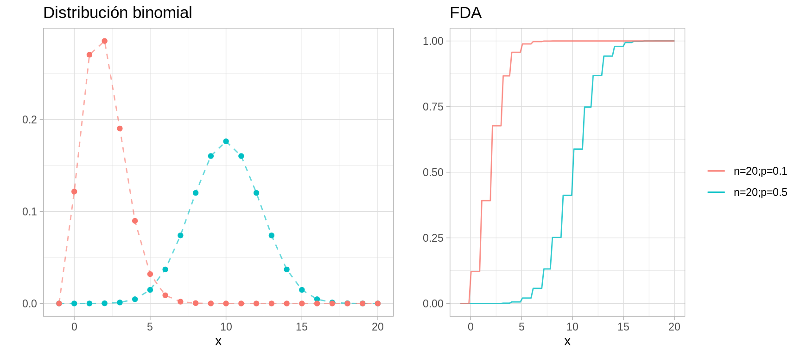


#### Distribución Uniforme {-}
Decimos que $X$ tiene una distribución uniforme en $\{a,...,b\}$ ($a,b$ enteros) 
si tiene una función de probailidad dada por:

$$
p(x) = \left\{
  \begin{array}{lr}
    1/n   &  x \in \{a,...,b\}\\
    0 &  e.o.c. \\
  \end{array}
\right.
$$
donde $n = b-a+1$,
$E(X) = (a+b)/2, Var(X)=(n^2-1)/12$

El ejemplo más común es el lanzamiento de un dado.

#### Distribución Poisson {-}
$X$ tienen una distribución Poisson con parámetro $\lambda$ si 
$$
p(x) = \left\{
  \begin{array}{lr}
    e^{-\lambda} \frac{\lambda^x}{x!}  & x \in \{0,1,...\}\\
    0 &  e.o.c. \\
  \end{array}
\right.
$$

$E(X) = \lambda, Var(X)=\lambda$

<br/>

La distribución Poisson se utiliza con frecuencia para modelar conteos de 
eventos raros, por ejemplo número de accidentes de tráfico. La distribución 
Poisson es un caso límite de la distribución binomial cuando el número de casos 
es muy grande y la probabilidad de éxito $p$ es chica.

Una propiedad de la distribución Poisson es:
$X_1 \sim Poisson(\lambda_1)$ y $X_2 \sim Poisson(\lambda_2)$ entonces 
$X_1 + X_2 \sim Poisson(\lambda_1 + \lambda_2)$.


```r
densidades <- ggplot(data.frame(x = -1:20)) +
  geom_point(aes(x = x, y = dpois(x, lambda = 4), color = "lambda=4"), show.legend = FALSE) +
  geom_path(aes(x = x, y = dpois(x, lambda = 4), color = "lambda=4"), 
      alpha = 0.6, linetype = "dashed", show.legend = FALSE) + 
  geom_point(aes(x = x, y = dpois(x, lambda = 10), color = "lambda=10"), show.legend = FALSE) +
  geom_path(aes(x = x, y = dpois(x, lambda = 10), color = "lambda=10"), 
      alpha = 0.6, linetype = "dashed", show.legend = FALSE) +
  labs(color = "", y = "", title = "Distribución Poisson")

dists <- ggplot(data_frame(x = -1:20), aes(x)) + 
    stat_function(fun = ppois, args = list(lambda = 4), 
        aes(colour = "lambda=4"), alpha = 0.8) +
    stat_function(fun = ppois, args = list(lambda = 10), 
        aes(colour = "lambda=10"), alpha = 0.8) +
    labs(y = "", title = "FDA", color = "")

grid.arrange(densidades, dists, ncol = 2, newpage = FALSE)
```

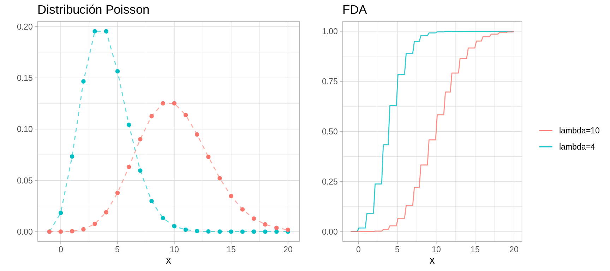

#### Distribución geométrica {-}
$X$ tiene distribución geométrica con parámetro $p \in (0,1)$, $X \sim Geom(p)$
si, 
$$
p(x) = \left\{
  \begin{array}{lr}
    p(1-p)^{k-1}  & x \in \{1,2,...\}\\
    0 &  e.o.c. \\
  \end{array}
\right.
$$

$E(X)=1/p, Var(X)=(1-p)/p^2$
<br/>
con $k \geq 1$. Podemos pensar en $X$ como el número de lanzamientos necesarios
hasta que obtenemos el primer sol en los lanzamientos de una moneda.


```r
densidades <- ggplot(data.frame(x = -1:20)) +
  geom_point(aes(x = x, y = dgeom(x, prob = 0.5), color = "p=0.5"), 
    show.legend = FALSE) +
  geom_path(aes(x = x, y = dgeom(x, prob = 0.5), color = "p=0.5"), 
    show.legend = FALSE, 
      alpha = 0.6, linetype = "dashed") + 
  geom_point(aes(x = x, y = dgeom(x, prob = 0.1), color = "p=0.1"), 
    show.legend = FALSE) +
  geom_path(aes(x = x, y = dgeom(x, prob = 0.1), color = "p=0.1"), 
      show.legend = FALSE, alpha = 0.6, linetype = "dashed") +
  labs(title = "Distribución geométrica", y = "")

dists <- ggplot(data_frame(x = -1:20), aes(x)) + 
    stat_function(fun = pgeom, args = list(p = 0.5), 
        aes(colour = "p=0.5"), alpha = 0.8) +
    stat_function(fun = pgeom, args = list(p = 0.1), 
        aes(colour = "p=0.1"), alpha = 0.8) +
    labs(y = "", title = "FDA", color = "")

grid.arrange(densidades, dists, ncol = 2, newpage = FALSE)
```

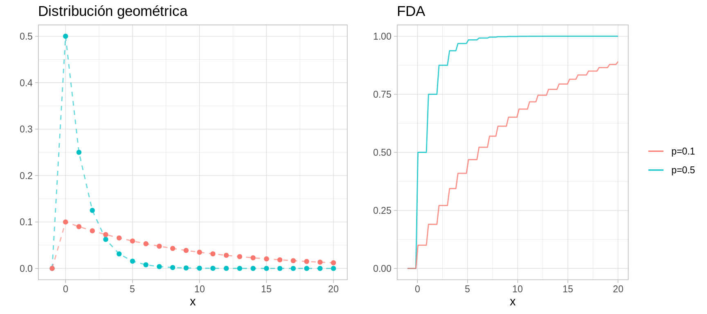


#### Variables aleatorias continuas {-}

<div class = "caja">
Una variable aleatoria $X$ es **continua** si existe una función $p_x$ tal que
$p_X(x) \geq 0$ para toda $x$, $\int_{-\infty}^{\infty}p_X(x)dx=1$ y para toda 
$a\leq b$,

$$P(a < X < b) = \int_{a}^b p_X(x)dx$$

La función $p_X(x)$ se llama la **función de densidad de probabilidad** (fdp). 
Tenemos que 
$$P_X(x)=\int_{-\infty}^x p_X(t)dt$$
y $p_X(x)=P_X^{\'}(x)$ en todos los puntos $x$ en los que la FDA $P_X$ es 
diferenciable.
</div>
<br/>

Ejemplo. Supongamos que elegimos un número al azar entre cero y uno, entonces

$$
p(x) = \left\{
  \begin{array}{lr}
    \frac{1}{b-a}  & x \in [0, 1]\\
    0 &  e.o.c. \\
  \end{array}
\right.
$$
es claro que $p_X(x) \geq 0$ para toda $x$ y $\int_{-\infty}^{\infty}p_X(x)dx=1$, 
la FDA esta dada por 

$$
P_X(x) = \left\{
  \begin{array}{lr}
    0 & x < 0 \\ 
    x  & x \in [0,1]\\
    1 &  x>b \\
  \end{array}
\right.
$$

Vale la pena notar que en el caso de variables aleatorias continuas $P(X=x)=0$
para toda $x$ y pensar en $p_X(x)$ como $P(X=x)$ solo tiene sentido en el caso
discreto.
<br/>

### Familias Continuas importantes {-}

#### Distribución Uniforme {-}
$X$ tiene una distribución $Uniforme(a,b)$ si 

$$
p(x) = \left\{
  \begin{array}{lr}
    \frac{1}{b-a}  & x \in [a,b]\\
    0 &  e.o.c. \\
  \end{array}
\right.
$$

donde $a < b$. La función de distribución acumualda es 

$$
P_X(x) = \left\{
  \begin{array}{lr}
    0 & x < a \\ 
    \frac{x-a}{b-a}  & x \in [a,b]\\
    1 &  x>b \\
  \end{array}
\right.
$$

$E(X) = (a+b)/2, Var(X)= (b-a)^2/12$

<br/>


```r
densidades <- ggplot(data_frame(x = c(-5 , 5)), aes(x)) + 
    stat_function(fun = dunif, aes(colour = "a=0; b=1"), show.legend = FALSE) +
    stat_function(fun = dunif, args = list(min = -5, max = 5), aes(colour = "a=-5; b=5"), show.legend = FALSE) +
    stat_function(fun = dunif, args = list(min = 0, max = 2), aes(colour = "a=0; b=2"), show.legend = FALSE) +
    labs(y = "", title = "Distribución uniforme", colour = "")

dists <- ggplot(data_frame(x = c(-5 , 5)), aes(x)) + 
    stat_function(fun = punif, aes(colour = "a=0; b=1"), show.legend = FALSE) +
    stat_function(fun = punif, args = list(min = -5, max = 5), aes(colour = "a=-5; b=5"), show.legend = FALSE) +
    stat_function(fun = punif, args = list(min = 0, max = 2), aes(colour = "a=0; b=2"), show.legend = FALSE) +
    labs(y = "", title = "FDA")

grid.arrange(densidades, dists, ncol = 3, newpage = FALSE)
```

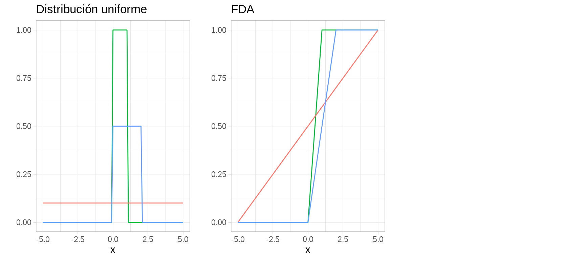

#### Distribución Normal {-}
$X$ tiene una distribución normal con parámetros $\mu$ y $\sigma$, denotado
$X\sim N(\mu, \sigma^2)$ si

$$p(x) = \frac{1}{\sigma\sqrt{2\pi}}exp\bigg(-\frac{1}{2\sigma^2}(x-\mu)^2\bigg)$$

$E(X)=\mu, Var(X)=\sigma^2$

<br/>
donde $\mu \in \mathbb{R}$ y $\sigma>0$. 

Decimos que $X$ tiene una distribución **Normal estándar** si $\mu=0$ y 
$\sigma=1$. Una variable aleatoria Normal estándar se denota tradicionalmente 
por $Z$, su función de densidad de probabilidad por $\phi(z)$ y la función de 
probabilidad acumulada por $\Phi(z)$.

Algunas porpiedades importantes son:

1. Si $X \sim N(\mu, \sigma^2)$, entonces $Z=(X-\mu)/\sigma \sim N(0,1)$.  

2. Si $Z \sim N(0, 1)$ entonces $X = \mu + \sigma Z \sim N(\mu, \sigma^2)$.

3. Si $X_i \sim N(\mu_i, \sigma_i^2)$, $i=1,...,n$ independientes, entonces:
$$\sum_{i=1}^n X_i \sim N(\sum_{i=1}^n \mu_i, \sum_{i=1}^n \sigma_i^2)$$

4. Se sigue de 1 que si $X\sim N(\mu, \sigma^2)$, entonces
$$P(a<X<b) = P\big(\frac{a-\mu}{\sigma} < Z < \frac{b-\mu}{\sigma}\big)= \Phi\big(\frac{b-\mu}{\sigma}\big) - \Phi\big(\frac{a-\mu}{\sigma}\big)$$


```r
densidades <- ggplot(data_frame(x = c(-5 , 5)), aes(x)) + 
    stat_function(fun = dnorm, aes(colour = "m=0; s=1"), show.legend = FALSE) +
    stat_function(fun = dnorm, args = list(mean = 1), aes(colour = "m=1; s=1"), show.legend = FALSE) +
    stat_function(fun = dnorm, args = list(sd = 2), aes(colour = "m=1; s=2"), show.legend = FALSE) +
    labs(y = "", title = "Distribución Normal", colour = "")

dists <- ggplot(data_frame(x = c(-5 , 5)), aes(x)) + 
    stat_function(fun = pnorm, aes(colour = "m=0; s=1"), show.legend = FALSE) +
    stat_function(fun = pnorm, args = list(mean = 1), aes(colour = "m=1; s=1"), show.legend = FALSE) +
    stat_function(fun = pnorm, args = list(sd = 2), aes(colour = "m=1; s=2"), show.legend = FALSE) +
    labs(y = "", title = "FDA")

cuantiles <- ggplot(data_frame(x = c(0, 1)), aes(x)) + 
    stat_function(fun = qnorm, aes(colour = "m=0; s=1")) +
    stat_function(fun = qnorm, args = list(mean = 1), aes(colour = "m=1; s=1")) +
    stat_function(fun = qnorm, args = list(sd = 2), aes(colour = "m=1; s=2")) +
    labs(y = "", title = "Funciones de cuantiles", colour = "")

grid.arrange(densidades, dists, cuantiles, ncol = 3, newpage = FALSE)
```

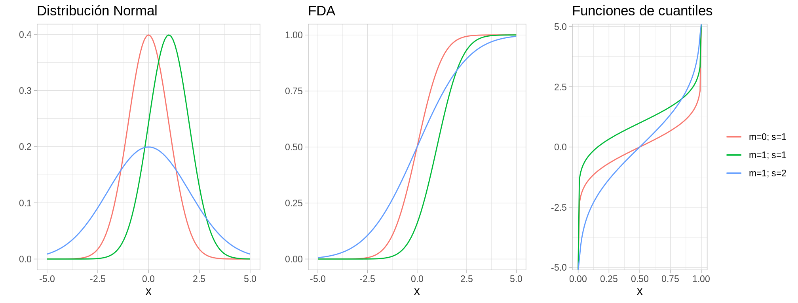

#### Distribución Exponencial {-}
Una variable aleatoria $X$ tienen distribución Exponencial con parámetro $\beta$,
$X \sim Exp(\beta)$ si, 

$$
p(x) = \left\{
  \begin{array}{lr}
    \frac{1}{\beta}e^{-x/\beta}  & x >0\\
    0 &  e.o.c. \\
  \end{array}
\right.
$$

$E(X)=\beta, Var(X)=\beta^2$
<br/>

donde $\beta > 0$. La distribución exponencial se utiliza para modelar tiempos
de espera hasta un evento, por ejemplo modelar el tiempo de vida de un 
componente electrónico o el tiempo de espera entre llamadas telefónicas.

#### Distribución Gamma {-}
* Comencemos definiendo la **función Gamma**: para $\alpha>0$, 
$\Gamma(\alpha)=\int_0^{\infty}y^{\alpha-1}e^{-y}dy$, esta función es una 
extensión de la función factorial, tenemos que si $n$ es un entero positivo,
$\Gamma(n)=(n-1)!$.  

* Ahora, $X$ tienen una **distribución Gamma** con parámetros $\alpha$, $\beta$, 
denotado como $X \sim Gamma(\alpha, \beta)$ si 

$$
p(x) = \left\{
  \begin{array}{lr}
    \frac{1}{\beta^\alpha \Gamma(\alpha)}x^{\alpha-1}e^{-x/\beta}  & x >0\\
    0 &  e.o.c. \\
  \end{array}
\right.
$$
$E(X)=\alpha \beta, Var(X)=\alpha \beta^2$
<br/>

* Vale la pena notar que una distribución exponencial es una $Gamma(1, \beta)$. 

* Una propiedad adicional es que si $X_i \sim Gamma(\alpha_i, \beta)$ 
independientes, entonces 
$\sum_{i=1}^n X_i \sim Gamma(\sum_{i=1}^n \alpha_i, \beta)$. 

En la práctica la distribución Gamma se ha usado para modelar el tamaño de 
las reclamaciones de asegurados, en neurociencia se ha usado para describir la
distribución de los intervalos entre los que ocurren picos. Finalmente, 
la distribución Gamma es muy usada en estadística bayesiana como a priori
conjugada para el parámetro de precisión de una distribución Normal.


```r
densidades <- ggplot(data_frame(x = c(0 , 12)), aes(x)) + 
    stat_function(fun = dgamma, args = list(shape = 1), aes(colour = "a=1;b=1"), show.legend = FALSE) +
    stat_function(fun = dgamma, args = list(scale = 0.5, shape = 2), aes(colour = "a=2;b=0.5"), show.legend = FALSE) +
    stat_function(fun = dgamma, args = list(scale = 3, shape = 4), aes(colour = "a=4,b=3"), show.legend = FALSE) +
    labs(y = "", title = "Distribución Gamma", colour = "")

dists <- ggplot(data_frame(x = c(0 , 12)), aes(x)) + 
    stat_function(fun = dgamma, args = list(shape = 1), aes(colour = "a=1;b=1")) +
    stat_function(fun = dgamma, args = list(scale = 0.5, shape = 2), aes(colour = "a=2;b=0.5")) +
    stat_function(fun = dgamma, args = list(scale = 3, shape = 4), aes(colour = "a=4,b=3")) +
    labs(y = "", title = "FDA", color="")

grid.arrange(densidades, dists, ncol = 2, newpage = FALSE)
```

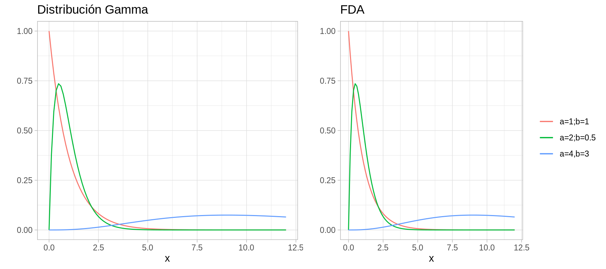


#### Distribución Beta {-}

* $X$ tiene una distrinución Beta con parámetros $\alpha > 0$ y $\beta >0$, 
$X \sim Beta(\alpha, \beta)$ si 

$$
p(x) = \left\{
  \begin{array}{lr}
    \frac{\Gamma(\alpha+\beta)}{\Gamma(\alpha)\Gamma(\beta)}x^{\alpha-1}(1-x)^{\beta-1}  & 0 < x < 1\\
    0 &  e.o.c. \\
  \end{array}
\right.
$$
$E(X)=\alpha/(\alpha+\beta), Var(X)=\alpha \beta /[(\alpha+\beta)^2(\alpha + \beta + 1)]$

<br/>
La distribución Beta se ha utilizado para describir variables aleatorias 
limitadas a intervalos de longitud finita, por ejemplo, distribución del tiempo
en sistemas de control o administración de proyectos, proporción de minerales
en rocas, etc. 


```r
densidades <- ggplot(data_frame(x = c(0 , 1)), aes(x)) + 
    stat_function(fun = dbeta, args = list(shape1 = 2, shape2 = 2), 
        aes(colour = "a=2; b=2"), show.legend = FALSE) +
    stat_function(fun = dbeta, args = list(shape1 = 5, shape2 = 2), 
        aes(colour = "a=5; b=2"), show.legend = FALSE) +
    stat_function(fun = dbeta, args = list(shape1 = .5, shape2 = .5), 
        aes(colour = "a=.5; b=.5"), show.legend = FALSE) +
    labs(y = "", title = "Distribución Beta", colour = "")

dists <- ggplot(data_frame(x = c(0 , 1)), aes(x)) + 
    stat_function(fun = pbeta, args = list(shape1 = 2, shape2 = 2), 
        aes(colour = "a=2; b=2")) +
    stat_function(fun = pbeta, args = list(shape1 = 5, shape2 = 2), 
        aes(colour = "a=5; b=2")) +
    stat_function(fun = pbeta, args = list(shape1 = .5, shape2 = .5), 
        aes(colour = "a=.5; b=.5")) +
    labs(y = "", title = "FDA", color="")

grid.arrange(densidades, dists, ncol = 2, newpage = FALSE)
```

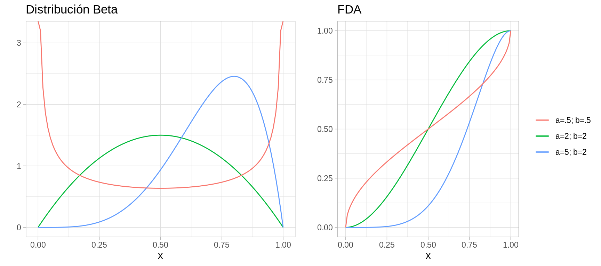

## Simulación de variables aleatorias

Veremos métodos generales para simular muestras de distribuciones univariadas, 
generales se refiere a que se pueden utilizar independientemente de la forma
de la función de densidad.

Para utilizar estos métodos debemos tener un generador de números aleatorios
confiable, pues la mayoría de los métodos consisten en una transformación
de números aleatorios.

### Variables aletaorias discretas {-}

#### Método de Inversión {-}
Supongamos que deseamos generar el valor de una variable aleatoria discreta $X$
con función de probabilidad:
$$P(X=x_j) = p_j$$
con $j=0,1,2,..$.

Para lograr esto generamos un número aleatorio $U$, esto es 
$U\sim Uniforme(0,1)$ y definimos

$$
X = \left\{
  \begin{array}{lr}
    x_0   &  U < p_0\\
    x_1 &  p_0 \leq U < p_0 + p_1\\
    \vdots &\\
    x_j & \sum_{i=0}^{j-1}p_i \leq U < \sum_{i=0}^j p_i \\
    \vdots & \\
  \end{array}
\right.
$$

Como  para $0<a<b<1$ tenemos que $P(a\leq U < b)=b-a$, tenemos que 
$$P(X=x_j)=P\bigg\{\sum_{i=0}^{j-1}p_i \leq U < \sum_{i=0}^{j}p_i \bigg \}=p_j$$
y por tanto $X$ tiene la distribución deseada.

<div class = "caja">
**Método de inversión**  

1. Genera un número aleatorio $U$, tal que $U \in (0,1)$.  
   Si $U<p_0$ define $X=x_0$ y para.  
   Si $U< p_0+p_1$ define $X = x_1$ y para.  
   Si $U < p_0 + p_1 + p_2$ define $X=x_2$ y para.  
   $\vdots$

2. Si las $x_i$, están ordenadas de tal manera que $x_0<x_1<x_2<\cdots$ y si
denotamos por $P$ la función de distribución acumulada de $X$, entonces 
$P(x_k)=\sum_{i=0}^kp_i$ y por tanto, $X$ será igual a $x_j$ si 
$$P(x_{j-1}) \leq U \leq P(x_j)$$

En otras palabras, tras generar un número aleatorio $U$ determinamos el valor de
$X$ encontrando el intervalo $[P(x_{j-1}),P(x_j))$ en el que cae $U$, esto es 
equivalente a encontrar la inversa de $P(U)$.

</div>

El tiempo que uno tarda en generar una variable aleatoria discreta usando el 
método de arriba es proporcional al número de intervalos que uno debe buscar, 
es por esto que en ocasiones vale la pena considerar los posibles valores 
$x_j$ en orden decreciente de $p_j$.

  Utiliza la función runif de R y el método de 
inversión para generar 1000 simulaciones de una variable aleatoria $X$ tal que 
$p_1=0.20, p_2= 0.15, 
p_3=0.25, p_4=0.40$ donde $p_j=P(X=j)$.


#### Ejemplos {-} 
**Uniforme discreta**. Supongamos que deseamos simular de una variable aleatoria 
uniforme discreta que toma valores $1,...,k$, usando los resultados anteriores 
tenemos que:

$X=j$ si $\frac{j-1}{n} \leq U < \frac{j}{n}$

Entonces $X=[kU] + 1$, donde $[x]$ representa la parte entera de x.


```r
# uniforme discreta: donde n es el número de simulaciones y k el número de elementos
runifD <- function(n = 1, k) floor(k * runif(n)) + 1
# veamos un histograma de 1000 simulaciones de una distribución Uniforme
# discreta con parámetro k = 20
x <- runifD(n = 1000, k = 20)
qplot(x, binwidth = 1)
```

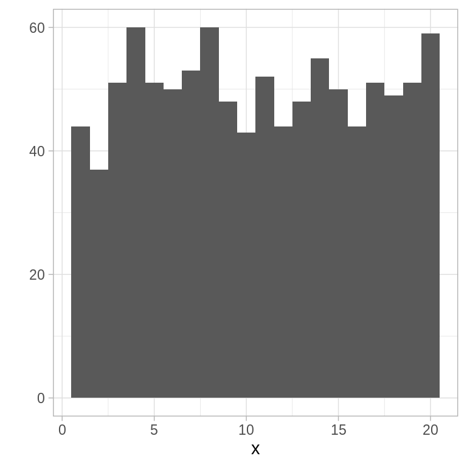

También podmeos usar la función sample de R:


```r
qplot(sample(1:20, size = 1000, replace= TRUE), binwidth = 1)
```

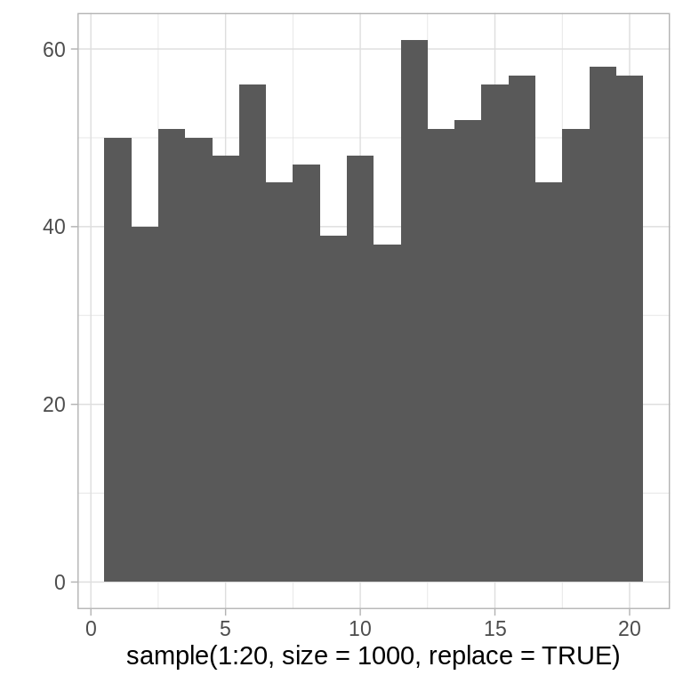

**Poisson**: la clave para usar el método de la transformación inversa en este 
ejemplo es notar que:
$$p_{i+1}=\frac{\lambda}{i+1}p_i$$

donde $p_i=P(X=i) = e^{-\lambda} \cdot \lambda^i/i!$, con $i=0,1,...$. Ahora, 
la cantidad $i$ se refiere al valor que estamos considerando, $p=p_i$ es la 
probabilidad de $X = i$ y $P=P(i)$ es la probabilidad de $X\leq i$. Entonces, 
para generar una observación sequimos los siguientes pasos:

1. Generar un número aleatorio $U$, tal que $U \in (0,1)$.  
2. Inicializar: $i=0$, $p=e^{-\lambda}$, $F=p$.  
3. Si $U<F$, definir $X=i$ y parar.  
4. $p=\lambda p/(i+1)$, $F=F+p$, $i=i+1$.  
5. Volver a 3.


```r
# Poisson usando Inversión
rpoisI <- function(lambda = 1){
  U <- runif(1)
  i <- 0
  p <- exp(-lambda)
  P <- p
  while(U >= P){
    p <- lambda * p / (i + 1)
    P <- P + p
    i <- i + 1
  }
  i
}
sims_pois <- rerun(1000, rpoisI()) %>% flatten_dbl()

qplot(sims_pois, binwidth = 1)
```

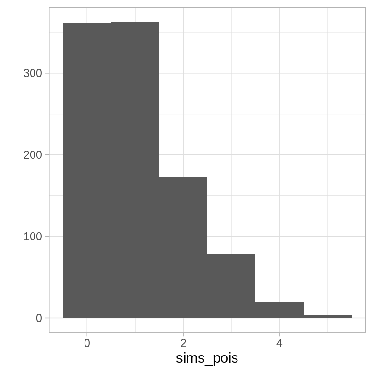

El algoritmo que propusimos verifica de manera sucesiva si el valor es 0, 1, etc.
por lo que el número de comparaciones necesarias será uno más que el valor de 
la variable. Ahora, el valor esperado de una variable aleatoria Poisson es 
$\lambda$ por lo que en promedio se harían $1+\lambda$ busquedas. Cuando $\lambda$
es grande se puede mejorar el algoritmo buscando primero en valores cercanos a
$\lambda$.

 Escribe una función en R que genere simulaciones
de una variable aleatoria Poisson de la siguiente manera: define $I=[\lambda]$,
y usa que $p_{i+1}=\lambda p_i /(i+1)$ para determinar $F$ de manera recursiva. 
Genera un número aleatorio $U$, determina si $X \leq I$ comparando si 
$U \leq F(I)$. Si $X \leq I$ busca hacia abajo comenzando en $I$, de lo contrario
busca hacia arriba comenzando por $I+1$. Compara el tiempo que tardan los dos 
algoritmos en 5000 simulaciones de una variable aleatoria Poisson con 
parámetro $\lambda=10, 200, 500$.


### Aceptación y rechazo {-}
Supongamos que tenemos un método eficiente para generar simulaciones de una
variable aleatoria con función de probabilidad masa $\{q_j, j\geq 0\}$, podemos
usarla como la base para simular de una distribución que tiene función de 
probabilidad masa $\{p_j, j \geq 0\}$, para hacer esto comenzamos simulando 
una variable aleatoria $Y$ con función $\{q_j\}$ y después aceptamos o 
rechazamos el valor simulado con una probabilidad proporcional a $p_Y/q_Y$. 
En particular, sea $c$ una constante tal que 
$$\frac{p_j}{q_j}\leq c$$
para toda $j$ con $p_j > 0$. Entonces el método de aceptación y rechazo para
simular una variable aleatoria $X$ con función masa de probabilidad $p_j=P(x=j)$
es como sigue:

<div class = "caja">
**Método de aceptación y rechazo**

1. Simula el valor de $Y$, con función de probabilidad masa $q_j$.  
2. Genera un número aleatorio $U$, tal que $U \in (0,1)$.  
3. Si $U < p_y/(cq_y)$ definimos $X=Y$ y paramos, en otro caso regresamos a 1.  

En promedio este algoritmo requiere $c$ iteraciones para obtener un valor 
generado para $X$.
</div>

. Supongamos que queremos simular el valor de una 
variable aleatoria $X$ que toma uno de los valores $1,2,3,4$ con probabilidades 
$p_1=0.20, p_2= 0.15, p_3=0.25, p_4=0.40$ donde $p_j=P(X=j)$. Usemos el método 
de aceptación y rechazo con $q$ la densidad uniforme en $1,...,4$. ¿Cómo se 
compara en velocidad con la función que implementaste usando el método de la 
transformación inversa?


### Variables aleatorias continuas {-}

#### Método de inversión {-}


<div class = "caja">
Sea $U$ una variable aleatoria con ditribución $U(0,1)$. Para cualquier 
función de distribución $F_X$ ($F_X$ es creciente y continua entonces existe
$F_X^{-1}$) la variable aleatoria $X$ definida como:
$$X = F_X^{-1}(U)$$
tiene distribución $F_X$.   
</div>

La proposición anterior nos da un camino para simular variables aleatorias 
continuas:

1. Generamos un número aleatorio $U$.  
2. Definimos $X = F^{-1}(U)$:


```r
ggplot(data_frame(x = c(-2 , 2)), aes(x)) + 
    geom_hline(yintercept = 0, color = "gray") +
    geom_vline(xintercept = 0, color = "gray") +
    stat_function(fun = qnorm, aes(color = "fq")) +
    stat_function(fun = dnorm, aes(color = "fdp")) +
    stat_function(fun = pnorm, aes(color = "fda")) +
    coord_fixed() +
    labs(color = "", title = "Método de transformación inversa caso Normal")
```

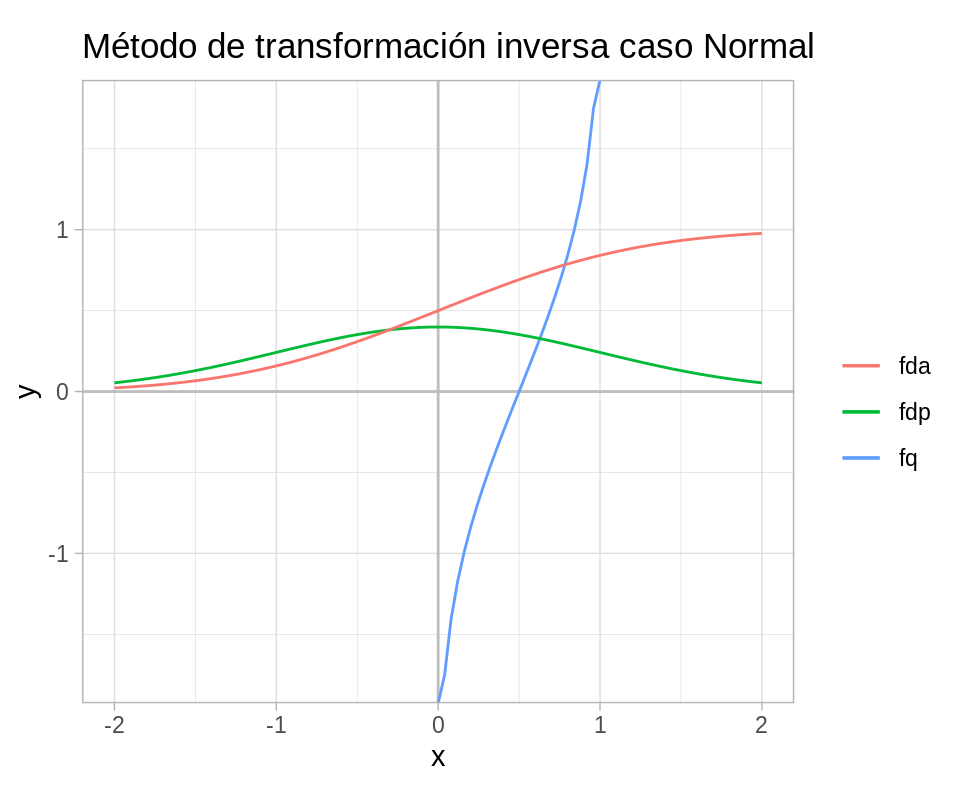

#### Ejemplo: Exponencial {-}

Si $X$ es una variable aleatoria exponencial con tasa 1, entonces

$$F(x)=1-e^{-x}$$

Si definimos $x=F^{-1}(u)$, entonces
$$u=F(x)=1-e^{-x}$$
o 
$$x = -log(1-u)$$

Vale la pena notar que si $U$ tiene distribución $U(0,1)$, $1-U$ también
se distribuye uniforme(0,1).


```r
simExp <- function(){
  u <- runif(1)
  x <- -log(u)
}
```


Notemos que para cualquier constante positiva $c$, $cX$ tiene distribución 
exponencial con media $c$, por tanto una variable aleatoria exponencial con 
parámetro $\beta$ se puede generar de la siguiente manera:

$$X=-\beta log(U)$$


```r
sim_exp_beta <- function(beta, n = 1000){
  -beta * log(runif(n))
}
sims_exp <- sim_exp_beta(2)
mean(sims_exp)
#> [1] 2.0629
ggplot() + 
  geom_histogram(aes(x = sims_exp, y = ..density..), binwidth = 0.7)
```

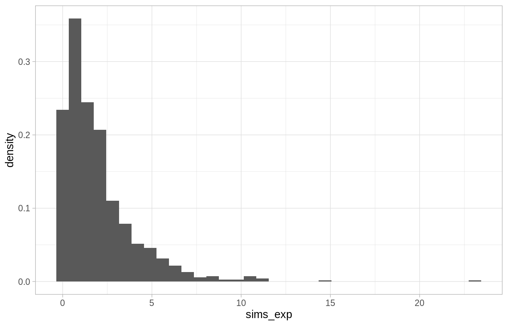

El algoritmo anterior también provee una manera de generar variables aleatorias
Poisson. Para esto usamos la relación entre la Poisson y la exponencial:

* Un proceso Poisson con tasa $\lambda$ resulta cuando los tiempos de espera 
entre eventos sucesivos son exponenciales independientes con parámetro 
$\beta = 1/\lambda$,

* Para este proceso, $N(1)$, el número de eventos en el tiempo 1 se distribuye 
Poisson con media $1/\beta$. 

* Si denotamos por $X_i$ los tiempos entre eventos, el $n$-ésimo evento 
ocurrirá en el tiempo $\sum_{i=1}^n X_i$ y por tanto el número de eventos
al tiempo 1 se puede expresar como:

$$N(1)=max\bigg\{n: \sum_{i=1}^nX_i \leq 1\bigg\}$$

* Esto es, el número de eventos al tiempo 1 es igual a la $n$ mayor para la cual 
el n-ésimo evento ocurrió al tiempo 1. 

* Por ejemplo, si el cuarto evento ocurrió al tiempo uno pero el quinto no, 
habría 4 eventos al tiempo 1. Por tanto podemos generar una variable aleatoria 
Poisson con media $\lambda = 1/\beta$ generando números aleatorios 
$U_1,...U_n,...$ y definiendo

$$N=max\bigg\{n: \sum_{i=1}^n -\beta log(U_i) \le 1\bigg\}$$
$$=max\bigg\{n: \sum_{i=1}^n -1/\lambda log(U_i) \le 1\bigg\}$$
$$=max\bigg\{n:\sum_{i=1}^n log(U_i)\geq -\lambda \bigg\}$$
$$=max\{n:log(U_1\cdot\cdot\cdot U_n) \geq -\lambda\}$$
$$=max\{n: U_1\cdot \cdot \cdot U_n \geq e^{-\lambda}\}$$

Es así, que una variable aleatoria Poisson con media $\lambda$ se puede generar
a partir de una sucesión de números aleatorios, generando números hasta que
el producto sea menor a $e^{-\lambda}$ y definiendo $X$ como uno menos del 
número de números aleatorios requeridos.

$$N = min\{n: U_1\cdot\cdot\cdot U_n < e^{-\lambda}\} - 1$$


```r
poisson <- function(lambda){
  u <- runif(1)
  N <- 1
  while (u > exp(-lambda)) {
    u <- u * runif(1)
    N <- N + 1
  }
  N - 1
}

poisson(10)
#> [1] 10
mean(rdply(1000, poisson(10))$V1)
#> [1] 10.073
```

#### Ejemplo: Gamma {-}

Supongamos que deseamos generar el valor de una variable aleatoria 
$Gamma(n,\beta)$, la función de distribución es,

$$\int_{0}^x \frac{1}{\beta^n \Gamma(n)}x^{n-1}e^{-x/\beta}dy$$

* La inversa de la función de distribución acumulada anterior no se puede 
escribir de forma cerrada. 

* Sin embargo, podeos usar que una $Gamma(n,\beta)$ se puede ver como la suma 
de $n$ exponenciales independientes, cada una con parámetro $\beta$:

$$X=-\beta log(U_1)-\cdot\cdot\cdot - \beta log(U_n)$$
$$=-\beta log(U_1\cdot\cdot\cdot U_n)$$

donde la identidad $\sum log(x_i) = log(x_1\cdot\cdot\cdot x_n)$ deriva en 
ganancias computacionales.


```r
gamma_nb <- function(n, beta){
  -beta * log(Reduce(`*`,runif(10)))
}
sims_gamma <- rdply(1000, gamma_nb(n = 10, beta = 2))
mean(sims_gamma$V1)
#> [1] 19.77
var(sims_gamma$V1)
#> [1] 37.19
```

### Aceptación y rechazo {-}

* Supongamos que tenemos un método para generar variables aleatorias con función 
de densidad $g(x)$, 

* podemos usarla como base para generar observaciones de una variable aleatoria 
con densidad $f(x)$ generando $Y$ de $g$ y después aceptando 
el valor generado con una probabilidad proporcional a $f(Y)/g(Y)$. 

* Sea $c$ una constante tal que 

$$\frac{f(y)}{g(y)} \leq c$$

para toda $c$, entonces el método se puede escribir como sigue:

<div class = "caja">
**Aceptación y rechazo**

1. Genera $Y$ con densidad $g$.  
2. Genera un número aleatorio $U$.  
3. Si $U \leq \frac{f(Y)}{cg(Y)}$
define $X=Y$, de lo contrario regresa a 1.

El método de aceptación y rechazo es análogo al correspondiente a variables
aleatorias discretas.

(i) La variable aleatoria generada usando el método de aceptación y rechazo
tiene densidad $f$.  
(ii) El número de iteraciones del algoritmo que se necesitan es una variable
aleatoria geométrica con media $c$.
</div>

#### Ejemplo: Beta {-}
Usemos el método de aceptación y rechazo para generar observaciones de una 
variable aleatoria $beta(2,4)$:
$$f(x)=20x(1-x)^3$$
La variable aleatoria beta toma valores en el intervalo (0,1) por lo que 
consideremos $g(x)=1$, para $0<x<1$. Para determinar la menor $c$ tal que 
$f(x)/g(x)\leq c$ podemos derivar y obtenemos $c = 135/64$,
$$\frac{f(x)}{g(x)} \leq 20 \cdot \frac{1}{4} \bigg(\frac{3}{4}\bigg)^3 = \frac{135}{64}$$

y 

$$\frac{f(x)}{cg(x)}=\frac{256}{27}x(1-x)^3$$

por lo que el procedimiento para simular sería el siguiente:


```r
beta24 <- function(){
  # 1. Generar dos números aleatorios U_1, U_2. 
  u1 <- runif(1)
  u2 <- runif(1)
  # 2. Comparar con f(x)/cg(x)
  while (u2 > 256 / 27 * u1 * (1 - u1) ^ 3) {
    u1 <- runif(1)
    u2 <- runif(1)
  }
  u1
}
sims <- rdply(1000, beta24)
mean(sims$V1)
#> [1] 0.334
```

#### Ejemplo: Gamma(3/2, 1) {-}
Supongamos que deseamos generar simulaciones de una variable aleatoria con densidad gamma(3/2, 1):
$$f(x)=\frac{1}{\Gamma(3/2)}x^{1/2}e^{-x}$$
dado que la variable aleatoria de nuestro interés se concentra en los números positivos, y tiene media $3/2$, es conveniente usar el método de aceptación y rechazo con la variable aleatoria exponencial de la misma media.
$$g(x)=\frac{2}{3}e^{-2x/3}$$

 Usa el método de aceptación y rechazo para generar 1000 observaciones de una variable aleatoria con distribución gamma(3/2,1).


#### Ejemplo: Variable aleatoria normal {-}

Nuestro objetivo es primero, simular una variable aleatoria normal estándar Z, 
para ello comencemos notando que el valor absoluto de Z tiene función de 
densidad:
$$f(x)=\frac{2}{\sqrt{2\pi}}e^{-x^2/2}$$
con soporte en los reales positivos. Generaremos observaciones de la densidad 
anterior usando el método de aceptación y rechazo con $g$ una densidad 
exponencial con media 1:

$$g(x)= e^{-x}$$

Ahora,
$\frac{f(x)}{g(x)}=\sqrt{2/\pi}e^{x - x^2/2}$
y por tanto el máximo valor de $f(x)/g(x)$ ocurre en el valor $x$ que maximiza
$x - x^2/2$, esto ocurre en $x=1$, y podemos tomar $c=\sqrt{2e/\pi}$, 
$$\frac{f(x)}{cg(x)}=exp\bigg\{x - \frac{x^2}{2}-{1}{2}\bigg\}$$
$$=exp\bigg\{\frac{(x-1)^2}{2}\bigg\}$$

 
y por tanto podemos generar el valor absoluto de una variable aleatoria con 
distribución normal estándar de la siguiente manera:

1. Genera $Y$ una variable aleatoria exponencial con tasa 1.  
2. Genera un número aleatorio $U$.  
3. Si $U \leq exp\{-(Y-1)^2/2\}$ define $X=Y$, en otro caso vuelve a 1.  

Para generar una variable aleatoria con distribución normal estándar $Z$ 
simplemente elegimos $X$ o $-X$ con igual probabilidad.

Notemos además que en paso 3 $Y$ es aceptado si $U \leq exp(-(Y-1)^2/2)$ esto es
equivalente a $-log(U) \geq (Y-1)^2/2$ y recordemos que $-log(U)$ es exponencial 
con parámetro 1, por lo que podems escribir los pasos como:

1. Genera 2 exponenciales independientes con parámetro 1: $Y_1, Y_2$.  
2. Si $Y_2 \geq (Y_1 - 1)^2/2$ define $X=Y$, de lo contrario vuelve a 1.

Supongamos ahora que aceptamos $Y_1$, esto es equivalente a decir que $Y_2$ es 
mayor a $(Y_1 - 1)^2/2$, y la diferencia $Y_2 - (Y_1 - 1)^2/2$ se distribuye 
exponencial con parámetro 1. Esto es, cuando aceptamos en el segundo paso no 
sólo obtenemos $X$ sino que calculando
$Y_2 - (Y_1 - 1)^2/2$ podemos generar una variable aleatoria exponencial con 
parámetro 1 independiente de $X$. Esto es relevante pues si estamos generando 
una sucesión de variables aleatorias normales obtendríamos un algoritmo más 
eficiente.


