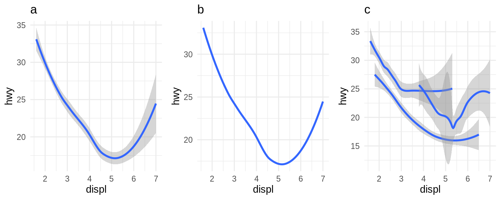
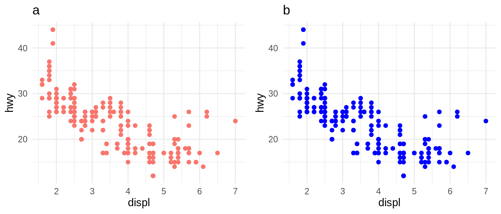
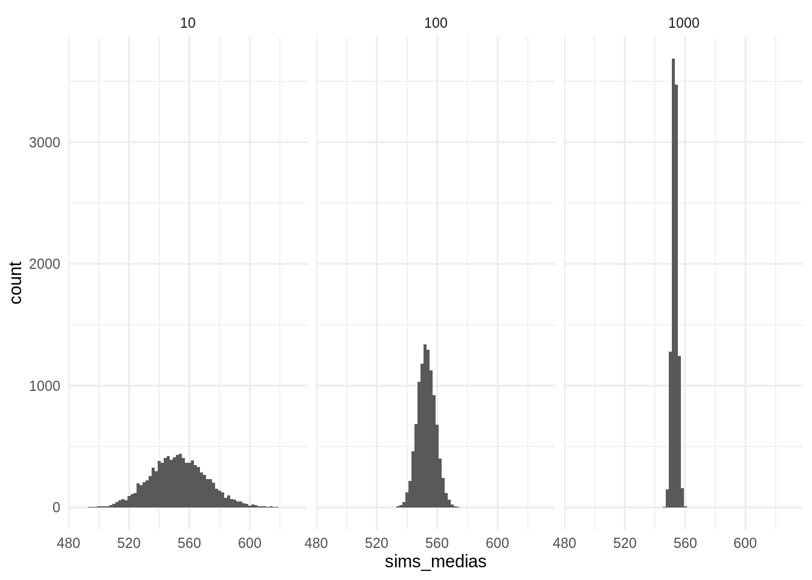
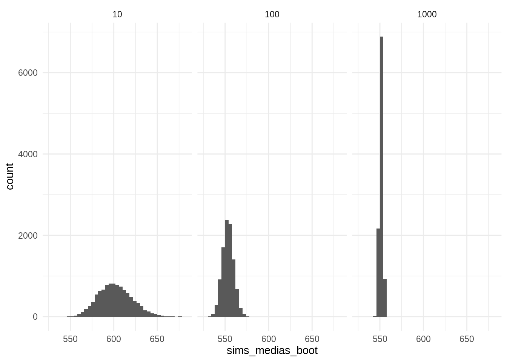
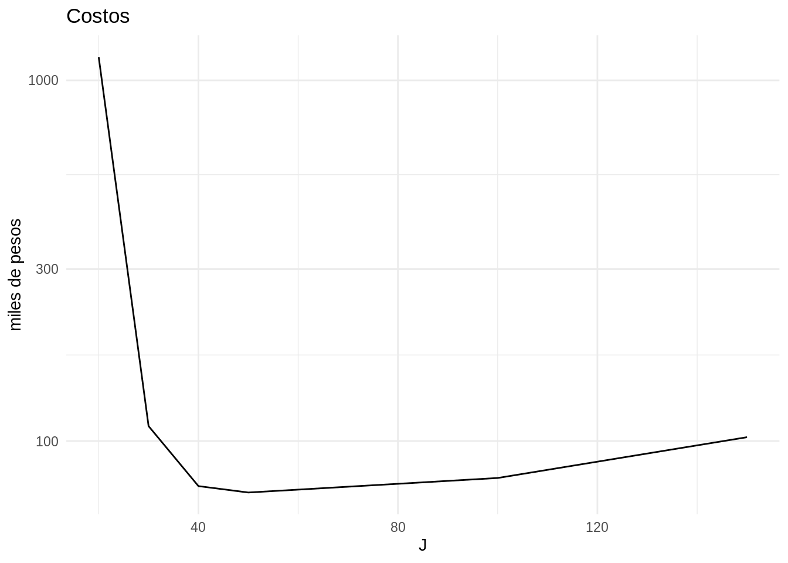

# Tareas {-}


* Las tareas se envían por correo a teresa.ortiz.mancera@gmail.com con título: 
EstComp-TareaXX (donde XX corresponde al número de tarea, 01..). 

* Las tareas deben incluir código y resultados (si conocen [Rmarkdown](https://rmarkdown.rstudio.com) 
es muy conveniente para este propósito).

## 1. Instalación y visualización {-}

#### 1. Instala los siguientes paquetes (o colecciones): {-}

* tidyverse de CRAN (`install.packages("tidyverse")`)
* devtools de CRAN (`install.packages("devtools")`)
* gapminder de CRAN (`install.packages("gapminder")`)
* estcomp de GitHUB (debes haber instalado devtools y correr 
`devtools::install_github("tereom/estcomp")`)
* mxmaps **instalarlo es opcional** de [GitHub](https://github.com/diegovalle/mxmaps#installation)


#### 2. Visualización {-}

* Elige un base de datos, recuerda que en la ayuda puedes encontrar más 
información de las variables (`?gapminder`): 
    + gapminder (paquete `gapminder` en CRAN).
    + election_2012 ó election_sub_2012 (paquete `estcomp`).
    + df_edu (paquete `estcomp`).
    + enlacep_2013 o un subconjuto de este (paquete `estcomp`).

* Escribe algunas preguntas que consideres interesantes de los datos.

* Realiza $3$ gráficas buscando explorar las preguntas de arriba y explica las
relaciones que encuentres. Debes usar lo que revisamos en estas notas y al menos
una de las gráficas debe ser de paneles (usando `facet_wrap()` o `facet_grid`).

#### 4. Prueba (en clase)! {-}

Ejercicios basados en ejercicios de @r4ds.

Socrative: https://b.socrative.com/login/student/  
Room: ESTCOMP


```r
library(tidyverse,warn.conflicts = FALSE, quietly = TRUE)
library(gridExtra)

# 1.
one <- ggplot(data = mpg) +
  geom_smooth(mapping = aes(x = displ, y = hwy))

# 2.
two <- ggplot(data = mpg) +
  geom_smooth(mapping = aes(x = displ, y = hwy), se = FALSE)

# 3.
three <- ggplot(data = mpg) +
  geom_smooth(mapping = aes(x = displ, y = hwy, group = drv))
```




```r
# 4. 
four <- ggplot(data = mpg) + 
  geom_point(mapping = aes(x = displ, y = hwy, color = "blue"), 
    show.legend = FALSE)

# 5.
five <- ggplot(data = mpg) + 
  geom_point(mapping = aes(x = displ, y = hwy), color = "blue", 
    show.legend = FALSE)

# 6. 
six <- ggplot(data = mpg) + 
  geom_point(mapping = aes(x = displ, y = hwy), color = "class", 
    show.legend = FALSE)

# 7.
seven <- ggplot(data = mpg) + 
  geom_point(mapping = aes(x = displ, y = hwy, color = "class"), 
    show.legend = FALSE)
```





```r
eight <- ggplot(data = mpg, mapping = aes(x = displ, y = hwy, color = drv)) + 
  geom_point() + 
  geom_smooth()

nine <- ggplot(data = mpg, mapping = aes(x = displ, y = hwy)) + 
  geom_point(aes(color = drv)) + 
  geom_smooth(data = select(mpg, displ, hwy), aes(x = displ, y = hwy))

ten <- ggplot(data = mpg, mapping = aes(x = displ, y = hwy)) + 
  geom_point(aes(color = drv)) +
  geom_smooth()

eleven <- ggplot(data = mpg) + 
  geom_point(aes(x = displ, y = hwy, color = drv)) + 
  geom_smooth(aes(x = displ, y = hwy, color = drv))
```

## 2. Transformación de datos {-}

1. Vuelve a instalar el paquete `estcomp` para asegurar que tengas todos los
datos y su documentación: `devtools::install_github("tereom/estcomp")`

2. Usaremos los datos `df_edu`, ve la ayuda para entender sus variables:


```r
library(estcomp)
?df_edu
```

  * ¿Cuál es el municipo con mayor escolaridad promedio (valor de `schoolyrs`)?
    Tip: usa `filter` para quedarte únicamente con `sex` correspondiente a 
    `Total`.
  
  * Crea una `data.frame` que contenga una línea por cada estado y por sexo, con 
  la siguiente información:
    + la escolaridad promedio por estado y sexo (ponderada por la población 
    `pop_15`)
    + la población de cada sexo (mayor a 15 años)
  
  * Crea una variable que indique el porcentaje de la población que cursó al 
  menos educación básica. 
  
  * Enuncia al menos una pregunta que se pueda responder transformando y 
  graficando estos datos. Crea tu(s) gráfica(s).
  
## 3. Unión de tablas y limpieza de datos {-}

Pueden encontrar la versión de las notas de datos limpuis usando `gather()` y 
`spread()` [aquí](https://tereom.github.io/tutoriales/datos_limpios.html.

Trabajaremos con los datos `df_marital`, 

1. ¿Están limpios los datos? en caso de que no
¿qué principio no cumplen?


```r
library(estcomp)
df_marital
#> # A tibble: 29,484 x 14
#>    state_code municipio_code region state_name state_abbr municipio_name sex  
#>    <chr>      <chr>          <chr>  <chr>      <chr>      <chr>          <chr>
#>  1 01         001            01001  Aguascali… AGS        Aguascalientes Total
#>  2 01         001            01001  Aguascali… AGS        Aguascalientes Total
#>  3 01         001            01001  Aguascali… AGS        Aguascalientes Total
#>  4 01         001            01001  Aguascali… AGS        Aguascalientes Total
#>  5 01         001            01001  Aguascali… AGS        Aguascalientes Homb…
#>  6 01         001            01001  Aguascali… AGS        Aguascalientes Homb…
#>  7 01         001            01001  Aguascali… AGS        Aguascalientes Homb…
#>  8 01         001            01001  Aguascali… AGS        Aguascalientes Homb…
#>  9 01         001            01001  Aguascali… AGS        Aguascalientes Muje…
#> 10 01         001            01001  Aguascali… AGS        Aguascalientes Muje…
#> # … with 29,474 more rows, and 7 more variables: age_group <chr>, pop <dbl>,
#> #   single <dbl>, married <dbl>, living_w_partner <dbl>, separated <dbl>,
#> #   other <dbl>
```

2. Limpia los datos y muestra las primeras y últimas líneas (usa `head()` y 
`tail()`).

3. Filtra para eliminar los casos a total en las variables sexo y edad, calcula 
a nivel nacional cuál es la proporción en cada situación conyugal por grupo de 
edad y sexo. ¿Cómo puedes graficar o presentar los resultados?

4. Regresando a los datos que obtuviste en 2, une la tabla de datos con 
`df_edu`, ¿qué variables se usarán para unir?

## 4. Programación funcional y distribución muestral {-}

1. Descarga la carpeta specdata, ésta contiene 332 archivos csv que almacenan 
información de monitoreo de contaminación en 332 ubicaciones de EUA. Cada 
archivo contiene información de una unidad de monitoreo y el número de 
identificación del monitor es el nombre del archivo. En este ejercicio nos 
interesa unir todas las tablas en un solo data.frame que incluya el 
identificador de las estaciones.

  + La siguiente instrucción descarga los datos si trabajas con proyectos de 
  RStudio, también puedes descargar el zip manualmente.


```r
library(usethis)
use_directory("data") 
use_zip("https://d396qusza40orc.cloudfront.net/rprog%2Fdata%2Fspecdata.zip", 
    destdir = "data")
```

  + Crea un vector con las direcciones de los archivos.  
  + Lee uno de los archivos usando la función `read_csv()` del paquete `readr`.  
  Tip: especifica el tipo de cada columna usando el parámetro `col_types`.  
  + Utiliza la función `map_df()` para iterar sobre el vector con las 
  direcciones de los archivos csv y crea un data.frame con todos los datos, 
  recuerda añadir una columna con el nombre del archivo para poder identificar
  la estación.  
  
2. Consideramos los datos de ENLACE edo. de México 
(`enlace`), y la columna de calificaciones de español 3^o^ de primaria (`esp_3`). 


```r
library(estcomp)
enlace <- enlacep_2013 %>% 
    janitor::clean_names() %>% 
    mutate(id = 1:n()) %>% 
    select(id, cve_ent, turno, tipo, esp_3 = punt_esp_3, esp_6 = punt_esp_6, 
        n_eval_3 = alum_eval_3, n_eval_6 = alum_eval_6) %>% 
    na.omit() %>% 
    filter(esp_3 > 0, esp_6 > 0, n_eval_3 > 0, n_eval_6 > 0, cve_ent == "15")
```

- Selecciona una muestra de tamaño $n = 10, 100, 1000$. Para cada muestra 
calcula media y el error estándar de la media usando el principio del *plug-in*:
$\hat{\mu}=\bar{x}$, y $\hat{se}(\bar{x})=\hat{\sigma}_{P_n}/\sqrt{n}$. Tip:
Usa la función `sample_n()` del paquete `deplyr` para generar las muestras.

- Ahora aproximareos la distribución muestral, para cada tamaño de muestra $n$: 
i) simula $10,000$ muestras aleatorias, ii) calcula la media en cada muestra, 
iii) Realiza un histograma de la distribución muestral de las medias (las medias 
del paso anterior) iv) aproxima el error estándar calculando la desviación 
estándar de las medias del paso ii. Tip: Escribe una función que dependa del 
tamaño de muestra y usa la función `rerun()` del paquete `purrr` para hacer las 
$10,000$ simulaciones.


```r
simula_media <- function(n) {
    
}
medias_10 <- rerun(10000, simula_media(n = 10)) %>% flatten_dbl()
```

- Calcula el error estándar de la media para cada tamaño de muestra usando la
información poblacional (ésta no es una aproximación), usa la fórmula:
$se_P(\bar{x}) = \sigma_P/ \sqrt{n}$.

- ¿Cómo se comparan los errores estándar correspondientes a los distintos 
tamaños de muestra? 

### Solución + bootstrap {-}

Presentamos la solución del ejercicio y agregamos como haríamos con bootsrtap.

Suponemos que me interesa hacer inferencia del promedio de las 
calificaciones de los estudiantes de tercero de primaria en el Estado de México.

En este ejercicio planteamos $3$ escenarios (que simulamos): 1) que tengo una 
muestra de tamaño $10$, 2) que tengo una muestra de tamaño $100$, y 3) que tengo una 
muestra de tamaño $1000$. 

- Selección de muestras:


```r
set.seed(373783326)
muestras <- tibble(tamanos = c(10, 100, 1000)) %>% 
    mutate(muestras = map(tamanos, ~sample(enlace$esp_3, size = .)))
```

Ahora procedemos de manera *usual* en estadística (usando fórmulas y no 
simulación), estimo la media de la muestra con el estimador *plug-in* 
$$\bar{x}={1/n\sum x_i}$$ 
y el error estándar de $\bar{x}$ con el estimador *plug-in* 
$$\hat{se}(\bar{x}) =\bigg\{\frac{1}{n^2}\sum_{i=1}^n(x_i-\bar{x})^2\bigg\}^{1/2}$$

- Estimadores *plug-in*:

```r
se_plug_in <- function(x){
    x_bar <- mean(x)
    n_x <- length(x)
    var_x <- 1 / n_x ^ 2 * sum((x - x_bar) ^ 2)
    sqrt(var_x)
}
muestras_est <- muestras %>% 
    mutate(
        medias = map_dbl(muestras, mean), 
        e_estandar_plug_in = map_dbl(muestras, se_plug_in)
    )
muestras_est
#> # A tibble: 3 x 4
#>   tamanos muestras      medias e_estandar_plug_in
#>     <dbl> <list>         <dbl>              <dbl>
#> 1      10 <dbl [10]>      602.              19.3 
#> 2     100 <dbl [100]>     553.               6.54
#> 3    1000 <dbl [1,000]>   552.               1.90
```

Ahora, recordemos que la distribución muestral es la distribución de una
estadística, considerada como una variable aleatoria. Usando esta definción 
podemos aproximarla, para cada tamaño de muestra, simulando:  

1) simulamos muestras de tamaño $n$ de la población,   
2) calculamos la estadística de interés (en este caso $\bar{x}$),  
3) vemos la distribución de la estadística a lo largo de simulaciones.

- Histogramas de distribución muestral y aproximación de errores estándar con 
simulación 


```r
muestras_sims <- muestras_est %>%
    mutate(
        sims_muestras = map(tamanos, ~rerun(10000, sample(enlace$esp_3, 
            size = ., replace = TRUE))), 
        sims_medias = map(sims_muestras, ~map_dbl(., mean)), 
        e_estandar_aprox = map_dbl(sims_medias, sd)
        )
sims_medias <- muestras_sims %>% 
    select(tamanos, sims_medias) %>% 
    unnest(sims_medias) 

ggplot(sims_medias, aes(x = sims_medias)) +
    geom_histogram(binwidth = 2) +
    facet_wrap(~tamanos, nrow = 1) +
    theme_minimal()
```



Notamos que la variación en la distribución muestral decrece conforme aumenta
el tamaño de muestra, esto es esperado pues el error estándar de una media 
es $\sigma_P / \sqrt{n}$, y dado que en este ejemplo estamos calculando la media 
para la misma población el valor poblacional $\sigma_P$ es constante y solo 
cambia el denominador.

Nuestros valores de error estándar con simulación están en la columna 
`e_estandar_aprox`:


```r
muestras_sims %>% 
    select(tamanos, medias, e_estandar_plug_in, e_estandar_aprox)
#> # A tibble: 3 x 4
#>   tamanos medias e_estandar_plug_in e_estandar_aprox
#>     <dbl>  <dbl>              <dbl>            <dbl>
#> 1      10   602.              19.3             18.9 
#> 2     100   553.               6.54             5.92
#> 3    1000   552.               1.90             1.87
```

En este ejercicio estamos simulando para examinar las distribuciones muestrales
y para ver que podemos aproximar el error estándar de la media usando 
simulación; sin embargo, dado que en este caso hipotético conocemos la varianza 
poblacional y la fórmula del error estándar de una media, por lo que podemos 
calcular el verdadero error estándar para una muestra de cada tamaño.

- Calcula el error estándar de la media para cada tamaño de muestra usando la
información poblacional:


```r
muestras_sims_est <- muestras_sims %>% 
    mutate(e_estandar_pob = sd(enlace$esp_3) / sqrt(tamanos))
muestras_sims_est %>% 
    select(tamanos, e_estandar_plug_in, e_estandar_aprox, e_estandar_pob)
#> # A tibble: 3 x 4
#>   tamanos e_estandar_plug_in e_estandar_aprox e_estandar_pob
#>     <dbl>              <dbl>            <dbl>          <dbl>
#> 1      10              19.3             18.9           18.7 
#> 2     100               6.54             5.92           5.93
#> 3    1000               1.90             1.87           1.87
```

En la tabla de arriba podemos comparar los $3$ errores estándar que calculamos, 
recordemos que de estos $3$ el *plug-in* es el único que podríamos obtener en 
un escenario real pues los otros dos los calculamos usando la población. 

Una alternativa al estimador *plug-in* del error estándar es usar *bootstrap* 
(en muchos casos no podemos calcular el error estándar *plug-in* por falta de 
fórmulas) pero podemos usar *bootstrap*: utilizamos una 
estimación de la distribución poblacional y calculamos el error estándar 
bootstrap usando simulación. Hacemos el mismo procedimiento que usamos para 
calcular *e_estandar_apox* pero sustituimos la distribución poblacional por la 
distriución empírica. Hagámoslo usando las muestras que sacamos en el primer 
paso:


```r
muestras_sims_est_boot <- muestras_sims_est %>% 
    mutate(
        sims_muestras_boot = map2(muestras, tamanos,
            ~rerun(10000, sample(.x, size = .y, replace = TRUE))), 
        sims_medias_boot = map(sims_muestras_boot, ~map_dbl(., mean)), 
        e_estandar_boot = map_dbl(sims_medias_boot, sd)
        )
muestras_sims_est_boot
#> # A tibble: 3 x 11
#>   tamanos muestras medias e_estandar_plug… sims_muestras sims_medias
#>     <dbl> <list>    <dbl>            <dbl> <list>        <list>     
#> 1      10 <dbl [1…   602.            19.3  <list [10,00… <dbl [10,0…
#> 2     100 <dbl [1…   553.             6.54 <list [10,00… <dbl [10,0…
#> 3    1000 <dbl [1…   552.             1.90 <list [10,00… <dbl [10,0…
#> # … with 5 more variables: e_estandar_aprox <dbl>, e_estandar_pob <dbl>,
#> #   sims_muestras_boot <list>, sims_medias_boot <list>, e_estandar_boot <dbl>
```

Graficamos los histogramas de la distribución bootstrap para cada muestra.


```r
sims_medias_boot <- muestras_sims_est_boot %>% 
    select(tamanos, sims_medias_boot) %>% 
    unnest(sims_medias_boot) 

ggplot(sims_medias_boot, aes(x = sims_medias_boot)) +
    geom_histogram(binwidth = 4) +
    facet_wrap(~tamanos, nrow = 1) +
    theme_minimal()
```



Y la tabla con todos los errores estándar quedaría:


```r
muestras_sims_est_boot %>% 
    select(tamanos, e_estandar_boot, e_estandar_plug_in, e_estandar_aprox, 
        e_estandar_pob)
#> # A tibble: 3 x 5
#>   tamanos e_estandar_boot e_estandar_plug_in e_estandar_aprox e_estandar_pob
#>     <dbl>           <dbl>              <dbl>            <dbl>          <dbl>
#> 1      10           19.3               19.3             18.9           18.7 
#> 2     100            6.53               6.54             5.92           5.93
#> 3    1000            1.89               1.90             1.87           1.87
```

Observamos que el estimador bootstrap del error estándar es muy similar al 
estimador plug-in del error estándar, esto es esperado pues se calcularon con la 
misma muestra y el error estándar *bootstrap* converge al *plug-in* conforme 
incrementamos el número de muestras *bootstrap*.


  
## 5. Bootstrap conteo {-}

**Conteo rápido**

En México, las elecciones tienen lugar un domingo, los resultados oficiales 
del proceso se presentan a la población una semana después. A fin de evitar 
proclamaciones de victoria injustificadas durante ese periodo el INE organiza un 
conteo rápido.
El conteo rápido es un procedimiento para estimar, a partir de una muestra 
aleatoria de casillas, el porcentaje de votos a favor de los candidatos 
en la elección. 

En este ejercicio deberás crear intervalos de confianza para la proporción de
votos que recibió cada candidato en las elecciones de 2006. La inferencia se 
hará a partir de una muestra de las casillas similar a la que se utilizó para el 
conteo rápido de 2006.

El diseño utilizado es *muestreo estratificado simple*, lo que quiere decir que:

i) se particionan las casillas de la pablación en estratos (cada casilla
pertenece a exactamente un estrato), y 

ii) dentro de cada estrato se usa *muestreo aleatorio* para seleccionar las 
casillas que estarán en la muestra. 

En este ejercicio (similar al conteo rápido de 2006):

* Se seleccionó una muestra de $7,200$ casillas

* La muestra se repartió a lo largo de 300 estratos. 

* La tabla `strata_sample_2006` contiene en la columna $N$ el número total de 
casillas en el estrato y en $n$ el número de casillas que se seleccionaron en la 
muestra, para cada estrato:


```r
library(estcomp)
strata_sample_2006
#> # A tibble: 300 x 3
#>    stratum     n     N
#>      <dbl> <int> <int>
#>  1       1    20   369
#>  2       2    23   420
#>  3       3    24   440
#>  4       4    31   570
#>  5       5    29   528
#>  6       6    37   664
#>  7       7    26   474
#>  8       8    21   373
#>  9       9    25   457
#> 10      10    24   430
#> # … with 290 more rows
```

* La tabla `sample_2006` en el paquete `estcomp` (vuelve a instalar de ser 
necesario) contiene para cada casilla:
    + el estrato al que pertenece: `stratum`
    + el número de votos que recibió cada partido/coalición: `pan`, `pri_pvem`, 
    `panal`, `prd_pt_convergencia`, `psd` y la columna `otros` indica el 
    número de votos nulos o por candidatos no registrados.
    + el total de votos registrado en la casilla: `total`.


```r
sample_2006
#> # A tibble: 7,200 x 11
#>    polling_id stratum edo_id rural pri_pvem   pan panal prd_pt_conv   psd otros
#>         <int>   <dbl>  <int> <dbl>    <int> <int> <int>       <int> <int> <int>
#>  1      74593     106     16     1       47    40     0          40     0     9
#>  2     109927     194     27     0      131    10     0         147     1     8
#>  3     112039     199     28     0       51    74     2          57     2     2
#>  4      86392     141     20     1      145    64     2         139     1    14
#>  5     101306     176     24     0       51   160     0          64    14     1
#>  6      86044     140     20     1      150    20     0         166     1    11
#>  7      56057      57     15     1      117   119     2          82     0    24
#>  8      84186     128     19     0      118   205     8          73     9    13
#>  9      27778     283      9     0       26    65     5         249     7     2
#> 10      29892     289      9     0       27    32     0         338    14     7
#> # … with 7,190 more rows, and 1 more variable: total <int>
```

Una de las metodolgías de estimación, que se usa en el conteo rápido, es 
*estimador de razón* y se contruyen intervalos de 95% de confianza usando el 
método normal con error estándar bootstrap. En este ejercicio debes construir 
intervalos usando este procedimiento.

Para cada candidato:

1. Calcula el estimador de razón combinado, para muestreo estratificado la 
fórmula es:

$$\hat{p}=\frac{\sum_h \frac{N_h}{n_h} \sum_i Y_{hi}}{\sum_h \frac{N_h}{n_h} \sum_i X_{hi}}$$
donde:

* $\hat{p}$ es la estimación de la proporción de votos que recibió el candidato
en la elección.

* $Y_{hi}$ es el número total de votos que recibió el candidato
en la $i$-ésima casillas, que pertence al $h$-ésimo estrato.

* $X_{hi}$ es el número total de votos en la $i$-ésima casilla, que pertence al 
$h$-ésimo estrato. 

* $N_h$ es el número total de casillas en el $h$-ésimo estrato.

* $n_h$ es el número de casillas del $h$-ésimo estrato que se seleccionaron en 
la muestra.

2. Utiliza **bootstrap** para calcular el error estándar, y reporta tu 
estimación del error.
    + Genera 1000 muestras bootstrap.
    + Recuerda que las muestras bootstrap tienen que tomar en cuenta la 
    metodología que se utilizó en la selección de la muestra original, en este
    caso, lo que implica es que debes tomar una muestra aleatoria independient
    dentro de cada estrato.

3. Construye un intervalo del 95% de confianza utilizando el método normal.

Repite para todos los partidos (y la categoría otros). Reporta tus intervalos
en una tabla. 

## Respuesta ejercicios clase {-}

* Considera el coeficiente de correlación muestral entre la 
calificación de $y=$esp_3 y la de $z=$esp_6. ¿Qué tan 
precisa es esta estimación? Calcula el estimador plug-in y el error estándar 
bootstrap.


```r
library(estcomp)
# universo: creamos datos de ENLACE estado de México
enlace <- enlacep_2013 %>% 
    janitor::clean_names() %>% 
    mutate(id = 1:n()) %>% 
    select(id, cve_ent, turno, tipo, esp_3 = punt_esp_3, esp_6 = punt_esp_6, 
        n_eval_3 = alum_eval_3, n_eval_6 = alum_eval_6) %>% 
    na.omit() %>% 
    filter(esp_3 > 0, esp_6 > 0, n_eval_3 > 0, n_eval_6 > 0, cve_ent == "15")
glimpse(enlace)
set.seed(16021)
n <- 300
# muestra
enlace_muestra <- sample_n(enlace, n)

# estimador plug-in
theta_hat <- cor(enlace_muestra$esp_3, enlace_muestra$esp_6)

boot_reps <- function(){
    muestra_boot <- sample_frac(enlace_muestra, size = 1, replace = TRUE)
    cor(muestra_boot$esp_3, muestra_boot$esp_6)
}
# error estandar bootstrap
replicaciones <- rerun(1000, boot_reps()) %>% flatten_dbl()
sd(replicaciones)
```


* Varianza sesgada con datos spatial.


```r
library(bootstrap)

rep_bootstrap <- function() {
  boot_sample <- sample(spatial$A, replace = TRUE)
  boot_replication <- var_sesgada(boot_sample)
}
theta_hat <- var_sesgada(spatial$A)
reps_boot <- rerun(5000, rep_bootstrap()) %>% flatten_dbl()
qplot(reps_boot)
sd_spatial <- sd(reps_boot)
# Normal
theta_hat - 2 * sd_spatial
theta_hat + 2 * sd_spatial
# t
theta_hat + qt(0.025, 25) * sd_spatial
theta_hat + qt(0.975, 25) * sd_spatial
# Percentiles
quantile(reps_boot, probs = c(0.025, 0.975))
```


## 6. Más bootstrap {-}

1. Consideramos la siguiente muestra de los datos de ENLACE:


```r
library(estcomp)
set.seed(1983)
enlace_sample <- enlacep_2013 %>% 
    janitor::clean_names() %>% 
    mutate(id = 1:n()) %>% 
    select(id, cve_ent, turno, tipo, mat_3 = punt_mat_3, 
        n_eval_3 = alum_eval_3) %>% 
    na.omit() %>% 
    filter(mat_3 > 0, n_eval_3 > 0) %>% 
    group_by(cve_ent) %>% 
    sample_frac(size = 0.1) %>% 
    ungroup()
```

  - Selecciona el subconjunto de datos de Chiapas (clave de entidad 07):
    
    + Calcula el estimador plug-in para la mediana de las calificaciones de 
  matemáticas (en Chiapas).
  
    + Calcula el estimador bootstrap del error estándar y construye un intrvalo 
    de confianza normal. Debes 1) tomar muestras bootstrap con reemplazo del 
    subconjunto de datos de Chiapas, 2) calcular la mediana en cada una de las 
    muestras y 3) calcular la desviación estándar de las medianas de 2).

  - Repite los pasos anteriores para la Ciudad de México (clave de entidad 09).
  
  - Compara los intervalos de confianza.

2. Intervalos de confianza. En este ejercicio compararemos distintos intervalos
de confianza para las medias de una exponencial

  + Simula una muestra de tamaño 40 de una distribución exponencial(1/2).
  
  + Calcula el estimador *plug-in*.
  
  + Calcula intervalos: normal, de percentiles y $BC_a$, presentalos en una
  tabla (para los $BC_a$ usa la función `boot.ci()` del paquete `boot`.
  
  + Repite los pasos anteriores 200 veces y grafica los intervalos, ¿cómo se 
  comparan?


```r
library(boot)
sim_exp <- rexp(40, 1/2)
my_mean <- function(x, ind) mean(x[ind])
boot_sim_exp <- boot(sim_exp, my_mean, R = 10000)
ints <- boot.ci(boot_sim_exp, type = c("norm", "perc", "bca"))
```


## 7. Simulación de variables aleatorias {-}

#### Simulación de una Gamma {-}

Usa el método de aceptación y rechazo para generar 1000 observaciones de una 
variable aleatoria con distribución gamma(3/2,1).

#### Simulación de una Normal {-}

Implementa el algoritmo de simulación de una variable aleatoria normal 
estándar visto en clase (simula 1000 observaciones de una normal estándar): 

Nuestro objetivo es primero, simular una variable aleatoria normal estándar Z, 
para ello comencemos notando que el valor absoluto de Z tiene función de 
densidad:
$$f(x)=\frac{2}{\sqrt{2\pi}}e^{-x^2/2}$$
con soporte en los reales positivos. Generaremos observaciones de la densidad 
anterior usando el método de aceptación y rechazo con $g$ una densidad 
exponencial con media 1:

$$g(x)= e^{-x}$$

Ahora,
$\frac{f(x)}{g(x)}=\sqrt{2/\pi}e^{x - x^2/2}$
y por tanto el máximo valor de $f(x)/g(x)$ ocurre en el valor $x$ que maximiza
$x - x^2/2$, esto ocurre en $x=1$, y podemos tomar $c=\sqrt{2e/\pi}$, 
$$\frac{f(x)}{cg(x)}=exp\bigg\{x - \frac{x^2}{2}-{1}{2}\bigg\}$$
$$=exp\bigg\{\frac{(x-1)^2}{2}\bigg\}$$

 
y por tanto podemos generar el valor absoluto de una variable aleatoria con 
distribución normal estándar de la siguiente manera:

1. Genera $Y$ una variable aleatoria exponencial con tasa 1.  
2. Genera un número aleatorio $U$.  
3. Si $U \leq exp\{-(Y-1)^2/2\}$ define $X=Y$, en otro caso vuelve a 1.  

Para generar una variable aleatoria con distribución normal estándar $Z$ 
simplemente elegimos $X$ o $-X$ con igual probabilidad.

## 8. Distribuciones multivariada y simulación {-}

1. Retomando el ejemplo de asegurados visto en clase, supongamos ahora que una 
compañía de seguros divide a la gente en dos clases: propensos a accidente 
(30\% de las personas) y no propensos a accidente. En un año dado aquellos 
propensos a accidentes sufren un accidente con probabilidad 0.4, mientras que 
los del otro grupo sufren un accidente con probabilidad 0.2. ¿Cuál es la 
probabilidad de que un asegurado tenga un accidente en su segundo año 
condicional a que sufrió un accidente en el primer año?

2. Supongamos que una compañía cambia la tecnología
usada para producir una cámara, un estudio estima que el ahorro en la producción
es de \$5 por unidad con un error estándar de \$4. Más aún, una proyección
estima que el tamaño del mercado (esto es, el número de cámaras que se venderá)
es de 40,000 con un error estándar de 10,000. Suponiendo que las dos fuentes de
incertidumbre son independientes, usa simulación de variables aleatorias 
normales para estimar el total de dinero que ahorrará la compañía, calcula un 
intervalo de confianza. 

## 9. Inferencia visual y simulación e modelos {-}

#### 1. Análisis discriminante {-}

* Existen métodos de clasificación (supervisados o no supervisados) para formar 
grupos en términos de variables que describen a los individuos. 

* Estos métodos (análisis discriminante, o k-means, por ejemplo), pretenden 
formar grupos compactos, bien separados entre ellos. Cuando aplicamos el método, 
obtenemos clasificadores basados en las variables de entrada.

* La pregunta es: __¿los grupos resultantes son producto de patrones que se 
generalizan a la población, o capitalizaron en variación aleatoria para 
formarse?__

* Especialmente cuando tenemos muchas mediciones de los individuos, y una muestra relativamente chica, 

* Es relativamente fácil encontrar combinaciones de variables que separan los 
grupos, aunque estas combinaciones y diferencias están basadas en ruido y no 
generalizan a la población.

En el siguiente ejemplo, tenemos 4 grupos de avispas (50 individuos en total),
y para cada individuo se miden expresiones de 42 genes distintos. 

La pregunta es: ¿Podemos separar a los grupos de avispas dependiendo de sus 
mediciones?

Usaremos análisis discriminante para buscar proyecciones de los datos en 
dimensión baja de forma que los grupos sean lo más compactos y separados 
posibles. Para probar qué tan bien funciona este método, podemos seguir el 
protocolo lineup. 

El siguiente código es como se procedería en análisis discriminante en R usando
los datos:


```r
data(wasps) # incluídos en nullabor

wasp_lda <- MASS::lda(Group~., data = wasps[,-1])
wasp_ld <- predict(wasp_lda, dimen = 2)$x
true <- data.frame(wasp_ld, Group = wasps$Group)

ggplot(true, aes(x = LD1, y = LD2, colour = Group)) + 
    geom_point() + 
    theme(aspect.ratio = 1)
```

Para generar los conjuntos de datos nulos debes permutar lo columna `Group` de 
la tabla de datos y repetir los pasos de arriba, realiza esto 19 veces y realiza
una gráfica de páneles en la que escondas los datos verdaderos entre los datos
nulos, ¿cuál es tu conclusión?


#### 2. Simulación de un modelo de regresión {-}

Los datos [beauty](https://raw.githubusercontent.com/tereom/est-computacional-2018/master/data/beauty.csv) consisten en evaluaciones de estudiantes a profesores, los 
estudiantes calificaron belleza y calidad de enseñanza para distintos cursos en 
la Universidad de Texas. Las evaluaciones de curso se realizaron al final del 
semestre y tiempo después $6$ estudiantes que no llevaron el curso realizaron los 
juicios de belleza. 

Ajustamos el siguiente modelo de regresión lineal usando las variables 
_edad_ (age), _belleza_ (btystdave), _sexo_ (female) e _inglés no es primera 
lengua_ (nonenglish) para predecir las evaluaciones del curso 
(courseevaluation).


```r
beauty <- readr::read_csv("https://raw.githubusercontent.com/tereom/est-computacional-2018/master/data/beauty.csv")
fit_score <- lm(courseevaluation ~ age + btystdave + female + nonenglish, 
    data = beauty)
```


1. La instructora $A$ es una mujer de $50$ años, el inglés es su primera lengua y 
tiene un puntaje de belleza de $-1$. El instructor B es un hombre de $60$ años, 

su primera lengua es el inglés y tiene un puntaje de belleza de $-0.5$. Simula
$1000$ generaciones de la evaluación del curso de estos dos instructores. En 
tus simulaciones debes incorporar la incertidumbre en los parámetros y en la
predicción. 

Para hacer las simulaciones necesitarás la distribución del vector de 
coeficientes $\beta$, este es normal con media:


```r
coef(fit_score)
```

y matriz de varianzas y covarianzas $\sigma^2 V$, donde $V$ es: 


```r
summary(fit_score)$cov.unscaled
```

y $\sigma$ se calcula como $\sigma=\hat{\sigma}\sqrt{(df)/X}$, donde X es una 
generación de una distribución $\chi ^2$ con $df$ ($458$) grados de libertad
$\hat{\sigma}$ es:


```r
summary(fit_score)$sigma
```

y $df$ (los grados de libertad) se obtienen:


```r
summary(fit_score)$df[2]
```

Una vez que obtengas una simulación del vector $\beta$ generas simulaciones 
para los profesores usando el modelo de regresión lineal y las simulaciones
de los parámetros (también puedes usar la función `sim` del paquete `arm`.

+ Realiza un histograma de la diferencia entre la evaluación del curso
para $A$ y $B$. 

+ ¿Cuál es la probabilidad de que $A$ obtenga una calificación mayor?

2. En el inciso anterior obtienes simulaciones de la distribución conjunta
$p(\tilde{y},\beta,\sigma^2)$ donde $\beta$ es el vector de coeficientes de 
la regresión lineal. Para este ejercicio nos vamos a enfocar en el coeficiente
de belleza ($\beta_3$), realiza $6000$ simulaciones del modelo (como en el 
inciso anterior) y guarda las realizaciones de $\beta_3$. 

+ Genera un histograma con las simulaciones de $\beta_3$.

+ Calcula la media y desviación estándar de las simulaciones y comparalas con la 
estimación y desviación estándar del coeficiente obtenidas usando `summary`.

## 10. Simulación muestra y bootstrap paramétrico {-}

#### Simulación para calcular tamaños de muestra {-}

Supongamos que queremos hacer una encuesta para estimar la proporción de 
hogares donde se consume refresco de manera regular, para ello se diseña un 
muestreo por conglomerados donde los conglomerados están dados por conjuntos de
hoagres de tal manera que todos los conglomerados tienen el mismo número de 
hogares. La selección de la muestra se hará en dos etapas:
    
1. Seleccionamos $J$ conglomerados de manera aleatoria.

2. En cada conglomerado seleccionames $n/J$ hogares para entrevistar.

El estimador será simplemente el porcentaje de hogares del total 
de la muestra que consume refresco. Suponemos que la verdadera proporción es 
cercana a $0.50$ y que la media de la proporción de interés tiene una desviación 
estándar de $0.1$ a lo largo de los conglomerados .

1. Supongamos que la muestra total es de $n=1000$. ¿Cuál es la estimación del 
error estándar para la proporción estimada si $J=1,10,100,1000$?

2. El obejtivo es estimar la propoción que consume refresco en la población con 
un error estándar de a lo más $2\%$. ¿Que valores de $J$ y $n$ debemos elegir para
cumplir el objetivo al menor costo?

Los costos del levantamiento son: 
    + $50$ pesos por encuesta.
    + $500$ pesos por conglomerado

#### Solución {-}


```r
muestreo <- function(J, n_total = 1000) {
    n_cong <- floor(n_total / J)
    medias <- rnorm(J, 0.5, 0.1)
    medias <- case_when(
        medias < 0 ~ 0, 
        medias > 1 ~ 1,
        TRUE ~ medias)
    resp <- rbinom(J, n_cong, medias)
    sum(resp) / n_total
}

errores <- tibble(J = c(1, 10, 100, 1000)) %>% 
    mutate(sims = map(J, ~(rerun(1000, muestreo(.)) %>%
        flatten_dbl())), 
        error_est = map_dbl(sims, sd) %>% round(3))
errores
#> # A tibble: 4 x 3
#>       J sims          error_est
#>   <dbl> <list>            <dbl>
#> 1     1 <dbl [1,000]>     0.098
#> 2    10 <dbl [1,000]>     0.035
#> 3   100 <dbl [1,000]>     0.02 
#> 4  1000 <dbl [1,000]>     0.016

tamano_muestra <- function(J) {
    n_total <- max(100, J)
    ee <- rerun(500, muestreo(J = J, n_total = n_total)) %>% 
        flatten_dbl() %>% sd()
    while(ee > 0.02){
        n_total = n_total + 20
        ee <- rerun(500, muestreo(J = J, n_total = n_total)) %>% 
            flatten_dbl() %>% 
            sd() %>% 
            round(3)
        }
    list(ee = ee, n_total = n_total, costo = 500 * J + 50 * n_total)
}
tamanos <- c(20, 30, 40, 50, 100, 150)
costos <- map_df(tamanos, tamano_muestra)
costos$J <- tamanos
costos
#> # A tibble: 6 x 4
#>      ee n_total   costo     J
#>   <dbl>   <dbl>   <dbl> <dbl>
#> 1 0.02    23000 1160000    20
#> 2 0.02     1900  110000    30
#> 3 0.02     1100   75000    40
#> 4 0.02      940   72000    50
#> 5 0.02      580   79000   100
#> 6 0.019     550  102500   150
ggplot(costos, aes(x = J, y = costo / 1000)) +
    geom_line() + scale_y_log10() + theme_minimal() +
    labs(y = "miles de pesos", title = "Costos")
```



#### Bootstrap paramétrico {-}

2. Sean $X_1,...,X_n \sim N(\mu, 1)$. Sea $\theta = e^{\mu}$, simula una muestra 
de $n=100$ observaciones usando $\mu=5$.

  + Usa el método delta para estimar $\hat{se}$ de $\hat{\theta}$ y crea un 
  intervalo del $95\%$ de confianza. Pista: $se(\hat{\mu}) = 1/\sqrt{n}$
  
  + Repite el inciso anterior usando boostrap paramétrico.
  
  + Finalmente usa bootstrap no paramétrico y compara tus respuestas.

  + Realiza un histograma de replicaciones bootstrap para cada método, estas son
  estimaciones de la distribución de $\hat{\theta}$. El método delta también nos
  da una aproximación a esta distribución: $Normal(\hat{\theta},\hat{se}^2)$. 
  Comparalos con la verdadera distribución de $\hat{\theta}$ (que puedes obtener 
  vía simulación). ¿Cuál es la aproximación más cercana a la verdadera 
  distribución?


## 11-Familias conjugadas {-}

#### 1. Modelo Beta-Binomial {-}

Una compañía farmacéutica afirma que su nueva medicina incrementa la 
probabilidad de concebir un niño (sexo masculino), pero aún no publican 
estudios. Supón que conduces un experimento en el cual $50$ parejas se 
seleccionan de manera aleatoria de la población, toman la medicina y conciben.
Nacen 30 niños y 20 niñas.

a) Quieres estimar la probabilidad de concebir un niño para parejas que 
toman la medicina. ¿Cuál es una inicial apropiada? No tiene que estar centrada
en $0.5$ pues esta corresponde a personas que no toman la medicina, y la inicial 
debe reflejar tu incertidumbre sobre el efecto de la droga. 

b) Usando tu inicial de a) grafica la posterior y decide si es creíble que las
parejas que toman la medicina tienen una probabilidad de $0.5$ de concebir un
niño.

c) Supón que la farmacéutica asevera que la probabilidad de concebir un niño
cuando se toma la medicina es cercana al $60\%$ con alta certeza. Representa 
esta postura con una distribución inicial $Beta(60,40)$. Comparala con la 
inicial de un escéptico que afirma que la medicina no hace diferencia, 
representa esta creencia con una inicial $Beta(50,50)$. ¿Cómo se compara la 
probabilidad posterior de concebir un niño (usando las distintas iniciales)?

#### 2. Otra familia conjugada {-}

Supongamos que nos interesa analizar el IQ de una muestra de estudiantes del 
ITAM y suponemos que el IQ de un estudiante tiene una distribución normal 
$x \sim N(\theta, \sigma^2)$ **con $\sigma ^ 2$ conocida.**
Considera que observamos el IQ de un estudiante $x$. 
La verosimilitud del modelo es:

$$p(x|\theta)=\frac{1}{\sqrt{2\pi\sigma^2}}exp\left(-\frac{1}{2\sigma^2}(x-\theta)^2\right)$$

Realizaremos un análisis bayesiano por lo que hace falta establer una 
distribución inicial, elegimos $p(\theta)$ que se distribuya $N(\mu, \tau^2)$ 
donde elegimos los parámetros $\mu, \tau$ que mejor describan nuestras creencias
iniciales, por ejemplo si tengo mucha certeza de que el $IQ$ promedio se ubica
en $150$, elegiría $\mu=150$ y una desviación estándar chica por ejemplo 
$\tau = 5$. Entonces la distribución inicial es:

$$p(\theta)=\frac{1}{\sqrt{2\pi\tau^2}}exp\left(-\frac{1}{2\tau^2}(\theta-\mu)^2\right)$$

Calcula la distribución posterior $p(\theta|x) \propto p(x|\theta)p(\theta)$, 
usando la inicial y verosimilitud que definimos arriba. Una vez que realices la
multiplicación debes identificar el núcleo de una distribución Normal, 

¿cuáles son sus parámetros (media y varianza)?

## 12-Metropolis {-}

Regresamos al ejercicio de IQ de la tarea anterior, en ésta hiciste cálculos 
para el caso de una sola observación. En este ejercicio consideramos el caso en 
que observamos una muestra $x=\{x_1,...,x_N\}$, y utilizaremos Metrópolis 
para obtener una muestra de la distribución posterior.

a) Crea una función $prior$ que reciba los parámetros $\mu$ y $\tau$ que definen 
tus creencias del parámetro desconocido $\theta$ y devuelva $p(\theta)$, donde 
$p(\theta)$ tiene distriución $N(\mu, \sigma^2)$


```r
prior <- function(mu, tau{
  function(theta){
    ... # llena esta parte
  }
}
```

b) Utiliza la función que acabas de escribir para definir una distribución 
inicial con parámetros $\mu = 150$ y $\tau = 15$, llámala _mi\_prior_.


Ya que tenemos la distribución inicial debemos escribir la verosimilitud, en 
este caso la verosimilitud es:

$$p(x|\theta, \sigma^2)=\frac{1}{(2\pi\sigma^2)^{N/2}}exp\left(-\frac{1}{2\sigma^2}\sum_{j=1}^{N}(x_j-\theta)^2\right)$$
$$=\frac{1}{(2\pi\sigma^2)^{N/2}}exp\left(-\frac{1}{2\sigma^2}\bigg(\sum_{j=1}^{N}x_j^2-2\theta\sum_{j=1}^{N} x_j + N\theta^2 \bigg) \right)$$

Recuerda que estamos suponiendo varianza conocida, supongamos que la 
desviación estándar es $\sigma=20$.

$$p(x|\theta)=\frac{1}{(2\pi (20^2))^{N/2}}exp\left(-\frac{1}{2 (20^2)}\bigg(\sum_{j=1}^{N}x_j^2-2\theta\sum_{j=1}^{N} x_j + N\theta^2 \bigg) \right)$$

c) Crea una función $likeNorm$ en R que reciba la desviación estándar, la suma 
de los valores observados $\sum x_i$,  la suma de los valores al cuadrado 
$\sum x_i^2$ y el número de observaciones $N$ la función devolverá la 
función de verosimilitud  (es decir va a regresar una función que depende 
únicamente de $\theta$).


```r
# S: sum x_i, S2: sum x_i^2, N: número obs.
likeNorm <- function(S, S2, N){
  function(theta){
    ...  # llena esta parte
  }
}
```

d) Supongamos que aplicamos un test de IQ a 100 alumnos y observamos que la suma
de los puntajes es 13300, es decir $\sum x_i=13,000$ y $\sum x_i^2=1,700,000$.
Utiliza la función que acabas de escribir para definir la función de 
verosimilitud condicional a los datos observados, llámala _mi\_like_.

e) La distribución posterior no normalizada es simplemente el producto de 
la inicial y la posterior:


```r
postRelProb <- function(theta){
  mi_like(theta) * mi_prior(theta)
}
```

Utiliza Metropolis para obtener una muestra de valores representativos de la
distribución posterior de $\theta$. Para proponer los saltos utiliza una 
Normal(0, 5).

f) Grafica los valores de la cadena para cada paso.

g)  Elimina los valores correspondientes a la etapa de calentamiento y realiza
un histograma de la distribución posterior.

h)  Si calcularas la posterior de manera analítica obtendrías que $p(x|\theta)$
es normal con media:
$$\frac{\sigma^2}{\sigma^2 + N\tau^2}\mu + \frac{N\tau^2}{\sigma^2 + N \tau^2}\bar{x}$$
y varianza
$$\frac{\sigma^2 \tau^2}{\sigma^2 + N\tau^2}$$

donde $\bar{x}=1/N\sum_{i=1}^N x_i$ es la media de los valores observados.
Realiza simulaciones de la distribución posterior calculada de manera analítica
y comparalas con el histograma de los valores generados con Metropolis.

i) ¿Cómo utilizarías los parámetros $\mu, \tau^2$ para describir un escenario 
donde sabes poco del verdadero valor de la media $\theta$?
